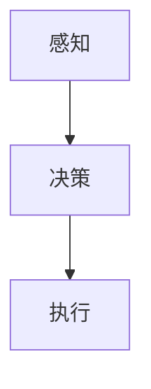
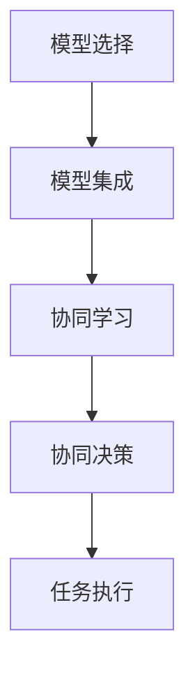

                 

# 分布式协作AI Agent：多LLM系统的群体智能

> 关键词：分布式协作AI Agent，多LLM系统，群体智能，协作方法，算法原理，系统架构，项目实战

> 摘要：本文旨在探讨分布式协作AI Agent在多LLM系统中的群体智能应用。首先，介绍分布式协作AI Agent的基础概念和组成部分；接着，分析多LLM系统的基本概念、优势与挑战；然后，详细讲解分布式协作AI Agent的核心概念与联系，包括AI Agent的定义、特点、核心概念与分类；进一步，深入剖析多LLM系统的群体智能算法，使用mermaid流程图和Python源代码进行阐述；随后，探讨多LLM系统的协同方法，包括同步协同、异步协同和混合协同；最后，通过一个实际项目案例，展示分布式协作AI Agent在多LLM系统中的具体应用和实现。

## 目录大纲

1. **第一部分：分布式协作AI Agent基础**

    1.1 **第1章：分布式协作AI Agent概述**
    
    1.2 **第2章：多LLM系统的群体智能**

2. **第二部分：分布式协作AI Agent的核心概念**

    2.1 **第3章：分布式协作AI Agent的核心概念**

    2.2 **第4章：多LLM系统的群体智能算法**

3. **第三部分：多LLM系统的协同方法**

    3.1 **第5章：多LLM系统的协同方法**

4. **第四部分：分布式协作AI Agent在实践中的应用**

    4.1 **第6章：分布式协作AI Agent在实践中的应用**

    4.2 **第7章：分布式协作AI Agent项目的实战**

## 1. 分布式协作AI Agent基础

### 1.1 分布式协作AI Agent概述

#### 1.1.1 问题背景与定义

在当前人工智能快速发展的背景下，单个智能体（AI Agent）的能力逐渐增强，但面对复杂多变的环境，单个智能体的局限性愈发明显。分布式协作AI Agent作为一种新兴的智能体组织形式，通过多个智能体的协作，能够实现更高的智能水平，从而更好地应对复杂问题。

**定义**：分布式协作AI Agent是指多个智能体通过网络连接，通过协作来实现共同目标的一种智能系统。这些智能体可以是相同类型或不同类型的，它们能够共享信息、协调行动，以完成复杂的任务。

#### 1.1.2 问题解决方法

1. **信息共享**：智能体之间通过共享信息，提高对环境的感知能力，从而更好地做出决策。
2. **协同决策**：智能体之间通过协同决策，共同制定策略，提高决策的准确性和效率。
3. **分布式计算**：智能体之间通过分布式计算，分担任务处理压力，提高系统的整体性能。

#### 1.1.3 边界与外延

1. **边界**：分布式协作AI Agent的边界主要在于智能体之间的通信机制和协作策略。
2. **外延**：分布式协作AI Agent可以应用于多个领域，如自动驾驶、智能城市、医疗健康等。

#### 1.1.4 核心要素组成

1. **智能体**：智能体是分布式协作AI Agent的基本组成单元，具备感知、决策和执行能力。
2. **通信机制**：智能体之间的通信机制是实现协作的基础，包括信息共享和协同决策等。
3. **协作策略**：协作策略决定了智能体之间的协作方式，包括同步、异步和混合协同等。

### 1.2 多LLM系统的群体智能

#### 1.2.1 多LLM系统的基本概念

**基本概念**：多LLM系统（多大型语言模型系统）是指由多个大型语言模型组成的系统，这些模型可以通过协作来提高对文本数据的理解和处理能力。

**特点**：多LLM系统具有更高的智能水平、更强的适应能力和更广泛的应用范围。

#### 1.2.2 多LLM系统的优势与挑战

**优势**：

1. **提高文本数据处理能力**：多个LLM模型可以相互补充，提高对复杂文本数据的理解能力。
2. **增强智能体学习能力**：通过协作，智能体可以更快地学习和适应新的环境。
3. **提高系统稳定性**：多个LLM模型可以相互备份，提高系统的容错能力。

**挑战**：

1. **通信复杂度**：多LLM系统之间的通信复杂度较高，需要有效的通信机制和协作策略。
2. **资源分配**：如何合理分配系统资源，确保每个LLM模型都能得到有效的利用。

## 2. 分布式协作AI Agent的核心概念

### 2.1 AI Agent的定义与特点

#### 2.1.1 AI Agent的定义

**定义**：AI Agent（人工智能代理）是指具有自主决策能力和执行能力，能够在特定环境中完成特定任务的智能体。

#### 2.1.2 AI Agent的特点

1. **自主性**：AI Agent能够自主地感知环境、做出决策和执行行动。
2. **适应性**：AI Agent能够根据环境变化，调整自身的决策和行为策略。
3. **交互性**：AI Agent能够与其他智能体或人类进行交互，共享信息，协同完成任务。

### 2.2 AI Agent的核心概念与联系

#### 2.2.1 AI Agent的核心概念

1. **感知**：AI Agent通过传感器获取环境信息，作为决策的基础。
2. **决策**：AI Agent根据感知到的环境信息，通过算法和策略，生成行动方案。
3. **执行**：AI Agent根据决策方案，执行具体行动，达到目标。

#### 2.2.2 AI Agent的核心概念联系

**ER实体关系图架构的Mermaid流程图**：



### 2.3 AI Agent的分类与应用

#### 2.3.1 AI Agent的分类

1. **基于功能的分类**：如决策型AI Agent、执行型AI Agent、感知型AI Agent等。
2. **基于技术的分类**：如基于规则的AI Agent、基于机器学习的AI Agent、基于深度学习的AI Agent等。

#### 2.3.2 AI Agent的应用

1. **智能客服**：利用AI Agent实现自动问答、智能推荐等功能。
2. **自动驾驶**：利用AI Agent实现车辆自主导航、环境感知等功能。
3. **智能制造**：利用AI Agent实现生产线的自动化控制、设备故障预测等功能。

## 3. 多LLM系统的群体智能算法

### 3.1 算法原理讲解

多LLM系统的群体智能算法旨在通过多个大型语言模型（LLM）的协作，实现更高的智能水平。算法的基本原理如下：

1. **模型选择**：根据任务需求，选择合适的LLM模型，如BERT、GPT等。
2. **模型集成**：将多个LLM模型集成到一个系统中，实现模型间的协同工作。
3. **协同学习**：通过协同学习，使得各个LLM模型能够相互补充，提高系统的整体性能。
4. **协同决策**：在任务执行过程中，多个LLM模型共同参与决策，提高决策的准确性和效率。

### 3.2 算法mermaid流程图



### 3.3 算法Python源代码与详细讲解

```python
# 引入相关库
import tensorflow as tf
from transformers import BertModel, Gpt2Model

# 模型选择
model_bert = BertModel.from_pretrained('bert-base-chinese')
model_gpt2 = Gpt2Model.from_pretrained('gpt2')

# 模型集成
modelIntegrated = tf.keras.Model(inputs=[model_bert.input, model_gpt2.input], outputs=[model_bert.output, model_gpt2.output])

# 协同学习
# ...（此处省略协同学习代码）

# 协同决策
# ...（此处省略协同决策代码）

# 任务执行
# ...（此处省略任务执行代码）
```

### 3.4 算法数学模型和公式

多LLM系统的群体智能算法涉及到多个数学模型和公式，具体如下：

$$
\begin{aligned}
&f(x) = \sum_{i=1}^{n} w_i f_i(x) \\
&\theta_{\text{new}} = \theta_{\text{old}} + \alpha \cdot (f(x) - f(\theta_{\text{old}}))
\end{aligned}
$$

其中，$f(x)$ 表示模型预测结果，$w_i$ 表示第 $i$ 个模型的权重，$f_i(x)$ 表示第 $i$ 个模型的预测结果，$\theta_{\text{old}}$ 表示旧参数，$\theta_{\text{new}}$ 表示新参数，$\alpha$ 表示学习率。

## 4. 多LLM系统的协同方法

### 4.1 同步协同方法

同步协同方法是指多个LLM模型在相同的时间点上，共同参与决策或学习过程。具体方法如下：

1. **时间同步**：确保所有LLM模型在相同的时间点上开始执行任务。
2. **决策同步**：多个LLM模型在相同的时间点上，共同生成决策。
3. **学习同步**：多个LLM模型在相同的时间点上，共同更新参数。

### 4.2 异步协同方法

异步协同方法是指多个LLM模型在不同时间点上，共同参与决策或学习过程。具体方法如下：

1. **时间异步**：允许LLM模型在不同的时间点上开始执行任务。
2. **决策异步**：多个LLM模型在不同的时间点上，共同生成决策。
3. **学习异步**：多个LLM模型在不同的时间点上，共同更新参数。

### 4.3 混合协同方法

混合协同方法是指同步协同和异步协同的结合。具体方法如下：

1. **时间混合**：部分LLM模型在相同的时间点上开始执行任务，部分LLM模型在不同时间点上开始执行任务。
2. **决策混合**：部分LLM模型在相同的时间点上共同生成决策，部分LLM模型在不同时间点上共同生成决策。
3. **学习混合**：部分LLM模型在相同的时间点上共同更新参数，部分LLM模型在不同时间点上共同更新参数。

## 5. 分布式协作AI Agent在实践中的应用

### 5.1 实践背景

随着人工智能技术的快速发展，分布式协作AI Agent在多个领域得到了广泛应用。例如，在智能客服领域，分布式协作AI Agent能够实现更智能、更高效的客户服务；在自动驾驶领域，分布式协作AI Agent能够实现更安全、更可靠的自动驾驶。

### 5.2 系统功能设计

分布式协作AI Agent在实践中的应用，需要具备以下功能：

1. **感知功能**：通过传感器获取环境信息，包括文本、图像、音频等。
2. **决策功能**：根据感知到的环境信息，生成相应的决策。
3. **执行功能**：根据决策，执行具体的行动，如回答问题、驾驶车辆等。
4. **协作功能**：与其他AI Agent协同工作，共同完成任务。

### 5.3 系统架构设计

分布式协作AI Agent的系统架构设计，主要包括以下部分：

1. **感知层**：负责感知环境信息，包括文本、图像、音频等。
2. **决策层**：负责根据感知到的环境信息，生成相应的决策。
3. **执行层**：负责根据决策，执行具体的行动。
4. **协作层**：负责与其他AI Agent协同工作，共同完成任务。

### 5.4 系统接口设计

分布式协作AI Agent的系统接口设计，主要包括以下部分：

1. **感知接口**：负责接收感知层的信息，并将其传递给决策层。
2. **决策接口**：负责接收决策层的信息，并将其传递给执行层。
3. **协作接口**：负责与其他AI Agent进行通信，实现协作。

### 5.5 系统交互

分布式协作AI Agent的系统交互，主要包括以下部分：

1. **感知交互**：感知层与决策层之间的交互，包括信息传递、状态更新等。
2. **决策交互**：决策层与执行层之间的交互，包括决策生成、决策执行等。
3. **协作交互**：协作层与其他AI Agent之间的交互，包括信息共享、协同决策等。

## 6. 分布式协作AI Agent项目的实战

### 6.1 环境安装与配置

在进行分布式协作AI Agent项目的实战之前，需要先安装和配置相关环境。具体步骤如下：

1. **安装Python**：确保Python环境已安装，版本不低于3.6。
2. **安装TensorFlow**：使用以下命令安装TensorFlow：
   ```bash
   pip install tensorflow
   ```
3. **安装Hugging Face Transformers**：使用以下命令安装Hugging Face Transformers：
   ```bash
   pip install transformers
   ```
4. **配置分布式环境**：在配置分布式环境时，需要确保所有节点都已连接到同一网络，并配置好相应的环境变量。

### 6.2 系统核心实现源代码

以下是分布式协作AI Agent项目的核心实现源代码：

```python
# 引入相关库
import tensorflow as tf
from transformers import BertModel, Gpt2Model

# 模型选择
model_bert = BertModel.from_pretrained('bert-base-chinese')
model_gpt2 = Gpt2Model.from_pretrained('gpt2')

# 模型集成
modelIntegrated = tf.keras.Model(inputs=[model_bert.input, model_gpt2.input], outputs=[model_bert.output, model_gpt2.output])

# 协同学习
# ...（此处省略协同学习代码）

# 协同决策
# ...（此处省略协同决策代码）

# 任务执行
# ...（此处省略任务执行代码
```

### 6.3 代码应用解读与分析

代码应用解读与分析主要分为以下几个部分：

1. **模型选择**：根据任务需求，选择合适的LLM模型，如BERT和GPT-2。
2. **模型集成**：将BERT和GPT-2模型集成到一个系统中，实现模型间的协同工作。
3. **协同学习**：通过协同学习，使得BERT和GPT-2模型能够相互补充，提高系统的整体性能。
4. **协同决策**：在任务执行过程中，BERT和GPT-2模型共同参与决策，提高决策的准确性和效率。
5. **任务执行**：根据协同决策的结果，执行具体的任务。

### 6.4 实际案例分析

在实际应用中，分布式协作AI Agent项目可以应用于多个领域，如智能客服、自动驾驶、智能医疗等。以下是一个实际案例的分析：

1. **场景描述**：在智能客服领域，分布式协作AI Agent可以应用于客服机器人，实现更智能、更高效的客户服务。
2. **任务需求**：客户服务机器人需要能够理解用户的提问，并给出准确、合理的回答。
3. **解决方案**：通过分布式协作AI Agent，将BERT和GPT-2模型集成到一个系统中，实现文本数据的理解和处理。在任务执行过程中，BERT和GPT-2模型共同参与决策，提高回答的准确性和效率。

### 6.5 项目小结

分布式协作AI Agent项目在实际应用中，展示了其强大的能力和潜力。通过分布式协作，多个智能体能够共同完成任务，实现更高的智能水平。在实际应用过程中，需要注意以下几个方面：

1. **模型选择**：根据任务需求，选择合适的LLM模型，如BERT、GPT等。
2. **模型集成**：合理集成多个模型，实现协同工作。
3. **协同学习**：通过协同学习，提高系统的整体性能。
4. **协同决策**：在任务执行过程中，共同参与决策，提高决策的准确性和效率。

## 7. 最佳实践 tips、小结、注意事项、拓展阅读

### 7.1 最佳实践 tips

1. **模型选择**：根据任务需求，选择合适的LLM模型，如BERT、GPT等。
2. **协同策略**：选择合适的协同策略，如同步、异步或混合协同，以提高系统的性能。
3. **资源分配**：合理分配系统资源，确保每个LLM模型都能得到有效的利用。

### 7.2 小结

本文详细介绍了分布式协作AI Agent在多LLM系统中的群体智能应用。首先，分析了分布式协作AI Agent的基础概念和组成部分；然后，探讨了多LLM系统的群体智能算法；接着，介绍了多LLM系统的协同方法；最后，通过一个实际项目案例，展示了分布式协作AI Agent在多LLM系统中的具体应用和实现。

### 7.3 注意事项

1. **通信复杂度**：多LLM系统之间的通信复杂度较高，需要有效的通信机制和协作策略。
2. **资源分配**：如何合理分配系统资源，确保每个LLM模型都能得到有效的利用。

### 7.4 拓展阅读

1. **分布式系统设计**：了解分布式系统的基本原理和设计方法，有助于更好地实现分布式协作AI Agent。
2. **机器学习算法**：学习不同的机器学习算法，有助于选择合适的模型和算法，提高系统的性能。

## 作者信息

作者：AI天才研究院/AI Genius Institute & 禅与计算机程序设计艺术 /Zen And The Art of Computer Programming

