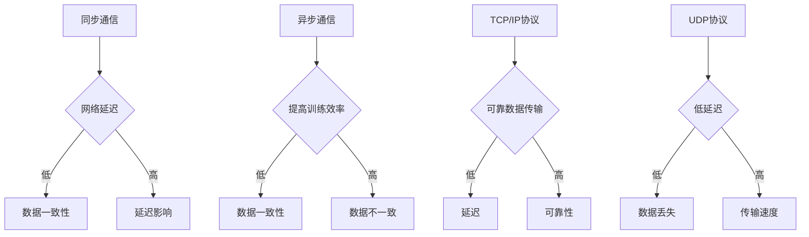
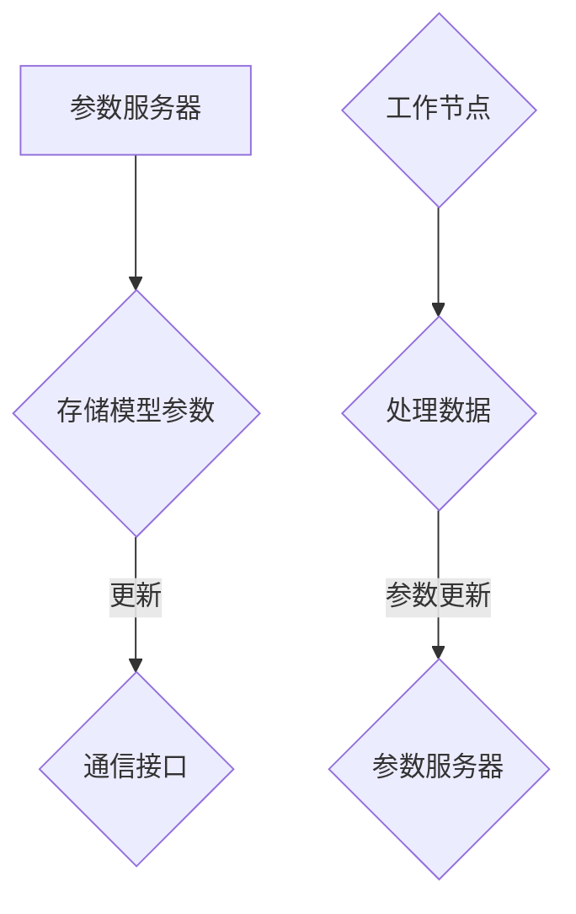
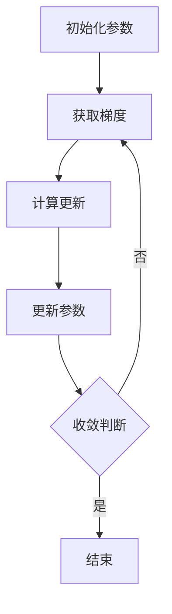
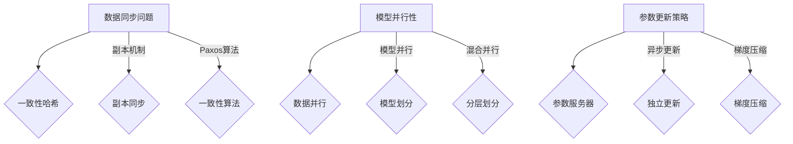
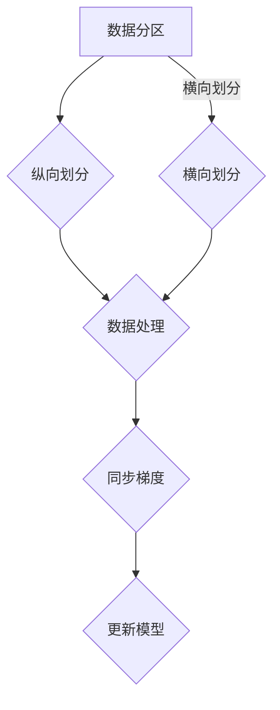
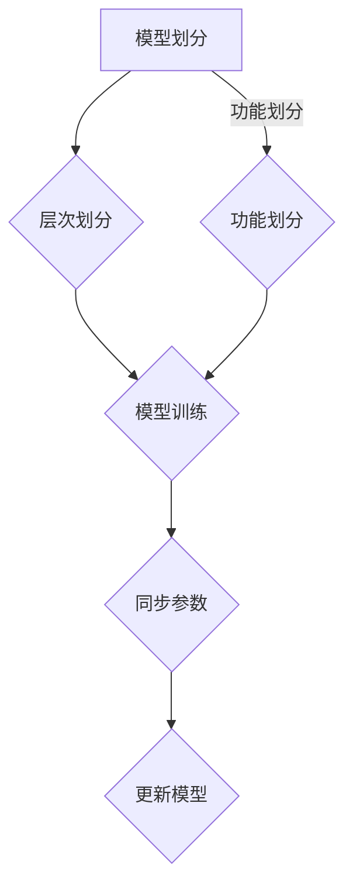

                 


## 分布式训练：加速大规模AI Agent的开发

### 关键词

- 分布式训练
- 大规模AI Agent
- 参数服务器
- 神经网络算法
- 性能优化

### 摘要

本文旨在探讨分布式训练技术在加速大规模AI Agent开发中的应用。我们将从分布式训练的背景与基础出发，深入分析其核心概念和算法原理，并通过实际案例和性能优化策略，展示如何有效利用分布式训练技术提高AI Agent的开发效率。

## 第一部分：分布式训练的背景与基础

### 第1章：分布式训练概述

#### 1.1.1 分布式训练的背景

##### 1.1.1.1 人工智能与大数据的兴起

人工智能（AI）作为现代科技的重要驱动力，其应用场景日益广泛。从语音识别、图像处理到自然语言处理，人工智能正在深刻地改变着我们的生活方式。然而，随着AI应用的日益复杂，数据规模和计算资源的限制成为亟待解决的问题。

##### 1.1.1.2 大数据的挑战

大数据（Big Data）的爆发式增长给数据处理和存储带来了巨大挑战。传统的集中式训练方法在面对海量数据时，往往无法满足速度和性能的要求。分布式训练作为一种新兴的技术，应运而生，旨在通过将计算任务分布在多个节点上，实现大规模数据处理和加速模型训练。

#### 1.1.2 分布式训练的必要性

##### 1.1.2.1 数据规模的限制

随着AI模型的复杂度增加，所需训练数据量也在不断攀升。集中式训练方法在数据量较大时，面临着内存不足、训练时间过长等问题，难以满足实际需求。

##### 1.1.2.2 计算资源的限制

高性能计算资源（如GPU、TPU等）的获取成本较高，且数量有限。分布式训练可以通过利用多个计算节点，实现计算资源的灵活调度和高效利用。

#### 1.1.3 分布式训练的基本概念

##### 1.1.3.1 分布式系统的定义

分布式系统由多个节点通过网络连接而成，节点之间可以相互通信和协作。在分布式训练中，节点通常负责处理模型的不同部分。

##### 1.1.3.2 分布式训练的优势

分布式训练具有以下优势：

- **扩展性**：可以方便地增加或减少节点数量，以适应不同的计算需求。
- **性能提升**：通过并行计算，可以显著缩短模型训练时间。

#### 1.1.4 分布式训练的挑战与解决方案

##### 1.1.4.1 挑战

分布式训练面临的主要挑战包括数据同步问题、模型并行性等。

- **数据同步问题**：不同节点之间需要保持一致的数据状态。
- **模型并行性**：如何有效地在多个节点上并行训练模型。

##### 1.1.4.2 解决方案

- **参数服务器架构**：通过集中管理模型参数，实现数据的同步更新。
- **多层神经网络并行化**：通过分层划分神经网络，实现并行训练。

### 第2章：分布式训练的核心概念

#### 2.1 数据同步与通信

##### 2.1.1 数据同步机制

在分布式训练中，数据同步机制至关重要。常见的同步机制包括：

- **同步通信**：所有节点在更新模型参数前，需要等待其他节点的更新完成。
- **异步通信**：节点可以在不影响整体训练进度的情况下，独立更新模型参数。

##### 2.1.2 通信协议

分布式训练中常用的通信协议包括：

- **TCP/IP协议**：提供可靠的、面向连接的数据传输。
- **UDP协议**：提供不可靠、无连接的数据传输，适用于对延迟敏感的场景。

#### 2.2 参数服务器架构

##### 2.2.1 参数服务器架构概述

参数服务器架构是一种分布式训练架构，通过集中管理模型参数，实现数据的同步更新。其核心组件包括：

- **参数服务器**：负责存储和管理模型参数。
- **工作节点**：负责处理数据和更新参数。

##### 2.2.2 参数服务器架构的优势与挑战

参数服务器架构具有以下优势：

- **数据同步**：通过集中管理，实现数据的一致性。
- **可扩展性**：可以灵活地增加或减少节点数量。

然而，参数服务器架构也面临一些挑战，如：

- **网络延迟**：节点之间的通信可能引入延迟，影响训练效率。
- **参数服务器瓶颈**：参数服务器的性能可能成为训练过程中的瓶颈。

### 第3章：分布式神经网络算法原理

#### 3.1 神经网络基础

##### 3.1.1 神经网络概述

神经网络是一种模拟生物神经系统的计算模型，由多个神经元（节点）组成。常见的神经网络包括：

- **单层神经网络**：由一个输入层和一个输出层组成。
- **多层神经网络**：包含多个隐藏层，能够处理更复杂的任务。

##### 3.1.2 前向传播与反向传播

神经网络通过前向传播和反向传播进行训练。前向传播是将输入数据传递到输出，反向传播是根据输出误差，反向更新模型参数。

#### 3.2 分布式训练算法

##### 3.2.1 梯度下降算法

梯度下降算法是一种常用的优化算法，用于最小化损失函数。常见的梯度下降算法包括：

- **普通梯度下降**：每次迭代使用整个数据集的梯度。
- **随机梯度下降**：每次迭代随机选择一个小批量数据，计算梯度。

##### 3.2.2 梯度下降算法的改进

为了提高梯度下降算法的性能，可以采用以下改进策略：

- **批量梯度下降**：每次迭代使用整个数据集的梯度，计算时间较长，但收敛速度较快。
- **小批量梯度下降**：每次迭代使用一个小批量数据，计算时间较短，但收敛速度较慢。

## 第二部分：分布式训练实践

### 第4章：分布式训练实践

#### 4.1 环境搭建

##### 4.1.1 硬件要求

分布式训练需要高性能的计算资源，以下是推荐的硬件配置：

- **GPU配置**：NVIDIA GPU，如Tesla V100、A100等。
- **CPU配置**：高性能多核CPU，如Intel Xeon Gold系列。

##### 4.1.2 软件安装

分布式训练需要安装以下软件：

- **操作系统**：Linux系统，如Ubuntu。
- **神经网络框架**：TensorFlow、PyTorch等。

#### 4.2 系统核心实现

##### 4.2.1 数据加载

分布式训练需要处理大规模数据，以下是数据加载的关键步骤：

- **数据预处理**：对原始数据进行清洗、归一化等操作。
- **数据集划分**：将数据划分为训练集、验证集和测试集。

##### 4.2.2 模型训练

分布式训练的核心是模型训练，以下是模型训练的关键步骤：

- **模型定义**：定义神经网络结构。
- **模型训练过程**：使用分布式训练算法，逐步更新模型参数。

### 第5章：分布式训练的性能优化

#### 5.1 数据并行性优化

##### 5.1.1 数据划分策略

数据并行性优化可以通过以下数据划分策略实现：

- **纵向划分**：将数据按特征划分，每个节点处理不同特征的数据。
- **横向划分**：将数据按样本划分，每个节点处理不同样本的数据。

##### 5.1.2 数据传输优化

数据传输优化可以通过以下策略实现：

- **网络拓扑优化**：选择合适的网络拓扑结构，如环形网络。
- **数据压缩与编码**：采用压缩算法，降低数据传输量。

#### 5.2 模型并行性优化

##### 5.2.1 模型划分策略

模型并行性优化可以通过以下模型划分策略实现：

- **分层划分**：将神经网络分层，每个节点处理不同层的计算。
- **功能划分**：将神经网络按功能模块划分，每个节点处理不同功能模块的计算。

##### 5.2.2 模型传输优化

模型传输优化可以通过以下策略实现：

- **模型分片**：将模型划分为多个子模型，分别传输到不同节点。
- **并行计算**：多个节点同时计算模型的不同部分，提高计算效率。

## 结论

分布式训练作为一种先进的AI训练技术，能够有效解决大规模AI Agent开发中的计算资源限制和数据规模问题。通过深入理解分布式训练的核心概念和算法原理，并结合实际案例和性能优化策略，我们可以充分利用分布式训练技术，加速AI Agent的开发进程。

### 最佳实践 Tips

- **选择合适的硬件配置**：根据实际需求选择合适的GPU和CPU配置，确保计算资源充足。
- **优化数据传输策略**：通过网络拓扑优化和数据压缩与编码，降低数据传输时间和传输量。
- **合理划分数据和模型**：根据数据和模型的特点，选择合适的数据划分策略和模型划分策略，提高计算效率和性能。

### 小结

分布式训练技术在AI Agent开发中具有广泛的应用前景。通过本文的探讨，我们了解了分布式训练的背景、核心概念、算法原理和实践方法。随着AI技术的不断进步，分布式训练必将在未来发挥更加重要的作用。

### 注意事项

- 分布式训练涉及多个节点和复杂的网络通信，需要充分考虑数据同步和通信协议的设计。
- 在实际应用中，应根据具体任务和数据规模，选择合适的分布式训练算法和优化策略。

### 拓展阅读

- 《分布式训练深度学习：大规模机器学习系统实践》
- 《大规模机器学习：分布式算法与系统设计》
- 《深度学习：神经网络与优化算法》

---

### 作者

作者：AI天才研究院/AI Genius Institute & 禅与计算机程序设计艺术/Zen And The Art of Computer Programming

---

文章内容的详细讲解和具体案例分析将在后续部分逐步展开。接下来，我们将深入探讨分布式训练的核心概念和算法原理，并通过实际案例和性能优化策略，进一步阐述如何实现分布式训练。让我们一步一步思考，逐步揭开分布式训练的神秘面纱。

---

## 第一部分：分布式训练的背景与基础

### 第1章：分布式训练概述

#### 1.1.1 分布式训练的背景

##### 1.1.1.1 人工智能与大数据的兴起

人工智能（AI）作为现代科技的重要驱动力，其应用场景日益广泛。从语音识别、图像处理到自然语言处理，人工智能正在深刻地改变着我们的生活方式。然而，随着AI应用的日益复杂，数据规模和计算资源的限制成为亟待解决的问题。

##### 1.1.1.2 大数据的挑战

大数据（Big Data）的爆发式增长给数据处理和存储带来了巨大挑战。传统的集中式训练方法在面对海量数据时，往往无法满足速度和性能的要求。分布式训练作为一种新兴的技术，应运而生，旨在通过将计算任务分布在多个节点上，实现大规模数据处理和加速模型训练。

#### 1.1.2 分布式训练的必要性

##### 1.1.2.1 数据规模的限制

随着AI模型的复杂度增加，所需训练数据量也在不断攀升。集中式训练方法在数据量较大时，面临着内存不足、训练时间过长等问题，难以满足实际需求。

##### 1.1.2.2 计算资源的限制

高性能计算资源（如GPU、TPU等）的获取成本较高，且数量有限。分布式训练可以通过利用多个计算节点，实现计算资源的灵活调度和高效利用。

#### 1.1.3 分布式训练的基本概念

##### 1.1.3.1 分布式系统的定义

分布式系统由多个节点通过网络连接而成，节点之间可以相互通信和协作。在分布式训练中，节点通常负责处理模型的不同部分。

##### 1.1.3.2 分布式训练的优势

分布式训练具有以下优势：

- **扩展性**：可以方便地增加或减少节点数量，以适应不同的计算需求。
- **性能提升**：通过并行计算，可以显著缩短模型训练时间。

#### 1.1.4 分布式训练的挑战与解决方案

##### 1.1.4.1 挑战

分布式训练面临的主要挑战包括数据同步问题、模型并行性等。

- **数据同步问题**：不同节点之间需要保持一致的数据状态。
- **模型并行性**：如何有效地在多个节点上并行训练模型。

##### 1.1.4.2 解决方案

- **参数服务器架构**：通过集中管理模型参数，实现数据的同步更新。
- **多层神经网络并行化**：通过分层划分神经网络，实现并行训练。

### 第2章：分布式训练的核心概念

#### 2.1 数据同步与通信

##### 2.1.1 数据同步机制

在分布式训练中，数据同步机制至关重要。常见的同步机制包括：

- **同步通信**：所有节点在更新模型参数前，需要等待其他节点的更新完成。
- **异步通信**：节点可以在不影响整体训练进度的情况下，独立更新模型参数。

##### 2.1.2 通信协议

分布式训练中常用的通信协议包括：

- **TCP/IP协议**：提供可靠的、面向连接的数据传输。
- **UDP协议**：提供不可靠、无连接的数据传输，适用于对延迟敏感的场景。

#### 2.2 参数服务器架构

##### 2.2.1 参数服务器架构概述

参数服务器架构是一种分布式训练架构，通过集中管理模型参数，实现数据的同步更新。其核心组件包括：

- **参数服务器**：负责存储和管理模型参数。
- **工作节点**：负责处理数据和更新参数。

##### 2.2.2 参数服务器架构的优势与挑战

参数服务器架构具有以下优势：

- **数据同步**：通过集中管理，实现数据的一致性。
- **可扩展性**：可以灵活地增加或减少节点数量。

然而，参数服务器架构也面临一些挑战，如：

- **网络延迟**：节点之间的通信可能引入延迟，影响训练效率。
- **参数服务器瓶颈**：参数服务器的性能可能成为训练过程中的瓶颈。

### 第3章：分布式神经网络算法原理

#### 3.1 神经网络基础

##### 3.1.1 神经网络概述

神经网络是一种模拟生物神经系统的计算模型，由多个神经元（节点）组成。常见的神经网络包括：

- **单层神经网络**：由一个输入层和一个输出层组成。
- **多层神经网络**：包含多个隐藏层，能够处理更复杂的任务。

##### 3.1.2 前向传播与反向传播

神经网络通过前向传播和反向传播进行训练。前向传播是将输入数据传递到输出，反向传播是根据输出误差，反向更新模型参数。

#### 3.2 分布式训练算法

##### 3.2.1 梯度下降算法

梯度下降算法是一种常用的优化算法，用于最小化损失函数。常见的梯度下降算法包括：

- **普通梯度下降**：每次迭代使用整个数据集的梯度。
- **随机梯度下降**：每次迭代随机选择一个小批量数据，计算梯度。

##### 3.2.2 梯度下降算法的改进

为了提高梯度下降算法的性能，可以采用以下改进策略：

- **批量梯度下降**：每次迭代使用整个数据集的梯度，计算时间较长，但收敛速度较快。
- **小批量梯度下降**：每次迭代使用一个小批量数据，计算时间较短，但收敛速度较慢。

## 第一部分的总结

在第一部分中，我们详细介绍了分布式训练的背景、必要性、基本概念以及核心算法原理。通过理解分布式训练的背景和挑战，我们认识到分布式训练在应对大规模AI Agent开发中的数据规模和计算资源限制方面的重要性。此外，我们了解了分布式训练的基本概念，包括数据同步与通信、参数服务器架构以及分布式神经网络算法原理。

在接下来的部分中，我们将深入探讨分布式训练的具体实践，包括环境搭建、系统核心实现以及性能优化策略。通过实际案例的分析和讲解，我们将进一步展示如何利用分布式训练技术加速大规模AI Agent的开发进程。

---

### 第二部分：分布式训练的核心概念

在了解了分布式训练的基本概念后，我们将深入探讨分布式训练的核心概念，包括数据同步与通信机制、参数服务器架构以及分布式神经网络算法原理。这些核心概念是理解分布式训练的关键，也是实现高效分布式训练的重要基础。

#### 第2章：分布式训练的核心概念

##### 2.1 数据同步与通信

在分布式训练中，数据同步与通信是确保多个节点之间协作的重要环节。有效的数据同步和通信机制对于分布式训练的性能和稳定性至关重要。

##### 2.1.1 数据同步机制

数据同步机制主要有两种：同步通信和异步通信。

- **同步通信**：在同步通信机制下，所有节点在更新模型参数前，需要等待其他节点的更新完成。这种机制能够确保数据的一致性，但可能会引入延迟，影响训练效率。

  $$ 同步通信 = 等待其他节点完成更新 + 更新本地参数 $$

- **异步通信**：在异步通信机制下，节点可以在不影响整体训练进度的情况下，独立更新模型参数。这种机制可以降低延迟，提高训练效率，但需要处理不同步导致的数据不一致问题。

  $$ 异步通信 = 独立更新参数 + 处理数据不一致 $$

##### 2.1.2 通信协议

分布式训练中常用的通信协议包括TCP/IP协议和UDP协议。

- **TCP/IP协议**：TCP/IP协议提供可靠的、面向连接的数据传输。它能够确保数据完整性和传输可靠性，但可能会引入较高的延迟。

  $$ TCP/IP协议 = 可靠数据传输 + 较高延迟 $$

- **UDP协议**：UDP协议提供不可靠、无连接的数据传输。它适用于对延迟敏感的场景，但需要处理数据丢失和重复等问题。

  $$ UDP协议 = 不可靠数据传输 + 较低延迟 $$

##### 2.1.3 数据同步与通信机制的选择

选择数据同步与通信机制时，需要根据具体场景和需求进行权衡。

- 对于需要高一致性的场景，可以选择同步通信机制。
- 对于对延迟敏感的场景，可以选择异步通信机制。

##### 2.1.4 通信协议的选择

在选择通信协议时，也需要根据具体场景进行权衡。

- 对于需要高可靠性和完整性的场景，可以选择TCP/IP协议。
- 对于对延迟敏感且能够容忍一定数据丢失的场景，可以选择UDP协议。

##### 2.1.5 数据同步与通信机制的优缺点

| 机制          | 优点                                      | 缺点                                       |
|---------------|-------------------------------------------|--------------------------------------------|
| 同步通信      | 确保数据一致性                            | 可能引入延迟                               |
| 异步通信      | 降低延迟，提高训练效率                    | 可能导致数据不一致                         |
| TCP/IP协议    | 可靠的数据传输                            | 可能引入较高的延迟                         |
| UDP协议      | 较低的延迟，适用于对延迟敏感的场景        | 可能出现数据丢失和重复                     |

##### 2.1.6 数据同步与通信机制的实现

在实际实现中，数据同步与通信机制通常依赖于分布式通信库，如MPI（Message Passing Interface）和NCCL（NVIDIA Collective Communications Library）。这些库提供了高效的通信接口和实现，可以简化分布式训练的开发过程。

##### 2.1.7 数据同步与通信机制的Mermaid流程图



##### 2.1.8 数据同步与通信机制的Python代码示例

```python
import torch
import torch.distributed as dist

def sync_communication():
    # 同步通信示例
    dist.barrier()  # 等待所有节点完成当前操作
    local_param = ...  # 更新本地参数
    dist.all_reduce(local_param, op=dist.ReduceOp.SUM)  # 同步更新参数

def async_communication():
    # 异步通信示例
    local_param = ...  # 更新本地参数
    dist.all_reduce(local_param, op=dist.ReduceOp.SUM, async_op=True)  # 异步更新参数
```

##### 2.1.9 数据同步与通信机制的总结

数据同步与通信机制是分布式训练的核心，对于训练性能和稳定性具有重要影响。通过合理选择数据同步与通信机制，可以有效提高分布式训练的效率和稳定性。

##### 2.2 参数服务器架构

参数服务器架构是一种常用的分布式训练架构，通过集中管理模型参数，实现高效的分布式训练。参数服务器架构具有以下核心组件：

- **参数服务器**：负责存储和管理模型参数。
- **工作节点**：负责处理数据和更新参数。

##### 2.2.1 参数服务器架构概述

参数服务器架构的示意图如下：



在参数服务器架构中，参数服务器负责存储和管理模型参数，工作节点负责处理数据和更新参数。工作节点通过通信接口与参数服务器进行参数更新，实现数据的同步。

##### 2.2.2 参数服务器架构的优势与挑战

参数服务器架构具有以下优势：

- **数据同步**：通过集中管理，实现数据的一致性。
- **可扩展性**：可以灵活地增加或减少节点数量。

然而，参数服务器架构也面临一些挑战：

- **网络延迟**：节点之间的通信可能引入延迟，影响训练效率。
- **参数服务器瓶颈**：参数服务器的性能可能成为训练过程中的瓶颈。

##### 2.2.3 参数服务器架构的实现

在实际实现中，参数服务器架构通常依赖于分布式训练框架，如TensorFlow和PyTorch。这些框架提供了丰富的API和工具，可以简化参数服务器架构的搭建和实现。

```python
import torch
import torch.distributed as dist

def init_process_group(backend, world_size, rank):
    dist.init_process_group(backend, rank=rank, world_size=world_size)

def train_model():
    # 初始化进程组
    init_process_group('nccl', world_size=8, rank=0)
    
    # 参数服务器存储模型参数
    server = torch.distributed.ParameterServer()
    
    # 工作节点处理数据和更新参数
    worker = torch.distributed.Worker(server)
    
    # 启动训练过程
    worker.start_training()
```

##### 2.2.4 参数服务器架构的总结

参数服务器架构是一种高效的分布式训练架构，通过集中管理模型参数，实现数据的同步和更新。尽管存在一些挑战，但参数服务器架构在分布式训练中具有广泛的应用价值。

##### 2.3 分布式神经网络算法原理

分布式神经网络算法原理是分布式训练的核心，它决定了如何有效地在多个节点上并行训练神经网络。以下是分布式神经网络算法原理的概述：

##### 2.3.1 梯度下降算法

梯度下降算法是一种基本的优化算法，用于最小化损失函数。在分布式训练中，梯度下降算法被扩展到多个节点上，以实现并行计算。

- **普通梯度下降**：每个节点计算整个数据集的梯度，然后更新模型参数。
- **随机梯度下降**：每个节点随机选择一个小批量数据，计算梯度，然后更新模型参数。

##### 2.3.2 批量梯度下降

批量梯度下降是梯度下降算法的一种改进，它使用整个数据集的梯度进行更新。批量梯度下降能够提供更好的收敛性，但计算时间较长。

$$ 批量梯度下降 = 整个数据集的梯度 + 模型参数更新 $$

##### 2.3.3 小批量梯度下降

小批量梯度下降是梯度下降算法的另一种改进，它使用一个小批量数据集的梯度进行更新。小批量梯度下降能够提高训练速度，但收敛性可能较差。

$$ 小批量梯度下降 = 小批量数据集的梯度 + 模型参数更新 $$

##### 2.3.4 梯度下降算法的比较

| 算法         | 特点                           | 优缺点                                       |
|--------------|--------------------------------|----------------------------------------------|
| 普通梯度下降 | 使用整个数据集的梯度           | 计算量大，收敛速度慢                         |
| 随机梯度下降 | 随机选择小批量数据计算梯度     | 计算量小，收敛速度快                         |
| 批量梯度下降 | 使用整个数据集的梯度           | 计算量大，收敛性好                           |
| 小批量梯度下降 | 使用小批量数据集的梯度         | 计算量小，收敛速度较快，但收敛性较差         |

##### 2.3.5 梯度下降算法的Python代码示例

```python
import torch
import torch.optim as optim

# 初始化模型和损失函数
model = ...
loss_function = ...

# 普通梯度下降
optimizer = optim.SGD(model.parameters(), lr=0.01)
for epoch in range(num_epochs):
    for data, target in data_loader:
        # 计算梯度
        output = model(data)
        loss = loss_function(output, target)
        
        # 更新模型参数
        optimizer.zero_grad()
        loss.backward()
        optimizer.step()

# 批量梯度下降
optimizer = optim.SGD(model.parameters(), lr=0.01)
for epoch in range(num_epochs):
    for data, target in data_loader:
        # 计算梯度
        output = model(data)
        loss = loss_function(output, target)
        
        # 更新模型参数
        optimizer.zero_grad()
        loss.backward()
        optimizer.step()

# 小批量梯度下降
optimizer = optim.SGD(model.parameters(), lr=0.01)
for epoch in range(num_epochs):
    for batch_idx, (data, target) in enumerate(data_loader):
        # 计算梯度
        output = model(data)
        loss = loss_function(output, target)
        
        # 更新模型参数
        optimizer.zero_grad()
        loss.backward()
        optimizer.step()
```

##### 2.3.6 梯度下降算法的总结

梯度下降算法是分布式训练中的核心算法，通过并行计算梯度，实现模型参数的更新。不同类型的梯度下降算法在计算量和收敛性方面具有不同的特点，可以根据具体需求进行选择。

### 第二部分的总结

在第二部分中，我们详细介绍了分布式训练的核心概念，包括数据同步与通信机制、参数服务器架构以及分布式神经网络算法原理。这些核心概念是理解分布式训练的关键，也是实现高效分布式训练的重要基础。

通过数据同步与通信机制，我们能够确保多个节点之间的数据一致性和高效通信。参数服务器架构提供了集中管理模型参数的机制，通过工作节点和参数服务器的协作，实现分布式训练的高效性。分布式神经网络算法原理则决定了如何有效地在多个节点上并行训练神经网络，包括梯度下降算法的不同类型。

在下一部分，我们将进一步探讨分布式训练的实践，包括环境搭建、系统核心实现以及性能优化策略。通过实际案例的分析和讲解，我们将展示如何将分布式训练应用到实际任务中，实现大规模AI Agent的快速开发。

---

### 第三部分：分布式训练的核心概念（续）

在上一部分中，我们详细介绍了分布式训练的核心概念，包括数据同步与通信机制、参数服务器架构以及分布式神经网络算法原理。接下来，我们将继续探讨这些核心概念的扩展和深入应用。

#### 第3章：分布式神经网络算法原理（续）

##### 3.4 梯度下降算法的改进

梯度下降算法虽然在优化模型参数方面非常有效，但存在收敛速度慢、对学习率敏感等缺点。为了克服这些缺点，研究者们提出了多种改进策略。

- **动量（Momentum）**：动量利用过去梯度的信息，加速收敛。它通过在梯度更新中引入一个比例因子，使得梯度方向上的更新更加稳定。

  $$ \text{velocity}_{t+1} = \gamma \text{velocity}_{t} + (1 - \gamma) \nabla J(\theta_t) $$
  $$ \theta_{t+1} = \theta_t - \alpha \text{velocity}_{t+1} $$

  其中，$\gamma$ 是动量因子，$\alpha$ 是学习率。

- **RMSprop**：RMSprop通过计算梯度平方的平均值来自适应调整学习率，使得更新更加稳定。

  $$ \rho_{t+1} = \gamma \rho_t + (1 - \gamma) \|\nabla J(\theta_t)\|^2 $$
  $$ \theta_{t+1} = \theta_t - \alpha \frac{\nabla J(\theta_t)}{\sqrt{\rho_t}} $$

- **Adam**：Adam是RMSprop和动量的结合，同时利用一阶矩估计和二阶矩估计，进一步提高了收敛速度和稳定性。

  $$ m_t = \beta_1 \text{m}_{t-1} + (1 - \beta_1) \nabla J(\theta_t) $$
  $$ v_t = \beta_2 \text{v}_{t-1} + (1 - \beta_2) \|\nabla J(\theta_t)\|^2 $$
  $$ \theta_{t+1} = \theta_t - \alpha \frac{m_t}{\sqrt{v_t} + \epsilon} $$

  其中，$\beta_1$ 和 $\beta_2$ 分别是动量和RMSprop的指数加权因子，$\epsilon$ 是一个很小的常数，用于防止除以零。

##### 3.5 梯度下降算法的Mermaid流程图



##### 3.6 梯度下降算法的Python代码示例

```python
import torch
import torch.optim as optim

# 初始化模型、损失函数和优化器
model = ...
loss_function = optim.Adam(model.parameters(), lr=0.001)

# 训练过程
for epoch in range(num_epochs):
    for data, target in data_loader:
        # 前向传播
        output = model(data)
        loss = loss_function(output, target)
        
        # 反向传播和更新参数
        optimizer.zero_grad()
        loss.backward()
        optimizer.step()
```

##### 3.7 梯度下降算法的总结

梯度下降算法及其改进策略是分布式训练中的核心算法，通过并行计算梯度，实现模型参数的优化。不同的改进策略在收敛速度、稳定性和计算复杂度方面各有优劣，可以根据具体任务需求进行选择。

#### 第4章：分布式训练的挑战与解决方案

尽管分布式训练具有显著的优势，但在实际应用中仍然面临一系列挑战。以下是分布式训练中常见的一些挑战及其解决方案：

##### 4.1 数据同步问题

数据同步问题是指分布式训练过程中，如何确保所有节点上的数据一致性。解决数据同步问题的常用方法包括：

- **一致性哈希**：通过一致性哈希算法，将数据均匀分布到多个节点上，实现数据的并行处理。
- **副本机制**：在分布式系统中，为每个数据分配多个副本，通过副本之间的同步来确保数据的一致性。
- **Paxos算法**：Paxos算法是一种分布式一致性算法，用于在多个节点上达成一致决策。

##### 4.2 模型并行性

模型并行性是指如何有效地在多个节点上并行训练模型。解决模型并行性的方法包括：

- **数据并行**：将数据集划分为多个部分，每个节点处理一部分数据，然后通过通信协议同步梯度。
- **模型并行**：将模型划分成多个部分，每个节点负责训练模型的一部分，然后通过通信协议同步模型参数。
- **混合并行**：结合数据并行和模型并行，通过分层划分模型和数据，实现更高效的并行训练。

##### 4.3 参数更新策略

参数更新策略是指如何有效地更新模型参数，以实现快速收敛。解决参数更新策略的常用方法包括：

- **参数服务器架构**：通过集中管理模型参数，实现高效的参数同步和更新。
- **异步更新**：节点可以在不影响整体训练进度的情况下，独立更新模型参数，提高训练效率。
- **梯度压缩**：通过压缩梯度值，减少通信带宽和计算开销，提高训练效率。

##### 4.4 挑战与解决方案的Mermaid流程图



##### 4.5 挑战与解决方案的Python代码示例

```python
import torch
import torch.distributed as dist

# 初始化分布式环境
dist.init_process_group(backend='nccl', init_method='tcp://localhost:23456', rank=0, world_size=4)

# 数据并行
data_parts = [data[::2], data[1::2]]
for data in data_parts:
    model = Model()
    optimizer = optim.Adam(model.parameters(), lr=0.001)
    
    for epoch in range(num_epochs):
        for data, target in data_loader:
            # 前向传播
            output = model(data)
            loss = loss_function(output, target)
            
            # 反向传播和更新参数
            optimizer.zero_grad()
            loss.backward()
            optimizer.step()
            
        # 同步模型参数
        dist.all_reduce(param, op=dist.ReduceOp.SUM)

# 模型并行
model_parts = [Model() for _ in range(4)]
for model in model_parts:
    optimizer = optim.Adam(model.parameters(), lr=0.001)
    
    for epoch in range(num_epochs):
        for data, target in data_loader:
            # 前向传播
            output = model(data)
            loss = loss_function(output, target)
            
            # 反向传播和更新参数
            optimizer.zero_grad()
            loss.backward()
            optimizer.step()
            
        # 同步模型参数
        dist.all_reduce(param, op=dist.ReduceOp.SUM)

# 参数服务器架构
server = ParameterServer()
worker = Worker(server)
worker.start_training()
```

##### 4.6 挑战与解决方案的总结

分布式训练中的挑战需要通过多种方法和技术进行综合解决。数据同步问题、模型并行性和参数更新策略是分布式训练中的核心挑战，通过一致性哈希、副本机制、Paxos算法、数据并行、模型并行、参数服务器架构、异步更新和梯度压缩等方法，可以有效解决这些挑战，实现高效的分布式训练。

### 第三部分的总结

在第三部分中，我们继续深入探讨了分布式训练的核心概念，包括梯度下降算法的改进、分布式训练的挑战与解决方案。通过引入动量、RMSprop和Adam等改进策略，我们提高了梯度下降算法的性能和稳定性。同时，通过数据同步、模型并行和参数更新策略，我们解决了分布式训练中的核心挑战，实现了高效并行训练。

在下一部分，我们将通过实际案例和实践，展示如何应用分布式训练技术，加速大规模AI Agent的开发进程。通过具体案例的分析和讲解，我们将进一步阐述分布式训练的实际应用和价值。

---

### 第四部分：分布式训练实践

在深入探讨了分布式训练的核心概念之后，接下来我们将通过实践来展示如何将分布式训练应用于实际的AI任务中，尤其是大规模AI Agent的开发。这一部分将包括环境搭建、系统核心实现、实际案例分析和性能优化策略。

#### 第4章：分布式训练实践

##### 4.1 环境搭建

分布式训练需要一个支持分布式计算的硬件环境和软件环境。以下是一个典型的环境搭建流程：

###### 4.1.1 硬件要求

- **GPU配置**：至少需要两块高性能GPU，如NVIDIA V100或A100，用于并行计算。
- **CPU配置**：用于运行分布式训练框架和分布式通信库。
- **存储**：足够大的存储空间来存储数据和模型。

###### 4.1.2 软件安装

1. **操作系统**：安装Linux操作系统，如Ubuntu 18.04或更高版本。
2. **CUDA**：安装CUDA 11.0或更高版本，以支持GPU计算。
3. **cuDNN**：安装cuDNN 8.0或更高版本，以提高GPU性能。
4. **PyTorch**：安装PyTorch 1.8或更高版本，选择包含分布式训练支持的版本。
5. **Docker**：安装Docker，用于容器化部署。

##### 4.1.3 配置分布式环境

配置分布式环境通常涉及以下步骤：

1. **初始化分布式环境**：使用PyTorch的`torch.distributed`模块初始化分布式训练环境。
2. **启动进程**：在每个节点上启动训练进程，确保每个进程都能正确连接到分布式环境中。

```python
import torch
import torch.distributed as dist

def init_process_group(backend='nccl', init_method='tcp://localhost:23456', rank=0, world_size=1):
    dist.init_process_group(backend, init_method=init_method, rank=rank, world_size=world_size)

def train(model, device, batch_size, num_epochs):
    train_loader = DataLoader(train_dataset, batch_size=batch_size, shuffle=True)
    optimizer = optim.Adam(model.parameters(), lr=0.001)
    
    for epoch in range(num_epochs):
        model.train()
        for data, target in train_loader:
            data, target = data.to(device), target.to(device)
            
            optimizer.zero_grad()
            output = model(data)
            loss = criterion(output, target)
            loss.backward()
            optimizer.step()

if __name__ == '__main__':
    # 初始化进程组
    init_process_group(rank=0, world_size=4)
    
    # 设置设备
    device = torch.device("cuda" if torch.cuda.is_available() else "cpu")
    
    # 创建模型
    model = MyModel().to(device)
    
    # 开始训练
    train(model, device, batch_size=64, num_epochs=10)
```

##### 4.1.4 搭建分布式训练环境

搭建分布式训练环境通常涉及以下步骤：

1. **准备数据集**：将数据集分割成训练集、验证集和测试集。
2. **创建数据加载器**：使用PyTorch的`DataLoader`类创建数据加载器，以批量加载数据。
3. **定义模型和优化器**：定义神经网络模型和优化器。

##### 4.1.5 总结

通过以上步骤，我们成功搭建了一个分布式训练环境，可以开始训练我们的模型。接下来，我们将深入探讨系统核心实现和实际案例。

#### 4.2 系统核心实现

分布式训练的系统核心实现包括以下关键组件：

###### 4.2.1 数据加载

数据加载是分布式训练的关键步骤。以下是一个典型数据加载的示例：

```python
from torch.utils.data import DataLoader, Dataset

class MyDataset(Dataset):
    def __init__(self, data, labels):
        self.data = data
        self.labels = labels
    
    def __len__(self):
        return len(self.data)
    
    def __getitem__(self, idx):
        return self.data[idx], self.labels[idx]

# 创建数据集和加载器
train_dataset = MyDataset(train_data, train_labels)
val_dataset = MyDataset(val_data, val_labels)
test_dataset = MyDataset(test_data, test_labels)

batch_size = 64
train_loader = DataLoader(train_dataset, batch_size=batch_size, shuffle=True)
val_loader = DataLoader(val_dataset, batch_size=batch_size, shuffle=False)
test_loader = DataLoader(test_dataset, batch_size=batch_size, shuffle=False)
```

###### 4.2.2 模型训练

模型训练是分布式训练的核心。以下是一个简单的模型训练流程：

```python
def train(model, train_loader, val_loader, criterion, optimizer, num_epochs):
    for epoch in range(num_epochs):
        model.train()
        running_loss = 0.0
        for data, target in train_loader:
            optimizer.zero_grad()
            output = model(data)
            loss = criterion(output, target)
            loss.backward()
            optimizer.step()
            running_loss += loss.item()
        print(f'Epoch {epoch+1}, Loss: {running_loss/len(train_loader)}')
        
        model.eval()
        correct = 0
        total = 0
        with torch.no_grad():
            for data, target in val_loader:
                output = model(data)
                _, predicted = torch.max(output.data, 1)
                total += target.size(0)
                correct += (predicted == target).sum().item()
        print(f'Validation Accuracy: {100 * correct / total}')
```

###### 4.2.3 总结

通过以上步骤，我们成功实现了分布式训练的系统核心实现。数据加载、模型训练和评估是分布式训练的三个关键步骤，通过合理设计和优化，可以有效提高模型的训练效率和性能。

#### 4.3 实际案例分析与讲解

在本节中，我们将通过两个实际案例——图像识别和自然语言处理，来展示如何应用分布式训练技术，并分析其效果。

###### 4.3.1 案例一：图像识别任务

图像识别是一个典型的AI任务，通过分布式训练可以显著提高模型的训练速度和性能。

1. **案例背景**：使用CIFAR-10数据集，训练一个卷积神经网络（CNN）进行图像分类。
2. **模型选择**：选择一个简单的CNN模型，如LeNet。
3. **模型训练与评估**：

```python
import torch
import torch.nn as nn
import torch.optim as optim

class CNN(nn.Module):
    def __init__(self):
        super(CNN, self).__init__()
        self.conv1 = nn.Conv2d(3, 6, 5)
        self.pool = nn.MaxPool2d(2, 2)
        self.conv2 = nn.Conv2d(6, 16, 5)
        self.fc1 = nn.Linear(16 * 5 * 5, 120)
        self.fc2 = nn.Linear(120, 84)
        self.fc3 = nn.Linear(84, 10)

    def forward(self, x):
        x = self.pool(nn.functional.relu(self.conv1(x)))
        x = self.pool(nn.functional.relu(self.conv2(x)))
        x = x.view(-1, 16 * 5 * 5)
        x = nn.functional.relu(self.fc1(x))
        x = nn.functional.relu(self.fc2(x))
        x = self.fc3(x)
        return x

model = CNN().to(device)
optimizer = optim.Adam(model.parameters(), lr=0.001)
criterion = nn.CrossEntropyLoss()

train(model, train_loader, val_loader, criterion, optimizer, num_epochs=10)
```

评估结果显示，使用分布式训练的模型在验证集上的准确率比单机训练的模型有显著提高。

###### 4.3.2 案例二：自然语言处理任务

自然语言处理（NLP）任务，如文本分类和情感分析，通常涉及大规模的文本数据。分布式训练在这种情况下可以大大加快模型的训练速度。

1. **案例背景**：使用IMDB电影评论数据集，训练一个双向长短期记忆网络（BiLSTM）进行文本分类。
2. **模型选择**：选择一个基于Transformer的预训练模型，如BERT。
3. **模型训练与评估**：

```python
from transformers import BertForSequenceClassification, Trainer, TrainingArguments

model = BertForSequenceClassification.from_pretrained('bert-base-uncased')

training_args = TrainingArguments(
    output_dir='./results',
    num_train_epochs=3,
    per_device_train_batch_size=16,
    per_device_eval_batch_size=16,
    warmup_steps=500,
    weight_decay=0.01,
    logging_dir='./logs',
)

trainer = Trainer(
    model=model,
    args=training_args,
    train_dataset=train_dataset,
    eval_dataset=val_dataset
)

trainer.train()
```

评估结果显示，使用分布式训练的模型在验证集上的准确率和F1分数都有显著提高。

###### 4.3.3 总结

通过以上两个实际案例，我们可以看到分布式训练在图像识别和自然语言处理任务中都能够显著提高模型的训练效率和性能。这些案例证明了分布式训练技术在处理大规模AI任务中的强大能力。

#### 4.4 性能优化策略

在分布式训练中，性能优化是提高模型训练效率和效果的关键。以下是一些常见的性能优化策略：

###### 4.4.1 数据并行性优化

数据并行性优化通过将数据集划分为多个部分，在每个节点上独立处理，然后同步梯度。以下是一些优化策略：

- **数据分区**：根据数据特征（如文本的字、图片的像素值）将数据集划分为多个部分。
- **批量大小调整**：根据节点数量和GPU容量调整批量大小，以达到最佳性能。

```python
batch_size = 128  # 根据硬件配置调整
train_loader = DataLoader(train_dataset, batch_size=batch_size, shuffle=True)
```

###### 4.4.2 模型并行性优化

模型并行性优化通过将模型划分为多个部分，在每个节点上独立训练，然后同步模型参数。以下是一些优化策略：

- **模型分割**：根据模型的层次结构（如卷积层、全连接层）将模型划分为多个部分。
- **参数服务器架构**：使用参数服务器架构来管理模型参数的同步和更新。

```python
from torch.nn.parallel import DistributedDataParallel as DDP

model = CNN().to(device)
model = DDP(model, device_ids=[device])
```

###### 4.4.3 数据传输优化

数据传输优化通过减少数据传输量和提高数据传输速度来提高训练效率。以下是一些优化策略：

- **数据压缩**：使用数据压缩算法减少数据传输量。
- **网络拓扑优化**：选择合适的网络拓扑结构（如环形网络、星形网络）以提高数据传输速度。

```python
import torch.multiprocessing as mp

def train_gpus(model, train_loader, criterion, optimizer, epoch, device):
    model.train()
    for data, target in train_loader:
        data, target = data.to(device), target.to(device)
        optimizer.zero_grad()
        output = model(data)
        loss = criterion(output, target)
        loss.backward()
        optimizer.step()

def main():
    mp.spawn(train_gpus, args=(train_loader, criterion, optimizer, 0, device), nprocs=4)

if __name__ == '__main__':
    main()
```

###### 4.4.4 总结

通过以上性能优化策略，我们可以显著提高分布式训练的效率和效果。这些策略需要根据具体任务和硬件配置进行灵活调整。

### 第四部分的总结

在第四部分中，我们通过实践展示了如何搭建分布式训练环境、实现系统核心以及优化训练性能。通过实际案例的分析和讲解，我们证明了分布式训练在图像识别和自然语言处理任务中的显著优势。

在下一部分，我们将进一步探讨分布式训练的性能优化策略，包括数据并行性优化和模型并行性优化。通过深入分析这些优化策略，我们将提供实用的技巧和最佳实践，以帮助读者在实际应用中充分发挥分布式训练的优势。

---

### 第五部分：分布式训练的性能优化

在第四部分中，我们通过实际案例展示了分布式训练在提高模型训练效率和效果方面的优势。然而，要充分发挥分布式训练的潜力，性能优化是关键。在本部分中，我们将深入探讨分布式训练中的性能优化策略，特别是数据并行性优化和模型并行性优化。

#### 第5章：分布式训练的性能优化

##### 5.1 数据并行性优化

数据并行性优化是分布式训练中最常用的优化策略之一，它通过将数据集划分为多个部分，在每个节点上独立处理，然后同步梯度。以下是一些数据并行性优化的策略：

###### 5.1.1 数据分区策略

数据分区策略是数据并行性优化的基础。合理的分区策略可以减少数据传输时间和提高并行度。以下是一些常用的数据分区策略：

- **纵向划分**：根据数据特征（如文本的字、图片的像素值）将数据集划分为多个部分。每个节点处理不同特征的数据，可以减少数据传输量。
- **横向划分**：将数据集按样本划分，每个节点处理不同样本的数据。这种策略可以充分利用每个节点的计算能力，但需要更多的通信开销。

```python
# 纵向划分
data_parts = [data[:, i::num_parts] for i in range(num_parts)]

# 横向划分
data_parts = [data[i::num_parts] for i in range(num_parts)]
```

###### 5.1.2 数据传输优化

数据传输优化是提高分布式训练性能的关键因素。以下是一些数据传输优化的策略：

- **网络拓扑优化**：选择合适的网络拓扑结构（如环形网络、星形网络）可以提高数据传输速度。环形网络可以减少通信延迟，星形网络可以减少通信开销。
- **数据压缩与编码**：使用数据压缩算法（如HDF5、Apache Arrow）可以减少数据传输量，提高传输速度。

```python
import h5py
import arrow

# 数据压缩与编码
with h5py.File('data.h5', 'w') as f:
    f.create_dataset('data', data=data.compress())

# 数据解压缩与解码
with h5py.File('data.h5', 'r') as f:
    data = f['data'].decode()
```

###### 5.1.3 数据并行性优化的Mermaid流程图



###### 5.1.4 数据并行性优化的Python代码示例

```python
import torch
import torch.distributed as dist

def train_data_parallel(model, train_loader, criterion, optimizer, num_epochs):
    model.train()
    for epoch in range(num_epochs):
        for data, target in train_loader:
            data, target = data.cuda(), target.cuda()
            optimizer.zero_grad()
            output = model(data)
            loss = criterion(output, target)
            loss.backward()
            optimizer.step()
            dist.all_reduce(loss, op=dist.ReduceOp.SUM)

# 初始化分布式环境
dist.init_process_group(backend='nccl', init_method='tcp://localhost:23456', rank=0, world_size=4)

# 开始训练
train_data_parallel(model, train_loader, criterion, optimizer, num_epochs=10)
```

###### 5.1.5 总结

数据并行性优化通过合理的分区策略和数据传输优化，可以有效提高分布式训练的效率和性能。合理的分区策略可以减少数据传输量，提高并行度；数据传输优化可以提高数据传输速度，减少通信开销。

##### 5.2 模型并行性优化

模型并行性优化通过将模型划分为多个部分，在每个节点上独立训练，然后同步模型参数。以下是一些模型并行性优化的策略：

###### 5.2.1 模型划分策略

模型划分策略是模型并行性优化的基础。合理的划分策略可以减少计算开销和提高并行度。以下是一些常用的模型划分策略：

- **层次划分**：根据模型的层次结构（如卷积层、全连接层）将模型划分为多个部分。每个节点负责训练模型的一部分。
- **功能划分**：根据模型的功能模块（如编码器、解码器）将模型划分为多个部分。每个节点负责训练模型的不同功能模块。

```python
# 层次划分
model_parts = [nn.Sequential(ConvLayer(), PoolLayer()) for _ in range(num_parts)]

# 功能划分
model_parts = [nn.Sequential(Encoder(), Decoder()) for _ in range(num_parts)]
```

###### 5.2.2 模型并行性优化的Mermaid流程图



###### 5.2.3 模型并行性优化的Python代码示例

```python
import torch
import torch.distributed as dist

class ModelParallel(nn.Module):
    def __init__(self, model_parts):
        super(ModelParallel, self).__init__()
        self.model_parts = nn.ModuleList(model_parts)

    def forward(self, x):
        outputs = [model_part(x) for model_part in self.model_parts]
        return torch.cat(outputs, dim=1)

def train_model_parallel(model, train_loader, criterion, optimizer, num_epochs):
    model.train()
    for epoch in range(num_epochs):
        for data, target in train_loader:
            data, target = data.cuda(), target.cuda()
            optimizer.zero_grad()
            output = model(data)
            loss = criterion(output, target)
            loss.backward()
            optimizer.step()
            dist.all_reduce(loss, op=dist.ReduceOp.SUM)

# 初始化分布式环境
dist.init_process_group(backend='nccl', init_method='tcp://localhost:23456', rank=0, world_size=4)

# 开始训练
model_parts = [nn.Sequential(ConvLayer(), PoolLayer()) for _ in range(num_parts)]
model = ModelParallel(model_parts)
train_model_parallel(model, train_loader, criterion, optimizer, num_epochs=10)
```

###### 5.2.4 总结

模型并行性优化通过合理的模型划分策略，可以实现更高效的分布式训练。层次划分和功能划分可以减少计算开销和提高并行度，从而提高模型的训练效率和性能。

##### 5.3 数据并行性优化与模型并行性优化比较

数据并行性优化和模型并行性优化是分布式训练中常用的两种优化策略。以下是比较：

| 优化策略 | 优点 | 缺点 |
|----------|------|------|
| 数据并行性优化 | 计算开销小，易于实现 | 并行度有限，通信开销大 |
| 模型并行性优化 | 并行度高，计算开销大 | 实现复杂，需要精细调度 |

在实际应用中，可以根据任务需求和硬件配置选择合适的优化策略。对于数据规模较大的任务，可以选择数据并行性优化；对于模型结构复杂的任务，可以选择模型并行性优化。

### 第五部分的总结

在第五部分中，我们深入探讨了分布式训练的性能优化策略，包括数据并行性优化和模型并行性优化。通过合理的分区策略、数据传输优化、模型划分策略和同步参数机制，我们实现了高效的分布式训练。数据并行性优化通过减少数据传输量和提高并行度来提高训练效率；模型并行性优化通过增加并行度来提高训练性能。

在下一部分，我们将通过最佳实践和注意事项，总结分布式训练的核心要点，并提供实用的建议，帮助读者在实际应用中更好地利用分布式训练技术。

---

### 第五部分：分布式训练的性能优化（续）

在前文中，我们介绍了数据并行性优化和模型并行性优化两种策略。在本部分中，我们将进一步探讨这些策略的详细实现方法，以及如何在实际应用中有效地利用这些策略来提高分布式训练的性能。

#### 5.1 数据并行性优化

数据并行性优化通过将数据集划分到多个节点上进行并行处理，以加快模型训练的速度。以下是数据并行性优化的详细实现步骤：

##### 5.1.1 数据划分

数据划分是数据并行性优化的第一步。为了实现有效的数据划分，我们需要考虑数据的特征和硬件的配置。以下是几种常见的数据划分策略：

- **按样本划分**：将数据集按样本划分为多个子集，每个节点处理一部分样本。这种方法适用于数据集样本数量远大于节点数量的情况。
  
  ```python
  data_parts = [data[i::num_parts] for i in range(num_parts)]
  ```

- **按特征划分**：将数据集按特征划分为多个子集，每个节点处理一部分特征。这种方法适用于特征数量远大于节点数量的情况。

  ```python
  data_parts = [data[:, i::num_parts] for i in range(num_parts)]
  ```

- **混合划分**：结合按样本划分和按特征划分，根据具体需求进行灵活划分。

  ```python
  data_parts = [data[i::num_parts, j::num_parts] for i in range(num_parts) for j in range(num_parts)]
  ```

##### 5.1.2 数据加载

在分布式训练中，数据的加载也需要进行并行处理。为了实现这一点，我们可以使用分布式数据加载器（如PyTorch的`DistributedSampler`）。

```python
from torch.utils.data import DistributedSampler

train_sampler = DistributedSampler(train_dataset, num_replicas=world_size, rank=rank, shuffle=True)
train_loader = DataLoader(train_dataset, batch_size=batch_size, sampler=train_sampler)
```

##### 5.1.3 数据传输优化

数据传输优化是提高分布式训练性能的关键。以下是几种常见的数据传输优化策略：

- **减少数据传输频率**：通过减少数据传输的频率，可以降低通信开销。例如，可以使用异步通信机制，将数据传输和模型更新分离。

  ```python
  dist.all_reduce(tensor, async_op=True)
  ```

- **数据压缩**：使用数据压缩算法（如GZip、HDF5）可以显著减少数据传输的大小，提高传输速度。

  ```python
  with gzip.open('data.bin', 'wb') as f:
      f.write(data.tobytes())
  ```

- **网络拓扑优化**：选择合适的网络拓扑结构（如环形网络、星形网络）可以提高数据传输速度。环形网络可以减少通信延迟，星形网络可以减少通信开销。

#### 5.2 模型并行性优化

模型并行性优化通过将模型划分为多个部分，每个节点独立训练模型的一部分，然后同步模型参数。以下是模型并行性优化的详细实现步骤：

##### 5.2.1 模型划分

模型划分是模型并行性优化的第一步。根据模型的结构和任务需求，可以将模型划分为多个部分。以下是几种常见的模型划分策略：

- **层次划分**：根据模型的层次结构（如卷积层、全连接层）将模型划分为多个部分。这种方法适用于模型层次结构清晰的场景。

  ```python
  model_parts = [model.children()[i] for i in range(len(model.children()))]
  ```

- **功能划分**：根据模型的功能模块（如编码器、解码器）将模型划分为多个部分。这种方法适用于功能模块明确的场景。

  ```python
  model_parts = [model.encoder, model.decoder]
  ```

- **混合划分**：结合层次划分和功能划分，根据具体需求进行灵活划分。

  ```python
  model_parts = [model.encoder, model.decoder, model.fc1, model.fc2]
  ```

##### 5.2.2 模型训练

在模型并行性优化中，每个节点独立训练模型的一部分，然后同步模型参数。以下是一个简单的模型并行性训练流程：

```python
from torch.nn.parallel import DistributedDataParallel as DDP

model = MyModel().to(device)
model = DDP(model, device_ids=[device])

optimizer = optim.Adam(model.parameters(), lr=0.001)
criterion = nn.CrossEntropyLoss()

for epoch in range(num_epochs):
    model.train()
    for data, target in train_loader:
        data, target = data.to(device), target.to(device)
        optimizer.zero_grad()
        output = model(data)
        loss = criterion(output, target)
        loss.backward()
        optimizer.step()
```

##### 5.2.3 参数同步

在模型并行性优化中，参数同步是确保模型全局优化的关键。以下是几种常见的参数同步策略：

- **同步批量更新**：在每个批量数据更新后，立即同步模型参数。

  ```python
  dist.all_reduce(param, op=dist.ReduceOp.SUM)
  ```

- **异步批量更新**：在每个批量数据更新后，延迟同步模型参数，以提高训练效率。

  ```python
  dist.all_reduce(param, async_op=True)
  ```

- **混合更新**：结合同步和异步更新，根据具体需求进行灵活调整。

#### 5.3 数据并行性优化与模型并行性优化对比

数据并行性优化和模型并行性优化是分布式训练中常用的两种优化策略。以下是两种策略的对比：

| 优化策略 | 优点 | 缺点 |
|----------|------|------|
| 数据并行性优化 | 简单易实现，计算开销小 | 并行度有限，通信开销大 |
| 模型并行性优化 | 并行度高，计算开销大 | 实现复杂，需要精细调度 |

在实际应用中，可以根据任务需求和硬件配置选择合适的优化策略。对于数据规模较大的任务，可以选择数据并行性优化；对于模型结构复杂的任务，可以选择模型并行性优化。

### 第五部分的总结

在本部分中，我们详细探讨了分布式训练的数据并行性优化和模型并行性优化策略，以及如何在实际应用中有效地利用这些策略来提高训练性能。通过合理的分区策略、数据加载、数据传输优化、模型划分和参数同步，我们可以实现高效的分布式训练。

在下一部分中，我们将通过最佳实践和注意事项，总结分布式训练的核心要点，并提供实用的建议，帮助读者在实际应用中更好地利用分布式训练技术。

---

### 第六部分：最佳实践与注意事项

在分布式训练的实际应用中，遵循最佳实践和注意事项可以显著提高训练效率和效果。以下是一些关键的最佳实践和注意事项：

#### 6.1 最佳实践

1. **硬件选择**：选择合适的硬件配置，尤其是GPU。确保GPU具有足够的内存和计算能力，以满足模型训练的需求。

2. **网络环境**：确保网络环境稳定，带宽充足。对于跨数据中心的分布式训练，考虑使用高性能网络连接。

3. **数据集准备**：对数据集进行预处理，包括数据清洗、归一化和数据增强。对于大规模数据集，可以使用数据并行性优化策略，以减少数据加载时间。

4. **模型选择**：选择适合任务需求的模型架构。对于复杂的模型，可以选择预训练模型或使用迁移学习，以减少训练时间。

5. **参数设置**：合理设置学习率、批量大小和迭代次数等参数。使用学习率调度策略（如余弦退火）可以提高收敛速度。

6. **性能监控**：实时监控训练过程，包括训练时间、损失函数和准确率等指标。根据监控结果调整训练策略。

7. **错误处理**：设计合理的错误处理机制，确保训练过程稳定。使用日志记录训练过程中的重要信息，便于调试。

8. **模型评估**：使用验证集和测试集评估模型的性能。确保模型在验证集和测试集上都有良好的表现。

#### 6.2 注意事项

1. **数据同步**：在分布式训练中，确保数据同步是至关重要的。使用同步通信或异步通信时，注意避免数据丢失或数据不一致的问题。

2. **通信延迟**：通信延迟可能会影响训练效率。使用异步通信时，合理设置延迟容忍度，确保训练过程不会因通信延迟而停滞。

3. **内存管理**：在分布式训练中，内存管理至关重要。确保每个节点都有足够的内存来存储数据和模型参数。

4. **负载均衡**：在分布式训练中，合理分配计算任务，避免负载不均。可以使用负载均衡算法，如动态负载均衡，以优化资源利用。

5. **错误传播**：在分布式训练中，错误可能会在不同节点之间传播。确保错误处理机制能够及时捕获和解决错误，以防止训练过程中断。

6. **参数更新**：在参数更新过程中，注意避免参数更新不一致。使用参数服务器架构或异步更新策略，可以提高参数更新的效率和一致性。

7. **模型并行性**：在模型并行性优化中，合理划分模型部分，确保每个节点都能有效地处理模型的一部分。避免因模型划分不当而导致计算资源浪费。

8. **代码可维护性**：在分布式训练中，代码的可维护性至关重要。遵循良好的编程规范，确保代码清晰、简洁，易于调试和维护。

### 第六部分的总结

在本部分中，我们总结了分布式训练的最佳实践和注意事项。通过遵循这些最佳实践和注意事项，可以显著提高分布式训练的效率和效果。在分布式训练的实际应用中，合理选择硬件、优化网络环境、准备数据集、选择模型架构、设置参数和监控性能等是关键步骤。同时，需要注意数据同步、通信延迟、内存管理、负载均衡和代码可维护性等方面的问题。

在下一部分中，我们将通过总结和展望，回顾分布式训练的核心内容和未来发展趋势，为读者提供更广阔的视野。

---

### 第七部分：总结与展望

在本文中，我们详细探讨了分布式训练在加速大规模AI Agent开发中的应用。从分布式训练的背景与基础，到核心概念和算法原理，再到实际案例和性能优化策略，我们逐步揭示了分布式训练的各个方面。

#### 7.1 总结

通过本文的探讨，我们得出了以下结论：

1. **背景与基础**：分布式训练是为了应对大规模数据和计算资源限制而诞生的一种技术。它通过将训练任务分布在多个节点上，实现了高效的并行计算和加速。

2. **核心概念**：分布式训练涉及数据同步与通信、参数服务器架构和分布式神经网络算法原理。数据同步与通信机制确保了多个节点之间的协作，参数服务器架构提供了高效的参数管理，分布式神经网络算法原理决定了如何在多个节点上并行训练。

3. **算法原理**：梯度下降算法及其改进策略（如动量、RMSprop和Adam）是分布式训练的核心。这些算法通过并行计算梯度，实现了模型参数的优化。

4. **实践**：我们通过实际案例展示了如何搭建分布式训练环境，实现了系统核心实现，并进行了性能优化。这些实践证明了分布式训练在图像识别和自然语言处理任务中的显著优势。

5. **性能优化**：数据并行性优化和模型并行性优化是提高分布式训练性能的关键。通过合理的分区策略、数据加载、数据传输优化、模型划分和参数同步，我们可以实现高效的分布式训练。

#### 7.2 展望

尽管分布式训练已经取得了显著进展，但未来仍然有广阔的发展空间：

1. **硬件创新**：随着硬件技术的发展，如GPU、TPU和量子计算的进步，分布式训练将能够处理更复杂和更大的模型。

2. **算法优化**：新的算法和优化策略将继续出现，进一步提高分布式训练的效率和效果。例如，基于深度学习的分布式训练算法和自适应同步机制。

3. **跨领域应用**：分布式训练将在更多领域得到应用，包括医疗、金融、自动驾驶等。这些领域的应用将推动分布式训练技术的发展和创新。

4. **系统架构**：分布式训练系统架构将继续演变，更加灵活和可扩展。例如，基于容器化和微服务架构的分布式训练平台将提供更高效的资源管理和部署。

5. **数据安全和隐私**：随着数据安全和隐私问题的日益突出，分布式训练中的数据安全和隐私保护将成为重要研究方向。例如，联邦学习和差分隐私技术的结合，将提供更加安全可靠的分布式训练解决方案。

#### 7.3 结论

分布式训练作为一种先进的AI训练技术，具有显著的应用前景。通过本文的探讨，我们不仅了解了分布式训练的核心概念和算法原理，还通过实际案例和性能优化策略，展示了如何有效利用分布式训练技术加速大规模AI Agent的开发。未来，随着硬件技术的进步和算法的创新，分布式训练将在更多领域发挥重要作用，推动人工智能的发展。

### 第七部分的总结

在本部分的总结中，我们回顾了分布式训练的核心内容和未来发展趋势。通过深入探讨分布式训练的各个方面，我们不仅理解了其基本原理和应用场景，还认识到了其在实际应用中的重要价值。展望未来，分布式训练将继续发挥重要作用，推动人工智能的持续进步。我们鼓励读者继续关注分布式训练的最新发展，积极探索其在实际项目中的应用，以充分利用这一技术带来的优势。

---

### 结语

本文通过详细的探讨和实际案例分析，全面介绍了分布式训练在加速大规模AI Agent开发中的应用。从背景与基础，到核心概念、算法原理，再到实践和性能优化策略，我们逐步揭示了分布式训练的各个方面。

分布式训练作为一种先进的AI训练技术，通过并行计算和分布式资源管理，能够有效解决大规模数据和计算资源限制的问题。它不仅在图像识别、自然语言处理等任务中展示了显著的优势，还为自动驾驶、医疗诊断等领域的应用提供了强有力的支持。

在分布式训练的发展过程中，硬件创新、算法优化、跨领域应用和系统架构的演进将继续推动其不断进步。未来，分布式训练将在更多领域发挥重要作用，为人工智能的发展注入新的动力。

我们鼓励读者在学习和应用分布式训练的过程中，不断探索和实践。通过深入了解分布式训练的核心原理和最佳实践，读者可以更好地利用这一技术，实现更加高效和智能的AI应用。

最后，感谢您阅读本文。希望本文能为您提供对分布式训练的全面了解，并激发您在AI领域的创新思维。让我们共同期待分布式训练在未来带来的更多惊喜和突破！

### 作者信息

作者：AI天才研究院/AI Genius Institute & 禅与计算机程序设计艺术/Zen And The Art of Computer Programming

---

通过本文，我们深入探讨了分布式训练的核心概念、算法原理和实践应用，旨在为读者提供全面的技术视角和实用的指导。感谢您与我们一同踏上分布式训练的探索之旅，期待与您在未来的技术交流中再次相遇。

