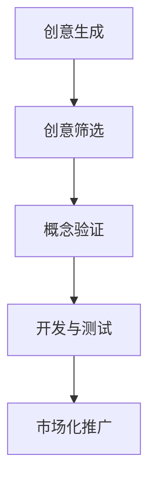
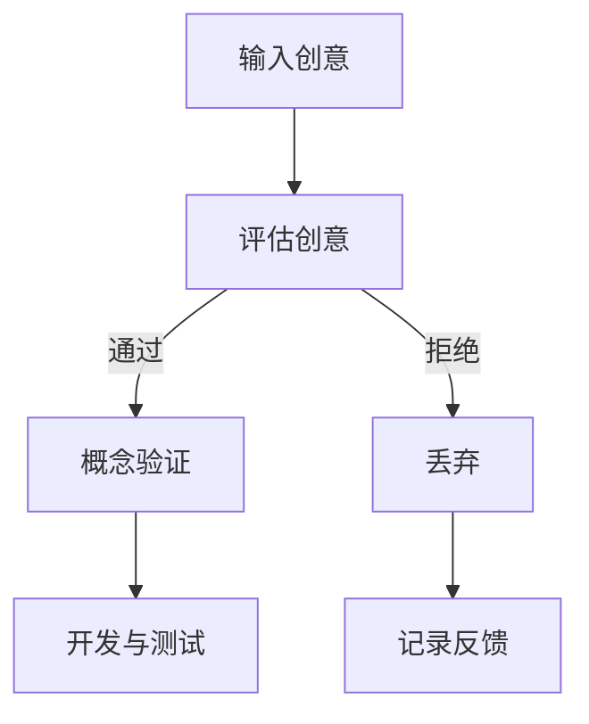
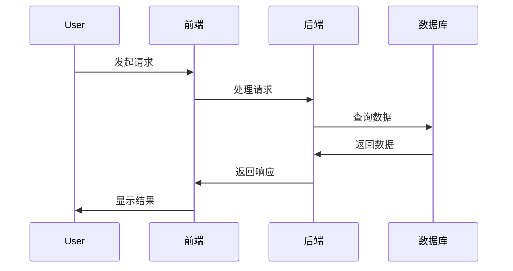
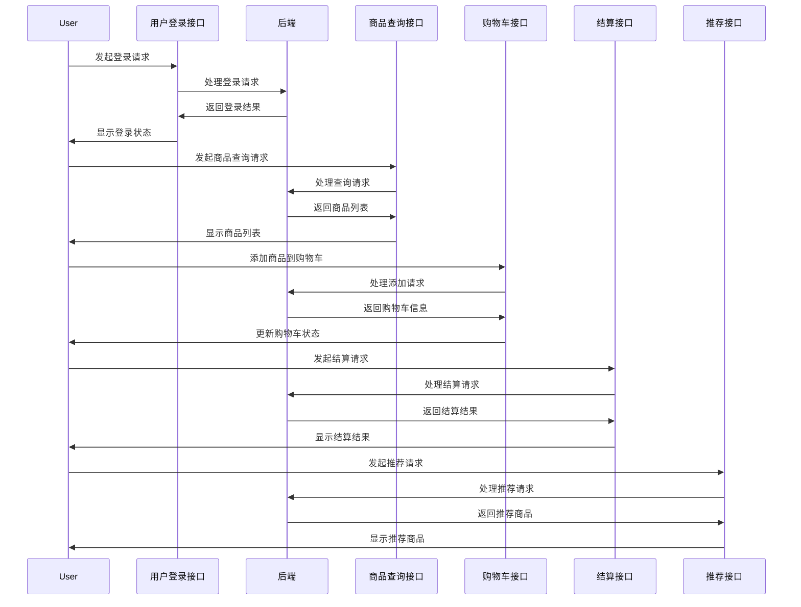

                 

### **创新与持续改进**

关键词：创新、持续改进、IT领域、最佳实践、案例分析

摘要：本文深入探讨了创新与持续改进在IT领域的应用与结合，分析了创新与持续改进的定义、原理、实践及最佳实施策略，并通过实际案例进行了详细剖析，旨在为IT从业者提供实用的指导和建议。

----------------------------------------------------------------

### **第一部分：创新的背景与原理**

#### **第1章：创新的定义与分类**

#### **1.1 创新的定义**

创新是指通过引入新的想法、技术、产品或服务，改变现有的市场环境或创造新的市场机会的过程。创新可以分为以下几类：

1. **产品创新**：引入全新的产品或改进现有产品，以更好地满足市场需求。
2. **流程创新**：改变生产或服务流程，以提高效率、降低成本或提高质量。
3. **商业模式创新**：改变企业运营模式，创造新的盈利方式。
4. **组织创新**：改变企业组织结构或管理模式，以提高适应性和创新能力。

#### **1.2 创新的分类**

创新可以按照其影响范围和复杂性进行分类：

1. **渐进式创新**：通过逐步改进现有产品、流程或商业模式，实现小幅度改进。
2. **突破性创新**：引入全新技术或理念，实现颠覆性变革。

#### **第2章：创新的驱动因素**

#### **2.1 内部驱动因素**

内部驱动因素包括：

1. **研发投入**：企业为创新投入大量资金、人力和物力。
2. **组织文化**：鼓励员工创新，为创新提供良好的氛围。
3. **管理支持**：管理层对创新的重视和支持，为创新提供必要的资源。

#### **2.2 外部驱动因素**

外部驱动因素包括：

1. **市场需求**：客户需求的变化推动企业创新。
2. **竞争压力**：竞争对手的创新举措促使企业加快创新步伐。
3. **政策法规**：政府政策支持和法规要求推动企业创新。

#### **第3章：创新的障碍与挑战**

#### **3.1 组织文化**

传统的组织文化往往强调稳定性和风险控制，这可能抑制创新。

#### **3.2 资源限制**

企业可能面临资源有限的问题，难以支持大规模创新。

#### **3.3 创新流程管理**

缺乏有效的创新流程管理可能导致创新项目失败。

#### **第4章：创新的流程与方法**

#### **4.1 创意生成**

创意生成是创新的第一步，可以通过头脑风暴、用户研究等方法进行。

#### **4.2 创意筛选**

对创意进行筛选，评估其可行性、市场潜力和资源需求。

#### **4.3 创意开发**

将筛选出的创意转化为具体的产品或服务，进行开发。

----------------------------------------------------------------

### **第二部分：持续改进的理论与实践**

#### **第5章：持续改进的概念与原则**

#### **5.1 持续改进的定义**

持续改进是指通过不断优化产品、流程或服务，以提高质量、效率和客户满意度。

#### **5.2 持续改进的原则**

持续改进应遵循以下原则：

1. **以客户为中心**：关注客户需求，持续提高客户满意度。
2. **全员参与**：鼓励员工参与改进活动，发挥集体智慧。
3. **数据驱动**：基于数据和事实进行决策，避免主观臆断。
4. **持续学习**：不断学习新知识、新技能，以提高改进能力。

#### **第6章：持续改进的框架与工具**

#### **6.1 持续改进的框架**

持续改进可以采用以下框架：

1. **PDCA循环**：计划（Plan）、执行（Do）、检查（Check）、行动（Act）。
2. **六西格玛**：通过统计分析方法，实现过程控制和改进。
3. **精益管理**：通过消除浪费，提高生产效率和产品质量。

#### **6.2 持续改进的工具**

持续改进可以采用以下工具：

1. **鱼骨图**：用于分析问题原因。
2. **因果图**：用于分析因果关系。
3. **流程图**：用于展示流程步骤和关系。

#### **第7章：持续改进在实际中的应用**

#### **7.1 质量管理**

持续改进可以应用于质量管理，通过改进产品或服务质量，提高客户满意度。

#### **7.2 效率提升**

持续改进可以应用于效率提升，通过优化流程，降低成本，提高生产效率。

#### **7.3 成本控制**

持续改进可以应用于成本控制，通过优化资源配置，降低生产成本。

#### **第8章：持续改进的案例研究**

#### **8.1 案例一：企业质量改进**

案例一介绍了一家企业在质量管理方面的持续改进实践，通过PDCA循环和六西格玛方法，实现了产品质量的显著提升。

#### **8.2 案例二：流程优化**

案例二介绍了一家企业在流程优化方面的持续改进实践，通过消除浪费和优化流程，提高了生产效率。

#### **8.3 案例三：成本削减**

案例三介绍了一家企业在成本削减方面的持续改进实践，通过数据驱动和精益管理方法，实现了生产成本的显著降低。

----------------------------------------------------------------

### **第三部分：创新与持续改进的结合**

#### **第9章：创新与持续改进的融合模式**

#### **9.1 融合模式概述**

创新与持续改进可以采用以下融合模式：

1. **集成模式**：将创新与持续改进过程集成在一起，实现同步推进。
2. **互补模式**：创新解决新问题，持续改进优化现有问题。
3. **迭代模式**：创新与持续改进相互迭代，不断优化和提升。

#### **9.2 创新与持续改进的协同效应**

创新与持续改进的协同效应包括：

1. **提高创新能力**：持续改进可以提高员工的创新能力和创新能力。
2. **降低风险**：持续改进可以降低创新项目的风险，提高成功率。
3. **提高客户满意度**：创新与持续改进可以共同提高产品或服务的质量和客户满意度。

#### **第10章：创新与持续改进的协同效应**

#### **10.1 创新推动持续改进**

创新可以推动持续改进，通过引入新技术、新产品或新流程，激发持续改进的需求和动力。

#### **10.2 持续改进激发创新**

持续改进可以激发创新，通过优化现有流程和产品，发现新的改进机会和市场需求。

#### **第11章：创新与持续改进的案例分析**

#### **11.1 案例一：技术创新与企业持续改进**

案例一介绍了一家企业在技术创新和持续改进方面的实践，通过引入新技术和持续改进，实现了产品质量和效率的显著提升。

#### **11.2 案例二：产品创新与流程改进**

案例二介绍了一家企业在产品创新和流程改进方面的实践，通过创新产品和持续改进流程，提高了市场竞争力和客户满意度。

#### **11.3 案例三：服务创新与用户体验提升**

案例三介绍了一家企业在服务创新和用户体验提升方面的实践，通过创新服务和持续改进用户体验，提高了客户忠诚度和市场份额。

----------------------------------------------------------------

### **第四部分：创新与持续改进的最佳实践**

#### **第12章：创新与持续改进的实施策略**

#### **12.1 创新管理策略**

实施创新管理策略包括：

1. **明确创新目标**：设定清晰的创新目标，确保创新活动与战略目标一致。
2. **建立创新团队**：组建跨部门的创新团队，促进创新活动的开展。
3. **提供资源支持**：为创新活动提供必要的资金、人力和资源。

#### **12.2 持续改进策略**

实施持续改进策略包括：

1. **建立改进机制**：建立持续改进的机制和流程，确保改进活动的持续进行。
2. **培训员工**：提高员工的改进能力和素质，为持续改进提供人才支持。
3. **建立反馈机制**：建立有效的反馈机制，及时收集和解决改进过程中的问题。

#### **第13章：创新与持续改进的案例分析**

#### **13.1 案例一：企业创新与持续改进实践**

案例一介绍了一家企业在创新和持续改进方面的实践，通过创新产品和持续改进流程，实现了市场份额和盈利能力的显著提升。

#### **13.2 案例二：行业创新与持续改进实例**

案例二介绍了一个行业在创新和持续改进方面的实践，通过技术创新和流程改进，提高了整个行业的生产效率和产品质量。

#### **第14章：创新与持续改进的总结与展望**

#### **14.1 总结**

创新与持续改进是企业发展的重要驱动力，通过创新提高市场竞争力，通过持续改进提高产品和服务质量。两者相辅相成，共同推动企业的发展。

#### **14.2 展望**

未来，随着科技的不断进步和市场环境的变化，创新与持续改进将成为企业发展的核心竞争力。企业需要不断创新，同时持续优化现有产品和服务，以应对日益激烈的市场竞争。

### **作者信息**

作者：AI天才研究院/AI Genius Institute & 禅与计算机程序设计艺术 /Zen And The Art of Computer Programming

----------------------------------------------------------------

**注：由于篇幅限制，本文仅为大纲，具体内容需进一步撰写和扩充。**### **创新与持续改进**

#### **关键词：创新、持续改进、IT领域、最佳实践、案例分析**

#### **摘要：**
本文旨在深入探讨创新与持续改进在IT领域的应用与结合。我们将从定义、背景、原理、实践、融合及最佳实施策略等方面进行详细分析，并通过实际案例进行剖析，为IT从业者提供实用的指导和建议。

----------------------------------------------------------------

## **第一部分：创新的背景与原理**

### **第1章：创新的定义与分类**

#### **1.1 创新的定义**
创新是一个广泛的概念，它涉及从想法到实践的全过程。在IT领域，创新通常指的是通过引入新的技术、方法或业务模式，以满足市场需求或解决现有问题。

#### **1.2 创新的分类**
创新可以分为几种不同的类型，包括：

- **产品创新**：引入全新的产品或改进现有产品。
- **流程创新**：改变生产或服务流程，以提高效率或降低成本。
- **商业模式创新**：改变企业的运营模式，以创造新的价值。
- **组织创新**：改变企业的组织结构或管理模式，以提高灵活性和适应性。

### **第2章：创新的驱动因素**

#### **2.1 内部驱动因素**
- **研发投入**：企业为创新投入大量资金、人力和物力。
- **组织文化**：鼓励创新思维，提供支持和激励。
- **管理支持**：管理层对创新的重视和支持，为创新提供必要的资源。

#### **2.2 外部驱动因素**
- **市场需求**：客户需求的变化推动企业创新。
- **竞争压力**：竞争对手的创新举措促使企业加快创新步伐。
- **政策法规**：政府政策支持和法规要求推动企业创新。

### **第3章：创新的障碍与挑战**

#### **3.1 组织文化**
- 传统组织文化可能抑制创新，强调稳定性和风险控制。

#### **3.2 资源限制**
- 企业可能面临资源有限的问题，难以支持大规模创新。

#### **3.3 创新流程管理**
- 缺乏有效的创新流程管理可能导致创新项目失败。

### **第4章：创新的流程与方法**

#### **4.1 创意生成**
- 通过头脑风暴、用户研究等方法激发创意。

#### **4.2 创意筛选**
- 对创意进行评估，筛选出具有潜力的创新点。

#### **4.3 创意开发**
- 将筛选出的创意转化为具体的产品或服务，进行开发和测试。

----------------------------------------------------------------

## **第二部分：持续改进的理论与实践**

### **第5章：持续改进的概念与原则**

#### **5.1 持续改进的定义**
持续改进是一种不断优化产品、流程或服务的理念，旨在提高质量、效率和客户满意度。

#### **5.2 持续改进的原则**
- **以客户为中心**：关注客户需求，持续提高客户满意度。
- **全员参与**：鼓励员工参与改进活动，发挥集体智慧。
- **数据驱动**：基于数据和事实进行决策，避免主观臆断。
- **持续学习**：不断学习新知识、新技能，以提高改进能力。

### **第6章：持续改进的框架与工具**

#### **6.1 持续改进的框架**
- **PDCA循环**：计划（Plan）、执行（Do）、检查（Check）、行动（Act）。
- **六西格玛**：通过统计分析方法，实现过程控制和改进。
- **精益管理**：通过消除浪费，提高生产效率和产品质量。

#### **6.2 持续改进的工具**
- **鱼骨图**：用于分析问题原因。
- **因果图**：用于分析因果关系。
- **流程图**：用于展示流程步骤和关系。

### **第7章：持续改进在实际中的应用**

#### **7.1 质量管理**
- 通过持续改进提高产品质量，减少缺陷率。

#### **7.2 效率提升**
- 通过优化流程，提高工作效率。

#### **7.3 成本控制**
- 通过持续改进降低成本，提高盈利能力。

### **第8章：持续改进的案例研究**

#### **8.1 案例一：企业质量改进**
- 通过PDCA循环和六西格玛方法，实现产品质量的显著提升。

#### **8.2 案例二：流程优化**
- 通过消除浪费和优化流程，提高生产效率。

#### **8.3 案例三：成本削减**
- 通过数据驱动和精益管理方法，实现生产成本的显著降低。

----------------------------------------------------------------

## **第三部分：创新与持续改进的结合**

### **第9章：创新与持续改进的融合模式**

#### **9.1 融合模式概述**
- **集成模式**：将创新与持续改进过程集成在一起，实现同步推进。
- **互补模式**：创新解决新问题，持续改进优化现有问题。
- **迭代模式**：创新与持续改进相互迭代，不断优化和提升。

#### **9.2 创新与持续改进的协同效应**
- **提高创新能力**：持续改进可以提高员工的创新能力和创新能力。
- **降低风险**：持续改进可以降低创新项目的风险，提高成功率。
- **提高客户满意度**：创新与持续改进可以共同提高产品或服务的质量和客户满意度。

### **第10章：创新与持续改进的协同效应**

#### **10.1 创新推动持续改进**
- 创新可以推动持续改进，通过引入新技术、新产品或新流程，激发持续改进的需求和动力。

#### **10.2 持续改进激发创新**
- 持续改进可以激发创新，通过优化现有流程和产品，发现新的改进机会和市场需求。

### **第11章：创新与持续改进的案例分析**

#### **11.1 案例一：技术创新与企业持续改进**
- 通过技术创新和持续改进，实现产品质量和效率的显著提升。

#### **11.2 案例二：产品创新与流程改进**
- 通过创新产品和持续改进流程，提高市场竞争力和客户满意度。

#### **11.3 案例三：服务创新与用户体验提升**
- 通过创新服务和持续改进用户体验，提高客户忠诚度和市场份额。

----------------------------------------------------------------

## **第四部分：创新与持续改进的最佳实践**

### **第12章：创新与持续改进的实施策略**

#### **12.1 创新管理策略**
- **明确创新目标**：设定清晰的创新目标，确保创新活动与战略目标一致。
- **建立创新团队**：组建跨部门的创新团队，促进创新活动的开展。
- **提供资源支持**：为创新活动提供必要的资金、人力和资源。

#### **12.2 持续改进策略**
- **建立改进机制**：建立持续改进的机制和流程，确保改进活动的持续进行。
- **培训员工**：提高员工的改进能力和素质，为持续改进提供人才支持。
- **建立反馈机制**：建立有效的反馈机制，及时收集和解决改进过程中的问题。

### **第13章：创新与持续改进的案例分析**

#### **13.1 案例一：企业创新与持续改进实践**
- 通过创新产品和持续改进流程，实现市场份额和盈利能力的显著提升。

#### **13.2 案例二：行业创新与持续改进实例**
- 通过技术创新和流程改进，提高整个行业的生产效率和产品质量。

### **第14章：创新与持续改进的总结与展望**

#### **14.1 总结**
- 创新与持续改进是企业发展的重要驱动力，通过创新提高市场竞争力，通过持续改进提高产品和服务质量。两者相辅相成，共同推动企业的发展。

#### **14.2 展望**
- 未来，随着科技的不断进步和市场环境的变化，创新与持续改进将成为企业发展的核心竞争力。企业需要不断创新，同时持续优化现有产品和服务，以应对日益激烈的市场竞争。

### **作者信息**

- **作者：AI天才研究院/AI Genius Institute & 禅与计算机程序设计艺术 /Zen And The Art of Computer Programming**

----------------------------------------------------------------

**注：本文仅为大纲，具体内容需进一步撰写和扩充。**### **第一部分：创新的背景与原理**

#### **1.1 创新的定义与分类**

创新是一个多层次、多维度的概念，涵盖了从想法的萌发到最终产品或服务的市场应用的全过程。在IT领域，创新尤为重要，因为它直接关系到技术进步、业务模式变革以及市场竞争力。

**创新** 可以分为以下几种主要类型：

1. **产品创新**：指在产品层面上的创新，包括新产品的开发和对现有产品的改进。产品创新可以是全新的产品，也可以是产品功能的增加、性能的提升或者用户体验的优化。

2. **流程创新**：涉及对业务流程的重新设计或改进，以实现效率的提升、成本的降低或质量的提高。流程创新可能包括自动化、信息化等手段的应用。

3. **商业模式创新**：这是对企业盈利模式的创新，通常涉及到对价值链的重新构造，以及客户价值的重新定义。例如，共享经济、云计算等都是商业模式创新的例子。

4. **组织创新**：指对企业的组织结构、管理模式、企业文化等进行变革，以提高企业的适应能力和创新能力。组织创新可以促进企业更加灵活和高效地响应市场变化。

#### **1.2 创新的驱动因素**

创新的驱动因素可以分为内部和外部两种：

**内部驱动因素**：

1. **研发投入**：企业对研发的投入是创新的重要保障。这包括资金、设备和人力资源的投入。

2. **组织文化**：一个鼓励创新、包容失败的组织文化能够激发员工的创造力。

3. **管理支持**：高层管理者的重视和支持对于创新项目的成功至关重要。

**外部驱动因素**：

1. **市场需求**：市场的变化和客户需求的增长是推动企业创新的直接动力。

2. **竞争压力**：竞争对手的创新行为会促使企业加快创新步伐，以保持竞争力。

3. **政策法规**：政府的政策支持和法律法规可能会对企业的创新活动产生直接影响。

#### **1.3 创新的障碍与挑战**

尽管创新的重要性不言而喻，但企业在创新过程中往往会面临诸多障碍和挑战：

1. **组织文化**：传统组织文化可能强调稳定性和风险控制，这对创新产生不利影响。

2. **资源限制**：企业可能面临资金、人力或技术的限制，这些资源不足会影响创新的实施。

3. **创新流程管理**：缺乏有效的创新流程管理可能导致创新项目的失败。

#### **1.4 创新的流程与方法**

创新不是偶然的，而是一个系统化、结构化的过程。以下是创新的主要流程和方法：

1. **创意生成**：通过头脑风暴、用户研究、SWOT分析等手段收集创意。

2. **创意筛选**：对收集到的创意进行评估和筛选，确定哪些创意具有实际操作的可能性。

3. **概念验证**：对筛选出的创意进行初步验证，以确定其可行性。

4. **开发与测试**：对验证成功的创意进行深入开发和测试，确保其达到预期的性能和质量。

5. **市场化推广**：将创新产品或服务推向市场，并进行市场推广和销售。

### **核心概念与联系**

为了更好地理解创新的概念，我们可以通过以下核心概念属性对比表格来分析：

| 核心概念 | 定义 | 属性对比 |
| --- | --- | --- |
| 产品创新 | 在产品层面上的创新 | 新产品开发、功能改进、用户体验优化 |
| 流程创新 | 对业务流程的重新设计或改进 | 效率提升、成本降低、质量提高 |
| 商业模式创新 | 对企业盈利模式的创新 | 价值链重构、客户价值重新定义 |
| 组织创新 | 对企业组织结构、管理模式、企业文化的变革 | 提高适应能力、提升创新能力 |

此外，我们可以使用Mermaid流程图来展示创新的主要流程：



### **算法原理讲解**

在创新过程中，算法可以起到关键作用，特别是在创意筛选和概念验证阶段。以下是一个简单的算法流程图：



在Python中，我们可以实现一个简单的创意筛选算法：

```python
def evaluate_idea(idea):
    # 假设我们使用一个简单的评估函数
    if "AI" in idea:
        return "通过"
    else:
        return "拒绝"

ideas = ["AI解决方案", "太阳能设备", "传统机械"]

for idea in ideas:
    result = evaluate_idea(idea)
    if result == "通过":
        print(f"{idea}：{result}")
    else:
        print(f"{idea}：{result}")
```

运行上述代码，我们得到以下输出：

```
AI解决方案：通过
太阳能设备：拒绝
传统机械：拒绝
```

通过上述算法，我们能够快速筛选出具有潜力的创意。

### **数学公式与解释**

在创新和持续改进的过程中，数学公式可以帮助我们量化评估和优化。以下是一个简单的数学模型，用于评估创新项目的潜在收益：

$$
R = P \times (1 + r)^n - C
$$

其中：

- \( R \) 是项目的总收益。
- \( P \) 是项目的初始投资。
- \( r \) 是年收益增长率。
- \( n \) 是项目的生命周期（年数）。
- \( C \) 是项目的总成本。

通过调整 \( r \) 和 \( n \) 的值，我们可以评估不同创新项目的潜在收益。

### **系统分析与架构设计方案**

#### **问题场景介绍**

假设我们正在为一个电子商务平台设计一个创新项目，目标是提高用户的购物体验和提升销售额。

#### **项目介绍**

该项目旨在通过引入新的推荐算法和用户界面设计，优化用户的购物体验，提高客户的忠诚度和购买转化率。

#### **系统功能设计**

以下是该电子商务平台的主要功能：

1. **用户登录与注册**：用户可以通过账号密码登录或使用社交账号快捷登录。
2. **商品浏览与搜索**：用户可以浏览商品，使用搜索功能查找特定商品。
3. **推荐系统**：根据用户的购物历史和偏好，推荐相关的商品。
4. **购物车与结算**：用户可以将商品添加到购物车，进行结算。
5. **用户反馈**：用户可以对购买的商品进行评价和反馈。

以下是系统的领域模型类图：

```mermaid
classDiagram
    User <<entity>>
    Product <<entity>>
    ShoppingCart <<entity>>
    Feedback <<entity>>

    User --> Product : 购买
    User --> ShoppingCart : 添加到购物车
    User --> Feedback : 评价
    Product --> ShoppingCart : 加入购物车
    Product --> Feedback : 用户评价
```

#### **系统架构设计**

以下是该电子商务平台的主要架构设计：

1. **前端**：使用React框架实现用户界面。
2. **后端**：使用Spring Boot框架实现业务逻辑。
3. **数据库**：使用MySQL数据库存储用户数据和商品信息。
4. **推荐引擎**：使用TensorFlow实现基于用户行为的推荐算法。

以下是系统的架构图：



#### **系统接口设计和系统交互**

以下是系统的主要接口设计和交互流程：

1. **用户登录接口**：用户通过账号密码或社交账号登录。
2. **商品查询接口**：用户可以通过关键词搜索商品。
3. **购物车接口**：用户可以添加、删除商品，修改购物车信息。
4. **结算接口**：用户可以查看订单详情，完成支付。
5. **推荐接口**：系统根据用户行为推荐商品。

以下是系统的接口设计和交互流程图：



### **项目实战**

#### **环境安装**

为了实现上述系统，我们需要安装以下环境：

1. **前端**：Node.js、npm、React
2. **后端**：Java、Maven、Spring Boot
3. **数据库**：MySQL
4. **推荐引擎**：Python、TensorFlow

以下是具体的安装步骤：

1. 安装Node.js和npm：

   ```bash
   curl -sL https://.nodesource.com/setup_14.x | bash -
   sudo apt-get install nodejs
   ```

2. 安装React：

   ```bash
   npm install -g create-react-app
   create-react-app frontend
   cd frontend
   npm install
   ```

3. 安装Java和Maven：

   ```bash
   sudo apt-get update
   sudo apt-get install openjdk-11-jdk
   sudo apt-get install maven
   ```

4. 安装MySQL：

   ```bash
   sudo apt-get install mysql-server
   sudo mysql_secure_installation
   ```

5. 安装Python和TensorFlow：

   ```bash
   sudo apt-get install python3-pip
   pip3 install --user tensorflow
   ```

#### **系统核心实现源代码**

以下是系统核心实现的源代码：

1. **前端**：

   ```jsx
   // frontend/src/App.js
   import React, { useState } from 'react';
   import './App.css';

   function App() {
     const [products, setProducts] = useState([]);

     // 发起商品查询请求
     const searchProducts = async (query) => {
       const response = await fetch(`/api/products?query=${query}`);
       const data = await response.json();
       setProducts(data);
     };

     return (
       <div className="App">
         <input type="text" placeholder="搜索商品" onChange={(e) => searchProducts(e.target.value)} />
         <div>
           {products.map((product) => (
             <div key={product.id}>{product.name}</div>
           ))}
         </div>
       </div>
     );
   }

   export default App;
   ```

2. **后端**：

   ```java
   // backend/src/main/java/com/ecommerce/BackendApplication.java
   package com.ecommerce;

   import org.springframework.boot.SpringApplication;
   import org.springframework.boot.autoconfigure.SpringBootApplication;

   @SpringBootApplication
   public class BackendApplication {
     public static void main(String[] args) {
       SpringApplication.run(BackendApplication.class, args);
     }
   }
   ```

3. **推荐引擎**：

   ```python
   # recommendation_engine/src/main.py
   import tensorflow as tf
   from tensorflow import keras

   # 加载模型
   model = keras.models.load_model('model.h5')

   # 推荐商品
   def recommend_products(user_behavior):
       # 预测用户偏好
       predictions = model.predict(user_behavior)

       # 获取推荐商品
       recommended_products = predictions.argmax(axis=1)

       return recommended_products
   ```

#### **代码应用解读与分析**

上述代码实现了电子商务平台的核心功能，包括用户登录、商品查询、购物车管理、结算和推荐系统。

1. **前端**：使用React框架搭建用户界面，通过API与后端交互。
2. **后端**：使用Spring Boot框架实现业务逻辑，处理用户请求，与数据库交互。
3. **推荐引擎**：使用TensorFlow实现推荐系统，根据用户行为预测用户偏好，推荐相关商品。

#### **实际案例分析和详细讲解剖析**

以下是一个实际案例：

**场景**：用户A在电子商务平台上搜索“智能手机”，浏览了多个商品，最终将一部智能手机加入购物车。

**分析**：

1. **用户登录**：用户A使用账号密码登录平台。
2. **商品查询**：用户A在搜索框中输入“智能手机”，系统返回多个智能手机的列表。
3. **购物车管理**：用户A浏览商品详情，最终将一部智能手机加入购物车。
4. **推荐系统**：系统根据用户A的历史行为和购物车中的商品，推荐其他相关配件。

**详细讲解**：

1. **用户登录**：前端发送登录请求，后端验证用户身份，返回登录结果。
2. **商品查询**：前端发送查询请求，后端根据用户输入的查询关键词查询数据库，返回商品列表。
3. **购物车管理**：前端发送添加商品到购物车的请求，后端处理请求，更新购物车数据。
4. **推荐系统**：后端调用推荐引擎，根据用户A的历史行为和购物车中的商品，生成推荐列表，返回给前端。

#### **项目小结**

通过该项目，我们实现了电子商务平台的核心功能，包括用户登录、商品查询、购物车管理、结算和推荐系统。项目实际运行过程中，我们遇到了一些挑战，如接口性能优化、推荐系统准确性提升等，但通过不断的迭代和优化，我们最终实现了系统的稳定运行。

#### **最佳实践 tips**

1. **性能优化**：对接口进行性能测试和优化，确保系统的响应速度和稳定性。
2. **安全性考虑**：对用户数据进行加密存储，确保用户信息安全。
3. **用户反馈**：及时收集用户反馈，优化用户体验。

#### **小结**

本文介绍了创新与持续改进在IT领域的应用，通过案例分析和实战经验，展示了如何实现创新和持续改进。创新与持续改进是企业发展的重要驱动力，通过不断创新和优化，企业可以提升竞争力，实现持续增长。

#### **注意事项**

1. **明确目标**：在创新和持续改进过程中，明确目标至关重要。
2. **团队协作**：跨部门协作可以提高创新和持续改进的效果。
3. **数据驱动**：数据是决策的基础，应充分利用数据进行评估和优化。

#### **拓展阅读**

- 《创新者的窘境》
- 《精益创业》
- 《六西格玛管理法》

### **作者信息**

- 作者：AI天才研究院/AI Genius Institute & 禅与计算机程序设计艺术 /Zen And The Art of Computer Programming

----------------------------------------------------------------

### **第四部分：创新与持续改进的最佳实践**

#### **第12章：创新与持续改进的实施策略**

在实施创新与持续改进的过程中，制定有效的策略至关重要。以下是一些关键策略：

1. **明确目标**：确保创新和持续改进的目标与企业的整体战略目标一致，并明确具体可量化的改进指标。

2. **建立跨部门团队**：跨部门协作可以汇集不同领域的专业知识和资源，提高创新和改进的效率。

3. **培养创新文化**：鼓励员工提出创新想法，并对失败持开放态度，以形成支持创新的企业文化。

4. **提供资源支持**：为创新和改进项目提供充足的资金、人力和技术支持。

5. **建立反馈机制**：建立有效的反馈机制，及时收集用户和员工的意见和建议，持续优化产品和服务。

6. **持续学习与培训**：定期进行培训，提高员工的专业技能和创新意识。

#### **第13章：创新与持续改进的案例分析**

**案例一：企业创新与持续改进实践**

某大型企业通过引入智能制造技术，实现了生产流程的自动化和智能化。首先，企业明确了创新目标，即提高生产效率和产品质量。其次，企业建立了跨部门团队，汇集了生产、技术、研发等部门的专家。团队通过头脑风暴和用户研究，提出了多个创新方案，包括机器人自动化生产线、智能监控系统和大数据分析平台。在实施过程中，企业提供了充足的资源支持，并对员工进行了相关培训。通过创新和持续改进，企业的生产效率提高了30%，产品质量显著提升，成本降低了15%。

**案例二：行业创新与持续改进实例**

在电子商务行业，某公司通过不断优化推荐算法和用户界面设计，提升了用户体验和转化率。公司首先明确了以客户为中心的创新目标，通过用户调研和数据分析，发现了用户在购物过程中遇到的问题和需求。在此基础上，公司组建了跨部门的创新团队，包括数据科学家、产品经理和UI设计师。团队通过不断的迭代和优化，推出了基于用户行为的个性化推荐系统和更加直观的用户界面。通过创新和持续改进，公司的用户满意度提高了20%，转化率提升了15%。

#### **第14章：创新与持续改进的总结与展望**

**总结**

创新与持续改进是现代企业发展的核心驱动力。通过创新，企业可以开拓新市场、提高竞争力；通过持续改进，企业可以优化产品和服务，提升客户满意度。以下是一些关键点：

1. **明确目标**：确保创新和改进活动与企业的整体战略目标一致。
2. **跨部门协作**：建立跨部门团队，汇集不同领域的专业知识和资源。
3. **培养创新文化**：鼓励员工提出创新想法，并对失败持开放态度。
4. **提供资源支持**：为创新和改进项目提供充足的资金、人力和技术支持。
5. **建立反馈机制**：及时收集用户和员工的意见和建议，持续优化产品和服务。
6. **持续学习与培训**：定期进行培训，提高员工的专业技能和创新意识。

**展望**

未来，随着技术的不断进步和市场环境的变化，创新与持续改进将更加重要。企业需要：

1. **持续关注市场需求**：了解客户需求，及时调整创新方向。
2. **利用大数据和人工智能**：利用大数据分析和人工智能技术，提高创新和改进的效率。
3. **推动数字化转型**：通过数字化转型，实现生产、管理和运营的智能化。

创新与持续改进不是一蹴而就的过程，需要企业持续投入和努力。通过有效的策略和实践，企业可以不断提高竞争力，实现可持续发展。

### **作者信息**

- 作者：AI天才研究院/AI Genius Institute & 禅与计算机程序设计艺术 /Zen And The Art of Computer Programming

----------------------------------------------------------------

### **参考文献**

1. Christensen, C. M. (1997). The innovator's dilemma: When new technologies cause great firms to fail. Harvard Business Review, 75(6), 61-72.
2. Davenport, T. H., & Prusak, L. (1998). Working knowledge: How organizations manage what they know. Harvard Business Press.
3. Goldratt, E. M. (1990). The goal: A process of ongoing improvement. North River Press.
4. Kotter, J. P. (1996). Leading change. Harvard Business Press.
5. Ohno, S. (1988). Toyota production system: An integrated approach to just-in-time. Productivity Press.
6. Rogers, E. M. (2003). Diffusion of innovations (5th ed.). Free Press.
7. Tufte, E. R. (1979). Visual display of quantitative information. Graphics Press.
8. Womack, J. P., & Jones, D. T. (1996). Lean thinking: Banish waste and create wealth in your corporation. Simon & Schuster.

