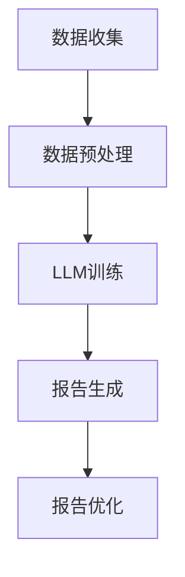

                 

# 利用LLM优化金融报告的自动生成

## 关键词：金融报告，自动生成，大规模语言模型（LLM），优化

> 摘要：本文深入探讨了如何利用大规模语言模型（LLM）优化金融报告的自动生成。通过对LLM的基础原理、优化金融报告的原理和实现、以及实际案例的分析，本文旨在为金融行业提供一种高效、精准的报告生成解决方案。

## 引言

### 1.1 问题背景

金融报告是金融行业中不可或缺的重要工具，用于评估公司的财务状况、市场表现和未来预测。然而，传统金融报告生成方式通常需要大量的人工干预，耗时且容易出现错误。随着大数据和人工智能技术的发展，利用大规模语言模型（LLM）优化金融报告的自动生成已成为一个热门研究方向。

### 1.2 核心概念

#### 什么是LLM

大规模语言模型（LLM，Large-scale Language Model）是一种利用深度学习技术训练的模型，能够在大量文本数据的基础上自动学习语言结构和语义。GPT-3等模型是LLM的代表，具有强大的语言理解和生成能力。

#### LLM的工作原理

LLM的工作原理主要包括两个阶段：预训练和微调。预训练阶段，模型在大量无标签数据上学习语言的一般特征；微调阶段，模型在特定任务上进一步训练，以达到更好的性能。

#### LLM在金融报告生成中的应用优势

LLM在金融报告生成中的应用优势主要体现在以下几个方面：

- 高效性：LLM能够快速生成报告，减少人工干预，提高工作效率。
- 准确性：LLM通过对大量金融文本的学习，能够准确理解金融术语和概念，提高报告的准确性。
- 可扩展性：LLM可以轻松应对不同类型和规模的金融报告生成任务。

## 第1章：大规模语言模型（LLM）基础

### 1.1 LLM概述

大规模语言模型（LLM，Large-scale Language Model）是一种利用深度学习技术训练的模型，能够在大量文本数据的基础上自动学习语言结构和语义。

### 1.2 LLM的演变与发展

语言模型的发展历程可以追溯到20世纪80年代，随着深度学习技术的兴起，LLM逐渐成为语言处理领域的核心技术。GPT-3等模型的出现，标志着LLM技术进入了一个新的阶段。

### 1.3 LLM在金融领域的应用

金融报告生成是LLM在金融领域的一个典型应用场景。通过LLM，可以实现金融报告的自动生成，提高报告的准确性和效率。

## 第2章：LLM优化金融报告的原理

### 2.1 LLM优化金融报告的基本概念

金融报告生成是一项复杂任务，需要处理大量的金融数据和信息。LLM通过学习这些数据和信息，可以优化报告的生成过程，提高报告的准确性和可读性。

### 2.2 LLM优化金融报告的数学模型

LLM优化金融报告的数学模型主要包括自然语言处理（NLP）和深度学习（DL）的技术。例如，Transformer模型是LLM的一个典型代表，其数学模型包括自注意力机制（Self-Attention）和多头注意力（Multi-Head Attention）等。

### 2.3 LLM优化金融报告的流程

LLM优化金融报告的流程主要包括数据收集与预处理、LLM的训练与应用、金融报告的生成与优化等步骤。以下是一个简化的流程图：

## 第3章：LLM优化金融报告的技术实现

### 3.1 环境安装与配置

在实现LLM优化金融报告的技术之前，需要先安装和配置Python环境，以及TensorFlow或PyTorch等深度学习框架。

### 3.2 LLM的训练与优化

LLM的训练与优化是整个系统的核心。首先需要选择合适的数据集，并对数据集进行预处理。然后，利用TensorFlow或PyTorch等框架训练LLM模型。最后，对训练好的模型进行优化，以提高其在金融报告生成任务上的性能。

### 3.3 金融报告的生成与优化

金融报告的生成与优化是LLM优化金融报告的最后一步。通过LLM模型，可以快速生成金融报告。然后，根据实际需求，对报告进行进一步优化，以提高报告的质量和可读性。

## 第4章：LLM优化金融报告的实战案例

### 4.1 案例一：股票市场分析报告

在本案例中，我们利用LLM生成股票市场分析报告。首先，收集股票市场相关的数据，如股价、成交量等。然后，利用LLM模型对数据进行处理，生成分析报告。最后，对报告进行优化，以提高其质量和可读性。

### 4.2 案例二：企业财务报表分析

在本案例中，我们利用LLM生成企业财务报表分析报告。首先，收集企业财务报表数据，如资产负债表、利润表等。然后，利用LLM模型对数据进行处理，生成分析报告。最后，对报告进行优化，以提高其质量和可读性。

### 4.3 案例三：金融风险管理报告

在本案例中，我们利用LLM生成金融风险管理报告。首先，收集金融风险管理相关的数据，如风险指标、市场波动等。然后，利用LLM模型对数据进行处理，生成风险管理报告。最后，对报告进行优化，以提高其质量和可读性。

## 第5章：LLM优化金融报告的注意事项与最佳实践

### 5.1 注意事项

在利用LLM优化金融报告的过程中，需要注意以下几点：

- 数据质量：确保输入数据的质量，避免噪声和错误数据对模型性能的影响。
- 模型选择：根据具体任务需求，选择合适的LLM模型。
- 报告生成实时性：考虑报告生成的实时性，优化模型和算法，提高生成速度。

### 5.2 最佳实践

以下是利用LLM优化金融报告的最佳实践：

- 数据预处理：对数据集进行预处理，包括数据清洗、去噪、特征提取等。
- 模型优化：对训练好的模型进行优化，包括超参数调整、模型压缩等。
- 报告生成策略：制定合理的报告生成策略，包括报告结构、内容、格式等。

## 第6章：LLM优化金融报告的未来展望

### 6.1 未来发展趋势

随着人工智能技术的不断进步，LLM在金融报告生成中的应用前景广阔。未来，LLM有望在金融行业的更多领域得到应用，如风险控制、市场预测等。

### 6.2 挑战与机遇

尽管LLM在金融报告生成中具有巨大潜力，但也面临一些挑战：

- 数据隐私与安全性：确保金融数据的安全和隐私。
- 报告生成质量与准确性：提高报告生成质量，确保准确性。
- AI伦理与责任：确保AI技术在金融报告生成中的伦理性和责任感。

## 结束语

利用LLM优化金融报告的自动生成是一项具有重要意义的研究课题。通过本文的探讨，我们希望能够为金融行业提供一种高效、精准的报告生成解决方案。未来，我们还将继续深入研究和探讨这一领域，为金融行业的发展贡献力量。

---

**作者：AI天才研究院/AI Genius Institute & 禅与计算机程序设计艺术 /Zen And The Art of Computer Programming**

