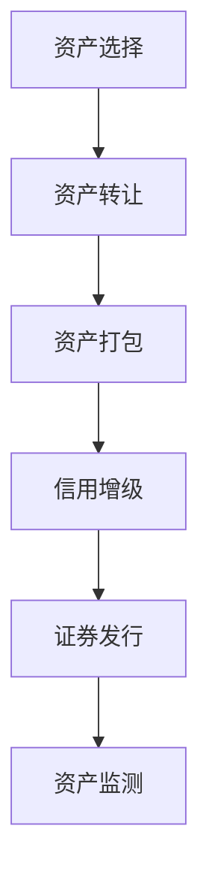
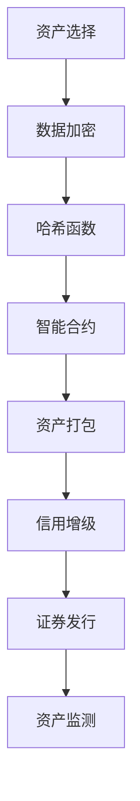
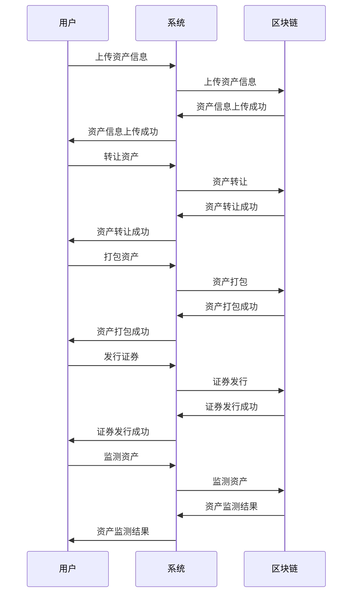

                 

## 关键词

区块链技术、资产证券化、应用场景、优势与挑战、案例分析、未来趋势

## 摘要

随着区块链技术的迅速发展，其在金融领域的应用越来越受到关注。资产证券化作为一种金融创新手段，通过将资产转化为可交易的证券，实现了资产的流动性。本文旨在探讨区块链技术在资产证券化中的应用，分析其带来的优势与挑战，并通过案例分析，展示区块链在资产证券化中的实际应用情况。最后，本文将探讨区块链技术在资产证券化中的未来发展趋势，为相关领域的实践提供参考。

## 目录大纲

### 第1章 区块链技术概述

- **1.1 区块链技术的基本概念**
- **1.2 区块链技术的核心技术**
- **1.3 区块链技术的发展历程**
- **1.4 区块链技术的应用领域**

### 第2章 资产证券化的基本概念

- **2.1 资产证券化的定义**
- **2.2 资产证券化的主要类型**
- **2.3 资产证券化的过程**
- **2.4 资产证券化的作用与意义**

### 第3章 区块链在资产证券化中的应用

- **3.1 区块链技术在资产证券化中的应用场景**
- **3.2 区块链在资产证券化中的具体应用**
- **3.3 区块链技术在资产证券化中的价值**

### 第4章 区块链技术在资产证券化中的优势与挑战

- **4.1 区块链技术在资产证券化中的优势**
- **4.2 区块链技术在资产证券化中的挑战**

### 第5章 案例分析：区块链在资产证券化中的应用实例

- **5.1 案例一：区块链在房地产资产证券化中的应用**
- **5.2 案例二：区块链在汽车融资租赁资产证券化中的应用**
- **5.3 案例三：区块链在应收账款资产证券化中的应用**

### 第6章 区块链技术在资产证券化中的未来趋势

- **6.1 区块链技术在资产证券化中的发展趋势**
- **6.2 区块链技术在资产证券化中的未来应用前景**

### 第7章 实施区块链资产证券化的最佳实践

- **7.1 实施区块链资产证券化的关键步骤**
- **7.2 区块链资产证券化的风险与防范**
- **7.3 区块链资产证券化的最佳实践案例**

## 第1章 区块链技术概述

### 1.1 区块链技术的基本概念

区块链技术是一种分布式账本技术，其核心概念包括去中心化、不可篡改和智能合约。去中心化意味着系统中的每个节点都有相同的权限，没有中央机构进行控制；不可篡改意味着一旦数据被记录在区块链上，就几乎无法更改或删除；智能合约是一种自动执行的合约，其条款被编程到区块链中，当触发条件满足时，合约自动执行。

### 1.2 区块链技术的核心技术

区块链技术的主要核心技术包括加密算法、共识机制和分布式存储。加密算法用于确保数据传输的安全性；共识机制用于节点之间的协作，确保数据的合法性和一致性；分布式存储则保证了数据的高可用性和可靠性。

### 1.3 区块链技术的发展历程

区块链技术的发展可以追溯到2008年，当时中本聪（Satoshi Nakamoto）发表了比特币的白皮书，提出了区块链的概念。随后的几年，区块链技术逐渐成熟，并开始应用于各种领域，如金融、供应链、医疗等。

### 1.4 区块链技术的应用领域

区块链技术具有广泛的应用前景，其应用领域包括但不限于：

1. **金融领域**：如比特币、以太坊等加密货币，以及资产证券化等。
2. **供应链管理**：通过区块链技术，可以实现供应链的透明化和可追溯性。
3. **医疗健康**：利用区块链技术，可以确保医疗数据的真实性和隐私性。
4. **版权保护**：区块链技术可以用于版权登记和交易，确保创作者的权益。
5. **身份验证**：区块链技术可以提供一种去中心化的身份验证方式，提高安全性和隐私性。

## 第2章 资产证券化的基本概念

### 2.1 资产证券化的定义

资产证券化是指将非流动性的资产转化为可在金融市场上交易的证券的过程。这种转化通常通过创建一个特殊目的实体（Special Purpose Entity，SPE）来完成，该实体持有这些资产，并将其转化为可交易的证券。

### 2.2 资产证券化的主要类型

资产证券化主要有以下几种类型：

1. **住房抵押贷款证券化（MBS）**：将住房抵押贷款打包成证券出售。
2. **商业抵押贷款证券化（CMBS）**：将商业房地产抵押贷款打包成证券出售。
3. **应收账款证券化（ABS）**：将企业应收账款打包成证券出售。
4. **资产支持票据（ABN）**：类似于ABS，但通常是政府机构或地方政府发行的。
5. **债务重组证券化（DUS）**：将债务打包成证券出售。

### 2.3 资产证券化的过程

资产证券化的过程主要包括以下步骤：

1. **资产选择**：选择适合证券化的资产。
2. **资产转让**：将资产转让给特殊目的实体。
3. **资产打包**：将资产打包成证券。
4. **信用增级**：通过信用增级提高证券的信用等级。
5. **证券发行**：在金融市场上发行证券。
6. **资产监测**：监测资产的质量和表现。

### 2.4 资产证券化的作用与意义

资产证券化具有以下作用和意义：

1. **提高资产的流动性**：通过资产证券化，企业可以将非流动资产转化为流动性较高的证券，从而提高资金的利用效率。
2. **分散风险**：通过将资产打包成证券，可以将风险分散到多个投资者之间。
3. **优化资本结构**：资产证券化可以帮助企业优化资本结构，降低融资成本。
4. **增加投资机会**：资产证券化可以为投资者提供新的投资渠道，增加投资选择。

### 2.5 资产证券化的核心概念与联系

#### 资产证券化流程图



#### 核心概念对比表格

| 核心概念 | 定义 | 功能 |
| :------: | :--- | :--- |
| 资产选择 | 选择适合证券化的资产 | 提高资产流动性 |
| 资产转让 | 将资产转让给特殊目的实体 | 确保资产脱离原始持有者 |
| 资产打包 | 将资产打包成证券 | 分散风险 |
| 信用增级 | 提高证券的信用等级 | 增加投资者的信心 |
| 证券发行 | 在金融市场上发行证券 | 获得资金 |
| 资产监测 | 监测资产的质量和表现 | 确保资产价值稳定 |

### 2.6 算法原理讲解

资产证券化的核心在于将非流动性资产转化为可交易的证券，这一过程涉及到多个算法原理，包括数据加密、哈希函数和智能合约。以下将详细讲解这些算法原理。

#### 数据加密

数据加密是确保数据在传输过程中不被篡改的关键技术。常用的加密算法包括对称加密和非对称加密。

- **对称加密**：对称加密使用相同的密钥进行加密和解密。常见的对称加密算法有AES、DES等。
- **非对称加密**：非对称加密使用一对密钥，即公钥和私钥。公钥用于加密，私钥用于解密。常见的非对称加密算法有RSA、ECC等。

#### 哈希函数

哈希函数是将任意长度的数据映射为固定长度的值。在资产证券化中，哈希函数用于确保数据的一致性和完整性。常见的哈希函数包括SHA-256、SHA-3等。

#### 智能合约

智能合约是一种自动执行的合约，其条款被编程到区块链中。当触发条件满足时，智能合约自动执行。智能合约的关键在于其透明性和不可篡改性。

#### 算法流程图



#### 算法原理数学模型

- **数据加密**：设明文为M，密钥为K，加密算法为E，解密算法为D，则加密过程为C = E(K, M)，解密过程为M = D(K, C)。
- **哈希函数**：设输入为X，哈希函数为H，则哈希值为H(X)。
- **智能合约**：设合约条款为T，触发条件为C，则智能合约执行过程为E = T(C)。

#### 举例说明

假设有一份资产文档需要加密存储，加密算法为AES，密钥为K。首先，使用AES加密算法对文档进行加密，得到密文C = E(K, M)。然后，使用哈希函数SHA-256对密文进行哈希运算，得到哈希值H(C)。最后，将哈希值存储在区块链上，确保数据的一致性和完整性。

### 2.7 系统分析与架构设计方案

#### 问题场景介绍

资产证券化的过程涉及到资产的选择、转让、打包、发行和监测等多个环节。为了提高效率，需要设计一个高效的系统架构来支持这些环节。

#### 项目介绍

本系统名为“资产证券化管理系统”，旨在提供一个统一的平台，用于资产的选择、转让、打包、发行和监测。

#### 系统功能设计

1. **资产选择**：系统应提供资产选择功能，用户可以上传资产信息，系统对资产进行筛选。
2. **资产转让**：系统应提供资产转让功能，将资产转让给特殊目的实体。
3. **资产打包**：系统应提供资产打包功能，将资产打包成证券。
4. **信用增级**：系统应提供信用增级功能，提高证券的信用等级。
5. **证券发行**：系统应提供证券发行功能，将证券发行到金融市场上。
6. **资产监测**：系统应提供资产监测功能，监测资产的质量和表现。

#### 系统架构设计

1. **前端**：前端使用Vue框架，提供用户界面，用户可以通过前端进行资产操作。
2. **后端**：后端使用Spring Boot框架，处理业务逻辑。
3. **区块链**：使用Hyperledger Fabric实现区块链功能。
4. **数据库**：使用MySQL存储资产信息和其他数据。

#### 系统接口设计

1. **资产上传接口**：用于用户上传资产信息。
2. **资产查询接口**：用于查询资产信息。
3. **资产转让接口**：用于资产转让。
4. **资产打包接口**：用于资产打包。
5. **信用增级接口**：用于信用增级。
6. **证券发行接口**：用于证券发行。
7. **资产监测接口**：用于资产监测。

#### 系统交互



### 2.8 项目实战

#### 环境安装

1. 安装Java开发工具包（JDK）
2. 安装MySQL数据库
3. 安装Node.js和npm
4. 安装Vue-cli

#### 系统核心实现源代码

以下是系统核心实现的源代码示例：

```java
// Spring Boot后端代码
@SpringBootApplication
public class AssetSecuritizationSystemApplication {

    public static void main(String[] args) {
        SpringApplication.run(AssetSecuritizationSystemApplication.class, args);
    }

    @Bean
    public WebMvcConfigurer corsConfigurer() {
        return new WebMvcConfigurer() {
            @Override
            public void addCorsMappings(CorsRegistry registry) {
                registry.addMapping("/**").allowedOrigins("*").allowedMethods("GET", "POST", "PUT", "DELETE");
            }
        };
    }
}

@RestController
@RequestMapping("/api")
public class AssetController {

    @Autowired
    private AssetService assetService;

    @PostMapping("/upload")
    public ResponseEntity<?> uploadAsset(@RequestParam("file") MultipartFile file) {
        try {
            assetService.uploadAsset(file);
            return ResponseEntity.ok("Asset uploaded successfully");
        } catch (Exception e) {
            return ResponseEntity.status(HttpStatus.INTERNAL_SERVER_ERROR).body("Error uploading asset");
        }
    }

    @GetMapping("/assets")
    public ResponseEntity<?> getAssets() {
        try {
            List<Asset> assets = assetService.getAssets();
            return ResponseEntity.ok(assets);
        } catch (Exception e) {
            return ResponseEntity.status(HttpStatus.INTERNAL_SERVER_ERROR).body("Error fetching assets");
        }
    }
}

// Vue前端代码
<template>
  <div>
    <h1>Asset Upload</h1>
    <input type="file" @change="uploadAsset" />
    <button @click="uploadAsset">Upload</button>
  </div>
</template>

<script>
export default {
  methods: {
    uploadAsset() {
      const fileInput = this.$refs.fileInput;
      const file = fileInput.files[0];
      this.$http.post('/api/upload', { file: file })
        .then(response => {
          console.log(response.data);
        })
        .catch(error => {
          console.error(error);
        });
    }
  }
};
</script>
```

#### 代码应用解读与分析

1. **后端代码解读**：
   - `AssetController`类负责处理资产上传和查询的API请求。
   - `uploadAsset`方法接收上传的文件，调用`AssetService`进行文件上传处理。

2. **前端代码解读**：
   - `uploadAsset`方法通过Vue实例调用后端API进行资产上传。

#### 实际案例分析

##### 案例一：区块链在房地产资产证券化中的应用

房地产资产证券化是将房地产投资转化为可交易的证券的过程。区块链技术在房地产资产证券化中的应用主要体现在以下几个方面：

1. **透明性**：区块链技术可以确保房地产交易过程的数据透明，所有交易信息都被记录在区块链上，无法篡改。
2. **效率**：通过区块链技术，可以大大缩短房地产交易的时间，提高交易效率。
3. **可信性**：区块链技术确保了交易的真实性和可信性，减少了中介机构的需求。
4. **安全性**：区块链技术的加密算法确保了交易数据的安全，防止数据泄露和篡改。

##### 案例二：区块链在汽车融资租赁资产证券化中的应用

汽车融资租赁资产证券化是将汽车融资租赁资产转化为证券的过程。区块链技术在汽车融资租赁资产证券化中的应用主要体现在以下几个方面：

1. **追踪**：区块链技术可以实时追踪汽车的使用情况，确保租赁资产的价值。
2. **透明性**：区块链技术确保了租赁合同和交易过程的透明性，所有信息都被记录在区块链上，可供投资者查询。
3. **风险控制**：通过区块链技术，可以实时监控租赁资产的风险，降低风险。
4. **效率**：区块链技术大大提高了交易效率，缩短了交易时间。

##### 案例三：区块链在应收账款资产证券化中的应用

应收账款资产证券化是将应收账款转化为证券的过程。区块链技术在应收账款资产证券化中的应用主要体现在以下几个方面：

1. **透明性**：区块链技术确保了应收账款的透明性，所有应收账款的信息都被记录在区块链上，投资者可以随时查询。
2. **效率**：区块链技术大大提高了应收账款交易的速度，减少了交易时间。
3. **风险控制**：区块链技术可以实时监控应收账款的风险，降低风险。
4. **安全性**：区块链技术的加密算法确保了应收账款数据的安全。

### 第3章 区块链在资产证券化中的应用

区块链技术在资产证券化中的应用，不仅提升了金融市场的透明度和效率，还为投资者带来了新的机遇和风险。在本章中，我们将详细探讨区块链技术在资产证券化中的应用场景、具体应用以及其在资产证券化中的价值。

### 3.1 区块链技术在资产证券化中的应用场景

区块链技术为资产证券化提供了多种应用场景，主要包括以下几个方面：

1. **资产透明化**：区块链技术通过去中心化和不可篡改的特性，确保资产信息的透明化，投资者可以实时查询资产的真实情况，提高市场的透明度和可信度。

2. **流程自动化**：区块链技术可以实现资产证券化流程的自动化，如资产登记、转让、支付等，减少了中介机构的参与，提高了交易的效率和降低成本。

3. **智能合约应用**：智能合约可以在区块链上自动执行，确保资产证券化合同的执行和利益分配，减少人为干预，提高合同执行的公正性和效率。

4. **风险管理**：区块链技术可以实时监控资产的风险，提供更准确的风险评估，帮助投资者更好地管理风险。

### 3.2 区块链在资产证券化中的具体应用

1. **资产登记和转移**：区块链技术可以用于资产登记和转移，确保资产的所有权和转移记录的透明性和不可篡改性。例如，房地产资产可以通过区块链进行登记，确保房产的所有权信息真实可靠。

2. **交易记录**：区块链技术可以记录资产证券化过程中的所有交易记录，包括资产打包、证券发行、转让等，确保交易过程的透明和可追溯。

3. **智能合约**：智能合约可以在区块链上自动执行，确保资产证券化合同的条款得到执行，例如，在满足特定条件时自动发放收益或偿还本金。

4. **信用增级**：区块链技术可以通过信用增级服务，提高资产证券化的信用等级，吸引更多投资者。

### 3.3 区块链技术在资产证券化中的价值

1. **提高透明度和可信度**：区块链技术确保了资产证券化过程的信息透明度和可信度，投资者可以更轻松地了解资产的真实情况，降低了信息不对称的风险。

2. **提高效率和降低成本**：区块链技术可以实现资产证券化流程的自动化，减少了中介机构的参与，提高了交易的效率和降低了成本。

3. **增强风险管理**：区块链技术可以实时监控资产的风险，提供更准确的风险评估，帮助投资者更好地管理风险。

4. **促进金融创新**：区块链技术为资产证券化带来了新的可能性和创新，例如，通过智能合约实现更复杂的金融产品和服务。

### 3.4 区块链技术在资产证券化中的应用实例

1. **房地产资产证券化**：例如，美国的一些房地产公司已经开始使用区块链技术进行房地产资产证券化，通过智能合约实现资产登记和收益分配。

2. **应收账款资产证券化**：例如，中国的某些金融机构已经开始使用区块链技术进行应收账款资产证券化，提高了交易效率和透明度。

3. **汽车融资租赁资产证券化**：例如，美国的某些汽车租赁公司已经开始使用区块链技术进行汽车融资租赁资产证券化，通过智能合约实现租赁合同和收益分配。

### 3.5 区块链技术在资产证券化中的挑战

1. **技术成熟度**：虽然区块链技术具有巨大的潜力，但其技术成熟度仍然有限，需要进一步的发展和完善。

2. **法律法规**：区块链技术在资产证券化中的应用需要相应的法律法规支持，以确保其合法性和合规性。

3. **监管问题**：区块链技术的去中心化特性可能带来监管难题，需要建立有效的监管机制。

4. **技术风险**：区块链技术本身也存在一定的技术风险，如系统安全、数据隐私等。

### 3.6 区块链技术在资产证券化中的未来发展趋势

1. **技术创新**：随着区块链技术的不断发展，其在资产证券化中的应用将越来越广泛和深入。

2. **合规性**：随着区块链技术的应用越来越广泛，其法律法规和监管机制也将逐步完善。

3. **跨行业合作**：区块链技术在资产证券化中的应用将促进跨行业合作，如金融、房地产、汽车等行业。

4. **普及应用**：随着区块链技术的普及，资产证券化将成为金融市场中不可或缺的一部分。

## 第4章 区块链技术在资产证券化中的优势与挑战

区块链技术在资产证券化中带来了许多优势，同时也面临着一系列挑战。在本章中，我们将深入分析区块链技术在资产证券化中的优势以及可能遇到的挑战。

### 4.1 区块链技术在资产证券化中的优势

#### 提高透明度和可信度

区块链技术的去中心化和不可篡改的特性，使得资产证券化过程中的信息透明度和可信度得到了显著提升。所有交易记录都被记录在区块链上，并且无法被篡改，这使得投资者能够实时查询资产的真实情况，降低了信息不对称的风险。

#### 提高效率和降低成本

区块链技术可以实现资产证券化流程的自动化，如资产登记、转让、支付等。通过智能合约，这些流程可以自动执行，减少了中介机构的参与，从而提高了交易效率和降低了成本。

#### 增强风险管理

区块链技术可以实时监控资产的风险，提供更准确的风险评估，帮助投资者更好地管理风险。例如，通过区块链技术，可以实现对应收账款、房地产等资产的风险实时监测，及时发现潜在问题。

#### 促进金融创新

区块链技术的应用为资产证券化带来了新的可能性和创新。例如，通过智能合约，可以实现更复杂的金融产品和服务，如自动化的收益分配、自动化的违约处理等。

### 4.2 区块链技术在资产证券化中的挑战

#### 技术成熟度

尽管区块链技术具有巨大的潜力，但其技术成熟度仍然有限。区块链技术的性能、可扩展性、安全性等方面仍需要进一步的发展和完善。例如，区块链网络中的交易速度和容量需要提高，以支持大规模的资产证券化交易。

#### 法律法规

区块链技术在资产证券化中的应用需要相应的法律法规支持，以确保其合法性和合规性。目前，各国对区块链技术的监管政策不同，这给跨境资产证券化带来了挑战。需要建立统一的法律法规框架，以促进区块链技术在资产证券化中的健康发展。

#### 监管问题

区块链技术的去中心化特性可能带来监管难题。传统金融监管体系主要针对中心化的金融机构，而区块链技术的应用可能导致监管难度增加。需要建立有效的监管机制，确保区块链技术在资产证券化中的应用不被滥用。

#### 技术风险

区块链技术本身也存在一定的技术风险，如系统安全、数据隐私等。例如，区块链网络中的数据一旦被篡改，可能对整个网络造成严重影响。因此，需要采取有效的措施，确保区块链技术的安全性和稳定性。

### 4.3 解决方案

为了充分发挥区块链技术在资产证券化中的优势，同时克服其面临的挑战，可以采取以下解决方案：

#### 提高技术成熟度

加强区块链技术的研究和开发，提高其性能、可扩展性和安全性。例如，可以通过优化区块链协议、提升网络容量和交易速度，以满足大规模资产证券化的需求。

#### 完善法律法规

建立完善的法律法规框架，明确区块链技术在资产证券化中的合法地位和合规要求。加强国际合作，推动全球统一的监管标准，以促进跨境资产证券化的健康发展。

#### 强化监管机制

建立有效的监管机制，加强对区块链技术在资产证券化中的应用的监管。例如，可以通过实时监控、数据备份、安全审计等措施，确保区块链技术的安全性和稳定性。

#### 提升安全意识

提高相关从业者的安全意识，加强对区块链技术的安全防护。例如，通过安全培训、安全测试等措施，提高从业人员对区块链技术的安全认知和应对能力。

## 第5章 案例分析：区块链在资产证券化中的应用实例

为了更好地理解区块链技术在资产证券化中的应用，我们将通过三个实际案例来展示区块链技术在房地产、汽车融资租赁和应收账款资产证券化中的应用。

### 5.1 案例一：区块链在房地产资产证券化中的应用

**案例背景**：
美国的房地产公司ABC公司拥有一系列商业地产，希望通过资产证券化来提高资产的流动性。传统的方法是发行房地产抵押贷款支持证券（RMBS），但这个过程耗时且成本较高。ABC公司决定尝试使用区块链技术来简化流程。

**解决方案**：
ABC公司与区块链服务提供商合作，开发了一个基于区块链的房地产资产证券化平台。平台的核心功能包括：

1. **资产登记**：所有房地产资产的信息都通过区块链进行登记，确保信息透明和不可篡改。
2. **智能合约**：通过智能合约自动执行资产转让、收益分配和违约处理等流程，减少人为干预。
3. **透明性**：所有投资者可以通过区块链查看资产的状态和交易记录，提高市场的透明度和可信度。

**实施效果**：
使用区块链技术后，ABC公司实现了资产证券化流程的自动化，显著降低了成本和交易时间。投资者对资产的信息有了更全面的了解，投资信心增强。此外，区块链技术的应用还提高了房地产市场的透明度，减少了欺诈风险。

### 5.2 案例二：区块链在汽车融资租赁资产证券化中的应用

**案例背景**：
美国的汽车融资租赁公司XYZ公司拥有大量的汽车租赁合同，希望通过资产证券化来提高资产的流动性。传统方法面临复杂的信用评估和监管问题，XYZ公司决定采用区块链技术来解决这些问题。

**解决方案**：
XYZ公司与区块链服务提供商合作，开发了一个基于区块链的汽车融资租赁资产证券化平台。平台的核心功能包括：

1. **信用评估**：通过区块链上的信用评分系统，自动评估租赁者的信用状况，提高了信用评估的准确性和效率。
2. **智能合约**：通过智能合约自动执行租赁合同的条款，确保合同的执行和收益分配的准确性。
3. **透明性**：所有租赁合同的信息都记录在区块链上，投资者可以随时查询租赁者的信用记录和租赁合同的状态。

**实施效果**：
使用区块链技术后，XYZ公司显著提高了信用评估的效率，减少了人工干预。智能合约的应用确保了租赁合同的自动执行，提高了合同执行的透明度和公正性。投资者对租赁资产的信息有了更全面的了解，投资决策更加精准。

### 5.3 案例三：区块链在应收账款资产证券化中的应用

**案例背景**：
中国的某家大型制造企业拥有大量的应收账款，希望通过资产证券化来提高资金的流动性。传统方法需要复杂的信用增级和监管流程，企业决定采用区块链技术来简化流程。

**解决方案**：
企业与区块链服务提供商合作，开发了一个基于区块链的应收账款资产证券化平台。平台的核心功能包括：

1. **应收账款登记**：通过区块链技术登记应收账款的信息，确保信息的透明和不可篡改。
2. **智能合约**：通过智能合约自动执行应收账款的转让和收益分配，减少了人为干预。
3. **风险监控**：通过区块链技术实时监控应收账款的风险，提供更准确的风险评估。

**实施效果**：
使用区块链技术后，企业显著提高了应收账款的流动性，加快了资金周转。智能合约的应用确保了应收账款转让和收益分配的透明和准确。区块链技术的风险监控功能帮助企业更好地管理应收账款的风险，提高了财务管理的效率。

### 5.4 案例总结

通过上述案例，我们可以看到区块链技术在资产证券化中的应用带来了显著的效率提升、成本降低和风险管理的改善。以下是对案例的总结：

1. **效率提升**：区块链技术通过自动化和去中心化的特性，简化了资产证券化的流程，提高了交易效率。
2. **成本降低**：减少了中介机构的参与和人工干预，降低了交易成本。
3. **风险控制**：通过区块链技术的风险监控和智能合约的应用，提高了资产证券化的风险管理能力。
4. **透明度提高**：所有交易记录和信息都记录在区块链上，提高了市场的透明度和可信度。

尽管区块链技术在资产证券化中的应用面临着一些挑战，但通过实际案例的验证，其优势和潜力得到了充分展示。随着技术的不断成熟和应用场景的不断拓展，区块链技术在资产证券化中的应用前景非常广阔。

## 第6章 区块链技术在资产证券化中的未来趋势

随着区块链技术的不断发展和成熟，其在资产证券化中的应用趋势也日益明朗。本章将探讨区块链技术在资产证券化中的未来发展趋势及其应用前景。

### 6.1 区块链技术在资产证券化中的发展趋势

1. **技术创新**：区块链技术本身将继续发展，包括提升网络性能、增强数据隐私保护、优化智能合约功能等。这些技术创新将进一步提升区块链技术在资产证券化中的应用价值。

2. **法规完善**：随着区块链技术的应用日益广泛，各国政府和监管机构将逐步完善相关法律法规，以规范区块链技术在资产证券化中的应用。这将有助于推动区块链技术在资产证券化中的合规发展。

3. **跨行业合作**：区块链技术在资产证券化中的应用将促进跨行业合作，包括金融机构、科技公司、法律机构等。这种跨行业合作将推动区块链技术在资产证券化中的创新和应用。

4. **普及应用**：随着区块链技术的成熟和监管环境的改善，区块链技术在资产证券化中的应用将逐渐普及。越来越多的金融机构和企业将采用区块链技术来优化资产证券化流程，提高市场效率。

### 6.2 区块链技术在资产证券化中的未来应用前景

1. **更广泛的资产类别**：未来，区块链技术在资产证券化中的应用将不仅限于传统的房地产、汽车融资租赁和应收账款，还将扩展到更广泛的资产类别，如能源、农业、版权等。这将为投资者提供更多的投资选择和机会。

2. **智能合约的普及**：智能合约将在资产证券化中发挥更重要的作用，实现自动化、透明化和高效化的交易流程。未来，智能合约的应用将更加普及和多样化，覆盖更多的资产证券化场景。

3. **数据隐私保护**：随着数据隐私保护的重要性日益增加，区块链技术将在资产证券化中发挥关键作用。通过区块链技术的数据加密和隐私保护机制，可以确保资产证券化过程中的数据安全和隐私保护。

4. **全球资产证券化**：区块链技术的全球性特点将推动全球资产证券化的发展。跨境资产证券化将变得更加便捷和高效，为全球投资者提供更多的投资机会。

### 6.3 区块链技术在资产证券化中的挑战

尽管区块链技术在资产证券化中的应用前景广阔，但仍面临一些挑战：

1. **技术成熟度**：区块链技术的性能、可扩展性和安全性仍需进一步提升，以满足大规模资产证券化的需求。

2. **法律法规**：各国对区块链技术的监管政策不同，这给跨境资产证券化带来了挑战。需要建立统一的法律法规框架，以促进区块链技术在资产证券化中的健康发展。

3. **监管问题**：区块链技术的去中心化特性可能带来监管难题。需要建立有效的监管机制，确保区块链技术在资产证券化中的应用不被滥用。

4. **技术风险**：区块链技术本身也存在一定的技术风险，如系统安全、数据隐私等。需要采取有效的措施，确保区块链技术的安全性和稳定性。

### 6.4 未来展望

区块链技术在资产证券化中的应用前景非常广阔。随着技术的不断进步和监管环境的改善，区块链技术有望在资产证券化领域发挥更大的作用。未来，我们可以期待：

1. **更高效、更透明的资产证券化流程**：通过区块链技术的应用，资产证券化流程将变得更加高效和透明，提高市场效率。

2. **更广泛的资产类别和投资机会**：区块链技术的应用将扩展到更多的资产类别，为投资者提供更多的投资选择和机会。

3. **全球资产证券化的发展**：区块链技术的全球性特点将推动全球资产证券化的发展，促进跨境资产证券化的便捷和高效。

总之，区块链技术在资产证券化中的应用将为金融市场带来深远的影响，为投资者和企业创造更多的价值。

## 第7章 实施区块链资产证券化的最佳实践

在实施区块链资产证券化的过程中，需要考虑多个方面，包括关键步骤、风险防范以及最佳实践案例。本章将总结这些关键点，为实际操作提供指导。

### 7.1 实施区块链资产证券化的关键步骤

1. **需求分析与方案设计**：首先，需要对资产证券化的需求进行深入分析，明确目标资产、目标市场和投资者需求。在此基础上，设计适合的区块链解决方案。

2. **选择合适的区块链平台**：根据资产证券化的需求和特点，选择合适的区块链平台，如Hyperledger Fabric、Ethereum等。评估平台的性能、可扩展性和安全性。

3. **构建区块链网络**：搭建区块链网络，包括节点配置、网络架构和安全策略。确保网络的稳定性和安全性。

4. **资产数字化与上链**：将资产数字化，并将其上链存储。例如，对于房地产资产，可以将其权属证明、估值报告等数字化，并记录在区块链上。

5. **智能合约开发**：设计并开发智能合约，实现资产转让、收益分配、违约处理等业务逻辑。确保智能合约的执行效率和安全。

6. **测试与部署**：对区块链资产证券化系统进行全面的测试，包括功能测试、性能测试和安全测试。确保系统稳定可靠后，进行部署。

7. **监管合规**：确保区块链资产证券化过程符合相关法律法规和监管要求。与监管机构保持沟通，确保合规性。

### 7.2 区块链资产证券化的风险与防范

1. **技术风险**：区块链技术本身存在性能、可扩展性和安全性的风险。防范措施包括选择成熟的区块链平台、优化网络架构、加强安全防护等。

2. **数据隐私风险**：区块链上的数据透明性可能导致隐私泄露。防范措施包括数据加密、隐私保护算法等。

3. **法律风险**：各国对区块链技术的法律法规不同，可能带来法律风险。防范措施包括了解相关法律法规、与监管机构保持沟通等。

4. **操作风险**：区块链资产证券化的操作过程可能存在人为错误。防范措施包括加强员工培训、建立完善的操作流程等。

### 7.3 区块链资产证券化的最佳实践案例

1. **房地产资产证券化**：美国的房地产公司通过区块链技术实现了房地产资产证券化，提高了资产的流动性和透明度。其成功经验包括详细的资产数字化、智能合约的自动化执行以及与监管机构的良好沟通。

2. **汽车融资租赁资产证券化**：美国的汽车融资租赁公司利用区块链技术实现了信用评估和租赁合同自动执行，提高了交易效率和安全性。其经验包括建立全面的信用评分系统、确保智能合约的执行和风险监控。

3. **应收账款资产证券化**：中国的某制造企业通过区块链技术实现了应收账款资产证券化，提高了资金的流动性。其成功经验包括详细的资产数字化、智能合约的应用以及与金融机构的紧密合作。

### 7.4 实施区块链资产证券化的注意事项

1. **充分评估风险**：在实施区块链资产证券化前，应进行全面的风险评估，包括技术风险、法律风险和操作风险。

2. **确保合规性**：遵守相关法律法规，确保区块链资产证券化过程合法合规。

3. **加强网络安全**：确保区块链网络的稳定性和安全性，防止数据泄露和恶意攻击。

4. **持续改进**：根据实际应用情况，持续优化区块链资产证券化系统，提高效率和安全性。

### 7.5 拓展阅读

1. **《区块链技术指南》**：详细介绍了区块链技术的基本概念、核心技术和发展趋势，有助于理解区块链技术。

2. **《资产证券化原理与实务》**：讲解了资产证券化的基本原理、流程和实际操作，有助于了解资产证券化的具体内容。

3. **《区块链在金融中的应用》**：探讨了区块链技术在金融领域的应用，包括区块链在支付、清算、风险管理等方面的应用案例。

### 结论

区块链技术在资产证券化中的应用为金融市场带来了新的机遇和挑战。通过合理的规划和实施，区块链技术可以显著提高资产证券化的效率、透明度和风险管理能力。然而，在实施过程中，需要充分评估风险，确保合规性，并持续优化系统。随着区块链技术的不断发展和成熟，其在资产证券化中的应用前景将更加广阔。

## 作者信息

作者：AI天才研究院/AI Genius Institute & 禅与计算机程序设计艺术 /Zen And The Art of Computer Programming

