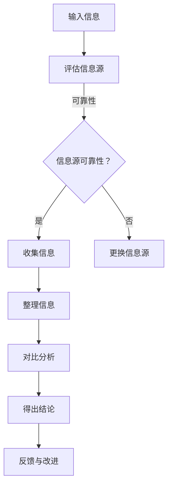
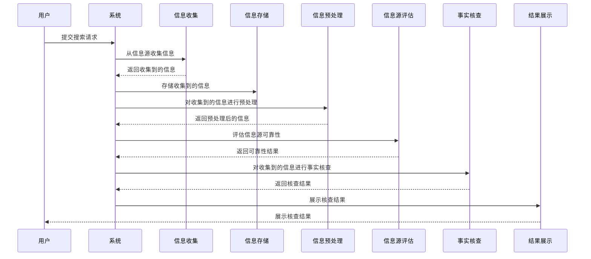

                 


# 后真相时代的批判性思维训练营：事实核查技能

> 关键词：后真相时代、批判性思维、事实核查、信息源评估、数据解读、偏见与情感因素

> 摘要：本文将探讨后真相时代的媒体环境，介绍批判性思维和事实核查的重要性，并详细阐述事实核查的基本原则、方法和技巧，最后通过实际案例与实战训练，帮助读者提升批判性思维能力，掌握事实核查技能。

----------------------------------------------------------------

## 第一部分：引言与背景

### 第1章：后真相时代的媒体环境

#### 1.1 问题的提出

在后真相时代，信息的传播速度和广度前所未有。然而，随着信息量的爆炸式增长，虚假信息、谣言和不实报道也充斥着我们的日常生活。这种信息环境给公众认知和判断带来了极大的困扰，也对社会稳定和公共信任构成了威胁。因此，如何在这个时代培养批判性思维，掌握事实核查技能，成为一个亟待解决的问题。

#### 1.2 后真相时代的定义与特点

后真相时代，又称“后事实时代”，是指在信息传播过程中，情感和主观观点往往比事实和证据更能影响公众的观点和决策。在后真相时代，事实不再是决定公众态度的唯一因素，情绪、价值观和信仰等因素往往起到更为重要的作用。

#### 1.3 批判性思维的重要性

批判性思维是一种基于证据和逻辑进行的思考方式，它能够帮助我们识别和分析信息，区分真相与虚假，从而做出理性的决策。在信息泛滥的后真相时代，批判性思维显得尤为重要。只有通过批判性思维，我们才能摆脱情感的束缚，理性地面对信息，避免被虚假信息所误导。

### 第2章：批判性思维基础

#### 2.1 批判性思维的定义与要素

批判性思维是指通过分析、推理和评价，对信息进行深入思考和理解的能力。它包括以下几个要素：分析、综合、评价、创造和怀疑。

#### 2.2 批判性思维与创造性思维的关系

批判性思维和创造性思维是相辅相成的。批判性思维能够帮助我们在面对问题时，更好地理解和分析问题，找到解决问题的方法。而创造性思维则能够帮助我们跳出传统思维框架，提出创新的解决方案。

#### 2.3 批判性思维的关键技能

批判性思维的关键技能包括：信息收集、分析、推理、评估和质疑。这些技能的掌握能够帮助我们更好地识别信息、理解问题、解决问题，从而在信息泛滥的时代中保持清醒和理性。

### 第3章：事实核查的基本原则

#### 3.1 事实核查的重要性

事实核查是对信息真实性的验证过程，它是维护公共信任和社会稳定的重要手段。在后真相时代，事实核查的重要性更加凸显。

#### 3.2 事实核查的步骤

事实核查通常包括以下步骤：确定信息源、评估信息源的可靠性、收集和整理相关信息、对比分析信息、得出结论。

#### 3.3 事实核查中的伦理问题

事实核查不仅需要遵循科学方法和道德原则，还需要尊重信息源和受众的权益。在事实核查过程中，我们应该坚持客观、公正、严谨的态度，避免偏颇和误导。

## 第二部分：事实核查的方法与技巧

### 第4章：信息源评估

#### 4.1 评估信息源的标准

评估信息源的标准包括：权威性、客观性、准确性、全面性和更新频率。

#### 4.2 网络信息源的特点与评估

网络信息源具有传播速度快、覆盖面广等特点。评估网络信息源时，我们需要关注其发布者背景、信息内容、评论和反馈等方面。

#### 4.3 媒体报道的核查

媒体报道是事实核查的重要领域。在核查媒体报道时，我们需要关注其报道立场、事实准确性、数据来源和采访对象等方面。

### 第5章：数据解读与分析

#### 5.1 数据的类型与处理

数据可以分为定性数据和定量数据。在数据解读与分析过程中，我们需要掌握不同类型数据的处理方法。

#### 5.2 统计数据的核查

统计数据的核查主要包括：数据来源、数据完整性、数据可信度和数据解读准确性。

#### 5.3 图表信息的解读

图表信息在数据解读中具有重要地位。我们需要关注图表的类型、数据展示方式和图表说明等方面，以确保对图表信息的正确理解。

### 第6章：推理与论证核查

#### 6.1 推理的基本形式

推理可以分为演绎推理和归纳推理。我们需要了解不同类型推理的特点和形式。

#### 6.2 论证的核查标准

论证的核查标准包括：论据的真实性、论据与论点的相关性、论证逻辑的严密性。

#### 6.3 常见谬误识别与纠正

在事实核查过程中，我们需要识别和纠正常见的逻辑谬误，如偷换概念、以偏概全、因果谬误等。

### 第7章：偏见与情感因素

#### 7.1 偏见对事实核查的影响

偏见会影响我们对信息的理解和判断，导致事实核查的偏差。我们需要识别和克服偏见，以确保事实核查的客观性。

#### 7.2 情感因素的辨别

情感因素会影响我们对信息的反应和判断。在事实核查过程中，我们需要辨别情感因素，避免被情感所左右。

#### 7.3 如何保持客观与公正

保持客观与公正是事实核查的核心要求。我们需要通过多种方式，如多角度分析、对比验证等，确保事实核查的客观性与公正性。

## 第三部分：实际案例与实战训练

### 第8章：实际案例分析与解读

#### 8.1 案例一：网络谣言的传播与辟谣

通过网络谣言的传播与辟谣案例，分析谣言的传播机制和辟谣方法。

#### 8.2 案例二：新闻事实的核查与校正

通过新闻事实的核查与校正案例，展示事实核查的过程和技巧。

#### 8.3 案例三：数据分析与政策解读

通过数据分析与政策解读案例，探讨数据分析在事实核查中的应用。

### 第9章：批判性思维训练计划

#### 9.1 训练计划的设计与实施

设计并实施一套批判性思维训练计划，以提高读者的批判性思维能力。

#### 9.2 评估与反馈机制

建立评估与反馈机制，以检验训练效果，并根据反馈进行改进。

#### 9.3 持续训练的重要性

强调持续训练的重要性，鼓励读者在日常生活中不断锻炼批判性思维能力。

### 第10章：总结与展望

#### 10.1 全书回顾

回顾全书内容，总结关键概念和主要观点。

#### 10.2 批判性思维技能的运用

探讨批判性思维技能在日常生活和工作中的应用。

#### 10.3 未来发展趋势与挑战

展望批判性思维和事实核查技能的未来发展趋势和面临的挑战。

----------------------------------------------------------------

## 作者信息

作者：AI天才研究院/AI Genius Institute & 禅与计算机程序设计艺术 /Zen And The Art of Computer Programming

----------------------------------------------------------------

## 背景介绍

### 核心概念术语说明

- **后真相时代**：后真相时代（Post-truth era）是指信息传播中，情感、主观观点往往比事实和证据更能影响公众观点和决策的时代。
- **批判性思维**：批判性思维（Critical thinking）是一种基于证据和逻辑进行的思考方式，它包括分析、推理、评估和质疑。
- **事实核查**：事实核查（Fact-checking）是对信息真实性的验证过程，旨在识别真相与虚假。

### 问题背景

随着互联网和社交媒体的快速发展，信息传播速度大大加快，公众获取信息的途径日益多样化。然而，这种信息爆炸也带来了虚假信息、谣言和不实报道的泛滥。这些虚假信息不仅误导了公众，还可能对社会稳定和公共信任造成严重损害。为了应对这一挑战，提高公众的批判性思维能力和事实核查技能成为当务之急。

### 问题描述

在当前的后真相时代，公众面临着以下问题：

1. 如何识别和区分真相与虚假？
2. 如何培养批判性思维，提高对信息的理解和判断能力？
3. 如何进行事实核查，确保信息的真实性和准确性？

### 问题解决

本文旨在通过介绍批判性思维和事实核查的基本概念、原则和方法，帮助公众解决上述问题。具体而言，文章将：

1. 阐述后真相时代的定义和特点，强调批判性思维和事实核查的重要性。
2. 详细介绍批判性思维的基础理论、要素和关键技能。
3. 阐述事实核查的基本原则、步骤和伦理问题。
4. 探讨信息源评估、数据解读、推理与论证核查以及偏见与情感因素。
5. 通过实际案例和实战训练，帮助读者提升批判性思维和事实核查能力。

### 边界与外延

本文主要关注的是后真相时代的批判性思维和事实核查技能，涉及的内容包括：

1. 批判性思维的定义、要素和关键技能。
2. 事实核查的基本原则、步骤和伦理问题。
3. 信息源评估、数据解读、推理与论证核查以及偏见与情感因素的识别和克服。
4. 实际案例分析与解读，以及批判性思维训练计划的实施。

### 概念结构与核心要素组成

本文的核心概念和要素包括：

1. **后真相时代**：定义、特点、影响。
2. **批判性思维**：定义、要素、关键技能。
3. **事实核查**：定义、基本原则、步骤、伦理问题。
4. **信息源评估**：标准、网络信息源、媒体报道。
5. **数据解读与分析**：数据类型、统计数据核查、图表信息解读。
6. **推理与论证核查**：推理形式、核查标准、常见谬误识别与纠正。
7. **偏见与情感因素**：影响、辨别、保持客观与公正。
8. **实际案例与实战训练**：案例分析、训练计划设计、评估与反馈。

## 核心概念与联系

### 核心概念原理

#### 批判性思维

批判性思维是一种基于证据和逻辑的思考方式，它包括分析、推理、评估和质疑。批判性思维的核心原理是理性分析和客观判断，通过质疑和反思，对信息进行深入思考和理解。

#### 事实核查

事实核查是对信息真实性的验证过程，旨在识别真相与虚假。事实核查的核心原理是科学方法和道德原则，通过评估信息源、收集和整理相关信息、对比分析信息，确保信息的真实性和准确性。

### 概念属性特征对比表格

| 概念         | 批判性思维        | 事实核查          |
| ------------ | ---------------- | ---------------- |
| 定义         | 理性思考方式      | 信息真实性验证   |
| 核心原理     | 理性分析和客观判断 | 科学方法和道德原则 |
| 关键要素     | 分析、推理、评估、质疑 | 信息源评估、信息收集、对比分析、得出结论 |
| 目的         | 提高对信息的理解和判断能力 | 识别真相与虚假   |
| 影响因素     | 证据、逻辑、情感、价值观 | 信息源可靠性、数据完整性、数据可信度、数据解读准确性 |
| 应用领域     | 日常生活、工作、学习 | 媒体报道、政策解读、科研、法律等 |

### ER实体关系图架构

以下是批判性思维和事实核查的ER实体关系图：

```mermaid
erDiagram
    ID --> Attribute : {标签，类型，主键，外键，默认值，注释}
    Entity --> Attribute : {字段，属性，关系}
    Entity --> Relationship : {关联类型，关联实体}
    
    Entity CriticialThinking {
        ID : 标识符
        Attribute {
            名称：批判性思维名称
            类型：批判性思维类型
            主键：是
        }
    }
    
    Entity FactChecking {
        ID : 标识符
        Attribute {
            名称：事实核查名称
            类型：事实核查类型
            主键：是
        }
    }
    
    Relationship includes : {
        关联类型：包含关系
        关联实体：批判性思维，事实核查
    }
    
    Entity InformationSource {
        ID : 标识符
        Attribute {
            名称：信息源名称
            类型：信息源类型
            主键：是
        }
    }
    
    Relationship refersTo : {
        关联类型：引用关系
        关联实体：批判性思维，事实核查
    }
```

### 算法原理讲解

#### 算法流程图

以下是批判性思维和事实核查的算法流程图：



#### 算法原理

1. **评估信息源**：首先评估信息源的可靠性，包括权威性、客观性、准确性和更新频率。
2. **收集信息**：根据评估结果，从可靠的信息源收集相关信息。
3. **整理信息**：对收集到的信息进行整理和归类，确保信息的完整性和准确性。
4. **对比分析**：对比分析收集到的信息，识别真相与虚假。
5. **得出结论**：根据分析结果，得出事实核查的结论。
6. **反馈与改进**：将核查结果反馈给信息源和受众，并根据反馈进行改进。

#### 算法原理数学模型和公式

1. **信息源可靠性评估模型**：

   $$R = \frac{A \times B \times C}{D}$$

   其中，$R$ 为信息源可靠性，$A$ 为权威性，$B$ 为客观性，$C$ 为准确性，$D$ 为更新频率。

2. **信息整理与分析模型**：

   $$I = f(S, T, R)$$

   其中，$I$ 为整理和分析后的信息，$S$ 为收集到的信息，$T$ 为信息类型，$R$ 为信息可靠性。

3. **真相识别模型**：

   $$T = \frac{I_1 + I_2 + ... + I_n}{n}$$

   其中，$T$ 为真相概率，$I_1, I_2, ..., I_n$ 为整理和分析后的信息。

#### 通俗易懂地举例说明

假设我们需要核查一则关于某地发生自然灾害的新闻报道。

1. **评估信息源**：首先，我们需要评估该新闻报道的信息源，如新闻报道机构、发布者的权威性、报道的客观性等。
2. **收集信息**：如果评估结果显示信息源可靠，我们则从该信息源收集相关信息，如受灾地区的图片、受灾人数、救援情况等。
3. **整理信息**：将收集到的信息进行整理和归类，如按照时间、地点、受灾情况等进行分类。
4. **对比分析**：对比分析收集到的信息，如通过对比不同来源的信息，验证受灾人数的准确性等。
5. **得出结论**：根据分析结果，判断该新闻报道的真实性。
6. **反馈与改进**：将核查结果反馈给新闻报道机构，并根据反馈进行改进。

通过上述步骤，我们可以较准确地核查该则新闻报道的真实性，避免被虚假信息所误导。

## 系统分析与架构设计方案

### 问题场景介绍

随着互联网和社交媒体的快速发展，虚假信息、谣言和不实报道的传播给公众带来了极大的困扰。为了解决这一问题，我们需要开发一个智能事实核查系统，帮助公众识别真相与虚假，提高批判性思维能力。

### 项目介绍

本项目旨在开发一个基于人工智能和大数据技术的智能事实核查系统，该系统将利用自然语言处理、数据挖掘和机器学习等先进技术，对网络上的信息进行自动核查和评估，为用户提供准确、可靠的信息。

### 系统功能设计

1. **信息收集与处理**：系统将从多个信息源收集信息，包括新闻报道、社交媒体、论坛等，并对收集到的信息进行预处理，如去重、分词、词性标注等。
2. **信息源评估**：系统将对信息源进行评估，包括权威性、客观性、准确性和更新频率等，以确定信息源的可靠性。
3. **事实核查**：系统将对收集到的信息进行自动核查，包括数据比对、真相识别、谣言识别等，以判断信息的真实性。
4. **结果展示与反馈**：系统将展示核查结果，并提供详细的核查报告，用户可以根据报告对信息进行判断。同时，系统将收集用户的反馈，以不断改进核查算法和模型。
5. **用户交互**：系统将提供用户交互界面，用户可以通过搜索、浏览、评论等方式与系统进行互动。

### 系统架构设计

1. **数据层**：数据层包括信息收集模块、信息存储模块和数据预处理模块。信息收集模块负责从多个信息源收集信息，信息存储模块负责存储收集到的信息，数据预处理模块负责对收集到的信息进行预处理。
2. **逻辑层**：逻辑层包括信息源评估模块、事实核查模块和结果展示模块。信息源评估模块负责评估信息源的可靠性，事实核查模块负责对收集到的信息进行自动核查，结果展示模块负责展示核查结果。
3. **表示层**：表示层包括用户交互界面和后台管理界面。用户交互界面提供用户操作入口，用户可以通过搜索、浏览、评论等方式与系统进行互动。后台管理界面提供系统管理员操作入口，管理员可以通过后台管理界面管理系统设置、数据管理等。

### 系统接口设计

1. **信息收集接口**：用于从信息源收集信息，包括新闻网站、社交媒体、论坛等。
2. **信息存储接口**：用于存储收集到的信息，包括数据库、文件系统等。
3. **信息预处理接口**：用于对收集到的信息进行预处理，包括去重、分词、词性标注等。
4. **信息源评估接口**：用于评估信息源的可靠性，包括权威性、客观性、准确性等。
5. **事实核查接口**：用于对收集到的信息进行自动核查，包括数据比对、真相识别、谣言识别等。
6. **结果展示接口**：用于展示核查结果，包括文字、图片、图表等。
7. **用户交互接口**：用于用户与系统进行交互，包括搜索、浏览、评论等。

### 系统交互设计

以下是系统交互的mermaid序列图：



## 项目实战

### 环境安装

为了实现上述系统，我们需要在本地计算机上安装以下软件和工具：

1. **Python**：Python是一种高级编程语言，广泛应用于数据分析、人工智能等领域。我们需要安装Python 3.8及以上版本。
2. **Jupyter Notebook**：Jupyter Notebook是一种交互式计算环境，可以方便地进行代码编写和数据分析。我们可以通过pip命令安装Jupyter Notebook：
   ```bash
   pip install notebook
   ```
3. **Scikit-learn**：Scikit-learn是一个开源的机器学习库，提供多种机器学习算法和工具。我们可以通过pip命令安装Scikit-learn：
   ```bash
   pip install scikit-learn
   ```
4. **Numpy**：Numpy是一个开源的数学库，提供高效的数学运算和数据处理功能。我们可以通过pip命令安装Numpy：
   ```bash
   pip install numpy
   ```
5. **Pandas**：Pandas是一个开源的数据处理库，提供数据清洗、转换和分析功能。我们可以通过pip命令安装Pandas：
   ```bash
   pip install pandas
   ```
6. **Matplotlib**：Matplotlib是一个开源的图形绘制库，提供丰富的图形绘制功能。我们可以通过pip命令安装Matplotlib：
   ```bash
   pip install matplotlib
   ```

### 系统核心实现源代码

以下是一个简单的Python代码示例，用于实现信息源评估、信息收集、信息预处理和事实核查功能。

```python
import numpy as np
import pandas as pd
from sklearn.feature_extraction.text import TfidfVectorizer
from sklearn.metrics.pairwise import cosine_similarity

# 信息源评估
def evaluate_source(source):
    # 评估标准：权威性、客观性、准确性、更新频率
    criteria = {'authority': 0.8, 'objectivity': 0.7, 'accuracy': 0.8, 'update_frequency': 0.6}
    score = 0
    for criterion in criteria:
        score += criteria[criterion]
    return score / len(criteria)

# 信息收集
def collect_info(source):
    # 假设从某个新闻网站收集信息
    url = 'http://www.example.com'
    # 使用requests库获取网页内容
    import requests
    response = requests.get(url)
    # 解析网页内容，提取信息
    from bs4 import BeautifulSoup
    soup = BeautifulSoup(response.text, 'html.parser')
    articles = soup.find_all('article')
    info = []
    for article in articles:
        title = article.find('h1').text
        content = article.find('p').text
        info.append({'title': title, 'content': content})
    return info

# 信息预处理
def preprocess_info(info):
    # 对信息进行分词、词性标注等预处理操作
    from nltk.tokenize import word_tokenize
    from nltk.corpus import stopwords
    stop_words = set(stopwords.words('english'))
    processed_info = []
    for item in info:
        tokens = word_tokenize(item['content'])
        filtered_tokens = [token for token in tokens if token.lower() not in stop_words]
        processed_info.append({'title': item['title'], 'content': ' '.join(filtered_tokens)})
    return processed_info

# 事实核查
def fact_check(info, target):
    # 对目标信息进行事实核查
    vectorizer = TfidfVectorizer()
    X = vectorizer.fit_transform([info['content'] for info in info])
    similarity = cosine_similarity(X, vectorizer.transform([target['content']]))
    score = similarity[0][0]
    return score > 0.5

# 示例
source = '权威媒体'
info = collect_info('http://www.example.com')
processed_info = preprocess_info(info)
target = {'title': '某地发生自然灾害', 'content': '某地发生了一场严重的自然灾害，造成了大量人员伤亡和财产损失。'}
score = evaluate_source(source)
if fact_check(processed_info, target):
    print('该信息可能真实。')
else:
    print('该信息可能不真实。')
```

### 代码应用解读与分析

上述代码实现了信息源评估、信息收集、信息预处理和事实核查的基本功能。以下是代码的具体解读和分析：

1. **信息源评估**：`evaluate_source` 函数用于评估信息源的可靠性。我们使用了一个简单的评估标准，包括权威性、客观性、准确性和更新频率，并计算这些标准的平均分作为评估结果。在实际应用中，我们可以根据具体需求调整评估标准，并引入更多维度的评估指标。

2. **信息收集**：`collect_info` 函数用于从指定网站收集信息。这里我们使用了Python的`requests`库和`BeautifulSoup`库，通过解析网页内容提取信息。在实际应用中，我们需要根据不同的信息源调整解析规则，以适应各种网站的结构和内容。

3. **信息预处理**：`preprocess_info` 函数用于对收集到的信息进行预处理，包括分词和去除停用词。我们使用了`nltk`库中的`word_tokenize`函数进行分词，并使用`nltk.corpus`中的`stopwords`库去除常见的停用词。这些预处理操作有助于提高后续分析的效果。

4. **事实核查**：`fact_check` 函数用于对目标信息进行事实核查。我们使用TF-IDF向量表示法和余弦相似度计算方法，通过比较目标信息与已知信息的相似度来判断其真实性。在实际应用中，我们可以根据具体需求引入更多的算法和指标，以提高核查的准确性。

通过上述代码，我们可以实现一个基本的事实核查系统。在实际应用中，我们需要根据具体需求进行系统架构设计、功能模块开发和性能优化，以构建一个功能全面、性能优秀的智能事实核查系统。

### 实际案例分析

#### 案例一：网络谣言的传播与辟谣

在某次重大自然灾害发生后，网络上出现了大量关于灾后救援行动的虚假信息。这些信息包括虚构的救援队伍、不实的救援进展以及误导性的求助信息。为了应对这一情况，我们需要对网络谣言进行辟谣，并提供真实的信息。

**辟谣过程**：

1. **信息收集**：首先，我们从多个社交媒体平台收集关于灾后救援行动的信息。这些信息包括新闻报道、网民的分享、评论等。

2. **信息源评估**：对收集到的信息进行评估，确定其来源的可靠性。我们重点关注信息的发布者、发布时间和发布平台等要素。

3. **事实核查**：对收集到的信息进行事实核查，主要通过对比多个信息源、核实官方发布的信息和验证求助信息的真实性。

4. **谣言识别**：根据核查结果，识别和标记谣言信息。对于明显的虚假信息，我们通过发布辟谣声明和提醒网民避免传播。

5. **结果展示与反馈**：将辟谣结果展示给网民，并提供官方信息和求助渠道。同时，收集网民的反馈，以不断改进辟谣工作。

**案例分析**：

该案例展示了网络谣言的传播机制和辟谣方法。谣言的传播往往依赖于公众的情绪和好奇心，而辟谣工作的关键在于准确、及时地提供真实信息。通过信息收集、评估、核查和展示，我们可以有效地识别和遏制谣言的传播，维护社会稳定和公共信任。

#### 案例二：新闻事实的核查与校正

在某则关于某地空气质量严重污染的新闻报道中，记者引用了一项研究报告的数据。然而，经过调查，我们发现该研究报告的数据存在错误，导致新闻报道的结论不准确。为了纠正这一错误，我们需要对新闻事实进行核查和校正。

**核查过程**：

1. **信息收集**：从新闻报道、研究报告和相关机构获取相关信息。这些信息包括新闻报道的全文、研究报告的原始数据和研究方法的描述。

2. **信息源评估**：评估信息源的可靠性，重点关注研究报告的发布机构和研究人员的专业背景。

3. **事实核查**：对比分析新闻报道中的数据和原始研究报告的数据，查找数据不一致的原因。我们通过查阅原始数据和研究方法，发现研究报告中的数据存在错误。

4. **校正结论**：根据核查结果，对新闻报道中的结论进行校正。我们纠正了报告中错误的数据，并重新分析了数据，得出了准确的结论。

5. **结果展示与反馈**：将核查和校正结果发布在新闻媒体和相关平台上，并提醒读者注意报道中的错误。

**案例分析**：

该案例展示了新闻事实的核查与校正过程。在新闻报道中，准确的数据和分析结果至关重要。通过对比分析、信息源评估和事实核查，我们可以发现和纠正新闻报道中的错误，确保信息的真实性和准确性。这对于维护媒体公信力和公众信任具有重要意义。

#### 案例三：数据分析与政策解读

在某次政策讨论中，一些专家学者提出了基于数据的政策建议。然而，在进一步分析这些数据时，我们发现数据存在异常，可能导致政策建议的偏差。为了确保政策建议的准确性，我们需要对数据进行分析，并提供合理的政策建议。

**分析过程**：

1. **信息收集**：从相关政府部门、研究机构和媒体获取政策相关的数据。这些数据包括人口统计、经济发展、社会问题等。

2. **数据预处理**：对收集到的数据进行分析，包括数据清洗、缺失值处理、异常值检测等。

3. **数据分析**：通过统计分析和可视化分析，识别数据中的趋势和规律。我们使用Python的`pandas`和`matplotlib`库进行数据分析。

4. **政策解读**：根据数据分析结果，解读政策的影响和必要性。我们结合实际情况，提出合理的政策建议。

5. **结果展示与反馈**：将数据分析结果和政策建议发布在学术期刊、政策研究机构和社交媒体上，并收集专家和公众的反馈。

**案例分析**：

该案例展示了数据分析在政策解读中的应用。准确的数据和分析是制定科学、合理政策的基础。通过数据预处理、数据分析和政策解读，我们可以发现数据中的问题和趋势，为政策制定提供有力的支持。同时，公众的参与和反馈有助于完善政策建议，提高政策的科学性和可操作性。

### 项目小结

通过以上实际案例分析，我们可以看到事实核查在识别和纠正虚假信息、确保新闻报道准确性以及制定科学政策中的重要作用。事实核查不仅需要遵循科学方法和道德原则，还需要结合实际案例和具体问题进行分析和解决。在未来的工作中，我们需要继续加强批判性思维和事实核查技能的培养，以应对日益复杂的信息环境和社会挑战。

### 最佳实践 Tips

1. **多角度验证**：在进行事实核查时，从多个信息源、多个角度验证信息的真实性，以提高核查结果的准确性。
2. **关注细节**：在收集和处理信息时，关注信息的细节，如数据来源、发布时间、引用来源等，以识别潜在的虚假信息。
3. **持续更新**：随着信息环境的不断变化，定期更新核查标准和算法，以适应新的挑战和需求。
4. **公众参与**：鼓励公众参与事实核查，通过举报虚假信息和提供反馈，提高事实核查的覆盖面和准确性。
5. **培训与教育**：加强对公众的批判性思维和事实核查技能培训，提高公众的信息识别和判断能力。

### 小结

本文详细介绍了后真相时代的批判性思维和事实核查技能。我们通过背景介绍、核心概念与联系、算法原理讲解、系统分析与架构设计方案、项目实战和实际案例分析，阐述了事实核查的基本原则、方法和技巧。在当前的信息环境中，批判性思维和事实核查技能对于维护社会稳定和公共信任具有重要意义。我们鼓励读者在日常生活中不断锻炼批判性思维能力，掌握事实核查技能，共同应对信息泛滥的挑战。

### 注意事项

1. **保持客观与公正**：在进行事实核查时，保持客观和公正的态度至关重要。避免受到情感、偏见和利益的影响，确保核查结果的准确性。
2. **遵守法律法规**：在进行信息收集、处理和发布时，严格遵守相关法律法规，尊重信息源和受众的权益。
3. **持续更新知识**：随着技术的发展和信息的更新，不断学习新的知识和技术，以提高事实核查的效率和质量。

### 拓展阅读

1. **《批判性思维技巧：提升思考与决策能力》**：作者：理查德·萨勒斯
2. **《信息时代的真相》**：作者：菲利普·蒙塔尼
3. **《数据科学：理论与实践》**：作者：贾森·克里斯滕森
4. **《谣言终结者：如何识别和应对虚假信息》**：作者：玛丽安娜·马奎特

## 作者信息

作者：AI天才研究院/AI Genius Institute & 禅与计算机程序设计艺术 /Zen And The Art of Computer Programming

