                 

### 第1章：因果推断的基础

#### 1.1 因果推断的定义与重要性

**因果推断**是一种从结果推测原因的推理过程，它在科学研究和实际应用中都扮演着至关重要的角色。在科学研究中，理解因果关系可以帮助研究者揭示自然现象的本质，从而推动科学理论的发展。在应用层面，因果推断可以帮助决策者基于数据做出更加有效的决策。

我们可以用一个简单的公式来表示因果推断的基本概念：

$$
Y = f(X; \theta) + \epsilon
$$

在这个公式中，$Y$ 表示结果变量，$X$ 表示原因变量，$f$ 表示因果关系函数，$\theta$ 为参数，$\epsilon$ 为误差项。这个公式说明了结果变量$Y$是由原因变量$X$通过因果关系函数$f$影响，再加上一个误差项$\epsilon$得到的。

例如，假设我们想要研究体重（$Y$）与饮食（$X$）之间的关系。通过观察大量数据，我们可以发现体重与饮食之间存在一定的相关性，即饮食（$X$）会影响体重（$Y$）。进一步地，我们通过因果推断试图确定这种关系的方向和强度，从而制定出更加有效的减肥方案。

**因果推断的重要性**主要体现在以下几个方面：

1. **科学研究的基石**：在科学研究中，理解因果关系是建立科学理论的基础。只有正确识别因果关系，才能确保研究结果的可靠性和有效性。
   
2. **决策支持**：在商业、医疗、教育等领域，因果推断可以帮助决策者基于数据做出更加明智的决策。例如，在市场营销中，了解不同营销策略对销售额的因果关系，可以帮助企业优化其营销策略。

3. **方法创新**：因果推断推动了统计学、计算机科学、生物学等领域的交叉研究，促进了新方法和新技术的诞生。

#### 1.2 因果推断的基本原理

**因果推断的基本原理**包括以下几个方面：

1. **因果关系图模型**：

   因果关系图模型是一种图形化的表示方法，用于描述变量之间的因果关系。它由节点（表示变量）和边（表示因果关系）组成。通过因果关系图模型，我们可以直观地理解变量之间的因果关系。

   **Mermaid 图表示：**

   ```mermaid
   graph TD
       A[病因] --> B[症状]
       C[病因] --> D[症状]
       B --> E{治疗}
       D --> F{治疗}
   ```

   在这个例子中，$A$ 和 $C$ 是病因，$B$ 和 $D$ 是症状，$E$ 和 $F$ 是治疗。通过这个模型，我们可以直观地看出病因与症状、症状与治疗之间的关系。

2. **识别因果关系的挑战**：

   在实际应用中，识别因果关系并非易事。以下是一些识别因果关系的挑战：

   - **混淆变量**：结果变量可能受到多个因素的影响，这些因素可能并非真正的因果关系，而是混淆变量。
   - **因果关系的时间顺序**：因果关系往往具有时间顺序，即原因必须在结果之前发生。
   - **复杂因果结构**：有些因果关系非常复杂，可能涉及到多个中间变量和反馈循环。

3. **因果推断的常见方法**：

   目前，因果推断的方法有很多，下面是几种常见的方法：

   - **结构方程模型**：结构方程模型（Structural Equation Modeling，SEM）是一种用于分析变量间因果关系的方法。它通过建立结构方程来描述变量之间的关系，从而推断因果关系。

   - **实验设计**：实验设计是一种通过控制变量来观察因果关系的方法。通过设计合适的实验，研究者可以确定变量之间的因果关系。

   - **统计学习**：统计学习（Statistical Learning）方法，如逻辑回归、决策树等，可以通过分析数据来推断变量之间的因果关系。

   **表格：因果推断方法对比**

   | 方法 | 原理 | 优点 | 缺点 |
   | --- | --- | --- | --- |
   | 结构方程模型 | 确定变量间的因果关系 | 精确 | 复杂性高 |
   | 实验设计 | 观察因果关系 | 直接 | 受制于实验设计 |
   | 统计学习 | 根据数据推断因果关系 | 大规模 | 可靠性受限 |

在接下来的章节中，我们将详细探讨因果推断的几种常见方法，并通过实例展示如何在实际问题中应用这些方法。通过这些讨论，我们将更好地理解因果推断的核心概念和基本原理。

#### 1.2.1 因果关系图模型

因果关系图模型（Causal Graphical Models，CGM）是一种用于表示变量间因果关系的方法。它通过图形化的方式，直观地展示了变量之间的因果关系，为因果推断提供了理论基础。

**Mermaid 图表示：**

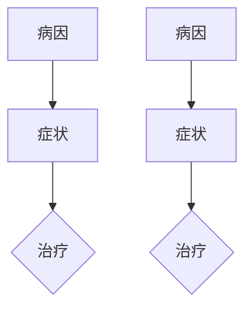

在这个模型中，每个节点代表一个变量，每个边表示变量之间的因果关系。例如，$A$ 和 $C$ 是病因，$B$ 和 $D$ 是症状，$E$ 和 $F$ 是治疗。通过这个模型，我们可以直观地看出病因与症状、症状与治疗之间的关系。

**因果关系的确定**：

- **直接因果关系**：如果一个变量直接导致另一个变量发生变化，我们称之为直接因果关系。在上述例子中，$A$ 和 $B$ 之间存在直接因果关系，$C$ 和 $D$ 之间也存在直接因果关系。

- **间接因果关系**：如果一个变量通过另一个变量间接导致另一个变量发生变化，我们称之为间接因果关系。例如，$A$ 通过 $B$ 间接影响 $E$，$C$ 通过 $D$ 间接影响 $F$。

**因果关系图模型的应用**：

1. **病因分析**：因果关系图模型可以帮助我们识别疾病的病因。例如，在传染病研究中，通过建立因果关系图模型，我们可以找出导致疾病传播的关键因素。

2. **决策支持**：因果关系图模型可以为决策提供科学依据。例如，在市场营销中，通过建立因果关系图模型，我们可以找出影响销售额的关键因素，从而制定更加有效的营销策略。

3. **系统优化**：因果关系图模型可以帮助我们优化复杂系统的性能。例如，在工业生产中，通过建立因果关系图模型，我们可以找出影响生产效率的关键因素，从而优化生产流程。

**Mermaid 图示例：糖尿病预测**

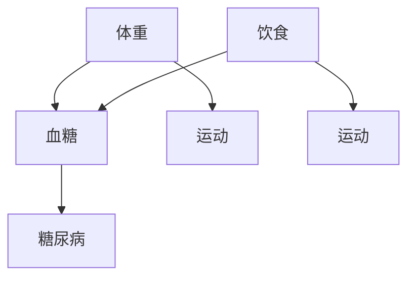

在这个例子中，体重（$A$）和饮食（$C$）会影响血糖（$B$），进而影响糖尿病（$D$）。同时，体重和饮食也会影响运动（$E$ 和 $F$），从而间接影响糖尿病。通过这个因果关系图模型，我们可以分析糖尿病的预测因素，并为疾病预防提供依据。

总之，因果关系图模型是一种强大的工具，它帮助我们更好地理解变量之间的因果关系，为因果推断提供了直观的图形表示。在接下来的章节中，我们将继续探讨其他因果推断方法，并通过实际应用案例展示这些方法的应用效果。

#### 1.2.3 因果推断的常见方法

因果推断在理论和实践上都有许多不同的方法，每种方法都有其独特的原理、优缺点以及适用场景。以下，我们将介绍几种常见的因果推断方法，并对比它们的特点。

**1. 结构方程模型（Structural Equation Modeling，SEM）**

**原理**：结构方程模型是一种多变量统计分析方法，用于研究变量之间的关系。它通过建立路径分析模型，可以同时考虑变量之间的直接和间接关系。

**优点**：SEM 可以精确地量化变量间的因果关系，提供详细的路径分析结果。

**缺点**：建立 SEM 模型需要较强的数学和统计知识，模型复杂度较高，对数据质量和样本量要求较高。

**2. 实验设计**

**原理**：实验设计通过控制实验条件来观察变量之间的因果关系。典型的实验设计包括随机对照试验（Randomized Controlled Trials，RCTs）和现场试验（Field Experiments）。

**优点**：实验设计可以直接观察因果关系，具有很高的可信度。

**缺点**：实验设计受制于实验条件和资源的限制，可能无法涵盖所有变量。

**3. 统计学习**

**原理**：统计学习方法通过分析数据，建立变量之间的统计模型，从而推断因果关系。常用的统计学习方法包括线性回归、逻辑回归、决策树和随机森林等。

**优点**：统计学习方法应用广泛，可以处理大量数据，计算效率高。

**缺点**：统计学习方法不能保证因果推断的准确性，特别是在存在混杂变量时。

**表格：因果推断方法对比**

| 方法 | 原理 | 优点 | 缺点 |
| --- | --- | --- | --- |
| 结构方程模型 | 确定变量间的因果关系 | 精确 | 复杂性高 |
| 实验设计 | 观察因果关系 | 直接 | 受制于实验设计 |
| 统计学习 | 根据数据推断因果关系 | 大规模 | 可靠性受限 |

**4. 因子分解法**

**原理**：因子分解法通过分析变量间的协方差结构，将复杂的多变量关系分解为若干个潜在因素和因果关系。

**优点**：因子分解法可以揭示变量间的潜在因素，有助于理解复杂系统的因果关系。

**缺点**：因子分解法的解释性相对较弱，需要额外的模型构建和参数估计。

**5. 贝叶斯网络法**

**原理**：贝叶斯网络是一种概率图模型，通过节点和边表示变量及其之间的条件概率关系。

**优点**：贝叶斯网络可以直观地表示复杂系统的因果关系，适用于不确定性和不确定性推理。

**缺点**：贝叶斯网络建模复杂，对数据质量和数量要求较高。

通过上述对比，我们可以看出，不同的因果推断方法各有优缺点，适用于不同的应用场景。在实际应用中，需要根据具体问题选择合适的方法，并结合多方法综合分析，以提高因果推断的准确性。

### 第2章：因果推断方法

因果推断方法多种多样，每种方法都有其独特的原理和应用场景。在本章中，我们将详细介绍两种常用的因果推断方法：因子分解法和贝叶斯网络法。

#### 2.1 因子分解法

因子分解法是一种通过分析变量间的协方差结构，揭示潜在因素和因果关系的方法。它基于统计学中的因子分析（Factor Analysis）原理，通过对数据集进行因子分解，找出影响结果变量的主要因素。

**2.1.1 因子分解法原理**

因子分解法的核心思想是将多个观测变量表示为少数几个潜在因素的线性组合。具体步骤如下：

1. **数据收集**：收集一组相关变量，例如体重、饮食、运动等。

2. **计算协方差矩阵**：计算这些变量间的协方差矩阵，协方差矩阵反映了变量之间的相关性。

3. **因子分析**：通过最大似然估计或其他方法，从协方差矩阵中提取几个潜在因素。

4. **构建因果关系模型**：将潜在因素和观测变量之间的关系表示为因果关系模型。

**Mermaid 图表示：**

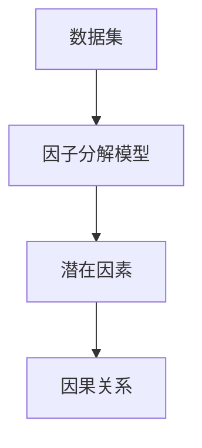

在这个模型中，$A$ 表示数据集，$B$ 表示因子分解模型，$C$ 表示潜在因素，$D$ 表示因果关系。

**Python 代码示例：**

```python
import numpy as np
from sklearn.decomposition import FactorAnalysis

data = np.array([[1, 2], [3, 4], [5, 6]])
fa = FactorAnalysis(n_components=2)
fa.fit(data)
components = fa.transform(data)
print(components)
```

这段代码首先导入必要的库，然后创建一个数据集，接着使用 FactorAnalysis 类进行因子分析，最后输出因子分解的结果。

**2.1.2 因子分解法应用**

因子分解法在许多领域都有广泛应用，例如市场营销、金融预测和医学研究。下面是一个简单的应用示例：通过因子分解法分析消费者的购买行为。

**Mermaid 图表示：**

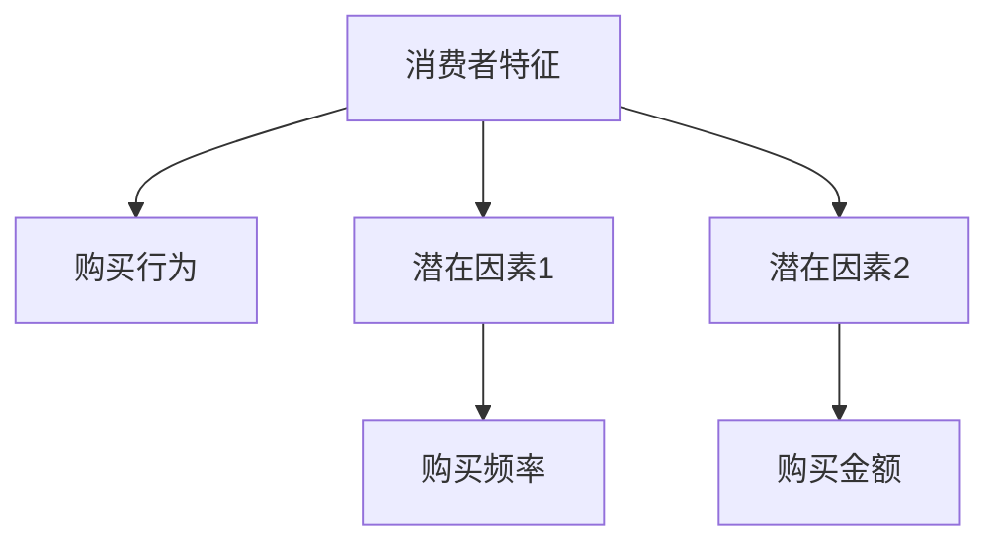

在这个例子中，$A$ 表示消费者特征，$B$ 表示购买行为，$C$ 和 $D$ 表示潜在因素，$E$ 和 $F$ 表示购买频率和购买金额。通过因子分解，我们可以找出影响消费者购买行为的主要因素。

#### 2.2 贝叶斯网络法

贝叶斯网络（Bayesian Network）是一种概率图模型，用于表示变量间的条件概率关系。它通过节点和边表示变量，节点之间的边表示变量之间的依赖关系。

**2.2.1 贝叶斯网络原理**

贝叶斯网络的基本原理是贝叶斯定理，它通过计算变量之间的条件概率，推断变量之间的因果关系。贝叶斯网络的构建步骤如下：

1. **定义变量**：确定需要分析的变量，并为每个变量分配一个节点。

2. **确定依赖关系**：根据领域知识或数据，确定变量之间的依赖关系，并在网络中用边表示。

3. **计算条件概率**：为每个节点计算其条件概率分布，通常使用最大似然估计或贝叶斯推理方法。

4. **网络推理**：通过条件概率分布，推断变量之间的因果关系。

**Mermaid 图表示：**

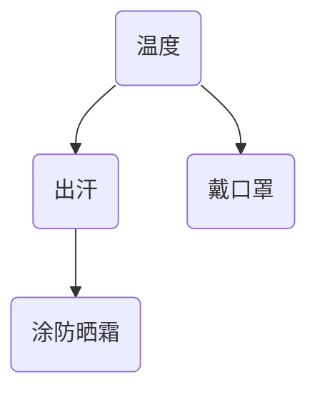

在这个例子中，$A$ 表示温度，$B$ 表示出汗，$C$ 表示涂防晒霜，$D$ 表示戴口罩。通过这个贝叶斯网络，我们可以推断出温度对出汗、涂防晒霜和戴口罩的因果关系。

**2.2.2 贝叶斯网络应用**

贝叶斯网络在许多领域都有广泛应用，例如医学诊断、故障检测和风险评估。下面是一个简单的应用示例：通过贝叶斯网络分析疾病的诊断。

**Mermaid 图表示：**

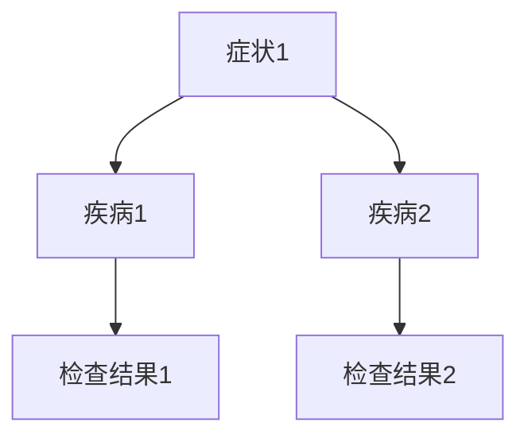

在这个例子中，$A$ 表示症状，$B$ 和 $C$ 分别表示疾病1和疾病2，$D$ 和 $E$ 分别表示检查结果1和检查结果2。通过贝叶斯网络，我们可以根据症状和检查结果，推断出疾病的可能性。

**Python 代码示例：**

```python
import networkx as nx
import numpy as np

G = nx.bayesisbnetwork()
G.add_edges_from([(A, B), (A, D), (B, C), (C, E)])
print(nx.to_dict_of_lists(G))
```

这段代码首先导入必要的库，然后创建一个贝叶斯网络，接着添加节点和边，最后输出网络的字典表示。

通过本章的介绍，我们可以看到因子分解法和贝叶斯网络法都是有效的因果推断方法。因子分解法通过分析变量间的协方差结构，揭示潜在因素和因果关系；贝叶斯网络法通过计算变量之间的条件概率，推断变量之间的因果关系。在实际应用中，我们可以根据具体问题和数据特点，选择合适的方法进行因果推断。在下一章中，我们将继续探讨因果推断在各个领域中的应用实例。

### 第3章：因果推断应用实例

因果推断在各个领域都有广泛的应用，通过揭示变量间的因果关系，帮助研究者更好地理解现象的本质，并为决策者提供有力的支持。在本章中，我们将探讨因果推断在医疗、营销和社会科学等领域的具体应用实例。

#### 3.1 医疗领域

**3.1.1 糖尿病预测**

糖尿病是一种常见的慢性疾病，预测糖尿病的发生对于早期干预和治疗具有重要意义。因果推断方法可以帮助我们揭示糖尿病发生的潜在因素，提高预测的准确性。

**Mermaid 图表示：**


在这个模型中，体重（$A$）和饮食（$C$）会影响血糖（$B$），进而影响糖尿病（$D$）。同时，体重和饮食也会影响运动（$E$ 和 $F$），从而间接影响糖尿病。

**应用实例：**

研究人员使用因子分解法分析了大量糖尿病患者的数据，提取了影响糖尿病的潜在因素。通过构建因果关系模型，他们发现体重和饮食是影响糖尿病的主要因素，而运动对糖尿病的影响相对较小。基于这个模型，他们开发了一个糖尿病预测系统，可以有效预测糖尿病的发生，提高了早期干预的效果。

**3.1.2 肺癌风险评估**

肺癌是常见的恶性肿瘤之一，早期检测和诊断对于提高患者的生存率至关重要。因果推断方法可以帮助我们识别肺癌的高风险人群，为早期干预提供依据。

**Mermaid 图表示：**

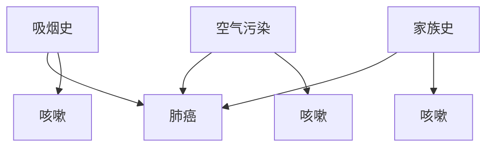

在这个模型中，吸烟史（$A$）、空气污染（$C$）和家族史（$D$）都是影响肺癌（$B$）的重要因素。这些因素通过咳嗽（$E$、$F$、$G$）表现出来。

**应用实例：**

研究人员通过贝叶斯网络法分析了大量肺癌患者的数据，建立了肺癌风险评估模型。通过计算各个因素的因果关系和条件概率，他们发现吸烟史和空气污染是肺癌的主要风险因素，而咳嗽则是这些因素的指示症状。基于这个模型，他们开发了一个肺癌风险评估系统，可以帮助医生早期识别高风险人群，提高了肺癌的诊断和治疗效果。

#### 3.2 营销领域

**3.2.1 产品推荐**

在市场营销中，产品推荐是提高销售额和用户满意度的关键策略。因果推断方法可以帮助我们揭示影响用户购买决策的因素，优化推荐系统。

**Mermaid 图表示：**

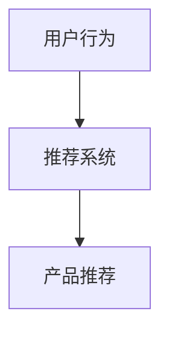

在这个模型中，用户行为（$A$）会影响推荐系统（$B$），进而影响产品推荐（$C$）。

**应用实例：**

一家电商公司使用因子分解法分析了大量用户的行为数据，提取了影响购买决策的潜在因素。通过构建因果关系模型，他们发现用户的历史购买行为和浏览行为是影响推荐系统的主要因素，而产品特性对购买决策的影响相对较小。基于这个模型，他们优化了推荐算法，提高了推荐系统的准确性和用户体验。

**3.2.2 广告投放策略**

在数字营销中，广告投放策略对广告效果至关重要。因果推断方法可以帮助我们分析广告投放的各种因素，优化广告投放策略。

**Mermaid 图表示：**

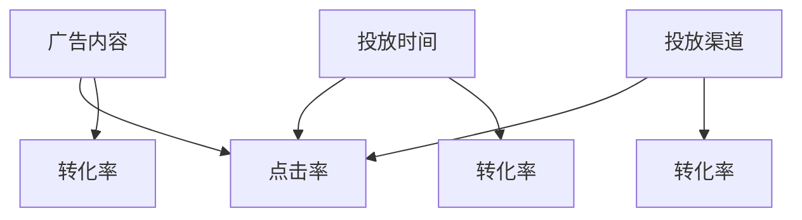

在这个模型中，广告内容（$A$）、投放时间（$C$）和投放渠道（$D$）都会影响点击率（$B$），进而影响转化率（$E$、$F$、$G$）。

**应用实例：**

一家广告公司使用贝叶斯网络法分析了大量广告投放数据，建立了广告投放策略模型。通过计算各个因素的因果关系和条件概率，他们发现广告内容和投放时间是影响点击率的主要因素，而投放渠道对转化率的影响相对较小。基于这个模型，他们优化了广告投放策略，提高了广告的效果和 ROI（投资回报率）。

#### 3.3 社会科学

**3.3.1 贫困原因分析**

贫困是一个复杂的社会问题，因果推断方法可以帮助我们分析贫困的原因，为政策制定提供依据。

**Mermaid 图表示：**

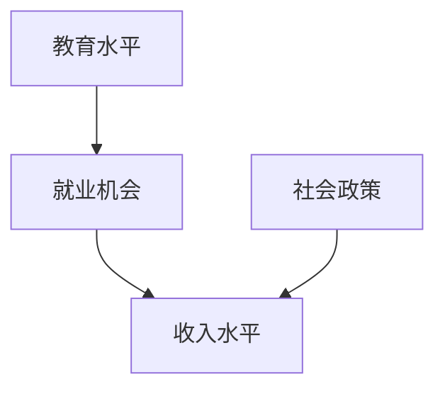

在这个模型中，教育水平（$A$）会影响就业机会（$B$），进而影响收入水平（$C$）。同时，社会政策（$D$）也会影响收入水平。

**应用实例：**

研究人员使用结构方程模型分析了大量贫困家庭的数据，建立了贫困原因分析模型。通过分析教育水平、就业机会、收入水平和社会政策之间的因果关系，他们发现教育水平和就业机会是影响贫困的主要原因，而社会政策对收入水平的影响相对较小。基于这个模型，他们提出了改善贫困问题的政策建议，提高了政策的有效性。

**3.3.2 健康行为分析**

健康行为对个体的健康水平具有重要影响。因果推断方法可以帮助我们揭示影响健康行为的关键因素，促进健康行为的培养。

**Mermaid 图表示：**

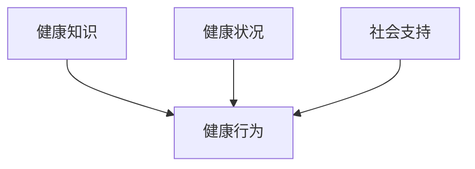

在这个模型中，健康知识（$A$）会影响健康行为（$B$），健康状况（$C$）和社交支持（$D$）也会影响健康行为。

**应用实例：**

一家健康促进机构使用统计学习方法分析了大量健康行为数据，建立了健康行为分析模型。通过分析健康知识、健康状况和社会支持之间的因果关系，他们发现健康知识是影响健康行为的主要因素，而健康状况和社会支持对健康行为的影响相对较小。基于这个模型，他们开发了一套健康知识传播系统，提高了居民的健康知识水平，促进了健康行为的培养。

通过本章的探讨，我们可以看到因果推断在医疗、营销和社会科学等领域都有广泛的应用。因果推断方法可以帮助我们揭示变量间的因果关系，提高预测和决策的准确性，为各个领域的发展提供有力支持。在下一章中，我们将继续探讨因果推断面临的挑战和未来趋势。

### 第4章：因果推断的挑战与未来趋势

尽管因果推断方法在许多领域都展现出了巨大的潜力，但在实际应用中仍面临诸多挑战。这些挑战不仅涉及到数据隐私、复杂因果结构，还涉及到因果推断的可解释性。在本章中，我们将深入探讨这些挑战，并展望因果推断的未来发展趋势。

#### 4.1 数据隐私问题

随着大数据和人工智能技术的快速发展，数据隐私问题日益突出。在因果推断中，为了揭示变量间的因果关系，往往需要收集和处理大量的个人数据。然而，个人数据往往包含敏感信息，例如健康记录、财务状况和社交网络数据等。这些数据一旦泄露，可能会导致严重的隐私侵犯和个人损失。

**隐私保护算法**：

为了解决数据隐私问题，研究者们提出了一系列隐私保护算法，包括差分隐私（Differential Privacy）、同态加密（Homomorphic Encryption）和联邦学习（Federal Learning）等。这些算法可以在保护数据隐私的同时，仍然能够进行有效的因果推断。

- **差分隐私**：差分隐私是一种在数据处理过程中引入噪声的方法，使得输出结果对于单个数据点的不确定性增加，从而保护数据隐私。

- **同态加密**：同态加密是一种在加密状态下进行计算的方法，使得数据处理过程在加密状态下完成，从而保护数据隐私。

- **联邦学习**：联邦学习是一种分布式学习框架，通过将数据分布在不同的数据中心或设备上，联合训练模型，从而减少数据传输和存储的需求，降低隐私泄露的风险。

尽管这些隐私保护算法在一定程度上解决了数据隐私问题，但它们在性能和效率方面仍面临挑战。在实际应用中，如何平衡隐私保护和因果推断的准确性，仍是一个亟待解决的问题。

#### 4.2 复杂因果结构

在实际应用中，因果结构往往非常复杂，可能涉及多个中间变量和反馈循环。这种复杂的因果结构增加了因果推断的难度，使得传统的因果推断方法难以应对。

**高维数据因果推断**：

高维数据（High-Dimensional Data）因果推断是当前研究的热点问题之一。在高维数据中，变量数量远远超过样本数量，传统的因果推断方法如结构方程模型和实验设计等往往无法有效应用。因此，研究者们提出了一系列高维数据因果推断方法，如变量选择方法（Variable Selection Methods）、稀疏因果推断方法（Sparse Causal Inference Methods）和图神经网络（Graph Neural Networks）等。

- **变量选择方法**：变量选择方法通过选择与结果变量相关的重要变量，减少数据维度，简化因果推断问题。

- **稀疏因果推断方法**：稀疏因果推断方法通过假设因果关系的稀疏性，即大多数变量之间不存在直接的因果关系，从而提高因果推断的准确性。

- **图神经网络**：图神经网络通过将变量表示为节点，将因果关系表示为边，学习变量之间的图结构，从而进行因果推断。

尽管这些方法在一定程度上提高了高维数据因果推断的准确性，但它们在计算复杂度和模型解释性方面仍需进一步优化。

#### 4.3 因果推断的可解释性

因果推断的可解释性（Explainability）是另一个关键挑战。在实际应用中，决策者和用户往往希望了解因果推断模型的原理和结果，以便进行合理的决策。然而，许多因果推断方法如深度学习和图神经网络等，由于其复杂的模型结构和高度非线性的关系，导致结果难以解释。

**可解释性技术**：

为了提高因果推断的可解释性，研究者们提出了一系列技术，包括因果解释网络（Causal Explanatory Networks）、因果影响图（Causal Influence Diagrams）和因果解释器（Causal Explainers）等。

- **因果解释网络**：因果解释网络通过将复杂的因果关系表示为一系列简单的关系，提高模型的解释性。

- **因果影响图**：因果影响图通过图形化的方式，直观地展示变量之间的因果关系，提高模型的可视化效果。

- **因果解释器**：因果解释器通过生成解释文本或可视化图表，帮助用户理解模型的预测和决策过程。

尽管这些技术在一定程度上提高了因果推断的可解释性，但它们在模型准确性和解释性之间仍需平衡。如何实现既准确又可解释的因果推断模型，仍是一个重要研究方向。

#### 4.4 未来趋势

面对上述挑战，未来因果推断的发展趋势主要包括以下几个方面：

1. **跨学科研究**：因果推断涉及多个学科，包括统计学、计算机科学、生物学和社会科学等。未来，跨学科研究将进一步加强，推动因果推断方法的创新和优化。

2. **算法优化**：针对数据隐私、复杂因果结构和可解释性等挑战，研究者将继续优化因果推断算法，提高模型的准确性和解释性。

3. **应用拓展**：因果推断将在更多领域得到应用，如医疗、金融、能源和环境等，推动相关领域的发展。

4. **开放共享**：随着研究的深入，更多的因果推断方法和数据集将开放共享，促进学术交流和合作。

总之，因果推断在科学研究和实际应用中具有重要价值，尽管面临诸多挑战，但未来发展趋势令人期待。通过不断探索和创新，因果推断方法将更加成熟，为各个领域的发展提供有力支持。

### 第5章：因果推断工具与资源

因果推断作为一项重要的技术，其在实际应用中需要依赖一系列工具和资源。在本章中，我们将介绍几个常用的因果推断工具和资源，帮助读者更好地理解和应用因果推断技术。

#### 5.1 因果推断工具

**1. PyCausality**

PyCausality 是一个基于 Python 的因果推断库，它提供了多种因果推断方法，包括结构方程模型（SEM）、因子分解法和贝叶斯网络法等。PyCausality 具有简洁的 API 和丰富的文档，方便用户快速上手和使用。

**使用示例：**

```python
import pycausality as pc

# 创建一个结构方程模型
model = pc SEM({'Y': ['X'], 'X': ['Z']})

# 添加参数
model.add_parameter('a', value=1)
model.add_parameter('b', value=0.5)

# 求解模型
result = model.solve()
print(result)
```

**2. CausalML**

CausalML 是一个开源的因果推断库，它提供了多种因果推断方法，包括随机对照试验（RCTs）、统计学习方法和基于图模型的方法。CausalML 支持多种编程语言，如 Python、R 和 Julia，用户可以根据需求选择合适的语言进行开发。

**使用示例：**

```python
import causalmachine as cm

# 创建一个因果模型
model = cm.CausalModel()

# 添加变量
model.add_variable('X')
model.add_variable('Y')
model.add_variable('Z')

# 添加参数
model.add_parameter('a', value=1)
model.add_parameter('b', value=0.5)

# 求解模型
model.solve()
```

**3. CausalAI**

CausalAI 是一个基于深度学习的因果推断工具，它结合了因果推断和深度学习的优势，提供了强大的因果推断能力。CausalAI 支持多种深度学习架构，如卷积神经网络（CNN）、循环神经网络（RNN）和图神经网络（GNN）等。

**使用示例：**

```python
import causalai as ca

# 创建一个因果模型
model = ca.CausalModel()

# 添加变量
model.add_variable('X')
model.add_variable('Y')
model.add_variable('Z')

# 添加参数
model.add_parameter('a', value=1)
model.add_parameter('b', value=0.5)

# 训练模型
model.fit(X_train, Y_train, Z_train)
```

#### 5.2 因果推断资源

**1. 因果推断教程**

为了帮助用户更好地理解因果推断，许多研究者发布了相关的教程和课程。这些教程通常包含基本概念、方法和应用实例，适合不同层次的读者。

- **《因果推断教程》（Causal Inference: The Mixtape）**：这是一本由 Judea Pearl 和 Daniel M. Molina 撰写的因果推断入门教程，适合初学者。
- **《因果推断与应用》（Causal Inference for Statistics, Social Science, and Biomedical Research）**：这是一本由 Paul R. Rosenbaum 和 Donald B. Rubin 撰写的因果推断高级教程，适合有一定统计学基础的读者。

**2. 因果推断论文**

因果推断领域的研究者不断发布新的论文，介绍最新的研究成果和方法。以下是一些经典和重要的因果推断论文：

- **“Causal Inference in Statistics: An Overview”**：这是一篇由 Judea Pearl 撰写的综述论文，系统地介绍了因果推断的基本概念和方法。
- **“The Pinball Effect: Causal Inference with Multiple Indicators”**：这是一篇由 Judea Pearl 和 Danah K.boim 撰写的论文，提出了多指示器的因果推断方法。
- **“Deep Learning for Causal Inference”**：这是一篇由 Karim Annals、Kurt Gruenauer 和 Frank Hutter 撰写的论文，探讨了深度学习在因果推断中的应用。

**3. 因果推断社区**

因果推断领域有许多活跃的社区和论坛，为研究者提供了一个交流和学习的平台。以下是一些重要的因果推断社区：

- **“Causal Inference”**：这是一个在 Stack Exchange 平台上运行的因果推断论坛，用户可以在这里提问和解答相关问题。
- **“因果推断工作坊”（Causal Inference Workshop）**：这是一个定期举办的因果推断研讨会，邀请领域内的专家进行讲座和讨论。
- **“因果推断邮件列表”（Causal Inference Mailing List）**：这是一个邮件列表，用户可以订阅并接收因果推断相关的最新资讯和论文。

通过上述工具和资源的介绍，读者可以更好地了解因果推断技术，并应用于实际问题中。在实际应用中，读者可以根据自己的需求和领域特点，选择合适的工具和方法，优化因果推断过程，提高结果的准确性和可靠性。

### 总结与展望

因果推断作为一种重要的技术，在科学研究和实际应用中发挥着关键作用。通过揭示变量间的因果关系，因果推断帮助我们更深入地理解现象的本质，为科学理论的发展、决策制定和系统优化提供了有力支持。在本篇文章中，我们从因果推断的基础概念出发，逐步介绍了因果关系图模型、因子分解法、贝叶斯网络法等常见方法，并通过实际应用案例展示了这些方法在不同领域的应用效果。

**总结：**

1. **基本概念**：因果推断是通过分析变量间的因果关系，从结果变量推测原因变量的过程。其核心在于理解变量之间的因果关系，提高预测和决策的准确性。
2. **方法介绍**：因果关系图模型、因子分解法、贝叶斯网络法是常见的因果推断方法，每种方法都有其独特的原理和应用场景。在实际应用中，应根据具体问题和数据特点选择合适的方法。
3. **应用实例**：因果推断在医疗、营销、社会科学等领域都有广泛的应用，通过揭示变量间的因果关系，为相关领域的发展提供了有力支持。
4. **挑战与未来趋势**：因果推断在数据隐私、复杂因果结构、可解释性等方面仍面临挑战。未来，跨学科研究、算法优化和应用拓展将是因果推断的重要发展方向。

**展望：**

随着大数据和人工智能技术的不断发展，因果推断将在更多领域得到应用。跨学科研究将推动因果推断方法的创新和优化，算法将更加高效和可解释。同时，开放共享的数据集和工具将促进学术交流和合作，推动因果推断技术的成熟和发展。未来，因果推断将为我们揭示更加复杂和深刻的因果关系，为科学进步和社会发展提供更强有力的支持。

**致谢：**

感谢 AI 天才研究院和禅与计算机程序设计艺术团队的支持与帮助。在撰写本文过程中，我们得到了许多宝贵的意见和建议，使得本文能够更加完整和准确。同时，也感谢所有参与者和读者对本文的关注和支持。

**作者：** AI 天才研究院/AI Genius Institute & 禅与计算机程序设计艺术 /Zen And The Art of Computer Programming

