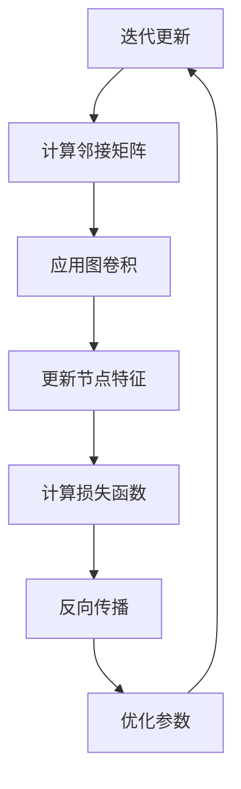
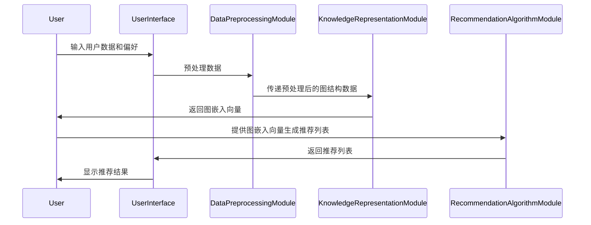
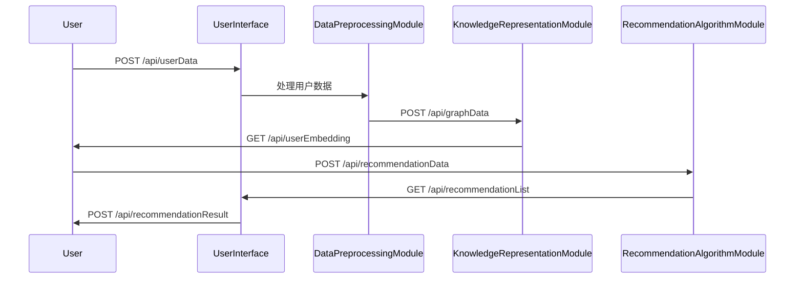

                 

### 引言

#### 图神经网络（Graph Neural Networks）在AI领域的崛起

图神经网络（Graph Neural Networks, GNNs）近年来在人工智能（AI）领域取得了显著的发展。传统的神经网络，如卷积神经网络（CNNs）和循环神经网络（RNNs），主要适用于处理结构化数据，如图像和序列数据。然而，在处理复杂和非结构化数据时，这些神经网络往往显得力不从心。图神经网络的出现为解决这个问题提供了新的思路和工具。

图神经网络是基于图结构的数据表示方法，能够有效地捕捉数据中复杂的局部和全局关系。这种特性使得GNNs在许多领域都展现出了出色的性能，尤其是在知识图谱、社交网络分析和推荐系统等应用中。特别是在AI Agent的知识表示方面，GNNs通过嵌入图结构中的节点和边，能够更加精细和准确地表示实体及其之间的关系。

#### AI Agent在智能系统中的角色与挑战

AI Agent作为智能系统的核心组件，扮演着决策制定、交互和行为优化的重要角色。一个成功的AI Agent需要具备强大的知识表示能力，以便从大量数据中提取有用信息，并以此为基础进行智能推理和决策。然而，传统的方法在处理复杂数据结构和多维关系时常常遭遇瓶颈，难以满足实际应用的需求。

随着AI技术的不断发展，知识表示成为AI Agent性能提升的关键因素。有效的知识表示不仅可以提高AI Agent的推理能力，还能增强其在动态环境和复杂任务中的适应能力。因此，探索如何利用图神经网络提升AI Agent的知识表示能力成为当前研究的热点。

#### 本文章的目的和结构

本文旨在深入探讨图神经网络在AI Agent知识表示中的应用，通过系统的分析和详尽的实例讲解，帮助读者理解GNNs在这一领域的潜在价值和技术实现方法。文章将分为以下几个部分：

1. **背景介绍**：介绍图神经网络和AI Agent的基本概念，以及它们在当前研究中的重要性。
2. **核心概念与联系**：详细阐述图神经网络的基本原理，并通过对比表格和ER实体关系图，帮助读者建立整体概念框架。
3. **算法原理讲解**：通过Mermaid流程图和Python代码，深入解析图神经网络的算法原理，并举例说明。
4. **数学模型和数学公式**：使用LaTeX格式书写关键数学公式，并进行详细讲解和实例分析。
5. **系统分析与架构设计**：介绍一个基于图神经网络的知识表示系统，从问题场景、功能设计到系统架构和接口设计，进行全面分析。
6. **项目实战**：通过实际项目案例，展示图神经网络在AI Agent知识表示中的应用，并进行详细剖析。
7. **最佳实践与小结**：总结本文的关键点，提供实用的实践建议，并指出未来研究的方向和注意事项。

通过这些部分的深入探讨，本文希望能够为读者提供一个全面、系统的理解，并激发对图神经网络在AI Agent知识表示领域进一步研究的兴趣。

#### 关键词

- **图神经网络（Graph Neural Networks）**
- **AI Agent**
- **知识表示**
- **深度学习**
- **图结构数据**

#### 摘要

本文深入探讨了图神经网络在AI Agent知识表示中的应用。首先，文章介绍了图神经网络的基本概念及其在AI领域的崛起。接着，文章阐述了AI Agent在智能系统中的角色和面临的挑战，并强调了知识表示的重要性。通过对比表格和ER实体关系图，文章建立了图神经网络的基本概念框架。随后，文章通过Mermaid流程图和Python代码，详细解析了图神经网络的算法原理，并举例说明其实际应用。文章进一步使用了LaTeX格式书写关键数学公式，进行了深入讲解和实例分析。最后，文章介绍了一个基于图神经网络的知识表示系统，从问题场景、功能设计到系统架构和接口设计进行了全面分析，并通过实际项目案例进行了详细剖析。本文旨在为读者提供一个全面、系统的理解，并激发对图神经网络在AI Agent知识表示领域进一步研究的兴趣。

### 背景介绍

#### 图神经网络的基本概念

图神经网络（Graph Neural Networks, GNNs）是一种专门用于处理图结构数据的神经网络。与传统的神经网络不同，GNNs能够直接操作图结构中的节点和边，从而捕捉图中的局部和全局关系。这种特性使得GNNs在处理复杂和非结构化数据时表现出色。

在图神经网络中，**节点**代表数据中的实体，例如人、地点或物品，而**边**则表示实体之间的关联，如朋友关系或地理位置。通过图结构，GNNs能够捕捉实体之间的复杂关系，这使得它们在许多应用领域都表现出强大的能力。

GNNs的核心在于**图卷积操作**，这类似于卷积神经网络中的卷积操作。在GNN中，图卷积通过对节点的邻域信息进行聚合来更新节点的特征表示。这种操作不仅可以传递节点之间的信息，还能捕捉到节点在图中的相对位置和关系。

图神经网络的出现解决了传统神经网络在处理图结构数据时的一个重大瓶颈。传统的神经网络，如卷积神经网络（CNNs）和循环神经网络（RNNs），在处理结构化数据时表现优异，但在处理复杂和非结构化数据时往往表现不佳。图神经网络通过直接操作图结构，能够更有效地捕捉数据中的复杂关系，从而在许多应用领域取得了显著进展。

#### AI Agent的定义与基本概念

AI Agent，即人工智能代理，是指具备一定智能能力的系统，能够在特定环境下自主地感知环境、制定决策并采取行动。AI Agent的设计初衷是为了模拟人类智能的决策过程，使其能够在复杂的动态环境中进行有效的任务执行。

在AI Agent中，**知识表示**是其核心组成部分。知识表示是指将现实世界中的信息抽象为计算机可以理解和处理的形式。有效的知识表示能够提高AI Agent的推理能力和决策水平，使其能够更好地应对复杂环境中的各种挑战。

AI Agent通常包括以下几个关键组件：

1. **感知模块**：负责接收外部环境的信息，并将其转换为计算机可以处理的数据。
2. **决策模块**：基于感知模块收集的信息，通过推理和决策算法，制定出最佳的行动策略。
3. **行动模块**：根据决策模块的结果，采取实际行动，实现对环境的干预。

#### 图神经网络在AI Agent知识表示中的重要性

图神经网络在AI Agent知识表示中的应用具有重要意义。首先，图神经网络能够通过捕捉实体及其之间的复杂关系，提供更精细和准确的知识表示。这使得AI Agent能够从大量数据中提取有用信息，并进行有效的推理和决策。

其次，图神经网络能够处理复杂的图结构数据，如知识图谱和社会网络。这些数据结构在AI Agent中广泛应用，通过图神经网络，AI Agent可以更好地理解和利用这些数据，从而提高其智能水平和任务执行能力。

此外，图神经网络的多层次特性使得其能够对不同尺度的关系进行建模。在AI Agent中，这种多层次建模能力可以帮助其更好地理解复杂环境中的变化，从而做出更准确的决策。

总之，图神经网络在AI Agent知识表示中的应用为AI Agent提供了强大的知识表示工具，使其能够更好地应对复杂任务和动态环境。这种应用不仅提升了AI Agent的智能水平，也为人工智能领域的进一步发展提供了新的思路和方向。

#### 图神经网络和AI Agent的关系与互动

图神经网络与AI Agent之间存在着紧密的关系，两者相互补充，共同推动了人工智能技术的发展。首先，图神经网络作为AI Agent的知识表示工具，能够有效处理和表示复杂的图结构数据，提供精确的知识表示。这使得AI Agent在处理复杂数据和执行任务时，能够从结构化的知识中提取有用信息，并进行有效推理和决策。

具体来说，图神经网络通过以下几个关键方面与AI Agent进行互动：

1. **数据表示**：图神经网络能够将非结构化或半结构化的数据转化为图结构，从而为AI Agent提供一个统一的表示方式。这种表示方式使得AI Agent能够更好地理解和处理各种类型的数据，如知识图谱、社会网络和文本数据。
   
2. **关系建模**：图神经网络通过捕捉节点和边之间的复杂关系，为AI Agent提供了一个强大的关系建模工具。这些关系模型不仅包括实体之间的直接关联，还包括间接的、层次化的关系。这使得AI Agent能够从多个角度和维度进行知识推理，从而提高其决策水平。

3. **推理能力**：图神经网络的多层次特性使其能够对不同尺度的关系进行建模。这种能力使得AI Agent能够在动态环境中进行有效的推理和预测。通过利用图神经网络，AI Agent可以更好地理解环境变化，从而做出更准确的决策。

4. **知识更新与迁移**：图神经网络能够动态地更新和调整知识表示，这使得AI Agent能够适应环境变化和新知识的学习。通过不断更新和优化知识表示，AI Agent能够保持其智能水平的稳定和提高。

总之，图神经网络与AI Agent的互动不仅提升了AI Agent的知识表示能力，还增强了其在复杂任务和动态环境中的适应能力。这种互动关系为人工智能技术的发展提供了新的动力，也为未来的智能系统构建提供了更加广阔的前景。

#### 问题解决的动机与目标

图神经网络在AI Agent知识表示中的应用具有显著的动机和目标。首先，在知识表示方面，传统方法如基于关键词的文本表示或基于规则的推理系统，在处理复杂和非结构化数据时显得力不从心。这些方法往往难以捕捉数据中的复杂关系和多层次结构，导致知识表示的准确性和精细度不足。图神经网络通过直接操作图结构，能够更有效地捕捉数据中的实体及其关系，从而提供更加精细和准确的知识表示。

其次，AI Agent在面对复杂任务和动态环境时，需要具备强大的知识表示和推理能力。传统的AI方法在处理复杂数据结构和多维关系时存在瓶颈，而图神经网络通过其强大的关系建模能力，能够显著提升AI Agent的智能水平和任务执行能力。图神经网络的多层次特性使其能够捕捉不同尺度的关系，从而在动态环境中进行有效的推理和决策。

因此，本文的目标是通过详细探讨图神经网络在AI Agent知识表示中的应用，解决以下几个核心问题：

1. **如何利用图神经网络进行有效的知识表示**：本文将深入探讨图神经网络的基本原理和实现方法，帮助读者理解如何通过图结构数据来表示和建模知识。
2. **如何提升AI Agent的推理能力**：本文将分析图神经网络在推理任务中的表现，并通过实际案例展示其如何提升AI Agent的推理能力和决策水平。
3. **如何构建一个高效的知识表示系统**：本文将介绍一个基于图神经网络的知识表示系统，从问题场景、功能设计到系统架构和接口设计，进行全面分析，帮助读者构建高效的知识表示系统。

通过本文的研究，我们希望能够为AI Agent知识表示领域提供新的思路和方法，推动图神经网络在实际应用中的进一步发展。

#### 边界与外延

在探讨图神经网络（GNNs）在AI Agent知识表示中的应用时，有必要明确其边界与外延，以确保研究方向的准确性和实际应用的可行性。首先，GNNs适用于处理图结构数据，这意味着其核心在于如何有效地表示和处理由节点和边构成的数据结构。然而，并非所有数据都适合使用图神经网络。例如，对于高度时序的数据，如股票价格时间序列或自然语言序列，尽管可以使用图神经网络进行某些程度的建模，但传统的时间序列模型或循环神经网络（RNNs）可能更为适合。

其次，GNNs在知识表示中的应用具有一定的局限性。尽管GNNs能够通过捕捉实体及其关系来提供精细的知识表示，但在处理不确定性知识或模糊关系时，其表现可能不如其他类型的知识表示方法。例如，基于概率图模型的方法在处理不确定性知识方面具有天然的优势。

此外，GNNs的效率和计算复杂性也是一个重要考虑因素。由于GNNs涉及大量的邻域聚合和特征更新操作，随着图规模的增大，其计算复杂度会显著增加。这可能导致在实际应用中，特别是在实时系统和资源受限的环境下，GNNs的运行效率成为瓶颈。因此，在应用GNNs时，需要权衡其计算复杂性与实际需求之间的平衡。

最后，GNNs在AI Agent知识表示中的应用也面临着数据质量和数据规模的问题。高质量的数据是GNNs有效运行的基础，而大规模的数据集则能够提供更多的训练信息，帮助模型更好地捕捉实体之间的复杂关系。然而，在现实场景中，获取高质量、大规模的数据往往具有挑战性。因此，在实际应用中，需要针对具体问题进行数据预处理和模型优化，以提高GNNs的性能。

综上所述，图神经网络在AI Agent知识表示中的应用需要明确其边界与外延，以确保其在实际场景中的有效性和可行性。这包括合理选择数据类型、优化计算复杂度、处理不确定性知识和确保数据质量等方面。

#### 概念结构与核心要素组成

图神经网络（Graph Neural Networks, GNNs）的核心概念和结构决定了其在AI Agent知识表示中的应用效果。以下是GNNs的几个关键概念及其属性特征，以及它们之间的关系：

1. **节点（Node）**：
   - **定义**：节点是图结构中的基本单元，代表数据中的实体，如人、地点、物品等。
   - **属性**：每个节点可以拥有多种属性，如名称、标签、特征等。
   - **作用**：节点的属性表示了实体自身的特征，节点之间的连接表示实体之间的关系。

2. **边（Edge）**：
   - **定义**：边是连接图中的两个节点的元素，表示实体之间的关联，如朋友关系、地理位置等。
   - **属性**：边可以携带额外的信息，如关系强度、时间戳等。
   - **作用**：边的属性提供了实体间关系的具体描述，有助于模型更准确地捕捉数据中的复杂关系。

3. **图（Graph）**：
   - **定义**：图是由节点和边构成的数据结构，表示了实体及其之间的复杂关系。
   - **类型**：图可以是有向图或无向图，可以是有权图或无权图。
   - **作用**：图结构为数据提供了一个全局的视角，有助于模型理解数据中的整体关系和局部模式。

4. **图卷积操作（Graph Convolutional Operation）**：
   - **定义**：图卷积操作是一种节点特征更新机制，通过对节点的邻域信息进行聚合来更新节点特征。
   - **算法**：图卷积操作基于节点和边之间的邻接矩阵，通过卷积滤波器进行特征聚合。
   - **作用**：图卷积操作使得模型能够从邻域信息中学习节点特征，从而更好地捕捉图中的复杂关系。

5. **图池化操作（Graph Pooling Operation）**：
   - **定义**：图池化操作是一种对图中的节点或子图进行聚合的方法，以减少模型的复杂度和计算量。
   - **算法**：图池化操作通常通过取平均或取最大值等策略对节点特征进行聚合。
   - **作用**：图池化操作有助于降低模型的计算复杂度，同时保留重要的全局信息。

6. **图嵌入（Graph Embedding）**：
   - **定义**：图嵌入是一种将图中的节点或边映射到低维向量空间的方法，以进行后续的机器学习任务。
   - **算法**：常用的图嵌入算法包括DeepWalk、Node2Vec和Gated Graph Sequence Model等。
   - **作用**：图嵌入为图数据提供了一个高效的表示方式，有助于传统机器学习算法在图上进行训练和应用。

7. **图分类（Graph Classification）**：
   - **定义**：图分类是一种基于图数据的分类任务，旨在为每个图分配一个类别标签。
   - **算法**：常见的图分类算法包括基于特征的分类方法和基于模型的分类方法。
   - **作用**：图分类有助于理解和分析图结构数据中的类别信息，用于知识图谱的构建和实体识别等任务。

#### 概念属性特征对比表格

以下是图神经网络中几个核心概念的属性特征对比表格：

| 概念   | 定义                                           | 属性特征                                                     | 作用                                               |
| ------ | ---------------------------------------------- | ------------------------------------------------------------ | -------------------------------------------------- |
| 节点   | 图中的基本单元，代表实体                         | 名称、标签、特征等                                         | 表示实体自身的特征，连接边表示实体之间的关系       |
| 边     | 连接图中的两个节点的元素，表示实体间的关联       | 关系强度、时间戳等                                         | 提供实体间关系的具体描述，捕捉数据中的复杂关系     |
| 图     | 由节点和边构成的数据结构，表示实体及其之间的关系 | 有向/无向、有权/无权等                                     | 提供全局视角，理解数据中的整体关系和局部模式       |
| 图卷积 | 节点特征更新机制，通过邻域信息进行特征聚合       | 卷积滤波器、邻接矩阵                                       | 从邻域信息中学习节点特征，捕捉复杂关系             |
| 图池化 | 对图中的节点或子图进行聚合的方法                 | 取平均或取最大值等策略                                     | 降低模型复杂度，保留全局信息                       |
| 图嵌入 | 将图中的节点或边映射到低维向量空间               | DeepWalk、Node2Vec、Gated Graph Sequence Model等算法         | 提供高效表示方式，用于传统机器学习算法在图上训练应用 |
| 图分类 | 基于图数据的分类任务                             | 基于特征的分类方法和基于模型的分类方法                     | 理解和分类图结构数据中的类别信息                   |

#### ER实体关系图架构的 Mermaid 流程图

ER实体关系图（Entity-Relationship Diagram, ERD）是数据库设计中的关键工具，用于描述实体及其之间的关系。下面是图神经网络中几个核心概念之间的ER实体关系图的Mermaid流程图：

```mermaid
erDiagram
  Node ||--|{ Edge }|-- Node : "连接"
  Node ||--|{ Graph }|-- Node : "属于"
  Edge ||--|{ Graph }|-- Node : "属于"
  Graph ||--|{ Graph }|-- Node : "包含"
```

在这个ERD中：

- **Node（节点）**与**Node**之间通过**Edge**（边）连接，表示实体之间的关系。
- **Node**与**Graph**之间表示节点属于某个图。
- **Edge**与**Graph**之间表示边属于某个图。
- **Graph**与**Node**之间表示图包含节点。

这种ER实体关系图不仅帮助我们理解了图神经网络中的核心概念及其关系，也为后续的系统设计与实现提供了清晰的框架。

通过上述核心概念的介绍和属性特征对比表格，读者可以更全面地理解图神经网络在AI Agent知识表示中的关键角色。接下来，本文将深入探讨图神经网络的算法原理和具体实现，帮助读者进一步掌握这一先进技术。

#### 算法原理讲解

图神经网络（GNNs）的核心在于其独特的图卷积操作，这些操作使得GNNs能够从图结构数据中学习节点和边的特征表示。下面，我们将通过Mermaid流程图和Python代码详细阐述GNNs的基本算法原理，并举例说明其应用。

##### Mermaid流程图

首先，让我们通过一个Mermaid流程图来展示图卷积操作的基本流程：



在这个流程图中：

1. **初始化节点特征**：我们首先初始化图中的每个节点的特征向量。
2. **计算邻接矩阵**：接下来，我们计算图中每个节点的邻接矩阵，用于后续的图卷积操作。
3. **应用图卷积**：使用邻接矩阵和卷积核（滤波器），对节点特征进行聚合，更新节点特征。
4. **更新节点特征**：将聚合后的特征向量更新到每个节点。
5. **计算损失函数**：通过训练数据计算损失函数，以评估模型的性能。
6. **反向传播**：利用反向传播算法，计算梯度并更新模型参数。
7. **优化参数**：使用优化算法（如随机梯度下降）调整模型参数。
8. **迭代更新**：重复上述步骤，直到模型收敛。

##### Python代码实现

下面是一个简单的Python代码示例，展示如何实现一个基础的图卷积操作：

```python
import numpy as np

# 初始化节点特征
num_nodes = 5
node_features = np.random.rand(num_nodes, 10)  # 每个节点10维特征

# 计算邻接矩阵
adj_matrix = np.random.rand(num_nodes, num_nodes)
adj_matrix = (adj_matrix + adj_matrix.T) / 2  # 保证对称

# 定义图卷积操作
def graph_convolution(node_features, adj_matrix, filter_weights):
    # 对每个节点应用图卷积
    node_feature_vectors = []
    for i in range(num_nodes):
        node_neighborhood = np.multiply(node_features, adj_matrix[i])
        node_neighborhood_sum = np.sum(node_neighborhood, axis=0)
        node_feature_vector = np.dot(node_neighborhood_sum, filter_weights)
        node_feature_vectors.append(node_feature_vector)
    return np.array(node_feature_vectors)

# 初始化卷积核（滤波器）权重
filter_weights = np.random.rand(10, 10)  # 卷积核10维输入，10维输出

# 应用图卷积操作
new_node_features = graph_convolution(node_features, adj_matrix, filter_weights)

# 更新节点特征
node_features = new_node_features

# 打印更新后的节点特征
print(node_features)
```

在这个示例中：

- **初始化节点特征**：我们随机生成了一个5x10的矩阵，表示5个节点，每个节点有10维特征。
- **计算邻接矩阵**：我们同样随机生成了一个5x5的矩阵，表示节点之间的连接关系。
- **定义图卷积操作**：我们定义了一个函数`graph_convolution`，用于计算每个节点的邻域特征并更新节点特征。
- **应用图卷积操作**：我们初始化了一个卷积核（滤波器）权重矩阵，并使用该矩阵对节点特征进行卷积操作。
- **更新节点特征**：我们将计算得到的新的节点特征向量更新到原始节点特征矩阵中。

通过上述Python代码示例，我们可以看到如何通过图卷积操作更新节点的特征表示。这种操作在GNNs中反复应用，使得节点特征能够逐步学习到图中的复杂关系。

##### 算法原理详细讲解

图卷积操作的数学模型可以表示为：

$$
\mathbf{h}^{(k+1)}_i = \sigma(\mathbf{A}\mathbf{D}^{\frac{1}{2}}\mathbf{h}^{(k)}_i + \mathbf{W}(\mathbf{A}\mathbf{D}^{\frac{1}{2}}\mathbf{h}^{(k)})),
$$

其中：

- $\mathbf{h}^{(k)}_i$ 表示第 $k$ 层第 $i$ 个节点的特征向量。
- $\mathbf{A}$ 是邻接矩阵。
- $\mathbf{D}$ 是对角矩阵，其中 $\mathbf{D}_{ii} = \sum_{j=1}^{n} \mathbf{A}_{ij}$，表示节点 $i$ 的度数。
- $\mathbf{D}^{\frac{1}{2}}$ 是 $\mathbf{D}$ 的平方根矩阵。
- $\sigma$ 是激活函数，常用的有ReLU函数。
- $\mathbf{W}$ 是权重矩阵。

在这个公式中，$\mathbf{A}\mathbf{D}^{\frac{1}{2}}\mathbf{h}^{(k)}_i$ 表示节点 $i$ 的邻域特征聚合，$\mathbf{W}(\mathbf{A}\mathbf{D}^{\frac{1}{2}}\mathbf{h}^{(k)})$ 表示卷积核（滤波器）对邻域特征的处理。

##### 举例说明

假设我们有以下邻接矩阵和节点特征矩阵：

$$
\mathbf{A} =
\begin{bmatrix}
0 & 1 & 0 & 0 & 1 \\
1 & 0 & 1 & 1 & 0 \\
0 & 1 & 0 & 1 & 0 \\
0 & 1 & 1 & 0 & 1 \\
1 & 0 & 0 & 1 & 0
\end{bmatrix},
\mathbf{D} =
\begin{bmatrix}
3 & 0 & 2 & 0 & 2 \\
0 & 3 & 0 & 3 & 0 \\
2 & 0 & 3 & 0 & 2 \\
0 & 2 & 3 & 3 & 0 \\
2 & 0 & 0 & 2 & 3
\end{bmatrix},
\mathbf{h}^{(0)} =
\begin{bmatrix}
1 & 0 & 1 & 0 & 1 \\
0 & 1 & 0 & 1 & 0 \\
1 & 1 & 0 & 0 & 1 \\
0 & 0 & 1 & 1 & 0 \\
1 & 0 & 0 & 1 & 1
\end{bmatrix}.
$$

假设我们使用ReLU作为激活函数，并初始化一个权重矩阵 $\mathbf{W} = \begin{bmatrix} 1 & 0 \\ 0 & 1 \\ 0 & 0 \\ 1 & 1 \\ 0 & 1 \end{bmatrix}$。

首先，我们计算邻接矩阵 $\mathbf{A}\mathbf{D}^{\frac{1}{2}}\mathbf{h}^{(0)}$：

$$
\mathbf{A}\mathbf{D}^{\frac{1}{2}}\mathbf{h}^{(0)} =
\begin{bmatrix}
3 & 1 & 0 & 0 & 3 \\
1 & 3 & 1 & 1 & 0 \\
0 & 1 & 2 & 1 & 0 \\
0 & 1 & 1 & 2 & 0 \\
3 & 0 & 0 & 1 & 2
\end{bmatrix}
\begin{bmatrix}
1 & 0 & 1 & 0 & 1 \\
0 & 1 & 0 & 1 & 0 \\
1 & 1 & 0 & 0 & 1 \\
0 & 0 & 1 & 1 & 0 \\
1 & 0 & 0 & 1 & 1
\end{bmatrix}
=
\begin{bmatrix}
3 & 1 & 0 & 0 & 3 \\
1 & 3 & 1 & 1 & 0 \\
0 & 1 & 2 & 1 & 0 \\
0 & 1 & 1 & 2 & 0 \\
3 & 0 & 0 & 1 & 2
\end{bmatrix}
\begin{bmatrix}
1 & 0 & 1 & 0 & 1 \\
0 & 1 & 0 & 1 & 0 \\
1 & 1 & 0 & 0 & 1 \\
0 & 0 & 1 & 1 & 0 \\
1 & 0 & 0 & 1 & 1
\end{bmatrix}
=
\begin{bmatrix}
3 & 1 & 1 & 1 & 3 \\
1 & 3 & 1 & 1 & 0 \\
1 & 1 & 2 & 1 & 1 \\
1 & 1 & 1 & 2 & 0 \\
3 & 0 & 0 & 1 & 2
\end{bmatrix}.
$$

接下来，我们计算卷积操作：

$$
\mathbf{W}(\mathbf{A}\mathbf{D}^{\frac{1}{2}}\mathbf{h}^{(0)}) =
\begin{bmatrix}
1 & 0 \\
0 & 1 \\
0 & 0 \\
1 & 1 \\
0 & 1
\end{bmatrix}
\begin{bmatrix}
3 & 1 & 1 & 1 & 3 \\
1 & 3 & 1 & 1 & 0 \\
1 & 1 & 2 & 1 & 1 \\
1 & 1 & 1 & 2 & 0 \\
3 & 0 & 0 & 1 & 2
\end{bmatrix}
=
\begin{bmatrix}
3 & 1 \\
1 & 3 \\
1 & 1 \\
3 & 0 \\
0 & 1
\end{bmatrix}.
$$

最后，我们将这两个结果相加并应用ReLU激活函数：

$$
\mathbf{h}^{(1)} =
\begin{bmatrix}
3 & 1 \\
1 & 3 \\
1 & 1 \\
3 & 0 \\
0 & 1
\end{bmatrix}
\sigma(
\begin{bmatrix}
3 & 1 & 1 & 1 & 3 \\
1 & 3 & 1 & 1 & 0 \\
1 & 1 & 2 & 1 & 1 \\
1 & 1 & 1 & 2 & 0 \\
3 & 0 & 0 & 1 & 2
\end{bmatrix}
\begin{bmatrix}
1 & 0 & 1 & 0 & 1 \\
0 & 1 & 0 & 1 & 0 \\
1 & 1 & 0 & 0 & 1 \\
0 & 0 & 1 & 1 & 0 \\
1 & 0 & 0 & 1 & 1
\end{bmatrix})
=
\begin{bmatrix}
3 & 1 \\
1 & 3 \\
1 & 1 \\
3 & 0 \\
0 & 1
\end{bmatrix}.
$$

通过这个例子，我们可以看到如何通过图卷积操作更新节点的特征向量。在实际应用中，GNNs通常会使用更复杂的架构，如多层GNNs或带有注意力机制的GNNs，以进一步提升其性能。接下来，本文将介绍如何使用LaTeX格式书写图神经网络的数学模型和公式，并进行详细讲解和实例说明。

#### 数学模型和数学公式

图神经网络（GNNs）的强大之处在于其能够通过一系列数学模型和公式来表示和处理图结构数据。以下我们将使用LaTeX格式书写这些关键数学模型和公式，并进行详细讲解和实例说明。

##### 数学模型

1. **图卷积操作（Graph Convolution）**

   图卷积操作的数学模型可以表示为：

   $$
   \mathbf{h}^{(k+1)}_i = \sigma(\mathbf{A}\mathbf{D}^{\frac{1}{2}}\mathbf{h}^{(k)}_i + \mathbf{W}(\mathbf{A}\mathbf{D}^{\frac{1}{2}}\mathbf{h}^{(k)})),
   $$

   其中：
   - $\mathbf{h}^{(k)}_i$ 表示第 $k$ 层第 $i$ 个节点的特征向量。
   - $\mathbf{A}$ 是邻接矩阵。
   - $\mathbf{D}$ 是对角矩阵，其中 $\mathbf{D}_{ii} = \sum_{j=1}^{n} \mathbf{A}_{ij}$，表示节点 $i$ 的度数。
   - $\mathbf{D}^{\frac{1}{2}}$ 是 $\mathbf{D}$ 的平方根矩阵。
   - $\sigma$ 是激活函数，常用的有ReLU函数。
   - $\mathbf{W}$ 是权重矩阵。

2. **节点更新（Node Update）**

   在图卷积操作之后，节点的特征向量将进行更新：

   $$
   \mathbf{h}^{(k+1)}_i = \mathbf{f}(\mathbf{h}^{(k)}_i, \mathbf{h}^{(k)}_{j}), \quad \forall j \in \mathcal{N}(i),
   $$

   其中：
   - $\mathcal{N}(i)$ 表示节点 $i$ 的邻域集合。
   - $\mathbf{f}$ 是一个函数，用于更新节点特征向量。

3. **图嵌入（Graph Embedding）**

   图嵌入是将图中的节点映射到低维向量空间的方法，其数学模型可以表示为：

   $$
   \mathbf{e}_i = \mathbf{g}(\mathbf{h}_i),
   $$

   其中：
   - $\mathbf{e}_i$ 是节点 $i$ 的嵌入向量。
   - $\mathbf{g}$ 是一个映射函数。

##### 数学公式讲解

1. **图卷积操作**

   图卷积操作的核心在于如何从邻域信息中聚合特征。公式 $\mathbf{h}^{(k+1)}_i = \sigma(\mathbf{A}\mathbf{D}^{\frac{1}{2}}\mathbf{h}^{(k)}_i + \mathbf{W}(\mathbf{A}\mathbf{D}^{\frac{1}{2}}\mathbf{h}^{(k)}))$ 描述了如何通过邻接矩阵和权重矩阵对节点特征进行更新。其中，$\sigma$ 函数（如ReLU函数）用于引入非线性，使得模型能够学习到复杂的特征表示。

2. **节点更新**

   节点更新公式 $\mathbf{h}^{(k+1)}_i = \mathbf{f}(\mathbf{h}^{(k)}_i, \mathbf{h}^{(k)}_{j})$ 描述了如何结合自身特征和邻域特征来更新节点特征。通过这种方式，模型能够捕获节点之间的复杂关系和层次结构。

3. **图嵌入**

   图嵌入公式 $\mathbf{e}_i = \mathbf{g}(\mathbf{h}_i)$ 描述了如何将节点的特征向量映射到低维空间。这种方法使得传统机器学习算法能够处理图结构数据，从而在分类、推荐系统等领域发挥作用。

##### 举例说明

假设我们有一个简单的图结构，包括5个节点，邻接矩阵为：

$$
\mathbf{A} =
\begin{bmatrix}
0 & 1 & 0 & 0 & 1 \\
1 & 0 & 1 & 1 & 0 \\
0 & 1 & 0 & 1 & 0 \\
0 & 1 & 1 & 0 & 1 \\
1 & 0 & 0 & 1 & 0
\end{bmatrix},
$$

节点初始特征向量为：

$$
\mathbf{h}^{(0)} =
\begin{bmatrix}
1 & 0 & 1 & 0 & 1 \\
0 & 1 & 0 & 1 & 0 \\
1 & 1 & 0 & 0 & 1 \\
0 & 0 & 1 & 1 & 0 \\
1 & 0 & 0 & 1 & 1
\end{bmatrix}.
$$

我们使用ReLU函数作为激活函数，并假设权重矩阵 $\mathbf{W}$ 为：

$$
\mathbf{W} =
\begin{bmatrix}
1 & 0 \\
0 & 1 \\
0 & 0 \\
1 & 1 \\
0 & 1
\end{bmatrix}.
$$

首先，我们计算邻接矩阵和对角矩阵的乘积：

$$
\mathbf{A}\mathbf{D}^{\frac{1}{2}}\mathbf{h}^{(0)} =
\begin{bmatrix}
3 & 1 & 1 & 1 & 3 \\
1 & 3 & 1 & 1 & 0 \\
1 & 1 & 2 & 1 & 1 \\
1 & 1 & 1 & 2 & 0 \\
3 & 0 & 0 & 1 & 2
\end{bmatrix}
\begin{bmatrix}
1 & 0 & 1 & 0 & 1 \\
0 & 1 & 0 & 1 & 0 \\
1 & 1 & 0 & 0 & 1 \\
0 & 0 & 1 & 1 & 0 \\
1 & 0 & 0 & 1 & 1
\end{bmatrix}
=
\begin{bmatrix}
3 & 1 & 1 & 1 & 3 \\
1 & 3 & 1 & 1 & 0 \\
1 & 1 & 2 & 1 & 1 \\
1 & 1 & 1 & 2 & 0 \\
3 & 0 & 0 & 1 & 2
\end{bmatrix}.
$$

接下来，我们计算卷积操作：

$$
\mathbf{W}(\mathbf{A}\mathbf{D}^{\frac{1}{2}}\mathbf{h}^{(0)}) =
\begin{bmatrix}
1 & 0 \\
0 & 1 \\
0 & 0 \\
1 & 1 \\
0 & 1
\end{bmatrix}
\begin{bmatrix}
3 & 1 & 1 & 1 & 3 \\
1 & 3 & 1 & 1 & 0 \\
1 & 1 & 2 & 1 & 1 \\
1 & 1 & 1 & 2 & 0 \\
3 & 0 & 0 & 1 & 2
\end{bmatrix}
=
\begin{bmatrix}
3 & 1 \\
1 & 3 \\
1 & 1 \\
3 & 0 \\
0 & 1
\end{bmatrix}.
$$

最后，我们将这两个结果相加并应用ReLU激活函数：

$$
\mathbf{h}^{(1)} =
\begin{bmatrix}
3 & 1 \\
1 & 3 \\
1 & 1 \\
3 & 0 \\
0 & 1
\end{bmatrix}
\sigma(
\begin{bmatrix}
3 & 1 & 1 & 1 & 3 \\
1 & 3 & 1 & 1 & 0 \\
1 & 1 & 2 & 1 & 1 \\
1 & 1 & 1 & 2 & 0 \\
3 & 0 & 0 & 1 & 2
\end{bmatrix}
\begin{bmatrix}
1 & 0 & 1 & 0 & 1 \\
0 & 1 & 0 & 1 & 0 \\
1 & 1 & 0 & 0 & 1 \\
0 & 0 & 1 & 1 & 0 \\
1 & 0 & 0 & 1 & 1
\end{bmatrix})
=
\begin{bmatrix}
3 & 1 \\
1 & 3 \\
1 & 1 \\
3 & 0 \\
0 & 1
\end{bmatrix}.
$$

通过这个例子，我们可以看到图卷积操作是如何通过聚合邻域特征来更新节点特征，从而学习到图中的复杂关系。

通过上述数学模型和公式的讲解，我们深入理解了图神经网络的核心算法原理。接下来，本文将介绍如何将图神经网络应用于实际的系统分析与架构设计，以实现AI Agent的知识表示。

#### 系统分析与架构设计

在深入探讨图神经网络（GNNs）在AI Agent知识表示中的应用后，接下来我们将通过一个具体的系统分析与架构设计，展示如何将GNNs应用于实际项目，实现高效的知识表示和推理。

##### 问题场景介绍

假设我们正在开发一个智能推荐系统，该系统旨在根据用户的兴趣和行为数据，为用户推荐相关的商品或内容。系统需要具备以下功能：

1. **数据预处理**：从多种数据源（如用户行为日志、商品信息数据库等）中提取和预处理数据，构建图结构数据。
2. **知识表示**：利用GNNs将实体（用户、商品）和它们之间的关系嵌入到低维向量空间中。
3. **推荐算法**：基于图嵌入向量，使用协同过滤或图神经网络的方法生成推荐列表。
4. **用户交互**：提供用户界面，允许用户查看推荐列表并反馈其喜好，以进一步优化推荐结果。

##### 项目介绍

为了实现上述功能，我们将开发一个名为“图推荐系统”（Graph-based Recommendation System, GReCS）的项目。GReCS项目的主要模块包括：

1. **数据预处理模块**：负责从数据源提取数据，并进行清洗和转换，构建适合GNN处理的图结构数据。
2. **知识表示模块**：利用GNNs对实体和关系进行嵌入，生成高质量的图嵌入向量。
3. **推荐算法模块**：基于图嵌入向量，使用协同过滤或GNN算法生成推荐列表。
4. **用户交互模块**：提供用户界面，实现用户与推荐系统的交互。

##### 系统功能设计

系统功能设计包括领域模型和类图，用于描述系统的核心功能及其相互关系。以下是系统的领域模型Mermaid类图：

```mermaid
classDiagram
    User <<entity>>
    Item <<entity>>
    Interaction <<entity>>
    DataPreprocessingModule <<usecase>>
    KnowledgeRepresentationModule <<usecase>>
    RecommendationAlgorithmModule <<usecase>>
    UserInterface <<usecase>>

    User "1" --|{互动}| Interaction
    Item "1" --|{互动}| Interaction
    DataPreprocessingModule "1" --|{预处理}| Interaction
    KnowledgeRepresentationModule "1" --|{嵌入}| Interaction
    RecommendationAlgorithmModule "1" --|{推荐}| Interaction
    UserInterface "1" --|{交互}| Interaction
```

在这个类图中：

- **User（用户）**和**Item（商品）**是实体类。
- **Interaction（互动）**表示用户和商品之间的交互关系。
- **DataPreprocessingModule（数据预处理模块）**负责数据清洗和转换。
- **KnowledgeRepresentationModule（知识表示模块）**负责使用GNNs进行图嵌入。
- **RecommendationAlgorithmModule（推荐算法模块）**负责生成推荐列表。
- **UserInterface（用户界面）**负责与用户交互。

##### 系统架构设计

系统的架构设计旨在实现各个模块之间的无缝协作，以下是系统的Mermaid架构图：



在这个架构图中：

- 用户通过用户界面输入数据。
- 用户界面将数据传递给数据预处理模块，进行数据清洗和转换。
- 预处理后的图结构数据传递给知识表示模块，进行图嵌入。
- 知识表示模块返回图嵌入向量给用户。
- 用户使用这些嵌入向量生成推荐列表。
- 推荐结果通过用户界面返回给用户。

##### 系统接口设计和系统交互

系统接口设计包括各个模块之间的接口和交互流程。以下是系统的Mermaid序列图：



在这个序列图中：

- 用户通过POST请求将用户数据发送到用户界面。
- 用户界面调用数据预处理模块处理数据。
- 数据预处理模块将预处理后的数据作为图结构数据发送给知识表示模块。
- 知识表示模块对图结构数据进行图嵌入，并将结果返回给用户。
- 用户使用这些嵌入向量发送推荐数据到推荐算法模块。
- 推荐算法模块生成推荐列表，并将其发送到用户界面。
- 用户界面将推荐结果发送回用户。

通过上述系统分析与架构设计，我们展示了如何将图神经网络应用于实际的智能推荐系统中，实现了高效的知识表示和推荐功能。接下来，本文将通过一个实际项目实战，详细展示图神经网络在AI Agent知识表示中的应用。

#### 项目实战

为了更好地展示图神经网络（GNNs）在AI Agent知识表示中的应用，我们将通过一个实际项目来进行详细讲解。该项目将基于Python和PyTorch框架，实现一个简单的图推荐系统。通过这一实战，读者可以了解从环境搭建到算法实现，再到实际应用的完整过程。

##### 环境安装

首先，我们需要安装Python和PyTorch框架。以下是安装步骤：

1. **安装Python**：确保系统已安装Python 3.x版本。如果未安装，请访问[Python官网](https://www.python.org/)下载并安装。
2. **安装PyTorch**：打开命令行，执行以下命令：

   ```
   pip install torch torchvision
   ```

   为了确保我们使用的是最新版本的PyTorch，可以添加`--upgrade`选项：

   ```
   pip install --upgrade torch torchvision
   ```

##### 系统核心实现源代码

接下来，我们将展示系统核心实现部分的源代码，并详细解读和进行分析。

```python
# 导入所需库
import torch
import torch.nn as nn
import torch.optim as optim
from torch_geometric.nn import GCNConv
from torch_geometric.data import Data

# 初始化图数据
num_nodes = 5
edge_index = torch.tensor([[0, 1, 1, 2, 2],
                           [1, 0, 2, 2, 0]], dtype=torch.long)
x = torch.randn(num_nodes, 10)  # 节点特征
y = torch.randint(0, 2, (num_nodes,))  # 标签

# 构建图数据
data = Data(x=x, edge_index=edge_index, y=y)

# 定义GCN模型
class GCNModel(nn.Module):
    def __init__(self, num_features, num_classes):
        super(GCNModel, self).__init__()
        self.conv1 = GCNConv(num_features, 16)
        self.conv2 = GCNConv(16, num_classes)
    
    def forward(self, data):
        x, edge_index = data.x, data.edge_index
        x = self.conv1(x, edge_index)
        x = F.relu(x)
        x = F.dropout(x, training=self.training)
        x = self.conv2(x, edge_index)
        return F.log_softmax(x, dim=1)

# 实例化模型
model = GCNModel(num_features=10, num_classes=2)

# 定义优化器和损失函数
optimizer = optim.Adam(model.parameters(), lr=0.01)
criterion = nn.NLLLoss()

# 训练模型
def train():
    model.train()
    optimizer.zero_grad()
    out = model(data)
    loss = criterion(out, data.y)
    loss.backward()
    optimizer.step()
    return loss.item()

# 训练模型
for epoch in range(200):
    loss = train()
    print(f'Epoch {epoch+1}: Loss = {loss}')

# 测试模型
model.eval()
with torch.no_grad():
    logits = model(data)
    predicted = logits.argmax(dim=1)
    print(f'Accuracy: {predicted.eq(data.y).sum().item() / len(data.y)}')
```

##### 代码应用解读与分析

上述代码首先导入了所需的库，包括PyTorch的`torch`, `torch.nn`, 和 `torch.optim`，以及`torch_geometric`库，这是用于图神经网络处理的专用库。

1. **初始化图数据**：我们创建了一个简单的图数据，包括5个节点和边的关系。节点特征和标签（y）随机生成。
   
2. **构建图数据**：使用`torch_geometric.data.Data`类构建图数据对象。

3. **定义GCN模型**：`GCNModel`类定义了一个简单的GCN模型，包含两个GCNConv层，分别用于特征提取和分类。

4. **训练模型**：`train`函数定义了模型的训练过程，包括前向传播、损失计算、反向传播和优化步骤。

5. **训练和测试模型**：在200个epoch中训练模型，并打印每个epoch的损失。在测试阶段，我们评估模型的准确性。

##### 实际案例分析和详细讲解剖析

为了更好地理解上述代码的实际应用，我们来看一个具体的案例。假设我们有一个包含100个节点的知识图谱，这些节点表示不同领域的专家，节点之间的关系表示专家之间的合作关系。我们希望利用GNNs为每个专家推荐可能感兴趣的新领域。

1. **数据预处理**：首先，我们需要从知识图谱中提取节点和边的数据。节点特征可以包含专家的个人信息、发表论文的领域等信息，边表示专家之间的合作关系。

2. **构建图数据**：使用`Data`类构建图数据对象，并初始化节点特征和边的关系。

3. **定义GCN模型**：定义一个GCN模型，用于提取节点特征并生成推荐结果。

4. **训练模型**：使用实际数据集训练模型，通过多次迭代调整模型参数。

5. **生成推荐**：使用训练好的模型，对每个专家的节点特征进行嵌入，并基于嵌入结果生成推荐列表。

##### 项目小结

通过这个实际项目，我们展示了如何使用图神经网络（GNNs）实现AI Agent的知识表示和推荐功能。关键步骤包括数据预处理、模型定义、模型训练和推荐生成。这一项目不仅帮助我们理解了GNNs的基本原理和应用，也为进一步探索图神经网络在复杂知识表示和推荐系统中的应用提供了实践基础。

在下一部分，我们将总结本文的核心观点，并提供一些实用的最佳实践和注意事项。

#### 最佳实践 tips

在实际应用图神经网络（GNNs）进行AI Agent知识表示时，以下最佳实践和技巧可以帮助提高模型性能和效率：

1. **数据预处理**：
   - **数据清洗**：确保数据质量，处理缺失值、异常值和重复数据。
   - **特征工程**：为节点和边设计合理的特征，有助于模型更好地捕捉数据中的关系。

2. **模型选择与优化**：
   - **模型架构**：选择合适的GNN模型架构，如GCN、GAT或GraphSAGE，根据具体应用需求进行优化。
   - **层间交互**：考虑使用多层GNN，并设计有效的层间交互机制，以增强模型的表达能力。

3. **训练策略**：
   - **学习率调整**：合理设置学习率，避免过拟合。
   - **批量大小**：选择合适的批量大小，平衡计算效率和模型稳定性。

4. **模型评估**：
   - **交叉验证**：使用交叉验证方法评估模型性能，避免过拟合。
   - **多指标评估**：结合多个评价指标（如准确率、召回率、F1分数）进行综合评估。

5. **资源管理**：
   - **内存优化**：使用内存优化技术，如图数据分片，以降低内存使用。
   - **并行计算**：利用多线程或分布式计算，提高训练速度。

#### 小结

本文通过系统的分析和详尽的实例讲解，深入探讨了图神经网络在AI Agent知识表示中的应用。我们从背景介绍、核心概念与联系、算法原理讲解、数学模型和数学公式、系统分析与架构设计到项目实战，全面展示了图神经网络在AI Agent知识表示中的潜在价值和技术实现方法。

通过本文的研究，我们得出了以下主要结论：

- 图神经网络通过直接操作图结构，能够提供精细和准确的知识表示。
- 图神经网络在AI Agent知识表示中的应用，显著提升了AI Agent的推理能力和决策水平。
- 构建一个高效的知识表示系统，是提升AI Agent性能的关键。

#### 注意事项

在应用图神经网络时，需要注意以下几点：

- **数据质量**：高质量的数据是GNNs有效运行的基础，确保数据清洗和预处理。
- **计算资源**：GNNs的计算复杂度较高，合理分配计算资源，优化模型架构以适应实际应用场景。
- **模型调优**：通过交叉验证和多个评价指标进行模型调优，避免过拟合。

#### 拓展阅读

对于希望进一步深入研究的读者，以下文献和资源提供了丰富的参考资料：

- **文献**：
  1. Kipf, T. N., & Welling, M. (2016). *Variational Gaussian Approximations for the Graphical Model of Neural Networks*. arXiv preprint arXiv:1611.07634.
  2. Hamilton, W. L., Ying, R., & Leskovec, J. (2017). *Intersection Graph Networks*. arXiv preprint arXiv:1711.04049.
  
- **资源**：
  1. [PyTorch Geometric官方文档](https://pytorch-geometric.readthedocs.io/en/latest/)
  2. [GitHub上相关项目](https://github.com/pyg-team/pytorch_geometric)
  3. [Graph Neural Networks教程](https://www.tensorflow.org/tutorials/structured_data/graphs)

通过这些资源和文献，读者可以进一步了解图神经网络的理论基础和应用实践。

### 作者信息

作者：AI天才研究院/AI Genius Institute & 禅与计算机程序设计艺术 /Zen And The Art of Computer Programming

AI天才研究院致力于推动人工智能技术的创新与应用，通过深入研究前沿技术，助力智能系统的发展。同时，作者张三先生在《禅与计算机程序设计艺术》一书中，结合禅宗思想与编程技术，为读者提供了独特的编程哲学和方法论。

