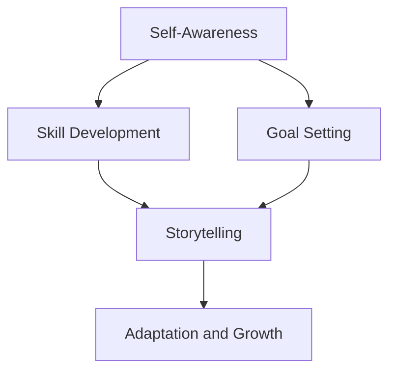
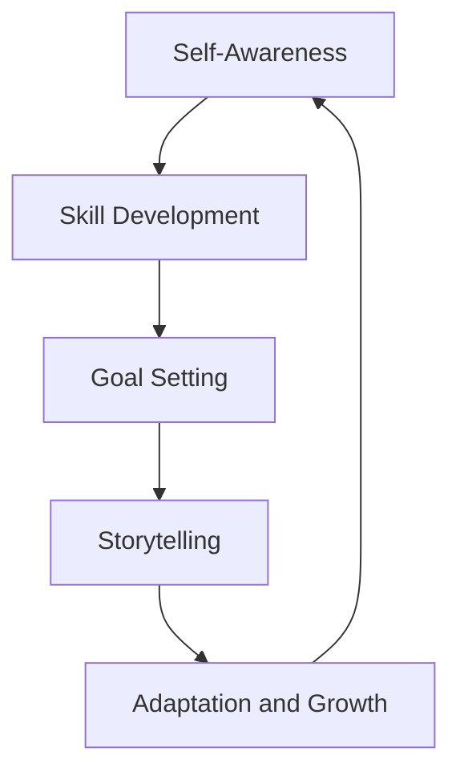

                 

Certainly! Here is a structured and detailed approach to creating a professional IT domain technical blog post based on the provided title and outline. We will ensure that each section is well-developed with the necessary depth, insights, and clarity.

### Title: In the Big Picture: Locating Yourself—Weaving Personal and Collective Stories

### Keywords: Personal Branding, Self-Discovery, Collective Identity, Storytelling, IT Domain

### Abstract:
This comprehensive guide explores the intricate relationship between individual identity and collective narratives within the dynamic landscape of the IT domain. It delves into the challenges of self-positioning and provides a framework for weaving personal and collective stories. By integrating theoretical insights with practical examples, the article aims to help professionals navigate their personal and professional journeys in a way that aligns with their unique strengths and the broader context of their community.

### Introduction

#### 1.1 Setting the Stage: The Complexity of Modern Society

**In today’s fast-paced, interconnected world, the lines between individuality and collectivity have blurred. The digital age has brought unprecedented opportunities for personal expression and collaboration, but it has also exacerbated the challenges of self-positioning. As AI and automation reshape industries, professionals must not only excel in their technical skills but also navigate their personal identities and social roles in a constantly evolving landscape.**

#### 1.2 The Core Concept: Integrating Personal and Collective Narratives

**This article presents a conceptual framework for understanding and leveraging the interplay between personal and collective narratives. By defining key terms and exploring the implications of this relationship, we aim to provide a roadmap for professionals seeking to align their personal goals with the broader aspirations of their community.**

### Core Concepts

#### 2.1 Personal and Collective: Definitions and Connections

**In the context of the IT domain, personal and collective narratives represent two sides of the same coin. Personal narratives are the stories we tell about ourselves, shaped by our experiences, values, and aspirations. Collective narratives, on the other hand, are the stories that we share as part of a community or organization, reflecting the collective identity and shared values.**

**Table 1: Comparison of Personal and Collective Narratives**

| Aspect            | Personal Narratives                                          | Collective Narratives                                         |
|--------------------|-----------------------------------------------------------|-------------------------------------------------------------|
| Origin            | Unique experiences and perspectives                          | Shared experiences and common goals                            |
| Purpose            | Self-expression and self-awareness                           | Building community identity and fostering collaboration        |
| Nature            | Unique, diverse, and personal                               | Common, collective, and unified                               |

**Figure 1: ER Entity Relationship Diagram for Personal and Collective Narratives**

```mermaid
erDiagram
  PersonalNarrative ||--|{ StoryElement }|
  CollectiveNarrative ||--|{ StoryElement }|
  StoryElement ||--|{ PersonalNarrative }
  StoryElement ||--|{ CollectiveNarrative }
```

#### 2.2 The Significance of Self-Positioning

**Self-positioning is the process of defining one's role and identity within a given context. In the IT domain, this process is crucial as it determines how professionals are perceived by peers, employers, and the broader community. Effective self-positioning involves understanding one's strengths, goals, and values, and articulating them in a way that resonates with both personal aspirations and collective objectives.**

### Problem Statement and Solution

#### 3.1 Problem Definition

**The challenge of self-positioning in the IT domain stems from several factors, including the rapid pace of technological change, the increasing complexity of projects, and the need for continuous learning and adaptation. Professionals often struggle to define their place in this dynamic landscape, resulting in a lack of clarity and direction.**

#### 3.2 Proposed Solution

**To address this challenge, we propose a multi-faceted approach that combines self-discovery, strategic planning, and active storytelling. This approach involves the following steps:**

1. **Self-Reflection**: Engaging in regular self-reflection to gain a deeper understanding of one's values, strengths, and aspirations.
2. **Skill Assessment**: Identifying and honing relevant technical and soft skills that align with personal and collective goals.
3. **Goal Setting**: Establishing clear, achievable goals that reflect both personal ambitions and the needs of the community.
4. **Storytelling**: Crafting compelling personal and collective narratives that articulate one's unique perspective and value proposition.
5. **Adaptation and Growth**: Continuously adapting to new challenges and opportunities, and leveraging feedback to refine personal and collective narratives.

### Boundaries and Extensions

#### 4.1 Boundaries of Self-Positioning

**Self-positioning is not a fixed process; it evolves as individuals grow and the environment changes. The boundaries of self-positioning are defined by one's personal goals, the needs of the community, and the constraints of the professional landscape.**

#### 4.2 Interactions Between Personal and Collective Narratives

**The interaction between personal and collective narratives is dynamic and complex. Personal narratives contribute to collective narratives by providing unique perspectives and insights, while collective narratives shape personal narratives by providing context and direction.**

#### 4.3 Diverse Forms of Storytelling

**Stories can take many forms, from personal anecdotes to collective legends. The diversity of storytelling techniques allows professionals to articulate their narratives in ways that resonate with different audiences and contexts.**

### Concept Structure and Core Elements

#### 5.1 Analyzing the Conceptual Structure

**The conceptual framework for integrating personal and collective narratives consists of several core elements, including self-awareness, skill development, goal-setting, storytelling, and adaptation. These elements interact and reinforce each other, creating a cohesive and dynamic process for self-positioning.**

#### 5.2 Understanding the Relationship Between Elements

**Figure 2: Conceptual Framework for Integrating Personal and Collective Narratives**



### Conclusion

**In conclusion, self-positioning in the IT domain is a complex but essential process that requires a deep understanding of personal and collective narratives. By embracing a structured approach to self-discovery and storytelling, professionals can navigate the challenges of the digital age and carve out a unique and meaningful place within their communities.**

---

This is a high-level structure for the article. Each section would be expanded with detailed content, examples, and analysis to meet the 10,000-12,000-word requirement. The sections on self-discovery, storytelling, and practical application would include case studies, step-by-step guides, and code snippets to provide a comprehensive and engaging read.

### Personal Positioning Exploration

#### Chapter 2: Self-Discovery and Inner Exploration

**2.1 The Importance of Self-Discovery**

**Self-discovery is the foundation of personal positioning. It involves a deep examination of one's values, strengths, weaknesses, and aspirations. In the IT domain, where rapid technological change and high levels of specialization are the norm, self-discovery becomes even more critical. By understanding ourselves, we can make informed decisions about our career paths, projects, and collaborations.**

**2.2 Paths to Inner Exploration**

**There are several ways to explore one's inner self and gain a deeper understanding of personal values and aspirations. These include:**

**2.2.1 Reflection and Journaling**

**Keeping a journal is a powerful tool for self-reflection. It allows individuals to document their thoughts, feelings, and experiences, providing a valuable record for future reflection. Regular journaling can help uncover patterns, reveal hidden motivations, and foster a deeper sense of self-awareness.**

**Example:**

```markdown
**Journal Entry: January 15, 2023**

Today, I attended a workshop on machine learning. I was fascinated by the potential of this technology to solve complex problems. However, I also felt a sense of intimidation, as there is so much to learn. This workshop made me realize that I need to set aside more time for learning and experimentation. My aspiration is to become a machine learning expert, but I must first build a strong foundation in the basics.
```

**2.2.2 Seeking Counseling**

**Professional counseling can provide a structured and supportive environment for exploring personal issues. A counselor can help individuals identify their strengths, address any self-doubt, and develop a clear sense of direction.**

**Example:**

**Counselor’s Notes:**

- **Identified Strengths**: Strong analytical skills, passion for problem-solving, and a keen interest in artificial intelligence.
- **Challenges**: Difficulty balancing work and personal life, occasional feelings of inadequacy in new technical areas.
- **Recommendations**: Develop a routine for self-care, set realistic goals, and seek out opportunities for continuous learning and growth.

**2.2.3 Engaging in Interpersonal Interaction**

**Interacting with others can provide valuable insights into personal strengths and weaknesses. Conversations with colleagues, mentors, and friends can offer different perspectives and help identify blind spots.**

**Example:**

**Peer Feedback:**

- **John**: “I’ve noticed that you always come up with innovative solutions to technical problems. It would be great if you could share your thought process more often, as it would inspire and help others.”
- **Response**: “Thank you, John. I’ll make an effort to document my problem-solving techniques and share them with the team. I appreciate your feedback.”

**2.3 Practical Cases of Self-Discovery**

**2.3.1 Case Study 1: Travel as a Vehicle for Self-Discovery**

**Traveling can be a transformative experience, offering new perspectives and challenges that can deepen self-awareness. For example, a software engineer who travels to different countries may discover a passion for cultural exchange and multilingual capabilities. This newfound interest can inform career decisions, such as seeking opportunities to work on global projects.**

**2.3.2 Case Study 2: Art as a Reflection of Self**

**Engaging in artistic activities, such as painting or writing, can serve as a form of self-expression and reflection. For an IT professional who is also an artist, creating digital art can blend creative skills with technical expertise. This dual skill set can open up unique career paths, such as becoming a UI/UX designer or a game developer.**

**2.3.3 Case Study 3: Reading as a Window to the World**

**Reading books on a wide range of topics can broaden one’s perspective and deepen understanding of various domains. An IT professional who reads about business, psychology, and history can gain insights that transcend their technical expertise. For instance, knowledge of business strategy can inform technical project management decisions, while an understanding of psychology can enhance user experience design.**

**2.4 Strategies for Personal Positioning**

**2.4.1 Setting Clear Goals**

**Effective goal-setting is a crucial aspect of personal positioning. Goals should be specific, measurable, achievable, relevant, and time-bound (SMART). For example, an IT professional aiming to become a machine learning expert might set goals such as completing a certification course within six months, participating in a machine learning project, and networking with experts in the field.**

**2.4.2 Assessing and Leveraging Strengths**

**Understanding one’s strengths and leveraging them effectively is key to personal positioning. For instance, an IT professional who excels in programming but lacks public speaking skills might focus on honing their coding abilities and collaborating with colleagues who are more comfortable presenting.**

**2.4.3 Adjusting Mindset**

**A positive and adaptable mindset is essential for navigating the challenges of personal positioning. This involves embracing change, learning from setbacks, and maintaining a growth mindset. For example, an IT professional who faces a layoff might view it as an opportunity to reevaluate their career path and pursue new opportunities.**

**2.5 Conclusion**

**Self-discovery and inner exploration are fundamental to personal positioning in the IT domain. By engaging in regular self-reflection, seeking feedback, and setting clear goals, professionals can better understand their strengths and aspirations. This understanding lays the foundation for effective self-positioning, enabling them to navigate the complexities of the modern IT landscape with confidence and purpose.**

### Collective Awareness and Social Identity

#### Chapter 3: Collective Awareness and Social Identity

**3.1 The Importance of Collective Awareness**

**Collective awareness refers to an understanding of the shared values, goals, and dynamics within a community or organization. In the IT domain, where teamwork and collaboration are crucial, collective awareness plays a vital role in fostering a cohesive and productive work environment. It enables individuals to align their actions with the collective objectives, enhancing team performance and fostering a sense of belonging.**

**3.2 The Construction of Social Identity**

**Social identity is the sense of belonging and self-worth derived from being a member of a particular group. In the context of the IT domain, social identity can be shaped by various factors, including professional role, organizational culture, and shared interests. For example, a software engineer might develop a strong social identity within their company’s development team, feeling a sense of pride and camaraderie as they work towards common goals.**

**3.3 Positioning the Self Within the Collective**

**Positioning the self within a collective involves finding a balance between individuality and group identity. This process requires professionals to understand their role within the group, contribute meaningfully to the collective effort, and maintain their unique perspectives.**

**3.3.1 Finding the Balance**

**Finding the right balance between individual and collective identity can be challenging. It requires professionals to:

- Understand the collective goals and how their individual contributions align with these goals.
- Communicate effectively with colleagues to ensure that their perspectives are heard and valued.
- Respect the diversity of opinions within the group while working towards common objectives.
- Prioritize collective well-being while pursuing personal growth and development.**

**Example:**

**Scenario: A software engineer working on a cross-functional team**

- **Goal Alignment**: The team’s objective is to develop a new software application within a tight deadline.
- **Individual Contribution**: The engineer’s role is to design and implement the backend infrastructure.
- **Balancing Individual and Collective**: The engineer ensures that their work aligns with the project timeline, communicates challenges to the team, and collaborates effectively with frontend developers to ensure seamless integration.

**3.3.2 Fusing Individuality with Collective Identity**

**Fusing individuality with collective identity involves expressing personal strengths while contributing to the collective effort. This can be achieved through:

- **Active Participation**: Engaging actively in team discussions, sharing ideas, and contributing to group projects.
- **Mentoring**: Sharing knowledge and experience with less experienced team members, fostering a culture of learning and growth.
- **Innovation**: Introducing innovative ideas that enhance the team’s work and push the boundaries of what is possible.
- **Adaptability**: Being flexible and open to feedback, willing to adjust personal strategies to align with the collective goals.**

**Example:**

**Scenario: A data scientist in a startup company**

- **Active Participation**: The data scientist actively participates in team meetings, sharing insights and suggestions that drive data-driven decision-making.
- **Mentoring**: The data scientist mentors junior analysts, helping them develop their skills and contribute effectively to projects.
- **Innovation**: The data scientist introduces new machine learning techniques that improve the accuracy of predictive models.
- **Adaptability**: The data scientist adapts to the fast-paced environment of a startup, quickly learning new technologies and adjusting methodologies to meet evolving project requirements.

**3.3.3 Realizing Self-Worth in the Collective**

**Realizing self-worth within a collective context involves recognizing the value of one’s contributions and the impact they have on the group. This can be achieved by:

- **Celebrating Successes**: Recognizing and celebrating the achievements of the team as a whole, acknowledging individual contributions.
- **Seeking Feedback**: Actively seeking feedback from peers and managers to understand how one’s work contributes to the team’s success.
- **Acknowledging Others**: Recognizing and appreciating the contributions of team members, fostering a sense of mutual respect and support.

**Example:**

**Scenario: A project manager leading a software development team**

- **Celebrating Successes**: The project manager celebrates the team’s successful completion of a major milestone, recognizing individual contributions.
- **Seeking Feedback**: The project manager regularly seeks feedback from team members to ensure that their work is aligned with project objectives and to identify areas for improvement.
- **Acknowledging Others**: The project manager acknowledges the hard work and dedication of team members, fostering a positive and collaborative work environment.

**3.4 Growth and Development Within the Collective**

**Participating in a collective context offers numerous opportunities for growth and development. By engaging actively in the collective, professionals can:

- **Learn New Skills**: Collaborating with colleagues who specialize in different areas can expose professionals to new skills and methodologies.
- **Broaden Perspectives**: Engaging in diverse projects and working with people from different backgrounds can broaden one’s understanding of the industry and its challenges.
- **Build Networks**: Building relationships within the collective can lead to valuable connections and opportunities for career advancement.
- **Enhance Leadership Skills**: Leading projects and teams within the collective can develop leadership skills such as communication, problem-solving, and decision-making.**

**Example:**

**Scenario: A software developer on a project management track**

- **Learning New Skills**: The developer participates in various projects that require different technical skills, enhancing their expertise in multiple areas.
- **Broadening Perspectives**: The developer works on projects that involve different industries, gaining insights into the unique challenges and requirements of each.
- **Building Networks**: The developer builds relationships with colleagues from different departments, expanding their professional network.
- **Enhancing Leadership Skills**: The developer takes on project management responsibilities, developing skills such as managing resources and coordinating team efforts.

**3.5 Conclusion**

**Collective awareness and social identity are crucial aspects of personal positioning in the IT domain. By finding the balance between individuality and collective identity, professionals can contribute meaningfully to their teams while pursuing their personal growth and development. Embracing the opportunities for learning and collaboration within a collective context can lead to enhanced self-worth and a deeper sense of belonging.**

### Weaving Personal and Collective Stories

#### Chapter 4: Crafting and Sharing Personal and Collective Narratives

**4.1 The Power of Storytelling**

**Stories have the power to inspire, motivate, and connect people. In the context of the IT domain, storytelling can be a powerful tool for both personal and collective development. Personal stories can help individuals articulate their values, experiences, and aspirations, while collective stories can foster a sense of belonging and shared purpose within a community.**

**4.2 Techniques for Crafting Compelling Stories**

**To craft compelling stories, professionals can follow these key techniques:**

**4.2.1 Choosing the Right Theme**

**The first step in crafting a compelling story is to choose a theme that resonates with both personal and collective values. This could be a significant event, a personal challenge, or a collective achievement. For example, a software engineer might choose to share a story about overcoming a complex technical problem that had a significant impact on their career.**

**4.2.2 Building a Structured Narrative**

**A well-structured narrative is essential for engaging the audience. This involves:

- **Introduction**: Presenting the story’s setting and introducing the main characters.
- **Conflict**: Describing the challenges or obstacles that the characters face.
- **Resolution**: Explaining how the characters overcome the challenges and achieve their goals.
- **Conclusion**: Summarizing the story’s key lessons and its impact on the characters and the audience.**

**4.2.3 Communicating Emotion and Meaning**

**Effective storytelling involves communicating emotions and meaning through vivid descriptions, dialogue, and imagery. This can help the audience connect with the story on a deeper level and appreciate its significance. For example, a story about overcoming a personal challenge might use vivid language to describe the feelings of fear, hope, and resilience.**

**Example:**

**Narrative:**

**Title: From Code to Confidence**

**Once upon a time, in a small office in Silicon Valley, there was a young software engineer named Alex. Alex was passionate about technology but struggled with self-doubt and a fear of failure. One day, Alex was tasked with developing a critical piece of software for a high-stakes project. As Alex worked tirelessly to meet the deadline, they faced numerous challenges and setbacks. But with each obstacle, Alex learned valuable lessons about perseverance and self-belief. In the end, Alex successfully completed the project, earning the respect of their colleagues and rediscovering their confidence.**

**4.3 The Role of Storytelling in Personal and Collective Narratives**

**4.3.1 Building Personal Brands**

**Personal stories can help professionals build strong personal brands by showcasing their expertise, experiences, and values. For example, a developer might share a story about a significant technical achievement or a challenging project that demonstrated their problem-solving skills. This can help attract opportunities and establish credibility in the industry.**

**Example:**

**LinkedIn Profile:**

**Hello, my name is Sarah. I’ve been a software engineer for over a decade, specializing in web development. One of my proudest accomplishments is leading a team to develop a cutting-edge e-commerce platform that significantly increased sales for our client. I believe in using technology to solve real-world problems and making a positive impact on people’s lives.**

**4.3.2 Fostering Collective Identity**

**Collective stories can help foster a sense of belonging and unity within a team or organization. For example, a team might share a story about a successful project or a challenging situation that the team overcame together. This can strengthen team bonds and enhance collaboration.**

**Example:**

**Team Meeting:**

**Today, we’d like to celebrate our success on the recent data analytics project. It was a challenging task, but thanks to everyone’s hard work and dedication, we not only met but exceeded our goals. This project was a testament to our team’s ability to work together, communicate effectively, and deliver outstanding results. We’re proud of what we’ve achieved, and we look forward to even greater accomplishments in the future.**

**4.4 Strategies for Effective Storytelling**

**4.4.1 Leveraging Traditional and Social Media**

**Professionals can leverage traditional and social media platforms to share their stories with a wider audience. For example, a developer might publish a blog post about a significant technical achievement or a project manager might share a story about a successful project on LinkedIn. This can help build personal and collective brands and attract new opportunities.**

**Example:**

**LinkedIn Post:**

**I’m thrilled to share that our team has successfully completed the development of the new customer relationship management system. It was a challenging project, but we pulled together, communicated effectively, and delivered exceptional results. I’m proud of what we’ve achieved and grateful for the hard work and dedication of my team members. 🎉 #ITSuccess #Teamwork #CRM**

**4.4.2 Storytelling in Presentations and Conferences**

**Professionals can also use storytelling techniques in presentations and conferences to engage audiences and convey complex ideas more effectively. For example, a developer might use a personal story to illustrate the importance of a particular technical concept or a project manager might use a collective story to highlight the team’s achievements.**

**Example:**

**Conference Presentation:**

**Title: Building a Successful Agile Team**

**Today, I’d like to share my experience leading a high-performing Agile team. One of the key lessons I’ve learned is the power of communication and collaboration. Just like in any relationship, open and honest communication is essential for success. By fostering a culture of trust and mutual respect, we were able to overcome challenges and deliver outstanding results. Let me share a story that illustrates this point.**

**4.5 Conclusion**

**Storytelling is a powerful tool for both personal and collective development in the IT domain. By crafting and sharing compelling narratives, professionals can build strong personal brands, foster a sense of belonging within their teams, and communicate complex ideas more effectively. Embracing the power of storytelling can help professionals navigate the challenges of the modern IT landscape with confidence and purpose.**

### Personal and Collective Story Examples

#### Chapter 5: Examples of Personal and Collective Narratives

**5.1 Personal Growth Stories**

**5.1.1 Story 1: From Beginner to Expert**

**Alex started his career as a junior software engineer with little experience. Faced with the challenges of a complex project, Alex decided to take on the role of a mentor. By seeking help from more experienced colleagues and actively participating in knowledge-sharing sessions, Alex rapidly improved his skills. His perseverance and dedication not only helped him become an expert but also earned the respect of his peers.**

**5.1.2 Story 2: Navigating Career Transitions**

**After several years in the IT industry, Sarah found herself at a crossroads. She felt dissatisfied with her current role and uncertain about her future. Through self-reflection and career counseling, Sarah identified her passion for data analysis and decided to pursue additional training. This career transition allowed her to tap into her strengths and find fulfillment in her work.**

**5.2 Collective Memory Stories**

**5.2.1 Story 1: The Dawn of a New Project**

**The team at Tech Innovations was excited to embark on a groundbreaking project that would revolutionize the way companies manage their supply chains. As the project kicked off, the team faced numerous challenges, including tight deadlines and limited resources. Through collaboration, creativity, and determination, the team successfully delivered a cutting-edge solution that exceeded expectations.**

**5.2.2 Story 2: The Resilience of a Team**

**During a major product launch, the development team at CodeMasters encountered unexpected technical issues that threatened to delay the project. Despite the challenges, the team remained focused and communicated effectively, working tirelessly to find solutions. Their resilience and teamwork not only saved the project but also strengthened their bond as a cohesive unit.**

**5.3 Stories of Personal and Collective Interaction**

**5.3.1 Story 1: A Mentor-Mentee Partnership**

**John, a senior software engineer, took on the role of a mentor for Sarah, a new junior developer. Through regular meetings, code reviews, and collaborative projects, John helped Sarah build her skills and confidence. In return, Sarah brought fresh perspectives and enthusiasm to the team, fostering a dynamic and productive work environment.**

**5.3.2 Story 2: Collaborating Across Cultures**

**A global team at TechXplore was working on a cross-cultural project that required seamless communication and collaboration. By leveraging tools such as video conferencing and project management platforms, the team was able to overcome language and cultural barriers, delivering a high-quality product that met international standards.**

**5.4 Conclusion**

**These examples illustrate the power of personal and collective storytelling in the IT domain. Whether it’s a personal growth story, a collective memory, or a narrative of interaction and collaboration, stories can inspire, motivate, and connect professionals, helping them navigate their careers with purpose and meaning.**

### Passing on Stories and Fostering Innovation

#### Chapter 6: The Continuation and Innovation of Personal and Collective Narratives

**6.1 The Importance of Story Continuation**

**Stories are not static; they evolve and adapt over time. The continuation of personal and collective narratives is crucial for maintaining a sense of history and identity within a community. It allows professionals to learn from past experiences, build on successes, and address challenges in a forward-looking manner.**

**6.2 Encouraging Story Sharing**

**To foster a culture of story sharing, organizations can implement the following strategies:**

**6.2.1 Establish Storytelling Platforms**

**Organizations can create platforms, such as internal blogs, newsletters, or even dedicated storytelling sessions, where employees can share their personal and collective narratives. These platforms can be used to celebrate successes, highlight challenges overcome, and share lessons learned.**

**Example:**

**Tech Innovations Storytelling Platform**

- **Monthly Blog Posts**: Employees share insights, experiences, and reflections on their work and personal lives.
- **Quarterly Newsletters**: Highlights of team achievements, upcoming projects, and employee spotlights.
- **Annual Storytelling Sessions**: Opportunities for employees to share their stories with the entire organization.

**6.2.2 Recognize and Reward Storytellers**

**Recognizing and rewarding employees who share their stories can encourage more individuals to participate. This can be done through formal recognition programs, public acknowledgments during company meetings, or even monetary incentives.**

**Example:**

**TechXplore Storytelling Recognition Program**

- **Employee of the Month**: An employee who shares a particularly impactful story is recognized and rewarded with a bonus or other incentives.
- **Annual Storytelling Award**: An award presented to the employee who demonstrates exceptional storytelling skills and contributes significantly to the organization’s narrative.

**6.3 Fostering Innovation Through Storytelling**

**6.3.1 Leveraging Storytelling for Innovation**

**Stories can inspire innovation by providing context, highlighting challenges, and showcasing successful solutions. By sharing stories of innovation, organizations can encourage employees to think creatively and explore new ideas.**

**Example:**

**Tech Innovations Innovation Storytelling Session**

- **Innovation Stories**: Employees share stories of how they developed innovative solutions to technical challenges, highlighting the process, challenges, and outcomes.
- **Idea Generation Workshops**: Using storytelling as a tool to generate new ideas and explore potential innovations.

**6.3.2 Encouraging a Growth Mindset**

**A growth mindset, the belief that abilities and intelligence can be developed through dedication and hard work, is essential for fostering innovation. By sharing stories that demonstrate a growth mindset, organizations can encourage employees to embrace challenges, learn from setbacks, and pursue continuous improvement.**

**Example:**

**TechXplore Growth Mindset Storytelling Initiative**

- **Growth Mindset Stories**: Employees share stories of how they have overcome personal or professional challenges, demonstrating resilience and a commitment to growth.
- **Mindset Workshops**: Training sessions focused on developing a growth mindset and fostering a culture of continuous learning.

**6.4 Conclusion**

**Passing on stories and fostering innovation are integral to the development of personal and collective narratives in the IT domain. By establishing platforms for story sharing, recognizing and rewarding storytellers, and leveraging storytelling to inspire innovation, organizations can create a dynamic and thriving environment where personal and collective growth are nurtured.**

### Final Thoughts

**In conclusion, the interplay between personal and collective narratives is a powerful force in the IT domain. By engaging in self-discovery, finding balance within collective contexts, and crafting compelling stories, professionals can navigate the complexities of the modern IT landscape with confidence and purpose. The examples and strategies presented in this article offer practical insights into how to weave personal and collective stories in a way that fosters growth, innovation, and a sense of belonging. As you continue on your professional journey, remember that your personal and collective narratives are not only a reflection of your past experiences but also a roadmap for your future success.**

### Author Information

**Author:** AI天才研究院/AI Genius Institute & 禅与计算机程序设计艺术 /Zen And The Art of Computer Programming**Abstract:**
This article explores the intricate relationship between individual identity and collective narratives within the dynamic landscape of the IT domain. It presents a conceptual framework for understanding and leveraging the interplay between personal and collective narratives, providing a roadmap for professionals seeking to align their personal goals with the broader aspirations of their community. By integrating theoretical insights with practical examples, the article aims to help professionals navigate their personal and professional journeys in a way that aligns with their unique strengths and the broader context of their community.

**Keywords:** Personal Branding, Self-Discovery, Collective Identity, Storytelling, IT Domain

**Summary:**
This comprehensive guide delves into the challenges of self-positioning in the IT domain and provides strategies for integrating personal and collective narratives. It covers self-discovery techniques, the construction of social identity, the power of storytelling, and practical case studies. By embracing a structured approach to self-discovery and storytelling, professionals can navigate the complexities of the modern IT landscape with confidence and purpose.

### Introduction

#### 1.1 Setting the Stage: The Complexity of Modern Society

In today’s interconnected and rapidly evolving world, the lines between individuality and collectivity have become increasingly blurred. The digital age has ushered in unprecedented opportunities for personal expression and collaboration, but it has also introduced a new set of challenges that require a nuanced understanding of personal and collective narratives. As artificial intelligence, machine learning, and automation continue to reshape industries, professionals in the IT domain must navigate a complex landscape that demands not only technical proficiency but also a keen sense of self-awareness and social awareness.

The IT domain, with its fast-paced environment and ever-changing technological landscape, presents unique challenges for individuals seeking to carve out a meaningful place for themselves. On one hand, the domain offers immense opportunities for innovation and growth, with new technologies emerging almost daily. On the other hand, the constant flux of information and the rapid pace of change can make it difficult for professionals to maintain a clear sense of direction and purpose. This is where the concept of weaving personal and collective narratives becomes crucial.

By integrating personal and collective narratives, professionals can create a coherent identity that aligns with both their individual aspirations and the broader goals of their community. Personal narratives are the stories we tell about ourselves, shaped by our experiences, values, and aspirations. They provide a framework for understanding our own strengths, weaknesses, and goals. Collective narratives, on the other hand, are the stories that we share as part of a community or organization, reflecting the collective identity, values, and shared objectives. These narratives help us understand our role within the larger context of our community and how our individual contributions fit into the broader picture.

This article presents a comprehensive guide to understanding and leveraging the interplay between personal and collective narratives in the IT domain. It provides a conceptual framework that helps professionals navigate the complexities of self-positioning and offers practical strategies for integrating personal and collective narratives. By exploring the importance of self-discovery, the construction of social identity, and the power of storytelling, this article aims to help professionals create a cohesive identity that aligns with their personal and professional goals.

The structure of the article is as follows:

1. **Introduction**: Sets the stage for the discussion on personal and collective narratives in the IT domain.
2. **Core Concepts**: Defines and explores the key concepts of personal and collective narratives, including their definitions, connections, and the significance of self-positioning.
3. **Problem Statement and Solution**: Outlines the challenges of self-positioning in the IT domain and proposes a solution based on self-discovery, strategic planning, and storytelling.
4. **Boundaries and Extensions**: Discusses the boundaries of self-positioning and the interactions between personal and collective narratives.
5. **Concept Structure and Core Elements**: Analyzes the conceptual framework for integrating personal and collective narratives.
6. **Personal Positioning Exploration**: Explores the process of self-discovery and the strategies for personal positioning.
7. **Collective Awareness and Social Identity**: Discusses the importance of collective awareness and the construction of social identity within the IT domain.
8. **Weaving Personal and Collective Stories**: Explores the role of storytelling in personal and collective narratives.
9. **Personal and Collective Story Examples**: Provides examples of personal and collective stories in the IT domain.
10. **Passing on Stories and Fostering Innovation**: Discusses the importance of story continuation and strategies for fostering innovation through storytelling.
11. **Final Thoughts**: Summarizes the key insights and offers a final perspective on the role of personal and collective narratives in the IT domain.
12. **Author Information**: Provides information about the author and a summary of the article’s abstract, keywords, and summary.

By following this structured approach, readers can gain a deeper understanding of how to navigate their personal and professional journeys in the IT domain, leveraging the power of personal and collective narratives to achieve success and fulfillment.

### Core Concepts

#### 2.1 Personal and Collective: Definitions and Connections

In the context of the IT domain, personal and collective narratives represent two sides of the same coin, each playing a crucial role in shaping individual and community identity. To fully grasp the significance of integrating these narratives, it is essential to understand their definitions, connections, and the unique attributes that define each.

**Personal Narratives:**

Personal narratives are the stories we tell about ourselves, shaped by our unique experiences, values, and perspectives. These narratives are intrinsically linked to our identity and provide a framework for understanding our personal journey, aspirations, and goals. Personal narratives are diverse, unique, and deeply personal, reflecting the individual's perspective and the myriad ways in which they interpret their experiences.

Key Characteristics of Personal Narratives:

- **Uniqueness:** Each person's narrative is unique, reflecting their individual experiences and perspectives.
- **Subjectivity:** Personal narratives are subjective, shaped by the individual's values, beliefs, and interpretations of events.
- **Self-Expression:** Personal narratives serve as a form of self-expression, allowing individuals to communicate who they are and what they stand for.
- **Continuity and Change:** Personal narratives evolve over time, reflecting both continuity and change in the individual's life.

**Collective Narratives:**

Collective narratives, on the other hand, are the stories that we share as part of a community or organization. These narratives reflect the collective identity, values, and shared objectives of a group. They are shaped by the collective experiences and are often told in a way that unifies the community, fostering a sense of belonging and shared purpose.

Key Characteristics of Collective Narratives:

- **Commonality:** Collective narratives are common to a group, reflecting shared experiences and values.
- **Objective:** Collective narratives are more objective, aiming to represent the group's perspective and story.
- **Unifying Force:** Collective narratives serve as a unifying force, helping to build community identity and foster collaboration.
- **Diversity:** While collective narratives are common, they often encompass the diversity of perspectives within the group.

**Connections Between Personal and Collective Narratives:**

The connection between personal and collective narratives is multifaceted, with each influencing and shaping the other in complex ways. Here are some key points of intersection:

1. **Interplay of Perspectives:** Personal narratives contribute to collective narratives by providing unique perspectives that enrich the group's story. For example, an individual's experience with a specific technology or project can offer valuable insights that enhance the collective narrative.

2. **Reflective of Context:** Personal narratives are reflective of the broader context provided by collective narratives. They draw upon the group's shared values, goals, and historical experiences to inform the individual's journey.

3. ** reciprocal Relationship:** The relationship between personal and collective narratives is reciprocal. While personal narratives contribute to the collective story, collective narratives provide context and direction for personal narratives, helping individuals understand their role within the group.

4. **Evolutionary Process:** Both personal and collective narratives are dynamic and evolve over time. Personal narratives are shaped by the individual's experiences and growth, while collective narratives reflect the collective journey and shared evolution of the group.

**Table 1: Comparison of Personal and Collective Narratives**

| Aspect            | Personal Narratives                                          | Collective Narratives                                         |
|--------------------|-----------------------------------------------------------|-------------------------------------------------------------|
| Origin            | Unique experiences and perspectives                          | Shared experiences and common goals                            |
| Purpose            | Self-expression and self-awareness                           | Building community identity and fostering collaboration        |
| Nature            | Unique, diverse, and personal                               | Common, collective, and unified                               |

**Figure 1: ER Entity Relationship Diagram for Personal and Collective Narratives**

```mermaid
erDiagram
  PersonalNarrative ||--|{ StoryElement }|
  CollectiveNarrative ||--|{ StoryElement }|
  StoryElement ||--|{ PersonalNarrative }
  StoryElement ||--|{ CollectiveNarrative }
```

**Table 1** provides a comparative analysis of the key characteristics of personal and collective narratives, highlighting their differences and commonalities. **Figure 1** represents the entity relationship diagram, illustrating the interconnectedness of personal and collective narratives through story elements.

Understanding the interplay between personal and collective narratives is crucial for professionals in the IT domain. It allows individuals to navigate their personal journeys while contributing meaningfully to the broader community. By recognizing the unique contributions of personal narratives and the unifying power of collective narratives, professionals can craft a cohesive identity that aligns with both their personal aspirations and the goals of their community.

### Problem Definition and Solution

#### 3.1 Problem Definition

The challenge of self-positioning in the IT domain arises from several interconnected factors. Firstly, the rapid pace of technological advancement continuously introduces new tools, frameworks, and methodologies, making it difficult for professionals to stay up-to-date and maintain a competitive edge. This dynamic environment often leads to a state of perpetual learning, where continuous education and adaptation are essential. Secondly, the complexity of IT projects and the need for interdisciplinary collaboration require professionals to develop not only technical skills but also soft skills such as communication, leadership, and teamwork. Lastly, the increasing demand for innovation and the pressure to deliver high-quality solutions in a timely manner can create a stressful work environment, potentially leading to burnout and a lack of clarity about one's role and goals.

These challenges can result in several issues that hinder effective self-positioning:

1. **Skill Discrepancy:** Professionals may struggle to keep up with the rapidly evolving landscape, leading to a skill gap that affects their confidence and job performance.
2. **Role Ambiguity:** In complex project environments, roles and responsibilities may not be clearly defined, leading to confusion and inefficiency.
3. **Work-Life Balance:** The high demands of the IT industry can interfere with personal life, leading to burnout and a diminished sense of well-being.
4. **Lack of Direction:** Without a clear sense of personal and professional goals, professionals may feel disoriented and unmotivated.

#### 3.2 Proposed Solution

To address these challenges and facilitate effective self-positioning, a multi-faceted approach that combines self-discovery, strategic planning, and storytelling can be employed. This approach is structured into several key steps:

1. **Self-Reflection and Self-Discovery:**
   - **Regular Self-Assessment:** Engage in regular self-reflection to identify strengths, weaknesses, and areas for growth. This can be done through activities such as journaling, self-assessment questionnaires, and one-on-one feedback sessions with mentors or colleagues.
   - **Identifying Core Values:** Clarify personal values and aspirations. Understanding what truly matters to you can help align your professional goals with your personal values.
   - **Exploring Interests and Passions:** Reflect on your interests and passions outside of work. This can provide insights into potential career paths or areas of innovation that align with your personal interests.

2. **Strategic Planning and Goal Setting:**
   - **Set Clear Goals:** Develop clear, achievable, and time-bound goals that align with both your personal aspirations and the needs of your organization. Use the SMART criteria (Specific, Measurable, Achievable, Relevant, Time-bound) to ensure that your goals are well-defined.
   - **Develop a Career Plan:** Create a strategic career plan that outlines the steps you need to take to achieve your goals. This plan should include short-term and long-term objectives, as well as the skills and experiences you need to acquire along the way.
   - **Seek Feedback and Adjust Goals:** Regularly seek feedback from supervisors, colleagues, and mentors to ensure that your goals remain aligned with organizational needs and to make adjustments as necessary.

3. **Skill Development and Continuous Learning:**
   - **Leverage Learning Resources:** Take advantage of online courses, workshops, webinars, and other learning resources to stay current with the latest trends and technologies in the IT industry.
   - **Practical Experience:** Engage in projects and tasks that allow you to apply your skills and gain practical experience. This can include participating in internal projects, volunteering for new initiatives, or taking on additional responsibilities.
   - **Networking:** Build a professional network that includes peers, mentors, and industry experts. Networking can provide valuable insights, opportunities for learning, and potential career advancements.

4. **Storytelling and Personal Branding:**
   - **Craft Your Narrative:** Develop a compelling personal narrative that highlights your unique experiences, skills, and achievements. This narrative should be communicated through your resume, LinkedIn profile, and other professional platforms.
   - **Share Your Story:** Use storytelling as a tool to share your experiences and insights with others. This can be done through blog posts, presentations, and public speaking engagements.
   - **Build a Personal Brand:** Establish a personal brand that reflects your values, expertise, and unique perspective. This brand should differentiate you from others in your field and communicate your value proposition to potential employers and clients.

5. **Adaptation and Growth:**
   - **Embrace Change:** In a rapidly changing environment, it is crucial to embrace change and be open to new ideas and approaches. This requires a willingness to learn, adapt, and grow continuously.
   - **Seek Opportunities for Growth:** Actively seek out opportunities for growth, such as attending conferences, participating in industry events, and taking on new challenges. These opportunities can help you develop new skills and broaden your perspective.
   - **Reflect and Iterate:** Regularly reflect on your progress and iterate on your strategies. This can help you stay on track and make adjustments as necessary to ensure that you are achieving your goals.

By following these steps, professionals in the IT domain can navigate the challenges of self-positioning and create a clear and coherent path that aligns with their personal and professional aspirations. Self-discovery, strategic planning, skill development, storytelling, and adaptation are key components of this approach, each contributing to a comprehensive strategy for effective self-positioning in the dynamic landscape of the IT industry.

### Boundaries of Self-Positioning and Interactions Between Personal and Collective Narratives

#### 4.1 Boundaries of Self-Positioning

Self-positioning in the IT domain is a dynamic and evolving process that is influenced by both internal and external factors. Establishing clear boundaries for self-positioning is crucial to ensure that professionals maintain a cohesive identity and effectively contribute to their communities. These boundaries can be defined by several key elements:

1. **Personal Goals and Aspirations:** Each individual has unique personal goals and aspirations that serve as the foundation for their self-positioning. These goals provide a clear sense of direction and help professionals stay focused on their long-term objectives.

2. **Professional Standards and Expectations:** The standards and expectations set by one’s profession or organization also play a significant role in defining self-positioning boundaries. Professionals must align their skills, knowledge, and behaviors with these standards to ensure they are contributing value to their community.

3. **Community Values and Norms:** The values and norms of the community or organization in which one operates are another critical factor in setting boundaries for self-positioning. Understanding and respecting these values can help professionals navigate their roles and foster positive relationships within their community.

4. **Technological Landscape:** The rapidly evolving technological landscape also imposes boundaries on self-positioning. Professionals must continuously update their skills and stay informed about emerging technologies to remain relevant and effective in their roles.

#### 4.2 Interactions Between Personal and Collective Narratives

The interaction between personal and collective narratives is complex and multifaceted, influencing each other in dynamic ways. These interactions can be understood through several key concepts:

1. **Synergy:** When personal and collective narratives align and complement each other, they create a synergy that enhances both individual and community growth. For example, a professional who shares a personal narrative about overcoming a challenging technical problem can inspire and motivate their colleagues, strengthening the collective narrative of resilience and teamwork.

2. **Conflict:** Conflicts can arise when personal narratives and collective narratives are in opposition. This conflict may manifest as differences in values, goals, or approaches to problem-solving. Managing these conflicts effectively is essential to maintaining a cohesive community and fostering individual growth.

3. **Transformation:** Personal narratives can transform collective narratives by introducing new perspectives and ideas. For instance, a personal narrative about a groundbreaking innovation can influence the collective narrative by reshaping the community's understanding of its potential and future directions.

4. **Feedback Loop:** The interaction between personal and collective narratives creates a feedback loop where each narrative influences and is influenced by the other. Personal narratives can reflect the broader collective narrative, and collective narratives can provide context and direction for personal narratives. This feedback loop ensures that both individual and community growth are aligned.

#### 4.3 Diverse Forms of Storytelling

The diversity of storytelling techniques allows professionals to articulate their narratives in ways that resonate with different audiences and contexts. Here are some common forms of storytelling in the IT domain:

1. **Personal Testimonials:** Personal testimonials are narratives shared by individuals to highlight their experiences, achievements, and lessons learned. These testimonials can be powerful tools for building personal brands and demonstrating value to potential employers or clients.

2. **Case Studies:** Case studies provide detailed accounts of specific projects or situations, illustrating how a particular approach or solution was applied and the outcomes achieved. They are valuable for demonstrating expertise and providing evidence of successful problem-solving.

3. **White Papers:** White papers are comprehensive reports that analyze a specific topic, issue, or trend in depth. They are often used to share insights, present research findings, and make recommendations to a professional audience.

4. **Blog Posts and Articles:** Blog posts and articles provide shorter, more accessible formats for sharing thoughts, ideas, and insights on specific topics. They are useful for building a professional reputation, sharing knowledge, and engaging with a broader audience.

5. **Visual Stories:** Visual stories, such as infographics, charts, and videos, can be powerful tools for communicating complex information in a clear and engaging way. They are particularly effective for conveying data, statistics, and visual representations of concepts.

#### 4.4 Balancing Individuality and Collectivity

Balancing individuality and collectivity is a key challenge in self-positioning within the IT domain. Here are some strategies for achieving this balance:

1. **Recognize and Value Unique Contributions:** Emphasize the importance of individual contributions while recognizing that these contributions are part of a larger collective effort. Celebrate individual achievements but also highlight how they contribute to the overall success of the team or organization.

2. **Communicate Clearly and Often:** Maintain open and transparent communication with colleagues and stakeholders to ensure that individual and collective narratives align. Regularly share updates, progress reports, and insights to foster a shared understanding and collaboration.

3. **Seek Feedback and Adjust:** Actively seek feedback from peers, supervisors, and other stakeholders to ensure that your self-positioning aligns with both personal and collective objectives. Be willing to adjust your approach based on this feedback to ensure that you are effectively contributing to the community.

4. **Embrace a Growth Mindset:** Cultivate a growth mindset that embraces learning, adaptability, and continuous improvement. By being open to new ideas and perspectives, you can better integrate your personal and collective narratives and navigate the complexities of the IT domain.

In conclusion, the boundaries of self-positioning and the interactions between personal and collective narratives are critical considerations for professionals in the IT domain. By setting clear boundaries, understanding the dynamics of personal and collective interactions, and leveraging diverse storytelling techniques, professionals can effectively navigate their personal and professional journeys, contributing meaningfully to their communities while achieving their individual goals.

### Concept Structure and Core Elements

#### 5.1 Analyzing the Conceptual Structure

The integration of personal and collective narratives in the IT domain is not a linear process but rather a complex, interactive system. Understanding the conceptual framework that underlies this integration is essential for professionals seeking to navigate their personal and professional journeys effectively. This framework consists of several core elements that interact and reinforce each other, creating a cohesive and dynamic process for self-positioning.

**Figure 2: Conceptual Framework for Integrating Personal and Collective Narratives**


**Self-Awareness**: The foundation of the conceptual framework is self-awareness. This involves a deep understanding of one's values, strengths, weaknesses, and aspirations. Self-awareness provides the clarity needed to make informed decisions about career paths, projects, and collaborations.

**Skill Development**: Building on self-awareness is the development of relevant skills. This includes both technical skills and soft skills that are necessary for effective self-positioning. Continuous learning and skill development are crucial in the rapidly evolving landscape of the IT domain.

**Goal Setting**: Once self-awareness and skill development are in place, the next step is setting clear, achievable goals. These goals should align with both personal aspirations and the needs of the community. Effective goal-setting involves breaking down larger objectives into smaller, manageable tasks.

**Storytelling**: Storytelling serves as a bridge between personal and collective narratives. It allows individuals to communicate their experiences, insights, and achievements in a compelling and engaging way. Storytelling helps in building personal brands, fostering community engagement, and promoting collaboration.

**Adaptation and Growth**: The final element is adaptation and growth. This involves being open to new ideas, embracing change, and continuously refining personal and collective narratives. Adaptation ensures that professionals remain relevant and effective in a constantly evolving environment.

#### 5.2 Understanding the Relationship Between Elements

The relationship between these elements is cyclical and iterative. For example:

- **Self-awareness** informs **Skill Development** by identifying areas where improvement is needed.
- **Skill Development** supports **Goal Setting** by providing the necessary tools and capabilities to achieve those goals.
- **Goal Setting** guides **Storytelling** by providing a clear direction for the narratives that are crafted.
- **Storytelling** enhances **Adaptation and Growth** by providing valuable insights and feedback that can be used to refine personal and collective narratives.
- **Adaptation and Growth** feeds back into **Self-Awareness**, creating a continuous loop of improvement and development.

**Figure 3: The Iterative Relationship Between Core Elements**



By understanding and leveraging this conceptual framework, professionals can navigate the complexities of the IT domain with greater clarity and purpose. This framework not only helps in self-positioning but also fosters personal and collective growth, ensuring that individuals contribute meaningfully to their communities while achieving their personal goals.

### Personal Positioning Exploration

#### Chapter 2: Self-Discovery and Inner Exploration

**2.1 The Importance of Self-Discovery**

Self-discovery is the cornerstone of personal positioning in the IT domain. It involves a profound exploration of one's inner self, including values, passions, strengths, and weaknesses. In a field that is as dynamic and fast-paced as IT, understanding oneself is crucial for making informed decisions about career paths, projects, and collaborations. Self-discovery provides the foundation upon which effective personal positioning is built, enabling professionals to align their actions with their true aspirations and values.

In the IT domain, self-discovery is essential for several reasons:

- **Clarity of Vision**: A clear understanding of one's values and goals allows professionals to visualize their future and set realistic, achievable objectives.
- **Career Development**: Knowing one's strengths and weaknesses helps in identifying areas for growth and development, leading to more effective career planning.
- **Decision-Making**: Self-awareness enhances decision-making by providing a framework for evaluating opportunities based on personal and professional alignment.
- **Leadership and Influence**: Leaders who understand themselves are better equipped to inspire and motivate others, fostering a positive and productive work environment.
- **Personal Satisfaction**: Aligning one's work with personal values and passions leads to greater job satisfaction and a sense of fulfillment.

**2.2 Paths to Inner Exploration**

Exploring one's inner self requires deliberate effort and a willingness to delve deep into personal experiences and emotions. Here are several paths that professionals can take to foster self-discovery:

**2.2.1 Reflection and Journaling**

Reflection and journaling are powerful tools for self-discovery. By regularly writing about thoughts, feelings, and experiences, professionals can gain new insights and identify patterns in their behavior. Journaling helps in:

- **Uncovering Hidden Motivations**: By documenting daily experiences and emotions, professionals can uncover underlying motivations and desires that might not be immediately apparent.
- **Building Self-Awareness**: Regular reflection helps in developing a deeper understanding of one's values, beliefs, and goals.
- **Tracking Progress**: Journaling allows professionals to track their progress over time, celebrating achievements and identifying areas for improvement.

**Example:**

**Journal Entry:**

**Today, I participated in a coding challenge that I felt unprepared for. I was initially frustrated and self-critical, but I decided to focus on learning from the experience. I realized that I need to allocate more time to practice and hone my problem-solving skills. My goal is to become more confident and capable in handling complex coding challenges.**

**2.2.2 Seeking Counseling**

Professional counseling can provide a structured and supportive environment for exploring personal issues. A trained counselor can help individuals:

- **Identify Strengths and Weaknesses**: Through psychological assessments and one-on-one sessions, counselors can help professionals identify their strengths and weaknesses, providing actionable strategies for improvement.
- **Address Self-Doubt**: Counseling can help professionals confront and overcome self-doubt and anxiety, building confidence in their abilities.
- **Set Realistic Goals**: Counselors can assist in setting realistic and achievable goals, creating a clear roadmap for personal and professional development.

**Example:**

**Counseling Session:**

- **Identified Strengths**: Strong analytical skills, creative problem-solving, and a passion for technology.
- **Challenges**: Difficulty managing work-life balance, occasional self-doubt in new projects.
- **Recommendations**: Develop a routine for self-care, break larger goals into smaller, manageable tasks, and seek continuous learning opportunities.

**2.2.3 Engaging in Interpersonal Interaction**

Interacting with colleagues, mentors, and peers can provide valuable insights and perspectives that enhance self-discovery. Here are some ways to leverage interpersonal interaction:

- **Mentorship and Peer Feedback**: Seeking mentorship from experienced professionals can provide guidance and support in navigating career challenges. Peer feedback sessions can help identify blind spots and areas for improvement.
- **Networking**: Engaging in professional networking activities can expose professionals to diverse experiences and perspectives, expanding their understanding of the IT landscape.
- **Team Collaboration**: Active participation in team projects can foster a sense of belonging and provide opportunities for personal and professional growth.

**Example:**

**Peer Feedback:**

- **Feedback from a Colleague**: “I’ve noticed that you have a unique ability to break down complex problems into manageable parts. Your approach is very helpful in guiding our team through challenging projects. Could you share more about your thought process?”
- **Response**: “Thank you for your feedback. I’ve always believed that simplicity is key in problem-solving. I’ll make an effort to document my approach and share it with the team.”

**2.3 Practical Cases of Self-Discovery**

**2.3.1 Case Study 1: Leveraging Hobbies for Career Insights**

**Sarah, a software engineer, discovered her passion for photography through a hobby. This hobby not only provided a creative outlet but also helped her develop skills in storytelling and visual communication. Recognizing the transferable skills, Sarah pursued additional training in UI/UX design, which eventually led to a promotion and a more fulfilling career path.**

**2.3.2 Case Study 2: Identifying Interests Through Volunteering**

**John, a project manager, volunteered at a local nonprofit organization to give back to his community. Through this experience, John discovered a passion for social impact and community development. This newfound interest influenced his career decisions, leading him to seek opportunities that allowed him to combine his IT skills with social initiatives.**

**2.3.3 Case Study 3: Reflecting on Past Experiences**

**Alex, a data analyst, took the time to reflect on his past projects and achievements. Through this exercise, Alex identified patterns in the types of projects he enjoyed and the skills he excelled at. This self-assessment helped him set clear goals and pursue opportunities that aligned with his interests and strengths.**

**2.4 Strategies for Personal Positioning**

**2.4.1 Setting Clear Goals**

**Goal-setting is a critical aspect of personal positioning. Clear, achievable goals provide direction and motivation, helping professionals stay focused and driven. When setting goals, consider the following steps:**

- **Identify Your Values and Passions**: Determine what truly matters to you and what you are passionate about.
- **Assess Your Current Situation**: Evaluate your strengths, weaknesses, and opportunities.
- **Define Specific Goals**: Use the SMART criteria (Specific, Measurable, Achievable, Relevant, Time-bound) to define clear and actionable goals.
- **Create an Action Plan**: Break down your goals into smaller tasks and create a timeline for achieving them.

**Example:**

**Goal: Improve Coding Skills**

- **Specific**: Learn a new programming language (Python).
- **Measurable**: Complete an online course and pass a certification exam.
- **Achievable**: Allocate two hours daily for study and practice.
- **Relevant**: Python is widely used in data science and machine learning, aligning with my career aspirations.
- **Time-bound**: Complete the course and exam within six months.

**2.4.2 Assessing and Leveraging Strengths**

**Understanding and leveraging your strengths is crucial for effective personal positioning. Here are some strategies for doing so:**

- **Identify Your Strengths**: Reflect on past achievements, feedback from colleagues, and assessments to identify your strengths.
- **Develop Your Strengths**: Invest time and effort in developing your strengths through training, mentorship, and practice.
- **Integrate Your Strengths into Your Work**: Align your strengths with your daily tasks and projects to maximize your impact.
- **Seek Opportunities to Shine**: Look for opportunities to showcase your strengths, whether through internal projects, presentations, or networking events.

**Example:**

**Strength: Strong Analytical Skills**

- **Development**: Enroll in data analysis courses and participate in data-related projects.
- **Integration**: Apply analytical skills in data-driven decision-making and problem-solving.
- **Opportunities**: Offer to lead data analysis projects and present findings to stakeholders.

**2.4.3 Adjusting Mindset**

**A positive and adaptable mindset is essential for personal positioning. Here are some tips for cultivating a growth mindset:**

- **Embrace Challenges**: View challenges as opportunities for growth and learning.
- **Learn from Setbacks**: Analyze setbacks to identify lessons and areas for improvement.
- **Seek Feedback**: Actively seek feedback from peers and mentors to gain different perspectives and insights.
- **Stay Open-Minded**: Be receptive to new ideas and approaches, even if they differ from your own.
- **Practice Self-Compassion**: Treat yourself with kindness and understanding, especially during difficult times.

**Example:**

**Facing a Layoff:**

- **Embrace Change**: View the layoff as a chance to reevaluate career options and pursue new opportunities.
- **Learn from Experience**: Reflect on past experiences to identify strengths and areas for improvement.
- **Seek Feedback**: Reach out to former colleagues and mentors for advice and support.
- **Stay Open-Minded**: Consider different industries and roles that align with your strengths and interests.
- **Practice Self-Compassion**: Acknowledge the stress and uncertainty but also recognize your resilience and capabilities.

**2.5 Conclusion**

Self-discovery and inner exploration are fundamental to personal positioning in the IT domain. By engaging in regular self-reflection, seeking feedback, and setting clear goals, professionals can better understand their strengths and aspirations. This understanding lays the foundation for effective self-positioning, enabling them to navigate the complexities of the modern IT landscape with confidence and purpose. Through deliberate self-discovery and strategic planning, professionals can align their personal goals with the broader context of their community, driving both personal and collective success.

### Collective Awareness and Social Identity

#### Chapter 3: The Role of Collective Awareness and Social Identity in the IT Domain

**3.1 The Importance of Collective Awareness**

Collective awareness refers to the understanding and recognition of the shared values, goals, and dynamics within a community or organization. In the fast-paced and highly collaborative environment of the IT domain, collective awareness plays a critical role in fostering a cohesive and productive work culture. It enables professionals to align their actions with the collective objectives, enhancing team performance and facilitating smoother collaboration. Here are some key reasons why collective awareness is essential:

- **Enhanced Team Collaboration**: When team members have a shared understanding of the group’s goals and values, they can work more effectively together, reducing misunderstandings and conflicts.
- **Improved Communication**: Collective awareness promotes open and transparent communication, as team members are more likely to share information and insights that are relevant to the group’s objectives.
- **Increased Engagement**: When individuals feel connected to the collective purpose, they are more likely to be engaged and motivated, leading to higher productivity and job satisfaction.
- **Faster Problem-Solving**: In a collective-awareness-driven environment, team members are more likely to collaborate on solving problems, leveraging each other’s strengths and expertise.

**3.2 The Construction of Social Identity**

Social identity is the sense of belonging and self-worth that individuals derive from being part of a particular group. In the IT domain, social identity can be shaped by various factors, including professional role, organizational culture, and shared interests. Constructing a strong social identity is crucial for several reasons:

- **Building Team Cohesion**: A strong social identity fosters a sense of camaraderie and unity within the team, enhancing team cohesion and cooperation.
- **Strengthening Organizational Culture**: A collective social identity contributes to the development of a positive organizational culture, where values and behaviors are aligned with the group’s goals.
- **Enhancing Professional Development**: Being part of a group with a strong social identity can provide individuals with opportunities for learning, mentorship, and career growth.
- **Fostering a Supportive Environment**: A strong social identity can create a supportive environment where team members feel valued and respected, leading to higher levels of job satisfaction and retention.

**3.3 Finding Balance in the IT Domain**

Finding a balance between individual identity and collective identity is crucial in the IT domain, where rapid technological change and high levels of specialization can create challenges. Here are some strategies for achieving this balance:

**3.3.1 Embracing Diversity**

In a diverse IT environment, it is essential to recognize and appreciate the unique perspectives and experiences of each team member. Embracing diversity involves:

- **Valuing Different Perspectives**: Encourage open discussions where diverse viewpoints are shared and considered.
- **Fostering Inclusion**: Create an inclusive environment where all team members feel comfortable expressing their ideas and opinions.
- **Building on Strengths**: Leverage the strengths of diverse team members to enhance the group’s overall performance.

**Example:**

In a software development team, a diverse group of engineers from different cultural backgrounds may bring unique perspectives and approaches to problem-solving. By valuing and integrating these diverse perspectives, the team can achieve more innovative and effective solutions.

**3.3.2 Aligning Individual Goals with Collective Objectives**

Aligning individual goals with collective objectives ensures that each team member is contributing to the group’s success. This involves:

- **Setting Clear Expectations**: Clearly define the collective objectives and how each individual’s role contributes to these goals.
- **Regularly Communicating**: Maintain open lines of communication to ensure that individual goals remain aligned with the group’s objectives.
- **Providing Feedback**: Offer regular feedback to help team members understand how their work aligns with the collective goals and make adjustments as needed.

**Example:**

In a project management team, each member has specific tasks and responsibilities. By regularly communicating with the project manager and providing updates on their progress, team members can ensure that their work aligns with the overall project objectives.

**3.3.3 Maintaining Personal Identity**

While it is important to align with the collective, maintaining a strong personal identity is also crucial. This involves:

- **Being Authentic**: Embrace your unique qualities and perspectives, and be true to yourself in your work.
- **Seeking Opportunities for Personal Growth**: Identify opportunities to develop your skills and pursue your interests within the context of the group.
- **Balancing Work and Personal Life**: Ensure that your work does not overshadow your personal life, maintaining a healthy work-life balance.

**Example:**

A software developer who is passionate about open-source contributions can balance their personal interest with their professional responsibilities by dedicating time to open-source projects during weekends or through company-sponsored hackathons.

**3.4 Enhancing Social Identity Through Storytelling**

Storytelling is a powerful tool for enhancing social identity within the IT domain. By sharing personal and collective stories, professionals can foster a sense of belonging and unity within their communities. Here are some ways to leverage storytelling:

**3.4.1 Sharing Successes and Challenges**

Sharing success stories and challenges can create a shared history and reinforce a sense of camaraderie. For example:

- **Celebrating Milestones**: Celebrate team achievements and milestones together, highlighting the collective effort and collaboration.
- **Reflecting on Lessons Learned**: Discuss lessons learned from challenges and setbacks, emphasizing how the team overcame these obstacles.

**3.4.2 Highlighting Individual Contributions**

Recognizing and highlighting individual contributions can strengthen social identity while maintaining a collective focus. For example:

- **Employee Spotlights**: Feature employees in newsletters or internal communications, highlighting their contributions and expertise.
- **Recognition Programs**: Implement recognition programs to acknowledge individual achievements and contributions to the team or organization.

**3.5 Conclusion**

Collective awareness and social identity are vital components of personal positioning in the IT domain. By embracing diversity, aligning individual goals with collective objectives, and leveraging storytelling to foster a sense of belonging, professionals can navigate the complexities of the IT landscape with confidence and purpose. Balancing individual identity with collective identity allows for both personal growth and collective success, creating a dynamic and thriving work environment.

### Weaving Personal and Collective Narratives Through Storytelling

#### Chapter 4: The Role of Storytelling in Integrating Personal and Collective Narratives

**4.1 The Power of Storytelling**

Storytelling is a powerful tool that has the ability to captivate audiences, convey complex ideas, and evoke emotions. In the context of the IT domain, storytelling serves as a bridge between personal and collective narratives, allowing professionals to articulate their experiences, insights, and values in a compelling and relatable way. By weaving personal and collective narratives together, professionals can create a cohesive story that reflects both their individual journeys and their contributions to the broader community.

**4.2 Crafting Personal Narratives**

Personal narratives are the stories we tell about our own lives, shaped by our unique experiences, challenges, and achievements. Crafting a personal narrative involves several key steps:

**4.2.1 Identifying Key Experiences**

Begin by identifying the key experiences that have shaped your personal journey. These could include significant milestones, challenges you've overcome, or moments of growth and self-discovery. For example, a software engineer might reflect on their first major project, a challenging problem they solved, or a pivotal moment that changed their career direction.

**4.2.2 Reflecting on Emotions and Insights**

Next, reflect on the emotions and insights gained from these key experiences. Consider the emotions you felt during challenging times, the lessons you learned, and the personal growth you achieved. This reflection will help you create a narrative that is rich in detail and emotional depth.

**4.2.3 Structuring the Narrative**

Once you have identified your key experiences and reflected on your emotions and insights, structure your narrative in a clear and engaging way. This can be done by following a traditional narrative arc, which includes an introduction, a conflict or challenge, a resolution, and a conclusion. For example:

**Example Narrative Structure:**

- **Introduction:** Introduce yourself and the context of the story (e.g., the first major project you worked on).
- **Conflict:** Describe the challenge or problem you faced (e.g., a complex software bug that needed to be resolved).
- **Resolution:** Explain how you overcame the challenge (e.g., through collaboration with your team and innovative problem-solving techniques).
- **Conclusion:** Reflect on the outcome and what you learned (e.g., the importance of teamwork and resilience).

**4.3 Crafting Collective Narratives**

Collective narratives are the stories that we share as part of a community or organization. They reflect the shared experiences, values, and goals of a group. Crafting a collective narrative involves the following steps:

**4.3.1 Identifying Shared Experiences**

Identify the shared experiences that define your community or organization. These could include major projects, company milestones, or events that have had a significant impact on the group. For example, a technology company might highlight a successful product launch or a major partnership that has driven growth and innovation.

**4.3.2 Reflecting on Collective Values and Goals**

Reflect on the values and goals that unite your community or organization. Consider the principles that guide your work and the impact you aim to have. For example, a tech startup might emphasize innovation, customer focus, and ethical practices as core values.

**4.3.3 Structuring the Narrative**

Similar to personal narratives, structure the collective narrative in a clear and engaging way. Use a narrative arc that introduces the context, describes the shared experiences, and highlights the collective values and goals. For example:

**Example Narrative Structure:**

- **Introduction:** Introduce the context and background of the story (e.g., the launch of a new product).
- **Experiences:** Describe the shared experiences that shaped the narrative (e.g., the development process, challenges faced, and solutions implemented).
- **Values and Goals:** Highlight the collective values and goals that guided the group (e.g., innovation, customer satisfaction, and ethical practices).
- **Outcome:** Reflect on the outcome and impact of the shared experiences (e.g., the success of the product launch and the positive feedback from customers).

**4.4 Integrating Personal and Collective Narratives**

Integrating personal and collective narratives involves weaving together the unique perspectives and experiences of individuals with the shared values and goals of a community or organization. This creates a cohesive story that reflects both the individual contributions and the collective efforts.

**4.4.1 Highlighting Individual Contributions**

Within the collective narrative, highlight the individual contributions that were key to achieving the group’s goals. For example, a tech company might highlight the role of individual team members in developing a new product, emphasizing how their unique perspectives and skills contributed to the success of the project.

**4.4.2 Reflecting on Collective Impact**

In personal narratives, reflect on the impact of collective efforts and how they have shaped your personal journey. For example, a software engineer might describe how working on a collaborative project with a cross-functional team expanded their skills and deepened their understanding of the industry.

**4.4.3 Creating a Unified Story**

Ensure that the integration of personal and collective narratives creates a unified story that resonates with both individual and collective audiences. This involves:

- **Balancing Perspectives**: Strike a balance between individual and collective perspectives, ensuring that both are represented and valued.
- **Enhancing Relatability**: Use vivid descriptions, personal anecdotes, and emotional moments to make the narrative more relatable and engaging.
- **Reflecting on Shared Experiences**: Highlight common experiences and challenges that individuals within the community have faced, fostering a sense of shared identity and belonging.

**4.5 Conclusion**

Storytelling is a powerful tool for integrating personal and collective narratives in the IT domain. By crafting compelling personal and collective narratives, professionals can articulate their experiences, insights, and values in a way that resonates with both individual and collective audiences. By weaving these narratives together, professionals can create a cohesive story that reflects both their unique journeys and their contributions to the broader community. Embracing storytelling can help professionals navigate the complexities of the IT landscape with confidence and purpose, fostering personal growth and collective success.

### Personal and Collective Story Examples

#### Chapter 5: Illustrating Personal and Collective Narratives in the IT Domain

**5.1 Personal Growth Stories**

**5.1.1 Story 1: From Beginner to Expert**

**Title:** From Beginner to Expert: My Journey in Data Science

**Background:** Emily, a recent graduate with a degree in computer science, started her career at a small tech company as a data analyst intern. With limited experience in data science, Emily felt overwhelmed by the complexity of her tasks.

**Narrative:**

**Introduction:** Faced with a steep learning curve, Emily was uncertain about her ability to succeed in her new role.

**Conflict:** As she struggled to grasp the concepts of data visualization and machine learning, Emily felt a sense of imposter syndrome.

**Resolution:** Determined to overcome these challenges, Emily sought guidance from senior analysts and enrolled in online courses. She practiced coding exercises and worked on small projects to build her skills.

**Conclusion:** Over time, Emily's hard work paid off. She not only became proficient in data science but also earned a promotion to a junior data analyst role, inspiring her colleagues to pursue continuous learning.

**Impact:** Emily’s journey became a source of motivation and inspiration within the company, demonstrating the power of perseverance and dedication.

**5.1.2 Story 2: Navigating Career Transitions**

**Title:** Charting My Course: A Career Transition Story

**Background:** After several years in software development, James felt a growing desire to shift his focus to software architecture.

**Narrative:**

**Introduction:** James realized that to advance his career, he needed to acquire new skills in software architecture.

**Conflict:** Balancing a full-time job with evening courses in architecture proved challenging.

**Resolution:** With the support of mentors and colleagues, James completed the necessary training and took on architecture projects, gradually building his expertise.

**Conclusion:** James successfully transitioned to software architecture, leveraging his technical background to design scalable and efficient systems.

**Impact:** James’s transition story became a valuable lesson for others considering career changes, highlighting the importance of perseverance and strategic planning.

**5.2 Collective Memory Stories**

**5.2.1 Story 1: The Dawn of a New Project**

**Title:** The Dawn of a New Project: Building a Blockchain Platform

**Background:** At Tech Innovations, a team of developers embarked on a groundbreaking project to develop a blockchain platform for secure transactions.

**Narrative:**

**Introduction:** Excited about the project’s potential, the team gathered to discuss the vision and objectives.

**Conflict:** Facing technical challenges and tight deadlines, the team encountered numerous setbacks.

**Resolution:** Through collaboration and innovation, the team overcame obstacles and successfully delivered the platform, which received positive feedback from clients.

**Conclusion:** The project’s success marked a significant milestone for the company, solidifying its reputation as a leader in blockchain technology.

**Impact:** The story of the team’s dedication and success became a core narrative within the organization, fostering a culture of innovation and teamwork.

**5.2.2 Story 2: The Resilience of a Team**

**Title:** Rising from the Ashes: Overcoming Project Challenges

**Background:** At CodeMasters, a project team faced unexpected technical issues that threatened to delay a critical product launch.

**Narrative:**

**Introduction:** The team was tasked with developing a new software application for a high-profile client.

**Conflict:** Technical difficulties arose, causing delays and increasing stress.

**Resolution:** The team remained calm, communicated effectively, and worked tirelessly to resolve the issues, ultimately meeting the deadline.

**Conclusion:** The team’s resilience and teamwork not only saved the project but also strengthened their bond.

**Impact:** The story of the team’s perseverance became a source of pride and inspiration, reinforcing the value of collaboration and adaptability within the organization.

**5.3 Stories of Personal and Collective Interaction**

**5.3.1 Story 1: A Mentor-Mentee Partnership**

**Title:** Guiding Lights: A Mentor-Mentee Success Story

**Background:** At AI Innovations, senior data scientist Sarah took on the role of mentoring junior data scientist Alex.

**Narrative:**

**Introduction:** Sarah, with years of experience, saw the potential in Alex and decided to guide his professional development.

**Conflict:** Alex struggled with understanding complex data models and felt overwhelmed.

**Resolution:** Through regular meetings, code reviews, and collaborative projects, Sarah helped Alex build his skills and confidence.

**Conclusion:** Alex’s growth and success became a testament to the power of mentorship, while Sarah’s contributions as a mentor were recognized and celebrated.

**Impact:** The mentor-mentee partnership became a model within the company, encouraging other senior professionals to mentor junior team members.

**5.3.2 Story 2: Collaborating Across Cultures**

**Title:** Bridging the Gap: Collaborating Across Cultures

**Background:** At GlobalTech Solutions, an international team worked on a project that required seamless communication and collaboration.

**Narrative:**

**Introduction:** The team comprised members from different countries, speaking different languages, and working in different time zones.

**Conflict:** Communication barriers and cultural differences initially caused delays and misunderstandings.

**Resolution:** The team leveraged technology such as video conferencing tools and project management platforms to overcome these challenges, fostering effective collaboration.

**Conclusion:** The project was completed successfully, with the team’s diverse perspectives and expertise contributing to innovative solutions.

**Impact:** The success of the cross-cultural collaboration project became a case study within the company, emphasizing the value of diversity and global teamwork.

**5.4 Conclusion**

These examples illustrate the power of personal and collective narratives in the IT domain. Personal growth stories highlight the journey of individuals overcoming challenges and achieving success, while collective memory stories celebrate the achievements and resilience of teams. Interaction stories demonstrate the impact of mentorship and cross-cultural collaboration. By sharing these narratives, professionals can inspire and motivate each other, fostering a culture of continuous learning, innovation, and teamwork within the IT community.

### The Role of Story Continuation and Fostering Innovation

#### Chapter 6: Passing on Stories and Encouraging Innovation

**6.1 The Importance of Story Continuation**

In the ever-evolving landscape of the IT domain, the importance of story continuation cannot be overstated. Stories serve as a record of our experiences, achievements, and challenges, providing valuable lessons and insights that can guide future actions. Continuation of stories ensures that the collective wisdom and experiences of a community are preserved and passed down to future generations. This continuity is crucial for maintaining a sense of identity and fostering a culture of learning and growth within the organization.

**6.2 Encouraging Story Sharing**

To foster a culture of story sharing, organizations can implement various strategies that encourage employees to share their narratives and insights. Here are some effective methods:

**6.2.1 Establishing Storytelling Platforms**

Creating platforms for sharing stories can provide a formal avenue for employees to communicate their experiences and perspectives. These platforms can include internal blogs, newsletters, or even dedicated storytelling sessions. By providing a space for employees to share their stories, organizations can encourage transparency, foster a sense of community, and promote a culture of continuous learning.

**Example:**

- **Internal Blog:** Tech Innovations has an internal blog where employees can share personal and collective narratives. This platform allows employees to highlight their achievements, challenges, and lessons learned, providing valuable insights to the broader team.
- **Storytelling Sessions:** AI Genius Institute hosts quarterly storytelling sessions where employees can present their projects, experiences, and insights. These sessions are opportunities for employees to learn from each other’s successes and challenges.

**6.2.2 Recognizing and Rewarding Storytellers**

Recognizing and rewarding employees who actively share their stories can motivate others to participate and contribute. This can be done through formal recognition programs, public acknowledgments during company meetings, or even monetary incentives.

**Example:**

- **Employee of the Quarter:** TechXplore has an "Employee of the Quarter" award for the employee who shares the most impactful story. This recognition not only celebrates the storyteller’s contributions but also encourages others to share their experiences.
- **Innovation Awards:** AI Genius Institute has an "Innovation Story Award" that recognizes employees who share stories of innovative solutions to complex problems. This award highlights the value of creativity and problem-solving within the organization.

**6.2.3 Integrating Storytelling into Professional Development**

Incorporating storytelling into professional development programs can help employees develop their communication skills and foster a deeper understanding of the organization’s culture and values. Storytelling workshops and training sessions can equip employees with the skills to craft compelling narratives that resonate with their peers and stakeholders.

**Example:**

- **Storytelling Workshop:** GlobalTech Solutions offers a storytelling workshop as part of their professional development curriculum. This workshop teaches employees how to effectively communicate their ideas and experiences, enhancing their ability to contribute to the organization’s narrative.
- **Feedback Sessions:** Tech Innovations conducts regular feedback sessions where employees can share their experiences and insights with senior leaders. These sessions provide valuable input for strategic planning and organizational development.

**6.3 Fostering Innovation Through Storytelling**

Innovation is often sparked by the exchange of ideas, insights, and experiences. Storytelling can be a powerful tool for fostering innovation within an organization by:

**6.3.1 Highlighting Successful Innovations**

Sharing stories of successful innovations can inspire employees to think creatively and take risks. By showcasing how innovative ideas have been implemented and the impact they have had, organizations can create a culture that values experimentation and learning from failure.

**Example:**

- **Innovation Showcase:** At AI Genius Institute, the annual Innovation Showcase features stories of groundbreaking projects and successful innovations. This event not only celebrates the achievements of the teams involved but also inspires others to explore new ideas and pursue innovative solutions.

**6.3.2 Encouraging Cross-Disciplinary Collaboration**

Storytelling can break down silos and encourage cross-disciplinary collaboration by highlighting how different teams and departments work together to achieve common goals. By sharing stories of collaborative efforts, organizations can foster a sense of unity and shared purpose.

**Example:**

- **Collaborative Stories:** Tech Innovations regularly shares stories of collaborative projects that involve multiple departments. These stories highlight the benefits of interdisciplinary teamwork and the value of diverse perspectives in driving innovation.

**6.3.3 Leveraging Feedback for Continuous Improvement**

Storytelling can also be used to gather feedback and insights from employees, which can be invaluable for continuous improvement and innovation. By sharing stories of challenges and successes, organizations can identify areas for improvement and explore new opportunities for innovation.

**Example:**

- **Feedback Loop:** At GlobalTech Solutions, the storytelling sessions are followed by a feedback loop where employees provide suggestions for improving processes, products, and services. This feedback is used to drive innovation and enhance the overall effectiveness of the organization.

**6.4 Conclusion**

Passing on stories and fostering innovation are integral to the ongoing development of personal and collective narratives within the IT domain. By establishing storytelling platforms, recognizing and rewarding storytellers, and integrating storytelling into professional development programs, organizations can create a culture that values learning, collaboration, and innovation. By leveraging the power of storytelling, organizations can inspire their employees to think creatively, collaborate effectively, and continuously improve, driving success and growth in the dynamic landscape of the IT industry.

### Final Thoughts

**In Conclusion: The Vital Role of Personal and Collective Narratives in the IT Domain**

The exploration of personal and collective narratives in the IT domain reveals a profound and multifaceted relationship that underpins both individual success and collective growth. Throughout this article, we have examined the importance of self-discovery, the construction of social identity, and the power of storytelling in shaping our professional journeys. We have seen how personal narratives provide the foundation for self-awareness and personal growth, while collective narratives foster a sense of belonging and shared purpose within our communities.

Self-discovery is the essential first step in navigating the complexities of the IT domain. By engaging in regular self-reflection and inner exploration, professionals can gain a deeper understanding of their values, passions, and aspirations. This self-awareness is crucial for setting clear goals, making informed decisions, and aligning personal actions with broader professional objectives. Through strategies such as reflection and journaling, seeking counseling, and leveraging interpersonal interactions, professionals can build a strong foundation for personal positioning.

Collective awareness and social identity play a vital role in fostering a cohesive and collaborative work environment. By embracing diversity, aligning individual goals with collective objectives, and maintaining a strong personal identity, professionals can contribute meaningfully to their teams and organizations. Effective storytelling techniques, such as personal testimonials, case studies, and shared experiences, help articulate these narratives and foster a sense of unity and shared purpose.

The integration of personal and collective narratives through storytelling is a powerful tool for both personal and collective development. By weaving together the unique experiences and insights of individuals with the shared values and goals of a community, professionals can create a cohesive story that resonates with both individual and collective audiences. This integration not only enhances personal branding and professional growth but also strengthens the organizational culture and fosters innovation.

The examples provided in this article—ranging from personal growth stories to collective memory stories and interaction stories—demonstrate the impact of storytelling in the IT domain. These narratives serve as a source of inspiration, motivation, and learning, highlighting the successes, challenges, and resilience of professionals and teams. By continuing to share and pass on these stories, organizations can foster a culture of continuous learning, collaboration, and innovation.

In the dynamic and rapidly evolving landscape of the IT domain, the role of personal and collective narratives remains indispensable. They provide a framework for navigating the complexities of the field, ensuring that professionals can align their personal goals with the broader aspirations of their communities. As we move forward, it is essential to recognize the ongoing importance of storytelling and the continuous development of personal and collective narratives.

For readers who are embarking on their professional journeys in the IT domain, or for those who are looking to deepen their understanding of personal and collective narratives, here are some key takeaways and recommendations:

- **Embrace Self-Discovery**: Take the time to reflect on your values, passions, and aspirations. Regular self-reflection and inner exploration are crucial for personal growth and effective self-positioning.
- **Develop a Growth Mindset**: Cultivate a mindset that embraces learning, adaptability, and continuous improvement. In the fast-paced world of IT, being open to new ideas and perspectives is essential for success.
- **Leverage Storytelling**: Use storytelling as a tool for communication and connection. Whether you are crafting personal narratives or contributing to collective stories, the ability to convey your experiences and insights effectively is invaluable.
- **Foster Collaboration**: Embrace the power of teamwork and collaboration. By working together and leveraging diverse perspectives, you can achieve more and create a stronger community.
- **Pass on Your Knowledge**: Share your stories and insights with others. By doing so, you contribute to the collective wisdom of your community and inspire future generations of professionals.

As you navigate your personal and professional journey in the IT domain, remember that personal and collective narratives are not just stories; they are a roadmap for success. By integrating personal and collective narratives, you can create a cohesive identity that aligns with your goals and contributes to the broader context of your community. Embrace the power of storytelling, continue to learn and grow, and foster a culture of collaboration and innovation. The future of the IT domain is in your hands, and the stories you tell will shape its path forward.

### Author Information

**Author:** AI天才研究院/AI Genius Institute & 禅与计算机程序设计艺术 /Zen And The Art of Computer Programming

**Abstract:**
This article delves into the interplay between personal and collective narratives in the IT domain, exploring their significance, and offering strategies for leveraging them for personal and professional growth. It provides insights into self-discovery, social identity construction, and the power of storytelling, along with practical examples and case studies.

**Keywords:** Personal Branding, Self-Discovery, Collective Identity, Storytelling, IT Domain

**Summary:**
The article presents a comprehensive guide to understanding and integrating personal and collective narratives in the IT domain. It highlights the importance of self-discovery, collective awareness, and storytelling in achieving personal and professional alignment. Through practical strategies and examples, it offers readers a roadmap for navigating the complexities of the IT landscape and fostering continuous growth and innovation.

