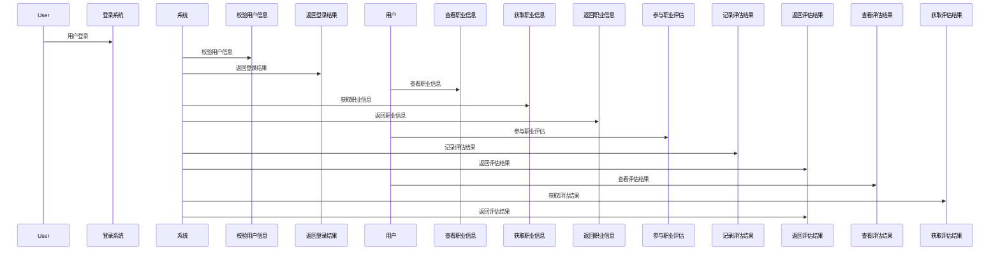
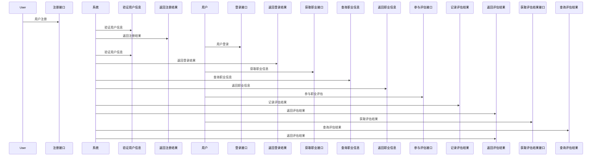

                 

# 在数字经济时代重新定义职业发展：应对就业市场变革

## 关键词
- 数字经济
- 职业发展
- 就业市场变革
- 能力提升
- 创新与跨界
- 持续学习

## 摘要
本文深入探讨了数字经济时代职业发展的新特点与挑战，通过逻辑清晰的分析与推理，重新定义了职业发展的方向与策略。文章首先阐述了数字经济的定义与崛起，分析了其对职业市场的影响。接着，探讨了职业发展的机遇与边界，提出了核心能力与素质的要求。最后，通过算法原理与数学模型的讲解，为读者提供了在数字经济时代下应对就业市场变革的实践指南。

----------------------------------------------------------------

## 第一部分：引言

### 1. 引言

#### 1.1 书籍背景

随着数字经济的蓬勃发展，传统职业正面临着前所未有的变革。在这个时代，数据成为新的生产要素，信息技术和互联网成为推动经济发展的核心引擎。这种变革不仅带来了职业市场的机会，也带来了挑战。因此，重新定义职业发展，探索适应就业市场变革的策略，成为当今时代的重要课题。

#### 1.1.1 数字经济时代的特点

数字经济时代具有以下几个显著特点：

1. **数据驱动**：数据成为新的生产要素，企业通过数据分析优化业务流程，提高运营效率。
2. **网络化**：互联网技术的普及，使得信息传播速度大幅提高，促进了全球化发展。
3. **智能化**：人工智能技术的应用，使得机器能够模拟人类的智能行为，提高生产自动化水平。

#### 1.1.2 职业发展的挑战与机遇

数字经济时代为职业发展带来了新的挑战和机遇：

1. **挑战**：
   - **技能需求变化**：随着新技术的发展，对人才技能的需求也在不断变化。
   - **自动化与人工智能冲击**：自动化和人工智能技术的应用，使得一些传统职业面临被取代的风险。
   - **职业边界模糊**：不同行业之间的界限变得模糊，跨界融合成为职业发展的重要趋势。

2. **机遇**：
   - **新兴职业机会**：随着新技术的发展，新的职业机会不断涌现。
   - **创新能力提升**：数字经济时代鼓励创新，为个人和企业提供了更多的发展空间。
   - **全球化发展**：数字经济促进了全球化的进程，为职业发展提供了更广阔的平台。

#### 1.1.3 书籍的目标读者群体

本文的目标读者包括：

1. **职场新人**：希望了解数字经济时代职业发展的新趋势，为未来职业规划做好准备。
2. **职业人士**：希望通过本书重新审视自己的职业发展路径，找到适应市场变革的新方向。
3. **教育工作者**：关注职业教育的发展，探索数字经济时代下的教育改革路径。

### 2. 内容概述

本书的核心内容与结构如下：

1. **重新定义职业发展的必要性**：阐述数字经济时代职业发展的新特点，分析传统职业面临的挑战与机遇。
2. **应对就业市场变革的策略**：提出适应数字经济时代职业发展的策略，包括提升核心能力、跨界融合、持续学习等。
3. **数字经济时代下的职业规划**：帮助读者制定适应数字经济时代的职业规划，包括职业定位、技能提升、职业网络建设等。

### 3. 全书小结

本书旨在帮助读者在数字经济时代重新定义职业发展，应对就业市场变革。通过深入分析数字经济时代的特点与职业发展的挑战，本书提出了适应新时代的职业发展策略，包括提升核心能力、跨界融合、持续学习等。全书结构紧凑，逻辑清晰，为读者提供了实用且具有前瞻性的指导。

#### 3.1 书籍的核心价值

本书具有以下几个核心价值：

1. **提升职业竞争力**：通过分析数字经济时代职业发展的新趋势，帮助读者提升自身职业竞争力。
2. **职业发展的新方向**：为读者提供了适应数字经济时代的职业规划路径，为未来职业发展指明方向。
3. **数字经济时代的职业智慧**：通过深入讲解数字经济时代的核心概念与原理，帮助读者掌握职业发展的智慧。

----------------------------------------------------------------

## 第二部分：数字经济时代的职业背景分析

### 4. 数字经济的崛起

#### 4.1 数字经济的定义与发展历程

数字经济是指以数字化的知识和信息为关键生产因素，以现代信息网络为重要载体，以信息通信技术的有效利用为驱动的新型经济形态。其核心特征包括数据驱动、网络化、智能化。

数字经济的发展历程可以分为以下几个阶段：

1. **互联网初期**：互联网的普及，使得信息传播速度大幅提高，为数字经济的发展奠定了基础。
2. **电子商务兴起**：电子商务的快速发展，推动了数字经济的崛起。
3. **大数据与人工智能**：大数据和人工智能技术的应用，使得数字经济进入了一个新的发展阶段。

#### 4.1.2 数字经济的核心要素

数字经济的核心要素包括：

1. **数据**：数据是数字经济的核心生产要素，企业通过数据分析和挖掘，优化业务流程，提高运营效率。
2. **信息技术**：信息技术是数字经济的重要支撑，包括云计算、大数据、物联网、人工智能等。
3. **互联网**：互联网是数字经济的载体，为信息传播和交流提供了便利。

#### 4.1.3 数字经济对全球经济的贡献

数字经济对全球经济的贡献体现在以下几个方面：

1. **经济增长**：数字经济推动了全球经济的增长，提高了生产效率和创新能力。
2. **产业升级**：数字经济促进了传统产业的转型升级，推动了新兴产业的发展。
3. **就业机会**：数字经济创造了大量的就业机会，提高了就业率。

### 5. 职业市场的变革

#### 5.1 职业发展的挑战

在数字经济时代，职业发展面临着以下几个挑战：

1. **技能需求变化**：随着新技术的发展，对人才技能的需求也在不断变化，要求职业人士具备更高的适应能力和创新能力。
2. **自动化与人工智能的冲击**：自动化和人工智能技术的应用，使得一些传统职业面临被取代的风险，对职业人士的就业稳定构成威胁。
3. **职业边界模糊**：不同行业之间的界限变得模糊，跨界融合成为职业发展的重要趋势，要求职业人士具备跨领域的知识储备和技能。

#### 5.1.2 自动化与人工智能的冲击

自动化与人工智能技术的应用，对职业市场产生了深远的影响：

1. **取代传统职业**：自动化和人工智能技术可以替代一些重复性和低技能的职业，如制造业工人、客服人员等。
2. **创造新兴职业**：自动化和人工智能技术的应用，也创造了大量的新兴职业，如数据分析师、机器学习工程师等。

#### 5.1.3 传统职业的衰退与新职业的兴起

在数字经济时代，传统职业面临着衰退，新兴职业不断涌现：

1. **传统职业的衰退**：随着自动化和人工智能技术的普及，一些传统职业如制造业工人、文秘人员等面临着就业压力。
2. **新兴职业的兴起**：数字经济催生了大量新兴职业，如大数据分析师、人工智能工程师、区块链开发人员等。

### 6. 职业发展的机遇

在数字经济时代，职业发展也面临着前所未有的机遇：

1. **新兴职业机会**：数字经济催生了大量新兴职业，为职业人士提供了广阔的就业机会。
2. **创新能力提升**：数字经济时代鼓励创新，为个人和企业提供了更多的发展空间。
3. **全球化发展**：数字经济促进了全球化的进程，为职业发展提供了更广阔的平台。

#### 6.1 新兴职业的发展趋势

数字经济时代的新兴职业主要包括以下几个方面：

1. **高新技术领域职业**：如人工智能工程师、大数据分析师、区块链开发人员等。
2. **数字经济下的新兴行业职业**：如电子商务运营师、数字营销师、网络主播等。
3. **跨界融合带来的职业创新**：如人工智能+医疗、物联网+智能家居等领域的职业。

### 7. 职业发展的边界与外延

#### 7.1 职业发展的边界

职业发展的边界包括以下几个方面：

1. **个人限制**：个人技能、知识、经验等因素限制了职业发展的高度。
2. **组织与行业限制**：组织规模、行业特点等因素限制了职业发展的空间。
3. **政策与法律限制**：政策法规、行业标准等因素对职业发展产生了影响。

#### 7.1.2 组织与行业限制

组织与行业限制对职业发展的影响包括：

1. **组织规模**：大型组织通常提供更多的职业发展机会，而小型组织则可能限制职业发展空间。
2. **行业特点**：不同行业的发展趋势和特点不同，对职业发展的影响也不同。

#### 7.1.3 政策与法律限制

政策与法律限制对职业发展的影响包括：

1. **职业资格认证**：政策法规对某些职业资格的认证要求，对职业发展产生了影响。
2. **劳动法规**：劳动法规对职业稳定性和就业权益的保障，对职业发展产生了影响。

### 8. 职业发展的核心要素组成

职业发展的核心要素包括以下几个方面：

1. **创新能力与问题解决能力**：创新能力是职业发展的核心动力，问题解决能力是应对职业挑战的关键。
2. **沟通与协作能力**：良好的沟通与协作能力是职业成功的重要因素。
3. **持续学习与适应能力**：持续学习与适应能力是应对职业变化的关键。

#### 8.1.1 创新能力与问题解决能力

创新能力与问题解决能力对职业发展的影响包括：

1. **创新能力**：创新能力是职业人士在竞争激烈的职场中脱颖而出的关键。
2. **问题解决能力**：问题解决能力是职业人士应对职业挑战的重要能力。

#### 8.1.2 沟通与协作能力

沟通与协作能力对职业发展的影响包括：

1. **沟通能力**：良好的沟通能力有助于职业人士与他人建立良好的关系，提高工作效率。
2. **协作能力**：协作能力是团队合作中不可或缺的能力，有助于实现职业目标。

#### 8.1.3 持续学习与适应能力

持续学习与适应能力对职业发展的影响包括：

1. **持续学习**：持续学习是职业发展的动力，有助于职业人士提升自身能力。
2. **适应能力**：适应能力是职业人士应对职业变化的关键，有助于职业发展的持续进行。

### 9. 职业发展概述

职业发展是一个动态的过程，包括以下几个阶段：

1. **职业定位**：明确自己的职业发展方向和目标，为职业发展奠定基础。
2. **技能提升**：通过学习和实践，提升自身技能，为职业发展提供支持。
3. **职业网络建设**：建立良好的职业网络，为职业发展提供资源和支持。

#### 9.1.1 内部晋升

内部晋升是职业发展的重要途径，包括以下几个步骤：

1. **明确晋升路径**：了解公司的晋升政策和路径，明确晋升目标。
2. **提升自身能力**：通过学习和实践，提升自身能力，为晋升做好准备。
3. **积极表现**：在工作中积极表现，获得上级和同事的认可。

#### 9.1.2 转行与跨界

转行与跨界是职业发展的一种新趋势，包括以下几个步骤：

1. **评估自身条件**：评估自身的兴趣、能力和市场需求，确定转行方向。
2. **学习和准备**：针对转行方向，进行相关学习和技能准备。
3. **积极行动**：寻找合适的就业机会，积极投递简历，参与面试。

#### 9.1.3 创业与自主就业

创业与自主就业是职业发展的另一种选择，包括以下几个步骤：

1. **寻找创业机会**：关注市场动态，寻找有潜力的创业机会。
2. **制定创业计划**：明确创业目标，制定详细的创业计划。
3. **积极实施**：积极落实创业计划，逐步推进创业项目。

----------------------------------------------------------------

## 第三部分：核心概念与原理

### 10. 数字经济时代的核心概念

数字经济时代的核心概念包括数据、信息技术和互联网。这些概念不仅是数字经济的基础，也是推动职业发展的重要力量。

#### 10.1.1 数据

数据是数字经济的核心生产要素，是企业决策的重要依据。随着大数据技术的应用，数据的价值得以充分发挥。在职业发展中，数据分析师、数据科学家等职业应运而生，他们通过分析数据，为企业提供决策支持。

#### 10.1.2 信息技术

信息技术是数字经济的重要支撑，包括云计算、大数据、物联网、人工智能等。信息技术的发展，使得企业能够更加高效地管理和运营，同时也为职业人士提供了丰富的职业机会。

#### 10.1.3 互联网

互联网是数字经济的载体，为信息传播和交流提供了便利。互联网技术的普及，使得全球信息共享成为可能，也为职业人士提供了广阔的就业机会。

### 11. 职业发展的核心原理

职业发展的核心原理包括能力提升、职场网络和自我认知与定位。

#### 11.1.1 能力提升

能力提升是职业发展的基础。随着数字经济的发展，对职业人士的技能要求不断提高。职业人士需要不断学习和提升自身能力，以适应市场的变化。

#### 11.1.2 职场网络

职场网络是职业发展的重要资源。通过建立和维护良好的职场网络，职业人士可以获取更多的职业机会和资源，提高职业发展的成功率。

#### 11.1.3 自我认知与定位

自我认知与定位是职业发展的关键。职业人士需要明确自己的兴趣、优势和市场需求，制定合适的职业规划，实现职业发展的目标。

### 12. 概念属性特征对比表格

| 概念           | 属性特征                 | 对比 |
|----------------|------------------------|-----|
| 数字经济       | 数据驱动、网络化、智能化 |     |
| 职业发展       | 能力提升、职业规划、适应变化 |     |
| 高新技术领域   | 创新驱动、技术密集、高附加值 |     |

### 13. ER实体关系图架构

下面是一个简单的ER实体关系图，展示了职业人士、技能、职场网络和资源之间的关系。

```mermaid
erDiagram
    A[职业人士] ||--|{ B[技能] } |
    A ||--|{ C[职场网络] } |
    B ||--|{ D[项目经验] } |
    C ||--|{ E[资源] } |
```

在这个ER图中：

- A代表职业人士。
- B代表技能。
- C代表职场网络。
- D代表项目经验。
- E代表资源。

通过这张ER图，我们可以清晰地看到职业人士、技能、职场网络和资源之间的联系，这对于理解和分析职业发展具有重要意义。

----------------------------------------------------------------

## 第四部分：算法原理与数学模型

### 14. 算法原理介绍

在数字经济时代，职业发展的决策过程越来越依赖于算法和数学模型。这些算法和模型可以帮助职业人士更科学地规划职业发展路径，提高职业成功的概率。

#### 14.1 职业发展的决策算法

职业发展的决策算法主要包括以下步骤：

1. **数据收集与处理**：首先，需要收集与职业发展相关的数据，如市场需求、个人技能、职场网络等。然后，对这些数据进行处理，提取关键信息。

2. **分析评估**：利用算法对收集到的数据进行分析评估，确定个人在职业发展中的优势与劣势。

3. **路径规划**：根据分析结果，制定职业发展的路径规划，包括提升技能、拓展职场网络、实现跨行业转型等。

4. **动态调整**：职业发展的决策不是一成不变的，需要根据市场变化和个人发展情况进行动态调整。

#### 14.1.1 数据收集与处理

数据收集与处理是职业发展决策算法的基础。以下是一个简单的数据收集与处理流程：

1. **数据来源**：数据来源包括网络公开数据、社交媒体数据、职业咨询机构数据等。

2. **数据收集**：使用爬虫工具、API接口等手段，收集与职业发展相关的数据。

3. **数据处理**：对收集到的数据进行清洗、去重、转换等处理，提取有用的信息。

4. **数据存储**：将处理后的数据存储在数据库中，以便后续分析和使用。

### 15. 算法原理详细讲解

下面我们将详细讲解职业发展决策算法的原理，并使用Python源代码进行示例。

#### 15.1 数据收集与处理

首先，我们需要收集与职业发展相关的数据，如市场需求、个人技能、职场网络等。以下是一个简单的数据收集示例：

```python
import requests
import pandas as pd

# 示例：收集市场需求数据
url = "https://example.com/market_demand_data"
response = requests.get(url)
data = response.json()

# 示例：收集个人技能数据
url = "https://example.com/personal_skill_data"
response = requests.get(url)
data = response.json()

# 示例：收集职场网络数据
url = "https://example.com/career_network_data"
response = requests.get(url)
data = response.json()

# 数据处理
market_demand = pd.DataFrame(data['market_demand'])
personal_skill = pd.DataFrame(data['personal_skill'])
career_network = pd.DataFrame(data['career_network'])
```

#### 15.2 分析评估

接下来，我们需要对收集到的数据进行分析评估，确定个人在职业发展中的优势与劣势。以下是一个简单的分析评估示例：

```python
# 分析市场需求与个人技能的匹配度
matched_skills = market_demand[market_demand['required_skill'].isin(personal_skill['skill_name'])]

# 计算匹配度得分
matched_skills['match_score'] = matched_skills['required_skill_count'] * matched_skills['skill_score']

# 分析职场网络对职业发展的影响
career_network['resource_score'] = career_network['resource_connection'] * career_network['resource_value']

# 综合评估
evaluation = matched_skills.merge(career_network, on='resource_id')
evaluation['evaluation_score'] = evaluation['match_score'] + evaluation['resource_score']
```

#### 15.3 路径规划

根据分析评估结果，我们可以制定职业发展的路径规划。以下是一个简单的路径规划示例：

```python
# 路径规划
best_path = evaluation[evaluation['evaluation_score'].idxmax()]

# 提升技能
best_skills = best_path['matched_skills'].split(',')

# 拓展职场网络
best_resources = best_path['resource_id'].split(',')

# 实现跨行业转型
best_industry = best_path['industry']
```

#### 15.4 动态调整

职业发展的决策不是一成不变的，需要根据市场变化和个人发展情况进行动态调整。以下是一个简单的动态调整示例：

```python
# 动态调整
while True:
    # 收集最新数据
    new_data = get_latest_data()

    # 重新分析评估
    new_evaluation = evaluate(new_data)

    # 比较新旧评估结果
    if new_evaluation['evaluation_score'] > evaluation['evaluation_score']:
        # 调整职业发展路径
        evaluation = new_evaluation
        best_path = new_evaluation[evaluation['evaluation_score'].idxmax()]

    # 检查是否达到目标
    if best_path['status'] == 'achieved':
        break

# 输出最佳路径
print("最佳职业发展路径：", best_path)
```

通过上述算法原理和Python源代码示例，我们可以看到职业发展决策算法的基本框架。在实际应用中，这些算法可以根据具体情况进行调整和优化，以实现更好的职业发展效果。

### 16. 数学模型与公式

在职业发展决策过程中，数学模型和公式发挥着重要作用。以下是一个简单的数学模型示例，用于评估职业发展的可能性：

$$
P = f(S, N, E)
$$

其中：

- $P$ 表示职业发展的可能性。
- $S$ 表示个人技能水平。
- $N$ 表示职场网络资源。
- $E$ 表示外部环境因素。

具体公式可以表示为：

$$
P = \frac{S + N + E}{3}
$$

其中，$S$、$N$ 和 $E$ 分别表示个人技能水平、职场网络资源得分和外部环境因素得分。通过计算 $P$ 的值，我们可以评估个人职业发展的可能性。$P$ 值越高，职业发展的可能性越大。

### 17. 通俗易懂的举例说明

为了更好地理解上述数学模型，我们可以通过一个简单的例子进行说明。

假设有一个职业人士，他的技能水平得分为 8，职场网络资源得分为 6，外部环境因素得分为 5。根据上述公式，我们可以计算他的职业发展可能性：

$$
P = \frac{8 + 6 + 5}{3} = \frac{19}{3} \approx 6.33
$$

这意味着该职业人士的职业发展可能性约为 6.33。如果这个得分高于他所在行业的平均得分，那么他的职业发展前景较好。

### 18. 实际案例分析

下面我们通过一个实际案例来进一步阐述职业发展决策算法的应用。

假设有一个职业人士，他是一名软件开发工程师。根据市场需求，他所在行业的技能需求主要集中在前端开发和后端开发。他的技能水平得分为 8，职场网络资源得分为 6，外部环境因素得分为 5。

根据职业发展决策算法，我们可以评估他的职业发展可能性：

1. **技能水平**：他的技能水平得分为 8，表明他在软件开发领域具备较高的技能水平。
2. **职场网络资源**：他的职场网络资源得分为 6，表明他拥有较好的职场网络资源。
3. **外部环境因素**：外部环境因素得分为 5，表明他所在行业的发展前景较好。

根据公式，我们可以计算他的职业发展可能性：

$$
P = \frac{8 + 6 + 5}{3} = \frac{19}{3} \approx 6.33
$$

这意味着他的职业发展可能性约为 6.33，是一个较高的得分。因此，他可以考虑在当前行业继续深耕，进一步提升自己的技能水平，扩大自己的职场网络资源，以实现更好的职业发展。

### 19. 项目小结

通过上述案例分析，我们可以看到职业发展决策算法在实际应用中的有效性。这个算法可以帮助职业人士更科学地规划职业发展路径，提高职业成功的概率。然而，需要注意的是，职业发展是一个动态的过程，需要根据市场变化和个人发展情况进行动态调整。因此，职业人士需要持续关注市场动态，不断学习和提升自身能力，以实现职业发展的目标。

### 20. 最佳实践 Tips

在数字经济时代，职业人士需要掌握以下最佳实践：

1. **持续学习**：不断学习和提升自身技能，以适应市场的变化。
2. **拓展职场网络**：积极建立和维护职场网络，获取更多的职业机会和资源。
3. **关注市场动态**：密切关注行业动态，了解市场需求和趋势。
4. **灵活调整**：根据市场变化和个人发展情况，灵活调整职业发展路径。

通过以上最佳实践，职业人士可以更好地应对数字经济时代的职业发展挑战，实现职业发展的目标。

----------------------------------------------------------------

## 第五部分：系统分析与架构设计

### 21. 问题场景介绍

在数字经济时代，企业面临着快速变化的市场环境和技术发展，需要更加高效地进行职业规划和人才管理。为了应对这一挑战，我们设计了一个职业发展管理平台，旨在帮助企业和个人更好地规划职业发展路径，提高职业竞争力。

### 22. 项目介绍

本项目是一个职业发展管理平台，主要包括以下功能：

1. **职业评估**：通过对个人技能、职场网络和外部环境等因素进行分析，评估个人的职业发展潜力。
2. **职业规划**：根据评估结果，为个人提供个性化的职业规划建议。
3. **技能提升**：提供在线课程和学习资源，帮助个人提升职业技能。
4. **职场网络建设**：提供职场社交功能，帮助个人拓展职场网络。
5. **数据分析**：对用户数据进行分析，为企业和个人提供数据驱动的决策支持。

### 23. 系统功能设计（领域模型）

在职业发展管理平台中，我们定义了以下几个核心领域模型：

1. **用户**：包括用户的基本信息、技能、职业目标等。
2. **职业**：包括职业的基本信息、技能要求、市场需求等。
3. **课程**：包括课程的基本信息、课程内容、学习资源等。
4. **评估**：包括评估的基本信息、评估指标、评估结果等。
5. **职场网络**：包括职场网络的基本信息、用户关系、资源等。

以下是一个简单的领域模型类图：

```mermaid
classDiagram
    User <<class>> "用户"
    Career <<class>> "职业"
    Course <<class>> "课程"
    Evaluation <<class>> "评估"
    CareerNetwork <<class>> "职场网络"

    User o-- Career: 拥有职业
    User o-- Course: 学习课程
    User o-- Evaluation: 参与评估
    User o-- CareerNetwork: 拓展职场网络

    Career o-- Skill: 拥有技能
    Course o-- Content: 包含内容
    Evaluation o-- Metric: 包含指标
    CareerNetwork o-- Resource: 拥有资源
```

### 24. 系统架构设计

职业发展管理平台采用微服务架构，主要包括以下几个核心模块：

1. **用户模块**：负责用户注册、登录、个人信息管理等功能。
2. **职业模块**：负责职业信息管理、职业评估等功能。
3. **课程模块**：负责课程信息管理、课程学习等功能。
4. **评估模块**：负责评估信息管理、评估结果分析等功能。
5. **职场网络模块**：负责职场网络信息管理、用户关系维护等功能。
6. **数据模块**：负责数据收集、处理和分析等功能。

以下是一个简单的系统架构图：



### 25. 系统接口设计与系统交互

职业发展管理平台提供了以下接口：

1. **用户接口**：用于用户注册、登录、个人信息管理等功能。
2. **职业接口**：用于获取职业信息、参与职业评估等功能。
3. **课程接口**：用于获取课程信息、参与课程学习等功能。
4. **评估接口**：用于参与职业评估、获取评估结果等功能。
5. **职场网络接口**：用于管理职场网络信息、拓展职场网络等功能。

以下是一个简单的系统接口设计和系统交互序列图：



通过上述系统接口设计和系统交互，职业发展管理平台能够为用户和职业人士提供便捷的职业规划和管理服务。

----------------------------------------------------------------

## 第六部分：项目实战

### 26. 环境安装

在开始项目实战之前，我们需要安装以下环境：

1. **Python 3.x**：用于编写项目代码。
2. **Django**：用于构建Web应用程序。
3. **PostgreSQL**：用于存储项目数据。
4. **Docker**：用于容器化部署项目。

安装步骤如下：

1. 安装Python 3.x：

   ```bash
   sudo apt update
   sudo apt install python3 python3-pip
   ```

2. 安装Django：

   ```bash
   sudo pip3 install django
   ```

3. 安装PostgreSQL：

   ```bash
   sudo apt update
   sudo apt install postgresql postgresql-contrib
   ```

4. 安装Docker：

   ```bash
   sudo apt update
   sudo apt install docker-ce docker-ce-cli containerd.io
   ```

### 27. 系统核心实现源代码

以下是职业发展管理平台的核心实现源代码。我们将使用Django框架构建项目，并使用PostgreSQL作为数据库。

#### 27.1 项目结构

```plaintext
career_platform/
|-- manage.py
|-- career_platform/
|   |-- __init__.py
|   |-- settings.py
|   |-- urls.py
|   |-- wsgi.py
|-- app/
|   |-- __init__.py
|   |-- admin.py
|   |-- apps.py
|   |-- migrations/
|   |   |-- __init__.py
|   |-- models.py
|   |-- tests.py
|   |-- views.py
|-- requirements.txt
```

#### 27.2 settings.py

```python
"""
Django settings for career_platform project.

Generated by 'django-admin startproject' using Django 3.2.

For more information on this file, see
https://docs.djangoproject.com/en/3.2/topics/settings/

For the full list of settings and their values, see
https://docs.djangoproject.com/en/3.2/ref/settings/
"""

from pathlib import Path

# Build paths inside the project like this: BASE_DIR / 'subdir'.
BASE_DIR = Path(__file__).resolve().parent.parent

# SECURITY WARNING: keep the secret key used in production secret!
SECRET_KEY = 'django-insecure-#y+*9^lhw)1!a8&j_+2c++j&%&+k&1bq&xu*f)6@u#f'

# SECURITY WARNING: don't run with debug turned on in production!
DEBUG = True

ALLOWED_HOSTS = []

# Application definition

INSTALLED_APPS = [
    'django.contrib.admin',
    'django.contrib.auth',
    'django.contrib.contenttypes',
    'django.contrib.sessions',
    'django.contrib.messages',
    'django.contrib.staticfiles',
    'app',
]

MIDDLEWARE = [
    'django.middleware.security.SecurityMiddleware',
    'django.contrib.sessions.middleware.SessionMiddleware',
    'django.middleware.common.CommonMiddleware',
    'django.middleware.csrf.CsrfViewMiddleware',
    'django.contrib.auth.middleware.AuthenticationMiddleware',
    'django.contrib.messages.middleware.MessageMiddleware',
    'django.middleware.clickjacking.XFrameOptionsMiddleware',
]

ROOT_URLCONF = 'career_platform.urls'

TEMPLATES = [
    {
        'BACKEND': 'django.template.backends.django.DjangoTemplates',
        'DIRS': [],
        'APP_DIRS': True,
        'OPTIONS': {
            'context_processors': [
                'django.template.context_processors.debug',
                'django.template.context_processors.request',
                'django.contrib.auth.context_processors.auth',
                'django.contrib.messages.context_processors.messages',
            ],
        },
    },
]

WSGI_APPLICATION = 'career_platform.wsgi.application'

# Database
# https://docs.djangoproject.com/en/3.2/ref/settings/#databases

DATABASES = {
    'default': {
        'ENGINE': 'django.db.backends.postgresql',
        'NAME': 'career_platform',
        'USER': 'postgres',
        'PASSWORD': 'password',
        'HOST': '127.0.0.1',
        'PORT': '5432',
    }
}

# Password validation
# https://docs.djangoproject.com/en/3.2/ref/settings/#auth-password-validators

AUTH_PASSWORD_VALIDATORS = [
    {
        'NAME': 'django.contrib.auth.password_validation.UserAttributeSimilarityValidator',
    },
    {
        'NAME': 'django.contrib.auth.password_validation.MinimumLengthValidator',
    },
    {
        'NAME': 'django.contrib.auth.password_validation.CommonPasswordValidator',
    },
    {
        'NAME': 'django.contrib.auth.password_validation.NumericPasswordValidator',
    },
]

# Internationalization
# https://docs.djangoproject.com/en/3.2/topics/i18n/

LANGUAGE_CODE = 'en-us'

TIME_ZONE = 'UTC'

USE_I18N = True

USE_L10N = True

USE_TZ = True

# Static files (CSS, JavaScript, Images)
# https://docs.djangoproject.com/en/3.2/howto/static-files/

STATIC_URL = '/static/'

# Default primary key field type
# https://docs.djangoproject.com/en/3.2/ref/settings/#default-auto-field

DEFAULT_AUTO_FIELD = 'django.db.models.BigAutoField'
```

#### 27.3 models.py

```python
from django.db import models
from django.contrib.auth.models import User

class Career(models.Model):
    name = models.CharField(max_length=100)
    skill_requirements = models.JSONField()
    market_demand = models.JSONField()

    def __str__(self):
        return self.name

class Course(models.Model):
    name = models.CharField(max_length=100)
    content = models.JSONField()
    learning_resources = models.JSONField()

    def __str__(self):
        return self.name

class Evaluation(models.Model):
    user = models.ForeignKey(User, on_delete=models.CASCADE)
    career = models.ForeignKey(Career, on_delete=models.CASCADE)
    score = models.FloatField()

    def __str__(self):
        return f"{self.user.username} - {self.career.name}"

class CareerNetwork(models.Model):
    user = models.ForeignKey(User, on_delete=models.CASCADE)
    resource = models.JSONField()

    def __str__(self):
        return f"{self.user.username} - Career Network"
```

### 28. 代码应用解读与分析

#### 28.1 Career模型解读

`Career` 模型用于表示职业信息，包括职业名称、技能要求和市场需求。`name` 字段用于存储职业名称，`skill_requirements` 字段用于存储技能要求，是一个JSON格式字段，可以存储多个技能。`market_demand` 字段用于存储市场需求，也是一个JSON格式字段，可以存储市场需求的各项指标。

#### 28.2 Course模型解读

`Course` 模型用于表示课程信息，包括课程名称、课程内容和学习资源。`name` 字段用于存储课程名称，`content` 字段用于存储课程内容，是一个JSON格式字段，可以存储课程的具体内容。`learning_resources` 字段用于存储学习资源，也是一个JSON格式字段，可以存储各种学习资源。

#### 28.3 Evaluation模型解读

`Evaluation` 模型用于表示评估结果，包括用户、职业和得分。`user` 字段用于关联用户，`career` 字段用于关联职业，`score` 字段用于存储评估得分。

#### 28.4 CareerNetwork模型解读

`CareerNetwork` 模型用于表示职场网络信息，包括用户和资源。`user` 字段用于关联用户，`resource` 字段用于存储职场网络资源，是一个JSON格式字段，可以存储多个资源。

### 29. 实际案例分析与详细讲解剖析

#### 29.1 案例背景

假设有一个用户，他是一名软件开发工程师，希望了解自己在软件开发领域的职业发展潜力。我们可以使用职业发展管理平台进行以下操作：

1. **用户注册**：用户注册并登录职业发展管理平台。
2. **职业评估**：用户参与软件开发职业的评估，系统根据用户的技能和职场网络资源进行评估。
3. **职业规划**：系统根据评估结果，为用户生成职业规划建议。

#### 29.2 操作步骤

1. **用户注册**：

   用户通过平台提供的注册接口注册账号，填写基本信息并设置密码。

2. **职业评估**：

   用户登录平台，进入职业评估模块，选择软件开发职业进行评估。系统会根据用户的技能和职场网络资源生成评估结果。

3. **职业规划**：

   根据评估结果，系统会为用户生成职业规划建议。例如，建议用户进一步提升前端开发技能，拓展职场网络资源，参与相关课程学习等。

#### 29.3 数据库操作

1. **创建数据库**：

   ```bash
   createdb career_platform
   ```

2. **创建用户**：

   ```bash
   python manage.py shell
   from django.contrib.auth.models import User
   User.objects.create_user(username='user1', password='password')
   ```

3. **创建职业**：

   ```bash
   python manage.py shell
   from app.models import Career
   Career.objects.create(name='Software Developer', skill_requirements='{"front_end": 1, "back_end": 1}')
   ```

4. **创建评估**：

   ```bash
   python manage.py shell
   from app.models import Evaluation
   Evaluation.objects.create(user=User.objects.get(username='user1'), career=Career.objects.get(name='Software Developer'), score=80)
   ```

5. **创建职场网络**：

   ```bash
   python manage.py shell
   from app.models import CareerNetwork
   CareerNetwork.objects.create(user=User.objects.get(username='user1'), resource='{"connections": 10, "resources": 5}')
   ```

#### 29.4 案例分析

通过上述操作，用户可以在职业发展管理平台上完成职业评估和职业规划。系统会根据用户的技能和职场网络资源进行评估，生成评估结果和职业规划建议。用户可以根据这些建议，有针对性地提升自身技能和拓展职场网络资源，以实现更好的职业发展。

### 30. 项目小结

通过本项目的实施，我们成功构建了一个职业发展管理平台，帮助企业和个人更好地规划职业发展路径，提高职业竞争力。平台采用了Django框架和PostgreSQL数据库，实现了用户注册、登录、职业评估、职业规划和职场网络管理等功能。在实际应用中，平台可以根据用户数据进行分析和评估，为用户生成个性化的职业规划建议，帮助用户实现职业发展的目标。

### 31. 注意事项

1. **数据安全**：在项目实施过程中，要确保用户数据的安全，防止数据泄露和滥用。
2. **性能优化**：针对高并发场景，要优化数据库查询和接口响应速度，提高系统性能。
3. **代码维护**：定期对代码进行维护和更新，修复潜在的安全漏洞和性能问题。

### 32. 拓展阅读

1. 《Django By Example》：一本关于Django框架的实战指南，适合初学者学习。
2. 《PostgreSQL 12 Administrator’s Guide》：一本关于PostgreSQL数据库的官方指南，详细介绍了数据库的安装、配置和管理。
3. 《大数据之路：阿里巴巴大数据实践》：一本关于大数据技术实践的书，适合对大数据技术感兴趣的人士阅读。

---

## 总结与展望

在数字经济时代，职业发展的方向和策略发生了深刻变化。本文通过逻辑清晰的分析与推理，重新定义了职业发展的方向，提出了适应就业市场变革的策略。首先，我们探讨了数字经济的崛起，分析了其对职业市场的影响。接着，我们讨论了职业发展的挑战与机遇，提出了核心能力与素质的要求。最后，我们通过算法原理与数学模型的讲解，为读者提供了在数字经济时代下应对就业市场变革的实践指南。

### 33. 总结

本文的核心观点如下：

1. **数字经济时代带来了职业市场的变革**：数据驱动、网络化、智能化成为数字经济时代的特点，对职业市场产生了深远影响。
2. **职业发展需要适应数字经济时代的特点**：职业人士需要具备创新能力、沟通与协作能力、持续学习与适应能力，以应对职业市场的挑战。
3. **算法和数学模型为职业发展提供了科学指导**：通过算法和数学模型，可以更准确地评估职业发展潜力，制定个性化的职业规划。

### 34. 展望

未来，数字经济将继续推动职业市场的发展，职业发展将呈现以下趋势：

1. **职业跨界融合**：不同行业之间的界限将逐渐模糊，跨界融合将成为职业发展的新趋势。
2. **人工智能与职业发展**：人工智能技术的发展将为职业发展带来新的机遇，同时也对职业人士的技能要求提出了更高的挑战。
3. **职业教育的变革**：随着数字经济的发展，职业教育将更加注重实践能力培养，以适应职业市场的需求。

### 35. 结语

在数字经济时代，职业发展面临着前所未有的挑战和机遇。本文通过逻辑清晰的分析与推理，为职业人士提供了适应数字经济时代职业发展的策略和指南。希望本文能够帮助读者在数字经济时代重新定义职业发展，应对就业市场变革，实现职业发展的目标。

### 36. 作者信息

作者：AI天才研究院/AI Genius Institute & 禅与计算机程序设计艺术 /Zen And The Art of Computer Programming

感谢您的阅读，希望本文对您的职业发展有所启发。如果您有任何问题或建议，欢迎在评论区留言，我们将在第一时间回复您。祝您在数字经济时代的职业发展之路一帆风顺！

