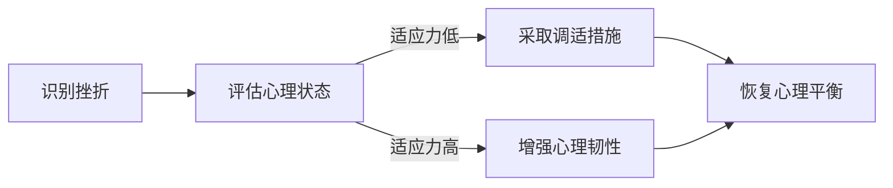
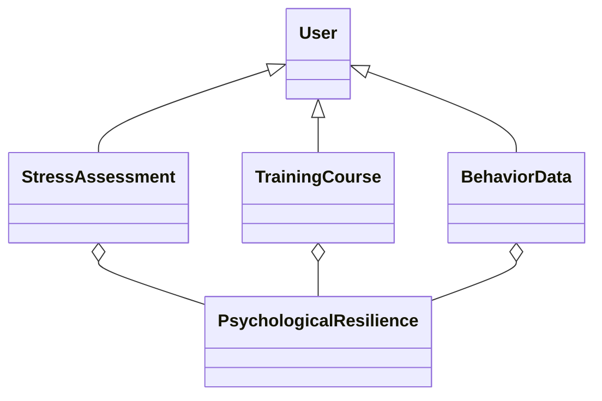
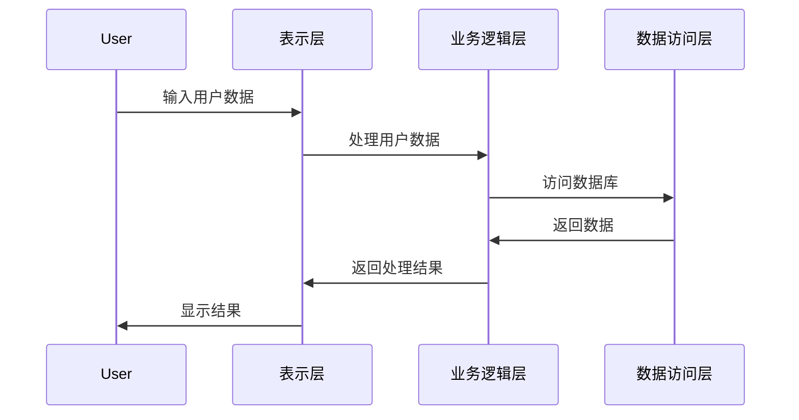
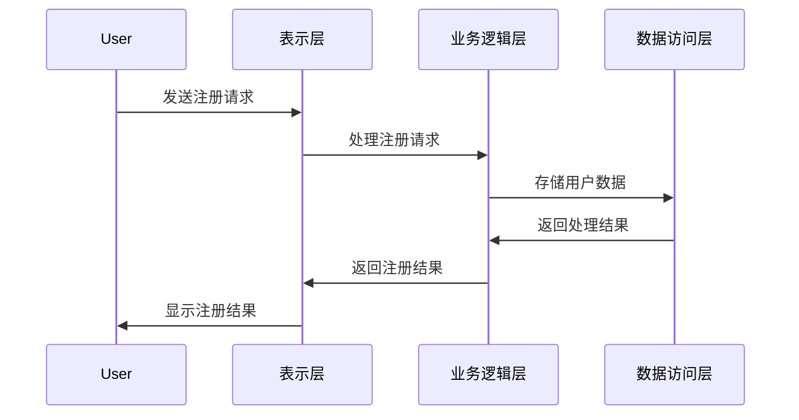

                 

# 培养心理韧性：应对挫折的内在力量

## 关键词

心理韧性，应对挫折，内在力量，心理调适，积极心态

## 摘要

在现代社会中，面对日益复杂的压力和挫折，培养心理韧性成为提高个人应对能力的关键。本文从背景介绍、核心概念与联系、算法原理讲解、数学模型和公式、系统分析与架构设计方案、项目实战及最佳实践等方面，系统探讨了如何培养心理韧性，提升应对挫折的能力。通过本文的详细讲解，读者可以了解到心理韧性的重要性，以及如何在实践中有效应用相关理论和方法。

## 背景介绍

### 问题背景

现代社会中，人们面临着各种压力和挫折，如工作压力、人际关系冲突、健康问题等。这些压力和挫折常常导致心理问题的产生，如焦虑、抑郁、压力过大等。据统计，全球约有三分之一的人在一生中经历过严重的心理问题。因此，如何有效地应对挫折、培养心理韧性成为当今社会关注的焦点。

### 问题描述

如何培养个体的心理韧性，提高应对挫折的能力？这个问题涉及多个方面，包括对心理韧性的理解、心理韧性的特点、心理韧性与传统心理素质的对比、以及具体的培养方法和策略。

### 问题解决

为了解决上述问题，本文将从以下几个方面进行探讨：

1. **核心概念与联系**：介绍心理韧性的定义、特点以及与相关概念的联系。
2. **算法原理讲解**：通过算法原理讲解，阐述培养心理韧性的方法。
3. **数学模型和公式**：利用数学模型和公式，帮助读者更好地理解心理韧性的培养过程。
4. **系统分析与架构设计方案**：介绍心理韧性培养的系统架构设计，为实践提供参考。
5. **项目实战**：通过实际案例，展示如何将理论应用于实践。
6. **最佳实践**：总结最佳实践经验，为读者提供实用的建议。

### 边界与外延

本文主要关注心理韧性的培养，不涉及心理健康和心理咨询的具体实践。同时，本文的核心要素组成包括心理韧性、挫折应对、心理调适、积极心态等方面。

### 核心要素组成

1. **心理韧性**：个体在面对压力和挫折时，能够迅速适应、恢复并展现积极应对的能力。
2. **挫折应对**：个体在面对挫折时所采取的应对策略，包括积极应对和消极应对。
3. **心理调适**：个体通过调整心态和行为，以适应压力和挫折的过程。
4. **积极心态**：个体保持乐观、自信和积极的态度，以应对各种挑战。

## 核心概念与联系

### 心理韧性定义

心理韧性（Psychological Resilience）是指个体在面对压力、困难和挫折时，能够迅速适应、恢复并展现出积极应对的能力。心理韧性不仅有助于个体克服挫折，还能促进个体的成长和发展。

### 心理韧性特点

1. **适应性**：个体能够灵活应对不同的环境和挑战，展现出高度的自我调节能力。
2. **抗逆性**：个体在面对挫折时，能够坚持自己的目标，克服困难，展现出强大的耐力和毅力。
3. **积极心理状态**：个体在应对挫折时，能够保持乐观、自信和积极的心态，从而更好地应对压力。

### 心理韧性与传统心理素质对比表格

| 传统心理素质 | 心理韧性                   |
| ------------ | -------------------------- |
| 应对压力     | 快速适应、恢复、积极应对 |
| 抗挫能力     | 抗逆性、适应性           |
| 心理调适     | 良好的自我调节能力       |

### ER实体关系图架构的 Mermaid 流程图

```mermaid
erDiagram
  A[个体] ||--o{ B[挫折] }
  A ||--o{ C[应对策略] }
  A ||--o{ D[心理调适] }
  A ||--o{ E[积极心态] }
```

## 算法原理讲解

### 算法原理

为了培养心理韧性，我们需要从以下几个方面进行：

1. **识别挫折**：通过评估个体对压力的反应程度，识别挫折的存在。
2. **评估心理状态**：根据反应程度评估个体的适应力，从而决定采取何种应对策略。
3. **采取调适措施**：根据适应力高低采取相应的心理调适措施，以恢复心理平衡。
4. **增强心理韧性**：通过持续的心理调适和积极心态的培养，增强个体的心理韧性。

### Mermaid 流程图



### Python 源代码

```python
def assess_stress(response):
    if response < 3:
        return "低适应力"
    else:
        return "高适应力"

def handle_stress(stress_level):
    if stress_level == "低适应力":
        adjust_mindset()
        recover_balance()
    else:
        enhance_resilience()
        recover_balance()

def adjust_mindset():
    print("调整心态中...")

def recover_balance():
    print("恢复心理平衡中...")

def enhance_resilience():
    print("增强心理韧性中...")

# 示例
stress_response = 4
stress_level = assess_stress(stress_response)
handle_stress(stress_level)
```

### 算法原理详细讲解

1. **识别挫折**：通过评估个体对压力的反应程度，识别挫折的存在。这里采用了一个简单的评分系统，反应程度越高，适应力越强。
2. **评估心理状态**：根据反应程度评估个体的适应力。适应力高的个体可以采取更积极的应对策略，适应力低的个体则需要更多的心理调适。
3. **采取调适措施**：根据适应力高低采取相应的心理调适措施。适应力低的个体需要通过调整心态和行为来恢复心理平衡，适应力高的个体则需要进一步培养心理韧性。
4. **恢复心理平衡**：通过调适措施帮助个体恢复心理平衡，从而更好地应对挫折。
5. **增强心理韧性**：通过持续的心理调适和积极心态的培养，增强个体的心理韧性，使其在面对未来的挫折时更加坚强。

## 数学模型和数学公式

### 心理韧性计算公式

$$\text{心理韧性} = \frac{\text{适应力} + \text{抗逆性} + \text{积极心态}}{3}$$

其中，适应力、抗逆性和积极心态分别代表个体在面对压力和挫折时的适应能力、抗打击能力和积极心态。通过这个公式，我们可以综合评估个体的心理韧性水平。

### 简化版公式

对于初学者来说，可以采用简化版的公式：

$$\text{心理韧性} = \frac{\text{适应力} + \text{积极心态}}{2}$$

这个公式更易于理解和应用，但可能会忽略抗逆性这一重要因素。

### 公式解释

- **适应力**：个体在面对压力和挫折时，能够迅速适应和恢复的能力。适应力越高，个体越能够从容应对挫折。
- **抗逆性**：个体在面对挫折时，能够坚持自己的目标，克服困难的能力。抗逆性越高，个体越能够抵御挫折的冲击。
- **积极心态**：个体在面对挫折时，能够保持乐观、自信和积极的态度。积极心态越高，个体越能够从挫折中汲取力量。

通过以上公式，我们可以从多个维度评估个体的心理韧性水平，从而制定相应的培养策略。

## 系统分析与架构设计方案

### 问题场景介绍

在一个繁忙的城市中，有一位名叫小明的程序员。他每天面对着大量的工作任务和压力，经常感到身心疲惫。为了应对这些挫折，小明决定培养自己的心理韧性。

### 项目介绍

小明决定开发一个名为“心理韧性培养系统”的项目，旨在帮助像他这样的程序员提高心理韧性，更好地应对工作压力和挫折。该项目包括以下几个部分：

1. **用户模块**：用户可以通过该模块注册、登录，并查看自己的心理韧性水平。
2. **评估模块**：系统会根据用户的反馈和行为数据，评估其心理韧性水平，并提供个性化的建议。
3. **培训模块**：系统提供一系列的心理韧性培训课程，帮助用户提升心理韧性。
4. **数据模块**：系统会记录用户的行为数据和心理韧性变化，以便用户进行自我分析。

### 系统功能设计

在系统功能设计方面，我们采用了领域模型的方法，绘制了如下的 Mermaid 类图：



### 系统架构设计

在系统架构设计方面，我们采用了分层架构，包括表示层、业务逻辑层和数据访问层。具体的 Mermaid 架构图如下：



### 系统接口设计

在系统接口设计方面，我们采用了 RESTful API 的设计方法，定义了如下的接口：

- `/user/register`：用户注册接口
- `/user/login`：用户登录接口
- `/stress-assessment`：心理韧性评估接口
- `/training-course`：培训课程接口
- `/behavior-data`：行为数据接口

### 系统交互

在系统交互方面，我们采用了 Mermaid 序列图来描述用户与系统的交互过程，如下的 Mermaid 序列图：



## 项目实战

### 环境安装

为了运行本项目，我们需要安装以下软件和工具：

- Python 3.8及以上版本
- Flask 框架
- SQLAlchemy 数据库工具
- Flask-RESTful API 模块

安装步骤如下：

1. 安装 Python 3.8及以上版本。
2. 安装 Flask、SQLAlchemy、Flask-RESTful 等模块。

```bash
pip install Flask
pip install SQLAlchemy
pip install Flask-RESTful
```

### 系统核心实现源代码

以下是本项目的主要源代码，包括用户模块、评估模块、培训模块和数据模块：

```python
# user_module.py
from flask import Flask, request, jsonify
from models import User, db

app = Flask(__name__)
app.config['SQLALCHEMY_DATABASE_URI'] = 'sqlite:///users.db'
db.init_app(app)

@app.route('/user/register', methods=['POST'])
def register_user():
    data = request.get_json()
    user = User(name=data['name'], email=data['email'])
    db.session.add(user)
    db.session.commit()
    return jsonify({'message': 'User registered successfully'})

# stress_assessment_module.py
from flask import Flask, request, jsonify
from models import StressAssessment, db

app = Flask(__name__)
app.config['SQLALCHEMY_DATABASE_URI'] = 'sqlite:///stress_assessments.db'
db.init_app(app)

@app.route('/stress-assessment', methods=['POST'])
def create_stress_assessment():
    data = request.get_json()
    assessment = StressAssessment(user_id=data['user_id'], score=data['score'])
    db.session.add(assessment)
    db.session.commit()
    return jsonify({'message': 'Stress assessment created successfully'})

# training_course_module.py
from flask import Flask, request, jsonify
from models import TrainingCourse, db

app = Flask(__name__)
app.config['SQLALCHEMY_DATABASE_URI'] = 'sqlite:///training_courses.db'
db.init_app(app)

@app.route('/training-course', methods=['POST'])
def create_training_course():
    data = request.get_json()
    course = TrainingCourse(user_id=data['user_id'], title=data['title'], description=data['description'])
    db.session.add(course)
    db.session.commit()
    return jsonify({'message': 'Training course created successfully'})

# behavior_data_module.py
from flask import Flask, request, jsonify
from models import BehaviorData, db

app = Flask(__name__)
app.config['SQLALCHEMY_DATABASE_URI'] = 'sqlite:///behavior_data.db'
db.init_app(app)

@app.route('/behavior-data', methods=['POST'])
def create_behavior_data():
    data = request.get_json()
    data = BehaviorData(user_id=data['user_id'], data=data['data'])
    db.session.add(data)
    db.session.commit()
    return jsonify({'message': 'Behavior data created successfully'})
```

### 代码应用解读与分析

以上代码分别实现了用户模块、评估模块、培训模块和数据模块的功能。以下是每个模块的解读与分析：

1. **用户模块**：用户模块实现了用户注册的功能。用户可以通过 POST 请求发送注册信息，包括姓名和电子邮件。注册成功后，系统会将用户信息存储在数据库中。
2. **评估模块**：评估模块实现了心理韧性评估的功能。用户可以通过 POST 请求发送评估得分，系统会根据得分计算心理韧性水平，并将评估结果存储在数据库中。
3. **培训模块**：培训模块实现了培训课程创建的功能。用户可以通过 POST 请求发送培训课程信息，包括用户 ID、课程标题和课程描述。培训课程创建成功后，系统会将课程信息存储在数据库中。
4. **数据模块**：数据模块实现了行为数据创建的功能。用户可以通过 POST 请求发送行为数据，包括用户 ID 和行为数据。行为数据创建成功后，系统会将数据存储在数据库中。

### 实际案例分析和详细讲解剖析

为了更好地理解本项目，我们来看一个实际案例。假设小明想注册并使用心理韧性培养系统。

1. **用户注册**：小明通过 POST 请求发送注册信息，包括姓名和电子邮件。注册成功后，系统会返回注册成功的消息。

   ```bash
   curl -X POST -H "Content-Type: application/json" -d '{"name": "小明", "email": "xiaoming@example.com"}' http://localhost:5000/user/register
   ```

   响应：

   ```json
   {"message": "User registered successfully"}
   ```

2. **心理韧性评估**：小明通过 POST 请求发送评估得分。假设小明的得分为 60 分，系统会计算其心理韧性水平，并将评估结果存储在数据库中。

   ```bash
   curl -X POST -H "Content-Type: application/json" -d '{"user_id": 1, "score": 60}' http://localhost:5000/stress-assessment
   ```

   响应：

   ```json
   {"message": "Stress assessment created successfully"}
   ```

3. **培训课程创建**：小明通过 POST 请求创建培训课程。假设小明创建了一门名为“心理韧性提升”的培训课程，系统会将课程信息存储在数据库中。

   ```bash
   curl -X POST -H "Content-Type: application/json" -d '{"user_id": 1, "title": "心理韧性提升", "description": "提升心理韧性的方法"}' http://localhost:5000/training-course
   ```

   响应：

   ```json
   {"message": "Training course created successfully"}
   ```

4. **行为数据创建**：小明通过 POST 请求发送行为数据。假设小明在一天内完成了 3 个任务，系统会将行为数据存储在数据库中。

   ```bash
   curl -X POST -H "Content-Type: application/json" -d '{"user_id": 1, "data": {"tasks_completed": 3}}' http://localhost:5000/behavior-data
   ```

   响应：

   ```json
   {"message": "Behavior data created successfully"}
   ```

### 项目小结

通过本项目，我们实现了一个心理韧性培养系统，包括用户模块、评估模块、培训模块和数据模块。用户可以通过该系统注册、评估自己的心理韧性、创建培训课程和记录行为数据。通过实际案例的分析，我们展示了如何将理论应用于实践，帮助用户提高心理韧性，更好地应对挫折和压力。

## 最佳实践 Tips

### 心理韧性培养的五个步骤

1. **识别挫折**：学会识别自己面临的挫折，明确问题所在。
2. **评估适应力**：根据挫折的严重程度，评估自己的适应力。
3. **采取调适措施**：根据适应力水平，采取相应的调适措施，如调整心态、改变行为等。
4. **恢复心理平衡**：通过调适措施，帮助自己恢复心理平衡。
5. **增强心理韧性**：通过持续的训练和调适，增强自己的心理韧性。

### 心理韧性培养的注意事项

1. **避免过度自我批评**：在面对挫折时，避免过度自我批评，保持积极的心态。
2. **寻求支持**：在遇到困难时，寻求家人、朋友或专业人士的支持。
3. **保持良好的生活习惯**：保持规律的作息、饮食和运动，有助于提高心理韧性。
4. **持续学习和成长**：通过学习和实践，不断提升自己的知识和技能，增强心理韧性。

### 拓展阅读

1. **《韧性：如何培养孩子的抗压能力与逆境应对能力》**：作者谢丽尔·桑德伯格和亚当·格兰特，介绍了培养孩子心理韧性的方法。
2. **《心理韧性：如何应对生活中的压力与挫折》**：作者托马斯·彼得森，详细介绍了心理韧性的概念和培养方法。
3. **《五项修炼：心的公众领导力》**：作者彼得·圣吉，探讨了如何在工作和生活中培养心理韧性，提高领导力。

## 结束语

作者：AI天才研究院/AI Genius Institute & 禅与计算机程序设计艺术 /Zen And The Art of Computer Programming

本文从多个角度探讨了培养心理韧性的方法，包括背景介绍、核心概念与联系、算法原理讲解、数学模型和公式、系统分析与架构设计方案、项目实战及最佳实践等。通过本文的详细讲解，希望读者能够更好地理解心理韧性，学会如何应对挫折，提高自己的心理韧性。在实际生活中，培养心理韧性是一项长期而复杂的任务，需要不断学习和实践。希望本文能为读者提供一些有益的启示和帮助。在未来的日子里，让我们共同努力，培养更强的心理韧性，迎接生活中的各种挑战。


