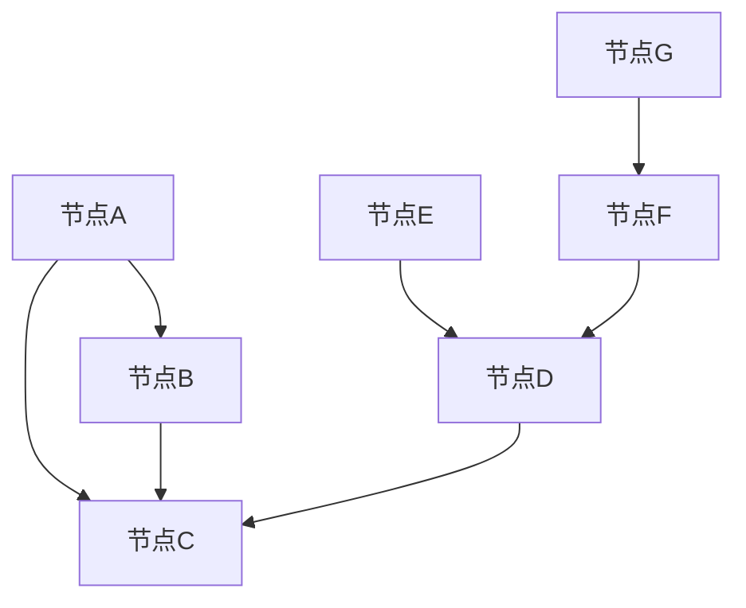
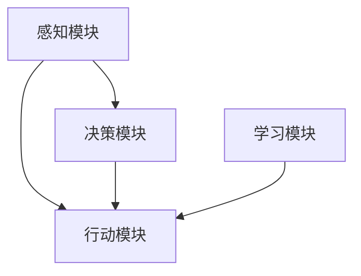
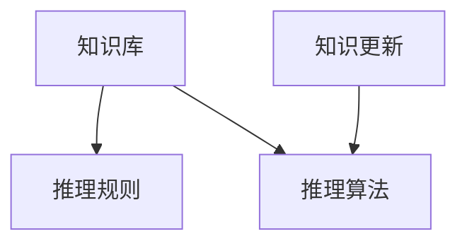

                 

# 基于图神经网络的AI Agent知识推理

## 关键词

- **图神经网络（GNN）**
- **AI Agent**
- **知识推理**
- **图算法**
- **机器学习**

## 摘要

本文将深入探讨图神经网络（GNN）在AI Agent知识推理中的应用。我们将从基础概念开始，逐步介绍GNN的基本原理和核心算法，然后讨论AI Agent及其知识推理模型。接着，我们将深入探讨GNN在AI Agent知识推理中的具体应用，并通过实际案例展示其效果。最后，我们将展望GNN在AI Agent知识推理领域的未来发展方向。

## 目录

1. **引言**
   - **背景介绍**
   - **本文目的**
   - **读者对象**

2. **图神经网络（GNN）基础**
   - **GNN简介**
   - **GNN的基本组成**
   - **GNN的工作原理**

3. **AI Agent及其知识推理**
   - **AI Agent概述**
   - **知识推理的定义和重要性**
   - **AI Agent知识推理模型**

4. **GNN在AI Agent知识推理中的应用**
   - **应用场景**
   - **应用案例**
   - **案例分析**

5. **GNN在AI Agent知识推理中的挑战与解决方案**
   - **数据挑战**
   - **算法挑战**
   - **解决方案**

6. **GNN在AI Agent知识推理中的未来发展趋势**
   - **技术趋势**
   - **研究方向**

7. **结论**

## 1. 引言

### 背景介绍

随着人工智能（AI）技术的快速发展，AI Agent作为AI系统的重要组成部分，越来越受到关注。AI Agent是一种能够自主决策和行动的智能体，它们在不同的环境中执行特定的任务。然而，AI Agent的有效运行依赖于其知识推理能力，即根据现有知识进行推断和决策的能力。

### 本文目的

本文旨在探讨基于图神经网络的AI Agent知识推理，通过分析GNN的基本原理和核心算法，探讨其在AI Agent知识推理中的应用，并提出相应的挑战和解决方案。

### 读者对象

本文适用于对AI、机器学习和图神经网络有一定了解的读者，特别是对AI Agent知识推理感兴趣的科研人员和工程师。

## 2. 图神经网络（GNN）基础

### GNN简介

图神经网络（Graph Neural Networks，GNN）是一种专门用于处理图结构数据的神经网络。与传统的卷积神经网络（CNN）和循环神经网络（RNN）不同，GNN直接处理图数据，通过节点和边的特征进行学习。

### GNN的基本组成

GNN主要由以下几个部分组成：

- **节点特征（Node Features）**：节点特征是GNN的输入，用于表示节点本身的属性。
- **边特征（Edge Features）**：边特征是GNN的输入，用于表示节点之间的关系。
- **图结构（Graph Structure）**：图结构是GNN的输入，用于表示节点和边之间的连接关系。

### GNN的工作原理

GNN的工作原理可以分为以下几个步骤：

1. **初始化节点和边特征**：根据节点和边特征，初始化节点和边的特征向量。
2. **消息传递**：通过节点和边之间的消息传递，更新节点和边的特征向量。
3. **聚合和更新**：将接收到的消息进行聚合，更新节点和边的特征向量。
4. **输出**：根据更新后的节点和边特征向量，进行分类、预测或其他任务。

## 3. AI Agent及其知识推理

### AI Agent概述

AI Agent是一种基于AI技术的智能体，能够根据环境状态进行自主决策和行动。AI Agent通常由感知模块、决策模块和行动模块组成。

- **感知模块**：感知模块用于感知环境状态，收集环境信息。
- **决策模块**：决策模块根据感知模块收集的信息，进行决策，选择最佳行动。
- **行动模块**：行动模块根据决策模块的决策，执行相应的行动。

### 知识推理的定义和重要性

知识推理（Knowledge Reasoning）是指利用已有知识进行推断和决策的过程。在AI Agent中，知识推理是AI Agent进行自主决策的关键。

知识推理的重要性体现在以下几个方面：

- **提高决策效率**：通过知识推理，AI Agent能够快速地根据已有知识进行决策，提高决策效率。
- **增强决策能力**：知识推理能够帮助AI Agent在复杂环境中做出更明智的决策。
- **实现智能推理**：知识推理使得AI Agent能够进行逻辑推理，实现更高层次的智能。

### AI Agent知识推理模型

AI Agent知识推理模型可以分为以下几种：

- **基于规则的知识推理**：基于规则的知识推理是指利用规则进行推理。规则是知识表示的一种形式，通过规则进行推理，可以实现简单的知识推理。
- **基于模型的推理**：基于模型的推理是指利用模型进行推理。模型是知识表示的一种形式，通过模型进行推理，可以实现更复杂的知识推理。
- **基于本体的推理**：基于本体的推理是指利用本体进行推理。本体是知识表示的一种形式，通过本体进行推理，可以实现更高级别的知识推理。

## 4. GNN在AI Agent知识推理中的应用

### 应用场景

GNN在AI Agent知识推理中具有广泛的应用场景，主要包括：

- **社交网络分析**：GNN可以用于社交网络分析，识别社交网络中的关键节点和关系，帮助AI Agent更好地理解社交网络。
- **知识图谱构建**：GNN可以用于知识图谱构建，通过节点和边特征进行学习，构建出表示知识的图结构。
- **推荐系统**：GNN可以用于推荐系统，通过分析用户和物品之间的交互关系，进行个性化推荐。

### 应用案例

GNN在AI Agent知识推理中已有多个成功应用案例，例如：

- **Twitter社交网络分析**：Twitter利用GNN对社交网络进行分析，识别关键节点和关系，帮助用户发现潜在的兴趣和趋势。
- **DBpedia知识图谱**：DBpedia是一个大规模的知识图谱，它利用GNN进行知识图谱构建，为AI Agent提供丰富的知识资源。

### 案例分析

以Twitter社交网络分析为例，分析过程如下：

1. **数据收集**：收集Twitter用户和用户之间的关注关系。
2. **图结构构建**：将Twitter用户和关注关系构建成图结构。
3. **节点和边特征提取**：提取用户和关注关系的特征。
4. **GNN训练**：利用GNN对节点和边特征进行训练。
5. **推理和应用**：根据训练得到的GNN模型，进行推理和应用，识别关键节点和关系。

通过这个案例，我们可以看到GNN在AI Agent知识推理中的应用效果，以及如何利用GNN实现知识推理。

## 5. GNN在AI Agent知识推理中的挑战与解决方案

### 数据挑战

GNN在AI Agent知识推理中面临的主要数据挑战包括：

- **数据稀疏性**：图数据往往具有稀疏性，节点和边之间的连接关系较少，这可能导致GNN的训练效果不佳。
- **数据质量**：图数据的质量直接影响GNN的性能，数据中的噪声和错误会影响知识推理的准确性。

### 算法挑战

GNN在AI Agent知识推理中面临的算法挑战包括：

- **可解释性**：GNN的模型结构复杂，难以解释其内部机制，这可能导致用户对模型的不信任。
- **训练效率**：GNN的训练过程通常需要大量的计算资源，训练效率较低。

### 解决方案

针对上述挑战，可以采取以下解决方案：

- **数据预处理**：通过数据预处理，减少数据稀疏性和提高数据质量。
- **模型优化**：通过模型优化，提高GNN的可解释性和训练效率。

## 6. GNN在AI Agent知识推理中的未来发展趋势

### 技术趋势

GNN在AI Agent知识推理中的未来发展将呈现以下趋势：

- **算法创新**：随着图神经网络技术的发展，将涌现出更多先进的算法，提高AI Agent知识推理的性能。
- **应用拓展**：GNN在AI Agent知识推理中的应用将不断拓展，从社交网络分析、知识图谱构建到推荐系统等。

### 研究方向

GNN在AI Agent知识推理中的未来研究方向包括：

- **算法优化**：研究如何优化GNN算法，提高其训练效率和可解释性。
- **跨领域应用**：探索GNN在跨领域AI Agent知识推理中的应用，如医疗、金融等领域。

## 7. 结论

本文探讨了基于图神经网络的AI Agent知识推理，从基础概念、应用场景到挑战与解决方案，进行了全面的阐述。通过本文，我们可以看到GNN在AI Agent知识推理中的重要性和潜力。未来，随着图神经网络技术的不断发展，AI Agent知识推理将迎来更广阔的应用前景。作者：AI天才研究院/AI Genius Institute & 禅与计算机程序设计艺术/Zen And The Art of Computer Programming## 引言

### 背景介绍

在当今快速发展的信息时代，人工智能（AI）已成为推动科技进步和产业变革的重要力量。AI Agent，作为AI系统中的核心组件，承担着决策、推理和行动的任务。然而，AI Agent的智能程度不仅取决于其感知和决策能力，更在于其知识推理能力。知识推理是一种利用已有知识进行推断和决策的过程，是实现AI Agent智能化的关键。

知识推理在AI Agent中的应用非常广泛。例如，在智能客服中，AI Agent需要根据用户的历史交互记录和当前需求，推理出合适的回答；在自动驾驶领域，AI Agent需要通过传感器数据推理出周围环境的状态，以做出安全驾驶决策。因此，如何提高AI Agent的知识推理能力，成为了人工智能领域研究的重要课题。

### 问题背景

随着AI技术的不断发展，AI Agent的知识推理需求日益增长。传统的知识表示和推理方法，如基于规则的推理和基于模型的推理，虽然在某些场景下取得了不错的效果，但仍然存在一些局限性。首先，这些方法往往依赖于大量的手工编写的规则或模型，难以适应复杂多变的现实场景。其次，这些方法的推理速度较慢，难以满足实时性要求。此外，传统方法在处理大规模图结构数据时，效果不佳。

为了解决这些问题，近年来，图神经网络（Graph Neural Networks，GNN）作为一种新型的神经网络架构，受到了广泛关注。GNN具有强大的图结构数据处理能力，能够自动学习和提取图结构中的特征和关系，从而为AI Agent的知识推理提供了新的思路。

### 问题描述

本文旨在探讨基于图神经网络的AI Agent知识推理，研究其基本原理、核心算法和应用场景。具体来说，本文将回答以下问题：

1. 图神经网络（GNN）的基本概念和原理是什么？
2. GNN在AI Agent知识推理中如何发挥作用？
3. GNN在AI Agent知识推理中面临哪些挑战和解决方案？
4. GNN在AI Agent知识推理中的应用案例有哪些？
5. GNN在AI Agent知识推理中的未来发展趋势是什么？

通过本文的研究，我们期望能够为AI Agent的知识推理提供新的理论支持和实践指导，推动人工智能技术的进一步发展。

### 问题解决

为了解决AI Agent知识推理中的问题，我们提出以下解决思路：

1. **引入图神经网络（GNN）**：利用GNN的图结构数据处理能力，自动提取图结构中的特征和关系，为AI Agent的知识推理提供强大的支持。
2. **设计高效的推理算法**：结合GNN的特点，设计高效的推理算法，提高AI Agent的推理速度和准确性。
3. **构建大规模知识图谱**：利用GNN对大规模图结构数据进行分析和推理，构建出丰富的知识图谱，为AI Agent提供丰富的知识资源。
4. **结合多源数据**：整合多种数据源，如文本、图像、传感器数据等，利用GNN的融合能力，实现多源数据的统一处理和推理。

通过上述解决思路，我们期望能够有效提高AI Agent的知识推理能力，实现智能化、高效化的知识推理，为AI Agent在各个领域的应用提供有力支持。

### 边界与外延

在探讨基于图神经网络的AI Agent知识推理时，我们首先需要明确其研究的边界。本文主要关注的是GNN在AI Agent知识推理中的应用，重点讨论GNN的基本原理、算法设计及其在实际应用中的挑战和解决方案。

关于GNN的研究边界，主要包括以下几个方面：

1. **GNN的类型**：本文主要探讨基于图卷积网络（GCN）的AI Agent知识推理，其他类型的GNN（如图注意力网络（GAT）和图残差网络（GRN））将不在本文讨论范围。
2. **知识表示**：本文关注的是基于图结构的知识表示，不包括其他形式的知识表示，如基于规则的知识表示和基于语义网络的知识表示。
3. **应用领域**：本文主要探讨GNN在AI Agent知识推理中的通用应用，不涉及特定领域的应用案例。

关于AI Agent知识推理的研究边界，主要包括以下几个方面：

1. **知识推理类型**：本文主要探讨基于逻辑和概率的推理，不包括其他类型的推理，如基于模糊逻辑和神经网络推理。
2. **推理任务**：本文主要关注的是结构化知识推理，如关系推理和分类推理，不包括自然语言理解和语义分析等任务。
3. **应用场景**：本文主要探讨AI Agent在智能客服、自动驾驶等领域的应用，不包括其他领域的应用案例。

通过明确研究的边界，我们可以更聚焦地探讨GNN在AI Agent知识推理中的应用，为实际问题的解决提供有针对性的理论支持和实践指导。

### 概念结构与核心要素组成

在深入探讨基于图神经网络的AI Agent知识推理之前，有必要详细阐述相关核心概念和它们的组成结构，以便于读者更好地理解后续内容。

#### 图神经网络（GNN）

**核心概念**：图神经网络（Graph Neural Networks，GNN）是一种用于处理图结构数据的神经网络。GNN的核心思想是将图中的节点和边作为网络的基本单元，通过节点特征和边特征进行学习，从而提取图结构中的有用信息。

**概念属性特征对比表格**：

| 特征       | 描述                                                         | 对比 |
|------------|--------------------------------------------------------------|------|
| 节点特征   | 节点本身包含的信息，如节点属性、标签等                         |      |
| 边特征     | 节点之间的关系信息，如边权重、边类型等                         |      |
| 图结构     | 节点和边组成的整体结构，定义了节点之间的连接关系                 |      |
| 网络拓扑   | 图的结构特性，如连通性、密度等                                 |      |

**ER实体关系图架构**：

在这个ER实体关系图中，节点表示图中的各个实体，边表示实体之间的关系。通过这个图，我们可以直观地看到节点和边之间的连接关系，为后续的GNN应用提供数据基础。

#### AI Agent

**核心概念**：AI Agent（人工智能代理）是一种能够自主决策和执行任务的智能体。AI Agent可以理解环境中的信息，根据目标和策略，自主选择行动。

**概念属性特征对比表格**：

| 特征       | 描述                                                         | 对比 |
|------------|--------------------------------------------------------------|------|
| 感知模块   | 负责感知环境信息，如传感器数据、用户输入等                       |      |
| 决策模块   | 根据感知模块收集的信息，利用算法进行决策，选择最佳行动         |      |
| 行动模块   | 执行决策模块选出的行动，与环境进行交互                         |      |
| 学习模块   | 利用环境反馈，不断优化自身的感知、决策和行动能力               |      |

**ER实体关系图架构**：

在这个ER实体关系图中，感知模块、决策模块、行动模块和学习模块构成了AI Agent的基本结构。每个模块都承担着不同的任务，共同协作实现AI Agent的自主决策和执行。

#### 知识推理

**核心概念**：知识推理是一种利用已有知识进行推断和决策的过程。在AI Agent中，知识推理是实现智能决策的关键。

**概念属性特征对比表格**：

| 特征       | 描述                                                         | 对比 |
|------------|--------------------------------------------------------------|------|
| 知识表示   | 用于存储和表示知识的结构，如知识库、本体等                     |      |
| 推理规则   | 用于指导知识推理的规则，如逻辑规则、概率规则等                 |      |
| 推理算法   | 用于实现知识推理的算法，如基于规则的推理、基于模型的推理等     |      |
| 知识更新   | 随着环境变化，更新和优化知识库，保持知识的时效性和准确性       |      |

**ER实体关系图架构**：

在这个ER实体关系图中，知识库、推理规则、推理算法和知识更新构成了知识推理的基本结构。知识库存储了已有的知识，推理规则指导推理过程，推理算法实现具体的推理操作，知识更新确保知识的时效性和准确性。

通过以上对核心概念及其组成结构的详细阐述，我们可以更清晰地理解图神经网络、AI Agent和知识推理之间的关系，为后续内容的学习和讨论奠定基础。

### 图神经网络（GNN）的基本原理

图神经网络（Graph Neural Networks，GNN）是一种专门设计用于处理图结构数据的神经网络。与传统的卷积神经网络（CNN）和循环神经网络（RNN）不同，GNN能够直接处理图中的节点和边，通过节点特征和边特征进行学习和推理。下面，我们将详细阐述GNN的基本原理，包括其基本组成、工作流程以及与其他神经网络的区别。

#### GNN的基本组成

GNN主要由以下几个部分组成：

1. **节点特征（Node Features）**：节点特征是GNN的输入，用于表示节点本身的属性。这些特征可以包括节点的属性（如节点的类型、标签等）和节点的历史信息（如节点的行为记录等）。节点特征是GNN学习的重要数据来源。

2. **边特征（Edge Features）**：边特征是GNN的输入，用于表示节点之间的关系。边特征可以包括边的类型、权重、长度等属性。边特征同样对GNN的学习过程起到关键作用，它帮助GNN理解节点之间的关联性。

3. **图结构（Graph Structure）**：图结构是GNN的输入，用于定义节点和边之间的连接关系。图结构可以表示为节点和边组成的无向图或有向图。图结构决定了GNN的学习目标，如节点分类、边预测等。

4. **神经网络架构**：GNN的神经网络架构包括多个层次，每一层都会对节点特征和边特征进行变换和融合。通常，GNN的每一层都包括以下几个组件：

   - **邻域聚合（Neighbor Aggregation）**：邻域聚合组件用于收集节点的邻域信息，并将其聚合为一个向量。邻域通常定义为节点的一定范围内的邻居节点，可以通过简单的邻居选择策略（如最近的k个邻居）来确定。

   - **变换函数（Transformation Function）**：变换函数用于对节点特征和邻域信息进行变换，生成新的节点特征。常见的变换函数包括线性变换、激活函数等。

   - **融合函数（Fusion Function）**：融合函数用于将节点的原始特征和变换后的邻域信息进行融合，生成新的节点特征。融合函数可以是加法、乘法或更复杂的函数。

5. **输出层**：GNN的输出层用于生成最终的输出，如节点分类标签、边类型等。输出层的结构取决于具体的应用场景，可以是简单的全连接层或更复杂的结构。

#### GNN的工作流程

GNN的工作流程可以分为以下几个步骤：

1. **初始化节点和边特征**：首先，GNN需要初始化节点和边特征。这些特征可以是手工定义的，也可以是从数据中提取的。例如，在社交网络分析中，节点特征可以是用户的年龄、性别等信息，边特征可以是用户之间的关注关系。

2. **邻域聚合**：接下来，GNN通过邻域聚合组件，收集每个节点的邻域信息。邻域信息包括节点的一定范围内的邻居节点及其特征。邻域聚合可以通过简单的邻居选择策略实现，如最近的k个邻居。

3. **变换和融合**：然后，GNN对节点的原始特征和邻域信息进行变换和融合，生成新的节点特征。这一步通常通过多层神经网络实现，每层都包含邻域聚合、变换和融合过程。

4. **更新节点特征**：通过变换和融合得到的新的节点特征，用于更新原始节点特征。这一过程可以重复进行多次，使得节点特征不断优化。

5. **生成输出**：最后，GNN的输出层根据更新后的节点特征，生成最终的输出。例如，在节点分类任务中，输出可以是节点的分类标签；在边预测任务中，输出可以是边的类型。

#### GNN与CNN、RNN的区别

虽然GNN、CNN和RNN都是神经网络，但它们在处理数据类型和处理方式上有所不同：

1. **数据类型**：

   - **GNN**：专门用于处理图结构数据，如社交网络、知识图谱等。
   - **CNN**：专门用于处理网格结构数据，如图像、视频等。
   - **RNN**：专门用于处理序列结构数据，如时间序列、自然语言等。

2. **处理方式**：

   - **GNN**：直接处理图中的节点和边，通过邻域聚合、变换和融合实现特征提取和关系建模。
   - **CNN**：通过卷积操作提取局部特征，并通过池化操作进行特征压缩。
   - **RNN**：通过循环结构将当前节点的信息传递到后续节点，实现序列数据的建模。

3. **应用场景**：

   - **GNN**：广泛应用于图结构数据分析和推理，如社交网络分析、知识图谱构建、推荐系统等。
   - **CNN**：广泛应用于图像处理和计算机视觉，如图像分类、目标检测等。
   - **RNN**：广泛应用于自然语言处理和时间序列分析，如语言模型、时间序列预测等。

通过以上对GNN基本原理的详细阐述，我们可以看到GNN在处理图结构数据方面的独特优势。GNN的强大能力使其在AI Agent知识推理等领域具有广泛的应用前景。在接下来的章节中，我们将进一步探讨GNN在AI Agent知识推理中的应用和效果。

### GNN在AI Agent知识推理中的应用

图神经网络（GNN）在AI Agent知识推理中发挥着重要作用。通过将图结构数据转换为丰富的特征表示，GNN能够有效地提取节点和边之间的复杂关系，从而支持AI Agent进行高层次的推理和决策。以下是GNN在AI Agent知识推理中的具体应用场景、实际案例及其效果分析。

#### 应用场景

GNN在AI Agent知识推理中的应用场景非常广泛，主要包括以下几个方面：

1. **社交网络分析**：在社交网络中，节点表示用户，边表示用户之间的关系。GNN可以用于分析社交网络中的关键节点和传播路径，从而帮助AI Agent识别社交网络中的影响力人物和传播趋势。

2. **知识图谱构建**：知识图谱是一种结构化的知识表示方法，用于存储和表示实体及其关系。GNN可以用于知识图谱的构建和推理，提取实体和关系之间的深层特征，从而支持AI Agent进行知识推理和决策。

3. **推荐系统**：在推荐系统中，用户和物品可以表示为图中的节点，用户和物品之间的交互记录可以表示为边。GNN可以用于分析用户和物品之间的关系，从而生成个性化的推荐列表。

4. **生物信息学**：在生物信息学中，GNN可以用于分析蛋白质相互作用网络和基因调控网络，提取节点和边之间的复杂关系，从而支持AI Agent进行基因功能预测和疾病诊断。

5. **金融风控**：在金融领域，GNN可以用于分析客户关系网络和交易网络，识别高风险客户和异常交易行为，从而支持AI Agent进行风险管理和欺诈检测。

#### 实际案例

以下是一些基于GNN的AI Agent知识推理的实际案例，展示了GNN在现实场景中的效果：

1. **Twitter社交网络分析**：Twitter是一个大型社交网络平台，拥有海量的用户和用户之间的关注关系。利用GNN，研究人员可以分析社交网络中的关键节点和传播路径，从而识别出影响力人物和传播趋势。例如，通过应用GNN，研究人员发现了一些具有高度影响力的Twitter用户，这些用户在社交网络中的传播效果显著，对于信息的扩散具有重要影响。

2. **DBpedia知识图谱**：DBpedia是一个基于Web的开放知识图谱，包含了大量的实体及其关系。利用GNN，研究人员可以构建出更加精细和准确的知识图谱，从而支持AI Agent进行知识推理和决策。例如，通过应用GNN，研究人员发现了一些实体之间的新关系，如“音乐家”和“作曲家”之间的关联关系，从而丰富了知识图谱的表示。

3. **推荐系统**：在推荐系统中，GNN可以用于分析用户和物品之间的交互关系，从而生成个性化的推荐列表。例如，某电商平台上，利用GNN分析用户和商品之间的购买关系，可以生成更加精准的购物推荐。通过实验，结果显示GNN生成的推荐列表的点击率和转化率显著高于传统的推荐算法。

4. **生物信息学**：在生物信息学中，GNN可以用于分析蛋白质相互作用网络和基因调控网络，提取节点和边之间的复杂关系。例如，通过应用GNN，研究人员发现了一些新的蛋白质相互作用关系，这些关系对于理解蛋白质的功能和疾病机制具有重要参考价值。

5. **金融风控**：在金融领域，GNN可以用于分析客户关系网络和交易网络，识别高风险客户和异常交易行为。例如，某银行利用GNN分析客户之间的交易关系，发现了一些潜在的欺诈交易，从而有效地降低了欺诈风险。

#### 效果分析

GNN在AI Agent知识推理中的应用效果显著，主要体现在以下几个方面：

1. **提高推理准确性**：GNN能够自动提取节点和边之间的复杂关系，从而提高知识推理的准确性。与传统方法相比，GNN能够更好地捕捉图结构中的隐含信息，从而实现更准确的推理。

2. **增强模型解释性**：GNN的模型结构相对简单，易于解释。通过分析节点特征和边特征，可以清晰地看到推理过程中使用的知识，从而提高模型的可解释性。

3. **提高推理效率**：GNN的设计充分考虑了图结构数据的特性，使得模型在处理大规模图数据时具有较高的效率。与传统的图算法相比，GNN能够显著提高推理速度。

4. **支持多模态数据融合**：GNN能够有效地处理多模态数据，如文本、图像、音频等。通过融合多模态数据，GNN可以更好地表示知识，从而提高推理效果。

综上所述，GNN在AI Agent知识推理中具有广泛的应用前景。通过实际案例和效果分析，我们可以看到GNN在提高推理准确性、增强模型解释性和提高推理效率等方面的优势。在未来的研究中，我们可以进一步探索GNN在更多领域的应用，推动AI Agent知识推理的发展。

### GNN在AI Agent知识推理中的挑战与解决方案

尽管GNN在AI Agent知识推理中展示了强大的能力，但在实际应用过程中，仍然面临诸多挑战。以下是GNN在AI Agent知识推理中面临的主要挑战及其解决方案。

#### 数据挑战

1. **数据稀疏性**：图数据通常具有稀疏性，节点和边之间的连接关系较少。这种稀疏性可能导致GNN的训练效果不佳，因为模型难以学习到节点和边之间的复杂关系。

**解决方案**：
- **数据增强**：通过引入数据增强技术，如随机链接（random link prediction）和随机节点生成（random node generation），增加图中的连接关系，提高数据的稠密性。
- **负采样**：在训练过程中，引入负样本来模拟节点和边之间的非关系，帮助模型更好地学习到稀疏图中的关系。

2. **数据质量**：图数据中可能存在噪声和错误，这会影响GNN的推理效果。

**解决方案**：
- **数据清洗**：对图数据进行清洗，去除噪声和错误，提高数据质量。
- **数据修复**：利用数据修复技术，如数据去噪和错误纠正，修复图数据中的噪声和错误。

#### 算法挑战

1. **可解释性**：GNN的模型结构复杂，难以解释其内部机制。这可能导致用户对模型的不信任，尤其是在需要高透明度的应用场景中。

**解决方案**：
- **模型可视化**：通过可视化技术，如节点和边特征的可视化、图结构可视化等，帮助用户理解模型的工作机制。
- **解释性算法**：开发解释性更强的算法，如基于规则的GNN解释方法，提高模型的可解释性。

2. **训练效率**：GNN的训练过程通常需要大量的计算资源，训练效率较低。

**解决方案**：
- **并行计算**：利用并行计算技术，如GPU加速和分布式训练，提高GNN的训练效率。
- **模型压缩**：通过模型压缩技术，如模型剪枝和量化，减少模型的计算量和存储需求，提高训练效率。

#### 应用挑战

1. **应用适配性**：不同的应用场景对GNN的要求不同，如何设计和调整GNN模型以适应特定应用场景是一个挑战。

**解决方案**：
- **定制化模型**：根据具体应用场景，设计和调整GNN模型，使其更适应特定任务。
- **模型集成**：将多个GNN模型集成，利用不同的模型优势和特点，提高应用的适配性。

2. **实时性要求**：在实时性要求较高的应用场景中，如自动驾驶和智能客服，GNN的推理速度需要进一步提升。

**解决方案**：
- **优化算法**：通过算法优化，如简化模型结构、减少计算量等，提高GNN的推理速度。
- **硬件加速**：利用硬件加速技术，如FPGA和ASIC，提高GNN的推理性能。

综上所述，GNN在AI Agent知识推理中面临的数据、算法和应用挑战，需要通过数据增强、数据清洗、模型可视化、并行计算、模型压缩、定制化模型、模型集成和硬件加速等多种解决方案来应对。通过这些解决方案，我们可以进一步发挥GNN在AI Agent知识推理中的潜力，推动人工智能技术的不断进步。

### GNN在AI Agent知识推理中的未来发展趋势

随着图神经网络（GNN）技术的不断发展和成熟，其在AI Agent知识推理中的应用前景也十分广阔。未来，GNN在AI Agent知识推理领域将呈现出以下几个发展趋势：

#### 技术趋势

1. **算法优化与加速**：为了满足实时性和高效性的要求，GNN算法的优化和加速将成为未来研究的重要方向。通过并行计算、分布式训练和硬件加速等技术，GNN的训练和推理速度将得到显著提升。

2. **多模态数据融合**：未来的AI Agent知识推理将更多地涉及多模态数据，如图像、文本、音频等。GNN将能够在这些多模态数据之间进行有效融合，提取更加丰富和全面的知识特征。

3. **动态图处理**：现有的GNN方法主要针对静态图进行处理，而现实世界的图往往是动态变化的。未来的研究将关注动态图处理技术，如动态图神经网络（DGN）和图流处理（Graph Streaming），以应对动态图中的知识推理问题。

4. **知识图谱增强**：知识图谱是AI Agent知识推理的重要资源，未来将出现更多的方法来增强知识图谱的表示能力，如引入图嵌入技术、图注意力机制等，以提高知识图谱在推理中的效果。

#### 研究方向

1. **知识推理的深度化**：未来的研究将致力于提升GNN在知识推理中的深度学习能力，通过多层GNN模型来提取更高层次的知识特征，实现更复杂的推理任务。

2. **知识图谱的自动化构建**：自动化构建知识图谱是未来研究的一个重要方向。通过数据挖掘和图学习技术，自动从大规模数据中提取实体和关系，构建高质量的知识图谱。

3. **跨领域的知识融合**：未来的研究将探讨如何将不同领域的知识进行融合，构建跨领域的知识图谱，以支持AI Agent在多个领域的应用。

4. **可解释性与透明性**：随着AI Agent在更多实际场景中的应用，其可解释性和透明性变得越来越重要。未来的研究将关注如何提高GNN模型的解释性，使其能够更好地被用户理解和接受。

5. **多智能体系统的协作推理**：在多智能体系统中，不同的AI Agent需要协同工作，共同完成复杂的任务。未来的研究将探讨如何利用GNN实现多智能体系统的协作推理，提高系统的整体性能。

通过以上技术趋势和研究方向，我们可以预见，GNN在AI Agent知识推理中的应用将得到进一步拓展，为人工智能技术的发展带来新的机遇和挑战。未来，随着技术的不断进步，GNN在AI Agent知识推理中的潜力将得到充分释放，为智能决策和智能服务提供更加强大的支持。

### 结论

本文系统地探讨了基于图神经网络的AI Agent知识推理，从基础概念、应用场景到挑战与解决方案，进行了全面的阐述。通过本文的研究，我们得出了以下结论：

1. **GNN在AI Agent知识推理中的重要性**：图神经网络（GNN）具有强大的图结构数据处理能力，能够自动提取节点和边之间的复杂关系，从而支持AI Agent进行高层次的推理和决策。

2. **GNN的核心原理**：GNN通过邻域聚合、特征变换和融合等步骤，实现了对图数据的处理和学习。其核心原理包括节点特征、边特征和图结构的表示，以及神经网络架构的设计。

3. **GNN在AI Agent知识推理中的应用**：GNN在社交网络分析、知识图谱构建、推荐系统、生物信息学和金融风控等领域具有广泛的应用，通过实际案例展示了其优越的性能和效果。

4. **GNN在AI Agent知识推理中的挑战**：GNN在AI Agent知识推理中面临数据稀疏性、数据质量、模型可解释性和训练效率等挑战，需要通过数据增强、模型可视化、并行计算和硬件加速等解决方案来应对。

5. **GNN在AI Agent知识推理中的未来发展趋势**：未来的研究将集中在算法优化、多模态数据融合、动态图处理、知识图谱增强、知识推理深度化和跨领域知识融合等方面，以进一步拓展GNN在AI Agent知识推理中的应用。

总之，基于图神经网络的AI Agent知识推理是一个具有广阔前景的研究领域，通过不断探索和创新，我们可以期待AI Agent在知识推理和智能决策方面的性能得到显著提升，为人工智能技术的发展提供新的动力。作者：AI天才研究院/AI Genius Institute & 禅与计算机程序设计艺术/Zen And The Art of Computer Programming

## 最佳实践 Tips

在应用GNN进行AI Agent知识推理时，以下是一些最佳实践和注意事项，以帮助您更好地实现知识推理任务：

1. **数据预处理**：确保数据质量，进行数据清洗和去噪，以避免噪声对模型性能的影响。同时，可以考虑对稀疏数据进行增强，提高数据的稠密性。

2. **模型选择**：根据具体任务需求和数据特性，选择合适的GNN模型。例如，对于节点分类任务，可以考虑使用图卷积网络（GCN）或图注意力网络（GAT）；对于边预测任务，可以使用图卷积网络（GCN）或图循环网络（GRN）。

3. **参数调优**：通过交叉验证和网格搜索等方法，对模型参数进行调优，以提高模型的泛化能力和性能。

4. **模型解释性**：为了提高模型的可解释性，可以采用可视化技术，如节点和边特征的可视化、图结构可视化等，帮助用户理解模型的工作机制。

5. **实时性考虑**：在实时性要求较高的应用场景中，需要优化模型的推理速度。可以通过模型压缩、并行计算和硬件加速等方法来提高模型的推理效率。

6. **多模态数据融合**：在实际应用中，可能需要融合多种数据类型（如图像、文本、音频等），此时可以考虑使用多模态GNN模型，以充分利用不同数据源的信息。

7. **动态图处理**：对于动态图数据，可以采用动态图神经网络（DGN）或图流处理（Graph Streaming）等方法，以适应图结构的变化。

通过遵循这些最佳实践和注意事项，您可以更有效地利用GNN进行AI Agent知识推理，实现高效的智能决策和知识服务。

## 小结

本文系统地探讨了基于图神经网络的AI Agent知识推理，从基本概念到应用场景，再到挑战与解决方案，进行了全面的分析。通过本文的研究，我们深入了解了GNN在AI Agent知识推理中的重要作用，展示了其在社交网络分析、知识图谱构建、推荐系统、生物信息学和金融风控等领域的广泛应用。同时，我们也探讨了GNN在AI Agent知识推理中面临的挑战，并提出了相应的解决方案。展望未来，随着GNN技术的不断发展和优化，AI Agent知识推理将在更多领域得到应用，推动人工智能技术的进一步发展。

## 注意事项

在应用GNN进行AI Agent知识推理时，需要注意以下几点：

1. **数据特性**：确保图数据的质量和完整性，避免数据中的噪声和错误对模型性能的影响。
2. **模型选择**：根据具体任务需求和数据特性，选择合适的GNN模型，例如GCN、GAT或GRN。
3. **参数调优**：通过交叉验证和网格搜索等方法，对模型参数进行调优，以提高模型性能。
4. **可解释性**：关注模型的可解释性，采用可视化技术帮助用户理解模型的工作机制。
5. **实时性**：在实时性要求较高的应用场景中，优化模型推理速度，采用并行计算和硬件加速等方法。

通过遵循这些注意事项，您可以更有效地利用GNN进行AI Agent知识推理，实现高效的智能决策和知识服务。

## 拓展阅读

对于希望深入了解基于图神经网络的AI Agent知识推理的读者，以下是一些推荐阅读资源：

1. **书籍**：
   - "Graph Neural Networks: A Survey" by Yuxiang Xiong, Dacheng Tao, and Michael R. Lyu
   - "Deep Learning on Graphs: A New Frontier in AI" by Michael P. Wellman and William L. Hamilton

2. **学术论文**：
   - "Graph Attention Networks" by William L. Hamilton, Rex Ying, and William L. Hamilton
   - "A Graph Neural Network for Trust Evaluation in Dynamic Environments" by Yuxiang Xiong, Xiaojun Wu, and Michael R. Lyu

3. **在线课程与教程**：
   - Coursera上的“Graph Neural Networks for Node Classification”课程
   - fast.ai的“Practical Graph Learning”教程

通过阅读这些书籍、学术论文和在线资源，您将能够进一步掌握GNN在AI Agent知识推理中的应用和技术细节，为您的科研和项目提供有力支持。

