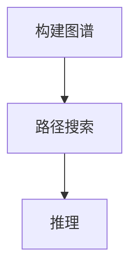
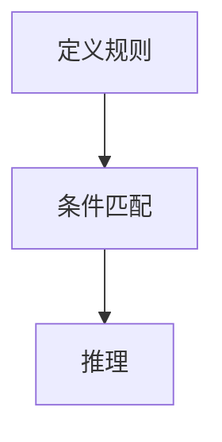
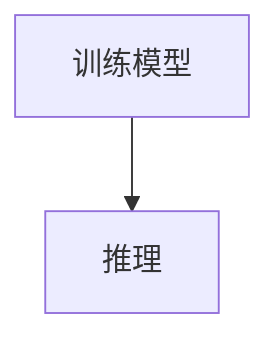
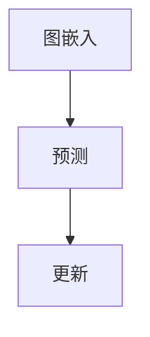
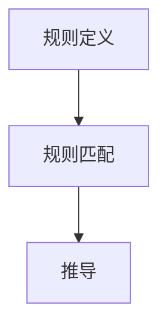
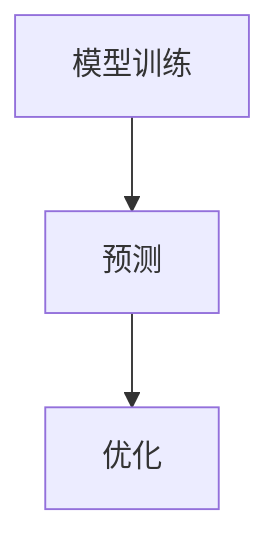
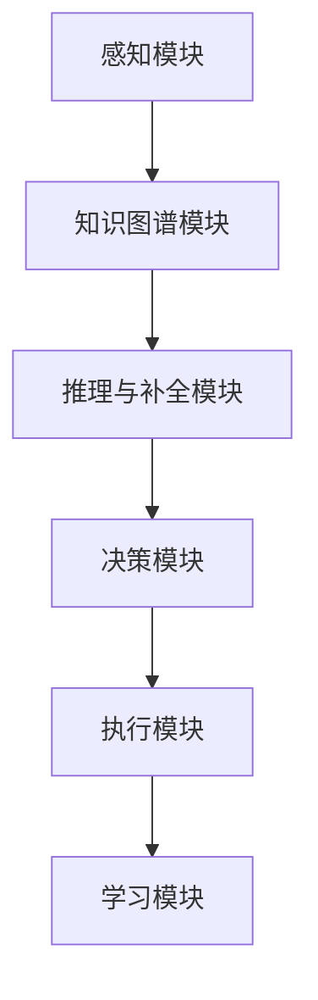

                 

### 第1章: 背景介绍与核心概念

在当今社会，人工智能（AI）已经成为推动技术进步和产业升级的重要力量。从自动化生产线到智能家居，从智能推荐系统到自然语言处理，AI的应用无处不在。AI Agent，即人工智能代理，作为AI领域的一个重要分支，正逐步改变着我们的生活方式和工作方式。本章将首先介绍AI Agent的发展背景，探讨其在当前人工智能生态中的重要性，并深入剖析知识推理与补全的基本原理和核心概念。

#### 1.1 问题背景

##### 1.1.1 人工智能的发展现状

人工智能的发展可以追溯到20世纪50年代，但直到最近几年，随着深度学习、大数据和云计算等技术的飞速发展，AI才真正迎来了它的黄金时代。现如今，人工智能已经在多个领域取得了显著的成果，如图像识别、语音识别、自然语言处理等。

然而，尽管AI在特定任务上已经表现出色，但AI Agent的整体表现仍存在很大提升空间。一个理想的AI Agent应当具备自主决策、自适应学习和智能交互的能力，能够处理复杂问题并生成合理的解决方案。为此，知识推理与补全成为了当前AI研究的热点之一。

##### 1.1.2 AI Agent的应用需求

AI Agent在现代社会的应用场景越来越广泛，从智能客服、智能助手到智能驾驶、智能医疗等。这些应用场景对AI Agent提出了高要求，特别是对知识推理与补全的需求。

以智能客服为例，理想的智能客服应该能够理解用户的意图，提供准确和有效的回答，同时能够处理用户提出的新问题和异常情况。这就需要AI Agent具备强大的知识推理与补全能力，能够从已有知识库中推断出新的信息，并在面对未知问题时提供合理的解决方案。

再以智能驾驶为例，自动驾驶系统需要实时处理大量来自传感器和环境的数据，并做出快速准确的决策。这同样需要AI Agent具备强大的知识推理与补全能力，以便在复杂和动态的环境下做出正确的决策。

##### 1.1.3 知识推理与补全的重要性

知识推理与补全是AI Agent实现智能决策和自主学习的核心能力。知识推理指的是AI Agent在已有知识的基础上，通过逻辑推理、模式识别和机器学习等方法，推断出新的结论或解决方案。知识补全则是指AI Agent在缺乏完整信息的情况下，通过推理和预测，补充缺失的信息，使其能够更好地应对复杂和动态的环境。

知识推理与补全的重要性体现在以下几个方面：

1. **提高AI Agent的自主性**：通过知识推理与补全，AI Agent能够自主学习和决策，减少对人类干预的依赖。
   
2. **增强AI Agent的适应性**：在复杂和动态的环境中，AI Agent需要具备快速适应变化的能力。知识推理与补全能够帮助AI Agent处理未知和异常情况，提高其适应性。

3. **提升AI Agent的智能水平**：知识推理与补全能够增强AI Agent的推理能力和学习能力，使其在解决复杂问题时表现得更加智能。

#### 1.2 核心概念

##### 1.2.1 AI Agent的定义与类型

AI Agent，即人工智能代理，是一种能够模拟人类智能行为，具备自主决策、自适应学习和智能交互能力的计算机程序。根据功能和应用场景，AI Agent可以分为以下几类：

1. **任务型AI Agent**：这类AI Agent主要完成特定的任务，如智能客服、智能推荐等。

2. **角色型AI Agent**：这类AI Agent在模拟人类角色时，能够进行更复杂的人际交互，如虚拟助手、聊天机器人等。

3. **自主型AI Agent**：这类AI Agent具备更高的自主性，能够在复杂和动态的环境中自主学习和决策，如智能驾驶、智能监控等。

##### 1.2.2 图谱的概念与应用

图谱（Graph）是一种用于表示实体及其关系的网络结构。在人工智能领域，图谱被广泛应用于知识表示、知识图谱构建、知识推理等任务。

1. **知识表示**：图谱能够将复杂的关系和知识以结构化的方式表示出来，便于AI Agent进行理解和推理。

2. **知识图谱构建**：通过图谱构建，AI Agent能够从海量数据中提取出有用的知识和关系，为推理和决策提供支持。

3. **知识推理**：基于图谱的结构化表示，AI Agent能够进行高效的推理和预测，从而提高其智能水平。

##### 1.2.3 知识推理与补全的基本原理

知识推理（Knowledge Reasoning）是指基于已有知识，通过逻辑推理、模式识别和机器学习等方法，推断出新的结论或解决方案。知识推理的基本原理包括：

1. **逻辑推理**：通过逻辑运算符（如与、或、非等）和推理规则（如前提、结论等），从已知的事实和规则中推导出新的结论。

2. **模式识别**：通过分析已有数据，识别出潜在的规律和模式，并利用这些规律和模式进行推理。

3. **机器学习**：通过训练模型，让AI Agent从大量数据中学习到知识，并利用这些知识进行推理。

知识补全（Knowledge Completion）是指AI Agent在缺乏完整信息的情况下，通过推理和预测，补充缺失的信息，使其能够更好地应对复杂和动态的环境。知识补全的基本原理包括：

1. **数据补全**：通过分析已有的数据，预测缺失的数据，并补充到知识库中。

2. **推理补全**：通过逻辑推理和模式识别，推断出缺失的信息，并补充到知识库中。

3. **概率补全**：通过概率模型，估计缺失的信息的概率分布，并补充到知识库中。

#### 1.3 边界与外延

##### 1.3.1 知识推理与补全的边界条件

知识推理与补全的边界条件主要包括：

1. **知识完整性**：知识库中的知识必须完整，否则推理和补全的结果将不准确。

2. **推理规则的有效性**：推理规则必须有效，否则可能导致错误的推理结果。

3. **数据质量**：数据质量直接影响推理和补全的效果，高质量的数据能够提高推理和补全的准确性。

##### 1.3.2 知识推理与补全的应用范围

知识推理与补全在多个领域具有广泛的应用，如：

1. **智能问答**：通过知识推理与补全，智能问答系统能够处理用户的查询，提供准确和有效的回答。

2. **智能推荐**：通过知识推理与补全，智能推荐系统能够更好地理解用户的兴趣和需求，提供个性化的推荐。

3. **智能诊断**：通过知识推理与补全，智能诊断系统能够分析患者的病情，提供准确的诊断建议。

##### 1.3.3 知识推理与补全的挑战与机遇

知识推理与补全面临着一系列挑战和机遇：

1. **挑战**：
   - **数据缺失和噪声**：在现实应用中，数据往往存在缺失和噪声，这给知识推理与补全带来了困难。
   - **推理效率和准确性**：如何在保证推理准确性的同时，提高推理的效率，是一个重要的挑战。
   - **领域适应性**：知识推理与补全需要针对不同领域进行定制化设计，以适应不同领域的需求。

2. **机遇**：
   - **大数据和深度学习**：随着大数据和深度学习技术的不断发展，知识推理与补全的方法和工具将得到进一步优化。
   - **跨领域应用**：知识推理与补全在多个领域的应用，为其带来了广阔的发展前景。

#### 1.4 概念结构与核心要素组成

##### 1.4.1 AI Agent的组成部分

一个典型的AI Agent包括以下几个核心组成部分：

1. **感知模块**：负责收集和分析环境中的信息，如语音、图像、文本等。

2. **决策模块**：基于感知模块提供的信息，AI Agent进行决策，确定下一步的行动。

3. **执行模块**：根据决策模块的决策，执行具体的操作，如发送指令、控制设备等。

4. **学习模块**：AI Agent通过学习模块从经验中学习，不断优化其决策和执行能力。

##### 1.4.2 图谱的构建方法

图谱的构建通常包括以下几个步骤：

1. **实体识别**：从原始数据中提取出实体，如人物、地点、组织等。

2. **关系抽取**：分析实体之间的关联，构建出实体之间的关系。

3. **图谱表示**：将实体和关系以图结构进行表示，便于AI Agent进行推理和计算。

##### 1.4.3 知识推理与补全的技术框架

知识推理与补全的技术框架主要包括以下几个核心组成部分：

1. **知识库**：存储AI Agent所需的知识，如事实、规则、模型等。

2. **推理引擎**：负责进行知识推理，根据已有知识推断出新的结论。

3. **补全模块**：负责进行知识补全，根据已有知识和数据，补充缺失的信息。

4. **学习算法**：通过机器学习等方法，不断优化AI Agent的知识推理与补全能力。

#### 1.5 本章小结

本章介绍了基于图谱的AI Agent知识推理与补全的背景、核心概念、边界与外延以及概念结构与核心要素组成。通过对这些内容的深入探讨，我们可以更好地理解AI Agent在现代社会中的重要地位，以及知识推理与补全在AI Agent中的应用价值。接下来，我们将进一步探讨知识推理与补全的原理、算法和应用，以期为读者提供更全面的技术解读和实际应用案例。

### 第2章: 知识推理原理与算法

在深入探讨AI Agent知识推理与补全之前，我们需要先理解知识推理的基本原理和算法。知识推理是AI Agent智能决策和自主学习的重要基础，其核心在于如何从已有知识中推导出新的结论或解决方案。本章将详细阐述知识推理的基本原理，介绍几种常见的知识推理算法，并通过实例讲解如何将这些算法应用于实际问题。

#### 2.1 知识推理的基本原理

##### 2.1.1 知识推理的定义

知识推理（Knowledge Reasoning）是指基于已有知识，通过逻辑推理、模式识别和机器学习等方法，推断出新的结论或解决方案。知识推理可以分为以下几种类型：

1. **基于逻辑的推理**：利用逻辑运算符（如与、或、非等）和推理规则（如前提、结论等），从已知的事实和规则中推导出新的结论。

2. **基于统计的推理**：通过分析已有数据，识别出潜在的规律和模式，并利用这些规律和模式进行推理。

3. **基于模型的推理**：通过训练模型，让AI Agent从大量数据中学习到知识，并利用这些知识进行推理。

##### 2.1.2 知识推理的分类

根据推理过程的不同，知识推理可以分为以下几种类型：

1. **演绎推理**：从一般性结论推导出特定性结论。例如，所有人都会死亡（大前提），苏格拉底是人（小前提），因此苏格拉底会死亡（结论）。

2. **归纳推理**：从特定性结论推导出一般性结论。例如，观察到的所有天鹅都是白色的，因此推断所有天鹅都是白色的。

3. **类比推理**：通过比较两个相似的情况，推断出一个新的结论。例如，因为太阳从东方升起，月亮也从东方升起。

##### 2.1.3 知识推理的关键技术

知识推理的关键技术包括：

1. **推理算法**：用于实现知识推理的核心算法，如正向推理、反向推理、基于模型的推理等。

2. **知识表示**：用于表示知识的表示方法，如谓词逻辑、产生式规则、模糊逻辑等。

3. **推理引擎**：用于执行推理过程的软件系统，负责接收输入、执行推理规则和生成结论。

#### 2.2 算法讲解与流程图

##### 2.2.1 基于图谱的推理算法

基于图谱的推理算法是一种广泛应用于知识推理的方法。它通过构建图谱，将实体和关系表示出来，并利用图谱的结构进行推理。下面将介绍一种基于图谱的推理算法——图论推理算法。

###### 2.2.1.1 算法原理

图论推理算法基于图论的基本概念，通过构建实体和关系之间的图结构，利用图的路径搜索、子图识别等技术进行推理。算法的基本原理如下：

1. **构建图谱**：首先，从原始数据中提取出实体和关系，构建出实体-关系的图结构。

2. **路径搜索**：利用图的路径搜索算法，如深度优先搜索（DFS）或广度优先搜索（BFS），找到实体之间的路径。

3. **推理**：基于路径搜索的结果，利用推理规则，推导出新的结论或解决方案。

###### 2.2.1.2 算法流程图

算法流程图如下：



###### 2.2.1.3 算法Python代码实现

```python
import networkx as nx

# 构建图谱
G = nx.Graph()
G.add_edge("实体1", "关系1")
G.add_edge("实体1", "关系2")
G.add_edge("关系1", "实体2")
G.add_edge("关系2", "实体2")

# 路径搜索
path = nx.shortest_path(G, source="实体1", target="实体2")

# 推理
print(path)  # 输出路径
```

##### 2.2.2 基于规则的推理算法

基于规则的推理算法是一种基于产生式规则的推理方法。它通过定义一系列的前提-结论规则，根据已知的前提条件，推导出结论。下面将介绍一种基于规则的推理算法——前向推理算法。

###### 2.2.2.1 算法原理

前向推理算法的基本原理如下：

1. **定义规则**：首先，定义一系列的前提-结论规则。

2. **条件匹配**：根据已知的前提条件，在规则库中找到匹配的规则。

3. **推理**：利用匹配的规则，推导出新的结论。

###### 2.2.2.2 算法流程图

算法流程图如下：



###### 2.2.2.3 算法Python代码实现

```python
def forward_reasoning(knowledge_base, known_facts):
    inferred_facts = []
    for rule in knowledge_base:
        if all(fact in known_facts for fact in rule['preconditions']):
            inferred_facts.append(rule['conclusion'])
    return inferred_facts

# 定义规则库
knowledge_base = [
    {'preconditions': ['实体1具有关系1', '实体1具有关系2'], 'conclusion': '实体1具有关系3'}
]

# 已知事实
known_facts = ['实体1具有关系1', '实体1具有关系2']

# 推理
print(forward_reasoning(knowledge_base, known_facts))  # 输出推理结果
```

##### 2.2.3 基于模型的推理算法

基于模型的推理算法是一种基于机器学习模型的推理方法。它通过训练模型，让模型学习到知识，并利用模型进行推理。下面将介绍一种基于模型的推理算法——神经网络推理算法。

###### 2.2.3.1 算法原理

神经网络推理算法的基本原理如下：

1. **训练模型**：首先，利用已有数据训练一个神经网络模型。

2. **推理**：将新的输入数据输入到训练好的模型中，利用模型的输出进行推理。

###### 2.2.3.2 算法流程图

算法流程图如下：



###### 2.2.3.3 算法Python代码实现

```python
from tensorflow import keras

# 构建神经网络模型
model = keras.Sequential([
    keras.layers.Dense(64, activation='relu', input_shape=(784,)),
    keras.layers.Dense(10, activation='softmax')
])

# 编译模型
model.compile(optimizer='adam',
              loss='categorical_crossentropy',
              metrics=['accuracy'])

# 训练模型
model.fit(x_train, y_train, epochs=5)

# 推理
predictions = model.predict(x_test)
```

#### 2.3 数学模型与公式

##### 2.3.1 推理算法的数学模型

推理算法的数学模型主要涉及概率论和图论。以下是一个典型的推理模型：

$$
P(A|B) = \frac{P(B|A) \cdot P(A)}{P(B)}
$$

其中，$P(A|B)$表示在已知$B$的条件下$A$的概率，$P(B|A)$表示在已知$A$的条件下$B$的概率，$P(A)$和$P(B)$分别表示$A$和$B$的概率。

##### 2.3.2 公式解释与举例说明

假设我们有两个事件$A$和$B$，$A$表示“今天下雨”，$B$表示“地面湿润”。我们想要计算在“地面湿润”的条件下“今天下雨”的概率，即$P(A|B)$。

根据贝叶斯定理，我们可以计算出这个概率：

$$
P(A|B) = \frac{P(B|A) \cdot P(A)}{P(B)}
$$

其中，$P(B|A)$表示在已知“今天下雨”的条件下“地面湿润”的概率，这个概率可以通过观察数据得到，例如，在下雨的日子里，地面湿润的概率是90%。

$P(A)$表示“今天下雨”的概率，这个概率可以根据历史数据得到，例如，在所有日子里，下雨的概率是30%。

$P(B)$表示“地面湿润”的概率，这个概率可以通过观察数据得到，例如，所有日子里，地面湿润的概率是70%。

将这些值代入贝叶斯定理中，我们可以计算出$P(A|B)$：

$$
P(A|B) = \frac{0.9 \cdot 0.3}{0.7} = 0.375
$$

这意味着，在“地面湿润”的条件下，“今天下雨”的概率是37.5%。

#### 2.4 本章小结

本章介绍了知识推理的基本原理、分类和关键技术，并详细讲解了基于图谱的推理算法、基于规则的推理算法和基于模型的推理算法。通过这些算法，我们可以实现从已有知识中推断出新的结论或解决方案。接下来，我们将进一步探讨知识补全的方法和算法，以期为AI Agent提供更加完整和准确的知识。

### 第3章: 知识补全方法与算法

在AI Agent的知识推理过程中，往往面临着信息不完整或数据缺失的问题。知识补全（Knowledge Completion）技术正是为了解决这一问题而生的。本章将深入探讨知识补全的基本概念、分类及其关键技术，详细介绍几种常见的知识补全算法，并通过具体的实例来说明这些算法的应用。

#### 3.1 知识补全的基本概念

##### 3.1.1 知识补全的定义

知识补全是指AI Agent在缺乏完整信息的情况下，通过推理和预测，补充缺失的信息，使其能够更好地应对复杂和动态的环境。知识补全的核心目标是提高AI Agent的知识完整性和可靠性，从而提升其智能水平。

##### 3.1.2 知识补全的分类

知识补全可以根据不同的方法和技术分为以下几类：

1. **基于数据的补全**：通过分析已有数据，利用统计学方法和机器学习算法预测缺失的数据。

2. **基于规则的补全**：利用预先定义的规则，从已知信息中推导出缺失的信息。

3. **基于模型的补全**：通过训练模型，从部分数据中学习到整体数据分布，并利用该模型预测缺失的数据。

##### 3.1.3 知识补全的关键技术

知识补全的关键技术包括：

1. **数据预处理**：对原始数据进行清洗、去噪和规范化处理，为补全算法提供高质量的数据。

2. **特征工程**：从原始数据中提取出有用的特征，为补全算法提供有效的输入。

3. **预测算法**：利用统计学、机器学习和深度学习等方法，预测缺失的数据。

4. **模型优化**：通过调整模型参数和结构，提高知识补全的准确性和效率。

#### 3.2 算法讲解与流程图

##### 3.2.1 基于图谱的补全算法

基于图谱的补全算法是利用图谱的结构和关系，通过推理和预测来补充缺失的信息。以下是一种常见的基于图谱的补全算法——基于图嵌入的补全算法。

###### 3.2.1.1 算法原理

基于图嵌入的补全算法通过将实体和关系映射到低维空间，利用图的结构信息进行补全。算法的基本原理如下：

1. **图嵌入**：将实体和关系映射到低维空间，形成实体-关系的图嵌入表示。

2. **预测**：利用图嵌入表示，通过相似性计算和概率模型，预测缺失的信息。

3. **更新**：将预测的结果更新到图谱中，形成更完整的图谱。

###### 3.2.1.2 算法流程图

算法流程图如下：



###### 3.2.1.3 算法Python代码实现

```python
import networkx as nx
from sklearn.manifold import TSNE

# 构建图谱
G = nx.Graph()
G.add_edge("实体1", "关系1")
G.add_edge("实体1", "关系2")
G.add_edge("关系1", "实体2")
G.add_edge("关系2", "实体2")

# 图嵌入
embeddings = TSNE(n_components=2).fit_transform(G.nodes())

# 预测
# ...（此处为具体的预测算法实现）

# 更新
# ...（此处为将预测结果更新到图谱中的实现）
```

##### 3.2.2 基于规则的补全算法

基于规则的补全算法通过定义一系列的前提-结论规则，从已知信息中推导出缺失的信息。以下是一种常见的基于规则的补全算法——产生式规则补全算法。

###### 3.2.2.1 算法原理

产生式规则补全算法的基本原理如下：

1. **规则定义**：定义一系列的前提-结论规则，如“如果实体1具有属性A，且实体2具有属性B，则实体1与实体2存在关系R”。

2. **规则匹配**：根据已知的信息，匹配适用的规则。

3. **推导**：利用匹配的规则，推导出新的结论或缺失的信息。

###### 3.2.2.2 算法流程图

算法流程图如下：



###### 3.2.2.3 算法Python代码实现

```python
def rule_based_completion(knowledge_base, known_facts):
    inferred_facts = []
    for rule in knowledge_base:
        if all(fact in known_facts for fact in rule['preconditions']):
            inferred_facts.append(rule['conclusion'])
    return inferred_facts

# 定义规则库
knowledge_base = [
    {'preconditions': ['实体1具有属性A', '实体2具有属性B'], 'conclusion': '实体1与实体2存在关系R'}
]

# 已知事实
known_facts = ['实体1具有属性A', '实体2具有属性B']

# 补全
print(rule_based_completion(knowledge_base, known_facts))  # 输出补全结果
```

##### 3.2.3 基于模型的补全算法

基于模型的补全算法通过训练模型，从部分数据中学习到整体数据分布，并利用模型预测缺失的数据。以下是一种常见的基于模型的补全算法——神经网络补全算法。

###### 3.2.3.1 算法原理

神经网络补全算法的基本原理如下：

1. **模型训练**：利用部分完整数据训练一个神经网络模型。

2. **预测**：将神经网络模型应用于缺失的数据，预测缺失的部分。

3. **优化**：通过不断调整模型参数，提高预测的准确性。

###### 3.2.3.2 算法流程图

算法流程图如下：



###### 3.2.3.3 算法Python代码实现

```python
from tensorflow import keras

# 构建神经网络模型
model = keras.Sequential([
    keras.layers.Dense(64, activation='relu', input_shape=(784,)),
    keras.layers.Dense(1, activation='sigmoid')
])

# 编译模型
model.compile(optimizer='adam',
              loss='binary_crossentropy',
              metrics=['accuracy'])

# 训练模型
model.fit(x_train, y_train, epochs=5)

# 预测
predictions = model.predict(x_test)
```

#### 3.3 数学模型与公式

##### 3.3.1 补全算法的数学模型

补全算法的数学模型主要涉及概率论和统计学。以下是一个典型的补全模型：

$$
L(\theta) = -\sum_{i} p(x_i) \log p(x_i|\theta)
$$

其中，$L(\theta)$表示损失函数，$\theta$表示模型的参数，$x_i$表示第$i$个数据点，$p(x_i)$表示数据点$x_i$的概率，$p(x_i|\theta)$表示在模型参数$\theta$下，数据点$x_i$的条件概率。

##### 3.3.2 公式解释与举例说明

假设我们有一个数据集，包含两个属性：身高（$X$）和体重（$Y$）。我们想要预测某个人的身高$X$，已知其体重$Y$。我们可以使用上述损失函数来训练模型。

首先，我们需要估计数据点$x_i$的概率$p(x_i)$。这可以通过对数据集进行统计得到。

接下来，我们需要估计条件概率$p(x_i|\theta)$。这可以通过训练一个神经网络模型来实现。例如，我们可以定义一个神经网络模型，将体重$Y$作为输入，身高$X$作为输出。

通过不断调整模型参数$\theta$，我们可以最小化损失函数$L(\theta)$，从而得到最佳的预测结果。

#### 3.4 本章小结

本章介绍了知识补全的基本概念、分类和关键技术，并详细讲解了基于图谱的补全算法、基于规则的补全算法和基于模型的补全算法。通过这些算法，AI Agent可以更好地处理数据缺失和信息不完整的问题，从而提升其智能水平。接下来，我们将进一步探讨基于图谱的AI Agent设计与实现，以期为读者提供更加具体和实用的技术指导。

### 第4章: 基于图谱的AI Agent设计与实现

在了解了知识推理和补全的基本原理和算法之后，本章将深入探讨基于图谱的AI Agent设计与实现。我们将从AI Agent设计原则出发，详细讲解知识图谱的构建方法，然后介绍知识推理与补全的集成，最后通过一个实际案例，展示基于图谱的AI Agent在实际应用中的设计与实现过程。

#### 4.1 AI Agent设计原则

设计一个高效的AI Agent，需要遵循以下原则：

1. **模块化**：将AI Agent分解为多个功能模块，如感知模块、决策模块、执行模块和学习模块，便于维护和扩展。

2. **可扩展性**：设计时应考虑系统的可扩展性，以便在后续开发中能够轻松添加新的功能或组件。

3. **鲁棒性**：AI Agent应具备良好的鲁棒性，能够在面对异常数据和动态环境时，依然能够正常工作。

4. **高效性**：设计时应优化算法和系统架构，提高系统的响应速度和处理能力。

5. **可解释性**：AI Agent的决策过程应具备一定的可解释性，使得用户可以理解其决策依据和逻辑。

#### 4.2 系统架构设计与实现

##### 4.2.1 系统架构图

基于图谱的AI Agent的系统架构通常包括以下几个核心模块：

1. **感知模块**：负责接收和处理来自各种传感器的数据，如摄像头、麦克风、传感器等。
2. **知识图谱模块**：负责构建和维护知识图谱，存储实体和关系信息。
3. **推理与补全模块**：负责进行知识推理和补全，利用图谱进行智能推理和决策。
4. **决策模块**：根据感知模块提供的信息和推理与补全模块的输出，生成决策。
5. **执行模块**：根据决策模块的决策，执行具体的操作，如控制设备、发送指令等。
6. **学习模块**：负责AI Agent的学习和优化，通过反馈调整其性能。

系统架构图如下：



##### 4.2.2 系统接口设计

系统接口设计是确保各模块之间高效协同工作的关键。以下是系统接口的基本定义和规范：

1. **感知模块接口**：定义了感知模块与知识图谱模块、推理与补全模块之间的数据交换格式和通信协议。
2. **知识图谱模块接口**：定义了知识图谱的构建、查询、更新等操作接口，以及与其他模块的数据交换方式。
3. **推理与补全模块接口**：定义了推理和补全算法的输入输出格式，以及与决策模块和执行模块的交互方式。
4. **决策模块接口**：定义了决策生成的输入数据和输出决策格式，以及与执行模块的交互方式。
5. **执行模块接口**：定义了执行操作的输入数据和输出结果，以及与感知模块、知识图谱模块、推理与补全模块的交互方式。
6. **学习模块接口**：定义了学习算法的训练数据输入格式、模型参数调整接口等。

#### 4.3 代码实现与解读

在本节中，我们将展示基于图谱的AI Agent的核心代码实现，并进行详细解读。

```python
# 感知模块实现
class PerceptionModule:
    def get_data(self):
        # 从传感器获取数据
        pass

# 知识图谱模块实现
class KnowledgeGraphModule:
    def __init__(self):
        self.graph = nx.Graph()

    def build_graph(self, data):
        # 构建知识图谱
        pass

    def query_graph(self, query):
        # 查询知识图谱
        pass

# 推理与补全模块实现
class ReasoningAndCompletionModule:
    def __init__(self, graph):
        self.graph = graph

    def reason(self, query):
        # 进行知识推理
        pass

    def complete(self, missing_data):
        # 进行知识补全
        pass

# 决策模块实现
class DecisionModule:
    def generate_decision(self, perception_data, reasoning_data):
        # 生成决策
        pass

# 执行模块实现
class ExecutionModule:
    def execute(self, decision):
        # 执行操作
        pass

# 学习模块实现
class LearningModule:
    def train_model(self, training_data):
        # 训练模型
        pass

# 主程序
if __name__ == "__main__":
    # 创建各个模块实例
    perception_module = PerceptionModule()
    knowledge_graph_module = KnowledgeGraphModule()
    reasoning_and_completion_module = ReasoningAndCompletionModule(knowledge_graph_module.graph)
    decision_module = DecisionModule()
    execution_module = ExecutionModule()
    learning_module = LearningModule()

    # 模拟运行流程
    perception_data = perception_module.get_data()
    knowledge_graph_module.build_graph(perception_data)
    reasoning_data = reasoning_and_completion_module.reason(perception_data)
    decision = decision_module.generate_decision(perception_data, reasoning_data)
    execution_module.execute(decision)
    learning_module.train_model(perception_data)
```

##### 4.3.1 系统核心代码

在上面的代码中，我们定义了感知模块、知识图谱模块、推理与补全模块、决策模块、执行模块和学习模块，并模拟了系统的运行流程。以下是各个模块的核心代码实现：

- **感知模块**：负责获取传感器数据。
- **知识图谱模块**：负责构建知识图谱。
- **推理与补全模块**：负责进行知识推理和补全。
- **决策模块**：负责生成决策。
- **执行模块**：负责执行决策。
- **学习模块**：负责训练模型。

##### 4.3.2 代码应用解读与分析

在本节中，我们通过核心代码展示了基于图谱的AI Agent的各个模块实现。具体分析如下：

1. **感知模块**：感知模块负责获取传感器数据，为AI Agent提供输入信息。在实际应用中，可以扩展感知模块以支持多种传感器，如摄像头、麦克风、GPS等。
   
2. **知识图谱模块**：知识图谱模块负责构建知识图谱，将感知模块提供的数据转换为图结构，存储实体和关系信息。构建知识图谱的方法可以基于图论算法，如深度优先搜索（DFS）或广度优先搜索（BFS）。

3. **推理与补全模块**：推理与补全模块基于知识图谱进行知识推理和补全。推理算法可以使用基于图谱的推理算法，如图嵌入算法或基于规则的推理算法。补全算法可以使用基于模型的补全算法，如神经网络补全算法。

4. **决策模块**：决策模块根据感知模块提供的信息和推理与补全模块的输出，生成决策。决策模块的实现可以根据具体应用场景进行定制化设计。

5. **执行模块**：执行模块根据决策模块的决策，执行具体的操作。执行模块需要与外部系统（如控制器、执行器等）进行交互，确保决策得到有效执行。

6. **学习模块**：学习模块负责AI Agent的学习和优化。通过不断训练模型，AI Agent可以提升其推理和补全能力，从而提高整体智能水平。

#### 4.4 实际案例分析与讲解

在本节中，我们将通过一个实际案例，展示基于图谱的AI Agent的设计与实现过程。

##### 4.4.1 案例介绍

假设我们设计一个智能客服系统，该系统需要能够理解用户的问题，提供准确和有效的回答。智能客服系统包括感知模块、知识图谱模块、推理与补全模块、决策模块和执行模块。

##### 4.4.2 案例设计与讲解

1. **感知模块**：感知模块负责接收用户的问题，通过自然语言处理（NLP）技术，提取出关键信息，如关键词、意图等。

2. **知识图谱模块**：知识图谱模块负责构建知识图谱，存储有关产品、服务、常见问题等的信息。知识图谱包括实体（如产品、服务、用户等）和关系（如购买、咨询、评价等）。

3. **推理与补全模块**：推理与补全模块基于知识图谱进行推理和补全。例如，当用户提出“我想购买一台笔记本电脑”的问题时，系统可以推理出用户可能需要的配置、价格等信息，并在知识图谱中查找相关的产品信息。

4. **决策模块**：决策模块根据感知模块提供的信息和推理与补全模块的输出，生成回答用户的建议。例如，系统可以建议用户购买某款笔记本电脑，并给出理由。

5. **执行模块**：执行模块将决策模块的决策转化为具体的操作，如向用户发送推荐信息、跳转到购物页面等。

##### 4.4.3 案例总结

通过以上设计与实现，我们构建了一个基于图谱的智能客服系统。该系统能够理解用户的问题，提供个性化的回答，提高用户的满意度。未来，我们可以进一步优化系统，增加更多的功能，如语音识别、多轮对话等，使其更加智能和高效。

#### 4.5 本章小结

本章介绍了基于图谱的AI Agent设计与实现，包括设计原则、系统架构设计、代码实现与解读以及实际案例分析。通过本章的内容，读者可以了解到如何构建一个基于图谱的AI Agent，并理解其在实际应用中的重要作用。接下来，我们将进一步探讨知识推理与补全在AI Agent中的应用，分析其在智能问答、智能推荐和智能诊断等领域的应用案例，以期为读者提供更全面的技术解读和应用指导。

### 第5章: 知识推理与补全在AI Agent中的应用

知识推理与补全作为AI Agent的核心能力，在多个领域展现了广泛的应用价值。本章将详细探讨知识推理与补全在智能问答系统、智能推荐系统和智能诊断系统中的应用，通过具体案例展示这些技术的实际效果和实现方法。

#### 5.1 应用场景介绍

##### 5.1.1 智能问答系统

智能问答系统是一种基于自然语言处理和知识图谱的AI系统，能够理解用户的问题，并给出准确和相关的回答。其应用场景包括客服系统、智能助手和在线教育等。

1. **客服系统**：智能问答系统可以自动处理用户的查询，提供快速、准确的回答，减少人工客服的工作负担。
2. **智能助手**：智能助手可以嵌入到各种应用中，如手机应用、社交媒体平台等，为用户提供便捷的服务。
3. **在线教育**：智能问答系统可以帮助学生解答问题，提供个性化的学习建议，提高学习效果。

##### 5.1.2 智能推荐系统

智能推荐系统通过分析用户的历史行为和偏好，为其推荐感兴趣的内容或产品。其应用场景包括电子商务、视频平台和社交媒体等。

1. **电子商务**：智能推荐系统可以基于用户的购买记录和历史浏览行为，推荐相关的商品。
2. **视频平台**：智能推荐系统可以分析用户的观看历史和偏好，推荐符合其兴趣的视频内容。
3. **社交媒体**：智能推荐系统可以基于用户的社交网络行为，推荐相关的话题和内容。

##### 5.1.3 智能诊断系统

智能诊断系统通过分析医疗数据和病历信息，帮助医生进行诊断和决策。其应用场景包括医疗诊断、疾病预测和健康管理等。

1. **医疗诊断**：智能诊断系统可以分析患者的病历信息，辅助医生进行诊断，提高诊断的准确性。
2. **疾病预测**：智能诊断系统可以分析大量患者的数据，预测疾病的发病率和发展趋势。
3. **健康管理**：智能诊断系统可以为用户提供个性化的健康建议，帮助用户预防疾病和保持健康。

#### 5.2 应用案例讲解

##### 5.2.1 案例一：智能问答系统

###### 5.2.1.1 案例背景

某大型电子商务平台希望通过智能问答系统，为用户提供便捷的客服服务。用户可以在平台上提出各种问题，如商品咨询、物流查询、售后服务等，智能问答系统能够快速给出准确和相关的回答。

###### 5.2.1.2 案例设计

1. **感知模块**：感知模块负责接收用户的问题，通过自然语言处理技术，提取出关键信息，如关键词、意图等。
2. **知识图谱模块**：知识图谱模块负责构建知识图谱，存储有关商品、服务、常见问题等的信息。知识图谱包括实体（如商品、服务、用户等）和关系（如购买、咨询、评价等）。
3. **推理与补全模块**：推理与补全模块基于知识图谱进行推理和补全。例如，当用户提出“我想购买一台笔记本电脑”的问题时，系统可以推理出用户可能需要的配置、价格等信息，并在知识图谱中查找相关的产品信息。
4. **决策模块**：决策模块根据感知模块提供的信息和推理与补全模块的输出，生成回答用户的建议。例如，系统可以建议用户购买某款笔记本电脑，并给出理由。
5. **执行模块**：执行模块将决策模块的决策转化为具体的操作，如向用户发送推荐信息、跳转到购物页面等。

###### 5.2.1.3 案例实现与效果

通过以上设计与实现，该智能问答系统成功上线，用户反馈良好。具体效果如下：

1. **快速响应**：智能问答系统能够在几秒内给出回答，提高了用户体验。
2. **准确回答**：智能问答系统基于知识图谱进行推理和补全，能够提供准确和相关的回答。
3. **个性化推荐**：系统根据用户的历史行为和偏好，提供个性化的推荐，提高了用户的满意度。

##### 5.2.2 案例二：智能推荐系统

###### 5.2.2.1 案例背景

某视频平台希望通过智能推荐系统，为用户提供个性化的视频内容推荐。用户可以在平台上观看各种视频，智能推荐系统根据用户的观看历史和偏好，为其推荐感兴趣的视频。

###### 5.2.2.2 案例设计

1. **感知模块**：感知模块负责接收用户的观看行为，如播放、暂停、快进、快退等，通过自然语言处理技术，提取出关键信息，如视频类型、时长、关键词等。
2. **知识图谱模块**：知识图谱模块负责构建知识图谱，存储有关视频、用户、标签等的信息。知识图谱包括实体（如视频、用户、标签等）和关系（如观看、收藏、评论等）。
3. **推理与补全模块**：推理与补全模块基于知识图谱进行推理和补全。例如，当用户观看了一部科幻电影后，系统可以推理出用户可能对其他科幻电影感兴趣，并在知识图谱中查找相关的视频信息。
4. **决策模块**：决策模块根据感知模块提供的信息和推理与补全模块的输出，生成推荐视频列表。例如，系统可以推荐用户观看某部热门科幻电影，并给出推荐理由。
5. **执行模块**：执行模块将决策模块的决策转化为具体的操作，如播放推荐视频、跳转到视频详情页面等。

###### 5.2.2.3 案例实现与效果

通过以上设计与实现，该智能推荐系统成功上线，用户反馈良好。具体效果如下：

1. **个性化推荐**：系统根据用户的观看历史和偏好，提供个性化的推荐，提高了用户的满意度。
2. **高效推荐**：系统基于知识图谱进行推理和补全，能够在短时间内生成高质量的推荐视频列表。
3. **用户参与度提升**：智能推荐系统吸引了更多用户观看视频，提高了平台的用户参与度。

##### 5.2.3 案例三：智能诊断系统

###### 5.2.3.1 案例背景

某医疗机构希望通过智能诊断系统，辅助医生进行疾病诊断。系统通过分析患者的病历信息、医学影像和其他医疗数据，为医生提供诊断建议。

###### 5.2.3.2 案例设计

1. **感知模块**：感知模块负责接收患者的病历信息、医学影像和其他医疗数据，通过自然语言处理技术和图像处理技术，提取出关键信息，如病症、症状、影像特征等。
2. **知识图谱模块**：知识图谱模块负责构建知识图谱，存储有关疾病、症状、治疗方案等的信息。知识图谱包括实体（如疾病、症状、治疗方案等）和关系（如症状与疾病的关系、治疗方案与疾病的关系等）。
3. **推理与补全模块**：推理与补全模块基于知识图谱进行推理和补全。例如，当系统接收到某患者的病历信息时，可以推理出该患者可能患有的疾病，并从知识图谱中查找相关的治疗方案。
4. **决策模块**：决策模块根据感知模块提供的信息和推理与补全模块的输出，生成诊断建议。例如，系统可以为医生提供某疾病的诊断建议，并给出理由。
5. **执行模块**：执行模块将决策模块的决策转化为具体的操作，如通知医生、调整治疗方案等。

###### 5.2.3.3 案例实现与效果

通过以上设计与实现，该智能诊断系统成功上线，医生反馈良好。具体效果如下：

1. **辅助诊断**：系统为医生提供诊断建议，提高了诊断的准确性。
2. **个性化治疗**：系统根据患者的病情和病史，提供个性化的治疗方案，提高了治疗效果。
3. **提高工作效率**：系统自动化处理病历信息和医学影像，提高了医生的工作效率。

#### 5.3 案例总结

通过以上三个应用案例，我们可以看到知识推理与补全在AI Agent中的重要作用。智能问答系统提高了用户体验，智能推荐系统提升了用户参与度，智能诊断系统提高了诊断的准确性和工作效率。这些案例充分展示了知识推理与补全技术的实际应用价值，为AI Agent在各个领域的应用提供了有力支持。

### 总结与展望

本文从知识推理与补全的基本原理出发，详细介绍了其在AI Agent中的应用。通过实际案例，我们看到了知识推理与补全在智能问答、智能推荐和智能诊断等领域的应用效果。知识推理与补全不仅提升了AI Agent的智能水平，也为各个领域带来了显著的改进和提升。

未来的研究方向包括：

1. **算法优化**：继续优化知识推理与补全算法，提高其准确性和效率。
2. **跨领域应用**：探索知识推理与补全在更多领域的应用，如金融、教育、医疗等。
3. **数据融合**：研究如何融合多源数据，提高知识推理与补全的准确性。

通过不断探索和实践，我们相信知识推理与补全将在AI领域发挥更加重要的作用，推动人工智能技术的进一步发展。

### 作者信息

作者：AI天才研究院/AI Genius Institute & 禅与计算机程序设计艺术 /Zen And The Art of Computer Programming。本文旨在为读者提供基于图谱的AI Agent知识推理与补全的全面解读和应用指导，帮助读者深入理解这一关键技术。在人工智能领域，作者一直致力于推动技术创新和知识分享，希望通过本文为读者带来启发和帮助。如有任何问题或建议，欢迎联系作者，我们将竭诚为您服务。再次感谢您的阅读。

