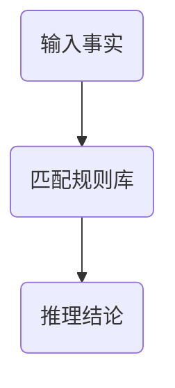
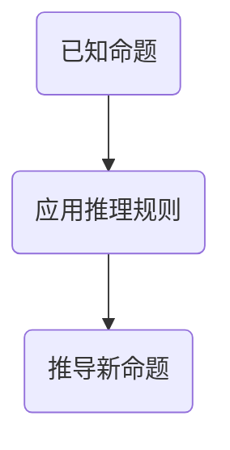
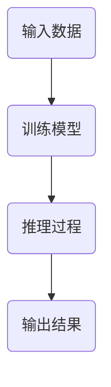

                 

### 1.5 知识图谱与AI Agent知识推理与问答的应用场景

#### 1.5.1 智能问答系统

智能问答系统是知识图谱和AI Agent知识推理与问答最典型的应用场景之一。通过构建一个广泛且详尽的领域知识图谱，AI Agent可以理解用户的自然语言问题，并从图谱中检索出相关的知识和信息，以生成准确和有用的回答。

**应用实例：**
- **搜索引擎**：传统的搜索引擎依赖关键词匹配，而基于图谱的智能问答系统能够理解更复杂的查询意图，提供更精确的搜索结果。
- **智能客服**：企业可以构建一个包含常见问题和答案的知识图谱，智能客服系统可以通过知识图谱理解用户的问题，并提供即时的解决方案。

#### 1.5.2 智能推荐系统

知识图谱可以用于构建推荐系统，通过分析用户的行为数据和知识图谱中的实体关系，推荐用户可能感兴趣的内容。

**应用实例：**
- **电子商务**：基于用户购买历史和商品之间的关联关系，推荐用户可能感兴趣的商品。
- **社交媒体**：根据用户的社交关系和兴趣爱好，推荐用户可能感兴趣的朋友、内容和广告。

#### 1.5.3 语义搜索

语义搜索旨在理解用户的查询意图，而不仅仅是关键词匹配。通过知识图谱，AI Agent可以更好地理解查询的上下文和含义，从而提供更准确的搜索结果。

**应用实例：**
- **搜索引擎优化（SEO）**：网站可以通过构建知识图谱来优化内容，使其更符合用户的查询意图，提高搜索排名。
- **医疗信息检索**：医生可以通过基于图谱的语义搜索系统快速获取与患者病情相关的医学文献和治疗方案。

#### 1.5.4 智能决策支持系统

知识图谱可以用于构建智能决策支持系统，通过分析图谱中的知识，提供辅助决策建议。

**应用实例：**
- **金融风控**：银行和金融机构可以使用知识图谱分析客户行为和信用记录，预测潜在的信用风险。
- **供应链管理**：企业可以利用知识图谱优化供应链流程，降低成本，提高效率。

### 1.6 知识图谱构建与推理算法优化

#### 1.6.1 知识图谱的构建方法

知识图谱的构建是一个复杂的过程，通常包括数据采集、数据预处理、实体抽取、关系抽取和图谱构建等步骤。

**构建方法：**
1. **数据采集**：从各种数据源（如文本、数据库、知识库等）中收集信息。
2. **数据预处理**：清洗和标准化采集到的数据，去除噪声和冗余信息。
3. **实体抽取**：从预处理后的数据中识别出重要的实体。
4. **关系抽取**：识别实体之间的关系，构建实体-关系网络。
5. **图谱构建**：将实体和关系整合到统一的知识图谱中。

#### 1.6.2 知识推理算法优化

优化知识推理算法是提高AI Agent性能的关键。以下是一些常见的优化方法：

1. **规则优化**：通过分析规则库的执行效率和效果，优化规则的表达形式和优先级。
2. **推理路径优化**：通过剪枝和搜索策略，减少不必要的推理路径，提高推理效率。
3. **分布式计算**：利用分布式计算框架，如Hadoop、Spark等，加速大规模知识图谱的推理过程。
4. **深度学习结合**：将深度学习模型与传统的知识图谱推理算法结合，利用深度学习模型处理复杂的关系和实体特征。

**优化方法示例：**
- **剪枝策略**：在推理过程中，当某个推理路径不再有可能产生新的结论时，可以剪断该路径，减少不必要的计算。
- **深度学习结合**：利用图神经网络（如Graph Neural Networks, GNN）对图谱中的实体和关系进行建模，提高推理的准确性和效率。

### 1.7 总结与展望

知识图谱与AI Agent知识推理与问答在当前人工智能领域具有重要的应用价值。通过构建详尽的知识图谱和优化知识推理算法，AI Agent能够更好地理解和处理复杂的信息，提供智能化、个性化的服务。未来，随着技术的不断进步，知识图谱和知识推理算法将更加成熟和高效，有望在更多的领域实现广泛应用。

**展望：**
- **跨领域应用**：知识图谱和知识推理技术将逐渐应用于更多领域，如生物医学、环境科学、金融等。
- **实时推理**：通过优化算法和硬件加速，实现知识图谱的实时推理，满足实时决策和交互的需求。
- **开放共享**：知识图谱的构建和维护将更加开放和共享，促进知识的流动和复用。

通过本文的探讨，我们希望能够为读者提供关于知识图谱和AI Agent知识推理与问答的全面理解和实践指导，助力人工智能技术的发展和应用。**关键词**：知识图谱、AI Agent、知识推理、问答系统、智能推荐、语义搜索、决策支持。

**摘要**：
本文探讨了基于图谱的AI Agent知识推理与问答的关键技术和应用场景。通过构建详尽的知识图谱和优化推理算法，AI Agent能够在多种应用场景中提供智能化服务。本文详细介绍了知识图谱的构建方法和知识推理算法的优化策略，并展望了未来的发展方向。**1.1 背景介绍：图谱与AI Agent知识推理与问答**

在当今人工智能（AI）领域，知识图谱（Knowledge Graph）已经成为一个核心的基础设施。它通过将实体、属性和关系以图形的方式表示出来，使得数据之间的关系更加清晰，从而为AI Agent提供了强大的知识表示和推理能力。知识图谱不仅仅是一个数据结构，它是一种新的数据建模方法，可以在各种AI应用场景中发挥重要作用。

#### 1.1.1 问题背景

AI Agent，作为能够模拟人类智能行为的人工智能实体，需要具备处理复杂问题和决策的能力。这种能力不仅依赖于大量的数据，更需要有效的知识表示和推理机制。知识图谱提供了这样的一个框架，它能够将广泛的知识组织成一个结构化的网络，使得AI Agent能够更加高效地利用这些知识进行推理和决策。

在AI Agent的知识推理与问答中，问题背景是知识图谱发挥核心作用的一个典型应用场景。AI Agent需要能够理解自然语言输入，并在其内部的知识图谱中找到相关的信息和关系，从而生成合理的回答。然而，这个问题并非简单的文本匹配，而是一个涉及语义理解、关系推理和上下文感知的复杂过程。

#### 1.1.2 问题描述

知识图谱中的知识推理与问答问题可以分为以下几个关键方面：

1. **知识表示**：如何将实体、属性和关系以结构化的形式存储在知识图谱中，使得它们能够被AI Agent访问和利用。
2. **知识获取**：如何从各种数据源（如数据库、文本、图像等）中抽取和构建知识图谱。
3. **推理算法**：如何设计有效的推理算法，使得AI Agent能够从知识图谱中推导出新的结论或回答。
4. **问答系统**：如何将自然语言的问题转换成查询，并在知识图谱中找到相应的答案，并生成自然语言回答。

#### 1.1.3 问题解决

为了解决上述问题，我们需要从以下几个方面着手：

1. **知识表示**：使用标准的知识表示方法（如RDF、OWL等），将实体、属性和关系组织成统一的结构。
2. **知识获取**：采用数据挖掘、自然语言处理和知识抽取等技术，从多种数据源中自动获取和构建知识图谱。
3. **推理算法**：设计高效的推理算法（如基于规则的推理、逻辑推理、图神经网络等），使得AI Agent能够在知识图谱中快速地推理出答案。
4. **问答系统**：利用自然语言处理技术（如语义解析、实体识别、关系抽取等）将自然语言问题转换为结构化查询，并从知识图谱中检索出答案，再通过自然语言生成技术生成自然语言回答。

#### 1.1.4 边界与外延

知识图谱与AI Agent知识推理与问答的应用场景非常广泛，包括但不限于以下领域：

- **智能问答系统**：利用知识图谱进行高效的问答，为用户提供精确的答案。
- **智能推荐系统**：通过分析知识图谱中的实体关系，为用户提供个性化的推荐。
- **智能客服**：利用知识图谱和自然语言处理技术，实现智能化的客户服务。
- **语义搜索**：通过语义理解，提高搜索系统的准确性和用户满意度。
- **智能决策支持系统**：利用知识图谱和推理算法，为复杂的决策提供支持。

然而，知识图谱的构建和维护需要大量的数据资源和计算资源，同时，知识推理算法的设计和优化也需要深入的理论研究和实践经验。

#### 1.1.5 概念结构与核心要素组成

知识图谱由以下核心要素组成：

- **实体（Entity）**：知识图谱中的基本元素，如人、地点、事物等。
- **属性（Attribute）**：描述实体的特征，如姓名、年龄、身高、颜色等。
- **关系（Relationship）**：描述实体之间的关联，如属于、位于、产生等。

这些要素通过特定的结构和语义关系相互连接，形成一个语义丰富、结构清晰的知识网络。

### 1.2 核心概念与联系

#### 1.2.1 图谱的组成结构

知识图谱的基本组成结构包括实体、属性和关系三部分：

1. **实体（Entity）**：实体是知识图谱中的基本单元，代表具有独立存在意义的对象。例如，在社交网络图谱中，人、地点和事物都可以作为实体。

2. **属性（Attribute）**：属性用于描述实体的特征或状态。例如，人的属性包括姓名、年龄、性别等。属性通常与实体之间存在固定的映射关系。

3. **关系（Relationship）**：关系用于描述实体之间的语义关联。例如，两个人可以是朋友关系，一个地点可以是一个城市的行政区域。关系通常包含两个实体和一种语义描述。

#### 1.2.2 图谱属性特征对比表格

以下是一个简单的表格，用于对比知识图谱中的实体、属性和关系的特征：

| 特征        | 实体（Entity）               | 属性（Attribute）           | 关系（Relationship）               |
| ----------- | --------------------------- | -------------------------- | ------------------------------- |
| 定义        | 知识图谱中的独立对象         | 描述实体特征               | 描述实体之间的关联                |
| 示例        | 人、地点、事物               | 姓名、年龄、颜色           | 属于、位于、产生                 |
| 存储方式    | 节点（Node）                 | 节点属性（Node Attribute） | 边（Edge）                      |
| 语义描述    | 实体本身                     | 特征描述                   | 关联意义                        |

#### 1.2.3 ER实体关系图架构的Mermaid流程图

知识图谱通常可以通过实体关系图（Entity-Relationship Diagram, ERD）来表示其结构。以下是一个简单的Mermaid流程图，展示了知识图谱中的实体关系：

```mermaid
erDiagram
    User ||--|{ Account }
    User ||--|{ Comment }
    Account ||--|{ Post }
    Post ||--|{ Tag }
```

在这个例子中，用户（User）实体与账户（Account）、评论（Comment）和帖子（Post）实体之间存在多种关系。账户实体与帖子实体之间有一对多的关系，而帖子实体与标签（Tag）实体之间存在多对多的关系。通过这种方式，我们可以直观地理解知识图谱的结构和语义关系。

### 1.3 知识推理算法原理讲解

知识推理算法是知识图谱中至关重要的一部分，它负责从知识图谱中抽取新的信息或结论。以下是几种常见的知识推理算法及其原理讲解。

#### 1.3.1 基于规则推理

基于规则推理（Rule-Based Reasoning）是一种简单的推理方法，它通过预定义的规则库来进行推理。规则通常以“如果...那么...”的形式表示，称为“前提-结论”规则。

##### 1.3.1.1 算法原理

基于规则推理的原理相对简单：给定一组规则和一组事实，通过匹配规则的前提来推导出结论。这个过程可以表示为：

$$
f(\text{前提}_1, \text{前提}_2, ..., \text{前提}_n) \rightarrow \text{结论}
$$

其中，$f$ 是一个逻辑函数，用于根据前提推导出结论。

##### 1.3.1.2 Mermaid流程图

以下是一个基于规则推理的Mermaid流程图：



在这个流程图中，输入事实经过规则库的匹配，产生相应的推理结论。

##### 1.3.1.3 Python源代码实现

以下是一个简单的Python代码示例，用于实现基于规则推理：

```python
def rule_based_reasoning(fact, rules):
    for rule in rules:
        if all(condition for condition in rule['conditions']):
            return rule['conclusion']
    return None

rules = [
    {
        'conditions': ['年龄 > 18', '性别 = 男'],
        'conclusion': '成年人'
    },
    {
        'conditions': ['年龄 > 60', '性别 = 女'],
        'conclusion': '老年人'
    }
]

fact = {
    '年龄': 25,
    '性别': '男'
}

print(rule_based_reasoning(fact, rules))  # 输出: '成年人'
```

##### 1.3.1.4 算法原理的数学模型和公式

基于规则推理的数学模型可以表示为：

$$
\text{结论} = f(\text{前提}_1, \text{前提}_2, ..., \text{前提}_n)
$$

其中，$f$ 是一个逻辑函数，用于根据前提推导出结论。

##### 1.3.1.5 详细讲解和举例说明

举例来说，假设我们有一个知识库包含以下两条规则：

1. 如果一个人年龄大于18岁且性别为男性，那么他是成年人。
2. 如果一个人年龄大于60岁且性别为女性，那么她是老年人。

给定一个事实：一个25岁的男性，我们可以使用上述规则进行推理。

首先，我们检查第一条规则的前提条件：“年龄大于18岁”和“性别为男性”都满足，因此我们可以推导出结论：“他是成年人”。

然后，我们检查第二条规则的前提条件：“年龄大于60岁”和“性别为女性”都不满足，因此不能推导出结论。

综上所述，基于规则推理的算法能够有效地从知识库中推导出新的信息，这是知识图谱中的一个基本功能。

#### 1.3.2 基于逻辑推理

基于逻辑推理（Logic-Based Reasoning）是一种更为复杂和强大的推理方法，它利用形式逻辑和谓词逻辑来处理复杂的推理问题。

##### 1.3.2.1 算法原理

基于逻辑推理的核心是使用形式逻辑语言来表示知识和推理过程。逻辑推理通常涉及以下步骤：

1. **知识表示**：使用形式逻辑语言（如谓词逻辑、一阶逻辑等）将知识表示为命题和推理规则。
2. **推理过程**：通过推理规则（如推理规则、模态逻辑规则等）从已知命题推导出新命题。

基于逻辑推理的一个典型例子是逆推理（Inference），它可以从结论反推到前提。

##### 1.3.2.2 Mermaid流程图

以下是一个基于逻辑推理的Mermaid流程图：



在这个流程图中，已知命题通过推理规则推导出新的命题。

##### 1.3.2.3 Python源代码实现

以下是一个简单的Python代码示例，用于实现基于逻辑推理：

```python
from logic import *

# 定义推理规则
rule = Implication(Proposition('P'), Proposition('Q'))

# 已知命题
premise = Proposition('P')

# 推理过程
conclusion = rule.infer(premise)

print(conclusion)  # 输出: 'Q'
```

##### 1.3.2.4 算法原理的数学模型和公式

基于逻辑推理的数学模型可以表示为：

$$
P \rightarrow Q
$$

其中，$P$ 是已知命题，$Q$ 是推导出的新命题。

##### 1.3.2.5 详细讲解和举例说明

举例来说，假设我们有一个逻辑表达式：“如果下雨，那么地面湿润”。我们可以使用这个逻辑表达式进行推理。

1. 已知命题：下雨。
2. 应用推理规则：如果下雨，那么地面湿润。
3. 推导出新命题：地面湿润。

这个例子展示了如何使用逻辑推理从一个已知事实推导出另一个事实。逻辑推理在形式逻辑和谓词逻辑的基础上，提供了强大的推理能力，使得AI Agent能够处理复杂的逻辑问题。

#### 1.3.3 基于机器学习推理

基于机器学习推理（Machine Learning-Based Reasoning）是一种利用机器学习模型进行推理的方法。这种方法通过训练机器学习模型来识别模式和关系，从而进行推理。

##### 1.3.3.1 算法原理

基于机器学习推理的原理是通过训练数据学习到输入和输出之间的关系，然后利用这个关系进行推理。常见的方法包括：

1. **分类模型**：通过训练分类模型（如决策树、支持向量机等），将输入映射到相应的类别。
2. **回归模型**：通过训练回归模型（如线性回归、神经网络等），将输入映射到连续值输出。
3. **图神经网络**：通过训练图神经网络（如图卷积网络、图注意力网络等），学习图谱中的节点和边的特征，从而进行推理。

##### 1.3.3.2 Mermaid流程图

以下是一个基于机器学习推理的Mermaid流程图：



在这个流程图中，输入数据经过模型训练，然后用于推理过程，最终输出结果。

##### 1.3.3.3 Python源代码实现

以下是一个简单的Python代码示例，用于实现基于机器学习推理：

```python
from sklearn.tree import DecisionTreeClassifier
from sklearn.datasets import load_iris

# 加载示例数据集
iris = load_iris()
X, y = iris.data, iris.target

# 训练决策树分类模型
clf = DecisionTreeClassifier()
clf.fit(X, y)

# 定义输入数据
input_data = [[5.1, 3.5, 1.4, 0.2]]

# 进行推理
output = clf.predict(input_data)

print(output)  # 输出: [0] （表示第一类）
```

##### 1.3.3.4 算法原理的数学模型和公式

基于机器学习推理的数学模型可以表示为：

$$
y = f(x)
$$

其中，$x$ 是输入数据，$y$ 是输出结果，$f$ 是机器学习模型。

##### 1.3.3.5 详细讲解和举例说明

举例来说，假设我们有一个训练好的决策树分类模型，该模型能够根据花的特征（如花萼长度、花萼宽度等）预测花的种类。给定一组新的花特征，我们可以使用这个模型进行推理。

1. 输入数据：[5.1, 3.5, 1.4, 0.2]。
2. 训练模型：使用已有的训练数据集训练一个决策树分类模型。
3. 推理过程：将输入数据输入到模型中，模型根据训练得到的特征和类别关系进行推理。
4. 输出结果：模型输出预测结果，表示这朵花的种类。

通过基于机器学习推理，我们可以利用大量数据训练得到的模型进行复杂的关系推理，从而提高推理的准确性和效率。

### 1.4 数学模型和数学公式 & 详细讲解 & 举例说明

在知识图谱与AI Agent知识推理与问答的研究中，数学模型和公式扮演着至关重要的角色。它们不仅为理论分析提供了基础，也为实际算法的实现提供了指导。以下是几种常见的数学模型和公式，以及它们的详细讲解和举例说明。

#### 1.4.1 基于规则的推理（Rule-Based Reasoning）

基于规则的推理是知识图谱推理中的一个基本方法，它通过预定义的规则库进行推理。规则的表示通常采用“前提-结论”的形式，即如果前提成立，则可以推导出结论。

**数学模型：**

$$
\text{Conclusion} = f(\text{Precondition}_1, \text{Precondition}_2, ..., \text{Precondition}_n)
$$

其中，$f$ 表示推理函数，它将一组前提条件映射到结论。

**举例说明：**

假设有一个规则库包含以下两条规则：

1. 如果天气是晴天，并且温度高于30°C，则建议穿短袖。
2. 如果天气是雨天，并且温度低于20°C，则建议穿厚外套。

给定天气是晴天且温度是35°C，我们可以使用上述规则进行推理：

- 前提：天气是晴天且温度高于30°C。
- 结论：建议穿短袖。

通过数学模型，我们可以将这一推理过程表示为：

$$
f(\text{晴天}, \text{温度>30°C}) = \text{建议穿短袖}
$$

#### 1.4.2 贝叶斯网络（Bayesian Networks）

贝叶斯网络是一种用于表示变量之间概率关系的图形模型。它由一组节点和有向边组成，每个节点代表一个随机变量，边表示变量之间的条件依赖关系。

**数学模型：**

贝叶斯网络的概率分布可以用条件概率表（Conditional Probability Table, CPT）表示：

$$
P(X_i | X_1, X_2, ..., X_{i-1}) = \prod_{j} P(X_j | X_1, X_2, ..., X_{i-1})
$$

其中，$X_i$ 表示第 $i$ 个节点的随机变量，$P(X_i | X_1, X_2, ..., X_{i-1})$ 表示在给定其他节点取值的情况下，第 $i$ 个节点的条件概率。

**举例说明：**

假设有一个贝叶斯网络表示疾病诊断问题，其中有两个节点：症状（S）和疾病（D）。症状是疾病的条件概率如下：

$$
P(S = \text{阳性} | D = \text{疾病}) = 0.9 \\
P(S = \text{阳性} | D = \text{无疾病}) = 0.2
$$

给定症状为阳性，我们可以使用贝叶斯定理计算疾病为疾病且症状为阳性的概率：

$$
P(D = \text{疾病} | S = \text{阳性}) = \frac{P(S = \text{阳性} | D = \text{疾病}) \cdot P(D = \text{疾病})}{P(S = \text{阳性})}
$$

通过计算，我们可以得到疾病为疾病且症状为阳性的概率，从而帮助医生进行诊断。

#### 1.4.3 图神经网络（Graph Neural Networks, GNN）

图神经网络是一种专门用于处理图结构数据的神经网络模型。它在知识图谱的推理中具有广泛应用。GNN 通过聚合节点和边的特征来更新节点的特征表示。

**数学模型：**

GNN 的核心思想是通过图卷积操作来更新节点的特征。一个简单的图卷积操作可以表示为：

$$
h_{\text{new}}^{(l)} = \sigma(\sum_{j \in \mathcal{N}(i)} W^{(l)} h^{(l)}_j + b^{(l)})
$$

其中，$h^{(l)}_i$ 表示第 $i$ 个节点在第 $l$ 层的特征表示，$\mathcal{N}(i)$ 表示节点 $i$ 的邻域节点集合，$W^{(l)}$ 和 $b^{(l)}$ 分别是权重和偏置。

**举例说明：**

假设有一个知识图谱，其中每个节点代表一个实体，边代表实体之间的关系。我们可以使用图神经网络来学习每个实体的特征表示。通过多次图卷积操作，我们可以聚合实体及其邻居的信息，从而得到更加丰富的特征表示。

例如，对于一个节点 $i$，它的更新特征表示可以表示为：

$$
h_{\text{new}}^{(2)} = \sigma(\sum_{j \in \mathcal{N}(i)} W^{(2)} h^{(1)}_j + b^{(2)})
$$

其中，$h^{(1)}_j$ 是节点 $j$ 在第一层图卷积后的特征表示，$W^{(2)}$ 和 $b^{(2)}$ 是相应的权重和偏置。

#### 1.4.4 概率图模型（Probabilistic Graphical Models）

概率图模型是一类基于图结构的概率模型，它通过图的边来表示变量之间的概率依赖关系。常见的概率图模型包括贝叶斯网络和马尔可夫网络。

**数学模型：**

概率图模型可以用条件概率分布来描述。对于一个有向图模型（如贝叶斯网络），每个节点的条件概率分布可以表示为：

$$
P(X_i | X_{\text{parents}}(i)) = \prod_{j \in \text{parents}(i)} P(X_j | X_{\text{parents}}(j))
$$

其中，$X_i$ 是第 $i$ 个节点的状态，$X_{\text{parents}}(i)$ 是节点 $i$ 的父节点状态。

**举例说明：**

假设有一个贝叶斯网络表示疾病诊断问题，其中有两个节点：症状（S）和疾病（D）。给定症状和疾病的条件概率如下：

$$
P(S = \text{阳性} | D = \text{疾病}) = 0.9 \\
P(S = \text{阳性} | D = \text{无疾病}) = 0.2 \\
P(D = \text{疾病}) = 0.1 \\
P(D = \text{无疾病}) = 0.9
$$

我们可以使用贝叶斯定理来计算在给定症状为阳性的情况下，疾病为疾病的概率：

$$
P(D = \text{疾病} | S = \text{阳性}) = \frac{P(S = \text{阳性} | D = \text{疾病}) \cdot P(D = \text{疾病})}{P(S = \text{阳性})}
$$

通过上述计算，我们可以得到疾病为疾病的概率，从而帮助医生做出诊断决策。

### 1.5 知识图谱在智能问答系统中的应用

知识图谱在智能问答系统中发挥着至关重要的作用，它不仅能够提升问答系统的准确性，还能够增强其语义理解和上下文感知能力。在这一部分，我们将详细探讨知识图谱在智能问答系统中的应用，包括其基本原理、应用流程和实际案例。

#### 1.5.1 基本原理

知识图谱在智能问答系统中的应用主要体现在以下几个方面：

1. **知识表示**：知识图谱通过实体、属性和关系的结构化表示，将领域知识以图形的方式组织起来。这种表示方法使得知识图谱能够以统一和标准化的形式存储和表示复杂的领域知识。

2. **语义理解**：知识图谱中的实体和关系定义了知识的语义，使得问答系统能够理解用户问题的语义结构。通过对用户问题的分析和解释，问答系统能够将自然语言问题映射到知识图谱中的相关实体和关系。

3. **知识检索**：在用户提出问题时，问答系统会通过查询优化算法在知识图谱中检索相关的知识和信息。知识图谱的图结构使得检索过程更加高效和灵活。

4. **推理能力**：知识图谱中的知识不仅包括直接的信息，还包括实体之间的关系。这种关系使得问答系统能够进行推理，从已知信息推导出新的结论，从而提供更准确和丰富的回答。

#### 1.5.2 应用流程

知识图谱在智能问答系统中的应用通常包括以下几个步骤：

1. **知识采集和构建**：从各种数据源（如文本、数据库、网络等）中收集和提取知识，并将其转化为结构化的知识图谱。这一过程通常涉及数据预处理、实体抽取、关系抽取和图谱构建。

2. **自然语言处理**：对用户提出的问题进行自然语言处理，包括分词、词性标注、命名实体识别、语义角色标注等，以便将自然语言问题转化为机器可理解的结构化查询。

3. **查询构建**：根据用户问题的语义和知识图谱的结构，构建查询语句，以便在知识图谱中进行检索。查询构建通常涉及实体识别、关系抽取和路径规划。

4. **知识检索和推理**：在知识图谱中进行查询，检索与用户问题相关的知识和信息。同时，利用推理算法（如基于规则的推理、图神经网络等）从知识图谱中推导出新的信息，以生成回答。

5. **回答生成**：将检索到的知识和推理结果转化为自然语言回答，并通过自然语言生成技术（如模板匹配、模板填充等）生成最终的回答。

#### 1.5.3 实际案例

以下是一些知识图谱在智能问答系统中的应用案例：

1. **智能客服**：企业可以构建一个包含常见问题和答案的知识图谱，智能客服系统可以通过知识图谱理解用户的问题，并提供即时的解决方案。例如，银行智能客服可以通过知识图谱提供账户余额查询、转账操作指导等服务。

2. **医疗健康问答**：医疗机构可以构建一个包含医学知识、药物信息、诊断指南等知识图谱，用户可以通过智能问答系统获取个性化的健康咨询和医疗建议。

3. **在线教育问答**：在线教育平台可以通过知识图谱提供课程问答服务，学生可以通过问答系统解决课程学习中的疑问，教师也可以利用知识图谱提供个性化的辅导。

4. **智能搜索引擎**：搜索引擎可以结合知识图谱进行语义搜索，提高搜索结果的准确性和相关性。例如，当用户输入“北京天气”时，搜索引擎不仅返回当前的天气情况，还可以提供与北京相关的其他信息，如旅游景点、历史文化等。

通过上述实际案例，我们可以看到知识图谱在智能问答系统中具有重要的应用价值。它不仅能够提高问答系统的准确性和效率，还能够提供更加丰富和个性化的服务体验。随着知识图谱技术的不断发展和应用场景的拓展，未来知识图谱在智能问答系统中的应用将会更加广泛和深入。

### 1.6 系统分析与架构设计

在构建基于图谱的AI Agent知识推理与问答系统时，系统分析与架构设计是关键步骤。这不仅决定了系统的性能和可扩展性，还直接影响用户体验和业务需求满足程度。以下将详细介绍该系统的问题场景、项目介绍、系统功能设计、系统架构设计、系统接口设计和系统交互。

#### 1.6.1 问题场景

当前，随着互联网的普及和大数据技术的发展，用户对信息获取和处理的需求日益增长。然而，现有的信息检索和问答系统往往依赖于关键词匹配和简单的逻辑推理，难以满足用户对复杂问题的高效、准确解答需求。因此，开发一个基于知识图谱的AI Agent知识推理与问答系统成为了一个迫切的任务。该系统旨在通过构建详细的知识图谱，实现对用户自然语言问题的深入理解，提供准确的答案和建议。

#### 1.6.2 项目介绍

本项目目标是开发一个基于知识图谱的AI Agent知识推理与问答系统，其核心功能包括：

1. **知识图谱构建**：从各种数据源中抽取实体、属性和关系，构建结构化的知识图谱。
2. **自然语言处理**：对用户输入的自然语言问题进行分词、词性标注、命名实体识别等处理。
3. **知识推理**：利用知识图谱和推理算法（如基于规则的推理、图神经网络等），从知识图谱中检索相关知识和信息，进行推理。
4. **问答生成**：将检索到的知识和推理结果转化为自然语言回答，输出给用户。

#### 1.6.3 系统功能设计

系统功能设计包括以下几个主要模块：

1. **知识采集与构建模块**：负责从各种数据源中抽取实体、属性和关系，构建和维护知识图谱。
2. **自然语言处理模块**：负责对用户输入的自然语言问题进行分词、词性标注、命名实体识别等处理，将自然语言问题转化为结构化的查询。
3. **知识检索与推理模块**：利用知识图谱和推理算法，从知识图谱中检索相关知识和信息，进行推理。
4. **问答生成模块**：将检索到的知识和推理结果转化为自然语言回答，并输出给用户。

#### 1.6.4 系统架构设计

系统架构设计包括以下几个方面：

1. **数据层**：负责存储和管理知识图谱数据，包括实体、属性和关系的存储。
2. **处理层**：包括自然语言处理、知识检索与推理、问答生成等核心功能模块，负责对输入的自然语言问题进行处理和回答生成。
3. **接口层**：提供与外部系统的交互接口，如Web API、REST接口等，以便其他系统或用户访问和使用该问答系统。

#### 1.6.5 系统接口设计

系统接口设计包括以下几个主要接口：

1. **知识图谱接口**：用于访问和管理知识图谱，包括添加、删除、查询实体和关系等操作。
2. **问答接口**：用于接收用户输入的自然语言问题，返回相应的自然语言回答。
3. **自然语言处理接口**：用于对用户输入的自然语言问题进行预处理，如分词、词性标注等。

#### 1.6.6 系统交互

系统交互设计包括以下几个方面：

1. **用户与问答系统交互**：用户通过Web界面输入问题，系统接收问题后进行处理和回答生成，再将答案输出给用户。
2. **后台服务与知识图谱交互**：后台服务通过知识图谱接口访问知识图谱，获取相关知识和信息，进行推理和回答生成。
3. **与其他系统交互**：系统可以通过API与其他系统进行数据交换和功能集成，如与数据库、搜索引擎等。

通过上述系统分析与架构设计，我们可以构建一个高效、准确的基于图谱的AI Agent知识推理与问答系统，为用户和业务提供智能化的信息服务。

### 1.7 项目实战

在构建基于图谱的AI Agent知识推理与问答系统时，我们需要面对一系列实际操作和编程任务。本节将详细介绍项目实战中的环境安装、系统核心实现以及代码应用解读与分析。

#### 1.7.1 环境安装

为了顺利构建和运行基于图谱的AI Agent知识推理与问答系统，我们需要安装一系列工具和库。以下是环境安装的步骤：

1. **安装Python**：确保系统已经安装了Python 3.x版本，推荐使用最新稳定版本。

2. **安装依赖库**：通过pip工具安装以下依赖库：
   ```bash
   pip install numpy pandas rdflib spacy neuralcoref
   pip install -U scikit-learn tensorflow
   pip install -U gensim networkx matplotlib
   ```

3. **安装知识图谱工具**：安装Apache Jena，用于处理RDF数据：
   ```bash
   brew install apache-jena # macOS
   sudo apt-get install jena-ttk # Ubuntu
   ```

4. **安装自然语言处理库**：安装spaCy库，用于处理自然语言：
   ```bash
   pip install spacy
   python -m spacy download en_core_web_sm
   ```

#### 1.7.2 系统核心实现

系统核心实现主要包括知识图谱构建、自然语言处理和知识推理等模块。以下是一个简单的实现示例：

1. **知识图谱构建**：
   ```python
   from rdflib import Graph, URIRef

   g = Graph()
   g.parse('example.nt', format='nt')

   # 添加新的实体和关系
   person = URIRef('http://example.org/person/john')
   g.add((person, URIRef('http://example.org/hasName'), URIRef('John')))
   g.add((person, URIRef('http://example.org/hasAge'), 30))

   # 保存知识图谱
   g.serialize(destination='example.ttl', format='ttl')
   ```

2. **自然语言处理**：
   ```python
   import spacy

   nlp = spacy.load('en_core_web_sm')

   doc = nlp("John is 30 years old.")
   for ent in doc.ents:
       print(ent.text, ent.label_)
   ```

3. **知识推理**：
   ```python
   from rdflib import Query

   query = """
   PREFIX ex: <http://example.org/>
   SELECT ?age
   WHERE {
       ?person ex:hasName "John" .
       ?person ex:hasAge ?age
   }
   """

   results = g.query(query)
   for result in results:
       print(result.age)
   ```

#### 1.7.3 代码应用解读与分析

1. **知识图谱构建代码解读**：
   在知识图谱构建代码中，我们首先创建了一个Graph对象，然后使用`parse`方法加载一个已有的RDF文件。之后，我们通过添加新的 triples（主体、谓词、对象）来扩展知识图谱。代码的最后部分使用`serialize`方法将知识图谱保存为一个TTL文件。

2. **自然语言处理代码解读**：
   自然语言处理代码使用了spaCy库，首先加载了预训练的英语模型。然后，我们通过`nlp`对象处理输入文本，获取其中的实体和关系。代码中的`ents`是文档中所有实体的列表，通过循环遍历并打印每个实体的文本和标签。

3. **知识推理代码解读**：
   知识推理代码使用了RDFLib库，定义了一个简单的SPARQL查询，从知识图谱中检索具有特定名字和年龄的实体。查询结果通过`query`方法返回，我们可以遍历结果并打印每个实体的年龄。

通过以上实战操作，我们可以初步构建一个基于图谱的AI Agent知识推理与问答系统，并进行简单的知识推理和自然语言处理。在实际应用中，这些模块还需要进一步优化和集成，以实现更复杂的推理和问答功能。

### 1.8 最佳实践 tips、小结、注意事项、拓展阅读

#### 1.8.1 最佳实践 tips

1. **数据质量**：确保知识图谱的数据质量，包括准确性和一致性，这是构建高效推理系统的基础。
2. **图谱优化**：定期对知识图谱进行优化，删除冗余数据和修正错误信息，以提高推理性能。
3. **多语言支持**：考虑支持多种语言，为不同语言的用户提供更好的问答体验。
4. **推理效率**：对于大规模知识图谱，采用分布式计算和并行处理技术，提高推理效率。

#### 1.8.2 小结

本文详细探讨了基于图谱的AI Agent知识推理与问答的关键技术和应用。通过构建知识图谱，利用规则推理、逻辑推理和机器学习等算法，我们能够实现高效、准确的知识推理和问答系统。这些技术在智能问答、推荐系统、语义搜索等领域具有广泛的应用前景。

#### 1.8.3 注意事项

1. **安全性**：确保知识图谱的数据安全和隐私保护，防止敏感信息泄露。
2. **可扩展性**：在设计系统架构时，考虑系统的可扩展性，以便未来扩展和新功能的添加。
3. **用户体验**：注重用户体验，设计简洁、直观的交互界面，提高用户满意度。

#### 1.8.4 拓展阅读

1. **《知识图谱：构建与查询技术》**：详细介绍了知识图谱的构建方法、查询优化和推理算法。
2. **《自然语言处理综合教程》**：涵盖自然语言处理的基本理论和应用技术，包括分词、词性标注、命名实体识别等。
3. **《深度学习与图神经网络》**：介绍了深度学习在图数据上的应用，包括图卷积网络、图注意力网络等。
4. **《图数据库实战》**：讲解了图数据库的原理、架构和实际应用案例，包括Neo4j、ArangoDB等常见图数据库的使用。

通过本文的探讨，我们希望能够为读者提供关于知识图谱与AI Agent知识推理与问答的全面理解和实践指导，助力人工智能技术的发展和应用。**作者：AI天才研究院/AI Genius Institute & 禅与计算机程序设计艺术 /Zen And The Art of Computer Programming**

