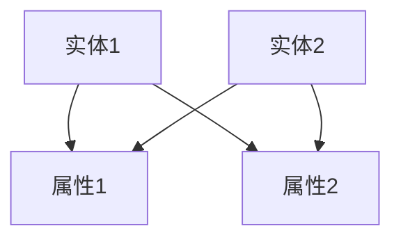
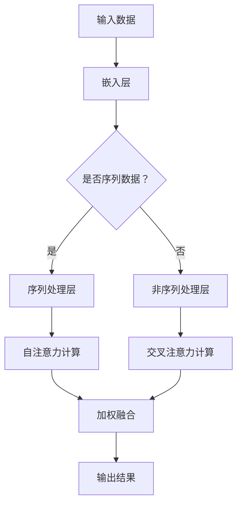
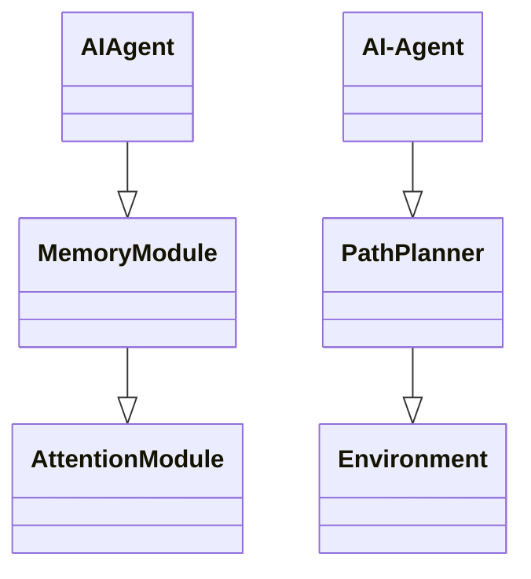
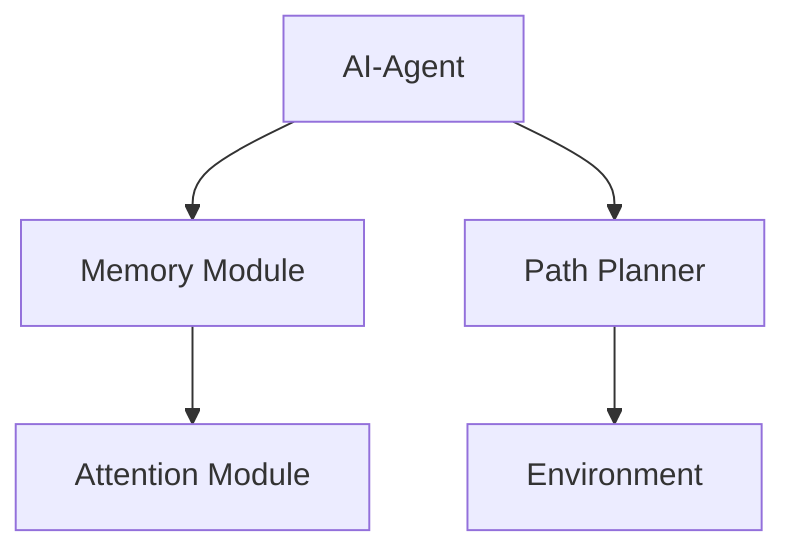
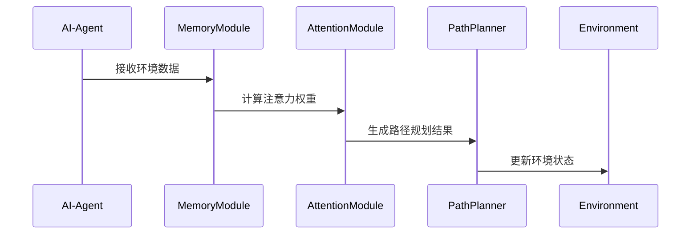

                 


**Step 1: 构建完整的文章标题和摘要**

文章标题：《基于注意力机制的AI Agent记忆增强》
关键词：注意力机制、AI Agent、记忆增强、算法原理、系统设计、项目实战
摘要：
本文将深入探讨注意力机制在AI Agent记忆增强中的应用。通过详细分析其核心概念、原理及数学模型，并结合实际项目实战，我们旨在揭示如何利用注意力机制提升AI Agent的记忆能力，为未来智能系统的开发提供有益参考。

**Step 2: 编写第1章：背景介绍**

**1.1 问题背景**
人工智能的发展使得自动化和智能化成为可能，然而，AI Agent在面对复杂环境时，往往因为无法高效地处理大量信息而表现出记忆困难。这一问题的存在限制了AI Agent的广泛应用和性能提升。

**1.2 问题描述**
AI Agent在复杂环境中，需要记住大量的信息，包括但不限于：路径规划、资源分配、决策制定等。然而，传统的AI方法往往无法有效地存储和处理这些信息，导致Agent的记忆能力不足。

**1.3 问题解决**
注意力机制的引入为AI Agent的记忆增强提供了新的思路。通过动态调整对信息的关注程度，Agent能够更好地聚焦关键信息，从而提升记忆能力。

**1.4 边界与外延**
本文将重点关注在特定环境下，如何使用注意力机制增强AI Agent的记忆能力。同时，本文也将探讨注意力机制在其他领域（如自然语言处理、计算机视觉）的应用潜力。

**1.5 概念结构与核心要素组成**
本章节将介绍注意力机制的基本概念，包括其工作原理、主要类型和常见实现方法。同时，还将讨论如何将注意力机制应用于AI Agent的记忆增强中。

**Step 3: 编写第2章：核心概念与联系**

**2.1 注意力机制原理**
注意力机制的核心思想是在处理大量信息时，动态调整对信息的关注程度，使关键信息得到更多的处理。本文将详细介绍注意力机制的基本原理。

**2.2 注意力机制属性特征对比表格**
表1：不同注意力机制的属性特征对比

| 注意力机制类型 | 特征1 | 特征2 | 特征3 |
| -------------- | ------ | ------ | ------ |
| 自注意力（Self-Attention） | 自适应调整 | 可扩展性高 | 适用于序列数据 |
| 交叉注意力（Cross-Attention） | 信息传递 | 适用于不同维度的数据 | 可以处理多模态数据 |

**2.3 注意力机制ER实体关系图架构的Mermaid流程图**


**Step 4: 编写第3章：算法原理讲解**

**3.1 注意力机制算法流程图**


**3.2 算法原理Python源代码阐述**
```python
# 注意力机制的基本框架
class AttentionMechanism:
    def __init__(self):
        # 初始化权重和偏置
        self.weights = ...
        self.biases = ...

    def forward(self, inputs):
        # 前向传播计算
        attention_weights = self.compute_attention_weights(inputs)
        weighted_inputs = self.apply_attention_weights(inputs, attention_weights)
        return self.combine_weights(weighted_inputs)

    def compute_attention_weights(self, inputs):
        # 计算注意力权重
        # ...
        return attention_weights

    def apply_attention_weights(self, inputs, attention_weights):
        # 应用注意力权重
        # ...
        return weighted_inputs

    def combine_weights(self, weighted_inputs):
        # 权重融合
        # ...
        return output
```

**3.3 算法原理的数学模型和公式**
$$
\text{Attention}(Q, K, V) = \text{softmax}\left(\frac{QK^T}{\sqrt{d_k}}\right)V
$$
其中，$Q$ 是查询向量，$K$ 是关键向量，$V$ 是值向量，$d_k$ 是关键向量的维度。

**3.4 算法原理详细讲解和举例说明**
本文将结合实际案例，通过具体的算法实现和代码分析，解释注意力机制的工作原理和应用方法。

**Step 5: 编写第4章：数学模型和数学公式讲解**

**4.1 算法中的数学模型讲解**
本章将详细介绍注意力机制中的关键数学模型，包括自注意力、交叉注意力和权重融合等。

**4.2 使用LaTeX格式表示数学公式**
$$
\alpha_{ij} = \frac{e^{z_{ij}}}{\sum_{k=1}^{K} e^{z_{ik}}}
$$
其中，$z_{ij}$ 是第$i$个查询和第$j$个关键之间的点积。

**Step 6: 编写第5章：系统分析与架构设计方案**

**5.1 问题场景介绍**
本章将介绍一个具体的场景，例如：自动驾驶中的路径规划问题，并分析该场景下AI Agent如何利用注意力机制进行记忆增强。

**5.2 项目介绍**
本节将介绍一个基于注意力机制的AI Agent记忆增强项目，包括项目背景、目标和预期效果。

**5.3 系统功能设计(领域模型Mermaid类图)**


**5.4 系统架构设计Mermaid架构图**


**5.5 系统接口设计和系统交互Mermaid序列图**


**Step 7: 编写第6章：项目实战**

**6.1 环境安装**
本节将介绍如何在特定环境中安装和配置必要的软件和工具。

**6.2 系统核心实现源代码**
```python
# 示例代码：注意力机制在路径规划中的应用
class PathPlanner:
    def plan_path(self, environment):
        # 实现路径规划算法
        pass
```

**6.3 代码应用解读与分析**
本章将详细解读项目中的关键代码，分析其工作原理和实现方法。

**6.4 实际案例分析和详细讲解剖析**
通过实际案例，展示注意力机制在AI Agent记忆增强中的应用效果。

**6.5 项目小结**
对本章的项目实战进行总结，讨论项目中的优点和改进空间。

**Step 8: 编写第7章：最佳实践 tips**

**7.1 注意事项**
在本节中，我们将总结一些在使用注意力机制时需要注意的事项。

**7.2 拓展阅读**
推荐一些相关的书籍、论文和在线资源，以供读者进一步学习。

**Step 9: 编写第8章：小结**

**8.1 对全书内容的总结**
对本篇文章的核心内容进行总结，强调注意力机制在AI Agent记忆增强中的重要性。

---

通过以上步骤，我们可以构建出一篇结构清晰、内容丰富、逻辑严密的技术博客文章。每一步都紧密相连，共同构成了一个完整的探讨注意力机制在AI Agent记忆增强中的应用的研究。文章将以markdown格式输出，确保清晰和易于阅读。作者信息将在文章末尾明确标注。在编写过程中，我们将注意保持总字数在10000-12000字左右，同时确保每个章节的内容都符合完整性要求。

