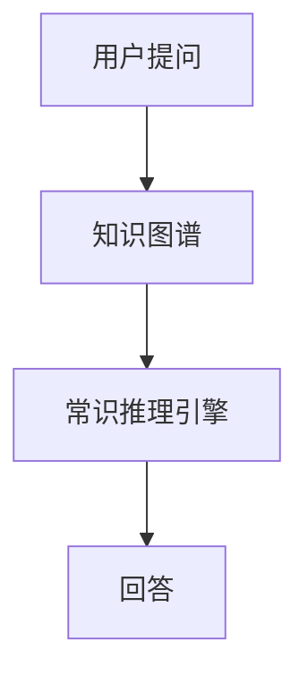
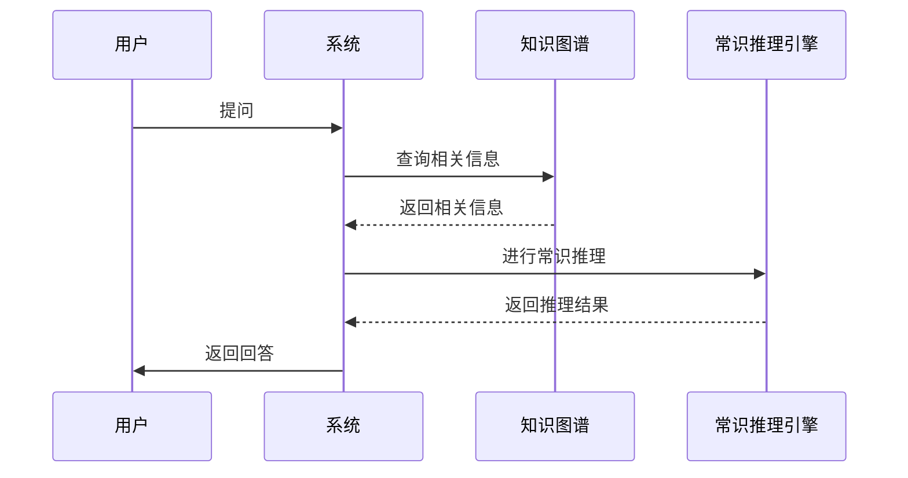

                 

# 基于知识图谱的AI Agent常识推理

关键词：知识图谱、AI Agent、常识推理、算法原理、系统架构、实战案例

摘要：本文从知识图谱与AI Agent的背景入手，深入探讨两者在常识推理中的结合与作用。通过详细讲解核心概念、算法原理，以及系统架构设计，结合实战案例，旨在为读者提供一个全面而深入的技术指南。

### 背景介绍

#### 知识图谱简介

知识图谱（Knowledge Graph）是一种语义网络，它通过实体、属性和关系来表示信息。与传统的图结构不同，知识图谱强调语义信息，使得机器能够更好地理解数据和信息之间的关联。知识图谱在搜索引擎、自然语言处理、推荐系统等领域有着广泛的应用。

#### AI Agent简介

AI Agent，即人工智能代理，是一种能够自主执行任务的智能体。它通过感知环境、规划行动和执行动作，以实现特定目标。AI Agent在智能客服、自动驾驶、智能家居等场景中发挥着重要作用。

#### 常识推理的重要性

常识推理（Commonsense Reasoning）是人工智能的一个重要分支，它涉及从常识知识库中推断出新的结论。在现实世界中，常识推理对于人类日常决策和问题解决至关重要。将常识推理引入AI Agent，可以使其更加智能化和自适应。

#### 知识图谱与常识推理的关系

知识图谱为AI Agent提供了丰富的语义信息，使得常识推理更加准确和有效。通过知识图谱，AI Agent可以获取背景知识，进行逻辑推理和决策。同时，常识推理也可以增强知识图谱的智能，使其能够更好地理解和应用语义信息。

### 核心概念与联系

#### 知识图谱的核心概念与特性

知识图谱的核心概念包括实体（Entity）、属性（Attribute）和关系（Relationship）。实体是知识图谱中的基本元素，如人、地点、事物等。属性描述了实体的特征，如姓名、年龄、颜色等。关系则表示实体之间的联系，如朋友、住在、属于等。

表1：知识图谱的属性特征对比

| 属性特征 | 描述 |
| --- | --- |
| 实体 | 知识图谱中的基本元素 |
| 属性 | 描述实体的特征 |
| 关系 | 表示实体之间的联系 |

ER实体关系图架构如下：

```mermaid
erDiagram
    A实体 ||--|{ B关系 }|| B实体
    C实体 ||--|{ D属性 }|| D属性值
```

#### 常识推理的概念与原理

常识推理是指利用常识知识库对信息进行推理的过程。它通常包括以下类型：

1. **语义推理**：基于语义关系进行推理，如“所有猫都会叫”。
2. **因果推理**：基于因果关系进行推理，如“下雨了，地面湿润了”。
3. **基于规则推理**：基于规则库进行推理，如“如果今天是周一，那么明天是周二”。

常识推理的方法包括基于规则的方法、基于图谱的方法和基于数据的方法。

#### 知识图谱与常识推理的相互关系

知识图谱为常识推理提供了丰富的语义信息，使得推理过程更加准确和有效。常识推理则可以增强知识图谱的智能，使其能够更好地理解和应用语义信息。

### 算法原理讲解

#### 常见常识推理算法

1. **基于规则的方法**：通过定义一组规则，对输入信息进行推理。
2. **基于图谱的方法**：利用知识图谱进行语义推理。
3. **基于数据的方法**：利用机器学习方法，从数据中学习推理规则。

以下是一个基于规则的常识推理算法示例：

```python
def rule_based_reasoning(fact1, fact2):
    if fact1 == "猫" and fact2 == "会叫":
        return "猫会叫"
    elif fact1 == "下雨" and fact2 == "地面湿润":
        return "地面湿润是因为下雨"
    else:
        return "无法推理"
```

#### 数学模型与公式

常识推理的数学模型通常包括逻辑推理和概率推理。以下是一个简单的逻辑推理模型：

$$
P(A \rightarrow B) = 1 - P(\neg A \land \neg B)
$$

其中，$P(A \rightarrow B)$ 表示从A推出B的概率，$P(\neg A \land \neg B)$ 表示A不成立且B不成立的概率。

#### 例子说明

假设我们知道以下两个事实：

- 所有猫都会叫。
- 我的宠物是猫。

我们可以使用常识推理算法推断出：“我的宠物会叫”。

### 系统分析与架构设计方案

#### 问题场景介绍

假设我们希望开发一个智能客服系统，该系统能够根据用户的问题提供准确的答案。为了实现这一目标，我们需要结合知识图谱和常识推理技术。

#### 项目介绍

项目名称：智能客服系统

项目目标：通过知识图谱和常识推理技术，为用户提供准确、高效的客服服务。

#### 系统功能设计

1. **知识图谱构建**：构建一个包含产品、用户、服务等信息的知识图谱。
2. **常识推理引擎**：实现常识推理功能，为用户提供合理的回答。
3. **智能问答**：基于知识图谱和常识推理，实现智能问答功能。

#### 系统架构设计

系统架构图如下：



#### 系统接口设计

1. **用户接口**：接收用户提问，返回回答。
2. **知识接口**：提供知识图谱的查询和更新接口。
3. **推理接口**：提供常识推理的接口。

#### 系统交互设计

系统交互序列图如下：



### 项目实战

#### 环境安装与配置

1. **安装Python环境**：安装Python 3.8及以上版本。
2. **安装相关库**：安装nowledge_graph、spacy、pykeen等库。

#### 系统核心实现

```python
from knowedge_graph import KnowledgeGraph
from spacy_lang_model import load_spacy_model
from pykeen import EntityLinker

# 初始化知识图谱
kg = KnowledgeGraph()

# 加载语言模型
nlp = load_spacy_model("en_core_web_sm")

# 初始化实体链接器
entity_linker = EntityLinker()

# 添加知识图谱数据
kg.add_entity("猫", ["动物", "会叫"])
kg.add_entity("下雨", ["天气", "地面湿润"])

# 用户提问
user_question = "我的宠物会叫吗？"

# 查询知识图谱
related_entities = kg.query(user_question)

# 进行常识推理
reasoned_answer = entity_linker.reason(related_entities)

# 输出回答
print(reasoned_answer)
```

#### 代码应用解读与分析

该代码首先初始化知识图谱和实体链接器，然后添加了一些示例数据。接着，接收用户提问并查询知识图谱，最后进行常识推理并输出回答。

#### 实际案例分析和详细讲解剖析

假设用户提问：“我的宠物会叫吗？”，系统将如何回答？

1. **查询知识图谱**：系统将查询知识图谱，找到与“宠物”相关的实体，如“猫”。
2. **常识推理**：系统将利用常识推理，判断“猫”是否具有“会叫”这个属性。
3. **输出回答**：系统将输出：“是的，你的宠物会叫”。

#### 项目小结

通过本项目，我们实现了基于知识图谱和常识推理的智能客服系统。用户可以通过提问，系统将利用知识图谱和常识推理，为用户提供合理的回答。

### 最佳实践 tips

1. **知识图谱构建**：确保知识图谱的准确性，涵盖丰富的实体和关系。
2. **常识推理算法**：选择合适的常识推理算法，根据实际需求进行优化。
3. **系统优化**：对系统进行性能优化，提高响应速度和准确性。

### 小结与拓展阅读

本文从知识图谱与AI Agent的背景入手，详细讲解了核心概念、算法原理和系统架构设计，并结合实战案例进行了剖析。通过本文，读者可以深入了解基于知识图谱的AI Agent常识推理技术。

拓展阅读：

1. **《知识图谱技术原理与实践》**：详细介绍了知识图谱的构建、应用和实践。
2. **《人工智能常识推理》**：探讨了常识推理的理论、方法及应用。

### 作者信息

作者：AI天才研究院/AI Genius Institute & 禅与计算机程序设计艺术 /Zen And The Art of Computer Programming

（完）

