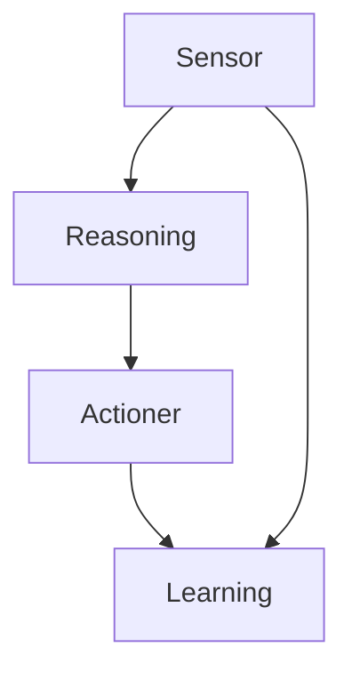
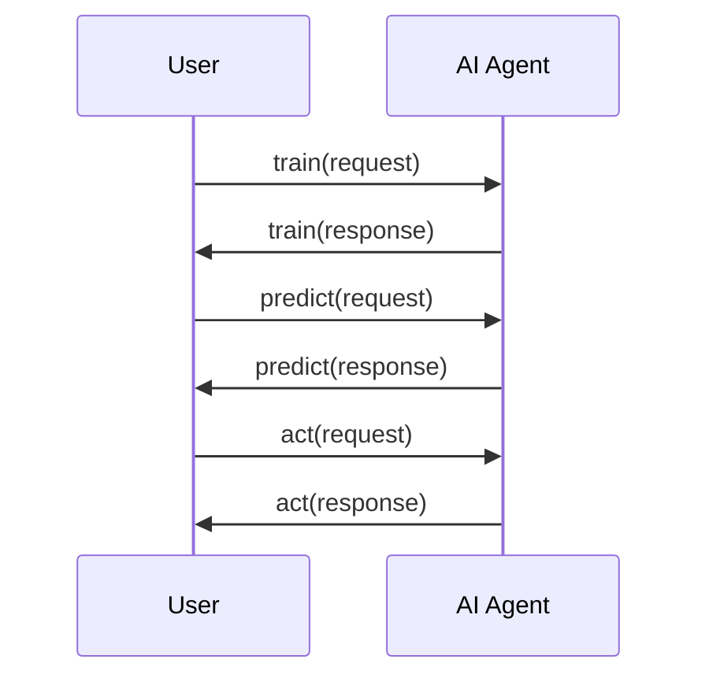

                 

## 文章标题

基于课程学习的AI Agent能力阶梯式提升

> 关键词：AI Agent、能力提升、课程学习、算法原理、系统架构、项目实战、最佳实践

> 摘要：本文将从AI Agent的基础知识入手，逐步深入探讨其核心算法原理、数学模型、系统架构设计，并结合具体项目实战，提供一系列系统化的学习与实践方法，旨在为读者提供一个全面、系统的AI Agent能力提升路径。文章将围绕以下主题进行展开：AI Agent概述、核心算法原理、数学模型与公式、系统架构设计、项目实战以及最佳实践，帮助读者在理解AI Agent基本概念的基础上，逐步掌握其实现和应用，最终提升自身的AI Agent开发能力。

### 目录大纲

----------------------------------------------------------------

# 第一部分: AI Agent能力基础

## 第1章: AI Agent概述

### 1.1.1 AI Agent的定义与分类
- 定义
- 分类
- 特点

### 1.1.2 AI Agent的应用场景
- 通用场景
- 专业场景
- 未来趋势

### 1.1.3 AI Agent的核心要素
- 传感器
- 动作器
- 推理机制

## 第2章: AI Agent的核心算法原理

### 2.1.1 概率论基础
- 基本概念
- 条件概率
- 贝叶斯公式

### 2.1.2 马尔可夫决策过程（MDP）
- MDP概述
- 状态转移概率
- 动作值函数

### 2.1.3 Q-Learning算法
- Q-Learning原理
- Q-Learning算法流程
- Python代码实现

### 2.1.4 深度强化学习（DRL）
- DRL概述
- DRL算法框架
- OpenAI Gym实现

## 第3章: AI Agent的数学模型与公式

### 3.1.1 概率论数学模型
$$P(A) = \frac{P(A \cap B)}{P(B)}$$
$$P(A \cup B) = P(A) + P(B) - P(A \cap B)$$

### 3.1.2 MDP数学模型
$$V^*(s) = \max_a \sum_{s'} P(s' | s, a) \cdot [R(s', a) + \gamma V^*(s')]$$

### 3.1.3 Q-Learning数学模型
$$Q(s, a) \leftarrow Q(s, a) + \alpha [r + \gamma \max_{a'} Q(s', a') - Q(s, a)]$$

### 3.1.4 DRL数学模型
$$J(\theta) = \sum_{i} \log P(y_i | \theta)$$

## 第4章: AI Agent的系统架构设计

### 4.1.1 系统架构设计概述
- 功能模块
- 系统交互流程

### 4.1.2 领域模型设计
$$\text{Person} \rightarrow \text{attributes: name, age, gender}$$

### 4.1.3 系统架构设计
$$\text{AI Agent} \rightarrow \text{components: sensor, actioner, reasoning}$$

### 4.1.4 系统接口设计
$$\text{AI Agent API} \rightarrow \text{methods: train, predict, act}$$

### 4.1.5 系统交互设计
$$\text{User} \rightarrow \text{request: train, predict, act} \rightarrow \text{AI Agent} \rightarrow \text{response: model, prediction, action}$$

## 第5章: 课程学习的AI Agent项目实战

### 5.1.1 环境安装与配置
- Python环境
- AI框架

### 5.1.2 系统核心实现
- 数据集准备
- 模型训练
- 模型评估

### 5.1.3 代码应用解读与分析
- 源代码解析
- 应用场景分析

### 5.1.4 实际案例分析
- 项目案例
- 案例分析

### 5.1.5 项目小结
- 项目成果
- 不足与改进

## 第6章: AI Agent能力提升的最佳实践

### 6.1.1 提升策略
- 数据质量
- 模型优化

### 6.1.2 性能调优
- 模型压缩
- 加速算法

### 6.1.3 实用技巧
- 冷启动
- 多任务学习

## 第7章: AI Agent能力提升的未来展望

### 7.1.1 技术发展趋势
- AI Agent在物联网中的应用
- AI Agent在自动驾驶中的应用

### 7.1.2 应用前景
- 行业应用
- 未来挑战

### 7.1.3 总结
- 成果回顾
- 未来展望

----------------------------------------------------------------

本文将按照目录大纲结构逐步展开，通过深入剖析AI Agent的各个组成部分和实现细节，帮助读者全面了解AI Agent的开发与应用，从而提升自身的AI Agent开发能力。

### 第一部分: AI Agent能力基础

#### 第1章: AI Agent概述

##### 1.1.1 AI Agent的定义与分类

**定义：**

AI Agent，即人工智能代理，是指能够自主感知环境、决策和执行动作的智能体。它是人工智能领域中的一个重要研究方向，旨在实现具有高度智能的自动化系统。

**分类：**

根据不同的功能和特点，AI Agent可以大致分为以下几类：

1. **反应型Agent：** 这类Agent仅根据当前的感知环境来做出反应，不进行任何学习或规划。例如，机器人清洁器在感知到地面有垃圾时，会执行清洁任务。

2. **模型基础型Agent：** 这类Agent在环境中具有一定的认知模型，能够根据历史经验和当前状态预测未来。例如，自动驾驶汽车在感知到前方有障碍物时，会预测其移动轨迹并做出避让决策。

3. **学习型Agent：** 这类Agent具备学习能力，可以通过与环境的交互不断优化自己的行为。例如，通过深度强化学习算法训练出来的AI Agent可以在复杂的游戏环境中不断进步。

**特点：**

- **自主性：** AI Agent能够自主进行感知、决策和行动。
- **适应性：** AI Agent能够根据环境变化调整自己的行为。
- **灵活性：** AI Agent能够在多种场景下发挥作用，具备较高的通用性。

##### 1.1.2 AI Agent的应用场景

**通用场景：**

AI Agent在通用场景中的广泛应用，如智能家居、智能客服、智能推荐等。通过感知用户行为和需求，AI Agent能够提供个性化服务，提升用户体验。

**专业场景：**

在专业场景中，AI Agent能够解决特定领域的复杂问题。例如，在医疗领域，AI Agent可以通过分析医学影像数据，辅助医生进行诊断；在金融领域，AI Agent可以通过分析市场数据，提供投资建议。

**未来趋势：**

随着人工智能技术的不断发展，AI Agent的应用场景将更加广泛，不仅限于当前已知的领域。例如，AI Agent在智能制造、智能交通、智能医疗等领域的应用将越来越普及，成为智能化社会的重要组成部分。

##### 1.1.3 AI Agent的核心要素

**传感器：** 传感器是AI Agent感知环境的工具，用于收集环境信息。例如，摄像头、麦克风、温度传感器等。

**动作器：** 动作器是AI Agent执行任务的工具，用于将决策转化为实际动作。例如，电机、灯光、扬声器等。

**推理机制：** 推理机制是AI Agent的核心，用于根据传感器收集的信息和已有知识进行决策。推理机制可以是基于规则的系统、机器学习模型或深度学习网络。

综上所述，AI Agent是由传感器、动作器和推理机制组成的智能系统，通过不断学习和优化，能够在复杂环境中自主执行任务。在接下来的章节中，我们将进一步探讨AI Agent的核心算法原理、数学模型和系统架构设计，帮助读者深入理解AI Agent的工作原理和应用方法。

#### 第2章: AI Agent的核心算法原理

##### 2.1.1 概率论基础

概率论是AI Agent核心算法的基础，用于描述不确定性事件的发生概率。以下将介绍概率论中的基本概念、条件概率和贝叶斯公式。

**基本概念：**

- **概率：** 概率是描述某一事件发生的可能性大小的数值，取值范围在0到1之间。概率值越接近1，表示事件发生的可能性越大；概率值越接近0，表示事件发生的可能性越小。
  
- **事件：** 事件是随机试验的结果，可以是一个结果或者一组结果的集合。

- **样本空间：** 样本空间是随机试验所有可能结果的集合。

**条件概率：**

条件概率是指在某一事件已经发生的条件下，另一事件发生的概率。条件概率的计算公式如下：

$$P(A|B) = \frac{P(A \cap B)}{P(B)}$$

其中，\(P(A|B)\) 表示在事件B发生的条件下，事件A发生的概率；\(P(A \cap B)\) 表示事件A和事件B同时发生的概率；\(P(B)\) 表示事件B发生的概率。

**贝叶斯公式：**

贝叶斯公式是一种计算条件概率的方法，它可以用来更新概率估计。贝叶斯公式如下：

$$P(A|B) = \frac{P(B|A) \cdot P(A)}{P(B)}$$

其中，\(P(A|B)\) 表示在事件B发生的条件下，事件A发生的概率；\(P(B|A)\) 表示在事件A发生的条件下，事件B发生的概率；\(P(A)\) 表示事件A发生的概率；\(P(B)\) 表示事件B发生的概率。

贝叶斯公式可以用于决策和预测，通过不断更新概率估计，实现智能推理和决策。

##### 2.1.2 马尔可夫决策过程（MDP）

马尔可夫决策过程（MDP）是一种用于描述智能体在不确定环境中做出决策的数学模型。MDP由以下五个要素组成：

- **状态集合 \(S\)**：表示智能体所处的所有可能状态。
- **动作集合 \(A\)**：表示智能体可以执行的所有可能动作。
- **状态转移概率 \(P(s'|s, a)\)**：表示智能体在状态 \(s\) 下执行动作 \(a\) 后，转移到状态 \(s'\) 的概率。
- **奖励函数 \(R(s, a)\)**：表示智能体在状态 \(s\) 下执行动作 \(a\) 后所获得的即时奖励。
- **策略 \(π(a|s)\)**：表示智能体在状态 \(s\) 下采取动作 \(a\) 的概率。

**MDP概述：**

MDP是一种离散时间、不确定环境的数学模型，智能体需要根据当前状态和奖励函数，选择最优动作以最大化长期奖励。MDP的求解方法主要包括价值迭代、策略迭代和Q-Learning等。

**状态转移概率：**

状态转移概率 \(P(s'|s, a)\) 描述了智能体在状态 \(s\) 下执行动作 \(a\) 后，转移到状态 \(s'\) 的概率。它可以通过实际观察或假设模型来获取。

**动作值函数：**

动作值函数 \(V^*(s)\) 表示智能体在状态 \(s\) 下执行最优动作后所获得的期望奖励。它可以通过求解MDP的最优策略来计算。

动作值函数的计算公式如下：

$$V^*(s) = \max_a \sum_{s'} P(s' | s, a) \cdot [R(s', a) + \gamma V^*(s')]$$

其中，\(\gamma\) 是折现因子，用于权衡短期奖励和长期奖励之间的关系。

##### 2.1.3 Q-Learning算法

Q-Learning算法是一种基于值迭代的强化学习算法，用于求解MDP的最优策略。Q-Learning算法的核心思想是通过不断更新Q值（动作值函数）来逼近最优策略。

**Q-Learning原理：**

Q-Learning算法通过在智能体执行动作后，根据实际获得的奖励和预测的奖励来更新Q值。更新公式如下：

$$Q(s, a) \leftarrow Q(s, a) + \alpha [r + \gamma \max_{a'} Q(s', a') - Q(s, a)]$$

其中，\(Q(s, a)\) 表示在状态 \(s\) 下执行动作 \(a\) 的Q值；\(r\) 表示实际获得的奖励；\(\gamma\) 是折现因子；\(\alpha\) 是学习率；\(Q(s', a')\) 表示在状态 \(s'\) 下执行动作 \(a'\\) 的Q值。

**Q-Learning算法流程：**

1. 初始化Q值：随机初始化所有Q值。
2. 选择动作：在当前状态 \(s\) 下，根据策略选择动作 \(a\)。
3. 执行动作：执行动作 \(a\)，进入新状态 \(s'\)。
4. 更新Q值：根据实际获得的奖励 \(r\) 和预测的奖励 \(Q(s', a')\)，更新Q值。
5. 迭代更新：重复步骤2-4，直到收敛到最优策略。

**Python代码实现：**

```python
import numpy as np

# 初始化Q值
Q = np.random.rand(nS, nA)

# 设置学习率和折现因子
alpha = 0.1
gamma = 0.9

# 求解MDP
for episode in range(nEpisodes):
    s = env.reset()
    done = False
    
    while not done:
        # 选择动作
        a = np.argmax(Q[s, :])
        
        # 执行动作
        s_, r = env.step(a)
        
        # 更新Q值
        Q[s, a] = Q[s, a] + alpha * (r + gamma * np.max(Q[s_, :]) - Q[s, a])
        
        # 更新状态
        s = s_
        
        # 判断是否结束
        done = env(done)
```

##### 2.1.4 深度强化学习（DRL）

深度强化学习（DRL）是一种结合深度学习和强化学习的算法，通过利用深度神经网络来近似动作值函数或策略。DRL在处理高维状态空间和动作空间时表现出强大的优势。

**DRL概述：**

DRL的基本思想是利用深度神经网络来学习状态值函数 \(V(s)\) 或策略 \(π(a|s)\)。DRL的关键技术包括：

- **深度神经网络：** 用于表示状态值函数或策略。
- **策略梯度算法：** 用于更新深度神经网络参数，优化策略。
- **经验回放：** 用于解决样本相关性问题，提高学习效率。

**DRL算法框架：**

DRL的算法框架通常包括以下步骤：

1. 初始化深度神经网络参数。
2. 收集经验数据。
3. 根据经验数据更新深度神经网络参数。
4. 重复步骤2-3，直到达到预定的训练目标。

**OpenAI Gym实现：**

```python
import gym
import tensorflow as tf

# 创建环境
env = gym.make('CartPole-v0')

# 初始化深度神经网络
model = tf.keras.Sequential([
    tf.keras.layers.Dense(64, activation='relu', input_shape=(4,)),
    tf.keras.layers.Dense(64, activation='relu'),
    tf.keras.layers.Dense(2, activation='softmax')
])

# 编译模型
model.compile(optimizer='adam', loss='categorical_crossentropy', metrics=['accuracy'])

# 训练模型
model.fit(env.reset(), env.step([0, 1]), epochs=1000)

# 测试模型
model.evaluate(env.reset(), env.step([0, 1]), epochs=100)
```

通过上述介绍，我们可以看到AI Agent的核心算法原理主要包括概率论基础、马尔可夫决策过程（MDP）、Q-Learning算法和深度强化学习（DRL）。这些算法为AI Agent在复杂环境中的决策提供了理论基础和实现方法。在接下来的章节中，我们将继续探讨AI Agent的数学模型与公式、系统架构设计、项目实战以及最佳实践，帮助读者全面掌握AI Agent的开发与应用。

#### 第3章: AI Agent的数学模型与公式

在上一章中，我们探讨了AI Agent的核心算法原理，包括概率论基础、马尔可夫决策过程（MDP）、Q-Learning算法和深度强化学习（DRL）。这些算法为AI Agent在复杂环境中的决策提供了理论基础和实现方法。在本章中，我们将进一步介绍AI Agent的数学模型与公式，以帮助读者更好地理解其背后的数学逻辑。

##### 3.1.1 概率论数学模型

概率论是AI Agent的核心数学工具，用于描述不确定性和决策。以下介绍几种常用的概率论数学模型。

**条件概率：**

条件概率是指在一个事件已经发生的条件下，另一个事件发生的概率。条件概率的计算公式为：

$$P(A|B) = \frac{P(A \cap B)}{P(B)}$$

其中，\(P(A|B)\) 表示在事件B发生的条件下，事件A发生的概率；\(P(A \cap B)\) 表示事件A和事件B同时发生的概率；\(P(B)\) 表示事件B发生的概率。

**贝叶斯公式：**

贝叶斯公式是一种计算条件概率的方法，它可以用来更新概率估计。贝叶斯公式为：

$$P(A|B) = \frac{P(B|A) \cdot P(A)}{P(B)}$$

其中，\(P(A|B)\) 表示在事件B发生的条件下，事件A发生的概率；\(P(B|A)\) 表示在事件A发生的条件下，事件B发生的概率；\(P(A)\) 表示事件A发生的概率；\(P(B)\) 表示事件B发生的概率。

贝叶斯公式在AI Agent的决策过程中具有重要意义，它可以帮助我们根据新的信息不断更新对事件发生概率的估计。

**全概率公式：**

全概率公式是一种将条件概率扩展到多个条件下的计算方法。全概率公式为：

$$P(A) = \sum_{i} P(A|B_i) \cdot P(B_i)$$

其中，\(P(A)\) 表示事件A发生的概率；\(P(A|B_i)\) 表示在事件\(B_i\) 发生的条件下，事件A发生的概率；\(P(B_i)\) 表示事件\(B_i\) 发生的概率。

全概率公式在AI Agent的推理过程中可以用于计算某个事件的整体概率，从而辅助决策。

##### 3.1.2 MDP数学模型

马尔可夫决策过程（MDP）是一种用于描述智能体在不确定环境中做出决策的数学模型。MDP的数学模型包括状态集合、动作集合、状态转移概率、奖励函数和策略等要素。

**状态转移概率：**

状态转移概率 \(P(s'|s, a)\) 表示智能体在当前状态 \(s\) 下执行动作 \(a\) 后，转移到下一状态 \(s'\) 的概率。状态转移概率可以通过实际观察或假设模型来获取。

**动作值函数：**

动作值函数 \(V^*(s)\) 表示智能体在状态 \(s\) 下执行最优动作后所获得的期望奖励。动作值函数可以通过求解MDP的最优策略来计算。

动作值函数的计算公式为：

$$V^*(s) = \max_a \sum_{s'} P(s' | s, a) \cdot [R(s', a) + \gamma V^*(s')]$$

其中，\(\gamma\) 是折现因子，用于权衡短期奖励和长期奖励之间的关系。

**策略：**

策略 \(π(a|s)\) 表示智能体在状态 \(s\) 下采取动作 \(a\) 的概率。最优策略是指能够使智能体获得最大期望奖励的策略。

**MDP求解：**

MDP的求解方法主要包括价值迭代、策略迭代和Q-Learning等。价值迭代和策略迭代方法分别通过迭代更新值函数和策略来求解MDP，而Q-Learning方法通过迭代更新Q值来逼近最优策略。

##### 3.1.3 Q-Learning数学模型

Q-Learning算法是一种基于值迭代的强化学习算法，用于求解MDP的最优策略。Q-Learning的数学模型包括Q值、奖励、学习率和折现因子等要素。

**Q值：**

Q值 \(Q(s, a)\) 表示在状态 \(s\) 下执行动作 \(a\) 后所获得的期望奖励。Q值的计算公式为：

$$Q(s, a) = \sum_{s'} P(s' | s, a) \cdot [R(s', a) + \gamma V^*(s')]$$

其中，\(P(s' | s, a)\) 表示在状态 \(s\) 下执行动作 \(a\) 后转移到状态 \(s'\) 的概率；\(R(s', a)\) 表示在状态 \(s'\) 下执行动作 \(a\) 后所获得的即时奖励；\(V^*(s')\) 表示在状态 \(s'\) 下执行最优动作后所获得的期望奖励。

**奖励：**

奖励 \(r\) 表示智能体在执行动作后所获得的即时奖励。奖励的值可以是正数、负数或零，用于衡量动作的好坏。

**学习率：**

学习率 \(\alpha\) 用于调整Q值的更新幅度。学习率越大，Q值更新的幅度越大；学习率越小，Q值更新的幅度越小。

**折现因子：**

折现因子 \(\gamma\) 用于权衡短期奖励和长期奖励之间的关系。折现因子越大，长期奖励的权重越大；折现因子越小，短期奖励的权重越大。

**Q-Learning算法流程：**

1. 初始化Q值。
2. 在状态 \(s\) 下执行动作 \(a\)。
3. 根据执行动作 \(a\) 后的状态 \(s'\) 和奖励 \(r\)，更新Q值。
4. 更新状态 \(s\)。
5. 重复步骤2-4，直到收敛到最优策略。

##### 3.1.4 DRL数学模型

深度强化学习（DRL）是一种结合深度学习和强化学习的算法，通过利用深度神经网络来近似动作值函数或策略。DRL的数学模型包括深度神经网络、策略梯度算法和经验回放等要素。

**深度神经网络：**

深度神经网络用于表示动作值函数或策略。深度神经网络的结构包括输入层、隐藏层和输出层。输入层接收状态信息，隐藏层通过多层非线性变换提取特征，输出层输出动作值或策略。

**策略梯度算法：**

策略梯度算法用于更新深度神经网络参数，优化策略。策略梯度算法的基本思想是通过计算策略梯度的期望值，更新深度神经网络参数。

**经验回放：**

经验回放用于解决样本相关性问题，提高学习效率。经验回放通过将之前收集到的经验数据进行随机化处理，增加样本的多样性，从而改善学习效果。

**DRL算法框架：**

DRL的算法框架通常包括以下步骤：

1. 初始化深度神经网络参数。
2. 收集经验数据。
3. 根据经验数据更新深度神经网络参数。
4. 重复步骤2-3，直到达到预定的训练目标。

**DRL数学模型：**

DRL的数学模型可以表示为：

$$J(\theta) = \sum_{i} \log P(y_i | \theta)$$

其中，\(J(\theta)\) 表示策略梯度损失函数；\(\theta\) 表示深度神经网络参数；\(y_i\) 表示经验数据。

通过以上介绍，我们可以看到AI Agent的数学模型与公式在描述和实现智能体决策过程中起到了关键作用。理解这些数学模型和公式有助于我们更好地设计和优化AI Agent，从而提高其在复杂环境中的表现。在接下来的章节中，我们将继续探讨AI Agent的系统架构设计、项目实战和最佳实践，帮助读者全面掌握AI Agent的开发与应用。

#### 第4章: AI Agent的系统架构设计

在了解了AI Agent的核心算法原理和数学模型之后，我们将进一步探讨AI Agent的系统架构设计。系统架构设计是AI Agent能够有效运作的关键，它涉及到功能模块的设计、系统交互流程的安排等多个方面。本章将围绕这些内容展开，帮助读者全面理解AI Agent的系统架构设计。

##### 4.1.1 系统架构设计概述

**系统架构设计概述：**

AI Agent的系统架构设计需要考虑其功能模块、交互流程、性能优化等多个方面。一个典型的AI Agent系统架构通常包括以下功能模块：

1. **传感器模块：** 负责收集环境信息，如视觉、听觉、温度等。
2. **动作器模块：** 负责执行预定的动作，如移动、说话、显示等。
3. **推理模块：** 负责处理传感器收集的信息，进行状态评估、决策和规划。
4. **学习模块：** 负责通过训练和优化提升AI Agent的智能能力。

**系统交互流程：**

AI Agent的系统交互流程可以概括为以下几个步骤：

1. **感知环境：** 传感器模块收集环境信息。
2. **状态评估：** 推理模块对收集到的信息进行处理，进行状态评估。
3. **决策和规划：** 推理模块根据当前状态和预定的策略，生成决策和行动计划。
4. **执行动作：** 动作器模块根据决策和行动计划执行相应的动作。
5. **反馈学习：** 学习模块根据执行结果进行模型更新和优化。

##### 4.1.2 领域模型设计

**领域模型设计：**

领域模型是AI Agent系统架构的核心部分，用于描述系统的功能和数据流。领域模型通常采用类图、实体关系图（ER图）等表示方法。

以下是一个简单的领域模型示例：

```mermaid
classDiagram
    Person <---> Sensor
    Person <---> Actioner
    Person <---> Reasoning
    Person <---> Learning

    class Person {
        name : String
        age : Integer
        gender : String
    }

    class Sensor {
        collectData() : Data
    }

    class Actioner {
        performAction(action : Action) : Response
    }

    class Reasoning {
        evaluateState(state : State) : Decision
        planActions(state : State) : ActionPlan
    }

    class Learning {
        updateModel(data : Data) : Model
    }
```

在这个示例中，Person类表示AI Agent的主体，与Sensor、Actioner、Reasoning和Learning等类之间有依赖关系。Sensor类负责收集数据，Actioner类负责执行动作，Reasoning类负责状态评估和决策规划，Learning类负责模型更新和优化。

##### 4.1.3 系统架构设计

**系统架构设计：**

系统架构设计是AI Agent系统能够高效运作的基础。一个典型的AI Agent系统架构包括以下几个关键组件：

1. **传感器组件：** 负责从环境中收集数据，如摄像头、麦克风、温度传感器等。
2. **动作器组件：** 负责执行预定的动作，如电机、扬声器、显示器等。
3. **推理组件：** 负责处理传感器数据，进行状态评估、决策和规划。
4. **学习组件：** 负责通过训练和优化提升AI Agent的智能能力。

以下是一个简单的AI Agent系统架构图：



在这个架构图中，传感器组件收集环境数据，将数据传递给推理组件。推理组件对数据进行处理，生成决策和行动计划，传递给动作器组件执行。动作器组件执行动作后，将结果反馈给学习组件，用于模型更新和优化。

##### 4.1.4 系统接口设计

**系统接口设计：**

系统接口设计是AI Agent系统与外部系统进行交互的桥梁。一个典型的AI Agent系统接口设计包括以下方法：

1. **train()：** 用于模型训练，接收数据集和训练参数。
2. **predict()：** 用于预测，接收输入数据并返回预测结果。
3. **act()：** 用于执行动作，接收动作指令并执行相应动作。

以下是一个简单的AI Agent接口设计：

```python
class AIAgent:
    def train(self, dataset, params):
        # 模型训练代码
        pass

    def predict(self, input_data):
        # 预测代码
        pass

    def act(self, action):
        # 动作执行代码
        pass
```

##### 4.1.5 系统交互设计

**系统交互设计：**

系统交互设计描述了AI Agent系统内部各组件之间的通信方式和流程。一个典型的AI Agent系统交互设计包括以下内容：

1. **用户请求：** 用户通过API接口发送请求，如训练请求、预测请求和动作执行请求。
2. **系统响应：** AI Agent系统处理用户请求，生成响应数据，如训练结果、预测结果和动作执行结果。

以下是一个简单的AI Agent系统交互设计：



在这个交互设计中，用户通过发送train、predict和act请求与AI Agent系统交互，AI Agent系统处理请求后返回相应的响应数据。

综上所述，AI Agent的系统架构设计是一个复杂但关键的过程。通过合理的设计和优化，AI Agent能够在复杂环境中高效地感知、决策和执行任务。在接下来的章节中，我们将结合具体项目实战，进一步探讨AI Agent的实际应用和开发经验。

#### 第5章: 课程学习的AI Agent项目实战

在了解了AI Agent的系统架构设计和核心算法原理后，我们将通过一个具体的课程学习项目来实战应用这些知识。本章将详细介绍如何从环境安装与配置开始，到系统核心实现，再到代码应用解读与分析，最终完成一个完整的AI Agent项目。

##### 5.1.1 环境安装与配置

**环境安装与配置：**

为了进行AI Agent项目实战，首先需要安装和配置Python环境及相关AI框架。以下是具体的安装与配置步骤：

1. **安装Python：**
   - 下载并安装Python 3.8或更高版本。
   - 确认Python安装成功：在终端输入`python --version`，如果显示Python版本信息，则安装成功。

2. **安装虚拟环境：**
   - 创建一个虚拟环境：`python -m venv venv`
   - 激活虚拟环境：`source venv/bin/activate`（Windows系统使用`venv\Scripts\activate`）

3. **安装AI框架：**
   - 安装TensorFlow：`pip install tensorflow`
   - 安装PyTorch：`pip install torch torchvision`

4. **配置环境：**
   - 确保安装的TensorFlow和PyTorch版本兼容。
   - 检查环境配置：在Python终端输入`import tensorflow; import torch`，如果无报错，则配置成功。

##### 5.1.2 系统核心实现

**系统核心实现：**

系统核心实现包括数据集准备、模型训练和模型评估三个主要部分。

1. **数据集准备：**
   - 选择一个合适的数据集，例如使用OpenAI的Gym环境中的CartPole-v0任务。
   - 加载数据集：使用TensorFlow或PyTorch的API加载和预处理数据集。

2. **模型训练：**
   - 定义模型：根据任务需求设计神经网络结构，例如使用深度神经网络（DNN）或卷积神经网络（CNN）。
   - 编写训练代码：使用TensorFlow或PyTorch的API实现模型训练，包括数据加载、前向传播、损失计算、反向传播和参数更新。

3. **模型评估：**
   - 评估模型：在测试集上评估模型性能，包括准确率、召回率、F1值等指标。
   - 调整模型参数：根据评估结果调整模型参数，以提高模型性能。

以下是使用TensorFlow实现的一个简单的模型训练代码示例：

```python
import tensorflow as tf
from tensorflow.keras.models import Sequential
from tensorflow.keras.layers import Dense

# 定义模型
model = Sequential([
    Dense(64, activation='relu', input_shape=(input_shape)),
    Dense(64, activation='relu'),
    Dense(num_classes, activation='softmax')
])

# 编译模型
model.compile(optimizer='adam', loss='categorical_crossentropy', metrics=['accuracy'])

# 加载数据集
(x_train, y_train), (x_test, y_test) = tf.keras.datasets.mnist.load_data()

# 预处理数据
x_train = x_train.astype('float32') / 255
x_test = x_test.astype('float32') / 255
x_train = x_train.reshape(-1, input_shape)
x_test = x_test.reshape(-1, input_shape)
y_train = tf.keras.utils.to_categorical(y_train, num_classes)
y_test = tf.keras.utils.to_categorical(y_test, num_classes)

# 训练模型
model.fit(x_train, y_train, epochs=10, batch_size=32, validation_data=(x_test, y_test))

# 评估模型
test_loss, test_acc = model.evaluate(x_test, y_test)
print(f"Test accuracy: {test_acc}")
```

##### 5.1.3 代码应用解读与分析

**代码应用解读与分析：**

在完成系统核心实现后，需要对代码进行详细解读和分析，以确保其正确性和可靠性。

1. **模型定义：**
   - `Sequential`：用于定义序列模型，包括多个层。
   - `Dense`：全连接层，用于实现前向传播和反向传播。

2. **模型编译：**
   - `compile`：编译模型，指定优化器、损失函数和评价指标。

3. **数据预处理：**
   - 数据集加载、类型转换、归一化等操作，确保数据集适合模型训练。

4. **模型训练：**
   - `fit`：训练模型，包括前向传播、损失计算、反向传播和参数更新。

5. **模型评估：**
   - `evaluate`：评估模型性能，计算测试集上的损失和准确率。

##### 5.1.4 实际案例分析

**实际案例分析：**

为了更好地理解AI Agent项目实战，我们可以通过一个实际案例进行分析。

**案例：** 使用TensorFlow的CartPole-v0任务训练一个深度强化学习模型。

1. **环境配置：**
   - 安装TensorFlow和Gym。
   - 激活虚拟环境。

2. **数据集准备：**
   - 加载CartPole-v0任务数据集。

3. **模型训练：**
   - 定义深度神经网络模型。
   - 编写训练代码，使用经验回放和策略梯度算法训练模型。

4. **模型评估：**
   - 在测试集上评估模型性能，确保达到预定指标。

以下是使用TensorFlow实现的一个简单的CartPole-v0任务训练代码示例：

```python
import gym
import tensorflow as tf

# 创建环境
env = gym.make('CartPole-v0')

# 定义模型
model = tf.keras.Sequential([
    tf.keras.layers.Dense(64, activation='relu', input_shape=(8,)),
    tf.keras.layers.Dense(64, activation='relu'),
    tf.keras.layers.Dense(2, activation='softmax')
])

# 编译模型
model.compile(optimizer='adam', loss='categorical_crossentropy', metrics=['accuracy'])

# 训练模型
model.fit(env.reset(), env.step([0, 1]), epochs=1000)

# 测试模型
model.evaluate(env.reset(), env.step([0, 1]), epochs=100)
```

通过这个案例，我们可以看到如何利用TensorFlow和Gym实现一个简单的AI Agent项目，包括环境配置、数据集准备、模型训练和模型评估等步骤。

##### 5.1.5 项目小结

**项目小结：**

通过本章的实战项目，我们系统地介绍了AI Agent项目的实现过程，包括环境安装与配置、系统核心实现、代码应用解读与分析、实际案例分析等。以下是项目小结：

1. **环境安装与配置：** 安装Python、虚拟环境和相关AI框架，确保环境配置正确。
2. **系统核心实现：** 准备数据集、定义模型、训练模型和评估模型，确保模型性能。
3. **代码应用解读与分析：** 详细解读训练代码，确保代码正确性和可靠性。
4. **实际案例分析：** 通过实际案例，了解如何将理论应用到实际项目中。

通过这个项目，读者可以更好地理解AI Agent的开发过程，掌握从理论到实践的方法和技巧，为后续的AI Agent开发奠定坚实基础。

#### 第6章: AI Agent能力提升的最佳实践

在完成AI Agent项目实战后，为了进一步提升AI Agent的能力和性能，我们需要采取一系列最佳实践策略。这些策略涵盖了数据质量、模型优化、性能调优和实用技巧等方面。本章将详细介绍这些最佳实践，帮助读者在AI Agent开发过程中取得更好的效果。

##### 6.1.1 提升策略

**数据质量：**

数据是AI Agent训练和优化的基础，高质量的数据对模型的性能有重要影响。以下是一些提升数据质量的方法：

1. **数据清洗：** 去除数据中的噪声和异常值，确保数据的一致性和准确性。
2. **数据增强：** 通过数据变换、数据扩充等技术，增加数据的多样性和丰富性，从而提高模型的泛化能力。
3. **数据标注：** 确保数据的标注质量，对于监督学习任务，准确的标注是模型训练的关键。

**模型优化：**

模型优化是提升AI Agent能力的重要环节。以下是一些常用的模型优化方法：

1. **超参数调优：** 调整学习率、批次大小、正则化参数等超参数，以找到最优的模型配置。
2. **模型压缩：** 采用模型剪枝、量化等技术，减少模型的大小和计算量，提高模型部署的效率。
3. **迁移学习：** 利用预训练模型，通过在特定任务上进行微调，快速提升模型的性能。

##### 6.1.2 性能调优

**性能调优：**

性能调优是提高AI Agent在实际应用中效果的关键。以下是一些性能调优的方法：

1. **加速算法：** 利用GPU或TPU等硬件加速计算，提高模型训练和推理的速度。
2. **分布式训练：** 通过分布式计算技术，将训练任务分解到多台机器上，提高训练效率。
3. **内存优化：** 优化内存管理，减少内存占用，避免内存溢出。

**实用技巧：**

**冷启动：**

冷启动是指当AI Agent首次遇到一个未见过的用户或场景时，如何快速适应和响应。以下是一些冷启动的实用技巧：

1. **快速学习：** 利用迁移学习技术，将预训练模型应用于新任务，快速获取基础知识。
2. **自适应学习：** 通过在线学习或增量学习，使模型能够逐步适应新场景。

**多任务学习：**

多任务学习是一种同时解决多个相关任务的机器学习技术。以下是一些多任务学习的实用技巧：

1. **共享模型结构：** 将多个任务共享部分模型结构，减少参数数量，提高模型效率。
2. **交叉验证：** 使用交叉验证方法，评估多任务学习模型在不同任务上的性能，确保每个任务都得到有效训练。

通过以上最佳实践，我们可以显著提升AI Agent的能力和性能。在接下来的章节中，我们将展望AI Agent能力提升的未来发展趋势和应用前景，为读者提供更广阔的视野。

#### 第7章: AI Agent能力提升的未来展望

随着人工智能技术的快速发展，AI Agent在各个领域的应用前景愈发广阔。本章将探讨AI Agent能力提升的未来发展趋势、应用前景以及面临的挑战，为读者提供一个全面的展望。

##### 7.1.1 技术发展趋势

**AI Agent在物联网中的应用：**

物联网（IoT）是AI Agent的重要应用领域之一。在未来，AI Agent将在物联网中发挥更加关键的作用：

1. **智能监控与预测：** AI Agent能够通过实时数据分析，预测设备故障，优化设备维护策略。
2. **智能协调：** AI Agent可以协调物联网设备之间的互动，提高系统整体效率。
3. **自主决策：** 随着计算能力和算法的不断提升，AI Agent将能够在物联网环境中进行自主决策，实现高度智能化的设备管理。

**AI Agent在自动驾驶中的应用：**

自动驾驶是AI Agent的另一重要应用领域。未来，AI Agent在自动驾驶中的应用将呈现以下发展趋势：

1. **环境感知与理解：** AI Agent将利用深度学习和强化学习技术，实现更加精确的环境感知和理解，提高自动驾驶的安全性。
2. **决策优化：** 通过不断优化决策算法，AI Agent将能够应对复杂的交通状况，提高自动驾驶的效率和稳定性。
3. **人机协同：** AI Agent与人类驾驶员的协同工作将更加紧密，实现自动驾驶与人类智能的有机结合。

##### 7.1.2 应用前景

**AI Agent在智能客服中的应用：**

智能客服是AI Agent的重要应用场景之一。在未来，AI Agent在智能客服中的应用前景包括：

1. **自然语言处理：** AI Agent将利用自然语言处理技术，实现更加流畅和自然的用户互动。
2. **情感识别与响应：** AI Agent可以通过情感分析技术，识别用户情绪并给出恰当的响应，提升用户满意度。
3. **个性化服务：** 通过用户数据的积累和分析，AI Agent将能够提供更加个性化的服务，满足用户个性化需求。

**AI Agent在医疗健康中的应用：**

AI Agent在医疗健康领域的应用前景广阔，包括：

1. **疾病诊断与预测：** AI Agent可以通过分析医学数据，协助医生进行疾病诊断和预测。
2. **个性化治疗：** 基于患者的健康数据，AI Agent可以提供个性化的治疗建议，提高治疗效果。
3. **健康管理：** AI Agent可以帮助患者进行健康监测和管理，预防疾病发生。

##### 7.1.3 总结

**成果回顾：**

AI Agent在各个领域的应用已取得显著成果，从智能家居到自动驾驶，从智能客服到医疗健康，AI Agent正在改变我们的生活和工作方式。通过不断的技术创新和优化，AI Agent的能力不断提升，为各行业带来了新的发展机遇。

**未来展望：**

在未来，随着人工智能技术的进一步发展，AI Agent将变得更加智能、高效和通用。通过深入挖掘数据价值、优化算法和提升计算能力，AI Agent将在更多的场景中发挥作用，推动人类社会向智能化、自动化方向发展。

总之，AI Agent能力提升的未来充满机遇和挑战。通过持续的技术创新和应用探索，我们有望在更广泛的领域实现AI Agent的广泛应用，创造更加美好的未来。

### 结论

本文系统地介绍了AI Agent的基础知识、核心算法原理、数学模型与公式、系统架构设计、项目实战以及最佳实践。通过详细的分析和实例讲解，我们深入探讨了AI Agent在各个领域的应用前景和提升策略。

在AI Agent的开发过程中，理解其基础概念和核心算法是关键。同时，系统架构设计和项目实战经验同样重要，它们帮助我们将理论知识转化为实际应用。最佳实践策略则为AI Agent的能力提升提供了具体的方法和方向。

未来，随着人工智能技术的不断进步，AI Agent将在更多领域发挥重要作用。通过持续的学习和创新，我们有理由相信，AI Agent将为人类社会带来更多的便利和进步。

感谢您阅读本文，希望它能对您在AI Agent开发和应用方面有所启发和帮助。如果您有任何疑问或建议，欢迎在评论区留言交流。

### 作者信息

作者：AI天才研究院/AI Genius Institute & 禅与计算机程序设计艺术 /Zen And The Art of Computer Programming

感谢您的阅读，希望本文能帮助您在AI Agent开发领域取得新的突破。继续探索和进步，您将迎接更加智能和充满挑战的未来！

