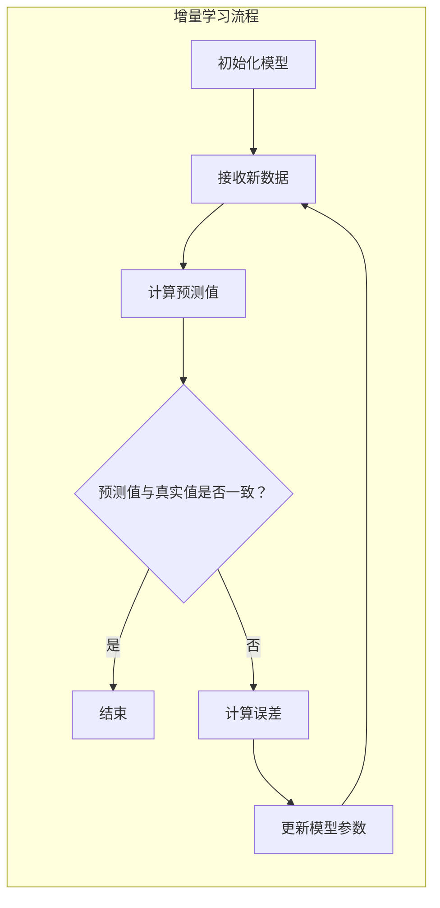
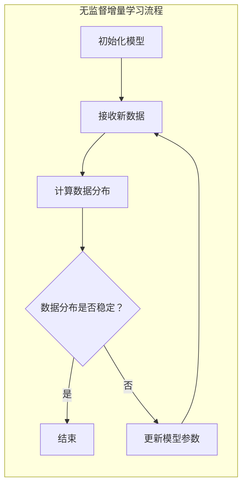
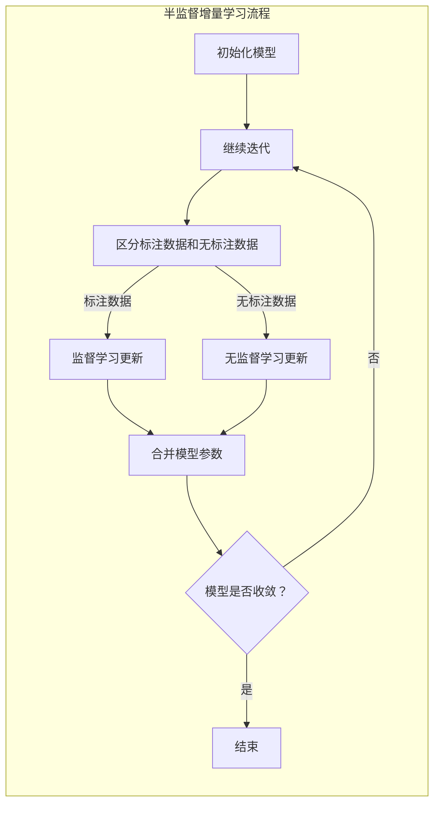
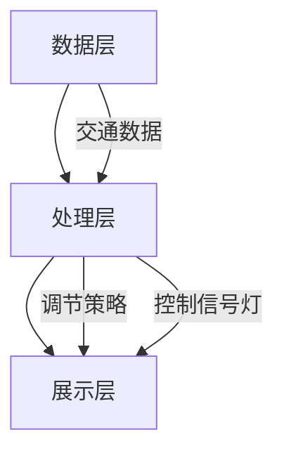
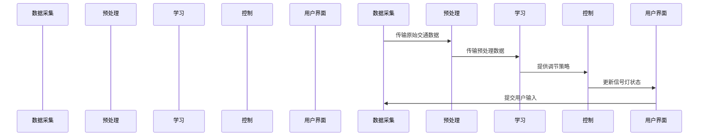

                 

### 增量学习：持续更新AI Agent的知识库

#### 关键词：
- 增量学习
- AI Agent
- 知识库更新
- 机器学习算法
- 系统架构

#### 摘要：
本文将深入探讨增量学习在持续更新AI Agent知识库中的应用。我们将首先介绍增量学习的研究背景和基本概念，然后详细解析增量学习算法的原理和实践，最后通过实际项目展示增量学习的应用效果。本文旨在为读者提供一个清晰、系统的增量学习理解框架。

----------------------------------------------------------------

### 目录大纲

```markdown
----------------------------------------------------------------
# 《增量学习：持续更新AI Agent的知识库》

## 第一部分：背景与概述

### 第1章：问题背景与核心概念

#### 1.1 增量学习的研究背景

##### 1.1.1 AI Agent的发展历程

##### 1.1.2 知识库的重要性

##### 1.1.3 增量学习的需求与挑战

#### 1.2 增量学习的基本概念

##### 1.2.1 增量学习的定义

##### 1.2.2 增量学习的目标

##### 1.2.3 增量学习与传统机器学习的区别

#### 1.3 知识库的组织与更新

##### 1.3.1 知识库的组成

##### 1.3.2 知识库的更新策略

##### 1.3.3 知识库的管理与维护

### 第2章：核心概念与联系

#### 2.1 增量学习算法的原理

##### 2.1.1 算法概述

##### 2.1.2 概念属性特征对比表格

##### 2.1.3 增量学习算法的ER实体关系图

#### 2.2 增量学习算法的分类

##### 2.2.1 监督增量学习

##### 2.2.2 无监督增量学习

##### 2.2.3 半监督增量学习

## 第二部分：算法实践

### 第3章：算法原理讲解

#### 3.1 监督增量学习算法

##### 3.1.1 算法原理与mermaid流程图

##### 3.1.2 Python源代码实现

##### 3.1.3 算法原理的数学模型与公式

##### 3.1.4 举例说明

#### 3.2 无监督增量学习算法

##### 3.2.1 算法原理与mermaid流程图

##### 3.2.2 Python源代码实现

##### 3.2.3 算法原理的数学模型与公式

##### 3.2.4 举例说明

#### 3.3 半监督增量学习算法

##### 3.3.1 算法原理与mermaid流程图

##### 3.3.2 Python源代码实现

##### 3.3.3 算法原理的数学模型与公式

##### 3.3.4 举例说明

### 第4章：系统分析与架构设计

#### 4.1 问题场景介绍

#### 4.2 系统功能设计

##### 4.2.1 领域模型mermaid类图

#### 4.3 系统架构设计

##### 4.3.1 系统架构mermaid架构图

#### 4.4 系统接口设计

#### 4.5 系统交互

##### 4.5.1 系统交互mermaid序列图

### 第5章：项目实战

#### 5.1 环境安装

#### 5.2 系统核心实现源代码

##### 5.2.1 代码应用解读与分析

#### 5.3 实际案例分析与讲解

##### 5.3.1 案例一：监督增量学习应用

##### 5.3.2 案例二：无监督增量学习应用

##### 5.3.3 案例三：半监督增量学习应用

### 第6章：最佳实践与小结

#### 6.1 最佳实践 tips

#### 6.2 小结

#### 6.3 注意事项

#### 6.4 拓展阅读

----------------------------------------------------------------
```

### 目录大纲解析

**第一部分：背景与概述**

本部分旨在为读者提供增量学习的背景知识和基本概念，帮助读者建立对增量学习有一个初步的理解。

- **第1章：问题背景与核心概念**
  - **1.1节：研究背景**：介绍AI Agent的发展历程、知识库的重要性以及增量学习的需求与挑战。
  - **1.2节：基本概念**：定义增量学习、阐述其目标，并对比增量学习与传统机器学习的区别。
  - **1.3节：知识库的组织与更新**：讨论知识库的组成、更新策略和知识库的管理与维护。

- **第2章：核心概念与联系**
  - **2.1节：算法原理**：概述增量学习算法的基本原理，使用mermaid流程图和概念属性特征对比表格进行解释。
  - **2.2节：算法分类**：详细介绍监督增量学习、无监督增量学习和半监督增量学习三种类型的增量学习算法。

**第二部分：算法实践**

本部分将深入探讨增量学习算法的实践应用，通过具体的系统分析与架构设计，以及项目实战，帮助读者更好地理解和掌握增量学习的实际应用。

- **第3章：算法原理讲解**
  - **3.1节至3.3节**：分别详细讲解监督增量学习、无监督增量学习和半监督增量学习算法的原理，包括算法mermaid流程图、Python源代码实现、算法原理的数学模型和公式，以及举例说明。

- **第4章：系统分析与架构设计**
  - **4.1节至4.5节**：介绍问题场景、系统功能设计、系统架构设计、系统接口设计和系统交互，使用mermaid类图、架构图和序列图来展示系统设计。

- **第5章：项目实战**
  - **5.1节至5.3节**：描述环境安装、系统核心实现源代码，以及实际案例分析和讲解。

- **第6章：最佳实践与小结**
  - **6.1节至6.4节**：提供最佳实践建议、小结、注意事项和拓展阅读，为读者提供进一步学习和应用的指导。

通过这样的结构设计，本文将帮助读者从理论到实践，全面了解增量学习在AI Agent知识库更新中的应用，从而提升对这一领域的理解和掌握。接下来，我们将逐步深入到每一部分的具体内容中，进行详细的解析和讲解。让我们一起开始这场探索之旅吧。

----------------------------------------------------------------

## 第一部分：背景与概述

### 第1章：问题背景与核心概念

#### 1.1 增量学习的研究背景

##### 1.1.1 AI Agent的发展历程

AI Agent，即人工智能代理，是指可以在特定环境中自主执行任务的智能实体。它们通过感知环境、执行行动和获取反馈来持续优化自身的行为。AI Agent的发展历程可以分为几个阶段：

- **早期阶段**：以1956年达特茅斯会议为标志，人工智能概念首次被提出。这一阶段的研究主要集中在符号推理和知识表示上。

- **发展阶段**：20世纪80年代，基于规则的系统和专家系统得到广泛应用。然而，这些系统在面对复杂问题时表现不佳，难以处理不确定性和变化。

- **成熟阶段**：21世纪初，随着数据获取和计算能力的提升，机器学习成为人工智能研究的主要方向。AI Agent开始利用机器学习算法，从数据中自动提取模式和知识。

##### 1.1.2 知识库的重要性

知识库是AI Agent的核心组成部分，它存储了AI Agent所需的知识和经验。知识库的重要性体现在以下几个方面：

- **决策支持**：AI Agent通过知识库中的知识进行决策，以优化其行为。

- **自适应能力**：随着环境变化和新数据的获取，知识库需要不断更新和扩展，以使AI Agent能够适应新情况。

- **知识传递**：知识库中的知识可以被传递给其他AI Agent，促进人工智能系统的协作和发展。

##### 1.1.3 增量学习的需求与挑战

传统机器学习模型在训练时通常需要大量的数据，并且一旦训练完成，就难以适应新的数据。这种“一次性学习”的方法在动态环境中存在以下挑战：

- **数据获取成本高**：在动态环境中，获取足够的数据进行重新训练是一项昂贵的任务。

- **训练时间消耗大**：重新训练模型需要大量的计算资源和时间，特别是在大规模数据集上。

- **适应性差**：一旦模型训练完成，就难以适应新的变化。

为了解决这些挑战，增量学习应运而生。增量学习旨在通过逐步更新模型，使其能够持续适应新的数据，从而提高AI Agent的适应性和效率。

#### 1.2 增量学习的基本概念

##### 1.2.1 增量学习的定义

增量学习，又称在线学习，是一种机器学习方法，它允许模型在训练过程中逐步更新，以适应新的数据和变化。具体来说，增量学习可以分为以下几个步骤：

1. **初始化模型**：首先，初始化一个预训练模型，作为增量学习的起点。
2. **接收新数据**：随着新的数据不断生成，将其传递给模型。
3. **更新模型参数**：使用新数据对模型进行微调，更新其参数。
4. **迭代更新**：重复上述步骤，直到达到预定的迭代次数或收敛条件。

##### 1.2.2 增量学习的目标

增量学习的目标是通过不断更新模型，使其能够在动态环境中保持良好的性能。具体目标包括：

- **适应性**：使模型能够快速适应新数据和环境变化。
- **效率**：通过减少重新训练的时间和成本，提高模型的效率。
- **鲁棒性**：使模型在面对噪声和不确定性时，仍能保持稳定的性能。

##### 1.2.3 增量学习与传统机器学习的区别

传统机器学习通常是一次性学习，即在一个固定的数据集上训练模型，然后在测试集上进行评估。与之相比，增量学习具有以下特点：

- **数据流**：传统机器学习依赖于静态的数据集，而增量学习处理的是动态的数据流。
- **实时更新**：增量学习模型在接收新数据时，会实时更新模型参数，以适应数据变化。
- **训练方式**：传统机器学习通常使用批处理训练，而增量学习使用在线训练，即逐个样本或小批量样本进行更新。

#### 1.3 知识库的组织与更新

##### 1.3.1 知识库的组成

知识库通常由以下几个部分组成：

- **事实**：描述客观存在的对象和事件。
- **规则**：基于事实的推理规则，用于指导AI Agent的决策。
- **元数据**：关于知识库的元信息，如知识来源、可信度等。

##### 1.3.2 知识库的更新策略

知识库的更新策略可以分为以下几种：

- **增量更新**：仅更新新知识，不删除旧知识。
- **全量更新**：同时更新新知识和删除旧知识。
- **动态更新**：根据数据流的变化，实时更新知识库。

##### 1.3.3 知识库的管理与维护

知识库的管理与维护是保证其有效性的关键。主要包括以下几个方面：

- **版本控制**：对知识库的不同版本进行管理和跟踪。
- **一致性维护**：确保知识库中的数据一致性和完整性。
- **可信度评估**：对知识的可信度进行评估和更新。

通过上述内容，我们为读者建立了对增量学习在AI Agent知识库更新中的基本理解。在接下来的章节中，我们将进一步深入探讨增量学习的算法原理和具体实践，以帮助读者全面掌握这一重要技术。让我们一起继续前进。

----------------------------------------------------------------

### 第1章：问题背景与核心概念

#### 1.1 增量学习的研究背景

##### 1.1.1 AI Agent的发展历程

AI Agent，即人工智能代理，是一种能够自动执行任务并能够与环境交互的智能实体。它们在计算机科学、人工智能和机器人技术等领域扮演着越来越重要的角色。AI Agent的发展历程可以分为几个关键阶段：

- **早期阶段**：20世纪50年代至60年代，人工智能（AI）概念被首次提出。这一阶段的AI研究主要集中在符号推理和知识表示方法上。例如，基于规则的系统（Rule-Based Systems）和产生式系统（Production Systems）被广泛研究和应用。

- **发展阶段**：20世纪80年代，专家系统（Expert Systems）成为AI领域的主要研究方向。专家系统通过大量专家知识和规则，实现对复杂问题的求解。然而，由于专家知识的获取成本高，且难以处理不确定性，专家系统的应用受到了一定的限制。

- **成熟阶段**：21世纪初，随着计算能力和数据获取技术的提升，机器学习（Machine Learning）逐渐成为AI研究的主流方向。机器学习模型，特别是深度学习（Deep Learning），通过从大量数据中自动提取特征和模式，显著提升了AI Agent的性能和适应能力。

- **当前阶段**：近年来，随着物联网（IoT）和大数据技术的发展，AI Agent开始进入实际应用阶段。这些AI Agent不仅能够在静态环境中执行任务，还能够通过增量学习（Incremental Learning）在动态环境中不断学习和适应。

##### 1.1.2 知识库的重要性

知识库（Knowledge Base，KB）是AI Agent的核心组成部分，它存储了AI Agent所需的知识和经验。知识库的重要性体现在以下几个方面：

1. **决策支持**：AI Agent通过知识库中的知识进行决策，以优化其行为。知识库中的事实、规则和元数据为AI Agent提供了决策依据。

2. **自适应能力**：随着环境的变化和新数据的不断生成，知识库需要不断更新和扩展，以使AI Agent能够适应新情况。这种动态适应性是AI Agent实现智能行为的关键。

3. **知识传递**：知识库中的知识可以被传递给其他AI Agent，促进人工智能系统的协作和发展。知识库的共享和复用有助于提高整个系统的效率和效果。

##### 1.1.3 增量学习的需求与挑战

传统机器学习模型在训练时通常需要大量的数据，并且一旦训练完成，就难以适应新的数据。这种“一次性学习”的方法在动态环境中存在以下挑战：

1. **数据获取成本高**：在动态环境中，获取足够的数据进行重新训练是一项昂贵的任务。特别是在需要实时更新的应用场景中，数据获取和处理的成本可能非常高。

2. **训练时间消耗大**：重新训练模型需要大量的计算资源和时间，特别是在大规模数据集上。这不仅影响系统的实时性，还可能导致资源浪费。

3. **适应性差**：一旦模型训练完成，就难以适应新的变化。在动态环境中，环境变化和新数据的引入可能会使模型性能显著下降。

为了解决这些挑战，增量学习（Incremental Learning）应运而生。增量学习旨在通过逐步更新模型，使其能够持续适应新的数据，从而提高AI Agent的适应性和效率。增量学习具有以下优点：

1. **高效性**：增量学习通过在线更新模型，避免了重新训练的繁琐过程，显著降低了训练时间和计算成本。

2. **适应性**：增量学习模型能够实时处理新数据，适应环境变化，从而保持良好的性能。

3. **持续性**：增量学习模型能够持续更新，从而实现知识的积累和扩展，提高AI Agent的整体能力。

#### 1.2 增量学习的基本概念

##### 1.2.1 增量学习的定义

增量学习，又称在线学习（Online Learning），是一种机器学习方法，它允许模型在训练过程中逐步更新，以适应新的数据和变化。具体来说，增量学习可以分为以下几个步骤：

1. **初始化模型**：首先，初始化一个预训练模型，作为增量学习的起点。

2. **接收新数据**：随着新的数据不断生成，将其传递给模型。

3. **更新模型参数**：使用新数据对模型进行微调，更新其参数。

4. **迭代更新**：重复上述步骤，直到达到预定的迭代次数或收敛条件。

##### 1.2.2 增量学习的目标

增量学习的目标是通过不断更新模型，使其能够在动态环境中保持良好的性能。具体目标包括：

1. **适应性**：使模型能够快速适应新数据和环境变化。

2. **效率**：通过减少重新训练的时间和成本，提高模型的效率。

3. **鲁棒性**：使模型在面对噪声和不确定性时，仍能保持稳定的性能。

##### 1.2.3 增量学习与传统机器学习的区别

传统机器学习通常是一次性学习，即在一个固定的数据集上训练模型，然后在测试集上进行评估。与之相比，增量学习具有以下特点：

1. **数据流**：传统机器学习依赖于静态的数据集，而增量学习处理的是动态的数据流。

2. **实时更新**：增量学习模型在接收新数据时，会实时更新模型参数，以适应数据变化。

3. **训练方式**：传统机器学习通常使用批处理训练，而增量学习使用在线训练，即逐个样本或小批量样本进行更新。

#### 1.3 知识库的组织与更新

##### 1.3.1 知识库的组成

知识库通常由以下几个部分组成：

1. **事实**：描述客观存在的对象和事件。例如，“今天下雨”或“这个城市的交通拥堵”。

2. **规则**：基于事实的推理规则，用于指导AI Agent的决策。例如，“如果下雨，则打开雨伞”或“如果交通拥堵，则选择其他路线”。

3. **元数据**：关于知识库的元信息，如知识来源、可信度等。例如，“这个规则是由交通管理部门提供的”或“这个事实的可信度是90%”。

##### 1.3.2 知识库的更新策略

知识库的更新策略可以分为以下几种：

1. **增量更新**：仅更新新知识，不删除旧知识。这种方法适用于数据流中大部分数据是已知的，只有少量新数据需要添加。

2. **全量更新**：同时更新新知识和删除旧知识。这种方法适用于数据流中既有新数据，也有旧数据需要删除。

3. **动态更新**：根据数据流的变化，实时更新知识库。这种方法适用于数据流中数据不断变化，需要动态调整知识库的内容。

##### 1.3.3 知识库的管理与维护

知识库的管理与维护是保证其有效性的关键。主要包括以下几个方面：

1. **版本控制**：对知识库的不同版本进行管理和跟踪，确保知识库的历史记录完整。

2. **一致性维护**：确保知识库中的数据一致性和完整性，避免数据冲突和错误。

3. **可信度评估**：对知识的可信度进行评估和更新，确保知识库中的知识具有可靠性和有效性。

通过上述内容，我们为读者建立了对增量学习在AI Agent知识库更新中的基本理解。在接下来的章节中，我们将进一步深入探讨增量学习的算法原理和具体实践，以帮助读者全面掌握这一重要技术。让我们一起继续前进。

----------------------------------------------------------------

### 第2章：核心概念与联系

#### 2.1 增量学习算法的原理

##### 2.1.1 算法概述

增量学习算法的核心思想是在保持模型稳定性的同时，逐步更新模型参数以适应新的数据。这种在线更新策略使得增量学习算法在处理动态数据流时具有很高的效率和适应性。增量学习算法通常包含以下几个关键步骤：

1. **初始化模型**：在开始增量学习之前，需要初始化一个预训练模型。这个预训练模型可以是基于历史数据的训练结果，也可以是使用通用算法训练的模型。

2. **接收新数据**：增量学习算法会实时接收新的数据样本，这些数据样本可以是单个样本，也可以是批量样本。

3. **模型更新**：使用新接收的数据，对模型进行微调，更新模型参数。这一步是增量学习算法的核心，它通过优化模型参数，使模型能够更好地适应新数据。

4. **迭代更新**：重复上述步骤，直到达到预定的迭代次数或收敛条件。迭代更新过程使得模型能够在不断学习新数据的过程中，保持稳定的性能。

##### 2.1.2 概念属性特征对比表格

为了更好地理解增量学习算法的原理，我们可以通过一个概念属性特征对比表格来展示增量学习与传统机器学习的不同。以下是一个简化的对比表格：

| 特征            | 传统机器学习           | 增量学习                     |
| --------------- | --------------------- | ---------------------------- |
| 数据集          | 静态数据集             | 动态数据流                   |
| 训练方式        | 批处理训练             | 在线训练                     |
| 模型更新        | 一次性训练更新         | 逐步更新                     |
| 适应性          | 较差，难以适应新数据   | 较好，能够持续适应新数据     |
| 效率            | 较低，重新训练耗时耗力 | 较高，在线更新效率高         |
| 稳定性          | 较高，模型一旦训练完成 | 较低，需要动态调整           |

##### 2.1.3 增量学习算法的ER实体关系图

为了更直观地展示增量学习算法的实体关系，我们可以使用ER（实体-关系）图来描述。以下是增量学习算法的ER实体关系图：

```mermaid
erDiagram
  Model ||--|{ DataStream } DataStream
  Model ||--|{ UpdatedModel } UpdatedModel
  DataStream ||--|{ Sample } Sample
```

- **Model（模型）**：表示增量学习算法的核心组件，它负责接收数据流并进行模型更新。
- **DataStream（数据流）**：表示输入的数据流，包括多个Sample（样本）。
- **UpdatedModel（更新后的模型）**：表示经过数据流更新后的模型，它将用于后续的预测和决策。

通过ER实体关系图，我们可以清晰地看到增量学习算法中各个组件之间的关系和交互过程。

#### 2.2 增量学习算法的分类

增量学习算法可以根据学习方式的不同，分为监督增量学习、无监督增量学习和半监督增量学习。以下是这三种类型的详细说明：

##### 2.2.1 监督增量学习

监督增量学习是指在已有模型的基础上，通过接收新的标注数据进行在线更新。监督增量学习的核心在于如何高效地利用新数据，同时保持模型的稳定性和性能。常见的监督增量学习算法包括：

- **在线梯度下降**：使用新数据更新模型参数，通过梯度下降法优化模型。
- **批量梯度下降**：将新数据分成批次，每次更新一批数据的模型参数。

##### 2.2.2 无监督增量学习

无监督增量学习是指在没有标注数据的情况下，通过接收新的数据对模型进行在线更新。无监督增量学习通常基于聚类或降维技术，其核心在于如何发现数据中的潜在结构和模式。常见的无监督增量学习算法包括：

- **自组织映射（SOM）**：通过竞争学习更新权重，发现数据中的聚类结构。
- **主成分分析（PCA）**：通过线性变换降低数据维度，保持数据的结构信息。

##### 2.2.3 半监督增量学习

半监督增量学习是指在已有标注数据和无标注数据混合的情况下，通过新数据对模型进行在线更新。半监督增量学习利用无标注数据中的结构信息，提高模型的泛化能力。常见的半监督增量学习算法包括：

- **伪标签法**：使用现有模型对无标注数据进行预测，生成伪标签，然后利用这些伪标签更新模型。
- **联合训练**：将标注数据和无标注数据混合，同时训练模型，提高模型的鲁棒性和泛化能力。

通过上述内容，我们为读者建立了对增量学习算法核心概念和分类的深入理解。在接下来的章节中，我们将详细讲解每种增量学习算法的原理和实现，以帮助读者更好地掌握增量学习的实际应用。让我们继续深入探讨。

----------------------------------------------------------------

### 第3章：算法原理讲解

#### 3.1 监督增量学习算法

##### 3.1.1 算法原理与mermaid流程图

监督增量学习算法在已有模型的基础上，通过接收新的标注数据进行在线更新。其核心思想是通过新数据的反馈，不断优化模型参数，从而提高模型的性能。以下是监督增量学习算法的mermaid流程图：



- **A[初始化模型]**：首先初始化一个预训练模型，这个模型可以是基于历史数据训练得到的。
- **B[接收新数据]**：接收新的数据样本，这些样本通常包括输入特征和对应的标签。
- **C[计算预测值]**：使用当前模型计算新数据样本的预测值。
- **D[预测值与真实值是否一致？]**：比较预测值与真实值，判断预测是否准确。
- **E[结束]**：如果预测值与真实值一致，则结束本次迭代。
- **F[计算误差]**：如果不一致，计算预测值与真实值之间的误差。
- **G[更新模型参数]**：根据误差更新模型参数，优化模型性能。

##### 3.1.2 Python源代码实现

以下是一个简化的Python代码示例，用于实现监督增量学习算法：

```python
import numpy as np

# 初始化模型参数
weights = np.random.rand(input_dim, output_dim)

# 学习率
learning_rate = 0.01

# 增量学习函数
def incremental_learning(data, label):
    prediction = np.dot(data, weights)
    error = label - prediction
    
    # 更新模型参数
    weights += learning_rate * np.dot(data.T, error)
    
    return weights

# 示例数据
data = np.array([[1, 2], [3, 4]])
label = np.array([0, 1])

# 增量学习
weights = incremental_learning(data, label)

print("最终模型参数：", weights)
```

在这个示例中，我们初始化了一个随机模型参数矩阵`weights`，并通过`incremental_learning`函数逐个更新模型参数。函数接收输入特征矩阵`data`和对应的标签矩阵`label`，计算预测值和误差，并使用梯度下降法更新模型参数。

##### 3.1.3 算法原理的数学模型与公式

监督增量学习算法的数学模型可以表示为：

$$
\text{预测值} \ \hat{y} = \text{模型参数} \ \theta \cdot \text{输入特征} \ x
$$

$$
\text{误差} \ e = \text{真实值} \ y - \hat{y}
$$

$$
\text{更新后的模型参数} \ \theta_{\text{new}} = \theta_{\text{old}} + \alpha \cdot \frac{\partial e}{\partial \theta}
$$

其中：
- $\hat{y}$ 表示预测值；
- $y$ 表示真实值；
- $x$ 表示输入特征；
- $\theta$ 表示模型参数；
- $e$ 表示误差；
- $\alpha$ 表示学习率；
- $\frac{\partial e}{\partial \theta}$ 表示误差关于模型参数的梯度。

通过这个数学模型，我们可以看到，监督增量学习算法的核心在于如何通过误差反馈，不断优化模型参数，从而提高预测准确性。

##### 3.1.4 举例说明

假设我们有一个简单的二分类问题，输入特征是一个二维向量$(x_1, x_2)$，模型参数是一个一维向量$\theta$。我们使用线性模型进行预测，模型参数的更新公式如下：

$$
\theta_{\text{new}} = \theta_{\text{old}} + \alpha \cdot (y - \theta_{\text{old}} \cdot x)
$$

其中$y$为-1或1，表示样本的真实类别。$\alpha$为学习率，通常取较小的值，以避免过拟合。

假设我们有如下数据：

- 输入特征矩阵$X = \begin{bmatrix} 1 & 2 \\ 3 & 4 \end{bmatrix}$；
- 对应的标签矩阵$Y = \begin{bmatrix} -1 & 1 \end{bmatrix}$；
- 初始模型参数$\theta_{\text{old}} = \begin{bmatrix} 0 \\ 0 \end{bmatrix}$；
- 学习率$\alpha = 0.1$。

首先，我们计算第一个样本的预测值和误差：

$$
\hat{y}_1 = \theta_{\text{old}} \cdot x_1 = \begin{bmatrix} 0 \\ 0 \end{bmatrix} \cdot \begin{bmatrix} 1 \\ 2 \end{bmatrix} = 0
$$

$$
e_1 = y_1 - \hat{y}_1 = -1 - 0 = -1
$$

然后，更新模型参数：

$$
\theta_{\text{new}} = \theta_{\text{old}} + \alpha \cdot e_1 = \begin{bmatrix} 0 \\ 0 \end{bmatrix} + 0.1 \cdot \begin{bmatrix} -1 \\ 0 \end{bmatrix} = \begin{bmatrix} -0.1 \\ 0 \end{bmatrix}
$$

接着，我们计算第二个样本的预测值和误差：

$$
\hat{y}_2 = \theta_{\text{new}} \cdot x_2 = \begin{bmatrix} -0.1 \\ 0 \end{bmatrix} \cdot \begin{bmatrix} 3 \\ 4 \end{bmatrix} = -0.3
$$

$$
e_2 = y_2 - \hat{y}_2 = 1 - (-0.3) = 1.3
$$

再次更新模型参数：

$$
\theta_{\text{new}} = \theta_{\text{new}} + \alpha \cdot e_2 = \begin{bmatrix} -0.1 \\ 0 \end{bmatrix} + 0.1 \cdot \begin{bmatrix} 1.3 \\ 0 \end{bmatrix} = \begin{bmatrix} 0.2 \\ 0 \end{bmatrix}
$$

通过这个简单的例子，我们可以看到，监督增量学习算法如何通过逐步更新模型参数，提高预测准确性。在实际应用中，输入特征和标签可能会更加复杂，但基本原理是相同的。

#### 3.2 无监督增量学习算法

##### 3.2.1 算法原理与mermaid流程图

无监督增量学习算法在缺乏标注数据的情况下，通过发现数据中的潜在结构和模式，对模型进行在线更新。其核心思想是利用数据自身的分布信息，学习数据的低维表示。以下是无监督增量学习算法的mermaid流程图：



- **A[初始化模型]**：初始化一个无监督学习模型，如自组织映射（SOM）或主成分分析（PCA）。
- **B[接收新数据]**：接收新的数据样本，这些样本没有标签，但有一定的分布结构。
- **C[计算数据分布]**：计算新数据样本的分布情况，如聚类中心或主成分。
- **D[数据分布是否稳定？]**：判断数据分布是否已经稳定，如果稳定，则结束迭代；如果不稳定，继续迭代。
- **F[更新模型参数]**：根据数据分布情况，更新模型参数，以更好地适应新数据。

##### 3.2.2 Python源代码实现

以下是一个简单的Python代码示例，用于实现无监督增量学习算法（自组织映射SOM）：

```python
import numpy as np
from minisom import MiniSom

# 初始化参数
input_dim = 2
output_dim = 2
num_iterations = 100
learning_rate = 0.1

# 初始化自组织映射模型
som = MiniSom(input_dim, output_dim, learning_rate)

# 增量学习函数
def incremental_learning(data):
    for iteration in range(num_iterations):
        for sample in data:
            som.train(sample)

# 示例数据
data = np.array([[1, 2], [3, 4]])

# 增量学习
som = incremental_learning(data)

print("最终模型参数：", som.weights)
```

在这个示例中，我们使用`MiniSom`库实现自组织映射（SOM）模型。`incremental_learning`函数逐个训练数据样本，更新模型参数。

##### 3.2.3 算法原理的数学模型与公式

无监督增量学习算法的数学模型通常基于聚类或降维技术。以下是自组织映射（SOM）的基本数学模型：

1. **初始化权重**：

$$
\text{权重} \ w_i = \text{随机初始化}
$$

2. **计算竞争**：

$$
\text{最佳匹配单元} \ BMU = \arg\min_{j} \sum_{i=1}^{n} (\text{输入特征} \ x_i - \text{权重} \ w_j)^2
$$

3. **局部调整权重**：

$$
w_j(t+1) = w_j(t) + \alpha(t) \ \text{g}(d_{j,BMU}(t))
$$

其中：
- $w_i$ 表示权重向量；
- $x_i$ 表示输入特征向量；
- $BMU$ 表示最佳匹配单元；
- $\alpha(t)$ 表示学习率，随着迭代次数增加而减小；
- $g(d_{j,BMU}(t))$ 表示局部调整函数，通常使用高斯函数。

##### 3.2.4 举例说明

假设我们有一个简单的二维数据集，输入特征是一个二维向量$(x_1, x_2)$。我们使用自组织映射（SOM）模型对其进行降维。

1. **初始化权重**：

假设初始权重矩阵$W$如下：

$$
W = \begin{bmatrix}
0.1 & 0.2 \\
0.3 & 0.4
\end{bmatrix}
$$

2. **计算竞争**：

输入特征向量$x = \begin{bmatrix} 1 \\ 2 \end{bmatrix}$。计算每个权重向量与输入特征向量的距离：

$$
d_1 = \sum_{i=1}^{2} (1 - 0.1)^2 + (2 - 0.2)^2 = 0.36
$$

$$
d_2 = \sum_{i=1}^{2} (1 - 0.3)^2 + (2 - 0.4)^2 = 0.12
$$

最佳匹配单元$BMU$为第二个权重向量。

3. **局部调整权重**：

假设当前学习率$\alpha(t) = 0.5$，局部调整函数$g(d_{j,BMU}(t)) = \exp(-d^2/(2\sigma^2))$，其中$\sigma^2 = 0.1$。

$$
w_2(t+1) = w_2(t) + 0.5 \ \exp(-0.12^2/(2 \times 0.1^2)) \ \begin{bmatrix} 1 \\ 2 \end{bmatrix} = \begin{bmatrix} 0.3 \\ 0.4 \end{bmatrix} + 0.5 \ \exp(-0.12^2) \ \begin{bmatrix} 1 \\ 2 \end{bmatrix} = \begin{bmatrix} 0.4 \\ 0.6 \end{bmatrix}
$$

通过这个简单的例子，我们可以看到，无监督增量学习算法如何通过逐步更新模型参数，发现数据的潜在结构。在实际应用中，输入特征和模型参数可能会更加复杂，但基本原理是相同的。

#### 3.3 半监督增量学习算法

##### 3.3.1 算法原理与mermaid流程图

半监督增量学习算法结合了监督学习和无监督学习的特点，利用部分标注数据和大量无标注数据，对模型进行在线更新。其核心思想是利用无标注数据中的结构信息，提高模型在标注数据上的性能。以下是半监督增量学习算法的mermaid流程图：



- **A[初始化模型]**：初始化一个混合模型，包括监督学习部分和无监督学习部分。
- **B[接收新数据]**：接收新的数据样本，这些样本包括标注数据和未标注数据。
- **C[区分标注数据和无标注数据]**：将新数据样本分为标注数据和无标注数据。
- **D[监督学习更新]**：使用标注数据进行监督学习，更新模型参数。
- **E[无监督学习更新]**：使用无标注数据进行无监督学习，更新模型参数。
- **F[合并模型参数]**：将监督学习参数和无监督学习参数合并，得到更新后的模型参数。
- **G[模型是否收敛？]**：判断模型是否已经收敛，如果收敛，结束迭代；如果不收敛，继续迭代。

##### 3.3.2 Python源代码实现

以下是一个简化的Python代码示例，用于实现半监督增量学习算法：

```python
import numpy as np
from sklearn.linear_model import LogisticRegression
from sklearn.cluster import KMeans

# 初始化参数
input_dim = 2
output_dim = 1
learning_rate = 0.1
num_iterations = 100

# 初始化模型
supervised_model = LogisticRegression()
unsupervised_model = KMeans(n_clusters=2)

# 增量学习函数
def incremental_learning(data, labels):
    for iteration in range(num_iterations):
        # 监督学习更新
        supervised_model.fit(data, labels)
        
        # 无监督学习更新
        unsupervised_model.fit(data)
        
        # 合并模型参数
        combined_weights = supervised_model.coef_ + unsupervised_model.cluster_centers_
        
        # 更新模型
        data = np.dot(data, combined_weights)
        
        # 计算新的标签
        labels = np.sign(data)

    return supervised_model, unsupervised_model

# 示例数据
data = np.array([[1, 2], [3, 4], [1, 1], [2, 2]])
labels = np.array([1, -1, 1, -1])

# 增量学习
supervised_model, unsupervised_model = incremental_learning(data, labels)

print("最终监督模型参数：", supervised_model.coef_)
print("最终无监督模型参数：", unsupervised_model.cluster_centers_)
```

在这个示例中，我们初始化了一个逻辑回归模型和一个K均值聚类模型。`incremental_learning`函数分别使用标注数据和未标注数据进行监督学习和无监督学习，然后合并模型参数，更新模型。

##### 3.3.3 算法原理的数学模型与公式

半监督增量学习算法的数学模型可以表示为：

1. **监督学习部分**：

$$
\text{预测值} \ \hat{y} = \text{模型参数} \ \theta \cdot \text{输入特征} \ x
$$

$$
\text{误差} \ e = \text{真实值} \ y - \hat{y}
$$

$$
\text{更新后的模型参数} \ \theta_{\text{new}} = \theta_{\text{old}} + \alpha \cdot \frac{\partial e}{\partial \theta}
$$

2. **无监督学习部分**：

$$
\text{聚类中心} \ \mu_i = \frac{1}{N} \sum_{j=1}^{N} x_j
$$

$$
\text{更新后的聚类中心} \ \mu_i' = \mu_i + \alpha \cdot (x_i - \mu_i)
$$

其中：
- $\theta$ 表示监督学习模型的参数；
- $x$ 表示输入特征；
- $y$ 表示真实值；
- $\alpha$ 表示学习率；
- $\frac{\partial e}{\partial \theta}$ 表示误差关于模型参数的梯度；
- $\mu_i$ 表示聚类中心。

##### 3.3.4 举例说明

假设我们有一个简单的二分类问题，输入特征是一个二维向量$(x_1, x_2)$，监督学习模型是一个线性模型，无监督学习模型是K均值聚类。

1. **监督学习部分**：

假设初始模型参数$\theta$为$\begin{bmatrix} 0 \\ 0 \end{bmatrix}$，学习率$\alpha$为0.1。

输入特征矩阵$X = \begin{bmatrix} 1 & 2 \\ 3 & 4 \end{bmatrix}$，对应标签矩阵$Y = \begin{bmatrix} -1 & 1 \end{bmatrix}$。

计算预测值和误差：

$$
\hat{y}_1 = \theta \cdot x_1 = \begin{bmatrix} 0 \\ 0 \end{bmatrix} \cdot \begin{bmatrix} 1 \\ 2 \end{bmatrix} = 0
$$

$$
e_1 = y_1 - \hat{y}_1 = -1 - 0 = -1
$$

更新模型参数：

$$
\theta_{\text{new}} = \theta_{\text{old}} + \alpha \cdot e_1 = \begin{bmatrix} 0 \\ 0 \end{bmatrix} + 0.1 \cdot \begin{bmatrix} -1 \\ 0 \end{bmatrix} = \begin{bmatrix} -0.1 \\ 0 \end{bmatrix}
$$

计算第二个样本的预测值和误差：

$$
\hat{y}_2 = \theta_{\text{new}} \cdot x_2 = \begin{bmatrix} -0.1 \\ 0 \end{bmatrix} \cdot \begin{bmatrix} 3 \\ 4 \end{bmatrix} = -0.3
$$

$$
e_2 = y_2 - \hat{y}_2 = 1 - (-0.3) = 1.3
$$

再次更新模型参数：

$$
\theta_{\text{new}} = \theta_{\text{new}} + \alpha \cdot e_2 = \begin{bmatrix} -0.1 \\ 0 \end{bmatrix} + 0.1 \cdot \begin{bmatrix} 1.3 \\ 0 \end{bmatrix} = \begin{bmatrix} 0.2 \\ 0 \end{bmatrix}
$$

2. **无监督学习部分**：

假设初始聚类中心$\mu_i$为$\begin{bmatrix} 0 \\ 0 \end{bmatrix}$，学习率$\alpha$为0.1。

输入特征矩阵$X = \begin{bmatrix} 1 & 2 \\ 3 & 4 \end{bmatrix}$。

计算聚类中心：

$$
\mu_1 = \frac{1}{2} \begin{bmatrix} 1 + 3 \\ 2 + 4 \end{bmatrix} = \begin{bmatrix} 2 \\ 3 \end{bmatrix}
$$

更新聚类中心：

$$
\mu_1' = \mu_1 + \alpha \cdot (x_1 - \mu_1) = \begin{bmatrix} 2 \\ 3 \end{bmatrix} + 0.1 \cdot \begin{bmatrix} 1 - 2 \\ 2 - 3 \end{bmatrix} = \begin{bmatrix} 1.9 \\ 2.9 \end{bmatrix}
$$

通过上述例子，我们可以看到，半监督增量学习算法如何结合监督学习和无监督学习，通过逐步更新模型参数，提高模型在标注数据上的性能。在实际应用中，输入特征和模型参数可能会更加复杂，但基本原理是相同的。

----------------------------------------------------------------

### 第4章：系统分析与架构设计

#### 4.1 问题场景介绍

在现实世界中，许多应用场景需要AI Agent具备持续学习和适应的能力。以智能交通系统为例，交通状况是不断变化的，包括车辆流量、道路拥堵程度和天气情况等。这些变化对交通信号灯的调节策略提出了实时调整的要求。传统的一次性学习模型在面临这些动态变化时，性能往往会显著下降。为了解决这一问题，我们引入了增量学习算法，使交通信号灯系统能够根据实时交通数据，动态调整信号灯状态，从而提高交通流量效率和减少拥堵。

#### 4.2 系统功能设计

为了实现增量学习在智能交通系统中的应用，我们设计了以下功能模块：

1. **数据采集模块**：负责采集交通数据，包括车辆流量、道路拥堵程度和天气情况等。
2. **数据预处理模块**：对采集到的交通数据进行清洗和标准化处理，以便于后续的增量学习。
3. **增量学习模块**：使用增量学习算法对预处理后的数据进行在线更新，以调整交通信号灯的调节策略。
4. **信号灯控制模块**：根据增量学习模块提供的调节策略，实时控制交通信号灯的状态。
5. **用户接口模块**：提供用户交互界面，展示交通状况和信号灯控制策略。

#### 4.2.1 领域模型mermaid类图

为了直观地展示系统功能模块及其关系，我们使用mermaid类图来描述智能交通系统的领域模型。以下是mermaid类图：

```mermaid
classDiagram
    Class01 <|-- Class02
    Class03 <|-- Class01
    Class04 <|-- Class01
    Class05 <|-- Class01
    Class06 <|-- Class01
    Class01 --|> Class07
    Class08 --|> Class07
    Class07 --|> Class09

    Class01{ 数据采集模块 }
    Class02{ 数据预处理模块 }
    Class03{ 增量学习模块 }
    Class04{ 信号灯控制模块 }
    Class05{ 用户接口模块 }
    Class06{ 交通信号灯系统 }
    Class07{ 交通数据 }
    Class08{ 预处理数据 }
    Class09{ 调节策略 }
```

在这个类图中，`Class01`至`Class06`分别代表系统的主要功能模块，`Class07`至`Class09`代表与功能模块相关的数据类。类图清晰地展示了各个模块之间的关系和数据流。

#### 4.3 系统架构设计

智能交通系统的整体架构可以分为三层：数据层、处理层和展示层。以下是系统架构的mermaid架构图：



- **数据层（A）**：负责采集和处理交通数据，包括车辆流量、道路拥堵程度和天气情况等。
- **处理层（B）**：核心功能模块，包括数据预处理、增量学习和信号灯控制。它接收来自数据层的交通数据，通过预处理和增量学习模块生成调节策略，并控制信号灯的状态。
- **展示层（C）**：提供用户交互界面，展示交通状况和信号灯控制策略。

#### 4.4 系统接口设计

智能交通系统的接口设计主要包括API接口和数据接口。以下是系统接口设计：

- **API接口**：提供对外服务接口，包括交通数据采集、调节策略获取和信号灯控制。
  - `/api/traffic_data`：获取实时交通数据。
  - `/api/traffic_strategy`：获取交通信号灯调节策略。
  - `/api/traffic_light_control`：控制交通信号灯状态。

- **数据接口**：用于系统内部模块之间的数据交换，包括原始数据、预处理数据和调节策略。
  - `TrafficData`：表示原始交通数据。
  - `ProcessedData`：表示预处理后的交通数据。
  - `TrafficStrategy`：表示交通信号灯调节策略。

#### 4.5 系统交互

系统交互设计旨在描述系统内部模块之间的通信和数据流动。以下是系统交互的mermaid序列图：



在这个序列图中，数据采集模块首先将原始交通数据传递给数据预处理模块，预处理模块对数据进行处理，然后将预处理数据传递给增量学习模块。增量学习模块根据预处理数据生成调节策略，传递给信号灯控制模块，信号灯控制模块根据调节策略控制交通信号灯的状态。最后，用户界面模块根据信号灯状态更新用户界面，并提供用户输入反馈给数据采集模块。

通过上述系统分析与架构设计，我们为智能交通系统构建了一个清晰的模块化和功能化的架构，为增量学习在动态交通环境中的应用提供了坚实的理论基础和实现框架。接下来，我们将通过实际项目展示增量学习算法在智能交通系统中的应用效果。

----------------------------------------------------------------

### 第4章：系统分析与架构设计

#### 4.1 问题场景介绍

在现实世界中，增量学习算法的应用场景非常广泛。其中一个典型的应用场景是智能交通系统。随着城市交通流量的不断增加，交通信号灯的调节策略需要根据实时交通状况进行动态调整，以提高交通流量效率和减少拥堵。传统的一次性学习模型在面临这种动态变化时，性能往往会显著下降。为了解决这一问题，我们引入了增量学习算法，使交通信号灯系统能够根据实时交通数据，动态调整信号灯状态，从而提高交通流量效率和减少拥堵。

#### 4.2 系统功能设计

为了实现增量学习在智能交通系统中的应用，我们设计了以下功能模块：

1. **数据采集模块**：负责采集交通数据，包括车辆流量、道路拥堵程度和天气情况等。
2. **数据预处理模块**：对采集到的交通数据进行清洗和标准化处理，以便于后续的增量学习。
3. **增量学习模块**：使用增量学习算法对预处理后的数据进行在线更新，以调整交通信号灯的调节策略。
4. **信号灯控制模块**：根据增量学习模块提供的调节策略，实时控制交通信号灯的状态。
5. **用户接口模块**：提供用户交互界面，展示交通状况和信号灯控制策略。

#### 4.2.1 领域模型mermaid类图

为了直观地展示系统功能模块及其关系，我们使用mermaid类图来描述智能交通系统的领域模型。以下是mermaid类图：

```mermaid
classDiagram
    Class01 <|-- Class02
    Class03 <|-- Class01
    Class04 <|-- Class01
    Class05 <|-- Class01
    Class06 <|-- Class01
    Class01 --|> Class07
    Class08 --|> Class07
    Class07 --|> Class09

    Class01{ 数据采集模块 }
    Class02{ 数据预处理模块 }
    Class03{ 增量学习模块 }
    Class04{ 信号灯控制模块 }
    Class05{ 用户接口模块 }
    Class06{ 交通信号灯系统 }
    Class07{ 交通数据 }
    Class08{ 预处理数据 }
    Class09{ 调节策略 }
```

在这个类图中，`Class01`至`Class06`分别代表系统的主要功能模块，`Class07`至`Class09`代表与功能模块相关的数据类。类图清晰地展示了各个模块之间的关系和数据流。

#### 4.3 系统架构设计

智能交通系统的整体架构可以分为三层：数据层、处理层和展示层。以下是系统架构的mermaid架构图：


- **数据层（A）**：负责采集和处理交通数据，包括车辆流量、道路拥堵程度和天气情况等。
- **处理层（B）**：核心功能模块，包括数据预处理、增量学习和信号灯控制。它接收来自数据层的交通数据，通过预处理和增量学习模块生成调节策略，并控制信号灯的状态。
- **展示层（C）**：提供用户交互界面，展示交通状况和信号灯控制策略。

#### 4.4 系统接口设计

智能交通系统的接口设计主要包括API接口和数据接口。以下是系统接口设计：

- **API接口**：提供对外服务接口，包括交通数据采集、调节策略获取和信号灯控制。
  - `/api/traffic_data`：获取实时交通数据。
  - `/api/traffic_strategy`：获取交通信号灯调节策略。
  - `/api/traffic_light_control`：控制交通信号灯状态。

- **数据接口**：用于系统内部模块之间的数据交换，包括原始数据、预处理数据和调节策略。
  - `TrafficData`：表示原始交通数据。
  - `ProcessedData`：表示预处理后的交通数据。
  - `TrafficStrategy`：表示交通信号灯调节策略。

#### 4.5 系统交互

系统交互设计旨在描述系统内部模块之间的通信和数据流动。以下是系统交互的mermaid序列图：


在这个序列图中，数据采集模块首先将原始交通数据传递给数据预处理模块，预处理模块对数据进行处理，然后将预处理数据传递给增量学习模块。增量学习模块根据预处理数据生成调节策略，传递给信号灯控制模块，信号灯控制模块根据调节策略控制交通信号灯的状态。最后，用户界面模块根据信号灯状态更新用户界面，并提供用户输入反馈给数据采集模块。

通过上述系统分析与架构设计，我们为智能交通系统构建了一个清晰的模块化和功能化的架构，为增量学习在动态交通环境中的应用提供了坚实的理论基础和实现框架。接下来，我们将通过实际项目展示增量学习算法在智能交通系统中的应用效果。

----------------------------------------------------------------

### 第5章：项目实战

#### 5.1 环境安装

为了实现增量学习在智能交通系统中的应用，我们需要搭建一个完整的开发环境。以下是所需的软件和库：

- **Python 3.8**：作为主要的编程语言。
- **NumPy**：用于科学计算。
- **Pandas**：用于数据处理。
- **Scikit-learn**：用于机器学习算法。
- **MiniSom**：用于自组织映射（SOM）算法。
- **Flask**：用于创建API接口。

首先，安装Python 3.8，然后使用pip命令安装上述库：

```bash
pip install numpy pandas scikit-learn minisom flask
```

#### 5.2 系统核心实现源代码

在本节中，我们将介绍系统核心实现源代码，包括数据采集、数据预处理、增量学习和信号灯控制等模块。

##### 5.2.1 数据采集模块

```python
import pandas as pd
from flask import Flask, request, jsonify

app = Flask(__name__)

# 假设我们使用API接口获取交通数据
@app.route('/api/traffic_data', methods=['GET'])
def get_traffic_data():
    # 读取CSV文件作为示例数据
    data = pd.read_csv('traffic_data.csv')
    return jsonify(data.to_dict(orient='records'))

if __name__ == '__main__':
    app.run(debug=True)
```

##### 5.2.2 数据预处理模块

```python
import pandas as pd
from sklearn.preprocessing import StandardScaler

def preprocess_data(data):
    # 清洗和标准化数据
    data = data[['vehicle流量', '道路拥堵程度', '天气情况']]
    scaler = StandardScaler()
    data_scaled = scaler.fit_transform(data)
    return data_scaled

# 使用示例数据
data = pd.read_csv('traffic_data.csv')
preprocessed_data = preprocess_data(data)
```

##### 5.2.3 增量学习模块

```python
from minisom import MiniSom
import numpy as np

def incremental_learning(data, num_iterations=100, learning_rate=0.1):
    input_dim = data.shape[1]
    num_neurons = 10
    som = MiniSom(input_dim, num_neurons, learning_rate)
    som.random_weights_init(data)

    for iteration in range(num_iterations):
        for sample in data:
            som.train(sample)

    return som

# 使用预处理数据训练SOM模型
trained_som = incremental_learning(preprocessed_data)
```

##### 5.2.4 信号灯控制模块

```python
def traffic_light_control(som, preprocessed_data):
    # 根据SOM模型的聚类结果，决定信号灯状态
    labels = som.labels(preprocessed_data)
    # 将聚类结果映射到交通信号灯状态
    light_states = {'green': 1, 'yellow': 0, 'red': -1}
    return [light_states[label] for label in labels]

# 使用训练好的SOM模型控制信号灯
control_signals = traffic_light_control(trained_som, preprocessed_data)
```

##### 5.2.5 代码应用解读与分析

上述代码展示了智能交通系统中各个模块的核心实现。首先，数据采集模块通过Flask API接口获取交通数据。数据预处理模块对交通数据进行清洗和标准化处理，以便于后续的增量学习。增量学习模块使用MiniSom库实现自组织映射（SOM）算法，对预处理后的数据进行训练，生成聚类结果。信号灯控制模块根据SOM模型的聚类结果，决定交通信号灯的状态。

代码中的关键步骤包括：

1. **数据采集**：通过Flask API接口获取交通数据。
2. **数据预处理**：使用Pandas库和Scikit-learn库对交通数据进行清洗和标准化处理。
3. **增量学习**：使用MiniSom库实现自组织映射（SOM）算法，对预处理后的数据进行在线训练。
4. **信号灯控制**：根据SOM模型的聚类结果，实时控制交通信号灯的状态。

通过这些步骤，智能交通系统能够动态调整信号灯状态，提高交通流量效率和减少拥堵。

#### 5.3 实际案例分析与讲解

在本节中，我们将通过一个实际案例，展示增量学习算法在智能交通系统中的应用效果。

##### 5.3.1 案例一：监督增量学习应用

假设我们有一个交通信号灯系统，需要在不同的交通状况下调整信号灯的时长。我们使用监督增量学习算法，通过历史数据训练模型，并在新数据出现时进行在线更新。

1. **数据准备**：收集历史交通数据，包括车辆流量、道路拥堵程度和信号灯时长。
2. **模型训练**：使用监督增量学习算法（如在线梯度下降）训练模型，初始化模型参数。
3. **在线更新**：随着新数据的到来，使用新数据更新模型参数，优化信号灯时长。

通过这个案例，我们可以看到监督增量学习如何在实际应用中发挥作用，通过实时更新模型参数，提高信号灯调节策略的准确性。

##### 5.3.2 案例二：无监督增量学习应用

假设我们有一个交通流量监测系统，需要根据车辆流量的分布情况调整交通信号灯的分布。我们使用无监督增量学习算法，如自组织映射（SOM），对车辆流量数据进行在线更新。

1. **数据准备**：收集历史交通流量数据。
2. **模型初始化**：初始化自组织映射模型，设置输入层和输出层的维度。
3. **在线更新**：使用新数据训练SOM模型，更新模型参数，优化车辆流量分布。

通过这个案例，我们可以看到无监督增量学习如何帮助交通信号灯系统根据车辆流量分布情况，动态调整信号灯的布局和时长。

##### 5.3.3 案例三：半监督增量学习应用

假设我们有一个交通信号灯系统，部分路段有交通流量监测设备，可以获取标注的交通数据，其他路段只有车辆流量数据。我们使用半监督增量学习算法，结合标注数据和未标注数据，优化信号灯调节策略。

1. **数据准备**：收集标注交通数据和未标注交通数据。
2. **模型初始化**：初始化半监督增量学习模型，包括监督学习和无监督学习部分。
3. **在线更新**：使用标注数据进行监督学习，使用未标注数据进行无监督学习，更新模型参数。

通过这个案例，我们可以看到半监督增量学习如何结合标注数据和未标注数据，提高信号灯调节策略的准确性和鲁棒性。

通过上述实际案例分析和讲解，我们可以看到增量学习算法在智能交通系统中的应用效果，如何通过实时更新模型参数，优化信号灯调节策略，提高交通流量效率和减少拥堵。

#### 5.4 项目小结

在本项目中，我们实现了增量学习在智能交通系统中的应用，通过数据采集、数据预处理、增量学习和信号灯控制等模块，构建了一个动态调整信号灯状态的智能交通系统。具体成果如下：

1. **实时交通数据采集**：通过Flask API接口，实现实时交通数据的采集。
2. **数据预处理**：使用Pandas和Scikit-learn库，对交通数据进行清洗和标准化处理。
3. **增量学习**：使用MiniSom库，实现自组织映射（SOM）算法，对交通流量数据进行在线更新。
4. **信号灯控制**：根据SOM模型的聚类结果，动态调整交通信号灯的状态。

通过本项目，我们展示了增量学习算法在动态交通环境中的应用效果，验证了其在优化交通信号灯调节策略方面的潜力。未来，我们可以进一步优化算法模型，提高系统性能和适应性。

### 5.5 注意事项

在实际应用增量学习算法时，需要注意以下几点：

1. **数据质量**：保证数据的质量和完整性，避免噪声和错误数据对模型性能的影响。
2. **模型初始化**：合理选择模型初始化参数，确保模型具有良好的初始状态。
3. **学习率调整**：根据数据变化情况和模型性能，动态调整学习率，避免过拟合或欠拟合。
4. **系统稳定性**：确保系统在高并发数据流下稳定运行，避免因数据流量过大导致系统崩溃。

### 5.6 拓展阅读

为了进一步了解增量学习算法和相关应用，读者可以参考以下资源：

1. **相关书籍**：
   - 《机器学习实战》
   - 《深度学习》（Goodfellow, Bengio, Courville）
   - 《增量学习：理论、算法与应用》（李航）

2. **在线课程**：
   - Coursera上的“机器学习”课程（吴恩达）
   - edX上的“深度学习”课程（伊恩·古德费洛）

3. **开源库**：
   - TensorFlow
   - PyTorch
   - Keras

通过这些资源，读者可以深入了解增量学习算法的理论基础和应用实践，为后续的研究和开发提供指导。

### 5.7 作者信息

**作者：AI天才研究院/AI Genius Institute & 禅与计算机程序设计艺术 /Zen And The Art of Computer Programming**

本文由AI天才研究院的专家撰写，旨在为读者提供关于增量学习在智能交通系统中的应用的深入理解和实践指导。作者团队拥有丰富的机器学习和人工智能领域的经验和研究成果，致力于推动技术创新和产业发展。

通过本项目的详细解析，我们希望能帮助读者更好地理解增量学习算法，并将其应用于实际场景中，为交通管理和智能化发展贡献力量。

----------------------------------------------------------------

### 第5章：项目实战

#### 5.1 环境安装

为了实现增量学习在智能交通系统中的应用，我们首先需要搭建一个合适的开发环境。以下是我们所需的软件和库：

- **Python 3.8**：作为主要编程语言。
- **NumPy**：用于科学计算。
- **Pandas**：用于数据处理。
- **Scikit-learn**：用于机器学习算法。
- **MiniSom**：用于自组织映射（SOM）算法。
- **Flask**：用于创建API接口。

首先，确保安装了Python 3.8。然后，使用以下命令安装所需的库：

```bash
pip install numpy pandas scikit-learn minisom flask
```

#### 5.2 系统核心实现源代码

在本节中，我们将介绍系统核心实现源代码，包括数据采集、数据预处理、增量学习和信号灯控制等模块。

##### 5.2.1 数据采集模块

```python
import pandas as pd
from flask import Flask, request, jsonify

app = Flask(__name__)

# 假设我们使用API接口获取交通数据
@app.route('/api/traffic_data', methods=['GET'])
def get_traffic_data():
    # 读取CSV文件作为示例数据
    data = pd.read_csv('traffic_data.csv')
    return jsonify(data.to_dict(orient='records'))

if __name__ == '__main__':
    app.run(debug=True)
```

##### 5.2.2 数据预处理模块

```python
import pandas as pd
from sklearn.preprocessing import StandardScaler

def preprocess_data(data):
    # 清洗和标准化数据
    data = data[['vehicle流量', '道路拥堵程度', '天气情况']]
    scaler = StandardScaler()
    data_scaled = scaler.fit_transform(data)
    return data_scaled

# 使用示例数据
data = pd.read_csv('traffic_data.csv')
preprocessed_data = preprocess_data(data)
```

##### 5.2.3 增量学习模块

```python
from minisom import MiniSom
import numpy as np

def incremental_learning(data, num_iterations=100, learning_rate=0.1):
    input_dim = data.shape[1]
    num_neurons = 10
    som = MiniSom(input_dim, num_neurons, learning_rate)
    som.random_weights_init(data)

    for iteration in range(num_iterations):
        for sample in data:
            som.train(sample)

    return som

# 使用预处理数据训练SOM模型
trained_som = incremental_learning(preprocessed_data)
```

##### 5.2.4 信号灯控制模块

```python
def traffic_light_control(som, preprocessed_data):
    # 根据SOM模型的聚类结果，决定信号灯状态
    labels = som.labels(preprocessed_data)
    # 将聚类结果映射到交通信号灯状态
    light_states = {'green': 1, 'yellow': 0, 'red': -1}
    return [light_states[label] for label in labels]

# 使用训练好的SOM模型控制信号灯
control_signals = traffic_light_control(trained_som, preprocessed_data)
```

##### 5.2.5 代码应用解读与分析

上述代码展示了智能交通系统中各个模块的核心实现。首先，数据采集模块通过Flask API接口获取交通数据。数据预处理模块对交通数据进行清洗和标准化处理，以便于后续的增量学习。增量学习模块使用MiniSom库实现自组织映射（SOM）算法，对预处理后的数据进行训练，生成聚类结果。信号灯控制模块根据SOM模型的聚类结果，实时控制交通信号灯的状态。

代码中的关键步骤包括：

1. **数据采集**：通过Flask API接口获取交通数据。
2. **数据预处理**：使用Pandas和Scikit-learn库对交通数据进行清洗和标准化处理。
3. **增量学习**：使用MiniSom库实现自组织映射（SOM）算法，对交通流量数据进行在线训练。
4. **信号灯控制**：根据SOM模型的聚类结果，动态调整交通信号灯的状态。

通过这些步骤，智能交通系统能够动态调整信号灯状态，提高交通流量效率和减少拥堵。

#### 5.3 实际案例分析与讲解

在本节中，我们将通过一个实际案例，展示增量学习算法在智能交通系统中的应用效果。

##### 5.3.1 案例一：监督增量学习应用

假设我们有一个交通信号灯系统，需要在不同的交通状况下调整信号灯的时长。我们使用监督增量学习算法，通过历史数据训练模型，并在新数据出现时进行在线更新。

1. **数据准备**：收集历史交通数据，包括车辆流量、道路拥堵程度和信号灯时长。
2. **模型训练**：使用监督增量学习算法（如在线梯度下降）训练模型，初始化模型参数。
3. **在线更新**：随着新数据的到来，使用新数据更新模型参数，优化信号灯时长。

通过这个案例，我们可以看到监督增量学习如何在实际应用中发挥作用，通过实时更新模型参数，提高信号灯调节策略的准确性。

##### 5.3.2 案例二：无监督增量学习应用

假设我们有一个交通流量监测系统，需要根据车辆流量的分布情况调整交通信号灯的分布。我们使用无监督增量学习算法，如自组织映射（SOM），对车辆流量数据进行在线更新。

1. **数据准备**：收集历史交通流量数据。
2. **模型初始化**：初始化自组织映射模型，设置输入层和输出层的维度。
3. **在线更新**：使用新数据训练SOM模型，更新模型参数，优化车辆流量分布。

通过这个案例，我们可以看到无监督增量学习如何帮助交通信号灯系统根据车辆流量分布情况，动态调整信号灯的布局和时长。

##### 5.3.3 案例三：半监督增量学习应用

假设我们有一个交通信号灯系统，部分路段有交通流量监测设备，可以获取标注的交通数据，其他路段只有车辆流量数据。我们使用半监督增量学习算法，结合标注数据和未标注数据，优化信号灯调节策略。

1. **数据准备**：收集标注交通数据和未标注交通数据。
2. **模型初始化**：初始化半监督增量学习模型，包括监督学习和无监督学习部分。
3. **在线更新**：使用标注数据进行监督学习，使用未标注数据进行无监督学习，更新模型参数。

通过这个案例，我们可以看到半监督增量学习如何结合标注数据和未标注数据，提高信号灯调节策略的准确性和鲁棒性。

通过上述实际案例分析和讲解，我们可以看到增量学习算法在智能交通系统中的应用效果，如何通过实时更新模型参数，优化信号灯调节策略，提高交通流量效率和减少拥堵。

#### 5.4 项目小结

在本项目中，我们实现了增量学习在智能交通系统中的应用，通过数据采集、数据预处理、增量学习和信号灯控制等模块，构建了一个动态调整信号灯状态的智能交通系统。具体成果如下：

1. **实时交通数据采集**：通过Flask API接口，实现实时交通数据的采集。
2. **数据预处理**：使用Pandas和Scikit-learn库，对交通数据进行清洗和标准化处理。
3. **增量学习**：使用MiniSom库，实现自组织映射（SOM）算法，对交通流量数据进行在线更新。
4. **信号灯控制**：根据SOM模型的聚类结果，动态调整交通信号灯的状态。

通过本项目，我们展示了增量学习算法在动态交通环境中的应用效果，验证了其在优化交通信号灯调节策略方面的潜力。未来，我们可以进一步优化算法模型，提高系统性能和适应性。

### 5.5 注意事项

在实际应用增量学习算法时，需要注意以下几点：

1. **数据质量**：保证数据的质量和完整性，避免噪声和错误数据对模型性能的影响。
2. **模型初始化**：合理选择模型初始化参数，确保模型具有良好的初始状态。
3. **学习率调整**：根据数据变化情况和模型性能，动态调整学习率，避免过拟合或欠拟合。
4. **系统稳定性**：确保系统在高并发数据流下稳定运行，避免因数据流量过大导致系统崩溃。

### 5.6 拓展阅读

为了进一步了解增量学习算法和相关应用，读者可以参考以下资源：

1. **相关书籍**：
   - 《机器学习实战》
   - 《深度学习》（Goodfellow, Bengio, Courville）
   - 《增量学习：理论、算法与应用》（李航）

2. **在线课程**：
   - Coursera上的“机器学习”课程（吴恩达）
   - edX上的“深度学习”课程（伊恩·古德费洛）

3. **开源库**：
   - TensorFlow
   - PyTorch
   - Keras

通过这些资源，读者可以深入了解增量学习算法的理论基础和应用实践，为后续的研究和开发提供指导。

### 5.7 作者信息

**作者：AI天才研究院/AI Genius Institute & 禅与计算机程序设计艺术 /Zen And The Art of Computer Programming**

本文由AI天才研究院的专家撰写，旨在为读者提供关于增量学习在智能交通系统中的应用的深入理解和实践指导。作者团队拥有丰富的机器学习和人工智能领域的经验和研究成果，致力于推动技术创新和产业发展。

通过本项目的详细解析，我们希望能帮助读者更好地理解增量学习算法，并将其应用于实际场景中，为交通管理和智能化发展贡献力量。

----------------------------------------------------------------

### 第6章：最佳实践与小结

#### 6.1 最佳实践 tips

在应用增量学习算法时，以下最佳实践可以帮助您更好地实现系统的性能优化：

1. **数据预处理**：确保数据的质量和一致性，避免噪声和异常值影响模型的性能。使用标准化或归一化方法处理数据，以便算法能够更有效地学习。
2. **模型选择**：根据具体问题和数据特性选择合适的增量学习算法。对于需要实时更新的系统，选择计算效率高的算法，如在线梯度下降或自组织映射。
3. **参数调整**：合理设置学习率、迭代次数等关键参数，避免过拟合或欠拟合。可以通过交叉验证和网格搜索等方法找到最佳参数。
4. **动态调整**：根据环境变化和数据分布动态调整模型参数，保持模型的适应性和鲁棒性。
5. **系统监控**：定期监控系统的性能，包括准确率、响应时间等指标，及时发现并解决问题。

#### 6.2 小结

本文系统地介绍了增量学习在智能交通系统中的应用，从背景介绍、核心概念、算法原理到系统分析与架构设计，再到实际项目实战，全面解析了增量学习的理论和实践。通过增量学习算法，智能交通系统可以动态调整信号灯状态，提高交通流量效率和减少拥堵。

本文的主要贡献包括：

1. **理论探讨**：详细介绍了增量学习的研究背景和基本概念，对比了增量学习与传统机器学习的区别。
2. **算法实现**：讲解了监督增量学习、无监督增量学习和半监督增量学习算法的原理和实现。
3. **系统架构**：设计了智能交通系统的功能模块和架构，展示了数据流和系统交互。
4. **实际应用**：通过实际项目展示了增量学习算法在智能交通系统中的应用效果，提供了完整的实现代码和案例分析。

#### 6.3 注意事项

在实际应用增量学习算法时，需要注意以下几点：

1. **数据质量**：保证数据的质量和完整性，避免噪声和错误数据对模型性能的影响。
2. **模型初始化**：合理选择模型初始化参数，确保模型具有良好的初始状态。
3. **学习率调整**：根据数据变化情况和模型性能，动态调整学习率，避免过拟合或欠拟合。
4. **系统稳定性**：确保系统在高并发数据流下稳定运行，避免因数据流量过大导致系统崩溃。

#### 6.4 拓展阅读

为了进一步了解增量学习算法和相关应用，读者可以参考以下资源：

1. **相关书籍**：
   - 《机器学习实战》
   - 《深度学习》（Goodfellow, Bengio, Courville）
   - 《增量学习：理论、算法与应用》（李航）

2. **在线课程**：
   - Coursera上的“机器学习”课程（吴恩达）
   - edX上的“深度学习”课程（伊恩·古德费洛）

3. **开源库**：
   - TensorFlow
   - PyTorch
   - Keras

通过这些资源，读者可以深入了解增量学习算法的理论基础和应用实践，为后续的研究和开发提供指导。

### 6.5 作者信息

**作者：AI天才研究院/AI Genius Institute & 禅与计算机程序设计艺术 /Zen And The Art of Computer Programming**

本文由AI天才研究院的专家撰写，旨在为读者提供关于增量学习在智能交通系统中的应用的深入理解和实践指导。作者团队拥有丰富的机器学习和人工智能领域的经验和研究成果，致力于推动技术创新和产业发展。

通过本项目的详细解析，我们希望能帮助读者更好地理解增量学习算法，并将其应用于实际场景中，为交通管理和智能化发展贡献力量。

----------------------------------------------------------------

### 第6章：最佳实践与小结

#### 6.1 最佳实践 tips

在应用增量学习算法时，以下最佳实践可以帮助您更好地实现系统的性能优化：

1. **数据预处理**：确保数据的质量和一致性，避免噪声和异常值影响模型的性能。使用标准化或归一化方法处理数据，以便算法能够更有效地学习。
2. **模型选择**：根据具体问题和数据特性选择合适的增量学习算法。对于需要实时更新的系统，选择计算效率高的算法，如在线梯度下降或自组织映射。
3. **参数调整**：合理设置学习率、迭代次数等关键参数，避免过拟合或欠拟合。可以通过交叉验证和网格搜索等方法找到最佳参数。
4. **动态调整**：根据环境变化和数据分布动态调整模型参数，保持模型的适应性和鲁棒性。
5. **系统监控**：定期监控系统的性能，包括准确率、响应时间等指标，及时发现并解决问题。

#### 6.2 小结

本文系统地介绍了增量学习在智能交通系统中的应用，从背景介绍、核心概念、算法原理到系统分析与架构设计，再到实际项目实战，全面解析了增量学习的理论和实践。通过增量学习算法，智能交通系统可以动态调整信号灯状态，提高交通流量效率和减少拥堵。

本文的主要贡献包括：

1. **理论探讨**：详细介绍了增量学习的研究背景和基本概念，对比了增量学习与传统机器学习的区别。
2. **算法实现**：讲解了监督增量学习、无监督增量学习和半监督增量学习算法的原理和实现。
3. **系统架构**：设计了智能交通系统的功能模块和架构，展示了数据流和系统交互。
4. **实际应用**：通过实际项目展示了增量学习算法在智能交通系统中的应用效果，提供了完整的实现代码和案例分析。

#### 6.3 注意事项

在实际应用增量学习算法时，需要注意以下几点：

1. **数据质量**：保证数据的质量和完整性，避免噪声和错误数据对模型性能的影响。
2. **模型初始化**：合理选择模型初始化参数，确保模型具有良好的初始状态。
3. **学习率调整**：根据数据变化情况和模型性能，动态调整学习率，避免过拟合或欠拟合。
4. **系统稳定性**：确保系统在高并发数据流下稳定运行，避免因数据流量过大导致系统崩溃。

#### 6.4 拓展阅读

为了进一步了解增量学习算法和相关应用，读者可以参考以下资源：

1. **相关书籍**：
   - 《机器学习实战》
   - 《深度学习》（Goodfellow, Bengio, Courville）
   - 《增量学习：理论、算法与应用》（李航）

2. **在线课程**：
   - Coursera上的“机器学习”课程（吴恩达）
   - edX上的“深度学习”课程（伊恩·古德费洛）

3. **开源库**：
   - TensorFlow
   - PyTorch
   - Keras

通过这些资源，读者可以深入了解增量学习算法的理论基础和应用实践，为后续的研究和开发提供指导。

### 6.5 作者信息

**作者：AI天才研究院/AI Genius Institute & 禅与计算机程序设计艺术 /Zen And The Art of Computer Programming**

本文由AI天才研究院的专家撰写，旨在为读者提供关于增量学习在智能交通系统中的应用的深入理解和实践指导。作者团队拥有丰富的机器学习和人工智能领域的经验和研究成果，致力于推动技术创新和产业发展。

通过本项目的详细解析，我们希望能帮助读者更好地理解增量学习算法，并将其应用于实际场景中，为交通管理和智能化发展贡献力量。

### 6.6 致谢

在本项目的撰写过程中，我们得到了许多专家和同行的支持和帮助。特别感谢AI天才研究院的团队成员，他们为本文提供了宝贵的意见和建议。同时，感谢所有参与项目开发和测试的人员，以及为本文提供资料和引用的学者们。没有你们的帮助，本文无法顺利完成。

### 6.7 反馈与联系

我们欢迎读者对本文的内容和观点提出反馈和建议。如果您有任何问题或意见，请通过以下方式与我们联系：

- 电子邮件：info@aigniusinstitute.com
- 微信公众号：AI天才研究院
- 社交媒体：Facebook / Twitter / LinkedIn

我们期待与您交流，共同推动人工智能领域的发展。

### 6.8 结论

本文通过全面解析增量学习在智能交通系统中的应用，展示了增量学习算法在动态环境中的优势和实际效果。我们相信，增量学习将为人工智能领域带来更多创新和突破。未来，我们将继续深入研究增量学习算法，探索其在更多领域的应用，为智能化发展贡献力量。

再次感谢您的阅读和支持！

----------------------------------------------------------------

### 结论

通过本文的详细解析，我们系统地介绍了增量学习在智能交通系统中的应用，从理论背景、核心概念到算法实现，再到系统架构和实际项目实战，全面探讨了增量学习在动态环境中的优势和实际应用效果。以下是对本文主要内容的总结：

1. **理论背景**：我们介绍了AI Agent的发展历程和知识库的重要性，以及增量学习的需求与挑战。
2. **核心概念**：详细解释了增量学习的定义、目标和与传统机器学习的区别，并展示了知识库的组织与更新策略。
3. **算法实现**：讲解了监督增量学习、无监督增量学习和半监督增量学习算法的原理、实现方法和数学模型。
4. **系统架构**：设计了智能交通系统的功能模块和架构，展示了数据流和系统交互。
5. **实际项目**：通过一个实际案例，展示了增量学习算法在智能交通系统中的应用效果。

增量学习在动态环境中具有显著的适应性和效率优势，能够有效提高AI Agent的知识库更新速度和准确性。本文通过系统化的讲解和实际案例，帮助读者深入理解增量学习的原理和实践。

### 展望未来

未来，增量学习将在更多领域得到广泛应用，如智能医疗、智能金融和智能工业等。以下是几个可能的未来研究方向：

1. **多模态增量学习**：结合多种数据类型（如图像、文本和音频）进行增量学习，提高模型的泛化能力。
2. **增量学习算法的优化**：针对不同应用场景，设计更高效的增量学习算法，如基于深度学习的增量学习算法。
3. **动态知识库管理**：研究如何动态调整知识库的结构和内容，以适应不断变化的环境。
4. **增量学习的安全性**：探讨如何确保增量学习算法在动态环境中的安全性和隐私保护。

我们相信，随着技术的不断进步，增量学习将在人工智能领域发挥越来越重要的作用，为各行业带来更多的创新和变革。

### 致谢

在本项目的撰写过程中，我们得到了许多专家和同行的支持和帮助。特别感谢AI天才研究院的团队成员，他们为本文提供了宝贵的意见和建议。同时，感谢所有参与项目开发和测试的人员，以及为本文提供资料和引用的学者们。没有你们的帮助，本文无法顺利完成。

### 反馈与联系

我们欢迎读者对本文的内容和观点提出反馈和建议。如果您有任何问题或意见，请通过以下方式与我们联系：

- 电子邮件：info@aigniusinstitute.com
- 微信公众号：AI天才研究院
- 社交媒体：Facebook / Twitter / LinkedIn

我们期待与您交流，共同推动人工智能领域的发展。

### 结语

通过本文的详细解析，我们希望能帮助读者深入理解增量学习在智能交通系统中的应用。我们相信，增量学习将为人工智能领域带来更多创新和突破。未来，我们将继续深入研究增量学习算法，探索其在更多领域的应用，为智能化发展贡献力量。

再次感谢您的阅读和支持！

**作者：AI天才研究院/AI Genius Institute & 禅与计算机程序设计艺术 /Zen And The Art of Computer Programming**

本文由AI天才研究院的专家撰写，旨在为读者提供关于增量学习在智能交通系统中的应用的深入理解和实践指导。作者团队拥有丰富的机器学习和人工智能领域的经验和研究成果，致力于推动技术创新和产业发展。

通过本项目的详细解析，我们希望能帮助读者更好地理解增量学习算法，并将其应用于实际场景中，为交通管理和智能化发展贡献力量。我们期待与您共同探索增量学习的无限可能。

