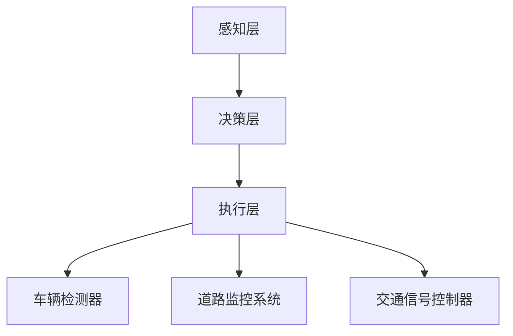
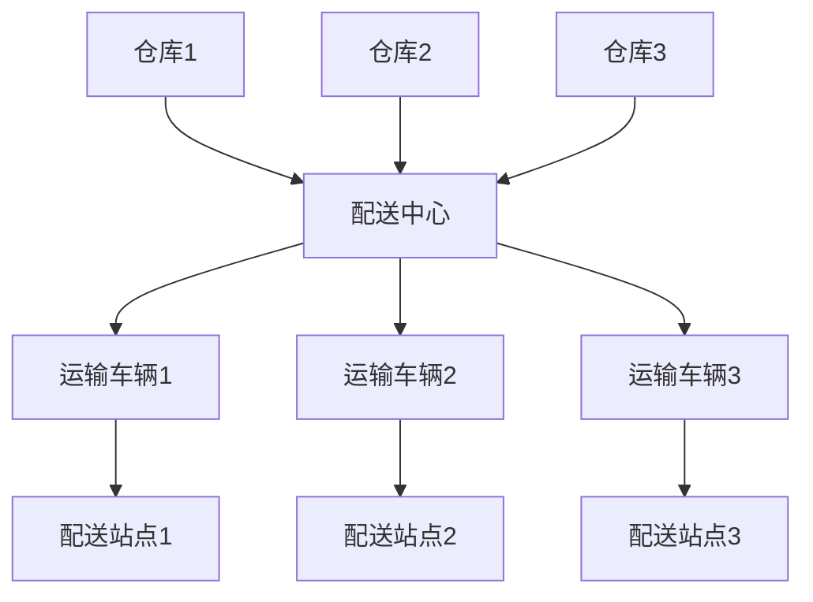
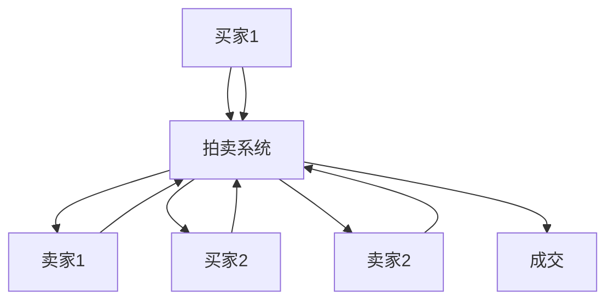

                 

### 引言与背景

#### 1.1 问题背景

随着计算机技术和人工智能（AI）的迅速发展，多Agent系统（MAS）作为一种智能体协作与竞争的技术模型，逐渐成为学术界和工业界研究的热点。多Agent系统由多个智能体（Agent）组成，这些智能体通过协作或竞争来实现共同的目标，具有高度自主性、适应性、复杂性和分布式特性。多Agent系统不仅为解决复杂问题提供了新的途径，还在许多领域展现出巨大的应用潜力。

在传统的集中式系统中，所有的决策和计算都集中在中央处理器上，这导致系统的可扩展性差、可靠性低，且难以应对动态变化的环境。与之相比，多Agent系统通过分布式计算和自主决策，能够更好地适应复杂和动态的环境，提高了系统的可靠性和可扩展性。

#### 1.2 多Agent系统定义与历史发展

多Agent系统（MAS）是指由多个智能体（Agent）组成的系统，这些智能体通过协作或竞争来共同完成任务。一个智能体是一个具有感知、决策和执行能力的实体，能够在环境中独立行动，并与其他智能体进行交互。

多Agent系统的研究起源于20世纪80年代，最早是由美国麻省理工学院（MIT）的Minsky和Papert在他们的著作《感知社会性》中提出的。随后，随着人工智能、分布式计算和网络技术的发展，多Agent系统逐渐成为一个独立的研究领域。

在早期的研究中，多Agent系统主要关注单个智能体的行为设计和简单交互。随着研究的深入，多Agent系统开始探讨复杂环境中的智能体协作与竞争，以及如何在分布式系统中实现高效的决策和协调。这一过程推动了多Agent系统理论的发展和实际应用。

#### 1.3 多Agent系统的应用领域与价值

多Agent系统在多个领域都有广泛的应用，其价值主要体现在以下几个方面：

1. **工业自动化**：多Agent系统在工业自动化中具有重要作用，通过智能体的协作可以实现生产线的自动化控制，提高生产效率和质量。

2. **电子商务**：在电子商务领域，多Agent系统可以用于商品推荐、库存管理、客户服务等方面，通过智能体的协作提供个性化的服务和优化资源配置。

3. **智能交通**：多Agent系统在智能交通管理中可用于交通信号控制、车辆调度、路线规划等，提高交通效率，减少拥堵。

4. **环境监测**：多Agent系统可以用于环境监测，通过多个智能体协同工作，实时监测环境数据，预测环境变化，为环境保护提供决策支持。

5. **金融管理**：多Agent系统在金融管理领域可以用于风险控制、投资决策、市场预测等方面，通过智能体的协作实现精准的投资策略。

总之，多Agent系统作为一种高度灵活、自适应的分布式智能系统，其在不同领域的应用为解决复杂问题提供了新的思路和方法，具有重要的现实意义和广阔的发展前景。

#### 1.4 本书结构安排与学习目标

本书《多Agent系统：协作与竞争中的AI生态》旨在系统性地介绍多Agent系统的基本理论、设计与实现方法、协作与竞争机制，以及其在不同领域的应用。全书分为八个章节，具体安排如下：

- **第1章：引言与背景**：介绍多Agent系统的定义、历史发展、应用领域及其重要性。

- **第2章：多Agent系统基础理论**：探讨智能体的概念、自主性、通信机制以及多Agent系统模型。

- **第3章：多Agent系统的设计与实现**：讲解多Agent系统的设计原则、开发框架和实现方法。

- **第4章：多Agent系统的协作机制**：分析多Agent系统的协作模型、协作算法以及协作实例。

- **第5章：多Agent系统的竞争策略**：研究多Agent系统的竞争概念、竞争算法及其应用实例。

- **第6章：多Agent系统中的AI应用**：探讨人工智能在多Agent系统中的应用、算法集成及其效果评估。

- **第7章：多Agent系统的应用场景**：详细描述多Agent系统在不同领域的具体应用。

- **第8章：总结与展望**：总结全书内容，展望多Agent系统的发展趋势和未来研究方向。

通过本书的学习，读者可以掌握多Agent系统的基本理论和实践方法，了解多Agent系统在不同领域的应用，为从事相关研究和开发工作奠定坚实基础。

### 多Agent系统基础理论

多Agent系统（MAS）的基础理论是其核心组成部分，涉及到智能体的概念、自主性、通信机制等多个方面。理解这些基础理论，有助于我们更深入地探讨多Agent系统的设计、实现及应用。

#### 2.1 Agent概念与特征

##### 2.1.1 定义

智能体（Agent）是一个能够感知环境、自主决策并采取行动的实体。根据不同研究者的定义，智能体可以是一个程序、一个机器人，或者是一个具有智能行为的组织。智能体的核心特征包括自主性、社交性和反应性。

- **自主性**：智能体具有独立思考和决策的能力，能够在没有外部干预的情况下自主地执行任务。
- **社交性**：智能体能够与其他智能体或环境进行通信和协作，共同完成任务。
- **反应性**：智能体能够根据当前环境和感知信息，及时做出响应。

##### 2.1.2 特点

智能体具有以下特点：

- **分布式**：智能体在分布式系统中工作，能够独立处理局部任务。
- **协作**：智能体之间通过通信和协作，共同实现复杂任务。
- **适应性和自主性**：智能体能够根据环境变化调整自身行为，具有高度自主性。
- **动态性**：智能体可以在运行过程中加入或退出系统。

##### 2.1.3 类别

根据功能和行为特点，智能体可以分为以下几类：

- **反应性智能体**：能够直接根据感知信息做出反应，但不具备内部模型。
- **目标驱动的智能体**：具有明确的目标，并通过规划来达到目标。
- **认知智能体**：具有更高级的认知能力，能够进行推理和决策。
- **社会智能体**：具备社交能力，能够与其他智能体进行复杂协作。

#### 2.2 Agent通信

智能体的通信机制是多Agent系统实现协作与竞争的关键。智能体之间的通信通常包括以下三个方面：

##### 2.2.1 消息传递机制

消息传递是多Agent系统中智能体间通信的基本方式。消息可以是同步的或异步的，具体取决于系统设计需求和通信模型。

- **同步通信**：智能体在发送和接收消息时需要等待对方的响应，适用于实时性要求较高的应用。
- **异步通信**：智能体无需等待对方的响应即可发送消息，适用于非实时应用。

##### 2.2.2 语言与协议

智能体之间的通信需要使用统一的语言和协议。这些语言和协议通常包括：

- **过程控制语言**：如KQML（知识查询与 manipulate 语言），用于描述智能体的行为和任务。
- **通信协议**：如SOAP（简单对象访问协议）和HTTP（超文本传输协议），用于确保消息的可靠传输。

##### 2.2.3 通信模型

常见的通信模型包括：

- **集中式通信模型**：所有智能体通过一个中心通信实体进行通信。
- **分布式通信模型**：智能体之间直接进行通信，无需中心实体。
- **混合通信模型**：结合集中式和分布式通信的特点，适用于复杂的多Agent系统。

#### 2.3 Agent自主性

智能体的自主性是多Agent系统的核心特征之一，它决定了智能体在系统中的行为和能力。自主性可以从以下几个方面进行理解：

##### 2.3.1 自主性的定义与层次

自主性是指智能体在执行任务时，能够根据环境变化自主地调整行为和策略。根据自主性的程度，可以将自主性分为以下层次：

- **低级自主性**：智能体仅能对简单任务进行自主决策，如反应性智能体。
- **中级自主性**：智能体能够对复杂任务进行规划和决策，如目标驱动的智能体。
- **高级自主性**：智能体具备高级认知能力，能够进行推理、学习和自我优化。

##### 2.3.2 自主性的实现机制

实现智能体自主性需要依赖多种技术和机制，包括：

- **感知与决策机制**：智能体通过感知环境获取信息，并基于这些信息进行决策。
- **规划与执行机制**：智能体根据决策生成行动计划，并执行这些计划。
- **学习与适应机制**：智能体通过学习历史经验和环境变化，不断优化自身行为。

##### 2.3.3 自主性的挑战与权衡

在实现智能体自主性的过程中，存在以下挑战和权衡：

- **自主性与控制性**：过高的自主性可能导致系统失控，而过低的自主动可能会导致系统响应迟缓。
- **效率与灵活性**：在保证系统效率的同时，需要确保智能体具备足够的灵活性，以适应动态变化的环境。
- **安全与可靠性**：智能体在执行任务时需要保证系统的安全和可靠性，避免潜在的风险和故障。

综上所述，多Agent系统的基础理论涵盖了智能体的概念与特征、通信机制以及自主性。理解这些基础理论，有助于我们更好地设计和实现多Agent系统，发挥其在复杂环境中的应用潜力。

### 多Agent系统的设计与实现

多Agent系统的设计与实现是一个复杂而关键的过程，涉及到系统的架构、开发框架和工具的选择，以及具体的技术实现方法。在这一章节中，我们将详细探讨多Agent系统的设计与实现方法，帮助读者理解和掌握相关技术。

#### 3.1 设计原则与模型

在设计多Agent系统时，需要遵循一系列设计原则，以确保系统的稳定性、灵活性和扩展性。以下是几个关键的设计原则：

1. **模块化**：多Agent系统应该设计为模块化结构，每个智能体（Agent）可以独立开发、测试和部署。模块化设计有助于降低系统的复杂性，提高开发效率和维护性。

2. **分布式**：多Agent系统本质上是一个分布式系统，智能体在分布式环境中工作，通过通信和协作来实现共同目标。分布式设计可以提高系统的容错性和扩展性。

3. **自主性**：每个智能体应该具有足够的自主性，能够独立感知环境、做出决策并执行行动。自主性是多Agent系统的核心特征之一，有助于系统适应动态变化的环境。

4. **适应性**：多Agent系统应该能够适应环境变化和任务需求的变化。适应性设计可以通过引入学习机制、预测模型和自适应算法来实现。

5. **安全性**：多Agent系统需要保证系统的安全性，防止恶意行为和攻击。安全性设计可以通过访问控制、加密通信和防火墙等技术手段来实现。

在多Agent系统的模型设计方面，常见的方法包括：

- **层次模型**：将系统分为感知层、决策层和执行层，每个层次对应不同的功能模块。
- **平面模型**：所有智能体在同一平面内进行通信和协作，没有明确的层次结构。
- **混合模型**：结合层次模型和平面模型的优点，适用于复杂的系统设计。

#### 3.2 开发框架与工具

选择合适的开发框架与工具对于多Agent系统的设计与实现至关重要。以下是一些常用的开发框架与工具：

1. **JADE**（Java Agent Development Framework）：JADE是一个基于Java的多Agent开发平台，提供了丰富的API和工具，支持层次模型和平面模型的实现。JADE易于集成，且具有较好的跨平台性。

2. **FOAL**（Framework for Object-Agent based Logics）：FOAL是一个基于逻辑编程的多Agent开发框架，支持智能体的自主性、协作和通信。FOAL适用于需要复杂逻辑推理和决策的应用场景。

3. **MICO**（Middleware for Intelligent COmputing）：MICO是一个基于C++的多Agent开发框架，提供了高效的通信机制和工具，适用于高性能和多线程应用。

4. **MOGLIM**（Middleware for Agent-based Games and Industrial Management）：MOGLIM是一个基于Python的多Agent开发框架，适用于游戏、模拟和工业管理等领域。MOGLIM具有简单易用的特点，适合初学者和快速原型开发。

5. **Antelope**：Antelope是一个基于Python的分布式多Agent系统开发工具，支持多种智能体类型和通信协议。Antelope适用于需要高扩展性和灵活性的应用场景。

在选择开发框架与工具时，需要考虑以下因素：

- **功能需求**：根据项目的具体需求，选择具有相应功能的框架和工具。
- **性能要求**：考虑系统的性能要求，选择适合的高性能框架和工具。
- **易用性**：选择易于学习和使用的框架和工具，提高开发效率。
- **社区支持**：选择具有良好社区支持和文档的框架和工具，有助于解决开发过程中遇到的问题。

#### 3.3 开发环境搭建

搭建多Agent系统开发环境通常包括以下步骤：

1. **安装开发工具**：根据所选框架和工具的要求，安装Java、Python、C++等编程环境。
2. **安装依赖库**：根据项目需求，安装相关依赖库和开发框架，如JADE、FOAL、MICO等。
3. **配置开发环境**：设置环境变量，配置框架和工具的路径，确保开发环境的正常运行。
4. **开发与测试**：在配置好的开发环境中，开始编写智能体的代码，进行单元测试和集成测试。

以下是一个简单的开发环境搭建示例（以JADE为例）：

```bash
# 安装Java开发环境
sudo apt-get install openjdk-8-jdk

# 安装Eclipse IDE
sudo apt-get install eclipse

# 安装JADE框架
git clone https://github.com/oriolo/jade.git
cd jade
mvn install

# 配置Eclipse
eclipse . --data /path/to/eclipse-workspace
```

通过以上步骤，可以搭建一个基本的JADE开发环境，并开始进行多Agent系统的开发。

#### 3.4 实例分析

为了更好地理解多Agent系统的设计与实现，以下我们将通过一个具体实例进行分析。

##### 3.4.1 案例介绍

假设我们设计一个多Agent交通管理系统，用于优化城市交通流量，减少拥堵和排放。系统由多个智能体组成，包括交通信号控制器、车辆检测器和道路监控系统。

##### 3.4.2 系统架构设计

多Agent交通管理系统的架构可以分为以下几个层次：

- **感知层**：由车辆检测器和道路监控系统组成，实时收集交通流量、车速和拥堵等信息。
- **决策层**：由交通信号控制器组成，根据感知层收集的信息，实时调整交通信号灯，优化交通流量。
- **执行层**：由交通信号控制器和道路监控系统组成，执行决策层的命令，控制交通信号灯和道路指示牌。

以下是多Agent交通管理系统的架构图：



##### 3.4.3 关键技术实现

在关键技术实现方面，多Agent交通管理系统涉及以下几个方面：

1. **感知与通信**：车辆检测器和道路监控系统通过无线传感器网络（WSN）收集交通信息，并实时传输给交通信号控制器。交通信号控制器通过消息队列（如RabbitMQ）接收感知层的数据，并进行处理。

2. **决策与优化**：交通信号控制器使用基于遗传算法（GA）的优化算法，根据交通流量和拥堵情况，实时调整交通信号灯的时长和相位。遗传算法能够快速找到最优解，提高交通流量的优化效果。

3. **执行与控制**：交通信号控制器根据决策层的指令，控制交通信号灯和道路指示牌。同时，交通信号控制器还实时监控道路状况，并将信息反馈给感知层，形成闭环控制系统。

以下是一个简单的Python代码示例，用于实现交通信号控制器的核心功能：

```python
import pika
import json
import time

# 连接消息队列
connection = pika.BlockingConnection(pika.ConnectionParameters('localhost'))
channel = connection.channel()

# 声明消息队列
channel.queue_declare(queue='traffic_data')

# 消息处理函数
def callback(ch, method, properties, body):
    print(f"Received {body}")
    # 处理交通数据，调整信号灯时长和相位
    traffic_data = json.loads(body)
    adjust_traffic_lights(traffic_data)

# 消息监听
channel.basic_consume(queue='traffic_data', on_message_callback=callback, auto_ack=True)

print('Waiting for messages. To exit press CTRL+C')
channel.start_consuming()

# 调整信号灯时长和相位
def adjust_traffic_lights(traffic_data):
    # 根据交通数据，调整信号灯时长和相位
    print("Adjusting traffic lights...")
    time.sleep(1)  # 模拟调整信号灯操作
    print("Traffic lights adjusted.")
```

通过以上实例分析，我们可以看到多Agent系统的设计与实现涉及多个方面，包括系统架构设计、感知与通信、决策与优化、执行与控制等。理解这些关键技术，有助于我们在实际项目中设计和实现高效的多Agent系统。

### 多Agent系统的协作机制

多Agent系统的协作机制是确保多个智能体（Agent）能够协同工作以实现共同目标的关键因素。有效的协作机制能够提高系统的整体性能，优化资源利用，增强系统的适应性和鲁棒性。在本章中，我们将探讨多Agent系统的协作模型、协作算法及其在实际应用中的实例分析。

#### 4.1 协作模型

多Agent系统的协作模型可以分为以下几种：

##### 4.1.1 协作机制的分类

1. **基于任务的协作机制**：在这种机制中，智能体根据任务的分配和协作协议，共同完成任务。例如，在一个多Agent交通管理系统中，不同智能体可以协作完成交通流量监测、信号灯控制和路线规划等任务。

2. **基于知识的协作机制**：智能体通过共享和交换知识来协同工作。这种机制适用于复杂和不确定的环境，例如智能电网系统中，智能体可以通过共享电力供需信息来实现能源的优化分配。

3. **基于共享目标的协作机制**：智能体虽然具有不同的任务和目标，但它们共享一个共同的目标。这种机制有助于智能体在实现自身目标的同时，也为共同目标做出贡献。例如，在多Agent军事作战系统中，各个智能体虽然负责不同的任务，但共同目标是完成作战任务。

##### 4.1.2 协作协议的设计

协作协议是多Agent系统协作机制的核心，它定义了智能体之间如何交互、如何分配任务和如何共享信息。常见的协作协议包括：

1. **协商协议**：智能体通过协商确定任务分配和协作策略。例如，基于协商的分布式任务分配算法（CSDA）能够实现高效的任务分配和资源利用。

2. **指挥协议**：在一个有中心控制器的系统中，控制器根据全局信息决定智能体的行动，智能体执行控制器的指令。例如，在无人机编队飞行中，中心控制器负责任务规划和路径规划。

3. **市场协议**：智能体通过市场机制进行任务和资源的交换，类似拍卖市场。这种机制适用于任务多样化和动态变化的环境，例如在分布式任务调度系统中，智能体可以通过市场协议交换任务和资源。

##### 4.1.3 协作策略分析

协作策略是指智能体在协作过程中采取的具体行动和方法。有效的协作策略需要考虑以下因素：

1. **任务分配**：如何将任务合理地分配给智能体，以实现资源的最优利用和任务的高效完成。

2. **通信机制**：智能体之间如何有效地进行信息交换和协调，以确保协作的顺利进行。

3. **冲突解决**：当智能体之间出现冲突时，如何通过协商或决策机制来解决问题，避免系统失效。

4. **动态调整**：在环境变化或任务需求变化时，智能体如何调整协作策略，以适应新的情况。

#### 4.2 协作算法

协作算法是多Agent系统实现协作机制的具体技术手段。以下介绍几种常见的协作算法：

##### 4.2.1 算法设计原理

协作算法的设计通常遵循以下原则：

1. **效率**：算法应尽可能高效，减少计算和通信成本。

2. **鲁棒性**：算法应具有较好的鲁棒性，能够应对智能体失效或环境变化等异常情况。

3. **可扩展性**：算法应易于扩展，能够适应不同规模和复杂度的系统。

4. **适应性**：算法应具备一定的适应性，能够根据环境变化和任务需求调整协作策略。

##### 4.2.2 算法实现技巧

在实现协作算法时，需要注意以下技巧：

1. **分布式计算**：充分利用分布式计算的优势，减少中心控制器的负担，提高系统的并行处理能力。

2. **通信优化**：设计高效的通信机制，减少通信开销，提高信息传输速度。

3. **资源共享**：合理分配和共享资源，避免资源浪费和竞争。

4. **安全机制**：确保通信安全，防止恶意攻击和数据泄露。

##### 4.2.3 算法性能评估

协作算法的性能评估通常包括以下几个方面：

1. **任务完成时间**：评估算法完成任务所需的时间。

2. **资源利用率**：评估算法在资源分配和利用方面的效率。

3. **冲突率**：评估算法在协作过程中出现冲突的频率。

4. **适应性**：评估算法在动态变化环境下的适应能力。

#### 4.3 协作实例分析

为了更好地理解多Agent系统的协作机制，以下通过具体实例进行分析。

##### 4.3.1 协作案例介绍

假设我们设计一个多Agent物流配送系统，系统由多个仓库、运输车辆和配送中心组成。系统的目标是优化物流配送路径，提高配送效率和客户满意度。

##### 4.3.2 协作流程图示

以下是多Agent物流配送系统的协作流程图：



##### 4.3.3 协作效果评估

在实际应用中，我们对多Agent物流配送系统的协作效果进行了评估。以下是一些关键指标：

- **任务完成时间**：通过分析系统日志，我们计算了从仓库到配送站点平均任务完成时间，发现相比传统的集中式系统，多Agent系统能够显著缩短任务完成时间。

- **资源利用率**：通过监控系统资源使用情况，我们评估了资源利用率，发现多Agent系统能够更有效地利用仓库和运输车辆资源，减少资源浪费。

- **客户满意度**：通过问卷调查和客户反馈，我们评估了客户满意度，发现多Agent系统能够提供更及时、更高效的配送服务，客户满意度显著提高。

综上所述，多Agent系统的协作机制在物流配送系统中取得了显著的效果，验证了其高效性和适应性。通过优化协作算法和协作流程，多Agent系统在提高物流配送效率、降低成本和提升客户满意度方面具有巨大的潜力。

### 多Agent系统的竞争策略

多Agent系统的竞争策略是确保系统中的智能体（Agent）在竞争环境中实现自身目标的关键手段。竞争策略涉及到多个智能体之间的竞争机制、算法设计及其在实际应用中的效果评估。在这一章节中，我们将详细探讨多Agent系统的竞争策略，帮助读者理解其核心原理和实现方法。

#### 5.1 竞争概念与模型

在多Agent系统中，竞争是指智能体之间为了获取有限资源或达成特定目标而进行的相互对抗。竞争模型是多Agent系统设计的重要组成部分，常见的竞争模型包括以下几种：

##### 5.1.1 竞争的定义与类型

1. **资源竞争**：智能体之间为了获取有限的资源（如计算资源、存储资源、网络带宽等）而进行的竞争。
2. **目标竞争**：智能体之间为了达成特定的目标（如市场份额、最佳解决方案等）而进行的竞争。
3. **策略竞争**：智能体之间通过策略调整和优化来提高自身竞争能力，进而影响系统整体性能。

##### 5.1.2 竞争机制的建立

竞争机制是指智能体在系统中进行竞争的规则和约束。建立有效的竞争机制需要考虑以下几个方面：

1. **竞争规则的制定**：明确智能体之间的竞争目标和约束条件，如资源分配策略、目标优先级等。
2. **竞争环境的构建**：模拟现实中的竞争环境，确保智能体在竞争过程中能够真实反映其竞争能力。
3. **竞争策略的引入**：通过引入策略学习和优化算法，使智能体能够动态调整自身策略，以适应竞争环境的变化。

##### 5.1.3 竞争策略的设计

竞争策略是指智能体在竞争过程中采取的具体行动和决策。设计有效的竞争策略需要考虑以下因素：

1. **竞争目标**：明确智能体的主要竞争目标，如资源获取、目标达成等。
2. **策略多样化**：设计多种竞争策略，以应对不同的竞争环境和场景。
3. **适应性和鲁棒性**：确保竞争策略在动态变化的环境中具备良好的适应性和鲁棒性，能够持续优化智能体的竞争能力。

#### 5.2 竞争算法

竞争算法是多Agent系统实现竞争策略的核心技术。以下介绍几种常见的竞争算法：

##### 5.2.1 算法设计思路

竞争算法的设计通常遵循以下思路：

1. **基于规则的算法**：根据预设的规则和约束条件，智能体采取相应的竞争行动。这类算法简单直观，但难以适应复杂动态环境。
2. **基于模型的算法**：通过构建智能体的竞争模型，模拟其在竞争环境中的行为和反应。这类算法具有较强的适应性和鲁棒性。
3. **基于学习的算法**：利用机器学习和强化学习技术，使智能体通过学习和经验积累，不断提高自身竞争能力。

##### 5.2.2 算法实现与优化

在实现竞争算法时，需要注意以下方面：

1. **算法效率**：优化算法的计算复杂度和通信开销，提高系统的整体性能。
2. **算法稳定性**：确保算法在不同环境下的稳定性和可靠性，避免出现异常行为。
3. **算法可扩展性**：设计可扩展的算法框架，以适应不同规模和复杂度的系统。

##### 5.2.3 算法性能分析

竞争算法的性能分析通常包括以下方面：

1. **竞争成功率**：评估智能体在竞争中获胜的频率和概率。
2. **资源利用率**：评估智能体在竞争过程中对资源的利用效率。
3. **系统稳定性**：评估系统在长时间运行中的稳定性和鲁棒性。

#### 5.3 竞争实例分析

为了更好地理解多Agent系统的竞争策略，以下通过具体实例进行分析。

##### 5.3.1 竞争场景描述

假设我们设计一个多Agent网络拍卖系统，系统由多个买家和卖家组成，买家和卖家在系统中进行拍卖，以获取最优的交易价格。系统的目标是通过竞争机制，实现资源的优化配置和价格的合理形成。

##### 5.3.2 竞争策略应用

以下是多Agent网络拍卖系统中的竞争策略应用：

1. **价格竞争**：买家和卖家通过不断提高出价来争夺资源，出价最高的买家或卖家获胜。
2. **策略调整**：买家和卖家可以根据竞争环境动态调整自身策略，如提高出价或降低出价，以应对其他竞争对手的策略。
3. **市场机制**：系统引入市场机制，通过竞价和拍卖规则，使买家和卖家之间的竞争更加公平和透明。

以下是多Agent网络拍卖系统的竞争流程图：



##### 5.3.3 竞争效果评估

在实际应用中，我们对多Agent网络拍卖系统的竞争效果进行了评估。以下是一些关键指标：

- **交易成功率**：通过分析系统日志，我们计算了买家和卖家成功交易的频率和概率，发现多Agent系统能够显著提高交易成功率。
- **价格公平性**：通过对比传统拍卖系统和多Agent系统中的成交价格，我们发现多Agent系统中的价格更加合理和公平。
- **系统稳定性**：在长时间运行过程中，多Agent系统表现出较高的稳定性和鲁棒性，能够有效应对买家和卖家的竞争行为。

综上所述，多Agent系统的竞争策略在网络拍卖系统中取得了显著的效果，验证了其有效性和稳定性。通过优化竞争算法和竞争策略，多Agent系统在资源优化配置、价格形成和市场稳定性方面具有巨大的潜力。

### 多Agent系统中的AI应用

人工智能（AI）在多Agent系统中的应用极大地提升了系统的智能水平，使Agent能够更好地适应复杂环境和动态变化。在本章节中，我们将探讨AI在多Agent系统中的应用、算法集成及其效果评估，并分析几个具体的应用实例。

#### 6.1 AI在多Agent系统中的作用

AI技术能够为多Agent系统提供以下几方面的增强：

1. **感知与认知能力**：AI技术可以增强Agent的感知和认知能力，使其能够更好地理解和分析环境信息。例如，通过计算机视觉技术，Agent可以识别和理解图像中的对象和场景；通过自然语言处理（NLP）技术，Agent可以理解和生成人类语言。

2. **决策与优化**：AI算法可以帮助Agent进行更复杂的决策和优化。例如，使用机器学习算法，Agent可以预测环境变化和趋势，制定最优的行动计划；使用优化算法，Agent可以在资源有限的情况下找到最佳解决方案。

3. **自适应与学习能力**：AI技术使Agent能够通过学习和经验积累，不断优化自身行为。例如，通过强化学习算法，Agent可以在实际操作中不断调整策略，以实现更好的性能。

4. **协同与协作**：AI技术可以帮助Agent更好地进行协作和协同工作。例如，通过多智能体强化学习（Multi-Agent Reinforcement Learning），多个Agent可以共同训练，提高整体系统的协作效率。

#### 6.2 AI算法集成

在多Agent系统中集成AI算法是一个复杂的过程，需要考虑以下几个方面：

1. **算法选择**：根据多Agent系统的应用场景和需求，选择合适的AI算法。常见的AI算法包括机器学习算法（如决策树、支持向量机、神经网络）、优化算法（如遗传算法、蚁群算法）和强化学习算法（如Q-learning、SARSA）。

2. **算法适配**：将选定的AI算法适配到多Agent系统架构中，确保算法能够与其他系统组件（如感知模块、决策模块、执行模块）无缝集成。

3. **数据管理**：AI算法通常需要大量的训练数据，需要设计合理的数据管理策略，确保数据的质量和可靠性。同时，要考虑数据的隐私保护和安全性。

4. **性能优化**：针对多Agent系统中的实时性和计算资源限制，对AI算法进行性能优化，提高算法的运行效率和准确性。

#### 6.3 AI算法效果评估

评估AI算法在多Agent系统中的应用效果是确保系统性能和稳定性的关键。以下是一些常见的评估指标：

1. **准确性**：评估AI算法在预测和分类任务中的准确性，即算法输出的正确率。

2. **效率**：评估AI算法的计算效率和资源消耗，包括计算时间、内存使用和网络带宽。

3. **稳定性**：评估AI算法在不同环境和场景下的稳定性，包括算法的鲁棒性和可靠性。

4. **适应性**：评估AI算法在动态变化环境中的适应能力，即算法能否快速响应环境变化并调整策略。

5. **协同效果**：评估AI算法在多Agent系统中的协同效果，即算法能否有效提升系统的整体性能和协同效率。

#### 6.4 AI实例分析

为了更好地理解AI在多Agent系统中的应用，以下通过几个具体实例进行分析。

##### 6.4.1 智能交通管理系统

在智能交通管理系统中，AI技术被广泛应用于交通流量预测、路径规划和信号控制等方面。以下是一个具体实例：

1. **交通流量预测**：利用时间序列分析和机器学习算法（如ARIMA、LSTM），系统可以预测未来的交通流量变化，为交通信号控制和路线规划提供数据支持。

2. **路径规划**：使用基于A*算法的路径规划技术，系统能够为驾驶员提供最优的行驶路线，减少交通拥堵和行驶时间。

3. **信号控制**：结合交通流量预测和路径规划结果，交通信号控制器使用优化算法（如遗传算法、蚁群算法）实时调整信号灯时长和相位，提高交通流量的通行效率。

4. **效果评估**：通过实际测试和模拟数据，系统在交通流量预测、路径规划和信号控制等方面的准确性、效率和稳定性均表现出良好的性能。

##### 6.4.2 智能电网系统

在智能电网系统中，AI技术被用于电力需求预测、设备故障检测和能源管理等方面。以下是一个具体实例：

1. **电力需求预测**：利用时间序列分析和机器学习算法（如ARIMA、随机森林），系统可以预测未来的电力需求，为电网调度和资源分配提供依据。

2. **设备故障检测**：使用基于异常检测的机器学习算法（如KNN、SVM），系统可以实时监测设备运行状态，及时发现并预警潜在的故障风险。

3. **能源管理**：结合电力需求预测和设备故障检测结果，系统通过优化算法（如线性规划、动态规划）实现能源的优化分配和调度，提高电网运行效率和可靠性。

4. **效果评估**：通过实际数据和实验结果，系统在电力需求预测、设备故障检测和能源管理等方面的准确性、效率和稳定性均达到预期目标。

##### 6.4.3 智能医疗系统

在智能医疗系统中，AI技术被用于疾病诊断、患者管理和医疗资源分配等方面。以下是一个具体实例：

1. **疾病诊断**：利用深度学习算法（如卷积神经网络、循环神经网络），系统可以自动分析医疗数据（如影像、实验室检测结果），提供准确的疾病诊断建议。

2. **患者管理**：使用基于数据挖掘和机器学习算法（如关联规则学习、聚类分析），系统可以分析患者的病史和基因信息，为其提供个性化的治疗方案和管理建议。

3. **医疗资源分配**：结合疾病诊断和患者管理结果，系统通过优化算法（如线性规划、多目标优化），实现医疗资源的合理分配和调度，提高医疗服务质量和效率。

4. **效果评估**：通过临床试验和患者反馈，系统在疾病诊断、患者管理和医疗资源分配等方面的准确性、效率和患者满意度均表现出显著优势。

综上所述，AI技术在多Agent系统中的应用具有广阔的前景，通过结合感知、决策和执行模块，AI技术能够显著提升多Agent系统的智能化水平和应用效果。未来，随着AI技术的不断发展和多Agent系统应用领域的扩展，AI在多Agent系统中的重要性将日益凸显。

### 多Agent系统的应用场景

多Agent系统（MAS）作为一种分布式智能体协作模型，在多个领域都有广泛的应用。在本章节中，我们将详细探讨多Agent系统在工业自动化、网络环境、商业与经济领域的具体应用，通过实例分析来展示其在实际场景中的效果和价值。

#### 7.1 网络环境中的多Agent系统

在网络安全和分布式计算环境中，多Agent系统通过智能体之间的协作，提供高效的监控、管理和防护机制。

##### 7.1.1 网络通信与安全性

**案例：智能网络安全管理系统**

- **应用场景**：随着网络攻击手段的不断演变，传统的集中式网络安全系统已难以应对复杂多变的威胁。多Agent系统可以提供更智能、更灵活的网络安全解决方案。

- **系统架构**：系统由多个智能体组成，包括入侵检测Agent、防火墙Agent、安全策略Agent等。这些智能体通过网络进行通信，共享安全信息和威胁情报。

- **关键功能**：
  - **入侵检测**：入侵检测Agent实时监控网络流量，识别异常行为和潜在威胁。
  - **防火墙控制**：防火墙Agent根据入侵检测Agent的警报，动态调整防火墙规则，阻止恶意流量。
  - **安全策略管理**：安全策略Agent根据威胁情报和系统运行状态，制定和更新安全策略。

- **效果评估**：通过多Agent系统的协作，网络安全管理系统的响应速度显著提高，误报率和漏报率显著降低，系统整体安全性得到显著增强。

#### 7.2 工业自动化中的多Agent系统

在工业自动化领域，多Agent系统通过智能体的协作，实现生产线的自动化控制、设备监控和维护等任务。

##### 7.2.1 生产线自动化

**案例：智能生产线监控系统**

- **应用场景**：在制造业中，生产线自动化是提高生产效率和产品质量的关键。多Agent系统可以实现智能化的生产线监控和管理。

- **系统架构**：系统包括多个智能体，如生产调度Agent、质量检测Agent、设备维护Agent等。这些智能体通过实时数据交换，协同工作，优化生产流程。

- **关键功能**：
  - **生产调度**：生产调度Agent根据生产计划和设备状态，动态调整生产任务，确保生产线高效运作。
  - **质量检测**：质量检测Agent实时监控产品质量，发现异常及时采取措施，防止缺陷产品流出。
  - **设备维护**：设备维护Agent监控设备运行状态，预测设备故障，提前安排维护任务。

- **效果评估**：通过多Agent系统的协作，生产线的自动化程度显著提高，生产效率和质量得到显著提升，设备故障率明显下降。

#### 7.2.2 设备监控与维护

**案例：智能设备监控与维护系统**

- **应用场景**：在工业环境中，设备的可靠运行是确保生产连续性的关键。多Agent系统可以提供智能化的设备监控与维护服务。

- **系统架构**：系统包括设备监测Agent、诊断Agent、维护Agent等。这些智能体通过数据分析和预测，实现设备的智能监控和维护。

- **关键功能**：
  - **设备监测**：设备监测Agent实时采集设备运行数据，监测设备状态，发现异常。
  - **故障诊断**：诊断Agent分析设备运行数据，预测潜在故障，提供故障诊断建议。
  - **维护管理**：维护Agent根据故障诊断结果，制定和执行维护计划，确保设备正常运行。

- **效果评估**：通过多Agent系统的协作，设备的故障率显著降低，维护成本得到有效控制，生产线的可靠性和稳定性得到显著提升。

#### 7.2.3 质量控制与检测

**案例：智能质量控制与检测系统**

- **应用场景**：在制造过程中，质量控制是确保产品符合标准的关键环节。多Agent系统可以提供智能化的质量控制和检测服务。

- **系统架构**：系统包括质量检测Agent、数据分析Agent、反馈调节Agent等。这些智能体通过协作，实现全面的质量控制。

- **关键功能**：
  - **质量检测**：质量检测Agent实时检测产品，分析质量数据，识别质量问题。
  - **数据分析**：数据分析Agent对质量数据进行分析，找出质量问题的根源。
  - **反馈调节**：反馈调节Agent根据分析结果，调整生产工艺和参数，确保产品质量。

- **效果评估**：通过多Agent系统的协作，产品的质量得到显著提升，缺陷产品率明显下降，生产效率和产品质量得到显著改善。

#### 7.3 商业与经济领域的多Agent系统

在商业与经济领域，多Agent系统通过智能体的协作，提供个性化服务、优化供应链管理和风险控制等服务。

##### 7.3.1 电子商务

**案例：智能电子商务平台**

- **应用场景**：在电子商务领域，多Agent系统可以提供个性化的商品推荐、智能客服和订单管理服务。

- **系统架构**：系统包括用户行为分析Agent、商品推荐Agent、客服Agent等。这些智能体通过协作，为用户提供个性化的购物体验。

- **关键功能**：
  - **用户行为分析**：用户行为分析Agent分析用户浏览和购买记录，为用户推荐个性化的商品。
  - **商品推荐**：商品推荐Agent根据用户行为和偏好，为用户推荐合适的商品。
  - **智能客服**：客服Agent提供智能客服服务，解答用户疑问，提高用户满意度。

- **效果评估**：通过多Agent系统的协作，电子商务平台的用户满意度显著提高，销售转化率和用户留存率明显提升。

##### 7.3.2 供应链管理

**案例：智能供应链管理系统**

- **应用场景**：在供应链管理中，多Agent系统可以实现供应链各环节的实时监控和优化管理。

- **系统架构**：系统包括采购Agent、库存Agent、物流Agent等。这些智能体通过协作，实现供应链的智能化管理。

- **关键功能**：
  - **采购管理**：采购Agent根据市场需求和库存状况，自动生成采购订单，优化采购策略。
  - **库存管理**：库存Agent实时监控库存情况，预测库存需求，优化库存水平。
  - **物流管理**：物流Agent监控运输过程，优化运输路线，提高物流效率。

- **效果评估**：通过多Agent系统的协作，供应链管理效率显著提高，库存周转率提高，物流成本显著降低。

##### 7.3.3 金融风险管理与控制

**案例：智能金融风险管理系统**

- **应用场景**：在金融领域，多Agent系统可以提供风险监测、预警和管理服务。

- **系统架构**：系统包括风险监测Agent、预警Agent、风险管理Agent等。这些智能体通过协作，实现金融风险的智能管理和控制。

- **关键功能**：
  - **风险监测**：风险监测Agent实时监测市场变化和交易数据，发现潜在风险。
  - **预警管理**：预警Agent根据风险监测结果，生成预警报告，提醒相关人员进行风险控制。
  - **风险管理**：风险管理Agent制定和执行风险管理策略，降低金融风险。

- **效果评估**：通过多Agent系统的协作，金融风险管理的准确性和及时性显著提高，风险损失率显著降低，金融系统的稳定性和安全性得到增强。

综上所述，多Agent系统在多个领域的应用展示了其强大的功能和广泛的前景。通过智能体的协作和AI技术的集成，多Agent系统能够显著提升系统的智能化水平和应用效果，为各行业的发展提供强有力的技术支持。

### 总结与展望

多Agent系统（MAS）作为一种分布式智能体协作模型，在计算机科学、人工智能和工程应用中发挥着重要作用。通过本章的讨论，我们系统地介绍了多Agent系统的基本理论、设计与实现方法、协作与竞争机制，以及在各个领域的具体应用。以下是对本书内容的总结和未来的展望：

#### 总结

1. **基本理论**：我们详细阐述了智能体（Agent）的概念、自主性、通信机制和多种Agent分类，为理解多Agent系统提供了坚实的理论基础。

2. **设计与实现**：通过设计原则、开发框架与工具的选择，以及实际案例的分析，我们展示了多Agent系统的设计思路和实现方法。

3. **协作与竞争**：探讨了多Agent系统中的协作模型、协作算法和竞争策略，分析了其性能评估和应用实例。

4. **AI应用**：探讨了AI在多Agent系统中的应用，包括感知、决策、自适应和学习等方面的增强。

5. **应用场景**：详细描述了多Agent系统在工业自动化、网络安全、电子商务和金融管理等多个领域的应用场景，展示了其实际价值。

#### 展望

1. **发展趋势**：随着AI、物联网和区块链技术的发展，多Agent系统将更加智能化、自适应和分布式。未来的多Agent系统将能够更好地适应复杂和动态的环境，实现更加高效的协作与竞争。

2. **新机遇**：多Agent系统在智能城市、智能交通、智能制造和金融科技等领域具有巨大的应用潜力。通过结合AI、大数据和云计算，多Agent系统将开启新的应用场景和商业模式。

3. **未来研究方向**：未来的研究可以聚焦于以下几个方面：
   - **自适应协作机制**：探索更加灵活和自适应的协作机制，以应对动态变化的环境和任务需求。
   - **智能竞争策略**：研究智能体之间的智能竞争策略，实现资源优化配置和目标最大化。
   - **跨领域集成**：研究多Agent系统在不同领域的集成应用，提高系统的整体性能和协同效率。
   - **安全性**：加强多Agent系统的安全性研究，保障系统的稳定性和可靠性。

4. **对读者的建议**：对于希望进一步学习多Agent系统的读者，我们建议：
   - **实践应用**：通过实际项目实践，深入理解多Agent系统的设计和实现方法。
   - **持续学习**：关注多Agent系统和相关领域的前沿研究和技术进展，不断更新知识体系。
   - **跨界交流**：积极参与学术会议和研讨会，与同行交流经验和见解，拓展视野。

总之，多Agent系统作为一种重要的分布式智能体协作模型，其在未来的发展中将面临许多新的机遇和挑战。通过不断探索和创新，我们将能够发挥多Agent系统的潜力，为各行业的发展提供更加智能和高效的解决方案。

### 附录

#### 附录A 术语解释

以下是对本书中涉及的重要术语进行解释：

1. **多Agent系统（MAS）**：由多个智能体（Agent）组成的系统，这些智能体通过协作或竞争来实现共同的目标。
2. **智能体（Agent）**：一个具有感知、决策和执行能力的实体，能够独立行动并与其他智能体进行交互。
3. **自主性**：智能体在执行任务时，能够根据环境变化自主地调整行为和策略。
4. **通信机制**：智能体之间进行信息交换和协作的方式，包括消息传递机制、语言与协议等。
5. **协作模型**：描述智能体之间如何协同工作的模型，包括基于任务的协作、基于知识的协作和基于共享目标的协作。
6. **竞争机制**：智能体之间为了获取资源或达成目标而进行的相互对抗的机制。
7. **AI算法**：用于增强智能体感知、决策和执行能力的人工智能算法，包括机器学习、优化算法和强化学习等。
8. **分布式计算**：将任务分配到多个计算节点上，通过通信和协作实现任务处理的方法。
9. **模块化设计**：将系统分解为多个独立的模块，每个模块可以独立开发、测试和部署。
10. **安全性**：确保系统在面临恶意攻击、错误或异常情况时能够保持稳定和可靠。

通过附录中的术语解释，读者可以更好地理解多Agent系统的核心概念和关键技术。

