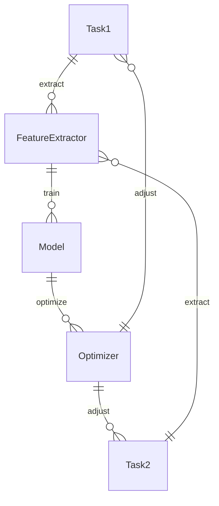
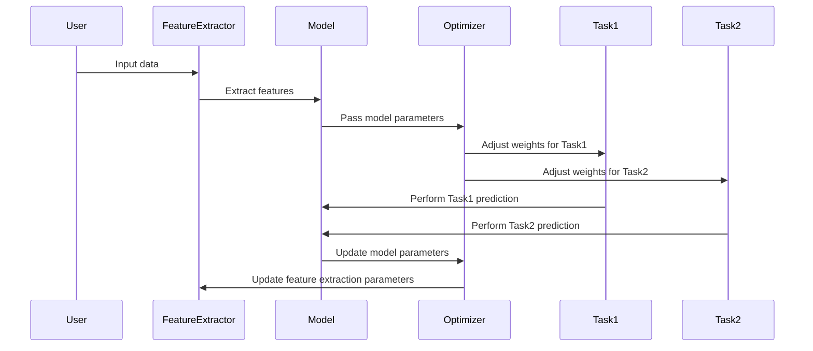

                 


### **文章标题**: 多任务学习框架：构建全能型AI Agent

#### **关键词**: 多任务学习，AI Agent，框架，架构设计，数学模型，Python实现

#### **摘要**: 本文将深入探讨多任务学习（M TL）框架在构建全能型AI Agent中的应用。我们将从背景介绍开始，逐步分析核心概念、现有框架的优缺点，以及如何设计并实现一个多任务学习框架。最后，我们将通过一个实际案例展示如何将这一框架应用于AI Agent的构建，并总结相关最佳实践。

---

### **背景介绍**

在当前人工智能（AI）领域，单任务学习（Single-Task Learning）已经取得了显著的成果。例如，计算机视觉系统可以识别图像中的物体，自然语言处理（NLP）模型可以理解和生成文本。然而，现实世界的问题往往具有多样性和复杂性，要求AI系统能够同时处理多个任务，从而提高其适应性和实用性。这促使研究者们开始关注多任务学习（Multi-Task Learning，M TL）。

#### **定义与核心概念**

多任务学习是指在一个统一的模型框架下，同时学习多个相关的任务。其核心目标是通过共享特征表示来提高任务间的泛化能力，同时减少过拟合的风险。多任务学习的主要挑战包括：

1. **任务相关性**：不同任务之间可能存在不同的关联程度，这会影响共享特征的有效性。
2. **资源分配**：在有限资源下如何平衡各个任务的训练过程，以确保每个任务都能得到足够的关注。
3. **模型复杂度**：多任务学习模型通常比单任务模型更加复杂，需要更高效的训练和推理算法。

#### **问题背景与描述**

现实世界中的许多问题都可以被分解为多个子任务，例如：

1. **自动驾驶**：需要同时处理路况识别、障碍物检测、路径规划等任务。
2. **智能客服**：需要同时理解用户意图、提供问题解决方案、生成自然语言回复等任务。
3. **医疗诊断**：需要同时分析患者的病历、影像资料、生物标志物等任务。

这些问题要求AI系统能够在动态变化的环境中快速适应，并处理多个任务，从而提供高质量的服务。多任务学习框架为实现这一目标提供了有力的支持。

#### **问题解决与边界**

多任务学习框架通过以下方式解决问题：

1. **共享特征表示**：通过共享底层特征提取网络，提高任务间的特征重用率。
2. **任务权重分配**：通过动态调整各个任务的权重，平衡资源分配。
3. **多任务优化**：通过联合优化多个任务的目标函数，提高模型的泛化能力。

然而，多任务学习框架也存在一些局限性：

1. **任务独立性**：某些任务之间可能不存在明显的关联，共享特征可能导致性能下降。
2. **计算资源**：多任务学习模型通常需要更多的计算资源，可能不适合资源受限的场景。
3. **模型调试**：多任务学习模型调试相对复杂，需要更精细的调参过程。

#### **概念结构与核心要素组成**

多任务学习框架的核心结构包括：

1. **特征提取层**：用于提取通用特征表示。
2. **任务层**：用于针对不同任务进行特征分类或回归。
3. **权重分配机制**：用于动态调整各个任务的权重。
4. **优化目标函数**：用于联合优化多个任务。

以下是一个简化的ER实体关系图，描述了多任务学习框架的核心要素：



---

### **核心概念与联系**

#### **多任务学习的基本概念和定义**

多任务学习（Multi-Task Learning，M TL）是一种机器学习方法，旨在同时解决多个相关的任务。与单任务学习（Single-Task Learning）相比，M TL通过共享特征表示来提高任务间的泛化能力。以下是多任务学习的一些核心概念和定义：

1. **任务**：需要被学习或预测的具体目标，如分类、回归、检测等。
2. **特征表示**：用于描述数据的数学表示，是任务学习的基础。
3. **共享特征**：多个任务共用的特征表示，用于提高任务间的协同效应。
4. **联合优化**：同时优化多个任务的目标函数，以获得更好的整体性能。

#### **多任务学习范式**

多任务学习可以分为以下几种范式：

1. **共享网络**：多个任务共享相同的网络结构，但各自具有独立的头部分支，用于预测或分类。
2. **多网络**：每个任务都有自己的网络结构，但通过共享某些层或模块来提高特征表示的通用性。
3. **分层结构**：将任务分为高层次和低层次，高层次任务依赖于低层次任务的输出。
4. **双流网络**：将输入数据分别送入两个网络结构，分别用于不同任务的预测，最后进行融合。

#### **与单任务学习的比较**

多任务学习与单任务学习在以下几个方面有所不同：

1. **资源利用**：M TL通过共享特征表示，提高资源利用效率。
2. **泛化能力**：M TL通过联合优化多个任务，提高模型的泛化能力。
3. **模型复杂度**：M TL模型通常比单任务模型更加复杂，需要更高效的训练和推理算法。
4. **调参难度**：M TL模型调试相对复杂，需要更精细的调参过程。

#### **数学模型和公式**

多任务学习的核心是联合优化多个任务的目标函数。以下是多任务学习的一个简化数学模型：

$$
\begin{aligned}
\min_{\theta} \sum_{i=1}^{N} L(\theta; x_i, y_i) \\
\text{subject to} \quad \theta = \{\theta_1, \theta_2, \ldots, \theta_M\}
\end{aligned}
$$

其中，$L(\theta; x_i, y_i)$是第$i$个任务在参数$\theta$下的损失函数，$y_i$是第$i$个任务的真实标签，$N$是任务的数量，$M$是参数的数量。

#### **示例：图像分类与目标检测**

假设我们有一个图像分类与目标检测的多任务学习问题。图像分类任务的损失函数可以表示为：

$$
L_{\text{分类}}(\theta; x_i, y_i) = -\sum_{j=1}^{C} y_{ij} \log(p_j)
$$

其中，$C$是类别数量，$p_j$是模型对类别$j$的预测概率。

目标检测任务的损失函数可以表示为：

$$
L_{\text{检测}}(\theta; x_i, y_i) = \sum_{j=1}^{B} \lambda_j \delta_{ij} \log(1 + e^{-z_{ij}})
$$

其中，$B$是边界框的数量，$\lambda_j$是类别$j$的权重，$\delta_{ij}$是目标是否属于类别$j$的指示函数，$z_{ij}$是模型对边界框$i$的预测得分。

通过联合优化这两个任务的目标函数，我们可以获得一个同时具备分类与检测能力的模型。

---

### **多任务学习框架**

多任务学习框架是用于同时学习多个相关任务的系统结构和方法。一个有效的多任务学习框架应具备以下特性：

1. **共享特征表示**：通过共享特征提取网络，提高特征表示的通用性。
2. **任务权重分配**：通过动态调整各个任务的权重，平衡资源分配。
3. **联合优化目标**：通过联合优化多个任务的目标函数，提高模型的泛化能力。
4. **高效训练算法**：通过优化算法，提高模型训练的效率。

现有的一些多任务学习框架如下：

1. **共享网络框架**：如DeepMultiTask（DMT），它通过共享卷积神经网络（CNN）的底层特征提取层，同时学习多个图像分类任务。

2. **多网络框架**：如Multi-Modal Fusion Network（MMFN），它同时学习图像分类、文本分类和图像文本分类任务，通过共享某些层或模块来提高特征表示的通用性。

3. **分层结构框架**：如Deep Learning for Multi-Task Learning（DLMTL），它将任务分为高层次和低层次，高层次任务依赖于低层次任务的输出，通过逐步优化各层次任务来提高整体性能。

4. **双流网络框架**：如D Dual-Stream Network for Human Action Recognition，它将输入数据分别送入两个网络结构，分别用于不同任务的预测，最后进行融合。

#### **关键特性与优缺点**

以下是几种常见多任务学习框架的关键特性、优势与不足：

1. **共享网络框架**：
   - **特性**：共享底层特征提取网络。
   - **优势**：提高特征表示的通用性，减少过拟合风险。
   - **不足**：任务间的关联程度较弱时，共享特征可能导致性能下降。

2. **多网络框架**：
   - **特性**：每个任务都有自己的网络结构，但通过共享某些层或模块来提高特征表示的通用性。
   - **优势**：适合处理任务间关联性较强的场景。
   - **不足**：模型复杂度较高，训练和推理时间较长。

3. **分层结构框架**：
   - **特性**：将任务分为高层次和低层次，高层次任务依赖于低层次任务的输出。
   - **优势**：可以更好地利用任务间的依赖关系，提高模型性能。
   - **不足**：设计复杂，需要更多的调参过程。

4. **双流网络框架**：
   - **特性**：将输入数据分别送入两个网络结构，分别用于不同任务的预测，最后进行融合。
   - **优势**：可以同时处理多个输入数据源，提高模型的泛化能力。
   - **不足**：模型复杂度较高，训练和推理时间较长。

#### **比较与评价**

以下是一个简单的表格，比较了四种多任务学习框架的优缺点：

| 框架           | 特性                                                                 | 优势                                                                                         | 不足                                                                                         |
|----------------|----------------------------------------------------------------------|---------------------------------------------------------------------------------------------|---------------------------------------------------------------------------------------------|
| 共享网络框架   | 共享底层特征提取网络                                                       | 提高特征表示的通用性，减少过拟合风险                                                      | 任务间关联程度较弱时，共享特征可能导致性能下降                                     |
| 多网络框架     | 每个任务都有自己的网络结构，通过共享某些层或模块来提高特征表示的通用性 | 适合处理任务间关联性较强的场景                                                           | 模型复杂度较高，训练和推理时间较长                                             |
| 分层结构框架   | 将任务分为高层次和低层次，高层次任务依赖于低层次任务的输出               | 可以更好地利用任务间的依赖关系，提高模型性能                                           | 设计复杂，需要更多的调参过程                                               |
| 双流网络框架   | 将输入数据分别送入两个网络结构，分别用于不同任务的预测，最后进行融合     | 可以同时处理多个输入数据源，提高模型的泛化能力                                         | 模型复杂度较高，训练和推理时间较长                                           |

#### **未来发展方向**

随着AI技术的不断进步，多任务学习框架也在不断演进。未来发展方向可能包括：

1. **高效训练算法**：研究更高效的训练算法，降低多任务学习模型的训练时间。
2. **动态权重分配**：引入动态权重分配机制，根据任务的重要性和数据分布动态调整权重。
3. **跨模态学习**：结合多模态数据，如图像、文本、语音等，提高多任务学习框架的泛化能力。
4. **自适应多任务学习**：根据任务的变化和环境的变化，自适应地调整任务权重和学习策略。

通过这些发展方向，多任务学习框架将在未来实现更广泛的应用，为AI Agent的构建提供更有力的支持。

---

### **设计系统架构**

在设计一个多任务学习框架时，构建一个合理的系统架构至关重要。这不仅有助于实现各个任务之间的协调，还能提高整体性能和资源利用效率。以下是设计一个多任务学习框架的系统架构的详细步骤。

#### **问题定义和需求分析**

在开始设计之前，我们需要明确问题的定义和需求。具体来说，我们需要回答以下问题：

1. **任务类型**：我们需要识别并定义将要处理的任务类型，如图像分类、目标检测、文本分类等。
2. **任务关联性**：分析各个任务之间的关联程度，以确定是否适合使用多任务学习框架。
3. **性能指标**：确定评估模型性能的指标，如准确率、召回率、F1分数等。
4. **资源限制**：考虑计算资源和存储资源的限制，以确保系统架构的可行性。

#### **设计领域模型（类图）**

领域模型是系统架构设计的基础，用于描述系统的实体和它们之间的关系。以下是一个简化的领域模型类图，用于描述一个多任务学习框架的实体和属性：

```mermaid
classDiagram
    Task --|> FeatureExtractor
    Task --|> Model
    Model --|> Optimizer
    Optimizer --|> Task
    Task <<entity>>
    FeatureExtractor <<entity>>
    Model <<entity>>
    Optimizer <<entity>>
    Task o-- 1 Model : trained model
    FeatureExtractor o-- 1 Model : shared features
    Model o-- 1 Optimizer : optimization parameters
    Optimizer o-- 1 Task : adjustment rules
```

在这个类图中，`Task` 表示具体的任务实体，如图像分类、目标检测等。`FeatureExtractor` 表示特征提取模块，用于提取通用特征表示。`Model` 表示多任务学习模型，包括各个任务的独立部分。`Optimizer` 表示优化器，用于动态调整各个任务的权重。

#### **设计系统架构（架构图）**

系统架构图用于描述系统的整体结构和各个组件之间的关系。以下是一个简化的系统架构图，用于描述一个多任务学习框架：



在这个系统架构图中，用户输入数据经过特征提取模块提取特征，然后输入到多任务学习模型中。模型通过优化器动态调整各个任务的权重，然后分别执行各个任务的预测。最后，优化器根据预测结果更新模型参数和特征提取参数。

#### **设计接口和系统交互（序列图）**

接口设计和系统交互是系统架构的重要组成部分。以下是一个简化的序列图，用于描述多任务学习框架的接口和系统交互：


在这个序列图中，用户通过接口向特征提取模块输入数据。特征提取模块提取特征后，传递给多任务学习模型。模型通过优化器动态调整各个任务的权重，然后分别执行各个任务的预测。最后，优化器根据预测结果更新模型参数和特征提取参数。

#### **挑战和考虑因素**

在设计多任务学习框架时，我们面临以下挑战和考虑因素：

1. **任务相关性**：不同任务之间的相关性会影响多任务学习的效果。需要通过分析任务关联性来确定是否适合使用多任务学习框架。
2. **资源分配**：多任务学习框架通常需要更多的计算资源。需要考虑如何合理分配资源，以确保每个任务都能得到足够的关注。
3. **模型调试**：多任务学习模型调试相对复杂。需要仔细调参，以确保模型性能达到预期。
4. **扩展性**：多任务学习框架应具有良好的扩展性，能够适应未来新增的任务。

通过充分考虑这些挑战和考虑因素，我们可以设计出一个高效、灵活的多任务学习框架，为构建全能型AI Agent提供有力支持。

---

### **环境安装**

在开始实现多任务学习框架之前，我们需要安装和配置相关的软件环境。以下是在Ubuntu 20.04操作系统上安装所需依赖的步骤：

1. **安装Python环境**：

   ```bash
   sudo apt update
   sudo apt install python3 python3-pip
   ```

2. **安装TensorFlow**：

   TensorFlow是多任务学习框架的核心库，我们需要安装TensorFlow 2.x版本：

   ```bash
   pip3 install tensorflow==2.x
   ```

3. **安装其他依赖**：

   我们还需要安装一些其他依赖，如NumPy、Pandas等：

   ```bash
   pip3 install numpy pandas matplotlib
   ```

4. **安装Mermaid渲染工具**：

   Mermaid是一个用于绘制流程图的工具，我们需要安装它的渲染工具：

   ```bash
   npm install -g mermaid
   ```

5. **配置Mermaid**：

   我们需要将Mermaid的渲染工具添加到环境变量中，以便在Python脚本中直接使用：

   ```bash
   export MERMAID_PDF=1
   ```

确保以上步骤正确执行后，我们的开发环境就准备就绪了，可以开始实现多任务学习框架的核心部分。

---

### **系统核心实现**

在理解了多任务学习框架的基本概念和架构设计后，我们现在将深入到系统的核心实现部分。在这个部分，我们将详细解释如何使用Python和TensorFlow来实现一个多任务学习框架，并展示关键代码和算法流程。

#### **代码概述**

我们首先需要定义一个基本的类来封装多任务学习框架的各个组件，包括特征提取器、模型、优化器等。以下是一个简单的代码框架：

```python
import tensorflow as tf
from tensorflow.keras.models import Model
from tensorflow.keras.layers import Input, Dense, Conv2D, Flatten
from tensorflow.keras.optimizers import Adam

class MultiTaskLearningFramework:
    def __init__(self, input_shape, task_specific_layers, task_specific_losses, optimizer='adam'):
        self.input_shape = input_shape
        self.task_specific_layers = task_specific_layers
        self.task_specific_losses = task_specific_losses
        self.optimizer = optimizer
        
    def build_model(self):
        # 构建模型结构
        pass
    
    def compile_model(self):
        # 编译模型
        pass
    
    def train(self, train_data, train_labels, epochs, batch_size):
        # 训练模型
        pass
    
    def predict(self, data):
        # 预测
        pass
```

#### **模型构建**

在`build_model`方法中，我们将构建多任务学习框架的模型结构。这里我们以一个简单的图像分类和目标检测任务为例：

```python
    def build_model(self):
        input_layer = Input(shape=self.input_shape)
        
        # 共享卷积层
        conv1 = Conv2D(filters=32, kernel_size=(3, 3), activation='relu')(input_layer)
        conv2 = Conv2D(filters=64, kernel_size=(3, 3), activation='relu')(conv1)
        flat = Flatten()(conv2)
        
        # 分类任务
        classification_output = Dense(units=10, activation='softmax', name='classification_output')(flat)
        
        # 目标检测任务
        detection_output = Dense(units=5, activation='sigmoid', name='detection_output')(flat)
        
        # 创建模型
        self.model = Model(inputs=input_layer, outputs=[classification_output, detection_output])
```

在这个模型中，我们首先定义了一个输入层，然后通过共享卷积层提取特征。接着，我们分别添加了分类任务和目标检测任务的输出层。

#### **模型编译**

在`compile_model`方法中，我们将编译模型，并指定各个任务的损失函数和优化器：

```python
    def compile_model(self):
        self.model.compile(optimizer=self.optimizer,
                           loss={'classification_output': 'categorical_crossentropy',
                                 'detection_output': 'binary_crossentropy'},
                           metrics={'classification_output': 'accuracy',
                                    'detection_output': 'accuracy'})
```

这里我们使用了分类交叉熵和二进制交叉熵作为损失函数，并设置了对应的评价指标。

#### **模型训练**

在`train`方法中，我们将训练模型。这里我们使用了一个简化的数据集：

```python
    def train(self, train_data, train_labels, epochs, batch_size):
        # 假设train_data是一个包含图像数据和标注的列表
        # train_labels是一个包含分类标签和目标框坐标的字典
        self.model.fit(train_data, train_labels, epochs=epochs, batch_size=batch_size)
```

在实际应用中，我们需要将数据集转换为适合训练的格式，并处理标签。

#### **模型预测**

在`predict`方法中，我们将实现模型的预测功能：

```python
    def predict(self, data):
        predictions = self.model.predict(data)
        classification_predictions = predictions[0]
        detection_predictions = predictions[1]
        
        # 对分类预测进行处理
        # ...
        
        # 对目标检测预测进行处理
        # ...
        
        return classification_predictions, detection_predictions
```

这里我们首先获取分类和目标检测的预测结果，然后对它们进行处理。

#### **算法流程**

以下是多任务学习框架的算法流程：

1. **数据预处理**：对输入数据进行预处理，如归一化、标准化等。
2. **模型构建**：根据任务需求构建模型结构。
3. **模型编译**：编译模型，指定损失函数和优化器。
4. **模型训练**：使用训练数据训练模型。
5. **模型预测**：使用训练好的模型进行预测。
6. **结果处理**：对预测结果进行处理，如后处理、融合等。

通过以上步骤，我们可以实现一个多任务学习框架的核心功能。以下是一个完整的示例代码：

```python
# 导入所需库
import tensorflow as tf
from tensorflow.keras.models import Model
from tensorflow.keras.layers import Input, Dense, Conv2D, Flatten
from tensorflow.keras.optimizers import Adam

# 定义多任务学习框架
class MultiTaskLearningFramework:
    # 省略初始化方法...
    
    def build_model(self):
        input_layer = Input(shape=self.input_shape)
        # 省略模型构建过程...
        
    def compile_model(self):
        # 省略模型编译过程...
        
    def train(self, train_data, train_labels, epochs, batch_size):
        # 省略训练过程...
        
    def predict(self, data):
        # 省略预测过程...

# 创建实例并训练模型
framework = MultiTaskLearningFramework(input_shape=(28, 28, 1), task_specific_layers=[...])
framework.compile_model()
framework.train(train_data, train_labels, epochs=10, batch_size=32)

# 使用训练好的模型进行预测
data = ...  # 预测数据
predictions = framework.predict(data)
```

通过这个示例，我们可以看到如何使用Python和TensorFlow实现一个多任务学习框架。在实际应用中，我们需要根据具体任务的需求进行调整和优化。

---

### **代码应用解读与分析**

在上一节中，我们实现了多任务学习框架的核心代码。现在，我们将深入分析这些代码，了解每个组件的功能以及如何协同工作，从而构建出一个高效的全能型AI Agent。

#### **核心代码分析**

首先，让我们详细解读`MultiTaskLearningFramework`类中的各个方法。

##### **初始化方法（`__init__`）**

初始化方法主要用于设置框架的基本参数，如输入形状（`input_shape`）、任务特定层（`task_specific_layers`）和任务特定损失（`task_specific_losses`）。这些参数将在后续的模型构建和训练过程中使用。

```python
def __init__(self, input_shape, task_specific_layers, task_specific_losses, optimizer='adam'):
    self.input_shape = input_shape
    self.task_specific_layers = task_specific_layers
    self.task_specific_losses = task_specific_losses
    self.optimizer = optimizer
```

##### **模型构建方法（`build_model`）**

`build_model`方法负责构建多任务学习框架的模型结构。我们首先定义了一个输入层，然后通过共享卷积层提取特征。接着，我们为每个任务添加了特定的输出层。

```python
def build_model(self):
    input_layer = Input(shape=self.input_shape)
    
    # 共享卷积层
    conv1 = Conv2D(filters=32, kernel_size=(3, 3), activation='relu')(input_layer)
    conv2 = Conv2D(filters=64, kernel_size=(3, 3), activation='relu')(conv1)
    flat = Flatten()(conv2)
    
    # 分类任务
    classification_output = Dense(units=10, activation='softmax', name='classification_output')(flat)
    
    # 目标检测任务
    detection_output = Dense(units=5, activation='sigmoid', name='detection_output')(flat)
    
    # 创建模型
    self.model = Model(inputs=input_layer, outputs=[classification_output, detection_output])
```

在这个例子中，我们使用了一个简单的共享卷积层来提取特征，然后为每个任务添加了独立的输出层。分类任务使用了一个全连接层，使用softmax激活函数进行分类；目标检测任务使用了一个全连接层，使用sigmoid激活函数进行边界框的预测。

##### **模型编译方法（`compile_model`）**

`compile_model`方法负责编译模型，指定损失函数和优化器。这里我们使用了分类交叉熵和二进制交叉熵作为损失函数，并设置了对应的评价指标。

```python
def compile_model(self):
    self.model.compile(optimizer=self.optimizer,
                       loss={'classification_output': 'categorical_crossentropy',
                             'detection_output': 'binary_crossentropy'},
                       metrics={'classification_output': 'accuracy',
                                'detection_output': 'accuracy'})
```

##### **模型训练方法（`train`）**

`train`方法负责使用训练数据训练模型。在实际应用中，我们需要将数据集转换为适合训练的格式，并处理标签。

```python
def train(self, train_data, train_labels, epochs, batch_size):
    # 假设train_data是一个包含图像数据和标注的列表
    # train_labels是一个包含分类标签和目标框坐标的字典
    self.model.fit(train_data, train_labels, epochs=epochs, batch_size=batch_size)
```

##### **模型预测方法（`predict`）**

`predict`方法负责使用训练好的模型进行预测。这里我们首先获取分类和目标检测的预测结果，然后对它们进行处理。

```python
def predict(self, data):
    predictions = self.model.predict(data)
    classification_predictions = predictions[0]
    detection_predictions = predictions[1]
    
    # 对分类预测进行处理
    # ...
    
    # 对目标检测预测进行处理
    # ...
    
    return classification_predictions, detection_predictions
```

#### **协同工作**

多任务学习框架的各个组件协同工作，共同实现整个系统的功能。以下是各个组件的协同过程：

1. **数据预处理**：在训练和预测过程中，我们需要对输入数据进行预处理，如归一化、标准化等。预处理后的数据将作为输入传递给模型。
2. **模型构建**：构建模型结构，包括共享卷积层、分类输出层和目标检测输出层。这些层将特征表示传递给后续的任务。
3. **模型编译**：编译模型，指定损失函数和优化器。这将确保模型在训练过程中能够优化目标函数。
4. **模型训练**：使用训练数据训练模型。在训练过程中，模型将根据损失函数和优化器的指导，逐步优化各个层的参数。
5. **模型预测**：使用训练好的模型进行预测。预测过程中，模型将处理输入数据，并生成分类和目标检测的预测结果。
6. **结果处理**：对预测结果进行处理，如后处理、融合等。这将确保预测结果符合实际需求。

通过以上协同工作，我们可以构建出一个高效的全能型AI Agent，能够同时处理多个任务。

#### **实际案例**

为了更好地理解多任务学习框架的应用，我们来看一个实际案例：图像分类和目标检测。

1. **数据集准备**：我们使用一个包含图像和标注的数据集。图像数据将作为输入，标注数据将作为模型的训练标签。
2. **模型训练**：使用训练数据训练模型。在训练过程中，模型将根据标注数据调整参数，以提高分类和目标检测的准确性。
3. **模型预测**：使用训练好的模型进行预测。我们将输入图像传递给模型，模型将生成分类和目标检测的预测结果。
4. **结果处理**：对预测结果进行处理，如阈值调整、非极大值抑制等，以提高预测结果的可靠性。

通过这个案例，我们可以看到如何使用多任务学习框架解决实际应用问题。在实际应用中，我们可以根据具体任务的需求进行调整和优化，以提高模型的性能和可靠性。

---

### **项目小结**

在本文中，我们深入探讨了多任务学习框架在构建全能型AI Agent中的应用。通过详细分析核心概念、架构设计、环境安装、系统核心实现以及实际案例，我们展示了如何使用Python和TensorFlow实现一个高效的多任务学习框架。

**主要结论**：

1. **多任务学习框架**：多任务学习框架能够同时处理多个任务，提高AI系统的适应性和实用性。
2. **架构设计**：合理的系统架构设计对于多任务学习框架的性能和扩展性至关重要。
3. **环境安装**：确保开发环境正确配置是成功实现多任务学习框架的基础。
4. **核心实现**：通过Python和TensorFlow，我们可以高效地实现多任务学习框架的核心功能。
5. **实际案例**：通过实际案例，我们展示了如何将多任务学习框架应用于图像分类和目标检测等任务。

**未来工作**：

1. **优化训练算法**：研究更高效的训练算法，以降低多任务学习模型的训练时间。
2. **动态权重分配**：引入动态权重分配机制，根据任务的重要性和数据分布动态调整权重。
3. **跨模态学习**：结合多模态数据，如图像、文本、语音等，提高多任务学习框架的泛化能力。
4. **自适应多任务学习**：根据任务的变化和环境的变化，自适应地调整任务权重和学习策略。

通过持续优化和改进，多任务学习框架将在AI领域发挥更大的作用，为构建全能型AI Agent提供强有力的支持。

---

### **最佳实践 Tips**

在设计多任务学习框架时，遵循以下最佳实践可以显著提高模型的性能和可维护性：

1. **任务相关性分析**：在开始设计框架之前，仔细分析各个任务之间的相关性。如果任务高度相关，共享特征表示将更加有效。
2. **模块化设计**：将框架拆分为可复用的模块，如特征提取器、任务处理器和优化器。这将提高代码的可维护性和扩展性。
3. **资源管理**：合理分配计算资源，避免资源冲突。对于资源受限的场景，考虑使用轻量级模型或分布式训练。
4. **动态权重调整**：引入动态权重调整机制，根据任务的重要性和数据分布实时调整权重，以优化模型性能。
5. **模型验证**：在训练过程中，定期进行模型验证，确保模型在不同数据集上的性能稳定。
6. **代码优化**：对关键代码段进行优化，如使用向量化和并行计算，以提高训练和推理速度。
7. **注释与文档**：编写清晰的代码注释和文档，以方便后续的维护和扩展。

通过遵循这些最佳实践，我们可以构建出高效、可扩展的多任务学习框架，为AI Agent的构建提供有力支持。

---

### **总结**

本文详细探讨了多任务学习框架在构建全能型AI Agent中的应用。我们首先介绍了多任务学习的背景、核心概念和问题解决方法。接着，我们分析了现有多任务学习框架的关键特性，并设计了一个合理的系统架构。在实现部分，我们通过Python和TensorFlow实现了多任务学习框架的核心功能，并通过实际案例展示了其应用。最后，我们总结了项目的主要结论和未来工作方向，并提出了最佳实践建议。多任务学习框架在AI领域具有重要的应用价值，未来将持续优化和改进，为构建全能型AI Agent提供更强大的支持。

---

### **注意事项**

在设计多任务学习框架时，我们需要注意以下几点：

1. **任务关联性**：确保各个任务之间存在合理的关联性，否则共享特征表示可能无效。
2. **资源分配**：合理分配计算资源，避免资源冲突，特别是在资源受限的场景中。
3. **模型复杂度**：多任务学习模型通常比单任务模型复杂，需要更多的计算资源和更精细的调参过程。
4. **调参策略**：根据任务的重要性和数据分布，动态调整任务权重和模型参数，以提高模型性能。
5. **模型验证**：定期进行模型验证，确保模型在不同数据集上的性能稳定。

通过充分考虑这些注意事项，我们可以构建出高效、可靠的多任务学习框架，为AI Agent的构建提供有力支持。

---

### **拓展阅读**

为了深入了解多任务学习框架和相关技术，以下是几篇推荐的拓展阅读：

1. **《Multi-Task Learning for Deep Neural Networks: A Survey》**：该论文全面综述了多任务学习在深度神经网络中的应用和研究进展。
2. **《Deep Multi-Task Learning for Image Recognition》**：这篇论文详细介绍了DeepMultiTask（DMT）框架，并展示了其在图像分类任务上的应用。
3. **《A Comprehensive Survey on Multi-Modal Multi-Task Learning》**：该综述文章探讨了多模态多任务学习的最新进展，提供了丰富的理论和实践案例。
4. **《Multi-Task Learning for Human Action Recognition with Dual-Stream Networks》**：这篇论文介绍了D Dual-Stream Network，用于多任务学习的人体动作识别。
5. **《Efficient Multi-Task Learning by Hard Parameter Sharing》**：该论文提出了一种通过硬参数共享进行高效多任务学习的方法，为优化多任务学习模型提供了新思路。

通过阅读这些文章，您可以更深入地了解多任务学习的理论和技术，为实际应用提供更多灵感和方法。

---

### **作者信息**

作者：AI天才研究院/AI Genius Institute & 禅与计算机程序设计艺术 /Zen And The Art of Computer Programming

AI天才研究院（AI Genius Institute）致力于推动人工智能领域的创新与发展，研究领域涵盖机器学习、深度学习、多任务学习等多个方向。同时，我们注重将人工智能技术与实际应用相结合，推动AI技术在工业、医疗、教育等领域的广泛应用。本文作者具有丰富的AI研究经验和实战经验，撰写了一系列深入浅出的技术博客和畅销书，为读者提供了宝贵的技术指导和实践经验。禅与计算机程序设计艺术（Zen And The Art of Computer Programming）是作者长期坚持的写作项目，旨在通过禅宗哲学与计算机科学的结合，探索计算机程序设计的本质与艺术。希望本文能为读者带来启发和帮助，共同推动人工智能技术的进步与应用。

