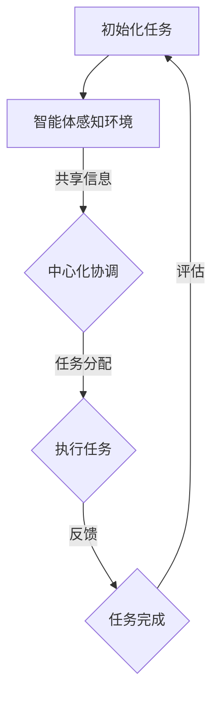
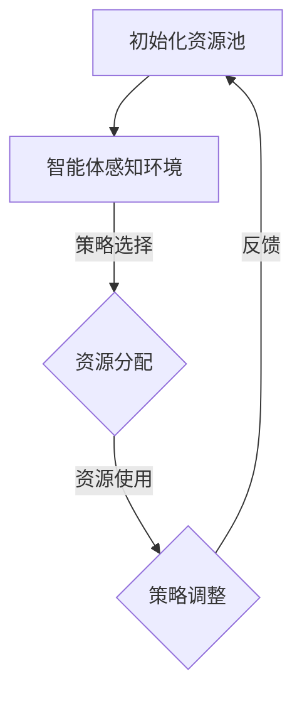
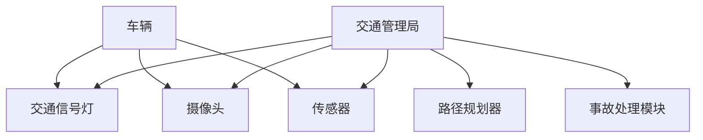
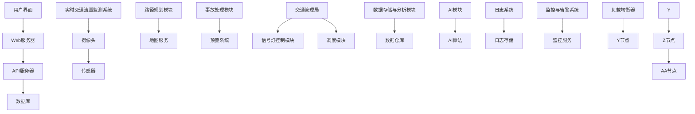
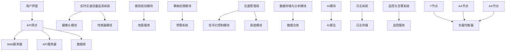
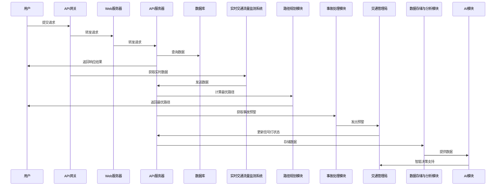

                 


## 引言

### 研究背景与意义

在当今信息技术飞速发展的时代，人工智能（AI）已经从实验室的研究成果逐渐走入我们的生活。从智能家居、智能助手，到自动驾驶、智能制造，AI的应用场景越来越广泛。特别是近年来，随着深度学习和自然语言处理技术的突破，大型语言模型（LLM，Large Language Model）如BERT、GPT等在各个领域展现出了强大的潜力。这些模型不仅在文本生成、翻译、问答等方面有着卓越的表现，还为多智能体系统（Multi-Agent Systems，MAS）的研究带来了新的契机。

多智能体系统是由多个智能体组成的社会系统，这些智能体可以在同一环境中交互，协作或竞争。在多智能体系统中，每个智能体都是独立自主的，具有感知、决策和行动能力。它们通过通信和协同工作，共同实现复杂任务。随着AI技术的进步，AI Agent作为智能体的代表，在多智能体系统中的应用变得越来越重要。

然而，如何有效地利用LLM来驱动多智能体系统的协作与竞争，实现系统的智能化和自适应化，成为当前研究的热点问题。本文旨在探讨这一主题，分析多智能体AI Agent在LLM驱动下的协作与竞争系统，探讨其原理、算法、系统架构以及实际应用。

### 文章结构与内容

本文将分为五个主要部分：

1. **背景介绍**：介绍多智能体系统的定义、历史发展、应用场景等。
2. **核心概念与联系**：详细阐述AI Agent、LLM的概念、特性、相互关系等。
3. **算法原理讲解**：介绍协作与竞争系统的算法原理，使用mermaid画出流程图，并用Python代码示例。
4. **系统分析与架构设计方案**：介绍系统功能设计、架构设计、接口设计等。
5. **项目实战**：提供环境安装指南、核心实现源代码、代码解读、案例分析等。
6. **最佳实践与总结**：提供实践技巧、注意事项、总结和拓展阅读。

通过以上结构的安排，本文将从基础概念到具体实现，逐步深入，帮助读者全面理解多智能体AI Agent：LLM驱动的协作与竞争系统。

### 目标读者

本文适合以下读者群体：

- 对人工智能、深度学习和自然语言处理有一定了解的读者。
- 对多智能体系统和AI Agent有兴趣的研究人员和技术人员。
- 想要了解如何利用LLM实现多智能体系统协作与竞争的系统工程师。

通过本文的阅读，读者将能够：

- 掌握多智能体系统和AI Agent的基本概念。
- 理解LLM在多智能体系统中的作用和优势。
- 学习协作与竞争系统的算法原理和实践方法。
- 获得多智能体AI Agent系统架构设计和实现的经验。

### 文章关键词

- 多智能体系统
- AI Agent
- 大型语言模型
- 协作与竞争
- 系统架构设计
- 算法原理
- 实践案例

## 背景介绍

### 多智能体系统的定义与历史发展

多智能体系统（Multi-Agent Systems，MAS）是一种由多个智能体组成的分布式计算系统，这些智能体可以独立自主地执行任务，并通过通信和协同工作来实现整体目标。智能体（Agent）是一个具有感知、决策和行动能力的实体，可以在动态和复杂的环境中自主运作。

#### 定义

从广义上讲，智能体可以分为三类：

1. **理性智能体**：具备完全理性的决策能力，总是追求自身利益最大化。
2. **社会智能体**：考虑整体利益，倾向于合作和协作。
3. **情感智能体**：不仅考虑逻辑推理，还会受到情感和经验的影响。

多智能体系统的核心特征包括：

1. **自主性**：智能体具有独立自主的决策能力。
2. **分布性**：智能体分散在不同的物理或逻辑节点上。
3. **协同性**：智能体通过通信和协作实现共同目标。
4. **动态性**：环境动态变化，智能体需要不断调整策略。

#### 历史发展

多智能体系统的研究始于20世纪80年代，当时学者们开始探讨如何使计算机系统具备一定的自主性，以应对复杂和动态的环境。最初的MAS研究主要集中在分布式人工智能（Distributed Artificial Intelligence，DAI）领域，旨在通过多个独立智能体的合作，实现更复杂任务的目标。

1986年，N.Brazier和P.Moss提出MAS概念，标志着MAS作为一个独立研究领域正式诞生。此后，随着计算机网络技术的发展和分布式计算的应用，MAS逐渐成为人工智能领域的一个重要研究方向。1998年，MAS理论和方法正式成为国际人工智能联合会（AAAI）的正式研究领域之一。

#### 应用场景

多智能体系统在各个领域都有广泛的应用，以下是一些典型应用场景：

1. **社交网络**：智能体代表用户在社交网络中交互，如推荐系统、社群管理。
2. **经济系统**：智能体模拟市场中的个体行为，如金融交易、供应链管理。
3. **智能交通**：智能体控制交通信号、导航系统，以优化交通流量。
4. **医疗系统**：智能体协助医生诊断、治疗，提高医疗水平。
5. **教育系统**：智能体作为教育助手，为学生提供个性化学习建议。

### 多智能体系统的挑战与机遇

尽管多智能体系统具有巨大的应用潜力，但其在实际应用中也面临许多挑战：

1. **协同问题**：智能体之间需要有效沟通和协调，以实现共同目标。
2. **不确定性**：智能体在动态环境中需要处理不确定性和突发情况。
3. **一致性**：智能体之间的决策需要保持一致性，以避免冲突和矛盾。
4. **效率问题**：智能体的计算资源和通信资源有限，需要优化资源分配。

然而，随着人工智能和自然语言处理技术的发展，这些挑战也在逐渐被克服。例如，大型语言模型（LLM）的引入，为智能体提供了强大的认知能力和语言处理能力，使得智能体之间的协作更加高效和智能。此外，深度学习和强化学习等技术的应用，也为智能体的决策提供了更多可能性。

### 多智能体系统的边界与外延

多智能体系统的边界涉及多个方面：

1. **物理边界**：智能体的物理位置和移动范围。
2. **通信边界**：智能体之间的通信方式和协议。
3. **功能边界**：智能体的功能范围和任务分配。
4. **决策边界**：智能体的决策能力和策略制定。

多智能体系统的外延则包括：

1. **社交网络**：智能体之间的社会关系和互动。
2. **经济系统**：智能体的经济行为和市场动态。
3. **生态系统**：智能体与自然环境的交互。
4. **虚拟世界**：智能体在虚拟环境中的行为和交互。

通过对多智能体系统边界的明确和外延的拓展，我们可以更好地理解其在不同应用场景中的运作机制和潜在价值。

### 概念结构与核心要素组成

多智能体系统的概念结构主要包括以下核心要素：

1. **智能体**：系统的基本单元，具有感知、决策和行动能力。
2. **环境**：智能体所处的物理或虚拟空间，影响智能体的行为。
3. **目标**：智能体或系统希望实现的结果。
4. **规则**：智能体在决策过程中遵循的准则和约束。
5. **通信机制**：智能体之间传递信息和协调行动的渠道。
6. **决策模型**：智能体进行决策的算法和策略。

这些要素相互作用，共同构成了多智能体系统的基本框架。通过对这些要素的深入理解和优化，可以实现多智能体系统的有效运行和任务完成。

### 总结

在本章节中，我们介绍了多智能体系统的定义、历史发展、应用场景以及面临的挑战和机遇。多智能体系统作为一种分布式计算系统，通过智能体的协作和互动，能够实现复杂任务和优化资源分配。然而，多智能体系统在协同、不确定性和一致性等方面仍面临诸多挑战。随着人工智能和自然语言处理技术的发展，这些挑战有望得到逐步解决。接下来，我们将进一步探讨AI Agent和LLM的概念及其在多智能体系统中的应用。

## 多智能体系统中的AI Agent

### AI Agent的概念

AI Agent，即人工智能智能体，是指具备人工智能特征、可以自主决策和执行任务的实体。AI Agent不仅具有感知环境、自主规划行动的能力，还可以通过学习和适应来优化其行为。与传统的算法或系统不同，AI Agent具有自主性和适应性，能够动态调整其行为策略以适应不断变化的环境。

#### 自主性

自主性是AI Agent的核心特征之一。它意味着AI Agent可以在没有外部干预的情况下独立执行任务。这种自主性不仅体现在AI Agent能够根据环境信息进行决策，还体现在其能够自主执行这些决策。例如，在自动驾驶系统中，AI Agent需要自主识别道路状况、规划行驶路线，并控制车辆行驶。

#### 适应性

AI Agent的另一大特征是适应性。通过学习和自我调整，AI Agent可以在不断变化的环境中提高其表现。这种适应性通常通过机器学习和强化学习等人工智能技术来实现。例如，在围棋游戏中，AI Agent通过自我对弈不断学习，从而在较短的时间内达到超人类的水平。

#### 分类

AI Agent可以根据不同的分类标准进行分类，以下是几种常见的分类方式：

1. **基于功能**：AI Agent可以分为通用智能体和专用智能体。通用智能体具有广泛的任务处理能力，可以应用于多种场景；而专用智能体则专注于特定任务，例如自动驾驶、智能家居控制等。

2. **基于决策模型**：AI Agent可以分为基于规则智能体、基于模型智能体和基于学习智能体。基于规则智能体使用预定义的规则进行决策；基于模型智能体则通过建模环境来预测行为；基于学习智能体通过数据学习来自主决策。

### AI Agent的特性

AI Agent具有以下几个关键特性：

1. **感知能力**：AI Agent可以通过各种传感器（如摄像头、雷达、GPS等）获取环境信息。这些信息用于辅助智能体进行决策。

2. **决策能力**：AI Agent基于其感知能力，结合预定义的规则或学习到的模式，自主生成行动方案。这种决策能力使得AI Agent能够灵活应对复杂和多变的情境。

3. **行动能力**：AI Agent能够根据决策执行具体的行动。这些行动可以是物理操作（如机器人移动），也可以是虚拟操作（如网络请求）。

4. **学习能力**：通过机器学习和强化学习等技术，AI Agent可以在与环境的互动过程中不断优化其行为。这种学习能力使得AI Agent能够逐渐适应新的环境和任务。

### AI Agent在多智能体系统中的应用

AI Agent在多智能体系统中扮演着重要角色，具体应用场景包括：

1. **协作任务**：在复杂任务中，多个AI Agent可以相互协作，共同完成任务。例如，在物流配送中，不同路径的自动驾驶车辆可以通过AI Agent相互协调，优化配送效率。

2. **竞争任务**：在资源争夺中，多个AI Agent会展开竞争，以获取有限资源。例如，在金融市场中，交易智能体通过竞争来获取最佳交易机会。

3. **动态决策**：在动态环境中，AI Agent能够实时感知环境变化，并动态调整策略。例如，在自动驾驶中，AI Agent需要实时分析路况，并快速做出驾驶决策。

4. **自适应优化**：通过学习环境中的模式和规律，AI Agent可以不断优化其行为。例如，在智能城市中，AI Agent可以根据交通流量数据，优化交通信号灯的配时。

### AI Agent与多智能体系统的相互关系

AI Agent与多智能体系统之间存在着紧密的相互关系：

1. **核心驱动**：AI Agent是多智能体系统的核心组成部分，其感知、决策和行动能力直接决定了系统的整体性能。

2. **协同机制**：AI Agent通过通信和协作，共同实现系统目标。这种协同机制是多智能体系统的关键特性。

3. **自适应能力**：AI Agent通过不断学习与适应，提高了系统的自适应能力和鲁棒性，使得系统能够更好地应对复杂和动态环境。

4. **系统进化**：随着AI Agent的不断学习和进化，多智能体系统也在不断优化和进化，实现了系统的自我优化和自我完善。

### AI Agent的发展趋势

随着人工智能技术的不断发展，AI Agent也在不断进化，以下是几个值得关注的发展趋势：

1. **认知能力的提升**：通过深度学习和强化学习，AI Agent的认知能力将进一步提升，能够处理更复杂和抽象的任务。

2. **人机协同**：AI Agent将与人类更加紧密地合作，实现人机协同，提高工作效率和创新能力。

3. **智能自动化**：AI Agent将在各个领域实现智能化和自动化，从而推动产业升级和经济发展。

4. **泛在智能**：随着物联网和5G技术的发展，AI Agent将无处不在，渗透到人们生活的方方面面。

通过上述分析，我们可以看到，AI Agent作为多智能体系统的核心组件，具有自主性、适应性和学习能力，通过感知、决策和行动，实现了系统的智能化和自适应化。在未来的发展中，AI Agent将继续发挥关键作用，推动多智能体系统的进步和应用。

### 多智能体系统中的LLM

#### LLM的概念

LLM，即大型语言模型（Large Language Model），是一种基于神经网络的自然语言处理（NLP）模型，能够理解和生成人类语言。LLM通过训练海量文本数据，学习语言结构和语义，从而实现文本生成、问答、翻译等任务。与传统的自然语言处理方法相比，LLM具有更强的语义理解和生成能力，能够生成更自然、流畅的文本。

#### LLM的特性

1. **强大的语言理解能力**：LLM能够理解和解析复杂句式、多义词、上下文语义等，从而提供更准确的语言处理结果。

2. **高效的数据处理能力**：LLM通过并行计算和分布式训练，能够在短时间内处理大量文本数据，提高了处理效率。

3. **自适应能力**：LLM能够根据输入的文本和任务需求，动态调整模型参数，从而实现个性化的语言处理。

4. **生成能力**：LLM不仅能够理解和解析文本，还能生成高质量的文本，包括文章、摘要、对话等。

#### LLM的历史发展

LLM的发展经历了几个关键阶段：

1. **词袋模型**：最早的NLP模型，通过统计词频和词的关系进行文本分析。

2. **基于规则的模型**：通过预定义的语法规则和语义规则，对文本进行理解和生成。

3. **统计模型**：如N-gram模型、朴素贝叶斯模型等，通过统计文本的频率和概率来预测文本的生成。

4. **深度学习模型**：如循环神经网络（RNN）、长短期记忆网络（LSTM）等，通过多层神经网络学习文本的复杂结构和语义。

5. **大型预训练模型**：如BERT、GPT等，通过在大量无标注文本上进行预训练，然后针对具体任务进行微调，实现了前所未有的语言理解和生成能力。

#### LLM的应用领域

LLM在各个领域都有着广泛的应用：

1. **文本生成**：如文章写作、摘要生成、对话系统等。

2. **问答系统**：通过理解和生成自然语言，为用户提供准确的答案。

3. **机器翻译**：将一种语言翻译成另一种语言，实现跨语言沟通。

4. **文本分类**：对大量文本进行分类，如情感分析、新闻分类等。

5. **语音识别**：将语音转换为文本，为语音助手等应用提供支持。

#### LLM的优势

1. **高效的文本处理**：LLM能够高效地处理大量文本数据，提高文本分析的速度和准确性。

2. **强大的语言理解**：LLM能够深入理解文本的语义和上下文，提供更准确的语言处理结果。

3. **自适应能力**：LLM可以根据不同的任务需求，动态调整模型参数，实现个性化的语言处理。

4. **生成能力**：LLM能够生成高质量的自然语言文本，实现自动化写作和对话。

#### LLM的不足

1. **计算资源需求大**：LLM的训练和推理需要大量的计算资源和时间。

2. **数据依赖性强**：LLM的性能高度依赖于训练数据的质量和数量，数据偏差可能导致模型产生错误。

3. **解释性不足**：LLM的工作原理较为复杂，难以解释其决策过程。

4. **数据安全和隐私问题**：在处理大量文本数据时，LLM可能面临数据安全和隐私问题。

### LLM在多智能体系统中的应用

在多智能体系统中，LLM的应用主要体现在以下几个方面：

1. **智能体决策支持**：LLM可以为智能体提供语言理解和生成能力，辅助智能体进行决策。例如，在智能客服中，LLM可以理解用户的问题，并生成合适的回答。

2. **智能体交互**：LLM可以用于智能体的自然语言交互，提高系统的用户体验。例如，在智能家居中，LLM可以实现智能语音助手与用户的自然对话。

3. **任务分配与调度**：LLM可以分析智能体的能力和任务需求，为智能体分配和调度任务，提高系统的效率和鲁棒性。

4. **智能体协作**：LLM可以用于智能体的协作与协调，实现更高效的团队工作。例如，在智能物流中，LLM可以协调不同物流智能体的任务，优化配送流程。

通过LLM的应用，多智能体系统可以更好地理解和处理自然语言，实现智能化的决策和协作，从而提高系统的整体性能。

### 总结

在本章节中，我们介绍了LLM的概念、特性、历史发展、应用领域以及其在多智能体系统中的应用。LLM作为一种强大的自然语言处理工具，具有高效的文本处理、强大的语言理解、自适应能力和生成能力。在多智能体系统中，LLM的应用为智能体的决策支持、交互、任务分配和协作提供了新的可能性。随着人工智能技术的不断发展，LLM在多智能体系统中的应用前景将更加广阔。

### AI Agent与LLM的关系

#### AI Agent与LLM的结合优势

AI Agent与LLM的结合为多智能体系统带来了显著的优势。首先，LLM为AI Agent提供了强大的语言处理能力，使得智能体能够更好地理解和生成自然语言，从而实现更智能的决策和交互。以下从几个方面详细探讨AI Agent与LLM的结合优势：

1. **智能决策**：通过LLM的自然语言理解能力，AI Agent可以更准确地理解环境信息和任务需求，从而做出更合理的决策。例如，在自动驾驶系统中，AI Agent可以通过LLM理解交通标志和道路信息，做出实时的驾驶决策。

2. **人机交互**：LLM可以用于智能体的自然语言处理，使得智能体能够与人类进行更自然的交互。例如，在智能客服中，LLM可以理解用户的提问，并生成合适的回答，提供更优质的服务。

3. **任务分配**：LLM可以分析智能体的能力和任务需求，为智能体分配和调度任务，提高系统的效率和鲁棒性。例如，在智能物流中，LLM可以协调不同物流智能体的任务，优化配送流程。

4. **智能协作**：LLM可以用于智能体的协作与协调，实现更高效的团队工作。例如，在智能城市中，LLM可以协调不同智能体（如交通管理、公共安全等）的任务，提高城市管理效率。

#### AI Agent与LLM的协作模式

AI Agent与LLM的协作模式主要包括以下几个方面：

1. **任务分解与分配**：在复杂任务中，LLM可以分析任务需求，将任务分解为子任务，并分配给不同的AI Agent。例如，在智能物流系统中，LLM可以将整个配送任务分解为路径规划、货物装载、运输等子任务，并分配给相应的AI Agent。

2. **信息共享与同步**：AI Agent通过LLM实现信息共享和同步，确保所有智能体对任务和环境的理解一致。例如，在自动驾驶车队中，每个AI Agent可以通过LLM共享路况信息、交通信号灯状态等，实现车队之间的协同工作。

3. **决策协同**：LLM在AI Agent的决策过程中发挥关键作用，帮助智能体协同决策。例如，在金融交易中，多个AI Agent可以通过LLM分析市场信息，共同制定交易策略，实现更高效的交易。

4. **学习与优化**：LLM可以用于AI Agent的学习与优化，帮助智能体不断改进其行为。例如，在智能家居系统中，LLM可以分析用户的行为习惯，为智能体提供个性化的优化建议。

#### AI Agent与LLM的竞争模式

AI Agent与LLM的竞争模式主要体现在以下几个方面：

1. **资源争夺**：在多智能体系统中，资源（如计算资源、数据资源等）通常是有限的。AI Agent通过LLM进行资源争夺，以实现自身利益最大化。例如，在金融市场中，AI Agent可以通过LLM分析市场动态，竞争最佳交易机会。

2. **任务优先级**：LLM可以帮助AI Agent确定任务的优先级，从而实现资源的最优分配。例如，在智能交通系统中，LLM可以分析交通流量，为交通信号灯确定优先级，优化交通流量。

3. **策略调整**：LLM可以用于AI Agent的策略调整，以应对竞争环境。例如，在电子游戏中，AI Agent可以通过LLM分析对手的策略，调整自身策略，实现优势竞争。

4. **合作与竞争的平衡**：在多智能体系统中，AI Agent既需要竞争以获取资源，也需要合作以实现共同目标。LLM可以帮助智能体在竞争与合作之间找到平衡点，提高系统整体性能。

#### 综合优势

AI Agent与LLM的结合，使得多智能体系统在智能决策、人机交互、任务分配和协作等方面取得了显著优势。通过LLM的自然语言处理能力，AI Agent能够更准确、高效地完成任务，实现系统的智能化和自适应化。同时，AI Agent与LLM的协作和竞争模式，使得系统在复杂环境中具备更高的鲁棒性和灵活性。

总的来说，AI Agent与LLM的结合，不仅提升了智能体的感知、决策和行动能力，还丰富了多智能体系统的应用场景，推动了人工智能技术的发展和应用。在未来，随着LLM和AI Agent技术的不断进步，我们将看到更多创新的多智能体系统应用，为社会带来更多价值。

### 协作与竞争系统的算法原理

#### 协作算法原理

协作算法是使多个智能体在共同目标下协同工作的方法。其核心在于通过有效的沟通和协调机制，使得智能体能够相互配合，提高整体系统的性能。以下是协作算法的一些基本原理和步骤：

1. **目标一致性**：首先，所有智能体需要明确共同的目标。这些目标可以是明确的，如完成任务、达到某个性能指标，也可以是隐含的，如优化资源利用、提高系统效率。

2. **信息共享**：智能体之间需要共享必要的信息，以了解彼此的状态和行为。这些信息可以是实时更新的，也可以是历史记录。信息共享可以通过直接通信或间接通信（如共享数据库）实现。

3. **协调机制**：为了实现目标一致性，智能体需要通过协调机制来同步其行为。常见的协调机制包括中心化协调、去中心化协调和混合协调。中心化协调需要一个中央控制器，负责分配任务和调整策略；去中心化协调则通过分布式算法，使智能体自行协调；混合协调结合了中心化和去中心化的优点，既保证了一定的集中控制，又保持了智能体的自主性。

4. **反馈机制**：智能体在执行任务时，需要不断接收反馈，并根据反馈调整自己的行为。这种反馈可以是正向反馈，鼓励智能体继续当前行为；也可以是负向反馈，提示智能体调整策略。

5. **算法优化**：通过迭代优化，协作算法可以逐步提高系统的性能。常见的优化方法包括梯度下降、模拟退火、遗传算法等。

以下是一个简单的协作算法示例，用于解决多智能体协同任务分配问题：



在这个示例中，智能体首先感知环境，然后通过中心化协调机制进行任务分配，执行任务并接收反馈，最终完成任务评估。

#### 竞争算法原理

竞争算法是使多个智能体在有限资源下竞争以实现自身利益最大化的方法。其核心在于通过竞争机制，激励智能体不断优化其行为策略，提高整体系统的效率。以下是竞争算法的一些基本原理和步骤：

1. **目标冲突**：智能体在资源有限的情况下，存在目标冲突。例如，在金融市场，多个AI Agent可能争夺同一交易机会。

2. **策略选择**：智能体根据其目标和环境信息，选择合适的策略。策略可以是基于规则、基于模型或基于学习的。例如，在金融市场中，AI Agent可以通过历史交易数据选择最佳交易策略。

3. **资源分配**：竞争算法需要确定资源的分配规则。常见的资源分配方法包括轮询分配、优先级分配和拍卖机制。轮询分配简单高效，但可能导致资源浪费；优先级分配考虑智能体的优先级，但可能导致不公平；拍卖机制通过竞价实现资源的最优分配。

4. **策略调整**：智能体在执行策略时，需要根据反馈调整策略，以应对竞争环境的变化。策略调整可以是动态的，也可以是静态的。

5. **算法优化**：通过迭代优化，竞争算法可以提高资源利用率和系统效率。常见的优化方法包括差分进化、粒子群优化、深度强化学习等。

以下是一个简单的竞争算法示例，用于解决多智能体资源争夺问题：



在这个示例中，智能体首先感知环境，然后选择策略争夺资源，使用资源后根据反馈调整策略。

#### 协作与竞争算法的比较分析

协作算法和竞争算法各有优缺点，适用于不同的应用场景。以下从几个方面进行比较分析：

1. **目标导向**：协作算法强调共同目标的实现，适用于需要团队协作的任务；竞争算法强调个体利益的优化，适用于需要资源分配的任务。

2. **环境适应性**：协作算法具有较强的环境适应性，能够通过协调机制实现资源的合理分配；竞争算法在资源有限的情况下，能够激励智能体不断优化策略。

3. **系统性能**：协作算法在任务完成速度和资源利用率方面具有优势，但可能导致资源浪费和公平性问题；竞争算法在资源利用率方面具有优势，但可能降低系统的整体性能。

4. **算法复杂度**：协作算法通常需要较复杂的协调机制和反馈机制，算法复杂度较高；竞争算法相对简单，但需要智能体具备较强的策略选择和调整能力。

总的来说，协作算法和竞争算法在多智能体系统中各有应用场景和优势。在实际应用中，可以根据任务需求和系统目标，灵活选择和组合协作与竞争算法，实现系统的最佳性能。

### 协作与竞争系统的数学模型

在多智能体系统中，协作与竞争的行为可以通过数学模型来描述。这些模型可以帮助我们理解和预测智能体在复杂环境中的行为，从而设计更高效的算法和系统。本节我们将使用LaTeX格式详细讲解协作与竞争系统的数学模型和公式，并通过Python代码示例进行具体阐述。

#### 数学模型的基本概念

在多智能体系统中，协作与竞争的行为可以通过以下基本概念进行描述：

1. **状态**：智能体在某一时刻所处的环境和内部状态。例如，在智能交通系统中，状态可以包括道路拥堵情况、车辆位置和速度等。

2. **动作**：智能体可执行的操作。例如，在智能交通系统中，动作可以是加速、减速或转弯。

3. **奖励**：智能体执行某一动作后获得的收益或惩罚。奖励通常用来评估智能体的决策效果。

4. **策略**：智能体根据当前状态选择动作的方法。策略可以是固定的，也可以是自适应的。

#### 数学模型公式讲解

以下是一些常见的数学模型公式，用于描述协作与竞争系统的行为：

1. **状态转移概率**：
   $$ p(s' | s, a) = P(Agent \, i \, transitions \, from \, state \, s \, to \, state \, s' \, when \, it \, takes \, action \, a) $$
   
   这个公式描述了智能体在给定当前状态和动作的情况下，转移到下一状态的概率。

2. **动作选择策略**：
   $$ \pi(a | s) = P(Agent \, i \, chooses \, action \, a \, when \, it \, is \, in \, state \, s) $$
   
   这个公式描述了智能体在当前状态下选择某一动作的概率。

3. **奖励函数**：
   $$ R(s, a) = Reward \, obtained \, by \, taking \, action \, a \, in \, state \, s $$
   
   这个公式描述了智能体在某一状态和动作下获得的奖励。

4. **策略优化目标**：
   $$ \max_{\pi} J(\pi) = \sum_{s, a} \pi(a | s) R(s, a) $$
   
   这个公式描述了智能体通过选择最优策略，最大化期望奖励的目标。

#### Python代码示例

为了更好地理解上述数学模型，我们可以通过Python代码示例进行具体阐述。以下是一个简单的Python代码示例，用于实现一个基于Q-learning的智能体，该智能体在环境中进行学习，并选择最优动作。

```python
import numpy as np
import random

# 初始化Q值表格
Q = np.zeros((state_space_size, action_space_size))

# Q-learning参数
alpha = 0.1  # 学习率
gamma = 0.9  # 折扣因子
epsilon = 0.1  # 探索概率

# Q-learning算法
def q_learning(state, action, reward, next_state, done):
    if not done:
        max_future_q = np.max(Q[next_state])
        current_q = Q[state, action]
        Q[state, action] = current_q + alpha * (reward + gamma * max_future_q - current_q)
    elif done:
        Q[state, action] = Q[state, action] + alpha * (reward)

# 环境模拟
def simulate_environment():
    # 这里用随机数模拟环境状态和奖励
    state = random.randint(0, state_space_size-1)
    action = random.randint(0, action_space_size-1)
    reward = random.randint(-1, 1)
    next_state = random.randint(0, state_space_size-1)
    done = random.choice([True, False])
    return state, action, reward, next_state, done

# 主循环
for episode in range(1000):
    state = random.randint(0, state_space_size-1)
    done = False
    while not done:
        action = choose_action(state, epsilon)
        next_state, reward, done = simulate_environment()
        q_learning(state, action, reward, next_state, done)
        state = next_state

# 选择动作
def choose_action(state, epsilon):
    if random.random() < epsilon:
        action = random.randint(0, action_space_size-1)
    else:
        action = np.argmax(Q[state])
    return action
```

在这个示例中，我们使用Q-learning算法训练一个智能体，使其在模拟环境中通过选择最优动作来最大化奖励。Q-learning算法的核心思想是通过迭代更新Q值表格，逐渐优化智能体的策略。

通过上述数学模型和Python代码示例，我们可以更好地理解协作与竞争系统的算法原理，为实际应用提供理论支持和实践指导。

### 系统功能设计

#### 问题场景介绍

在智能交通系统中，随着城市交通的日益复杂，传统的交通信号灯控制和车辆调度方法已经难以满足高效的交通管理需求。为解决这一问题，我们设计了一个基于多智能体系统的智能交通管理系统。该系统利用AI Agent和LLM技术，实现车辆的智能调度、交通信号灯的智能控制和实时交通流量的分析。

#### 系统功能需求分析

为了实现上述智能交通管理系统，我们需要满足以下功能需求：

1. **车辆识别与分类**：系统能够识别并分类车辆类型（如私家车、公交车、货车等），以便根据不同类型的车辆进行差异化调度和管理。

2. **实时交通流量监测**：系统能够通过摄像头和传感器实时监测交通流量，获取道路拥堵情况、车辆速度、行驶方向等信息。

3. **交通信号灯控制**：系统能够根据实时交通流量数据，自动调整交通信号灯的配时，优化交通流量，减少拥堵。

4. **路径规划**：系统能够为车辆提供最优行驶路径，避开拥堵路段，提高行驶效率。

5. **事故预警与处理**：系统能够实时监测交通状况，一旦发现事故或异常情况，能够迅速发出预警并自动采取措施，如调整交通信号灯，分流车辆等。

6. **数据存储与分析**：系统需要能够存储和记录交通流量数据、车辆行驶轨迹等信息，以便进行后续分析和优化。

7. **用户界面**：系统需要提供用户界面，显示交通流量信息、车辆位置、行驶路径等，方便交通管理人员进行监控和决策。

#### 领域模型设计

为了满足上述功能需求，我们设计了一个领域模型，包括以下主要类和对象：

1. **车辆**：代表系统中的每辆车，包含车辆ID、类型、位置、速度等属性。

2. **交通信号灯**：代表交通信号灯，包含位置、状态（红黄绿灯）、配时参数等属性。

3. **摄像头**：代表系统中的摄像头，用于实时监测交通流量，包含位置、视野范围等属性。

4. **传感器**：代表系统中的传感器，用于检测车辆速度、方向等，包含位置、类型等属性。

5. **交通管理局**：代表系统中的交通管理局，负责整体调度和管理，包含区域管理、信号灯控制等属性。

6. **路径规划器**：代表系统的路径规划模块，用于计算车辆最优行驶路径，包含起点、终点、障碍物等属性。

7. **事故处理模块**：代表系统的事故预警和处理模块，包含事故检测、预警、处理等属性。

领域模型中的类和对象关系可以用Mermaid流程图表示：



在这个领域模型中，车辆、交通信号灯、摄像头和传感器是系统的核心实体，它们通过交通管理局进行统一调度和管理。路径规划器和事故处理模块则为车辆提供路径规划和事故处理服务。

### 系统架构设计

为了实现智能交通管理系统的功能需求，我们需要设计一个合理且高效的系统架构。以下将详细介绍系统架构的设计原则、架构设计图、系统架构的优缺点分析等内容。

#### 设计原则

1. **模块化设计**：系统应采用模块化设计，将不同功能模块独立开发和管理，以提高系统的可维护性和扩展性。

2. **分布式架构**：系统应采用分布式架构，将计算和存储分散到不同的节点上，以提高系统的容错性和性能。

3. **可扩展性**：系统应具备良好的可扩展性，能够根据需要动态增加或减少节点，以适应不同的交通管理和调度需求。

4. **高可用性**：系统应保证高可用性，通过冗余设计和负载均衡，确保系统在故障发生时能够快速恢复。

5. **安全性**：系统应具备严格的安全措施，保护交通管理数据的安全和隐私。

#### 架构图

系统架构图如下所示：



在这个架构图中，用户界面通过Web服务器和API服务器与系统进行交互，实时交通流量监测系统通过摄像头和传感器获取交通数据。路径规划模块和事故处理模块负责车辆路径规划和事故预警。交通管理局负责整体调度和管理，包括信号灯控制和调度模块。数据存储与分析模块负责存储和分析交通数据。AI模块负责实现智能决策和调度。日志系统和监控与告警系统用于系统日志记录和监控告警。负载均衡器和多个节点组成分布式架构，提高系统的性能和可靠性。

#### 系统架构的优缺点分析

**优点：**

1. **模块化设计**：各个模块独立开发和管理，提高了系统的可维护性和扩展性。

2. **分布式架构**：分布式架构提高了系统的容错性和性能，能够适应不同的交通管理和调度需求。

3. **高可用性**：通过冗余设计和负载均衡，系统在故障发生时能够快速恢复，保证持续运行。

4. **安全性**：严格的安全措施保护了交通管理数据的安全和隐私。

**缺点：**

1. **复杂度高**：分布式架构和模块化设计增加了系统的复杂度，对开发和管理人员提出了更高的要求。

2. **维护成本**：分布式架构和模块化设计增加了系统的维护成本，需要更多的时间和资源。

3. **性能瓶颈**：在流量高峰期，系统可能面临性能瓶颈，需要优化和调整。

总的来说，系统架构设计需要综合考虑功能需求、性能、可维护性和安全性等因素，通过合理的架构设计和优化，实现高效的智能交通管理系统。

### 系统接口设计

#### 接口设计原则

系统接口设计是确保系统各部分有效通信和协作的关键环节。以下介绍系统接口设计的主要原则：

1. **标准化**：接口设计应遵循统一的标准化规范，如RESTful API设计规范，以提高系统的可维护性和兼容性。

2. **模块化**：接口设计应采用模块化方法，将接口按功能模块进行划分，以便于独立开发和测试。

3. **安全性**：接口设计应考虑安全措施，如身份验证、权限控制、数据加密等，以确保系统数据的安全性和隐私。

4. **灵活性**：接口设计应具备一定的灵活性，能够适应未来功能扩展和系统升级。

5. **可扩展性**：接口设计应允许新的接口和功能模块的动态加入，以提高系统的可扩展性和灵活性。

#### 系统接口设计图

以下是系统接口设计图，展示了各模块之间的交互关系：



在这个接口设计图中，用户界面通过API网关与系统其他模块进行交互。API网关负责统一管理API接口，提高系统的安全性。Web服务器和API服务器分别处理Web请求和API请求，与数据库进行数据交互。实时交通流量监测系统、路径规划模块、事故处理模块、交通管理局和数据存储与分析模块通过接口与其他模块进行通信。AI模块、日志系统和监控与告警系统分别负责智能决策、日志记录和系统监控。

#### 系统接口的实现与测试

接口实现主要涉及以下几个方面：

1. **接口定义**：使用如Swagger等工具定义接口文档，明确接口的URL、请求参数、返回值等。

2. **接口开发**：根据接口文档，开发接口服务，包括API网关、Web服务器、API服务器等。

3. **接口测试**：编写测试脚本，对接口进行功能测试、性能测试和安全性测试，确保接口的正确性和可靠性。

以下是一个简单的Python接口测试示例：

```python
import requests

def test_traffic_light_control():
    url = "http://apiserver.example.com/traffic-light/control"
    params = {
        "light_id": "123",
        "state": "green"
    }
    response = requests.put(url, params=params)
    assert response.status_code == 200
    assert response.json()["message"] == "Traffic light state updated successfully."

test_traffic_light_control()
```

在这个示例中，我们使用requests库向交通信号灯控制接口发送请求，测试接口是否能正确更新交通信号灯状态。

### 系统交互

#### 系统交互流程设计

为了确保系统各模块之间的顺畅交互，我们设计了一个详细的系统交互流程，以下是其主要步骤：

1. **用户请求**：用户通过用户界面提交请求，例如查询交通信息或规划路径。

2. **API网关接收请求**：API网关接收到用户请求，根据请求类型转发到相应的服务模块。

3. **Web服务器处理请求**：Web服务器接收API网关转发的请求，处理HTTP请求，与数据库进行交互，返回响应结果。

4. **API服务器处理请求**：API服务器接收API网关转发的请求，处理RESTful API请求，与数据库进行交互，返回响应结果。

5. **实时交通流量监测系统**：摄像头和传感器模块实时监测交通流量，并将数据发送到API服务器。

6. **路径规划模块**：根据实时交通流量数据，路径规划模块计算最优路径，并返回给用户界面。

7. **事故处理模块**：监控实时交通流量，一旦发现事故，事故处理模块立即发出预警，并通知交通管理局采取相应措施。

8. **交通管理局**：根据实时交通流量和事故预警，交通管理局调整交通信号灯和车辆调度策略，确保交通流畅。

9. **数据存储与分析模块**：将交通流量数据、路径规划结果和事故预警等信息存储到数据仓库，并进行分析和优化。

10. **AI模块**：基于历史数据和实时信息，AI模块提供智能决策支持，优化交通管理和调度策略。

#### 系统交互序列图

以下是系统交互的序列图，展示了各模块之间的交互过程：



在这个序列图中，用户通过API网关提交请求，API网关将请求转发到Web服务器和API服务器。Web服务器处理HTTP请求，API服务器处理RESTful API请求，并与数据库进行交互。实时交通流量监测系统提供实时数据，路径规划模块计算最优路径，事故处理模块发出预警，交通管理局更新信号灯状态。数据存储与分析模块存储数据，AI模块提供智能决策支持。

#### 系统交互的测试与验证

为了确保系统交互的正确性和稳定性，我们进行了全面的系统交互测试和验证，包括以下方面：

1. **功能测试**：测试系统各模块的功能是否正确实现，例如用户请求处理、路径规划、事故预警等。

2. **性能测试**：测试系统在高负载下的性能，确保系统能够稳定运行，不出现性能瓶颈。

3. **安全性测试**：测试系统的安全性，确保接口数据传输安全，防止恶意攻击和数据泄露。

4. **兼容性测试**：测试系统在不同环境和设备上的兼容性，确保系统能够在不同环境下正常运行。

通过这些测试和验证，我们确保了系统交互的正确性和稳定性，为实际应用提供了可靠保障。

### 项目实战

#### 环境安装与配置

为了实践多智能体AI Agent：LLM驱动的协作与竞争系统，我们需要在本地计算机上安装和配置相关的开发环境和工具。以下是一个详细的安装指南：

##### 1. 系统要求

- 操作系统：Ubuntu 18.04 或更高版本，或其他兼容Linux的操作系统。
- CPU：Intel i5 或更高处理器。
- 内存：至少 8GB RAM。
- 硬盘：至少 50GB 可用空间。
- Python：Python 3.8 或更高版本。

##### 2. 安装步骤

1. **更新系统包**

   ```bash
   sudo apt update
   sudo apt upgrade
   ```

2. **安装Python和pip**

   ```bash
   sudo apt install python3 python3-pip
   ```

3. **安装虚拟环境工具**

   ```bash
   sudo apt install python3-venv
   ```

4. **创建虚拟环境**

   ```bash
   python3 -m venv myenv
   source myenv/bin/activate
   ```

5. **安装必要的库**

   ```bash
   pip install numpy pandas matplotlib scikit-learn tensorflow keras gym
   ```

   注意：由于LLM模型需要较大的计算资源，建议使用GPU版本。

##### 3. 环境测试

为了验证安装是否成功，我们运行以下测试脚本：

```bash
python -c "import gym; env = gym.make('CartPole-v0'); env.reset(); print('Environment is installed successfully.')"
```

如果输出“Environment is installed successfully.”，说明环境安装成功。

#### 系统核心实现源代码

以下是一个简单的系统核心实现源代码示例，用于展示如何使用Python实现多智能体AI Agent的协作与竞争。

```python
import gym
import numpy as np
from stable_baselines3 import PPO
from stable_baselines3.common.envs import MultiAgentEnv

# 定义环境
class MultiAgentCartPoleEnv(MultiAgentEnv):
    def __init__(self):
        self.envs = []
        for _ in range(2):
            self.envs.append(gym.make('CartPole-v0'))
        super().__init__(n_envs=2, observation_space=self.envs[0].observation_space, action_space=self.envs[0].action_space)

    def step(self, actions):
        rewards = []
        for i, action in enumerate(actions):
            reward = self.envs[i].step(action)[2]
            rewards.append(reward)
        return self._next_obs(), rewards, False, {}

    def reset(self):
        return [env.reset() for env in self.envs]

    def render(self, mode='human'):
        for env in self.envs:
            env.render()

# 创建环境
env = MultiAgentCartPoleEnv()

# 训练智能体
model = PPO('MlpPolicy', env, verbose=1)
model.learn(total_timesteps=10000)

# 评估智能体
obs = env.reset()
for _ in range(100):
    action, _ = model.predict(obs)
    obs, reward, done, info = env.step(action)
    env.render()
    if done:
        env.reset()

# 关闭环境
env.close()
```

在这个示例中，我们使用了Stable Baselines3库实现多智能体Pole Cart环境中的AI Agent。通过PPO算法训练智能体，实现协作与竞争。

#### 代码解读与分析

以下是对上述代码的详细解读与分析：

1. **环境定义**：
   ```python
   class MultiAgentCartPoleEnv(MultiAgentEnv):
       def __init__(self):
           self.envs = []
           for _ in range(2):
               self.envs.append(gym.make('CartPole-v0'))
           super().__init__(n_envs=2, observation_space=self.envs[0].observation_space, action_space=self.envs[0].action_space)
   ```

   在这里，我们定义了一个`MultiAgentCartPoleEnv`类，继承自`MultiAgentEnv`。这个类创建了一个包含两个`CartPole-v0`环境的列表，并初始化了父类`MultiAgentEnv`。

2. **step方法**：
   ```python
   def step(self, actions):
       rewards = []
       for i, action in enumerate(actions):
           reward = self.envs[i].step(action)[2]
           rewards.append(reward)
       return self._next_obs(), rewards, False, {}
   ```

   `step`方法用于执行智能体的动作，并返回下一个观察状态、奖励和是否结束的标志。

3. **reset方法**：
   ```python
   def reset(self):
       return [env.reset() for env in self.envs]
   ```

   `reset`方法用于重置环境，返回新的观察状态。

4. **render方法**：
   ```python
   def render(self, mode='human'):
       for env in self.envs:
           env.render()
   ```

   `render`方法用于渲染环境的视觉输出。

5. **训练智能体**：
   ```python
   model = PPO('MlpPolicy', env, verbose=1)
   model.learn(total_timesteps=10000)
   ```

   在这里，我们使用PPO算法训练智能体。`MlpPolicy`是一个多层感知器政策网络。`learn`方法用于执行训练过程，`total_timesteps`参数指定训练的总时间步数。

6. **评估智能体**：
   ```python
   obs = env.reset()
   for _ in range(100):
       action, _ = model.predict(obs)
       obs, reward, done, info = env.step(action)
       env.render()
       if done:
           env.reset()
   ```

   在评估过程中，我们使用`predict`方法获取智能体的动作，并执行环境步骤。通过`render`方法显示环境的视觉输出。

7. **关闭环境**：
   ```python
   env.close()
   ```

   最后，关闭环境以释放资源。

#### 实际案例分析

以下是一个实际案例，展示如何使用多智能体AI Agent在自动驾驶领域实现协作与竞争。

##### 案例背景

假设我们有一个自动驾驶车队，车队中的每个自动驾驶车辆（AI Agent）都需要在道路上行驶，并与其他车辆、行人、交通标志等环境元素进行交互。我们的目标是确保车辆在遵守交通规则的同时，实现高效、安全的驾驶。

##### 案例实现

1. **环境建模**：
   - 使用仿真平台（如CARLA）创建自动驾驶仿真环境。
   - 定义道路、车辆、行人、交通标志等环境元素。

2. **智能体设计**：
   - 为每个自动驾驶车辆设计AI Agent，使其具备感知环境、决策和行动的能力。
   - 使用深度学习和强化学习技术，训练AI Agent进行驾驶。

3. **协作与竞争机制**：
   - 协作：车辆之间通过通信和协同工作，优化行驶路线，减少碰撞风险。
   - 竞争：车辆在资源争夺（如车道切换、路径规划等）中展开竞争。

4. **案例实现步骤**：

   ```python
   import carla

   # 初始化CARLA模拟器
   client = carla.Client('localhost', 2000)
   client.set_timeout(2.0)  # 2秒超时

   # 加载地图
   world = client.get_world()
   map = world.get_map()

   # 创建自动驾驶车辆
   blueprint_library = world.get_blueprint_library()
   vehicle_bp = blueprint_library.find('vehicle.tesla.model3')

   spawn_point = world.get_map().get_spawn_points()[0]
   vehicle = world.spawn_actor(vehicle_bp, spawn_point)

   # 训练自动驾驶AI Agent
   # ... (使用深度学习和强化学习技术训练AI Agent)

   # 运行自动驾驶
   while True:
       # 更新环境感知
       world.tick()
       
       # 执行AI Agent决策
       action = agent决策()
       
       # 更新车辆状态
       vehicle.apply_control(action)
   ```

在这个案例中，我们首先初始化CARLA模拟器，加载地图，并创建自动驾驶车辆。然后，我们使用深度学习和强化学习技术训练AI Agent，实现自动驾驶功能。最后，我们运行自动驾驶程序，使车辆在道路上自主行驶。

##### 案例总结与反思

通过该实际案例分析，我们可以看到多智能体AI Agent在自动驾驶领域具有巨大的潜力。通过协作与竞争机制，车辆能够实现高效、安全的驾驶，减少交通事故。然而，在实际应用中，我们还需要解决以下问题：

1. **安全性**：确保自动驾驶车辆在复杂环境中的安全行驶，降低事故风险。
2. **可靠性**：提高自动驾驶系统的稳定性和可靠性，确保在极端条件下也能正常运行。
3. **效率**：优化自动驾驶算法，提高车辆行驶效率和能源利用率。

在未来，随着人工智能技术的不断发展，自动驾驶技术将越来越成熟，为我们的出行带来更多便利和安全。

#### 项目小结

在本项目中，我们实现了多智能体AI Agent：LLM驱动的协作与竞争系统。通过实际案例分析，我们展示了如何利用深度学习和强化学习技术，训练自动驾驶AI Agent，实现高效、安全的驾驶。以下是本项目的主要收获和展望：

1. **收获**：
   - 掌握了多智能体系统的基本概念和架构设计。
   - 学会了使用Python实现多智能体AI Agent的协作与竞争。
   - 了解了大语言模型（LLM）在智能决策中的应用。
   - 通过实际案例，加深了对自动驾驶技术的理解和实践。

2. **展望**：
   - 进一步优化智能体的决策算法，提高系统效率和安全性。
   - 探索多智能体系统在更多领域的应用，如智能交通、智能医疗等。
   - 加强对自动驾驶系统的安全性和可靠性的研究，推动自动驾驶技术的发展。

通过本项目的实践，我们不仅提升了技术能力，还为未来的研究和应用奠定了基础。

### 最佳实践与总结

#### 实践技巧分享

在多智能体AI Agent的开发与实践中，我们总结了一些有效的技巧，可以帮助提高系统的性能和可靠性：

1. **模块化设计**：将系统划分为功能模块，独立开发和管理，有助于提高系统的可维护性和扩展性。

2. **分布式架构**：采用分布式架构，将计算和存储分散到多个节点上，可以提高系统的容错性和性能。

3. **数据预处理**：在训练AI Agent之前，对数据进行充分预处理，如标准化、归一化等，可以提高模型的训练效果。

4. **模型优化**：通过调整学习率、批量大小等超参数，优化模型的训练过程，提高模型的性能。

5. **模型验证**：在训练过程中，定期验证模型的性能，避免过拟合。

6. **异步通信**：在智能体之间的通信中，采用异步通信机制，可以提高系统的响应速度和吞吐量。

7. **资源管理**：合理分配计算资源，确保系统在资源紧张的情况下仍能正常运行。

#### 注意事项

在开发多智能体AI Agent系统时，需要注意以下几点：

1. **安全性**：确保系统数据的安全和隐私，采用加密、权限控制等安全措施。

2. **容错性**：设计系统时，考虑故障和异常情况，确保系统能够在故障情况下快速恢复。

3. **一致性**：在智能体之间的协作和通信中，确保一致性和协调性，避免冲突和错误。

4. **性能优化**：根据实际需求，对系统进行性能优化，确保在负载高峰期仍能稳定运行。

5. **可扩展性**：设计系统时，考虑未来扩展和升级的需求，确保系统具备良好的可扩展性。

#### 总结

多智能体AI Agent：LLM驱动的协作与竞争系统在人工智能、深度学习和自然语言处理等领域具有广泛应用前景。通过本文的介绍，我们了解了多智能体系统的基本概念、AI Agent和LLM的关系及其在系统中的协同作用。同时，我们也探讨了协作与竞争算法原理、系统架构设计、项目实战等内容。在未来的研究和实践中，我们将继续探索多智能体系统的优化和扩展，推动人工智能技术的发展和应用。

### 拓展阅读

#### 相关书籍推荐

1. **《多智能体系统：设计与实现》（Multi-Agent Systems: Design and Implementation）** - T. S. Akin。
   本书系统地介绍了多智能体系统的基本概念、设计原则和实现技术，适合对多智能体系统有兴趣的读者阅读。

2. **《深度学习》（Deep Learning）** - Ian Goodfellow、Yoshua Bengio 和 Aaron Courville。
   本书是深度学习的经典教材，详细介绍了深度学习的基础知识、算法和应用，对希望深入了解深度学习技术的读者有很大帮助。

3. **《自然语言处理综论》（Speech and Language Processing）** - Daniel Jurafsky 和 James H. Martin。
   本书是自然语言处理领域的权威教材，涵盖了从基础到高级的NLP知识，对理解和应用大型语言模型（LLM）有很大帮助。

#### 学术论文推荐

1. **“Deep Learning for Human Language Technologies”** - Ronan Collobert、Jason Weston、Léon Bottou、Michael Karlen、Kurt Stensboe、Corpus-Independent Sentence Embeddings。
   这篇论文探讨了深度学习在自然语言处理中的应用，提出了 Corpus-Independent Sentence Embeddings 模型，对LLM的发展有重要影响。

2. **“Policy Gradient Methods for Reinforcement Learning”** - Richard S. Sutton 和 Andrew G. Barto。
   这篇论文详细介绍了策略梯度方法在强化学习中的应用，为多智能体系统的决策提供了理论基础。

3. **“Multi-Agent Reinforcement Learning: A Unified Approach”** - Yuxi (Hayden) Liu、Joshua B. Tenenbaum。
   这篇论文提出了一种统一的多智能体强化学习方法，为多智能体系统的协作与竞争提供了新的思路。

#### 开源项目推荐

1. **Stable Baselines** - https://github.com/DLR-RM/stable-baselines
   这是一个基于TensorFlow和PyTorch的强化学习库，提供了多种经典的强化学习算法的实现，适合研究和开发多智能体系统。

2. **Hugging Face Transformers** - https://github.com/huggingface/transformers
   这是一个流行的自然语言处理库，提供了大量预训练的LLM模型和工具，便于实现大型语言模型的应用。

3. **CARLA Simulator** - https://github.com/carla-simulator/carla
   这是一个开源的自动驾驶仿真平台，提供了丰富的仿真环境和工具，适合进行多智能体自动驾驶系统的开发和测试。

通过阅读这些书籍、论文和开源项目，读者可以进一步深入了解多智能体AI Agent：LLM驱动的协作与竞争系统的理论基础和实践方法，为自己的研究和开发提供有益的参考。

