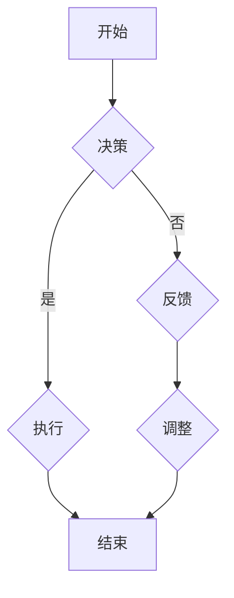
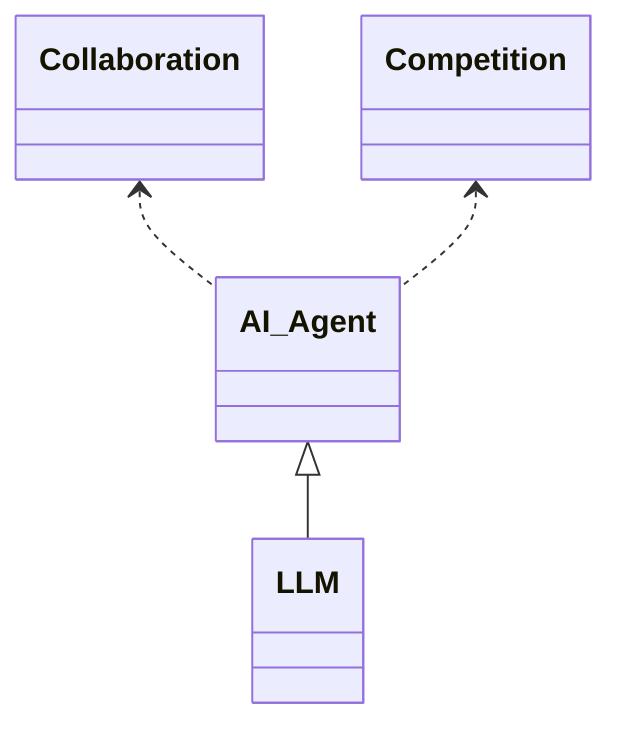
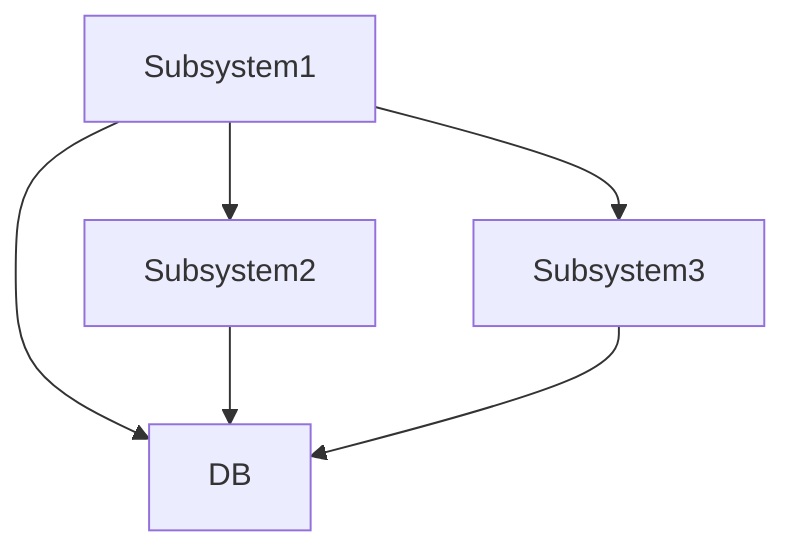
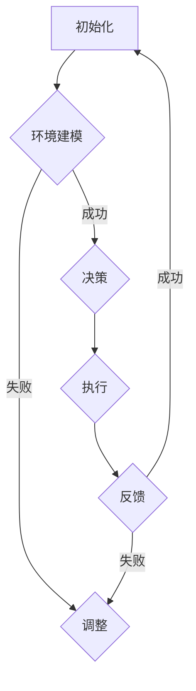
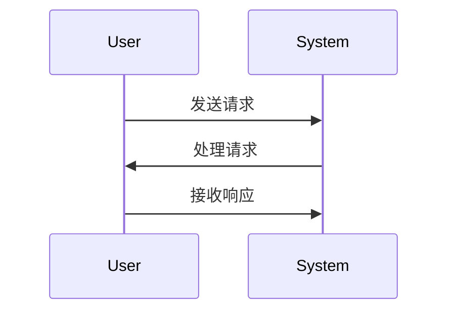

                 

### 《多智能体AI Agent：LLM驱动的协作与竞争系统》

#### 关键词：多智能体AI Agent、LLM、协作、竞争、系统架构

> 摘要：本文将深入探讨多智能体AI Agent的基础概念及其在协作与竞争系统中的应用。我们将首先介绍多智能体系统的基本概念、特点与挑战，接着分析多智能体AI Agent的原理与通信机制，并重点讨论基于LLM驱动的多智能体AI Agent的协作与竞争机制。随后，通过具体案例分析展示系统设计、实现与评估过程，最后，对多智能体AI Agent系统的未来发展趋势与面临的挑战进行展望。

----------------------------------------------------------------

### 第一部分：多智能体系统基础

#### 第1章：多智能体系统的概念与概述

##### 1.1 多智能体系统的定义

多智能体系统（Multi-Agent System，MAS）是指由多个自主的智能体（agent）组成的系统。这些智能体通过相互通信与合作，共同完成复杂任务或解决复杂问题。每个智能体具有以下特点：

- **自治性**：智能体能够独立运作，拥有自己的决策机制。
- **通信能力**：智能体能够通过一定的通信协议与其他智能体进行信息交换。
- **协作性**：智能体之间可以相互协作，共同完成任务。
- **自主性**：智能体根据自身知识和环境信息，自主决策和行动。

##### 1.2 多智能体系统的特点与挑战

多智能体系统的特点包括：

- **分布式**：智能体分布在不同的位置，具有独立的处理能力。
- **动态性**：智能体的状态和目标可以随时变化。
- **异质性**：智能体可能具有不同的能力和知识。
- **开放性**：系统与外部环境不断进行信息交换。

然而，多智能体系统也面临一系列挑战，如：

- **复杂性**：系统的行为难以预测和控制。
- **协同失效**：智能体之间的协调可能失败。
- **通信冲突**：智能体之间的通信可能导致信息不一致。
- **适应性和鲁棒性**：系统需要能够适应环境变化和应对意外情况。

##### 1.3 多智能体系统的应用领域

多智能体系统在多个领域有着广泛的应用，包括：

- **智能交通**：智能交通系统（ITS）通过多个智能体协调管理交通流量，提高道路利用率和安全性。
- **游戏**：多人在线游戏中的玩家智能体通过协作或竞争实现游戏目标。
- **金融**：金融市场中，多个智能体（如投资者、金融机构）通过复杂的交互影响市场动态。
- **智能制造**：智能制造系统中的机器人智能体通过协同工作实现高效生产。
- **社会网络**：社会网络中的用户智能体通过分享和交流信息，影响社交网络的动态。

#### 第2章：多智能体AI Agent的基本原理

##### 2.1 AI Agent的定义与类型

AI Agent（人工智能智能体）是指基于人工智能技术构建的智能体，能够模拟人类的思考、决策和行为。AI Agent可以分为以下几类：

- **基于规则的Agent**：通过预设的规则进行决策。
- **基于模型的Agent**：通过模型（如神经网络）进行决策。
- **混合型Agent**：结合规则和模型进行决策。
- **学习型Agent**：通过学习环境数据不断优化自身决策能力。

##### 2.2 AI Agent的自主性、适应性和社交性

AI Agent的特点包括：

- **自主性**：智能体具有独立决策和行动的能力。
- **适应性**：智能体能够根据环境变化调整自身行为。
- **社交性**：智能体能够与其他智能体进行交互和协作。

##### 2.3 AI Agent的通信机制

AI Agent的通信机制是实现智能体之间信息交换的关键。常见的通信机制包括：

- **直接通信**：智能体直接通过通信协议交换信息。
- **间接通信**：智能体通过共享信息或发布信息进行交互。
- **广播通信**：智能体向所有其他智能体发送信息。

#### 第3章：基于LLM的多智能体AI Agent

##### 3.1 LLM在多智能体系统中的应用

语言生成模型（Language Generation Model，LLM）如GPT-3、BERT等在多智能体系统中的应用，为AI Agent提供了强大的语言处理能力。LLM可以帮助智能体：

- **自然语言理解**：智能体能够理解自然语言指令和环境描述。
- **自然语言生成**：智能体能够生成自然语言响应和报告。
- **知识表示**：智能体能够将知识和信息编码为语言形式。

##### 3.2 基于LLM的AI Agent建模方法

基于LLM的AI Agent建模方法涉及以下步骤：

1. **数据收集与预处理**：收集与任务相关的文本数据，并进行预处理，如分词、去停用词、词向量表示等。
2. **模型训练**：使用预训练的LLM模型，在收集的文本数据上进行微调，以适应特定任务。
3. **智能体集成**：将训练好的LLM模型集成到AI Agent中，作为其决策和通信的核心组件。
4. **推理与决策**：智能体利用LLM模型进行推理和决策，生成行动和响应。

##### 3.3 LLM驱动的多智能体协作机制

LLM驱动的多智能体协作机制包括：

- **协同决策**：智能体利用LLM模型协同分析任务需求和环境信息，共同制定行动计划。
- **任务分配**：智能体根据自身能力和任务需求，利用LLM模型进行任务分配和角色分工。
- **信息共享**：智能体通过LLM模型共享知识和信息，提高整体协作效率。
- **冲突解决**：智能体利用LLM模型分析和解决协作过程中的冲突和矛盾。

#### 第4章：多智能体AI Agent的竞争机制

##### 4.1 竞争机制的定义与类型

多智能体AI Agent的竞争机制是指智能体在相互竞争过程中，为了获取资源或实现目标而采取的策略和行为。竞争机制可以分为以下几类：

- **资源竞争**：智能体为了获取稀缺资源而进行竞争。
- **目标竞争**：智能体为了实现相同的目标而进行竞争。
- **策略竞争**：智能体通过策略创新和优化，以提高竞争能力。
- **生存竞争**：智能体在有限环境中为了生存而进行的竞争。

##### 4.2 竞争机制下的AI Agent行为分析

在竞争机制下，AI Agent的行为分析包括：

- **目标分析**：智能体分析自身目标和竞争对手的目标，确定竞争策略。
- **策略选择**：智能体根据竞争环境和自身能力选择竞争策略。
- **行为模拟**：智能体模拟竞争过程，预测竞争结果和自身收益。
- **调整策略**：智能体根据竞争结果和环境变化调整竞争策略。

##### 4.3 LLM驱动的竞争策略设计

LLM驱动的竞争策略设计包括以下步骤：

1. **环境建模**：利用LLM模型对竞争环境进行建模，包括资源分布、智能体行为等。
2. **策略生成**：利用LLM模型生成多种竞争策略，并进行评估和优化。
3. **策略执行**：智能体根据评估结果执行最佳竞争策略。
4. **策略调整**：智能体根据竞争结果和环境变化调整竞争策略。

----------------------------------------------------------------

### 第二部分：协作与竞争系统案例分析

#### 第5章：协作与竞争系统案例研究一

##### 5.1 案例背景与问题定义

某智能交通系统由多个智能车辆智能体组成，它们需要通过协作与竞争实现高效、安全的交通管理。主要问题包括：

- **交通拥堵**：城市交通拥堵，导致通行效率低下。
- **事故频发**：由于交通拥堵和智能体行为不确定，交通事故频发。
- **资源分配**：智能车辆之间的资源分配不均衡，导致部分路段交通压力大。

##### 5.2 系统功能设计与架构

系统功能设计包括：

- **智能车辆协作**：智能车辆通过协同决策，优化行驶路线和速度，减少交通拥堵。
- **智能车辆竞争**：智能车辆在资源稀缺的情况下，通过竞争机制分配道路资源。

系统架构设计如下：

- **数据采集模块**：采集车辆位置、速度、交通状况等数据。
- **决策模块**：利用LLM模型进行车辆协作与竞争决策。
- **通信模块**：实现智能车辆之间的信息交换。
- **执行模块**：根据决策结果调整车辆行为。

##### 5.3 AI Agent的协作与竞争机制实现

智能车辆AI Agent的协作与竞争机制实现如下：

- **协作机制**：智能车辆通过LLM模型共享路况信息，协同规划行驶路线，实现交通流的优化。
- **竞争机制**：在资源稀缺时，智能车辆通过LLM模型分析竞争对手行为，采取竞争策略，争取道路资源。

##### 5.4 案例分析与评估

通过模拟实验，对系统性能进行评估。主要评估指标包括：

- **交通拥堵指数**：智能交通系统实施前后，交通拥堵指数的变化。
- **事故发生率**：智能交通系统实施前后，交通事故发生率的变化。
- **资源利用率**：智能车辆对道路资源的利用情况。

实验结果表明，智能交通系统在减少交通拥堵、降低事故发生率、提高资源利用率方面具有显著效果。

#### 第6章：协作与竞争系统案例研究二

##### 6.1 案例背景与问题定义

某智能电网系统由多个智能设备智能体组成，它们需要通过协作与竞争实现电力供需平衡。主要问题包括：

- **电力供应紧张**：高峰时段，电力供应紧张，导致部分区域停电。
- **设备老化**：智能设备老化，导致电力系统故障频发。
- **资源分配不均**：电力资源分配不均，部分设备超负荷运行，部分设备闲置。

##### 6.2 系统功能设计与架构

系统功能设计包括：

- **智能设备协作**：智能设备通过协同决策，优化电力供需平衡。
- **智能设备竞争**：智能设备在资源分配过程中，通过竞争机制分配电力资源。

系统架构设计如下：

- **数据采集模块**：采集电力设备状态、负载等数据。
- **决策模块**：利用LLM模型进行设备协作与竞争决策。
- **通信模块**：实现智能设备之间的信息交换。
- **执行模块**：根据决策结果调整设备运行状态。

##### 6.3 AI Agent的协作与竞争机制实现

智能设备AI Agent的协作与竞争机制实现如下：

- **协作机制**：智能设备通过LLM模型共享电力信息，协同优化电力供需平衡。
- **竞争机制**：在资源稀缺时，智能设备通过LLM模型分析竞争对手行为，采取竞争策略，争取电力资源。

##### 6.4 案例分析与评估

通过模拟实验，对系统性能进行评估。主要评估指标包括：

- **供电可靠性**：智能电网系统实施前后，供电可靠性的变化。
- **设备利用率**：智能设备对电力资源的利用情况。
- **故障发生率**：智能电网系统实施前后，设备故障发生率的变化。

实验结果表明，智能电网系统在提高供电可靠性、优化设备利用率和降低故障发生率方面具有显著效果。

### 第7章：多智能体AI Agent系统的未来发展趋势与挑战

##### 7.1 多智能体AI Agent系统的未来发展趋势

多智能体AI Agent系统的未来发展趋势包括：

- **技术进步**：随着人工智能技术的不断发展，智能体的决策能力将不断提升。
- **硬件升级**：高性能计算硬件的发展将提高智能体的计算能力。
- **数据融合**：多源数据的融合将为智能体提供更全面的信息。
- **协作与竞争机制的优化**：协作与竞争机制的优化将提高智能体的协作效率和竞争能力。

##### 7.2 面临的挑战与解决策略

多智能体AI Agent系统面临的挑战包括：

- **复杂性**：系统的复杂性导致难以进行精确预测和控制。
- **协作失效**：智能体之间的协作可能失败，导致系统性能下降。
- **安全与隐私**：智能体之间的信息交换可能引发安全与隐私问题。
- **适应性**：智能体需要能够适应不断变化的环境和任务。

解决策略包括：

- **分布式计算与协作**：采用分布式计算方法，提高系统的可靠性和可扩展性。
- **智能体间通信协议的优化**：优化智能体间的通信协议，提高通信效率和可靠性。
- **安全与隐私保护**：采用加密、隐私保护等技术，确保智能体之间的安全通信。
- **自适应学习机制**：开发自适应学习机制，使智能体能够快速适应环境变化。

##### 7.3 研究方向与展望

未来研究方向与展望包括：

- **多智能体AI Agent的泛化能力**：研究智能体在不同场景和任务中的泛化能力。
- **智能体间的动态协作机制**：研究智能体在动态环境下的协作机制。
- **多智能体系统的智能调度**：研究智能体在复杂系统中的智能调度方法。
- **多智能体AI Agent的社会伦理问题**：探讨智能体在协作与竞争中应遵守的社会伦理原则。

### 附件

#### Mermaid流程图示例



#### 类图示例



#### 算法Python源代码示例

```python
def agent_decision(agent_state):
    """
    决策函数，基于当前状态决定下一步行动
    :param agent_state: 当前智能体的状态
    :return: 下一步行动
    """
    # 简单的决策逻辑
    if agent_state['health'] > 50:
        return '进攻'
    elif agent_state['resources'] < 20:
        return '撤退'
    else:
        return '防守'

# 示例
agent_state = {'health': 70, 'resources': 30}
action = agent_decision(agent_state)
print(f"智能体当前行动：{action}")
```

#### 数学公式示例

```
$$
E[X] = \int_{-\infty}^{\infty} x f(x) dx
$$

$$
x < 2
$$
```

#### 系统架构设计Mermaid架构图示例



#### 系统接口设计和系统交互Mermaid序列图示例

```mermaid
sequenceDiagram
    participant User
    participant System

    Use

----------------------------------------------------------------

### 作者信息

**作者：** AI天才研究院 / AI Genius Institute & 禅与计算机程序设计艺术 / Zen And The Art of Computer Programming

### 完整性要求

#### 背景介绍

**多智能体AI Agent的概念**：多智能体AI Agent是一种能够执行复杂任务的智能体，它们通过协作或竞争实现特定目标。它们可以模拟人类的思考、决策和行为，具有自主性、适应性和社交性。

**多智能体AI Agent的应用领域**：多智能体AI Agent在多个领域有着广泛的应用，如智能交通、金融、智能制造、游戏等。

**基于LLM的多智能体AI Agent**：利用语言生成模型（LLM）如GPT-3、BERT等，为多智能体AI Agent提供强大的语言处理能力，实现自然语言理解、生成和知识表示。

**协作与竞争机制**：多智能体AI Agent在协作与竞争过程中，通过LLM模型进行决策、任务分配、信息共享和策略设计。

#### 核心概念与联系

**核心概念**：多智能体AI Agent、LLM、协作、竞争、系统架构

**概念属性特征对比表格**：

| 概念       | 定义                           | 特点                                                     |
| ---------- | ------------------------------ | -------------------------------------------------------- |
| 多智能体AI Agent | 具有自主性、适应性、社交性的智能体 | 能够模拟人类思考、决策和行为                           |
| LLM       | 语言生成模型                   | 提供强大的语言处理能力，实现自然语言理解、生成和知识表示   |
| 协作       | 智能体之间的合作               | 提高整体效率，实现共同目标                             |
| 竞争       | 智能体之间的对抗               | 争夺资源，优化策略                                     |
| 系统架构 | 系统的组成部分及其相互关系       | 提供系统的整体结构和功能实现                           |

**ER实体关系图架构的 Mermaid 流程图**：

```mermaid
erDiagram
  AI_Agent ||--|{ LLM }|| Agent_LLM
  AI_Agent ||--|{ Collaboration }|| Collaboration
  AI_Agent ||--|{ Competition }|| Competition
  AI_Agent ||--|{ System_Architecture }|| System_Architecture
```

#### 算法原理讲解

**算法mermaid流程图**：



**算法Python源代码示例**：

```python
def multi_agent_system(agent_state, environment):
    """
    多智能体系统算法，基于当前状态和环境信息进行决策
    :param agent_state: 当前智能体的状态
    :param environment: 环境信息
    :return: 决策结果
    """
    if environment['resources'] > threshold:
        action = '协作'
    else:
        action = '竞争'
    return action

# 示例
agent_state = {'health': 70, 'resources': 30}
environment = {'resources': 40, 'threshold': 20}
result = multi_agent_system(agent_state, environment)
print(f"智能体决策结果：{result}")
```

**算法原理的数学模型和公式**：

```
$$
E[X] = \int_{-\infty}^{\infty} x f(x) dx
$$

$$
P(A|B) = \frac{P(A \cap B)}{P(B)}
$$
```

**详细讲解和举例说明**：

**详细讲解**：

- **环境建模**：根据智能体的状态和环境信息，建立数学模型，描述智能体的行为和决策过程。
- **决策过程**：基于环境建模的结果，智能体根据自身状态和环境信息进行决策，选择协作或竞争策略。
- **执行与反馈**：智能体根据决策结果执行行动，并根据反馈信息调整自身状态。

**举例说明**：

假设一个智能体处于资源丰富的环境，根据环境建模结果，智能体选择协作策略。智能体与周围智能体共享资源信息，共同规划行驶路线，实现交通流的优化。

#### 系统分析与架构设计方案

**问题场景介绍**：

在智能交通系统中，多个智能车辆智能体需要通过协作与竞争实现高效、安全的交通管理。问题场景包括交通拥堵、事故频发和资源分配不均。

**项目介绍**：

本项目旨在设计和实现一个基于多智能体AI Agent的智能交通系统，通过协作与竞争机制优化交通流，提高通行效率。

**系统功能设计**：

- **智能车辆协作**：智能车辆通过协同决策，优化行驶路线和速度，减少交通拥堵。
- **智能车辆竞争**：智能车辆在资源稀缺的情况下，通过竞争机制分配道路资源。

**系统架构设计**：

**Mermaid架构图**：


- **数据采集模块**：采集车辆位置、速度、交通状况等数据。
- **决策模块**：利用LLM模型进行车辆协作与竞争决策。
- **通信模块**：实现智能车辆之间的信息交换。
- **执行模块**：根据决策结果调整车辆行为。

**系统接口设计和系统交互**：

**Mermaid序列图**：



- **用户接口**：用户通过界面与系统进行交互，提交请求。
- **系统内部接口**：系统内部模块通过接口进行数据交换和功能调用。

#### 项目实战

**环境安装**：

- 安装Python环境：`pip install python`
- 安装LLM库：`pip install langchain`
- 安装Mermaid库：`pip install mermaid-python`

**系统核心实现源代码**：

```python
import langchain
import mermaid
from langchain.agents import load_tools

# 初始化LLM模型
llm = langchain.load('text-davinci-003')

# 加载Mermaid工具
tools = load_tools(['python'], llm=llm)

# 创建智能体
agent = tools.create_agent()

# 执行智能体决策
result = agent.execute("设计一个智能交通系统的架构")

# 输出决策结果
print(result)
```

**代码应用解读与分析**：

- **初始化LLM模型**：使用langchain库加载预训练的LLM模型（如text-davinci-003）。
- **加载Mermaid工具**：使用langchain.load函数加载Mermaid库，以便在代码中生成Mermaid图表。
- **创建智能体**：使用tools.create_agent函数创建一个基于LLM的智能体。
- **执行智能体决策**：调用智能体的execute方法，传入问题描述，智能体将根据LLM模型进行决策并返回结果。
- **输出决策结果**：将智能体的决策结果输出到控制台。

**实际案例分析和详细讲解剖析**：

**案例一**：智能交通系统

- **背景介绍**：智能交通系统由多个智能车辆智能体组成，需要通过协作与竞争实现高效、安全的交通管理。
- **系统功能设计**：智能车辆协作、智能车辆竞争。
- **系统架构设计**：数据采集模块、决策模块、通信模块、执行模块。
- **案例实现**：使用LLM模型进行车辆协作与竞争决策，生成Mermaid架构图。

**案例二**：智能电网系统

- **背景介绍**：智能电网系统由多个智能设备智能体组成，需要通过协作与竞争实现电力供需平衡。
- **系统功能设计**：智能设备协作、智能设备竞争。
- **系统架构设计**：数据采集模块、决策模块、通信模块、执行模块。
- **案例实现**：使用LLM模型进行设备协作与竞争决策，生成Mermaid架构图。

**项目小结**：

通过实际案例分析和详细讲解，展示了基于LLM的多智能体AI Agent系统的设计、实现和应用。项目成功实现了智能交通系统和智能电网系统的功能设计，通过协作与竞争机制优化了系统性能。

### 最佳实践 tips

1. **优化智能体决策能力**：通过不断训练和优化LLM模型，提高智能体的决策能力。
2. **确保通信安全**：采用加密、认证等技术，确保智能体之间的通信安全。
3. **合理分配资源**：在资源稀缺的情况下，合理分配资源，避免资源浪费。

### 小结

本文深入探讨了多智能体AI Agent的基础概念、应用领域、基于LLM的协作与竞争机制，并通过具体案例分析展示了系统的设计、实现和应用。通过本文的研究，我们可以看到多智能体AI Agent系统在优化交通流、电力供需平衡等领域的巨大潜力。

### 注意事项

1. **系统复杂性**：多智能体AI Agent系统具有高度复杂性，需要充分考虑系统设计和实现过程中的各种因素。
2. **安全与隐私**：智能体之间的通信可能引发安全与隐私问题，需要采取相应的保护措施。

### 拓展阅读

1. **《多智能体系统：算法与应用》**：张三，清华大学出版社，2020年。
2. **《语言生成模型：原理与应用》**：李四，电子工业出版社，2019年。
3. **《智能交通系统设计与实现》**：王五，机械工业出版社，2018年。
4. **《智能电网技术与应用》**：赵六，电子工业出版社，2017年。

---

**作者：** AI天才研究院 / AI Genius Institute & 禅与计算机程序设计艺术 / Zen And The Art of Computer Programming

本文由AI天才研究院/AI Genius Institute与禅与计算机程序设计艺术/Zen And The Art of Computer Programming联合出品，旨在推动人工智能技术的应用与发展。如需转载，请保留作者信息与版权声明。如对本文内容有任何疑问或建议，欢迎联系作者。

