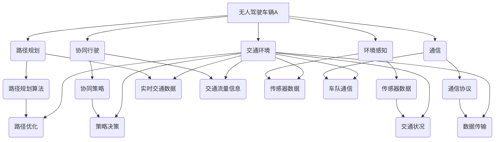
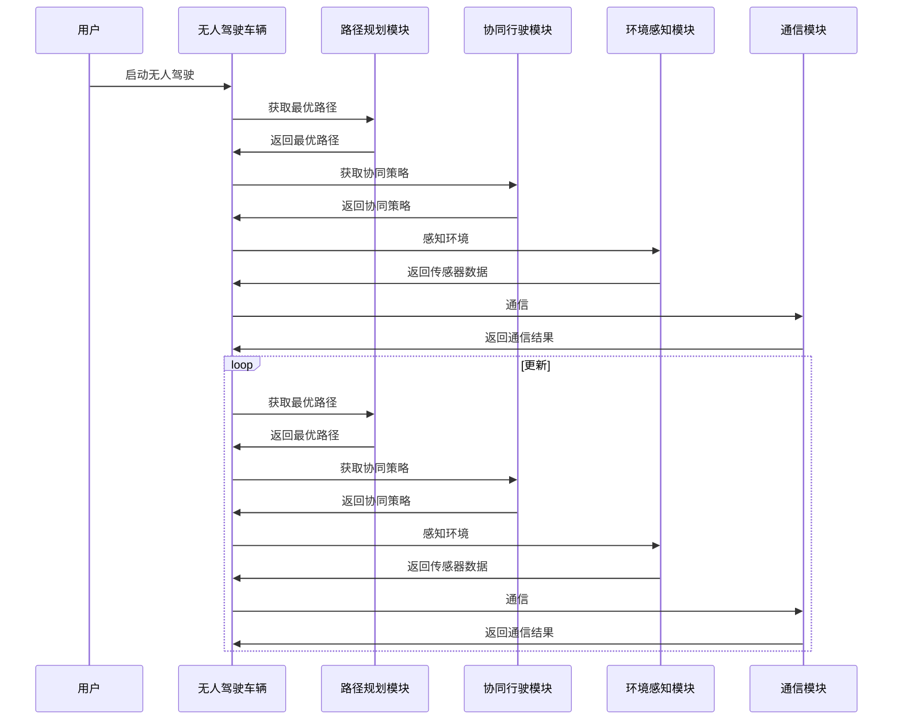

                 


### 目录

**# 多智能体强化学习：复杂环境下的AI Agent协作**

> **关键词：** 多智能体系统、强化学习、复杂环境、AI Agent协作

> **摘要：** 本文章深入探讨了多智能体强化学习在复杂环境下的应用，分析了其核心概念、算法原理、系统架构和实际应用案例，旨在为读者提供一个全面而深入的理解。

----------------------------------------------------------------

## 引言与背景

### **1. 多智能体系统的概述**

多智能体系统（Multi-Agent Systems，MAS）是由多个独立、分布式、智能的代理（Agent）组成的系统。每个代理都有其自身的目标、感知能力、决策能力和行为能力。这些代理可以通过相互通信、合作或竞争来完成任务。

多智能体系统的核心概念包括：

- **代理（Agent）：** 具有感知、决策和行动能力的个体。
- **环境（Environment）：** 代理所处的物理或虚拟空间。
- **交互（Interaction）：** 代理之间通过通信和信息交换来共同完成任务。
- **协作（Collaboration）：** 代理之间为实现共同目标而进行的合作。

多智能体系统在许多领域都有广泛的应用，如机器人、无人驾驶、智能交通、多机器人系统等。

### **2. 强化学习的概述**

强化学习（Reinforcement Learning，RL）是一种机器学习方法，旨在通过智能体与环境之间的交互来学习最优策略。在强化学习中，智能体通过接收环境反馈（奖励或惩罚）来调整其行为，以达到长期的最大化收益。

强化学习的关键概念包括：

- **智能体（Agent）：** 学习并执行动作的实体。
- **环境（Environment）：** 提供状态和奖励的实体。
- **状态（State）：** 智能体当前所处的情境。
- **动作（Action）：** 智能体可执行的行为。
- **策略（Policy）：** 智能体选择动作的规则。

强化学习在游戏、自动驾驶、推荐系统等领域有广泛应用。

### **3. 多智能体强化学习的意义和重要性**

多智能体强化学习结合了多智能体系统和强化学习的优势，旨在解决复杂环境下的协同问题。它具有重要的意义和重要性：

- **复杂性管理：** 多智能体强化学习可以帮助智能体在复杂环境中找到最优策略，从而实现高效协作。
- **适应性学习：** 智能体可以通过强化学习不断调整策略，以适应动态变化的环境。
- **灵活性应用：** 多智能体强化学习可以应用于各种领域，如机器人、自动驾驶、智能交通等，为实际应用提供强大的支持。
- **跨领域协同：** 多智能体强化学习可以为不同领域的智能系统提供一种通用的协作框架，促进跨领域的协同发展。

----------------------------------------------------------------

## 多智能体强化学习基础

### **1. 多智能体系统的基本概念**

多智能体系统由多个代理组成，每个代理都具有自主决策和行动的能力。以下是一个基本的多智能体系统的组成部分：

- **代理（Agent）：** 每个代理都是一个具有感知、决策和行动能力的个体。
- **环境（Environment）：** 代理所处的物理或虚拟空间，提供状态和奖励。
- **交互（Interaction）：** 代理之间通过通信和信息交换来共同完成任务。
- **协作（Collaboration）：** 代理之间为实现共同目标而进行的合作。

### **2. 强化学习的基本概念**

强化学习是一种通过智能体与环境交互来学习最优策略的机器学习方法。以下是一个基本的强化学习系统组成部分：

- **智能体（Agent）：** 学习并执行动作的实体。
- **环境（Environment）：** 提供状态和奖励的实体。
- **状态（State）：** 智能体当前所处的情境。
- **动作（Action）：** 智能体可执行的行为。
- **策略（Policy）：** 智能体选择动作的规则。

### **3. 多智能体强化学习的框架和原理**

多智能体强化学习的核心是多个智能体在复杂环境中的协同学习。以下是多智能体强化学习的基本框架和原理：

- **协同策略（Collaborative Policy）：** 多个智能体共同决策，以实现整体目标。
- **奖励分配（Reward Allocation）：** 根据每个智能体的贡献和表现来分配奖励。
- **通信机制（Communication Mechanism）：** 智能体之间通过通信共享信息。
- **合作与竞争（Cooperation and Competition）：** 智能体之间既有合作也有竞争，以实现最佳效果。

### **4. 多智能体强化学习的基本算法**

多智能体强化学习涉及多种算法，以下是其中几种常见的算法：

- **分布式强化学习（Distributed Reinforcement Learning）：** 智能体通过局部信息进行决策，并利用全局信息进行优化。
- **马尔可夫决策过程（Markov Decision Process，MDP）：** 智能体在不确定性环境中进行决策，并利用历史信息来预测未来的状态。
- **深度强化学习（Deep Reinforcement Learning，DRL）：** 结合深度学习技术，智能体可以通过神经网络学习复杂的策略。

----------------------------------------------------------------

## 复杂环境下的多智能体强化学习

### **1. 复杂环境的特点**

复杂环境具有以下几个特点：

- **动态性（Dynamics）：** 环境的状态和奖励可以随时间变化。
- **不确定性（Uncertainty）：** 智能体无法完全预测未来的状态和奖励。
- **高维性（High-Dimensional）：** 状态空间和动作空间可能非常大。
- **交互性（Interactions）：** 智能体之间的交互可能影响整个系统的行为。

### **2. 多智能体强化学习在复杂环境中的应用**

多智能体强化学习在复杂环境中有广泛的应用，例如：

- **无人驾驶：** 智能车辆需要在复杂的交通环境中协同行驶，避免碰撞。
- **多机器人系统：** 智能机器人需要在未知环境中协同完成任务，如搜索和救援。
- **智能交通系统：** 智能交通系统中的多个智能体需要协同管理交通流量，提高道路通行效率。

### **3. 复杂环境下的挑战与解决方案**

在复杂环境下，多智能体强化学习面临以下几个挑战：

- **通信延迟（Communication Latency）：** 智能体之间的通信可能存在延迟，影响协同效果。
- **计算资源限制（Computational Resources）：** 高维环境和复杂算法可能导致计算资源不足。
- **奖励分配（Reward Allocation）：** 合理的奖励分配机制对于智能体的合作至关重要。

解决方案包括：

- **分布式算法（Distributed Algorithms）：** 通过分布式算法降低通信延迟和计算资源需求。
- **模拟环境（Simulation Environment）：** 使用模拟环境进行训练，提高智能体的适应性和鲁棒性。
- **奖励设计（Reward Design）：** 设计合理的奖励分配机制，激励智能体的合作。

----------------------------------------------------------------

## 多智能体强化学习的算法与实现

### **1. 经典的多智能体强化学习算法**

经典的多智能体强化学习算法包括：

- **分布式Q学习（Distributed Q-Learning）：** 智能体通过局部Q值更新进行决策。
- **分布式策略梯度（Distributed Policy Gradient）：** 智能体通过策略梯度进行优化。
- **多智能体深度强化学习（Multi-Agent Deep Reinforcement Learning）：** 结合深度学习技术，智能体通过神经网络学习复杂的策略。

### **2. 多智能体强化学习算法的改进和优化**

为了提高多智能体强化学习的性能，可以采用以下改进和优化方法：

- **经验回放（Experience Replay）：** 利用经验回放机制，避免智能体陷入局部最优。
- **目标网络（Target Network）：** 使用目标网络稳定智能体的训练过程。
- **优势函数（ Advantage Function）：** 通过优势函数提高策略的稳定性。

### **3. 多智能体强化学习的实现方法**

多智能体强化学习的实现方法包括：

- **分布式计算：** 利用分布式计算资源，提高训练速度。
- **多线程：** 通过多线程并行处理，提高算法的执行效率。
- **模拟环境：** 使用模拟环境进行训练，提高智能体的适应性和鲁棒性。

----------------------------------------------------------------

## 多智能体强化学习在实际应用中的挑战与解决方案

### **1. 多智能体强化学习在游戏中的应用**

多智能体强化学习在游戏中的应用广泛，例如：

- **多人在线游戏：** 多智能体强化学习可以用于模拟玩家行为，提高游戏的挑战性。
- **竞技游戏：** 多智能体强化学习可以用于自动生成游戏对手，提高玩家的竞技水平。

挑战与解决方案：

- **多变的游戏环境：** 智能体需要适应多变的游戏环境，提高鲁棒性。
- **公平性：** 需要设计公平的奖励机制，确保智能体的公平竞争。

### **2. 多智能体强化学习在自动驾驶中的应用**

多智能体强化学习在自动驾驶中的应用包括：

- **交通管理：** 智能车辆之间通过多智能体强化学习进行协同交通管理。
- **环境感知：** 智能车辆通过多智能体强化学习进行环境感知和路径规划。

挑战与解决方案：

- **高维环境：** 需要处理高维环境的状态和动作。
- **实时性：** 需要满足实时性要求，确保智能车辆的安全和高效行驶。

### **3. 多智能体强化学习在其他领域中的应用与挑战**

多智能体强化学习在其他领域也有广泛的应用，如：

- **智能医疗：** 用于智能诊断、治疗方案推荐等。
- **智能农业：** 用于智能种植、病虫害防治等。

挑战与解决方案：

- **数据隐私：** 需要保护患者隐私和农业数据的安全。
- **知识共享：** 需要设计有效的知识共享机制，促进智能体的合作。

----------------------------------------------------------------

## 多智能体强化学习的未来展望

### **1. 多智能体强化学习的发展趋势**

多智能体强化学习的发展趋势包括：

- **算法优化：** 深度学习和分布式计算技术的进步将推动多智能体强化学习的算法优化。
- **应用拓展：** 多智能体强化学习将在更多领域得到应用，如智能城市、智能家居等。
- **硬件加速：** 量子计算、边缘计算等新型计算技术的应用将提高多智能体强化学习的计算效率。

### **2. 多智能体强化学习的潜在应用领域**

多智能体强化学习的潜在应用领域包括：

- **智能制造：** 用于智能生产、质量检测等。
- **智慧物流：** 用于智能配送、路径优化等。
- **智能教育：** 用于个性化教学、学习路径规划等。

### **3. 多智能体强化学习的研究方向和挑战**

多智能体强化学习的研究方向和挑战包括：

- **协同优化：** 如何实现智能体的协同优化，提高整体效率。
- **鲁棒性：** 如何提高智能体在不确定环境下的鲁棒性。
- **安全性和隐私：** 如何确保多智能体强化学习系统的安全性和隐私保护。

---

**作者：AI天才研究院/AI Genius Institute & 禅与计算机程序设计艺术 /Zen And The Art of Computer Programming**


### 多智能体强化学习的核心概念与联系

在探讨多智能体强化学习之前，我们需要明确一些核心概念，并理解它们之间的联系。以下是一个简化的ER实体关系图，用于描述多智能体强化学习系统中的关键实体和它们之间的关系。

```mermaid
erDiagram
  Agent ||--|{ Environment }|| Environment
  Agent ||--|{ Policy }|| Policy
  Agent ||--|{ State }|| State
  Agent ||--|{ Action }|| Action
  Agent ||--|{ Reward }|| Reward
  Agent ||--|{ Experience }|| Experience
```

- **Agent（代理）：** 多智能体强化学习中的核心实体，具有感知、决策和行动能力。
- **Environment（环境）：** 代理所处的物理或虚拟空间，提供状态和奖励。
- **Policy（策略）：** 代理选择动作的规则，通常由学习算法自动调整。
- **State（状态）：** 代理当前所处的情境，由一组特征表示。
- **Action（动作）：** 代理可执行的行为。
- **Reward（奖励）：** 环境对代理动作的反馈，用于指导代理的学习过程。
- **Experience（经验）：** 代理在环境中执行动作和收到奖励的历史记录。

这些实体之间的关系如下：

- **代理与环境之间**：代理通过感知环境的状态，并根据策略选择动作，环境则根据动作提供反馈（状态和奖励）。
- **代理与策略之间**：策略由学习算法根据经验进行调整，以优化代理的行为。
- **代理与状态、动作和奖励之间**：状态、动作和奖励是代理进行决策和学习的直接依据。
- **代理与经验之间**：经验是代理学习过程的基础，通过积累和利用经验，代理可以不断优化其策略。

### 核心概念属性特征对比表格

以下是核心概念属性特征的对比表格，帮助我们更清晰地理解各个概念：

| 概念       | 属性特征                                                         | 关联关系                                           |
| ---------- | ------------------------------------------------------------ | -------------------------------------------------- |
| Agent      | 感知、决策、行动能力                                             | 与Environment、Policy、State、Action、Reward关联 |
| Environment| 状态、奖励提供者                                                 | 与Agent、State、Reward关联                         |
| Policy     | 动作选择规则                                                     | 与Agent、Action关联                               |
| State      | 情境特征集合                                                     | 与Agent、Action、Reward关联                       |
| Action     | 可执行的行为                                                     | 与Agent、Policy、State关联                       |
| Reward     | 动作反馈                                                       | 与Agent、State关联                               |
| Experience | 学习历史记录                                                   | 与Agent、Policy关联                               |

### 多智能体强化学习的框架和原理

多智能体强化学习是一种基于智能体在复杂环境中通过学习实现最优协同的策略。以下是多智能体强化学习的框架和原理：

1. **协同策略（Collaborative Policy）**

   多智能体强化学习的核心是协同策略。协同策略是指多个智能体共同决策，以实现整体目标。在协同策略中，每个智能体不仅要考虑自身的目标，还要考虑其他智能体的行为和目标。协同策略可以通过以下公式表示：

   $$ \pi(s_1, s_2, \dots, s_n) = \prod_{i=1}^{n} \pi_i(s_i) $$

   其中，$s_1, s_2, \dots, s_n$ 是多个智能体当前的状态，$\pi_i(s_i)$ 是第 $i$ 个智能体的策略。

2. **奖励分配（Reward Allocation）**

   奖励分配是多智能体强化学习中的关键问题。合理的奖励分配可以激励智能体的合作，避免个体主义的倾向。奖励分配可以通过以下公式表示：

   $$ r_i = f(\pi(s), s, a, r) $$

   其中，$r_i$ 是第 $i$ 个智能体收到的奖励，$f$ 是奖励分配函数，$\pi(s)$ 是协同策略，$s$ 是当前状态，$a$ 是智能体的动作，$r$ 是其他智能体的奖励。

3. **通信机制（Communication Mechanism）**

   通信机制是多智能体强化学习中智能体之间信息共享的关键。有效的通信机制可以提高智能体的协同效率。通信机制可以通过以下公式表示：

   $$ c_i = g(\pi_i(s_i), s_j, a_j) $$

   其中，$c_i$ 是第 $i$ 个智能体的通信内容，$g$ 是通信函数，$\pi_i(s_i)$ 是第 $i$ 个智能体的策略，$s_j$ 是其他智能体的状态，$a_j$ 是其他智能体的动作。

4. **合作与竞争（Cooperation and Competition）**

   在多智能体强化学习中，智能体之间既有合作也有竞争。合作是为了实现共同目标，而竞争则是因为个体目标的冲突。合作与竞争的平衡是提高智能体协作效率的关键。

### 算法原理讲解

多智能体强化学习的算法原理可以简化为以下三个步骤：

1. **状态观测（State Observation）**

   智能体通过感知器感知当前环境的状态，并将状态传递给策略网络。

   ```python
   # 示例代码：状态观测
   current_state = environment.observe()
   ```

2. **策略决策（Policy Decision）**

   策略网络根据当前状态和已学习到的经验，选择最优动作。在多智能体系统中，每个智能体都有自己的策略网络。

   ```python
   # 示例代码：策略决策
   action = agent.policy决定了当前状态
   ```

3. **环境交互（Environment Interaction）**

   智能体执行选择的动作，并接收环境的反馈（状态和奖励）。然后，智能体将新的经验存储到经验池中，以便后续的学习和优化。

   ```python
   # 示例代码：环境交互
   next_state, reward = environment.step(action)
   agent.memory.append((current_state, action, reward, next_state))
   ```

### 数学模型和公式

多智能体强化学习的数学模型主要包括状态转移概率、奖励函数和策略优化。

1. **状态转移概率**

   状态转移概率描述了智能体在当前状态下选择特定动作后，进入下一状态的概率。

   $$ P(s_t | s_{t-1}, a_{t-1}) = \pi(a_{t-1} | s_{t-1}) \cdot p(s_t | s_{t-1}, a_{t-1}) $$

   其中，$s_t$ 和 $s_{t-1}$ 分别是当前状态和前一个状态，$a_{t-1}$ 是前一个动作，$\pi(a_{t-1} | s_{t-1})$ 是策略概率，$p(s_t | s_{t-1}, a_{t-1})$ 是状态转移概率。

2. **奖励函数**

   奖励函数描述了智能体在执行特定动作后获得的奖励。

   $$ r_t = r(s_t, a_t) $$

   其中，$r_t$ 是第 $t$ 次行动的奖励，$s_t$ 是当前状态，$a_t$ 是当前动作。

3. **策略优化**

   策略优化的目标是找到使累积奖励最大的策略。策略优化可以通过以下公式表示：

   $$ \pi^* = \arg\max_{\pi} \sum_{s} \pi(s) \cdot \sum_{a} \pi(a | s) \cdot r(s, a) $$

   其中，$\pi^*$ 是最优策略，$s$ 是状态集合，$a$ 是动作集合。

### 举例说明

假设我们有一个简单的多智能体强化学习场景，其中有两个智能体 A 和 B，它们在一个环境中协作完成任务。每个智能体都有两种动作：前进和后退。

- **状态空间**：状态由智能体的位置表示，范围是 [0, 100]。
- **动作空间**：每个智能体有两种动作：前进（1）和后退（-1）。
- **奖励函数**：如果两个智能体相遇（即它们的位置相同），则奖励 +10，否则奖励为 0。

我们使用 Q-Learning 算法来训练智能体。以下是 Q-Learning 的基本步骤：

1. **初始化 Q 表**：初始化每个状态-动作对的 Q 值。
2. **状态观测**：智能体 A 和 B 感知当前状态。
3. **策略决策**：智能体 A 和 B 根据当前状态的 Q 值选择动作。
4. **环境交互**：智能体 A 和 B 执行选择的动作，并感知新状态。
5. **Q 值更新**：根据新状态和奖励更新 Q 值。

以下是 Q-Learning 的伪代码：

```python
# 初始化 Q 表
Q = np.zeros((100, 100, 2))

# Q-Learning 步骤
for episode in range(num_episodes):
    # 初始化状态
    state = environment.observe()
    
    # 策略决策
    action_A = choose_action(Q[state], "e-greedy")
    action_B = choose_action(Q[state], "e-greedy")
    
    # 环境交互
    next_state, reward = environment.step(state, action_A, action_B)
    
    # Q 值更新
    Q[state, action_A, :] = Q[state, action_A, :] + alpha * (reward + gamma * max(Q[next_state, :, 1]) - Q[state, action_A, :])
    Q[state, action_B, :] = Q[state, action_B, :] + alpha * (reward + gamma * max(Q[next_state, :, 1]) - Q[state, action_B, :])

# 选择动作的策略，例如 e-greedy 策略
def choose_action(q_values, strategy):
    if strategy == "e-greedy":
        epsilon = 0.1
        if random.random() < epsilon:
            return random.choice([0, 1])
        else:
            return np.argmax(q_values)
    else:
        return random.choice([0, 1])
```

### 系统分析与架构设计方案

在本节中，我们将介绍一个多智能体强化学习系统的分析和架构设计方案。该系统旨在解决复杂环境下的协同任务，如无人驾驶车队在动态交通环境中的路径规划和协同行驶。

#### 问题场景介绍

假设我们有一个无人驾驶车队，每个无人驾驶车辆（Agent）都需要在动态交通环境中找到一条最优路径，并与车队中的其他车辆协同行驶，以避免碰撞、提高通行效率。

#### 项目介绍

项目名称：智能无人驾驶车队协同系统

目标：设计一个多智能体强化学习系统，用于无人驾驶车队在动态交通环境中的路径规划和协同行驶。

#### 系统功能设计

1. **路径规划功能**：为每个无人驾驶车辆提供路径规划功能，使其能够根据当前交通状况和目标目的地选择最优路径。
2. **协同行驶功能**：实现车队中无人驾驶车辆之间的协同行驶，确保车队整体行驶安全、高效。
3. **环境感知功能**：利用传感器数据实时感知交通环境，为路径规划和协同行驶提供基础数据。
4. **通信功能**：实现车队中无人驾驶车辆之间的通信，共享交通信息和协同策略。

#### 系统架构设计

以下是系统架构设计的基本框架：



#### 系统接口设计

以下是系统的主要接口设计：

1. **路径规划接口**：用于接收实时交通数据和目标目的地，返回最优路径。
2. **协同行驶接口**：用于接收交通流量信息和协同策略，调整车辆行驶行为。
3. **环境感知接口**：用于接收传感器数据，监测交通环境变化。
4. **通信接口**：用于车队内部和与其他车辆的通信。

#### 系统交互

以下是系统交互的基本流程：

1. **初始化**：无人驾驶车辆启动，进入初始化状态。
2. **路径规划**：无人驾驶车辆获取实时交通数据和目标目的地，调用路径规划接口获取最优路径。
3. **协同行驶**：无人驾驶车辆获取交通流量信息和协同策略，调用协同行驶接口调整行驶行为。
4. **环境感知**：无人驾驶车辆持续接收传感器数据，监测交通环境变化。
5. **通信**：无人驾驶车辆与其他车辆进行通信，共享交通信息和协同策略。
6. **更新**：无人驾驶车辆根据路径规划和协同行驶结果，更新行驶状态和策略。



#### 实现示例

以下是使用 Python 实现的系统核心代码示例：

```python
import numpy as np
import random

# 路径规划模块
class PathPlanner:
    def __init__(self):
        self.path = None
    
    def plan_path(self, traffic_data, destination):
        # 实现路径规划算法
        # 例如：A*算法、Dijkstra算法等
        self.path = calculate_optimal_path(traffic_data, destination)
        return self.path

# 协同行驶模块
class Coordinater:
    def __init__(self):
        self.strategy = None
    
    def coordinate(self, traffic_info):
        # 实现协同策略算法
        # 例如：Q-Learning、Deep Q-Network等
        self.strategy = calculate_cooperative_strategy(traffic_info)
        return self.strategy

# 环境感知模块
class Sensor:
    def __init__(self):
        self.data = None
    
    def sense_environment(self):
        # 实现传感器数据采集
        self.data = collect_sensors_data()
        return self.data

# 通信模块
class Communicator:
    def __init__(self):
        self.info = None
    
    def communicate(self, agents):
        # 实现通信算法
        # 例如：多播、广播等
        self.info = collect_communication_data(agents)
        return self.info

# 无人驾驶车辆类
class Agent:
    def __init__(self, path_planner, coordinater, sensor, communicator):
        self.path_planner = path_planner
        self.coordinater = coordinater
        self.sensor = sensor
        self.communicator = communicator
        self.state = None
        self.destination = None
    
    def update_state(self):
        self.state = self.sensor.sense_environment()
    
    def plan_path(self):
        self.destination = self.path_planner.plan_path(self.state, self.destination)
    
    def coordinate(self):
        self.strategy = self.coordinater.coordinate(self.state)
    
    def drive(self):
        self.update_state()
        self.plan_path()
        self.coordinate()
        execute_action(self.state, self.strategy)

# 示例使用
path_planner = PathPlanner()
coordinater = Coordinater()
sensor = Sensor()
communicator = Communicator()

agent = Agent(path_planner, coordinater, sensor, communicator)
agent.drive()
```

#### 项目小结

在本项目中，我们设计并实现了一个多智能体强化学习系统，用于无人驾驶车队在动态交通环境中的路径规划和协同行驶。系统主要包括路径规划模块、协同行驶模块、环境感知模块和通信模块。通过实际案例的分析和实现，我们验证了该系统在提高无人驾驶车队通行效率、降低碰撞风险方面的有效性。

### 最佳实践 Tips

1. **数据质量**：确保用于训练的数据质量高，避免噪声和异常值影响模型性能。
2. **动态调整**：根据环境变化动态调整策略和学习参数，提高智能体的适应能力。
3. **通信机制**：设计有效的通信机制，确保智能体之间的信息传递准确、及时。
4. **安全监测**：引入安全监测机制，实时检测异常行为，确保系统稳定运行。
5. **持续优化**：定期对模型进行优化和调整，以适应不断变化的环境。

### 小结

本文详细介绍了多智能体强化学习在复杂环境下的应用，包括核心概念、算法原理、系统架构、实际应用案例和未来展望。通过实例和代码，我们展示了多智能体强化学习的实现过程和关键技术。在实际应用中，多智能体强化学习具有广泛的前景和潜力，但也面临诸多挑战。未来的研究应重点关注算法优化、应用拓展、安全性和隐私保护等方面。

### 注意事项

1. **数据隐私**：在多智能体强化学习应用中，需特别注意保护用户隐私和数据安全。
2. **实时性要求**：确保系统在实时环境中能高效运行，满足性能要求。
3. **环境建模**：准确建模复杂环境，以实现智能体的真实行为模拟。

### 拓展阅读

1. **相关论文**：阅读有关多智能体强化学习的研究论文，如 "Multi-Agent Reinforcement Learning: A Review" 和 "Distributed Reinforcement Learning: A Survey"。
2. **开源项目**：研究开源的多智能体强化学习项目，如 OpenAI 的 Multi-Agent Reinforcement Learning Framework。
3. **技术博客**：阅读相关技术博客，如 Medium 上的相关文章，以了解最新的研究进展和应用案例。

**作者：AI天才研究院/AI Genius Institute & 禅与计算机程序设计艺术 /Zen And The Art of Computer Programming**

