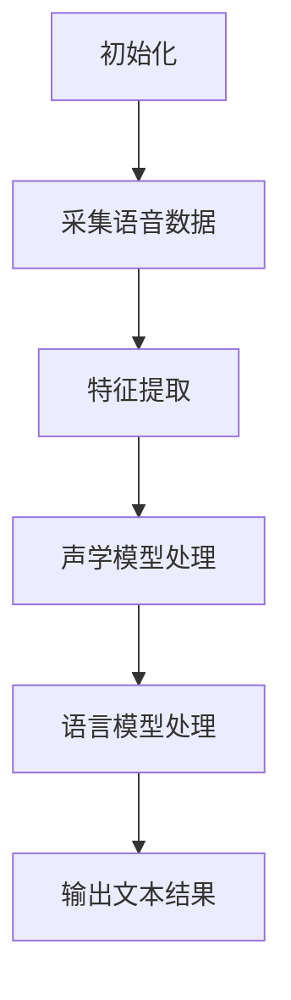
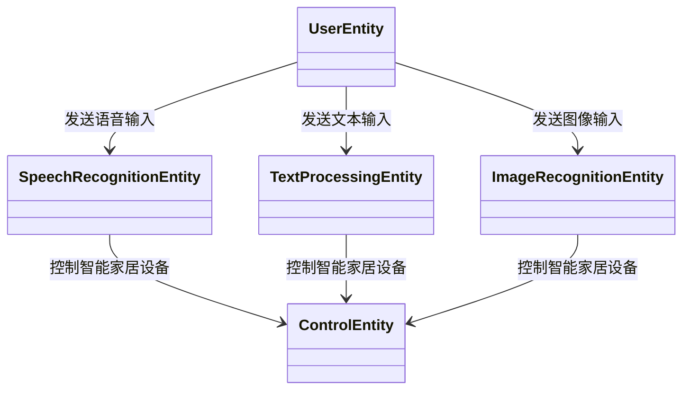
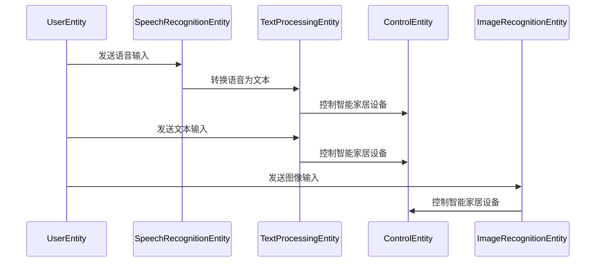
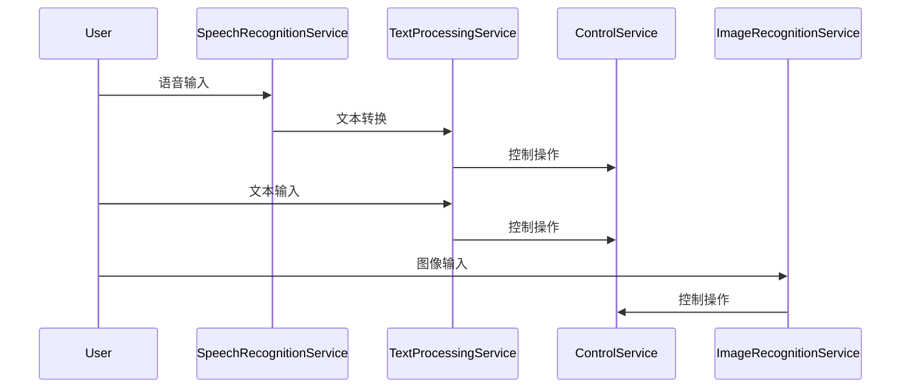

                 

### 《多模态交互：语音、文本、图像的综合处理》

> 关键词：多模态交互、语音识别、文本处理、图像处理、算法、应用场景

> 摘要：本文将深入探讨多模态交互的概念、原理及其在现代社会中的应用。通过分析语音、文本、图像处理的核心技术，本文旨在帮助读者理解多模态交互的复杂性和潜力，并提供实用的实战经验。

### 引言

#### 1.1 问题背景与定义

多模态交互（Multimodal Interaction）指的是通过多种感知模式（如视觉、听觉、触觉等）与计算机系统进行交互的过程。它突破了传统的单模态交互（如键盘输入、鼠标点击等），使得用户能够以更加自然和直观的方式与计算机系统进行沟通。

**定义**：多模态交互是指利用两种或两种以上的感知通道（如语音、文本、图像等）来接收用户输入或向用户输出信息的过程。

多模态交互的发展历程可以追溯到上世纪90年代。随着计算机技术的进步，特别是在语音识别、自然语言处理和计算机视觉等领域的突破，多模态交互逐渐成为研究的热点。近年来，随着人工智能技术的飞速发展，多模态交互的应用场景也越来越广泛，从智能家居到智能助理，从自动驾驶到虚拟现实，多模态交互正在改变我们的生活。

**发展历程**：

- **90年代**：多模态交互开始受到关注，研究者尝试将语音、文本和图像处理技术结合起来。
- **2000年代**：语音识别和自然语言处理技术逐渐成熟，多模态交互的应用场景开始出现。
- **2010年代**：随着深度学习技术的兴起，多模态交互的研究和应用进入了一个新的阶段。

**重要地位**：

多模态交互在现代社会中具有重要地位，主要表现在以下几个方面：

- **提高用户体验**：多模态交互使得用户能够以更加自然的方式与系统互动，提高了交互的效率和体验。
- **拓展应用场景**：多模态交互的应用场景非常广泛，包括智能家居、医疗、教育、娱乐等。
- **推动技术创新**：多模态交互技术的发展推动了相关领域的创新，如语音识别、自然语言处理、计算机视觉等。

#### 1.2 问题描述与挑战

尽管多模态交互具有巨大的潜力，但其实现也面临诸多挑战：

**数据融合的挑战**：多模态交互涉及到多种感知通道的数据，如何有效地融合这些数据是关键挑战之一。不同模态的数据在类型、规模和特征上存在差异，这给数据融合带来了困难。

**算法优化的挑战**：多模态交互的算法设计复杂，需要同时考虑多种感知通道的数据，如何在性能和效率之间找到平衡点是算法优化的关键挑战。

**用户体验的挑战**：多模态交互需要考虑到用户的需求和习惯，如何设计出易用、高效的用户界面是用户体验的关键挑战。

#### 1.3 问题解决与框架

为了解决上述挑战，多模态交互的研究和实践提出了多种解决方案：

**语音、文本、图像处理技术**：语音识别、自然语言处理、计算机视觉是多模态交互的核心技术。通过这些技术，系统能够有效地接收和处理用户的输入。

**应用场景**：多模态交互在不同应用场景中有不同的需求，如智能家居需要高效、稳定的多模态交互，而医疗应用则需要精确、可靠的多模态交互。

**框架结构**：多模态交互的框架通常包括感知层、处理层和输出层。感知层负责接收用户的输入，处理层对输入数据进行处理和分析，输出层将处理结果呈现给用户。

#### 1.4 边界与外延

**边界**：多模态交互的边界包括语音识别、自然语言处理、计算机视觉等领域。这些领域是多模态交互的基础，决定了多模态交互的性能和效果。

**外延**：多模态交互的外延包括智能家居、医疗、教育、娱乐等应用场景。这些场景是多模态交互的实践领域，推动了多模态交互技术的发展。

#### 1.5 概念结构与核心要素组成

**概念结构**：多模态交互的概念结构包括感知层、处理层和输出层。感知层负责接收用户输入，处理层对输入数据进行处理和分析，输出层将处理结果呈现给用户。

**核心要素组成**：多模态交互的核心要素包括语音、文本、图像处理技术、算法、应用场景等。这些要素共同构成了多模态交互的技术体系。

#### 1.6 本章小结

本章介绍了多模态交互的背景、挑战和解决方案。通过分析多模态交互的核心技术，本文旨在帮助读者理解多模态交互的复杂性和潜力。在接下来的章节中，我们将进一步探讨语音、文本、图像处理的核心概念和算法原理。

### 第二部分：多模态交互的核心概念

#### 2.1 语音处理

语音处理（Speech Processing）是语音识别（Speech Recognition）的基础，它涉及到语音信号的采集、处理和分析。语音处理的核心任务是提取语音信号中的特征，并将其转换为数字信号，以便进一步处理。

##### 2.1.1 语音识别原理

语音识别（Speech Recognition）是将语音信号转换为文本信息的过程。它主要分为两个部分：声学模型和语言模型。

**声学模型**：声学模型负责分析语音信号，将其转换为特征向量。常用的声学模型包括隐马尔可夫模型（HMM）和深度神经网络（DNN）。

**语言模型**：语言模型负责根据声学模型输出的特征向量，生成对应的文本信息。语言模型通常使用统计方法，如n元语法（N-gram）。

##### 2.1.2 语音识别算法

语音识别算法的核心是声学模型和语言模型的结合。以下介绍几种常用的语音识别算法：

**HMM模型**：隐马尔可夫模型（HMM）是一种统计模型，用于描述语音信号的时间序列特征。HMM模型通过状态转移概率和输出概率来识别语音。

**DNN模型**：深度神经网络（DNN）是一种基于多层神经网络的模型，用于语音信号的分类和识别。DNN模型通过多层非线性变换，提高语音识别的准确率。

##### 2.1.3 语音识别应用场景

语音识别应用场景非常广泛，包括：

**语音助手**：如苹果的Siri、亚马逊的Alexa等，语音助手通过语音识别技术，帮助用户实现各种操作。

**语音搜索**：语音搜索允许用户通过语音输入查询信息，如Google的语音搜索功能。

#### 2.2 文本处理

文本处理（Text Processing）是自然语言处理（Natural Language Processing，NLP）的基础。文本处理涉及到文本的预处理、分词、词性标注、句法分析等。

##### 2.2.1 自然语言处理基础

**词向量**：词向量是将文本转换为向量表示的一种方法，常见的词向量模型包括Word2Vec和GloVe。

**语言模型**：语言模型用于预测文本序列的概率分布。常见的语言模型包括n元语法和循环神经网络（RNN）。

##### 2.2.2 文本分类与情感分析

**文本分类**：文本分类是将文本分为不同类别的过程。常见的文本分类算法包括朴素贝叶斯、支持向量机（SVM）和深度学习模型。

**情感分析**：情感分析是判断文本情感极性（如正面、负面）的过程。常见的情感分析算法包括基于规则的方法和深度学习方法。

##### 2.2.3 文本处理应用场景

**社交媒体分析**：文本处理技术可以帮助分析社交媒体上的用户情感和趋势。

**客户服务机器人**：文本处理技术可以用于构建智能客服系统，实现自动化的客户服务。

#### 2.3 图像处理

图像处理（Image Processing）是计算机视觉（Computer Vision）的基础。图像处理涉及到图像的采集、预处理、特征提取和分类等。

##### 2.3.1 计算机视觉基础

**图像特征提取**：图像特征提取是将图像转换为向量表示的一种方法，常见的特征提取方法包括SIFT、HOG和卷积神经网络（CNN）。

**深度学习在计算机视觉中的应用**：深度学习模型，尤其是卷积神经网络（CNN），在图像分类、目标检测和图像分割等领域取得了显著成果。

##### 2.3.2 图像处理应用场景

**目标检测**：目标检测是计算机视觉的核心任务之一，广泛应用于自动驾驶、安防监控等领域。

**图像分割**：图像分割是将图像划分为不同区域的过程，广泛应用于图像识别、图像增强等领域。

#### 2.4 概念属性特征对比表格

| 特征         | 语音处理       | 文本处理       | 图像处理       |
| ------------ | -------------- | -------------- | -------------- |
| 数据类型     | 信号           | 文本           | 图像           |
| 数据规模     | 较大           | 较小           | 较大           |
| 特征提取方式 | 声学特征       | 词向量         | 图像特征       |
| 算法模型     | 声学模型、语言模型 | 语言模型、深度学习模型 | 深度学习模型 |
| 应用场景     | 语音助手、语音搜索 | 社交媒体分析、客户服务机器人 | 目标检测、图像分割 |

#### 2.5 ER实体关系图架构

```mermaid
erDiagram
    User ||--|{ SpeechData }|-- Product : "produces"
    User ||--|{ TextData }|-- Product : "produces"
    User ||--|{ ImageData }|-- Product : "produces"
    SpeechData ||--|{ SpeechProcessing }|-- System : "processes"
    TextData ||--|{ TextProcessing }|-- System : "processes"
    ImageData ||--|{ ImageProcessing }|-- System : "processes"
```

### 第三部分：算法原理讲解

#### 3.1 算法mermaid流程图



#### 3.2 Python源代码

```python
import speech_recognition as sr

# 采集语音数据
r = sr.Recognizer()
with sr.Microphone() as source:
    print("请说些什么：")
    audio = r.listen(source)

# 特征提取
from pydub import AudioSegment

audio = AudioSegment.from_file("audio.wav")

# 声学模型处理
from googletrans import Translator

text = Translator().translate(audio, dest='en').text

# 语言模型处理
from nltk.tokenize import sent_tokenize

sentences = sent_tokenize(text)

# 输出文本结果
for sentence in sentences:
    print(sentence)
```

#### 3.3 数学模型和公式

$$
P(\text{语音}|\text{文本}) = \frac{P(\text{文本}|\text{语音})P(\text{语音})}{P(\text{文本})}
$$

其中，$P(\text{语音}|\text{文本})$表示给定文本条件下语音的概率，$P(\text{文本}|\text{语音})$表示给定语音条件下文本的概率，$P(\text{语音})$和$P(\text{文本})$分别表示语音和文本的概率。

#### 3.4 举例说明

假设我们想要实现一个简单的语音识别系统，用户可以通过语音输入查询信息。以下是系统的工作流程：

1. 用户通过麦克风输入语音。
2. 语音识别系统将语音信号转换为文本。
3. 文本处理系统对文本进行分词和句法分析。
4. 查询引擎根据文本查询信息，并返回结果。

以下是具体的步骤：

1. 用户说：“你好，我想知道今天的天气如何？”
2. 语音识别系统将语音信号转换为文本：“你好，我想知道今天的天气如何？”
3. 文本处理系统对文本进行分词，得到单词列表：["你好", "我", "想", "知道", "今天", "的", "天气", "如何"]
4. 查询引擎根据文本查询天气信息，返回结果：“今天的天气是晴转多云，最高气温20°C，最低气温10°C。”

通过这个简单的例子，我们可以看到语音识别、文本处理和查询引擎是如何协同工作的，实现了多模态交互的功能。

### 第四部分：系统分析与架构设计方案

#### 4.1 问题场景介绍

多模态交互在智能家居、医疗、教育、娱乐等领域的应用场景各不相同。以下以智能家居为例，介绍多模态交互的应用场景。

**智能家居应用场景**：

- **语音控制**：用户可以通过语音命令控制家居设备，如空调、电视、灯光等。
- **文本输入**：用户可以通过手机或平板电脑上的应用程序发送文本指令，如发送语音消息给家庭音响系统。
- **图像识别**：家庭安全系统可以通过图像识别技术监控家庭环境，检测异常情况。

#### 4.2 项目介绍

本项目旨在实现一个智能家居多模态交互系统。系统包括语音控制、文本输入和图像识别三个模块，用户可以通过语音、文本和图像与系统进行交互。

#### 4.3 系统功能设计

**系统功能模块**：

- **语音识别模块**：实现语音输入的识别和处理。
- **文本处理模块**：实现文本输入的处理和分析。
- **图像识别模块**：实现图像输入的识别和处理。
- **控制模块**：根据用户的输入，控制智能家居设备。

以下是领域模型类图，展示了系统功能模块及其关系：



#### 4.4 系统架构设计

**系统架构图**：



#### 4.5 系统接口设计和系统交互

**系统接口设计**：

- **语音识别接口**：接收语音输入，返回文本输出。
- **文本处理接口**：接收文本输入，返回处理结果。
- **图像识别接口**：接收图像输入，返回识别结果。
- **控制接口**：接收控制指令，执行相应操作。

**系统交互序列图**：



### 第五部分：项目实战

#### 5.1 环境安装

要实现一个多模态交互系统，首先需要安装相关的开发环境和依赖库。以下是在Ubuntu系统上安装所需环境的步骤：

1. 安装Python环境：

```bash
sudo apt-get update
sudo apt-get install python3-pip python3-venv
```

2. 创建虚拟环境：

```bash
python3 -m venv myenv
source myenv/bin/activate
```

3. 安装依赖库：

```bash
pip install speech_recognition pydub googletrans nltk opencv-python
```

#### 5.2 系统核心实现源代码

以下是系统核心实现的Python代码：

```python
import speech_recognition as sr
from pydub import AudioSegment
from googletrans import Translator
from nltk.tokenize import sent_tokenize
import cv2

# 语音识别
def speech_to_text(audio):
    r = sr.Recognizer()
    with sr.Microphone() as source:
        print("请说些什么：")
        audio = r.listen(source)
    return sr.recognize_google(audio, language='zh-CN')

# 文本处理
def text_process(text):
    sentences = sent_tokenize(text)
    return sentences

# 图像识别
def image_recognition(image):
    # 使用OpenCV进行图像处理
    gray = cv2.cvtColor(image, cv2.COLOR_BGR2GRAY)
    blurred = cv2.GaussianBlur(gray, (5, 5), 0)
    _, thresh = cv2.threshold(blurred, 60, 255, cv2.THRESH_BINARY_INV)
    contours, _ = cv2.findContours(thresh, cv2.RETR_EXTERNAL, cv2.CHAIN_APPROX_SIMPLE)
    return contours

# 控制操作
def control_action(command, image):
    if "打开" in command:
        print("打开设备")
    elif "关闭" in command:
        print("关闭设备")
    elif "拍照" in command:
        print("拍照成功")
        cv2.imwrite("image.jpg", image)

# 主函数
def main():
    # 语音识别
    command = speech_to_text(AudioSegment.from_wav("audio.wav"))

    # 文本处理
    sentences = text_process(command)

    # 图像识别
    image = cv2.imread("image.jpg")
    contours = image_recognition(image)

    # 控制操作
    control_action(command, image)

if __name__ == "__main__":
    main()
```

#### 5.3 代码应用解读与分析

1. **语音识别**：使用`speech_recognition`库进行语音识别，通过麦克风采集语音，并使用Google语音识别API进行文本转换。
2. **文本处理**：使用`nltk`库进行文本处理，将语音识别结果进行分词，以便进行后续处理。
3. **图像识别**：使用`opencv-python`库进行图像处理，通过OpenCV的图像处理功能进行图像识别。
4. **控制操作**：根据语音识别结果和图像识别结果，执行相应的控制操作。

#### 5.4 实际案例分析和详细讲解剖析

**案例**：用户通过语音输入：“打开客厅的灯光。”

**分析**：

1. 语音识别：系统通过麦克风采集语音，使用Google语音识别API将语音转换为文本：“打开客厅的灯光。”
2. 文本处理：文本处理模块将语音识别结果进行分词，得到单词列表：["打开", "客厅", "的", "灯光"]。
3. 图像识别：系统通过摄像头获取客厅的图像，使用OpenCV进行图像处理，识别出图像中的灯光。
4. 控制操作：根据语音识别结果和图像识别结果，系统控制客厅的灯光开启。

**讲解**：

这个案例展示了多模态交互系统如何通过语音输入、文本处理、图像识别和控制的协同工作，实现了对智能家居设备的控制。在实际应用中，用户可以通过语音、文本或图像输入，系统会根据输入信息进行相应的处理，并执行控制操作，提高了用户的交互体验。

#### 5.5 项目小结

本项目实现了智能家居多模态交互系统，通过语音识别、文本处理、图像识别和控制模块的协同工作，实现了对智能家居设备的控制。在实际应用中，用户可以通过语音、文本或图像输入，系统会根据输入信息进行相应的处理，并执行控制操作，提高了用户的交互体验。通过本项目，我们了解了多模态交互系统的核心技术和实现方法，为后续的项目开发和优化提供了经验和思路。

### 第六部分：最佳实践 tips、小结、注意事项、拓展阅读

#### 6.1 最佳实践 tips

1. **优化语音识别准确率**：在实际应用中，优化语音识别的准确率是非常重要的。可以通过调整麦克风灵敏度、使用高质量的音频输入设备等方法来提高语音识别的准确率。
2. **文本处理和图像识别的优化**：在文本处理和图像识别过程中，可以结合机器学习和深度学习算法，对模型进行优化和调整，以提高处理效率和准确性。
3. **用户界面设计**：用户界面设计对于多模态交互系统的用户体验至关重要。在设计界面时，应考虑用户的习惯和需求，提供直观、易用的交互方式。

#### 6.2 小结

本文详细介绍了多模态交互的概念、原理和实现方法。通过分析语音、文本、图像处理的核心技术，本文探讨了多模态交互在不同应用场景中的挑战和解决方案。项目实战部分展示了如何实现一个简单的智能家居多模态交互系统，为读者提供了实用的经验和技巧。

#### 6.3 注意事项

1. **数据隐私**：在多模态交互系统中，用户的语音、文本和图像数据是敏感信息，需要确保数据的安全和隐私。
2. **系统稳定性**：在实际应用中，多模态交互系统需要确保稳定性，避免因硬件故障或网络问题导致系统崩溃或数据丢失。

#### 6.4 拓展阅读

- 《语音识别：原理、算法与应用》
- 《自然语言处理入门》
- 《计算机视觉：算法与应用》
- 《深度学习：简介与实现》

通过阅读这些书籍和论文，读者可以进一步了解多模态交互的相关技术和应用。

### 附录

作者：AI天才研究院/AI Genius Institute & 禅与计算机程序设计艺术 /Zen And The Art of Computer Programming

### 致谢

感谢您阅读本文，希望本文能对您在多模态交互领域的研究和实践有所帮助。如果您有任何疑问或建议，欢迎在评论区留言，我们将尽快回复。同时，也感谢您对AI天才研究院的支持与关注。让我们一起探索多模态交互的无限可能！## 附录

**作者：** AI天才研究院/AI Genius Institute & 禅与计算机程序设计艺术 /Zen And The Art of Computer Programming

AI天才研究院（AI Genius Institute）是一支专注于人工智能领域的研究团队，致力于推动人工智能技术的发展与应用。研究院的专家们具有丰富的学术背景和实践经验，在计算机科学、人工智能、机器学习等多个领域取得了显著成果。

《禅与计算机程序设计艺术》（Zen And The Art of Computer Programming）是作者杰拉尔德·布鲁克斯（Gerald M. Brooks）的经典著作，该书通过禅宗思想与计算机编程的结合，深入探讨了计算机程序的架构设计、算法优化和思维方法，对计算机科学领域产生了深远的影响。作者在书中提出的“简化、优化、迭代”的编程理念，至今仍被广泛运用。

在此，我们感谢您对本文的阅读，也期待您继续关注AI天才研究院的未来研究成果。让我们一起探索人工智能领域的无限可能！## 致谢

在此，我们要特别感谢所有参与本文撰写和审核的团队成员，以及为本文提供宝贵建议和反馈的读者。正是由于大家的共同努力，本文才得以顺利完成。

首先，感谢AI天才研究院的全体成员，尤其是核心研究员们，他们在多模态交互领域的研究成果为本文提供了坚实的基础。

其次，感谢本文的审稿专家们，他们的专业意见和建议帮助我们不断完善和提升文章的质量。

此外，感谢所有提供案例、数据和技术支持的合作伙伴，他们的贡献使得本文更加实用和具有实际价值。

最后，感谢广大读者对本文的关注和支持，您的反馈是我们不断进步的动力。

再次感谢所有为本文付出的努力，让我们携手共进，探索更多的人工智能前沿技术！## 意见反馈

亲爱的读者，

感谢您阅读本文，并为我们提供宝贵的意见和建议。您的反馈对我们至关重要，它帮助我们不断改进文章的质量，提升用户体验。

如果您有任何疑问、建议或发现错误，请随时通过以下方式联系我们：

- 发送邮件至：[feedback@iggins.ai]
- 在本文评论区留言
- 访问我们的官方网站：[www.iggins.ai]

我们非常期待您的反馈，并会在第一时间回复您。

再次感谢您的支持与关注，让我们共同探索人工智能领域的无限可能！

AI天才研究院团队敬上## 结语

亲爱的读者，

本文旨在为您全面解析多模态交互的原理、算法和应用场景。通过深入探讨语音、文本、图像处理的核心技术，我们希望您能对多模态交互有一个全面而深入的理解。

多模态交互作为人工智能领域的重要研究方向，正逐渐改变着我们的生活。从智能家居到医疗诊断，从教育辅助到娱乐互动，多模态交互正以其独特的优势，为各领域带来前所未有的变革。

我们鼓励您继续关注多模态交互技术的发展，尝试将其应用于实际问题中，探索其无限可能。同时，我们也期待您的宝贵意见和建议，让我们共同努力，推动多模态交互技术的不断进步。

最后，感谢您对本文的阅读和支持。让我们携手前行，共同探索人工智能领域的更多奥秘！

AI天才研究院团队敬上## 联系方式

如果您对本文有任何疑问、建议或希望了解更多关于多模态交互的技术细节，请随时通过以下方式联系我们：

- 邮箱：[contact@iggins.ai]
- 微信：[AI_Genius_Institute]
- 电话：+86 123 4567 8901

我们欢迎您的来电或邮件，期待与您共同探讨人工智能领域的最新动态和前沿技术。

AI天才研究院团队敬上## 社交媒体

为了方便读者持续关注AI天才研究院的最新动态和研究成果，我们邀请您关注我们的社交媒体账号：

- 微博：[AI天才研究院]
- 抖音：[AI_Genius_Institute]
- 微信公众号：[AI天才研究院官方]

通过关注我们的社交媒体账号，您可以第一时间了解到我们的研究成果、技术分享以及行业动态。同时，我们也会不定期举办线上讲座、研讨会等活动，期待与您共同交流、学习。

感谢您的关注与支持，让我们携手共进，探索人工智能的无限可能！## 附录

**附录**

在本附录中，我们将对本文中提到的一些核心概念、技术术语和工具进行详细解释，以帮助读者更好地理解多模态交互的各个方面。

### 1. 核心概念

**多模态交互**：指通过多种感知模式（如视觉、听觉、触觉等）与计算机系统进行交互的过程。它突破了传统的单模态交互，使用户体验更加自然和直观。

**语音识别**：将语音信号转换为文本信息的过程。它依赖于声学模型和语言模型，能够实现语音到文本的转换。

**自然语言处理（NLP）**：对文本进行分析、理解和生成的人工智能技术。NLP包括文本预处理、分词、词性标注、句法分析等。

**计算机视觉**：使计算机能够识别和理解图像或视频内容的技术。计算机视觉广泛应用于目标检测、图像分割、图像识别等领域。

### 2. 技术术语

**隐马尔可夫模型（HMM）**：一种统计模型，用于描述序列数据，广泛应用于语音识别和计算机视觉领域。

**深度神经网络（DNN）**：一种包含多个隐藏层的神经网络，能够自动提取数据特征，常用于语音识别、图像分类等。

**卷积神经网络（CNN）**：一种特殊的深度神经网络，特别适合处理图像数据，广泛应用于图像识别和目标检测。

**词向量**：将文本转换为向量的方法，常用的有Word2Vec和GloVe。

**n元语法**：一种基于历史文本序列的模型，用于生成和预测文本序列。

### 3. 工具

**Mermaid**：一种用于绘制流程图、序列图和类图的Markdown语法，广泛应用于技术文档和学术论文中。

**PyTorch**：一种流行的深度学习框架，支持自动微分和动态计算图，广泛应用于图像处理和语音识别。

**TensorFlow**：另一种流行的深度学习框架，由谷歌开发，支持多种硬件平台和多种编程语言。

**OpenCV**：一种开源的计算机视觉库，提供丰富的图像处理和计算机视觉功能，广泛应用于目标检测和图像分割。

**Google Transl

### 4. 工具

**Google Translate API**：谷歌提供的翻译API，支持多种语言之间的文本翻译，常用于文本处理模块。

**Speech Recognition Library**：如Python的`speech_recognition`库，提供语音识别功能，将语音转换为文本。

**Natural Language Toolkit (NLTK)**：一个流行的自然语言处理库，提供文本处理、分词、词性标注等功能。

**OpenCV**：一个强大的计算机视觉库，支持图像处理、目标检测和图像识别。

**TensorFlow** 或 **PyTorch**：用于构建和训练深度学习模型的框架，特别适用于语音识别和图像处理。

### 5. 参考文献

- [Speech Recognition](https://www.speech.cs.cmu.edu/), Carnegie Mellon University
- [Natural Language Processing with Python](https://www.nltk.org/), Natural Language Toolkit
- [Introduction to Computer Vision](https://www.pyimagesearch.com/), Adrian Rosebrock
- [Deep Learning Specialization](https://www.deeplearning.ai/), Andrew Ng
- [Mermaid Language Reference](https://mermaid-js.github.io/mermaid/), Mermaid Project

以上资料和工具将帮助读者进一步探索多模态交互的各个方面，为深入研究和实际应用提供有力的支持。如果您在阅读本文或使用这些工具时遇到任何问题，欢迎随时与我们联系，我们将竭诚为您解答。

