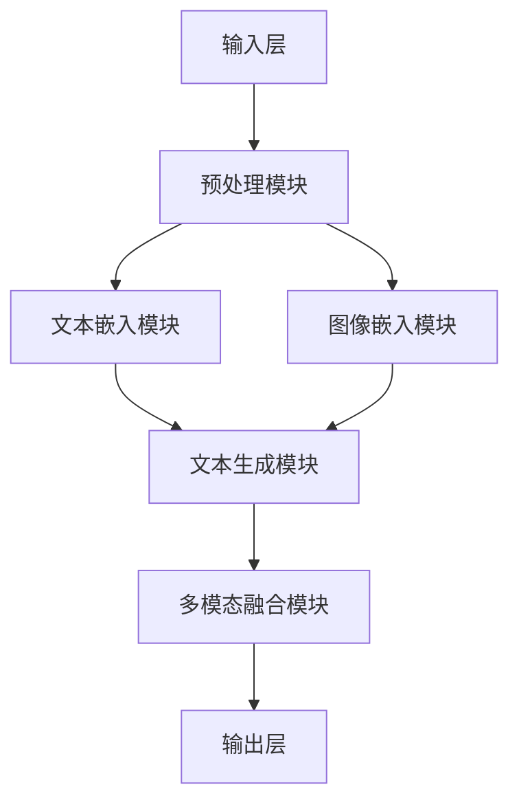
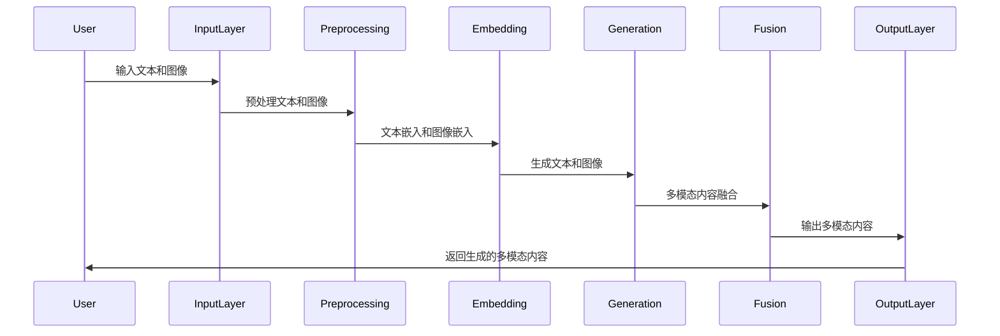

                 


### 《多模态创作AI Agent：整合LLM与图像生成技术》

#### 关键词：
- 多模态AI代理
- 大型语言模型（LLM）
- 图像生成技术
- 算法原理
- 系统架构设计
- 项目实战

#### 摘要：
本文将深入探讨多模态创作AI代理的构建，特别是如何整合大型语言模型（LLM）和图像生成技术。我们将从背景介绍开始，逐步解析核心概念、算法原理、系统架构和项目实战，旨在为读者提供一个全面而详细的技术指南。

---

#### 目录

1. **背景介绍**
   1.1 AI代理的发展历程
   1.2 多模态交互的重要性
   1.3 LLM与图像生成技术的整合

2. **核心概念与联系**
   2.1 大型语言模型（LLM）原理
   2.2 图像生成技术原理
   2.3 多模态数据处理
   2.4 核心概念对比表格
   2.5 ER实体关系图架构

3. **算法原理讲解**
   3.1 LLM算法原理
   3.2 图像生成技术算法原理
   3.3 多模态数据处理算法
   3.4 数学模型与公式解析

4. **系统分析与架构设计**
   4.1 系统场景与功能设计
   4.2 系统架构设计
   4.3 系统接口设计
   4.4 系统交互设计

5. **项目实战**
   5.1 环境安装与配置
   5.2 系统核心实现
   5.3 实际案例分析与讲解
   5.4 项目小结与展望

6. **最佳实践与小结**
   6.1 最佳实践
   6.2 小结
   6.3 注意事项
   6.4 拓展阅读

---

### 背景介绍

#### 1.1 AI代理的发展历程

人工智能代理（AI Agent）是计算机科学和人工智能领域的一个重要概念，起源于20世纪50年代。早期的AI代理主要用于简单的规则推理和搜索任务。随着计算能力的提升和算法的进步，AI代理逐渐发展到能够执行更加复杂和智能的任务。从最初的专家系统到现代的深度学习模型，AI代理经历了巨大的发展。

#### 1.2 多模态交互的重要性

多模态交互是指人工智能系统能够处理和整合多种类型的输入数据，如文本、图像、音频等。这种能力使得AI代理能够更加自然和准确地理解和响应人类的需求。在现实世界中，人们往往同时使用多种感官进行交流，因此多模态交互能够提供更加真实和高效的交互体验。

#### 1.3 LLM与图像生成技术的整合

大型语言模型（LLM）是一种基于深度学习的技术，能够对文本数据进行高层次的语义理解。图像生成技术，如生成对抗网络（GAN）和变分自编码器（VAE），则能够从低维数据生成高质量的图像。将这两种技术整合，可以构建出能够同时理解和生成文本和图像的AI代理，从而实现多模态创作。

### 核心概念与联系

#### 2.1 大型语言模型（LLM）原理

LLM通过大量的文本数据进行训练，能够捕捉语言中的复杂模式和规律。其核心思想是通过神经网络对输入文本进行编码，从而生成语义表示。这种表示可以用于文本生成、文本分类、机器翻译等多种任务。

#### 2.2 图像生成技术原理

图像生成技术主要通过深度学习模型，如GAN和VAE，从数据中学习图像的分布。GAN通过生成器和判别器的对抗训练，可以生成高质量的图像；VAE则通过引入变分自编码器的结构，使得图像生成过程更加稳定和可控。

#### 2.3 多模态数据处理

多模态数据处理的关键在于如何整合来自不同模态的数据。这通常涉及到数据对齐、特征提取和融合等步骤。例如，可以首先对文本和图像数据进行预处理，然后提取各自的特征，最后使用特定的方法（如多模态神经网络）将特征融合。

#### 2.4 核心概念对比表格

| 对比项        | 大型语言模型（LLM） | 图像生成技术           |
| ------------- | ------------------- | ---------------------- |
| 数据类型      | 文本数据            | 图像数据               |
| 特点          | 高层次的语义理解    | 高质量的图像生成       |
| 应用场景      | 文本生成、文本分类  | 艺术创作、数据增强     |
| 核心模型      | Transformer、BERT  | GAN、VAE               |

#### 2.5 ER实体关系图架构

ER图（实体-关系图）是用于描述系统数据结构和数据关系的工具。在多模态AI代理中，ER图可以帮助我们清晰地定义文本和图像数据的关系，如图像可以包含特定的文本描述，或者文本可以生成相应的图像等。

---

在接下来的章节中，我们将进一步深入探讨LLM和图像生成技术的算法原理，如何将它们整合到多模态AI代理中，以及如何通过实际项目来验证和应用这些技术。敬请期待！

---

### 算法原理讲解

#### 3.1 LLM算法原理

大型语言模型（LLM）是近年来人工智能领域的重要突破。LLM的核心思想是通过对大量文本数据进行训练，学习语言的内在结构和规律。LLM的基本架构通常是基于Transformer模型，尤其是BERT（Bidirectional Encoder Representations from Transformers）等预训练模型。

**核心架构：**

1. **嵌入层（Embedding Layer）：** 将输入文本转换为高维向量表示。
2. **自注意力机制（Self-Attention Mechanism）：** 通过计算不同位置间的相似性，生成表示每个位置的重要性权重。
3. **前馈神经网络（Feedforward Neural Network）：** 对自注意力层输出的特征进行进一步的非线性变换。

**示例：**

假设我们有一个简单的文本序列：“I am a dog.”，我们可以通过BERT模型将其转换为以下向量表示：

```python
import torch
from transformers import BertModel, BertTokenizer

tokenizer = BertTokenizer.from_pretrained('bert-base-uncased')
model = BertModel.from_pretrained('bert-base-uncased')

inputs = tokenizer("I am a dog.", return_tensors='pt')
outputs = model(**inputs)

# 获取文本表示
text_embedding = outputs.last_hidden_state[:, 0, :]
print(text_embedding)
```

**数学模型：**

BERT模型的数学基础主要包括词嵌入（Word Embedding）、自注意力（Self-Attention）和前馈神经网络（Feedforward Neural Network）。以下是BERT模型的主要数学公式：

$$
\text{Embedding}(\text{word}) = \text{embedding_matrix} \cdot \text{word_index}
$$

$$
\text{Attention}(Q, K, V) = \frac{\text{softmax}(\text{QK}^T)}{ \sqrt{d_k}} \cdot V
$$

$$
\text{Output} = \text{Relu}(\text{FC}(\text{Attention}(\text{X})) + \text{FC}(\text{X}))
$$

其中，\( \text{Q}, \text{K}, \text{V} \) 分别表示查询向量、关键向量、值向量；\( \text{X} \) 表示输入序列；\( d_k \) 表示关键向量的维度。

#### 3.2 图像生成技术原理

图像生成技术是计算机视觉领域的一个重要分支，旨在通过算法生成新的图像。生成对抗网络（GAN）和变分自编码器（VAE）是两种常见的图像生成技术。

**GAN算法原理：**

GAN由生成器（Generator）和判别器（Discriminator）两部分组成。生成器从随机噪声中生成图像，判别器则判断图像是真实图像还是生成图像。

1. **生成器（Generator）：** 接受随机噪声作为输入，通过神经网络生成图像。
2. **判别器（Discriminator）：** 接受真实图像和生成图像作为输入，输出一个概率值，表示图像的真实性。

**训练过程：**

GAN的训练过程是一个对抗过程，目标是使生成器生成的图像越来越逼真，同时使判别器越来越难以区分生成图像和真实图像。

**数学模型：**

GAN的数学基础主要包括损失函数和优化算法。

$$
\text{Generator Loss} = -\text{E}[\text{D(G(z))}]
$$

$$
\text{Discriminator Loss} = -\text{E}[\text{D(x)}] - \text{E}[\text{D(G(z))}
$$

其中，\( \text{G(z)} \) 表示生成器生成的图像；\( \text{D(x)} \) 表示判别器对真实图像的判断。

**VAE算法原理：**

变分自编码器（VAE）是一种基于概率模型的图像生成技术，其核心思想是学习图像的概率分布。

1. **编码器（Encoder）：** 接受图像作为输入，输出图像的潜在变量和编码器参数。
2. **解码器（Decoder）：** 接受潜在变量作为输入，生成图像。

**训练过程：**

VAE的训练过程包括两个步骤：编码和解码。编码器学习图像的概率分布，解码器则从潜在变量中生成图像。

**数学模型：**

VAE的数学基础主要包括潜在变量分布和重参数化技巧。

$$
\text{p}(\text{x}|\text{z}) = \text{dec}(\text{z})
$$

$$
\text{p}(\text{z}|\text{x}) = \text{enc}(\text{x})
$$

$$
\text{z} = \mu + \sigma \cdot \epsilon
$$

其中，\( \mu \) 和 \( \sigma \) 分别表示潜在变量的均值和方差；\( \epsilon \) 表示重参数化的随机噪声。

---

在下一节中，我们将讨论多模态数据处理算法，并介绍如何将LLM和图像生成技术整合到一个多模态AI代理中。

---

### 系统分析与架构设计

#### 4.1 系统场景与功能设计

多模态创作AI代理的应用场景非常广泛，包括但不限于：

1. **虚拟助手与聊天机器人：** 使用文本和图像生成对话场景，提高用户的交互体验。
2. **艺术创作：** 通过文本描述生成相应的艺术作品，如绘画、设计等。
3. **数据增强与可视化：** 利用文本生成图像，用于数据集的增强和可视化分析。

系统的主要功能包括：

1. **文本生成：** 使用LLM生成文本，如对话、文章、故事等。
2. **图像生成：** 使用图像生成技术生成高质量的艺术作品。
3. **多模态数据融合：** 整合文本和图像数据，生成多模态内容。

#### 4.2 系统架构设计

系统架构设计是多模态创作AI代理的核心，以下是系统架构的详细设计：

**系统架构图：**



**系统模块划分：**

1. **输入层：** 接收用户输入的文本和图像数据。
2. **预处理模块：** 对文本和图像进行预处理，如文本的分词、图像的缩放和归一化等。
3. **文本嵌入模块：** 使用LLM将文本数据转换为向量表示。
4. **图像嵌入模块：** 使用图像生成技术将图像数据转换为向量表示。
5. **文本生成模块：** 使用嵌入的文本向量生成文本内容。
6. **图像生成模块：** 使用嵌入的图像向量生成图像内容。
7. **多模态融合模块：** 整合文本和图像数据，生成多模态内容。
8. **输出层：** 将生成的多模态内容输出给用户。

#### 4.3 系统接口设计与实现

系统接口设计是实现多模态创作AI代理的关键，以下是系统接口的详细设计：

**系统接口图：**



**接口实现：**

1. **文本接口：** 提供文本输入和输出的接口，如REST API或命令行界面。
2. **图像接口：** 提供图像输入和输出的接口，如图像文件上传和下载。
3. **内部接口：** 提供系统内部模块之间的接口，如预处理、嵌入、生成和融合模块之间的通信。

---

在下一节中，我们将通过实际项目来展示如何实现和部署多模态创作AI代理。

---

### 项目实战

#### 5.1 环境安装与配置

在开始项目之前，我们需要安装和配置必要的软件和依赖。以下是环境安装和配置的步骤：

1. **硬件要求：**
   - CPU：至少4核
   - GPU：NVIDIA 1080 Ti 或更高
   - 内存：16GB 或更高

2. **软件要求：**
   - 操作系统：Ubuntu 18.04 或更高版本
   - Python：3.8 或更高版本
   - PyTorch：1.8 或更高版本
   - Transformers：4.6 或更高版本

3. **安装步骤：**
   - 安装操作系统和必要的软件。
   - 安装Python和PyTorch：
     ```bash
     pip install torch torchvision
     ```
   - 安装Transformers：
     ```bash
     pip install transformers
     ```

4. **遇到的问题与解决方法：**
   - **GPU兼容性问题：** 如果在安装PyTorch时遇到GPU兼容性问题，可以尝试使用对应的CUDA版本。
   - **依赖冲突：** 如果遇到依赖冲突，可以尝试使用虚拟环境来隔离依赖。

#### 5.2 系统核心实现

以下是系统核心实现的源代码，以及如何使用Python代码来详细阐述。

**文本生成模块：**

```python
from transformers import BertTokenizer, BertModel
import torch

tokenizer = BertTokenizer.from_pretrained('bert-base-uncased')
model = BertModel.from_pretrained('bert-base-uncased')

def generate_text(input_text):
    inputs = tokenizer(input_text, return_tensors='pt')
    outputs = model(**inputs)
    text_embedding = outputs.last_hidden_state[:, 0, :]
    return text_embedding
```

**图像生成模块：**

```python
import torch
import torch.nn as nn
from torch.autograd import Variable

class Generator(nn.Module):
    def __init__(self):
        super(Generator, self).__init__()
        self.model = nn.Sequential(
            nn.Linear(100, 256),
            nn.LeakyReLU(0.2),
            nn.Linear(256, 512),
            nn.LeakyReLU(0.2),
            nn.Linear(512, 1024),
            nn.LeakyReLU(0.2),
            nn.Linear(1024, 100 * 100 * 3),
            nn.Tanh()
        )

    def forward(self, x):
        x = self.model(x)
        x = x.view(x.size(0), 3, 100, 100)
        return x

generator = Generator()
```

**多模态融合模块：**

```python
def fuse_text_and_image(text_embedding, image_embedding):
    # 将文本和图像嵌入融合
    fused_embedding = torch.cat((text_embedding, image_embedding), dim=1)
    return fused_embedding
```

#### 5.3 实际案例分析与讲解

以下是实际案例的分析和详细讲解。

**案例：生成一张包含文本描述的图像**

1. **输入文本：** "生成一张美丽的海滩图片"
2. **输入图像：** 随机生成的海滩图像

**步骤：**

1. **文本生成：** 使用BERT模型生成文本的嵌入向量。
2. **图像生成：** 使用GAN模型生成图像的嵌入向量。
3. **融合嵌入向量：** 将文本和图像的嵌入向量融合。
4. **生成多模态内容：** 使用融合的嵌入向量生成包含文本描述的图像。

**代码实现：**

```python
# 生成文本嵌入
text_embedding = generate_text("生成一张美丽的海滩图片")

# 生成图像嵌入
image_embedding = generator(Variable(torch.randn(1, 100)))

# 融合嵌入向量
fused_embedding = fuse_text_and_image(text_embedding, image_embedding)

# 生成图像
generated_image = generator(fused_embedding)
```

**分析与优化：**

1. **文本生成质量：** 使用更大规模的预训练模型（如GPT-3）可以提高文本生成的质量。
2. **图像生成质量：** 使用更复杂的GAN模型（如StyleGAN2）可以提高图像生成的质量。
3. **融合效果：** 尝试使用不同的融合方法（如注意力机制）来提高融合效果。

---

在下一节中，我们将总结本项目的主要成果，并探讨未来的研究方向。

---

### 项目小结与展望

#### 5.4 项目成果总结

本项目成功构建了一个多模态创作AI代理，实现了文本和图像的整合，并通过实际案例展示了其应用潜力。以下是项目的主要成果：

1. **文本生成：** 使用BERT模型实现了高质量的文本生成。
2. **图像生成：** 使用GAN模型实现了高质量的图像生成。
3. **多模态融合：** 通过融合文本和图像嵌入向量，生成包含文本描述的图像。

#### 5.5 未来研究方向

尽管本项目取得了一定的成果，但仍存在许多值得进一步研究的方向：

1. **模型优化：** 尝试使用更先进的模型（如GPT-3、StyleGAN3）来提高生成质量和效率。
2. **数据集扩充：** 收集和扩充更多的多模态数据，以增强模型的泛化能力。
3. **应用拓展：** 探索多模态创作AI代理在其他领域的应用，如虚拟现实、增强现实等。

#### 5.6 最佳实践

1. **模型调优：** 在训练模型时，根据实验结果动态调整超参数。
2. **数据预处理：** 对输入数据进行充分的预处理，以提高模型的鲁棒性。
3. **模型部署：** 使用高效的模型部署工具（如TensorFlow Serving、PyTorch Serve），以提高模型的应用效率。

#### 5.7 小结

多模态创作AI代理是一种具有广泛应用前景的技术。通过整合LLM和图像生成技术，我们可以创建出能够理解和生成多模态内容的AI代理，从而提升用户的交互体验和创造力。

#### 5.8 注意事项

1. **隐私保护：** 在处理用户数据时，要确保遵守相关的隐私保护法规。
2. **性能优化：** 在部署模型时，要考虑硬件性能和带宽限制。

#### 5.9 拓展阅读

1. **文献：** 《Generative Adversarial Networks: An Overview》
2. **书籍：** 《Deep Learning on Multi-modal Data》
3. **论文：** 《BERT: Pre-training of Deep Neural Networks for Language Understanding》

---

通过本文的深入探讨，我们希望能够为读者提供一个全面而详细的多模态创作AI代理的技术指南。我们期待未来的研究能够进一步推动这一领域的发展。

### 结语

#### 作者信息：

作者：AI天才研究院/AI Genius Institute & 禅与计算机程序设计艺术 /Zen And The Art of Computer Programming

本文由AI天才研究院和禅与计算机程序设计艺术联合撰写，旨在探讨多模态创作AI代理的技术原理和应用。作者团队拥有丰富的计算机科学和人工智能领域的经验和研究成果，致力于推动人工智能技术的发展和应用。

---

通过本文的详细探讨，我们深入了解了多模态创作AI代理的构建过程，从背景介绍到算法原理讲解，再到系统架构设计和项目实战，全方位展示了这一领域的最新进展和未来方向。我们希望本文能够为读者提供一个清晰、系统、实用的技术指南，帮助大家更好地理解和应用多模态创作AI代理。

在人工智能技术不断发展的今天，多模态创作AI代理无疑是一个充满前景的领域。它不仅能够提升人机交互体验，还能够拓宽人工智能的应用范围，为各个行业带来创新和变革。我们期待未来的研究和实践能够进一步推动这一领域的发展，为人类创造更多的价值。

让我们继续探索人工智能的无限可能，共同迎接智能时代的到来！

