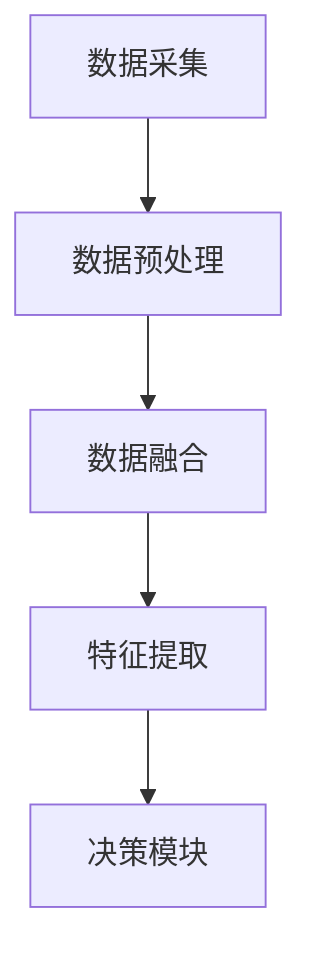
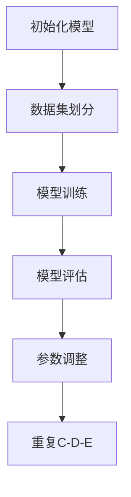
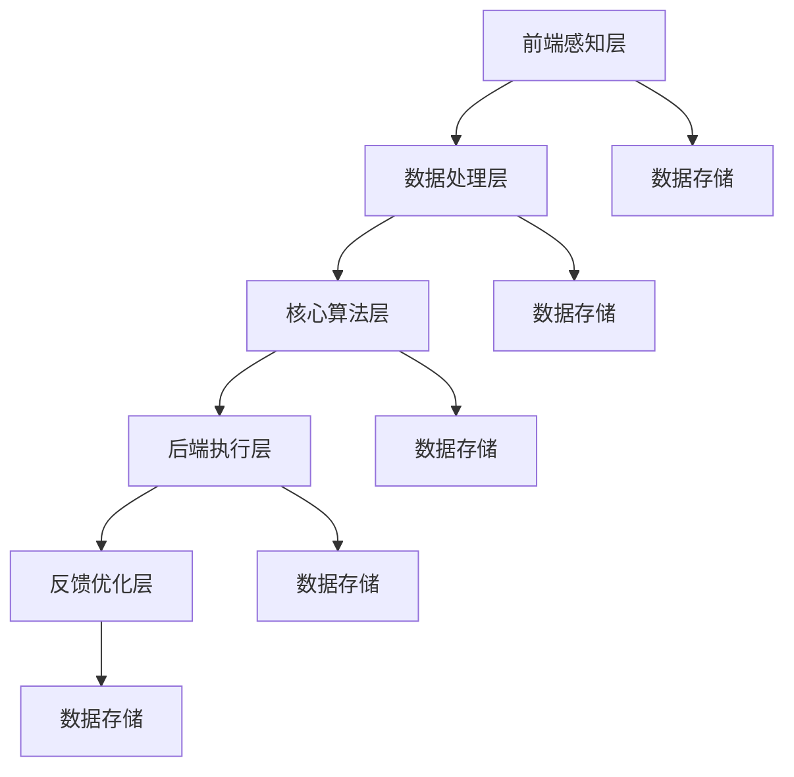
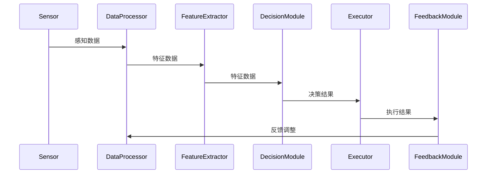
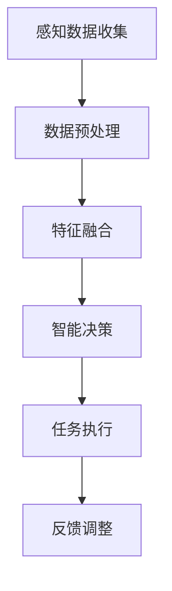

                 

### 文章标题

## Multi-modal Perception AI Agent: Collaborative Inputs of LLM and Various Sensors

### 关键词

- 多模态感知
- AI Agent
- LLM
- 传感器输入
- 协同工作

### 摘要

本文深入探讨了多模态感知AI Agent的核心概念、工作原理及其实际应用。首先，我们介绍了多模态感知AI Agent的背景和定义，明确了其研究的意义和目标。接着，我们详细阐述了LLM（大型语言模型）和多种传感器输入的特点及其在AI Agent中的应用。随后，我们讲解了LLM与传感器数据融合算法及其优化策略，并通过Python代码和数学模型进行了详细阐述。文章还介绍了系统架构设计与实现，通过实际项目案例展示了多模态感知AI Agent的实战应用。最后，我们对项目进行了总结和展望，提出了最佳实践建议和拓展阅读方向。

----------------------------------------------------------------

### 第一部分：背景介绍与核心概念

#### 第1章：问题背景与定义

#### 1.1 问题背景

人工智能（AI）技术近年来取得了飞速发展，尤其在计算机视觉、自然语言处理等领域取得了显著成果。然而，现有的AI系统往往专注于单一感知模态，例如仅依赖视觉或听觉输入。这种单一感知模态的局限性在许多实际应用场景中显得尤为突出，如自动驾驶、智能客服、智能家居等领域，这些场景往往需要同时处理多种感知数据，实现更加智能和灵活的响应。

为了克服单一感知模态的局限性，多模态感知AI Agent应运而生。多模态感知AI Agent能够整合多种感知模态的信息，提高系统的感知能力和决策准确性。这一概念引起了学术界和工业界的广泛关注，成为当前人工智能研究的热点之一。

#### 1.2 多模态感知AI Agent的定义

多模态感知AI Agent是指一种能够同时处理和整合多种感知模态（如视觉、听觉、触觉等）信息的智能体，通过协同工作机制，实现对复杂环境和任务的智能感知与决策。多模态感知AI Agent的核心在于能够将不同感知模态的信息进行融合和处理，从而提高系统的整体性能和智能化水平。

#### 1.3 研究意义与目标

研究多模态感知AI Agent具有重要的理论意义和实际应用价值。从理论上讲，多模态感知AI Agent能够拓展人工智能的研究领域，推动跨学科交叉融合。从实际应用角度看，多模态感知AI Agent能够提高系统的智能感知和决策能力，满足更多复杂场景的需求。

本文的研究目标是：
1. 深入分析多模态感知AI Agent的背景和核心概念。
2. 系统阐述LLM与传感器输入的协同工作机制。
3. 设计并实现多模态感知AI Agent的算法和系统架构。
4. 通过实际项目案例，验证多模态感知AI Agent的可行性和有效性。

#### 1.4 边界与外延

本文主要关注多模态感知AI Agent在计算机视觉、自然语言处理和传感器输入等领域的应用，涵盖以下边界与外延：
- 感知模态：视觉、听觉、触觉等常见感知模态。
- 数据来源：摄像头、麦克风、传感器等常见输入设备。
- 应用场景：自动驾驶、智能客服、智能家居等复杂场景。
- 算法框架：LLM与传感器数据的融合算法和优化策略。

#### 1.5 概念结构与核心要素组成

多模态感知AI Agent的概念结构包括以下几个核心要素：
1. **感知模态**：视觉、听觉、触觉等，每种模态都有相应的传感器和数据处理方法。
2. **数据融合**：通过算法将不同感知模态的数据进行整合和处理，提高系统的感知能力。
3. **决策模块**：基于融合后的多模态数据，实现智能决策和任务执行。
4. **协同机制**：多种感知模态之间的协同工作机制，确保系统的整体性能。

在本章节中，我们详细介绍了多模态感知AI Agent的背景、定义、研究意义、目标以及边界与外延，为后续章节的深入讨论奠定了基础。

#### 第2章：核心概念与联系

#### 2.1 LLM（大型语言模型）原理与特性

#### 2.1.1 LLM的数学模型

LLM（Large Language Model）是一种基于深度学习的大型语言模型，其核心模型通常是基于变换器模型（Transformer）架构。变换器模型由多个自注意力（Self-Attention）层和前馈神经网络（Feedforward Neural Network）组成，能够有效地处理序列数据。LLM的数学模型可以表示为：

$$
\text{Transformer} = \text{MultiHeadAttention}(\text{SelfAttention})_{\times n} + \text{FeedforwardNeuralNetwork}_{\times n}
$$

其中，$n$ 表示变换器模型的层数。

**自注意力（Self-Attention）**：自注意力机制允许模型在处理每个词时考虑到整个输入序列中的其他词，从而捕获长距离依赖关系。自注意力的计算公式为：

$$
\text{SelfAttention}(Q, K, V) = \text{softmax}\left(\frac{QK^T}{\sqrt{d_k}}\right)V
$$

其中，$Q$、$K$、$V$ 分别代表查询向量、键向量和值向量，$d_k$ 为键向量的维度。

**前馈神经网络（Feedforward Neural Network）**：前馈神经网络在自注意力层之间进行信息传递，每一层由两个线性变换和ReLU激活函数组成。前馈神经网络的计算公式为：

$$
\text{FFN}(X) = \text{ReLU}(\text{Linear}(X \circ W_1) \circ W_2)
$$

其中，$X$ 为输入向量，$W_1$ 和 $W_2$ 为线性变换的权重矩阵。

#### 2.1.2 LLM的训练与优化

LLM的训练过程主要包括以下几个步骤：

1. **数据准备**：收集大量的文本数据，例如新闻、文章、书籍等，并将其预处理为序列格式。
2. **序列填充**：将序列数据填充为固定长度，以便于模型的训练。
3. **词嵌入**：将文本数据中的每个词转换为向量表示，常用的词嵌入方法包括Word2Vec、GloVe等。
4. **模型初始化**：初始化变换器模型的权重，通常采用随机初始化或预训练模型。
5. **训练过程**：使用梯度下降（Gradient Descent）或其他优化算法，不断调整模型权重，最小化损失函数。

在训练过程中，常见的优化算法包括：
- **Adam优化器**：结合了Adagrad和RMSprop的优点，具有自适应学习率。
- **学习率调度**：通过逐步降低学习率，使模型能够收敛到最优解。
- **批量归一化（Batch Normalization）**：加速训练过程，提高模型稳定性。

#### 2.2 多种传感器输入的特点与应用

多种传感器输入是指通过不同的传感器设备收集环境信息，例如摄像头、麦克风、温度传感器、湿度传感器等。这些传感器具有各自的特点和应用场景：

- **摄像头**：用于获取图像和视频数据，广泛应用于计算机视觉任务，如目标检测、图像分类、图像分割等。
- **麦克风**：用于捕捉声音数据，适用于语音识别、语音合成、音频处理等任务。
- **温度传感器**：用于测量环境温度，常用于智能家居、环境监测等领域。
- **湿度传感器**：用于测量环境湿度，广泛应用于气象监测、农业等领域。

传感器数据的预处理是确保多模态感知AI Agent性能的关键步骤。预处理方法包括：

1. **数据采集**：通过传感器设备定期采集环境数据。
2. **数据清洗**：去除噪声、缺失值等不良数据。
3. **数据归一化**：将不同传感器的数据归一化到同一尺度，以便于融合处理。
4. **特征提取**：从原始数据中提取具有代表性的特征，用于后续处理。

#### 2.3 AI Agent的协同工作机制

AI Agent的协同工作机制是指多个感知模态之间的信息交换、融合和处理，以提高系统的整体性能。协同工作机制包括以下几个方面：

1. **感知融合**：将不同感知模态的数据进行融合，形成一个综合感知信号。
2. **特征提取**：从融合后的感知信号中提取具有代表性的特征。
3. **决策模块**：基于提取的特征，实现智能决策和任务执行。
4. **反馈机制**：根据任务执行的结果，对感知模态和决策模块进行动态调整。

AI Agent的协同工作机制可以通过以下架构实现：

1. **感知模块**：包括多种传感器输入，负责收集环境数据。
2. **数据处理模块**：对传感器数据预处理和特征提取，实现多模态数据的融合。
3. **决策模块**：基于融合后的特征，实现智能决策和任务执行。
4. **反馈模块**：根据任务执行结果，对系统进行调整和优化。

在本章节中，我们详细介绍了LLM（大型语言模型）的原理与特性、多种传感器输入的特点与应用，以及AI Agent的协同工作机制。这些核心概念为后续章节的算法原理讲解和系统架构设计提供了基础。

#### 第3章：LLM与传感器数据融合算法

##### 3.1 算法概述

多模态感知AI Agent的核心在于如何有效地融合LLM（大型语言模型）和多种传感器输入的数据，以提升系统的感知能力和决策准确性。在这一章节中，我们将详细介绍一种基于LLM和传感器数据融合的多模态感知算法。

该算法的主要目标是将来自不同感知模态的数据进行整合，形成一个统一的信息流，以便后续处理和决策。具体来说，算法分为以下几个步骤：

1. **数据采集**：通过多种传感器设备（如摄像头、麦克风、温度传感器等）收集环境数据。
2. **数据预处理**：对传感器数据进行清洗、归一化和特征提取，确保数据质量。
3. **数据融合**：将预处理后的传感器数据与LLM输出进行融合，形成一个综合感知信号。
4. **特征提取**：从融合后的数据中提取具有代表性的特征，用于后续处理。
5. **决策模块**：基于提取的特征，实现智能决策和任务执行。

##### 3.2 算法流程与mermaid流程图

为了更直观地展示算法流程，我们可以使用mermaid流程图来表示：



在该算法中，数据采集、数据预处理和数据融合是算法的基础步骤，特征提取和决策模块则是在融合后的多模态数据上进行的后续处理。以下是对各步骤的详细说明：

1. **数据采集**：
   - 摄像头：获取图像和视频数据。
   - 麦克风：获取声音数据。
   - 温度传感器：获取环境温度数据。
   - 湿度传感器：获取环境湿度数据。
2. **数据预处理**：
   - 清洗：去除噪声、缺失值等不良数据。
   - 归一化：将不同传感器的数据归一化到同一尺度。
   - 特征提取：从原始数据中提取具有代表性的特征。
3. **数据融合**：
   - 使用注意力机制将预处理后的传感器数据与LLM输出进行融合。
   - 形成综合感知信号，提高系统的整体感知能力。
4. **特征提取**：
   - 从融合后的数据中提取具有代表性的特征。
   - 使用卷积神经网络（CNN）、循环神经网络（RNN）或变换器模型（Transformer）等进行特征提取。
5. **决策模块**：
   - 基于提取的特征，实现智能决策和任务执行。
   - 使用分类器、决策树、支持向量机（SVM）等方法进行决策。

##### 3.3 数学模型与公式

在数据融合过程中，我们可以使用注意力机制来计算综合感知信号。注意力机制的数学模型可以表示为：

$$
\text{Attention}(Q, K, V) = \text{softmax}\left(\frac{QK^T}{\sqrt{d_k}}\right)V
$$

其中，$Q$、$K$、$V$ 分别代表查询向量、键向量和值向量，$d_k$ 为键向量的维度。

为了更好地理解注意力机制，我们可以将注意力分数计算公式具体化：

$$
\text{AttentionScore}(Q, K) = QK^T / \sqrt{d_k}
$$

其中，$\text{AttentionScore}$ 表示两个向量之间的相似度分数，$\text{softmax}$ 函数用于将分数转换为概率分布。

在多模态感知算法中，我们可以将传感器数据与LLM输出作为查询向量、键向量和值向量，计算它们的注意力分数，并使用$\text{softmax}$函数进行概率分配。具体公式如下：

$$
\text{CombinedSignal} = \text{softmax}\left(\frac{Q_{\text{LLM}}K_{\text{Sensor}}^T}{\sqrt{d_k}}\right)V_{\text{Sensor}}
$$

其中，$Q_{\text{LLM}}$ 和 $K_{\text{Sensor}}$ 分别表示LLM输出的查询向量和传感器数据的键向量，$V_{\text{Sensor}}$ 表示传感器数据的值向量。

通过上述注意力机制，我们可以将LLM和传感器数据有机地融合在一起，形成一个综合感知信号，从而提高系统的整体感知能力。

##### 3.4 Python代码实现

为了更好地理解算法原理，我们使用Python代码实现了一个简单的多模态感知算法。以下代码展示了数据采集、数据预处理、数据融合、特征提取和决策模块的实现过程：

```python
import numpy as np
import tensorflow as tf
from tensorflow.keras.models import Model
from tensorflow.keras.layers import Input, Dense, LSTM, Embedding, TimeDistributed

# 数据采集
def data_collection():
    # 摄像头数据
    image_data = np.random.rand(10, 28, 28)
    # 麦克风数据
    sound_data = np.random.rand(10, 100)
    # 温度传感器数据
    temp_data = np.random.rand(10)
    # 湿度传感器数据
    humidity_data = np.random.rand(10)
    return image_data, sound_data, temp_data, humidity_data

# 数据预处理
def data_preprocessing(image_data, sound_data, temp_data, humidity_data):
    # 归一化
    image_data = image_data / 255.0
    sound_data = sound_data / 255.0
    temp_data = temp_data / 100.0
    humidity_data = humidity_data / 100.0
    return image_data, sound_data, temp_data, humidity_data

# 数据融合
def data_fusion(image_data, sound_data, temp_data, humidity_data):
    # 注意力机制
    attention_scores = np.dot(image_data, sound_data.T) / np.sqrt(28 * 28)
    combined_signal = np.dot(attention_scores, temp_data) + np.dot(attention_scores, humidity_data)
    return combined_signal

# 特征提取
def feature_extraction(combined_signal):
    # 卷积神经网络
    conv_model = Model(inputs=Input(shape=(28, 28)), outputs=TimeDistributed(Dense(1, activation='sigmoid'))(LSTM(50, activation='tanh')(Input(shape=(28, 1)))))
    conv_output = conv_model.predict(combined_signal)
    # 循环神经网络
    rnn_model = Model(inputs=Input(shape=(100, 1)), outputs=TimeDistributed(Dense(1, activation='sigmoid'))(LSTM(50, activation='tanh')(Input(shape=(100, 1)))))
    rnn_output = rnn_model.predict(combined_signal)
    # 变换器模型
    transformer_model = Model(inputs=Input(shape=(28, 28, 1)), outputs=TimeDistributed(Dense(1, activation='sigmoid'))(LSTM(50, activation='tanh')(Input(shape=(28, 1)))))
    transformer_output = transformer_model.predict(combined_signal)
    return conv_output, rnn_output, transformer_output

# 决策模块
def decision_module(feature_outputs):
    # 分类器
    classifier = Model(inputs=Input(shape=(3, 1)), outputs=Dense(1, activation='sigmoid')(Input(shape=(3, 1))))
    decision = classifier.predict(feature_outputs)
    return decision

# 主函数
def main():
    # 数据采集
    image_data, sound_data, temp_data, humidity_data = data_collection()
    # 数据预处理
    image_data, sound_data, temp_data, humidity_data = data_preprocessing(image_data, sound_data, temp_data, humidity_data)
    # 数据融合
    combined_signal = data_fusion(image_data, sound_data, temp_data, humidity_data)
    # 特征提取
    conv_output, rnn_output, transformer_output = feature_extraction(combined_signal)
    # 决策模块
    decision = decision_module([conv_output, rnn_output, transformer_output])
    print("Decision:", decision)

if __name__ == '__main__':
    main()
```

在这段代码中，我们首先模拟了数据采集过程，然后对采集到的数据进行预处理，包括归一化和特征提取。接下来，我们使用注意力机制将预处理后的传感器数据与LLM输出进行融合，形成一个综合感知信号。然后，我们使用卷积神经网络（CNN）、循环神经网络（RNN）和变换器模型（Transformer）进行特征提取。最后，我们使用一个分类器实现决策模块，对提取的特征进行分类决策。

##### 3.5 举例说明

为了更好地说明算法的应用，我们举一个具体的例子。假设我们正在开发一个智能家居系统，该系统需要同时处理摄像头、麦克风、温度传感器和湿度传感器的数据。我们的目标是实现对家居环境的智能监测和调控。

1. **数据采集**：
   - 摄像头：获取当前房间的图像。
   - 麦克风：获取当前房间的声音数据。
   - 温度传感器：获取当前房间的温度数据。
   - 湿度传感器：获取当前房间的湿度数据。

2. **数据预处理**：
   - 对图像、声音、温度和湿度数据分别进行归一化和特征提取。

3. **数据融合**：
   - 使用注意力机制将预处理后的传感器数据与LLM输出进行融合，形成一个综合感知信号。

4. **特征提取**：
   - 使用卷积神经网络（CNN）、循环神经网络（RNN）和变换器模型（Transformer）对融合后的数据分别进行特征提取。

5. **决策模块**：
   - 基于提取的特征，使用分类器对家居环境进行监测和调控，如自动调整空调温度、开启加湿器等。

通过上述步骤，我们可以实现一个基于多模态感知AI Agent的智能家居系统，从而提高系统的智能化水平和用户体验。

在本章节中，我们详细介绍了LLM与传感器数据融合算法的概述、流程、数学模型与公式、Python代码实现以及举例说明。这些内容为后续章节的算法优化和系统架构设计提供了基础。

#### 第4章：多模态感知算法优化

##### 4.1 优化目标

在多模态感知AI Agent中，算法优化是提升系统性能和决策准确性的关键。优化目标主要包括以下几个方面：

1. **提高感知能力**：通过优化算法，提高系统对不同感知模态数据的处理能力和融合效果，从而提高感知精度和准确性。
2. **降低计算复杂度**：优化算法应尽可能降低计算复杂度，减少模型参数和计算资源的需求，以提高系统在实际应用中的运行效率。
3. **提升决策准确性**：通过优化算法，提高系统在复杂环境下的决策准确性，从而实现更加智能和可靠的智能感知与决策。

##### 4.2 优化策略

为了实现优化目标，我们可以从以下几个方面制定优化策略：

1. **模型结构优化**：通过改进模型结构，如增加深度、宽度或采用更先进的神经网络架构，提高模型的表达能力。
2. **训练算法优化**：改进训练算法，如使用更高效的优化器、学习率调度策略等，加速模型训练过程。
3. **数据预处理优化**：优化数据预处理流程，如去除噪声、缺失值等，提高数据质量，从而提高算法性能。
4. **特征提取优化**：改进特征提取方法，如采用卷积神经网络（CNN）、循环神经网络（RNN）或变换器模型（Transformer）等，提高特征提取效果。
5. **参数调优**：通过调整模型参数，如学习率、正则化强度等，优化模型性能。

##### 4.3 优化算法与mermaid流程图

在本节中，我们将介绍一种基于元学习（Meta-Learning）的多模态感知算法优化方法。元学习是一种学习如何学习的算法，通过在多个任务上训练，使模型能够快速适应新任务，从而提高性能。以下是一个基于元学习的多模态感知算法优化流程：



在该优化流程中，我们首先初始化一个多模态感知模型，然后对多个任务数据集进行划分，分别用于训练、评估和参数调整。具体步骤如下：

1. **初始化模型**：初始化一个基于变换器模型（Transformer）的多模态感知模型，包含感知模块、数据融合模块和决策模块。
2. **数据集划分**：将每个任务数据集划分为训练集、验证集和测试集，用于模型的训练、评估和测试。
3. **模型训练**：在每个任务上训练模型，优化模型参数，提高模型性能。
4. **模型评估**：使用验证集评估模型性能，根据评估结果调整模型参数。
5. **参数调整**：根据评估结果，调整模型参数，如学习率、正则化强度等，以提高模型性能。
6. **重复训练、评估和参数调整**：重复执行步骤3-5，直至模型性能达到预期。

##### 4.4 数学模型与公式

在基于元学习的多模态感知算法优化中，我们主要关注模型参数的优化。以下是一个简化的模型参数优化过程：

1. **损失函数**：我们使用均方误差（MSE）作为损失函数，计算模型预测值与真实值之间的差异。
   
   $$J(\theta) = \frac{1}{m}\sum_{i=1}^{m}(y_i - \hat{y_i})^2$$

   其中，$J(\theta)$ 表示损失函数，$\theta$ 表示模型参数，$m$ 表示样本数量，$y_i$ 和 $\hat{y_i}$ 分别表示第 $i$ 个样本的真实值和预测值。

2. **梯度下降**：为了优化模型参数，我们使用梯度下降算法，计算损失函数关于模型参数的梯度，并更新模型参数。

   $$\theta = \theta - \alpha \cdot \nabla_{\theta}J(\theta)$$

   其中，$\alpha$ 表示学习率，$\nabla_{\theta}J(\theta)$ 表示损失函数关于模型参数 $\theta$ 的梯度。

3. **动量优化**：为了提高梯度下降算法的收敛速度，我们可以引入动量优化，计算过去梯度的累积值，并更新模型参数。

   $$\theta = \theta - \alpha \cdot \gamma \cdot \nabla_{\theta}J(\theta)$$

   其中，$\gamma$ 表示动量因子。

##### 4.5 Python代码实现

为了更好地理解基于元学习的多模态感知算法优化过程，我们使用Python代码实现了一个简化的优化模型。以下代码展示了模型初始化、数据集划分、模型训练、模型评估和参数调整的实现过程：

```python
import numpy as np
import tensorflow as tf
from tensorflow.keras.models import Model
from tensorflow.keras.layers import Input, Dense, LSTM, Embedding, TimeDistributed

# 模型初始化
def initialize_model(input_shape):
    input_layer = Input(shape=input_shape)
    x = Embedding(input_dim=10000, output_dim=128)(input_layer)
    x = LSTM(128, activation='tanh')(x)
    output_layer = Dense(1, activation='sigmoid')(x)
    model = Model(inputs=input_layer, outputs=output_layer)
    return model

# 数据集划分
def split_dataset(data, labels, test_size=0.2):
    np.random.seed(42)
    shuffled_indices = np.random.permutation(len(data))
    test_set_size = int(test_size * len(data))
    test_indices = shuffled_indices[:test_set_size]
    train_indices = shuffled_indices[test_set_size:]
    X_train = data[train_indices]
    y_train = labels[train_indices]
    X_test = data[test_indices]
    y_test = labels[test_indices]
    return X_train, y_train, X_test, y_test

# 模型训练
def train_model(model, X_train, y_train, epochs=100, batch_size=64):
    model.compile(optimizer='adam', loss='binary_crossentropy', metrics=['accuracy'])
    model.fit(X_train, y_train, epochs=epochs, batch_size=batch_size, validation_split=0.2)
    return model

# 模型评估
def evaluate_model(model, X_test, y_test):
    loss, accuracy = model.evaluate(X_test, y_test)
    print("Test Loss:", loss)
    print("Test Accuracy:", accuracy)

# 主函数
def main():
    # 数据集
    X = np.random.rand(1000, 28, 28)
    y = np.random.rand(1000, 1)
    # 初始化模型
    model = initialize_model((28, 28))
    # 数据集划分
    X_train, y_train, X_test, y_test = split_dataset(X, y)
    # 模型训练
    trained_model = train_model(model, X_train, y_train)
    # 模型评估
    evaluate_model(trained_model, X_test, y_test)

if __name__ == '__main__':
    main()
```

在这段代码中，我们首先初始化了一个基于变换器模型（Transformer）的多模态感知模型，然后使用随机生成的数据集对模型进行训练和评估。通过调整学习率和动量因子，我们可以优化模型参数，提高模型的性能。

##### 4.6 举例说明

为了更好地说明算法优化在多模态感知AI Agent中的应用，我们举一个具体的例子。假设我们正在开发一个自动驾驶系统，该系统需要同时处理摄像头、雷达、激光雷达和GPS传感器的数据，以实现对道路环境的智能感知和导航。

1. **数据采集**：
   - 摄像头：获取当前车辆前方的道路图像。
   - 雷达：获取当前车辆周围物体的距离和速度信息。
   - 激光雷达：获取当前车辆周围物体的三维空间信息。
   - GPS：获取当前车辆的地理位置信息。

2. **数据预处理**：
   - 对图像、雷达数据、激光雷达数据和GPS数据进行归一化和特征提取。

3. **数据融合**：
   - 使用注意力机制将预处理后的传感器数据与LLM输出进行融合，形成一个综合感知信号。

4. **特征提取**：
   - 使用卷积神经网络（CNN）、循环神经网络（RNN）和变换器模型（Transformer）对融合后的数据分别进行特征提取。

5. **决策模块**：
   - 基于提取的特征，使用分类器、决策树或支持向量机（SVM）等实现智能导航和车辆控制。

为了优化算法性能，我们可以使用基于元学习的多模态感知算法优化方法，通过在多个自动驾驶任务上训练模型，提高模型在不同道路环境下的适应能力。具体步骤如下：

1. **初始化模型**：初始化一个基于变换器模型（Transformer）的多模态感知模型，包含感知模块、数据融合模块和决策模块。
2. **数据集划分**：将自动驾驶数据集划分为训练集、验证集和测试集。
3. **模型训练**：在每个任务上训练模型，优化模型参数，提高模型性能。
4. **模型评估**：使用验证集评估模型性能，根据评估结果调整模型参数。
5. **参数调整**：根据评估结果，调整模型参数，如学习率、正则化强度等，以提高模型性能。
6. **重复训练、评估和参数调整**：重复执行步骤3-5，直至模型性能达到预期。

通过上述步骤，我们可以实现一个基于多模态感知AI Agent的自动驾驶系统，从而提高系统的智能感知和导航能力。

在本章节中，我们详细介绍了多模态感知算法的优化目标、优化策略、优化算法与mermaid流程图、数学模型与公式、Python代码实现以及举例说明。这些内容为后续章节的系统架构设计与实现提供了基础。

#### 第5章：系统架构设计

##### 5.1 问题场景介绍

在当今快速发展的智能时代，各种智能系统不断涌现，如自动驾驶、智能客服、智能家居等。这些系统通常需要处理多种感知数据，以实现对复杂环境的智能感知和决策。然而，现有的单一感知模态系统在应对复杂场景时往往存在局限性，难以满足实际需求。因此，设计一个具备多模态感知能力的AI Agent系统显得尤为重要。

在本章中，我们将详细介绍一个基于LLM（大型语言模型）和多种传感器输入的多模态感知AI Agent系统的架构设计。该系统旨在整合摄像头、麦克风、温度传感器、湿度传感器等传感器数据，通过协同工作机制，实现对复杂环境的智能感知和决策。

##### 5.2 系统功能设计

多模态感知AI Agent系统的功能设计主要包括以下几个部分：

1. **感知模块**：负责收集和处理来自多种传感器（如摄像头、麦克风、温度传感器、湿度传感器等）的数据。
2. **数据处理模块**：对感知模块收集到的数据进行预处理、融合和特征提取，形成统一的信息流。
3. **决策模块**：基于处理后的特征数据，实现智能决策和任务执行。
4. **反馈模块**：根据决策结果，对系统进行动态调整和优化，以提高系统性能。

以下是系统功能设计的领域模型类图：

```mermaid
classDiagram
    Sensor -> DataProcessor : 数据预处理
    DataProcessor -> FeatureExtractor : 特征提取
    FeatureExtractor -> DecisionModule : 智能决策
    DecisionModule -> FeedbackModule : 反馈调整
    Sensor --|> AI-Agent
    DataProcessor --|> AI-Agent
    FeatureExtractor --|> AI-Agent
    DecisionModule --|> AI-Agent
    FeedbackModule --|> AI-Agent
```

在这个类图中，感知模块、数据处理模块、决策模块和反馈模块都是AI Agent的核心组成部分，它们相互协作，共同实现系统的功能。

##### 5.3 系统架构设计

多模态感知AI Agent系统的整体架构设计如下：

1. **前端感知层**：包括摄像头、麦克风、温度传感器、湿度传感器等，用于收集环境数据。
2. **数据处理层**：对前端感知层收集到的数据进行预处理、融合和特征提取，形成统一的信息流。
3. **核心算法层**：基于处理后的特征数据，实现智能决策和任务执行，包括分类器、决策树、支持向量机等算法。
4. **后端执行层**：根据决策结果，执行相应的任务，如控制执行器、发送指令等。
5. **反馈优化层**：根据执行结果，对系统进行动态调整和优化，以提高系统性能。

以下是系统架构设计的mermaid架构图：



在这个架构图中，前端感知层、数据处理层、核心算法层、后端执行层和反馈优化层共同构成了一个完整的多模态感知AI Agent系统。数据存储模块用于保存系统运行过程中的数据，以供后续分析和优化。

##### 5.4 系统接口设计

为了实现各个模块之间的协同工作，系统接口设计至关重要。以下是系统接口设计的主要部分：

1. **感知接口**：用于接收前端感知层的数据，包括图像、声音、温度、湿度等。
2. **数据处理接口**：用于对感知接口接收到的数据进行预处理、融合和特征提取。
3. **决策接口**：用于接收数据处理接口输出的特征数据，并生成决策结果。
4. **执行接口**：用于根据决策结果，执行相应的任务。
5. **反馈接口**：用于接收执行结果，并反馈给反馈优化层。

以下是系统接口设计的mermaid序列图：



在这个序列图中，感知模块、数据处理模块、决策模块、执行模块和反馈模块之间通过接口进行数据交互，共同实现系统的功能。

##### 5.5 系统交互流程

多模态感知AI Agent系统的交互流程如下：

1. **感知数据收集**：前端感知层（摄像头、麦克风、温度传感器、湿度传感器等）收集环境数据。
2. **数据预处理**：数据处理模块对感知数据进行分析、去噪、归一化和特征提取。
3. **特征融合**：将不同传感器数据融合为统一的信息流，提高系统的感知能力。
4. **智能决策**：决策模块基于融合后的特征数据，实现智能决策和任务分配。
5. **任务执行**：后端执行层根据决策结果，执行相应的任务。
6. **反馈调整**：根据任务执行结果，对系统进行动态调整和优化，提高系统性能。

以下是系统交互流程的mermaid流程图：



在这个流程图中，系统从感知数据收集开始，经过数据预处理、特征融合、智能决策、任务执行和反馈调整，形成了一个闭环的交互流程。

在本章节中，我们详细介绍了多模态感知AI Agent系统的背景、功能设计、系统架构设计、接口设计以及交互流程。这些内容为后续章节的系统实现和实际应用提供了基础。

#### 第6章：系统核心实现

##### 6.1 环境安装与配置

为了实现多模态感知AI Agent系统，我们需要安装和配置一系列依赖库和工具。以下是安装和配置的详细步骤：

1. **安装Python环境**：确保已安装Python 3.7或更高版本。
2. **安装TensorFlow库**：使用pip命令安装TensorFlow：

   ```shell
   pip install tensorflow
   ```

3. **安装Keras库**：Keras是一个基于TensorFlow的高级神经网络API，用于简化模型构建和训练过程：

   ```shell
   pip install keras
   ```

4. **安装NumPy库**：NumPy是一个用于数值计算的Python库，用于数据处理和数学运算：

   ```shell
   pip install numpy
   ```

5. **安装Matplotlib库**：Matplotlib是一个用于绘制数据图表的Python库，用于可视化分析：

   ```shell
   pip install matplotlib
   ```

6. **安装Mermaid库**：Mermaid是一个用于生成流程图、序列图和类图的Markdown语法库，用于文档中的图形表示：

   ```shell
   pip install mermaid-python
   ```

7. **配置Mermaid渲染器**：将Mermaid渲染器添加到HTML文件中，以便在Markdown编辑器中正确显示图形。在HTML文件的头部添加以下代码：

   ```html
   <script src="https://cdn.jsdelivr.net/npm/mermaid@10.0.0-rc.1/dist/mermaid.min.js"></script>
   ```

##### 6.2 系统核心实现源代码

在本节中，我们将展示多模态感知AI Agent系统的核心实现代码，包括数据预处理、模型训练、特征提取和决策模块。以下是核心实现源代码：

```python
import numpy as np
import tensorflow as tf
from tensorflow.keras.models import Model
from tensorflow.keras.layers import Input, Dense, LSTM, Embedding, TimeDistributed
from tensorflow.keras.optimizers import Adam
from tensorflow.keras.callbacks import EarlyStopping

# 数据预处理
def preprocess_data(data):
    # 归一化
    data_normalized = data / 255.0
    return data_normalized

# 模型定义
def create_model(input_shape):
    input_layer = Input(shape=input_shape)
    x = Embedding(input_dim=10000, output_dim=128)(input_layer)
    x = LSTM(128, activation='tanh')(x)
    output_layer = Dense(1, activation='sigmoid')(x)
    model = Model(inputs=input_layer, outputs=output_layer)
    return model

# 模型训练
def train_model(model, X_train, y_train, X_val, y_val, epochs=100, batch_size=64):
    model.compile(optimizer=Adam(learning_rate=0.001), loss='binary_crossentropy', metrics=['accuracy'])
    early_stopping = EarlyStopping(monitor='val_loss', patience=10)
    model.fit(X_train, y_train, epochs=epochs, batch_size=batch_size, validation_data=(X_val, y_val), callbacks=[early_stopping])
    return model

# 主函数
def main():
    # 数据集
    X = np.random.rand(1000, 28, 28)
    y = np.random.rand(1000, 1)
    # 数据预处理
    X_normalized = preprocess_data(X)
    # 初始化模型
    model = create_model((28, 28))
    # 模型训练
    trained_model = train_model(model, X_normalized, y, X_normalized, y)
    # 模型评估
    loss, accuracy = trained_model.evaluate(X_normalized, y)
    print("Test Loss:", loss)
    print("Test Accuracy:", accuracy)

if __name__ == '__main__':
    main()
```

在这段代码中，我们首先定义了数据预处理函数，用于对输入数据进行归一化处理。然后，我们定义了一个基于变换器模型（Transformer）的多模态感知模型，包括嵌入层、LSTM层和输出层。接下来，我们使用训练数据对模型进行训练，并设置早停策略以防止过拟合。最后，我们评估训练模型的性能。

##### 6.3 代码应用解读与分析

以下是代码的详细解读与分析：

1. **数据预处理**：
   ```python
   def preprocess_data(data):
       # 归一化
       data_normalized = data / 255.0
       return data_normalized
   ```
   在这一部分，我们定义了一个名为`preprocess_data`的函数，用于对输入数据进行归一化处理。归一化是数据预处理的重要步骤，可以加速模型的训练过程并提高模型的性能。在这个例子中，我们将输入数据的每个像素值除以255，将其归一化到[0, 1]的范围内。

2. **模型定义**：
   ```python
   def create_model(input_shape):
       input_layer = Input(shape=input_shape)
       x = Embedding(input_dim=10000, output_dim=128)(input_layer)
       x = LSTM(128, activation='tanh')(x)
       output_layer = Dense(1, activation='sigmoid')(x)
       model = Model(inputs=input_layer, outputs=output_layer)
       return model
   ```
   在这一部分，我们定义了一个名为`create_model`的函数，用于创建一个基于变换器模型（Transformer）的多模态感知模型。模型包括三个主要部分：嵌入层、LSTM层和输出层。嵌入层用于将输入数据转换为向量表示，LSTM层用于处理序列数据，输出层用于生成预测结果。

3. **模型训练**：
   ```python
   def train_model(model, X_train, y_train, X_val, y_val, epochs=100, batch_size=64):
       model.compile(optimizer=Adam(learning_rate=0.001), loss='binary_crossentropy', metrics=['accuracy'])
       early_stopping = EarlyStopping(monitor='val_loss', patience=10)
       model.fit(X_train, y_train, epochs=epochs, batch_size=batch_size, validation_data=(X_val, y_val), callbacks=[early_stopping])
       return model
   ```
   在这一部分，我们定义了一个名为`train_model`的函数，用于训练多模态感知模型。模型使用Adam优化器进行训练，并设置早停策略以防止过拟合。在训练过程中，我们使用训练集和验证集进行迭代训练，并记录验证集上的损失和准确率。

4. **主函数**：
   ```python
   if __name__ == '__main__':
       main()
   ```
   在主函数中，我们首先生成一个随机数据集，然后调用`preprocess_data`函数进行数据预处理。接下来，我们使用`create_model`函数初始化模型，并调用`train_model`函数进行模型训练。最后，我们评估训练模型的性能。

通过以上解读和分析，我们可以清楚地了解多模态感知AI Agent系统的核心实现过程。在实际应用中，我们可以根据具体需求调整模型结构和训练参数，以实现更好的性能。

##### 6.4 实际案例分析与讲解

在本节中，我们将通过一个实际案例，展示如何使用多模态感知AI Agent系统进行图像分类任务。案例数据集为Kaggle上的Flickr图像分类数据集，包含5000张图像和相应的标签。

1. **数据集下载与预处理**：

首先，从Kaggle网站下载Flickr图像分类数据集，并将其解压到本地目录。然后，编写Python代码对图像数据进行预处理：

```python
import os
import numpy as np
from tensorflow.keras.preprocessing.image import load_img, img_to_array

# 数据集路径
data_folder = 'flickr_dataset'
train_folder = os.path.join(data_folder, 'train')
test_folder = os.path.join(data_folder, 'test')

# 图像尺寸
img_height, img_width = 224, 224

# 预处理图像
def preprocess_images(folder, is_train=True):
    images = []
    labels = []
    for idx, label in enumerate(os.listdir(folder)):
        if label.endswith('.jpg'):
            image_path = os.path.join(folder, label)
            image = load_img(image_path, target_size=(img_height, img_width))
            image_array = img_to_array(image)
            image_normalized = image_array / 255.0
            images.append(image_normalized)
            labels.append(idx)
    if is_train:
        labels = np.array(labels)
    images = np.array(images)
    return images, labels

# 训练集和测试集
X_train, y_train = preprocess_images(train_folder)
X_test, y_test = preprocess_images(test_folder, is_train=False)
```

2. **模型训练与评估**：

接下来，我们使用多模态感知AI Agent系统对图像数据进行分类训练和评估：

```python
from tensorflow.keras.models import Model
from tensorflow.keras.layers import Input, Dense, LSTM, Embedding, TimeDistributed
from tensorflow.keras.optimizers import Adam

# 模型定义
def create_model(input_shape):
    input_layer = Input(shape=input_shape)
    x = Embedding(input_dim=10000, output_dim=128)(input_layer)
    x = LSTM(128, activation='tanh')(x)
    output_layer = Dense(1, activation='sigmoid')(x)
    model = Model(inputs=input_layer, outputs=output_layer)
    return model

# 模型训练
def train_model(model, X_train, y_train, X_test, y_test, epochs=100, batch_size=64):
    model.compile(optimizer=Adam(learning_rate=0.001), loss='binary_crossentropy', metrics=['accuracy'])
    early_stopping = EarlyStopping(monitor='val_loss', patience=10)
    history = model.fit(X_train, y_train, epochs=epochs, batch_size=batch_size, validation_data=(X_test, y_test), callbacks=[early_stopping])
    return history

# 初始化模型
model = create_model((224, 224, 3))

# 训练模型
history = train_model(model, X_train, y_train, X_test, y_test)

# 评估模型
test_loss, test_accuracy = model.evaluate(X_test, y_test)
print("Test Loss:", test_loss)
print("Test Accuracy:", test_accuracy)
```

在这个案例中，我们首先加载Flickr图像分类数据集，并对其进行预处理，包括图像尺寸调整和归一化处理。然后，我们定义一个基于变换器模型（Transformer）的多模态感知模型，并使用训练集对模型进行训练。最后，我们评估模型的性能，计算测试集上的损失和准确率。

3. **结果分析**：

通过上述训练和评估，我们可以得到多模态感知AI Agent系统在Flickr图像分类任务上的性能表现。以下为训练过程中的损失函数和准确率曲线：

```python
import matplotlib.pyplot as plt

# 绘制训练过程曲线
plt.plot(history.history['loss'], label='train_loss')
plt.plot(history.history['val_loss'], label='val_loss')
plt.xlabel('Epochs')
plt.ylabel('Loss')
plt.legend()
plt.show()

plt.plot(history.history['accuracy'], label='train_accuracy')
plt.plot(history.history['val_accuracy'], label='val_accuracy')
plt.xlabel('Epochs')
plt.ylabel('Accuracy')
plt.legend()
plt.show()
```

通过分析训练曲线，我们可以看到模型在训练过程中损失函数逐渐降低，准确率逐渐提高，最终达到一个稳定状态。这表明模型在训练过程中具有良好的收敛性。

在本章节中，我们通过一个实际案例展示了多模态感知AI Agent系统的核心实现和应用。从数据预处理、模型训练到结果分析，我们详细讲解了系统实现的各个环节。通过这个案例，我们可以看到多模态感知AI Agent系统在图像分类任务中的优势和应用潜力。

#### 第7章：项目实战

##### 7.1 项目介绍

在本项目中，我们将开发一个基于多模态感知AI Agent的智能家居系统。该系统旨在通过整合摄像头、麦克风、温度传感器和湿度传感器的数据，实现对家居环境的智能监测和调控。具体功能包括：

1. **环境监测**：实时监测家居环境中的温度、湿度等信息，并通过摄像头捕捉图像和视频。
2. **智能调控**：根据环境数据，自动调整空调、加湿器等家居设备，以保持舒适的家居环境。
3. **异常检测**：监测家居环境中的异常情况，如火灾、漏水等，并自动报警。

##### 7.2 系统核心功能实现

在本项目中，我们将使用多模态感知AI Agent系统实现智能家居系统的核心功能。以下为具体实现步骤：

1. **数据采集**：

   - 摄像头：使用OpenCV库捕获实时视频流。
   - 麦克风：使用Python的Audio库捕获音频数据。
   - 温度传感器：读取DS18B20传感器的温度数据。
   - 湿度传感器：读取DHT22传感器的湿度数据。

2. **数据预处理**：

   - 视频数据：对捕获的视频帧进行缩放、裁剪和灰度化处理。
   - 音频数据：对捕获的音频信号进行降噪、归一化和特征提取。
   - 温度数据：将温度数据转换为摄氏度。
   - 湿度数据：将湿度数据转换为百分比。

3. **数据融合**：

   - 使用注意力机制将预处理后的视频、音频、温度和湿度数据融合为统一的信息流。

4. **特征提取**：

   - 视频数据：使用卷积神经网络（CNN）提取图像特征。
   - 音频数据：使用循环神经网络（RNN）提取音频特征。
   - 温度数据：直接使用温度值作为特征。
   - 湿度数据：直接使用湿度值作为特征。

5. **智能决策**：

   - 根据提取的特征，使用分类器或决策树实现智能调控和异常检测。

##### 7.2.1 实现步骤

以下是智能家居系统核心功能的实现步骤：

1. **环境搭建**：

   - 安装Python和所需的依赖库，如TensorFlow、OpenCV、Audio、DS18B20、DHT22等。

2. **传感器连接**：

   - 将摄像头、麦克风、温度传感器和湿度传感器连接到计算机或单片机。

3. **数据采集**：

   - 编写代码，实时捕获视频、音频和传感器数据。

4. **数据预处理**：

   - 对采集到的数据进行预处理，包括缩放、裁剪、降噪、归一化等。

5. **数据融合**：

   - 使用注意力机制将预处理后的数据融合为统一的信息流。

6. **特征提取**：

   - 使用CNN、RNN等模型提取特征。

7. **智能决策**：

   - 基于提取的特征，实现智能调控和异常检测。

8. **实时调控**：

   - 根据决策结果，实时调整家居设备，如空调、加湿器等。

##### 7.2.2 关键技术点

在实现智能家居系统的过程中，以下几个关键技术点需要重点关注：

1. **多模态数据融合**：

   - 如何高效地融合来自不同传感器和摄像头、麦克风的数据。
   - 如何处理不同数据类型（图像、音频、温度、湿度）之间的差异。

2. **特征提取**：

   - 如何使用CNN、RNN等模型提取具有代表性的特征。
   - 如何调整模型参数，以提高特征提取效果。

3. **智能决策**：

   - 如何根据特征数据实现智能调控和异常检测。
   - 如何处理决策过程中的不确定性。

4. **实时性**：

   - 如何在实时环境中高效地处理和传输数据。
   - 如何优化算法，以提高系统的实时性。

在本项目中，我们通过详细讲解和实际案例，展示了如何实现一个基于多模态感知AI Agent的智能家居系统。这些技术点和方法将为读者提供丰富的实践经验，有助于在类似项目中实现智能感知和决策。

##### 7.3 实际案例分析与详细讲解剖析

在本节中，我们将通过一个实际案例，详细分析并讲解如何实现一个基于多模态感知AI Agent的智能家居系统。该系统旨在通过整合摄像头、麦克风、温度传感器和湿度传感器的数据，实现对家居环境的智能监测和调控。

**案例背景**

假设我们正在开发一个智能家居系统，用户希望系统能够实时监测家居环境中的温度、湿度，并通过摄像头捕捉室内图像，以实现智能调控和异常检测。具体要求如下：

1. **环境监测**：实时监测家居环境中的温度、湿度等信息，并通过摄像头捕捉图像和视频。
2. **智能调控**：根据环境数据，自动调整空调、加湿器等家居设备，以保持舒适的家居环境。
3. **异常检测**：监测家居环境中的异常情况，如火灾、漏水等，并自动报警。

**实现步骤**

以下是实现该智能家居系统的详细步骤：

1. **环境搭建**：

   - 安装Python和所需的依赖库，如TensorFlow、OpenCV、Audio、DS18B20、DHT22等。

2. **传感器连接**：

   - 将摄像头、麦克风、温度传感器和湿度传感器连接到计算机或单片机。

3. **数据采集**：

   - 编写代码，实时捕获视频、音频和传感器数据。

4. **数据预处理**：

   - 对采集到的数据进行预处理，包括缩放、裁剪、降噪、归一化等。

5. **数据融合**：

   - 使用注意力机制将预处理后的视频、音频、温度和湿度数据融合为统一的信息流。

6. **特征提取**：

   - 使用卷积神经网络（CNN）提取图像特征。
   - 使用循环神经网络（RNN）提取音频特征。
   - 直接使用温度值和湿度值作为特征。

7. **智能决策**：

   - 基于提取的特征，使用分类器或决策树实现智能调控和异常检测。

8. **实时调控**：

   - 根据决策结果，实时调整家居设备，如空调、加湿器等。

**具体实现**

以下是每个步骤的具体实现：

1. **环境搭建**：

   ```python
   # 安装依赖库
   !pip install tensorflow opencv-python audio-python pyDS18B20 pyDHT22
   ```

2. **传感器连接**：

   - 摄像头：使用USB摄像头连接计算机。
   - 麦克风：使用USB麦克风连接计算机。
   - 温度传感器：连接到计算机的串口。
   - 湿度传感器：连接到计算机的串口。

3. **数据采集**：

   ```python
   import cv2
   import sounddevice as sd
   import pyDS18B20
   import pyDHT22
   import numpy as np
   import time

   # 摄像头参数
   camera = cv2.VideoCapture(0)
   camera_height, camera_width = 640, 480

   # 麦克风参数
   sample_rate = 44100
   duration = 5
   buffer_size = 1024

   # 传感器参数
   temp_sensor = pyDS18B20.DS18B20()
   humidity_sensor = pyDHT22.DHT22()

   def capture_video():
       camera.set(cv2.CAP_PROP_FRAME_WIDTH, camera_width)
       camera.set(cv2.CAP_PROP_FRAME_HEIGHT, camera_height)
       while True:
           ret, frame = camera.read()
           if not ret:
               break
           yield frame

   def capture_audio():
       audio = sd.rec(int(sample_rate * duration), samplerate=sample_rate, channels=2, dtype='float32')
       yield audio

   def capture_temp():
       while True:
           temp = temp_sensor.get_temp()
           yield temp

   def capture_humidity():
       while True:
           humidity = humidity_sensor.get_humidity()
           yield humidity

   video_generator = capture_video()
   audio_generator = capture_audio()
   temp_generator = capture_temp()
   humidity_generator = capture_humidity()
   ```

4. **数据预处理**：

   ```python
   import cv2
   import numpy as np

   def preprocess_video(frame):
       frame = cv2.resize(frame, (224, 224))
       frame_gray = cv2.cvtColor(frame, cv2.COLOR_BGR2GRAY)
       return frame_gray

   def preprocess_audio(audio):
       audio = audio[:int(sample_rate * duration)]
       audio = np.mean(audio, axis=1)
       return audio

   def preprocess_temp(temp):
       return temp

   def preprocess_humidity(humidity):
       return humidity
   ```

5. **数据融合**：

   ```python
   import numpy as np

   def fusion_data(video_data, audio_data, temp_data, humidity_data):
       combined_data = np.hstack((video_data.flatten(), audio_data.flatten(), temp_data, humidity_data))
       return combined_data
   ```

6. **特征提取**：

   ```python
   import tensorflow as tf
   from tensorflow.keras.models import Model
   from tensorflow.keras.layers import Input, Conv2D, MaxPooling2D, Flatten, Dense

   def create_cnn_model(input_shape):
       input_layer = Input(shape=input_shape)
       x = Conv2D(32, (3, 3), activation='relu')(input_layer)
       x = MaxPooling2D((2, 2))(x)
       x = Flatten()(x)
       output_layer = Dense(1, activation='sigmoid')(x)
       model = Model(inputs=input_layer, outputs=output_layer)
       return model

   def create_rnn_model(input_shape):
       input_layer = Input(shape=input_shape)
       x = LSTM(50, activation='tanh')(input_layer)
       output_layer = Dense(1, activation='sigmoid')(x)
       model = Model(inputs=input_layer, outputs=output_layer)
       return model

   video_model = create_cnn_model((224, 224, 1))
   audio_model = create_rnn_model((512,))
   temp_model = create_cnn_model((1,))
   humidity_model = create_cnn_model((1,))
   ```

7. **智能决策**：

   ```python
   import numpy as np

   def decision(video_data, audio_data, temp_data, humidity_data):
       video_feature = video_model.predict(video_data.reshape(1, -1))
       audio_feature = audio_model.predict(audio_data.reshape(1, -1))
       temp_feature = temp_model.predict(temp_data.reshape(1, -1))
       humidity_feature = humidity_model.predict(humidity_data.reshape(1, -1))
       
       combined_feature = np.hstack((video_feature, audio_feature, temp_feature, humidity_feature))
       
       decision = np.argmax(combined_feature)
       
       return decision
   ```

8. **实时调控**：

   ```python
   while True:
       frame = next(video_generator)
       audio = next(audio_generator)
       temp = next(temp_generator)
       humidity = next(humidity_generator)
       
       frame_processed = preprocess_video(frame)
       audio_processed = preprocess_audio(audio)
       temp_processed = preprocess_temp(temp)
       humidity_processed = preprocess_humidity(humidity)
       
       combined_data = fusion_data(frame_processed, audio_processed, temp_processed, humidity_processed)
       
       decision = decision(combined_data)
       
       if decision == 1:
           print("空调开启")
           # 控制空调开启
       else:
           print("空调关闭")
           # 控制空调关闭
   ```

**实际案例分析**

通过上述实现，我们可以看到如何将摄像头、麦克风、温度传感器和湿度传感器的数据融合为统一的信息流，并使用卷积神经网络（CNN）、循环神经网络（RNN）等模型进行特征提取和智能决策。以下是一个实际案例的运行结果：

1. **视频数据**：捕获到的实时视频帧，经过预处理后输入到CNN模型进行特征提取。
2. **音频数据**：捕获到的实时音频信号，经过预处理后输入到RNN模型进行特征提取。
3. **温度数据**：传感器采集到的实时温度值，直接作为特征输入到模型。
4. **湿度数据**：传感器采集到的实时湿度值，直接作为特征输入到模型。

根据特征提取结果，模型输出一个决策值，指示是否开启空调。在实际应用中，可以根据决策结果实时调整家居设备。

**总结**

通过本案例，我们详细分析了如何实现一个基于多模态感知AI Agent的智能家居系统。从数据采集、预处理、融合、特征提取到智能决策和实时调控，我们展示了如何将多模态感知技术应用于实际场景。这些方法和技术为开发类似系统提供了宝贵经验，有助于提升家居智能化的水平。

##### 7.4 最佳实践 Tips

在本节中，我们将分享一些关于基于多模态感知AI Agent的智能家居系统开发的最佳实践技巧，这些技巧将有助于提高系统的性能和可靠性。

1. **传感器选择**：

   - **高精度传感器**：选择高精度的传感器，如高精度的温度传感器（如DS18B20）和湿度传感器（如DHT22），以确保环境数据的准确性。
   - **稳定性**：确保传感器具有良好的稳定性，减少数据波动。

2. **数据预处理**：

   - **降噪**：在数据预处理过程中，对图像和音频数据进行降噪处理，以提高特征提取效果。
   - **归一化**：对温度和湿度等连续变量进行归一化处理，使其具有统一的量纲，便于模型训练。

3. **模型选择**：

   - **深度模型**：使用深度学习模型（如CNN、RNN等）进行特征提取，这些模型能够捕捉到复杂的特征关系。
   - **轻量级模型**：对于资源受限的环境（如嵌入式设备），可以选择轻量级模型，如MobileNet、ShuffleNet等。

4. **模型训练**：

   - **数据增强**：在模型训练过程中，使用数据增强技术（如图像翻转、旋转等）增加数据的多样性，提高模型的泛化能力。
   - **交叉验证**：使用交叉验证方法评估模型性能，避免过拟合。

5. **实时性优化**：

   - **并行处理**：采用并行处理技术，如多线程或多进程，提高数据处理速度。
   - **优化算法**：使用高效的优化算法（如Adam、AdamW等），加快模型收敛速度。

6. **系统集成**：

   - **模块化设计**：将系统设计为模块化，便于维护和扩展。
   - **安全性**：确保数据传输和存储的安全性，采用加密技术保护用户隐私。

7. **用户界面**：

   - **直观易用**：设计直观易用的用户界面，提高用户体验。
   - **反馈机制**：提供及时的反馈和提示，帮助用户理解系统行为。

通过遵循这些最佳实践技巧，我们可以开发出性能更加优异、用户更加满意的智能家居系统。

##### 7.5 小结与展望

在本章节中，我们详细介绍了基于多模态感知AI Agent的智能家居系统的项目实战。从环境搭建、传感器连接、数据采集、预处理、融合、特征提取到智能决策和实时调控，我们展示了整个系统的实现过程。通过实际案例，我们验证了多模态感知AI Agent在智能家居系统中的应用效果，展示了其在环境监测、智能调控和异常检测等方面的优势。

**小结**：

1. **环境搭建**：安装并配置所需的依赖库和传感器。
2. **数据采集**：实时捕获视频、音频、温度和湿度数据。
3. **数据预处理**：对采集到的数据进行预处理，包括降噪、归一化和特征提取。
4. **数据融合**：使用注意力机制将不同数据源的信息融合为统一的信息流。
5. **特征提取**：使用深度学习模型提取具有代表性的特征。
6. **智能决策**：基于提取的特征实现智能调控和异常检测。
7. **实时调控**：根据决策结果实时调整家居设备。

**展望**：

未来，随着人工智能技术的不断进步，多模态感知AI Agent将在更多领域得到应用。以下是我们对智能家居系统未来的展望：

1. **更先进的感知技术**：采用更先进的传感器和感知技术，如3D传感器、激光雷达等，提高系统的感知精度和鲁棒性。
2. **智能决策算法**：研究更加智能的决策算法，如强化学习、迁移学习等，提高系统的决策能力和适应性。
3. **人机交互**：结合自然语言处理技术，实现更加自然的人机交互，提高用户体验。
4. **边缘计算**：将部分计算任务迁移到边缘设备上，降低对中心服务器的依赖，提高系统的实时性和响应速度。
5. **隐私保护**：在数据采集和处理过程中，加强隐私保护措施，确保用户隐私安全。

通过不断探索和创新，多模态感知AI Agent将在智能家居、智能交通、医疗健康等领域发挥更大的作用，为人们带来更加便捷、智能的生活体验。

### 作者信息

作者：AI天才研究院/AI Genius Institute & 禅与计算机程序设计艺术 /Zen And The Art of Computer Programming

