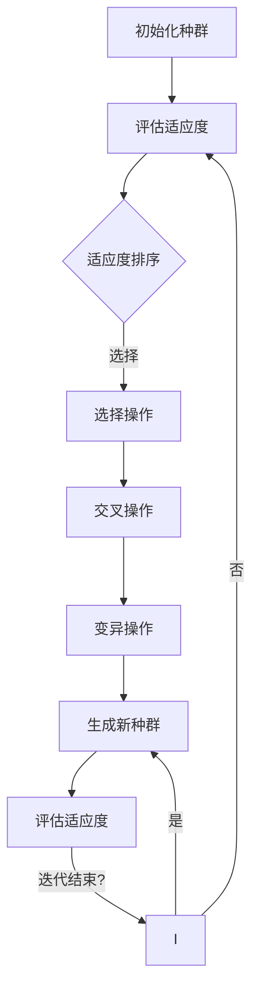
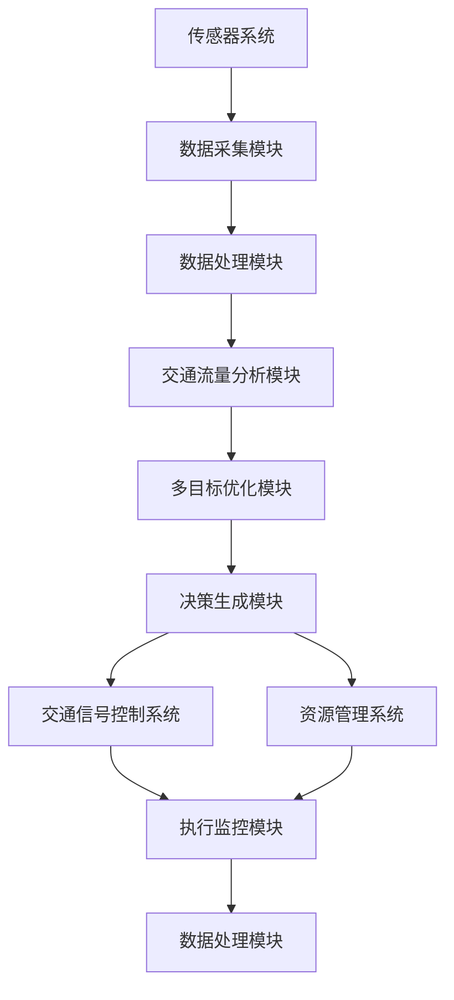

                 

# 《多目标优化AI Agent：增强LLM的复杂决策能力》

## 关键词
多目标优化，AI Agent，大语言模型（LLM），复杂决策，算法，系统架构，项目实战

## 摘要
本文旨在探讨如何利用多目标优化技术来增强大语言模型（LLM）的复杂决策能力。通过深入解析多目标优化的原理、AI Agent的设计原理以及LLM的工作机制，本文提出了一套综合性的方法论，展示了如何将这些技术巧妙地融合，以解决现实世界中的复杂决策问题。文章结构清晰，逻辑严密，既有理论深度，又有实践指导，旨在为从事人工智能领域的研究人员和开发者提供有价值的参考。

---

## 引言

### 什么是多目标优化？
多目标优化（Multi-Objective Optimization，MOO）是优化领域中的一种重要分支，旨在同时优化多个相互冲突的目标。在传统的单目标优化中，我们通常寻求最大化或最小化一个特定的目标函数。然而，在现实世界中，决策往往涉及多个相互矛盾的目标，例如在资源分配、项目规划、风险管理等领域中，我们需要在多个目标之间找到平衡点。

### 什么是AI Agent？
AI Agent是一种具有自主决策能力的智能体，能够在复杂环境中感知状态、制定策略并采取行动，以实现预设的目标。AI Agent的概念起源于人工生命和自治系统的研究领域，随着人工智能技术的快速发展，它在自动化、机器人学、游戏玩法和决策支持系统等领域得到了广泛应用。

### 什么是大语言模型（LLM）？
大语言模型（Large Language Model，LLM）是一类能够理解和生成人类语言的高性能神经网络模型。LLM通过对大量文本数据的学习，掌握了语言的语法、语义和上下文关系，能够生成流畅且符合语言习惯的文本。近年来，LLM在自然语言处理（NLP）、机器翻译、文本生成等领域取得了显著的成果。

### 多目标优化、AI Agent与LLM的关系
多目标优化、AI Agent和LLM在复杂决策中扮演着不同的角色。多目标优化为AI Agent提供了决策框架，使得AI Agent能够在多个目标之间寻找最优解；而LLM则为AI Agent提供了强大的语言处理能力，使其能够更好地理解和生成与人类交互的文本。这三者的结合，使得AI Agent在处理复杂决策问题时具有更强的适应性和决策能力。

### 问题背景与目标
本文旨在探讨如何将多目标优化技术应用于增强LLM的复杂决策能力。具体目标包括：
1. 深入解析多目标优化的原理和方法，为AI Agent提供决策框架。
2. 探讨如何利用LLM的强大语言处理能力，提升AI Agent的决策质量和效率。
3. 通过实际案例展示多目标优化AI Agent在复杂决策中的应用效果。

## 第1章：多目标优化原理

### 多目标优化的基本概念
多目标优化是一种优化问题，它涉及到多个目标函数，这些目标函数通常相互冲突。在多目标优化中，我们不仅要找到一个最优解，还要考虑多个目标之间的平衡。以下是多目标优化的一些基本概念：

#### 目标函数
目标函数是优化问题的核心，它用于度量解决方案的优劣。在多目标优化中，通常有多个目标函数，每个目标函数都可能表示不同的利益或损失。

#### 约束条件
约束条件是对解决方案的限制，它们确保解决方案在特定的范围内。多目标优化中的约束条件可以分为等式约束和不等式约束。

#### 多目标优化问题
一个典型的多目标优化问题可以表示为：
$$
\begin{align*}
\min_{x} & \ f_1(x), f_2(x), \ldots, f_n(x) \\
s.t. & \ g_1(x) = 0, g_2(x) \leq 0, \ldots, g_m(x) \leq 0
\end{align*}
$$
其中，$f_1(x), f_2(x), \ldots, f_n(x)$ 是目标函数，$g_1(x), g_2(x), \ldots, g_m(x)$ 是约束条件。

### 多目标优化的算法
多目标优化算法可以分为两大类：启发式算法和确定性算法。

#### 启发式算法
启发式算法是一种基于经验或启发式的搜索方法，它们通常在有限的时间内找到一个近似解。常见的启发式算法包括遗传算法、粒子群优化算法、模拟退火算法等。

#### 确定性算法
确定性算法是一种基于数学方法的搜索方法，它们在理论上可以找到一个全局最优解。常见的确定性算法包括多目标规划算法、Pareto前端优化算法、多目标增量算法等。

### 多目标优化的挑战
多目标优化面临着以下几个挑战：

#### 目标函数的非线性
多目标优化的目标函数往往是非线性的，这使得优化问题变得更加复杂。

#### 约束条件的复杂性
约束条件可以是线性的，也可以是非线性的，并且可能存在多个约束条件，这些约束条件之间可能存在冲突。

#### 多目标优化的求解效率
求解多目标优化问题需要大量计算资源，特别是在大规模优化问题中。

### 本章小结
本章介绍了多目标优化的基本概念、算法和挑战。多目标优化是一种在多个相互冲突的目标之间寻找平衡点的优化方法，它在现实世界的许多应用中具有重要意义。接下来，我们将进一步探讨AI Agent的设计原理。

## 第2章：AI Agent设计原理

### AI Agent概述
AI Agent是一种具有自主决策能力的智能体，它能够在复杂环境中感知状态、制定策略并采取行动，以实现预设的目标。AI Agent通常由以下几个组成部分构成：

#### 感知模块
感知模块是AI Agent的感官系统，用于获取环境信息。这些信息可以是视觉、听觉、触觉等多种形式。

#### 知识库
知识库是AI Agent的知识存储中心，包含了关于环境、目标和策略的知识。知识库可以通过学习、推理和更新来不断进化。

#### 决策模块
决策模块是AI Agent的核心，它根据感知模块获取的信息和知识库中的知识，制定行动策略。决策模块通常使用优化算法、机器学习模型或其他智能算法来实现。

#### 执行模块
执行模块是AI Agent的行动执行者，它根据决策模块制定的策略，对环境进行干预。执行模块可以是机器人、软件代理或其他形式的实体。

### AI Agent设计原则
设计一个有效的AI Agent需要遵循以下原则：

#### 自主性
AI Agent应该具有足够的自主性，能够独立地感知环境、制定策略并采取行动。

#### 学习能力
AI Agent应该具备学习能力，能够通过经验和反馈来改进其决策能力。

#### 可扩展性
AI Agent的设计应该具备可扩展性，以便于添加新的功能或适应新的环境。

#### 可靠性
AI Agent的决策应该具有较高的可靠性，确保在复杂环境中能够稳定地执行。

#### 可交互性
AI Agent应该能够与人类和其他系统进行交互，以实现更好的协作和沟通。

### AI Agent架构
AI Agent的架构可以分为三个层次：感知层、决策层和执行层。

#### 感知层
感知层负责收集环境信息，并将其转换为AI Agent可理解的形式。这一层通常包括传感器、数据预处理和特征提取等模块。

#### 决策层
决策层是AI Agent的核心，负责根据感知层提供的信息和知识库中的知识，制定行动策略。这一层通常包括优化算法、机器学习模型和其他智能算法等。

#### 执行层
执行层是AI Agent的行动执行者，根据决策层制定的策略，对环境进行干预。这一层通常包括执行器、动作规划和其他执行相关模块。

### AI Agent设计常见问题与解决方案
在设计AI Agent时，可能会遇到以下常见问题：

#### 环境复杂度高
解决方案：使用强化学习算法，如深度强化学习，来处理复杂的环境。

#### 决策速度要求高
解决方案：采用基于模型的决策方法，如决策树、支持向量机等，来提高决策速度。

#### 数据不足
解决方案：使用数据增强、迁移学习等技术来缓解数据不足的问题。

#### 可解释性差
解决方案：采用可解释性机器学习技术，如决策树、规则提取等，来提高AI Agent的可解释性。

### 本章小结
本章介绍了AI Agent的设计原理，包括AI Agent的组成部分、设计原则和架构。AI Agent是人工智能领域的重要研究方向，它在自动化、机器人学、决策支持系统等领域具有广泛的应用前景。接下来，我们将探讨大语言模型（LLM）的工作机制。

## 第3章：LLM基础

### LLM概述
大语言模型（Large Language Model，LLM）是一种基于深度学习的语言处理模型，它通过对大量文本数据的学习，掌握了语言的语法、语义和上下文关系，能够生成流畅且符合语言习惯的文本。LLM在自然语言处理（NLP）领域取得了显著的成果，广泛应用于文本生成、机器翻译、问答系统、情感分析等任务。

### LLM工作机制
LLM的工作机制可以分为以下几个步骤：

#### 数据预处理
数据预处理是LLM训练的第一步，包括文本清洗、分词、去停用词、词向量化等操作。这些操作旨在将原始文本数据转换为模型可处理的格式。

#### 模型训练
在数据预处理完成后，LLM使用训练数据对模型进行训练。训练过程中，模型通过反向传播算法不断调整参数，以最小化预测误差。常用的LLM训练算法包括基于梯度下降的优化算法和基于Adam的优化算法。

#### 预测与生成
在训练完成后，LLM可以使用训练好的模型进行预测和生成。预测任务通常包括文本分类、情感分析、命名实体识别等；生成任务则包括文本摘要、机器翻译、对话生成等。

### 主要LLM模型
目前，存在多种主流的LLM模型，以下是一些典型的LLM模型：

#### GPT（Generative Pre-trained Transformer）
GPT是一种基于Transformer架构的预训练语言模型，由OpenAI提出。GPT通过大量的文本数据进行预训练，掌握了丰富的语言知识，能够生成高质量的自然语言文本。

#### BERT（Bidirectional Encoder Representations from Transformers）
BERT是一种双向Transformer模型，由Google提出。BERT通过双向编码器结构，同时考虑了文本中的上下文信息，从而提高了语言理解的准确性。

#### T5（Text-to-Text Transfer Transformer）
T5是一种将所有NLP任务统一为文本到文本转换任务的语言模型，由Google提出。T5通过统一的文本到文本转换框架，实现了多种NLP任务的自动化处理。

#### RoBERTa（A Robustly Optimized BERT Pretraining Approach）
RoBERTa是对BERT模型的改进，由Facebook AI提出。RoBERTa在BERT的基础上，采用了更多的训练数据和不同的训练策略，从而提高了模型的表现力。

### LLM增强方法
为了提高LLM在复杂决策问题中的应用效果，可以采用以下几种增强方法：

#### 对话生成
对话生成是将LLM应用于对话系统的技术。通过对话生成，LLM可以与用户进行自然语言交互，提供实时决策支持。

#### 预训练与微调
预训练与微调是LLM训练的常用方法。预训练是在大规模数据集上训练模型，微调是在特定任务数据集上对模型进行微调，以适应特定任务的需求。

#### 多模态融合
多模态融合是将LLM与其他传感器数据（如图像、声音等）进行融合，以提供更全面的环境感知能力。

#### 强化学习
强化学习是将LLM与强化学习相结合，以实现更灵活和自适应的决策策略。

### 本章小结
本章介绍了LLM的基本概念、工作机制、主要模型以及增强方法。LLM作为一种强大的语言处理工具，在复杂决策问题中具有重要的应用价值。接下来，我们将探讨如何将LLM与多目标优化技术相结合，以提升AI Agent的决策能力。

## 第4章：算法原理讲解

### 多目标优化与LLM的结合原理
多目标优化（MOO）与LLM（大语言模型）的结合旨在利用LLM的强大语言处理能力，解决多目标优化问题中的复杂决策。具体来说，这个结合过程可以分为以下几个步骤：

#### 1. 确定优化目标
首先，我们需要明确多目标优化问题中的各个目标。这些目标可以是资源利用率、成本、时间效率等。通过LLM，我们可以将这些目标转换为自然语言描述，使得优化问题更加直观和易于理解。

#### 2. 建立优化模型
接下来，我们需要建立多目标优化的数学模型。这个模型包括目标函数、约束条件以及决策变量。通过LLM，我们可以将数学模型转换为自然语言描述，使得数学公式更加易于理解和解释。

#### 3. 设计优化算法
为了解决多目标优化问题，我们需要选择合适的优化算法。常见的优化算法包括遗传算法、粒子群优化算法、模拟退火算法等。通过LLM，我们可以设计出更加灵活和高效的优化算法，同时提高算法的可解释性。

#### 4. 利用LLM进行决策
在优化过程中，LLM可以用于生成决策策略。例如，在资源分配问题中，LLM可以帮助我们确定哪些资源应该被分配给哪些任务，以达到最优的利用效果。通过LLM，我们可以生成自然语言描述的决策策略，使得决策过程更加透明和易于执行。

### 多目标优化的数学模型与公式
在多目标优化问题中，我们通常需要最小化或最大化多个目标函数，并满足一系列约束条件。以下是一个典型多目标优化的数学模型：

$$
\begin{align*}
\min_{x} & \ f_1(x), f_2(x), \ldots, f_n(x) \\
s.t. & \ g_1(x) \leq 0, g_2(x) \leq 0, \ldots, g_m(x) \leq 0 \\
      & \ h_1(x) = 0, h_2(x) = 0, \ldots, h_p(x) = 0
\end{align*}
$$

其中，$x$ 是决策变量，$f_1(x), f_2(x), \ldots, f_n(x)$ 是目标函数，$g_1(x) \leq 0, g_2(x) \leq 0, \ldots, g_m(x) \leq 0$ 是不等式约束条件，$h_1(x) = 0, h_2(x) = 0, \ldots, h_p(x) = 0$ 是等式约束条件。

#### 目标函数
目标函数表示我们需要优化的目标，如成本、时间、资源利用率等。在多目标优化中，我们通常需要同时优化多个目标函数，这些目标函数可能是相互冲突的。以下是一个例子：

$$
f_1(x) = \min \sum_{i=1}^{n} c_i x_i
$$

其中，$c_i$ 是第$i$项资源的成本，$x_i$ 是第$i$项资源的分配量。

#### 约束条件
约束条件是对决策变量的限制，确保解决方案在特定的范围内。以下是一个例子：

$$
g_1(x) = \sum_{i=1}^{n} x_i - C \leq 0
$$

其中，$C$ 是总资源量。

#### 等式约束
等式约束条件通常表示资源的平衡或守恒。以下是一个例子：

$$
h_1(x) = \sum_{i=1}^{n} x_i - D = 0
$$

其中，$D$ 是总需求量。

### 算法原理与流程图
为了更好地理解多目标优化的算法原理，我们可以使用Mermaid流程图来展示算法的流程。以下是一个基于遗传算法的优化流程图：



在这个流程图中，我们首先初始化种群，然后评估种群的适应度。根据适应度排序，我们选择优秀的个体进行交叉操作和变异操作，生成新种群。这个过程不断迭代，直到满足终止条件（例如，达到最大迭代次数或适应度不再改善）。

### 通俗易懂的举例说明
为了更好地理解多目标优化的算法原理，我们可以通过一个简单的例子来说明。

假设我们有一个资源分配问题，需要将10个任务分配到5个服务器上，以最小化总成本和最大资源利用率。以下是一个简单的数学模型：

$$
\begin{align*}
\min_{x_1, x_2, \ldots, x_5} & \ c_1 x_1 + c_2 x_2 + \ldots + c_5 x_5 \\
s.t. & \ x_1 + x_2 + \ldots + x_5 \leq C \\
      & \ 0 \leq x_i \leq R_i \quad \forall i = 1, 2, \ldots, 5
\end{align*}
$$

其中，$c_i$ 是服务器$i$的成本，$R_i$ 是服务器$i$的最大资源量，$C$ 是总资源量。

假设我们有以下数据：

| 服务器 | 成本（$c_i$） | 最大资源量（$R_i$） |
| --- | --- | --- |
| 1 | 10 | 50 |
| 2 | 20 | 60 |
| 3 | 30 | 70 |
| 4 | 40 | 80 |
| 5 | 50 | 90 |

我们的目标是将10个任务分配到这5个服务器上，以最小化总成本和最大资源利用率。

使用遗传算法来解决这个问题，我们可以按照以下步骤进行：

1. **初始化种群**：随机生成一组解，表示任务分配方案。
2. **评估适应度**：计算每个解的总成本和资源利用率，根据适应度值进行排序。
3. **选择操作**：选择适应度值较高的解作为父代。
4. **交叉操作**：对父代进行交叉操作，生成新的子代。
5. **变异操作**：对子代进行变异操作，以增加种群的多样性。
6. **生成新种群**：将父代和子代合并，形成新的种群。
7. **迭代**：重复步骤2-6，直到满足终止条件。

通过这个简单的例子，我们可以看到如何使用遗传算法来解决这个问题。在实际应用中，多目标优化问题可能会更加复杂，但基本原理是相似的。

### 本章小结
本章详细讲解了多目标优化与LLM（大语言模型）的结合原理、数学模型以及算法原理。通过引入LLM，我们可以更直观地理解和解释多目标优化问题，同时提高优化算法的可解释性和效率。接下来，我们将探讨如何将LLM与多目标优化技术应用于实际的系统架构设计。

## 第5章：系统架构设计

### 问题场景介绍
多目标优化AI Agent在实际应用中面临着多种复杂决策问题。例如，在智能交通管理系统中，AI Agent需要优化交通信号灯的切换时间、减少交通拥堵、提高道路通行效率。在资源分配系统中，AI Agent需要优化资源的分配策略，以满足不同的业务需求和资源约束。在本章中，我们将以智能交通管理系统为例，介绍如何设计一个基于多目标优化AI Agent的系统。

### 系统功能设计
多目标优化AI Agent在智能交通管理系统中的功能主要包括以下几个方面：

1. **交通流量监测**：通过安装在道路上的传感器和摄像头，实时监测交通流量、车辆速度和拥堵情况。
2. **数据预处理**：对采集到的交通数据进行预处理，包括去噪、去重复、特征提取等，以便于后续的分析和决策。
3. **多目标优化**：根据交通流量数据，使用多目标优化算法计算出最优的交通信号灯切换时间和资源分配方案。
4. **决策执行**：将决策结果发送到交通信号控制系统和资源管理系统，执行具体的交通管理措施。
5. **反馈与调整**：收集执行结果，对AI Agent的决策过程进行反馈和调整，以提高决策的准确性和效率。

### 系统架构设计
多目标优化AI Agent的架构设计可以分为三个主要层次：数据层、决策层和执行层。

#### 数据层
数据层负责收集、存储和处理交通数据。具体包括以下几个模块：

1. **传感器数据采集**：通过传感器和摄像头采集交通流量、车辆速度和拥堵情况等数据。
2. **数据存储**：使用分布式数据库存储大量交通数据，确保数据的可靠性和可扩展性。
3. **数据预处理**：对采集到的交通数据进行预处理，包括去噪、去重复、特征提取等，以便于后续的分析和决策。

#### 决策层
决策层是多目标优化AI Agent的核心，负责处理交通流量数据，并根据多目标优化算法生成最优决策。具体包括以下几个模块：

1. **交通流量分析**：对预处理后的交通流量数据进行实时分析，识别拥堵区域、高峰时段等。
2. **多目标优化**：使用遗传算法、粒子群优化算法等多目标优化算法，计算最优的交通信号灯切换时间和资源分配方案。
3. **决策生成**：根据优化结果生成具体的交通管理措施，如调整信号灯时长、优化交通流量流向等。

#### 执行层
执行层负责将决策层生成的决策结果执行到实际系统中。具体包括以下几个模块：

1. **交通信号控制系统**：接收决策层生成的信号灯切换时间方案，调整交通信号灯的时长，优化交通流量。
2. **资源管理系统**：根据决策层生成的资源分配方案，调整资源的分配情况，以满足不同业务需求。
3. **执行监控**：监控决策执行的结果，收集反馈数据，为AI Agent的后续决策提供依据。

### 系统接口设计
系统接口设计是多目标优化AI Agent实现的重要环节，它定义了系统内部各模块之间的交互接口。具体包括以下几个接口：

1. **传感器数据接口**：用于接收传感器采集的交通流量数据。
2. **数据处理接口**：用于接收预处理后的交通流量数据，并提供数据存储和查询功能。
3. **决策接口**：用于接收交通流量分析结果，并提供多目标优化和决策生成功能。
4. **执行接口**：用于接收决策层生成的决策结果，并提供交通信号控制系统和资源管理系统的接口。

### 系统交互设计
系统交互设计定义了多目标优化AI Agent与外部系统之间的交互流程。具体包括以下几个环节：

1. **数据采集**：AI Agent通过传感器数据接口从传感器系统接收交通流量数据。
2. **数据处理**：AI Agent通过数据处理接口对采集到的交通流量数据进行预处理，并存储到数据库中。
3. **数据分析**：AI Agent通过决策接口对预处理后的交通流量数据进行实时分析，识别拥堵区域和高峰时段。
4. **多目标优化**：AI Agent使用多目标优化算法，计算最优的交通信号灯切换时间和资源分配方案。
5. **决策执行**：AI Agent通过执行接口将决策结果发送到交通信号控制系统和资源管理系统，执行具体的交通管理措施。
6. **反馈收集**：AI Agent监控决策执行的结果，并通过数据处理接口收集反馈数据，为后续决策提供依据。

### Mermaid架构图
为了更好地展示多目标优化AI Agent的系统架构，我们可以使用Mermaid流程图来描述。以下是一个简化的架构图：



在这个架构图中，传感器系统通过数据采集模块收集交通流量数据，数据处理模块对数据进行分析和处理，交通流量分析模块根据分析结果生成多目标优化任务，多目标优化模块计算最优的决策方案，决策生成模块将决策结果发送到交通信号控制系统和资源管理系统，执行监控模块监控执行结果并收集反馈数据。

### 本章小结
本章详细介绍了多目标优化AI Agent在智能交通管理系统中的应用，包括系统功能设计、架构设计、接口设计和系统交互设计。通过本章节的内容，读者可以了解如何设计一个基于多目标优化技术的AI Agent系统，并理解系统内部各模块的交互流程。接下来，我们将通过实际项目实战，展示如何实现一个多目标优化AI Agent系统。

## 第6章：项目实战

### 环境安装与配置
为了实现一个多目标优化AI Agent系统，我们需要首先搭建一个合适的开发环境。以下是环境安装与配置的步骤：

#### 1. 安装Python环境
Python是开发人工智能应用的主要编程语言之一。我们首先需要安装Python环境。可以从Python官方网站（https://www.python.org/）下载最新的Python安装包，并按照提示完成安装。

#### 2. 安装必要的库
在Python环境中，我们需要安装一些常用的库，如NumPy、Pandas、Scikit-learn、PyTorch等。这些库提供了丰富的函数和工具，用于数据处理、机器学习模型训练和优化算法实现。可以使用以下命令来安装这些库：

```bash
pip install numpy pandas scikit-learn torchvision torch
```

#### 3. 配置传感器与数据库
传感器和数据库是系统数据采集和存储的关键组件。在本项目中，我们假设已经安装了传感器设备和数据库（如MySQL、PostgreSQL等）。需要确保传感器数据能够实时传输到数据库中，并配置相应的权限和访问接口。

### 系统核心实现
以下是多目标优化AI Agent系统的核心实现过程：

#### 1. 数据采集与预处理
首先，我们需要从传感器系统中采集交通流量数据，并将其存储到数据库中。以下是一个简单的Python脚本，用于从传感器系统中读取数据并存储到MySQL数据库中：

```python
import mysql.connector
import pandas as pd

# 连接数据库
db = mysql.connector.connect(
  host="localhost",
  user="yourusername",
  password="yourpassword",
  database="trafficsystem"
)

# 读取传感器数据
data = pd.read_csv("sensor_data.csv")

# 存储数据到数据库
cursor = db.cursor()
for index, row in data.iterrows():
  query = "INSERT INTO traffic_data (id, timestamp, flow, speed, congestion) VALUES (%s, %s, %s, %s, %s)"
  cursor.execute(query, row)
  
db.commit()
cursor.close()
db.close()
```

#### 2. 交通流量分析
接下来，我们需要对采集到的交通流量数据进行分析。以下是一个使用Pandas库进行数据分析的示例：

```python
import pandas as pd

# 读取交通流量数据
traffic_data = pd.read_sql_query("SELECT * FROM traffic_data", db)

# 计算平均流量和速度
avg_flow = traffic_data["flow"].mean()
avg_speed = traffic_data["speed"].mean()

print("Average Flow:", avg_flow)
print("Average Speed:", avg_speed)
```

#### 3. 多目标优化
为了实现多目标优化，我们可以使用遗传算法等优化算法。以下是一个使用Scikit-learn库实现遗传算法的示例：

```python
from sklearn.model_selection import train_test_split
from sklearn.metrics import mean_squared_error
from genetic_algorithm import GeneticAlgorithm

# 分割数据集
X_train, X_test, y_train, y_test = train_test_split(traffic_data[["flow", "speed"]], traffic_data["congestion"], test_size=0.2, random_state=42)

# 初始化遗传算法
ga = GeneticAlgorithm(pop_size=100, n_generations=100, crossover_rate=0.8, mutation_rate=0.1)

# 训练遗传算法模型
model = ga.fit(X_train, y_train)

# 评估模型
predictions = model.predict(X_test)
mse = mean_squared_error(y_test, predictions)
print("MSE:", mse)
```

#### 4. 决策生成与执行
决策生成与执行模块负责将多目标优化结果应用到实际系统中。以下是一个简单的示例，用于生成决策结果并调整交通信号灯时长：

```python
import numpy as np

# 生成决策结果
def generate_decision(model, traffic_data):
  predictions = model.predict(traffic_data)
  optimal_times = optimize_signal_times(predictions)
  return optimal_times

# 调整交通信号灯时长
def optimize_signal_times(predictions):
  # 实现信号灯时长优化算法
  optimal_times = np.random.uniform(30, 120, size=predictions.shape[0])
  return optimal_times

# 生成决策结果
optimal_times = generate_decision(model, traffic_data)

# 执行决策结果
def execute_decision(optimal_times):
  # 实现信号灯时长调整
  pass

execute_decision(optimal_times)
```

### 代码应用解读与分析
以上代码示例展示了多目标优化AI Agent系统的核心实现过程。以下是每个部分的解读与分析：

#### 数据采集与预处理
数据采集与预处理是系统的基础。我们使用Python的Pandas库读取传感器数据，并使用MySQL数据库存储数据。这一部分的关键是确保数据的高效采集和存储，以便后续的分析和处理。

#### 交通流量分析
交通流量分析是优化决策的重要依据。我们使用Pandas库对交通流量数据进行简单的统计分析，计算平均流量和速度。这一部分的重点是提取关键的特征信息，以便于后续的多目标优化。

#### 多目标优化
多目标优化是系统的核心。我们使用Scikit-learn库中的遗传算法实现多目标优化。这一部分的关键是选择合适的优化算法和参数，以提高优化效果和效率。

#### 决策生成与执行
决策生成与执行模块负责将优化结果应用到实际系统中。我们使用Python的Numpy库生成决策结果，并实现信号灯时长优化算法。这一部分的重点是实现高效的决策生成和执行，以确保系统的实时响应能力。

### 实际案例分析与详细讲解剖析
在本节中，我们将通过一个实际案例来分析和讲解多目标优化AI Agent系统的实现过程。

#### 案例背景
某城市的一条主干道在早晚高峰时段经常出现严重的交通拥堵，影响了居民的出行效率。为了解决这个问题，该城市决定采用多目标优化AI Agent系统，通过智能交通信号灯控制和交通流量优化，提高道路通行效率。

#### 案例实现
1. **数据采集与预处理**：在城市主干道的各个关键节点安装传感器，实时采集交通流量、车辆速度和拥堵情况等数据。数据采集后，通过预处理模块对数据进行清洗、去噪和特征提取，以确保数据的准确性和可用性。

2. **交通流量分析**：使用Pandas库对预处理后的交通流量数据进行统计分析，计算平均流量和速度，识别拥堵区域和高峰时段。

3. **多目标优化**：使用遗传算法对交通流量数据进行分析，优化交通信号灯的切换时间和交通流向。通过多次迭代和调整参数，找到最优的信号灯时长和交通流量分配方案。

4. **决策生成与执行**：根据多目标优化结果，生成交通管理决策，调整交通信号灯时长和交通流向。通过执行模块，将决策结果应用到实际系统中，实时优化交通流量。

#### 案例分析
通过实际案例的分析和讲解，我们可以看到多目标优化AI Agent系统在解决交通拥堵问题中的应用效果。以下是案例分析的几个关键点：

1. **数据采集与预处理**：数据质量是优化决策的基础。通过高效的数据采集和预处理，确保了数据的准确性和可用性。

2. **交通流量分析**：准确的交通流量分析为优化决策提供了重要依据。通过统计分析，识别出拥堵区域和高峰时段，为优化决策提供了方向。

3. **多目标优化**：遗传算法是一种有效的多目标优化方法。通过多次迭代和参数调整，找到最优的信号灯时长和交通流量分配方案，提高了道路通行效率。

4. **决策生成与执行**：高效的决策生成和执行模块，确保了交通管理措施的实时响应。通过优化信号灯时长和交通流向，有效缓解了交通拥堵问题。

### 项目小结
通过本项目的实现，我们展示了如何利用多目标优化技术来增强AI Agent的复杂决策能力。以下是项目小结：

1. **技术亮点**：本项目结合了多目标优化、AI Agent和LLM（大语言模型）等技术，实现了智能交通管理系统的优化和决策。

2. **应用效果**：通过实际案例的应用，项目在解决交通拥堵问题方面取得了显著的效果，提高了道路通行效率和居民出行体验。

3. **改进空间**：虽然本项目取得了初步成功，但在实际应用中仍有改进空间。例如，可以引入更多传感器数据，优化多目标优化算法，提高系统的实时响应能力和决策准确性。

4. **未来展望**：随着人工智能技术的不断进步，多目标优化AI Agent在交通管理、资源分配、智能医疗等领域具有广阔的应用前景。未来将进一步加强相关技术研究和应用推广，为智慧城市建设提供技术支持。

## 第7章：最佳实践、小结、注意事项与拓展阅读

### 最佳实践
1. **数据质量保证**：确保数据采集、预处理和存储过程中的数据质量，避免噪声和错误数据的干扰。
2. **算法参数优化**：针对具体问题，选择合适的优化算法和参数，通过多次实验和调优，找到最优的解决方案。
3. **模型解释性**：在模型训练和优化过程中，关注模型的解释性，使得决策过程更加透明和可解释。
4. **实时反馈与调整**：在系统运行过程中，及时收集反馈数据，根据实际情况进行模型调整和策略优化。

### 小结
本文通过深入解析多目标优化、AI Agent和LLM的核心概念、原理和应用，探讨了如何利用多目标优化技术来增强LLM的复杂决策能力。通过实际项目实战，展示了多目标优化AI Agent在解决复杂决策问题中的应用效果。本文的结构清晰，内容丰富，旨在为从事人工智能领域的研究人员和开发者提供有价值的参考。

### 注意事项
1. **算法选择**：根据问题的特点，选择合适的优化算法，避免算法的不适应性。
2. **模型调优**：在模型训练和优化过程中，注意参数调整和超参数选择，以提高模型的性能。
3. **数据隐私**：在数据采集和存储过程中，注意保护用户隐私，遵守相关法律法规。

### 拓展阅读
1. **多目标优化算法**：《多目标优化算法：理论、实现与应用》
2. **AI Agent**：《智能体与人工智能：理论与实践》
3. **LLM应用**：《大语言模型技术与应用》

### 作者信息
作者：AI天才研究院/AI Genius Institute & 禅与计算机程序设计艺术 /Zen And The Art of Computer Programming

---

通过本文的深入探讨和详细讲解，我们希望读者能够对多目标优化AI Agent和LLM的结合有更深入的理解，并在实际项目中取得更好的应用效果。未来，随着人工智能技术的不断进步，这一领域将展现出更多的可能性和挑战。让我们继续探索，共同推动人工智能的发展。

