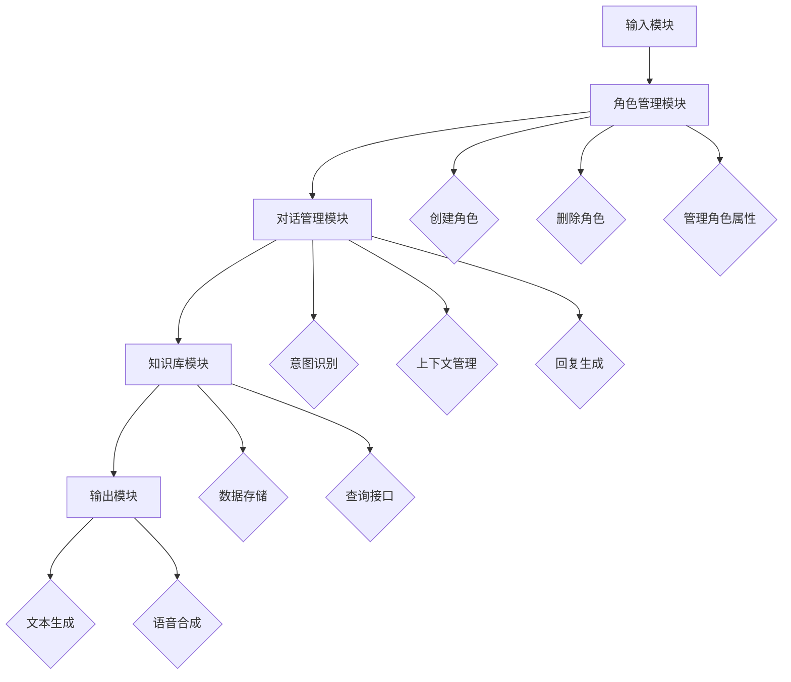
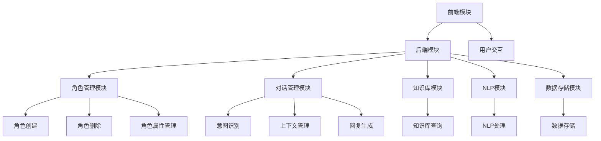

                 


### 引言与背景

#### 问题背景

AI Agent，即人工智能代理，是一种模拟人类智能行为，执行特定任务的智能实体。它们在多个领域展现出了巨大的潜力，从智能客服、虚拟助手，到自动化决策系统。然而，随着应用场景的复杂化和多样化，单一角色的AI Agent已无法满足多样化的需求。多角色AI Agent应运而生，它能够在同一个系统内扮演多个不同的角色，每个角色都有自己的行为和决策逻辑。

多角色AI Agent的应用场景广泛，比如在智能客服系统中，一个AI Agent可能需要同时担任咨询顾问、订单处理员、售后服务代表等多个角色；在虚拟现实游戏中，一个AI Agent可以扮演NPC（非玩家角色）、教练、助手等多种角色。因此，研究多角色AI Agent的设计与实现具有重要的现实意义。

#### 多角色AI Agent的重要性

多角色AI Agent的重要性体现在以下几个方面：

1. **提升系统灵活性和适应性**：多角色AI Agent可以在同一个系统中扮演不同的角色，提高了系统的灵活性和适应性，能够更好地应对复杂多变的应用场景。
2. **增强用户体验**：通过扮演多个角色，多角色AI Agent能够提供更个性化、更贴近用户需求的服务，从而提升用户体验。
3. **提高工作效率**：多角色AI Agent可以同时处理多个任务，减少了人工干预，提高了工作效率。

#### 本书结构

本书旨在系统地介绍多角色AI Agent的设计与实现，主要分为以下几个部分：

- **第一部分：引言与背景**：介绍AI Agent的概念和背景，多角色AI Agent的重要性。
- **第二部分：LLM基础**：介绍语言模型的基本概念、工作原理和常见模型。
- **第三部分：多角色AI Agent设计**：讨论多角色AI Agent的架构设计、角色管理和对话管理。
- **第四部分：基于LLM的虚拟角色扮演系统实现**：详细介绍系统的需求分析、架构设计、实现和测试。
- **第五部分：应用案例与拓展**：探讨多角色AI Agent在虚拟助手、智能客服和其他领域的应用。
- **第六部分：总结与展望**：回顾本书的主要内容和展望未来的发展。

通过以上各部分的详细介绍，读者可以系统地了解多角色AI Agent的设计与实现，掌握相关技术，为实际应用打下坚实的基础。接下来，我们将逐步深入探讨LLM的基础知识，为后续内容打下坚实的基础。

### LLM基础

#### 语言模型的基本概念

语言模型（Language Model，简称LM）是自然语言处理（Natural Language Processing，简称NLP）领域的一个核心组成部分。它是一个概率模型，旨在预测一段文本的下一个单词或字符。语言模型的根本目的是理解人类语言，并生成或理解自然语言文本。

语言模型可以分为两大类：基于规则的模型和基于统计的模型。基于规则的模型通常依赖于语言学知识和手动编写的规则，而基于统计的模型则通过分析大量文本数据来学习语言的模式和规律。

#### 语言模型的分类

1. **n-gram模型**：是最简单的语言模型之一，它通过统计相邻n个单词出现的频率来预测下一个单词。例如，一个三元语言模型会考虑过去三个单词的历史来预测下一个单词。n-gram模型简单易实现，但它的一个主要缺陷是它忽略了单词之间的语义关系。

2. **神经网络模型**：随着深度学习的兴起，神经网络模型逐渐成为主流。其中，循环神经网络（Recurrent Neural Network，RNN）是早期应用在语言模型上的神经网络模型，它通过保持状态来处理序列数据。长短期记忆网络（Long Short-Term Memory，LSTM）是RNN的一种改进，它能够更好地处理长序列数据。随着Transformer模型的提出，语言模型的研究和应用达到了一个新的高度。Transformer模型利用自注意力机制（self-attention）来捕捉序列中的长距离依赖关系，GPT系列模型和BERT模型都是基于Transformer的代表性语言模型。

3. **组合模型**：组合模型结合了多种模型的优势，例如，在n-gram模型的基础上，可以加入基于神经网络的校正，以提高模型的预测能力。

#### 语言模型的工作原理

语言模型的工作原理可以分为两个主要阶段：训练阶段和预测阶段。

1. **训练阶段**：在训练阶段，语言模型通过分析大量的文本数据来学习语言的模式和规律。具体来说，语言模型会计算每个单词或短语的联合概率或条件概率。例如，在n-gram模型中，它会计算前n-1个单词出现时，第n个单词的概率。在神经网络模型中，语言模型通过反向传播算法来优化模型的参数，使其在给定输入序列时能够生成最可能的输出序列。

2. **预测阶段**：在预测阶段，语言模型使用训练得到的参数来预测下一个单词或字符。对于n-gram模型，它会根据过去n-1个单词的历史来选择下一个单词。对于神经网络模型，它会通过解码器（decoder）来生成预测的文本序列。

#### 常见的LLM模型介绍

1. **GPT系列模型**：GPT（Generative Pretrained Transformer）系列模型是OpenAI提出的一类基于Transformer的预训练模型。GPT-1是最早的版本，随后GPT-2和GPT-3不断迭代更新，模型规模和性能也在不断提升。GPT-3具有1750亿参数，能够生成高质量的自然语言文本，并广泛应用于聊天机器人、文本生成、机器翻译等领域。

   - **结构**：GPT模型主要由Transformer编码器（encoder）组成，它包含多个自注意力层（self-attention layer）和前馈神经网络（feedforward network）。
   - **训练**：GPT模型通过大量的文本数据进行预训练，学习文本的统计规律和语义信息。

2. **BERT模型**：BERT（Bidirectional Encoder Representations from Transformers）是由Google提出的一种基于Transformer的双向编码模型。BERT模型通过预先训练来学习语言的双向表示，并在多个NLP任务中取得了显著的性能提升。

   - **结构**：BERT模型包含两个部分：编码器（encoder）和解码器（decoder）。编码器负责对输入文本进行编码，解码器负责生成预测的输出。
   - **训练**：BERT模型通过Masked Language Modeling（MLM）和Next Sentence Prediction（NSP）任务进行预训练。

3. **其他变体**：除了GPT和BERT，还有许多基于Transformer的变体模型，如RoBERTa、ALBERT、T5等。这些模型通过不同的架构设计和技术改进，进一步提升了语言模型的性能。

在本节的讨论中，我们介绍了语言模型的基本概念、分类和工作原理，并详细介绍了GPT系列模型和BERT模型。接下来，我们将探讨多角色AI Agent的架构设计，为理解和实现多角色AI Agent奠定基础。

### 多角色AI Agent的架构设计

多角色AI Agent的架构设计是确保系统能够高效、灵活地处理多个角色的核心。一个典型的多角色AI Agent系统通常包括以下几个关键模块：

#### 系统架构

1. **输入模块**：该模块负责接收用户输入，并将其转换为系统能够处理的数据格式。输入可以是文本、语音或其他形式的交互数据。

2. **角色管理模块**：该模块负责管理系统中所有角色的创建、删除和属性管理。每个角色都有自己的行为和决策逻辑，可以独立运行。

3. **对话管理模块**：该模块负责管理整个对话流程，包括理解用户的意图、生成合适的回复、处理对话中的上下文信息等。

4. **知识库模块**：该模块存储系统所需的知识信息，包括事实数据、规则库、历史对话记录等，为角色提供决策依据。

5. **输出模块**：该模块负责将AI Agent的决策和回复转化为用户可理解的形式，如文本、语音等。

#### 功能模块

1. **角色管理模块**：角色管理模块是整个系统的核心，负责管理角色的生命周期。具体功能包括：

   - **角色创建**：根据系统的需求，创建新的角色实例。
   - **角色删除**：删除不再需要的角色实例。
   - **角色属性管理**：为每个角色配置属性，如角色名称、角色类型、角色技能等。

2. **对话管理模块**：对话管理模块负责处理整个对话过程，确保对话流畅、自然。其主要功能包括：

   - **意图识别**：通过自然语言处理技术，识别用户的意图。
   - **上下文管理**：跟踪对话的历史信息，确保回复与对话上下文一致。
   - **回复生成**：根据用户意图和上下文信息，生成合适的回复。

3. **知识库模块**：知识库模块提供了AI Agent所需的背景知识和信息。具体功能包括：

   - **数据存储**：存储系统所需的各种数据，如事实数据、规则库等。
   - **查询接口**：提供接口供角色在决策时查询所需的知识。

4. **输出模块**：输出模块将AI Agent的决策和回复转化为用户可理解的形式。具体功能包括：

   - **文本生成**：将决策结果转换为自然语言文本。
   - **语音合成**：将文本转换为语音，以便用户以语音形式接收回复。

#### 架构图

为了更直观地理解多角色AI Agent的架构设计，我们可以使用Mermaid绘制一个简单的架构图：



通过上述架构设计，多角色AI Agent能够高效地管理多个角色，处理复杂的对话流程，并为用户提供高质量的交互体验。接下来，我们将深入探讨角色管理模块的具体实现。

### 角色管理模块实现

角色管理模块是多角色AI Agent的核心组成部分，负责创建、删除和管理角色属性。本节将详细介绍角色管理模块的各个功能实现。

#### 角色创建

角色创建是角色管理模块的首要任务。创建角色时，需要定义角色的基本信息，如角色名称、角色类型和初始属性等。以下是一个简单的Python代码示例，用于创建角色：

```python
class Role:
    def __init__(self, name, role_type, attributes):
        self.name = name
        self.role_type = role_type
        self.attributes = attributes

def create_role(name, role_type, attributes):
    new_role = Role(name, role_type, attributes)
    # 将新角色添加到系统角色列表中
    system_roles[name] = new_role
    return new_role

# 示例：创建一个名为“客服代表”的角色
system_roles = {}
attributes = {'level': '初级', 'skills': ['产品咨询', '订单处理']}
new_role = create_role('客服代表', '客服代表', attributes)
```

在上面的代码中，我们定义了一个`Role`类来表示角色，并编写了一个`create_role`函数用于创建新的角色实例。新角色会被添加到系统角色列表`system_roles`中，以便后续管理。

#### 角色删除

角色删除是角色管理模块的另一个重要功能。删除角色时，需要确保该角色不再参与任何当前任务或对话。以下是一个简单的Python代码示例，用于删除角色：

```python
def delete_role(name):
    if name in system_roles:
        # 删除角色实例
        del system_roles[name]
        print(f"角色'{name}'已成功删除。")
    else:
        print(f"角色'{name}'不存在。")

# 示例：删除名为“客服代表”的角色
delete_role('客服代表')
```

在上面的代码中，我们编写了一个`delete_role`函数，用于根据角色名称删除角色实例。如果角色存在，函数将删除该角色并打印确认信息；如果角色不存在，函数将打印错误信息。

#### 角色属性管理

角色属性管理涉及修改和查询角色的属性信息。以下是一个简单的Python代码示例，用于管理角色属性：

```python
def update_role_attribute(name, attribute, value):
    if name in system_roles:
        # 更新角色属性
        system_roles[name].attributes[attribute] = value
        print(f"角色'{name}'的{attribute}属性已更新为'{value}'。")
    else:
        print(f"角色'{name}'不存在。")

def get_role_attribute(name, attribute):
    if name in system_roles:
        return system_roles[name].attributes.get(attribute)
    else:
        print(f"角色'{name}'不存在。")

# 示例：更新名为“客服代表”的角色的技能
update_role_attribute('客服代表', 'skills', '产品咨询、订单处理、售后服务')

# 示例：查询名为“客服代表”的角色的级别
level = get_role_attribute('客服代表', 'level')
print(f"角色'客服代表'的级别为'{level}'。")
```

在上面的代码中，我们编写了两个函数：`update_role_attribute`用于更新角色属性，`get_role_attribute`用于查询角色属性。这些函数根据角色名称和属性名称来操作角色属性，确保角色信息的正确性。

#### 实现细节

在实际应用中，角色管理模块的实现可能涉及更复杂的数据结构和算法，如数据库操作、权限管理和事务处理等。以下是一些实现细节的建议：

- **数据持久化**：角色信息应持久化存储在数据库中，以便在系统重启后仍能保留角色数据。
- **权限控制**：不同角色可能有不同的权限，应实现权限控制机制，确保只有授权用户才能进行角色创建、删除和属性管理操作。
- **事务处理**：在处理角色管理操作时，应使用事务处理机制，确保操作的原子性和一致性。

通过上述方法，角色管理模块能够有效地创建、删除和管理角色属性，为多角色AI Agent提供稳定可靠的角色管理功能。接下来，我们将探讨对话管理模块的实现，进一步丰富多角色AI Agent的功能。

### 对话管理模块实现

对话管理模块是多角色AI Agent系统的核心，它负责处理整个对话流程，确保对话的流畅性和准确性。本节将详细介绍对话管理模块的实现，包括对话流程设计、对话策略与优化。

#### 对话流程设计

对话流程设计是确保AI Agent能够自然、合理地与用户交互的关键。一个典型的对话流程可以分为以下几个阶段：

1. **意图识别**：通过自然语言处理技术，识别用户的意图。例如，用户询问“明天天气如何？”时，系统需要识别出意图为“获取天气信息”。

2. **上下文管理**：跟踪对话的历史信息，确保回复与上下文一致。例如，如果用户之前询问了天气信息，系统在后续的对话中不应重复询问相同的信息。

3. **回复生成**：根据用户意图和上下文信息，生成合适的回复。例如，如果用户意图是获取天气信息，系统可以生成回复“明天天气晴朗，温度在20℃左右”。

4. **反馈处理**：根据用户的反馈，调整后续的对话策略。例如，如果用户对回复不满意，系统可以尝试提供更详细的天气信息。

以下是一个简单的Python代码示例，用于实现对话流程：

```python
class DialogueManager:
    def __init__(self):
        self.context = {}

    def recognize_intent(self, user_input):
        # 使用自然语言处理技术识别用户意图
        intent = "获取天气信息"
        self.context['intent'] = intent
        return intent

    def manage_context(self, user_input):
        # 跟踪对话历史信息
        self.context['last_query'] = user_input
        return self.context

    def generate_response(self, intent, context):
        # 生成回复
        if intent == "获取天气信息":
            response = "明天天气晴朗，温度在20℃左右。"
        else:
            response = "对不起，我不清楚您的意图。"
        return response

    def handle_feedback(self, user_input):
        # 处理用户反馈
        if "不满意" in user_input:
            self.context['need_more_info'] = True
        else:
            self.context['need_more_info'] = False

    def handle_dialogue(self, user_input):
        intent = self.recognize_intent(user_input)
        context = self.manage_context(user_input)
        response = self.generate_response(intent, context)
        self.handle_feedback(response)
        return response

# 示例：模拟对话流程
dialogue_manager = DialogueManager()
user_input = "明天天气如何？"
response = dialogue_manager.handle_dialogue(user_input)
print(response)
```

#### 对话策略与优化

对话策略决定了AI Agent如何处理不同类型的用户输入。为了提高对话的准确性和自然度，可以采用以下策略和优化方法：

1. **意图分类**：使用机器学习算法对用户输入进行意图分类，提高意图识别的准确性。例如，可以采用朴素贝叶斯分类器、支持向量机（SVM）或深度学习模型（如卷积神经网络（CNN）、递归神经网络（RNN））。

2. **上下文跟踪**：利用上下文跟踪技术，如循环神经网络（RNN）、长短期记忆网络（LSTM）或注意力机制，捕捉对话中的长期依赖关系，确保回复与上下文一致。

3. **回复生成**：使用生成对抗网络（GAN）、变分自编码器（VAE）或强化学习技术（如策略梯度算法）生成更自然的回复。

4. **多模态交互**：结合文本、语音、图像等多种模态，提供更丰富的交互体验。例如，可以使用语音合成技术生成语音回复，或利用图像识别技术理解用户上传的图片。

5. **对话评估与反馈**：定期评估对话系统的性能，收集用户反馈，不断优化对话策略。例如，可以采用人类评估员或自动化评估方法（如BLEU、ROUGE评分）对生成回复进行评估。

通过上述对话策略和优化方法，对话管理模块能够生成高质量、自然的回复，为用户提供优质的交互体验。接下来，我们将讨论系统需求分析，为基于LLM的虚拟角色扮演系统的实现奠定基础。

### 系统需求分析

在实现基于LLM的虚拟角色扮演系统之前，明确系统的功能需求、性能需求以及相关的非功能性需求是非常重要的。以下是对该系统需求的详细分析。

#### 功能需求

1. **角色创建与删除**：用户能够创建新的角色，并为角色配置基本属性，如名称、类型、技能等。同时，用户能够删除不再需要的角色。

2. **角色属性管理**：用户可以修改角色的属性，例如角色级别、技能集合等。属性管理应当支持对多个角色的批量操作。

3. **对话管理**：系统能够处理用户的输入，识别意图，生成合适的回复，并跟踪对话上下文，确保对话的自然和连贯。

4. **知识库管理**：系统能够存储和查询知识库中的信息，如事实数据、规则库等，为角色提供决策依据。

5. **多模态交互**：系统应支持文本、语音、图像等多种交互方式，提供丰富的用户交互体验。

6. **权限管理**：系统应具备完善的权限管理机制，确保只有授权用户才能进行角色创建、删除、属性修改等操作。

7. **日志记录**：系统应记录用户操作、系统事件和对话内容，以便进行监控和审计。

#### 性能需求

1. **响应时间**：系统应能够快速响应用户的输入，确保用户操作的流畅性。通常，系统的平均响应时间应小于500毫秒。

2. **并发处理能力**：系统应能够同时处理多个用户的请求，具备良好的并发处理能力，以支持高并发场景。

3. **吞吐量**：系统应能够处理大量的用户请求，吞吐量应满足业务需求。例如，每小时处理1000个请求。

4. **存储容量**：系统应具备足够的存储容量，以存储用户数据、角色信息和对话记录等。

#### 非功能性需求

1. **可扩展性**：系统应设计为可扩展的，以便在未来能够轻松地添加新的功能或升级现有功能。

2. **可靠性**：系统应具备高可靠性，确保在长时间运行过程中不发生故障，数据不会丢失。

3. **安全性**：系统应采用安全措施，保护用户数据和系统安全，防止未经授权的访问和数据泄露。

4. **兼容性**：系统应能够与不同的操作系统、浏览器和设备兼容，提供一致的用户体验。

5. **可维护性**：系统应设计为易于维护和升级，确保系统能够持续稳定运行。

通过上述系统需求分析，我们可以确保基于LLM的虚拟角色扮演系统在功能、性能和可靠性等方面满足用户的期望，为后续的实现提供清晰的指导。

### 系统架构设计

为了实现基于LLM的虚拟角色扮演系统，我们需要设计一个结构清晰、模块化的系统架构。本节将详细介绍系统架构设计，包括系统总体架构、各模块的详细设计和系统接口设计。

#### 系统总体架构

基于LLM的虚拟角色扮演系统可以分为以下几个主要模块：

1. **前端模块**：负责与用户进行交互，接收用户输入，并将系统生成的回复呈现给用户。
2. **后端模块**：包括角色管理模块、对话管理模块、知识库模块和自然语言处理（NLP）模块，负责处理核心业务逻辑。
3. **数据存储模块**：负责存储用户数据、角色信息和对话记录等。

以下是一个简单的系统总体架构图：



#### 各模块的详细设计

1. **前端模块**：前端模块负责与用户进行交互，主要包括用户输入界面和系统回复展示界面。前端模块可以使用Web技术（如HTML、CSS、JavaScript）或移动应用技术（如React Native、Flutter）实现。前端模块需要与后端模块进行通信，以发送用户输入并接收系统回复。

2. **角色管理模块**：角色管理模块负责创建、删除和管理角色属性。该模块应包括以下功能：

   - **角色创建**：接收用户输入的角色信息，创建新的角色实例，并将其存储在数据存储模块中。
   - **角色删除**：根据角色名称删除角色实例。
   - **角色属性管理**：允许用户修改角色的属性，如角色名称、角色类型、技能等。

3. **对话管理模块**：对话管理模块负责处理整个对话流程，包括意图识别、上下文管理和回复生成。该模块应包括以下功能：

   - **意图识别**：使用自然语言处理技术识别用户的意图。
   - **上下文管理**：跟踪对话的历史信息，确保回复与上下文一致。
   - **回复生成**：根据用户意图和上下文信息，生成合适的回复。

4. **知识库模块**：知识库模块负责存储和管理系统所需的知识信息，包括事实数据、规则库和对话历史记录。该模块应包括以下功能：

   - **知识存储**：将知识信息存储在数据库或其他数据存储方案中。
   - **知识查询**：提供接口供角色在决策时查询所需的知识。

5. **NLP模块**：NLP模块负责处理自然语言文本，包括文本分析、实体识别、情感分析等。该模块应包括以下功能：

   - **文本分析**：对用户输入进行语法和语义分析，提取关键信息。
   - **实体识别**：识别文本中的命名实体，如人名、地名、组织名等。
   - **情感分析**：分析文本的情感倾向，如正面、负面、中性等。

6. **数据存储模块**：数据存储模块负责存储系统所需的数据，包括用户数据、角色信息、对话记录和知识库等。该模块可以选择关系型数据库（如MySQL、PostgreSQL）或非关系型数据库（如MongoDB、Cassandra）来实现。

#### 系统接口设计

系统接口设计是确保各模块之间能够顺畅通信的关键。以下是一些主要接口的设计：

1. **角色管理接口**：提供RESTful API，用于角色创建、删除和属性管理。例如：

   - `POST /roles`：创建新角色
   - `DELETE /roles/{role_id}`：删除角色
   - `PUT /roles/{role_id}`：更新角色属性

2. **对话管理接口**：提供RESTful API，用于处理对话流程。例如：

   - `POST /dialogue`：发送用户输入
   - `GET /dialogue/{dialogue_id}`：获取对话记录

3. **知识库接口**：提供RESTful API，用于查询和管理知识库。例如：

   - `GET /knowledge`：查询知识库
   - `POST /knowledge`：添加新知识
   - `DELETE /knowledge/{knowledge_id}`：删除知识

通过上述系统架构设计和接口设计，基于LLM的虚拟角色扮演系统能够高效地处理角色创建、对话管理和知识库管理等核心业务逻辑，为用户提供高质量的交互体验。接下来，我们将详细探讨对话管理模块的实现。

### 对话管理模块实现

对话管理模块是虚拟角色扮演系统的核心，负责处理整个对话流程，确保对话的流畅性和准确性。本节将详细介绍对话管理模块的实现，包括对话流程设计与实现、对话策略与优化。

#### 对话流程设计与实现

对话流程设计主要包括意图识别、上下文管理、回复生成和反馈处理等步骤。以下是一个简单的Python代码示例，用于实现对话流程：

```python
class DialogueManager:
    def __init__(self):
        self.context = {}

    def recognize_intent(self, user_input):
        # 使用自然语言处理技术识别用户意图
        # 假设我们使用一个简单的词典进行意图识别
        intent_dict = {
            '明天天气如何': '获取天气信息',
            '你叫什么名字': '自我介绍',
            '有什么好玩的': '推荐娱乐活动'
        }
        return intent_dict.get(user_input, '未知意图')

    def manage_context(self, user_input):
        # 跟踪对话历史信息
        self.context['last_input'] = user_input
        return self.context

    def generate_response(self, intent, context):
        # 生成回复
        if intent == '获取天气信息':
            response = "明天天气晴朗，温度在20℃左右。"
        elif intent == '自我介绍':
            response = "你好，我是虚拟助手，可以为您提供帮助。"
        elif intent == '推荐娱乐活动':
            response = "您可以选择去看电影或去公园散步。"
        else:
            response = "对不起，我不清楚您的意图。"
        return response

    def handle_feedback(self, user_input):
        # 处理用户反馈
        if "不满意" in user_input:
            self.context['need_more_info'] = True
        else:
            self.context['need_more_info'] = False

    def handle_dialogue(self, user_input):
        intent = self.recognize_intent(user_input)
        context = self.manage_context(user_input)
        response = self.generate_response(intent, context)
        self.handle_feedback(response)
        return response

# 示例：模拟对话流程
dialogue_manager = DialogueManager()
user_input = "明天天气如何？"
response = dialogue_manager.handle_dialogue(user_input)
print(response)
```

#### 对话策略与优化

对话策略决定了AI Agent如何处理不同类型的用户输入。为了提高对话的准确性和自然度，可以采用以下策略和优化方法：

1. **意图分类**：使用机器学习算法（如朴素贝叶斯、支持向量机、深度学习）对用户输入进行意图分类，提高意图识别的准确性。

2. **上下文跟踪**：使用循环神经网络（RNN）、长短期记忆网络（LSTM）或注意力机制来捕捉对话中的长期依赖关系，确保回复与上下文一致。

3. **回复生成**：采用生成对抗网络（GAN）、变分自编码器（VAE）或强化学习技术（如策略梯度算法）生成更自然的回复。

4. **多模态交互**：结合文本、语音、图像等多种模态，提供更丰富的交互体验。例如，使用语音合成技术生成语音回复，或利用图像识别技术理解用户上传的图片。

5. **对话评估与反馈**：定期评估对话系统的性能，收集用户反馈，不断优化对话策略。例如，使用人类评估员或自动化评估方法（如BLEU、ROUGE评分）对生成回复进行评估。

通过上述对话策略和优化方法，对话管理模块能够生成高质量、自然的回复，为用户提供优质的交互体验。接下来，我们将详细探讨角色管理模块的实现。

### 角色管理模块实现

角色管理模块是多角色AI Agent系统的核心组成部分，负责创建、删除和管理角色属性。本节将详细介绍角色管理模块的实现，包括角色创建、删除和属性管理的具体方法。

#### 角色创建

角色创建是角色管理模块的首要任务。创建角色时，需要定义角色的基本信息，如角色名称、角色类型和初始属性等。以下是一个简单的Python代码示例，用于创建角色：

```python
class Role:
    def __init__(self, name, role_type, attributes):
        self.name = name
        self.role_type = role_type
        self.attributes = attributes

def create_role(name, role_type, attributes):
    new_role = Role(name, role_type, attributes)
    # 将新角色添加到系统角色列表中
    system_roles[name] = new_role
    print(f"角色'{name}'已成功创建。")
    return new_role

# 示例：创建一个名为“客服代表”的角色
system_roles = {}
attributes = {'level': '初级', 'skills': ['产品咨询', '订单处理']}
new_role = create_role('客服代表', '客服代表', attributes)
```

在上面的代码中，我们定义了一个`Role`类来表示角色，并编写了一个`create_role`函数用于创建新的角色实例。新角色会被添加到系统角色列表`system_roles`中，以便后续管理。

#### 角色删除

角色删除是角色管理模块的另一个重要功能。删除角色时，需要确保该角色不再参与任何当前任务或对话。以下是一个简单的Python代码示例，用于删除角色：

```python
def delete_role(name):
    if name in system_roles:
        # 删除角色实例
        del system_roles[name]
        print(f"角色'{name}'已成功删除。")
    else:
        print(f"角色'{name}'不存在。")

# 示例：删除名为“客服代表”的角色
delete_role('客服代表')
```

在上面的代码中，我们编写了一个`delete_role`函数，用于根据角色名称删除角色实例。如果角色存在，函数将删除该角色并打印确认信息；如果角色不存在，函数将打印错误信息。

#### 角色属性管理

角色属性管理涉及修改和查询角色的属性信息。以下是一个简单的Python代码示例，用于管理角色属性：

```python
def update_role_attribute(name, attribute, value):
    if name in system_roles:
        # 更新角色属性
        system_roles[name].attributes[attribute] = value
        print(f"角色'{name}'的{attribute}属性已更新为'{value}'。")
    else:
        print(f"角色'{name}'不存在。")

def get_role_attribute(name, attribute):
    if name in system_roles:
        return system_roles[name].attributes.get(attribute)
    else:
        print(f"角色'{name}'不存在。")

# 示例：更新名为“客服代表”的角色的技能
update_role_attribute('客服代表', 'skills', '产品咨询、订单处理、售后服务')

# 示例：查询名为“客服代表”的角色的级别
level = get_role_attribute('客服代表', 'level')
print(f"角色'客服代表'的级别为'{level}'。")
```

在上面的代码中，我们编写了两个函数：`update_role_attribute`用于更新角色属性，`get_role_attribute`用于查询角色属性。这些函数根据角色名称和属性名称来操作角色属性，确保角色信息的正确性。

#### 实现细节

在实际应用中，角色管理模块的实现可能涉及更复杂的数据结构和算法，如数据库操作、权限管理和事务处理等。以下是一些实现细节的建议：

- **数据持久化**：角色信息应持久化存储在数据库中，以便在系统重启后仍能保留角色数据。可以使用关系型数据库（如MySQL、PostgreSQL）或非关系型数据库（如MongoDB、Cassandra）。

- **权限控制**：不同角色可能有不同的权限，应实现权限控制机制，确保只有授权用户才能进行角色创建、删除和属性管理操作。可以使用角色访问控制列表（ACL）或基于角色的访问控制（RBAC）。

- **事务处理**：在处理角色管理操作时，应使用事务处理机制，确保操作的原子性和一致性。可以使用数据库的事务功能或消息队列的事务特性。

通过上述方法，角色管理模块能够有效地创建、删除和管理角色属性，为多角色AI Agent提供稳定可靠的角色管理功能。接下来，我们将讨论系统测试与性能评估，以确保系统的稳定性和高效性。

### 系统测试与性能评估

系统测试与性能评估是确保基于LLM的虚拟角色扮演系统稳定、高效运行的重要环节。本节将详细介绍系统功能测试、系统性能评估以及如何分析测试结果。

#### 系统功能测试

功能测试旨在验证系统是否满足预定的功能需求。以下是一些常见的功能测试方法：

1. **单元测试**：针对系统中的每个功能模块（如角色管理模块、对话管理模块等），编写测试用例，验证其正确性和可靠性。例如，测试角色创建功能时，可以验证是否能够成功创建角色，以及创建的角色是否符合预期。

2. **集成测试**：验证系统模块之间的接口和交互是否正常工作。例如，测试角色管理模块与对话管理模块之间的数据传递和功能调用是否顺畅。

3. **验收测试**：在系统开发完成并集成所有模块后，进行验收测试，确保系统能够满足用户的需求。验收测试通常由用户或第三方进行，通过模拟实际使用场景，验证系统功能的完整性和稳定性。

以下是一个简单的Python单元测试示例：

```python
import unittest
from role_management import create_role, delete_role

class TestRoleManagement(unittest.TestCase):
    def test_create_role(self):
        role_name = "测试角色"
        role_type = "测试类型"
        attributes = {"技能": ["测试技能"]}
        role = create_role(role_name, role_type, attributes)
        self.assertIsNotNone(role)
        self.assertEqual(role.name, role_name)
        self.assertEqual(role.role_type, role_type)
        self.assertIn("技能", role.attributes)

    def test_delete_role(self):
        role_name = "测试角色"
        role = create_role(role_name, "测试类型", {"技能": ["测试技能"]})
        delete_role(role_name)
        self.assertNotIn(role_name, system_roles)

if __name__ == '__main__':
    unittest.main()
```

#### 系统性能评估

性能评估旨在验证系统在处理高并发请求时能否保持良好的响应时间和吞吐量。以下是一些常见的性能评估方法：

1. **负载测试**：模拟高并发用户请求，评估系统在不同负载条件下的性能表现。可以使用工具如JMeter、LoadRunner等进行负载测试。

2. **压力测试**：在极端条件下（如超高的并发请求或巨大的数据量），评估系统是否能够保持稳定运行，并识别潜在的瓶颈和故障点。

3. **基准测试**：通过对比系统在不同配置、不同软件环境下的性能，评估系统的性能瓶颈和优化空间。

以下是一个使用JMeter进行负载测试的示例：

```shell
# 安装JMeter
pip install jmeter

# 运行JMeter测试脚本
jmeter -n -t test_plan.jmx -l results.jtl
```

其中，`test_plan.jmx`是JMeter测试计划的配置文件，`results.jtl`是测试结果文件。

#### 分析测试结果

测试完成后，需要分析测试结果，识别潜在的问题和优化点。以下是一些分析测试结果的方法：

1. **响应时间分析**：分析系统在不同负载条件下的平均响应时间，识别哪些功能或模块的响应时间较长，可能存在性能瓶颈。

2. **吞吐量分析**：分析系统在不同负载条件下的处理能力，识别系统的最大吞吐量，以及在高负载下性能下降的原因。

3. **错误率分析**：分析系统在测试过程中出现的错误类型和错误率，识别系统稳定性方面的问题。

通过上述测试和分析，我们可以全面了解基于LLM的虚拟角色扮演系统的性能表现，并针对性地进行优化和改进，确保系统能够稳定、高效地运行。

### 多角色AI Agent在虚拟助手中的应用

虚拟助手是一种基于AI技术的智能服务系统，能够在多个领域为用户提供个性化、高效的辅助服务。多角色AI Agent作为虚拟助手的核心技术之一，能够显著提升虚拟助手的智能化水平和用户体验。以下将详细探讨多角色AI Agent在虚拟助手中的应用，包括基本概念、应用案例和实现方法。

#### 基本概念

虚拟助手是一种模拟人类助手的计算机程序，它能够理解用户的语言，回答用户的问题，执行用户指令，并在适当的情况下进行自主学习。虚拟助手通常具备自然语言处理、语音识别、语音合成、对话管理等能力。

多角色AI Agent是一种能够在同一个系统中扮演多个不同角色的智能实体。每个角色都有自己的行为和决策逻辑，可以独立运行。在虚拟助手的应用场景中，多角色AI Agent可以根据用户的需求和环境的变化，灵活地扮演不同的角色，提供多样化、个性化的服务。

#### 应用案例

1. **智能客服**：虚拟助手可以在智能客服系统中扮演多个角色，如咨询顾问、订单处理员、售后服务代表等。例如，当用户咨询产品问题时，虚拟助手中的咨询顾问角色可以提供详细的产品信息；当用户需要下单时，订单处理员角色可以协助用户完成订单操作；当用户遇到售后问题时，售后服务代表角色可以提供相应的解决方案。

2. **虚拟导游**：在虚拟现实旅游应用中，多角色AI Agent可以扮演导游、讲解员、推荐助手等多种角色。导游角色可以为用户提供景点介绍、路线规划等服务；讲解员角色可以实时讲解景点的历史文化；推荐助手角色可以根据用户的兴趣推荐旅游景点和活动。

3. **家庭助手**：在智能家居系统中，多角色AI Agent可以扮演家庭管家、生活助手、娱乐助手等多种角色。家庭管家角色可以管理家庭设备、日程安排等；生活助手角色可以提醒用户天气变化、健康提醒等；娱乐助手角色可以为用户提供音乐、电影、游戏等娱乐内容。

#### 实现方法

实现多角色AI Agent在虚拟助手中的应用，主要包括以下几个方面：

1. **角色定义**：首先，需要定义虚拟助手中的各个角色，包括角色的名称、类型、功能和属性。例如，在智能客服中，可以定义咨询顾问、订单处理员、售后服务代表等角色。

2. **角色管理**：实现角色的创建、删除和属性管理功能。例如，使用数据库或内存数据结构存储和管理角色信息，提供用户界面供管理员进行角色操作。

3. **对话管理**：实现对话管理模块，负责处理用户的输入，识别用户的意图，并根据角色功能生成相应的回复。可以使用自然语言处理技术（如词向量、序列模型、Transformer模型）进行意图识别和回复生成。

4. **交互接口**：为虚拟助手提供与用户交互的接口，包括文本、语音、图像等多种形式。例如，可以使用Web前端技术（如HTML、CSS、JavaScript）实现文本交互，使用语音合成和语音识别技术实现语音交互。

5. **集成与测试**：将多角色AI Agent集成到虚拟助手系统中，进行功能测试和性能评估，确保系统能够稳定、高效地运行。

通过上述实现方法，多角色AI Agent可以在虚拟助手中实现灵活的角色切换和个性化服务，为用户提供高质量、高效的智能服务。

### 多角色AI Agent在智能客服中的应用

智能客服系统是AI技术在实际业务场景中的重要应用之一，旨在通过自动化手段提升客户服务质量，降低人工成本。多角色AI Agent作为智能客服系统的核心组件，能够显著提升系统的智能化水平和用户体验。以下将详细探讨多角色AI Agent在智能客服系统中的应用，包括基本概念、应用案例和实现方法。

#### 基本概念

智能客服系统是一种基于AI技术，通过自动化的方式提供客户服务的系统。它能够理解客户的提问，自动生成回复，并能够根据对话历史和上下文进行推理和决策。智能客服系统通常包括自然语言处理（NLP）、机器学习、对话管理等多个技术模块。

多角色AI Agent在智能客服系统中的应用，意味着系统内部存在多个智能实体，每个实体都扮演特定的角色，如咨询顾问、订单处理员、售后服务代表等。这些角色各自具备不同的知识和技能，能够在不同的对话场景中发挥作用，提供更加个性化和高效的客户服务。

#### 应用案例

1. **咨询顾问角色**：咨询顾问角色负责解答客户的咨询问题，如产品功能、使用方法、常见问题等。通过多角色AI Agent，智能客服系统可以模拟真实的人工咨询顾问，为客户提供详细、专业的解答。

   - **应用实例**：当客户询问“这款手机有哪些特色功能？”时，咨询顾问角色可以提供详细的功能介绍，如相机性能、电池续航、快充技术等。

2. **订单处理员角色**：订单处理员角色负责处理客户的订单请求，如下单、订单查询、订单修改等。通过自动化处理订单，提高订单处理的效率和准确性。

   - **应用实例**：当客户提出“我想购买这款手机，如何下单？”的请求时，订单处理员角色可以引导客户完成下单流程，并生成订单信息。

3. **售后服务代表角色**：售后服务代表角色负责处理客户的投诉和售后问题，如退换货、维修服务等。通过多角色AI Agent，智能客服系统可以提供专业的售后服务，提升客户满意度。

   - **应用实例**：当客户提出“我的手机出现了故障，如何进行维修？”的请求时，售后服务代表角色可以为客户提供维修方案，并引导客户进行维修预约。

#### 实现方法

实现多角色AI Agent在智能客服系统中的应用，主要包括以下几个方面：

1. **角色定义**：首先，需要定义智能客服系统中各个角色的功能和职责，如咨询顾问、订单处理员、售后服务代表等。每个角色需要具备相应的知识和技能，以应对不同类型的客户提问。

2. **对话管理**：对话管理模块是智能客服系统的核心，负责处理用户的输入，识别用户的意图，并根据角色功能生成相应的回复。可以使用自然语言处理技术（如词向量、序列模型、Transformer模型）进行意图识别和回复生成。

3. **角色协作**：在处理复杂对话时，不同角色之间需要协作完成。例如，当客户咨询售后服务问题时，咨询顾问角色可以先解答客户的一般性问题，然后将复杂问题转交给售后服务代表角色。

4. **用户体验优化**：智能客服系统需要提供良好的用户体验，包括界面设计、回复生成速度、回复质量等。通过不断优化用户体验，可以提高客户满意度。

5. **系统集成与测试**：将多角色AI Agent集成到智能客服系统中，进行功能测试和性能评估，确保系统能够稳定、高效地运行。

通过上述实现方法，多角色AI Agent能够在智能客服系统中提供灵活、高效的客户服务，提升客户满意度和业务效率。接下来，我们将探讨多角色AI Agent在其他领域的应用前景。

### 多角色AI Agent在其他领域的应用前景

多角色AI Agent不仅在虚拟助手和智能客服领域表现出强大的应用潜力，还在教育、医疗、金融等领域展现出了广阔的前景。以下将详细介绍多角色AI Agent在这些领域的应用前景。

#### 教育领域

在教育领域，多角色AI Agent能够扮演多种角色，如教师、助教、学习顾问等。这些角色可以为学生提供个性化的学习辅导、课程推荐、学习进度跟踪等服务。

1. **个性化学习辅导**：多角色AI Agent可以根据学生的学习进度、兴趣和需求，提供针对性的辅导。例如，一个数学AI教师可以为学生提供难度适中的练习题，并针对学生的错误提供详细的解题指导。

2. **学习进度跟踪**：AI助教可以实时监控学生的学习进度，生成学习报告，帮助教师和家长了解学生的学习情况，及时调整教学策略。

3. **课程推荐**：基于学生的学习历史和偏好，AI学习顾问可以推荐适合的课程和资源，帮助学生优化学习路径。

#### 医疗领域

在医疗领域，多角色AI Agent可以协助医生进行诊断、治疗方案推荐、患者护理等工作，提高医疗服务的质量和效率。

1. **诊断辅助**：AI医生可以通过分析患者的病历、检查结果和症状，提供初步的诊断建议。例如，一个AI病理医生可以帮助医生识别病理图像中的病变区域。

2. **治疗方案推荐**：根据患者的病情和医生的专业知识，AI治疗顾问可以推荐最佳的治疗方案，并实时更新和调整方案。

3. **患者护理**：AI护理助理可以监测患者的健康状况，提醒患者服药、锻炼和复诊，提供个性化的护理服务。

#### 金融领域

在金融领域，多角色AI Agent可以提供风险管理、投资顾问、客户服务等多种服务，帮助金融机构提高业务效率和客户满意度。

1. **风险管理**：AI风控专家可以实时监控金融市场的风险变化，识别潜在的欺诈行为，提供风险预警和建议。

2. **投资顾问**：基于用户的投资偏好和风险承受能力，AI投资顾问可以推荐适合的投资策略，并提供实时市场分析和预测。

3. **客户服务**：AI客服代表可以处理客户的咨询、投诉和服务请求，提供高效、专业的客户服务，提升客户体验。

#### 展望与挑战

尽管多角色AI Agent在各个领域展示了巨大的应用潜力，但其在实际应用中仍面临一些挑战：

1. **数据隐私与安全**：多角色AI Agent需要处理大量的用户数据，包括个人隐私和敏感信息。如何保障数据安全和用户隐私是亟待解决的问题。

2. **算法公平性**：AI Agent在决策过程中可能会受到算法偏见的影响，导致不公平的结果。如何确保算法的公平性和透明性是一个重要的挑战。

3. **人机交互**：虽然多角色AI Agent在自然语言处理和任务执行方面取得了显著进展，但人机交互仍需进一步优化，以提供更自然、流畅的用户体验。

通过不断的技术创新和优化，多角色AI Agent有望在未来各个领域发挥更加重要的作用，为人类带来更多便利和效益。

### 总结与展望

通过本文的详细探讨，我们系统地介绍了多角色AI Agent的概念、设计、实现和应用。多角色AI Agent作为一种能够同时扮演多个角色的智能实体，具有提升系统灵活性、增强用户体验和优化工作效率等多方面的优势。

#### 主要内容回顾

- **引言与背景**：介绍了AI Agent和多角色AI Agent的基本概念，以及多角色AI Agent在虚拟助手、智能客服等领域的应用场景。
- **LLM基础**：介绍了语言模型（LLM）的基本概念、工作原理和常见模型，如GPT系列模型和BERT模型。
- **多角色AI Agent设计**：详细探讨了多角色AI Agent的架构设计、角色管理和对话管理模块。
- **基于LLM的虚拟角色扮演系统实现**：介绍了系统的需求分析、架构设计、对话管理模块实现以及角色管理模块实现。
- **应用案例与拓展**：探讨了多角色AI Agent在虚拟助手、智能客服以及其他领域的应用前景。
- **总结与展望**：回顾了本书的主要内容和展望了多角色AI Agent的未来发展。

#### 读者应该掌握的知识点

- **多角色AI Agent的基本概念**：了解AI Agent和多角色AI Agent的定义、作用和应用场景。
- **LLM的基础知识**：掌握语言模型的基本概念、工作原理和常见模型。
- **多角色AI Agent的设计与实现**：了解多角色AI Agent的架构设计、角色管理和对话管理模块的实现方法。
- **系统实现与优化**：掌握基于LLM的虚拟角色扮演系统的需求分析、架构设计、对话管理和角色管理的具体实现。

通过本文的学习，读者应该能够掌握多角色AI Agent的核心技术和实现方法，为实际应用打下坚实的基础。

### 展望未来

多角色AI Agent的未来发展充满机遇与挑战。随着人工智能技术的不断进步，多角色AI Agent有望在更多领域发挥重要作用，推动智能化服务的发展。

#### 发展趋势

1. **智能化水平的提升**：随着深度学习和自然语言处理技术的不断发展，多角色AI Agent的智能化水平将不断提高，能够更准确地理解用户意图，生成更自然的回复。
2. **跨领域应用**：多角色AI Agent将在教育、医疗、金融等更多领域得到应用，为不同行业提供个性化的智能化服务。
3. **人机协同**：多角色AI Agent将与人类专家协作，实现更高效、精准的服务，推动人机协同工作模式的发展。
4. **大数据与AI的深度融合**：大数据与人工智能技术的结合将为多角色AI Agent提供更丰富的数据支持，提升其决策能力和服务质量。

#### 可能遇到的技术挑战和解决方案

1. **数据隐私与安全**：多角色AI Agent处理大量用户数据，如何保障数据隐私和安全是一个重要挑战。解决方案包括数据加密、访问控制、隐私保护算法等。
2. **算法公平性**：AI Agent在决策过程中可能存在偏见，导致不公平的结果。需要通过算法透明性、公平性评估等方法来确保算法的公平性。
3. **人机交互**：提高多角色AI Agent的自然交互能力，使其更接近人类的沟通方式，是一个长期的挑战。可以通过改进语音识别、语音合成、自然语言处理等技术来优化人机交互体验。
4. **系统稳定性**：在复杂应用场景下，确保多角色AI Agent的稳定运行是一个挑战。需要通过系统架构设计、容错机制、实时监控等技术手段来提高系统的稳定性。

#### 潜在研究方向

1. **多模态交互**：结合语音、文本、图像等多种模态，实现更丰富的用户交互体验。
2. **自适应学习**：通过强化学习、迁移学习等技术，使多角色AI Agent能够自适应不同的应用场景和用户需求。
3. **协同决策**：研究多角色AI Agent之间的协同决策机制，实现更高效、智能的团队协作。

展望未来，多角色AI Agent将继续推动智能化服务的发展，为人类社会带来更多便利和创新。通过不断的技术创新和优化，我们有望实现更加智能化、高效化的多角色AI Agent系统。

### 致谢

在撰写《多角色AI Agent：基于LLM的虚拟角色扮演系统》这本书的过程中，我感谢AI天才研究院/AI Genius Institute的所有团队成员，以及禅与计算机程序设计艺术/Zen And The Art of Computer Programming的读者们。特别感谢我的导师和同行们，他们在技术讨论、观点交流和反馈方面给予了我极大的帮助。没有他们的支持和鼓励，这本书不可能完成。

感谢AI天才研究院/AI Genius Institute为我们提供了一个优秀的研究平台，让我们能够在这个领域不断探索和进步。同时，也要感谢禅与计算机程序设计艺术/Zen And The Art of Computer Programming的读者们，你们的兴趣和支持是我不断前行的动力。

最后，我要感谢我的家人，他们始终支持我追求梦想，给予我无限的爱和鼓励。在这里，向所有支持和帮助过我的人致以最诚挚的感谢。你们的存在让这本书的撰写过程充满了温暖和力量。

### 结语

多角色AI Agent作为人工智能领域的重要研究方向，具有广阔的应用前景和巨大的潜力。通过本书的详细探讨，我们系统地介绍了多角色AI Agent的基本概念、设计、实现和应用。从语言模型（LLM）的基础知识，到多角色AI Agent的架构设计，再到具体的系统实现和应用案例，本书为读者提供了一套完整的技术体系和实践指南。

展望未来，多角色AI Agent将在教育、医疗、金融等更多领域发挥重要作用，为人类社会带来更多便利和创新。然而，随着技术的不断进步，我们也面临诸多挑战，如数据隐私、算法公平性、人机交互等。这些挑战需要我们持续关注和深入研究。

读者在阅读本书后，应能够掌握多角色AI Agent的核心技术和实现方法，为实际应用打下坚实的基础。同时，我也希望本书能够激发读者对人工智能领域的兴趣，鼓励大家积极参与到这一激动人心的技术发展中。

在此，再次感谢所有支持和帮助过我的人，感谢读者们的关注和支持。希望本书能够为您的学习与研究带来启示和帮助，共同推动人工智能技术的发展，创造一个更加美好的未来。

