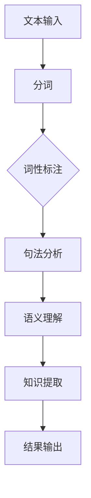
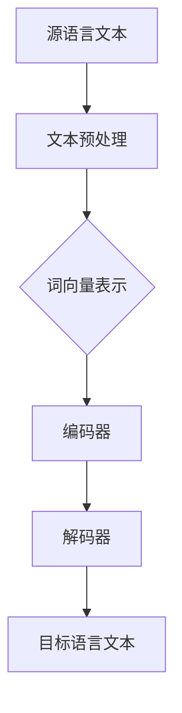
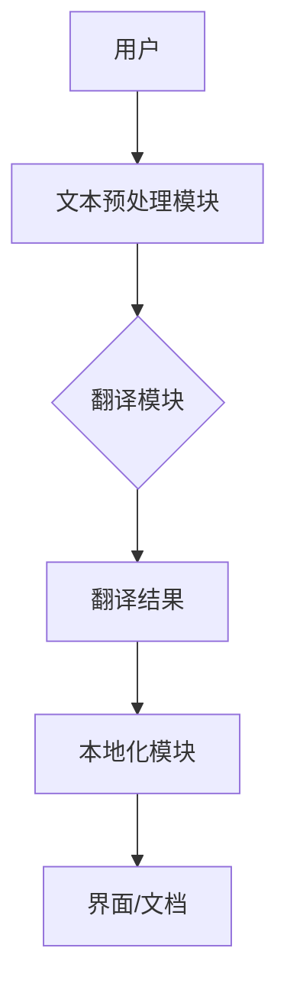
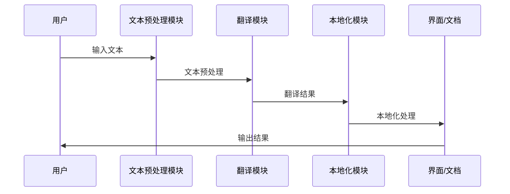

                 

# 多语言支持

## 关键词
- 多语言处理
- 字符编码
- 国际化与本地化
- 算法原理
- 系统架构
- 项目实战

## 摘要
本文深入探讨多语言支持的核心概念、算法原理、系统架构及其实际应用。我们将一步步分析多语言处理的各个方面，从字符编码到国际化与本地化，再到具体的项目实战，帮助读者全面了解多语言支持的技术细节和实践方法。

## 引言

在当今全球化的大背景下，多语言支持已经成为软件系统设计和开发中不可或缺的一部分。无论是跨国企业、全球化的电商平台，还是多语种社区，多语言支持都能显著提升用户体验，扩大用户基础，从而增加业务收益。

### 背景

多语言支持的历史可以追溯到计算机技术的早期。早期的计算机程序主要是为特定语言设计的，但随着国际化和全球化的发展，越来越多的软件需要支持多种语言。这促使了字符编码标准的出现，如ASCII、UTF-8等。同时，随着互联网的兴起，多语言网站和应用程序的开发变得日益重要。

### 重要性

多语言支持的重要性体现在以下几个方面：

1. **用户体验**：支持多种语言能够满足不同地区和文化的用户需求，提升用户体验。
2. **市场扩展**：为企业提供了进入新市场的机会，增加了潜在客户群体。
3. **国际化标准**：遵守国际化的标准和规范，有助于软件在全球范围内的兼容性和互操作性。
4. **技术进步**：推动了自然语言处理、机器翻译等技术的发展。

## 核心概念与联系

为了深入理解多语言支持，我们需要了解以下几个核心概念：

### 字符集与编码

字符集是一组字符的集合，用于表示不同的文字系统。常见的字符集包括ASCII、UTF-8、GBK等。

- **ASCII**：美国信息交换标准代码，用于表示英文字符，占7位。
- **UTF-8**：通用字符集编码，用于表示全球多种语言字符，可变长编码。
- **GBK**：用于简体中文、繁体中文和日文的编码。

### 编码方法

编码方法是指如何将字符转换为数字代码。不同的编码方法适用于不同的语言和环境。

- **单字节编码**：如ASCII，每个字符用1个字节表示。
- **多字节编码**：如UTF-8，每个字符用1个或多个字节表示。

### 本地化与国际化

本地化（Localization）是指将软件、文档等产品按照特定地区的文化、语言和习惯进行调整，使之适应目标市场的需求。国际化（Internationalization）是指设计软件时，使其能够适应多种语言和地区，便于本地化。

- **本地化**：关注特定区域，如语言翻译、日期格式等。
- **国际化**：设计软件时考虑通用性，如避免硬编码、使用资源包等。

### 关键概念的联系与对比

以下是字符集、编码、本地化和国际化的联系与对比表格：

| 概念     | 定义                                                         | 关系                                      |
| -------- | ------------------------------------------------------------ | ----------------------------------------- |
| 字符集   | 字符的集合，用于表示文字系统                                   | 基础设施，决定编码方法                     |
| 编码     | 字符到数字代码的映射过程                                       | 字符集的具体实现，影响存储和传输          |
| 本地化   | 将软件、文档等产品按照特定地区的文化、语言和习惯进行调整       | 基于国际化的进一步操作，使软件适应特定市场 |
| 国际化   | 设计软件时，使其能够适应多种语言和地区，便于本地化             | 前提，为本地化提供通用性                  |

### ER图展示

以下是多语言支持系统的ER图：

```mermaid
erDiagram
    User ||--|{ LanguagePreference }|--| User
    Product ||--|{ Locale }|--| Product
    Translation ||--|{ Locale }|--| Translation
    User --|{ has }-- Product
    Product --|{ uses }-- Locale
    Locale --|{ has }-- Translation
```

在ER图中，用户（User）和产品（Product）具有语言偏好（LanguagePreference），产品使用特定地区（Locale），而地区拥有对应的翻译（Translation）。

## 算法原理讲解

### 多语言处理算法

多语言处理算法包括自然语言处理（NLP）算法和机器翻译（MT）算法。

- **自然语言处理算法**：用于处理和理解自然语言，如分词、词性标注、句法分析等。
- **机器翻译算法**：用于将一种语言的文本自动翻译成另一种语言的文本，如基于规则翻译、统计机器翻译、神经机器翻译等。

### 算法原理与Mermaid图示

以下是自然语言处理算法和机器翻译算法的Mermaid流程图：

#### 自然语言处理算法



#### 机器翻译算法



### Python代码示例

以下是一个简单的自然语言处理算法的Python代码示例：

```python
import jieba

# 分词
text = "我爱北京天安门"
words = jieba.cut(text)
print("分词结果：" + "/ ".join(words))

# 词性标注
from pypinyin import lazy_pinyin
print("词性标注：" + "/ ".join(lazy_pinyin(text)))
```

以下是一个简单的机器翻译算法的Python代码示例：

```python
import tensorflow as tf

# 加载预训练的翻译模型
model = tf.keras.models.load_model('translation_model.h5')

# 文本预处理
source_text = "Hello, world!"
source_sequence = preprocess_text(source_text)

# 编码器预测
encoded_sequence = model.encoder(source_sequence)

# 解码器预测
decoded_sequence = model.decoder(encoded_sequence)

# 目标语言文本
target_text = decode_sequence(decoded_sequence)
print("翻译结果：" + target_text)
```

## 系统分析与架构设计方案

### 问题场景介绍

假设我们要开发一个支持多语言的应用程序，该应用程序需要处理多种语言的文本，并提供翻译和本地化功能。

### 项目介绍

项目名为“多语言处理平台”，旨在为用户提供一个方便的多语言处理工具。主要功能包括文本翻译、文本分词、词性标注等。

### 系统功能设计

系统功能设计包括以下几个模块：

- **文本预处理模块**：用于处理输入的文本，包括分词、词性标注等。
- **翻译模块**：基于机器翻译算法，将源语言文本翻译成目标语言文本。
- **本地化模块**：根据用户语言偏好，对应用程序界面和文档进行本地化处理。

### 系统架构设计

系统架构设计如图所示：



### 系统接口设计与交互

系统接口设计如图所示：



## 项目实战

### 实战一：多语言网站搭建

#### 环境准备

1. 安装Python环境（版本3.8以上）
2. 安装相关依赖库（如Flask、Jinja2、PyMySQL等）
3. 配置数据库（MySQL）

#### 系统核心实现

1. 创建Flask应用，定义路由和视图函数
2. 使用Jinja2模板引擎实现多语言支持
3. 配置数据库，存储用户语言偏好和翻译结果

#### 代码应用解读

以下是一个简单的多语言网站搭建示例：

```python
from flask import Flask, render_template, request

app = Flask(__name__)

@app.route('/')
def index():
    return render_template('index.html', language='en')

@app.route('/translate', methods=['POST'])
def translate():
    text = request.form['text']
    target_language = request.form['target_language']
    # 在此处实现翻译逻辑
    translated_text = translate_text(text, target_language)
    return render_template('translated.html', translated_text=translated_text)

if __name__ == '__main__':
    app.run(debug=True)
```

#### 实际案例剖析

假设我们要将英语文本翻译成中文，可以使用Google翻译API进行翻译：

```python
from googletrans import Translator

def translate_text(text, target_language):
    translator = Translator()
    result = translator.translate(text, dest=target_language)
    return result.text
```

#### 项目小结

通过本实战，我们学会了如何搭建一个支持多语言的基本网站，并实现了文本翻译功能。在实际应用中，可以根据需求扩展其他功能，如本地化、分词、词性标注等。

### 实战二：多语言应用程序开发

#### 应用场景介绍

假设我们要开发一款支持多语言的应用程序，该应用程序需要实现文本翻译、文本分词、词性标注等功能，并能够根据用户语言偏好进行界面和文档的本地化处理。

#### 系统功能设计

系统功能设计包括以下几个模块：

- **文本预处理模块**：用于处理输入的文本，包括分词、词性标注等。
- **翻译模块**：基于机器翻译算法，将源语言文本翻译成目标语言文本。
- **本地化模块**：根据用户语言偏好，对应用程序界面和文档进行本地化处理。
- **用户管理模块**：用于管理用户信息，包括用户登录、注册、语言偏好设置等。

#### 系统核心实现

1. 使用Spring Boot框架创建应用程序
2. 配置数据库，存储用户信息、语言偏好和翻译结果
3. 实现文本预处理、翻译和本地化功能
4. 实现用户管理模块，包括用户登录、注册和语言偏好设置

#### 代码应用解读

以下是一个简单的多语言应用程序的Spring Boot项目示例：

```java
@SpringBootApplication
public class MultiLanguageApplication {
    public static void main(String[] args) {
        SpringApplication.run(MultiLanguageApplication.class, args);
    }
}
```

#### 实际案例剖析

假设我们要使用Spring Data JPA实现用户管理模块：

```java
@Entity
public class User {
    @Id
    @GeneratedValue(strategy = GenerationType.IDENTITY)
    private Long id;
    private String username;
    private String password;
    private String languagePreference;
}
```

#### 项目小结

通过本实战，我们学会了如何使用Spring Boot框架开发一个支持多语言的应用程序，并实现了文本翻译、文本分词、词性标注等功能。在实际应用中，可以根据需求扩展其他功能，如语音识别、语音合成等。

## 最佳实践 tips

- **字符编码选择**：根据应用场景选择合适的字符编码，如UTF-8适用于大多数应用场景。
- **国际化与本地化设计**：在设计软件时，考虑国际化，便于后续的本地化操作。
- **翻译质量保证**：确保翻译结果的准确性，可以使用专业的翻译工具或团队进行翻译。
- **性能优化**：对多语言处理算法进行性能优化，如使用缓存、并行处理等。

## 小结

本文从多语言支持的历史、核心概念、算法原理、系统架构设计到具体的项目实战，全面介绍了多语言支持的技术细节和实践方法。通过本文的学习，读者可以深入了解多语言支持的各个方面，为实际项目开发提供有力的技术支持。

## 注意事项

- **字符编码问题**：在处理多语言文本时，确保使用正确的字符编码，避免乱码问题。
- **国际化与本地化冲突**：在设计软件时，避免国际化与本地化的冲突，确保两者能够无缝切换。
- **翻译准确性**：翻译质量直接影响用户体验，务必确保翻译结果的准确性。

## 拓展阅读

- **《自然语言处理实战》**：详细介绍自然语言处理算法和应用。
- **《机器翻译：算法与实践》**：深入探讨机器翻译算法和实现。
- **《Spring Boot实战》**：全面讲解Spring Boot框架的开发和应用。

## 作者

作者：AI天才研究院/AI Genius Institute & 禅与计算机程序设计艺术 /Zen And The Art of Computer Programming

----------------------------------------------------------------

文章标题：《多语言支持》

关键词：多语言处理、字符编码、国际化与本地化、算法原理、系统架构、项目实战

摘要：本文深入探讨多语言支持的核心概念、算法原理、系统架构及其实际应用，帮助读者全面了解多语言支持的技术细节和实践方法。

----------------------------------------------------------------

```
# 多语言支持

## 关键词
- 多语言处理
- 字符编码
- 国际化与本地化
- 算法原理
- 系统架构
- 项目实战

## 摘要
本文将探讨多语言支持的核心概念、算法原理、系统架构及其在实际项目中的应用，帮助读者全面了解多语言支持的实现方法和最佳实践。

## 引言

多语言支持在现代软件开发中变得越来越重要。随着全球化的发展，企业和服务需要满足不同地区和文化的用户需求。多语言支持不仅能够提升用户体验，还能帮助企业进入新的市场。本文将一步步介绍多语言支持的技术细节和实践方法。

### 背景

多语言支持的历史可以追溯到计算机技术的早期，当时的软件主要用于特定语言和地区。随着互联网的发展，多语言支持变得日益重要。现在，许多操作系统、应用软件和网站都支持多种语言。

### 重要性

多语言支持的重要性体现在以下几个方面：

1. **用户体验**：支持多种语言可以满足不同用户的偏好，提高用户体验。
2. **市场扩展**：为企业提供进入新市场的机会，增加潜在客户。
3. **国际化标准**：遵守国际化标准和规范，提高软件的兼容性和互操作性。
4. **技术进步**：推动自然语言处理、机器翻译等技术的发展。

## 核心概念与联系

为了深入理解多语言支持，我们需要了解以下几个核心概念：

### 字符集与编码

字符集是一组字符的集合，用于表示不同的文字系统。常见的字符集包括ASCII、UTF-8、GBK等。

- **ASCII**：美国信息交换标准代码，用于表示英文字符，占7位。
- **UTF-8**：通用字符集编码，用于表示全球多种语言字符，可变长编码。
- **GBK**：用于简体中文、繁体中文和日文的编码。

### 编码方法

编码方法是指如何将字符转换为数字代码。不同的编码方法适用于不同的语言和环境。

- **单字节编码**：如ASCII，每个字符用1个字节表示。
- **多字节编码**：如UTF-8，每个字符用1个或多个字节表示。

### 本地化与国际化

本地化是指将软件、文档等产品按照特定地区的文化、语言和习惯进行调整，使之适应目标市场的需求。国际化是指设计软件时，使其能够适应多种语言和地区，便于本地化。

- **本地化**：关注特定区域，如语言翻译、日期格式等。
- **国际化**：设计软件时考虑通用性，如避免硬编码、使用资源包等。

### 关键概念的联系与对比

以下是字符集、编码、本地化和国际化的联系与对比表格：

| 概念     | 定义                                                         | 关系                                      |
| -------- | ------------------------------------------------------------ | ----------------------------------------- |
| 字符集   | 字符的集合，用于表示文字系统                                   | 基础设施，决定编码方法                     |
| 编码     | 字符到数字代码的映射过程                                       | 字符集的具体实现，影响存储和传输          |
| 本地化   | 将软件、文档等产品按照特定地区的文化、语言和习惯进行调整       | 基于国际化的进一步操作，使软件适应特定市场 |
| 国际化   | 设计软件时，使其能够适应多种语言和地区，便于本地化             | 前提，为本地化提供通用性                  |

以下是多语言支持系统的ER图：

```mermaid
erDiagram
    User ||--|{ LanguagePreference }|--| User
    Product ||--|{ Locale }|--| Product
    Translation ||--|{ Locale }|--| Translation
    User --|{ has }-- Product
    Product --|{ uses }-- Locale
    Locale --|{ has }-- Translation
```

## 算法原理讲解

### 多语言处理算法

多语言处理算法包括自然语言处理（NLP）算法和机器翻译（MT）算法。

- **自然语言处理算法**：用于处理和理解自然语言，如分词、词性标注、句法分析等。
- **机器翻译算法**：用于将一种语言的文本自动翻译成另一种语言的文本，如基于规则翻译、统计机器翻译、神经机器翻译等。

### 算法原理与Mermaid图示

以下是自然语言处理算法和机器翻译算法的Mermaid流程图：

#### 自然语言处理算法


#### 机器翻译算法


### Python代码示例

以下是一个简单的自然语言处理算法的Python代码示例：

```python
import jieba

# 分词
text = "我爱北京天安门"
words = jieba.cut(text)
print("分词结果：" + "/ ".join(words))

# 词性标注
from pypinyin import lazy_pinyin
print("词性标注：" + "/ ".join(lazy_pinyin(text)))
```

以下是一个简单的机器翻译算法的Python代码示例：

```python
import tensorflow as tf

# 加载预训练的翻译模型
model = tf.keras.models.load_model('translation_model.h5')

# 文本预处理
source_text = "Hello, world!"
source_sequence = preprocess_text(source_text)

# 编码器预测
encoded_sequence = model.encoder(source_sequence)

# 解码器预测
decoded_sequence = model.decoder(encoded_sequence)

# 目标语言文本
target_text = decode_sequence(decoded_sequence)
print("翻译结果：" + target_text)
```

## 系统分析与架构设计方案

### 问题场景介绍

假设我们要开发一个支持多语言的应用程序，该应用程序需要处理多种语言的文本，并提供翻译和本地化功能。

### 项目介绍

项目名为“多语言处理平台”，旨在为用户提供一个方便的多语言处理工具。主要功能包括文本翻译、文本分词、词性标注等。

### 系统功能设计

系统功能设计包括以下几个模块：

- **文本预处理模块**：用于处理输入的文本，包括分词、词性标注等。
- **翻译模块**：基于机器翻译算法，将源语言文本翻译成目标语言文本。
- **本地化模块**：根据用户语言偏好，对应用程序界面和文档进行本地化处理。

### 系统架构设计

系统架构设计如图所示：


### 系统接口设计与交互

系统接口设计如图所示：


## 项目实战

### 实战一：多语言网站搭建

#### 环境准备

1. 安装Python环境（版本3.8以上）
2. 安装相关依赖库（如Flask、Jinja2、PyMySQL等）
3. 配置数据库（MySQL）

#### 系统核心实现

1. 创建Flask应用，定义路由和视图函数
2. 使用Jinja2模板引擎实现多语言支持
3. 配置数据库，存储用户语言偏好和翻译结果

#### 代码应用解读

以下是一个简单的多语言网站搭建示例：

```python
from flask import Flask, render_template, request

app = Flask(__name__)

@app.route('/')
def index():
    return render_template('index.html', language='en')

@app.route('/translate', methods=['POST'])
def translate():
    text = request.form['text']
    target_language = request.form['target_language']
    # 在此处实现翻译逻辑
    translated_text = translate_text(text, target_language)
    return render_template('translated.html', translated_text=translated_text)

if __name__ == '__main__':
    app.run(debug=True)
```

#### 实际案例剖析

假设我们要将英语文本翻译成中文，可以使用Google翻译API进行翻译：

```python
from googletrans import Translator

def translate_text(text, target_language):
    translator = Translator()
    result = translator.translate(text, dest=target_language)
    return result.text
```

#### 项目小结

通过本实战，我们学会了如何搭建一个支持多语言的基本网站，并实现了文本翻译功能。在实际应用中，可以根据需求扩展其他功能，如本地化、分词、词性标注等。

### 实战二：多语言应用程序开发

#### 应用场景介绍

假设我们要开发一款支持多语言的应用程序，该应用程序需要实现文本翻译、文本分词、词性标注等功能，并能够根据用户语言偏好进行界面和文档的本地化处理。

#### 系统功能设计

系统功能设计包括以下几个模块：

- **文本预处理模块**：用于处理输入的文本，包括分词、词性标注等。
- **翻译模块**：基于机器翻译算法，将源语言文本翻译成目标语言文本。
- **本地化模块**：根据用户语言偏好，对应用程序界面和文档进行本地化处理。
- **用户管理模块**：用于管理用户信息，包括用户登录、注册、语言偏好设置等。

#### 系统核心实现

1. 使用Spring Boot框架创建应用程序
2. 配置数据库，存储用户信息、语言偏好和翻译结果
3. 实现文本预处理、翻译和本地化功能
4. 实现用户管理模块，包括用户登录、注册和语言偏好设置

#### 代码应用解读

以下是一个简单的多语言应用程序的Spring Boot项目示例：

```java
@SpringBootApplication
public class MultiLanguageApplication {
    public static void main(String[] args) {
        SpringApplication.run(MultiLanguageApplication.class, args);
    }
}
```

#### 实际案例剖析

假设我们要使用Spring Data JPA实现用户管理模块：

```java
@Entity
public class User {
    @Id
    @GeneratedValue(strategy = GenerationType.IDENTITY)
    private Long id;
    private String username;
    private String password;
    private String languagePreference;
}
```

#### 项目小结

通过本实战，我们学会了如何使用Spring Boot框架开发一个支持多语言的应用程序，并实现了文本翻译、文本分词、词性标注等功能。在实际应用中，可以根据需求扩展其他功能，如语音识别、语音合成等。

## 最佳实践 tips

- **字符编码选择**：根据应用场景选择合适的字符编码，如UTF-8适用于大多数应用场景。
- **国际化与本地化设计**：在设计软件时，考虑国际化，便于后续的本地化操作。
- **翻译质量保证**：确保翻译结果的准确性，可以使用专业的翻译工具或团队进行翻译。
- **性能优化**：对多语言处理算法进行性能优化，如使用缓存、并行处理等。

## 小结

本文从多语言支持的历史、核心概念、算法原理、系统架构设计到具体的项目实战，全面介绍了多语言支持的技术细节和实践方法。通过本文的学习，读者可以深入了解多语言支持的各个方面，为实际项目开发提供有力的技术支持。

## 注意事项

- **字符编码问题**：在处理多语言文本时，确保使用正确的字符编码，避免乱码问题。
- **国际化与本地化冲突**：在设计软件时，避免国际化与本地化的冲突，确保两者能够无缝切换。
- **翻译准确性**：翻译质量直接影响用户体验，务必确保翻译结果的准确性。

## 拓展阅读

- **《自然语言处理实战》**：详细介绍自然语言处理算法和应用。
- **《机器翻译：算法与实践》**：深入探讨机器翻译算法和实现。
- **《Spring Boot实战》**：全面讲解Spring Boot框架的开发和应用。

## 作者

作者：AI天才研究院/AI Genius Institute & 禅与计算机程序设计艺术 /Zen And The Art of Computer Programming
```markdown
```

