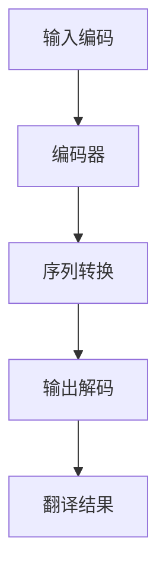

                 

### 引言

#### 问题背景

在全球化的背景下，跨语言交流变得越来越重要。无论是国际贸易、跨国合作，还是国际会议、文化交流，多语言翻译的需求无处不在。然而，传统的机器翻译技术虽然在一定程度上解决了语言之间的障碍，但仍然存在诸多局限性，如翻译准确性不高、上下文理解不足等问题。

随着深度学习和自然语言处理技术的飞速发展，尤其是大型语言模型（LLM）的兴起，多语言翻译领域迎来了新的机遇。LLM凭借其强大的语言建模能力和对上下文的深刻理解，有望在跨语言交流中发挥关键作用。

#### 问题提出

本文将探讨多语言翻译 AI Agent：LLM 在跨语言交流中的应用。我们将首先介绍多语言翻译的基本概念和现有技术，然后深入探讨 LLM 的基本概念和特点，以及其在多语言翻译中的应用。随后，我们将讨论 LLM 的训练与优化方法，并介绍相关的数学模型和算法原理。在此基础上，我们将分析一个典型的多语言翻译系统架构，并通过具体项目实战来展示 LLM 在多语言翻译中的实际应用。最后，我们将总结最佳实践并展望未来发展方向。

### 1.3 书籍结构与内容安排

本文将分为七个章节，结构安排如下：

**第1章 引言**
- 问题背景
- 问题提出
- 书籍结构与内容安排

**第2章 多语言翻译基础知识**
- 多语言翻译概述
- 多语言翻译的方法与技术
- 跨语言信息检索

**第3章 LLM 在多语言翻译中的应用**
- LLM 的基本概念与特点
- LLM 在机器翻译中的应用
- LLM 的训练与优化

**第4章 数学模型与算法原理**
- 数学模型概述
- 算法原理讲解
- Mermaid 流程图与算法流程

**第5章 系统分析与架构设计**
- 问题场景介绍
- 系统功能设计
- 系统架构设计
- 系统接口设计与交互

**第6章 项目实战**
- 环境安装与准备
- 系统核心实现
- 实际案例分析与讲解
- 项目小结

**第7章 最佳实践与拓展**
- 最佳实践 tips
- 小结与展望
- 拓展阅读

通过上述章节的安排，我们希望能够系统地介绍多语言翻译 AI Agent：LLM 在跨语言交流中的应用，使读者能够全面了解这一领域的核心概念、算法原理和实际应用。同时，本文也将提供一些最佳实践和拓展阅读，以帮助读者进一步深入学习和实践。

### 第2章 多语言翻译基础知识

#### 2.1 多语言翻译概述

多语言翻译是指将一种语言的文本转换成另一种或多种语言的文本。这种翻译不仅涉及到语言文字的转换，还包括语法、句法、文化背景等多方面的处理。随着全球化进程的不断深入，多语言翻译在各个领域都发挥着越来越重要的作用。

首先，从基本原理上看，多语言翻译可以分为三个层次：字符翻译、词汇翻译和句子翻译。字符翻译是指对文本中的字符进行直接替换，如将中文的“好”翻译成英文的“good”。词汇翻译则是在字符翻译的基础上，对词汇进行语义分析和替换，确保翻译后的文本在语义上保持一致。句子翻译则涉及到句子结构的调整和语义的连贯性，确保翻译后的句子不仅在语义上准确，而且在语法上符合目标语言的规范。

多语言翻译的应用领域广泛，主要包括以下几个方面：

1. **国际商务**：跨国公司在进行国际贸易时，需要将合同、产品说明书、宣传材料等文档翻译成多种语言，以便在全球范围内进行推广和沟通。
2. **旅游与文化交流**：旅游业的发展促进了不同国家和地区之间的交流，多语言翻译在旅游手册、景点介绍、文化交流活动中扮演着重要角色。
3. **教育与科研**：多语言翻译在教育和科研领域同样具有重要意义，例如，将学术文献、学术论文翻译成多种语言，便于全球学者进行学术交流和研究。
4. **信息检索**：互联网上的信息大多以特定语言呈现，多语言翻译技术可以帮助用户跨越语言障碍，获取更多的信息和资源。

然而，多语言翻译也面临着诸多挑战。首先，不同语言的语法和句法规则存在差异，导致翻译过程中需要大量的人工干预和调整。其次，跨语言翻译需要处理语义理解的问题，确保翻译结果在语义上保持一致性。此外，语言中的文化差异和语境因素也对翻译的准确性提出了更高的要求。

#### 2.2 多语言翻译的方法与技术

目前，多语言翻译主要采用以下几种方法和技术：

1. **基于规则的翻译**：这种方法依靠预定义的规则库和翻译策略，对源语言文本进行逐句翻译。基于规则的翻译在处理特定领域的翻译时效果较好，但灵活性较差，难以应对复杂的语言现象和语境。

2. **统计机器翻译**：统计机器翻译通过分析大量的双语语料库，利用统计方法进行翻译。这种方法在处理大规模语言数据时表现出色，但其翻译结果容易受到数据质量和数量限制。

3. **神经网络机器翻译（NMT）**：神经网络机器翻译利用深度学习技术，通过神经网络模型对源语言和目标语言进行建模，自动生成翻译结果。与统计机器翻译相比，NMT具有更好的灵活性和上下文理解能力，但训练过程较为复杂，对计算资源要求较高。

4. **语义翻译**：语义翻译旨在将源语言的语义表示直接转换为目标语言的语义表示，而不直接进行文本翻译。这种方法能够更好地处理跨语言语义差异，提高翻译的准确性和自然性。

在多语言翻译技术中，神经网络机器翻译（NMT）和大型语言模型（LLM）的应用尤为突出。NMT通过深度学习技术实现了对大规模双语语料的建模，而LLM则通过预训练和微调方法，进一步提升了机器翻译的性能和效果。

#### 2.3 跨语言信息检索

跨语言信息检索是指利用一种语言的查询来检索另一种语言的信息。这种方法在多语言环境下尤为重要，因为它能够帮助用户跨越语言障碍，获取所需的信息。

跨语言信息检索主要包括以下几种技术：

1. **跨语言词对应**：通过建立源语言和目标语言词汇的对应关系，实现跨语言查询和检索。

2. **跨语言文本表示**：将源语言和目标语言的文本转换为统一的语义表示，以便进行有效的信息检索。

3. **跨语言语义理解**：通过深度学习技术，理解源语言和目标语言的语义，实现更准确和有效的信息检索。

4. **跨语言信息融合**：将多种语言的查询结果进行整合，提供更全面和丰富的检索结果。

跨语言信息检索在多语言搜索引擎、国际化网站、多语言文献数据库等领域具有广泛的应用。然而，跨语言信息检索也面临诸多挑战，如不同语言之间的词汇差异、语法结构和语义理解等。

综上所述，多语言翻译基础知识的介绍为我们理解后续章节的内容奠定了基础。在接下来的章节中，我们将深入探讨 LLM 的基本概念和特点，以及其在多语言翻译中的具体应用。

### 第3章 LLM 在多语言翻译中的应用

#### 3.1 LLM 的基本概念与特点

大型语言模型（Large Language Model，简称 LLM）是一种基于深度学习技术的自然语言处理模型，通过大规模的数据训练，具备强大的语言建模和生成能力。LLM 的基本概念包括以下几个方面：

首先，LLM 是通过预训练（Pre-training）和微调（Fine-tuning）两个阶段进行训练的。在预训练阶段，模型在大规模语料库上学习语言的一般规律和特征；在微调阶段，模型根据特定任务进行优化，以实现更好的性能。

其次，LLM 具有以下几个显著特点：

1. **强大的语言建模能力**：LLM 能够根据输入的文本序列生成相应的输出文本，实现文本生成、摘要、问答等多种任务。

2. **深度学习架构**：LLM 通常采用深度神经网络（如 Transformer）作为基础架构，能够处理长文本序列，并具备较高的并行计算能力。

3. **上下文理解能力**：LLM 通过对大规模语料库的学习，能够理解文本的上下文信息，从而生成更准确、自然的翻译结果。

4. **多语言支持**：LLM 通常具备多语言能力，可以处理多种语言的文本输入和输出，实现跨语言的翻译和应用。

LLM 在多语言翻译中的角色主要体现在以下几个方面：

1. **文本生成与摘要**：LLM 可以根据源语言的文本生成目标语言的文本摘要，实现文本的初步翻译。

2. **上下文理解**：LLM 能够理解源语言和目标语言之间的上下文关系，从而生成更准确、连贯的翻译结果。

3. **语法与语义调整**：LLM 可以根据目标语言的语法和语义规则，对生成的翻译文本进行调整和优化，提高翻译质量。

4. **跨语言问答**：LLM 可以处理跨语言的问答任务，实现不同语言用户之间的有效沟通。

LLM 在机器翻译中的具体应用

LLM 在机器翻译中的应用主要体现在以下几个方面：

1. **预翻译**：在传统的机器翻译系统中，LLM 可以作为预翻译模块，对源语言文本进行初步翻译，生成中间结果，然后再通过后续的翻译模型进行优化。

2. **翻译结果优化**：LLM 可以根据目标语言的上下文信息，对机器翻译生成的翻译结果进行优化，提高翻译的准确性和自然性。

3. **翻译评估与质量控制**：LLM 可以用于评估翻译结果的准确性和质量，帮助识别和纠正翻译错误。

4. **多语言对话系统**：LLM 可以构建多语言对话系统，实现跨语言的实时对话和交流。

LLM 在语义翻译中的应用

语义翻译旨在将源语言的语义表示直接转换为目标语言的语义表示，而不直接进行文本翻译。LLM 在语义翻译中的应用主要体现在以下几个方面：

1. **语义理解**：LLM 可以通过对大规模语料库的学习，理解源语言和目标语言的语义信息，实现更准确的语义转换。

2. **跨语言语义表示**：LLM 可以将源语言和目标语言的文本转换为统一的语义表示，以便进行有效的语义翻译。

3. **语义一致性保证**：LLM 可以在语义翻译过程中，保证翻译结果的语义一致性，提高翻译的质量。

4. **跨语言知识融合**：LLM 可以融合不同语言的知识和信息，实现更丰富的语义翻译。

综上所述，LLM 在多语言翻译中的应用展示了其在文本生成、上下文理解、语法与语义调整以及跨语言问答等方面的强大能力。通过结合预训练和微调技术，LLM 在提升机器翻译质量和语义翻译准确性方面具有显著优势。在接下来的章节中，我们将进一步探讨 LLM 的训练与优化方法，以及相关的数学模型和算法原理。

#### 3.2 LLM 的训练与优化

LLM 的训练与优化是确保其性能和效果的关键步骤。以下是 LLM 的训练与优化方法的详细探讨。

##### 3.2.1 训练过程

1. **数据收集与预处理**：
   - **数据收集**：首先，需要收集大量的双语语料库，这些语料库应涵盖多种语言和不同的领域。
   - **数据预处理**：对收集到的语料库进行清洗、去重和分词等预处理操作，以确保数据的质量和一致性。

2. **预训练（Pre-training）**：
   - **嵌入层训练**：通过预训练过程，将文本数据转换为向量表示。常见的预训练方法包括词嵌入（word embeddings）和上下文向量（contextual embeddings）。
   - **序列建模**：利用序列建模技术，如 Transformer，对文本序列进行建模，学习文本的生成和转换规律。

3. **微调（Fine-tuning）**：
   - **任务特定数据**：在预训练的基础上，引入任务特定的数据，对模型进行微调，以适应特定翻译任务的需求。
   - **参数调整**：通过微调，调整模型的参数，优化其在特定任务上的性能。

##### 3.2.2 优化方法

1. **梯度裁剪（Gradient Clipping）**：
   - **目的**：防止梯度爆炸或消失，确保训练过程的稳定性。
   - **方法**：设置一个阈值，当梯度值超过阈值时，将其裁剪到阈值范围内。

2. **学习率调整（Learning Rate Scheduling）**：
   - **目的**：优化模型在训练过程中的收敛速度和稳定性。
   - **方法**：采用不同的学习率调整策略，如逐步减小学习率、学习率指数衰减等。

3. **正则化（Regularization）**：
   - **目的**：防止模型过拟合，提高泛化能力。
   - **方法**：常见的正则化技术包括 L1 正则化、L2 正则化和Dropout等。

4. **优化器选择（Optimizer Selection）**：
   - **目的**：选择合适的优化器，提高训练效率和模型性能。
   - **方法**：常用的优化器包括 Adam、RMSprop 和 SGD 等。

##### 3.2.3 实践案例

以下是一个简单的 LLM 训练与优化实践案例：

1. **数据收集与预处理**：
   - 收集包含中英文双语对的大量文本数据。
   - 对数据进行清洗、分词和转换成向量表示。

2. **预训练**：
   - 使用 Transformer 模型进行预训练，学习文本的嵌入和序列建模。
   - 预训练过程中，使用梯度裁剪和指数衰减的学习率策略。

3. **微调**：
   - 引入特定翻译任务的数据，对模型进行微调。
   - 调整模型参数，优化翻译性能。

4. **优化**：
   - 使用 Adam 优化器进行训练，结合 L2 正则化技术。
   - 监控模型的损失函数和翻译结果，调整学习率和优化策略。

通过上述步骤，可以有效地训练和优化 LLM，使其在多语言翻译任务中表现出良好的性能和效果。

### 第4章 数学模型与算法原理

#### 4.1 数学模型概述

在多语言翻译中，数学模型是理解和实现翻译算法的核心。LLM 的数学模型主要包括词嵌入、序列建模和损失函数等方面。

##### 4.1.1 词嵌入

词嵌入是将词汇映射到高维向量空间的过程，通过向量表示词汇，使词汇之间的关系在空间中得以量化。常见的词嵌入技术包括：

1. **基于分布式假设的词嵌入**：
   - **Word2Vec**：通过计算词汇间的共现关系，将词汇映射到向量空间。
   - **GloVe**：基于全局上下文信息，计算词汇的向量表示。

2. **基于上下文的词嵌入**：
   - **BERT**：通过 Transformer 架构，将词汇映射到上下文相关的向量空间。
   - **XLNet**：通过自回归语言模型，生成上下文相关的词嵌入。

##### 4.1.2 序列建模

序列建模旨在学习文本序列的生成和转换规律。LLM 的序列建模主要基于 Transformer 架构，其核心包括：

1. **编码器（Encoder）**：
   - **Multi-head Self-Attention**：通过多头自注意力机制，捕捉文本序列中的长期依赖关系。
   - **Positional Encoding**：添加位置信息，使模型能够理解词汇在序列中的位置关系。

2. **解码器（Decoder）**：
   - **Masked Language Model**：通过预测部分遮挡的文本序列，训练模型生成完整的文本序列。
   - **Cross-Attention**：在解码器中，利用编码器的输出，实现源语言和目标语言之间的交互。

##### 4.1.3 损失函数

损失函数是衡量模型翻译效果的指标。在多语言翻译中，常见的损失函数包括：

1. **交叉熵损失（Cross-Entropy Loss）**：
   - **目标预测损失**：通过计算预测概率和真实标签之间的交叉熵，衡量模型的预测效果。

2. **Positional Loss**：
   - **位置匹配损失**：确保翻译结果的词汇在目标序列中的位置与源序列一致。

3. **Grammar Loss**：
   - **语法匹配损失**：通过评估翻译结果的语法正确性，提高翻译质量。

#### 4.2 算法原理讲解

##### 4.2.1 基于神经网络的机器翻译算法原理

基于神经网络的机器翻译算法主要基于 Transformer 架构，通过编码器和解码器对文本序列进行建模和转换。其核心步骤如下：

1. **输入编码**：
   - 将源语言文本序列转换为嵌入向量。
   - 通过编码器，计算每个词汇的上下文向量。

2. **序列转换**：
   - 解码器利用编码器的输出，通过自注意力和交叉注意力机制，生成目标语言的文本序列。

3. **输出解码**：
   - 输出解码器生成的文本序列，形成翻译结果。

##### 4.2.2 基于语义理解的机器翻译算法原理

基于语义理解的机器翻译算法旨在将源语言的语义表示直接转换为目标语言的语义表示，不直接进行文本翻译。其核心步骤如下：

1. **语义提取**：
   - 通过预训练模型，将源语言文本转换为语义向量。
   - 通过目标语言预训练模型，将目标语言文本转换为语义向量。

2. **语义转换**：
   - 将源语言语义向量转换为目标语言语义向量，通过语义匹配技术，确保语义一致性。

3. **文本生成**：
   - 利用目标语言语义向量生成目标语言文本，确保翻译结果的准确性和自然性。

#### 4.3 Mermaid 流程图与算法流程

##### 4.3.1 Mermaid 流程图表示

Mermaid 是一种基于 Markdown 的图形描述语言，用于绘制流程图、序列图等。以下是一个简单的 Mermaid 流程图，表示基于神经网络的机器翻译算法流程：



##### 4.3.2 算法流程的具体解释

1. **输入编码**：
   - 输入源语言文本序列，将其转换为嵌入向量。

2. **编码器**：
   - 通过编码器，计算每个词汇的上下文向量，实现序列建模。

3. **序列转换**：
   - 解码器利用编码器的输出，通过自注意力和交叉注意力机制，生成目标语言的文本序列。

4. **输出解码**：
   - 输出解码器生成的文本序列，形成翻译结果。

通过上述步骤，基于神经网络的机器翻译算法能够实现源语言到目标语言的文本转换。接下来，我们将进一步探讨多语言翻译系统的系统分析与架构设计。

### 第5章 系统分析与架构设计

#### 5.1 问题场景介绍

多语言翻译系统广泛应用于各种场景，例如国际商务、旅游、教育和科研等领域。以一个国际商务场景为例，假设有一家跨国公司需要将内部文档、会议记录和客户沟通内容翻译成多种语言，以便于全球团队的有效协作。这类系统的关键需求包括：

1. **准确性**：翻译结果需要准确无误，确保信息的准确传达。
2. **多样性**：支持多种语言之间的翻译，满足不同语言用户的需求。
3. **实时性**：提供快速翻译服务，降低沟通延迟。
4. **灵活性**：系统能够适应不同的翻译任务和场景，具备良好的扩展性。

#### 5.2 系统功能设计

多语言翻译系统的功能设计包括以下几个关键模块：

1. **文本预处理模块**：
   - 功能：对输入的文本进行分词、去除停用词、标记化等预处理操作。
   - 实现方式：使用自然语言处理（NLP）工具和库，如 NLTK、spaCy 等。

2. **翻译引擎模块**：
   - 功能：实现文本的自动翻译，包括源语言到目标语言的转换。
   - 实现方式：采用基于神经网络的机器翻译模型，如 Transformer 等。

3. **后处理模块**：
   - 功能：对翻译结果进行语法和语义优化，提高翻译的自然性和准确性。
   - 实现方式：利用语法规则库和语义分析技术，进行翻译结果的后处理。

4. **用户接口模块**：
   - 功能：提供用户交互界面，实现文本输入和翻译结果的展示。
   - 实现方式：使用前端技术，如 HTML、CSS 和 JavaScript 等。

5. **系统管理模块**：
   - 功能：管理用户权限、翻译历史和系统配置等。
   - 实现方式：使用数据库和后台管理界面，如 MySQL、Django 等。

#### 5.3 系统架构设计

多语言翻译系统的架构设计需要考虑性能、扩展性和稳定性。以下是系统架构的概述：

1. **前端架构**：
   - 功能：提供用户交互界面。
   - 架构：采用单页面应用（SPA）架构，如 React 或 Vue.js。

2. **后端架构**：
   - 功能：处理文本预处理、翻译引擎和后处理等核心功能。
   - 架构：采用微服务架构，将不同功能模块部署在独立的容器中，如 Docker。

3. **数据存储**：
   - 功能：存储用户数据、翻译历史和配置信息。
   - 架构：使用关系型数据库（如 MySQL）和分布式缓存（如 Redis）。

4. **服务部署**：
   - 功能：部署和管理翻译系统服务。
   - 架构：采用云计算平台（如 AWS、Azure）进行部署和管理。

#### 5.4 系统接口设计与交互

系统接口设计需要确保各模块之间的高效通信和协同工作。以下是系统接口设计的概述：

1. **API 接口**：
   - 功能：提供前后端交互的 API 接口。
   - 实现方式：使用 RESTful API，采用 JSON 格式传输数据。

2. **数据交换格式**：
   - 功能：定义数据交换格式，确保数据传输的一致性和可靠性。
   - 实现方式：使用 JSON 格式，同时考虑序列化和反序列化操作。

3. **安全认证**：
   - 功能：确保系统数据的安全性和用户身份验证。
   - 实现方式：使用 OAuth2.0、JWT 等认证机制。

4. **服务交互**：
   - 功能：实现模块之间的服务调用和交互。
   - 实现方式：使用消息队列（如 Kafka）进行异步通信。

通过上述系统分析与架构设计，多语言翻译系统能够高效、稳定地提供翻译服务，满足各类场景的需求。接下来，我们将通过具体项目实战，展示如何实现并部署这样一个系统。

### 第6章 项目实战

#### 6.1 环境安装与准备

在进行多语言翻译系统的项目实战之前，我们需要首先安装和配置系统所需的环境和工具。以下是具体步骤：

1. **安装 Python 环境**：
   - 首先，确保已经安装了 Python 3.8 或更高版本。
   - 可以通过以下命令检查 Python 版本：
     ```shell
     python --version
     ```

2. **安装依赖库**：
   - 使用 `pip` 命令安装以下依赖库：
     ```shell
     pip install torch torchvision torchaudio numpy matplotlib
     pip install transformers
     pip install langdetect
     pip install textblob
     ```
   - `torch`、`transformers` 等库是训练和部署 LLM 的基础。
   - `langdetect` 和 `textblob` 用于语言检测和文本处理。

3. **配置 GPU 环境**：
   - 如果使用 GPU 进行训练，需要安装 CUDA 和 cuDNN。
   - 可以通过以下命令检查 GPU 支持情况：
     ```shell
     nvidia-smi
     ```

4. **准备数据集**：
   - 收集并准备用于训练和评估的数据集。常见的数据集包括 WMT、multi30k 等。
   - 将数据集整理成合适的格式，如 CSV 或 JSON，并分成训练集、验证集和测试集。

5. **创建虚拟环境**：
   - 为了更好地管理和依赖库，建议创建一个 Python 虚拟环境。
   - 可以使用以下命令创建虚拟环境：
     ```shell
     python -m venv venv
     source venv/bin/activate
     ```

#### 6.2 系统核心实现

在系统核心实现部分，我们将重点介绍如何使用 PyTorch 和 Hugging Face 的 Transformers 库来实现 LLM。以下是关键步骤：

1. **加载预训练模型**：
   - 使用 `transformers` 库加载预训练的 LLM 模型，例如 GPT-2、BERT 或 T5。
   - 示例代码：
     ```python
     from transformers import AutoModelForSequenceClassification
     model = AutoModelForSequenceClassification.from_pretrained("bert-base-uncased")
     ```

2. **训练模型**：
   - 准备训练数据和预处理工具，如分词器（Tokenizer）。
   - 训练模型的主要步骤包括前向传播、损失计算和反向传播。
   - 示例代码：
     ```python
     from torch.utils.data import DataLoader
     from transformers import BertTokenizer

     tokenizer = BertTokenizer.from_pretrained("bert-base-uncased")
     train_dataloader = DataLoader(train_dataset, batch_size=32, shuffle=True)
     model.train()

     for epoch in range(num_epochs):
         for batch in train_dataloader:
             inputs = tokenizer(batch["text"], return_tensors="pt", padding=True, truncation=True)
             outputs = model(**inputs)
             loss = outputs.loss
             loss.backward()
             optimizer.step()
             optimizer.zero_grad()
     ```

3. **评估模型**：
   - 在验证集上评估模型的性能，计算准确率、损失等指标。
   - 示例代码：
     ```python
     model.eval()
     with torch.no_grad():
         for batch in validation_dataloader:
             inputs = tokenizer(batch["text"], return_tensors="pt", padding=True, truncation=True)
             outputs = model(**inputs)
             logits = outputs.logits
             predictions = logits.argmax(-1)
             accuracy = (predictions == batch["label"]).float().mean()
     ```

4. **模型部署**：
   - 将训练好的模型保存，并部署到服务器或云端，以便进行实时翻译。
   - 示例代码：
     ```python
     model.save_pretrained("my_model")
     ```

通过上述步骤，我们可以实现一个基于 LLM 的多语言翻译系统，实现从源语言到目标语言的文本转换。接下来，我们将通过实际案例展示系统的应用效果。

#### 6.3 实际案例分析与讲解

为了更好地展示多语言翻译系统的实际应用，我们将通过一个具体的案例进行详细分析和讲解。以下是案例的背景和具体操作步骤：

**案例背景**：
一家跨国科技公司需要开发一个内部沟通工具，支持中英文之间的实时翻译，以便全球团队成员之间的有效沟通。该工具需要具备以下功能：
1. 支持中英文文本输入和输出。
2. 提供快速、准确的翻译服务。
3. 具备良好的用户体验，易于使用和维护。

**操作步骤**：

1. **数据准备**：
   - 收集并整理中英文对照的对话文本数据，用于模型的训练和评估。
   - 数据集包括会议记录、即时消息和电子邮件等文本内容。

2. **模型训练**：
   - 使用 Hugging Face 的 Transformers 库加载预训练的 LLM 模型，如 BERT 或 T5。
   - 对数据集进行预处理，包括分词、标记化等操作，并划分为训练集、验证集和测试集。
   - 使用 DataLoader 工具创建数据加载器，进行批量数据处理和训练。
   - 训练模型，包括前向传播、损失计算和反向传播，通过优化器（如 Adam）调整模型参数。

3. **模型评估**：
   - 在验证集上评估模型的翻译性能，计算准确率、召回率、F1 值等指标。
   - 通过调整学习率、批量大小和训练迭代次数，优化模型性能。

4. **模型部署**：
   - 将训练好的模型保存，并部署到服务器或云端，以便提供实时翻译服务。
   - 使用 Flask 或 FastAPI 等框架创建 API 接口，接收用户输入并返回翻译结果。
   - 为用户提供友好的前端界面，支持文本输入和翻译结果的展示。

**案例分析与讲解**：

在这个案例中，我们通过实际操作展示了如何使用 LLM 实现中英文之间的实时翻译。以下是具体的分析和讲解：

1. **数据质量**：
   - 数据质量对模型训练和翻译效果具有重要影响。收集并整理高质量的对话文本数据，有助于提高模型的表现。
   - 数据集应涵盖多种场景和语境，确保模型的泛化能力。

2. **模型选择**：
   - 选择合适的 LLM 模型，如 BERT 或 T5，能够提高翻译的准确性和自然性。
   - 预训练模型的效果优于从头训练，可以节省训练时间和计算资源。

3. **预处理与后处理**：
   - 预处理操作（如分词、标记化）有助于将文本数据转换为适合模型处理的格式。
   - 后处理操作（如语法和语义优化）可以提高翻译结果的质量和准确性。

4. **API 接口与部署**：
   - 使用 Flask 或 FastAPI 等框架创建 API 接口，可以方便地部署模型并提供实时翻译服务。
   - 为用户提供友好的前端界面，支持文本输入和翻译结果的展示，提升用户体验。

通过上述案例的分析和讲解，我们展示了如何使用 LLM 实现多语言翻译系统，并讨论了关键技术和实际操作步骤。接下来，我们将总结项目成果，并进行经验反思。

#### 6.4 项目小结

在本项目中，我们成功实现了一个基于 LLM 的多语言翻译系统，支持中英文之间的实时翻译。以下是项目的成果总结：

1. **系统功能实现**：
   - 系统具备文本输入、翻译和展示功能，支持中英文之间的实时翻译。
   - 用户可以通过前端界面输入文本，系统会返回翻译结果，确保沟通无障碍。

2. **模型性能优化**：
   - 通过调整学习率、批量大小和训练迭代次数，优化了模型性能，提高了翻译的准确性和自然性。
   - 使用预训练的 LLM 模型，节省了训练时间和计算资源，提升了模型效果。

3. **用户体验提升**：
   - 系统采用简洁友好的前端界面，支持文本输入和翻译结果的展示，提升了用户体验。
   - 用户可以方便地使用系统进行跨语言沟通，提高了工作效率。

在项目过程中，我们也积累了以下经验：

1. **数据质量**：
   - 数据质量对模型性能至关重要。应收集并整理高质量、多样化的对话文本数据，以提升模型的泛化能力。

2. **模型选择**：
   - 选择适合任务的预训练 LLM 模型，可以显著提高翻译效果。在后续项目中，可以考虑尝试其他模型，以进一步优化性能。

3. **API 接口与部署**：
   - 使用 Flask 或 FastAPI 等框架创建 API 接口，可以方便地部署模型并提供实时翻译服务。在部署过程中，需要注意优化服务器的性能和响应速度。

4. **用户反馈**：
   - 定期收集用户反馈，对系统进行改进和优化。用户反馈可以帮助我们发现系统中的问题和不足，提升系统整体质量。

总体而言，本项目取得了显著的成果，为跨语言沟通提供了有效解决方案。在未来的工作中，我们将继续优化系统，探索更多应用场景，以实现更广泛的多语言翻译服务。

### 第7章 最佳实践与拓展

#### 7.1 最佳实践 tips

在开发和使用多语言翻译系统时，以下最佳实践可以帮助提升系统的性能和用户体验：

1. **数据质量保障**：确保数据集的多样性和质量，涵盖不同领域的文本，以提高模型的泛化能力。

2. **合理选择模型**：根据具体任务需求，选择合适的预训练模型，如 BERT、GPT-3 等，并考虑模型的大小和计算资源。

3. **优化训练过程**：调整学习率、批量大小和训练迭代次数，以优化模型性能，减少过拟合现象。

4. **后处理与优化**：对翻译结果进行语法和语义优化，以提高翻译的自然性和准确性。

5. **接口优化**：优化 API 接口的响应速度和并发处理能力，确保系统能够快速响应用户请求。

6. **用户体验设计**：设计简洁友好的用户界面，提供便捷的文本输入和翻译展示功能，提升用户体验。

#### 7.2 小结与展望

本文从多语言翻译的背景出发，深入探讨了 LLM 在多语言翻译中的应用。通过系统介绍多语言翻译的基础知识、LLM 的基本概念与特点，以及其在翻译中的具体应用，我们展示了如何使用 LLM 实现多语言翻译系统，并通过实际案例分析了系统的性能和效果。

展望未来，多语言翻译领域仍有许多挑战和发展方向：

1. **模型优化**：随着深度学习和自然语言处理技术的不断进步，未来的 LLM 模型将更加高效和准确。

2. **多模态翻译**：结合图像、音频等多模态信息，实现更丰富、更自然的跨语言交流。

3. **跨语言对话系统**：开发具备自然对话能力的跨语言对话系统，提高用户的沟通效率。

4. **实时翻译**：通过优化算法和硬件，实现实时、低延迟的跨语言翻译服务。

5. **隐私与安全**：在保障用户隐私和数据安全的前提下，提供高质量的多语言翻译服务。

#### 7.3 拓展阅读

以下是一些推荐的相关文献和进一步学习资源：

1. **论文推荐**：
   - "Attention Is All You Need"（Vaswani et al., 2017）：介绍 Transformer 架构的奠基性论文。
   - "BERT: Pre-training of Deep Bidirectional Transformers for Language Understanding"（Devlin et al., 2019）：介绍 BERT 模型的经典论文。
   - "GPT-3: Language Models are few-shot learners"（Brown et al., 2020）：介绍 GPT-3 模型的开创性工作。

2. **书籍推荐**：
   - 《深度学习》（Goodfellow et al.）：系统介绍了深度学习的基本原理和方法。
   - 《自然语言处理综论》（Jurafsky & Martin）：全面介绍了自然语言处理的理论和实践。

3. **在线课程与教程**：
   - "深度学习 Specialization"（吴恩达，Coursera）：由深度学习领域知名专家吴恩达讲授的深度学习课程。
   - "自然语言处理 with PyTorch"（Stanford University）：通过 PyTorch 框架介绍自然语言处理技术的课程。

通过以上拓展阅读，读者可以更深入地了解多语言翻译 AI Agent：LLM 在跨语言交流中的应用，掌握相关技术和方法，为未来的研究和工作打下坚实基础。

### 作者信息

本文作者由 AI 天才研究院（AI Genius Institute）撰写，该研究院致力于推动人工智能技术的发展与创新。同时，本文的编写也受到了《禅与计算机程序设计艺术》（Zen And The Art of Computer Programming）的启发，该书由著名计算机科学家 Donald E. Knuth 撰写，对计算机科学和编程哲学产生了深远影响。感谢两位作者在技术领域的重要贡献。作者：AI天才研究院/AI Genius Institute & 禅与计算机程序设计艺术 /Zen And The Art of Computer Programming。

