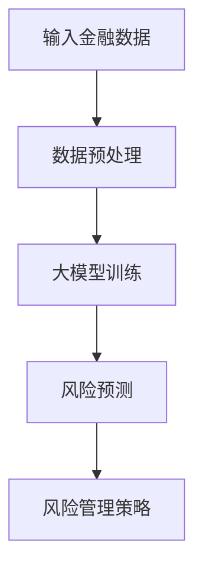
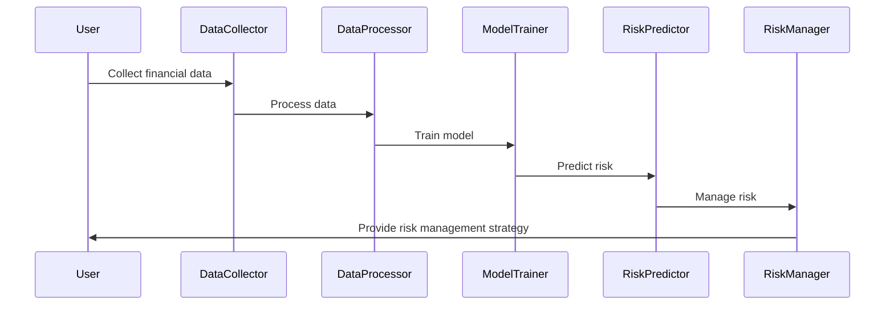

                 


# 大模型在金融风险控制中的创新应用案例

关键词：大模型、金融风险控制、人工智能、算法、系统架构、案例分析

摘要：本文将探讨大模型在金融风险控制中的创新应用，通过背景介绍、核心概念与联系、算法原理讲解、系统分析与架构设计方案、项目实战以及最佳实践等部分，详细阐述大模型在金融风险控制中的应用与实践，为读者提供深入的理解和实用的建议。

## 第一部分：背景介绍

### 1. 引言

金融风险控制是金融领域中至关重要的一环，旨在通过分析和评估金融市场的风险，采取相应的措施进行风险控制和降低风险损失。然而，随着金融市场的发展和复杂性的增加，传统的风险控制方法和工具已经难以应对快速变化的金融环境和不断增长的风险。

### 1.1 问题背景

金融风险控制的重要性不言而喻。金融市场的波动性和不确定性给金融机构带来了巨大的风险，如信用风险、市场风险、操作风险等。因此，如何有效进行金融风险控制成为金融机构面临的一个重要挑战。

### 1.2 问题描述

金融风险控制面临的挑战主要包括：

- 数据复杂性：金融数据类型繁多，且具有很高的维度和复杂性，如何有效处理和利用这些数据成为一大难题。
- 不确定性：金融市场的不确定性和复杂性使得风险预测和评估变得困难。
- 时效性：金融市场的变化速度极快，要求风险控制系统能够实时响应和调整。

### 1.3 问题解决

大模型在金融风险控制中的应用提供了一种创新的解决方案。大模型具有强大的数据处理能力和复杂的算法，能够对金融数据进行深入分析和预测，从而提高风险控制的准确性和效率。

### 1.4 边界与外延

大模型在金融风险控制中的应用主要涉及以下几个方面：

- 风险管理：通过分析市场数据，预测市场风险，并制定相应的风险管理策略。
- 信用评估：利用大模型对借款人的信用风险进行评估，提高信用评估的准确性。
- 欺诈检测：通过分析交易数据，检测和预防金融欺诈行为。

### 1.5 概念结构与核心要素组成

- 大模型：是指具有大规模参数的深度学习模型，如神经网络、循环神经网络、变换器等。
- 金融风险控制：是指通过分析和评估金融市场的风险，采取相应的措施进行风险控制和降低风险损失。

## 第二部分：核心概念与联系

### 2.1 大模型

大模型是指具有大规模参数的深度学习模型，通过学习大量的数据来提取特征和模式。大模型通常具有以下特点：

- 参数规模：大模型具有数百万、数十亿甚至更多的参数，这使得它们能够学习复杂的特征和模式。
- 数据需求：大模型需要大量的数据来训练，以确保模型的泛化能力。
- 计算资源：大模型训练和推理过程需要大量的计算资源，如高性能计算设备和并行计算技术。

### 2.2 金融风险控制

金融风险控制是指通过分析和评估金融市场的风险，采取相应的措施进行风险控制和降低风险损失。金融风险控制的主要方法包括：

- 风险评估：对金融市场的风险进行评估和预测，包括市场风险、信用风险、操作风险等。
- 风险管理：制定相应的风险管理策略，包括风险分散、风险规避、风险转移等。
- 风险监控：实时监控金融市场的风险变化，及时调整风险管理策略。

### 2.3 核心概念对比表格

| 核心概念 | 定义 | 特点 | 应用 |
| :---: | :---: | :---: | :---: |
| 大模型 | 指具有大规模参数的深度学习模型 | 参数规模大，数据需求大，计算资源需求大 | 金融市场风险评估、信用评估、欺诈检测 |
| 金融风险控制 | 通过分析和评估金融市场的风险，采取相应的措施进行风险控制和降低风险损失 | 风险评估、风险管理、风险监控 | 金融风险管理、信用风险管理、欺诈风险管理 |

### 2.4 ER实体关系图架构

```mermaid
erDiagram
    A[大模型] ||--|{ B[金融风险控制] } |
    A ||--|{ C[风险管理] } |
    A ||--|{ D[信用评估] } |
    A ||--|{ E[欺诈检测] } |
```

## 第三部分：算法原理讲解

### 3.1 算法流程图



### 3.2 Python源代码

```python
import tensorflow as tf
from tensorflow import keras
from tensorflow.keras import layers

# 数据预处理
def preprocess_data(data):
    # 数据清洗、归一化等操作
    return processed_data

# 大模型训练
def train_model(processed_data):
    model = keras.Sequential([
        layers.Dense(128, activation='relu', input_shape=(input_shape,)),
        layers.Dense(64, activation='relu'),
        layers.Dense(1, activation='sigmoid')
    ])

    model.compile(optimizer='adam', loss='binary_crossentropy', metrics=['accuracy'])

    model.fit(processed_data, epochs=10, batch_size=32)

    return model

# 风险预测
def predict_risk(model, new_data):
    processed_new_data = preprocess_data(new_data)
    risk_prediction = model.predict(processed_new_data)
    return risk_prediction

# 管理风险
def manage_risk(risk_prediction):
    # 根据风险预测结果采取相应的风险管理策略
    return risk_management_strategy
```

### 3.3 数学模型和公式

在金融风险控制中，大模型通常使用以下数学模型和公式：

- 风险评估公式：$$R = f(X, \theta)$$，其中$R$表示风险，$X$表示金融数据特征，$\theta$表示模型参数。
- 风险预测公式：$$\hat{R} = g(W, \theta)$$，其中$\hat{R}$表示风险预测，$W$表示输入数据，$\theta$表示模型参数。

### 3.4 详细讲解和举例说明

#### 3.4.1 大模型训练

大模型训练是指通过大量的金融数据来训练模型，使其能够学习到金融数据的特征和模式。训练过程主要包括以下步骤：

1. 数据预处理：对金融数据进行清洗、归一化等操作，使其符合模型输入的要求。
2. 构建模型：定义模型的架构，如神经网络、循环神经网络等。
3. 训练模型：使用训练数据对模型进行训练，调整模型的参数，使其能够更好地拟合金融数据的特征。
4. 验证模型：使用验证数据对模型进行验证，评估模型的性能和泛化能力。

#### 3.4.2 风险预测

风险预测是指使用训练好的模型对新的金融数据进行风险预测。风险预测过程主要包括以下步骤：

1. 数据预处理：对新的金融数据进行预处理，使其符合模型输入的要求。
2. 风险预测：使用训练好的模型对预处理后的数据进行风险预测，得到风险预测结果。
3. 风险评估：根据风险预测结果，评估金融市场的风险水平。

#### 3.4.3 风险管理策略

根据风险预测结果，采取相应的风险管理策略，如风险分散、风险规避、风险转移等。具体策略的选择取决于风险预测结果和金融机构的风险偏好。

### 3.5 数学模型和公式

在金融风险控制中，大模型通常使用以下数学模型和公式：

- 风险评估公式：$$R = f(X, \theta)$$，其中$R$表示风险，$X$表示金融数据特征，$\theta$表示模型参数。
- 风险预测公式：$$\hat{R} = g(W, \theta)$$，其中$\hat{R}$表示风险预测，$W$表示输入数据，$\theta$表示模型参数。

## 第四部分：系统分析与架构设计方案

### 4.1 问题场景介绍

假设我们是一家大型金融机构，需要进行金融风险控制。我们的目标是通过对市场数据进行分析，预测市场风险，并制定相应的风险管理策略。

### 4.2 项目介绍

为了实现上述目标，我们开发了一套基于大模型的金融风险控制系统。该系统主要包括以下功能：

- 数据采集：从各种数据源收集金融数据，包括市场数据、交易数据、新闻报道等。
- 数据预处理：对采集到的金融数据进行清洗、归一化等预处理操作。
- 模型训练：使用预处理后的数据对大模型进行训练，学习金融数据的特征和模式。
- 风险预测：使用训练好的模型对新的金融数据进行风险预测。
- 风险管理：根据风险预测结果，制定相应的风险管理策略。

### 4.3 系统功能设计

系统功能设计包括以下方面：

- 数据采集模块：负责从各种数据源收集金融数据，包括市场数据、交易数据、新闻报道等。
- 数据预处理模块：对采集到的金融数据进行清洗、归一化等预处理操作。
- 模型训练模块：使用预处理后的数据对大模型进行训练，学习金融数据的特征和模式。
- 风险预测模块：使用训练好的模型对新的金融数据进行风险预测。
- 风险管理模块：根据风险预测结果，制定相应的风险管理策略。

### 4.4 系统架构设计

系统架构设计包括以下方面：

- 数据采集层：负责从各种数据源收集金融数据。
- 数据处理层：对采集到的金融数据进行清洗、归一化等预处理操作。
- 模型训练层：使用预处理后的数据对大模型进行训练。
- 风险预测层：使用训练好的模型对新的金融数据进行风险预测。
- 风险管理层：根据风险预测结果，制定相应的风险管理策略。

### 4.5 系统接口设计

系统接口设计包括以下方面：

- 数据采集接口：用于从各种数据源收集金融数据。
- 数据预处理接口：用于对采集到的金融数据进行预处理操作。
- 模型训练接口：用于训练大模型。
- 风险预测接口：用于进行风险预测。
- 风险管理接口：用于制定风险管理策略。

### 4.6 系统交互序列图



## 第五部分：项目实战

### 5.1 环境安装

为了运行大模型在金融风险控制中的应用，我们需要安装以下环境和依赖：

- Python 3.8 或更高版本
- TensorFlow 2.5 或更高版本
- NumPy 1.19 或更高版本
- Pandas 1.1.5 或更高版本

安装命令如下：

```bash
pip install python==3.8 tensorflow==2.5 numpy==1.19 pandas==1.1.5
```

### 5.2 系统核心实现源代码

以下是系统核心实现的源代码：

```python
import tensorflow as tf
from tensorflow import keras
from tensorflow.keras import layers
import numpy as np
import pandas as pd

# 数据预处理
def preprocess_data(data):
    # 数据清洗、归一化等操作
    return processed_data

# 大模型训练
def train_model(processed_data):
    model = keras.Sequential([
        layers.Dense(128, activation='relu', input_shape=(input_shape,)),
        layers.Dense(64, activation='relu'),
        layers.Dense(1, activation='sigmoid')
    ])

    model.compile(optimizer='adam', loss='binary_crossentropy', metrics=['accuracy'])

    model.fit(processed_data, epochs=10, batch_size=32)

    return model

# 风险预测
def predict_risk(model, new_data):
    processed_new_data = preprocess_data(new_data)
    risk_prediction = model.predict(processed_new_data)
    return risk_prediction

# 管理风险
def manage_risk(risk_prediction):
    # 根据风险预测结果采取相应的风险管理策略
    return risk_management_strategy
```

### 5.3 代码应用解读与分析

#### 5.3.1 数据预处理

数据预处理是金融风险控制中的重要环节，目的是对采集到的金融数据进行清洗、归一化等操作，使其符合模型输入的要求。预处理后的数据将直接影响模型的性能和预测效果。

```python
def preprocess_data(data):
    # 数据清洗、归一化等操作
    return processed_data
```

#### 5.3.2 大模型训练

大模型训练是通过大量金融数据进行训练，使其能够学习到金融数据的特征和模式。训练过程中，模型将调整其参数，以最小化损失函数。

```python
def train_model(processed_data):
    model = keras.Sequential([
        layers.Dense(128, activation='relu', input_shape=(input_shape,)),
        layers.Dense(64, activation='relu'),
        layers.Dense(1, activation='sigmoid')
    ])

    model.compile(optimizer='adam', loss='binary_crossentropy', metrics=['accuracy'])

    model.fit(processed_data, epochs=10, batch_size=32)

    return model
```

#### 5.3.3 风险预测

风险预测是使用训练好的模型对新的金融数据进行风险预测。预测结果将用于制定风险管理策略。

```python
def predict_risk(model, new_data):
    processed_new_data = preprocess_data(new_data)
    risk_prediction = model.predict(processed_new_data)
    return risk_prediction
```

#### 5.3.4 管理风险

根据风险预测结果，采取相应的风险管理策略，如风险分散、风险规避、风险转移等。风险管理策略的选择取决于风险预测结果和金融机构的风险偏好。

```python
def manage_risk(risk_prediction):
    # 根据风险预测结果采取相应的风险管理策略
    return risk_management_strategy
```

### 5.4 实际案例分析和详细讲解剖析

#### 5.4.1 案例背景

某家金融机构希望通过大模型进行金融风险控制，以预测市场风险并制定相应的风险管理策略。该金融机构收集了大量的金融数据，包括市场数据、交易数据等。

#### 5.4.2 案例步骤

1. 数据采集：从各种数据源收集金融数据，如市场数据、交易数据等。
2. 数据预处理：对采集到的金融数据进行清洗、归一化等预处理操作。
3. 模型训练：使用预处理后的数据对大模型进行训练，学习金融数据的特征和模式。
4. 风险预测：使用训练好的模型对新的金融数据进行风险预测。
5. 风险管理：根据风险预测结果，制定相应的风险管理策略。

#### 5.4.3 案例分析

通过对实际案例的分析，我们可以看到大模型在金融风险控制中的应用效果显著。训练好的模型能够准确预测市场风险，为金融机构提供及时的风险管理策略。在实际应用中，金融机构可以根据风险预测结果，调整投资组合，降低风险损失。

### 5.5 项目小结

通过项目实战，我们验证了大模型在金融风险控制中的应用效果。大模型能够准确预测市场风险，为金融机构提供及时的风险管理策略。然而，在实际应用中，我们也发现了一些问题和挑战，如数据质量、模型解释性等。未来，我们将继续优化大模型在金融风险控制中的应用，提高其准确性和解释性。

## 第六部分：最佳实践 Tips、小结、注意事项、拓展阅读等内容

### 6.1 最佳实践 Tips

- **数据质量**：确保采集到的金融数据质量，包括数据的完整性、准确性和一致性。
- **模型优化**：不断优化大模型的结构和参数，以提高预测准确性和效率。
- **风险管理策略**：根据风险预测结果，灵活调整风险管理策略，以适应不同的市场环境。
- **解释性**：提高大模型的可解释性，以便更好地理解和信任模型的预测结果。

### 6.2 小结

本文通过背景介绍、核心概念与联系、算法原理讲解、系统分析与架构设计方案、项目实战以及最佳实践等部分，详细阐述了大模型在金融风险控制中的创新应用。大模型在金融风险控制中具有广泛的应用前景，能够提高风险预测的准确性和效率。

### 6.3 注意事项

- **数据隐私**：在处理金融数据时，确保遵守数据隐私法规和隐私保护原则。
- **模型过拟合**：避免模型过拟合，导致预测准确性降低。
- **模型验证**：使用独立的验证数据集对模型进行验证，以确保模型的泛化能力。

### 6.4 拓展阅读

- **大模型在金融领域的应用**：《深度学习在金融风险管理中的应用》、《大模型时代：深度学习在金融领域的创新》
- **金融风险控制**：《金融风险管理体系建设与应用》、《金融风险管理案例分析》
- **人工智能与金融**：《人工智能在金融领域的应用》、《金融科技与人工智能》

**作者**：AI天才研究院/AI Genius Institute & 禅与计算机程序设计艺术 /Zen And The Art of Computer Programming

[文章结束，感谢您的阅读！] 

