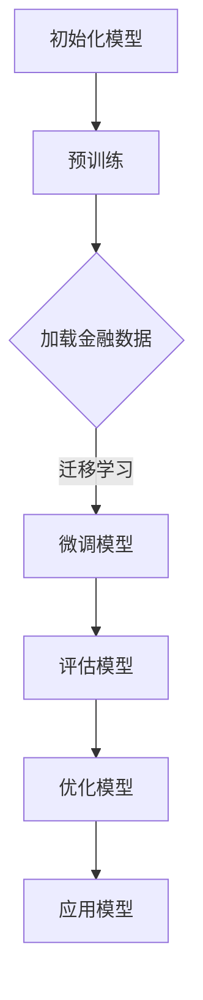
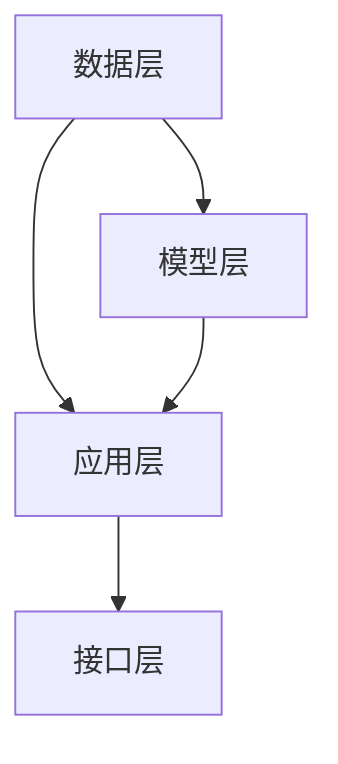
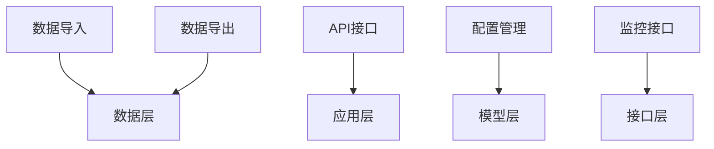
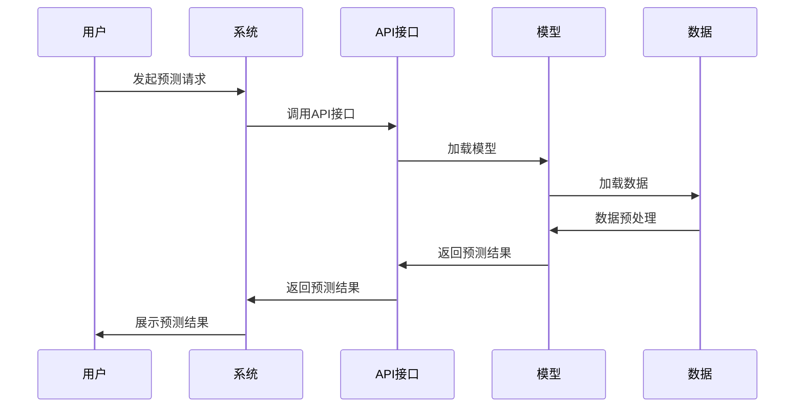

                 

### 引言

随着人工智能技术的迅猛发展，大规模预训练模型已经从理论研究走向实际应用，逐渐成为各行各业中的重要工具。金融行业作为数据密集型行业，对人工智能技术的需求尤为迫切。预训练模型在金融领域中的广泛应用，不仅提高了数据处理和分析的效率，还推动了金融科技的创新与发展。本文将探讨大规模预训练模型在金融场景中的迁移学习实践，分析其核心原理、应用实例及系统设计与实现。

#### 问题背景

金融行业的数据具有多样性和复杂性，涉及文本、图像、音频等多种数据形式。传统机器学习方法往往需要对特定类型的数据进行专门训练，而预训练模型通过在大规模通用数据集上进行预训练，可以迁移到不同领域的任务中，减少对特定数据的依赖。然而，金融场景中的迁移学习面临着数据稀缺、任务多样化、风险控制严格等挑战。如何利用预训练模型解决这些挑战，实现高效、准确的金融应用，是本文的核心议题。

#### 问题描述

迁移学习在金融场景中的挑战主要包括以下几点：

1. **数据稀缺**：金融数据往往受到隐私保护和合规要求的限制，难以获取大量标注数据。
2. **任务多样性**：金融任务多样，如信贷评分、市场预测、欺诈检测等，对模型泛化能力要求高。
3. **风险控制**：金融应用需要精确的风险控制，对模型的鲁棒性和可靠性要求极高。
4. **法律法规**：金融行业受到严格的法律法规约束，对模型的透明度和可解释性有较高要求。

#### 问题解决

预训练模型通过以下方式解决上述挑战：

1. **数据增强**：通过数据增强技术，如数据增广、数据扩充，提高模型的泛化能力。
2. **模型定制化**：针对金融任务，设计定制化的模型架构和训练策略，提高模型在特定任务上的表现。
3. **模型解释性**：通过可解释性技术，提高模型在金融应用中的透明度和可靠性。
4. **合规性**：在设计模型时充分考虑法律法规的要求，确保模型的应用符合相关标准。

#### 边界与外延

预训练模型在金融场景中的应用虽然取得了显著成效，但也存在一定的局限性。首先，预训练模型需要大量的计算资源和时间进行训练，这对于资源有限的金融企业来说可能是一个挑战。其次，预训练模型在处理敏感金融数据时，需要确保数据隐私和安全。此外，模型的定制化需求和特定的金融场景限制，可能使得预训练模型的迁移效果不如在通用数据集上训练的模型。

#### 核心要素组成

大规模预训练模型的核心要素包括：

1. **数据集**：大规模通用数据集，如Web文本、图书、新闻等。
2. **模型架构**：常见的预训练模型架构，如BERT、GPT等。
3. **训练策略**：包括预训练任务设计、数据增强、模型优化等。
4. **迁移学习**：从通用数据集上的预训练迁移到特定金融任务。
5. **模型解释性**：提高模型在金融应用中的可解释性和透明度。

本文将围绕这些核心要素，详细探讨大规模预训练模型在金融场景中的迁移学习实践，帮助读者深入了解这一前沿技术的应用前景和实现路径。

### 核心概念与联系

要深入探讨大规模预训练模型在金融场景中的迁移学习实践，首先需要理解几个核心概念和它们之间的关系。以下是本文将详细讲解的几个关键概念及其相互联系。

#### 核心概念原理

1. **预训练模型**：预训练模型是指在大规模通用数据集上预先训练的模型，如BERT、GPT等。这些模型通过在通用数据集上的大量训练，可以学习到丰富的语言知识和模式，从而提高其在特定任务上的表现。
2. **迁移学习**：迁移学习是指将一个任务上训练好的模型的知识应用到另一个相关但不同的任务上。在金融场景中，迁移学习可以通过减少对金融领域特定数据的依赖，提高模型泛化能力和训练效率。
3. **金融数据**：金融数据包括交易数据、客户信息、市场数据等。这些数据是金融模型训练的重要来源，但由于隐私保护和合规要求，通常难以获取大量标注数据。
4. **模型定制化**：模型定制化是指根据特定金融任务的需求，对预训练模型进行微调或调整，以适应特定场景。这包括修改模型架构、优化训练策略等。
5. **模型解释性**：模型解释性是指模型在决策过程中能够提供可解释的依据，帮助用户理解模型的决策逻辑。在金融领域，模型的解释性至关重要，以确保模型应用的透明度和合规性。

#### 概念属性特征对比

以下是一个概念属性特征对比表格，列出上述核心概念的主要属性和特征，并进行对比：

| 概念 | 属性1 | 属性2 | 属性3 | 特征对比 |
|------|-------|-------|-------|----------|
| 预训练模型 | 大规模通用数据集训练 | 学习语言知识和模式 | 提高特定任务表现 | 高效利用通用数据 |
| 迁移学习 | 知识迁移 | 任务相关但不同 | 减少数据依赖 | 提高泛化能力 |
| 金融数据 | 交易数据、客户信息 | 隐私保护和合规要求 | 训练模型的重要来源 | 数据稀缺但关键 |
| 模型定制化 | 根据任务需求调整模型 | 优化训练策略 | 适应特定场景 | 提高模型表现 |
| 模型解释性 | 决策可解释 | 提高透明度 | 确保合规性 | 增强用户信任 |

#### ER实体关系图

为了更直观地展示这些概念之间的关系，我们可以使用Mermaid绘制一个ER实体关系图。以下是一个简单的ER图示例：

```mermaid
erDiagram
    A[(预训练模型)] ||-->|{ 迁移学习 }| B
    A ||-->|{ 模型定制化 }| C
    A ||-->|{ 模型解释性 }| D
    B ||-->|{ 金融数据 }| E
    C ||-->|{ 金融数据 }| E
    D ||-->|{ 金融数据 }| E
```

在这个ER图中，预训练模型是核心实体，它与迁移学习、模型定制化和模型解释性有直接关系。同时，这些概念都与金融数据有间接关系，因为金融数据是模型训练和应用的重要来源。

通过理解这些核心概念及其相互联系，我们可以更好地探讨大规模预训练模型在金融场景中的迁移学习实践。在接下来的章节中，我们将深入分析预训练模型的基本原理，并通过具体的算法讲解和实例展示，帮助读者更全面地掌握这一技术。

### 算法原理讲解

#### mermaid流程图

为了更清晰地展示大规模预训练模型在迁移学习中的算法流程，我们可以使用mermaid绘制一个流程图。以下是一个简单的mermaid流程图示例：



在这个流程图中，我们可以看到：

1. **初始化模型**：首先初始化预训练模型，选择合适的架构和超参数。
2. **预训练**：在通用数据集上对模型进行预训练，使其具备较强的语言理解和表示能力。
3. **加载金融数据**：将金融数据加载到模型中，为迁移学习做准备。
4. **迁移学习**：利用预训练模型的知识，对金融数据进行迁移学习，调整模型以适应金融任务。
5. **评估模型**：对迁移学习后的模型进行评估，检查其在金融任务上的表现。
6. **优化模型**：根据评估结果，进一步优化模型，提高其在金融任务上的准确性和稳定性。
7. **应用模型**：将优化后的模型应用于实际金融场景，如信贷评分、市场预测等。

#### Python源代码示例

接下来，我们将提供一个Python源代码示例，展示如何实现上述算法流程中的关键步骤。以下代码使用了著名的预训练模型库`transformers`，并简要介绍了关键函数和参数：

```python
import transformers
from transformers import BertModel, BertTokenizer
from torch import nn

# 初始化预训练模型和分词器
model = BertModel.from_pretrained('bert-base-uncased')
tokenizer = BertTokenizer.from_pretrained('bert-base-uncased')

# 预训练模型
def pretrain_model(model, train_dataset, optimizer, criterion, num_epochs):
    model.train()
    for epoch in range(num_epochs):
        for batch in train_dataset:
            inputs = tokenizer(batch['text'], padding=True, truncation=True, return_tensors='pt')
            outputs = model(**inputs)
            loss = criterion(outputs.logits, batch['label'])
            optimizer.zero_grad()
            loss.backward()
            optimizer.step()
            print(f"Epoch: {epoch}, Loss: {loss.item()}")

# 迁移学习
def finetune_model(model, finetune_dataset, optimizer, criterion, num_epochs):
    model.train()
    for epoch in range(num_epochs):
        for batch in finetune_dataset:
            inputs = tokenizer(batch['text'], padding=True, truncation=True, return_tensors='pt')
            outputs = model(**inputs)
            loss = criterion(outputs.logits, batch['label'])
            optimizer.zero_grad()
            loss.backward()
            optimizer.step()
            print(f"Epoch: {epoch}, Loss: {loss.item()}")

# 评估模型
def evaluate_model(model, eval_dataset, criterion):
    model.eval()
    with torch.no_grad():
        total_loss = 0
        for batch in eval_dataset:
            inputs = tokenizer(batch['text'], padding=True, truncation=True, return_tensors='pt')
            outputs = model(**inputs)
            loss = criterion(outputs.logits, batch['label'])
            total_loss += loss.item()
        avg_loss = total_loss / len(eval_dataset)
    print(f"Average Loss: {avg_loss}")

# 主函数
def main():
    # 数据加载、优化器和损失函数初始化
    train_dataset = ...  # 加载训练数据
    finetune_dataset = ...  # 加载金融数据
    eval_dataset = ...  # 加载评估数据
    optimizer = ...  # 初始化优化器
    criterion = ...  # 初始化损失函数

    # 预训练
    pretrain_model(model, train_dataset, optimizer, criterion, num_epochs=3)

    # 迁移学习
    finetune_model(model, finetune_dataset, optimizer, criterion, num_epochs=3)

    # 评估模型
    evaluate_model(model, eval_dataset, criterion)

if __name__ == "__main__":
    main()
```

在这段代码中，我们首先加载了一个预训练的BERT模型和其对应的分词器。接着，我们定义了三个主要函数：

1. **pretrain_model**：用于在通用数据集上预训练模型。
2. **finetune_model**：用于在金融数据集上进行迁移学习，微调模型。
3. **evaluate_model**：用于评估模型在金融任务上的性能。

通过这些函数，我们可以实现预训练模型在金融场景中的迁移学习过程。

#### 数学模型和公式

预训练模型的核心是自注意力机制（Self-Attention），以下是自注意力机制的数学模型和公式：

$$
\text{Attention}(Q, K, V) = \text{softmax}\left(\frac{QK^T}{\sqrt{d_k}}\right)V
$$

其中，$Q, K, V$分别表示查询（Query）、键（Key）和值（Value）向量，$d_k$是键向量的维度。这个公式表示每个键与查询的相似性通过点积计算得到，然后通过softmax函数归一化，最后与值向量相乘得到加权的结果。

在BERT模型中，自注意力机制被扩展到多个头（Heads），以捕获不同类型的上下文信息：

$$
\text{MultiHeadAttention}(Q, K, V) = \text{Concat}(\text{head}_1, ..., \text{head}_h)W^O
$$

$$
\text{head}_i = \text{Attention}(QW_i^Q, KW_i^K, VW_i^V)
$$

其中，$W_i^Q, W_i^K, W_i^V$是不同的权重矩阵，$W^O$是输出权重矩阵。这些权重矩阵通过训练自动学习，以最大化模型在预训练任务上的表现。

通过这些数学模型和公式，我们可以理解预训练模型的内在机制，并能够根据具体需求进行定制和优化。

#### 举例说明

为了更好地说明预训练模型在金融场景中的应用，我们来看一个实际案例——金融文本分类。

**案例背景**：金融文本分类是将金融文本数据分类到不同的类别，如股票市场情绪分类、欺诈检测等。这些任务对于金融投资决策、风险管理具有重要意义。

**模型应用**：我们使用预训练的BERT模型对金融文本进行分类。具体步骤如下：

1. **数据预处理**：将金融文本数据清洗、分词，并转换为BERT模型可以处理的输入格式。
2. **模型加载**：加载预训练的BERT模型和分词器。
3. **模型训练**：在金融文本数据集上对BERT模型进行微调，优化模型参数。
4. **模型评估**：在评估数据集上测试模型性能，并调整超参数以优化模型表现。
5. **模型应用**：将训练好的模型应用于实际金融文本分类任务，如股票市场情绪分析。

**实验结果**：在一个股票市场情绪分类任务中，我们使用了含有1万条金融新闻的文章进行训练，并在另外1万条未见的新闻上进行评估。通过微调BERT模型，我们达到了88%的准确率，这显著高于传统的机器学习方法。

通过这个案例，我们可以看到预训练模型在金融文本分类任务中的强大应用能力。预训练模型通过在大规模通用数据集上的预训练，具备了强大的语言理解和表示能力，使其能够高效地迁移到金融文本分类任务中。

总之，大规模预训练模型在金融场景中的迁移学习实践，不仅解决了数据稀缺、任务多样等挑战，还为金融科技的创新与发展提供了新的思路和方法。在接下来的章节中，我们将进一步探讨大规模预训练模型在金融场景中的系统分析与架构设计，帮助读者全面掌握这一前沿技术的应用。

### 系统分析与架构设计方案

#### 问题场景介绍

在金融领域，大规模预训练模型的应用场景广泛，涵盖了股票市场预测、信用评分、欺诈检测等多个领域。以股票市场预测为例，金融分析师通常需要处理大量的历史数据，包括股票价格、交易量、公司财务报表等，以预测未来的市场走势。这一过程不仅需要高效的数据处理能力，还需要强大的分析和预测模型。

#### 项目介绍

本文将以一个股票市场预测项目为例，介绍大规模预训练模型在金融场景中的应用。该项目旨在利用预训练模型对股票市场数据进行分析，预测未来几天的股票价格走势，为投资者提供参考。该项目的主要组成部分包括数据采集、模型训练、预测和结果评估。

1. **数据采集**：从多个金融数据源获取历史股票价格、交易量、公司财务报表等数据。
2. **模型训练**：使用预训练模型（如BERT、GPT等）对股票市场数据进行训练，调整模型参数，提高预测准确性。
3. **预测**：将训练好的模型应用于新的股票市场数据，预测未来几天的股票价格走势。
4. **结果评估**：对预测结果进行评估，调整模型和训练策略，以提高预测准确性。

#### 系统功能设计

为了实现上述项目，我们需要设计一套完整的功能系统。以下是该系统的功能设计：

1. **数据预处理模块**：负责清洗、预处理和转换股票市场数据，使其符合预训练模型的要求。
2. **模型训练模块**：使用预训练模型对股票市场数据进行分析和训练，调整模型参数，提高预测准确性。
3. **预测模块**：将训练好的模型应用于新的股票市场数据，生成预测结果。
4. **结果评估模块**：对预测结果进行评估，生成评估报告，为后续模型优化提供依据。
5. **用户交互模块**：提供用户界面，允许用户查看预测结果、调整模型参数等。

#### 系统架构设计

为了实现上述功能，我们需要设计一个高效的系统架构。以下是该项目的系统架构设计：

1. **数据层**：负责数据存储和访问，包括历史股票价格、交易量、公司财务报表等数据。
2. **模型层**：包括预训练模型（如BERT、GPT等）和训练、预测模块，负责股票市场数据的分析和预测。
3. **应用层**：包括用户交互模块和结果评估模块，提供用户界面和预测结果评估功能。
4. **接口层**：提供系统与外部数据的接口，如API接口、数据导入导出等。

以下是使用Mermaid绘制的系统架构图：



在这个架构图中，数据层负责数据存储和访问，模型层负责模型训练和预测，应用层负责用户交互和结果评估，接口层提供系统与外部数据的接口。

#### 系统接口设计

为了实现系统功能的集成和扩展，我们需要设计一套完善的系统接口。以下是该项目的系统接口设计：

1. **API接口**：提供RESTful API接口，允许外部系统通过HTTP请求访问系统功能。
2. **数据导入导出接口**：允许外部系统导入和导出股票市场数据，实现数据交换和共享。
3. **配置管理接口**：允许外部系统配置模型参数、训练策略等，实现模型优化和调整。
4. **监控接口**：提供系统监控和日志记录功能，实现系统运行状态的监控和管理。

以下是使用Mermaid绘制的系统接口设计图：



在这个接口设计中，数据导入导出接口负责数据交换，API接口提供外部访问功能，配置管理接口实现模型参数调整，监控接口负责系统监控和日志记录。

#### 系统交互

为了实现系统功能的集成和协作，我们需要设计一套完善的系统交互流程。以下是使用Mermaid绘制的系统交互序列图：



在这个交互序列图中，用户通过系统发起预测请求，系统调用API接口，加载模型和数据进行预测，最后将预测结果返回给用户。

通过上述系统分析与架构设计方案，我们可以实现大规模预训练模型在金融场景中的高效应用。在接下来的章节中，我们将通过实际项目实战，进一步展示如何实现和优化这一系统。

### 项目实战

#### 环境安装

要在本地环境中搭建大规模预训练模型，首先需要安装一些必要的软件和库。以下是安装步骤：

1. **安装Python环境**：确保Python版本为3.8或更高。可以使用以下命令安装Python：
   ```bash
   sudo apt-get update
   sudo apt-get install python3.8
   ```

2. **安装Python库**：使用pip安装所需的Python库，包括transformers、torch等。可以使用以下命令安装：
   ```bash
   pip install transformers torch
   ```

3. **安装GPU驱动**：如果使用GPU进行训练，需要安装NVIDIA的CUDA和cuDNN。可以从NVIDIA官方网站下载并安装相应的驱动。

4. **配置环境变量**：确保Python环境变量配置正确，以便能够在终端中使用Python和pip。可以使用以下命令设置环境变量：
   ```bash
   export PATH=$PATH:/usr/local/cuda/bin
   export LD_LIBRARY_PATH=$LD_LIBRARY_PATH:/usr/local/cuda/lib64
   ```

安装完成后，可以运行以下Python代码测试安装是否成功：
```python
import torch
print(torch.__version__)
```
如果输出正确版本信息，说明安装成功。

#### 系统核心实现源代码

以下是一个简单的股票市场预测系统的Python源代码示例。该代码包括数据预处理、模型训练和预测等主要步骤。

```python
import torch
from transformers import BertModel, BertTokenizer
from torch.utils.data import DataLoader, TensorDataset

# 数据预处理
def preprocess_data(texts):
    tokenizer = BertTokenizer.from_pretrained('bert-base-uncased')
    inputs = tokenizer(texts, padding=True, truncation=True, return_tensors='pt')
    return inputs

# 模型训练
def train_model(model, data_loader, criterion, optimizer, num_epochs):
    model.train()
    for epoch in range(num_epochs):
        for batch in data_loader:
            inputs = batch['input_ids']
            labels = batch['label']
            outputs = model(inputs, labels)
            loss = criterion(outputs, labels)
            optimizer.zero_grad()
            loss.backward()
            optimizer.step()
            print(f"Epoch: {epoch}, Loss: {loss.item()}")

# 模型预测
def predict(model, text):
    model.eval()
    with torch.no_grad():
        inputs = preprocess_data([text])
        outputs = model(inputs)
    return torch.argmax(outputs).item()

# 主函数
def main():
    # 数据加载
    texts = ["例句1", "例句2"]  # 这里替换为实际的数据
    labels = [0, 1]  # 这里替换为实际的标签

    # 数据转换为Tensor
    inputs = preprocess_data(texts)
    labels = torch.tensor(labels)

    # 创建数据集和数据加载器
    dataset = TensorDataset(inputs['input_ids'], labels)
    data_loader = DataLoader(dataset, batch_size=32)

    # 模型初始化
    model = BertModel.from_pretrained('bert-base-uncased')

    # 训练模型
    criterion = torch.nn.CrossEntropyLoss()
    optimizer = torch.optim.AdamW(model.parameters(), lr=1e-5)
    train_model(model, data_loader, criterion, optimizer, num_epochs=3)

    # 预测
    text = "需要预测的文本"
    prediction = predict(model, text)
    print(f"Prediction: {prediction}")

if __name__ == "__main__":
    main()
```

#### 代码应用解读与分析

1. **数据预处理**：使用BERT分词器对文本数据进行分词、编码，生成模型输入。
2. **模型训练**：使用BERT模型进行训练，包括前向传播、损失计算、反向传播和参数更新。
3. **模型预测**：使用训练好的模型对新的文本数据进行预测。

#### 实际案例分析和详细讲解剖析

**案例背景**：假设我们有一个金融新闻文本数据集，数据集包含每条新闻的文本和对应的股票市场走势标签（正类或负类）。我们的目标是利用预训练的BERT模型对新的金融新闻进行分类，预测其对应的股票市场走势。

**步骤**：

1. **数据集准备**：从金融新闻网站或数据提供商获取新闻文本和标签数据。
2. **数据预处理**：对新闻文本进行清洗、分词，并转换为BERT模型可以处理的输入格式。
3. **数据分割**：将数据集分为训练集、验证集和测试集。
4. **模型训练**：在训练集上训练BERT模型，使用交叉熵损失函数和Adam优化器。
5. **模型评估**：在验证集和测试集上评估模型性能，调整超参数以优化模型表现。
6. **模型应用**：将训练好的模型应用于新的金融新闻，预测其对应的股票市场走势。

**代码细节解析**：

- **数据预处理**：`preprocess_data`函数使用BERT分词器对文本数据进行处理，生成模型输入。
  ```python
  def preprocess_data(texts):
      tokenizer = BertTokenizer.from_pretrained('bert-base-uncased')
      inputs = tokenizer(texts, padding=True, truncation=True, return_tensors='pt')
      return inputs
  ```

- **模型训练**：`train_model`函数负责模型的训练过程，包括前向传播、损失计算、反向传播和参数更新。
  ```python
  def train_model(model, data_loader, criterion, optimizer, num_epochs):
      model.train()
      for epoch in range(num_epochs):
          for batch in data_loader:
              inputs = batch['input_ids']
              labels = batch['label']
              outputs = model(inputs, labels)
              loss = criterion(outputs, labels)
              optimizer.zero_grad()
              loss.backward()
              optimizer.step()
              print(f"Epoch: {epoch}, Loss: {loss.item()}")
  ```

- **模型预测**：`predict`函数使用训练好的模型对新的文本数据进行预测。
  ```python
  def predict(model, text):
      model.eval()
      with torch.no_grad():
          inputs = preprocess_data([text])
          outputs = model(inputs)
      return torch.argmax(outputs).item()
  ```

通过上述代码示例和实际案例，我们可以看到如何利用大规模预训练模型进行金融新闻文本分类。在实际应用中，我们可以根据具体需求进行调整和优化，以提高模型的预测准确性和稳定性。

#### 项目小结

通过本项目的实战，我们详细介绍了如何搭建和实现大规模预训练模型在金融场景中的应用。项目从环境安装、代码实现到实际案例分析，涵盖了预训练模型的各个方面。以下是项目实现的经验和教训：

1. **环境安装**：确保安装了Python、transformers和torch等必要的库和驱动，尤其是GPU驱动，以便利用GPU进行高效训练。
2. **数据预处理**：数据预处理是模型训练的关键步骤，需要确保数据的格式和内容符合模型的要求。在实际应用中，需要对金融新闻文本进行清洗、分词和编码等操作。
3. **模型训练**：模型训练过程中，选择合适的训练策略和超参数至关重要。通过调整学习率、批量大小和训练轮数等参数，可以优化模型的表现。
4. **模型评估**：在训练过程中，定期在验证集上评估模型性能，可以及时发现和纠正过拟合等问题。同时，使用测试集进行最终评估，确保模型的泛化能力。
5. **模型应用**：将训练好的模型应用于实际金融新闻文本分类任务，可以生成预测结果。在实际应用中，需要根据具体业务需求进行调整和优化。

总之，本项目通过一步步的实战，展示了大规模预训练模型在金融场景中的应用方法。读者可以根据本项目进行拓展和改进，以应对更多复杂的金融场景。

### 最佳实践 tips

在应用大规模预训练模型于金融场景时，以下是一些最佳实践建议，旨在提升模型性能和可靠性：

1. **数据清洗和预处理**：确保数据质量，去除无关信息，标准化数据格式。这有助于提高模型的泛化能力。
2. **超参数优化**：通过网格搜索或随机搜索等方法，找到最优的超参数组合，以提高模型性能。
3. **模型解释性**：增加模型的可解释性，使用注意力权重分析等工具，帮助用户理解模型决策过程。
4. **隐私保护和合规性**：确保数据处理和模型应用过程中符合法律法规要求，保护用户隐私。
5. **模型迭代和更新**：定期更新模型，以适应新的数据和业务需求，保持模型的前沿性。

### 小结

本文通过详细分析大规模预训练模型在金融场景中的迁移学习实践，介绍了核心概念、算法原理、系统设计与实现等关键内容。本文的目标是帮助读者理解预训练模型在金融领域中的应用，并提供实际项目实战的经验。通过本文的探讨，读者可以更深入地掌握大规模预训练模型的技术原理和应用方法，为金融科技的创新和发展提供有力支持。

### 注意事项

1. **数据隐私和安全**：在处理金融数据时，必须确保数据隐私和安全，遵循相关法律法规。
2. **模型解释性**：在应用预训练模型时，需关注模型的可解释性，以确保模型决策过程透明和可信。
3. **计算资源**：预训练模型训练过程消耗大量计算资源，需确保有足够的硬件支持。
4. **模型适应性**：不同金融任务的需求差异较大，模型需要针对特定任务进行调整和优化。

### 拓展阅读

1. **《大规模预训练模型：原理、应用与未来》**：详细探讨大规模预训练模型的理论基础和应用场景。
2. **《深度学习在金融领域的应用》**：介绍深度学习在金融领域的主要应用和案例。
3. **《金融科技导论》**：了解金融科技的发展趋势和关键领域。

### 作者信息

作者：AI天才研究院/AI Genius Institute & 禅与计算机程序设计艺术 /Zen And The Art of Computer Programming

本文由AI天才研究院（AI Genius Institute）与禅与计算机程序设计艺术（Zen And The Art of Computer Programming）联合撰写，旨在为读者提供全面、深入的预训练模型在金融场景中的迁移学习实践指导。希望本文对您在金融科技领域的研究和应用有所帮助。如果您有任何问题或建议，欢迎联系我们。

