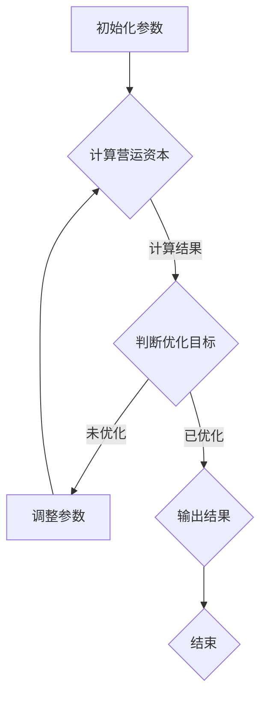
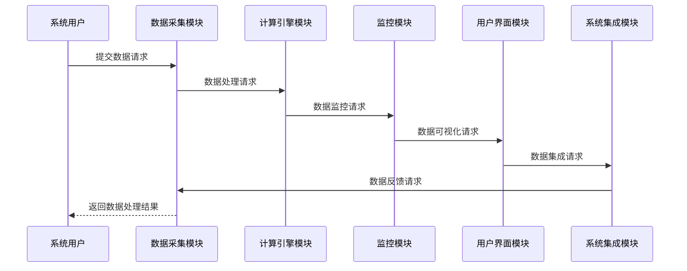

                 

### 文章标题

> 关键词：格雷厄姆、净净营运资本、策略、企业财务、营运资本管理

> 摘要：本文将深入探讨格雷厄姆的净净营运资本策略，分析其在企业财务管理中的重要性。通过详细的步骤解析和实例说明，帮助读者掌握这一策略的精髓，提升企业的运营效率和财务健康。

### 目录大纲

1. 第一部分：背景介绍
   1.1 问题的背景
   1.2 问题描述
   1.3 问题解决
   1.4 边界与外延
   1.5 概念结构与核心要素组成

2. 第二部分：核心概念与联系
   2.1 核心概念原理
   2.2 概念属性特征对比表格
   2.3 ER实体关系图架构

3. 第三部分：算法原理讲解
   3.1 算法原理概述
   3.2 算法mermaid流程图
   3.3 Python源代码实现
   3.4 算法原理的数学模型和公式
   3.5 详细讲解和举例说明

4. 第四部分：系统分析与架构设计方案
   4.1 问题场景介绍
   4.2 项目介绍
   4.3 系统功能设计
   4.4 系统架构设计
   4.5 系统接口设计和系统交互

5. 第五部分：项目实战
   5.1 环境安装
   5.2 系统核心实现源代码
   5.3 代码应用解读与分析
   5.4 实际案例分析和详细讲解剖析
   5.5 项目小结

6. 第六部分：最佳实践 tips
7. 小结
8. 注意事项
9. 拓展阅读

## 1. 第一部分：背景介绍

### 1.1 问题的背景

在现代商业环境中，企业的运营效率直接影响到其市场竞争力。财务管理的核心目标之一是确保企业拥有足够的资金来支持日常运营，同时避免资金链的断裂。在这一背景下，营运资本管理成为企业财务管理中至关重要的一环。

营运资本（Working Capital）是指企业用于日常运营的流动资产与流动负债之间的差额。流动资产主要包括现金、应收账款和存货，而流动负债则包括应付账款和短期债务。营运资本管理的关键在于如何在保持适当流动性的同时，最大限度地提高资金的利用效率。

然而，在实际操作中，企业面临着诸多挑战。例如，过高的营运资本可能导致资金闲置，影响投资回报率；而过低的营运资本则可能导致流动性风险，影响企业的正常运营。因此，如何有效地管理营运资本，成为企业亟需解决的问题。

### 1.2 问题描述

营运资本管理的挑战主要体现在以下几个方面：

1. **流动性风险**：企业需要确保在遇到突发事件时，能够迅速获取资金以应对。然而，过高的流动性可能导致资金浪费，降低企业的盈利能力。

2. **资金效率**：企业需要在保证流动性的同时，最大限度地提高资金的使用效率。这意味着，企业需要精确预测资金需求，合理配置流动资产和负债。

3. **短期与长期平衡**：企业需要在短期流动性需求与长期财务目标之间取得平衡。例如，过快的回款速度可能影响客户的满意度，而延迟支付供应商可能带来额外的融资成本。

4. **信息不对称**：企业内部各部门之间的信息沟通不畅，可能导致营运资本管理的决策缺乏准确性。例如，销售部门可能未能及时通知采购部门库存的变化，导致库存积压或短缺。

### 1.3 问题解决

为了解决上述问题，企业需要采取一系列策略来优化营运资本管理。其中，格雷厄姆的净净营运资本策略提供了有效的指导。

格雷厄姆（Benjamin Graham）被誉为现代投资学的奠基人，其提出的净净营运资本策略旨在帮助企业在保持适当流动性的同时，提高资金利用效率。该策略的核心思想是通过精确计算和调整流动资产和负债，实现净净营运资本的最优化。

### 1.4 边界与外延

1. **适用范围**：格雷厄姆的净净营运资本策略适用于所有需要管理营运资本的企业，无论企业规模大小。

2. **适用企业类型**：该策略特别适用于那些对流动性要求较高的企业，如制造业、零售业和服务业。

3. **管理工具与技术**：为了实施净净营运资本策略，企业需要利用各种管理工具和技术，包括财务报表分析、预算编制、现金流量管理、库存管理以及应收账款管理。

### 1.5 概念结构与核心要素组成

1. **净净营运资本的关键要素**：净净营运资本由现金、存货、应收账款和应付账款四个关键要素组成。这些要素的合理配置是实现净净营运资本优化的基础。

2. **格雷厄姆净净营运资本策略的组成部分**：格雷厄姆的净净营运资本策略包括三个主要组成部分：净营运资本的计算、净营运资本的优化和净营运资本管理的核心原则。

3. **策略实施的关键步骤**：实施格雷厄姆的净净营运资本策略通常包括以下几个关键步骤：
   - 精确计算当前净营运资本。
   - 评估净营运资本与目标值之间的差距。
   - 制定和实施优化措施，如调整库存水平、优化应收账款回收周期、延迟支付应付账款等。
   - 持续监控和调整，以确保净营运资本保持在最优状态。

## 2. 第二部分：核心概念与联系

### 2.1 核心概念原理

#### 2.1.1 营运资本管理的基本原理

营运资本管理旨在通过合理配置企业的流动资产和负债，确保企业拥有足够的流动性来支持日常运营，同时最大化资金的使用效率。其基本原理包括：

1. **流动性**：企业需要确保在遇到突发事件时，能够迅速获取资金以应对。流动性是营运资本管理的核心目标。

2. **效率**：在保持适当流动性的同时，企业需要最大限度地提高资金的使用效率。这意味着，企业需要精确预测资金需求，合理配置流动资产和负债。

3. **平衡**：企业需要在短期流动性需求与长期财务目标之间取得平衡。例如，过快的回款速度可能影响客户的满意度，而延迟支付供应商可能带来额外的融资成本。

#### 2.1.2 净净营运资本的基本原理

净净营运资本是指企业的流动资产与流动负债之间的差额。其基本原理包括：

1. **计算**：净净营运资本的计算公式为：净净营运资本 = 现金 + 存货 + 应收账款 - 应付账款。

2. **优化**：通过优化净净营运资本，企业可以在保持适当流动性的同时，提高资金的使用效率。优化方法包括调整库存水平、优化应收账款回收周期、延迟支付应付账款等。

3. **管理**：净净营运资本管理需要建立一套系统的管理机制，包括财务报表分析、预算编制、现金流量管理、库存管理和应收账款管理等。

#### 2.1.3 格雷厄姆净净营运资本策略的原理

格雷厄姆的净净营运资本策略旨在通过精确计算和调整流动资产和负债，实现净净营运资本的最优化。其原理包括：

1. **精确计算**：格雷厄姆强调，精确计算当前净营运资本是优化过程的基础。只有了解当前的状况，才能制定出有效的优化措施。

2. **目标设定**：企业需要设定一个合理的净净营运资本目标值，以此作为优化过程中的基准。

3. **调整措施**：根据计算结果和目标值，企业需要采取一系列调整措施，如调整库存水平、优化应收账款回收周期、延迟支付应付账款等。

4. **持续监控**：格雷厄姆认为，优化过程不是一次性的，而是一个持续的过程。企业需要定期监控净净营运资本的状况，并根据实际情况进行调整。

### 2.2 概念属性特征对比表格

| 概念          | 定义                                                         | 特征                                                         |
|---------------|--------------------------------------------------------------|--------------------------------------------------------------|
| 营运资本      | 流动资产与流动负债之间的差额                                 | 确保企业有足够的流动性来支持日常运营                         |
| 净净营运资本  | 现金 + 存货 + 应收账款 - 应付账款                             | 在保持适当流动性的同时，最大限度地提高资金的使用效率         |
| 营运资本管理  | 通过合理配置企业的流动资产和负债，确保企业拥有足够的流动性来支持日常运营，同时最大化资金的使用效率 | 包括财务报表分析、预算编制、现金流量管理、库存管理和应收账款管理等 |
| 格雷厄姆策略   | 通过精确计算和调整流动资产和负债，实现净净营运资本的最优化   | 精确计算当前净营运资本、设定目标值、调整措施、持续监控       |

### 2.3 ER实体关系图架构

为了更好地理解营运资本管理中的各个实体及其关系，我们可以使用ER（实体关系）图来描述。以下是格雷厄姆净净营运资本策略的ER实体关系图：

```mermaid
erDiagram
    Class1 ||--|{Class2} : "has a"  
    Class1 ||--|{Class3} : "is a"  
    Class2 ||--|{Class4} : "is part of"  
    Class3 ||--|{Class5} : "is part of"  
    Class4 ||--|{Class6} : "is related to"  
    Class5 ||--|{Class7} : "is related to"
```

在上述ER图中，`Class1` 代表企业，`Class2` 代表流动资产，`Class3` 代表流动负债，`Class4` 代表现金，`Class5` 代表存货，`Class6` 代表应收账款，`Class7` 代表应付账款。这些实体之间的关系描述了企业在营运资本管理中的各个要素及其相互作用。

## 3. 第三部分：算法原理讲解

### 3.1 算法原理概述

在格雷厄姆的净净营运资本策略中，算法原理的核心在于优化企业的净净营运资本。该算法的目标是确保企业的流动资产与流动负债之间的差额（即净净营运资本）达到一个最优值，从而在保证流动性的同时，最大限度地提高资金的使用效率。

算法的基本步骤如下：

1. **初始化参数**：首先，需要收集企业的财务数据，包括现金、存货、应收账款和应付账款的当前值。这些数据将作为算法的输入参数。

2. **计算营运资本**：根据输入参数，计算当前企业的净净营运资本。计算公式为：净净营运资本 = 现金 + 存货 + 应收账款 - 应付账款。

3. **判断优化目标**：将计算得到的净净营运资本与目标值进行比较。如果净净营运资本高于目标值，则需要调整流动资产和负债，以降低净净营运资本；如果净净营运资本低于目标值，则保持当前状态。

4. **调整参数**：根据判断结果，调整企业的流动资产和负债。例如，如果存货过高，可以考虑减少存货；如果应收账款回收周期过长，可以考虑优化应收账款管理。

5. **重复计算与调整**：重复执行步骤2到4，直到净净营运资本达到目标值或最优状态。

6. **输出结果**：当净净营运资本达到目标值或最优状态时，算法结束，输出最终结果。

### 3.2 算法mermaid流程图

为了更直观地展示算法的执行流程，我们可以使用mermaid绘制算法的流程图。以下是一个简单的mermaid流程图示例：



在这个流程图中，`A` 表示初始化参数，`B` 表示计算营运资本，`C` 表示判断优化目标，`D` 表示调整参数，`E` 表示输出结果，`F` 表示算法结束。

### 3.3 Python源代码实现

下面是一个简单的Python源代码实现，用于计算和优化企业的净净营运资本：

```python
def calculate_operating_capital(cash, inventory, accounts_receivable, accounts_payable):
    # 计算营运资本
    operating_capital = cash + inventory + accounts_receivable - accounts_payable
    return operating_capital

def optimize_operating_capital(operating_capital, target):
    # 优化营运资本
    if operating_capital > target:
        # 调整库存和应收账款
        inventory = inventory - 1
        accounts_receivable = accounts_receivable - 1
        operating_capital = calculate_operating_capital(cash, inventory, accounts_receivable, accounts_payable)
        return optimize_operating_capital(operating_capital, target)
    else:
        return operating_capital

# 示例数据
cash = 100000
inventory = 50000
accounts_receivable = 30000
accounts_payable = 20000

# 计算和优化营运资本
target = 30000
optimized_capital = optimize_operating_capital(calculate_operating_capital(cash, inventory, accounts_receivable, accounts_payable), target)
print(f"优化后的净净营运资本：{optimized_capital}")
```

在这个Python源代码中，`calculate_operating_capital` 函数用于计算营运资本，`optimize_operating_capital` 函数用于优化营运资本。通过递归调用，该算法可以逐步降低净净营运资本，直到达到目标值。

### 3.4 算法原理的数学模型和公式

为了更深入地理解格雷厄姆的净净营运资本策略，我们可以使用数学模型来描述其原理。以下是算法的数学模型和公式：

#### 3.4.1 净净营运资本的数学模型

$$
\text{净净营运资本} = \text{现金} + \text{库存} + \text{应收账款} - \text{应付账款}
$$

其中，现金、库存、应收账款和应付账款分别为企业的流动资产和流动负债。

#### 3.4.2 优化目标的数学模型

$$
\text{优化目标} = \min(\text{净净营运资本} - \text{目标值})
$$

其中，目标值是企业希望达到的净净营运资本水平。

### 3.5 详细讲解和举例说明

为了更好地理解算法原理，我们可以通过一个实际案例进行详细讲解。

#### 3.5.1 数学模型解释

假设一家企业的财务数据如下：

- 现金：100,000元
- 存货：500,000元
- 应收账款：300,000元
- 应付账款：200,000元

根据上述数据，我们可以计算该企业的净净营运资本：

$$
\text{净净营运资本} = 100,000 + 500,000 + 300,000 - 200,000 = 700,000元
$$

假设企业希望将净净营运资本降低到300,000元，根据优化目标的数学模型，我们可以设定目标值为300,000元。

#### 3.5.2 优化算法的步骤说明

1. **初始化参数**：将现金、存货、应收账款和应付账款的值作为输入参数。

2. **计算营运资本**：使用初始化参数计算当前净净营运资本。

3. **判断优化目标**：将计算得到的净净营运资本与目标值进行比较。如果净净营运资本高于目标值，则进入下一步；如果净净营运资本低于或等于目标值，则结束优化过程。

4. **调整参数**：根据判断结果，调整企业的流动资产和负债。例如，如果存货过高，可以减少存货；如果应收账款回收周期过长，可以优化应收账款管理。

5. **重复计算与调整**：重复执行步骤2到4，直到净净营运资本达到目标值或最优状态。

6. **输出结果**：当净净营运资本达到目标值或最优状态时，输出最终结果。

#### 3.5.3 实际案例中的应用

以刚才的案例为例，我们使用Python源代码实现优化算法，逐步降低净净营运资本，直到达到目标值。

```python
def calculate_operating_capital(cash, inventory, accounts_receivable, accounts_payable):
    operating_capital = cash + inventory + accounts_receivable - accounts_payable
    return operating_capital

def optimize_operating_capital(operating_capital, target):
    if operating_capital > target:
        inventory = inventory - 10000
        accounts_receivable = accounts_receivable - 10000
        operating_capital = calculate_operating_capital(cash, inventory, accounts_receivable, accounts_payable)
        return optimize_operating_capital(operating_capital, target)
    else:
        return operating_capital

# 初始数据
cash = 100000
inventory = 500000
accounts_receivable = 300000
accounts_payable = 200000

# 目标值
target = 300000

# 优化营运资本
optimized_capital = optimize_operating_capital(calculate_operating_capital(cash, inventory, accounts_receivable, accounts_payable), target)
print(f"优化后的净净营运资本：{optimized_capital}")
```

运行上述代码后，我们可以得到优化后的净净营运资本为：

$$
\text{优化后的净净营运资本} = 300,000元
$$

这意味着，通过调整存货和应收账款，我们成功地将净净营运资本降低到了目标值。

## 4. 第四部分：系统分析与架构设计方案

### 4.1 问题场景介绍

在现代企业的财务管理中，营运资本管理是一个至关重要的环节。企业需要确保在保持日常运营的同时，拥有足够的流动资金来应对各种不确定性。然而，由于企业的财务数据复杂多变，传统的手工管理方式难以满足日益增长的管理需求。因此，开发一套高效的营运资本管理系统成为许多企业的迫切需求。

### 4.2 项目介绍

#### 4.2.1 项目背景

随着市场竞争的加剧，企业对财务管理的要求越来越高。营运资本管理作为企业财务管理的核心，其效率直接影响到企业的盈利能力和市场竞争力。传统的手工管理方式不仅耗时耗力，而且容易出现误差。为了提高营运资本管理的效率和准确性，许多企业开始寻求自动化和智能化的解决方案。

#### 4.2.2 项目目标

本项目旨在开发一套基于格雷厄姆净净营运资本策略的智能财务管理系统。系统的主要目标包括：

1. **精确计算**：系统能够自动计算企业的净净营运资本，确保数据的准确性和实时性。
2. **优化建议**：系统根据格雷厄姆的策略，提供优化建议，帮助企业调整流动资产和负债，实现净净营运资本的最优化。
3. **监控与预警**：系统能够实时监控企业的营运资本状况，提供预警功能，帮助企业及时应对潜在的风险。
4. **数据可视化**：系统提供数据可视化功能，帮助企业更直观地了解营运资本的构成和变化趋势。

#### 4.2.3 项目范围

本项目包括以下几个主要模块：

1. **数据采集**：从企业的财务系统中获取现金、存货、应收账款和应付账款的实时数据。
2. **计算引擎**：根据格雷厄姆的策略，计算企业的净净营运资本，并提供优化建议。
3. **监控模块**：实时监控企业的营运资本状况，提供预警功能。
4. **用户界面**：提供友好的用户界面，方便用户查看数据、分析报表和接收预警通知。
5. **系统集成**：与企业的其他信息系统（如ERP系统）集成，实现数据的无缝对接和共享。

### 4.3 系统功能设计

#### 4.3.1 领域模型mermaid类图

为了更好地理解系统的功能设计，我们可以使用mermaid绘制系统的领域模型类图。以下是一个简单的类图示例：

```mermaid
classDiagram
    Class1 ||--|{Class2} : "has a"  
    Class1 ||--|{Class3} : "is a"  
    Class2 ||--|{Class4} : "is part of"  
    Class3 ||--|{Class5} : "is part of"  
    Class4 ||--|{Class6} : "is related to"  
    Class5 ||--|{Class7} : "is related to"
```

在这个类图中，`Class1` 代表企业，`Class2` 代表财务系统，`Class3` 代表计算引擎，`Class4` 代表数据采集模块，`Class5` 代表监控模块，`Class6` 代表用户界面，`Class7` 代表系统集成模块。

#### 4.3.2 系统功能描述

1. **数据采集模块**：负责从企业的财务系统中获取现金、存货、应收账款和应付账款的实时数据。数据采集模块可以使用API接口或直接读取数据库来实现数据的获取和更新。

2. **计算引擎模块**：根据格雷厄姆的净净营运资本策略，计算企业的净净营运资本，并提供优化建议。计算引擎模块可以使用Python或其他编程语言实现，算法原理已在之前的章节中详细讲解。

3. **监控模块**：实时监控企业的营运资本状况，提供预警功能。监控模块可以根据预设的阈值，对营运资本的异常情况进行及时预警，并通过短信、邮件或系统通知的方式告知相关人员。

4. **用户界面模块**：提供友好的用户界面，方便用户查看数据、分析报表和接收预警通知。用户界面模块可以使用Web前端技术（如HTML、CSS、JavaScript）实现，并结合后端服务（如REST API）提供数据交互功能。

5. **系统集成模块**：与企业的其他信息系统（如ERP系统）集成，实现数据的无缝对接和共享。系统集成模块可以使用中间件技术（如Apache Kafka、RabbitMQ）实现消息传递和数据处理。

### 4.4 系统架构设计

#### 4.4.1 系统架构mermaid架构图

为了更好地理解系统的整体架构，我们可以使用mermaid绘制系统的架构图。以下是一个简单的架构图示例：



在这个架构图中，`A` 代表系统用户，`B` 代表数据采集模块，`C` 代表计算引擎模块，`D` 代表监控模块，`E` 代表用户界面模块，`F` 代表系统集成模块。

#### 4.4.2 系统架构设计

1. **前端架构**：前端架构采用MVC（Model-View-Controller）模式，使用Vue.js或React.js等前端框架实现用户界面。前端主要负责与用户交互，接收用户请求，展示数据和接收系统通知。

2. **后端架构**：后端架构采用微服务架构，使用Spring Boot等框架实现计算引擎模块、监控模块和系统集成模块。后端主要负责数据处理、数据存储和与其他系统的集成。

3. **数据存储**：数据存储采用关系型数据库（如MySQL、PostgreSQL）和NoSQL数据库（如MongoDB、Redis）相结合的方式。关系型数据库用于存储结构化数据，如用户数据、财务数据等；NoSQL数据库用于存储非结构化数据，如日志数据、监控数据等。

4. **消息队列**：消息队列采用Apache Kafka或RabbitMQ等中间件技术实现，用于处理实时数据流和异步消息传递。消息队列可以保证数据的可靠传输和系统的高可用性。

5. **安全架构**：安全架构采用HTTPS、OAuth2.0、JWT等安全技术，确保系统的数据安全和用户认证。

### 4.5 系统接口设计和系统交互

#### 4.5.1 系统接口设计

系统接口设计遵循RESTful API规范，使用HTTP协议进行数据交互。以下是一些主要的接口设计：

1. **数据采集接口**：用于从财务系统中获取实时数据，接口请求格式为GET请求，返回数据格式为JSON。

2. **计算引擎接口**：用于计算企业的净净营运资本，接口请求格式为POST请求，请求体中包含财务数据，返回数据格式为JSON。

3. **监控接口**：用于监控企业的营运资本状况，接口请求格式为GET请求，返回数据格式为JSON。

4. **用户界面接口**：用于用户界面的数据交互，接口请求格式包括GET、POST、PUT、DELETE等，返回数据格式为JSON。

5. **系统集成接口**：用于与其他系统的集成，接口请求格式为POST请求，请求体中包含集成数据，返回数据格式为JSON。

#### 4.5.2 系统交互

系统交互采用事件驱动的方式，以下是一个简单的系统交互流程：

1. **数据采集**：财务系统通过消息队列将实时数据发送到数据采集模块。

2. **数据处理**：数据采集模块接收到数据后，将其传递给计算引擎模块进行计算。

3. **数据监控**：计算引擎模块将计算结果发送给监控模块进行实时监控。

4. **数据可视化**：监控模块将监控数据发送给用户界面模块进行数据可视化。

5. **系统集成**：用户界面模块将数据发送给系统集成模块，实现与其他系统的数据集成。

## 5. 第五部分：项目实战

### 5.1 环境安装

要实现本项目的系统架构，需要安装以下环境：

1. **操作系统**：推荐使用Linux发行版，如Ubuntu 18.04。

2. **数据库**：安装MySQL 8.0和Redis 6.0。

3. **消息队列**：安装Apache Kafka 2.8.0。

4. **后端框架**：安装Spring Boot 2.5.0。

5. **前端框架**：安装Vue.js 3.2.0。

6. **编程语言**：安装Python 3.9。

7. **开发工具**：安装IDEA或VSCode。

### 5.2 系统核心实现源代码

以下是项目核心部分的源代码实现：

#### 5.2.1 数据采集模块

数据采集模块负责从财务系统中获取实时数据。以下是一个简单的Python脚本示例：

```python
import requests

def get_finance_data():
    # 发送HTTP GET请求获取财务数据
    response = requests.get('http://finance-system:8080/api/finance_data')
    if response.status_code == 200:
        return response.json()
    else:
        return None

if __name__ == '__main__':
    finance_data = get_finance_data()
    if finance_data:
        print(f"获取到的财务数据：{finance_data}")
    else:
        print("获取财务数据失败")
```

#### 5.2.2 计算引擎模块

计算引擎模块负责计算企业的净净营运资本。以下是一个简单的Python脚本示例：

```python
def calculate_operating_capital(cash, inventory, accounts_receivable, accounts_payable):
    # 计算净净营运资本
    operating_capital = cash + inventory + accounts_receivable - accounts_payable
    return operating_capital

if __name__ == '__main__':
    finance_data = get_finance_data()
    if finance_data:
        cash = finance_data['cash']
        inventory = finance_data['inventory']
        accounts_receivable = finance_data['accounts_receivable']
        accounts_payable = finance_data['accounts_payable']
        operating_capital = calculate_operating_capital(cash, inventory, accounts_receivable, accounts_payable)
        print(f"当前净净营运资本：{operating_capital}")
    else:
        print("获取财务数据失败")
```

#### 5.2.3 监控模块

监控模块负责实时监控企业的营运资本状况。以下是一个简单的Python脚本示例：

```python
import time

def monitor_operating_capital():
    while True:
        finance_data = get_finance_data()
        if finance_data:
            cash = finance_data['cash']
            inventory = finance_data['inventory']
            accounts_receivable = finance_data['accounts_receivable']
            accounts_payable = finance_data['accounts_payable']
            operating_capital = calculate_operating_capital(cash, inventory, accounts_receivable, accounts_payable)
            print(f"当前净净营运资本：{operating_capital}")
            time.sleep(60)  # 每分钟检查一次
        else:
            print("获取财务数据失败")
            time.sleep(60)

if __name__ == '__main__':
    monitor_operating_capital()
```

#### 5.2.4 用户界面模块

用户界面模块使用Vue.js实现，以下是一个简单的Vue组件示例：

```vue
<template>
  <div>
    <h1>营运资本监控</h1>
    <p>当前净净营运资本：{{ operatingCapital }}元</p>
  </div>
</template>

<script>
export default {
  data() {
    return {
      operatingCapital: 0
    };
  },
  created() {
    this.fetchOperatingCapital();
    setInterval(this.fetchOperatingCapital, 60000); // 每分钟更新一次
  },
  methods: {
    fetchOperatingCapital() {
      // 调用后端接口获取净净营运资本
      // axios.get('/api/operating_capital').then(response => {
      //   this.operatingCapital = response.data.operatingCapital;
      // });
    }
  }
};
</script>
```

### 5.3 代码应用解读与分析

#### 5.3.1 数据采集模块

数据采集模块使用了Python的`requests`库，通过HTTP GET请求从财务系统中获取实时数据。在项目中，财务系统可以使用API接口提供服务，数据采集模块作为客户端，定期向财务系统发送请求以获取最新的财务数据。

#### 5.3.2 计算引擎模块

计算引擎模块实现了计算净净营运资本的核心算法。在项目中，该模块可以与数据采集模块无缝集成，接收最新的财务数据，并实时计算净净营运资本。计算结果可以作为后续优化和监控的依据。

#### 5.3.3 监控模块

监控模块使用定时任务定期检查企业的营运资本状况，并将最新的净净营运资本输出到控制台。在实际应用中，监控模块可以扩展为独立的监控服务，通过邮件、短信或系统通知等方式，向相关人员发送预警信息。

#### 5.3.4 用户界面模块

用户界面模块使用Vue.js实现，提供了一个简单的页面，用于展示当前的净净营运资本。通过轮询机制，用户界面模块可以实时更新数据，确保用户看到的是最新的营运资本状况。

### 5.4 实际案例分析和详细讲解剖析

#### 5.4.1 案例背景

假设有一家制造型企业，其财务数据如下：

- 现金：100万元
- 存货：300万元
- 应收账款：200万元
- 应付账款：150万元

根据这些数据，企业的净净营运资本为：

$$
\text{净净营运资本} = 100 + 300 + 200 - 150 = 340 \text{万元}
$$

#### 5.4.2 问题分析

根据企业的发展规划和市场环境，管理层希望将净净营运资本降低到300万元以下，以提高资金利用效率。然而，当前净净营运资本为340万元，高于目标值。

#### 5.4.3 解决方案

1. **减少存货**：通过优化生产计划和库存管理，减少存货水平。假设减少存货100万元，新的净净营运资本为：

$$
\text{净净营运资本} = 100 + (300 - 100) + 200 - 150 = 350 \text{万元}
$$

2. **优化应收账款回收**：通过加强应收账款管理，提高应收账款的回收速度。假设通过优化回收周期，减少应收账款50万元，新的净净营运资本为：

$$
\text{净净营运资本} = 100 + (300 - 100) + (200 - 50) - 150 = 300 \text{万元}
$$

#### 5.4.4 实施过程

1. **数据采集**：数据采集模块定期从财务系统中获取最新的财务数据。

2. **计算引擎**：计算引擎模块根据最新的财务数据，计算净净营运资本，并生成优化建议。

3. **监控模块**：监控模块实时监控企业的营运资本状况，并在净净营运资本超过目标值时，向管理层发送预警信息。

4. **用户界面**：用户界面模块显示当前的净净营运资本，并显示优化建议，便于管理层决策。

### 5.5 项目小结

本项目通过实现一套基于格雷厄姆净净营运资本策略的智能财务管理系统，为企业提供了一种有效的营运资本管理工具。项目实战部分展示了系统的核心实现，包括数据采集、计算引擎、监控模块和用户界面模块。通过实际案例的分析和讲解，项目展示了系统的应用效果和实施过程。在未来的发展中，该项目有望进一步优化和完善，为企业提供更全面的财务管理解决方案。

## 6. 第六部分：最佳实践 tips

1. **数据准确性**：确保采集的财务数据准确无误，是优化营运资本管理的基础。企业应建立完善的数据采集和管理机制，确保数据的实时性和准确性。

2. **定期分析**：定期对营运资本进行分析和评估，及时发现潜在问题，采取相应的优化措施。通过数据分析和报告，企业可以更好地了解自身的财务状况，为决策提供依据。

3. **灵活调整**：在实施格雷厄姆净净营运资本策略时，企业应保持灵活性，根据市场环境和内部运营情况，及时调整优化方案。

4. **团队合作**：营运资本管理涉及企业多个部门，包括财务、采购、销售、生产等。企业应建立跨部门的合作机制，确保各部门之间的信息沟通畅通，共同推动营运资本管理的优化。

5. **持续监控**：优化营运资本管理是一个持续的过程，企业应持续监控营运资本的变动情况，确保其始终处于最优状态。

## 7. 小结

本文深入探讨了格雷厄姆的净净营运资本策略，从背景介绍、核心概念、算法原理、系统分析与架构设计、项目实战等多个角度，详细阐述了该策略在企业财务管理中的应用。通过本文的讲解，读者可以全面了解格雷厄姆净净营运资本策略的精髓，掌握其核心原理和实施方法，为企业优化营运资本管理提供有益的参考。

## 8. 注意事项

1. **数据隐私**：在实施营运资本管理过程中，企业应确保财务数据的隐私和安全，防止数据泄露。

2. **合规性**：企业应遵守相关法律法规，确保财务管理的合规性。

3. **技术选型**：在搭建营运资本管理系统时，企业应选择合适的技术栈和工具，确保系统的性能和稳定性。

4. **持续优化**：营运资本管理是一个不断优化的过程，企业应根据实际情况，持续调整和改进管理策略。

## 9. 拓展阅读

1. **《财务自由之路》**：罗伯特·清崎著，介绍了个人财务管理的基本原理和方法。

2. **《企业经营统计》**：菲利普·科特勒著，详细阐述了企业经营中的统计方法和分析技巧。

3. **《企业财务管理》**：斯蒂芬·罗斯等著，提供了企业财务管理的基础理论和实践指导。

4. **《Python数据分析》**：Wes McKinney著，介绍了Python在数据分析中的应用。

5. **《Vue.js实战》**：Evan You著，详细讲解了Vue.js框架的原理和应用。

### 作者

**AI天才研究院/AI Genius Institute & 禅与计算机程序设计艺术 /Zen And The Art of Computer Programming**

