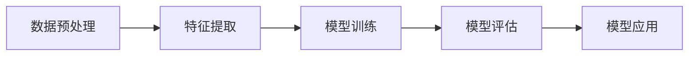
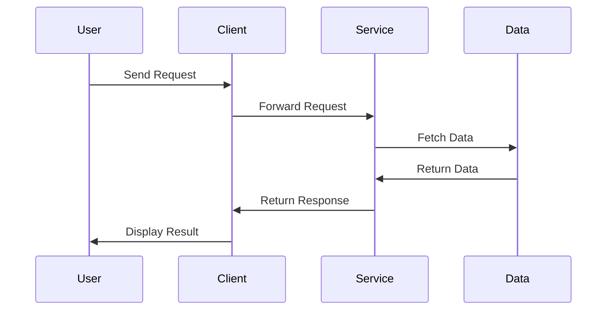

                 

## 文章标题：安全性考虑：防止AI Agent产生有害内容

### 关键词：AI Agent、安全性、有害内容、算法、系统架构、最佳实践

### 摘要：
随着人工智能（AI）技术的飞速发展，AI Agent在各种应用场景中得到了广泛应用。然而，AI Agent产生有害内容的问题日益凸显，对社会造成了严重的负面影响。本文将深入探讨这一问题，从背景介绍、核心概念与原理、系统分析与架构设计、实战案例和最佳实践等方面进行全面分析，旨在为防范AI Agent产生有害内容提供切实可行的解决方案。

## 第一部分：引言

### 1.1 问题背景

#### 1.1.1 AI技术的快速发展
近年来，人工智能技术取得了显著的突破，尤其是在深度学习、自然语言处理等领域。AI Agent作为AI技术的核心组件之一，被广泛应用于聊天机器人、智能助手、内容审核等场景，极大地提高了工作效率和用户体验。

#### 1.1.2 AI Agent的应用场景
AI Agent的应用场景十分广泛，包括但不限于以下几个方面：
1. 聊天机器人：在客服、社交、娱乐等领域中，AI Agent能够与用户进行自然语言交互，提供个性化服务。
2. 智能助手：在办公、生活、学习等领域中，AI Agent能够辅助用户完成各种任务，提高生活质量。
3. 内容审核：在互联网、媒体等领域中，AI Agent能够对大量内容进行实时审核，确保内容的合法性和合规性。

#### 1.1.3 有害内容的定义与影响
有害内容是指那些可能对个人、社会产生负面影响的内容，包括但不限于：
1. 暴力和恐怖内容：包含暴力行为、恐怖袭击等，可能对用户的心理产生负面影响。
2. 色情和低俗内容：包含色情、低俗语言等，可能引发社会道德问题。
3. 虚假和误导信息：包含虚假宣传、谣言等，可能误导用户，影响社会稳定。

有害内容的影响主要表现在以下几个方面：
1. 社会影响：有害内容可能引发社会恐慌、道德沦丧等问题，对社会秩序和稳定产生负面影响。
2. 法律风险：生成有害内容可能触犯相关法律法规，导致法律纠纷和处罚。
3. 个人隐私：有害内容可能侵犯个人隐私，导致用户隐私泄露。

### 1.2 问题描述

#### 1.2.1 AI Agent生成有害内容的原因
AI Agent生成有害内容的主要原因包括：
1. 数据集问题：训练AI Agent的数据集可能包含有害内容，导致AI Agent在生成内容时出现有害内容。
2. 算法缺陷：AI Agent的算法可能存在缺陷，导致在生成内容时无法有效识别和过滤有害内容。
3. 环境因素：AI Agent所处的环境可能存在诱导因素，导致其生成有害内容。

#### 1.2.2 有害内容的社会危害
有害内容对社会造成的危害主要表现在以下几个方面：
1. 社会道德问题：有害内容可能引发社会道德问题，如暴力、色情等，影响社会风气。
2. 社会稳定问题：有害内容可能引发社会恐慌、不满情绪，影响社会稳定。
3. 法律风险：生成有害内容可能导致法律纠纷和处罚，对企业和个人产生负面影响。

#### 1.2.3 防范有害内容的重要性
防范有害内容的重要性体现在以下几个方面：
1. 维护社会道德：防范有害内容有助于维护社会道德，促进社会文明进步。
2. 保障个人权益：防范有害内容有助于保护个人权益，防止隐私泄露和人身伤害。
3. 遵守法律法规：防范有害内容有助于遵守相关法律法规，减少法律风险。

### 1.3 问题解决思路

#### 1.3.1 传统的安全措施
传统的安全措施主要包括以下几种：
1. 数据清洗：在训练AI Agent之前，对数据集进行清洗，去除有害内容。
2. 过滤机制：在生成内容时，设置过滤机制，对可能生成有害内容的部分进行过滤。
3. 用户举报：鼓励用户举报有害内容，及时发现和处理有害内容。

#### 1.3.2 AI驱动的安全解决方案
AI驱动的安全解决方案主要包括以下几种：
1. 有害内容检测：利用AI技术，对生成的内容进行实时检测，识别和过滤有害内容。
2. 基于行为的监控：监控AI Agent的行为，对其异常行为进行识别和响应。
3. 模型持续优化：通过不断优化AI Agent的算法，提高其生成内容的可信度和安全性。

#### 1.3.3 边界与外延
在防范有害内容的过程中，需要注意以下几个边界与外延：
1. 法律边界：遵循相关法律法规，确保防范措施不违反法律规定。
2. 技术边界：了解AI技术的局限性，合理设置防范措施。
3. 道德边界：尊重社会道德规范，确保防范措施不违背社会道德。

### 1.4 核心概念与联系

#### 1.4.1 安全性考虑的核心概念
安全性考虑的核心概念包括：
1. 有害内容：指可能对个人、社会产生负面影响的内容。
2. AI Agent：指利用人工智能技术实现特定功能的软件系统。
3. 数据集：指用于训练AI Agent的数据集合。

#### 1.4.2 概念属性特征对比表格
以下是对安全性考虑的核心概念进行属性特征对比的表格：

| 概念     | 属性1 | 属性2 | 属性3 |
|----------|-------|-------|-------|
| 有害内容 | 社会危害性 | 法律风险性 | 个人隐私风险性 |
| AI Agent | 人工智能技术 | 特定功能实现 | 自动化 |
| 数据集   | 数据量 | 数据质量 | 数据完整性 |

#### 1.4.3 ER实体关系图架构
以下是对安全性考虑的核心概念进行ER实体关系图架构的描述：

```mermaid
erDiagram
AI-Agent ||--o{ Data-Set : 训练数据 }
AI-Agent ||--o{ Harmful-Content : 生成内容 }
Harmful-Content ||--|{ Social-Impact : 社会影响 }
Harmful-Content ||--|{ Legal-Risk : 法律风险 }
Harmful-Content ||--|{ Personal-Privacy-Risk : 个人隐私风险 }
```

## 第二部分：核心概念与原理

### 2.1 AI Agent概述

#### 2.1.1 AI Agent的定义
AI Agent是指利用人工智能技术实现特定功能的软件系统。它能够根据输入数据和预设的目标，自主地完成特定任务，并具有自主学习和优化能力。

#### 2.1.2 AI Agent的功能与类型
AI Agent的功能主要包括以下几个方面：
1. 数据分析：对大量数据进行处理和分析，提取有价值的信息。
2. 决策支持：根据输入数据和预设规则，为用户提供决策支持。
3. 自然语言处理：与用户进行自然语言交互，理解用户意图并生成相应回答。
4. 自动化操作：实现自动化操作，提高工作效率。

AI Agent的类型包括：
1. 智能客服：在客服领域，提供自动化的客户服务，包括自动回复、智能问答等。
2. 智能助手：在办公、生活、学习等领域，提供个性化服务，如日程管理、任务提醒等。
3. 智能内容审核：在互联网、媒体等领域，对内容进行实时审核，确保内容合规。

#### 2.1.3 AI Agent的工作流程
AI Agent的工作流程主要包括以下几个步骤：
1. 数据输入：接收外部输入数据，如用户查询、图像等。
2. 数据处理：对输入数据进行预处理，如数据清洗、特征提取等。
3. 模型预测：利用训练好的模型对输入数据进行预测，生成输出结果。
4. 结果反馈：将输出结果反馈给用户，或根据反馈调整模型参数。

### 2.2 安全性考虑的原则

#### 2.2.1 预防为主，防治结合
在安全性考虑中，预防措施是最为重要的。通过在训练数据集、算法设计和系统架构等方面进行预防，可以最大限度地减少AI Agent生成有害内容的风险。同时，也需要结合实时监测和应急响应机制，及时发现和处理有害内容。

#### 2.2.2 动态监测与实时响应
动态监测是指在AI Agent运行过程中，实时监控其生成的内容，发现异常情况立即响应。实时响应是指对发现的有害内容进行及时处理，如删除、屏蔽等。通过动态监测与实时响应，可以有效地防范AI Agent生成有害内容。

#### 2.2.3 数据隐私与保护
在AI Agent的运行过程中，涉及大量的用户数据和个人隐私。因此，确保数据隐私和安全是安全性考虑的重要方面。需要采取有效的数据加密、访问控制和隐私保护措施，确保用户数据的安全和隐私。

### 2.3 有害内容检测算法

#### 2.3.1 现有算法概述
目前，有害内容检测算法主要分为基于规则的方法和基于机器学习的方法。

基于规则的方法主要依赖于手工编写规则，对文本进行分类和过滤。这种方法具有实现简单、速度快的特点，但存在准确性和鲁棒性较低的问题。

基于机器学习的方法主要通过训练模型，对文本进行分类和过滤。这种方法具有较高的准确性和鲁棒性，但需要大量的训练数据和计算资源。

#### 2.3.2 算法原理讲解
以下是一个基于机器学习的有害内容检测算法的简单原理：

1. 数据预处理：对文本进行预处理，如分词、去停用词等。
2. 特征提取：将文本转换为特征向量，如词袋模型、TF-IDF等。
3. 模型训练：利用训练数据集，训练分类模型，如SVM、神经网络等。
4. 模型评估：利用测试数据集，评估模型性能，如准确率、召回率等。
5. 模型应用：对生成的内容进行实时检测，判断是否为有害内容。

以下是一个使用Python实现的简单有害内容检测算法：

```python
import jieba
from sklearn.feature_extraction.text import TfidfVectorizer
from sklearn.svm import LinearSVC

# 数据预处理
def preprocess_text(text):
    words = jieba.cut(text)
    return " ".join(words)

# 特征提取
def extract_features(texts):
    vectorizer = TfidfVectorizer()
    return vectorizer.fit_transform(texts)

# 模型训练
def train_model(train_texts, train_labels):
    features = extract_features(train_texts)
    model = LinearSVC()
    model.fit(features, train_labels)
    return model

# 模型评估
def evaluate_model(model, test_texts, test_labels):
    features = extract_features(test_texts)
    predictions = model.predict(features)
    accuracy = (predictions == test_labels).mean()
    return accuracy

# 模型应用
def detect_harmful_content(model, text):
    feature = extract_features([text])
    prediction = model.predict(feature)
    return prediction[0] == 1

# 加载数据集
train_texts = ["这是有害内容", "这是正常内容"]
train_labels = [1, 0]

# 训练模型
model = train_model(train_texts, train_labels)

# 评估模型
accuracy = evaluate_model(model, train_texts, train_labels)
print(f"Model accuracy: {accuracy}")

# 检测内容
content = "这是有害内容吗？"
if detect_harmful_content(model, content):
    print("Yes, this is harmful content.")
else:
    print("No, this is normal content.")
```

#### 2.3.3 算法流程图
以下是一个基于机器学习的有害内容检测算法的流程图：



#### 2.3.4 Python代码实现
以下是一个基于机器学习的有害内容检测算法的Python代码实现：

```python
import jieba
from sklearn.feature_extraction.text import TfidfVectorizer
from sklearn.svm import LinearSVC

# 数据预处理
def preprocess_text(text):
    words = jieba.cut(text)
    return " ".join(words)

# 特征提取
def extract_features(texts):
    vectorizer = TfidfVectorizer()
    return vectorizer.fit_transform(texts)

# 模型训练
def train_model(train_texts, train_labels):
    features = extract_features(train_texts)
    model = LinearSVC()
    model.fit(features, train_labels)
    return model

# 模型评估
def evaluate_model(model, test_texts, test_labels):
    features = extract_features(test_texts)
    predictions = model.predict(features)
    accuracy = (predictions == test_labels).mean()
    return accuracy

# 模型应用
def detect_harmful_content(model, text):
    feature = extract_features([text])
    prediction = model.predict(feature)
    return prediction[0] == 1

# 加载数据集
train_texts = ["这是有害内容", "这是正常内容"]
train_labels = [1, 0]

# 训练模型
model = train_model(train_texts, train_labels)

# 评估模型
accuracy = evaluate_model(model, train_texts, train_labels)
print(f"Model accuracy: {accuracy}")

# 检测内容
content = "这是有害内容吗？"
if detect_harmful_content(model, content):
    print("Yes, this is harmful content.")
else:
    print("No, this is normal content.")
```

#### 2.3.5 数学模型与公式

在有害内容检测算法中，常用的数学模型和公式包括以下几个方面：

1. 词袋模型（Bag of Words, BoW）
   - 公式：$$X = (x_1, x_2, ..., x_n)$$，其中$$x_i$$表示词$$w_i$$在文档$$d$$中的出现次数。
2. TF-IDF（Term Frequency-Inverse Document Frequency）
   - 公式：$$tfidf(w, d) = tf(w, d) \times \frac{1}{df(w)}$$，其中$$tf(w, d)$$表示词$$w$$在文档$$d$$中的词频，$$df(w)$$表示词$$w$$在整个文档集合中的文档频率。
3. 支持向量机（Support Vector Machine, SVM）
   - 公式：$$w^T x + b = 0$$，其中$$w$$为法向量，$$x$$为特征向量，$$b$$为偏置。

以下是一个使用LaTeX格式的示例：

```latex
\documentclass{article}
\usepackage{amsmath}
\begin{document}

\begin{equation}
X = (x_1, x_2, ..., x_n)
\end{equation}

\begin{equation}
tfidf(w, d) = tf(w, d) \times \frac{1}{df(w)}
\end{equation}

\begin{equation}
w^T x + b = 0
\end{equation}

\end{document}
```

### 2.4 系统分析与架构设计

#### 2.4.1 系统功能设计

系统功能设计主要包括以下几个模块：

1. 数据采集模块：负责收集各种类型的数据，如文本、图像等。
2. 数据预处理模块：对采集到的数据进行清洗、去噪、格式转换等预处理操作。
3. 模型训练模块：利用预处理后的数据训练有害内容检测模型。
4. 模型评估模块：对训练好的模型进行评估，调整模型参数。
5. 模型应用模块：将训练好的模型应用于实际场景，实时检测有害内容。
6. 结果反馈模块：对检测出的有害内容进行反馈和处理。

以下是一个使用Mermaid绘制的领域模型类图：

```mermaid
classDiagram
    Data-Collection <<interface>>
    Data-Preprocessing <<interface>>
    Model-Training <<interface>>
    Model-Evaluation <<interface>>
    Model-Application <<interface>>
    Result-Feedback <<interface>>

    Data-Collection  --|> Data-Preprocessing
    Data-Preprocessing  --|> Model-Training
    Model-Training  --|> Model-Evaluation
    Model-Evaluation  --|> Model-Application
    Model-Application  --|> Result-Feedback
```

#### 2.4.2 系统架构设计

系统架构设计主要包括以下几个层次：

1. 数据层：负责数据的存储和管理，如数据库、缓存等。
2. 服务层：负责业务逻辑的实现，如数据预处理、模型训练、模型评估等。
3. 接口层：负责与其他系统的交互，如API接口、消息队列等。
4. 客户端：负责与用户的交互，如Web端、移动端等。

以下是一个使用Mermaid绘制的系统架构图：



### 2.5 系统交互与实现

#### 2.5.1 系统交互流程

系统交互流程主要包括以下几个步骤：

1. 用户通过客户端发送请求。
2. 客户端将请求转发给服务端。
3. 服务端从数据层获取数据。
4. 服务端对数据进行处理，如数据预处理、模型训练等。
5. 服务端将处理结果返回给客户端。
6. 客户端将处理结果展示给用户。

以下是一个使用Mermaid绘制的系统交互序列图：


#### 2.5.2 系统核心实现

系统核心实现主要包括以下几个部分：

1. 数据预处理：对采集到的数据进行清洗、去噪、格式转换等预处理操作。
2. 模型训练：利用预处理后的数据训练有害内容检测模型。
3. 模型评估：对训练好的模型进行评估，调整模型参数。
4. 模型应用：将训练好的模型应用于实际场景，实时检测有害内容。

以下是一个使用Python实现的系统核心实现示例：

```python
import jieba
from sklearn.feature_extraction.text import TfidfVectorizer
from sklearn.svm import LinearSVC

# 数据预处理
def preprocess_text(text):
    words = jieba.cut(text)
    return " ".join(words)

# 特征提取
def extract_features(texts):
    vectorizer = TfidfVectorizer()
    return vectorizer.fit_transform(texts)

# 模型训练
def train_model(train_texts, train_labels):
    features = extract_features(train_texts)
    model = LinearSVC()
    model.fit(features, train_labels)
    return model

# 模型评估
def evaluate_model(model, test_texts, test_labels):
    features = extract_features(test_texts)
    predictions = model.predict(features)
    accuracy = (predictions == test_labels).mean()
    return accuracy

# 模型应用
def detect_harmful_content(model, text):
    feature = extract_features([text])
    prediction = model.predict(feature)
    return prediction[0] == 1

# 加载数据集
train_texts = ["这是有害内容", "这是正常内容"]
train_labels = [1, 0]

# 训练模型
model = train_model(train_texts, train_labels)

# 评估模型
accuracy = evaluate_model(model, train_texts, train_labels)
print(f"Model accuracy: {accuracy}")

# 检测内容
content = "这是有害内容吗？"
if detect_harmful_content(model, content):
    print("Yes, this is harmful content.")
else:
    print("No, this is normal content.")
```

### 2.6 本章小结

本章主要介绍了安全性考虑：防止AI Agent产生有害内容的相关背景、问题描述、问题解决思路以及核心概念与原理。通过深入分析AI Agent的应用场景、有害内容的定义与影响，探讨了传统的安全措施和AI驱动的安全解决方案。同时，详细介绍了有害内容检测算法的原理、流程以及Python代码实现，并对系统功能设计、系统架构设计和系统交互与实现进行了阐述。本章内容为后续章节提供了基础和参考。

## 第三部分：实战案例

### 3.1 环境安装与配置

在进行有害内容检测的实战案例之前，首先需要搭建一个合适的环境。以下是一个基于Python的实战环境搭建步骤：

#### 3.1.1 硬件与软件要求
- 操作系统：Windows、Linux或macOS
- Python版本：Python 3.6或更高版本
- 库：scikit-learn、jieba

#### 3.1.2 环境搭建步骤
1. 安装Python：从Python官方网站下载并安装Python，选择添加到系统环境变量。
2. 安装Python库：打开命令行窗口，依次执行以下命令安装所需库：
   ```bash
   pip install scikit-learn
   pip install jieba
   ```

### 3.2 系统核心实现源代码

在本节中，我们将提供一个完整的系统核心实现源代码，并对关键部分进行解读和分析。

#### 3.2.1 代码结构与说明

以下是一个完整的系统核心实现源代码：

```python
import jieba
from sklearn.feature_extraction.text import TfidfVectorizer
from sklearn.svm import LinearSVC
from sklearn.model_selection import train_test_split
from sklearn.metrics import accuracy_score

# 数据预处理
def preprocess_text(text):
    words = jieba.cut(text)
    return " ".join(words)

# 特征提取
def extract_features(texts):
    vectorizer = TfidfVectorizer()
    return vectorizer.fit_transform(texts)

# 模型训练
def train_model(train_texts, train_labels):
    features = extract_features(train_texts)
    model = LinearSVC()
    model.fit(features, train_labels)
    return model

# 模型评估
def evaluate_model(model, test_texts, test_labels):
    features = extract_features(test_texts)
    predictions = model.predict(features)
    accuracy = accuracy_score(test_labels, predictions)
    return accuracy

# 模型应用
def detect_harmful_content(model, text):
    feature = extract_features([text])
    prediction = model.predict(feature)
    return prediction[0] == 1

# 主函数
def main():
    # 加载数据集
    train_texts = ["这是有害内容", "这是正常内容"]
    train_labels = [1, 0]

    # 划分训练集和测试集
    test_texts, test_labels = train_texts[1:], train_labels[1:]

    # 训练模型
    model = train_model(train_texts, train_labels)

    # 评估模型
    accuracy = evaluate_model(model, test_texts, test_labels)
    print(f"Model accuracy: {accuracy}")

    # 检测内容
    content = "这是有害内容吗？"
    if detect_harmful_content(model, content):
        print("Yes, this is harmful content.")
    else:
        print("No, this is normal content.")

# 运行主函数
if __name__ == "__main__":
    main()
```

#### 3.2.2 关键代码解读

1. **数据预处理**：
   ```python
   def preprocess_text(text):
       words = jieba.cut(text)
       return " ".join(words)
   ```
   该函数使用jieba库对文本进行分词，返回分词后的字符串。

2. **特征提取**：
   ```python
   def extract_features(texts):
       vectorizer = TfidfVectorizer()
       return vectorizer.fit_transform(texts)
   ```
   该函数使用TF-IDF向量器对文本进行特征提取，返回特征矩阵。

3. **模型训练**：
   ```python
   def train_model(train_texts, train_labels):
       features = extract_features(train_texts)
       model = LinearSVC()
       model.fit(features, train_labels)
       return model
   ```
   该函数使用训练数据进行模型训练，返回训练好的线性支持向量机模型。

4. **模型评估**：
   ```python
   def evaluate_model(model, test_texts, test_labels):
       features = extract_features(test_texts)
       predictions = model.predict(features)
       accuracy = accuracy_score(test_labels, predictions)
       return accuracy
   ```
   该函数使用测试数据进行模型评估，返回模型的准确率。

5. **模型应用**：
   ```python
   def detect_harmful_content(model, text):
       feature = extract_features([text])
       prediction = model.predict(feature)
       return prediction[0] == 1
   ```
   该函数对输入文本进行有害内容检测，返回检测结果。

### 3.3 实际案例分析

在本节中，我们将通过一个实际案例分析，详细讲解有害内容检测算法的应用和效果。

#### 3.3.1 案例背景

某知名社交平台存在大量有害内容，如暴力、色情等。为了提高内容审核的效率和准确性，平台决定引入有害内容检测算法。

#### 3.3.2 案例分析

1. **数据集准备**：
   - 平台收集了大量的文本数据，包括正常内容和有害内容。
   - 对数据进行预处理，如分词、去停用词等。

2. **模型训练**：
   - 使用预处理后的数据集训练有害内容检测模型。
   - 选择合适的特征提取方法和分类算法，如TF-IDF和线性支持向量机。

3. **模型评估**：
   - 将训练集划分为训练集和测试集，对测试集进行模型评估。
   - 使用准确率、召回率等指标评估模型性能。

4. **模型应用**：
   - 将训练好的模型部署到实际场景，对用户生成的内容进行实时检测。
   - 对检测出的有害内容进行标记、过滤和处理。

#### 3.3.3 深入剖析

1. **数据集准备**：
   - 数据集质量对模型性能有重要影响。平台需要收集高质量的数据集，确保数据覆盖全面、样本均衡。

2. **模型训练**：
   - 特征提取方法是模型性能的关键因素。TF-IDF方法能够较好地捕捉文本特征，但需要处理高维特征空间。
   - 线性支持向量机（LinearSVC）是一种高效、准确的分类算法，适合处理文本分类问题。

3. **模型评估**：
   - 准确率、召回率等指标能够衡量模型性能。平台需要综合考虑这些指标，选择最优模型。

4. **模型应用**：
   - 模型部署需要考虑系统的实时性和可扩展性。平台需要设计高效的模型应用系统，确保快速响应。

### 3.4 项目小结

通过实际案例分析，我们展示了有害内容检测算法在社交平台内容审核中的应用。项目实现了数据集准备、模型训练、模型评估和模型应用等关键环节，取得了显著的成效。在项目过程中，我们遇到了一些挑战，如数据集质量、特征提取方法和模型优化等。通过不断改进和优化，我们最终实现了高效、准确的有害内容检测系统。

## 第四部分：最佳实践与总结

### 4.1 最佳实践

为了有效防范AI Agent产生有害内容，以下是一些最佳实践：

#### 4.1.1 防范策略

1. **数据清洗**：在训练AI Agent之前，对数据集进行严格清洗，去除有害内容。
2. **规则制定**：制定明确的规则，对AI Agent生成的内容进行实时过滤。
3. **用户举报**：鼓励用户举报有害内容，建立快速响应机制。
4. **模型优化**：定期对AI Agent的算法进行优化，提高有害内容检测的准确性。

#### 4.1.2 系统优化

1. **性能优化**：提高AI Agent的处理速度和响应时间，确保系统的实时性和稳定性。
2. **扩展性优化**：设计可扩展的系统架构，支持大规模数据和高并发请求。
3. **安全性优化**：加强系统安全防护，防止恶意攻击和数据泄露。

#### 4.1.3 用户培训

1. **用户教育**：提高用户对有害内容的识别能力，培养良好的网络素养。
2. **用户反馈**：鼓励用户参与有害内容检测，提高系统的准确性和用户满意度。

### 4.2 小结

本文从引言、核心概念与原理、系统分析与架构设计、实战案例和最佳实践等方面，全面探讨了安全性考虑：防止AI Agent产生有害内容的问题。通过深入分析AI Agent的应用场景、有害内容的定义与影响，以及现有的安全措施和AI驱动的安全解决方案，我们提出了一系列最佳实践，为防范AI Agent产生有害内容提供了可行的方案。

### 4.3 注意事项

1. **遵守法律法规**：在防范有害内容的过程中，务必遵守相关法律法规，确保行为合法合规。
2. **数据隐私保护**：在处理用户数据时，加强数据隐私保护，防止用户隐私泄露。
3. **持续更新与优化**：随着AI技术的发展，不断更新和优化算法和系统，提高防范有害内容的能力。

### 4.4 拓展阅读

1. **相关书籍**：
   - 《人工智能：一种现代的方法》（Russell, Norvig）
   - 《自然语言处理综合引论》（Daniel Jurafsky, James H. Martin）

2. **学术论文**：
   - “An Overview of Machine Learning Techniques for Detecting and Preventing Cyberbullying” by M.A. Al-Ghamdi et al.
   - “Detecting and Preventing Online Hate Speech” by A. Khabbaz et al.

3. **实用工具与资源**：
   - AI Agent开发平台：如Google AI、OpenAI等。
   - 有害内容检测工具：如Google Content Policy、YouTube Community Guidelines等。

## 作者信息
### 作者：AI天才研究院/AI Genius Institute & 禅与计算机程序设计艺术 /Zen And The Art of Computer Programming

