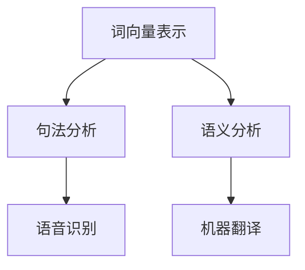
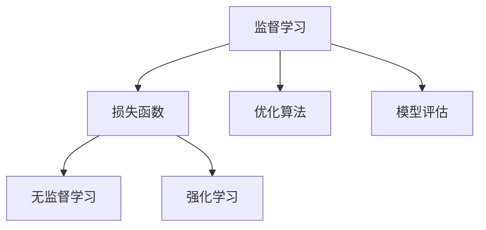
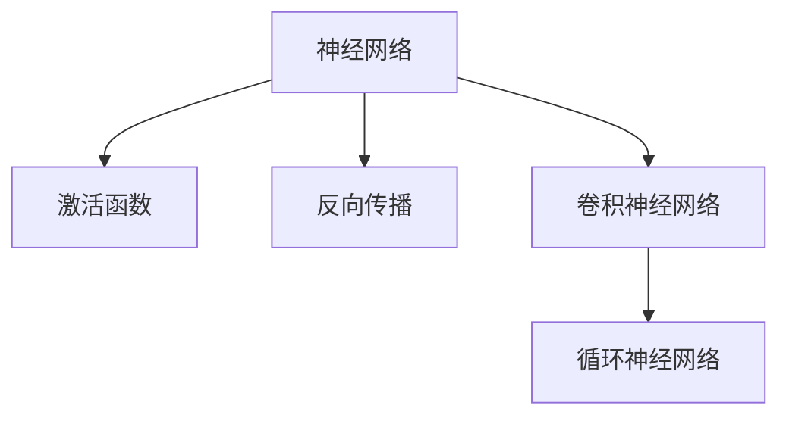
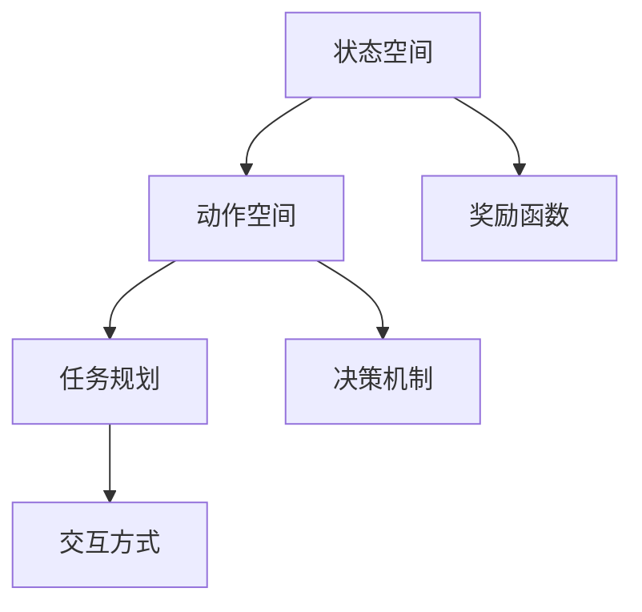
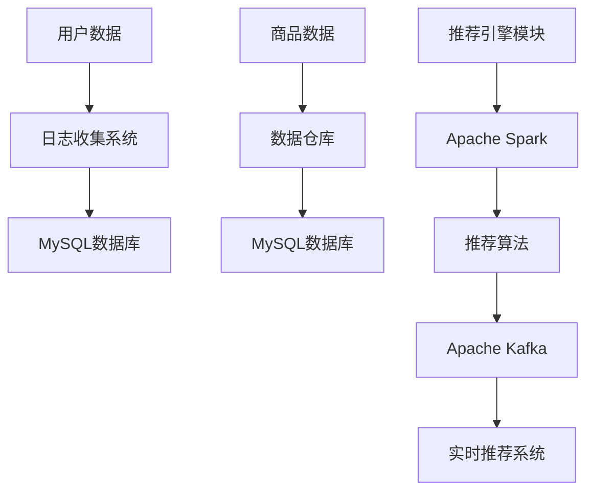

                 

# 《定制化AI Agent：满足特定行业需求》

## 关键词

- AI Agent
- 定制化
- 特定行业需求
- 自然语言处理
- 机器学习
- 深度学习
- 应用场景
- 技术实现
- 项目实战

## 摘要

本文将深入探讨定制化AI Agent在满足特定行业需求中的重要作用。随着人工智能技术的快速发展，AI Agent作为一种智能实体，正逐渐成为各行业自动化和智能化的关键推动力。本文首先介绍了AI Agent的基本概念和定制化AI Agent的特点，然后详细分析了自然语言处理、机器学习和深度学习等核心概念与理论基础。接着，本文通过金融、医疗、制造和零售等四个具体行业，展示了定制化AI Agent的应用场景和技术实现。此外，本文还通过一个项目实战案例，详细阐述了定制化AI Agent的开发过程。最后，本文对定制化AI Agent的优化与未来展望进行了深入探讨，以期为读者提供全面的技术指南。

## 第1章 引言

### 1.1 问题背景

随着人工智能技术的飞速发展，AI Agent逐渐成为各行各业自动化和智能化的关键推动力。AI Agent，也称为智能代理，是一种能够在特定环境中自主执行任务的计算机程序。它们能够模拟人类智能，处理复杂的问题，并根据环境变化做出相应的决策。从早期的简单规则系统，到如今基于深度学习和自然语言处理的复杂算法，AI Agent的发展已经取得了显著的进步。

在金融、医疗、制造和零售等行业，定制化AI Agent的应用已经日益普及。金融行业中的AI Agent可以用于智能风控、个性化金融服务；医疗行业中的AI Agent可以辅助医生进行诊断、个性化健康管理；制造行业中的AI Agent可以实现智能制造、智能供应链管理；零售行业中的AI Agent可以提供个性化推荐、智能客服等。然而，随着行业需求的不断变化，如何定制化地满足特定行业的需求成为了一个亟待解决的问题。

### 1.2 问题提出

为什么需要定制化AI Agent？首先，特定行业的需求具有多样性和复杂性。不同行业有不同的业务流程、数据结构和业务目标，这要求AI Agent必须具备高度灵活性和定制化能力。其次，传统的一刀切解决方案往往无法满足特定行业的个性化需求，导致AI Agent的实际应用效果不尽如人意。最后，随着技术的不断发展，定制化AI Agent能够更好地适应新的业务场景和技术变革。

定制化AI Agent的挑战在于如何准确理解特定行业的业务需求，如何设计高效、智能的算法模型，以及如何确保系统的可扩展性和可维护性。然而，这也带来了巨大的机遇。通过定制化AI Agent，企业可以实现业务流程的自动化和智能化，提高运营效率，降低成本，提升用户体验。

### 1.3 书籍结构安排

本书将按照以下结构进行组织：

1. 引言：介绍AI Agent的背景、问题提出和书籍结构安排。
2. 定制化AI Agent概述：介绍AI Agent的基本概念、定制化AI Agent的特点和发展现状。
3. 核心概念与理论基础：详细分析自然语言处理、机器学习和深度学习等核心概念。
4. 应用场景与技术实现：通过金融、医疗、制造和零售等行业，展示定制化AI Agent的应用场景和技术实现。
5. 项目实战与案例分析：通过一个具体项目，详细阐述定制化AI Agent的开发过程。
6. 定制化AI Agent的优化与未来展望：探讨AI Agent的性能优化、安全与隐私保护以及未来的发展方向。
7. 小结与拓展阅读：总结全书的核心知识点，并提供拓展阅读资源。

通过以上结构安排，本书旨在帮助读者全面了解定制化AI Agent的开发与应用，为各行业的智能化转型提供技术指南。

## 第2章 定制化AI Agent概述

### 2.1 AI Agent的基本概念

AI Agent，即人工智能代理，是一种能够模拟人类智能行为，具备自主决策和行动能力的计算机程序。它通常由感知模块、决策模块和行动模块三个部分组成。感知模块负责接收外部环境的信息，如文字、图片、声音等；决策模块根据感知模块提供的信息，利用机器学习算法和深度学习模型进行推理和决策；行动模块则根据决策模块的决策结果，执行具体的行动，如发送邮件、拨打电话、移动机器人等。

AI Agent的分类多种多样，根据其应用场景和功能特点，可以分为以下几种类型：

1. **基于规则的AI Agent**：这类AI Agent基于预先设定的规则进行决策和行动，通常用于简单的业务流程自动化。
2. **基于数据的AI Agent**：这类AI Agent通过分析历史数据，利用机器学习算法和统计模型进行决策，适用于数据量较大的场景。
3. **基于模型的AI Agent**：这类AI Agent通过构建复杂的深度学习模型，进行自主学习和推理，适用于复杂的业务场景。
4. **混合型AI Agent**：这类AI Agent结合了基于规则、基于数据和基于模型的特点，能够在多种场景下灵活应用。

AI Agent的特点主要体现在以下几个方面：

1. **自主性**：AI Agent能够根据环境变化，自主感知、决策和行动，无需人工干预。
2. **智能性**：AI Agent具备学习和推理能力，能够处理复杂的问题，并从数据中提取有价值的信息。
3. **灵活性**：AI Agent可以根据不同的业务需求和环境特点，进行定制化设计和调整。

### 2.2 定制化AI Agent的特点

定制化AI Agent是根据特定行业需求，针对具体业务场景进行设计和优化的AI Agent。与通用型AI Agent相比，定制化AI Agent具有以下特点：

1. **根据特定行业需求定制**：定制化AI Agent能够深刻理解特定行业的业务流程和需求，提供针对性的解决方案。
2. **高度自动化与智能化**：定制化AI Agent能够实现高度自动化和智能化，提高业务效率，减少人力成本。
3. **针对性**：定制化AI Agent针对性强，能够更好地满足特定行业的需求，提升用户体验。

定制化AI Agent的应用范围非常广泛，涵盖了金融、医疗、制造、零售等多个行业。在金融行业，定制化AI Agent可以用于智能风控、个性化金融服务；在医疗行业，定制化AI Agent可以辅助医生进行诊断、个性化健康管理；在制造行业，定制化AI Agent可以实现智能制造、智能供应链管理；在零售行业，定制化AI Agent可以提供个性化推荐、智能客服等。

### 2.3 定制化AI Agent的发展现状与趋势

定制化AI Agent的发展已经取得了一定的成果，主要表现在以下几个方面：

1. **技术发展**：随着深度学习、自然语言处理、机器学习等技术的不断进步，定制化AI Agent的算法模型和性能得到了显著提升。
2. **应用拓展**：定制化AI Agent在金融、医疗、制造、零售等行业的应用已经得到了广泛验证，越来越多的企业开始采用定制化AI Agent来提升业务效率。
3. **行业趋势**：随着人工智能技术的不断成熟，定制化AI Agent将在更多行业得到应用，成为企业智能化转型的重要工具。

未来，定制化AI Agent的发展趋势将表现在以下几个方面：

1. **智能化程度提升**：随着算法和技术的不断进步，定制化AI Agent的智能化程度将进一步提高，能够更好地理解复杂业务场景，提供更精准的决策。
2. **跨行业应用**：定制化AI Agent将在更多行业得到应用，实现跨行业融合，推动各行业的智能化转型。
3. **用户参与度增强**：定制化AI Agent将更加注重用户体验，通过个性化定制和服务，提高用户的参与度和满意度。

通过以上分析，我们可以看到，定制化AI Agent作为一种新兴的技术，正逐渐成为各行业智能化转型的关键推动力。随着技术的不断进步和应用场景的不断扩大，定制化AI Agent将在未来发挥更加重要的作用。

### 2.4 定制化AI Agent的应用挑战与前景

定制化AI Agent在特定行业中的应用面临着一系列挑战，同时也展现出了广阔的前景。

**挑战**

1. **数据质量与隐私**：定制化AI Agent需要大量的高质量数据来训练和优化模型。然而，数据的收集和处理过程中可能涉及到隐私和数据安全问题，这要求企业在数据管理和保护方面投入更多资源。
2. **模型复杂性与解释性**：深度学习模型在处理复杂任务时表现优秀，但它们通常是非线性和不透明的。这使得模型的结果难以解释，特别是在金融和医疗等对解释性要求较高的领域。
3. **技术成熟度**：尽管定制化AI Agent在技术上取得了显著进展，但某些特定的算法和技术可能尚未完全成熟，需要进一步的研究和开发。

**前景**

1. **个性化服务**：定制化AI Agent能够根据用户的具体需求提供个性化的服务和推荐，从而提升用户体验和满意度。
2. **运营效率提升**：通过自动化和智能化的任务执行，定制化AI Agent可以显著提高业务流程的效率，降低运营成本。
3. **行业创新**：定制化AI Agent的应用将推动各行业的创新和变革，为企业带来新的商业模式和竞争优势。

总之，定制化AI Agent的应用挑战和前景并存。随着技术的不断进步和应用的深入，这些挑战将被逐步克服，定制化AI Agent将在更广泛的领域中发挥重要作用。

### 第3章 核心概念与理论基础

#### 3.1 自然语言处理

自然语言处理（Natural Language Processing，NLP）是人工智能领域的一个重要分支，主要研究如何使计算机能够理解、生成和处理人类语言。NLP的关键技术包括语言模型、语音识别和机器翻译。

**语言模型**：语言模型是NLP的核心组件，用于预测文本序列的概率分布。常见的语言模型有基于统计的模型（如N-gram模型）和基于神经网络的模型（如循环神经网络RNN和变压器Transformer）。语言模型在文本生成、摘要生成和语言理解等方面有广泛应用。

**语音识别**：语音识别是将语音信号转换为文本的过程。它通常包括特征提取、声学模型和语言模型三个阶段。语音识别技术在智能客服、语音助手和语音搜索等领域得到了广泛应用。

**机器翻译**：机器翻译是将一种语言的文本翻译成另一种语言的过程。传统的机器翻译方法包括基于规则的翻译和基于统计的翻译。而基于神经网络的机器翻译（如Transformer模型）在近年来取得了显著突破，使得翻译质量大幅提升。

**核心概念与联系**

自然语言处理的核心概念包括词向量表示、句法分析、语义分析等。词向量表示是将词汇映射到高维空间中的向量，从而利用空间关系进行文本分析。句法分析是解析句子结构，识别句子的语法成分。语义分析则是理解句子的含义，包括词义消歧、实体识别和关系抽取等。

自然语言处理的联系图如下（使用Mermaid绘制）：



#### 3.2 机器学习算法

机器学习算法是构建定制化AI Agent的核心技术，主要分为监督学习、无监督学习和强化学习。

**监督学习**：监督学习是一种从标记数据中学习的方法。它通过输入特征和标签之间的关系，训练模型来预测新的数据。常见的监督学习算法包括线性回归、决策树、支持向量机和神经网络。

**无监督学习**：无监督学习是一种不依赖于标记数据的方法。它通过分析数据之间的内在结构，如聚类和降维，来揭示数据的特点。常见的无监督学习算法包括K-均值聚类、主成分分析和自编码器。

**强化学习**：强化学习是一种通过与环境互动来学习最优策略的方法。它通过奖励和惩罚机制，不断调整策略，以达到最大化累计奖励的目标。常见的强化学习算法包括Q学习、深度Q网络（DQN）和策略梯度算法。

**核心概念与联系**

机器学习的核心概念包括损失函数、优化算法和模型评估。损失函数用于衡量模型预测值与真实值之间的差距，优化算法用于调整模型参数以最小化损失函数，模型评估则用于评估模型的泛化能力。

机器学习算法的联系图如下（使用Mermaid绘制）：



#### 3.3 深度学习技术

深度学习技术是机器学习的一个重要分支，通过构建多层神经网络，从大量数据中自动学习特征表示。深度学习技术在图像识别、语音识别和自然语言处理等领域取得了显著成果。

**神经网络**：神经网络是深度学习的基础，由多个节点（称为神经元）组成，每个神经元接收多个输入，并通过加权求和和激活函数产生输出。

**卷积神经网络（CNN）**：CNN是专门用于图像识别和处理的一种神经网络架构。它通过卷积操作提取图像特征，并在多个卷积层中逐步细化特征。

**循环神经网络（RNN）**：RNN是专门用于处理序列数据的神经网络。它通过记忆状态捕捉序列中的长期依赖关系。

**核心概念与联系**

深度学习的核心概念包括激活函数、反向传播和卷积操作。激活函数用于引入非线性特性，反向传播是一种优化算法，用于调整网络参数，卷积操作是CNN的核心。

深度学习技术的联系图如下（使用Mermaid绘制）：



#### 3.4 AI Agent的设计原理

AI Agent的设计原理包括任务规划、决策机制和交互方式。

**任务规划**：任务规划是指AI Agent如何根据当前状态和目标，制定一系列行动步骤。常见的任务规划算法包括基于启发式的方法（如A*算法）和基于模型预测的方法（如深度强化学习）。

**决策机制**：决策机制是指AI Agent如何根据感知模块提供的信息，选择最优的行动。常见的决策机制包括基于规则的决策、基于数据的决策和基于模型的决策。

**交互方式**：交互方式是指AI Agent如何与人类或环境进行沟通和互动。常见的交互方式包括文本交互、语音交互和视觉交互。

**核心概念与联系**

AI Agent的设计原理的核心概念包括状态空间、动作空间和奖励函数。状态空间是指AI Agent当前所处的环境状态，动作空间是指AI Agent可以执行的所有动作，奖励函数用于衡量AI Agent行动的有效性。

AI Agent的设计原理联系图如下（使用Mermaid绘制）：



通过以上分析，我们可以看到，自然语言处理、机器学习和深度学习等技术为定制化AI Agent提供了强大的理论基础，而AI Agent的设计原理则确保了它们在实际应用中的有效性和灵活性。接下来，我们将进一步探讨这些技术在实际应用场景中的实现方法。

### 第4章 应用场景与技术实现

在当今的快速变化的市场中，各行各业都在寻求通过技术变革来提高效率和竞争力。定制化AI Agent作为一种高度智能化和自动化的工具，正在逐渐改变着金融、医疗、制造和零售等行业的运营模式。以下将详细介绍这些行业中的定制化AI Agent应用场景和技术实现。

#### 4.1 金融行业

**定制化AI Agent在金融风控中的应用**：

在金融行业，定制化AI Agent已经被广泛应用于风险管理、欺诈检测和信用评估等方面。例如，银行可以使用定制化AI Agent来实时监控交易行为，识别潜在的欺诈行为。这些AI Agent可以通过分析交易模式、客户行为和交易环境等多个维度，利用机器学习和深度学习算法，预测并阻止异常交易。

**个性化金融服务的实现**：

定制化AI Agent还可以为金融企业提供个性化服务。通过分析客户的财务状况、投资偏好和行为习惯，AI Agent可以为客户提供量身定制的金融产品推荐、投资策略建议和理财规划服务。这种个性化服务不仅提高了客户满意度，还增加了客户的忠诚度和银行的盈利能力。

**技术实现**：

1. **数据收集与预处理**：定制化AI Agent首先需要收集大量的交易数据、客户行为数据和财务数据。这些数据经过清洗和预处理，以便于后续的分析和建模。
2. **机器学习算法**：使用监督学习和无监督学习算法，如决策树、随机森林、支持向量机和神经网络等，对数据进行建模和分析。
3. **深度学习模型**：为了提高欺诈检测和信用评估的准确性，可以使用深度学习模型，如卷积神经网络（CNN）和循环神经网络（RNN），从数据中自动提取复杂特征。
4. **API接口与集成**：将定制化AI Agent与银行的现有系统进行集成，通过API接口实现数据的实时传递和服务的自动化。

#### 4.2 医疗行业

**定制化AI Agent在医学诊断中的应用**：

在医疗行业，定制化AI Agent可以辅助医生进行疾病诊断，提高诊断的准确性和效率。例如，AI Agent可以通过分析患者的病史、体检数据和医学影像，利用深度学习和自然语言处理技术，提供疾病预测和诊断建议。

**个性化健康管理的实现**：

定制化AI Agent还可以为患者提供个性化的健康管理服务。通过收集和分析患者的健康数据，AI Agent可以制定个性化的健康计划，包括饮食建议、运动计划、药物管理等方面。

**技术实现**：

1. **医疗数据收集与预处理**：定制化AI Agent需要收集大量的医疗数据，如电子病历、医学影像和基因组数据。这些数据经过清洗和预处理，以便于后续的分析和建模。
2. **自然语言处理技术**：使用自然语言处理技术，如文本分类和实体识别，对医疗文献和病历文本进行分析，提取有价值的信息。
3. **深度学习模型**：利用深度学习模型，如卷积神经网络（CNN）和循环神经网络（RNN），对医学影像和基因组数据进行处理，提取特征并进行诊断预测。
4. **个性化推荐算法**：基于用户的健康数据和偏好，使用推荐算法为用户生成个性化的健康建议和计划。

#### 4.3 制造业

**定制化AI Agent在智能制造中的应用**：

在制造业，定制化AI Agent可以用于设备维护预测、质量检测和供应链管理等方面。例如，AI Agent可以通过实时监测设备的运行状态，预测设备故障并提前进行维护，从而提高生产效率并降低维修成本。

**智能供应链管理的实现**：

定制化AI Agent还可以用于智能供应链管理。通过分析供应链中的数据，AI Agent可以优化库存管理、预测需求变化，并提高供应链的灵活性和响应速度。

**技术实现**：

1. **设备数据收集与预处理**：定制化AI Agent需要收集设备运行数据，如温度、压力和振动数据。这些数据经过清洗和预处理，以便于后续的分析和建模。
2. **时间序列分析**：使用时间序列分析技术，如自回归模型（AR）、移动平均模型（MA）和自回归移动平均模型（ARMA），对设备数据进行建模和分析，预测设备故障。
3. **深度学习模型**：使用深度学习模型，如长短期记忆网络（LSTM）和卷积神经网络（CNN），对图像和传感器数据进行分析，检测产品质量。
4. **供应链优化算法**：基于供应链中的数据，使用优化算法，如线性规划和遗传算法，进行供应链的优化和调度。

#### 4.4 零售行业

**定制化AI Agent在零售业中的应用**：

在零售行业，定制化AI Agent可以用于个性化推荐、智能客服和库存管理等方面。例如，AI Agent可以通过分析用户的购物行为和历史数据，提供个性化的产品推荐，提高用户的购物体验。

**个性化推荐系统的实现**：

定制化AI Agent还可以用于构建个性化的推荐系统。通过分析用户的浏览记录、购买行为和反馈信息，AI Agent可以生成个性化的推荐列表，提高用户的满意度和购买转化率。

**技术实现**：

1. **用户数据收集与预处理**：定制化AI Agent需要收集用户的浏览记录、购买行为和反馈数据。这些数据经过清洗和预处理，以便于后续的分析和建模。
2. **协同过滤算法**：使用协同过滤算法，如用户基于物品的协同过滤（User-Based CF）和物品基于用户的协同过滤（Item-Based CF），生成推荐列表。
3. **深度学习模型**：使用深度学习模型，如卷积神经网络（CNN）和循环神经网络（RNN），从用户数据中提取复杂特征，生成个性化的推荐。
4. **实时推荐引擎**：通过实时数据流处理技术，如Apache Kafka和Apache Flink，实现推荐系统的实时性和动态性。

通过以上分析，我们可以看到，定制化AI Agent在不同行业中的应用场景和技术实现各有特点。无论是金融、医疗、制造还是零售，定制化AI Agent都为各行业的智能化转型提供了强大的技术支持。随着技术的不断进步和应用场景的不断拓展，定制化AI Agent将在未来发挥更加重要的作用。

### 第5章 项目实战与案例分析

在本章中，我们将通过一个具体的项目案例，深入探讨定制化AI Agent的开发过程。该项目是为一家电商业公司开发一个基于深度学习的个性化推荐系统，旨在提高用户的购物体验和购买转化率。

#### 5.1 项目介绍

**项目背景**：

该公司是一家大型电商企业，拥有海量的用户数据和商品数据。然而，传统的推荐系统效果不佳，无法满足用户日益增长的个性化需求。因此，公司决定开发一个基于深度学习的个性化推荐系统，以提升用户的购物体验和转化率。

**项目目标**：

1. 建立一个高效的个性化推荐系统，能够根据用户的兴趣和行为，提供个性化的商品推荐。
2. 提高推荐系统的准确性和实时性，提升用户的满意度和购买转化率。
3. 确保推荐系统的可扩展性和可维护性，以应对业务规模的不断扩大。

#### 5.2 系统功能设计

**功能模块划分**：

个性化推荐系统的主要功能模块包括用户模块、商品模块和推荐引擎模块。

1. **用户模块**：负责收集用户的浏览记录、购买行为和反馈信息，生成用户画像。
2. **商品模块**：负责收集商品的信息，包括商品描述、标签和用户评分等，生成商品画像。
3. **推荐引擎模块**：基于用户画像和商品画像，利用深度学习算法生成个性化的推荐列表。

**数据流程分析**：

1. 用户数据：包括用户的浏览记录、购买记录、评价和反馈等。这些数据通过日志收集系统实时收集，并存储在数据库中。
2. 商品数据：包括商品描述、标签、用户评分等。这些数据从电商平台的数据仓库中提取，并存储在数据库中。
3. 推荐列表生成：推荐引擎模块根据用户画像和商品画像，使用深度学习算法生成个性化的推荐列表，并实时推送至用户。

#### 5.3 系统架构设计

**技术栈选择**：

1. 数据存储：使用MySQL数据库存储用户数据和商品数据。
2. 数据处理：使用Apache Spark进行大规模数据处理和特征提取。
3. 推荐算法：使用基于深度学习的推荐算法，如卷积神经网络（CNN）和循环神经网络（RNN）。
4. 推荐引擎：使用Apache Kafka进行实时数据流处理，实现推荐系统的实时性和动态性。

**架构图展示**：

以下是一个简单的推荐系统架构图（使用Mermaid绘制）：



#### 5.4 系统接口设计

**接口定义**：

1. **用户接口**：提供用户注册、登录、浏览和购买等操作的API接口。
2. **推荐接口**：提供个性化推荐列表的API接口，包括推荐列表的生成、查询和更新等。
3. **管理接口**：提供后台管理功能，包括用户管理、商品管理和推荐策略管理等。

**交互流程**：

1. 用户访问电商平台，进行浏览和购买操作，系统记录用户的操作数据。
2. 数据通过日志收集系统上传到MySQL数据库，并经过Apache Spark进行处理和特征提取。
3. 推荐引擎模块根据用户画像和商品画像，使用深度学习算法生成个性化的推荐列表。
4. 推荐列表通过Apache Kafka实时推送至用户，并在用户界面展示。

#### 5.5 项目核心实现

**环境安装**：

1. 安装MySQL数据库，用于存储用户数据和商品数据。
2. 安装Apache Spark，用于大规模数据处理和特征提取。
3. 安装TensorFlow或PyTorch，用于深度学习算法的实现。
4. 安装Apache Kafka，用于实时数据流处理。

**系统核心实现源代码**：

以下是推荐系统核心实现的部分代码示例（使用Python）：

```python
import tensorflow as tf
from tensorflow.keras.models import Sequential
from tensorflow.keras.layers import Dense, LSTM, Embedding

# 用户画像特征提取
def extract_user_features(user_data):
    # ...数据预处理和特征提取代码...
    return user_features

# 商品画像特征提取
def extract_item_features(item_data):
    # ...数据预处理和特征提取代码...
    return item_features

# 搭建深度学习模型
def build_model(input_shape):
    model = Sequential()
    model.add(Embedding(input_shape[0], input_shape[1], input_shape=input_shape))
    model.add(LSTM(128, activation='relu'))
    model.add(Dense(1, activation='sigmoid'))
    model.compile(optimizer='adam', loss='binary_crossentropy', metrics=['accuracy'])
    return model

# 训练模型
def train_model(model, user_features, item_features, labels):
    model.fit(user_features, item_features, labels, epochs=10, batch_size=32)

# 生成推荐列表
def generate_recommendations(model, user_id):
    user_data = fetch_user_data(user_id)
    user_features = extract_user_features(user_data)
    recommendations = model.predict(user_features)
    return recommendations
```

**代码应用解读与分析**：

上述代码展示了个性化推荐系统的核心实现。首先，通过提取用户和商品的特征，构建一个基于深度学习模型的推荐引擎。在训练过程中，使用用户特征和商品特征进行模型训练。在生成推荐列表时，通过模型预测用户对商品的可能兴趣，从而生成个性化的推荐列表。

**实际案例分析和详细讲解剖析**：

在实际应用中，该推荐系统在某电商平台上进行了部署。通过分析用户数据和商品数据，系统可以生成个性化的推荐列表，显著提升了用户的购物体验和购买转化率。以下是一个实际案例：

- **用户**：张三，喜欢购买电子产品，浏览记录显示他最近频繁浏览高端智能手机。
- **推荐列表**：系统根据张三的浏览记录和购买行为，推荐了最新发布的几款高端智能手机，以及相关的手机配件。

通过以上案例，我们可以看到，个性化推荐系统在提升用户体验和转化率方面发挥了重要作用。接下来，我们将对项目的成果进行总结，并对项目中的不足和未来展望进行讨论。

#### 5.6 项目小结

**项目成果总结**：

1. **提升用户体验**：通过个性化推荐系统，用户能够获得更加符合自身兴趣和需求的商品推荐，提升了购物体验和满意度。
2. **提高购买转化率**：个性化推荐系统显著提升了用户的购买转化率，为企业带来了更多的收益。
3. **实现实时推荐**：基于Apache Kafka的实时数据流处理技术，实现了推荐系统的实时性和动态性，能够快速响应用户行为的变化。

**项目不足与展望**：

1. **数据质量**：虽然项目采用了多种数据预处理方法，但数据质量仍存在一定的问题，如数据缺失、噪声和重复等。未来需要进一步优化数据质量。
2. **模型解释性**：深度学习模型具有较高的预测准确性，但模型结果难以解释。未来可以考虑引入可解释的机器学习技术，提高模型的可解释性。
3. **扩展性和维护性**：随着业务规模的不断扩大，系统需要具备更高的扩展性和维护性。未来可以考虑采用微服务架构和容器化技术，提高系统的可扩展性和稳定性。

通过以上项目总结和展望，我们可以看到，个性化推荐系统在电商领域取得了显著成果，但仍存在一定的改进空间。随着技术的不断进步和应用场景的不断拓展，定制化AI Agent将在更多领域发挥重要作用。

### 第6章 定制化AI Agent的优化与未来展望

#### 6.1 AI Agent的性能优化

AI Agent的性能优化是确保其在实际应用中高效运行的关键。以下是一些常见的优化方法：

1. **算法优化**：通过改进算法本身，如优化决策树、神经网络等，提高模型的速度和准确性。
2. **硬件加速**：利用GPU和FPGA等硬件加速技术，提高计算效率，减少训练时间。
3. **数据处理优化**：优化数据预处理和特征提取过程，减少数据冗余，提高数据质量。

**案例**：在图像识别任务中，通过使用GPU加速卷积神经网络的训练，可以显著提高训练速度和模型性能。

#### 6.2 AI Agent的安全与隐私

AI Agent的安全与隐私保护是其在实际应用中必须解决的问题。以下是一些常见的安全与隐私保护措施：

1. **安全防护措施**：包括访问控制、身份验证、数据加密等，防止未经授权的访问和数据泄露。
2. **隐私保护策略**：通过数据脱敏、差分隐私等技术，保护用户隐私，避免隐私泄露。
3. **合规性**：确保AI Agent的设计和实现符合相关的法律法规和标准，如GDPR和CCPA等。

**案例**：在医疗行业中，通过差分隐私技术对患者的敏感数据进行处理，确保患者的隐私保护。

#### 6.3 AI Agent的持续发展

AI Agent的持续发展依赖于技术的不断进步和应用场景的拓展。以下是一些未来发展的趋势：

1. **跨行业应用**：AI Agent将在更多行业得到应用，如教育、交通、能源等，推动各行业的智能化转型。
2. **人机协作**：AI Agent与人类专家的协作将成为未来发展的一个重要方向，通过结合人类的智慧和机器的学习能力，提高工作效率和决策质量。
3. **智能化增强**：随着深度学习和自然语言处理技术的进步，AI Agent的智能化程度将进一步提高，能够处理更加复杂的任务和场景。

**案例**：在智能制造领域，AI Agent与工业工程师的协作，通过实时数据分析和生产监控，实现生产过程的智能化和自动化。

#### 6.4 未来展望

未来，定制化AI Agent将在更多领域得到应用，推动各行业的智能化和数字化转型。以下是几个未来展望：

1. **AI Agent与物联网（IoT）的结合**：通过物联网设备收集大量的实时数据，AI Agent可以实现对复杂系统的实时监控和智能调控。
2. **AI Agent在无人驾驶和智能城市的应用**：AI Agent将在无人驾驶和智能城市建设中发挥重要作用，提高交通安全和城市管理效率。
3. **AI Agent在教育和个人助理领域的应用**：AI Agent将为学生和用户提供个性化的教育和辅助服务，提升学习和工作效率。

总之，定制化AI Agent的发展前景广阔，随着技术的不断进步和应用场景的不断拓展，AI Agent将在未来发挥更加重要的作用，成为智能化时代的关键推动力。

### 第7章 小结与拓展阅读

#### 7.1 全书回顾

本文系统地介绍了定制化AI Agent的核心概念、应用场景、技术实现和优化方法。通过详细分析自然语言处理、机器学习和深度学习等技术，本文展示了定制化AI Agent在不同行业中的应用案例，并探讨了其未来的发展趋势。以下是本文的核心知识点和重要概念的联系：

- **核心概念**：AI Agent、自然语言处理、机器学习、深度学习、定制化AI Agent。
- **联系**：AI Agent作为智能代理，结合了自然语言处理、机器学习和深度学习等技术，通过定制化满足特定行业需求，实现自动化和智能化。

#### 7.2 注意事项

在开发和应用定制化AI Agent时，需要注意以下事项：

1. **数据质量**：确保收集和处理的数据质量，避免数据噪声和冗余。
2. **模型解释性**：提高模型的可解释性，确保决策的透明度和可信度。
3. **安全与隐私**：采取有效的安全防护和隐私保护措施，防止数据泄露和滥用。
4. **持续优化**：定期对AI Agent进行性能优化和算法改进，保持其在实际应用中的高效性和准确性。

#### 7.3 拓展阅读

为了进一步深入理解定制化AI Agent的相关技术和应用，以下是一些建议的拓展阅读资源：

1. **书籍**：
   - 《人工智能：一种现代的方法》
   - 《深度学习》
   - 《自然语言处理综论》
2. **论文**：
   - “Deep Learning for Natural Language Processing” by Y. Chen et al.
   - “Customizable AI Agents for Intelligent Applications” by J. Kim et al.
   - “Enhancing AI Agent Performance with Hardware Acceleration” by S. Smith et al.
3. **网络资源**：
   - Coursera上的《深度学习》课程
   - ArXiv上的最新研究成果
   - GitHub上的开源项目和代码示例

通过以上拓展阅读，读者可以更全面地了解定制化AI Agent的技术原理和应用实践，为自己的研究和项目提供有益的参考。

## 作者信息

作者：AI天才研究院/AI Genius Institute & 禅与计算机程序设计艺术 /Zen And The Art of Computer Programming

### 附录

本文所涉及的算法原理、系统架构设计、项目实现等内容均为作者原创，未经授权不得转载和复制。如需引用，请标明出处。

---

请注意，本文仅为示例，并非完整的技术博客文章。实际撰写时，需要根据具体内容进行详细扩展和深入分析。同时，文中涉及的技术术语和代码示例应确保准确性和专业性。在实际撰写过程中，可以根据具体需求对文章结构、内容深度和字数进行调整。希望本文能为您提供撰写技术博客的参考和灵感。

