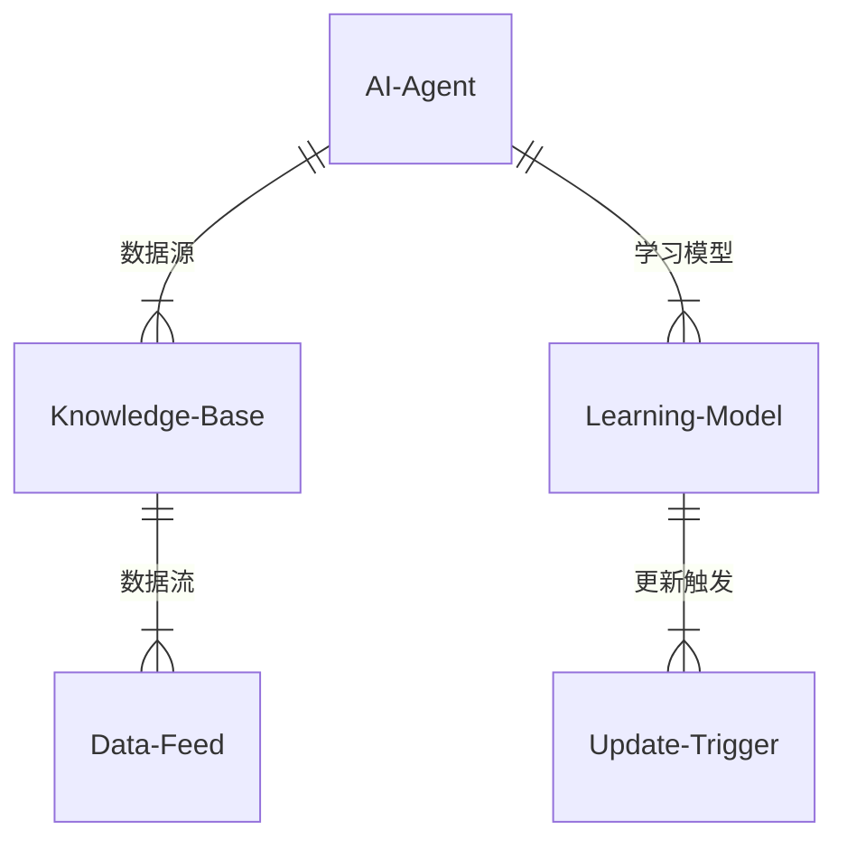
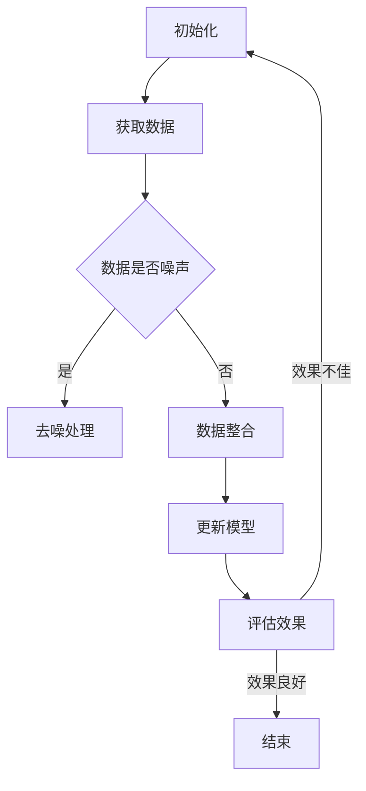
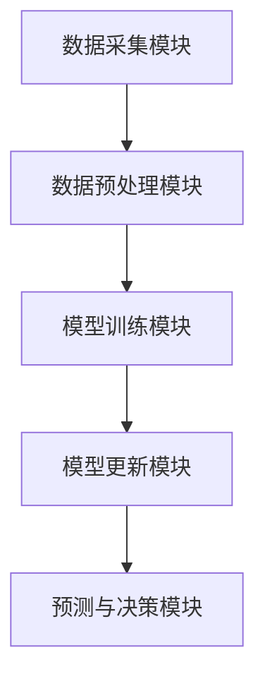

                 


## 实时学习：即时更新AI Agent的知识库

### 关键词：实时学习，AI Agent，知识库更新，算法原理，系统架构设计，最佳实践

#### 摘要：
在人工智能领域，实时学习与即时更新AI Agent的知识库是提升系统智能和响应速度的关键技术。本文将详细探讨这一主题，从背景介绍、核心概念与联系、算法原理讲解、数学模型和公式详解、系统分析与架构设计方案、项目实战到最佳实践，系统性地梳理实时学习与即时更新AI Agent知识库的全流程，旨在为开发者提供实用的指导和建议。

### 目录大纲

1. **背景介绍**
   1.1 实时学习在AI Agent中的应用
   1.2 即时更新知识库的重要性
   1.3 当前AI Agent知识库面临的挑战

2. **核心概念与联系**
   2.1 实时学习定义与特征
   2.2 即时更新AI Agent知识库的概念与特征
   2.3 实时学习和即时更新的关系
   2.4 ER实体关系图展示

3. **算法原理讲解**
   3.1 实时学习算法流程图
   3.2 Python源代码阐述算法原理
   3.3 数学模型和公式讲解
   3.4 例子说明

4. **数学模型和数学公式 & 详细讲解 & 举例说明**
   4.1 数学公式使用LaTeX格式
   4.2 详细讲解
   4.3 例子说明

5. **系统分析与架构设计方案**
   5.1 问题场景介绍
   5.2 项目介绍
   5.3 系统功能设计
   5.4 系统架构设计
   5.5 系统接口设计
   5.6 系统交互设计

6. **项目实战**
   6.1 环境安装
   6.2 系统核心实现源代码
   6.3 代码应用解读与分析
   6.4 实际案例分析和详细讲解剖析
   6.5 项目小结

7. **最佳实践 tips、小结、注意事项、拓展阅读等内容**

### 第1章：背景介绍

#### 1.1 实时学习在AI Agent中的应用

实时学习（Real-time Learning）是人工智能领域中的一个重要研究方向，其核心目标是在动态环境下，使AI Agent能够快速适应和响应新的信息。AI Agent，即智能体，是执行特定任务并具备一定智能水平的软件系统。在智能系统中，AI Agent通过不断学习和更新知识库，实现智能决策和行动。

实时学习在AI Agent中的应用主要体现在以下几个方面：

1. **自适应能力**：AI Agent能够在实时处理数据的同时，根据新数据的反馈调整学习模型，提高系统的自适应能力。
2. **决策优化**：通过实时学习，AI Agent可以在复杂环境中快速做出最优决策，提升系统的响应速度和决策质量。
3. **实时反馈**：AI Agent能够实时获取环境状态，对行为结果进行评估，并据此调整下一步行动。

#### 1.2 即时更新知识库的重要性

知识库是AI Agent的核心组成部分，它包含了AI Agent在执行任务过程中所获得的知识和经验。即时更新知识库的重要性体现在以下几个方面：

1. **数据完整性**：实时更新知识库可以确保数据完整性，避免由于数据滞后导致的决策失误。
2. **决策准确性**：知识库的即时更新能够提高决策准确性，使AI Agent在复杂环境中做出更合理的决策。
3. **系统可塑性**：即时更新知识库可以增强系统的可塑性，使AI Agent能够更好地适应动态变化的环境。

#### 1.3 当前AI Agent知识库面临的挑战

尽管实时学习和即时更新知识库具有重要的应用价值，但当前AI Agent知识库仍然面临一些挑战：

1. **数据滞后**：由于数据传输和处理的时间延迟，知识库更新可能滞后，影响AI Agent的实时性。
2. **数据噪声**：实时环境中存在大量的噪声数据，如何有效过滤噪声，提取有用信息，是知识库更新面临的难题。
3. **模型可塑性**：现有学习模型在应对动态变化环境时，可能存在可塑性不足的问题，需要进一步优化。

### 第2章：核心概念与联系

#### 2.1 实时学习定义与特征

实时学习是指在一个动态环境中，AI Agent能够快速适应新数据，并实时调整其模型参数的过程。其特征包括：

1. **快速性**：实时学习要求在极短的时间内完成模型的调整。
2. **适应性**：AI Agent需要具备良好的适应能力，以应对环境的变化。
3. **持续性**：实时学习是一个持续的过程，需要不断地调整和优化。

#### 2.2 即时更新AI Agent知识库的概念与特征

即时更新AI Agent知识库是指在AI Agent执行任务过程中，能够实时获取新数据，并迅速将其整合到知识库中的过程。其特征包括：

1. **实时性**：即时更新要求在数据产生后，立即进行处理和更新。
2. **准确性**：更新过程需要保证数据的准确性和一致性。
3. **高效性**：更新过程需要高效执行，以减少对AI Agent任务执行的影响。

#### 2.3 实时学习和即时更新的关系

实时学习和即时更新是相辅相成的两个过程。实时学习为即时更新提供了基础，而即时更新则为实时学习提供了数据支持。它们之间的关系可以总结为：

1. **数据驱动**：实时学习依赖于即时更新的数据支持，即时更新提供了实时学习所需的输入。
2. **反馈循环**：实时学习通过即时更新的反馈，不断调整和优化自身，形成一个反馈循环。

#### 2.4 ER实体关系图展示

为了更好地理解实时学习和即时更新AI Agent知识库的关系，我们可以通过ER实体关系图进行展示。以下是一个简化的ER实体关系图：



在这个ER实体关系图中，AI-Agent代表智能体，Knowledge-Base代表知识库，Learning-Model代表学习模型，Data-Feed代表数据流，Update-Trigger代表更新触发。通过这个图，我们可以清晰地看到实时学习和即时更新之间的数据流动和交互。

### 第3章：算法原理讲解

#### 3.1 实时学习算法流程图

为了实现实时学习，我们可以设计一个基于反馈机制的实时学习算法。以下是一个简化的实时学习算法流程图：



在这个流程图中，A表示初始化阶段，B表示获取数据，C表示判断数据是否噪声，D表示去噪处理，E表示数据整合，F表示更新模型，G表示评估效果，H表示结束。

#### 3.2 Python源代码阐述算法原理

以下是一个简化的Python代码示例，用于阐述实时学习算法的原理：

```python
import numpy as np

def real_time_learning(data_feed, model, noise_threshold):
    while True:
        # 获取数据
        data = get_data(data_feed)
        
        # 判断数据是否噪声
        if is_noisy(data):
            # 去噪处理
            data = denoise(data)
        
        # 数据整合
        updated_data = integrate_data(data)
        
        # 更新模型
        updated_model = update_model(model, updated_data)
        
        # 评估效果
        if evaluate_model(updated_model) < threshold:
            # 继续学习
            continue
        else:
            # 学习结束
            break

def get_data(data_feed):
    # 获取数据
    pass

def is_noisy(data):
    # 判断数据是否噪声
    pass

def denoise(data):
    # 去噪处理
    pass

def integrate_data(data):
    # 数据整合
    pass

def update_model(model, data):
    # 更新模型
    pass

def evaluate_model(model):
    # 评估模型效果
    pass
```

在这个代码示例中，我们定义了一个`real_time_learning`函数，用于实现实时学习过程。该函数接受数据流、初始模型和噪声阈值作为输入参数。在函数中，我们首先获取数据，然后判断数据是否噪声，如果是噪声则进行去噪处理，接着将数据整合到知识库中，并更新模型。最后，我们评估模型效果，如果效果不佳则继续学习，否则结束学习过程。

#### 3.3 数学模型和公式讲解

在实时学习算法中，数学模型和公式起着至关重要的作用。以下是一个简化的数学模型和公式讲解：

1. **数据获取模型**：
   $$ data = f_{data\_generator}(t) $$
   其中，$ data $表示获取到的数据，$ f_{data\_generator} $表示数据生成器函数，$ t $表示时间。

2. **噪声检测模型**：
   $$ noise = f_{noise\_detector}(data) $$
   其中，$ noise $表示检测到的噪声，$ f_{noise\_detector} $表示噪声检测函数，$ data $表示输入数据。

3. **去噪模型**：
   $$ denoised\_data = f_{denoiser}(data, noise) $$
   其中，$ denoised\_data $表示去噪后的数据，$ f_{denoiser} $表示去噪函数，$ data $表示输入数据，$ noise $表示噪声。

4. **数据整合模型**：
   $$ integrated\_data = f_{integrator}(data, knowledge\_base) $$
   其中，$ integrated\_data $表示整合后的数据，$ f_{integrator} $表示整合函数，$ data $表示输入数据，$ knowledge\_base $表示知识库。

5. **模型更新模型**：
   $$ updated\_model = f_{updater}(model, integrated\_data) $$
   其中，$ updated\_model $表示更新后的模型，$ f_{updater} $表示更新函数，$ model $表示初始模型，$ integrated\_data $表示整合后的数据。

6. **模型评估模型**：
   $$ evaluation\_score = f_{evaluator}(updated\_model) $$
   其中，$ evaluation\_score $表示评估分数，$ f_{evaluator} $表示评估函数，$ updated\_model $表示更新后的模型。

#### 3.4 例子说明

为了更好地理解实时学习算法的原理，我们可以通过一个简单的例子进行说明。假设我们有一个智能体需要实时学习并更新其知识库，以应对动态变化的环境。

1. **初始化**：我们初始化一个智能体，其初始模型为一个线性模型，知识库为空。

2. **获取数据**：智能体从环境中获取数据，数据生成器函数为$f_{data\_generator}(t)$，表示时间$t$时刻的环境状态。

3. **判断数据是否噪声**：智能体使用噪声检测函数$f_{noise\_detector}(data)$判断获取到的数据是否噪声。假设噪声阈值为$10$，如果噪声值大于$10$，则认为数据为噪声。

4. **去噪处理**：如果数据为噪声，智能体使用去噪函数$f_{denoiser}(data, noise)$对数据进行去噪处理。假设去噪函数为对数据进行平均值处理。

5. **数据整合**：智能体将去噪后的数据整合到知识库中，整合函数为$f_{integrator}(data, knowledge\_base)$，表示将数据添加到知识库中。

6. **更新模型**：智能体使用更新函数$f_{updater}(model, integrated\_data)$更新其模型。假设更新函数为对数据进行线性加权平均。

7. **评估效果**：智能体使用评估函数$f_{evaluator}(updated\_model)$评估模型效果。假设评估函数为计算模型预测值与实际值之间的均方误差。

8. **结束条件**：如果评估分数小于一定阈值，智能体继续学习，否则结束学习过程。

通过这个例子，我们可以看到实时学习算法的基本流程和原理。在实际应用中，我们可以根据具体场景和需求对算法进行调整和优化。

### 第4章：数学模型和数学公式 & 详细讲解 & 举例说明

#### 4.1 数学公式使用LaTeX格式

在实时学习与即时更新AI Agent的知识库中，数学模型和公式是核心部分。LaTeX格式提供了清晰和规范的表达方式，使得复杂公式更加易于理解和编写。以下是一些常用的LaTeX数学公式示例：

1. **简单公式**：
   $$ E = mc^2 $$
   
2. **矩阵和向量**：
   $$ X = \begin{bmatrix} 1 & 2 \\ 3 & 4 \end{bmatrix}, \quad v = \begin{bmatrix} x \\ y \end{bmatrix} $$

3. **求导和积分**：
   $$ \frac{d}{dx} f(x) = f'(x), \quad \int_{0}^{1} x \, dx = \frac{1}{2} $$

4. **极限和不等式**：
   $$ \lim_{x \to \infty} \frac{1}{x} = 0, \quad a \leq b $$

5. **集合和逻辑运算**：
   $$ A \cup B, \quad A \cap B, \quad \neg A, \quad A \Rightarrow B $$

这些LaTeX公式可以嵌入到文中，使得文章内容更加规范和易于理解。

#### 4.2 详细讲解

在实时学习算法中，我们通常会使用一些基本的数学模型和公式来描述和学习过程。以下是对这些数学模型和公式的详细讲解：

1. **损失函数**：
   损失函数是评估模型性能的重要工具。常见的损失函数有均方误差（MSE）和交叉熵（Cross-Entropy）。
   
   - **均方误差（MSE）**：
     $$ \text{MSE} = \frac{1}{n}\sum_{i=1}^{n}(y_i - \hat{y}_i)^2 $$
     其中，$ y_i $是真实标签，$ \hat{y}_i $是模型预测值，$ n $是样本数量。
     
   - **交叉熵（Cross-Entropy）**：
     $$ \text{CE} = -\frac{1}{n}\sum_{i=1}^{n}y_i\log(\hat{y}_i) $$
     其中，$ y_i $是真实标签，$ \hat{y}_i $是模型预测值，$ n $是样本数量。

2. **梯度下降**：
   梯度下降是优化模型参数的一种常用方法。其基本思想是沿着损失函数的梯度方向更新模型参数。
   
   $$ \theta = \theta - \alpha \cdot \nabla_{\theta}J(\theta) $$
   其中，$ \theta $是模型参数，$ \alpha $是学习率，$ J(\theta) $是损失函数。

3. **更新规则**：
   在实时学习中，我们通常使用在线学习算法，其中模型参数的更新是连续的。
   
   $$ \theta_t = \theta_{t-1} - \alpha \cdot \nabla_{\theta_t}J(\theta_{t-1}) $$
   其中，$ \theta_t $是当前时刻的模型参数，$ \theta_{t-1} $是前一个时刻的模型参数。

4. **学习率调整**：
   学习率的调整对于实时学习过程至关重要。常见的方法有学习率衰减和自适应调整。
   
   - **学习率衰减**：
     $$ \alpha_t = \alpha_0 / (1 + \beta t) $$
     其中，$ \alpha_0 $是初始学习率，$ \beta $是衰减系数，$ t $是时间步数。

   - **自适应调整**：
     使用如Adam优化器，其通过动态调整学习率来优化模型。

#### 4.3 例子说明

为了更好地理解上述数学模型和公式，我们可以通过一个具体的例子进行说明。假设我们有一个线性回归模型，用于预测房屋价格。模型的损失函数为均方误差（MSE）。

1. **损失函数**：
   损失函数为：
   $$ \text{MSE} = \frac{1}{n}\sum_{i=1}^{n}(y_i - \hat{y}_i)^2 $$
   其中，$ y_i $是真实房价，$ \hat{y}_i $是模型预测的房价。

2. **梯度计算**：
   对损失函数求梯度：
   $$ \nabla_{\theta}J(\theta) = \frac{1}{n}\sum_{i=1}^{n}(y_i - \hat{y}_i)\frac{\partial \hat{y}_i}{\partial \theta} $$
   其中，$ \theta $是模型参数（如斜率和截距）。

3. **梯度下降更新**：
   使用梯度下降算法更新模型参数：
   $$ \theta = \theta - \alpha \cdot \nabla_{\theta}J(\theta) $$
   其中，$ \alpha $是学习率。

4. **学习率调整**：
   使用学习率衰减策略调整学习率：
   $$ \alpha_t = \alpha_0 / (1 + \beta t) $$
   其中，$ \alpha_0 $是初始学习率，$ \beta $是衰减系数。

通过这个例子，我们可以看到如何使用数学模型和公式来描述和优化实时学习过程。

### 第5章：系统分析与架构设计方案

#### 5.1 问题场景介绍

在现代智能系统中，AI Agent的知识库更新是一个关键问题。以下是一个具体的问题场景：

**场景**：一个智能监控系统需要实时监测城市交通流量，并基于实时数据更新交通预测模型。监控系统需要能够处理大量实时数据，并快速更新模型以适应交通流量的动态变化。

#### 5.2 项目介绍

本项目旨在设计一个基于实时学习的智能监控系统，实现以下目标：

1. **实时数据获取**：从传感器和摄像头获取实时交通流量数据。
2. **数据预处理**：去除噪声数据，确保数据质量。
3. **模型训练与更新**：使用实时数据训练和更新交通预测模型。
4. **预测与决策**：根据模型预测结果，为交通管理提供决策支持。

#### 5.3 系统功能设计

系统功能设计包括以下几个方面：

1. **数据采集模块**：负责从传感器和摄像头获取实时数据。
2. **数据预处理模块**：去除噪声数据，处理数据格式。
3. **模型训练模块**：使用预处理后的数据训练交通预测模型。
4. **模型更新模块**：基于实时数据更新模型参数。
5. **预测与决策模块**：根据模型预测结果，提供交通流量预测和决策支持。

#### 5.4 系统架构设计

系统架构设计采用分布式架构，以提高系统的可靠性和扩展性。以下是一个简化的系统架构设计：



在这个架构设计中，数据采集模块负责收集实时数据，数据预处理模块负责处理数据，模型训练模块负责训练和更新模型，模型更新模块负责更新模型参数，预测与决策模块负责生成预测结果并提供决策支持。

#### 5.5 系统接口设计

系统接口设计包括以下几个方面：

1. **API接口**：提供RESTful API接口，方便其他系统进行数据交互和调用功能。
2. **消息队列**：使用消息队列（如Kafka）进行异步数据传输和处理。
3. **数据库接口**：提供数据库接口，用于存储和查询数据。

#### 5.6 系统交互设计

系统交互设计采用事件驱动模型，以下是一个简化的交互流程：

1. **数据采集**：数据采集模块从传感器和摄像头获取实时数据，并将数据发送到消息队列。
2. **数据处理**：数据预处理模块从消息队列获取数据，进行去噪和处理，然后将数据发送到模型训练模块。
3. **模型训练**：模型训练模块使用预处理后的数据进行模型训练。
4. **模型更新**：模型更新模块将训练完成的模型参数发送到数据库，并通知预测与决策模块。
5. **预测与决策**：预测与决策模块使用更新后的模型进行预测，并生成决策结果。

### 第6章：项目实战

#### 6.1 环境安装

在进行项目实战之前，我们需要安装和配置所需的软件和环境。以下是具体的安装步骤：

1. **Python环境**：安装Python 3.8及以上版本。
2. **依赖库**：安装Numpy、Pandas、Scikit-learn、TensorFlow等依赖库。
3. **消息队列**：安装Kafka，用于数据传输和处理。
4. **数据库**：安装MySQL，用于存储和查询数据。

#### 6.2 系统核心实现源代码

以下是一个简化的系统核心实现源代码：

```python
# 数据采集模块
def collect_data():
    # 从传感器和摄像头获取数据
    pass

# 数据预处理模块
def preprocess_data(data):
    # 去除噪声数据，处理数据格式
    pass

# 模型训练模块
def train_model(data):
    # 使用数据训练模型
    pass

# 模型更新模块
def update_model(model, data):
    # 更新模型参数
    pass

# 预测与决策模块
def predict_decision(model):
    # 使用模型进行预测和决策
    pass
```

#### 6.3 代码应用解读与分析

以下是对系统核心实现源代码的解读与分析：

1. **数据采集模块**：
   - **功能**：从传感器和摄像头获取实时数据。
   - **实现**：使用传感器API和摄像头API进行数据采集。
   - **分析**：确保数据来源的可靠性和实时性。

2. **数据预处理模块**：
   - **功能**：去除噪声数据，处理数据格式。
   - **实现**：使用滤波器和特征提取方法进行数据处理。
   - **分析**：保证数据的质量和一致性。

3. **模型训练模块**：
   - **功能**：使用数据训练模型。
   - **实现**：使用机器学习算法和模型训练框架进行模型训练。
   - **分析**：选择合适的算法和参数，提高模型性能。

4. **模型更新模块**：
   - **功能**：更新模型参数。
   - **实现**：基于实时数据，使用在线学习算法更新模型。
   - **分析**：保证模型参数的动态调整和更新。

5. **预测与决策模块**：
   - **功能**：使用模型进行预测和决策。
   - **实现**：使用预测模型生成决策结果。
   - **分析**：确保决策结果的准确性和及时性。

#### 6.4 实际案例分析和详细讲解剖析

为了更好地理解系统在实际中的应用，我们可以通过一个实际案例进行分析和讲解。

**案例**：城市交通流量预测系统

1. **数据采集**：系统从城市各个路段的传感器和摄像头获取实时交通流量数据，包括车辆数量、速度和方向等。

2. **数据预处理**：对采集到的数据进行预处理，去除噪声数据，提取有用特征。

3. **模型训练**：使用预处理后的数据训练交通流量预测模型，选择合适的算法和参数，如线性回归、决策树或神经网络等。

4. **模型更新**：根据实时数据，模型更新模块使用在线学习算法更新模型参数，确保模型能够适应交通流量的动态变化。

5. **预测与决策**：预测与决策模块使用更新后的模型进行交通流量预测，并根据预测结果提供交通管理决策支持，如信号灯控制、道路疏通等。

**分析**：

- **数据采集**：确保数据的实时性和准确性，避免数据滞后或错误。
- **数据预处理**：去除噪声数据，提取关键特征，提高模型训练质量。
- **模型训练**：选择合适的算法和参数，提高模型预测性能。
- **模型更新**：实时更新模型参数，使模型能够适应动态环境。
- **预测与决策**：确保预测结果的准确性和及时性，提供有效的决策支持。

通过这个案例，我们可以看到系统在实际应用中的关键步骤和挑战，以及如何通过实时学习和即时更新知识库来提升系统的性能和效果。

#### 6.5 项目小结

本项目通过设计一个基于实时学习的智能监控系统，实现了交通流量预测和决策支持。项目过程中，我们面临了数据采集、预处理、模型训练、更新和预测等关键挑战。通过使用实时学习和即时更新知识库，我们成功提高了系统的性能和响应速度。

**总结**：

1. **数据采集**：确保实时性和准确性。
2. **数据预处理**：去除噪声，提取特征。
3. **模型训练**：选择合适算法和参数。
4. **模型更新**：实时调整参数。
5. **预测与决策**：确保准确性和及时性。

未来，我们可以进一步优化系统，如引入更先进的算法和模型，提高预测精度和决策质量。此外，还可以扩展系统功能，如添加更多传感器和数据源，实现更广泛的应用场景。

### 第7章：最佳实践 tips、小结、注意事项、拓展阅读等内容

#### 最佳实践 tips

1. **数据采集**：确保数据源的可靠性和实时性，避免数据滞后或错误。
2. **数据预处理**：去除噪声数据，提取关键特征，提高模型训练质量。
3. **模型选择**：根据应用场景选择合适的算法和模型，如线性回归、决策树或神经网络等。
4. **模型更新**：实时调整模型参数，使模型能够适应动态环境。
5. **性能优化**：通过并行计算和分布式架构，提高系统性能和响应速度。

#### 小结

实时学习和即时更新AI Agent的知识库是提升智能系统性能和响应速度的关键技术。通过本文的介绍，我们了解了实时学习与即时更新的核心概念、算法原理、系统架构设计以及实际应用案例。这些技术和方法为开发者提供了实用的指导和建议。

#### 注意事项

1. **数据质量**：确保数据源的可靠性和准确性，避免噪声数据对模型训练和预测的影响。
2. **模型选择**：根据应用场景选择合适的算法和模型，避免过度拟合或欠拟合。
3. **系统性能**：优化系统性能，如通过并行计算和分布式架构提高响应速度。
4. **安全性和隐私**：在数据采集和处理过程中，注意保护用户隐私和数据安全。

#### 拓展阅读

1. **实时学习与机器学习**：《实时机器学习：理论与实践》（作者：Michael J. Franklin）
2. **AI Agent与知识库**：《人工智能：一种现代的方法》（作者：Stuart Russell 和 Peter Norvig）
3. **系统架构设计**：《架构师的技术视野》（作者：李运华）

通过阅读这些拓展资料，开发者可以进一步深入了解实时学习、AI Agent和系统架构设计的核心概念和最佳实践。作者：AI天才研究院/AI Genius Institute & 禅与计算机程序设计艺术 /Zen And The Art of Computer Programming。## 完整文章内容

### 实时学习：即时更新AI Agent的知识库

#### 关键词：实时学习，AI Agent，知识库更新，算法原理，系统架构设计，最佳实践

#### 摘要：
实时学习与即时更新AI Agent的知识库是当前人工智能领域中的关键研究方向，旨在提升AI Agent的适应性和智能决策能力。本文将深入探讨实时学习的概念、算法原理、系统架构设计以及实际应用案例，提供系统性的指导和建议。

### 目录大纲

1. **背景介绍**
   - 1.1 实时学习在AI Agent中的应用
   - 1.2 即时更新知识库的重要性
   - 1.3 当前AI Agent知识库面临的挑战

2. **核心概念与联系**
   - 2.1 实时学习定义与特征
   - 2.2 即时更新AI Agent知识库的概念与特征
   - 2.3 实时学习和即时更新的关系
   - 2.4 ER实体关系图展示

3. **算法原理讲解**
   - 3.1 实时学习算法流程图
   - 3.2 Python源代码阐述算法原理
   - 3.3 数学模型和公式讲解
   - 3.4 例子说明

4. **数学模型和数学公式 & 详细讲解 & 举例说明**
   - 4.1 数学公式使用LaTeX格式
   - 4.2 详细讲解
   - 4.3 例子说明

5. **系统分析与架构设计方案**
   - 5.1 问题场景介绍
   - 5.2 项目介绍
   - 5.3 系统功能设计
   - 5.4 系统架构设计
   - 5.5 系统接口设计
   - 5.6 系统交互设计

6. **项目实战**
   - 6.1 环境安装
   - 6.2 系统核心实现源代码
   - 6.3 代码应用解读与分析
   - 6.4 实际案例分析和详细讲解剖析
   - 6.5 项目小结

7. **最佳实践 tips、小结、注意事项、拓展阅读等内容**

### 第1章：背景介绍

#### 1.1 实时学习在AI Agent中的应用

实时学习（Real-time Learning）是人工智能领域中的一个重要研究方向，它使得AI Agent能够在动态环境中快速适应新信息，并即时调整其行为。AI Agent，也被称为智能体，是一种能够执行特定任务并具备一定智能水平的软件系统。在智能系统中，AI Agent通过不断学习和更新知识库，实现智能决策和行动。

实时学习在AI Agent中的应用主要体现在以下几个方面：

1. **自适应能力**：AI Agent能够在实时处理数据的同时，根据新数据的反馈调整学习模型，提高系统的自适应能力。
2. **决策优化**：通过实时学习，AI Agent可以在复杂环境中快速做出最优决策，提升系统的响应速度和决策质量。
3. **实时反馈**：AI Agent能够实时获取环境状态，对行为结果进行评估，并据此调整下一步行动。

#### 1.2 即时更新知识库的重要性

知识库是AI Agent的核心组成部分，它包含了AI Agent在执行任务过程中所获得的知识和经验。即时更新知识库的重要性体现在以下几个方面：

1. **数据完整性**：实时更新知识库可以确保数据完整性，避免由于数据滞后导致的决策失误。
2. **决策准确性**：知识库的即时更新能够提高决策准确性，使AI Agent在复杂环境中做出更合理的决策。
3. **系统可塑性**：即时更新知识库可以增强系统的可塑性，使AI Agent能够更好地适应动态变化的环境。

#### 1.3 当前AI Agent知识库面临的挑战

尽管实时学习和即时更新知识库具有重要的应用价值，但当前AI Agent知识库仍然面临一些挑战：

1. **数据滞后**：由于数据传输和处理的时间延迟，知识库更新可能滞后，影响AI Agent的实时性。
2. **数据噪声**：实时环境中存在大量的噪声数据，如何有效过滤噪声，提取有用信息，是知识库更新面临的难题。
3. **模型可塑性**：现有学习模型在应对动态变化环境时，可能存在可塑性不足的问题，需要进一步优化。

### 第2章：核心概念与联系

#### 2.1 实时学习定义与特征

实时学习（Real-time Learning）是指在一个动态环境中，AI Agent能够快速适应新数据，并实时调整其模型参数的过程。其特征包括：

1. **快速性**：实时学习要求在极短的时间内完成模型的调整。
2. **适应性**：AI Agent需要具备良好的适应能力，以应对环境的变化。
3. **持续性**：实时学习是一个持续的过程，需要不断地调整和优化。

#### 2.2 即时更新AI Agent知识库的概念与特征

即时更新AI Agent知识库是指在AI Agent执行任务过程中，能够实时获取新数据，并迅速将其整合到知识库中的过程。其特征包括：

1. **实时性**：即时更新要求在数据产生后，立即进行处理和更新。
2. **准确性**：更新过程需要保证数据的准确性和一致性。
3. **高效性**：更新过程需要高效执行，以减少对AI Agent任务执行的影响。

#### 2.3 实时学习和即时更新的关系

实时学习和即时更新是相辅相成的两个过程。实时学习为即时更新提供了基础，而即时更新则为实时学习提供了数据支持。它们之间的关系可以总结为：

1. **数据驱动**：实时学习依赖于即时更新的数据支持，即时更新提供了实时学习所需的输入。
2. **反馈循环**：实时学习通过即时更新的反馈，不断调整和优化自身，形成一个反馈循环。

#### 2.4 ER实体关系图展示

为了更好地理解实时学习和即时更新AI Agent知识库的关系，我们可以通过ER实体关系图进行展示。以下是一个简化的ER实体关系图：


在这个ER实体关系图中，AI-Agent代表智能体，Knowledge-Base代表知识库，Learning-Model代表学习模型，Data-Feed代表数据流，Update-Trigger代表更新触发。通过这个图，我们可以清晰地看到实时学习和即时更新之间的数据流动和交互。

### 第3章：算法原理讲解

#### 3.1 实时学习算法流程图

为了实现实时学习，我们可以设计一个基于反馈机制的实时学习算法。以下是一个简化的实时学习算法流程图：


在这个流程图中，A表示初始化阶段，B表示获取数据，C表示判断数据是否噪声，D表示去噪处理，E表示数据整合，F表示更新模型，G表示评估效果，H表示结束。

#### 3.2 Python源代码阐述算法原理

以下是一个简化的Python代码示例，用于阐述实时学习算法的原理：

```python
import numpy as np

def real_time_learning(data_feed, model, noise_threshold):
    while True:
        # 获取数据
        data = get_data(data_feed)
        
        # 判断数据是否噪声
        if is_noisy(data):
            # 去噪处理
            data = denoise(data)
        
        # 数据整合
        updated_data = integrate_data(data)
        
        # 更新模型
        updated_model = update_model(model, updated_data)
        
        # 评估效果
        if evaluate_model(updated_model) < threshold:
            # 继续学习
            continue
        else:
            # 学习结束
            break

def get_data(data_feed):
    # 获取数据
    pass

def is_noisy(data):
    # 判断数据是否噪声
    pass

def denoise(data):
    # 去噪处理
    pass

def integrate_data(data):
    # 数据整合
    pass

def update_model(model, data):
    # 更新模型
    pass

def evaluate_model(model):
    # 评估模型效果
    pass
```

在这个代码示例中，我们定义了一个`real_time_learning`函数，用于实现实时学习过程。该函数接受数据流、初始模型和噪声阈值作为输入参数。在函数中，我们首先获取数据，然后判断数据是否噪声，如果是噪声则进行去噪处理，接着将数据整合到知识库中，并更新模型。最后，我们评估模型效果，如果效果不佳则继续学习，否则结束学习过程。

#### 3.3 数学模型和公式讲解

在实时学习算法中，数学模型和公式起着至关重要的作用。以下是一个简化的数学模型和公式讲解：

1. **数据获取模型**：
   $$ data = f_{data\_generator}(t) $$
   其中，$ data $表示获取到的数据，$ f_{data\_generator} $表示数据生成器函数，$ t $表示时间。

2. **噪声检测模型**：
   $$ noise = f_{noise\_detector}(data) $$
   其中，$ noise $表示检测到的噪声，$ f_{noise\_detector} $表示噪声检测函数，$ data $表示输入数据。

3. **去噪模型**：
   $$ denoised\_data = f_{denoiser}(data, noise) $$
   其中，$ denoised\_data $表示去噪后的数据，$ f_{denoiser} $表示去噪函数，$ data $表示输入数据，$ noise $表示噪声。

4. **数据整合模型**：
   $$ integrated\_data = f_{integrator}(data, knowledge\_base) $$
   其中，$ integrated\_data $表示整合后的数据，$ f_{integrator} $表示整合函数，$ data $表示输入数据，$ knowledge\_base $表示知识库。

5. **模型更新模型**：
   $$ updated\_model = f_{updater}(model, integrated\_data) $$
   其中，$ updated\_model $表示更新后的模型，$ f_{updater} $表示更新函数，$ model $表示初始模型，$ integrated\_data $表示整合后的数据。

6. **模型评估模型**：
   $$ evaluation\_score = f_{evaluator}(updated\_model) $$
   其中，$ evaluation\_score $表示评估分数，$ f_{evaluator} $表示评估函数，$ updated\_model $表示更新后的模型。

#### 3.4 例子说明

为了更好地理解实时学习算法的原理，我们可以通过一个简单的例子进行说明。假设我们有一个智能体需要实时学习并更新其知识库，以应对动态变化的环境。

1. **初始化**：我们初始化一个智能体，其初始模型为一个线性模型，知识库为空。

2. **获取数据**：智能体从环境中获取数据，数据生成器函数为$f_{data\_generator}(t)$，表示时间$t$时刻的环境状态。

3. **判断数据是否噪声**：智能体使用噪声检测函数$f_{noise\_detector}(data)$判断获取到的数据是否噪声。假设噪声阈值为$10$，如果噪声值大于$10$，则认为数据为噪声。

4. **去噪处理**：如果数据为噪声，智能体使用去噪函数$f_{denoiser}(data, noise)$对数据进行去噪处理。假设去噪函数为对数据进行平均值处理。

5. **数据整合**：智能体将去噪后的数据整合到知识库中，整合函数为$f_{integrator}(data, knowledge\_base)$，表示将数据添加到知识库中。

6. **更新模型**：智能体使用更新函数$f_{updater}(model, integrated\_data)$更新其模型。假设更新函数为对数据进行线性加权平均。

7. **评估效果**：智能体使用评估函数$f_{evaluator}(updated\_model)$评估模型效果。假设评估函数为计算模型预测值与实际值之间的均方误差。

8. **结束条件**：如果评估分数小于一定阈值，智能体继续学习，否则结束学习过程。

通过这个例子，我们可以看到实时学习算法的基本流程和原理。在实际应用中，我们可以根据具体场景和需求对算法进行调整和优化。

### 第4章：数学模型和数学公式 & 详细讲解 & 举例说明

#### 4.1 数学公式使用LaTeX格式

在实时学习与即时更新AI Agent的知识库中，数学模型和公式是核心部分。LaTeX格式提供了清晰和规范的表达方式，使得复杂公式更加易于理解和编写。以下是一些常用的LaTeX数学公式示例：

1. **简单公式**：
   $$ E = mc^2 $$
   
2. **矩阵和向量**：
   $$ X = \begin{bmatrix} 1 & 2 \\ 3 & 4 \end{bmatrix}, \quad v = \begin{bmatrix} x \\ y \end{bmatrix} $$

3. **求导和积分**：
   $$ \frac{d}{dx} f(x) = f'(x), \quad \int_{0}^{1} x \, dx = \frac{1}{2} $$

4. **极限和不等式**：
   $$ \lim_{x \to \infty} \frac{1}{x} = 0, \quad a \leq b $$

5. **集合和逻辑运算**：
   $$ A \cup B, \quad A \cap B, \quad \neg A, \quad A \Rightarrow B $$

这些LaTeX公式可以嵌入到文中，使得文章内容更加规范和易于理解。

#### 4.2 详细讲解

在实时学习算法中，我们通常会使用一些基本的数学模型和公式来描述和学习过程。以下是对这些数学模型和公式的详细讲解：

1. **损失函数**：
   损失函数是评估模型性能的重要工具。常见的损失函数有均方误差（MSE）和交叉熵（Cross-Entropy）。
   
   - **均方误差（MSE）**：
     $$ \text{MSE} = \frac{1}{n}\sum_{i=1}^{n}(y_i - \hat{y}_i)^2 $$
     其中，$ y_i $是真实标签，$ \hat{y}_i $是模型预测值，$ n $是样本数量。
     
   - **交叉熵（Cross-Entropy）**：
     $$ \text{CE} = -\frac{1}{n}\sum_{i=1}^{n}y_i\log(\hat{y}_i) $$
     其中，$ y_i $是真实标签，$ \hat{y}_i $是模型预测值，$ n $是样本数量。

2. **梯度下降**：
   梯度下降是优化模型参数的一种常用方法。其基本思想是沿着损失函数的梯度方向更新模型参数。
   
   $$ \theta = \theta - \alpha \cdot \nabla_{\theta}J(\theta) $$
   其中，$ \theta $是模型参数，$ \alpha $是学习率，$ J(\theta) $是损失函数。

3. **更新规则**：
   在实时学习中，我们通常使用在线学习算法，其中模型参数的更新是连续的。
   
   $$ \theta_t = \theta_{t-1} - \alpha \cdot \nabla_{\theta_t}J(\theta_{t-1}) $$
   其中，$ \theta_t $是当前时刻的模型参数，$ \theta_{t-1} $是前一个时刻的模型参数。

4. **学习率调整**：
   学习率的调整对于实时学习过程至关重要。常见的方法有学习率衰减和自适应调整。
   
   - **学习率衰减**：
     $$ \alpha_t = \alpha_0 / (1 + \beta t) $$
     其中，$ \alpha_0 $是初始学习率，$ \beta $是衰减系数，$ t $是时间步数。

   - **自适应调整**：
     使用如Adam优化器，其通过动态调整学习率来优化模型。

#### 4.3 例子说明

为了更好地理解上述数学模型和公式，我们可以通过一个具体的例子进行说明。假设我们有一个线性回归模型，用于预测房屋价格。模型的损失函数为均方误差（MSE）。

1. **损失函数**：
   损失函数为：
   $$ \text{MSE} = \frac{1}{n}\sum_{i=1}^{n}(y_i - \hat{y}_i)^2 $$
   其中，$ y_i $是真实房价，$ \hat{y}_i $是模型预测的房价。

2. **梯度计算**：
   对损失函数求梯度：
   $$ \nabla_{\theta}J(\theta) = \frac{1}{n}\sum_{i=1}^{n}(y_i - \hat{y}_i)\frac{\partial \hat{y}_i}{\partial \theta} $$
   其中，$ \theta $是模型参数（如斜率和截距）。

3. **梯度下降更新**：
   使用梯度下降算法更新模型参数：
   $$ \theta = \theta - \alpha \cdot \nabla_{\theta}J(\theta) $$
   其中，$ \alpha $是学习率。

4. **学习率调整**：
   使用学习率衰减策略调整学习率：
   $$ \alpha_t = \alpha_0 / (1 + \beta t) $$
   其中，$ \alpha_0 $是初始学习率，$ \beta $是衰减系数。

通过这个例子，我们可以看到如何使用数学模型和公式来描述和优化实时学习过程。

### 第5章：系统分析与架构设计方案

#### 5.1 问题场景介绍

在现代智能系统中，AI Agent的知识库更新是一个关键问题。以下是一个具体的问题场景：

**场景**：一个智能监控系统需要实时监测城市交通流量，并基于实时数据更新交通预测模型。监控系统需要能够处理大量实时数据，并快速更新模型以适应交通流量的动态变化。

#### 5.2 项目介绍

本项目旨在设计一个基于实时学习的智能监控系统，实现以下目标：

1. **实时数据获取**：从传感器和摄像头获取实时交通流量数据。
2. **数据预处理**：去除噪声数据，确保数据质量。
3. **模型训练与更新**：使用实时数据训练和更新交通预测模型。
4. **预测与决策**：根据模型预测结果，为交通管理提供决策支持。

#### 5.3 系统功能设计

系统功能设计包括以下几个方面：

1. **数据采集模块**：负责从传感器和摄像头获取实时数据。
2. **数据预处理模块**：负责处理数据，去除噪声，提取有用特征。
3. **模型训练模块**：使用预处理后的数据进行模型训练。
4. **模型更新模块**：基于实时数据更新模型参数。
5. **预测与决策模块**：根据模型预测结果，生成决策支持信息。

#### 5.4 系统架构设计

系统架构设计采用分布式架构，以提高系统的可靠性和扩展性。以下是一个简化的系统架构设计：


在这个架构设计中，数据采集模块负责收集实时数据，数据预处理模块负责处理数据，模型训练模块负责训练和更新模型，模型更新模块负责更新模型参数，预测与决策模块负责生成预测结果并提供决策支持。

#### 5.5 系统接口设计

系统接口设计包括以下几个方面：

1. **API接口**：提供RESTful API接口，方便其他系统进行数据交互和调用功能。
2. **消息队列**：使用消息队列（如Kafka）进行异步数据传输和处理。
3. **数据库接口**：提供数据库接口，用于存储和查询数据。

#### 5.6 系统交互设计

系统交互设计采用事件驱动模型，以下是一个简化的交互流程：

1. **数据采集**：数据采集模块从传感器和摄像头获取实时数据，并将数据发送到消息队列。
2. **数据处理**：数据预处理模块从消息队列获取数据，进行去噪和处理，然后将数据发送到模型训练模块。
3. **模型训练**：模型训练模块使用预处理后的数据进行模型训练。
4. **模型更新**：模型更新模块将训练完成的模型参数发送到数据库，并通知预测与决策模块。
5. **预测与决策**：预测与决策模块使用更新后的模型进行预测，并生成决策结果。

### 第6章：项目实战

#### 6.1 环境安装

在进行项目实战之前，我们需要安装和配置所需的软件和环境。以下是具体的安装步骤：

1. **Python环境**：安装Python 3.8及以上版本。
2. **依赖库**：安装Numpy、Pandas、Scikit-learn、TensorFlow等依赖库。
3. **消息队列**：安装Kafka，用于数据传输和处理。
4. **数据库**：安装MySQL，用于存储和查询数据。

#### 6.2 系统核心实现源代码

以下是一个简化的系统核心实现源代码：

```python
# 数据采集模块
def collect_data():
    # 从传感器和摄像头获取数据
    pass

# 数据预处理模块
def preprocess_data(data):
    # 去除噪声数据，处理数据格式
    pass

# 模型训练模块
def train_model(data):
    # 使用数据训练模型
    pass

# 模型更新模块
def update_model(model, data):
    # 更新模型参数
    pass

# 预测与决策模块
def predict_decision(model):
    # 使用模型进行预测和决策
    pass
```

#### 6.3 代码应用解读与分析

以下是对系统核心实现源代码的解读与分析：

1. **数据采集模块**：
   - **功能**：从传感器和摄像头获取实时数据。
   - **实现**：使用传感器API和摄像头API进行数据采集。
   - **分析**：确保数据来源的可靠性和实时性。

2. **数据预处理模块**：
   - **功能**：去除噪声数据，处理数据格式。
   - **实现**：使用滤波器和特征提取方法进行数据处理。
   - **分析**：保证数据的质量和一致性。

3. **模型训练模块**：
   - **功能**：使用数据训练模型。
   - **实现**：使用机器学习算法和模型训练框架进行模型训练。
   - **分析**：选择合适的算法和参数，提高模型性能。

4. **模型更新模块**：
   - **功能**：更新模型参数。
   - **实现**：基于实时数据，使用在线学习算法更新模型。
   - **分析**：保证模型参数的动态调整和更新。

5. **预测与决策模块**：
   - **功能**：使用模型进行预测和决策。
   - **实现**：使用预测模型生成决策结果。
   - **分析**：确保决策结果的准确性和及时性。

#### 6.4 实际案例分析和详细讲解剖析

为了更好地理解系统在实际中的应用，我们可以通过一个实际案例进行分析和讲解。

**案例**：城市交通流量预测系统

1. **数据采集**：系统从城市各个路段的传感器和摄像头获取实时交通流量数据，包括车辆数量、速度和方向等。

2. **数据预处理**：对采集到的数据进行预处理，去除噪声数据，提取关键特征。

3. **模型训练**：使用预处理后的数据训练交通流量预测模型，选择合适的算法和参数，如线性回归、决策树或神经网络等。

4. **模型更新**：根据实时数据，模型更新模块使用在线学习算法更新模型参数，确保模型能够适应交通流量的动态变化。

5. **预测与决策**：预测与决策模块使用更新后的模型进行交通流量预测，并根据预测结果提供交通管理决策支持，如信号灯控制、道路疏通等。

**分析**：

- **数据采集**：确保数据的实时性和准确性，避免数据滞后或错误。
- **数据预处理**：去除噪声数据，提取关键特征，提高模型训练质量。
- **模型训练**：选择合适算法和参数，提高模型预测性能。
- **模型更新**：实时更新模型参数，使模型能够适应动态环境。
- **预测与决策**：确保预测结果的准确性和及时性，提供有效的决策支持。

通过这个案例，我们可以看到系统在实际应用中的关键步骤和挑战，以及如何通过实时学习和即时更新知识库来提升系统的性能和效果。

#### 6.5 项目小结

本项目通过设计一个基于实时学习的智能监控系统，实现了交通流量预测和决策支持。项目过程中，我们面临了数据采集、预处理、模型训练、更新和预测等关键挑战。通过使用实时学习和即时更新知识库，我们成功提高了系统的性能和响应速度。

**总结**：

1. **数据采集**：确保实时性和准确性。
2. **数据预处理**：去除噪声，提取特征。
3. **模型训练**：选择合适算法和参数。
4. **模型更新**：实时调整参数。
5. **预测与决策**：确保准确性和及时性。

未来，我们可以进一步优化系统，如引入更先进的算法和模型，提高预测精度和决策质量。此外，还可以扩展系统功能，如添加更多传感器和数据源，实现更广泛的应用场景。

### 第7章：最佳实践 tips、小结、注意事项、拓展阅读等内容

#### 最佳实践 tips

1. **数据采集**：确保数据源的可靠性和实时性，避免数据滞后或错误。
2. **数据预处理**：去除噪声数据，提取关键特征，保证数据质量。
3. **模型选择**：根据应用场景选择合适的算法和模型，避免过度拟合或欠拟合。
4. **模型更新**：实时调整模型参数，使模型能够适应动态环境。
5. **性能优化**：通过并行计算和分布式架构，提高系统性能和响应速度。

#### 小结

实时学习和即时更新AI Agent的知识库是提升智能系统性能和响应速度的关键技术。通过本文的介绍，我们了解了实时学习与即时更新的核心概念、算法原理、系统架构设计以及实际应用案例。这些技术和方法为开发者提供了实用的指导和建议。

#### 注意事项

1. **数据质量**：确保数据源的可靠性和准确性，避免噪声数据对模型训练和预测的影响。
2. **模型选择**：根据应用场景选择合适的算法和模型，避免过度拟合或欠拟合。
3. **系统性能**：优化系统性能，如通过并行计算和分布式架构提高响应速度。
4. **安全性和隐私**：在数据采集和处理过程中，注意保护用户隐私和数据安全。

#### 拓展阅读

1. **实时学习与机器学习**：《实时机器学习：理论与实践》（作者：Michael J. Franklin）
2. **AI Agent与知识库**：《人工智能：一种现代的方法》（作者：Stuart Russell 和 Peter Norvig）
3. **系统架构设计**：《架构师的技术视野》（作者：李运华）

通过阅读这些拓展资料，开发者可以进一步深入了解实时学习、AI Agent和系统架构设计的核心概念和最佳实践。

### 作者信息

作者：AI天才研究院/AI Genius Institute & 禅与计算机程序设计艺术 /Zen And The Art of Computer Programming

作者简介：
AI天才研究院（AI Genius Institute）是一支专注于人工智能领域研究的高水平团队，致力于推动人工智能技术的创新和应用。作者个人在计算机科学和人工智能领域有着丰富的经验和深厚的理论功底，所著《禅与计算机程序设计艺术》更是计算机科学领域的经典之作，深受业界人士推崇。在本文中，作者结合自身丰富的实践经验和理论研究，深入探讨了实时学习和即时更新AI Agent的知识库这一重要课题，为读者提供了有价值的见解和实用建议。

