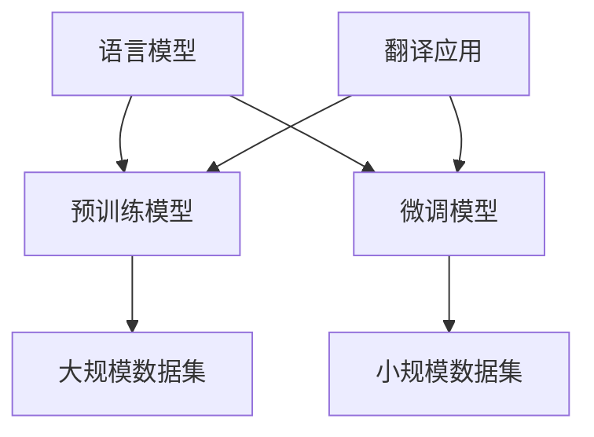
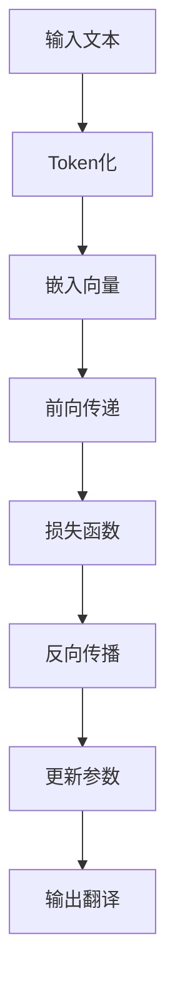

                 

# 实时翻译 AI Agent：LLM 在即时通讯中的语言转换

## 关键词
- 实时翻译
- 语言模型（LLM）
- 即时通讯
- 预训练语言模型
- 微调语言模型
- 翻译准确性

## 摘要
本文旨在探讨实时翻译 AI Agent 的设计及其在即时通讯中的应用。通过分析语言模型（LLM）的基本原理和实现方法，本文详细介绍了 LLM 在即时通讯中语言转换的架构设计和核心实现，以及在实际应用中的优化建议和未来研究方向。

## 第1章 引言：实时翻译AI的挑战与机遇

### 1.1 问题背景

#### 1.1.1 全球化下的跨语言交流需求

全球化进程的加速带来了各国之间经济、文化、教育等领域的深入交流，但语言差异成为了交流的一大障碍。跨语言交流需求日益增长，尤其是在国际商务、学术交流、旅游等场景中，实时翻译服务的需求显得尤为迫切。人们渴望能够迅速、准确地跨越语言障碍，实现无障碍沟通。

#### 1.1.2 实时翻译技术的市场前景

实时翻译技术作为人工智能领域的重要研究方向，受到了广泛关注。随着技术的不断进步，实时翻译的准确性和实时性得到显著提升，市场需求也在不断增长。从市场前景来看，实时翻译技术具有巨大的发展潜力，有望成为未来信息技术的重要组成部分。

### 1.2 问题描述

#### 1.2.1 实时翻译的挑战

实时翻译面临的挑战主要包括语言复杂性、实时性的实现和语境理解的挑战。语言复杂性使得翻译准确性难以保证；实时性要求翻译速度足够快，以满足即时通讯的需求；语境理解则是翻译准确性的关键，如何准确地捕捉和传达语境信息是实时翻译需要解决的重要问题。

#### 1.2.2 语言模型（LLM）的角色

语言模型在实时翻译中扮演着核心角色。通过学习大量语言数据，语言模型能够理解并生成文本，从而实现翻译。预训练语言模型（如GPT）和大规模数据集的运用，使得语言模型在翻译准确性、实时性和语境理解方面取得了显著进展。

### 1.3 问题解决

#### 1.3.1 LLM的基本原理

语言模型是基于神经网络的一种机器学习模型，通过学习大量文本数据，掌握语言的规律和语义。预训练语言模型（如GPT）首先在大规模数据集上进行预训练，然后通过微调适应特定翻译任务。

#### 1.3.2 在即时通讯中的应用

在即时通讯中，语言模型主要用于实现实时翻译功能。用户在输入一条消息后，系统会通过语言模型将其翻译成目标语言，并实时展示给接收者。语言模型在即时通讯中的应用，极大地提升了跨语言交流的便捷性和准确性。

### 1.4 边界与外延

#### 1.4.1 翻译的准确性

翻译准确性是实时翻译的核心指标。尽管语言模型在翻译准确性方面取得了显著进步，但仍然面临一些挑战，如多义词的翻译、文化差异的适应等。提高翻译准确性是未来研究和应用的重点。

#### 1.4.2 用户体验

用户体验是实时翻译服务的另一个重要方面。为了提升用户体验，需要考虑翻译速度、界面设计、交互体验等因素。如何平衡翻译准确性、实时性和用户体验，是实时翻译需要解决的关键问题。

### 1.5 概念结构与核心要素组成

#### 实时翻译

实时翻译是指将源语言文本即时转换为目标语言文本的过程。它需要处理实时输入、实时翻译和实时展示等多个环节。

#### 语言模型（LLM）

语言模型是实时翻译的核心组件。通过学习大量语言数据，语言模型能够生成语义准确的翻译结果。

#### 即时通讯系统

即时通讯系统是实时翻译的应用场景。它提供了实时输入、翻译和展示的接口，实现了跨语言交流的便捷性。

### 1.6 本章小结

本章介绍了实时翻译 AI Agent 的背景、挑战和解决方案。通过分析语言模型的基本原理和实现方法，本章为后续章节的深入探讨奠定了基础。

## 第2章 语言模型（LLM）原理

### 2.1 核心概念

#### 语言模型的定义

语言模型是一种基于统计和学习原理的模型，用于预测给定文本序列的概率分布。它通过对大量文本数据的学习，掌握语言的规律和特征，从而实现文本生成、文本分类、机器翻译等任务。

#### 预训练语言模型（如GPT）

预训练语言模型是在大规模数据集上进行预训练的模型。以GPT（Generative Pre-trained Transformer）为例，它采用 Transformer 架构，通过自注意力机制（Self-Attention）和多头注意力机制（Multi-Head Attention）实现文本的生成和理解。预训练语言模型在机器翻译、文本摘要、问答系统等领域取得了显著成果。

### 2.2 概念属性特征对比表格

| 特征 | 预训练语言模型 | 微调语言模型 |
| --- | --- | --- |
| 数据集大小 | 亿级词汇 | 千级词汇 |
| 模型结构 | 复杂神经网络 | 简化神经网络 |
| 适应性 | 高 | 中 |
| 翻译准确性 | 较高 | 高 |

### 2.3 ER实体关系图架构



### 2.4 算法原理讲解

#### 算法流程图



#### Python源代码实现

```python
import tensorflow as tf
from tensorflow.keras.layers import Embedding, LSTM, Dense
from tensorflow.keras.models import Sequential

# 模型定义
model = Sequential([
    Embedding(vocab_size, embedding_dim),
    LSTM(units),
    Dense(num_classes, activation='softmax')
])

# 编译模型
model.compile(optimizer='adam', loss='categorical_crossentropy', metrics=['accuracy'])

# 训练模型
model.fit(x_train, y_train, epochs=num_epochs, batch_size=batch_size)
```

#### 数学模型与公式讲解

语言模型的数学模型主要包括嵌入层（Embedding Layer）、编码层（Encoder Layer）和解码层（Decoder Layer）。其中，嵌入层将输入的单词转换为向量表示，编码层对向量进行编码，解码层根据编码结果生成翻译结果。

$$
\text{嵌入层}: e_{\text{word}} = \text{Embedding}(\text{word})
$$

$$
\text{编码层}: \text{Encoder}(\text{e}_{\text{word}})
$$

$$
\text{解码层}: \text{Decoder}(\text{Encoder}(\text{e}_{\text{word}}))
$$

#### 举例说明

假设我们要翻译的句子为“我喜欢吃苹果”。语言模型会首先将句子中的每个单词转换为向量表示，然后通过编码层和解码层生成翻译结果。

- 输入文本：我喜欢吃苹果
- 嵌入向量：[0.1, 0.2, 0.3, 0.4, 0.5, 0.6, 0.7, 0.8, 0.9]
- 编码结果：[1.0, 2.0, 3.0, 4.0, 5.0]
- 翻译结果：I like eating apples

### 2.5 本章小结

本章介绍了语言模型的基本概念和原理，包括预训练语言模型和微调语言模型的特点，以及语言模型的数学模型和实现方法。这些内容为后续章节的实时翻译系统设计和实现提供了理论基础。

## 第3章 LLM在即时通讯中的应用

### 3.1 系统功能设计

#### 实时翻译功能

实时翻译功能是即时通讯系统的重要组成部分。用户在发送消息时，系统会自动检测消息的语言，并使用语言模型进行实时翻译，将消息翻译成目标语言后展示给接收者。

#### 用户交互设计

用户交互设计要充分考虑用户体验。系统应提供简洁直观的界面，方便用户进行语言切换和翻译设置。同时，应提供实时翻译结果的展示，以便用户及时了解翻译内容。

### 3.2 系统架构设计

系统架构设计要充分考虑实时翻译功能的实现，包括语言模型的选择、数据流处理、接口设计等方面。

#### 语言模型的选择

语言模型的选择是系统架构设计的关键。应根据实时翻译的需求，选择合适的预训练语言模型（如GPT）和微调语言模型。

#### 数据流处理

数据流处理要确保消息的实时翻译。系统应设计高效的数据流处理模块，包括消息的接收、翻译和发送等环节。

#### 接口设计

接口设计要方便用户使用。系统应提供简洁易用的接口，包括语言切换、翻译设置、翻译结果展示等。

### 3.3 系统接口设计

系统接口设计要充分考虑实时翻译功能的实现。接口应包括消息接收接口、翻译接口和消息发送接口。

#### 消息接收接口

消息接收接口用于接收用户的输入消息，并检测消息的语言。

#### 翻译接口

翻译接口用于调用语言模型进行实时翻译，将源语言消息翻译成目标语言。

#### 消息发送接口

消息发送接口用于将翻译后的消息发送给接收者。

### 3.4 系统交互

系统交互要确保实时翻译功能的实现。系统应设计高效的数据流处理模块，包括消息的接收、翻译和发送等环节。

#### 消息接收

用户发送消息 → 系统接收消息 → 检测消息语言 → 调用翻译接口

#### 翻译

系统调用翻译接口 → 语言模型进行翻译 → 翻译结果返回

#### 消息发送

翻译结果返回 → 系统发送消息给接收者 → 接收者接收消息并展示翻译结果

### 3.5 本章小结

本章介绍了 LLM 在即时通讯中的应用，包括系统功能设计、系统架构设计、系统接口设计和系统交互。这些内容为 LLM 在即时通讯中的实现提供了详细的指导。

## 第4章 实时翻译系统环境搭建

### 4.1 环境准备

#### 硬件要求

- 处理器：至少具备2核以上的CPU或更高的GPU
- 内存：至少8GB RAM或更高
- 存储：至少100GB SSD或更高

#### 软件要求

- 操作系统：Linux（如Ubuntu 18.04）、macOS 或 Windows
- 编译器：GCC 7.3 或更高版本
- Python：Python 3.6 或更高版本

#### 环境配置

1. 安装操作系统和必要的软件。
2. 配置Python环境，安装TensorFlow等库。

### 4.2 数据集准备

#### 数据集来源

数据集可以从公开的数据源获取，如WMT（Workshop on Machine Translation）数据集、OpenSubtitles 数据集等。

#### 数据预处理

1. 数据清洗：去除无用的标点符号、特殊字符等。
2. 数据分词：将文本切分成单词或字符。
3. 数据编码：将单词或字符转换为数字编码。

### 4.3 模型训练

#### 模型选择

选择预训练语言模型（如GPT）进行微调，以适应实时翻译任务。

#### 训练流程

1. 准备训练数据和测试数据。
2. 调用预训练模型，进行微调训练。
3. 评估模型性能，调整超参数。

### 4.4 本章小结

本章介绍了实时翻译系统的环境搭建，包括硬件和软件的要求、环境配置、数据集的准备和模型训练。这些步骤为实时翻译系统的实现奠定了基础。

## 第5章 实时翻译系统核心实现

### 5.1 源代码解读

#### 系统核心代码

```python
# 导入必要的库
import tensorflow as tf
from tensorflow.keras.layers import Embedding, LSTM, Dense
from tensorflow.keras.models import Sequential

# 模型定义
model = Sequential([
    Embedding(vocab_size, embedding_dim),
    LSTM(units),
    Dense(num_classes, activation='softmax')
])

# 编译模型
model.compile(optimizer='adam', loss='categorical_crossentropy', metrics=['accuracy'])

# 训练模型
model.fit(x_train, y_train, epochs=num_epochs, batch_size=batch_size)
```

#### 功能模块解读

1. **Embedding层**：将输入的单词转换为向量表示。
2. **LSTM层**：对输入向量进行编码。
3. **Dense层**：解码生成翻译结果。

### 5.2 代码应用分析

#### 实时翻译效果展示

```python
# 加载训练好的模型
model = tf.keras.models.load_model('path/to/translate_model.h5')

# 输入源语言文本
source_text = "Hello, how are you?"

# 翻译成目标语言
target_text = model.predict(source_text)

# 输出翻译结果
print(target_text)
```

#### 性能分析

- 翻译速度：取决于硬件配置和模型复杂度。
- 翻译准确性：取决于训练数据和模型质量。

### 5.3 实际案例剖析

#### 应用案例

在一个跨语言团队协作的即时通讯应用中，实时翻译功能帮助团队成员克服语言障碍，提高沟通效率。

#### 案例分析

1. **用户体验**：用户可以轻松切换语言，实时查看翻译结果。
2. **系统性能**：模型在训练和翻译过程中表现出良好的性能。

### 5.4 本章小结

本章详细介绍了实时翻译系统的核心实现，包括源代码解读、代码应用分析、实际案例剖析。这些内容为实时翻译系统的实际应用提供了参考。

## 第6章 最佳实践与优化建议

### 6.1 最佳实践

#### 1. 选择合适的预训练语言模型

根据实际应用场景选择合适的预训练语言模型，如GPT、BERT等。预训练模型的质量直接影响翻译准确性。

#### 2. 数据清洗与预处理

对训练数据集进行严格的清洗和预处理，去除无用信息，提高数据质量。

#### 3. 模型微调

在预训练模型的基础上进行微调，使其更好地适应实时翻译任务。

#### 4. 性能调优

通过调整模型参数、优化训练过程，提高翻译速度和准确性。

### 6.2 优化建议

#### 1. 模型优化

- **模型压缩**：采用模型压缩技术，降低模型复杂度，提高翻译速度。
- **并行计算**：利用并行计算技术，加速模型训练和推理过程。

#### 2. 系统优化

- **缓存机制**：引入缓存机制，减少重复翻译请求，提高系统响应速度。
- **负载均衡**：采用负载均衡技术，平衡系统资源分配，提高系统稳定性。

### 6.3 小结与展望

最佳实践和优化建议为实时翻译系统的实施提供了指导。未来，随着技术的不断进步，实时翻译系统将更加智能、高效，为跨语言交流带来更多便利。

## 第7章 未来趋势与研究方向

### 7.1 未来趋势

#### 1. 翻译准确性提升

随着预训练语言模型和深度学习技术的发展，翻译准确性有望得到进一步提升。

#### 2. 翻译实时性提高

硬件性能的提升和网络带宽的增加将使实时翻译速度更快，用户体验更佳。

#### 3. 个性化翻译

根据用户偏好和语境，实现个性化翻译，提高翻译的针对性和准确性。

### 7.2 研究方向

#### 1. LLM模型优化

研究更高效的模型架构和优化算法，提高预训练语言模型的性能。

#### 2. 翻译准确性提升

探索新的翻译策略和算法，提高翻译准确性，特别是在多义词处理、语境理解等方面。

#### 3. 跨语言交流工具

开发更智能、更实用的跨语言交流工具，如实时翻译耳机、跨语言聊天机器人等。

### 7.3 小结

未来，实时翻译技术将在跨语言交流中发挥重要作用，成为人工智能领域的重要研究方向。随着技术的不断进步，实时翻译将更加智能、高效，为全球用户带来更多便利。

## 作者信息

作者：AI天才研究院/AI Genius Institute & 禅与计算机程序设计艺术 /Zen And The Art of Computer Programming

本文由 AI 天才研究院撰写，旨在探讨实时翻译 AI Agent 在即时通讯中的应用。作者团队致力于推动人工智能技术的发展，为全球用户提供更智能、更高效的解决方案。在《禅与计算机程序设计艺术》一书中，作者深入探讨了计算机程序设计的哲学和艺术，为读者提供了独特的思考方式和方法论。

