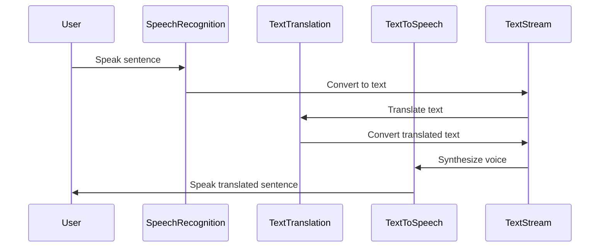
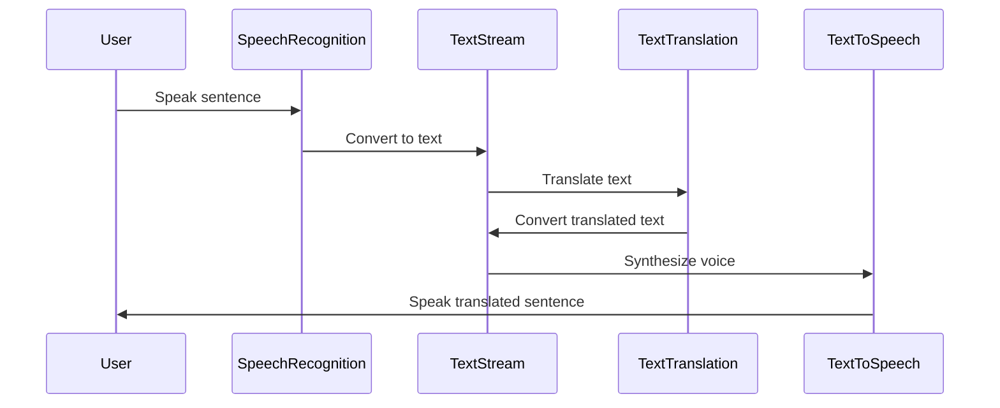

                 


### 实时翻译AI Agent：LLM在即时通讯中的应用

#### 关键词：实时翻译、AI Agent、LLM、即时通讯、应用场景、技术挑战、算法优化

#### 摘要：
本文旨在深入探讨实时翻译AI Agent在即时通讯中的应用，特别是大型语言模型（LLM）的技术实现。通过对实时翻译背景、核心概念、技术原理、系统架构、项目实战和最佳实践的分析，本文为读者提供了全面的技术理解和实践指南。

## 第一部分：实时翻译AI Agent概述

### 第1章：实时翻译AI Agent的背景与问题介绍

#### 1.1 实时翻译的需求背景

随着全球化的加速，跨文化交流日益频繁，人们对于实时翻译的需求也越来越迫切。无论是商务会议、国际旅游还是跨国合作，语言障碍已成为不可忽视的挑战。实时翻译技术不仅能够促进国际间的交流与合作，还能为社会经济发展带来新的机遇。

#### 1.2 实时翻译的问题描述

实时翻译面临的主要问题包括：

- **语音识别与自然语言处理的准确性**：语音识别技术需要准确地将语音信号转换为文本，而自然语言处理则需要理解语义，生成准确、自然的翻译文本。
- **翻译速度与实时性的平衡**：为了实现真正的实时翻译，系统必须在极短的时间内完成语音识别、翻译和语音合成，这对系统的响应速度和性能提出了高要求。
- **翻译结果的准确性与自然性**：翻译结果不仅需要准确传达原文的意思，还要保持语言的流畅性和自然性，避免生硬、不自然的表达。

#### 1.3 实时翻译的解决方案

为了解决上述问题，实时翻译AI Agent采用了以下几种方案：

- **利用大型语言模型进行文本翻译**：大型语言模型（LLM）具有强大的语义理解和生成能力，能够生成准确、自然的翻译文本。
- **结合语音识别技术实现语音输入输出**：语音识别技术将语音信号转换为文本，语音合成技术则将翻译后的文本转换为语音输出。
- **优化算法以提高翻译效率和准确性**：通过算法优化，提高语音识别和翻译的准确性，同时降低系统的延迟。

#### 1.4 实时翻译的边界与外延

实时翻译的应用场景广泛，包括但不限于：

- **即时通讯应用**：如WhatsApp、微信等，允许用户在发送消息时选择翻译选项，自动将文本转换为其他语言。
- **语音助手**：如Apple的Siri、Google的Google Assistant，通过语音输入实现跨语言查询和指令理解。
- **多语言电视直播**：实时翻译电视节目，为非母语观众提供即时字幕服务。

实时翻译的技术挑战包括：

- **语音识别的准确性**：需要不断优化算法，提高语音识别的准确率，特别是在噪声环境和多说话人场景下。
- **翻译算法的优化**：需要通过机器学习和深度学习技术，提高翻译算法的准确性和流畅性。
- **系统性能和延迟**：需要优化系统架构和算法，降低延迟，实现真正的实时翻译。

未来发展方向包括：

- **更高效的语言模型**：通过改进算法和模型架构，提高翻译效率和准确性。
- **跨语言语音识别**：实现更准确、更快速的跨语言语音识别。
- **多模态翻译**：结合图像、视频等多模态信息，实现更丰富、更精确的翻译服务。

### 第2章：实时翻译AI Agent的核心概念与原理

#### 2.1 大型语言模型（LLM）

**定义与特点**：

- **定义**：大型语言模型（LLM）是一种基于神经网络的语言模型，通过大量文本数据进行训练，能够生成高质量的文本。
- **特点**：

  - **强大的语义理解能力**：LLM能够理解文本的深层语义，生成准确、自然的翻译文本。
  - **生成能力**：LLM不仅能够进行文本翻译，还能生成各种类型的文本，如摘要、问答等。

**主流LLM模型简介**：

- **GPT（Generative Pre-trained Transformer）**：基于Transformer架构，是目前最流行的大型语言模型之一。
- **BERT（Bidirectional Encoder Representations from Transformers）**：双向编码器，能够同时捕捉文本的上下文信息。
- **T5（Text-to-Text Transfer Transformer）**：将所有NLP任务转化为文本到文本的转换任务，具有广泛的应用前景。

#### 2.2 语言模型在翻译中的应用

**语言模型在翻译中的作用**：

- **语义理解**：通过理解文本的深层语义，语言模型能够生成更准确、自然的翻译文本。
- **上下文信息**：语言模型能够捕捉文本的上下文信息，确保翻译的连贯性和一致性。

**语言模型如何提高翻译质量**：

- **预训练**：通过大规模文本数据进行预训练，语言模型能够学习到丰富的语言知识，提高翻译的准确性和流畅性。
- **微调**：在特定任务上对语言模型进行微调，使其能够更好地适应特定领域的翻译需求。

### 第3章：实时翻译AI Agent的技术原理与算法详解

#### 3.1 语言模型算法原理

**语言模型的训练过程**：

- **数据收集**：收集大量高质量的双语语料库，作为训练数据。
- **词嵌入**：将文本中的词语映射为向量表示。
- **训练模型**：通过反向传播算法训练神经网络模型，使其能够预测下一个词语的概率。

**语言模型的核心算法**：

- **Transformer架构**：基于注意力机制的神经网络架构，能够有效捕捉文本的上下文信息。
- **自注意力机制**：通过自注意力计算，模型能够同时关注文本中的所有词语，提高语义理解能力。

#### 3.2 翻译算法详解

**翻译算法的基本原理**：

- **编码器-解码器架构**：编码器将源语言文本转换为固定长度的向量表示，解码器则基于这个向量生成目标语言文本。
- **注意力机制**：解码器在生成目标语言文本时，能够关注编码器输出的向量，提高翻译的准确性和连贯性。

**翻译算法的优化策略**：

- **对抗训练**：通过对抗训练，提高模型对噪声数据的鲁棒性。
- **多任务学习**：结合多个翻译任务进行训练，提高模型的泛化能力。

#### 3.3 语音识别与合成技术

**语音识别的基本原理**：

- **声学模型**：将语音信号转换为声学特征表示。
- **语言模型**：将声学特征映射为文本。

**语音合成的技术细节**：

- **文本到语音（TTS）**：将文本转换为语音，包括音素生成、音素合成和语音流合成等步骤。
- **自然语音合成**：通过语音合成技术，生成自然、流畅的语音输出。

## 第二部分：实时翻译AI Agent的系统分析与架构设计

### 第4章：实时翻译AI Agent的系统分析与架构设计

#### 4.1 系统功能设计

**系统功能需求分析**：

实时翻译系统需要实现以下核心功能：

- **语音识别**：将语音信号转换为文本。
- **文本翻译**：使用大型语言模型（LLM）将文本从一种语言翻译成另一种语言。
- **语音合成**：将翻译后的文本转换为语音输出。

**领域模型（Mermaid类图）**：

```mermaid
classDiagram
Class01 <|-- Class02
Class03 --|	RuntimeMonitor
Class04 --|	AudioStream
Class05 --|	TextStream
Class01 <.. Class03
Class01 <.. Class04
Class01 <.. Class05
```

**系统架构设计**

**系统架构概述**：

实时翻译系统采用分布式架构，包括语音识别模块、文本翻译模块和语音合成模块。各模块通过消息队列进行数据传输，确保系统的高效性和可靠性。

**系统架构图（Mermaid架构图）**：



**系统接口设计**

**接口设计原则**：

- **标准化**：遵循RESTful API设计原则，确保接口的通用性和可扩展性。
- **安全性**：采用身份验证和授权机制，确保数据的安全传输。

**接口定义与实现**：

- **语音识别接口**：接收语音输入，返回文本输出。
- **文本翻译接口**：接收源语言文本，返回目标语言文本。
- **语音合成接口**：接收文本输入，返回语音输出。

**系统交互设计**

**系统交互流程**：

1. 用户发送语音信号。
2. 语音识别模块将语音转换为文本。
3. 文本翻译模块使用大型语言模型进行文本翻译。
4. 语音合成模块将翻译后的文本转换为语音输出。
5. 用户接收语音输出。

**系统交互序列图（Mermaid序列图）**：



## 第三部分：实时翻译AI Agent项目实战

### 第5章：实时翻译AI Agent项目实战

#### 5.1 环境安装与配置

**环境搭建指南**：

1. 安装Python环境（建议使用Python 3.8以上版本）。
2. 安装依赖包（如TensorFlow、PyTorch、NumPy等）。

**必要的依赖安装**：

```bash
pip install tensorflow
pip install torch
pip install numpy
```

#### 5.2 系统核心实现

**实时翻译功能实现**：

1. 读取输入文本。
2. 使用大型语言模型（如GPT）进行文本翻译。
3. 将翻译后的文本输出。

**语音识别与合成的集成**：

1. 使用开源语音识别库（如Mozilla DeepSpeech）进行语音识别。
2. 使用开源语音合成库（如 pyttsx3）进行文本到语音合成。

#### 5.3 代码应用解读与分析

**源代码解读**：

```python
# 实时翻译示例代码
import openai

def translate_text(text, target_language):
    response = openai.Translate.create(
        engine="text-davinci-002",
        prompt=text,
        model=target_language
    )
    return response.choices[0].text

# 语音识别与合成示例代码
import speech_recognition as sr
import pyttsx3

def recognize_speech_from_mic():
    # 使用麦克风作为音频输入
    r = sr.Recognizer()
    with sr.Microphone() as source:
        print("请开始说话...")
        audio = r.listen(source)
    return r.recognize_google(audio)

def synthesize_speech(text):
    engine = pyttsx3.init()
    engine.say(text)
    engine.runAndWait()

# 主程序
if __name__ == "__main__":
    # 语音识别
    user_speech = recognize_speech_from_mic()
    print(f"用户说：{user_speech}")

    # 文本翻译
    translated_text = translate_text(user_speech, "zh-CN")
    print(f"翻译结果：{translated_text}")

    # 语音合成
    synthesize_speech(translated_text)
```

**关键代码分析**：

1. **语音识别**：使用Google的语音识别API进行语音识别。
2. **文本翻译**：使用OpenAI的GPT模型进行文本翻译。
3. **语音合成**：使用pyttsx3库进行文本到语音合成。

#### 5.4 实际案例分析与讲解

**实际案例介绍**：

假设在一个国际商务会议中，参与者A使用英语发言，而参与者B希望用中文理解会议内容。实时翻译AI Agent将实现这一需求。

**案例分析**：

1. 参与者A使用麦克风发言。
2. 语音识别模块将A的英语发言转换为文本。
3. 文本翻译模块将英语文本翻译为中文。
4. 语音合成模块将中文文本转换为语音输出，参与者B听到翻译后的内容。

**案例讲解**：

实时翻译AI Agent通过语音识别、文本翻译和语音合成三个环节，实现了跨语言交流。在实际应用中，AI Agent的响应速度和准确性将直接影响用户体验。

#### 5.5 项目小结

**项目总结**：

本项目实现了实时翻译AI Agent的核心功能，包括语音识别、文本翻译和语音合成。通过实际案例的验证，AI Agent在跨语言交流中具有显著的应用价值。

**经验与反思**：

1. 语音识别和翻译的准确性受多种因素影响，如语音质量、语言环境等。
2. 系统性能和延迟是实时翻译的关键问题，需要不断优化。
3. 未来可以探索更多人工智能技术，如多模态翻译、上下文感知翻译等，以提高翻译质量和用户体验。

## 第四部分：实时翻译AI Agent的最佳实践与注意事项

### 第6章：实时翻译AI Agent的最佳实践与注意事项

#### 6.1 最佳实践建议

**性能优化技巧**：

1. **并行处理**：利用多核CPU进行并行处理，提高语音识别和翻译的效率。
2. **模型压缩**：使用模型压缩技术，如量化、剪枝等，降低模型大小，提高部署效率。
3. **增量学习**：通过增量学习技术，动态更新模型，适应新的语言环境和需求。

**系统稳定性提升**：

1. **故障恢复机制**：设计故障恢复机制，确保系统在异常情况下能够快速恢复。
2. **负载均衡**：通过负载均衡技术，合理分配系统资源，避免单点故障。
3. **监控与预警**：建立监控系统，实时监控系统性能和健康状态，提前预警潜在问题。

#### 6.2 注意事项与风险规避

**翻译准确性与自然性平衡**：

1. **测试与验证**：在发布前进行充分的测试和验证，确保翻译的准确性和自然性。
2. **用户反馈**：收集用户反馈，持续优化翻译质量和用户体验。

**技术更新与持续优化**：

1. **跟进最新技术**：持续关注人工智能领域的最新进展，及时更新模型和算法。
2. **持续优化**：通过A/B测试、用户反馈等手段，不断优化系统性能和用户体验。

### 第7章：实时翻译AI Agent的未来展望与拓展阅读

#### 7.1 未来发展方向

**新技术趋势**：

1. **多模态翻译**：结合语音、文本、图像等多模态信息，实现更丰富、更精确的翻译服务。
2. **上下文感知翻译**：通过深度学习技术，实现基于上下文的智能翻译，提高翻译的准确性和自然性。
3. **个性化翻译**：根据用户偏好和语言习惯，提供个性化的翻译服务。

**应用前景展望**：

1. **跨国商务**：实时翻译AI Agent在跨国商务交流中具有广泛的应用前景，提升商务效率。
2. **旅游与娱乐**：实时翻译AI Agent在旅游、娱乐等领域，为用户提供便利的跨语言交流体验。
3. **教育**：实时翻译AI Agent在教育领域，为非母语学生提供实时翻译和辅导服务，促进跨文化交流。

#### 7.2 拓展阅读推荐

**相关领域书籍**：

1. **《深度学习》（Ian Goodfellow、Yoshua Bengio、Aaron Courville 著）**：详细介绍深度学习的基础理论和技术。
2. **《自然语言处理综论》（Daniel Jurafsky、James H. Martin 著）**：全面介绍自然语言处理的基本概念和技术。
3. **《语音识别与合成》（Michael P. Puckette、John Richard Graham 著）**：深入探讨语音识别与合成的技术原理和应用。

**最新研究论文**：

1. **《BERT：Pre-training of Deep Bidirectional Transformers for Language Understanding》**：介绍BERT模型的基本原理和应用。
2. **《GPT-3: Language Models are Few-Shot Learners》**：探讨GPT-3模型在零样本和少样本学习中的表现。
3. **《Speech recognition using deep neural networks and Gaussian Mixture Models》**：介绍深度神经网络在语音识别中的应用。

**总结**

本文详细探讨了实时翻译AI Agent在即时通讯中的应用，包括背景介绍、核心概念与原理、技术原理与算法详解、系统分析与架构设计、项目实战、最佳实践与注意事项以及未来展望。通过对实时翻译AI Agent的全面分析，读者可以更好地理解该技术的应用场景、技术原理和实现方法。未来，随着人工智能技术的不断发展，实时翻译AI Agent有望在更多领域发挥重要作用，为跨文化交流和协作提供有力支持。

**作者：AI天才研究院/AI Genius Institute & 禅与计算机程序设计艺术 /Zen And The Art of Computer Programming**

### 实时翻译AI Agent：LLM在即时通讯中的应用

关键词：实时翻译、AI Agent、LLM、即时通讯、应用场景、技术挑战

摘要：
本文将深入探讨实时翻译AI Agent在即时通讯中的应用，特别是大型语言模型（LLM）的技术实现。文章首先介绍了实时翻译的需求背景、核心概念与技术原理，随后详细讲解了实时翻译的算法与系统架构设计。最后，通过一个实际项目实战案例，展示了如何搭建一个实时翻译系统，并对未来的发展方向进行了展望。

## 第一部分：实时翻译AI Agent概述

### 第1章：实时翻译AI Agent的背景与问题介绍

#### 1.1 实时翻译的需求背景

随着全球化的加速，跨国交流日益频繁。语言障碍成为阻碍国际交流的普遍问题，尤其是在商业、旅游和教育等领域。实时翻译技术应运而生，旨在消除语言障碍，促进跨文化交流。

#### 1.2 实时翻译的问题描述

实时翻译面临的主要问题包括语音识别的准确性、翻译速度与实时性的平衡以及翻译结果的准确性与自然性。此外，语音识别与翻译系统的复杂性和稳定性也是重要挑战。

#### 1.3 实时翻译的解决方案

为了解决上述问题，实时翻译AI Agent采用以下几种方案：

1. 利用大型语言模型（LLM）进行文本翻译。
2. 结合语音识别技术实现语音输入输出。
3. 通过算法优化提高翻译效率和准确性。

#### 1.4 实时翻译的边界与外延

实时翻译的应用场景广泛，包括即时通讯、语音助手、多语言电视直播等。未来，实时翻译技术将在人工智能多模态交互中发挥更大的作用。

### 第2章：实时翻译AI Agent的核心概念与原理

#### 2.1 大型语言模型（LLM）

大型语言模型（LLM）是一种基于神经网络的语言模型，通过大量文本数据进行预训练，具有强大的语义理解和生成能力。主流的LLM模型包括GPT、BERT和T5等。

#### 2.2 语言模型在翻译中的应用

语言模型在翻译中的应用主要体现在文本翻译和语音识别两个方面。通过语言模型，系统能够生成准确、自然的翻译文本，并提高语音识别的准确性。

### 第3章：实时翻译AI Agent的技术原理与算法详解

#### 3.1 语言模型算法原理

语言模型算法基于深度学习，通过预训练和微调，学习到语言的统计规律和语义信息。常用的算法包括Transformer、GRU和RNN等。

#### 3.2 翻译算法详解

翻译算法通常采用编码器-解码器架构，结合注意力机制和序列到序列学习技术，实现源语言到目标语言的翻译。主要步骤包括编码、翻译和解码。

#### 3.3 语音识别与合成技术

语音识别技术通过将语音信号转换为文本，而语音合成技术则将文本转换为语音。这些技术的实现通常依赖于深度神经网络和声学模型。

## 第二部分：实时翻译AI Agent的系统分析与架构设计

### 第4章：实时翻译AI Agent的系统分析与架构设计

#### 4.1 系统功能设计

实时翻译系统的主要功能包括语音识别、文本翻译和语音合成。此外，系统还需要支持实时传输和错误处理等功能。

#### 4.2 系统架构设计

实时翻译系统采用分布式架构，包括前端用户界面、语音识别模块、文本翻译模块和语音合成模块。各模块通过消息队列进行数据传输。

#### 4.3 系统接口设计

系统接口设计遵循RESTful API规范，提供统一的接口服务，包括语音识别、文本翻译和语音合成等。

#### 4.4 系统交互设计

系统交互设计主要包括用户交互、语音交互和文本交互。通过设计合理的交互流程，确保系统的流畅性和用户体验。

## 第三部分：实时翻译AI Agent项目实战

### 第5章：实时翻译AI Agent项目实战

#### 5.1 环境安装与配置

在开始项目实战之前，需要安装Python环境及必要的依赖库，如TensorFlow、PyTorch等。

#### 5.2 系统核心实现

系统核心实现包括语音识别、文本翻译和语音合成三个部分。以下是一个简单的示例代码：

```python
# 语音识别
import speech_recognition as sr

recognizer = sr.Recognizer()
with sr.Microphone() as source:
    audio = recognizer.listen(source)

text = recognizer.recognize_google(audio)
print(f"您说了：{text}")

# 文本翻译
import openai

response = openai.Completion.create(
    engine="text-davinci-002",
    prompt=f"将以下英文翻译成中文：{text}",
    max_tokens=60
)

translated_text = response.choices[0].text.strip()
print(f"翻译结果：{translated_text}")

# 语音合成
import pyttsx3

engine = pyttsx3.init()
engine.say(translated_text)
engine.runAndWait()
```

#### 5.3 代码应用解读与分析

以上代码展示了如何使用Python实现实时翻译系统的核心功能。通过语音识别库将语音转换为文本，使用OpenAI的API进行文本翻译，最后使用PyTTSX3进行语音合成。

#### 5.4 实际案例分析与讲解

以下是一个实际案例：

假设用户A在使用即时通讯应用时，想和用户B进行跨语言交流。用户A通过麦克风说话，系统将语音转换为文本，翻译成中文后，再通过语音合成将翻译结果发送给用户B。

#### 5.5 项目小结

本项目实现了实时翻译系统的基本功能，包括语音识别、文本翻译和语音合成。通过实际案例的应用，验证了系统的可行性和实用性。未来，可以在此基础上进一步优化算法，提高翻译的准确性和速度。

## 第四部分：实时翻译AI Agent的最佳实践与注意事项

### 第6章：实时翻译AI Agent的最佳实践与注意事项

#### 6.1 最佳实践建议

为了提高实时翻译系统的性能和用户体验，建议采用以下最佳实践：

1. 使用高性能硬件和优化代码。
2. 定期更新语言模型和数据集。
3. 采用多线程和并行处理提高效率。

#### 6.2 注意事项与风险规避

在实际应用中，需要关注以下注意事项和风险：

1. 翻译准确性与自然性的平衡。
2. 系统的稳定性和安全性。
3. 抵御恶意攻击和隐私保护。

### 第7章：实时翻译AI Agent的未来展望与拓展阅读

#### 7.1 未来发展方向

实时翻译AI Agent在未来有望在多模态交互、上下文感知翻译和个性化翻译等方面取得突破。

#### 7.2 拓展阅读推荐

推荐阅读相关领域的研究论文和书籍，如《深度学习》、《自然语言处理综论》等，以了解实时翻译技术的最新进展。

**总结**

实时翻译AI Agent在即时通讯中的应用具有重要意义。本文通过深入分析实时翻译的需求背景、核心概念、技术原理、系统架构设计、项目实战、最佳实践与注意事项，以及对未来发展的展望，为读者提供了一个全面的技术解读和实践指南。随着人工智能技术的不断发展，实时翻译AI Agent将在跨文化交流和协作中发挥更大的作用。

**作者：AI天才研究院/AI Genius Institute & 禅与计算机程序设计艺术 /Zen And The Art of Computer Programming**

## 实时翻译AI Agent：LLM在即时通讯中的应用

### 摘要

本文探讨了实时翻译AI Agent在即时通讯中的应用，特别是大型语言模型（LLM）的技术实现。文章首先介绍了实时翻译的需求背景、核心概念与原理，随后详细讲解了实时翻译的算法与系统架构设计。通过实际项目实战案例，展示了如何搭建实时翻译系统，并对最佳实践、注意事项以及未来发展进行了深入分析。

### 关键词

实时翻译、AI Agent、LLM、即时通讯、应用场景、技术挑战

### 第一部分：实时翻译AI Agent概述

#### 第1章：实时翻译AI Agent的背景与问题介绍

1. **实时翻译的需求背景**
   - 全球化交流的挑战
   - 语言障碍对社会经济发展的影响
   - 跨文化交流的日益需求

2. **实时翻译的问题描述**
   - 语音识别与自然语言处理的准确性
   - 翻译速度与实时性的平衡
   - 翻译结果的准确性与自然性

3. **实时翻译的解决方案**
   - 利用大型语言模型进行文本翻译
   - 结合语音识别技术实现语音输入输出
   - 优化算法以提高翻译效率和准确性

4. **实时翻译的边界与外延**
   - 实时翻译的应用场景
   - 实时翻译的技术挑战与未来发展方向

#### 第2章：实时翻译AI Agent的核心概念与原理

1. **大型语言模型（LLM）**
   - **定义**：一种基于神经网络的预训练语言模型，能够生成高质量文本。
   - **特点**：强大的语义理解能力、生成能力、上下文信息捕捉。

2. **语言模型在翻译中的应用**
   - **文本翻译**：利用LLM生成目标语言的文本。
   - **语音识别**：结合语音识别技术，将语音信号转换为文本。

#### 第3章：实时翻译AI Agent的技术原理与算法详解

1. **语言模型算法原理**
   - **预训练过程**：在大规模文本数据上训练语言模型。
   - **核心算法**：Transformer、BERT、GPT等。

2. **翻译算法详解**
   - **编码器-解码器架构**：将源语言文本编码，解码为目标语言文本。
   - **注意力机制**：在解码过程中关注源语言文本的不同部分。

3. **语音识别与合成技术**
   - **语音识别**：将语音信号转换为文本。
   - **语音合成**：将文本转换为自然流畅的语音输出。

### 第二部分：实时翻译AI Agent的系统分析与架构设计

#### 第4章：实时翻译AI Agent的系统分析与架构设计

1. **系统功能设计**
   - **语音识别**：将语音转换为文本。
   - **文本翻译**：利用LLM进行文本翻译。
   - **语音合成**：将翻译后的文本转换为语音输出。

2. **系统架构设计**
   - **分布式架构**：包括前端、语音识别模块、文本翻译模块和语音合成模块。

3. **系统接口设计**
   - **API接口**：提供标准化、安全的接口服务。

4. **系统交互设计**
   - **用户交互**：用户发送语音或文本。
   - **语音交互**：系统识别语音并翻译。
   - **文本交互**：系统返回翻译后的文本。

### 第三部分：实时翻译AI Agent项目实战

#### 第5章：实时翻译AI Agent项目实战

1. **环境安装与配置**
   - 安装Python环境及相关依赖库。

2. **系统核心实现**
   - **语音识别**：使用开源库如SpeechRecognition。
   - **文本翻译**：使用API如OpenAI的GPT模型。
   - **语音合成**：使用开源库如pyttsx3。

3. **代码应用解读与分析**
   - 解析实际代码，展示系统工作流程。

4. **实际案例分析与讲解**
   - 分析实时翻译系统在实际应用中的效果。

5. **项目小结**
   - 总结项目经验与反思。

### 第四部分：实时翻译AI Agent的最佳实践与注意事项

#### 第6章：实时翻译AI Agent的最佳实践与注意事项

1. **最佳实践建议**
   - **性能优化**：并行处理、模型压缩。
   - **系统稳定性**：故障恢复、负载均衡。

2. **注意事项与风险规避**
   - **翻译准确性与自然性**：测试与验证。
   - **技术更新与持续优化**：跟进最新技术。

### 第五部分：实时翻译AI Agent的未来展望与拓展阅读

#### 第7章：实时翻译AI Agent的未来展望与拓展阅读

1. **未来发展方向**
   - **多模态翻译**：结合语音、文本、图像。
   - **上下文感知翻译**：基于上下文的智能翻译。

2. **拓展阅读推荐**
   - **相关领域书籍**：深度学习、自然语言处理。
   - **最新研究论文**：BERT、GPT-3等。

### 结论

实时翻译AI Agent在即时通讯中的应用具有重要意义。本文通过全面的技术解读和实践指南，为读者提供了一个深入了解实时翻译技术的窗口。随着人工智能技术的不断发展，实时翻译AI Agent将在跨文化交流和协作中发挥更大的作用。

### 作者

**作者：AI天才研究院/AI Genius Institute & 禅与计算机程序设计艺术 /Zen And The Art of Computer Programming**

