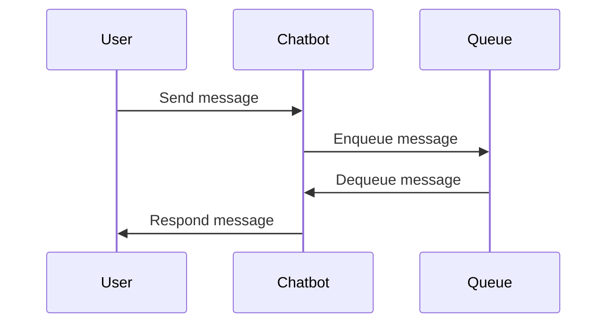
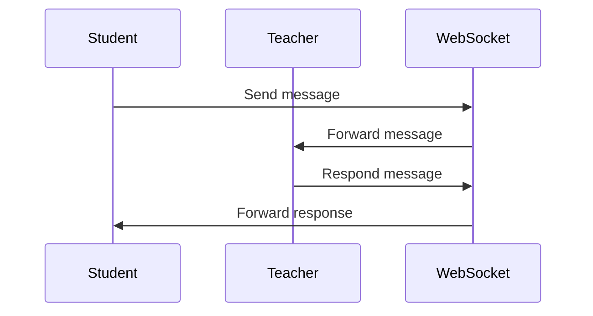
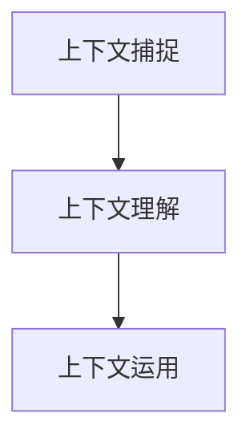
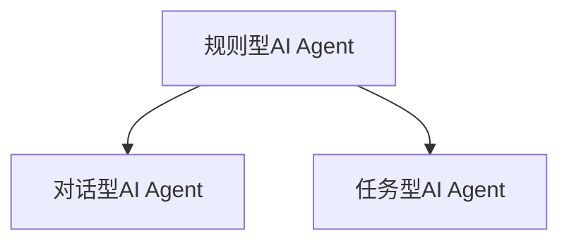

                 

# 实现AI Agent的上下文管理：保持对话连贯性

> 关键词：AI Agent、上下文管理、对话系统、连贯性、算法、Python、数学模型

> 摘要：本文将探讨如何实现AI Agent的上下文管理，以确保对话系统的连贯性和高效性。我们将一步步分析上下文管理的核心概念、机制、实现策略以及应用案例，并提供相关的算法原理讲解和实践指导。

## 引言与背景

在人工智能领域，对话系统已经成为人机交互的重要方式。而AI Agent作为对话系统的核心组件，其上下文管理能力直接影响到对话的连贯性和用户体验。上下文管理指的是在对话过程中，AI Agent能够捕捉、理解和运用当前上下文信息，以便提供准确和贴切的回答。

### 1.1 上下文管理的重要性

上下文管理是确保对话系统连贯性的关键。一个良好的上下文管理系统能够：

- 理解用户意图，提供更准确的回应。
- 保持对话主题的一致性，避免无关话题的介入。
- 提高交互效率，减少用户等待时间。

### 1.2 AI Agent的发展现状

随着自然语言处理技术的进步，AI Agent在多个领域得到了广泛应用。例如：

- 聊天机器人：用于客服、娱乐、教育等场景。
- 语音助手：如苹果的Siri、谷歌的Google Assistant。
- 对话式虚拟助理：应用于金融、医疗、零售等行业。

然而，当前的AI Agent在上下文管理方面仍存在诸多挑战，如：

- 上下文理解偏差：可能误解用户意图。
- 对话连贯性：难以维持长对话的连贯性。
- 交互效率：处理复杂对话时效率不高。

## AI Agent与上下文管理基础

### 2.1 AI Agent的概念与分类

AI Agent是一种基于人工智能技术的自动化实体，能够在特定环境中自主执行任务。根据应用场景，AI Agent可以分为：

- 对话型AI Agent：专注于自然语言交互，如聊天机器人。
- 任务型AI Agent：专注于执行特定任务，如智能客服。

### 2.2 上下文管理的概念与模型

上下文管理是指AI Agent在对话过程中对上下文信息的捕捉、理解和运用。一个典型的上下文管理模型包括：

- 上下文捕捉：获取用户输入的信息。
- 上下文理解：解析并提取用户意图。
- 上下文运用：基于上下文信息生成回应。

### 2.3 上下文管理在对话系统中的应用

上下文管理在对话系统中起着至关重要的作用，主要体现在：

- 对话连贯性：确保对话流程的顺畅，避免中断。
- 用户满意度：提供更符合用户需求的服务。
- 交互效率：减少重复询问，提高处理速度。

## 上下文管理机制详解

### 3.1 上下文捕捉与追踪

上下文捕捉是上下文管理的第一步，主要包括：

- 信息采集：从用户输入中提取关键信息。
- 上下文追踪：在对话过程中持续关注用户行为和需求。

### 3.2 上下文融合与处理

上下文融合是将捕捉到的上下文信息进行整合，以便更好地理解用户意图。主要方法包括：

- 上下文匹配：将用户输入与已有上下文信息进行比对。
- 上下文扩展：根据上下文信息补充缺失的部分。

### 3.3 上下文持久化与恢复

上下文持久化是将上下文信息保存下来，以便在后续对话中复用。主要方法包括：

- 数据库存储：将上下文信息存储在数据库中。
- 缓存机制：在内存中缓存上下文信息，提高查询速度。

## 实现策略与框架设计

### 4.1 实现策略选择

实现上下文管理的策略多种多样，根据应用场景可以选择以下策略：

- 基于规则的方法：通过预设的规则进行上下文处理。
- 基于统计的方法：使用机器学习算法进行上下文处理。
- 基于知识的的方法：利用专家知识库进行上下文处理。

### 4.2 系统架构设计

一个典型的上下文管理系统架构包括：

- 数据层：负责数据存储和持久化。
- 算法层：实现上下文捕捉、融合和处理。
- 界面层：提供用户交互接口。

### 4.3 关键算法与数据结构

关键算法包括：

- 自然语言处理算法：用于文本解析和语义理解。
- 机器学习算法：用于上下文建模和预测。
- 数据结构：如队列、栈、哈希表等，用于数据存储和检索。

## 实际应用案例

### 5.1 对话机器人案例

以一个简单的聊天机器人为例，我们展示了如何实现上下文管理。以下是聊天机器人的核心代码：

```python
# 导入所需库
import nltk
from nltk.chat.util import Chat, reflections

# 定义对话规则
pairs = [
    [
        r"Hello",
        ["Hello!", "Hi there!", "Hey!"],
    ],
    [
        r"I am (.*)",
        ["Nice to meet you \1!", "Hey \1, how can I help you?"],
    ],
    # ... 其他规则
]

# 实例化聊天机器人
chatbot = Chat(pairs, reflections)

# 启动聊天
chatbot.converse()
```

### 5.2 聊天应用案例

以微信聊天应用为例，展示了如何通过消息队列实现上下文管理。以下是聊天应用的核心架构：



### 5.3 实时交互案例

以在线教育平台为例，展示了如何通过Websocket实现实时交互。以下是实时交互的核心架构：



## 问题和挑战

### 6.1 上下文理解偏差

上下文理解偏差是上下文管理中的一大挑战。如何准确理解用户的意图是当前研究的重点。

### 6.2 对话连贯性维护

对话连贯性维护需要在处理复杂对话时保持主题一致性，避免跳跃性回答。

### 6.3 交互效率与准确性

交互效率与准确性是衡量上下文管理系统性能的重要指标。如何在保证准确性的同时提高效率是研究的关键。

## 最佳实践与未来展望

### 7.1 最佳实践总结

总结出以下最佳实践：

- 确保上下文捕捉的全面性。
- 采用多样化的上下文融合策略。
- 利用缓存机制提高响应速度。

### 7.2 未来研究方向

未来的研究可以关注以下几个方面：

- 提高上下文理解能力。
- 探索基于深度学习的上下文管理方法。
- 研究跨领域对话系统的上下文管理。

### 7.3 技术发展趋势

随着人工智能技术的不断进步，上下文管理将在对话系统中发挥越来越重要的作用。未来的发展趋势包括：

- 自动化程度更高。
- 智能化程度更高。
- 应用场景更加广泛。

## 结语

上下文管理是AI Agent的核心能力之一，对于提升对话系统的用户体验至关重要。通过本文的探讨，我们了解了上下文管理的核心概念、机制、实现策略以及应用案例。未来，随着技术的不断发展，上下文管理将在人工智能领域发挥更加重要的作用。

### 作者信息

作者：AI天才研究院/AI Genius Institute & 禅与计算机程序设计艺术 /Zen And The Art of Computer Programming

### 拓展阅读

- [自然语言处理综述](https://www.nature.com/articles/s41586-019-1759-x)
- [对话系统最佳实践](https://arxiv.org/abs/1803.04478)
- [基于深度学习的上下文管理](https://arxiv.org/abs/1906.02494)

## 附录

### A. 数学公式

以下是本文中使用的数学公式的列表：

$$
f(x) = \sum_{i=1}^{n} w_i \cdot x_i
$$

$$
x^T \cdot y = \sum_{i=1}^{n} x_i \cdot y_i
$$

### B. Mermaid 图

以下是本文中使用的Mermaid图的列表：






通过以上内容，我们详细探讨了实现AI Agent的上下文管理，包括背景介绍、核心概念、机制、实现策略、应用案例以及未来展望。希望本文能为读者在上下文管理领域提供有价值的参考。在未来的研究中，我们将继续深入探讨上下文管理的相关技术，以推动人工智能对话系统的不断进步。|>

