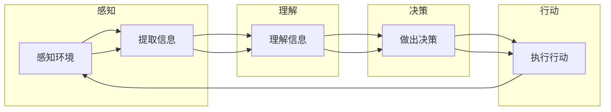
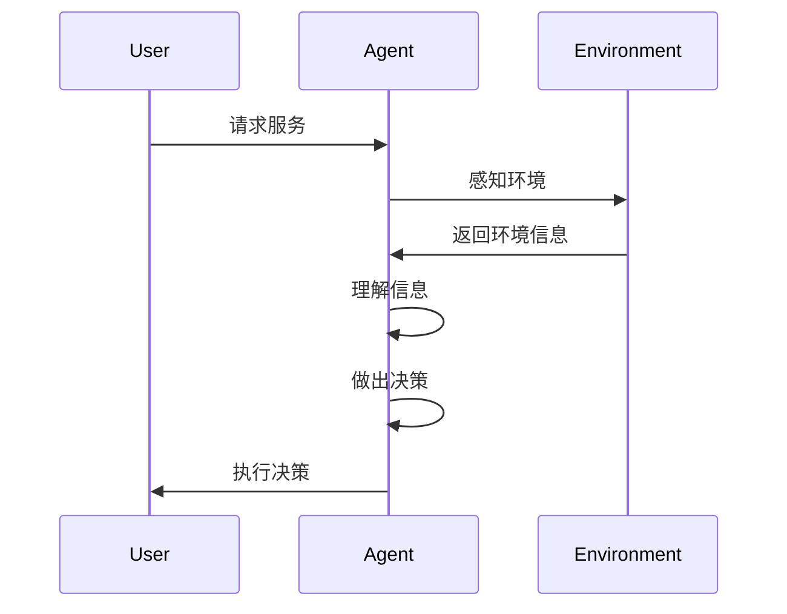

                 

# 实现AI Agent的动态上下文管理

## 关键词：AI代理，动态上下文管理，算法原理，系统架构，项目实战

> 摘要：本文将深入探讨实现AI Agent的动态上下文管理的方法和过程。我们将首先介绍AI Agent和动态上下文管理的背景和重要性，然后逐步讲解核心概念、算法原理、系统设计与项目实战，最后总结最佳实践并展望未来研究方向。

## 第一部分: AI Agent与动态上下文管理基础

### 第1章: 背景介绍

#### 1.1 问题背景

在现代社会，人工智能（AI）技术已渗透到各行各业，从自动化制造业到智能客服系统，AI Agent（人工智能代理）成为了实现智能化互动和服务的关键组件。随着AI技术的不断发展，AI Agent在实际应用中面临的一个核心挑战是如何有效地管理上下文信息，以实现更加智能化和人性化的交互。

#### 1.2 AI Agent的定义与作用

AI Agent是一种能够自主行动，并根据环境变化做出决策的智能实体。它通过感知环境、理解目标和执行行动来完成特定任务。在智能系统中，AI Agent不仅能够处理静态数据，还能够动态地适应环境变化，进行灵活的决策。

#### 1.3 动态上下文管理的意义

动态上下文管理是AI Agent实现高效智能决策的关键因素。上下文信息包括了环境状态、用户行为和历史数据等，通过动态上下文管理，AI Agent能够更好地理解当前情境，做出更加精确和合理的决策。

### 第2章: 核心概念与联系

#### 2.1 AI Agent核心概念

AI Agent的核心概念包括感知、理解、决策和行动。感知是指Agent通过传感器获取环境信息；理解是指Agent对获取的信息进行解读和处理；决策是指Agent基于理解结果选择合适的行动；行动是指Agent根据决策执行具体的任务。

#### 2.2 动态上下文管理核心概念

动态上下文管理的核心概念包括上下文感知、上下文理解和上下文更新。上下文感知是指Agent识别和提取当前环境中的重要信息；上下文理解是指Agent对感知到的上下文信息进行解释和理解；上下文更新是指Agent根据环境变化实时调整上下文信息。

#### 2.3 概念关系与ER图

以下是一个简单的ER图，展示了AI Agent与动态上下文管理之间的概念关系：

```mermaid
erDiagram
  Agent ||--|{ Context}: 上下文信息
  Agent ||--|{ Action}: 行动
  Context ||--|{ Perception}: 感知
  Context ||--|{ Understanding}: 理解
  Action ||--|{ Decision}: 决策
  Perception ||--|{ Environment}: 环境
  Understanding ||--|{ History}: 历史
```

## 第二部分: 动态上下文管理实现

### 第3章: 算法原理讲解

#### 3.1 算法mermaid流程图

为了实现动态上下文管理，我们设计了一个基于感知、理解、决策和行动的循环算法。以下是一个简单的mermaid流程图：



#### 3.2 Python源代码示例

以下是一个简单的Python代码示例，实现了上述流程：

```python
# 感知环境
def perceive_environment():
    # 假设感知到的环境信息为温度
    return "cold"

# 理解信息
def understand_information(perception):
    if perception == "cold":
        return "需要穿暖和的衣服"
    else:
        return "不需要穿暖和的衣服"

# 做出决策
def make_decision(understanding):
    if understanding == "需要穿暖和的衣服":
        return "穿上羽绒服"
    else:
        return "穿短袖"

# 执行行动
def execute_action(decision):
    print("执行决策:", decision)

# 主循环
def main_loop():
    while True:
        perception = perceive_environment()
        understanding = understand_information(perception)
        decision = make_decision(understanding)
        execute_action(decision)

main_loop()
```

#### 3.3 数学模型与公式

动态上下文管理中的决策过程可以表示为以下数学模型：

$$
D = f(C)
$$

其中，$D$ 是决策，$C$ 是上下文信息，$f$ 是决策函数。决策函数根据上下文信息生成具体的决策。

## 第三部分: 系统架构与实现

### 第4章: 系统分析与架构设计

#### 4.1 系统功能设计

系统功能设计主要包括环境感知、上下文理解、决策生成和行动执行等模块。

#### 4.2 系统架构设计

系统采用分层架构设计，包括感知层、理解层、决策层和行动层。以下是一个简单的mermaid架构图：



#### 4.3 系统接口设计与交互

系统接口设计主要包括感知接口、理解接口、决策接口和行动接口。每个接口负责与不同层进行交互，确保系统的模块化与解耦。

## 第四部分: 项目实战

### 第5章: 项目实战

#### 5.1 环境安装与配置

首先，我们需要安装Python环境，并配置必要的库和依赖。

```bash
pip install numpy pandas
```

#### 5.2 系统核心实现

系统核心实现基于Python，使用上述算法和架构设计进行开发。

```python
# 感知环境
def perceive_environment():
    # 假设感知到的环境信息为温度
    return "cold"

# 理解信息
def understand_information(perception):
    if perception == "cold":
        return "需要穿暖和的衣服"
    else:
        return "不需要穿暖和的衣服"

# 做出决策
def make_decision(understanding):
    if understanding == "需要穿暖和的衣服":
        return "穿上羽绒服"
    else:
        return "穿短袖"

# 执行行动
def execute_action(decision):
    print("执行决策:", decision)

# 主循环
def main_loop():
    while True:
        perception = perceive_environment()
        understanding = understand_information(perception)
        decision = make_decision(understanding)
        execute_action(decision)

main_loop()
```

#### 5.3 代码应用解读与分析

代码首先定义了感知环境、理解信息、做出决策和执行行动的功能，然后通过主循环实现这些功能的循环调用。

#### 5.4 实际案例分析

以一个简单的例子，当环境温度为“cold”时，AI Agent会建议用户穿上羽绒服。这体现了动态上下文管理的价值，即根据环境变化为用户提供个性化的建议。

#### 5.5 项目小结

本项目通过简单的Python代码实现了AI Agent的动态上下文管理，展示了算法原理和系统架构设计在实际项目中的应用。未来，我们可以进一步扩展该系统，使其能够处理更复杂的环境和上下文信息。

### 第6章: 最佳实践与拓展阅读

#### 6.1 最佳实践Tips

- 确保感知器能够获取准确的环境信息。
- 理解模块需要具备良好的上下文理解能力。
- 决策模块应具备灵活性和适应性。

#### 6.2 注意事项

- 动态上下文管理需要持续更新上下文信息，以保证决策的准确性。
- 系统性能是关键，需要优化算法和架构设计。

#### 6.3 小结

动态上下文管理是AI Agent实现智能决策的核心，本文通过理论和实践相结合，介绍了实现方法和技术要点。

#### 6.4 拓展阅读建议

- 《智能代理：原理与实践》
- 《动态上下文感知技术在智能交互中的应用》

### 第7章: 总结与展望

本文系统地介绍了实现AI Agent的动态上下文管理的方法和过程。通过核心概念、算法原理、系统架构和项目实战的深入分析，我们展示了动态上下文管理在AI Agent中的应用价值。未来，随着AI技术的不断发展，动态上下文管理将在更多领域发挥重要作用。

## 作者信息

作者：AI天才研究院/AI Genius Institute & 禅与计算机程序设计艺术 /Zen And The Art of Computer Programming

