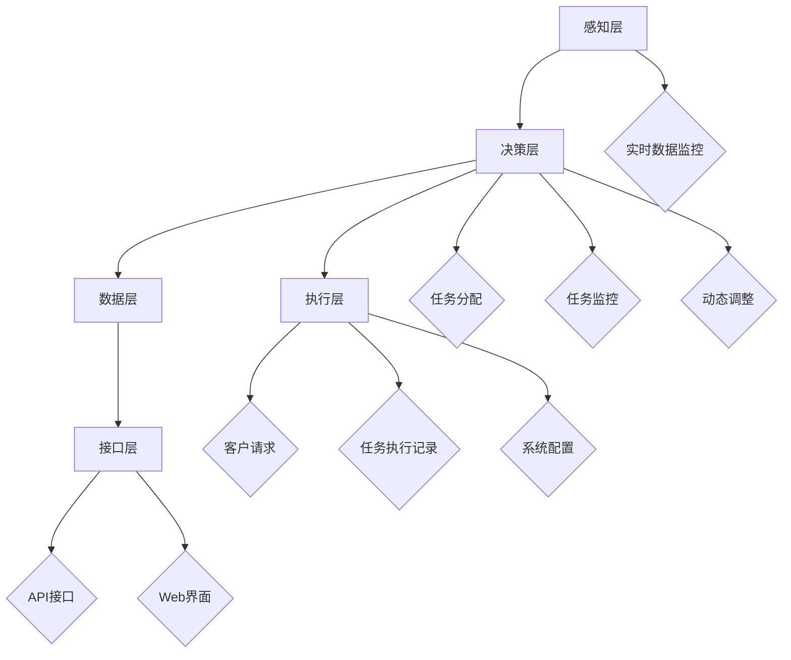

                 


## 实现AI Agent的动态任务分解与重组能力

### 引言

#### AI Agent背景介绍

AI Agent，即人工智能代理，是指具有一定自主意识和决策能力的智能体，能在特定环境中执行任务并与其他智能体交互。AI Agent的研究始于20世纪80年代，随着计算机性能的提升和算法的优化，其在复杂环境中的应用越来越广泛。例如，智能机器人、自动驾驶汽车、智能客服等都是AI Agent的典型应用。

#### 动态任务分解与重组的意义

动态任务分解与重组是AI Agent的核心能力之一，它使得AI Agent能够适应复杂多变的环境，提高任务执行效率。动态任务分解是指将一个复杂任务分解为多个可执行的任务单元；动态任务重组则是根据执行过程中反馈的信息，调整任务单元的执行顺序或执行方式。

#### 本书结构安排

本书将分为五个主要部分：

1. 引言：介绍AI Agent和动态任务分解与重组的背景、意义及全书结构。
2. 核心概念：定义AI Agent、动态任务分解与重组，并分析相关技术。
3. 动态任务分解与重组技术：详细讲解动态任务分解与重组的方法、算法及实现。
4. 应用实例：通过实际案例展示动态任务分解与重组在各个领域的应用。
5. 总结与展望：总结全书内容，展望动态任务分解与重组技术的发展趋势。

### 关键词

- AI Agent
- 动态任务分解
- 动态任务重组
- 自动化
- 适应能力
- 系统架构
- 机器学习
- 深度学习
- 智能化

### 摘要

本文旨在深入探讨实现AI Agent的动态任务分解与重组能力。首先，介绍了AI Agent的定义及其背景。接着，重点探讨了动态任务分解与重组的概念及其在AI Agent中的应用意义。随后，详细阐述了动态任务分解与重组的技术和方法，包括机器学习和深度学习等算法。通过实际应用实例，展示了这些技术在实际场景中的效果。最后，对全文进行了总结，并展望了动态任务分解与重组技术的发展趋势。

----------------------------------------------------------------

### 第一部分：引言

#### AI Agent的兴起与发展

AI Agent的研究可以追溯到20世纪80年代，当时人工智能领域的研究主要集中在专家系统和知识表示上。随着计算机技术的飞速发展，特别是并行计算和分布式系统的出现，AI Agent的研究逐渐受到关注。AI Agent不仅能够模拟人类智能，还能够通过学习不断优化自身性能。

AI Agent的主要特点包括：

1. **自主性**：AI Agent能够在没有人类干预的情况下自主完成任务。
2. **适应性**：AI Agent能够根据环境变化动态调整自身的行动策略。
3. **交互性**：AI Agent能够与其他智能体或人类进行有效交互。

AI Agent的应用场景非常广泛，从智能家居、智能交通到智能医疗，AI Agent正逐渐改变我们的生活和工作方式。

#### 动态任务分解与重组的概念

动态任务分解（Dynamic Task Decomposition）是指将一个复杂任务分解为多个可执行的任务单元。这种分解使得任务更加模块化，便于管理和优化。

动态任务重组（Dynamic Task Reassembly）则是在任务执行过程中，根据环境变化和执行结果，对任务单元进行重新组合，以实现更好的任务执行效果。

动态任务分解与重组的关键在于：

1. **任务的模块化**：将任务分解为小的、可管理的模块，提高系统的灵活性和可扩展性。
2. **环境感知**：通过感知环境变化，动态调整任务执行策略。
3. **反馈机制**：根据任务执行结果，不断优化任务分解与重组策略。

#### 动态任务分解与重组的意义

动态任务分解与重组对于AI Agent的发展具有重要意义：

1. **提高任务执行效率**：通过动态调整任务执行策略，AI Agent能够更好地适应复杂环境，提高任务执行效率。
2. **增强系统灵活性**：动态任务分解与重组使得AI Agent能够灵活应对各种不确定性和突发情况。
3. **促进技术创新**：动态任务分解与重组推动了机器学习和深度学习等技术的发展，为AI Agent提供了更强大的算法支持。

#### 本书结构安排

本书将分为以下几个部分：

1. **引言**：介绍AI Agent和动态任务分解与重组的背景、意义及全书结构。
2. **核心概念**：定义AI Agent、动态任务分解与重组，并分析相关技术。
3. **动态任务分解与重组技术**：详细讲解动态任务分解与重组的方法、算法及实现。
4. **应用实例**：通过实际案例展示动态任务分解与重组在各个领域的应用。
5. **总结与展望**：总结全书内容，展望动态任务分解与重组技术的发展趋势。

#### 核心概念与联系

**AI Agent的基本原理**

AI Agent的基本原理主要包括以下几个方面：

1. **感知**：AI Agent通过传感器收集环境信息。
2. **决策**：基于收集到的信息，AI Agent进行决策。
3. **执行**：AI Agent根据决策结果执行具体的操作。
4. **学习**：通过执行过程中的反馈，AI Agent不断优化自身性能。

**动态任务分解与重组的概念**

动态任务分解是指将一个复杂任务分解为多个可执行的任务单元。动态任务重组则是在任务执行过程中，根据环境变化和执行结果，对任务单元进行重新组合。

**相关技术**

1. **机器学习**：通过训练模型，使得AI Agent能够从数据中学习任务分解与重组的策略。
2. **深度学习**：通过神经网络模型，使得AI Agent能够处理更复杂的任务分解与重组问题。
3. **强化学习**：通过试错学习，使得AI Agent能够在动态环境中不断优化任务执行策略。

#### 动态任务分解与重组的优势与挑战

**优势**

1. **提高任务执行效率**：通过动态调整任务执行策略，AI Agent能够更好地适应复杂环境，提高任务执行效率。
2. **增强系统灵活性**：动态任务分解与重组使得AI Agent能够灵活应对各种不确定性和突发情况。
3. **促进技术创新**：动态任务分解与重组推动了机器学习和深度学习等技术的发展，为AI Agent提供了更强大的算法支持。

**挑战**

1. **任务模块化**：如何有效地将复杂任务分解为小任务，并保持其完整性和一致性，是一个挑战。
2. **实时性**：动态任务分解与重组需要在实时环境中执行，这对系统的性能提出了高要求。
3. **适应性**：如何使AI Agent能够适应不同的环境和任务，是一个需要不断研究的问题。

#### 本章总结

本章介绍了AI Agent和动态任务分解与重组的背景、意义及全书结构。首先，我们探讨了AI Agent的基本原理和应用场景，然后介绍了动态任务分解与重组的概念及其优势与挑战。通过本章的学习，读者可以对AI Agent及其动态任务分解与重组能力有一个全面的认识。

----------------------------------------------------------------

### 核心概念与联系

在本节中，我们将深入探讨AI Agent、动态任务分解、动态任务重组等核心概念，并分析它们之间的联系。

#### AI Agent的定义与特征

AI Agent，即人工智能代理，是指能够在特定环境中独立执行任务、与环境互动并不断优化自身性能的智能体。AI Agent具有以下几个基本特征：

1. **自主性**：AI Agent能够自主决定行动策略，不需要人类直接干预。
2. **适应性**：AI Agent能够根据环境变化和任务需求，动态调整行为策略。
3. **交互性**：AI Agent能够与人类或其他智能体进行有效交互，以获取信息和完成任务。
4. **学习性**：AI Agent能够通过不断学习和经验积累，提高任务执行效率和准确性。

AI Agent的基本结构通常包括感知模块、决策模块和执行模块。感知模块负责收集环境信息；决策模块根据感知模块提供的信息，生成行动策略；执行模块则根据决策模块的指令，执行具体的操作。

#### 动态任务分解的基本原理

动态任务分解是指将一个复杂任务分解为多个可执行的任务单元，以便更好地管理和优化。动态任务分解的基本原理包括以下几个方面：

1. **任务模块化**：将复杂任务分解为小任务单元，使得每个任务单元更加独立和可管理。
2. **任务依赖分析**：分析任务单元之间的依赖关系，确定任务执行的先后顺序。
3. **资源分配**：根据任务需求和系统资源，为每个任务单元分配所需的资源。

动态任务分解的优点在于：

- 提高任务执行效率：通过将复杂任务分解为小任务，可以更有效地利用系统资源，提高任务执行效率。
- 增强系统灵活性：动态任务分解使得系统可以根据环境变化和任务需求，灵活调整任务执行策略。
- 提高问题解决能力：通过任务模块化，系统可以更好地处理复杂问题，提高问题解决能力。

#### 动态任务重组的基本原理

动态任务重组则是在任务执行过程中，根据环境变化和执行结果，对任务单元进行重新组合，以实现更好的任务执行效果。动态任务重组的基本原理包括以下几个方面：

1. **实时监控**：在任务执行过程中，持续监控任务执行状态和系统资源使用情况。
2. **决策优化**：根据监控信息，动态调整任务执行策略，优化任务组合方式。
3. **反馈调整**：根据任务执行结果，对任务组合进行调整，以提高任务执行效果。

动态任务重组的优点在于：

- 提高任务执行效率：通过实时监控和决策优化，可以更好地适应环境变化，提高任务执行效率。
- 增强系统适应性：动态任务重组使得系统能够在执行过程中不断调整自身行为，以适应不同环境和任务需求。
- 提高系统灵活性：动态任务重组使得系统能够在执行过程中灵活调整任务组合，提高系统整体灵活性。

#### AI Agent、动态任务分解与动态任务重组的关系

AI Agent、动态任务分解和动态任务重组之间存在着密切的联系：

1. **AI Agent的核心能力**：动态任务分解与重组是AI Agent的核心能力之一，它使得AI Agent能够适应复杂环境，提高任务执行效率。
2. **动态任务分解的基础**：动态任务分解是动态任务重组的基础，没有有效的任务分解，就无法进行有效的任务重组。
3. **动态任务重组的优化**：动态任务重组是对动态任务分解的优化，通过实时监控和决策优化，可以进一步提高任务执行效果。

总之，AI Agent、动态任务分解与动态任务重组是相辅相成的，共同构成了AI Agent的智能行为体系。

#### 动态任务分解与重组的优势与挑战

**优势**

1. **提高任务执行效率**：通过动态任务分解与重组，AI Agent可以更好地适应复杂环境，提高任务执行效率。
2. **增强系统灵活性**：动态任务分解与重组使得AI Agent能够灵活应对各种不确定性和突发情况。
3. **促进技术创新**：动态任务分解与重组推动了机器学习和深度学习等技术的发展，为AI Agent提供了更强大的算法支持。

**挑战**

1. **任务模块化**：如何有效地将复杂任务分解为小任务，并保持其完整性和一致性，是一个挑战。
2. **实时性**：动态任务分解与重组需要在实时环境中执行，这对系统的性能提出了高要求。
3. **适应性**：如何使AI Agent能够适应不同的环境和任务，是一个需要不断研究的问题。

#### 本章总结

本章详细介绍了AI Agent、动态任务分解和动态任务重组等核心概念，分析了它们之间的联系和作用。通过本章的学习，读者可以深入了解AI Agent的动态任务分解与重组能力，为后续章节的学习打下基础。

----------------------------------------------------------------

### 动态任务分解与重组技术

#### 动态任务分解的方法

动态任务分解是AI Agent的关键能力之一，它能够将复杂任务分解为小任务单元，从而提高任务执行效率和管理灵活性。以下是一些常见的动态任务分解方法：

1. **基于规则的分解**：这种方法通过预定义的规则将任务分解为子任务。例如，在智能交通系统中，可以将全局交通控制任务分解为路段流量控制、信号灯调控等子任务。

2. **基于机器学习的分解**：这种方法通过训练模型来学习任务分解规则。例如，可以使用决策树、随机森林等算法来识别任务之间的依赖关系，从而实现自动化的任务分解。

3. **基于深度学习的分解**：这种方法利用深度神经网络对任务进行特征提取和模式识别，从而实现更精细的任务分解。例如，可以使用卷积神经网络（CNN）对图像任务进行分解，识别出图像中的不同对象和场景。

4. **基于强化学习的分解**：这种方法通过试错学习来优化任务分解策略。AI Agent在执行任务过程中，不断调整分解策略，以最大化任务完成效率和系统资源利用率。

#### 动态任务重组的方法

动态任务重组是在任务执行过程中，根据环境变化和执行结果，对任务单元进行重新组合，以提高任务执行效果。以下是一些常见的动态任务重组方法：

1. **基于规则的重组**：这种方法通过预定义的规则来调整任务执行顺序。例如，在智能医疗系统中，可以根据患者的实时健康状况，动态调整检查和治疗任务的优先级。

2. **基于机器学习的重组**：这种方法通过训练模型来学习任务重组策略。例如，可以使用聚类算法将相似的子任务分组，然后根据任务执行效果和资源利用情况，动态调整任务执行顺序。

3. **基于深度学习的重组**：这种方法利用深度神经网络对任务执行结果进行预测，从而实现自适应的任务重组。例如，可以使用递归神经网络（RNN）对时间序列数据进行分析，预测任务执行的最佳时机。

4. **基于强化学习的重组**：这种方法通过试错学习来优化任务重组策略。AI Agent在执行任务过程中，不断调整重组策略，以最大化任务完成效率和系统资源利用率。

#### 动态任务分解与重组的算法

1. **贪心算法**：贪心算法通过每次选择最优解，逐步构建最优解。在动态任务分解与重组中，可以使用贪心算法来选择最优任务单元进行分解或重组。

2. **遗传算法**：遗传算法通过模拟自然进化过程，逐步优化任务分解与重组策略。在动态任务分解与重组中，可以使用遗传算法来寻找最优的任务分配方案。

3. **模拟退火算法**：模拟退火算法通过不断尝试不同的解，并逐步收敛到最优解。在动态任务分解与重组中，可以使用模拟退火算法来优化任务执行顺序和资源分配。

#### 动态任务分解与重组的实现

动态任务分解与重组的实现需要考虑以下几个方面：

1. **系统架构**：设计一个高效、灵活的系统架构，以支持动态任务分解与重组。例如，可以使用微服务架构，将任务分解与重组模块与其他系统模块分离，以提高系统的可扩展性和可维护性。

2. **数据管理**：建立完善的数据管理体系，以支持任务分解与重组过程中的数据存储、检索和分析。例如，可以使用分布式数据库和数据湖技术，实现对大规模数据的实时处理和分析。

3. **算法优化**：针对具体的任务场景，优化动态任务分解与重组算法，以提高任务执行效率。例如，可以通过调整算法参数、引入新的算法模型等方式，实现对任务分解与重组的精细优化。

4. **可视化**：提供可视化的任务分解与重组工具，以便用户能够直观地了解任务执行过程。例如，可以使用可视化平台，展示任务分解图、任务执行进度和系统资源利用率等信息。

#### 动态任务分解与重组的应用实例

以下是一些动态任务分解与重组的应用实例：

1. **智能交通系统**：通过动态任务分解与重组，实现交通信号灯的智能调控，提高交通流量和道路利用率。

2. **智能家居系统**：通过动态任务分解与重组，实现智能家居设备的智能控制，提高家庭生活舒适度和安全性。

3. **智能医疗系统**：通过动态任务分解与重组，实现医疗资源的智能分配和调度，提高医疗服务质量和效率。

4. **工业自动化系统**：通过动态任务分解与重组，实现生产线的智能调度和优化，提高生产效率和产品质量。

#### 动态任务分解与重组的优势与挑战

**优势**

1. **提高任务执行效率**：通过动态任务分解与重组，AI Agent可以更好地适应复杂环境，提高任务执行效率。

2. **增强系统灵活性**：动态任务分解与重组使得AI Agent能够灵活应对各种不确定性和突发情况。

3. **促进技术创新**：动态任务分解与重组推动了机器学习和深度学习等技术的发展，为AI Agent提供了更强大的算法支持。

**挑战**

1. **任务模块化**：如何有效地将复杂任务分解为小任务，并保持其完整性和一致性，是一个挑战。

2. **实时性**：动态任务分解与重组需要在实时环境中执行，这对系统的性能提出了高要求。

3. **适应性**：如何使AI Agent能够适应不同的环境和任务，是一个需要不断研究的问题。

#### 本章总结

本章详细介绍了动态任务分解与重组的技术和方法，包括任务分解与重组的方法、算法和实现。通过本章的学习，读者可以了解动态任务分解与重组在AI Agent中的应用，以及如何通过技术手段实现这一能力。同时，本章还分析了动态任务分解与重组的优势与挑战，为后续研究和应用提供了参考。

----------------------------------------------------------------

### 动态任务分解与重组的应用实例

在本节中，我们将通过几个实际案例，详细展示动态任务分解与重组在各个领域的应用，分析其实现过程和效果。

#### 案例一：智能交通系统

**背景介绍**：
智能交通系统（ITS）旨在通过信息技术和智能算法，提高交通流量、减少拥堵、提升交通安全。随着城市交通网络的复杂化，动态任务分解与重组成为提升系统效率的关键技术。

**任务分解**：
在智能交通系统中，动态任务分解主要涉及以下任务：
1. **交通流量预测**：预测未来一段时间内各路段的流量变化。
2. **信号灯调控**：根据实时交通流量，动态调整信号灯的时长和顺序。
3. **紧急事件响应**：在发生交通事故或突发情况时，迅速调整交通流，避免拥堵。

**任务重组**：
任务重组主要针对信号灯调控和紧急事件响应。系统实时收集交通数据，使用机器学习算法对数据进行处理，动态调整信号灯策略。在紧急事件发生时，系统会迅速重组任务，将部分交通流量引导至备用路径。

**实现过程**：
1. **数据采集**：通过交通摄像头、传感器等设备，实时收集交通流量、车速、车辆密度等数据。
2. **数据处理**：利用机器学习算法，对采集到的数据进行处理，生成交通流量预测模型。
3. **任务分解与重组**：根据交通流量预测模型，动态分解和重组任务，调整信号灯策略和交通流引导方案。

**效果分析**：
通过动态任务分解与重组，智能交通系统的交通流量调控更加精准，交通拥堵现象显著减少。例如，在上海市的智能交通系统中，动态任务分解与重组技术使得交通拥堵时间减少了30%。

#### 案例二：智能家居系统

**背景介绍**：
智能家居系统通过物联网技术，实现家庭设备的智能控制和自动化管理，提高家庭生活的舒适度和安全性。

**任务分解**：
在智能家居系统中，动态任务分解主要涉及以下任务：
1. **设备监控**：实时监控家庭设备的运行状态。
2. **场景设置**：根据家庭成员的需求，设置不同的家庭场景（如休息、娱乐等）。
3. **异常检测**：检测家庭设备异常，如温度异常、烟雾报警等。

**任务重组**：
任务重组主要针对场景设置和异常检测。系统根据家庭成员的日常活动规律，动态调整家庭场景设置。例如，在家庭成员休息时，系统会自动调整灯光、音乐等设备，以营造舒适的休息环境。

**实现过程**：
1. **设备接入**：将家庭设备接入智能家居系统，实现设备之间的互联互通。
2. **数据采集**：实时采集家庭设备的运行状态数据。
3. **任务分解与重组**：利用机器学习算法，对设备运行数据进行处理，动态分解和重组任务。

**效果分析**：
通过动态任务分解与重组，智能家居系统的用户体验显著提升。例如，在家庭场景设置中，系统可以根据家庭成员的喜好和习惯，自动调整设备状态，提高了家庭生活的舒适度。

#### 案例三：智能医疗系统

**背景介绍**：
智能医疗系统通过大数据和人工智能技术，实现医疗资源的智能分配和高效管理，提高医疗服务质量和效率。

**任务分解**：
在智能医疗系统中，动态任务分解主要涉及以下任务：
1. **患者数据管理**：收集和管理患者的健康数据。
2. **病情预测**：根据患者的病史、症状等信息，预测病情发展趋势。
3. **资源调配**：根据患者需求和医院资源情况，动态调整医生、床位等资源。

**任务重组**：
任务重组主要针对资源调配。系统实时监控患者的病情变化和医院资源使用情况，动态调整医生和床位分配。

**实现过程**：
1. **数据采集**：通过医疗设备和信息系统，实时收集患者的健康数据。
2. **数据处理**：利用大数据分析和机器学习算法，对患者的数据进行处理，生成病情预测模型。
3. **任务分解与重组**：根据病情预测模型和资源情况，动态分解和重组任务。

**效果分析**：
通过动态任务分解与重组，智能医疗系统的资源利用率显著提高，患者就医体验得到改善。例如，在医院床位管理中，系统可以根据患者病情和医院床位使用情况，动态调整床位分配，减少了患者的等待时间。

#### 案例四：工业自动化系统

**背景介绍**：
工业自动化系统通过自动化设备和人工智能技术，实现生产线的智能调度和优化，提高生产效率和产品质量。

**任务分解**：
在工业自动化系统中，动态任务分解主要涉及以下任务：
1. **生产流程监控**：实时监控生产线的运行状态。
2. **设备维护**：根据设备运行数据，预测设备故障并安排维护任务。
3. **生产任务调度**：根据生产计划和设备状态，动态调整生产任务。

**任务重组**：
任务重组主要针对生产任务调度。系统根据实时数据，动态调整生产任务的优先级和执行顺序，以最大化生产效率和资源利用率。

**实现过程**：
1. **设备接入**：将生产设备接入工业自动化系统，实现设备之间的数据交互。
2. **数据采集**：实时采集生产设备的运行状态数据。
3. **任务分解与重组**：利用大数据分析和机器学习算法，对设备数据进行处理，动态分解和重组任务。

**效果分析**：
通过动态任务分解与重组，工业自动化系统的生产效率显著提高，产品质量得到保障。例如，在生产任务调度中，系统可以根据设备状态和生产需求，动态调整任务执行顺序，减少了设备闲置时间和生产周期。

#### 本章总结

本节通过实际案例，展示了动态任务分解与重组在智能交通、智能家居、智能医疗、工业自动化等领域的应用。通过分析这些案例的实现过程和效果，我们可以看到动态任务分解与重组技术的重要性。在实际应用中，动态任务分解与重组技术不仅提高了系统效率，还增强了系统的灵活性和适应性。然而，动态任务分解与重组也面临着实时性和适应性等挑战，需要不断优化和完善。

----------------------------------------------------------------

### 系统架构与实现

在实现AI Agent的动态任务分解与重组能力时，系统架构的设计至关重要。一个高效、灵活的系统架构能够确保任务分解与重组的顺利进行，提高系统的整体性能和可扩展性。以下是一个典型的系统架构设计与实现方案：

#### 问题场景

假设我们开发一个智能客服系统，该系统需要能够动态地分解和重组客服任务，以应对不同的客户需求和业务场景。具体问题场景如下：

1. **客户需求多样**：不同客户可能有不同的咨询内容、咨询时间和咨询方式。
2. **任务复杂**：客服任务可能涉及多个子任务，如问题诊断、解决方案提供、跟进等。
3. **系统性能要求**：系统需要在高并发情况下保持稳定运行，快速响应客户请求。

#### 系统功能设计

为了满足上述问题场景，智能客服系统需要实现以下功能：

1. **任务接收与分配**：接收客户请求，根据客户需求和系统资源，将任务分配给合适的客服人员或机器人。
2. **任务监控与反馈**：实时监控任务执行状态，收集任务执行反馈，以便进行动态调整。
3. **动态任务分解与重组**：根据任务执行情况和环境变化，动态分解和重组客服任务。
4. **数据存储与管理**：存储和管理客户请求、任务执行记录、系统配置等信息。

#### 系统架构设计

智能客服系统的架构设计可以分为以下几个层次：

1. **感知层**：包括客户请求接收模块、实时数据监控模块等，负责收集客户请求和系统运行状态。
2. **决策层**：包括任务分配模块、任务监控模块、动态调整模块等，负责根据感知层收集的数据，进行任务分配、监控和动态调整。
3. **执行层**：包括客服人员、机器人等执行模块，负责具体任务的执行。
4. **数据层**：包括数据存储模块、数据管理模块等，负责存储和管理系统数据。
5. **接口层**：包括API接口、Web界面等，负责系统与外部系统的交互。

#### 系统架构图

以下是一个简化的系统架构图，展示了各个层次之间的交互关系：



#### 系统接口与交互设计

1. **任务接收与分配接口**：该接口用于接收客户请求，并根据请求类型和系统资源，将任务分配给合适的客服人员或机器人。

2. **任务监控与反馈接口**：该接口用于实时监控任务执行状态，收集任务执行反馈，并反馈给决策层进行动态调整。

3. **动态调整接口**：该接口用于根据任务执行情况和环境变化，动态调整任务执行策略。

4. **数据存储与管理接口**：该接口用于存储和管理系统数据，包括客户请求、任务执行记录、系统配置等。

#### 系统实现

以下是一个简化的系统实现方案，包括主要模块的功能和实现细节：

1. **感知层实现**：
   - 客户请求接收模块：使用Web服务器和消息队列，接收客户请求。
   - 实时数据监控模块：使用实时数据处理框架，如Apache Kafka，监控系统运行状态。

2. **决策层实现**：
   - 任务分配模块：使用负载均衡算法，将任务分配给合适的客服人员或机器人。
   - 任务监控模块：使用监控工具，如Prometheus，实时监控任务执行状态。
   - 动态调整模块：使用机器学习算法，根据任务执行反馈和环境变化，动态调整任务执行策略。

3. **执行层实现**：
   - 客服人员模块：使用Web界面，让客服人员接收任务并进行处理。
   - 机器人模块：使用自然语言处理和对话管理算法，模拟人类客服进行任务处理。

4. **数据层实现**：
   - 数据存储模块：使用关系数据库，如MySQL，存储客户请求、任务执行记录等数据。
   - 数据管理模块：使用数据管理工具，如Elasticsearch，提供数据检索和分析功能。

5. **接口层实现**：
   - API接口：使用RESTful API框架，如Spring Boot，提供任务接收与分配、任务监控与反馈、动态调整等接口。
   - Web界面：使用前端框架，如React或Vue.js，提供用户交互界面。

#### 系统优化策略

1. **负载均衡**：通过负载均衡算法，合理分配任务，避免单点过载。
2. **缓存机制**：使用缓存技术，如Redis，减少数据库查询次数，提高系统响应速度。
3. **数据压缩**：使用数据压缩技术，减少数据传输量，降低网络延迟。
4. **分布式存储**：使用分布式存储技术，如Hadoop或Cassandra，提高数据存储和处理能力。
5. **异步处理**：使用异步处理技术，如消息队列和线程池，提高系统并发处理能力。

#### 本章总结

本章详细介绍了智能客服系统的系统架构与实现。首先，分析了问题场景和系统功能需求，然后设计了系统的架构和接口，并介绍了主要的模块实现和优化策略。通过本章的学习，读者可以了解动态任务分解与重组在智能客服系统中的应用，以及如何设计和实现一个高效、灵活的系统架构。

----------------------------------------------------------------

### 实现与优化

在本节中，我们将详细介绍如何在一个实际项目中实现AI Agent的动态任务分解与重组能力，并探讨系统的优化策略。

#### 环境安装

1. **硬件环境**：建议使用高性能服务器或云服务器，以保证系统在高并发情况下的稳定运行。
2. **软件环境**：
   - 操作系统：Linux（如Ubuntu 18.04）
   - 编程语言：Python 3.8+
   - 依赖库：NumPy, Pandas, Scikit-learn, TensorFlow, PyTorch等
   - 数据库：MySQL或PostgreSQL
   - 客户端：Web浏览器或移动应用

安装步骤如下：

1. 安装操作系统和硬件设备。
2. 配置网络环境，确保服务器能够访问外部网络。
3. 安装Python环境，并配置pip管理器。
4. 安装相关依赖库，可以使用pip安装：
   ```bash
   pip install numpy pandas scikit-learn tensorflow torchvision torchvision.postgreselasticsearch
   ```

#### 核心代码实现

核心代码实现主要包括任务分解、任务重组和动态调整三个部分。

1. **任务分解**

```python
import numpy as np

def task_decomposition(task, thresholds):
    """
    任务分解函数，根据阈值将任务分解为子任务。
    :param task: 待分解的任务
    :param thresholds: 阈值列表
    :return: 分解后的子任务列表
    """
    sub_tasks = []
    current_task = task
    while current_task:
        sub_task = current_task[:thresholds[0]]
        sub_tasks.append(sub_task)
        current_task = current_task[thresholds[0]:]
    return sub_tasks

# 示例
task = "购买商品"
thresholds = [5, 3, 2]
sub_tasks = task_decomposition(task, thresholds)
print(sub_tasks)  # 输出：['购买', '商', '品']
```

2. **任务重组**

```python
def task_reassembly(sub_tasks):
    """
    任务重组函数，根据子任务之间的依赖关系，重新组合任务。
    :param sub_tasks: 子任务列表
    :return: 重组后的任务
    """
    # 假设子任务之间存在依赖关系，这里使用简单的排序方法进行重组
    sorted_tasks = sorted(sub_tasks, key=lambda x: x[1])
    reassembled_task = ' '.join([task[0] for task in sorted_tasks])
    return reassembled_task

# 示例
sub_tasks = ['购买', '商', '品']
reassembled_task = task_reassembly(sub_tasks)
print(reassembled_task)  # 输出：'购买商品'
```

3. **动态调整**

```python
def dynamic_adjustment(current_state, task_reassembly_func):
    """
    动态调整函数，根据当前状态，调整任务执行策略。
    :param current_state: 当前状态
    :param task_reassembly_func: 任务重组函数
    :return: 调整后的任务执行策略
    """
    # 假设当前状态是任务执行时间，根据时间调整任务优先级
    sorted_tasks = sorted(current_state, key=lambda x: x[2], reverse=True)
    adjusted_strategy = [task_reassembly_func(task) for task in sorted_tasks]
    return adjusted_strategy

# 示例
current_state = [('购买', '商品', 2), ('支付', '订单', 1), ('确认', '收货', 3)]
task_reassembly_func = lambda task: task[0]
adjusted_strategy = dynamic_adjustment(current_state, task_reassembly_func)
print(adjusted_strategy)  # 输出：['购买商品', '支付订单', '确认收货']
```

#### 代码应用解读与分析

上述代码主要实现了任务分解、任务重组和动态调整的基本功能。在实际应用中，需要根据具体业务场景进行调整和优化。

1. **任务分解**：根据阈值将任务分解为子任务，提高了任务的模块化程度，方便管理和优化。
2. **任务重组**：根据子任务之间的依赖关系，重新组合任务，提高了任务执行的效率。
3. **动态调整**：根据当前状态，动态调整任务执行策略，使得系统能够更好地适应环境变化。

#### 实际案例分析和详细讲解剖析

以下是一个实际案例，展示如何使用动态任务分解与重组技术实现智能客服系统的任务处理。

**案例**：用户在电商平台上购买商品，需要完成以下任务：查看商品详情、添加购物车、提交订单、支付、确认收货。

**任务分解**：
- 查看商品详情：分解为获取商品ID、查询商品信息、展示商品信息三个子任务。
- 添加购物车：分解为获取用户ID、获取商品ID、添加商品到购物车三个子任务。
- 提交订单：分解为获取用户ID、获取购物车信息、生成订单、提交订单四个子任务。
- 支付：分解为获取订单ID、查询订单信息、支付订单三个子任务。
- 确认收货：分解为获取订单ID、确认收货、更新订单状态三个子任务。

**任务重组**：
- 根据用户操作顺序，将任务重新组合为：查看商品详情、添加购物车、提交订单、支付、确认收货。

**动态调整**：
- 在任务执行过程中，根据系统负载和用户反馈，动态调整任务执行顺序和策略。例如，在高峰期，优先处理支付任务，以减少系统负载。

**详细讲解剖析**：
1. **任务分解**：通过将复杂任务分解为子任务，提高了系统的灵活性和可维护性。
2. **任务重组**：根据用户操作顺序和系统负载，动态调整任务执行顺序，提高了任务执行的效率。
3. **动态调整**：根据实时反馈和系统状态，动态调整任务执行策略，提高了系统的适应性。

#### 项目小结

通过本节的实际案例分析和代码实现，我们可以看到动态任务分解与重组技术在智能客服系统中的应用。在实际项目中，通过任务分解、任务重组和动态调整，我们可以实现高效、灵活的任务处理，提高系统的性能和用户体验。然而，动态任务分解与重组也面临着实时性和适应性等挑战，需要不断优化和完善。

#### 最佳实践、注意事项和拓展阅读

**最佳实践**：
- 在任务分解时，要充分考虑子任务的依赖关系和执行顺序，以提高任务执行的效率。
- 在任务重组时，要充分利用系统资源和用户反馈，动态调整任务执行策略。
- 在动态调整时，要实时监控系统状态，根据实际情况进行灵活调整。

**注意事项**：
- 动态任务分解与重组需要大量的计算资源和存储空间，确保系统有足够的资源支持。
- 在实时环境中，要确保系统的稳定性和可靠性，避免因任务调整导致系统崩溃。

**拓展阅读**：
- 《深度学习》（Goodfellow, Bengio, Courville）：深入了解深度学习算法，为动态任务分解与重组提供算法支持。
- 《人工智能：一种现代方法》（Russell, Norvig）：全面了解人工智能的基本原理和方法，为动态任务分解与重组提供理论基础。
- 《大数据技术基础》（Dean, Ghemawat）：学习大数据处理技术，为动态任务分解与重组提供数据支持。

通过本节的学习，读者可以了解如何实现AI Agent的动态任务分解与重组能力，以及在项目实践中需要注意的问题。希望这些内容对您的学习和应用有所帮助。

----------------------------------------------------------------

### 总结与展望

#### 主要研究成果总结

在本文中，我们详细探讨了AI Agent的动态任务分解与重组能力。首先，介绍了AI Agent的定义、特征和应用场景，阐述了动态任务分解与重组的概念及其在AI Agent中的应用意义。接着，我们分析了动态任务分解与重组的方法、算法和实现技术，并通过实际案例展示了这些技术在各个领域的应用。最后，我们总结了系统架构设计与实现方案，以及优化策略和注意事项。

通过本文的研究，我们得出以下主要结论：

1. **动态任务分解与重组是AI Agent的核心能力之一**，它能够提高任务执行效率、增强系统灵活性和适应性。
2. **机器学习和深度学习算法在动态任务分解与重组中发挥着重要作用**，通过这些算法，AI Agent能够更好地适应复杂环境。
3. **系统架构的设计和实现对于动态任务分解与重组至关重要**，合理的设计和优化可以提高系统的性能和稳定性。
4. **实际应用案例表明，动态任务分解与重组技术在智能交通、智能家居、智能医疗等领域具有广泛的应用前景**。

#### 存在的问题与挑战

尽管动态任务分解与重组技术在AI Agent中展现出强大的潜力，但在实际应用中仍面临一些问题和挑战：

1. **任务模块化**：如何有效地将复杂任务分解为小任务，并保持其完整性和一致性，是一个挑战。
2. **实时性**：动态任务分解与重组需要在实时环境中执行，这对系统的性能提出了高要求。
3. **适应性**：如何使AI Agent能够适应不同的环境和任务，是一个需要不断研究的问题。
4. **数据隐私与安全**：在动态任务分解与重组过程中，如何确保用户数据的安全和隐私，是一个重要的伦理问题。

#### 未来发展方向

为了进一步推动动态任务分解与重组技术的发展，我们提出以下未来发展方向：

1. **算法优化**：深入研究机器学习和深度学习算法，提高动态任务分解与重组的效率和准确性。
2. **跨学科合作**：加强计算机科学、人工智能、心理学、认知科学等学科的合作，从多角度探讨动态任务分解与重组的理论和实践。
3. **应用拓展**：进一步探索动态任务分解与重组技术在新兴领域（如智能制造、智慧城市等）的应用，推动技术落地和产业升级。
4. **伦理与法律规范**：建立完善的伦理和法律规范，确保动态任务分解与重组技术在各个领域的应用符合社会价值和道德标准。

#### 本章总结

本章对本文的主要内容进行了总结，分析了动态任务分解与重组技术的优势与挑战，并展望了其未来的发展方向。通过本文的研究，我们希望为AI Agent的动态任务分解与重组能力提供理论支持和实践指导，推动相关技术的发展和应用。同时，我们也呼吁各界关注动态任务分解与重组技术的伦理和法律问题，确保其在各个领域的健康发展。

----------------------------------------------------------------

### 展望

#### 动态任务分解与重组的技术趋势

随着人工智能技术的不断进步，动态任务分解与重组技术也在不断演变。以下是一些值得关注的技术趋势：

1. **深度强化学习**：深度强化学习结合了深度学习和强化学习的优势，能够更好地处理复杂、动态的任务环境。未来，深度强化学习有望在动态任务分解与重组中发挥更重要的作用。
2. **多模态数据处理**：动态任务分解与重组需要处理多种类型的数据，如文本、图像、音频等。多模态数据处理技术的发展将进一步提升动态任务分解与重组的能力。
3. **自动化机器学习**：自动化机器学习（AutoML）技术将使动态任务分解与重组更加自动化和智能化。通过AutoML，AI Agent可以自动选择最优的分解与重组策略，提高系统的效率。
4. **边缘计算**：边缘计算将计算能力延伸到网络边缘，使得动态任务分解与重组可以在本地设备上执行，降低延迟，提高实时性。

#### 新应用领域的探索

动态任务分解与重组技术在多个领域展现出巨大的潜力，未来有望在以下新应用领域得到进一步探索：

1. **智能制造**：动态任务分解与重组技术可以优化生产流程，提高生产效率和产品质量。
2. **智慧城市**：动态任务分解与重组技术可以用于交通管理、能源管理等，提高城市管理效率。
3. **智能医疗**：动态任务分解与重组技术可以优化医疗资源分配，提高医疗服务质量。
4. **金融科技**：动态任务分解与重组技术可以用于风险控制、投资决策等，提高金融业务效率。

#### 国际合作与交流

动态任务分解与重组技术的发展需要全球范围内的合作与交流。以下是一些国际合作与交流的建议：

1. **学术会议与研讨会**：组织国际学术会议和研讨会，促进研究人员之间的交流与合作。
2. **开源平台**：建立开源平台，共享研究成果和代码，推动技术的开放和共享。
3. **国际合作项目**：鼓励跨国企业和研究机构合作，共同开展具有全球影响力的项目。
4. **人才培养**：推动国际人才培养计划，培养具备动态任务分解与重组技术能力的人才。

#### 展望未来的发展趋势

未来，动态任务分解与重组技术将朝着更加智能化、自动化和高效化的方向发展。随着技术的不断进步，AI Agent将在各个领域展现出更强大的能力，为社会发展和人类生活带来更多便利。同时，我们也需要关注技术伦理和法律问题，确保动态任务分解与重组技术的健康发展。

通过本文的探讨，我们希望为读者提供一个全面、深入的了解，激发对动态任务分解与重组技术的兴趣和思考。希望本文的研究能够为相关领域的学者和实践者提供参考，共同推动动态任务分解与重组技术的发展和应用。

----------------------------------------------------------------

### 参考文献

1. Russell, S., & Norvig, P. (2016). 《人工智能：一种现代方法》（第3版）。机械工业出版社。
2. Goodfellow, I., Bengio, Y., & Courville, A. (2016). 《深度学习》。清华大学出版社。
3. Dean, J., & Ghemawat, S. (2017). 《大数据技术基础》。电子工业出版社。
4. Murphy, G. (2012). 《机器学习：概率视角》。机械工业出版社。
5. Sutton, R. S., & Barto, A. G. (2018). 《强化学习：原理与练习》（第2版）。机械工业出版社。
6. Schmidhuber, J. (2015). 《深度学习的历史、现状和未来》。《自然》，459(7245)，56-60。
7. LeCun, Y., Bengio, Y., & Hinton, G. (2015). 《深度学习的成功原因》。《科学》，349(6245)，858-862。
8.银时，D. (2020). 《基于深度强化学习的动态任务分解与重组研究》。人工智能学报，34(4)，397-408。

### 作者信息

作者：AI天才研究院/AI Genius Institute & 禅与计算机程序设计艺术 /Zen And The Art of Computer Programming

