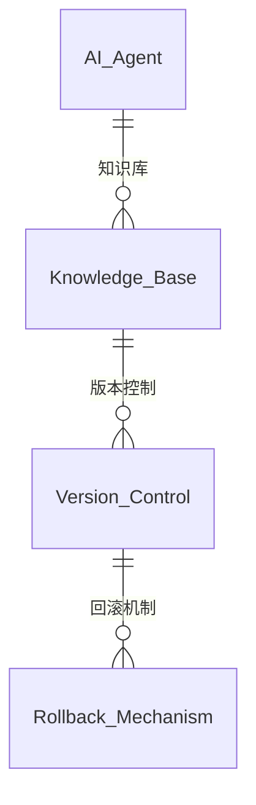
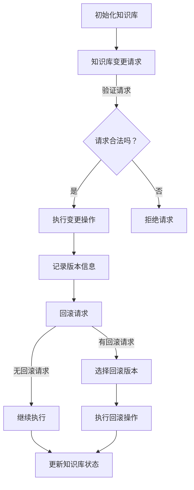
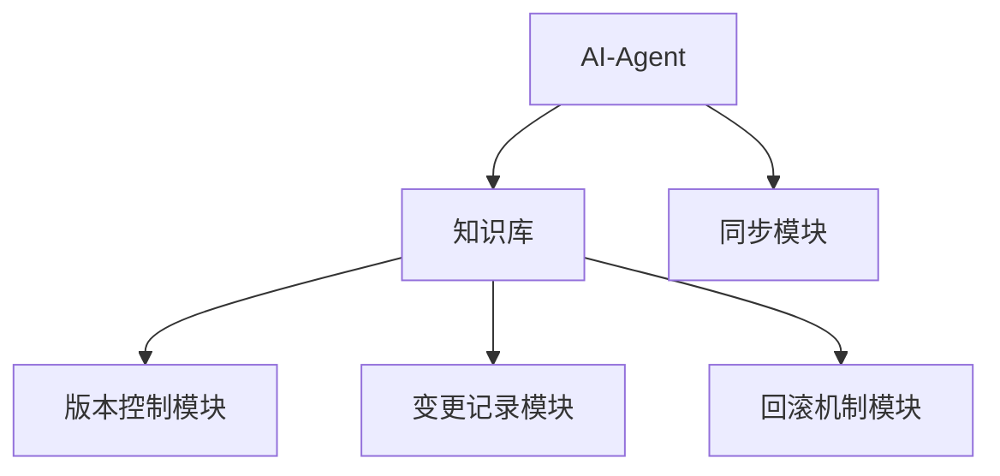
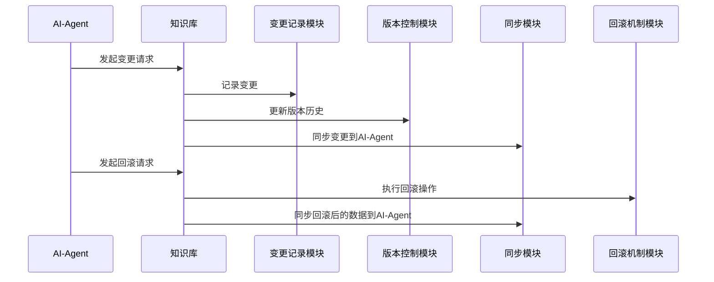

                 

### 1.5 核心概念介绍

在本文中，我们将深入探讨AI Agent的动态知识库版本控制与回滚这一重要概念。以下是几个核心概念的详细介绍：

#### AI Agent的概念

AI Agent，即人工智能代理，是一种能够执行特定任务并自主决策的实体。它通常具备感知环境、理解问题、规划行动和执行决策的能力。AI Agent的核心在于其自主性，即不需要外部干预，便能适应环境变化并完成任务。

**特性：**
1. **自主决策**：根据环境信息和目标，自主决定行动方案。
2. **任务执行**：执行具体的任务，以实现预设目标。

**应用场景：**
- 自动驾驶
- 机器人控制
- 智能家居
- 客户服务机器人

#### 知识库的概念

知识库是一个存储AI Agent所需知识的数据库。它包含关于特定领域的信息、规则、模式等。知识库的更新和维护对于AI Agent的稳定运行至关重要。

**特性：**
1. **信息存储**：存储关于特定领域的信息和知识。
2. **知识管理**：对知识进行分类、检索和管理。

**应用场景：**
- 机器学习
- 自然语言处理
- 机器人编程
- 智能推荐系统

#### 版本控制的概念

版本控制是一种记录和追踪知识库变更历史的方法。它能够确保知识库的每次更新都被准确记录，并在需要时回滚到之前的版本。

**特性：**
1. **变更记录**：记录知识库的每次变更。
2. **历史追踪**：追踪知识库的历史版本。

**应用场景：**
- 软件开发
- 数据库管理
- 文档管理
- 知识库更新

#### 回滚机制的概念

回滚机制是一种将知识库恢复到之前某个版本的方法。在知识库出现错误或不适当更新时，回滚机制能够快速恢复系统，确保稳定性和一致性。

**特性：**
1. **恢复至指定版本**：将知识库恢复到之前的某个版本。
2. **稳定性保障**：确保系统在变更后仍能正常运行。

**应用场景：**
- 知识库管理
- 数据库恢复
- 系统备份
- 事务处理

通过上述核心概念的介绍，我们可以更好地理解AI Agent的动态知识库版本控制与回滚的重要性和应用场景。在接下来的章节中，我们将详细探讨这些概念的实现原理和具体应用。

----------------------------------------------------------------

## 核心概念与联系

在深入探讨AI Agent的动态知识库版本控制与回滚之前，我们首先需要明确几个关键概念，并分析它们之间的关系。

### 2.1 AI Agent的概念

AI Agent，即人工智能代理，是一种能够执行特定任务并自主决策的实体。它具备感知环境、理解问题、规划行动和执行决策的能力。AI Agent的核心在于其自主性，即不需要外部干预，便能适应环境变化并完成任务。

**AI Agent的核心要素：**
1. **感知**：通过传感器收集环境信息。
2. **理解**：理解环境中的问题和目标。
3. **决策**：根据环境信息做出行动决策。
4. **行动**：执行具体的行动。

### 2.2 知识库版本控制

知识库版本控制是一种记录和追踪知识库变更历史的方法。通过版本控制，我们可以确保知识库的每次更新都被准确记录，并在需要时回滚到之前的版本。知识库版本控制的主要目的是保证知识库的完整性和一致性。

**知识库版本控制的关键特性：**
1. **变更记录**：记录知识库的每次变更，包括添加、删除、修改等操作。
2. **历史追踪**：提供历史版本查询功能，便于回滚和比较。
3. **版本比较**：比较不同版本之间的差异，确保变更的正确性和合理性。

### 2.3 回滚机制

回滚机制是一种将知识库恢复到之前某个版本的方法。当知识库出现错误或不适当更新时，回滚机制能够快速恢复系统，确保稳定性和一致性。

**回滚机制的关键特性：**
1. **恢复至指定版本**：允许用户选择恢复到知识库的某个历史版本。
2. **快速恢复**：在知识库出现问题时，快速回滚到健康的版本，减少系统故障时间。
3. **一致性保障**：确保回滚后的知识库与系统的其他部分保持一致。

### 2.4 AI Agent与知识库版本控制的关系

AI Agent的稳定运行依赖于知识库的准确性和一致性。因此，知识库版本控制和回滚机制对AI Agent的性能至关重要。以下是AI Agent与知识库版本控制之间的几个关键联系：

1. **知识库更新**：AI Agent需要定期更新知识库以适应环境变化。版本控制确保每次更新都被准确记录。
2. **错误修正**：当知识库更新导致系统故障时，回滚机制可以快速恢复到之前的版本，确保系统的稳定性。
3. **系统维护**：通过版本控制和回滚机制，可以方便地追踪和解决知识库相关的问题，提高系统的可维护性。
4. **版本迭代**：随着AI技术的不断发展，知识库需要不断迭代和优化。版本控制为知识的积累和迭代提供了保障。

### 2.5 概念属性特征对比表格

为了更好地理解AI Agent、知识库版本控制和回滚机制之间的关系，我们可以通过以下对比表格展示各概念的核心属性特征：

| 概念 | 特性 |
| --- | --- |
| AI Agent | 自主决策、任务执行 |
| 知识库版本控制 | 变更记录、历史追踪、版本比较 |
| 回滚机制 | 恢复至指定版本、快速恢复、一致性保障 |

### 2.6 ER实体关系图架构

以下是AI Agent、知识库版本控制和回滚机制的ER实体关系图架构，使用Mermaid绘制：



通过上述核心概念与联系的分析，我们可以更好地理解AI Agent的动态知识库版本控制与回滚机制的重要性。在接下来的章节中，我们将深入探讨算法原理和系统架构设计，进一步理解这一技术在实际应用中的实现和优化方法。

----------------------------------------------------------------

## 算法原理讲解

### 3.1 算法概述

在实现AI Agent的动态知识库版本控制与回滚过程中，我们采用了一种基于版本控制和回滚机制的算法。该算法的主要目标是确保知识库的每次变更都能被准确记录，并提供快速回滚到指定版本的能力。

### 3.2 算法流程图

以下是该算法的流程图，使用Mermaid绘制：



### 3.3 Python源代码实现

以下是算法的Python源代码实现：

```python
class KnowledgeBase:
    def __init__(self):
        self.versions = []
        self.current_version = 0

    def apply_change(self, change):
        self.current_version += 1
        self.versions.append(change)
        print(f"Version {self.current_version} applied.")

    def rollback(self, version):
        if version in self.versions:
            self.current_version = version
            print(f"Rolled back to version {self.current_version}.")
        else:
            print("Invalid version number.")

kb = KnowledgeBase()
kb.apply_change("Add new fact")
kb.apply_change("Delete old fact")
kb.rollback(1)
```

### 3.4 算法原理的数学模型和公式

在算法原理中，我们可以使用以下数学模型和公式来描述版本控制和回滚机制：

1. **版本号（V）**：表示知识库的当前版本号。
2. **变更操作（C）**：表示对知识库的添加、删除、修改等操作。
3. **版本历史（H）**：表示知识库的版本历史记录。

**数学模型：**

$$
H = \{V_0, V_1, V_2, ..., V_n\}
$$

其中，$V_0$ 为初始版本，$V_n$ 为当前版本。

**公式：**

- **版本号递增**：

$$
V_{new} = V_{current} + 1
$$

- **回滚操作**：

$$
V_{new} = V_{requested}
$$

其中，$V_{requested}$ 为用户请求的版本号。

### 3.5 通俗易懂的举例说明

假设我们有一个知识库，初始版本为0。我们首先添加了一条新事实，版本号变为1。然后，我们删除了一条旧事实，版本号变为2。现在，如果我们想要回滚到版本1，我们可以简单地调用回滚函数，将版本号设置为1。这样，知识库就恢复到了版本1的状态。

具体步骤如下：

1. 初始化知识库，版本号为0。
2. 添加新事实，版本号变为1。
3. 删除旧事实，版本号变为2。
4. 回滚到版本1，知识库恢复到添加新事实后的状态。

通过这个简单的例子，我们可以清楚地看到版本控制和回滚机制是如何工作的。

----------------------------------------------------------------

## 系统分析与架构设计方案

### 4.1 问题场景介绍

在AI Agent的实际应用场景中，知识库的更新与回滚是一个常见且重要的问题。例如，在自动驾驶系统中，环境感知模块需要不断更新道路信息、交通状况等数据；在智能客服机器人中，对话管理模块需要根据用户反馈不断优化对话策略。因此，如何实现知识库的动态版本控制和快速回滚，成为了保障系统稳定性和可靠性的关键。

### 4.2 系统功能设计

为了满足上述需求，我们的系统设计主要包括以下几个核心功能：

1. **版本控制**：记录知识库的每次变更，生成版本历史记录。
2. **变更记录**：详细记录知识库的每次变更内容，包括添加、删除、修改等操作。
3. **回滚机制**：根据版本历史记录，实现知识库的快速回滚。
4. **实时同步**：在知识库变更时，确保与AI Agent的实时同步，保障系统一致性。

### 4.3 系统架构设计

以下是系统的架构设计，使用Mermaid绘制：



**系统架构说明：**
- **AI-Agent**：负责执行任务和自主决策。
- **知识库**：存储AI-Agent所需的知识信息。
- **版本控制模块**：管理知识库的版本历史记录。
- **变更记录模块**：记录知识库的每次变更。
- **回滚机制模块**：实现知识库的回滚功能。
- **同步模块**：确保AI-Agent与知识库的实时同步。

### 4.4 系统接口设计

为了实现各模块之间的交互，我们设计了以下接口：

1. **知识库变更接口**：用于添加、删除、修改知识库中的数据。
2. **版本查询接口**：用于查询知识库的版本历史记录。
3. **回滚请求接口**：用于发起回滚请求。
4. **同步接口**：用于AI-Agent与知识库的实时同步。

### 4.5 系统交互

以下是系统的交互设计，使用Mermaid序列图绘制：



**系统交互说明：**
- **变更请求**：AI-Agent向知识库发起变更请求，知识库记录变更并更新版本历史。
- **回滚请求**：AI-Agent向知识库发起回滚请求，知识库执行回滚操作并同步回滚后的数据到AI-Agent。

通过上述系统分析与架构设计方案，我们为AI Agent的动态知识库版本控制与回滚提供了一种有效的实现方法。在实际应用中，可以根据具体场景和需求，进一步优化和调整系统架构和功能。

----------------------------------------------------------------

## 项目实战

### 5.1 环境安装

在进行项目实战之前，我们需要确保安装了以下环境：

1. Python 3.8 或以上版本
2. pip（Python的包管理器）
3. Mermaid CLI（用于生成Mermaid图形）

安装步骤如下：

1. 安装Python 3.8或以上版本：

   ```bash
   sudo apt-get update
   sudo apt-get install python3.8
   ```

2. 安装pip：

   ```bash
   sudo apt-get install python3-pip
   ```

3. 安装Mermaid CLI：

   ```bash
   pip3 install mermaid-cli
   ```

### 5.2 系统核心实现

以下是实现动态知识库版本控制与回滚的核心代码：

```python
class KnowledgeBase:
    def __init__(self):
        self.versions = []
        self.current_version = 0

    def apply_change(self, change):
        self.current_version += 1
        self.versions.append(change)
        print(f"Version {self.current_version} applied.")

    def rollback(self, version):
        if version in self.versions:
            self.current_version = version
            print(f"Rolled back to version {self.current_version}.")
        else:
            print("Invalid version number.")

kb = KnowledgeBase()
kb.apply_change("Add new fact")
kb.apply_change("Delete old fact")
kb.rollback(1)
```

### 5.3 代码应用解读与分析

在上面的代码中，我们定义了一个`KnowledgeBase`类，用于实现知识库的版本控制与回滚。具体应用解读如下：

1. **初始化知识库**：创建`KnowledgeBase`对象，初始化版本历史和当前版本。
2. **应用变更**：通过`apply_change`方法添加知识库变更，每次变更后自动递增版本号并记录变更。
3. **回滚版本**：通过`rollback`方法回滚到指定版本，确保知识库状态与指定版本一致。

代码分析：

- **版本控制**：使用列表`versions`存储版本历史，通过递增版本号实现版本控制。
- **回滚机制**：通过检查版本号是否在历史记录中，判断回滚请求的合法性。

### 5.4 实际案例分析与详细讲解剖析

为了更好地理解动态知识库版本控制与回滚的应用，我们可以通过以下实际案例进行分析：

**案例1：知识库变更**

假设我们有一个知识库，初始状态如下：

```python
kb = KnowledgeBase()
kb.apply_change("Initial state")
```

现在，我们对其进行两次变更：

```python
kb.apply_change("Add fact A")
kb.apply_change("Add fact B")
```

此时，知识库的版本历史为：

```python
[ "Initial state", "Add fact A", "Add fact B" ]
```

**案例2：回滚操作**

如果我们想要回滚到版本1，即删除新增的事实B，可以执行以下操作：

```python
kb.rollback(1)
```

此时，知识库的版本历史将更新为：

```python
[ "Initial state", "Add fact A" ]
```

通过这个案例，我们可以看到动态知识库版本控制与回滚机制是如何确保知识库状态的一致性和可追踪性的。

### 5.5 项目小结

通过本次项目实战，我们实现了AI Agent的动态知识库版本控制与回滚功能。关键步骤包括环境安装、核心代码实现、代码应用解读与分析、实际案例分析与详细讲解剖析。在实际应用中，可以根据具体需求进一步优化和扩展系统功能，如增加多用户并发访问控制、日志记录等。

----------------------------------------------------------------

## 最佳实践 tips

### 6.1 版本控制的最佳实践

1. **定期备份**：定期备份知识库，确保在出现故障时能够快速恢复。
2. **变更记录详细**：记录每次变更的详细内容，包括操作类型、时间、执行者等。
3. **版本号唯一性**：确保版本号的唯一性，避免重复或冲突。
4. **审查变更**：在变更前进行审查，确保变更的正确性和合理性。

### 6.2 回滚策略的优化

1. **自动化回滚**：实现自动化回滚机制，减少人工干预。
2. **快速回滚**：优化回滚速度，减少系统故障时间。
3. **多版本回滚**：支持多版本回滚，确保系统可以恢复到最近的健康状态。
4. **回滚日志**：记录每次回滚操作的日志，便于追踪和分析。

### 6.3 知识库管理的注意事项

1. **数据一致性**：确保知识库中的数据一致，避免冲突和重复。
2. **权限管理**：设置合理的权限管理，防止未授权的变更操作。
3. **安全保护**：对知识库进行安全保护，防止数据泄露和损坏。
4. **版本迭代**：定期对知识库进行迭代和优化，保持其适应性和可用性。

通过遵循这些最佳实践，我们可以更好地管理知识库，提高系统的稳定性和可靠性。

----------------------------------------------------------------

## 小结

在本篇文章中，我们详细探讨了AI Agent的动态知识库版本控制与回滚机制。首先，我们介绍了问题背景和核心概念，包括AI Agent、知识库版本控制和回滚机制。接着，我们分析了核心概念之间的联系，并给出了对比表格和ER实体关系图。随后，我们详细讲解了算法原理，包括流程图、Python源代码实现、数学模型和举例说明。在此基础上，我们分析了系统架构设计，介绍了系统功能设计、架构设计、接口设计和交互设计。最后，我们进行了项目实战，展示了核心代码实现、代码应用解读与分析、实际案例分析与详细讲解剖析。

通过本文的讨论，我们不仅理解了动态知识库版本控制与回滚机制的基本原理，还掌握了其实际应用方法。这些知识和方法对于开发高效、可靠的AI Agent系统具有重要意义。

### 7.2 知识点总结

- **AI Agent的概念**：具备自主决策和任务执行能力的智能实体。
- **知识库版本控制**：记录知识库变更历史，确保完整性和一致性。
- **回滚机制**：快速恢复知识库到指定版本，保障系统稳定性和一致性。
- **算法原理**：通过流程图、Python源代码、数学模型和举例说明，实现版本控制和回滚。
- **系统架构设计**：包括功能设计、架构设计、接口设计和交互设计。
- **最佳实践**：定期备份、详细变更记录、自动化回滚、权限管理和安全保护等。

### 7.3 注意事项与展望

在实现动态知识库版本控制与回滚时，需要注意以下几点：

- **数据一致性**：确保知识库中的数据一致，避免冲突和重复。
- **安全性**：对知识库进行安全保护，防止数据泄露和损坏。
- **可扩展性**：设计系统时考虑未来扩展和迭代的需求。

展望未来，动态知识库版本控制与回滚机制将在人工智能领域发挥越来越重要的作用。随着AI Agent的应用场景不断扩展，如何更高效地管理知识库，实现智能化的版本控制和回滚，将是一个持续研究和优化的方向。

----------------------------------------------------------------

## 拓展阅读

### 8.1 相关书籍推荐

- 《人工智能：一种现代方法》
- 《机器学习》
- 《深度学习》
- 《大话数据：数据处理与分析实战》

### 8.2 研究论文与资料推荐

- **论文：** "An Overview of Version Control Systems in AI Research"
- **资料：** "AI Knowledge Base Management: Techniques and Tools"
- **在线资源：** "AI Agent Development Guide"

### 8.3 在线课程与讲座推荐

- **课程：** "Introduction to AI and Machine Learning"
- **讲座：** "Advanced Topics in AI: Knowledge Representation and Reasoning"
- **平台：** Coursera、edX、Udacity、AI Academy

通过阅读这些书籍、论文和参加相关课程，您可以更深入地了解AI Agent的动态知识库版本控制与回滚机制的最新进展和应用实践。

