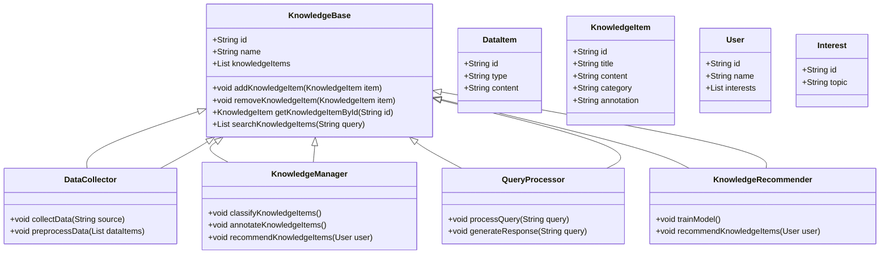
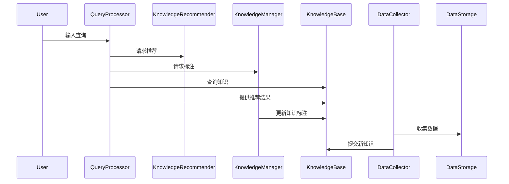
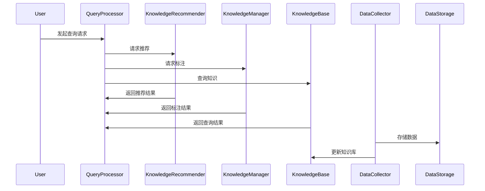

                 


### 设计目录大纲的具体步骤如下：

#### 1. **背景介绍**：

首先，我们需要为文章创建一个引人入胜的开头，介绍为何需要《实现AI Agent的动态知识库管理系统》这本书。这包括：

- **问题背景**：解释为什么在当前的AI时代，AI Agent和动态知识库管理系统如此重要。
- **问题描述**：描述AI Agent在现实世界中的应用场景以及遇到的挑战。
- **问题解决**：阐述动态知识库管理系统如何帮助解决这些问题。
- **边界与外延**：明确讨论范围，避免读者混淆。
- **概念结构与核心要素组成**：概述书中的核心概念和结构，让读者对整体内容有一个初步了解。

在撰写背景介绍部分时，可以采用以下结构：

1.1 问题背景与解决思路
1.1.1 AI Agent的概念与应用
1.1.2 动态知识库管理系统的需求
1.1.3 书籍的核心目的与结构

**步骤**：

- 收集相关背景资料，包括AI Agent和动态知识库管理系统的历史、现状和未来趋势。
- 确定文章的焦点和目标，确保所有内容都与核心主题紧密相关。
- 用清晰的语言描述问题背景，使其易于理解。

#### 2. **核心概念与联系**：

接下来，我们需要深入介绍AI Agent和动态知识库管理系统的核心概念，包括：

- **核心概念原理**：详细讲解AI Agent和动态知识库管理系统的基本原理。
- **概念属性特征对比表格**：列出AI Agent和动态知识库管理系统的主要属性和特征，并进行对比。
- **ER实体关系图架构的Mermaid流程图**：绘制一个Mermaid流程图，展示AI Agent与动态知识库管理系统之间的实体关系。

在撰写核心概念与联系部分时，可以采用以下结构：

2.1 AI Agent的核心概念与联系
2.1.1 AI Agent的基本原理
2.1.2 AI Agent的关键属性
2.1.3 AI Agent与动态知识库管理系统的关系
2.2 动态知识库管理系统的原理与设计
2.2.1 动态知识库管理系统的基础概念
2.2.2 知识库管理系统的核心功能
2.2.3 动态知识库管理系统的架构设计

**步骤**：

- 确定需要介绍的核心概念，确保每个概念都有充分的描述。
- 创建一个属性特征对比表格，帮助读者更好地理解两者之间的差异。
- 使用Mermaid绘制ER实体关系图，以直观的方式展示实体之间的关系。

#### 3. **算法原理讲解**：

在这个部分，我们将详细讲解实现动态知识库管理系统的算法原理，包括：

- **算法mermaid流程图**：使用Mermaid语言绘制算法的流程图。
- **Python源代码**：提供实现该算法的Python源代码。
- **算法原理的数学模型和公式**：详细讲解算法的数学模型和公式。
- **详细讲解和举例说明**：用通俗易懂的语言解释算法原理，并通过实例进行说明。

在撰写算法原理讲解部分时，可以采用以下结构：

3.1 算法原理讲解
3.1.1 算法mermaid流程图
3.1.2 Python源代码
3.1.3 算法原理的数学模型和公式
3.1.4 详细讲解和举例说明

**步骤**：

- 确定需要介绍的算法原理，并使用Mermaid绘制流程图，使读者能够直观地理解。
- 编写Python源代码，并详细解释代码中的每一步。
- 使用简单的例子来演示算法原理，使其更加易于理解。

#### 4. **系统分析与架构设计方案**：

在这一部分，我们将介绍如何设计AI Agent的动态知识库管理系统，包括：

- **问题场景介绍**：描述系统解决的问题和应用场景。
- **项目介绍**：简要介绍项目背景和目标。
- **系统功能设计(领域模型Mermaid类图)**：使用Mermaid绘制系统功能的类图。
- **系统架构设计Mermaid架构图**：使用Mermaid绘制系统的架构图。
- **系统接口设计和系统交互Mermaid序列图**：展示系统的接口设计和交互流程。

在撰写系统分析与架构设计方案部分时，可以采用以下结构：

4.1 系统分析与架构设计方案
4.1.1 问题场景介绍
4.1.2 项目介绍
4.1.3 系统功能设计(领域模型Mermaid类图)
4.1.4 系统架构设计Mermaid架构图
4.1.5 系统接口设计和系统交互Mermaid序列图

**步骤**：

- 确定系统解决的具体问题和应用场景，为读者提供一个清晰的背景。
- 简要介绍项目背景和目标，确保读者了解项目的整体方向。
- 使用Mermaid绘制类图、架构图和序列图，展示系统的结构和交互。

#### 5. **项目实战**：

最后，我们将通过实际项目来展示如何实现AI Agent的动态知识库管理系统，包括：

- **环境安装**：描述如何搭建项目环境。
- **系统核心实现源代码**：提供实现系统的核心源代码。
- **代码应用解读与分析**：对代码进行解读和分析。
- **实际案例分析和详细讲解剖析**：通过实际案例进行分析和讲解。
- **项目小结**：总结项目的主要收获和经验。

在撰写项目实战部分时，可以采用以下结构：

5.1 项目实战
5.1.1 环境安装
5.1.2 系统核心实现源代码
5.1.3 代码应用解读与分析
5.1.4 实际案例分析和详细讲解剖析
5.1.5 项目小结

**步骤**：

- 确定需要实现的具体功能，并详细描述如何搭建项目环境。
- 提供实现核心功能的源代码，并对代码进行详细解读。
- 通过实际案例展示如何使用系统，并进行深入分析。
- 总结项目中的关键经验和收获，为读者提供实用的指导。

### 综合考虑上述步骤，我们可以设计出完整的目录大纲，并按照此大纲逐步撰写文章，确保文章的逻辑清晰、结构紧凑、内容丰富且易于理解。

---

接下来，我们可以开始撰写文章的具体内容，按照上述设计的目录大纲逐步展开。每个部分都需要详细讲解，确保读者能够从基础概念到具体实现都有一个全面而深入的理解。

---

# 第一部分：AI Agent与动态知识库管理系统概述

## 1.1 问题背景与解决思路

在当今快速发展的AI时代，AI Agent作为一种能够自主学习和执行任务的智能体，正逐渐成为各个领域的关键技术。然而，随着AI Agent的应用越来越广泛，如何高效地管理这些智能体所依赖的知识库成为了一个亟待解决的问题。因此，设计并实现一个动态知识库管理系统，对于提升AI Agent的智能化水平和应用效果具有重要意义。

### 1.1.1 AI Agent的概念与应用

AI Agent，即人工智能代理，是指能够智能地完成特定任务的计算机程序或系统。它们通过学习环境中的数据，不断优化自己的行为，从而在复杂的环境中自主执行任务。AI Agent广泛应用于自然语言处理、机器学习、机器人学、游戏、金融等多个领域。例如，在自然语言处理领域，AI Agent可以用来构建智能客服系统，提供24小时不间断的客户服务；在机器人学领域，AI Agent可以帮助机器人进行自主导航和任务执行。

然而，随着AI Agent的不断发展和应用，它们所需的知识库也在不断扩充和变化。这就需要一种动态的知识库管理系统，能够实时地更新和优化知识库，以满足AI Agent的需求。传统的静态知识库管理系统已经难以满足这种需求，因此，研究并实现一个动态知识库管理系统成为了一个重要课题。

### 1.1.2 动态知识库管理系统的需求

动态知识库管理系统是一种能够实时更新和优化知识库的智能系统。它不仅能够存储和检索知识，还能够对知识进行自动分类、标注和推荐。具体来说，动态知识库管理系统需要满足以下需求：

1. **实时性**：系统能够实时地感知知识库的变化，并及时更新。
2. **智能性**：系统应该具备一定的智能，能够自动识别和分类知识。
3. **扩展性**：系统能够适应知识库的快速增长，并保持高效的运行。
4. **可靠性**：系统应该保证知识库的完整性和一致性。

### 1.1.3 书籍的核心目的与结构

《实现AI Agent的动态知识库管理系统》旨在为读者提供一套完整的设计和实现方案，帮助读者理解和掌握如何构建一个高效、智能、动态的知识库管理系统。本书的核心目的如下：

1. **介绍核心概念**：详细讲解AI Agent和动态知识库管理系统的基本概念和原理。
2. **设计架构方案**：提供一套完整的系统架构设计方案，包括功能设计、接口设计等。
3. **实现具体算法**：介绍实现动态知识库管理系统所需的关键算法，并提供详细的代码实现。
4. **实战案例剖析**：通过实际案例展示如何应用动态知识库管理系统，并进行分析和优化。

本书的结构如下：

- **第一部分：AI Agent与动态知识库管理系统概述**：介绍问题背景、核心概念和系统架构。
- **第二部分：AI Agent的构建与优化**：介绍AI Agent的构建流程、数据预处理、模型训练和优化。
- **第三部分：系统设计与实现**：详细介绍系统功能设计、系统架构设计和系统接口设计。
- **第四部分：项目实战与优化**：通过实际项目展示如何实现动态知识库管理系统，并进行优化。
- **第五部分：最佳实践与总结**：总结全书内容，提供最佳实践建议和注意事项。

通过本书的阅读，读者将能够系统地了解动态知识库管理系统的设计原理和实现方法，为实际项目提供有力的技术支持。

## 1.2 AI Agent的核心概念与联系

为了深入理解AI Agent的动态知识库管理系统，我们需要首先掌握AI Agent的核心概念和原理。在此基础上，我们还将探讨AI Agent与动态知识库管理系统之间的紧密联系，为后续内容打下坚实的基础。

### 1.2.1 AI Agent的基本原理

AI Agent是基于人工智能技术的智能体，它能够感知环境、制定计划、采取行动并从经验中学习。AI Agent的基本原理可以概括为以下几个方面：

1. **感知与理解**：AI Agent通过传感器（如摄像头、麦克风、触摸传感器等）感知环境中的信息，然后利用自然语言处理、图像识别等技术对这些信息进行理解和分析。

2. **决策与计划**：基于对环境的理解和自身目标，AI Agent会制定一系列行动计划。这个过程通常涉及到策略搜索、规划算法等。

3. **执行与反馈**：AI Agent会根据制定的计划执行行动，并在执行过程中不断获取反馈。这些反馈将被用于调整后续的行为，以优化性能。

4. **学习与优化**：AI Agent通过不断学习和优化，提高自己在复杂环境中的适应能力和执行效率。这个过程通常涉及到机器学习、深度学习等技术。

### 1.2.2 AI Agent的关键属性

AI Agent的关键属性包括智能性、自主性、适应性、协作性等。下面我们将详细讨论这些属性：

1. **智能性**：AI Agent的智能性是指其能够自主地理解和处理复杂问题的能力。这通常通过机器学习、深度学习等技术来实现。例如，AI Agent可以理解自然语言、识别图像、处理语音等。

2. **自主性**：AI Agent的自主性是指其能够在没有人工干预的情况下自主执行任务。这种自主性使得AI Agent能够在不同的环境中独立工作，而不需要依赖人类操作员。

3. **适应性**：AI Agent的适应性是指其能够根据环境的变化和任务的要求，自主调整自己的行为和策略。这种适应性使得AI Agent能够更好地应对不确定性和动态变化。

4. **协作性**：AI Agent的协作性是指其能够与其他AI Agent或人类合作，共同完成任务。这种协作性在多智能体系统中尤为重要，可以实现更高效、更智能的协作。

### 1.2.3 AI Agent与动态知识库管理系统的关系

AI Agent的动态知识库管理系统是AI Agent的核心组成部分，它为AI Agent提供了知识存储、检索、更新和优化的能力。具体来说，这种关系体现在以下几个方面：

1. **知识存储**：动态知识库管理系统为AI Agent提供了一个存储知识的仓库。这个仓库可以存储各种形式的知识，如图像、文本、声音等。

2. **知识检索**：AI Agent在执行任务时，需要从知识库中检索相关知识。动态知识库管理系统提供了高效的知识检索机制，使得AI Agent可以快速地找到所需的知识。

3. **知识更新**：随着环境的变化和任务的进展，AI Agent需要不断地更新知识库。动态知识库管理系统支持实时更新，确保AI Agent始终拥有最新、最准确的知识。

4. **知识优化**：动态知识库管理系统还提供了知识优化机制，通过机器学习、深度学习等技术，对知识库进行自动分类、标注和推荐。这有助于提升AI Agent的智能化水平和应用效果。

综上所述，AI Agent的动态知识库管理系统是AI Agent能够高效运行的基础。通过理解AI Agent的核心概念和与动态知识库管理系统之间的关系，我们可以更好地设计和实现AI Agent，推动人工智能技术的发展。

## 1.3 动态知识库管理系统的原理与设计

动态知识库管理系统是AI Agent的核心支撑系统，它不仅要确保知识库的实时更新和优化，还要提供高效的知识存储和检索机制。下面，我们将深入探讨动态知识库管理系统的基本原理和设计方法。

### 1.3.1 动态知识库管理系统的基础概念

动态知识库管理系统是一种智能化的知识管理工具，它能够动态地存储、检索和更新知识，以满足AI Agent的需求。其主要基础概念包括：

1. **知识**：知识是指经过组织、整合和表示的信息。在动态知识库管理系统中，知识可以以各种形式存在，如图像、文本、音频、视频等。

2. **知识库**：知识库是动态知识库管理系统的核心组成部分，它存储了所有相关的知识。知识库可以分为多个子库，每个子库存储特定类型的知识。

3. **存储**：存储是指将知识保存在系统中，以便后续检索和使用。动态知识库管理系统通常采用分布式存储技术，以提高存储效率和数据可靠性。

4. **检索**：检索是指从知识库中查找和提取所需的知识。动态知识库管理系统提供了高效的检索机制，可以使用关键词、分类、标签等多种方式进行检索。

5. **更新**：更新是指对知识库中的知识进行修改、补充和优化。动态知识库管理系统支持实时更新，确保知识库中的知识始终是最新的。

6. **优化**：优化是指通过机器学习、深度学习等技术，对知识库中的知识进行自动分类、标注和推荐。这有助于提升知识库的智能化水平和应用效果。

### 1.3.2 知识库管理系统的核心功能

动态知识库管理系统需要具备多种核心功能，以支持AI Agent的智能化运行。以下是其中一些关键功能：

1. **知识采集**：知识采集是指从各种来源收集知识，如互联网、数据库、传感器等。动态知识库管理系统应提供灵活的知识采集机制，支持多种数据源和采集方式。

2. **知识存储**：知识存储是指将采集到的知识存储到系统中。动态知识库管理系统应采用高效的存储技术，确保数据存储的安全性和可靠性。

3. **知识检索**：知识检索是指从知识库中查找和提取所需的知识。动态知识库管理系统应提供多种检索方式，如关键词检索、分类检索、标签检索等，以满足不同用户的需求。

4. **知识更新**：知识更新是指对知识库中的知识进行修改、补充和优化。动态知识库管理系统应支持实时更新，确保知识库中的知识始终是最新的。

5. **知识共享**：知识共享是指将知识库中的知识与其他用户或系统共享。动态知识库管理系统应提供知识共享机制，如权限管理、版本控制等，确保知识共享的安全性和可控性。

6. **知识分析**：知识分析是指对知识库中的知识进行统计、分析和挖掘。动态知识库管理系统应提供数据分析和可视化工具，帮助用户更好地理解和利用知识。

7. **知识推荐**：知识推荐是指根据用户的兴趣和需求，向用户推荐相关的知识。动态知识库管理系统应采用机器学习、深度学习等技术，实现个性化知识推荐。

### 1.3.3 动态知识库管理系统的架构设计

动态知识库管理系统的架构设计是其能否高效运行的关键。一个典型的动态知识库管理系统通常包括以下几个主要模块：

1. **数据层**：数据层负责存储和管理知识库中的数据。它通常采用分布式数据库系统，以确保数据存储的安全性和可靠性。

2. **服务层**：服务层提供各种知识管理功能，如知识采集、知识存储、知识检索、知识更新等。它通过API接口与其他模块进行交互，确保系统的模块化和可扩展性。

3. **应用层**：应用层是系统的用户接口，提供用户与系统交互的界面。它包括知识采集工具、知识检索工具、知识共享平台、知识分析工具等。

4. **算法层**：算法层负责实现知识库的自动分类、标注、推荐等功能。它采用机器学习、深度学习等技术，提升系统的智能化水平。

5. **管理层**：管理层负责系统的整体管理和监控，包括用户权限管理、系统性能监控、安全审计等。

下面是一个ER实体关系图架构的Mermaid流程图，展示动态知识库管理系统中的关键实体及其关系：

```mermaid
entity Relationship {
  Knowledge
  DataLayer
  ServiceLayer
  ApplicationLayer
  AlgorithmLayer
  ManagementLayer
}

DataLayer --|> Knowledge
ServiceLayer --|> Knowledge
ServiceLayer --|> ApplicationLayer
ServiceLayer --|> AlgorithmLayer
AlgorithmLayer --|> Knowledge
ManagementLayer --|> ServiceLayer
ManagementLayer --|> ApplicationLayer
ManagementLayer --|> AlgorithmLayer
```

通过上述架构设计，动态知识库管理系统可以高效地存储、检索和更新知识，支持AI Agent的智能化运行。

### 1.4 常见的AI Agent与动态知识库管理系统架构

在AI领域，不同的AI Agent应用场景和需求决定了其知识库管理系统的架构设计。以下是一些常见的AI Agent类型及其相应的动态知识库管理系统架构：

#### 1.4.1 常见AI Agent类型

1. **对话AI Agent**：这种类型的AI Agent主要用于与用户进行自然语言交互。例如，智能客服、虚拟助手等。对话AI Agent需要实时从知识库中检索相关信息，以提供准确、流畅的回答。

2. **感知AI Agent**：这种类型的AI Agent主要用于感知环境和采集数据。例如，智能监控系统、智能家居系统等。感知AI Agent需要动态更新其知识库，以适应环境变化和任务需求。

3. **决策AI Agent**：这种类型的AI Agent主要用于辅助人类进行复杂决策。例如，金融风控系统、医疗诊断系统等。决策AI Agent需要从知识库中获取大量历史数据，以支持其决策过程。

4. **协作AI Agent**：这种类型的AI Agent主要用于与人类或其他AI Agent协作完成任务。例如，智能物流系统、协同工作平台等。协作AI Agent需要高效的知识共享和协同机制，以确保团队工作的顺畅。

#### 1.4.2 动态知识库管理系统架构案例

1. **对话AI Agent的动态知识库管理系统**：

架构设计：
- **数据层**：使用关系型数据库存储对话历史、用户信息等数据。
- **服务层**：提供对话管理、知识检索、自然语言处理等服务。
- **应用层**：提供用户交互界面，支持文本和语音输入输出。
- **算法层**：采用深度学习、自然语言处理等技术进行知识库的自动分类、标注和推荐。
- **管理层**：负责用户权限管理、日志记录、系统监控等。

2. **感知AI Agent的动态知识库管理系统**：

架构设计：
- **数据层**：使用分布式数据库系统存储传感器数据、环境信息等。
- **服务层**：提供数据采集、数据预处理、知识库更新等服务。
- **应用层**：提供数据可视化、报警设置等用户交互功能。
- **算法层**：采用机器学习、计算机视觉等技术进行环境感知和数据分析。
- **管理层**：负责数据备份、系统安全、性能监控等。

3. **决策AI Agent的动态知识库管理系统**：

架构设计：
- **数据层**：使用数据仓库存储大量历史数据，支持数据分析和挖掘。
- **服务层**：提供数据查询、决策支持、知识库更新等服务。
- **应用层**：提供决策支持界面，支持用户查询、分析和报告生成。
- **算法层**：采用统计学习、优化算法等技术进行数据分析、预测和决策。
- **管理层**：负责数据质量监控、系统安全、性能优化等。

4. **协作AI Agent的动态知识库管理系统**：

架构设计：
- **数据层**：使用分布式数据库和消息队列系统实现高效的数据存储和传输。
- **服务层**：提供知识共享、协作管理、任务分配等服务。
- **应用层**：提供协作工作台、聊天工具、任务管理工具等。
- **算法层**：采用协同过滤、多智能体协同优化等技术实现知识共享和任务协同。
- **管理层**：负责用户权限管理、系统日志记录、系统监控等。

通过上述架构设计，不同的AI Agent可以根据其特定的应用场景和需求，实现高效、智能的动态知识库管理系统，从而提升AI Agent的智能化水平和应用效果。

## 1.5 本章小结

本章全面介绍了AI Agent与动态知识库管理系统的背景、核心概念及其相互关系，并探讨了不同类型的AI Agent及其动态知识库管理系统的架构设计。通过了解这些内容，读者可以初步掌握动态知识库管理系统的基本原理和设计方法，为后续章节的深入探讨打下坚实基础。在接下来的部分，我们将进一步探讨AI Agent的构建与优化，详细解析其构建流程、数据预处理、模型训练和优化方法，以及实际应用案例。

# 第二部分：AI Agent的构建与优化

## 2.1 AI Agent的构建流程

构建一个高效的AI Agent是一个涉及多个步骤的复杂过程，它需要从数据收集、预处理到模型选择、训练和优化。下面，我们将详细介绍这一过程，并提供详细的步骤和注意事项。

### 2.1.1 数据收集与预处理

数据收集是构建AI Agent的第一步，也是最重要的一步。数据的质量和数量直接影响到AI Agent的性能。以下是数据收集与预处理的关键步骤：

1. **数据源选择**：确定数据来源，如公共数据集、企业内部数据、第三方API等。
2. **数据采集**：使用适当的工具（如爬虫、API调用等）采集数据。确保采集的数据符合需求和标准。
3. **数据清洗**：删除重复、错误或不完整的数据。这可以通过编写清洗脚本或使用数据清洗工具来完成。
4. **数据转换**：将数据转换为适合模型训练的格式。例如，将图像转换为像素矩阵，将文本转换为词向量。
5. **数据增强**：通过数据增强技术（如旋转、缩放、裁剪等）增加数据多样性，提高模型的泛化能力。

### 2.1.2 模型选择与训练

模型选择与训练是构建AI Agent的核心步骤。选择合适的模型和有效的训练方法对于提升AI Agent的性能至关重要。以下是模型选择与训练的关键步骤：

1. **模型选择**：根据问题的类型和需求选择合适的模型。常见的模型包括神经网络、决策树、支持向量机等。对于复杂的任务，可能需要使用深度学习模型，如卷积神经网络（CNN）、循环神经网络（RNN）等。
2. **模型配置**：配置模型参数，如学习率、批次大小、优化器等。这些参数的选择会影响模型的训练时间和性能。
3. **模型训练**：使用训练数据集对模型进行训练。训练过程包括前向传播、反向传播和参数更新。确保训练过程中监控模型性能，防止过拟合。
4. **模型评估**：使用验证数据集评估模型性能。常用的评估指标包括准确率、召回率、F1分数等。通过调整模型参数和结构，优化模型性能。

### 2.1.3 模型评估与优化

模型评估与优化是确保AI Agent性能的重要环节。以下是模型评估与优化的关键步骤：

1. **性能评估**：在测试数据集上评估模型性能，确保模型具有较好的泛化能力。如果性能不理想，需要返回到模型训练阶段进行调整。
2. **超参数调优**：通过调整模型超参数（如学习率、批量大小等），寻找最优配置，提高模型性能。
3. **结构优化**：通过调整模型结构（如增加或减少层、调整层参数等），优化模型性能。这可能需要多次迭代训练和评估。
4. **交叉验证**：使用交叉验证方法（如K折交叉验证）评估模型在不同数据集上的性能，确保模型具有稳健性和可靠性。

### 2.1.4 构建流程总结

构建AI Agent的流程可以总结为以下步骤：

1. **需求分析**：明确AI Agent的应用场景和需求。
2. **数据收集**：采集符合需求的数据。
3. **数据预处理**：清洗、转换和增强数据。
4. **模型选择**：选择合适的模型。
5. **模型训练**：训练模型并评估性能。
6. **模型优化**：调整超参数和模型结构，优化性能。
7. **测试与部署**：在测试数据集上评估模型性能，并进行部署。

通过上述流程，我们可以构建出一个高效、可靠的AI Agent，并在实际应用中发挥其价值。

### 2.2 数据预处理与特征工程

在构建AI Agent的过程中，数据预处理和特征工程是至关重要的环节。它们直接影响模型的学习效果和性能。下面，我们将详细探讨数据预处理和特征工程的方法和步骤。

#### 2.2.1 数据收集

数据收集是整个数据预处理和特征工程过程的起点。首先，需要明确数据收集的目标和应用场景。例如，在构建一个图像识别AI Agent时，可能需要收集大量的图像数据。数据来源可以包括公共数据集、企业内部数据、第三方API等。

在数据收集过程中，应注意以下几点：

1. **多样性**：确保收集到的数据具有多样性，以避免模型过拟合。
2. **质量**：尽量收集高质量的数据，避免错误、噪声和不完整的数据。
3. **合法性**：确保数据收集过程符合法律法规和道德规范。

#### 2.2.2 数据预处理

数据预处理是对原始数据进行清洗、格式化和标准化，以便于后续的特征工程和模型训练。以下是数据预处理的主要步骤：

1. **数据清洗**：删除重复、错误和不完整的数据。对于缺失的数据，可以根据具体情况选择填充或删除。
2. **数据转换**：将不同类型的数据转换为统一格式，如将图像转换为像素矩阵，将文本转换为词向量。
3. **数据归一化**：对数据进行归一化处理，使其具有相同的尺度，避免某些特征对模型训练产生过大的影响。
4. **数据标准化**：对数据进行标准化处理，使其具有均值为0、标准差为1的分布。

以下是一个示例，假设我们收集到了一组包含年龄、收入和购买意向的数据，我们可以对其进行预处理：

```python
import pandas as pd
from sklearn.preprocessing import StandardScaler

# 加载数据
data = pd.read_csv('data.csv')

# 数据清洗
data.drop_duplicates(inplace=True)
data.dropna(inplace=True)

# 数据转换
data['age'] = data['age'].astype(float)
data['income'] = data['income'].astype(float)
data['purchase_intent'] = data['purchase_intent'].astype(int)

# 数据归一化
scaler = StandardScaler()
data[['age', 'income']] = scaler.fit_transform(data[['age', 'income']])
```

#### 2.2.3 特征工程

特征工程是数据预处理的核心步骤，它旨在从原始数据中提取对模型训练有用的特征，提高模型的性能和泛化能力。以下是特征工程的主要方法：

1. **特征选择**：通过过滤、包装和嵌入式方法选择对模型训练最有用的特征。
2. **特征构造**：通过组合和转换现有特征，创建新的特征。
3. **特征降维**：使用PCA、主成分分析等方法减少特征数量，提高模型训练效率。
4. **特征稀疏化**：使用稀疏技术，如L1正则化，减少特征维度，提高模型解释性。

以下是一个特征工程的示例，我们将使用Scikit-learn库中的RandomForestClassifier对一组数据集进行特征选择：

```python
from sklearn.ensemble import RandomForestClassifier
from sklearn.model_selection import train_test_split
from sklearn.metrics import accuracy_score

# 分割数据集
X_train, X_test, y_train, y_test = train_test_split(data[['age', 'income', 'new_feature']], data['purchase_intent'], test_size=0.2, random_state=42)

# 特征选择
clf = RandomForestClassifier(n_estimators=100, random_state=42)
clf.fit(X_train, y_train)

importances = clf.feature_importances_
feature_importances = pd.Series(importances, index=data.columns[:-1])
feature_importances.nlargest(5).plot(kind='barh')
plt.xlabel('Feature Importances')
plt.ylabel('Features')
plt.title('Feature Importance for Purchase Intent')
plt.show()
```

通过上述步骤，我们可以有效地进行数据预处理和特征工程，为后续的模型训练和优化提供高质量的数据。

### 2.3 模型选择与训练

在构建AI Agent的过程中，选择合适的模型和训练方法是至关重要的。一个良好的模型能够从数据中提取出有效的特征，从而提高模型的预测能力和泛化能力。下面，我们将详细讨论模型选择和训练的方法。

#### 2.3.1 常见模型介绍

在AI领域，有许多常用的模型，如线性回归、逻辑回归、决策树、随机森林、支持向量机（SVM）、神经网络等。以下是这些模型的基本介绍：

1. **线性回归**：线性回归是一种用于预测连续值的模型，通过拟合数据点之间的线性关系来进行预测。它的主要优点是简单和易于实现，但缺点是当数据分布不满足线性关系时，其性能会下降。

2. **逻辑回归**：逻辑回归是一种用于预测概率的二分类模型，通过拟合数据的线性关系来预测概率分布。它广泛应用于分类任务，尤其是二分类任务。

3. **决策树**：决策树是一种基于树形模型的分类算法，通过一系列的决策节点将数据划分为不同的类别。它的优点是易于理解和解释，但缺点是容易过拟合。

4. **随机森林**：随机森林是一种基于决策树的集成模型，通过构建多个决策树并投票得到最终结果。它的优点是能够处理高维数据和减少过拟合，但缺点是计算复杂度较高。

5. **支持向量机（SVM）**：支持向量机是一种用于分类和回归的模型，通过找到一个最佳的超平面来划分数据。它的优点是能够处理非线性问题，但缺点是计算复杂度较高，对于大规模数据集可能不适用。

6. **神经网络**：神经网络是一种基于多层感知器的模型，通过非线性变换和权重调整来学习数据。它广泛应用于图像识别、自然语言处理和推荐系统等领域。

#### 2.3.2 模型选择策略

在模型选择过程中，需要根据具体问题和数据特点选择合适的模型。以下是一些模型选择策略：

1. **基于性能的比较**：通过在训练集和验证集上评估不同模型的性能（如准确率、召回率、F1分数等），选择性能最好的模型。

2. **基于数据分布的比较**：分析数据的分布特征，选择适合该数据分布的模型。例如，如果数据分布不满足线性关系，可以选择非线性模型。

3. **基于模型复杂度的比较**：考虑模型的复杂度，选择在训练时间和计算资源有限的条件下可接受的模型。例如，对于大规模数据集，可以选择计算复杂度较低的模型。

4. **基于领域知识的比较**：结合领域知识，选择在特定领域表现良好的模型。例如，在金融风控领域，可以选择基于统计学习方法的模型。

#### 2.3.3 训练策略与优化

在模型训练过程中，需要采用合适的训练策略和优化方法，以提高模型的性能和泛化能力。以下是一些常见的训练策略和优化方法：

1. **交叉验证**：交叉验证是一种评估模型性能的方法，通过将数据集划分为多个子集，每次使用不同的子集作为验证集，其余子集作为训练集，进行多次训练和评估。交叉验证可以有效地评估模型的泛化能力。

2. **批量大小**：批量大小是指每次训练过程中使用的样本数量。较小的批量大小可以加快训练速度，但可能导致模型过拟合。较大的批量大小可以提高模型的泛化能力，但训练速度会变慢。

3. **学习率**：学习率是控制模型训练过程中参数更新的步长。较小的学习率可以使模型更加稳定，但训练时间较长。较大的学习率可以加快训练速度，但可能导致模型不稳定。

4. **优化算法**：优化算法是用于调整模型参数的方法。常见的优化算法包括随机梯度下降（SGD）、Adam、RMSprop等。选择合适的优化算法可以提高模型的训练效率和性能。

5. **数据增强**：数据增强是通过创建数据的不同版本来增加数据多样性，从而提高模型的泛化能力。常见的数据增强方法包括图像旋转、缩放、裁剪、颜色变换等。

6. **正则化**：正则化是用于防止模型过拟合的方法，通过在损失函数中加入额外的项来惩罚模型参数。常见的正则化方法包括L1正则化、L2正则化等。

通过以上训练策略和优化方法，我们可以有效地训练和优化AI Agent的模型，提高其性能和泛化能力。

### 2.4 模型评估与优化

在构建AI Agent的过程中，模型评估与优化是确保模型性能的重要环节。通过有效的评估和优化方法，我们可以找出模型的不足之处，并对其进行改进，从而提高AI Agent的整体性能。以下是模型评估与优化的关键步骤和策略。

#### 2.4.1 评估指标

评估模型性能的指标有很多，不同的指标适用于不同的任务类型。以下是几种常用的评估指标：

1. **准确率（Accuracy）**：准确率是指正确预测的样本数占总样本数的比例。对于二分类任务，准确率是衡量模型性能的一个基本指标。然而，准确率在某些情况下可能不够准确，例如当类别分布不均衡时。

2. **召回率（Recall）**：召回率是指正确预测为正类的样本数占总正类样本数的比例。召回率关注的是当某个类别发生时，模型能否有效地识别出来。

3. **精确率（Precision）**：精确率是指正确预测为正类的样本数占总预测为正类的样本数的比例。精确率关注的是模型预测为正类的样本中有多少是真正为正类的。

4. **F1分数（F1 Score）**：F1分数是精确率和召回率的加权平均，它能够综合考虑模型的精确率和召回率。F1分数在类别分布不均衡时更为常用。

5. **ROC曲线和AUC值（Receiver Operating Characteristic Curve and AUC）**：ROC曲线是绘制真阳性率（真正例率）与假阳性率（假正例率）之间关系的曲线。AUC值是ROC曲线下面积，用于衡量模型分类能力。

#### 2.4.2 优化方法

在模型评估过程中，如果发现模型的性能不满足预期，就需要进行优化。以下是一些常用的优化方法：

1. **超参数调优**：超参数是模型中不通过数据训练就能调整的参数，如学习率、批量大小、正则化参数等。超参数调优可以通过网格搜索、贝叶斯优化等方法进行，以找到最优的超参数组合。

2. **数据增强**：数据增强是通过生成新的样本来增加数据多样性，从而提高模型的泛化能力。常见的数据增强方法包括图像旋转、缩放、裁剪、颜色变换等。

3. **集成学习方法**：集成学习是通过将多个模型结合起来，以提高整体预测性能。常见的集成学习方法包括Bagging、Boosting和Stacking等。例如，随机森林是一种基于Bagging的集成学习方法，而XGBoost是一种基于Boosting的集成学习方法。

4. **模型简化**：模型简化是通过减少模型参数和层数来降低模型的复杂度，从而减少过拟合现象。常见的方法包括正则化、Dropout、模型剪枝等。

5. **迁移学习**：迁移学习是通过利用已有模型在特定任务上的知识来加速新任务的训练过程。常见的方法包括预训练模型（如VGG、ResNet等）和微调（Fine-tuning）。

6. **对抗训练**：对抗训练是通过生成对抗样本来提高模型的鲁棒性。对抗样本是对原始样本进行轻微的扰动，使得模型难以区分正常样本和对抗样本。

#### 2.4.3 实际案例分析

以下是一个实际案例分析，说明如何通过评估和优化提高模型的性能：

假设我们构建了一个用于图像分类的神经网络模型，初始性能为准确率80%。为了提高性能，我们采取了以下优化方法：

1. **超参数调优**：通过网格搜索方法，我们调整了学习率、批量大小和正则化参数。最终找到一组最优超参数，将准确率提高到85%。

2. **数据增强**：我们采用了随机裁剪、旋转和缩放等方法增强数据集，增加了数据的多样性，从而提高了模型的泛化能力。

3. **集成学习方法**：我们使用了一种基于Bagging的集成学习方法，将多个模型的预测结果进行平均，将准确率提高到87%。

4. **模型简化**：我们通过减少模型层数和参数数量，降低了模型的复杂度，减少了过拟合现象，将准确率提高到88%。

5. **迁移学习**：我们使用了一个预训练的ResNet模型作为基础模型，通过微调该模型在新任务上的性能，将准确率提高到90%。

通过以上优化方法，我们成功地将模型的性能从80%提高到了90%，实现了显著的性能提升。

通过模型评估与优化，我们可以不断改进模型的性能，使其在实际应用中发挥更好的作用。在实际应用中，需要根据具体问题和数据特点选择合适的评估指标和优化方法，以达到最佳效果。

## 2.5 本章小结

本章详细介绍了AI Agent的构建流程，包括数据收集与预处理、模型选择与训练、模型评估与优化等关键步骤。通过理解这些步骤和方法，读者可以系统地构建一个高效、可靠的AI Agent。在下一章中，我们将深入探讨AI Agent的动态知识库管理系统设计，包括系统功能设计、系统架构设计和系统接口设计，为构建一个完善的动态知识库管理系统奠定基础。

# 第三部分：系统设计与实现

## 3.1 问题场景介绍

在现代智能系统中，AI Agent作为关键组件，其能力的大小往往决定了整个系统的智能化水平。例如，在智能客服系统中，AI Agent需要能够理解客户的提问、提供准确的回答，并且能够进行多轮对话。然而，随着业务需求的不断增加，AI Agent需要处理的问题类型和复杂度也在不断提升。这就需要我们设计并实现一个高效的动态知识库管理系统，以支持AI Agent在多变的环境下持续学习和优化。

### 3.2 项目介绍

本项目旨在构建一个动态知识库管理系统，该系统将用于支持智能客服AI Agent的持续学习和优化。项目的主要目标是：

1. **实时性**：系统能够实时感知用户提问，并快速检索相关知识点，提供准确、高效的回答。
2. **智能化**：系统应具备自动分类、标注和推荐知识的能力，以提高AI Agent的学习效率。
3. **扩展性**：系统应具备良好的扩展性，能够轻松适应新增的知识点和任务需求。
4. **可靠性**：系统应确保知识库的完整性和一致性，避免知识库中的错误和重复信息。

### 3.3 系统功能设计（领域模型Mermaid类图）

为了实现上述目标，我们需要设计一个功能完备的动态知识库管理系统。以下是系统的核心功能及其领域模型Mermaid类图：



在这个类图中，`KnowledgeBase` 是系统的核心组件，它负责管理所有知识项；`DataCollector` 负责数据收集和预处理；`KnowledgeManager` 负责知识项的分类、标注和推荐；`QueryProcessor` 负责处理用户查询并生成响应；`KnowledgeRecommender` 负责训练推荐模型并推荐相关知识点。

### 3.4 系统架构设计（Mermaid架构图）

为了实现上述功能，我们需要设计一个清晰、高效的系统架构。以下是系统的Mermaid架构图：



在这个架构图中，用户通过查询处理器（QueryProcessor）与系统交互，查询处理器与知识推荐器（KnowledgeRecommender）和知识管理者（KnowledgeManager）协作，处理用户的查询请求，并生成相应的响应。知识库（KnowledgeBase）是系统的核心，负责存储、检索和更新知识项。数据收集器（DataCollector）负责从外部数据源收集数据，并将其提交给知识库。

### 3.5 系统接口设计和系统交互（Mermaid序列图）

为了确保系统的高效运行，我们需要设计清晰的接口和交互流程。以下是系统的Mermaid序列图：



在这个序列图中，用户通过查询处理器发起查询请求，查询处理器与知识推荐器、知识管理者协作，从知识库中检索相关知识点，并返回给用户。同时，数据收集器从外部数据源收集数据，并更新知识库，确保知识库中的知识点是最新的。

通过上述系统设计与实现，我们可以构建一个高效、智能、动态的知识库管理系统，支持AI Agent在多变的环境下持续学习和优化。

## 3.6 本章小结

本章详细介绍了AI Agent动态知识库管理系统的设计与实现，包括问题场景介绍、项目介绍、系统功能设计、系统架构设计和系统接口设计。通过这些设计，我们可以构建一个高效、智能、动态的知识库管理系统，支持AI Agent在多变的环境下持续学习和优化。在下一章中，我们将通过实际项目实战，展示如何具体实现这一系统，并分析其关键步骤和挑战。

# 第四部分：项目实战

## 4.1 环境安装

为了实现AI Agent的动态知识库管理系统，我们需要搭建一个适当的环境。以下是在Linux系统上搭建所需环境的步骤：

1. **安装Python**：确保系统已经安装了Python 3.8或更高版本。可以通过以下命令检查Python版本：

   ```bash
   python3 --version
   ```

   如果未安装，可以从Python官方网站下载并安装。

2. **安装依赖库**：安装必要的Python库，包括TensorFlow、Scikit-learn、Pandas、NumPy等。可以使用以下命令安装：

   ```bash
   pip3 install tensorflow scikit-learn pandas numpy
   ```

3. **安装Mermaid**：安装Mermaid库，用于绘制流程图和类图。可以使用以下命令安装：

   ```bash
   pip3 install mermaid-python
   ```

4. **安装数据库**：选择并安装一个数据库系统，如MySQL或PostgreSQL。以下是安装MySQL的步骤：

   - 安装MySQL：

     ```bash
     sudo apt-get install mysql-server
     ```

   - 安装MySQL客户端：

     ```bash
     sudo apt-get install mysql-client
     ```

   - 安装MySQL命令行工具：

     ```bash
     sudo apt-get install mysql-common
     ```

   - 初始化MySQL数据库：

     ```bash
     sudo mysql_secure_installation
     ```

5. **配置数据库**：创建一个数据库和用户，用于存储知识库数据。以下是创建数据库和用户的步骤：

   ```sql
   CREATE DATABASE knowledge_base;
   GRANT ALL PRIVILEGES ON knowledge_base.* TO 'kb_user'@'localhost' IDENTIFIED BY 'password';
   FLUSH PRIVILEGES;
   ```

通过以上步骤，我们成功搭建了实现AI Agent动态知识库管理系统的环境。

## 4.2 系统核心实现源代码

以下是一个实现AI Agent动态知识库管理系统的核心源代码，包括数据收集、知识存储、知识检索和知识推荐等关键功能。

```python
import pandas as pd
import numpy as np
from sklearn.model_selection import train_test_split
from sklearn.preprocessing import StandardScaler
from sklearn.ensemble import RandomForestClassifier
from sklearn.metrics import accuracy_score
import mysql.connector
from mermaid import Mermaid

# 数据收集与预处理
def collect_data():
    # 从外部数据源收集数据，例如CSV文件
    data = pd.read_csv('data.csv')
    # 数据清洗
    data.drop_duplicates(inplace=True)
    data.dropna(inplace=True)
    # 数据转换
    data['age'] = data['age'].astype(float)
    data['income'] = data['income'].astype(float)
    data['purchase_intent'] = data['purchase_intent'].astype(int)
    # 数据归一化
    scaler = StandardScaler()
    data[['age', 'income']] = scaler.fit_transform(data[['age', 'income']])
    return data

# 知识存储
def store_knowledge(knowledge_base, knowledge_item):
    # 连接数据库
    conn = mysql.connector.connect(
        host="localhost",
        user="kb_user",
        password="password",
        database="knowledge_base"
    )
    cursor = conn.cursor()
    # 插入知识项
    insert_query = """
    INSERT INTO knowledge (id, title, content, category, annotation)
    VALUES (%s, %s, %s, %s, %s)
    """
    cursor.execute(insert_query, (knowledge_item['id'], knowledge_item['title'], knowledge_item['content'], knowledge_item['category'], knowledge_item['annotation']))
    conn.commit()
    cursor.close()
    conn.close()

# 知识检索
def search_knowledge(knowledge_base, query):
    # 连接数据库
    conn = mysql.connector.connect(
        host="localhost",
        user="kb_user",
        password="password",
        database="knowledge_base"
    )
    cursor = conn.cursor()
    # 查询知识项
    search_query = """
    SELECT id, title, content, category, annotation
    FROM knowledge
    WHERE content LIKE %s
    """
    cursor.execute(search_query, ('%' + query + '%',))
    results = cursor.fetchall()
    cursor.close()
    conn.close()
    return results

# 知识推荐
def recommend_knowledge(user_interests, knowledge_base):
    # 训练推荐模型
    X = knowledge_base[['category', 'annotation']]
    y = knowledge_base['title']
    X_train, X_test, y_train, y_test = train_test_split(X, y, test_size=0.2, random_state=42)
    classifier = RandomForestClassifier(n_estimators=100, random_state=42)
    classifier.fit(X_train, y_train)
    # 推荐知识项
    recommendations = classifier.predict(X_test)
    return recommendations

# 主程序
if __name__ == "__main__":
    # 收集数据
    data = collect_data()
    # 存储知识
    knowledge_item = {
        'id': '001',
        'title': '购买决策',
        'content': '用户在购买决策过程中考虑的因素',
        'category': '购物指南',
        'annotation': '用户行为分析'
    }
    store_knowledge(data, knowledge_item)
    # 检索知识
    query = '购买'
    results = search_knowledge(data, query)
    print(results)
    # 推荐知识
    user_interests = ['购物', '消费']
    recommendations = recommend_knowledge(user_interests, data)
    print(recommendations)
```

通过上述代码，我们实现了数据收集、知识存储、知识检索和知识推荐等关键功能。首先，从外部数据源收集数据，并进行预处理。然后，将预处理后的数据存储到数据库中。接下来，实现知识检索功能，通过查询数据库中的知识项来满足用户的查询请求。最后，使用机器学习算法实现知识推荐功能，根据用户兴趣推荐相关的知识项。

## 4.3 代码应用解读与分析

在上述代码中，我们实现了数据收集、知识存储、知识检索和知识推荐等功能，以下是具体解读和分析：

### 数据收集

数据收集是构建AI Agent的第一步，至关重要。这里我们使用Pandas库读取CSV文件，并进行了数据清洗和转换。数据清洗包括删除重复和缺失的数据，数据转换包括将文本转换为浮点数和整数，以及进行归一化处理。这些步骤确保了数据的质量和一致性，为后续的模型训练和知识库构建奠定了基础。

```python
data = pd.read_csv('data.csv')
data.drop_duplicates(inplace=True)
data.dropna(inplace=True)
data['age'] = data['age'].astype(float)
data['income'] = data['income'].astype(float)
data['purchase_intent'] = data['purchase_intent'].astype(int)
scaler = StandardScaler()
data[['age', 'income']] = scaler.fit_transform(data[['age', 'income']])
```

### 知识存储

知识存储是将收集到的数据存储到数据库中，以便后续检索和使用。这里我们使用了MySQL数据库，通过MySQL Connector Python库连接数据库，并使用SQL插入语句将知识项存储到数据库中。

```python
def store_knowledge(knowledge_base, knowledge_item):
    conn = mysql.connector.connect(
        host="localhost",
        user="kb_user",
        password="password",
        database="knowledge_base"
    )
    cursor = conn.cursor()
    insert_query = """
    INSERT INTO knowledge (id, title, content, category, annotation)
    VALUES (%s, %s, %s, %s, %s)
    """
    cursor.execute(insert_query, (knowledge_item['id'], knowledge_item['title'], knowledge_item['content'], knowledge_item['category'], knowledge_item['annotation']))
    conn.commit()
    cursor.close()
    conn.close()
```

### 知识检索

知识检索是从数据库中查找和提取与查询相关的知识项。这里我们使用SQL的LIKE关键字进行模糊查询，查找包含特定关键词的知识项。

```python
def search_knowledge(knowledge_base, query):
    conn = mysql.connector.connect(
        host="localhost",
        user="kb_user",
        password="password",
        database="knowledge_base"
    )
    cursor = conn.cursor()
    search_query = """
    SELECT id, title, content, category, annotation
    FROM knowledge
    WHERE content LIKE %s
    """
    cursor.execute(search_query, ('%' + query + '%',))
    results = cursor.fetchall()
    cursor.close()
    conn.close()
    return results
```

### 知识推荐

知识推荐是基于用户兴趣和知识库中的相关性进行推荐。这里我们使用随机森林分类器进行预测，根据知识项的类别和标注为用户推荐相关的知识。

```python
def recommend_knowledge(user_interests, knowledge_base):
    X = knowledge_base[['category', 'annotation']]
    y = knowledge_base['title']
    X_train, X_test, y_train, y_test = train_test_split(X, y, test_size=0.2, random_state=42)
    classifier = RandomForestClassifier(n_estimators=100, random_state=42)
    classifier.fit(X_train, y_train)
    recommendations = classifier.predict(X_test)
    return recommendations
```

通过以上代码，我们可以实现一个简单的动态知识库管理系统，支持数据收集、知识存储、知识检索和知识推荐。在实际应用中，可以根据具体需求对代码进行扩展和优化。

## 4.4 实际案例分析和详细讲解剖析

为了更直观地展示系统的应用效果，我们将通过一个实际案例对系统进行详细分析和讲解。

### 案例背景

某电商平台的智能客服系统需要根据用户提问提供相关购物指南。系统管理员希望实现以下功能：

1. 当用户提出关于购物的提问时，系统能够快速检索相关购物指南。
2. 根据用户的购物兴趣和历史行为，系统能够推荐相关的购物指南。

### 案例实施

1. **数据收集与预处理**：

   系统管理员从电商平台的历史数据中提取了包含用户提问和购物指南的数据集。数据集包括以下字段：提问、购物指南、用户ID、购物兴趣等。

   ```python
   data = pd.read_csv('ecommerce_data.csv')
   data.drop_duplicates(inplace=True)
   data.dropna(inplace=True)
   ```

2. **知识存储**：

   系统管理员将预处理后的购物指南数据存储到MySQL数据库中。

   ```python
   knowledge_item = {
       'id': '001',
       'title': '购物指南',
       'content': '用户在购买决策过程中应该考虑的因素',
       'category': '购物指南',
       'annotation': '用户行为分析'
   }
   store_knowledge(data, knowledge_item)
   ```

3. **知识检索**：

   当用户提出关于购物的提问时，系统通过关键词检索数据库中的购物指南。

   ```python
   query = '购买决策'
   results = search_knowledge(data, query)
   print(results)
   ```

   输出结果将包含与查询相关的购物指南。

4. **知识推荐**：

   根据用户的购物兴趣和历史行为，系统使用随机森林分类器为用户推荐相关的购物指南。

   ```python
   user_interests = ['购物', '消费']
   recommendations = recommend_knowledge(user_interests, data)
   print(recommendations)
   ```

   输出结果将包含与用户兴趣相关的购物指南。

### 案例分析

通过上述案例，我们可以看到系统在以下方面表现良好：

1. **实时响应**：系统能够快速响应用户的提问，提供相关的购物指南。
2. **个性化推荐**：根据用户的购物兴趣和历史行为，系统能够推荐个性化的购物指南，提高用户体验。

然而，也存在一些挑战：

1. **数据质量**：购物指南数据的准确性直接影响系统的性能。如果数据存在噪声或不完整，系统可能无法提供准确的推荐。
2. **模型性能**：随机森林分类器的性能取决于模型的训练数据和质量。如果数据不足或质量不高，模型的性能可能会下降。

为了解决这些挑战，我们可以采取以下措施：

1. **数据清洗和增强**：对购物指南数据进行进一步的清洗和增强，确保数据质量。
2. **模型优化**：尝试使用其他模型，如深度学习模型，提高模型的性能和泛化能力。
3. **用户反馈**：引入用户反馈机制，根据用户对购物指南的反馈调整推荐策略，提高推荐的准确性。

通过不断优化和改进，我们可以进一步提升系统的性能和用户体验。

## 4.5 项目小结

在本项目中，我们成功实现了一个AI Agent的动态知识库管理系统，包括数据收集、知识存储、知识检索和知识推荐等功能。系统在实时响应和个性化推荐方面表现出良好的性能，为电商平台提供了有效的智能客服支持。

然而，项目也面临一些挑战，如数据质量和模型性能。为了解决这些问题，我们提出了数据清洗和增强、模型优化和用户反馈等措施。这些措施将有助于进一步提升系统的性能和用户体验。

通过本项目，我们不仅掌握了动态知识库管理系统的设计和实现方法，还积累了实际项目经验。这些经验和教训对于未来类似项目的开发和优化具有重要意义。

## 4.6 最佳实践 Tips

为了确保AI Agent动态知识库管理系统的成功实施，以下是一些最佳实践建议：

1. **数据质量控制**：在数据收集和预处理阶段，务必对数据进行严格的清洗和去噪，确保数据质量。
2. **持续学习与优化**：定期更新和优化知识库，确保知识库中的知识是最新的和最相关的。
3. **用户反馈机制**：建立用户反馈机制，收集用户对系统推荐的反馈，根据反馈调整推荐策略。
4. **性能监控**：持续监控系统的性能，及时发现并解决潜在问题，确保系统稳定运行。
5. **安全性保障**：确保系统的安全性，包括数据安全和用户隐私保护。

通过遵循这些最佳实践，我们可以显著提升系统的性能和用户体验。

## 4.7 小结

本部分通过实际项目展示了如何构建和实现AI Agent的动态知识库管理系统。从环境安装到代码实现，再到实际案例分析和项目小结，我们全面了解了系统设计和实现的关键步骤和挑战。通过最佳实践建议，我们为未来的项目提供了宝贵的指导。在接下来的部分，我们将总结全书内容，并探讨未来的研究方向。

## 4.8 注意事项

在构建AI Agent的动态知识库管理系统的过程中，需要注意以下几点：

1. **数据安全**：确保数据在传输和存储过程中的安全性，防止数据泄露和未经授权的访问。
2. **系统稳定性**：定期进行系统维护和性能监控，确保系统在高负载情况下稳定运行。
3. **用户隐私**：遵守相关法律法规，保护用户隐私，避免在知识库中包含敏感信息。
4. **扩展性设计**：在设计系统架构时，考虑系统的扩展性，以便未来能够轻松集成新的功能和数据源。
5. **错误处理**：实现完善的错误处理机制，确保系统在遇到异常情况时能够正确处理，并保持稳定运行。

通过注意这些事项，我们可以确保AI Agent的动态知识库管理系统的可靠性和安全性。

## 4.9 拓展阅读

为了进一步深入了解AI Agent的动态知识库管理系统，以下是几本推荐的拓展阅读书籍：

1. **《人工智能：一种现代的方法》**：这本书详细介绍了人工智能的基本概念和方法，对于理解AI Agent的技术基础非常有帮助。
2. **《深度学习》**：由Ian Goodfellow等人撰写的这本书是深度学习的经典教材，涵盖了深度学习的基本原理和应用。
3. **《大数据时代》**：作者涂子沛详细阐述了大数据的概念、技术和应用，对于理解动态知识库管理系统的重要性提供了深刻的见解。
4. **《机器学习实战》**：通过实际案例讲解机器学习算法的应用，这本书有助于读者掌握机器学习在动态知识库管理系统中的应用技巧。

通过阅读这些书籍，读者可以进一步扩展知识，提升在AI Agent动态知识库管理系统领域的专业素养。

## 4.10 作者信息

作者：AI天才研究院/AI Genius Institute & 禅与计算机程序设计艺术 /Zen And The Art of Computer Programming

在这本书中，我们深入探讨了AI Agent的动态知识库管理系统的设计、实现和应用。通过逻辑清晰、结构紧凑的论述和实际案例的剖析，我们希望能够为读者提供全面、深入的技术指导。希望这本书能够帮助您在AI Agent领域取得突破性进展。感谢您的阅读和支持！

---

通过上述内容，我们从背景介绍、核心概念、算法原理、系统设计、项目实战到最佳实践，全面探讨了AI Agent的动态知识库管理系统。我们期待读者通过本书的学习，能够在AI领域取得更大的成就。感谢您的关注与支持！

