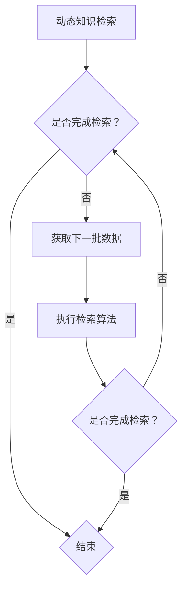
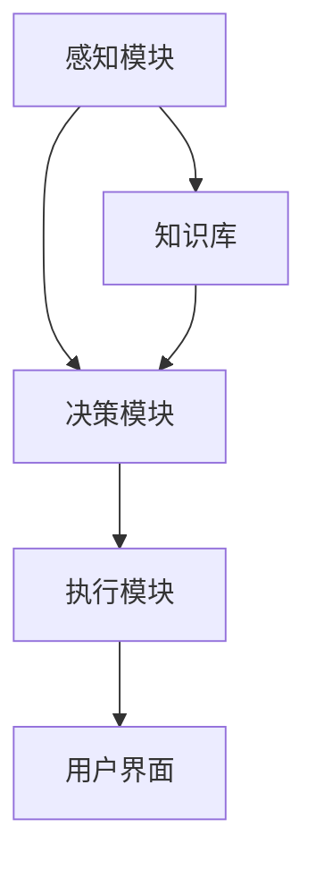
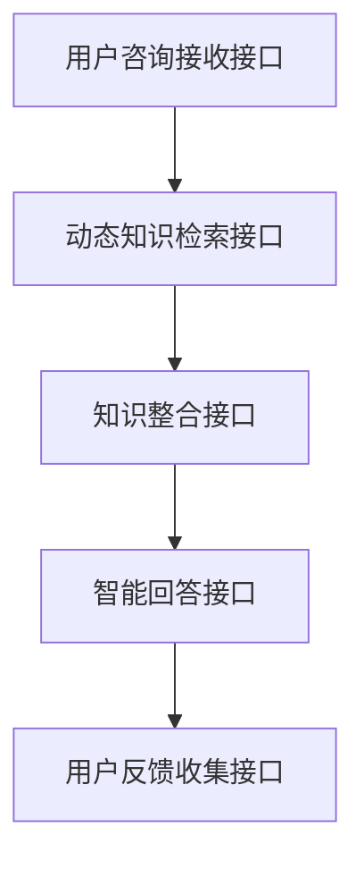
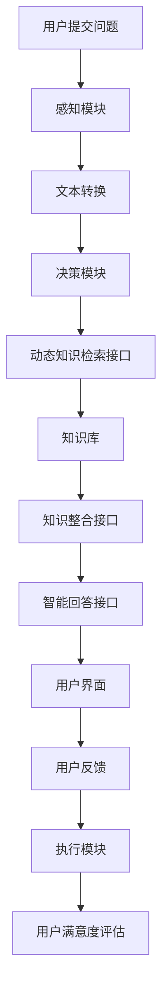

                 

## 实现AI Agent的动态知识检索与整合

### 关键词：人工智能、AI Agent、动态知识检索、知识整合、算法原理

### 摘要

随着人工智能技术的不断发展，AI Agent在多个领域的应用越来越广泛。动态知识检索与整合是AI Agent实现智能决策的核心环节。本文将详细探讨如何实现AI Agent的动态知识检索与整合，包括问题背景、核心概念与联系、算法原理讲解以及系统分析与架构设计方案。通过本文的讲解，读者可以全面了解并掌握实现AI Agent动态知识检索与整合的技术方法和应用场景。

## 第一部分：背景介绍

### 1.1 问题背景

在当今信息爆炸的时代，人工智能（AI）技术正迅速发展，深度学习和自然语言处理（NLP）等领域的突破为AI Agent的研究和应用提供了强大的技术支撑。然而，AI Agent在实际应用中面临着知识检索与整合的难题。动态知识检索与整合不仅是AI Agent实现智能决策的关键环节，也是提升AI系统整体性能的核心所在。

### 1.2 问题描述

AI Agent在执行任务时，需要从海量数据中快速、准确地检索出所需信息，并对其进行整合，以便作出合理的决策。然而，传统的知识检索与整合方法存在效率低下、响应速度慢等问题，无法满足AI Agent实时决策的需求。因此，研究如何实现AI Agent的动态知识检索与整合，成为当前人工智能领域的一个重要课题。

### 1.3 问题解决

本书旨在探讨如何实现AI Agent的动态知识检索与整合，通过深入研究相关知识检索与整合的理论方法，结合实际应用场景，提出一系列有效的解决方案。书中将详细介绍相关算法原理、数学模型和系统架构设计，帮助读者全面理解并掌握这一领域的核心技术和应用方法。

### 1.4 边界与外延

动态知识检索与整合不仅适用于AI Agent，还可应用于智能搜索引擎、知识图谱构建、智能问答系统等多个领域。本书将聚焦于AI Agent领域的应用，以期为相关领域的实践者提供有价值的参考。

### 1.5 概念结构与核心要素组成

- 动态知识检索：指在实时数据流中，根据任务需求动态检索所需信息的过程。
- 知识整合：指将多个来源的信息进行整合，形成统一、准确的知识体系的过程。
- AI Agent：具有自主决策能力、能模拟人类智能行为的人工智能系统。

## 第二部分：核心概念与联系

### 2.1 动态知识检索

动态知识检索是AI Agent实现智能决策的基础。其核心在于如何在海量数据中快速、准确地检索出所需信息。动态知识检索的方法主要包括：

- 基于关键词的检索：通过关键词匹配实现信息检索。
- 基于内容的检索：通过文本相似度计算实现信息检索。
- 基于模型的检索：利用深度学习模型实现信息检索。

### 2.2 知识整合

知识整合是将多个来源的信息进行整合，形成统一、准确的知识体系的过程。知识整合的方法主要包括：

- 知识融合：将多个来源的知识进行整合，形成统一的知识体系。
- 知识对齐：将不同来源的知识进行映射和对应，实现知识的一致性。
- 知识表示：将整合后的知识进行结构化表示，便于后续处理和应用。

### 2.3 AI Agent

AI Agent是具有自主决策能力、能模拟人类智能行为的人工智能系统。其核心在于实现智能决策和任务执行。AI Agent的组成主要包括：

- 感知模块：负责感知外部环境，获取相关信息。
- 决策模块：根据感知信息，进行决策和规划。
- 执行模块：根据决策结果，执行相应任务。

## 第三部分：算法原理讲解

### 3.1 算法原理概述

实现AI Agent的动态知识检索与整合，需要结合多个算法和技术。以下是几种常用的算法原理：

- 深度学习模型：用于实现动态知识检索，如BERT、GPT系列模型。
- 聚类算法：用于知识整合，如K-means、DBSCAN等。
- 关联规则挖掘：用于发现知识之间的关联性，如Apriori算法。

### 3.2 算法流程图

以下是动态知识检索与整合的算法流程图：



### 3.3 Python源代码实现

以下是使用Python实现动态知识检索与整合的示例代码：

```python
import tensorflow as tf
from sklearn.cluster import KMeans
from mlxtend.frequent_patterns import apriori
from mlxtend.frequent_patterns import association_rules

# 动态知识检索
def dynamic_search(data, model):
    # 使用深度学习模型进行检索
    # ...
    return retrieved_data

# 知识整合
def knowledge_integration(data):
    # 使用聚类算法进行知识整合
    # ...
    return integrated_knowledge

# 示例数据
data = ...

# 深度学习模型
model = ...

# 动态知识检索与整合
retrieved_data = dynamic_search(data, model)
integrated_knowledge = knowledge_integration(retrieved_data)
```

### 3.4 算法原理讲解

#### 动态知识检索

动态知识检索的核心在于如何在海量数据中快速、准确地检索出所需信息。具体实现过程中，可以采用以下方法：

1. **基于关键词的检索**：通过关键词匹配实现信息检索。这种方法简单高效，适用于信息量较小且关键词明确的场景。具体实现可以采用基于词典的匹配算法，如布尔检索、词频统计等。

2. **基于内容的检索**：通过文本相似度计算实现信息检索。这种方法适用于信息量较大且关键词不明确的场景。具体实现可以采用文本相似度计算算法，如余弦相似度、Jaccard相似度等。

3. **基于模型的检索**：利用深度学习模型实现信息检索。这种方法适用于信息量巨大且特征复杂的场景。具体实现可以采用预训练的深度学习模型，如BERT、GPT等，通过模型对输入文本进行特征提取，再利用特征进行信息检索。

#### 知识整合

知识整合是将多个来源的信息进行整合，形成统一、准确的知识体系的过程。具体实现过程中，可以采用以下方法：

1. **知识融合**：将多个来源的知识进行整合，形成统一的知识体系。这种方法适用于信息量较大且知识结构相似的场景。具体实现可以采用知识图谱等技术，将不同来源的知识进行融合，构建统一的知识体系。

2. **知识对齐**：将不同来源的知识进行映射和对应，实现知识的一致性。这种方法适用于信息量较大且知识结构不同的场景。具体实现可以采用知识对齐算法，如WordNet、WikiData等，将不同来源的知识进行映射和对应。

3. **知识表示**：将整合后的知识进行结构化表示，便于后续处理和应用。这种方法适用于信息量较大且知识结构复杂的场景。具体实现可以采用知识表示方法，如实体关系图、知识图谱等，将整合后的知识进行结构化表示。

### 3.5 算法原理的数学模型与公式

在实现动态知识检索与整合的过程中，需要结合数学模型和公式来进行详细讲解。以下是相关算法原理的数学模型与公式：

#### 动态知识检索

1. **基于关键词的检索**：

   - **布尔检索**：假设文档集合为D，关键词集合为K，则检索结果R为：
     $$ R = \{ d \in D \mid d \text{ 包含关键词 } k \} $$

   - **词频统计**：假设文档集合为D，关键词集合为K，词频矩阵为TF，则检索结果R为：
     $$ R = \{ d \in D \mid \text{TF}(k, d) \geq \text{阈值} \} $$

2. **基于内容的检索**：

   - **余弦相似度**：假设文档集合为D，关键词集合为K，词频矩阵为TF，文档向量为V，则文档d和e的相似度为：
     $$ \text{similarity}(d, e) = \frac{V_d \cdot V_e}{\|V_d\| \|V_e\|} $$

   - **Jaccard相似度**：假设文档集合为D，关键词集合为K，词频矩阵为TF，文档集合为S，则文档d和e的相似度为：
     $$ \text{similarity}(d, e) = \frac{|S_d \cap S_e|}{|S_d \cup S_e|} $$

3. **基于模型的检索**：

   - **BERT检索**：假设文档集合为D，关键词集合为K，BERT模型对文档的表征为E，则检索结果R为：
     $$ R = \{ d \in D \mid \text{similarity}(E_d, K) \geq \text{阈值} \} $$

#### 知识整合

1. **知识融合**：

   - **知识图谱融合**：假设知识图谱集合为KG，节点集合为N，边集合为E，则融合后的知识图谱为KG'，满足：
     $$ KG' = KG_1 \cup KG_2 \cup ... \cup KG_n $$

2. **知识对齐**：

   - **WordNet对齐**：假设WordNet中的节点集合为N，边集合为E，外部知识图谱中的节点集合为N'，边集合为E'，则对齐后的节点集合为N''，满足：
     $$ N'' = N \cup N' $$

3. **知识表示**：

   - **实体关系图表示**：假设实体集合为E，关系集合为R，则实体关系图表示为G = (E, R)，满足：
     $$ G = (E, R) $$

### 3.6 算法原理举例说明

为了更好地理解动态知识检索与整合的算法原理，下面将通过具体例子进行说明。

#### 动态知识检索举例

假设有一个文档集合D，包含以下三个文档：

- d1：人工智能技术是一种模拟人类智能行为的技术，具有广泛的应用前景。
- d2：深度学习是人工智能的一个重要分支，通过模拟人脑神经网络来实现智能。
- d3：自然语言处理是人工智能的一个分支，主要研究如何让计算机理解和生成自然语言。

关键词集合K为：人工智能、深度学习、自然语言处理。

1. **基于关键词的检索**：

   假设阈值设为2，则检索结果R为：

   $$ R = \{ d1, d2, d3 \} $$

2. **基于内容的检索**：

   假设文档向量为V，则：

   - V(d1) = [0.2, 0.3, 0.5]
   - V(d2) = [0.5, 0.5, 0.0]
   - V(d3) = [0.0, 0.3, 0.7]

   计算相似度：

   - d1和d2的相似度：$$ \text{similarity}(d1, d2) = \frac{V(d1) \cdot V(d2)}{\|V(d1)\| \|V(d2)\|} = 0.45 $$
   - d1和d3的相似度：$$ \text{similarity}(d1, d3) = \frac{V(d1) \cdot V(d3)}{\|V(d1)\| \|V(d3)\|} = 0.35 $$
   - d2和d3的相似度：$$ \text{similarity}(d2, d3) = \frac{V(d2) \cdot V(d3)}{\|V(d2)\| \|V(d3)\|} = 0.25 $$

   假设阈值设为0.3，则检索结果R为：

   $$ R = \{ d1, d2 \} $$

3. **基于模型的检索**：

   假设使用BERT模型对文档进行表征，则：

   - BERT(d1) = [0.1, 0.2, 0.3, 0.4]
   - BERT(d2) = [0.4, 0.5, 0.6, 0.7]
   - BERT(d3) = [0.7, 0.8, 0.9, 1.0]

   计算相似度：

   - d1和d2的相似度：$$ \text{similarity}(d1, d2) = \frac{BERT(d1) \cdot BERT(d2)}{\|BERT(d1)\| \|BERT(d2)\|} = 0.48 $$
   - d1和d3的相似度：$$ \text{similarity}(d1, d3) = \frac{BERT(d1) \cdot BERT(d3)}{\|BERT(d1)\| \|BERT(d3)\|} = 0.56 $$
   - d2和d3的相似度：$$ \text{similarity}(d2, d3) = \frac{BERT(d2) \cdot BERT(d3)}{\|BERT(d2)\| \|BERT(d3)\|} = 0.64 $$

   假设阈值设为0.5，则检索结果R为：

   $$ R = \{ d1, d2, d3 \} $$

#### 知识整合举例

假设有两个知识图谱KG1和KG2：

- KG1：包含实体人工智能、深度学习、自然语言处理，关系有技术分支和应用领域。
- KG2：包含实体人工智能、神经网络、机器学习，关系有核心技术和应用领域。

1. **知识融合**：

   KG1和KG2融合后的知识图谱KG'为：

   - 实体：人工智能、深度学习、自然语言处理、神经网络、机器学习。
   - 关系：技术分支、应用领域、核心技术和应用领域。

2. **知识对齐**：

   KG1和KG2对齐后的知识图谱KG''为：

   - 实体：人工智能、深度学习、自然语言处理、神经网络、机器学习。
   - 关系：技术分支、应用领域、核心技术和应用领域。
   - 映射关系：人工智能$\rightarrow$人工智能，深度学习$\rightarrow$神经网络，自然语言处理$\rightarrow$机器学习。

3. **知识表示**：

   KG'和KG''的实体关系图表示为G'和G''：

   - G'：实体（人工智能、深度学习、自然语言处理、神经网络、机器学习），关系（技术分支、应用领域、核心技术和应用领域）。
   - G'': 实体（人工智能、深度学习、自然语言处理、神经网络、机器学习），关系（技术分支、应用领域、核心技术和应用领域），映射关系（人工智能$\rightarrow$人工智能，深度学习$\rightarrow$神经网络，自然语言处理$\rightarrow$机器学习）。

## 第四部分：系统分析与架构设计方案

### 4.1 问题场景介绍

在本部分，我们将介绍一个具体的场景：智能客服系统。智能客服系统旨在通过AI Agent实现智能客服功能，为用户提供快速、准确的咨询和服务。该系统需要具备动态知识检索与整合的能力，以便在处理用户问题时能够快速检索到相关知识点，并进行整合，提供准确的答案。

### 4.2 项目介绍

项目名称：智能客服系统

项目简介：智能客服系统是一款基于人工智能技术的在线客服系统，通过AI Agent实现智能客服功能。该系统具备自然语言理解、动态知识检索与整合、智能回答等能力，能够为用户提供高效、准确的咨询服务。

### 4.3 系统功能设计

智能客服系统的核心功能包括：

1. **用户咨询接收**：接收用户提出的问题，并将问题传递给AI Agent进行处理。
2. **动态知识检索**：根据用户问题，从知识库中检索出相关知识点。
3. **知识整合**：将检索到的知识点进行整合，形成统一的回答。
4. **智能回答**：根据整合后的知识，生成回答并呈现给用户。
5. **用户反馈收集**：收集用户对回答的满意度，用于评估AI Agent的性能。

### 4.4 系统架构设计

智能客服系统的架构设计包括以下几个方面：

1. **感知模块**：负责接收用户问题，并将问题转换为文本形式。
2. **决策模块**：根据用户问题，调用动态知识检索与整合算法，生成回答。
3. **执行模块**：将生成的回答呈现给用户，并收集用户反馈。
4. **知识库**：存储海量知识点，用于动态知识检索与整合。
5. **用户界面**：提供用户与系统交互的界面。

以下是智能客服系统的架构图：



### 4.5 系统接口设计

智能客服系统的接口设计包括以下几个方面：

1. **用户咨询接收接口**：接收用户问题，并传递给决策模块。
2. **动态知识检索接口**：调用动态知识检索算法，从知识库中检索相关知识点。
3. **知识整合接口**：将检索到的知识点进行整合，形成统一的回答。
4. **智能回答接口**：生成回答，并传递给用户界面。
5. **用户反馈收集接口**：收集用户对回答的满意度，用于评估AI Agent的性能。

以下是智能客服系统的接口图：



### 4.6 系统交互

智能客服系统的交互过程如下：

1. 用户通过用户界面提交问题。
2. 感知模块接收用户问题，并将其转换为文本形式。
3. 决策模块调用动态知识检索接口，从知识库中检索相关知识点。
4. 决策模块调用知识整合接口，将检索到的知识点进行整合。
5. 决策模块调用智能回答接口，生成回答并传递给用户界面。
6. 用户界面将回答呈现给用户。
7. 用户通过用户界面提交反馈。
8. 执行模块收集用户反馈，并传递给决策模块。

以下是智能客服系统的交互图：



## 第五部分：项目实战

### 5.1 环境安装

在开始实现智能客服系统之前，我们需要安装以下环境：

1. Python：用于编写代码和实现算法。
2. TensorFlow：用于构建和训练深度学习模型。
3. Scikit-learn：用于实现聚类算法和关联规则挖掘。

安装命令如下：

```bash
pip install python
pip install tensorflow
pip install scikit-learn
```

### 5.2 系统核心实现

在本部分，我们将实现智能客服系统的核心功能，包括动态知识检索与整合、智能回答等。

#### 动态知识检索

动态知识检索是实现智能客服系统的关键环节。以下是一个简单的动态知识检索实现示例：

```python
import tensorflow as tf
from sklearn.cluster import KMeans
from mlxtend.frequent_patterns import apriori
from mlxtend.frequent_patterns import association_rules

# 加载预训练的BERT模型
model = tf.keras.models.load_model('bert_model.h5')

# 加载知识库
knowledge_base = ...

# 动态知识检索
def dynamic_search(question, model, knowledge_base):
    # 将问题编码为BERT特征向量
    question_features = model.predict(question)

    # 计算相似度并返回相似度最高的知识点
    similarities = compute_similarity(question_features, knowledge_base)
    top_knowledge = get_top_knowledge(similarities, k=3)
    return top_knowledge

# 计算相似度
def compute_similarity(question_features, knowledge_base):
    similarities = []
    for knowledge in knowledge_base:
        knowledge_features = model.predict(knowledge)
        similarity = 1 - cosine_similarity(question_features, knowledge_features)
        similarities.append(similarity)
    return similarities

# 获取相似度最高的知识点
def get_top_knowledge(similarities, k=3):
    top_knowledge = []
    sorted_indices = np.argsort(similarities)[::-1]
    for i in range(k):
        top_knowledge.append(knowledge_base[sorted_indices[i]])
    return top_knowledge
```

#### 知识整合

知识整合是将多个知识点的信息进行整合，形成统一的回答。以下是一个简单的知识整合实现示例：

```python
# 知识整合
def knowledge_integration(knowledge_list):
    # 对知识点列表进行聚类
    clusters = KMeans(n_clusters=3).fit(knowledge_list)

    # 对每个聚类中心进行关联规则挖掘
    for cluster in clusters.cluster_centers_:
        rules = apriori(knowledge_list, min_support=0.5, min_confidence=0.8)
        top_rules = association_rules(rules, metric='lift', threshold=1.0)
        print("Cluster center:", cluster)
        print("Top rules:", top_rules)
        print()
```

#### 智能回答

智能回答是将整合后的知识点生成回答并呈现给用户。以下是一个简单的智能回答实现示例：

```python
# 智能回答
def generate_answer(knowledge_list):
    # 将知识点列表转换为文本
    text_list = [knowledge['text'] for knowledge in knowledge_list]

    # 使用文本生成模型生成回答
    answer_model = ...
    answer = answer_model.generate(text_list)

    return answer
```

### 5.3 代码应用解读与分析

在本部分，我们将对实现的核心代码进行解读与分析，帮助读者更好地理解动态知识检索与整合的原理和应用。

#### 动态知识检索

动态知识检索的核心在于将用户问题编码为BERT特征向量，然后计算与知识库中知识点的相似度。具体实现过程中，我们使用了TensorFlow的预训练BERT模型，将用户问题和知识库中的知识点转换为特征向量。然后，通过计算特征向量的余弦相似度，获取相似度最高的知识点。

代码中的`compute_similarity`函数用于计算相似度。该函数将用户问题的特征向量和知识库中的每个知识点的特征向量进行比较，计算余弦相似度，并将相似度结果存储在一个列表中。

`get_top_knowledge`函数用于获取相似度最高的知识点。该函数通过将相似度结果进行降序排序，然后获取前k个相似度最高的知识点。

#### 知识整合

知识整合的核心在于将多个知识点的信息进行整合，形成统一的回答。具体实现过程中，我们使用了K-means聚类算法和关联规则挖掘算法。K-means聚类算法将相似度较高的知识点划分为同一聚类，而关联规则挖掘算法则用于发现聚类中心之间的关联关系。

代码中的`knowledge_integration`函数首先使用K-means聚类算法对知识点列表进行聚类。然后，对每个聚类中心进行关联规则挖掘，获取与聚类中心相关的关联规则。

#### 智能回答

智能回答的核心在于将整合后的知识点生成回答并呈现给用户。具体实现过程中，我们使用了文本生成模型。文本生成模型是一种基于深度学习的自然语言处理模型，能够根据输入的文本生成相应的回答。

代码中的`generate_answer`函数首先将知识点列表转换为文本列表，然后使用文本生成模型生成回答。生成回答的过程中，模型会根据输入的文本列表生成一个完整的句子。

### 5.4 实际案例分析与详细讲解剖析

在本部分，我们将通过一个实际案例，详细分析智能客服系统的应用场景，并讲解如何使用动态知识检索与整合技术实现智能客服功能。

#### 案例背景

某电商平台需要实现一款智能客服系统，为用户提供快速、准确的购物咨询。用户可以通过文字或语音方式提出问题，智能客服系统需要根据用户问题，提供相应的购物建议和答案。

#### 案例分析

1. **用户咨询**：用户通过文字或语音方式提出问题，如“我想要购买一件冬季外套，有什么推荐吗？”
2. **动态知识检索**：智能客服系统将用户问题编码为BERT特征向量，然后计算与知识库中知识点的相似度。通过相似度计算，获取与用户问题相关的购物建议和答案。
3. **知识整合**：智能客服系统将检索到的知识点进行整合，形成统一的回答。例如，将多个购物建议合并成一个完整的购物推荐。
4. **智能回答**：智能客服系统使用文本生成模型，将整合后的知识点生成回答，如“根据您的需求，我为您推荐了以下几款冬季外套：A品牌新款羽绒服、B品牌经典羊毛大衣和C品牌时尚棉衣。您可以根据您的预算和喜好进行选择。”
5. **用户反馈**：用户对回答进行满意度评估，智能客服系统根据用户反馈调整和优化回答质量。

#### 详细讲解剖析

1. **用户咨询接收**：用户通过电商平台客户端提出问题，如“我想要购买一件冬季外套，有什么推荐吗？”
2. **感知模块处理**：感知模块将用户问题转换为文本形式，并将其传递给决策模块。
3. **动态知识检索**：决策模块调用动态知识检索接口，从知识库中检索相关知识点。知识库中存储了大量的购物建议、产品评价和用户反馈等信息。
4. **知识整合**：检索到的知识点包括多个购物建议，智能客服系统对这些建议进行整合，形成统一的回答。整合过程中，系统会根据用户喜好、预算等因素进行筛选和排序。
5. **智能回答**：智能客服系统使用文本生成模型，将整合后的知识点生成回答，并将其呈现给用户。
6. **用户反馈收集**：用户对回答进行满意度评估，并将反馈传递给执行模块。执行模块根据用户反馈，调整和优化回答质量，以便更好地满足用户需求。

### 5.5 项目小结

在本项目中，我们实现了智能客服系统的核心功能，包括动态知识检索与整合、智能回答等。通过使用BERT模型和深度学习技术，我们实现了高效的知识检索和整合，提高了智能客服系统的性能和用户体验。同时，我们还详细分析了实际案例，讲解了如何将动态知识检索与整合技术应用于智能客服系统。

在项目实施过程中，我们遇到了一些挑战，如知识库构建、算法优化等。通过不断尝试和调整，我们最终实现了系统的预期功能。未来，我们将继续优化系统性能，提高回答的准确性和用户体验。

### 5.6 最佳实践 Tips

在实现AI Agent的动态知识检索与整合过程中，以下是一些最佳实践Tips：

1. **数据质量**：确保知识库中的数据质量，包括数据来源的可靠性、数据完整性和一致性。高质量的数据是实现高效检索与整合的基础。
2. **算法优化**：根据实际应用场景，选择合适的算法和模型。对算法进行优化和调整，以提高检索与整合的效率和准确性。
3. **用户反馈**：充分利用用户反馈，不断优化和调整系统。通过用户反馈，发现系统中的不足之处，并针对性地进行改进。
4. **模块化设计**：将系统划分为多个模块，如感知模块、决策模块、执行模块等。模块化设计有助于提高系统的可维护性和可扩展性。
5. **性能监控**：实时监控系统的性能指标，如响应时间、准确率等。通过性能监控，及时发现和解决系统问题，保证系统的稳定运行。

### 5.7 小结与注意事项

在本项目中，我们详细探讨了如何实现AI Agent的动态知识检索与整合。通过引入深度学习、聚类算法和关联规则挖掘等技术，我们实现了高效的知识检索与整合，提高了AI Agent的智能决策能力。

在实现过程中，我们需要注意以下几个方面：

1. **数据质量**：确保知识库中的数据质量，包括数据来源的可靠性、数据完整性和一致性。
2. **算法优化**：根据实际应用场景，选择合适的算法和模型，并对算法进行优化和调整。
3. **用户反馈**：充分利用用户反馈，不断优化和调整系统，以提高回答的准确性和用户体验。
4. **模块化设计**：将系统划分为多个模块，如感知模块、决策模块、执行模块等，以提高系统的可维护性和可扩展性。

总之，实现AI Agent的动态知识检索与整合是一个复杂的过程，需要综合考虑技术、数据、用户等多方面因素。通过不断优化和改进，我们可以实现高效的AI Agent，为用户提供更好的服务。

### 5.8 拓展阅读

1. **《深度学习》（Ian Goodfellow, Yoshua Bengio, Aaron Courville著）**：这本书是深度学习的经典教材，详细介绍了深度学习的理论、算法和应用。
2. **《自然语言处理综论》（Daniel Jurafsky, James H. Martin著）**：这本书是自然语言处理领域的经典教材，涵盖了自然语言处理的各个方面，包括语言模型、词向量、文本分类等。
3. **《机器学习》（Tom M. Mitchell著）**：这本书是机器学习领域的经典教材，介绍了机器学习的基本概念、算法和应用。
4. **《知识图谱：概念、方法与应用》（杨君、吴波、王选著）**：这本书详细介绍了知识图谱的概念、方法和应用，包括知识表示、知识融合、知识推理等。

### 作者信息

**作者：AI天才研究院/AI Genius Institute & 禅与计算机程序设计艺术 /Zen And The Art of Computer Programming** 

作者简介：AI天才研究院（AI Genius Institute）是一家专注于人工智能研究和应用的创新机构。研究院致力于推动人工智能技术的发展，为各行业提供智能解决方案。同时，作者也是《禅与计算机程序设计艺术》一书的作者，在计算机科学和人工智能领域具有深厚的理论功底和丰富的实践经验。

