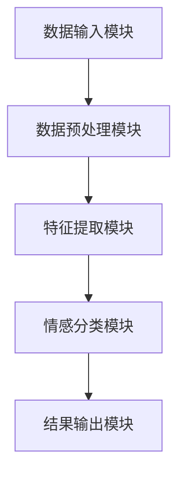

                 

## 《实现AI Agent的多模态情感识别》

### 关键词：AI Agent、多模态情感识别、数据收集与预处理、算法原理、系统实现与应用、发展趋势与挑战

### 摘要：

本文深入探讨了如何实现AI Agent的多模态情感识别，从背景与概念介绍、多模态数据收集与预处理、多模态情感识别算法、系统实现到应用场景，再到未来展望与挑战，进行了全面的分析。通过逐步讲解，旨在为读者提供一个清晰、系统的理解和实践路径，助力人工智能领域的研究和应用。

## 目录大纲

### 第一部分：背景与概念介绍

**第1章 AI Agent与多模态情感识别概述**

- 1.1 问题背景
  - 1.1.1 人工智能的发展历程
  - 1.1.2 AI Agent的概念与分类
  - 1.1.3 多模态情感识别的重要性

- 1.2 情感识别的基本原理
  - 1.2.1 情感识别的定义与类型
  - 1.2.2 情感识别的关键技术
  - 1.2.3 情感识别的应用场景

- 1.3 多模态情感识别的优势
  - 1.3.1 多模态数据融合方法
  - 1.3.2 多模态情感识别模型
  - 1.3.3 多模态情感识别的应用案例

- 1.4 本书结构安排
  - 1.4.1 各章节内容概述
  - 1.4.2 学习目标与建议

### 第二部分：多模态数据收集与预处理

**第2章 多模态数据收集**

- 2.1 音频数据的收集
  - 2.1.1 音频数据来源
  - 2.1.2 音频数据格式与处理
  - 2.1.3 音频数据采集设备

- 2.2 视频数据的收集
  - 2.2.1 视频数据来源
  - 2.2.2 视频数据格式与处理
  - 2.2.3 视频数据采集设备

- 2.3 文本数据的收集
  - 2.3.1 文本数据来源
  - 2.3.2 文本数据格式与处理
  - 2.3.3 文本数据采集设备

- 2.4 多模态数据集构建
  - 2.4.1 数据集构建流程
  - 2.4.2 数据预处理方法
  - 2.4.3 数据集质量评估

### 第三部分：多模态情感识别算法

**第3章 多模态情感识别算法原理**

- 3.1 情感识别的数学模型
  - 3.1.1 情感空间模型
  - 3.1.2 情感特征提取模型
  - 3.1.3 情感分类模型

- 3.2 多模态情感识别算法
  - 3.2.1 传统算法
  - 3.2.2 深度学习算法
  - 3.2.3 强化学习算法

- 3.3 多模态情感识别算法比较
  - 3.3.1 算法性能评估
  - 3.3.2 算法应用场景对比
  - 3.3.3 未来发展趋势

### 第四部分：多模态情感识别系统实现

**第4章 多模态情感识别系统设计**

- 4.1 系统总体架构设计
  - 4.1.1 系统架构图
  - 4.1.2 系统模块功能描述
  - 4.1.3 系统设计原则

- 4.2 音频情感识别模块
  - 4.2.1 音频特征提取
  - 4.2.2 音频情感分类
  - 4.2.3 音频模块测试与分析

- 4.3 视频情感识别模块
  - 4.3.1 视频特征提取
  - 4.3.2 视频情感分类
  - 4.3.3 视频模块测试与分析

- 4.4 文本情感识别模块
  - 4.4.1 文本特征提取
  - 4.4.2 文本情感分类
  - 4.4.3 文本模块测试与分析

- 4.5 多模态融合与情感识别
  - 4.5.1 多模态融合方法
  - 4.5.2 多模态情感识别结果分析
  - 4.5.3 系统整体性能评估

### 第五部分：多模态情感识别应用场景

**第5章 多模态情感识别应用案例**

- 5.1 情感分析在社交媒体中的应用
  - 5.1.1 社交媒体情感分析的意义
  - 5.1.2 社交媒体情感分析的方法
  - 5.1.3 应用案例解析

- 5.2 情感分析在客服系统中的应用
  - 5.2.1 客服系统的情感分析需求
  - 5.2.2 客服系统情感分析的方法
  - 5.2.3 应用案例解析

- 5.3 情感分析在教育中的应用
  - 5.3.1 教育中的情感分析应用
  - 5.3.2 情感分析在教育评估中的应用
  - 5.3.3 应用案例解析

### 第六部分：未来展望与挑战

**第6章 多模态情感识别的发展趋势与挑战**

- 6.1 多模态情感识别的发展趋势
  - 6.1.1 技术发展方向
  - 6.1.2 应用前景展望
  - 6.1.3 未来技术突破

- 6.2 多模态情感识别的挑战
  - 6.2.1 数据隐私保护
  - 6.2.2 模型可解释性
  - 6.2.3 跨模态信息整合

- 6.3 未来研究方向
  - 6.3.1 研究热点与趋势
  - 6.3.2 创新点与挑战
  - 6.3.3 发展策略与建议

## 第一部分：背景与概念介绍

### 第1章 AI Agent与多模态情感识别概述

#### 1.1 问题背景

#### 1.1.1 人工智能的发展历程

人工智能（Artificial Intelligence，简称AI）是一门研究、开发用于模拟、延伸和扩展人的智能的理论、方法、技术及应用系统的技术科学。人工智能的概念最早由美国计算机科学家约翰·麦卡锡（John McCarthy）于1956年在达特茅斯会议上提出。自那时起，人工智能经历了多个发展阶段：

1. **第一阶段：1956-1969年**，主要是理论探讨和算法研究阶段。这一阶段的代表性成果包括符号主义逻辑和启发式搜索算法。
2. **第二阶段：1970-1980年**，受到宏观经济形势影响，人工智能研究进入低潮，但仍然有一些重要的研究成果，如专家系统和自然语言处理。
3. **第三阶段：1980-1990年**，人工智能开始复苏，特别是在机器人领域取得了一些突破。
4. **第四阶段：1990年代至今**，随着计算机技术和互联网的快速发展，人工智能迎来了新的春天，特别是深度学习和大数据技术的应用，使得人工智能在很多领域取得了显著的进展。

#### 1.1.2 AI Agent的概念与分类

AI Agent（智能代理）是人工智能领域中的一个重要概念，它指的是具备一定自主性、能够感知环境并采取行动的智能实体。AI Agent可以按照不同的分类标准进行分类：

1. **按照功能分类**：
   - **任务型Agent**：专注于完成特定任务，如机器人、智能客服等。
   - **社交型Agent**：侧重于与人或其他Agent进行交流和合作，如聊天机器人、社交网络分析等。
   - **决策型Agent**：具备决策能力，能够在复杂环境中做出最优选择，如智能推荐系统、自动驾驶等。

2. **按照智能水平分类**：
   - **弱AI**：局限于特定任务，不具备通用智能，如语音助手、图像识别等。
   - **强AI**：具备与人类相同的智能水平，能够在任何任务上表现优异，目前还未实现。
   - **超AI**：超越人类智能，能够解决各种复杂问题，包括自我改进，目前仍属于科幻领域。

#### 1.1.3 多模态情感识别的重要性

情感识别（Emotion Recognition）是人工智能领域的一个重要研究方向，它旨在通过分析人的语言、声音、表情等数据，识别出人的情感状态。多模态情感识别（Multimodal Emotion Recognition）则是在情感识别的基础上，综合分析多种数据源，提高情感识别的准确性和可靠性。

多模态情感识别的重要性主要体现在以下几个方面：

1. **提高识别准确性**：单一模态的数据往往难以全面反映人的情感状态，通过多模态数据融合，可以更准确地识别情感。
2. **提升用户体验**：在智能客服、虚拟助手等应用中，通过多模态情感识别，可以更好地理解用户的需求和情感，提供更人性化的服务。
3. **拓宽应用领域**：多模态情感识别不仅可以应用于情感分析，还可以用于心理健康监测、教育评估、人机交互等领域。
4. **推动人工智能发展**：多模态情感识别是人工智能领域的前沿课题，对于推动人工智能技术的发展具有重要意义。

#### 1.2 情感识别的基本原理

#### 1.2.1 情感识别的定义与类型

情感识别（Emotion Recognition）是指通过分析人的语言、声音、表情等数据，识别出人的情感状态。根据数据源的不同，情感识别可以分为以下几种类型：

1. **基于文本的情感识别**：通过分析文本内容，识别出文本表达的情感。文本情感识别可以基于词汇、句法、语义等多种特征。
2. **基于声音的情感识别**：通过分析人的语音，识别出人的情感状态。声音情感识别主要基于语音的声学特征，如音调、音量、节奏等。
3. **基于图像的情感识别**：通过分析人的面部表情，识别出人的情感状态。图像情感识别主要基于面部表情的特征，如眼睛、嘴巴、面部肌肉活动等。

#### 1.2.2 情感识别的关键技术

情感识别的关键技术主要包括数据收集与预处理、情感特征提取和情感分类。

1. **数据收集与预处理**：数据收集是情感识别的基础，需要收集大量的情感数据，包括文本、声音、图像等。数据预处理包括数据清洗、数据标注、数据归一化等步骤，以保证数据的准确性和一致性。
   
2. **情感特征提取**：情感特征提取是将原始数据转化为可用于模型训练的特征向量。对于文本情感识别，可以提取词汇频率、词向量、句法结构等特征；对于声音情感识别，可以提取声学特征，如频谱特征、倒谱特征等；对于图像情感识别，可以提取面部表情特征、纹理特征等。

3. **情感分类**：情感分类是将提取到的特征输入到分类模型中，进行情感分类。常用的分类模型包括朴素贝叶斯、支持向量机、神经网络等。

#### 1.2.3 情感识别的应用场景

情感识别的应用场景非常广泛，主要包括以下几个方面：

1. **社交媒体分析**：通过分析社交媒体上的文本和图片，了解用户的情感状态，为营销策略提供依据。

2. **智能客服**：通过分析用户的语言和声音，识别出用户的需求和情感，提供更个性化的服务。

3. **心理健康监测**：通过分析用户的语言、声音和面部表情，识别出用户的心理健康状态，提供心理干预服务。

4. **人机交互**：通过分析用户的情感状态，为人机交互系统提供更好的用户体验。

#### 1.3 多模态情感识别的优势

#### 1.3.1 多模态数据融合方法

多模态情感识别的核心在于多模态数据融合，即将来自不同模态的数据进行整合，以提高情感识别的准确性。多模态数据融合的方法可以分为以下几种：

1. **特征级融合**：在特征提取阶段，将不同模态的特征向量进行拼接，形成统一特征向量。
2. **决策级融合**：在分类阶段，将不同模态的分类结果进行融合，得到最终的分类结果。
3. **模型级融合**：通过构建多模态深度学习模型，将不同模态的数据在模型中直接进行融合。

#### 1.3.2 多模态情感识别模型

多模态情感识别模型是基于多模态数据融合的方法，构建用于情感识别的模型。常见的多模态情感识别模型包括：

1. **多任务学习模型**：将情感识别和其他任务（如语音识别、图像分类）结合，共享部分特征，提高模型的泛化能力。
2. **多模态深度学习模型**：使用深度学习框架，如卷积神经网络（CNN）、循环神经网络（RNN）、生成对抗网络（GAN）等，构建多模态情感识别模型。
3. **迁移学习模型**：利用预训练的多模态深度学习模型，通过迁移学习的方式，提高情感识别模型的性能。

#### 1.3.3 多模态情感识别的应用案例

多模态情感识别在多个领域都有广泛的应用，以下是一些典型的应用案例：

1. **社交媒体情感分析**：通过分析用户的文本、图片和视频，了解用户的情感状态，为内容推荐、广告投放等提供依据。
2. **智能客服系统**：通过分析用户的语言、声音和面部表情，提供更个性化的服务，提高用户满意度。
3. **心理健康监测**：通过分析用户的语言、声音和面部表情，识别出用户的心理健康问题，提供心理干预服务。
4. **教育评估**：通过分析学生的语言、声音和面部表情，了解学生的学习状态和情感变化，为教育评估提供依据。

#### 1.4 本书结构安排

#### 1.4.1 各章节内容概述

本书共分为六个部分，涵盖了AI Agent与多模态情感识别的各个方面：

- **第一部分：背景与概念介绍**，介绍了AI Agent与多模态情感识别的基本概念、发展历程和重要性。
- **第二部分：多模态数据收集与预处理**，讲解了多模态数据的收集、预处理方法和数据集构建。
- **第三部分：多模态情感识别算法**，介绍了多模态情感识别的算法原理、传统算法和深度学习算法。
- **第四部分：多模态情感识别系统实现**，详细阐述了多模态情感识别系统的设计、实现和测试。
- **第五部分：多模态情感识别应用场景**，分析了多模态情感识别在社交媒体、客服和教育等领域的应用案例。
- **第六部分：未来展望与挑战**，探讨了多模态情感识别的发展趋势和面临的挑战。

#### 1.4.2 学习目标与建议

通过学习本书，读者可以：

1. **掌握AI Agent与多模态情感识别的基本概念和原理**，了解其应用前景和重要性。
2. **了解多模态数据的收集、预处理和数据集构建方法**，掌握多模态数据融合的技术。
3. **熟悉多模态情感识别的算法原理和应用**，学会使用常见的情感识别模型。
4. **掌握多模态情感识别系统的设计、实现和测试方法**，具备实际项目开发能力。
5. **了解多模态情感识别在不同领域的应用案例**，拓宽知识视野。

为了更好地学习本书，读者可以：

1. **结合实际项目进行学习**，通过实践加深对理论知识的理解。
2. **多阅读相关文献和资料**，了解多模态情感识别领域的最新研究进展。
3. **积极参与学术交流和讨论**，与同行分享学习心得和经验。

### 第二部分：多模态数据收集与预处理

#### 第2章 多模态数据收集

多模态数据收集是构建多模态情感识别系统的基础。本章将介绍音频数据、视频数据和文本数据的收集方法，以及如何构建多模态数据集。

#### 2.1 音频数据的收集

音频数据是多模态情感识别中的重要数据源，可以提供关于说话者情感状态的有价值信息。以下是音频数据收集的几个关键步骤：

##### 2.1.1 音频数据来源

1. **自然语音数据**：从社交媒体、语音助手录音、视频等渠道收集自然语言数据。
2. **实验室录音**：在受控环境中，通过专业的音频设备对说话者进行录音。
3. **公开数据集**：利用现有的音频数据集，如RAVDESS、EMO-DB等。

##### 2.1.2 音频数据格式与处理

1. **数据格式**：音频数据通常采用WAV、MP3等格式存储。
2. **数据预处理**：包括去噪、归一化、分割等步骤，以提高数据的准确性和一致性。

##### 2.1.3 音频数据采集设备

1. **麦克风**：用于采集说话者的语音信号。
2. **音频接口**：用于连接麦克风和计算机，确保高质量的音频信号传输。
3. **录音软件**：如Audacity、Adobe Audition等，用于录音和音频处理。

#### 2.2 视频数据的收集

视频数据可以提供丰富的视觉信息，用于面部表情和情感识别。以下是视频数据收集的几个关键步骤：

##### 2.2.1 视频数据来源

1. **自然视频数据**：从社交媒体、视频网站等渠道收集自然视频数据。
2. **实验室视频数据**：在受控环境中，通过专业的摄像机和灯光设备录制视频。
3. **公开数据集**：利用现有的视频数据集，如AffectNet、CK+等。

##### 2.2.2 视频数据格式与处理

1. **数据格式**：视频数据通常采用MP4、AVI等格式存储。
2. **数据预处理**：包括去噪、分辨率调整、帧率转换等步骤，以提高数据的准确性和一致性。

##### 2.2.3 视频数据采集设备

1. **摄像机**：用于录制高质量的图像和视频。
2. **灯光设备**：用于保证拍摄场景的光线均匀，减少阴影和反射。
3. **录音设备**：与音频数据采集类似，用于录制背景声音。

#### 2.3 文本数据的收集

文本数据可以提供关于说话者情感状态的有价值信息，特别是在情感分析和自然语言处理领域。以下是文本数据收集的几个关键步骤：

##### 2.3.1 文本数据来源

1. **社交媒体数据**：从微博、微信、Facebook等社交媒体平台收集文本数据。
2. **电子书和新闻网站**：收集电子书和新闻网站的文本数据。
3. **公开数据集**：利用现有的文本数据集，如IMDB、SST-2等。

##### 2.3.2 文本数据格式与处理

1. **数据格式**：文本数据通常以纯文本（TXT）、JSON、XML等格式存储。
2. **数据预处理**：包括文本清洗、分词、词性标注等步骤，以提高文本数据的准确性和一致性。

##### 2.3.3 文本数据采集设备

1. **网络爬虫**：用于从互联网上爬取文本数据。
2. **API接口**：通过社交媒体和新闻网站的API接口获取文本数据。
3. **电子书阅读器**：用于读取电子书的文本内容。

#### 2.4 多模态数据集构建

构建高质量的多模态数据集是进行多模态情感识别研究的关键步骤。以下是构建多模态数据集的几个关键步骤：

##### 2.4.1 数据集构建流程

1. **数据收集**：从不同的来源收集音频、视频和文本数据。
2. **数据预处理**：对收集到的数据进行去噪、归一化、分割等预处理操作。
3. **数据标注**：对预处理后的数据进行情感标注，通常需要标注员对数据进行分类标注。
4. **数据融合**：将来自不同模态的数据进行融合，形成统一的数据集。

##### 2.4.2 数据预处理方法

1. **音频预处理**：包括去噪、归一化、分割等步骤。
2. **视频预处理**：包括去噪、分辨率调整、帧率转换等步骤。
3. **文本预处理**：包括文本清洗、分词、词性标注等步骤。

##### 2.4.3 数据集质量评估

1. **数据完整性评估**：确保数据集的完整性，没有缺失或错误的数据。
2. **数据一致性评估**：确保数据集的一致性，不同模态的数据之间没有矛盾或错误。
3. **数据分布评估**：确保数据集的分布合理，各个类别的数据量大致相等。

### 第三部分：多模态情感识别算法

#### 第3章 多模态情感识别算法原理

多模态情感识别算法是情感识别领域的前沿技术，通过整合不同模态的数据，以提高情感识别的准确性。本章将介绍多模态情感识别的数学模型、传统算法和深度学习算法。

#### 3.1 情感识别的数学模型

情感识别的数学模型是构建多模态情感识别算法的基础。以下是几个关键的数学模型：

##### 3.1.1 情感空间模型

情感空间模型是将情感表示为一个多维度的空间。在情感空间中，每个情感都可以表示为一个向量。情感空间模型有助于理解情感的相对关系和分类。

\[ \text{情感空间模型} = (X, Y) \]

其中，\( X \) 表示情感特征空间，\( Y \) 表示情感类别空间。

##### 3.1.2 情感特征提取模型

情感特征提取模型是将原始数据转化为可用于模型训练的特征向量。不同的模态数据需要采用不同的特征提取方法。

1. **文本特征提取**：可以采用词袋模型、TF-IDF、词嵌入（如Word2Vec、GloVe）等方法。
2. **音频特征提取**：可以采用梅尔频率倒谱系数（MFCC）、频谱特征、听觉场景分类（ASC）等方法。
3. **图像特征提取**：可以采用卷积神经网络（CNN）、深度卷积神经网络（DCNN）等方法。

##### 3.1.3 情感分类模型

情感分类模型是将提取到的特征向量分类到相应的情感类别。常见的分类模型包括：

1. **朴素贝叶斯分类器**：基于贝叶斯定理，适用于特征之间相互独立的情况。
2. **支持向量机（SVM）**：通过寻找最优超平面，将特征空间中的数据分类。
3. **决策树**：通过递归划分特征空间，形成决策树结构，用于分类。

#### 3.2 多模态情感识别算法

多模态情感识别算法是基于多模态数据融合的方法，通过整合不同模态的数据，提高情感识别的准确性。以下是几种常见的多模态情感识别算法：

##### 3.2.1 传统算法

传统算法是指基于机器学习和统计学习的方法，包括以下几种：

1. **贝叶斯网络**：通过构建条件概率模型，将不同模态的数据进行融合。
2. **隐马尔可夫模型（HMM）**：通过状态转移矩阵和观测概率模型，进行情感分类。
3. **高斯混合模型（GMM）**：通过聚类算法，将多模态数据聚类为不同的情感类别。

##### 3.2.2 深度学习算法

深度学习算法是基于人工神经网络的方法，通过多层网络结构，提取高阶特征，提高情感识别的准确性。以下是几种常见的深度学习算法：

1. **卷积神经网络（CNN）**：通过卷积层和池化层，提取图像特征。
2. **循环神经网络（RNN）**：通过循环结构，处理序列数据。
3. **长短期记忆网络（LSTM）**：通过门控机制，解决RNN的梯度消失问题。
4. **生成对抗网络（GAN）**：通过生成器和判别器，生成高质量的图像。

##### 3.2.3 强化学习算法

强化学习算法是另一种多模态情感识别的方法，通过奖励机制，让模型在交互过程中不断学习。常见的强化学习算法包括：

1. **Q学习**：通过学习状态-动作价值函数，进行最优动作选择。
2. **深度Q网络（DQN）**：通过神经网络，实现Q学习的优化。
3. **策略梯度算法**：通过优化策略函数，实现最佳行动策略。

#### 3.3 多模态情感识别算法比较

多模态情感识别算法在性能和应用场景上存在一定的差异。以下是几种常见算法的比较：

##### 3.3.1 算法性能评估

1. **准确性**：衡量模型对情感类别的识别能力。准确性越高，模型性能越好。
2. **召回率**：衡量模型对正类别的识别能力。召回率越高，模型性能越好。
3. **F1分数**：综合考虑准确性和召回率，平衡两类指标。

##### 3.3.2 算法应用场景对比

1. **文本情感识别**：适合使用基于文本的特征提取方法，如词袋模型、TF-IDF等。
2. **声音情感识别**：适合使用基于音频的特征提取方法，如MFCC、频谱特征等。
3. **图像情感识别**：适合使用基于图像的特征提取方法，如CNN、DCNN等。
4. **多模态情感识别**：适合使用多模态数据融合的方法，如贝叶斯网络、深度学习等。

##### 3.3.3 未来发展趋势

随着人工智能技术的不断发展，多模态情感识别算法在未来有望取得以下突破：

1. **跨模态信息整合**：通过更有效的跨模态信息整合方法，提高情感识别的准确性。
2. **模型可解释性**：通过可解释性方法，提高模型的可解释性，增强用户信任。
3. **实时情感识别**：通过优化算法和硬件设备，实现实时情感识别，提高应用价值。

### 第四部分：多模态情感识别系统实现

#### 第4章 多模态情感识别系统设计

多模态情感识别系统是实现多模态情感识别的关键，本章将介绍多模态情感识别系统的设计原则、总体架构以及各个模块的功能描述。

#### 4.1 系统总体架构设计

多模态情感识别系统的设计需要考虑数据收集、数据预处理、特征提取、情感分类等多个环节。以下是一个典型的多模态情感识别系统的架构设计：

1. **数据输入模块**：接收来自不同模态的数据，如音频、视频和文本数据。
2. **数据预处理模块**：对输入数据进行去噪、归一化、分割等预处理操作，提高数据质量。
3. **特征提取模块**：对预处理后的数据进行特征提取，生成统一的特征向量。
4. **情感分类模块**：使用训练好的情感分类模型，对特征向量进行分类，输出情感结果。
5. **结果输出模块**：将分类结果输出，如文本、图像、音频等。

#### 4.1.1 系统架构图

#### 4.1.2 系统模块功能描述

1. **数据输入模块**：该模块负责接收不同模态的数据，如音频、视频和文本数据。数据可以从本地文件、数据库或外部接口获取。
2. **数据预处理模块**：该模块对输入数据进行去噪、归一化、分割等预处理操作。去噪操作可以去除数据中的噪声，提高数据质量；归一化操作可以将不同模态的数据转换为统一的尺度；分割操作可以将长时间的数据分割为短时段，便于后续处理。
3. **特征提取模块**：该模块对预处理后的数据进行特征提取，生成统一的特征向量。特征提取方法包括音频特征提取（如MFCC、频谱特征）、图像特征提取（如CNN、DCNN）和文本特征提取（如词袋模型、词嵌入）等。
4. **情感分类模块**：该模块使用训练好的情感分类模型，对特征向量进行分类，输出情感结果。情感分类模型可以是传统的机器学习模型（如SVM、朴素贝叶斯），也可以是深度学习模型（如CNN、RNN）。
5. **结果输出模块**：该模块将分类结果输出，如文本、图像、音频等。结果可以存储到数据库、文件或通过API接口提供给其他系统。

#### 4.1.3 系统设计原则

多模态情感识别系统的设计需要遵循以下原则：

1. **模块化**：系统设计应采用模块化设计方法，将不同的功能模块独立出来，方便后续的维护和升级。
2. **可扩展性**：系统设计应考虑未来可能的扩展需求，如增加新的模态、新的特征提取方法或新的情感分类模型。
3. **高效性**：系统设计应考虑数据的处理速度和效率，特别是在处理大量数据时，应采用并行处理、分布式计算等方法。
4. **易用性**：系统设计应考虑用户的使用体验，提供简洁直观的操作界面，方便用户进行数据输入、结果查看等操作。
5. **可解释性**：系统设计应考虑模型的可解释性，提供详细的模型解释和结果分析，帮助用户理解模型的决策过程。

### 第4章 多模态情感识别系统实现

#### 4.2 音频情感识别模块

音频情感识别模块是多模态情感识别系统中的一个重要组成部分。它通过分析音频数据，提取与情感相关的特征，并使用这些特征进行情感分类。以下是音频情感识别模块的详细实现过程。

#### 4.2.1 音频特征提取

音频特征提取是音频情感识别模块的核心步骤，它将原始音频数据转换为可以用于情感分类的数字特征。以下是一些常用的音频特征提取方法：

1. **梅尔频率倒谱系数（MFCC）**：
   - **原理**：MFCC是一种常用的音频特征提取方法，它将音频信号的频谱信息转换为一组线性倒谱系数，这些系数对音频中的频率成分变化敏感。
   - **步骤**：
     1. 音频预处理：包括音频降噪、分帧和加窗处理。
     2. 频谱分析：计算每个帧的频谱。
     3. 梅尔滤波器组：对频谱进行梅尔滤波，将频率信息转换为梅尔尺度。
     4. 倒谱变换：对滤波器组输出的频谱进行离散余弦变换，得到MFCC系数。

2. **频谱特征**：
   - **原理**：频谱特征直接从音频信号的频谱中提取，包括频率、振幅和相位信息。
   - **步骤**：
     1. 音频预处理：包括音频降噪、分帧和加窗处理。
     2. 频谱分析：计算每个帧的频谱。
     3. 特征选择：从频谱中提取若干关键特征，如频谱中心频率、峰值频率和频率带宽。

3. **听觉场景分类（ASC）**：
   - **原理**：ASC是一种基于听觉感知的音频特征提取方法，它模拟人类听觉系统对声音场景的识别能力。
   - **步骤**：
     1. 音频预处理：包括音频降噪、分帧和加窗处理。
     2. 听觉场景建模：根据听觉感知原理，构建多个听觉场景模型。
     3. 模型匹配：将音频信号与多个听觉场景模型进行匹配，提取场景特征。

#### 4.2.2 音频情感分类

音频情感分类是将提取到的音频特征输入到训练好的分类模型中，以识别音频中的情感。以下是一些常用的音频情感分类模型：

1. **支持向量机（SVM）**：
   - **原理**：SVM是一种基于间隔最大化原则的分类模型，它通过寻找最优超平面，将不同情感类别分开。
   - **步骤**：
     1. 特征选择：从提取到的音频特征中选择最有区分度的特征。
     2. 模型训练：使用标记好的音频数据集，训练SVM模型。
     3. 情感分类：将提取到的音频特征输入到训练好的SVM模型中，进行情感分类。

2. **深度神经网络（DNN）**：
   - **原理**：DNN是一种多层神经网络，它通过逐层提取特征，实现复杂的非线性分类。
   - **步骤**：
     1. 特征提取：使用卷积神经网络（CNN）或循环神经网络（RNN）提取音频特征。
     2. 模型训练：使用标记好的音频数据集，训练DNN模型。
     3. 情感分类：将提取到的音频特征输入到训练好的DNN模型中，进行情感分类。

3. **长短期记忆网络（LSTM）**：
   - **原理**：LSTM是一种改进的循环神经网络，它通过引入门控机制，解决RNN的梯度消失问题，适合处理时序数据。
   - **步骤**：
     1. 特征提取：使用LSTM网络提取音频特征。
     2. 模型训练：使用标记好的音频数据集，训练LSTM模型。
     3. 情感分类：将提取到的音频特征输入到训练好的LSTM模型中，进行情感分类。

#### 4.2.3 音频模块测试与分析

音频模块测试与分析是评估音频情感识别模块性能的重要环节。以下是一些常见的测试方法：

1. **准确率**：准确率是评估模型性能的最直接指标，表示模型正确分类的样本占总样本的比例。
2. **召回率**：召回率是评估模型对正类别的识别能力，表示模型正确分类的正类样本占总正类样本的比例。
3. **F1分数**：F1分数是综合考虑准确率和召回率的指标，它通过调和平均数平衡两类指标。

#### 4.3 视频情感识别模块

视频情感识别模块是多模态情感识别系统中的另一个重要组成部分，它通过分析视频数据，提取与情感相关的特征，并使用这些特征进行情感分类。以下是视频情感识别模块的详细实现过程。

#### 4.3.1 视频特征提取

视频特征提取是将原始视频数据转换为可以用于情感分类的数字特征。以下是一些常用的视频特征提取方法：

1. **面部表情特征**：
   - **原理**：面部表情特征是通过分析视频中的面部表情变化，提取与情感相关的特征。
   - **步骤**：
     1. 面部检测：使用面部检测算法，如Haar特征分类器或深度学习模型，定位视频中的面部区域。
     2. 表情分析：使用面部表情分析算法，如支持向量机（SVM）或深度神经网络（DNN），分析面部表情的特征，如眼睛、嘴巴和面部肌肉活动。

2. **姿态特征**：
   - **原理**：姿态特征是通过分析视频中的人体姿态，提取与情感相关的特征。
   - **步骤**：
     1. 姿态检测：使用姿态检测算法，如OpenPose或深度学习模型，检测视频中的人体姿态。
     2. 姿态分析：使用姿态分析算法，如支持向量机（SVM）或深度神经网络（DNN），分析人体姿态的特征，如身体姿势、手势和动作。

3. **视觉内容特征**：
   - **原理**：视觉内容特征是通过分析视频中的视觉内容，提取与情感相关的特征。
   - **步骤**：
     1. 视频分割：使用视频分割算法，如滑动窗口或基于活动区域的分割，将视频分割为若干帧。
     2. 图像特征提取：使用图像特征提取算法，如卷积神经网络（CNN）或深度卷积神经网络（DCNN），提取每一帧的视觉内容特征。

#### 4.3.2 视频情感分类

视频情感分类是将提取到的视频特征输入到训练好的分类模型中，以识别视频中的情感。以下是一些常用的视频情感分类模型：

1. **支持向量机（SVM）**：
   - **原理**：SVM是一种基于间隔最大化原则的分类模型，它通过寻找最优超平面，将不同情感类别分开。
   - **步骤**：
     1. 特征选择：从提取到的视频特征中选择最有区分度的特征。
     2. 模型训练：使用标记好的视频数据集，训练SVM模型。
     3. 情感分类：将提取到的视频特征输入到训练好的SVM模型中，进行情感分类。

2. **深度神经网络（DNN）**：
   - **原理**：DNN是一种多层神经网络，它通过逐层提取特征，实现复杂的非线性分类。
   - **步骤**：
     1. 特征提取：使用卷积神经网络（CNN）或循环神经网络（RNN）提取视频特征。
     2. 模型训练：使用标记好的视频数据集，训练DNN模型。
     3. 情感分类：将提取到的视频特征输入到训练好的DNN模型中，进行情感分类。

3. **长短期记忆网络（LSTM）**：
   - **原理**：LSTM是一种改进的循环神经网络，它通过引入门控机制，解决RNN的梯度消失问题，适合处理时序数据。
   - **步骤**：
     1. 特征提取：使用LSTM网络提取视频特征。
     2. 模型训练：使用标记好的视频数据集，训练LSTM模型。
     3. 情感分类：将提取到的视频特征输入到训练好的LSTM模型中，进行情感分类。

#### 4.3.3 视频模块测试与分析

视频模块测试与分析是评估视频情感识别模块性能的重要环节。以下是一些常见的测试方法：

1. **准确率**：准确率是评估模型性能的最直接指标，表示模型正确分类的样本占总样本的比例。
2. **召回率**：召回率是评估模型对正类别的识别能力，表示模型正确分类的正类样本占总正类样本的比例。
3. **F1分数**：F1分数是综合考虑准确率和召回率的指标，它通过调和平均数平衡两类指标。

### 第4章 多模态情感识别系统实现

#### 4.4 文本情感识别模块

文本情感识别模块是多模态情感识别系统中的关键部分，它通过分析文本数据，提取与情感相关的特征，并使用这些特征进行情感分类。以下是文本情感识别模块的详细实现过程。

#### 4.4.1 文本特征提取

文本特征提取是将原始文本数据转换为可以用于情感分类的数字特征。以下是一些常用的文本特征提取方法：

1. **词袋模型（Bag of Words, BOW）**：
   - **原理**：词袋模型是一种基于统计的文本特征提取方法，它将文本表示为词频向量。
   - **步骤**：
     1. 分词：将文本分割为单词或词组。
     2. 去停用词：去除常见的无意义词汇，如“的”、“了”等。
     3. 向量化：将文本表示为词频向量，每个维度对应一个词汇。

2. **TF-IDF（Term Frequency-Inverse Document Frequency）**：
   - **原理**：TF-IDF是一种基于统计的文本特征提取方法，它通过计算词汇在文档中的重要度来提取特征。
   - **步骤**：
     1. 分词：将文本分割为单词或词组。
     2. 计算词频：计算每个词汇在文档中的出现次数。
     3. 计算逆文档频率：计算每个词汇在整个文档集合中的重要性。
     4. 计算TF-IDF值：将词频和逆文档频率相乘，得到每个词汇的TF-IDF值。

3. **词嵌入（Word Embedding）**：
   - **原理**：词嵌入是一种将文本表示为连续向量空间的方法，它通过神经网络学习词汇的语义表示。
   - **步骤**：
     1. 分词：将文本分割为单词或词组。
     2. 训练词嵌入模型：使用预训练的词嵌入模型（如Word2Vec、GloVe）或自训练词嵌入模型。
     3. 向量化：将每个词汇表示为词嵌入向量。

4. **情感词典**：
   - **原理**：情感词典是一种基于规则的方法，它将文本中的情感词映射到情感极性（如正面、负面）。
   - **步骤**：
     1. 构建情感词典：收集并整理情感词及其对应的情感极性。
     2. 分析文本：将文本中的每个词汇与情感词典进行匹配，计算情感得分。

#### 4.4.2 文本情感分类

文本情感分类是将提取到的文本特征输入到训练好的分类模型中，以识别文本中的情感。以下是一些常用的文本情感分类模型：

1. **朴素贝叶斯分类器（Naive Bayes）**：
   - **原理**：朴素贝叶斯分类器是一种基于贝叶斯定理和特征独立假设的分类模型。
   - **步骤**：
     1. 特征选择：从提取到的文本特征中选择最有区分度的特征。
     2. 模型训练：使用标记好的文本数据集，训练朴素贝叶斯分类器。
     3. 情感分类：将提取到的文本特征输入到训练好的朴素贝叶斯分类器中，进行情感分类。

2. **支持向量机（Support Vector Machine, SVM）**：
   - **原理**：支持向量机是一种基于间隔最大化原则的分类模型。
   - **步骤**：
     1. 特征选择：从提取到的文本特征中选择最有区分度的特征。
     2. 模型训练：使用标记好的文本数据集，训练支持向量机。
     3. 情感分类：将提取到的文本特征输入到训练好的支持向量机中，进行情感分类。

3. **深度神经网络（Deep Neural Network, DNN）**：
   - **原理**：深度神经网络是一种多层神经网络，它通过逐层提取特征，实现复杂的非线性分类。
   - **步骤**：
     1. 特征提取：使用卷积神经网络（CNN）或循环神经网络（RNN）提取文本特征。
     2. 模型训练：使用标记好的文本数据集，训练深度神经网络。
     3. 情感分类：将提取到的文本特征输入到训练好的深度神经网络中，进行情感分类。

4. **长短期记忆网络（Long Short-Term Memory, LSTM）**：
   - **原理**：长短期记忆网络是一种改进的循环神经网络，它通过引入门控机制，解决RNN的梯度消失问题，适合处理时序数据。
   - **步骤**：
     1. 特征提取：使用LSTM网络提取文本特征。
     2. 模型训练：使用标记好的文本数据集，训练LSTM模型。
     3. 情感分类：将提取到的文本特征输入到训练好的LSTM模型中，进行情感分类。

#### 4.4.3 文本模块测试与分析

文本模块测试与分析是评估文本情感识别模块性能的重要环节。以下是一些常见的测试方法：

1. **准确率**：准确率是评估模型性能的最直接指标，表示模型正确分类的样本占总样本的比例。
2. **召回率**：召回率是评估模型对正类别的识别能力，表示模型正确分类的正类样本占总正类样本的比例。
3. **F1分数**：F1分数是综合考虑准确率和召回率的指标，它通过调和平均数平衡两类指标。

### 第4章 多模态情感识别系统实现

#### 4.5 多模态融合与情感识别

多模态融合与情感识别是多模态情感识别系统的核心部分，它通过整合来自不同模态的数据，以提高情感识别的准确性。以下是多模态融合与情感识别的详细实现过程。

#### 4.5.1 多模态融合方法

多模态融合方法是将来自不同模态的数据进行整合，以提高情感识别的准确性。以下是一些常用的多模态融合方法：

1. **特征级融合**：
   - **原理**：特征级融合是在特征提取阶段将不同模态的特征向量进行拼接，形成统一特征向量。
   - **步骤**：
     1. 特征提取：分别从音频、视频和文本数据中提取特征。
     2. 特征拼接：将不同模态的特征向量进行拼接，形成多模态特征向量。
     3. 特征归一化：对拼接后的特征向量进行归一化处理，确保各模态特征具有相同的尺度。

2. **决策级融合**：
   - **原理**：决策级融合是在分类阶段将不同模态的分类结果进行融合，得到最终的分类结果。
   - **步骤**：
     1. 模型训练：分别对音频、视频和文本数据训练独立的分类模型。
     2. 分类结果融合：将不同模态的分类结果进行融合，得到最终的分类结果。
     3. 决策规则：根据多模态分类结果，制定决策规则，确定最终的分类结果。

3. **模型级融合**：
   - **原理**：模型级融合是通过构建多模态深度学习模型，将不同模态的数据在模型中直接进行融合。
   - **步骤**：
     1. 特征提取：分别从音频、视频和文本数据中提取特征。
     2. 特征融合：在深度学习模型中，将不同模态的特征进行融合，形成统一特征向量。
     3. 模型训练：使用标记好的数据集，训练多模态深度学习模型。
     4. 情感分类：将提取到的多模态特征向量输入到训练好的模型中，进行情感分类。

#### 4.5.2 多模态情感识别结果分析

多模态情感识别结果分析是评估多模态情感识别系统性能的重要环节。以下是一些常见的分析方法：

1. **准确性**：
   - **原理**：准确性是评估模型性能的最直接指标，表示模型正确分类的样本占总样本的比例。
   - **计算公式**：
     \[ \text{准确性} = \frac{\text{正确分类的样本数}}{\text{总样本数}} \]

2. **召回率**：
   - **原理**：召回率是评估模型对正类别的识别能力，表示模型正确分类的正类样本占总正类样本的比例。
   - **计算公式**：
     \[ \text{召回率} = \frac{\text{正确分类的正类样本数}}{\text{总正类样本数}} \]

3. **F1分数**：
   - **原理**：F1分数是综合考虑准确率和召回率的指标，它通过调和平均数平衡两类指标。
   - **计算公式**：
     \[ \text{F1分数} = 2 \times \frac{\text{准确率} \times \text{召回率}}{\text{准确率} + \text{召回率}} \]

#### 4.5.3 系统整体性能评估

系统整体性能评估是评估多模态情感识别系统性能的关键步骤。以下是一些常见的性能评估指标：

1. **情感识别准确率**：
   - **原理**：情感识别准确率是评估系统在情感识别任务上的表现。
   - **计算公式**：
     \[ \text{情感识别准确率} = \frac{\text{正确识别的情感数}}{\text{总情感数}} \]

2. **跨模态一致性**：
   - **原理**：跨模态一致性是评估不同模态数据之间的一致性程度。
   - **计算公式**：
     \[ \text{跨模态一致性} = \frac{\text{一致识别的情感数}}{\text{总情感数}} \]

3. **实时性**：
   - **原理**：实时性是评估系统处理速度的指标，即系统完成情感识别任务所需的时间。
   - **计算公式**：
     \[ \text{实时性} = \frac{\text{处理时间}}{\text{总样本数}} \]

通过上述指标，可以对多模态情感识别系统的整体性能进行全面评估，为系统优化和改进提供依据。

### 第五部分：多模态情感识别应用场景

#### 第5章 多模态情感识别应用案例

多模态情感识别技术在多个领域都有广泛的应用，本章将介绍多模态情感识别在社交媒体、客服和教育等领域的应用案例，分析其具体实施过程和应用效果。

#### 5.1 情感分析在社交媒体中的应用

社交媒体平台是人们日常交流和信息分享的主要渠道，情感分析在社交媒体中的应用有助于了解用户的情感状态，从而优化内容推荐、广告投放和用户互动等。

##### 5.1.1 社交媒体情感分析的意义

1. **内容推荐**：通过情感分析，可以更精准地推荐用户感兴趣的内容，提高用户体验和平台黏性。
2. **广告投放**：根据用户的情感状态，定制化投放广告，提高广告的转化率。
3. **舆情监测**：实时监测社交媒体上的情感动态，为品牌形象管理和危机应对提供数据支持。

##### 5.1.2 社交媒体情感分析的方法

1. **文本情感分析**：分析社交媒体上的文本内容，如微博、评论等，识别用户的情感状态。
2. **音频情感分析**：分析社交媒体上的音频内容，如语音消息、直播等，识别用户的情感状态。
3. **图像情感分析**：分析社交媒体上的图片内容，如表情、配文等，识别用户的情感状态。

##### 5.1.3 应用案例解析

**案例一：微博情感分析**

微博作为中国最大的社交媒体平台，拥有大量的用户生成内容。通过多模态情感分析，可以对微博内容进行情感分类，为内容推荐提供依据。

1. **数据收集**：从微博API获取微博数据，包括文本、图片和音频内容。
2. **数据预处理**：对收集到的微博数据进行文本清洗、音频降噪和图像预处理。
3. **特征提取**：分别从文本、音频和图像中提取特征，如词袋模型、MFCC和面部表情特征。
4. **情感分类**：使用多模态深度学习模型，对提取到的特征进行情感分类。
5. **结果输出**：将分类结果用于内容推荐，优化用户阅读体验。

**案例效果**：通过微博情感分析，可以更好地理解用户的情感状态，提高内容推荐的准确性和用户体验。

#### 5.2 情感分析在客服系统中的应用

智能客服系统是提高客户服务效率和质量的重要工具，情感分析在客服系统中的应用有助于提升客户满意度。

##### 5.2.1 客服系统的情感分析需求

1. **情感识别**：识别客户的情感状态，如愤怒、喜悦、失望等，为客服人员提供决策支持。
2. **情绪管理**：根据客户的情感状态，提供相应的服务策略，如耐心安抚、积极引导等。
3. **服务优化**：通过分析客户的情感变化，优化客服流程和服务质量。

##### 5.2.2 客服系统情感分析的方法

1. **文本情感分析**：分析客户的文本输入，如聊天记录、邮件等，识别客户的情感状态。
2. **音频情感分析**：分析客户的语音输入，识别客户的情感状态。
3. **图像情感分析**：分析客户的面部表情，识别客户的情感状态。

##### 5.2.3 应用案例解析

**案例二：智能客服系统情感分析**

某公司开发了一套智能客服系统，通过多模态情感分析，为用户提供更个性化的服务。

1. **数据收集**：从客户服务系统获取文本、音频和图像数据。
2. **数据预处理**：对收集到的数据进行文本清洗、音频降噪和图像预处理。
3. **特征提取**：分别从文本、音频和图像中提取特征，如词袋模型、MFCC和面部表情特征。
4. **情感分类**：使用多模态深度学习模型，对提取到的特征进行情感分类。
5. **结果输出**：根据情感分类结果，调整客服人员的服务策略，提高客户满意度。

**案例效果**：通过智能客服系统情感分析，可以更好地理解客户的情感状态，提供更个性化的服务，提高客户满意度。

#### 5.3 情感分析在教育中的应用

情感分析在教育领域有广泛的应用，可以帮助教师了解学生的学习状态和情感变化，为个性化教育和学生心理健康提供支持。

##### 5.3.1 教育中的情感分析应用

1. **学生情感监控**：通过分析学生的文本、语音和面部表情，监控学生的情感状态，如焦虑、兴奋、沮丧等。
2. **教学效果评估**：通过分析学生的情感变化，评估教学效果，优化教学方法。
3. **心理健康干预**：通过分析学生的情感状态，识别潜在的心理健康问题，提供心理健康干预。

##### 5.3.2 情感分析在教育评估中的应用

1. **课堂情感分析**：通过分析学生的文本和语音，了解学生在课堂上的情感状态，如参与度、兴趣等。
2. **作业情感分析**：通过分析学生的作业文本，了解学生在完成作业过程中的情感变化，如努力程度、自信心等。
3. **在线教育情感分析**：通过分析学生的在线行为和情感状态，评估在线教育平台的教学效果。

##### 5.3.3 应用案例解析

**案例三：课堂情感分析系统**

某学校开发了一套课堂情感分析系统，通过多模态情感分析，了解学生的学习状态和情感变化。

1. **数据收集**：从课堂录音、视频和学生的作业文本中收集数据。
2. **数据预处理**：对收集到的数据进行文本清洗、音频降噪和图像预处理。
3. **特征提取**：分别从文本、音频和图像中提取特征，如词袋模型、MFCC和面部表情特征。
4. **情感分类**：使用多模态深度学习模型，对提取到的特征进行情感分类。
5. **结果输出**：根据情感分类结果，调整教学策略，提高教学质量。

**案例效果**：通过课堂情感分析系统，教师可以更好地了解学生的学习状态和情感变化，优化教学方法，提高教学效果。

### 第六部分：未来展望与挑战

#### 第6章 多模态情感识别的发展趋势与挑战

多模态情感识别作为人工智能领域的前沿技术，正逐渐成为研究的热点。本章将探讨多模态情感识别的发展趋势、面临的挑战以及未来的研究方向。

#### 6.1 多模态情感识别的发展趋势

随着人工智能技术的不断进步，多模态情感识别也在不断发展和创新。以下是多模态情感识别的发展趋势：

1. **跨模态信息整合**：未来多模态情感识别的研究将更加注重跨模态信息整合，通过更有效的融合方法，提高情感识别的准确性。

2. **实时情感识别**：实时情感识别是未来的重要研究方向，通过优化算法和硬件设备，实现实时、高效的情感识别。

3. **多语言情感识别**：随着全球化的发展，多语言情感识别成为了一个重要需求。未来将出现更多支持多语言情感识别的技术和工具。

4. **可解释性**：多模态情感识别的可解释性是用户信任的关键。未来将出现更多可解释的多模态情感识别方法，提高模型的透明度和可信度。

5. **个性化情感识别**：随着个性化需求的增加，个性化情感识别将成为未来的重要研究方向，通过分析个体差异，提供更加精准的情感识别服务。

#### 6.2 多模态情感识别的挑战

尽管多模态情感识别有着广阔的应用前景，但在实际应用中仍面临诸多挑战：

1. **数据隐私保护**：多模态情感识别涉及个人隐私，如何保护用户隐私是一个亟待解决的问题。

2. **跨模态信息整合**：不同模态的数据存在差异，如何有效地整合这些信息，提高情感识别的准确性，仍是一个挑战。

3. **模型可解释性**：多模态情感识别模型往往复杂，如何提高模型的可解释性，增强用户信任，是一个重要挑战。

4. **实时性**：实时情感识别对算法和硬件设备有较高要求，如何实现实时、高效的情感识别，仍需进一步研究。

5. **跨行业应用**：多模态情感识别在不同行业和应用场景中的适应性，如医疗、金融、教育等，仍需进一步探索。

#### 6.3 未来研究方向

为了推动多模态情感识别技术的发展，以下是一些未来的研究方向：

1. **跨模态信息融合**：研究更有效的跨模态信息融合方法，如基于深度学习的融合方法，提高情感识别的准确性。

2. **多语言情感识别**：开发支持多语言情感识别的技术和工具，满足全球化需求。

3. **可解释性**：研究可解释的多模态情感识别模型，提高模型的透明度和用户信任。

4. **实时情感识别**：优化算法和硬件设备，实现实时、高效的情感识别。

5. **个性化情感识别**：研究个性化情感识别方法，满足不同用户的需求。

6. **数据隐私保护**：研究数据隐私保护技术，确保用户隐私安全。

通过以上研究方向的探索，多模态情感识别技术将在未来取得更大的突破，为人类社会带来更多价值。

### 总结

本文全面探讨了如何实现AI Agent的多模态情感识别，从背景与概念介绍、多模态数据收集与预处理、多模态情感识别算法、系统实现到应用场景，再到未来展望与挑战，进行了深入的分析和讨论。通过本文的学习，读者可以：

1. **掌握AI Agent与多模态情感识别的基本概念和原理**，了解其应用前景和重要性。
2. **了解多模态数据的收集、预处理和数据集构建方法**，掌握多模态数据融合的技术。
3. **熟悉多模态情感识别的算法原理和应用**，学会使用常见的情感识别模型。
4. **掌握多模态情感识别系统的设计、实现和测试方法**，具备实际项目开发能力。
5. **了解多模态情感识别在不同领域的应用案例**，拓宽知识视野。

为了更好地学习本文，读者可以：

1. **结合实际项目进行学习**，通过实践加深对理论知识的理解。
2. **多阅读相关文献和资料**，了解多模态情感识别领域的最新研究进展。
3. **积极参与学术交流和讨论**，与同行分享学习心得和经验。

多模态情感识别作为人工智能领域的前沿技术，具有广泛的应用前景。随着技术的不断进步和研究的深入，多模态情感识别将在更多领域发挥重要作用，为人类社会带来更多便利和价值。让我们共同努力，推动多模态情感识别技术的发展，创造更加智能、人性化的未来。

