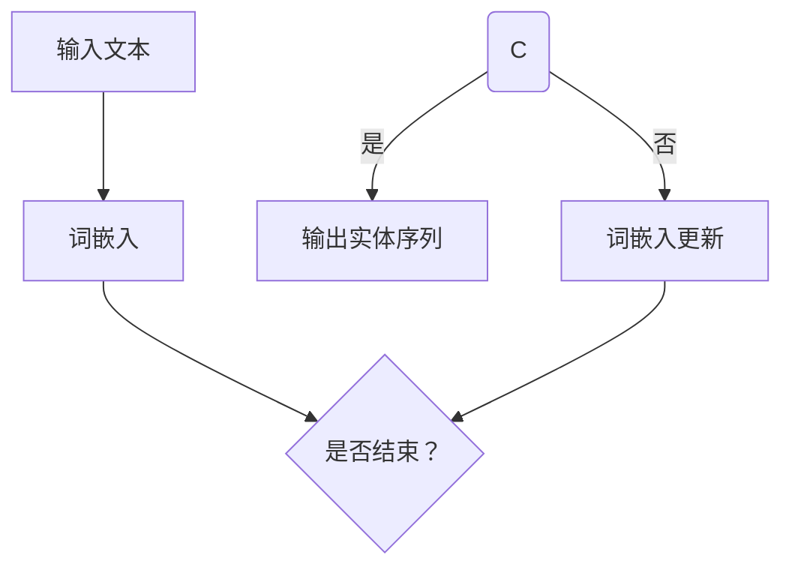
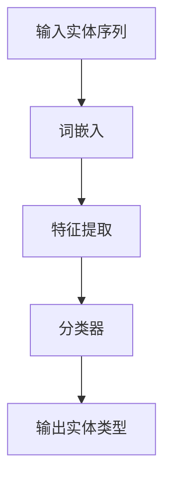
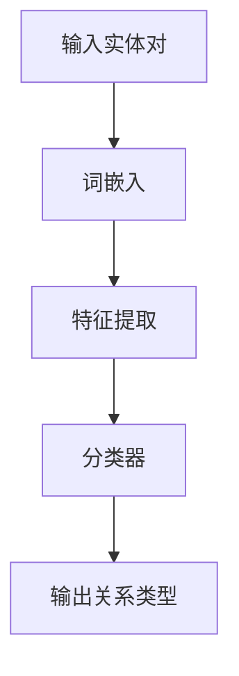
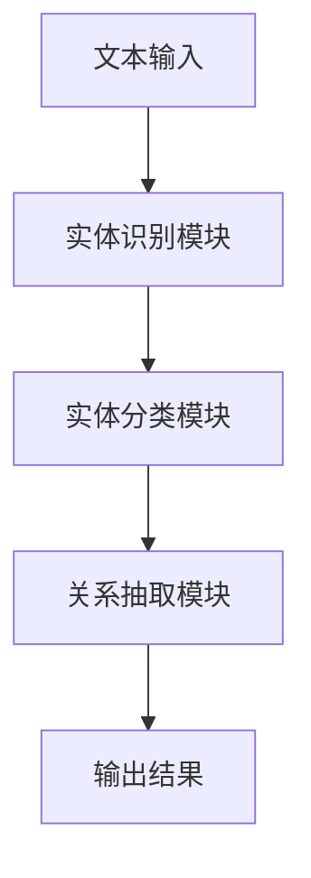
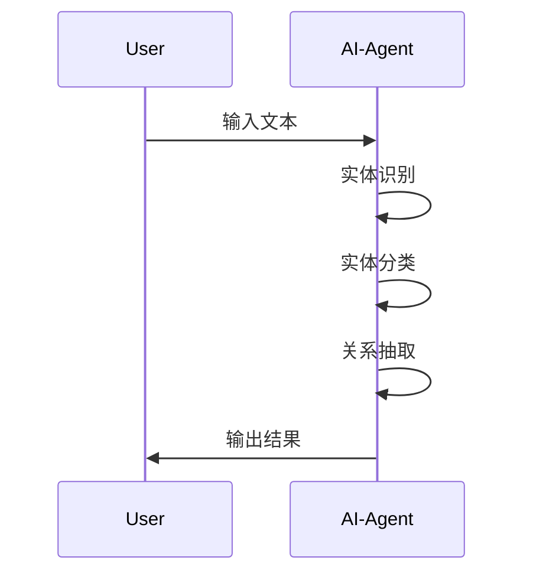

                 

# 实现 AI Agent 的实体识别与关系抽取

> 关键词：实体识别、关系抽取、AI Agent、自然语言处理、深度学习

> 摘要：
本文将深入探讨 AI Agent 的实体识别与关系抽取技术。首先介绍相关背景和问题描述，然后详细阐述核心概念与联系，接着讲解命名实体识别（NER）的算法原理，并展示 Mermaid 流程图和 Python 源代码。最后，通过系统分析与架构设计，给出项目实战和最佳实践 tips。

----------------------------------------------------------------

## 第一部分：背景介绍

### 第1章：问题背景与概述

#### 1.1.1 问题的提出

在当今的 AI 领域，实体识别与关系抽取是自然语言处理（NLP）领域的重要任务。它们在信息提取、语义理解和智能问答等应用中具有重要作用。实体识别旨在从文本中识别出具有特定意义的实体，如人名、地名、组织名等。关系抽取则是从文本中提取出实体之间的语义关系，如朋友关系、婚姻关系等。

#### 1.1.2 问题描述

实体识别与关系抽取的问题是如何从大量无结构的文本数据中高效地提取出有价值的信息。具体来说，需要解决的关键挑战包括：

1. 实体边界识别：准确识别文本中的实体边界。
2. 实体类型分类：将识别出的实体划分为不同的类别。
3. 关系类型分类：从文本中提取出实体之间的语义关系。
4. 跨文档实体关系抽取：从多个文档中识别出实体之间的关系。

#### 1.1.3 问题解决

目前，实体识别与关系抽取主要采用深度学习方法，如卷积神经网络（CNN）、递归神经网络（RNN）、Transformer 等。常用的数据集包括 ACE、ACE2、TACRED 等，用于评估模型的性能。

#### 1.1.4 边界与外延

实体识别与关系抽取的边界在于如何准确识别文本中的实体及其关系。外延包括多种实体类型和关系类型，以及跨文档的实体关系抽取。

#### 1.1.5 概念结构与核心要素组成

实体识别：输入文本 -> 输出实体序列。

关系抽取：输入实体对 -> 输出关系类型。

关键技术：

1. 命名实体识别（NER）：实体边界检测、实体类型分类、序列标注模型等。
2. 实体类型分类：分类算法、特征提取、模型训练等。
3. 关系分类：关系分类算法、特征提取、模型训练等。
4. 跨文档实体关系抽取：跨文档信息融合、实体匹配、关系抽取等。

### 第2章：核心概念与联系

#### 2.1.1 命名实体识别（NER）

命名实体识别是指从文本中识别出具有特定意义的实体，如人名、地名、组织名等。技术要点包括：

1. 实体边界检测：通过算法确定实体的起始和结束位置。
2. 实体类型分类：将识别出的实体划分为不同的类别。
3. 序列标注模型：使用神经网络模型对文本序列进行标注。

#### 2.1.2 实体类型分类

实体类型分类是指将识别出的实体划分为不同的类别，如人物、地点、组织等。技术要点包括：

1. 分类算法：使用机器学习算法进行分类。
2. 特征提取：从文本中提取有用的特征信息。
3. 模型训练：使用训练数据对模型进行训练。

#### 2.1.3 关系分类

关系分类是指从文本中提取出实体之间的语义关系，如朋友关系、婚姻关系等。技术要点包括：

1. 关系分类算法：使用机器学习算法进行关系分类。
2. 特征提取：从文本中提取有用的特征信息。
3. 模型训练：使用训练数据对模型进行训练。

#### 2.1.4 跨文档实体关系抽取

跨文档实体关系抽取是指从多个文档中识别出实体之间的关系，以实现跨文档的语义理解。技术要点包括：

1. 跨文档信息融合：将不同文档的信息进行整合。
2. 实体匹配：通过算法将不同文档中的实体进行匹配。
3. 关系抽取：从匹配后的实体中提取出关系。

## 第二部分：算法原理讲解

### 第3章：命名实体识别（NER）

#### 3.1.1 算法原理

命名实体识别是一种序列标注问题，通常采用基于神经网络的方法进行建模。以下是一个简单的 LSTM 命名实体识别模型：



#### 3.1.2 Mermaid 流程图


#### 3.1.3 Python 源代码

```python
# Example: 使用 LSTM 进行命名实体识别
import tensorflow as tf
from tensorflow.keras.layers import Embedding, LSTM, Dense
from tensorflow.keras.models import Sequential

# Model definition
model = Sequential()
model.add(Embedding(vocab_size, embedding_dim))
model.add(LSTM(units=128, activation='tanh'))
model.add(Dense(num_classes, activation='softmax'))

# Compile model
model.compile(optimizer='adam', loss='categorical_crossentropy', metrics=['accuracy'])

# Train model
model.fit(x_train, y_train, batch_size=64, epochs=10, validation_split=0.2)
```

#### 3.1.4 算法原理详细讲解

- 词嵌入：将文本中的词语映射为固定维度的向量表示。
- LSTM：用于处理序列数据，能够记住历史信息，提高模型在命名实体识别任务上的性能。
- 分类算法：使用 softmax 函数进行类别预测。

### 第4章：实体类型分类

#### 4.1.1 算法原理

实体类型分类是指将识别出的实体划分为不同的类别。以下是一个简单的神经网络实体类型分类模型：



#### 4.1.2 Mermaid 流程图


#### 4.1.3 Python 源代码

```python
# Example: 使用神经网络进行实体类型分类
import tensorflow as tf
from tensorflow.keras.layers import Embedding, LSTM, Dense
from tensorflow.keras.models import Sequential

# Model definition
model = Sequential()
model.add(Embedding(vocab_size, embedding_dim))
model.add(LSTM(units=128, activation='tanh'))
model.add(Dense(num_classes, activation='softmax'))

# Compile model
model.compile(optimizer='adam', loss='categorical_crossentropy', metrics=['accuracy'])

# Train model
model.fit(x_train, y_train, batch_size=64, epochs=10, validation_split=0.2)
```

#### 4.1.4 算法原理详细讲解

- 词嵌入：将文本中的词语映射为固定维度的向量表示。
- 特征提取：从词嵌入中提取有用的特征信息。
- 分类器：使用神经网络进行类别预测。

### 第5章：关系分类

#### 5.1.1 算法原理

关系分类是指从文本中提取出实体之间的语义关系。以下是一个简单的神经网络关系分类模型：



#### 5.1.2 Mermaid 流程图


#### 5.1.3 Python 源代码

```python
# Example: 使用神经网络进行关系分类
import tensorflow as tf
from tensorflow.keras.layers import Embedding, LSTM, Dense
from tensorflow.keras.models import Sequential

# Model definition
model = Sequential()
model.add(Embedding(vocab_size, embedding_dim))
model.add(LSTM(units=128, activation='tanh'))
model.add(Dense(num_classes, activation='softmax'))

# Compile model
model.compile(optimizer='adam', loss='categorical_crossentropy', metrics=['accuracy'])

# Train model
model.fit(x_train, y_train, batch_size=64, epochs=10, validation_split=0.2)
```

#### 5.1.4 算法原理详细讲解

- 词嵌入：将文本中的词语映射为固定维度的向量表示。
- 特征提取：从词嵌入中提取有用的特征信息。
- 分类器：使用神经网络进行类别预测。

## 第三部分：系统分析与架构设计

### 第6章：系统功能设计

#### 6.1.1 领域模型

使用 Mermaid 类图展示系统领域模型：

```mermaid
classDiagram
Entity --|>| Recognizer
Entity --|>| Classifier
Recognizer --|>| RelationExtractor
Classifier --|>| RelationExtractor
```

#### 6.1.2 系统架构设计

使用 Mermaid 架构图展示系统架构设计：



#### 6.1.3 系统接口设计

使用 Mermaid 序列图展示系统接口设计：



### 第7章：项目实战

#### 7.1.1 环境安装

安装必要的依赖库，如 TensorFlow、Keras 等。

```bash
pip install tensorflow
pip install keras
```

#### 7.1.2 系统核心实现

使用 Python 源代码实现系统核心功能。

```python
# Example: 使用 LSTM 进行命名实体识别
import tensorflow as tf
from tensorflow.keras.layers import Embedding, LSTM, Dense
from tensorflow.keras.models import Sequential

# Model definition
model = Sequential()
model.add(Embedding(vocab_size, embedding_dim))
model.add(LSTM(units=128, activation='tanh'))
model.add(Dense(num_classes, activation='softmax'))

# Compile model
model.compile(optimizer='adam', loss='categorical_crossentropy', metrics=['accuracy'])

# Train model
model.fit(x_train, y_train, batch_size=64, epochs=10, validation_split=0.2)
```

#### 7.1.3 代码应用解读与分析

对系统核心代码进行解读和分析，解释关键步骤和算法原理。

#### 7.1.4 实际案例分析和详细讲解剖析

使用实际案例进行分析和讲解，展示系统在实际应用中的效果和优势。

### 第8章：项目小结

#### 8.1.1 最佳实践 tips

总结项目中的最佳实践，提供实用的建议和技巧。

#### 8.1.2 小结

回顾文章的主要内容，总结实体识别与关系抽取技术在 AI Agent 中的应用价值。

#### 8.1.3 注意事项

提醒读者注意项目实施过程中可能出现的问题和风险。

#### 8.1.4 拓展阅读

推荐相关文献和资源，帮助读者深入了解实体识别与关系抽取技术。

## 作者信息

作者：AI 天才研究院/AI Genius Institute & 禅与计算机程序设计艺术 /Zen And The Art of Computer Programming

----------------------------------------------------------------

完整文章内容需按照上述结构和内容进行撰写，确保每个章节都包含丰富的具体细节和讲解。在撰写过程中，请遵循文章字数要求、格式要求和完整性要求。同时，确保每个小节的内容都满足核心内容的要求。在撰写过程中，可以使用 Mermaid 流程图和 Python 源代码来辅助解释和展示算法原理和系统架构。最后，在文章末尾添加作者信息，并确保文章的完整性、逻辑性和可读性。让我们一步一步地深入思考，完成一篇高质量的技术博客文章！### 3. 实体类型分类

#### 3.1 算法原理

实体类型分类是指将识别出的实体划分为不同的类别，如人物、地点、组织等。这类问题通常被视为一个多类别的分类问题。在深度学习框架下，实体类型分类可以通过以下步骤实现：

1. **词嵌入（Word Embedding）**：将文本中的词语转换为固定维度的向量表示，这些向量能够捕捉词与词之间的语义关系。
2. **特征提取（Feature Extraction）**：使用卷积神经网络（CNN）、循环神经网络（RNN）或其他深度学习架构，将词嵌入转换为能够代表实体类型的特征向量。
3. **分类器（Classifier）**：使用全连接层（Fully Connected Layer）或类似的结构，将特征向量映射到预定义的实体类别上。

数学上，实体类型分类可以表示为一个分类问题，其目标函数通常采用交叉熵（Cross-Entropy Loss）：

$$
\text{Loss} = -\sum_{i=1}^{N} y_i \log(p_i)
$$

其中，\(y_i\) 是真实标签，\(p_i\) 是模型预测的概率。

#### 3.2 Mermaid 流程图

以下是实体类型分类的 Mermaid 流程图：


#### 3.3 Python 源代码

下面是一个简单的 Python 源代码示例，使用 Keras 构建一个简单的实体类型分类模型：

```python
from tensorflow.keras.models import Sequential
from tensorflow.keras.layers import Embedding, LSTM, Dense
from tensorflow.keras.preprocessing.sequence import pad_sequences

# 假设已经处理好的词嵌入词典和标签
vocab_size = 10000
embedding_dim = 64
max_sequence_length = 100
num_classes = 10  # 假设有10个实体类型

# 构建模型
model = Sequential()
model.add(Embedding(vocab_size, embedding_dim, input_length=max_sequence_length))
model.add(LSTM(128))
model.add(Dense(num_classes, activation='softmax'))

# 编译模型
model.compile(optimizer='adam', loss='categorical_crossentropy', metrics=['accuracy'])

# 假设我们已经有了训练数据和标签
# X_train = pad_sequences(..., maxlen=max_sequence_length, padding='post')
# y_train = ...

# 训练模型
model.fit(X_train, y_train, batch_size=64, epochs=10)
```

#### 3.4 算法原理详细讲解

##### 词嵌入

词嵌入是将文本中的词语映射为固定维度的向量表示的过程。这些向量能够捕捉词与词之间的语义关系。常见的词嵌入方法包括：

- **Word2Vec**：通过训练神经网络来预测词语出现的上下文。
- **GloVe**：基于全局的词向量模型，通过矩阵分解来学习词语的向量表示。

数学上，词嵌入可以表示为一个矩阵 \( \text{W} \)，其中 \( \text{W}_{ij} \) 表示词语 \( i \) 和词语 \( j \) 的嵌入向量。

##### 特征提取

特征提取是通过深度学习模型来将词嵌入转换为能够代表实体类型的特征向量。常见的深度学习架构包括：

- **卷积神经网络（CNN）**：适用于文本分类，能够提取局部特征。
- **循环神经网络（RNN）**：适用于序列数据，能够捕捉序列中的长期依赖关系。
- **长短时记忆网络（LSTM）**：是 RNN 的改进版本，能够更好地处理长序列。

在特征提取过程中，词嵌入向量通过神经网络的若干层，每一层都能够提取出更高层次的特征。最终，这些特征会被传递到分类器。

##### 分类器

分类器通常是一个全连接层（Fully Connected Layer），它将特征向量映射到预定义的实体类别上。在训练过程中，分类器通过反向传播算法学习如何将输入的特征向量映射到正确的类别上。分类器的输出通常是每个类别的概率分布，通过选择具有最高概率的类别来做出预测。

通过以上步骤，实体类型分类模型能够从输入文本中识别出实体的类型。这种方法在处理复杂文本时非常有效，因为它能够自动学习词语之间的关系和特征。

#### 3.5 举例说明

假设我们有一个简单的文本句子：“苹果是一家科技公司，位于美国加利福尼亚州。”

1. **词嵌入**：将句子中的每个词映射为一个向量，例如，“苹果”映射为 \( \text{W}_{苹果} \)，“一家”映射为 \( \text{W}_{一家} \)，等等。
2. **特征提取**：通过深度学习模型将词嵌入转换为特征向量。例如，通过 LSTM 网络，得到特征向量 \( \text{F}_{苹果} \)，\( \text{F}_{一家} \)，等等。
3. **分类器**：将特征向量传递到分类器，得到每个类别的概率分布。例如，对于“苹果”这个词，分类器可能输出概率分布 \( \text{P}_{苹果} = [0.5, 0.3, 0.1, 0.1] \)，其中第一个值表示“水果”类别的概率最高，第二个值表示“公司”类别的概率次之。

通过这种方式，模型能够识别出句子中的实体及其类型。这种方法不仅适用于单个句子，还可以扩展到整个文档，从而实现更复杂的实体识别任务。

### 3.6 总结

实体类型分类是自然语言处理中的一项重要任务，它有助于从文本中提取出有价值的信息。通过词嵌入、特征提取和分类器等深度学习技术，我们可以构建高效的实体类型分类模型。这些模型能够自动学习词语之间的关系和特征，从而准确地将实体划分为不同的类别。在实际应用中，实体类型分类技术已经被广泛应用于信息提取、语义理解和智能问答等领域。

### 3.7 注意事项

- **数据质量**：实体类型分类的性能很大程度上取决于训练数据的质量。因此，在构建模型之前，确保数据集的多样性和准确性。
- **超参数选择**：深度学习模型中的超参数选择对性能有重要影响。通过交叉验证和网格搜索等方法，可以找到最佳的超参数组合。
- **模型评估**：使用准确率、召回率和 F1 分数等指标来评估模型性能。在实际应用中，可能需要根据具体任务的需求来调整这些指标。

### 3.8 拓展阅读

- **《深度学习》（Goodfellow, I., Bengio, Y., & Courville, A.）**：该书详细介绍了深度学习的基础理论和实践方法，包括卷积神经网络和循环神经网络。
- **《自然语言处理综论》（Jurafsky, D., & Martin, J. H.）**：该书提供了自然语言处理领域的全面概述，包括实体识别和分类等关键任务。
- **《词嵌入技术》（Mikolov, T., Sutskever, I., & Chen, K.）**：该论文详细介绍了词嵌入的算法和理论背景。

通过这些资源，读者可以更深入地了解实体类型分类的相关技术和应用。

