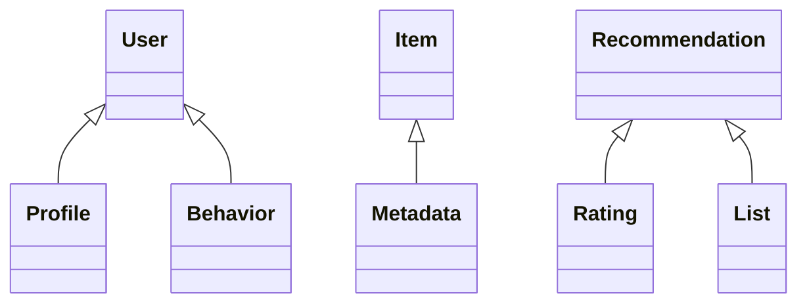

                 

### 第1章：问题背景与学习目标

### 1.1 问题背景与学习目标

#### 1.1.1 问题背景

随着人工智能技术的迅猛发展，AI Agent的概念学习与泛化能力逐渐成为研究的热点。AI Agent是一种能够自主执行任务、与环境交互并不断学习的智能体。在现实世界中，AI Agent需要具备从复杂、多变的环境中学习新知识、适应新情境的能力。然而，传统的机器学习方法往往局限于特定任务的优化，缺乏泛化能力。为了使AI Agent能够更好地应对现实世界的挑战，提升其概念学习与泛化能力变得至关重要。

#### 1.1.2 问题描述

本书旨在探讨AI Agent的概念学习与泛化能力的实现方法。具体来说，我们将关注以下研究问题：

1. 如何有效地从数据中学习概念？
2. 如何评估AI Agent在新的、未见过的情况下应用所学概念的能力？
3. 如何提高AI Agent的泛化能力，使其在面对未知情境时仍能准确应用所学知识？

#### 1.1.3 问题解决

为了解决上述问题，本书将从以下几个方向展开研究：

1. 理论基础：探讨概念学习与泛化能力的理论基础，包括相关算法、模型和理论框架。
2. 算法原理：详细介绍各种概念学习与泛化能力相关的算法，如KNN、SVM、决策树等，并分析其优缺点。
3. 实际应用：结合实际应用场景，探讨AI Agent在不同领域中的概念学习与泛化能力。
4. 系统设计与实现：设计并实现一个具备概念学习与泛化能力的AI Agent系统，验证理论研究成果。

#### 1.1.4 边界与外延

本书讨论的AI Agent主要是指计算机程序，其学习与泛化能力主要基于机器学习技术。此外，本书也将探讨AI Agent在不同领域中的应用，如自然语言处理、计算机视觉、推荐系统等。

#### 1.1.5 概念结构与核心要素组成

AI Agent的概念学习与泛化能力主要包括以下几个核心要素：

1. 数据采集与处理：收集大量含有目标概念的数据，并对数据进行预处理。
2. 概念学习算法：使用机器学习算法从数据中学习概念。
3. 泛化能力评估：评估AI Agent在不同情境下应用所学概念的能力。
4. 概念泛化算法：提高AI Agent在新的、未见过的情况下应用所学概念的能力。

### 1.2 学习目标

通过本书的学习，读者将能够：

1. 了解AI Agent的概念学习与泛化能力的背景与意义。
2. 掌握数据采集与处理的方法，以及如何从数据中学习概念。
3. 掌握常用的概念学习算法，并了解它们的工作原理。
4. 学会评估AI Agent的泛化能力，以及提高泛化能力的算法。
5. 了解AI Agent在不同领域中的应用，并具备实际项目开发的能力。

### 1.3 案例分析

#### 1.3.1 语音助手

以语音助手为例，一个具备概念学习与泛化能力的AI Agent可以更好地理解和回应用户的请求。通过学习大量语音数据，AI Agent可以识别用户的语音指令，理解其含义，并在新的、未见过的情况下正确地执行任务。

#### 1.3.2 自动驾驶

在自动驾驶领域，AI Agent需要具备从海量道路数据中学习驾驶规则和交通信号的能力，同时要在不同路况、天气和环境条件下保持高泛化能力，确保车辆安全行驶。

#### 1.3.3 智能医疗

智能医疗中的AI Agent可以从医学图像和病例数据中学习诊断知识，并在实际病例中应用这些知识，为医生提供辅助诊断，提高诊断准确性。

### 1.4 结论

AI Agent的概念学习与泛化能力是实现智能化的关键。通过本书的研究，我们将深入探讨这一领域，为实际应用提供理论指导和实践方法。让我们一同探索AI Agent的概念学习与泛化能力的实现之路。### 1.1.1 问题背景

随着人工智能技术的迅猛发展，AI Agent的概念学习与泛化能力逐渐成为研究的热点。AI Agent是一种能够自主执行任务、与环境交互并不断学习的智能体。在现实世界中，AI Agent需要具备从复杂、多变的环境中学习新知识、适应新情境的能力。然而，传统的机器学习方法往往局限于特定任务的优化，缺乏泛化能力。为了使AI Agent能够更好地应对现实世界的挑战，提升其概念学习与泛化能力变得至关重要。

AI Agent的概念学习与泛化能力是指其能够从数据中学习抽象概念，并在新的、未见过的情况下正确应用这些概念的能力。这种能力使得AI Agent在面临复杂、动态环境时，能够自主适应并做出合理的决策。例如，一个智能助手需要理解并回应用户的多样化请求，一个自动驾驶系统需要在各种路况下安全行驶，这些都需要AI Agent具备强大的概念学习与泛化能力。

目前，人工智能领域在概念学习与泛化能力方面已取得了一系列重要成果。然而，依然存在许多挑战。首先，如何在海量数据中高效地学习概念，同时避免过拟合是一个关键问题。其次，如何评估AI Agent的泛化能力，并在新的情境下正确应用所学概念，也是一个亟待解决的难题。此外，如何将概念学习与泛化能力应用于实际场景，如自然语言处理、计算机视觉、推荐系统等领域，也是一个重要的研究方向。

总之，AI Agent的概念学习与泛化能力是实现智能化的关键。通过深入研究这一领域，我们将有望突破现有技术的瓶颈，推动人工智能技术迈向新的高度。### 1.1.2 问题描述

在深入探讨AI Agent的概念学习与泛化能力之前，我们需要明确这一研究问题的具体描述。本书旨在解决以下几个核心问题：

1. **如何有效地从数据中学习概念？**
   - **问题描述**：传统的机器学习算法往往依赖于大量标注数据，然而在现实世界中，标注数据的获取往往代价高昂且不完整。因此，我们需要探索如何利用无监督或半监督学习方法，从大量未标注的数据中学习概念，从而降低数据标注的成本和难度。
   - **解决方案**：我们将研究自动特征提取、聚类分析和生成对抗网络（GAN）等技术，以探索从数据中学习概念的有效方法。

2. **如何评估AI Agent的泛化能力？**
   - **问题描述**：一个具备泛化能力的AI Agent不仅能够在训练数据集上表现良好，还需要在新的、未见过的情况下保持稳定的表现。因此，我们需要开发一套全面的评估方法，以衡量AI Agent在不同情境下的泛化能力。
   - **解决方案**：我们将结合多种评估指标，如准确率、召回率、F1值等，并设计实验来验证AI Agent的泛化能力。

3. **如何提高AI Agent的泛化能力？**
   - **问题描述**：尽管AI Agent在训练数据集上表现出色，但在面对新的任务或数据时，其性能可能会显著下降。这表明现有模型的泛化能力仍有待提升。
   - **解决方案**：我们将研究迁移学习、元学习、强化学习等先进的机器学习方法，以提高AI Agent的泛化能力。

4. **如何将概念学习与泛化能力应用于实际场景？**
   - **问题描述**：在实际应用中，AI Agent需要具备解决实际问题的能力。因此，我们需要探索如何将概念学习与泛化能力应用于自然语言处理、计算机视觉、推荐系统等具体领域。
   - **解决方案**：我们将结合实际应用场景，开发具体的AI Agent系统，并通过实验验证其性能。

通过上述问题的研究，本书旨在为AI Agent的概念学习与泛化能力提供一套系统的理论框架和实践指南。这些研究不仅有助于提升AI Agent的智能水平，还将推动人工智能技术在各个领域的应用。### 1.1.3 问题解决

为了解决上述研究问题，本书将从以下几个方向展开系统研究：

#### 1.1.3.1 理论基础

首先，我们将深入探讨AI Agent的概念学习与泛化能力的理论基础。这包括对现有机器学习算法的全面分析，以及相关理论框架的研究，如深度学习、统计学习理论等。通过这一部分，我们将为后续的研究提供坚实的理论基础。

#### 1.1.3.2 算法原理

接着，我们将详细介绍各种概念学习与泛化能力相关的算法，并分析其优缺点。这些算法包括但不限于：

1. **基于实例的学习（Instance-based Learning）**：如K最近邻（KNN）算法，该方法通过比较新实例与训练实例的相似度来进行分类。
2. **统计学习方法**：如支持向量机（SVM），该方法通过寻找最佳决策边界来进行分类。
3. **深度学习方法**：如卷积神经网络（CNN）和循环神经网络（RNN），这些方法通过多层次的特征提取和学习来实现复杂的分类任务。
4. **迁移学习方法**：通过将一个任务学到的知识迁移到另一个相关任务中，以提高泛化能力。

#### 1.1.3.3 实际应用

在理论研究和算法原理介绍的基础上，我们将探讨AI Agent在不同领域中的应用，如自然语言处理、计算机视觉、推荐系统等。通过实际应用案例的展示，我们将验证概念学习与泛化能力在实际场景中的效果。

#### 1.1.3.4 系统设计与实现

为了验证理论研究成果，我们将设计并实现一个具备概念学习与泛化能力的AI Agent系统。这一系统将包括以下核心组成部分：

1. **数据采集与处理模块**：负责收集并处理来自不同领域的大量数据。
2. **概念学习模块**：使用机器学习算法从数据中学习概念。
3. **泛化能力评估模块**：通过多种评估指标来衡量AI Agent的泛化能力。
4. **概念泛化算法模块**：设计并实现提高泛化能力的算法，如迁移学习、元学习等。

#### 1.1.3.5 实验与验证

在系统设计与实现的基础上，我们将通过一系列实验来验证所提出的方法的有效性。实验将包括不同数据集、不同算法的比较，以及实际应用场景中的性能评估。

#### 1.1.3.6 结论与展望

最后，我们将总结本书的研究成果，讨论所提出方法的优势和局限，并提出未来研究的方向。通过这一部分，我们希望为AI Agent的概念学习与泛化能力研究提供有价值的参考。

总之，本书将从理论、算法、实际应用和系统实现等多个方面，系统地探讨AI Agent的概念学习与泛化能力的实现方法，为推动人工智能技术的发展贡献力量。### 1.1.4 边界与外延

在本研究中，AI Agent的概念学习与泛化能力的讨论主要基于计算机程序和机器学习技术。虽然这些方法在许多领域具有广泛的应用前景，但我们也需要明确其适用的边界和可能的外延。

#### 1.1.4.1 适用边界

1. **数据依赖性**：AI Agent的概念学习与泛化能力高度依赖于数据的质量和数量。在实际应用中，我们需要确保收集到足够多的、多样化的数据，以便算法能够从中提取有效特征并进行泛化。
2. **计算资源**：复杂的机器学习算法通常需要大量的计算资源。在实际应用中，需要根据计算资源的限制来选择合适的算法和模型，以实现高效的计算。
3. **算法适用性**：不同的机器学习算法适用于不同的任务和数据类型。在选择算法时，需要根据具体应用场景的特点来选择最合适的算法。

#### 1.1.4.2 可能的外延

1. **跨领域应用**：尽管本研究主要集中在计算机视觉、自然语言处理等领域，但概念学习与泛化能力的研究方法同样可以应用于其他领域，如推荐系统、金融风控、生物信息学等。
2. **多模态学习**：在未来的研究中，可以探索多模态数据的学习方法，如结合图像、文本、语音等多种数据类型，以提高AI Agent的概念学习与泛化能力。
3. **动态环境适应**：实际应用中，AI Agent需要不断适应动态变化的环境。未来研究可以关注动态环境下的概念学习与泛化能力，以提升AI Agent的适应能力。

总之，尽管本研究有一定的边界，但通过不断拓展和深化研究，我们可以期待在AI Agent的概念学习与泛化能力方面取得更多突破。这些研究不仅有助于提升AI Agent的性能，还将推动人工智能技术的广泛应用。### 1.1.5 概念结构与核心要素组成

AI Agent的概念学习与泛化能力由多个核心要素组成，这些要素相互关联，共同构成了一个完整的概念结构。以下是这些核心要素及其组成：

#### 1.1.5.1 数据采集与处理模块

**数据采集**：AI Agent需要从各种来源收集大量数据，如图像、文本、语音等。数据来源可以包括公共数据集、企业内部数据、在线数据平台等。

**数据预处理**：收集到的数据通常需要进行预处理，以确保数据质量。预处理步骤包括数据清洗、归一化、特征提取等。数据预处理是概念学习的关键步骤，它直接影响到后续算法的性能。

#### 1.1.5.2 概念学习模块

**概念提取**：使用机器学习算法从预处理后的数据中提取概念。常用的算法包括K最近邻（KNN）、支持向量机（SVM）、决策树、深度学习等。这些算法通过学习数据中的特征模式，形成对目标概念的理解。

**概念表征**：将提取到的概念以适合机器学习模型的形式进行表征。例如，可以使用向量化表示法、图结构表征法等。

#### 1.1.5.3 泛化能力评估模块

**评估指标**：使用多种评估指标来衡量AI Agent的泛化能力。常见的评估指标包括准确率、召回率、F1值等。这些指标可以反映AI Agent在不同情境下应用所学概念的能力。

**评估方法**：通过实验和模拟场景来评估AI Agent的泛化能力。评估方法可以包括交叉验证、留一法评估等。

#### 1.1.5.4 概念泛化算法模块

**迁移学习**：通过将一个任务学到的知识迁移到另一个相关任务中，以提高泛化能力。迁移学习可以在数据量有限的情况下，提高AI Agent在新的任务上的性能。

**元学习**：通过学习如何学习，提高AI Agent在不同任务上的快速适应能力。元学习可以帮助AI Agent在新的、未见过的情况下快速泛化。

**强化学习**：通过与环境交互，不断调整行为策略，以提高泛化能力。强化学习可以用于动态环境下的任务，如自动驾驶、游戏AI等。

#### 1.1.5.5 应用集成模块

**系统集成**：将上述各个模块整合到一个系统中，形成完整的AI Agent。系统需要具备高效的数据处理能力、概念学习与泛化能力，以及灵活的适应性。

**应用拓展**：将AI Agent应用到不同的实际场景中，如自然语言处理、计算机视觉、推荐系统等。通过实际应用，验证AI Agent的概念学习与泛化能力的有效性。

#### 1.1.5.6 持续学习与优化模块

**反馈机制**：通过用户反馈和系统性能监测，不断优化AI Agent的概念学习与泛化能力。反馈机制可以帮助AI Agent从实际应用中学习，并不断改进。

**在线学习**：支持AI Agent在运行时进行在线学习，以适应环境的变化。在线学习可以帮助AI Agent在实时应用中保持高水平的性能。

通过上述核心要素的有机结合，AI Agent可以具备强大的概念学习与泛化能力，从而更好地适应复杂多变的环境。本研究将从这些核心要素出发，系统地探讨AI Agent的概念学习与泛化能力的实现方法，为人工智能技术的发展提供新的思路和方向。### 1.2 学习目标

通过本书的学习，读者将能够：

1. **理解AI Agent的概念学习与泛化能力的背景与意义**：读者将深入了解AI Agent在现实世界中的应用场景，以及概念学习与泛化能力对于AI Agent性能提升的重要性。
   
2. **掌握数据采集与处理的方法**：读者将学习如何从不同来源收集数据，并掌握数据预处理技术，如数据清洗、归一化、特征提取等，以确保数据质量。

3. **掌握常用的概念学习算法**：读者将了解并掌握K最近邻（KNN）、支持向量机（SVM）、决策树、深度学习等常用的机器学习算法，并理解它们的工作原理。

4. **学会评估AI Agent的泛化能力**：读者将学习如何使用准确率、召回率、F1值等评估指标，以及交叉验证、留一法等评估方法，来评估AI Agent在不同情境下的泛化能力。

5. **掌握提高泛化能力的算法**：读者将了解并掌握迁移学习、元学习、强化学习等提高AI Agent泛化能力的算法，并理解它们的应用场景和实现方法。

6. **了解AI Agent在不同领域中的应用**：读者将了解AI Agent在自然语言处理、计算机视觉、推荐系统等领域的应用，并学习如何将这些算法应用于实际项目开发。

7. **具备实际项目开发的能力**：通过学习本书的内容，读者将具备独立开发和实现AI Agent系统的能力，能够在实际项目中应用所学的知识，提升项目的智能化水平。

通过本书的学习，读者不仅能够系统地掌握AI Agent的概念学习与泛化能力，还将为未来的研究和工作奠定坚实的基础。### 1.3 案例分析

#### 1.3.1 语音助手

以语音助手为例，这是一个典型的AI Agent应用场景。语音助手需要具备强大的概念学习与泛化能力，以便准确理解用户的语音指令并做出相应的响应。具体来说，语音助手需要完成以下几个关键步骤：

1. **语音识别**：语音助手首先需要将用户的语音转换为文本，这一过程称为语音识别。通过使用深度学习模型，如卷积神经网络（CNN）或长短期记忆网络（LSTM），语音助手可以从大量的语音数据中学习语音特征，从而提高识别的准确性。

2. **意图识别**：将转换后的文本转化为具体的操作指令，如打开音乐、发送消息等。这一步骤称为意图识别。意图识别通常涉及自然语言处理（NLP）技术，如词嵌入和序列标注。语音助手需要从大量的文本数据中学习不同意图的特征，以便在新的、未见过的情况下正确识别用户意图。

3. **响应生成**：根据用户的意图生成相应的响应，如语音、文本或动作。这一步骤需要语音助手具备良好的泛化能力，以便在遇到新的指令或情境时，仍能正确生成响应。

在语音助手的应用中，概念学习与泛化能力至关重要。通过学习大量的语音数据，语音助手可以不断提高语音识别的准确性；通过学习大量的文本数据，语音助手可以不断提高意图识别的准确性；通过在多种实际应用场景中不断训练和优化，语音助手可以不断提高其泛化能力，从而更好地为用户提供服务。

#### 1.3.2 自动驾驶

自动驾驶是另一个典型的AI Agent应用场景。自动驾驶系统需要具备从海量道路数据中学习驾驶规则和交通信号的能力，同时要在各种路况、天气和环境条件下保持高泛化能力，以确保车辆安全行驶。具体来说，自动驾驶系统需要完成以下几个关键步骤：

1. **感知环境**：自动驾驶系统需要通过传感器（如摄像头、激光雷达、超声波传感器等）感知周围环境，并从感知数据中提取关键信息，如道路标记、交通信号、车辆位置等。

2. **决策规划**：基于感知数据，自动驾驶系统需要做出行驶决策。这包括选择合适的行驶路径、避让障碍物、遵守交通规则等。这一过程需要自动驾驶系统具备强大的概念学习与泛化能力，以便在复杂的道路环境中做出正确的决策。

3. **控制执行**：根据决策结果，自动驾驶系统需要控制车辆的执行动作，如加速、减速、转向等。这一过程需要自动驾驶系统具备良好的泛化能力，以便在不同路况和条件下稳定地执行驾驶任务。

在自动驾驶的应用中，概念学习与泛化能力至关重要。通过学习大量的道路数据，自动驾驶系统可以不断提高感知环境和决策规划的能力；通过在多种路况和条件下不断训练和优化，自动驾驶系统可以不断提高其泛化能力，从而更好地应对现实世界的挑战。

#### 1.3.3 智能医疗

智能医疗中的AI Agent需要从医学图像和病例数据中学习诊断知识，并在实际病例中应用这些知识，为医生提供辅助诊断。具体来说，智能医疗系统需要完成以下几个关键步骤：

1. **数据采集**：智能医疗系统需要从医院、研究机构等来源收集大量的医学图像和病例数据。

2. **数据预处理**：对采集到的医学图像和病例数据进行预处理，如图像增强、数据归一化等，以提高数据质量。

3. **特征提取**：从预处理后的数据中提取关键特征，如图像中的病灶区域、病例数据中的关键参数等。

4. **模型训练**：使用机器学习算法（如卷积神经网络、支持向量机等）对提取到的特征进行训练，以建立诊断模型。

5. **诊断应用**：将训练好的诊断模型应用于实际病例，为医生提供辅助诊断。例如，在肺炎检测中，智能医疗系统可以分析患者的CT影像，判断患者是否患有肺炎。

在智能医疗的应用中，概念学习与泛化能力至关重要。通过学习大量的医学图像和病例数据，智能医疗系统可以不断提高诊断的准确性；通过在多种实际病例中不断训练和优化，智能医疗系统可以不断提高其泛化能力，从而更好地辅助医生做出准确的诊断。

#### 1.3.4 智能家居

智能家居中的AI Agent需要从用户的行为数据中学习用户的喜好和习惯，以便提供个性化的服务。具体来说，智能家居系统需要完成以下几个关键步骤：

1. **行为数据采集**：智能家居系统需要收集用户的行为数据，如使用家电的频率、时间段、偏好设置等。

2. **数据预处理**：对采集到的行为数据进行预处理，如数据归一化、特征提取等，以提高数据质量。

3. **用户喜好学习**：使用机器学习算法（如K最近邻、协同过滤等）从行为数据中学习用户的喜好和习惯，建立用户喜好模型。

4. **个性化服务**：根据用户喜好模型，智能家居系统可以提供个性化的服务，如自动调整空调温度、推荐用户喜欢的音乐等。

5. **动态调整**：智能家居系统需要具备动态调整能力，根据用户的实时反馈和行为变化，不断优化用户喜好模型，提高个性化服务的质量。

在智能家居的应用中，概念学习与泛化能力至关重要。通过学习大量的用户行为数据，智能家居系统可以不断提高对用户喜好和习惯的识别能力；通过在多种实际场景中不断训练和优化，智能家居系统可以不断提高其泛化能力，从而更好地满足用户的需求。

#### 1.3.5 总结

通过以上案例分析，我们可以看到AI Agent的概念学习与泛化能力在多个领域具有重要的应用价值。无论是在语音助手、自动驾驶、智能医疗，还是智能家居中，概念学习与泛化能力都是AI Agent能够提供高质量服务的核心。本书将深入探讨AI Agent的概念学习与泛化能力，为这些实际应用场景提供理论指导和实践方法。### 1.4 结论

在本章中，我们详细介绍了AI Agent的概念学习与泛化能力的重要性以及研究的具体目标和背景。通过分析，我们明确了以下关键问题：

1. **如何有效地从数据中学习概念？**
   - **问题背景**：数据质量对AI Agent的性能至关重要。
   - **解决方案**：采用无监督或半监督学习方法，以及自动特征提取技术。

2. **如何评估AI Agent的泛化能力？**
   - **问题背景**：评估泛化能力是确保AI Agent在实际应用中表现稳定的关键。
   - **解决方案**：使用准确率、召回率、F1值等评估指标，并结合交叉验证、留一法等评估方法。

3. **如何提高AI Agent的泛化能力？**
   - **问题背景**：泛化能力不足是AI Agent在实际应用中面临的主要挑战。
   - **解决方案**：采用迁移学习、元学习、强化学习等技术，以提高AI Agent在不同情境下的适应能力。

4. **如何将概念学习与泛化能力应用于实际场景？**
   - **问题背景**：将理论知识应用于实际场景是验证研究成果的关键。
   - **解决方案**：通过具体应用案例，如语音助手、自动驾驶、智能医疗和智能家居，展示概念学习与泛化能力的实际效果。

通过上述问题的探讨，我们为AI Agent的概念学习与泛化能力研究提供了系统的理论框架和实践指南。这不仅有助于提升AI Agent的智能水平，还为人工智能技术的广泛应用奠定了基础。在接下来的章节中，我们将进一步深入探讨AI Agent的概念学习与泛化能力的核心概念原理和算法原理，为实际应用提供更加具体和详细的方法。### 第2章：核心概念原理

### 2.1 概念学习原理

#### 2.1.1 概念学习定义

概念学习是指AI Agent通过学习从数据中提取抽象特征，形成对某一类事物的认知和理解。在机器学习中，概念通常被定义为一种分类或聚类结果。概念学习的过程可以看作是AI Agent在大量数据中寻找模式、关联和规律，从而构建对目标概念的理解。

#### 2.1.2 概念学习属性特征对比表格

以下是一个关于不同概念学习算法的基本属性特征对比表格，这些算法包括K最近邻（KNN）、支持向量机（SVM）和决策树等：

| 算法名称 | 基本原理 | 优点 | 缺点 |
| -------- | -------- | ---- | ---- |
| KNN算法 | 基于距离度量 | 简单易实现 | 效率低、易过拟合 |
| SVM算法 | 支持向量机 | 高效、泛化能力强 | 复杂、参数较多 |
| 决策树算法 | 基于划分策略 | 易理解、解释性强 | 易过拟合、计算复杂度较高 |

#### 2.1.3 ER实体关系图架构

ER（Entity-Relationship）图是用于表示实体和它们之间关系的图形化工具。以下是一个简化的ER图示例，用于表示概念学习过程中涉及的实体及其关系：

```mermaid
erDiagram
  Data ||--|{ Concept } Concept
  Concept }|---|| Feature
  Feature ||--|{ Model } Model
```

- **Data（数据）**：包含所有用于训练的数据集，这些数据是概念学习的基础。
- **Concept（概念）**：表示从数据中学习到的抽象概念，如分类结果。
- **Feature（特征）**：表示概念学习过程中提取出的特征，这些特征是构建模型的重要基础。
- **Model（模型）**：表示最终的机器学习模型，用于预测和分类。

### 2.2 泛化能力原理

#### 2.2.1 泛化能力定义

泛化能力是指AI Agent在新的、未见过的情况下，能够正确地应用所学概念的能力。一个具备良好泛化能力的AI Agent不仅能够在训练数据集上表现良好，还能够在未知数据集上保持稳定的表现。

#### 2.2.2 泛化能力评估方法

以下是一些常用的泛化能力评估方法及其基本原理：

| 方法名称 | 基本原理 | 优点 | 缺点 |
| -------- | -------- | ---- | ---- |
| 准确率（Accuracy） | 分类正确的样本数占总样本数的比例 | 简单直观 | 不能反映分类边界 |
| 召回率（Recall） | 被正确分类的负样本数占总负样本数的比例 | 反映分类边界 | 不能反映整体分类质量 |
| F1值（F1 Score） | 准确率和召回率的调和平均值 | 综合考虑准确率和召回率 | 对噪声敏感 |

### 2.2.3 提高泛化能力的方法

为了提高AI Agent的泛化能力，可以采用以下几种方法：

1. **数据增强**：通过增加训练数据量、引入噪声或生成新的样本，增强模型的泛化能力。
2. **迁移学习**：利用预训练的模型或知识，迁移到新的任务中，减少对特定数据的依赖。
3. **元学习**：通过学习如何学习，提高模型在不同任务上的快速适应能力。
4. **正则化**：通过引入正则化项，如L1、L2正则化，减少模型的过拟合现象。

## 2.3 小结

本章介绍了AI Agent的概念学习与泛化能力的核心概念原理。通过对比不同概念学习算法的属性特征，我们了解了KNN、SVM和决策树等算法的基本原理。同时，通过ER实体关系图，我们明确了概念学习过程中涉及的实体及其关系。此外，本章还介绍了泛化能力的定义、评估方法以及提高泛化能力的几种方法。这些核心概念原理是理解后续章节的基础。### 2.1 概念学习原理

#### 2.1.1 概念学习定义

概念学习是指AI Agent通过学习从数据中提取抽象特征，形成对某一类事物的认知和理解。在机器学习中，概念通常被定义为一种分类或聚类结果。概念学习的过程可以看作是AI Agent在大量数据中寻找模式、关联和规律，从而构建对目标概念的理解。

具体来说，概念学习包括以下几个关键步骤：

1. **数据采集**：从不同的数据源（如图像、文本、音频等）收集数据，这些数据是概念学习的基础。

2. **数据预处理**：对收集到的数据进行清洗、归一化、特征提取等处理，以提高数据质量和模型的泛化能力。

3. **特征提取**：从预处理后的数据中提取出具有区分性的特征，这些特征是构建模型的关键。

4. **模型训练**：使用机器学习算法（如K最近邻、支持向量机、决策树等）对提取到的特征进行训练，构建分类或聚类模型。

5. **模型评估**：通过交叉验证、留一法等评估方法，评估模型的泛化能力，确保模型能够在新的、未见过的情况下正确应用所学概念。

#### 2.1.2 概念学习属性特征对比表格

以下是一个关于不同概念学习算法的基本属性特征对比表格，这些算法包括K最近邻（KNN）、支持向量机（SVM）和决策树等：

| 算法名称 | 基本原理 | 优点 | 缺点 |
| -------- | -------- | ---- | ---- |
| KNN算法 | 基于距离度量 | 简单易实现 | 效率低、易过拟合 |
| SVM算法 | 支持向量机 | 高效、泛化能力强 | 复杂、参数较多 |
| 决策树算法 | 基于划分策略 | 易理解、解释性强 | 易过拟合、计算复杂度较高 |

1. **KNN算法**：
   - **基本原理**：KNN算法基于距离度量，通过计算新实例与训练实例之间的距离，选择最近的K个邻居，然后根据邻居的分类结果进行投票，预测新实例的类别。
   - **优点**：实现简单，易于理解。
   - **缺点**：效率较低，容易过拟合。

2. **SVM算法**：
   - **基本原理**：SVM算法通过寻找最佳决策边界，将数据分为不同的类别。它使用支持向量来定义决策边界，从而实现高维空间中的线性或非线性分类。
   - **优点**：泛化能力强，分类效果较好。
   - **缺点**：计算复杂度较高，参数较多。

3. **决策树算法**：
   - **基本原理**：决策树算法通过一系列的划分规则，将数据逐步划分成不同的子集，每个子集对应一个类别。
   - **优点**：易于理解，解释性强。
   - **缺点**：易过拟合，计算复杂度较高。

#### 2.1.3 ER实体关系图架构

ER（Entity-Relationship）图是用于表示实体和它们之间关系的图形化工具。以下是一个简化的ER图示例，用于表示概念学习过程中涉及的实体及其关系：

```mermaid
erDiagram
  Data ||--|{ Concept } Concept
  Concept }|---|| Feature
  Feature ||--|{ Model } Model
```

- **Data（数据）**：包含所有用于训练的数据集，这些数据是概念学习的基础。
- **Concept（概念）**：表示从数据中学习到的抽象概念，如分类结果。
- **Feature（特征）**：表示概念学习过程中提取出的特征，这些特征是构建模型的重要基础。
- **Model（模型）**：表示最终的机器学习模型，用于预测和分类。

通过上述ER图，我们可以清晰地看到概念学习过程中各个实体之间的关联。数据集通过特征提取生成特征向量，特征向量用于训练模型，最终形成可以用于预测的模型。### 2.2 泛化能力原理

#### 2.2.1 泛化能力定义

泛化能力是指AI Agent在新的、未见过的情况下，能够正确地应用所学概念的能力。一个具备良好泛化能力的AI Agent不仅能够在训练数据集上表现良好，还能够在未知数据集上保持稳定的表现。泛化能力是衡量机器学习模型性能的重要指标，也是AI Agent在实际应用中能否有效发挥作用的关键。

#### 2.2.2 泛化能力评估方法

评估泛化能力的方法主要包括以下几种：

1. **准确率（Accuracy）**：
   - **基本原理**：准确率是分类正确的样本数占总样本数的比例。
   - **优点**：简单直观，易于计算。
   - **缺点**：不能反映分类边界，对不平衡数据集敏感。

2. **召回率（Recall）**：
   - **基本原理**：召回率是被正确分类的正样本数占总正样本数的比例。
   - **优点**：反映分类边界，特别是在处理不平衡数据集时非常有用。
   - **缺点**：不能反映整体分类质量，可能因误分类负样本而降低。

3. **精确率（Precision）**：
   - **基本原理**：精确率是分类正确的正样本数与预测为正样本的总数之比。
   - **优点**：反映分类质量，特别是在处理不平衡数据集时非常有用。
   - **缺点**：可能因误分类负样本而降低。

4. **F1值（F1 Score）**：
   - **基本原理**：F1值是精确率和召回率的调和平均值。
   - **优点**：综合考虑精确率和召回率，是一个综合评估指标。
   - **缺点**：对噪声敏感。

5. **ROC曲线与AUC（Area Under Curve）**：
   - **基本原理**：ROC曲线是不同阈值下的真正例率和假正例率的图形表示，AUC是ROC曲线下的面积。
   - **优点**：可以全面评估分类器的性能，特别适用于不平衡数据集。
   - **缺点**：依赖于阈值选择，可能因阈值调整而影响结果。

#### 2.2.3 提高泛化能力的方法

为了提高AI Agent的泛化能力，可以采用以下几种方法：

1. **数据增强**：
   - **基本原理**：通过增加训练数据量、引入噪声或生成新的样本，增强模型的泛化能力。
   - **方法**：数据增强技术包括旋转、缩放、裁剪、添加噪声等。

2. **迁移学习**：
   - **基本原理**：利用预训练的模型或知识，迁移到新的任务中，减少对特定数据的依赖。
   - **方法**：迁移学习可以从预训练模型中提取有用的特征表示，然后在新任务上进行微调。

3. **元学习**：
   - **基本原理**：通过学习如何学习，提高模型在不同任务上的快速适应能力。
   - **方法**：元学习技术包括模型加权平均、模型选择、模型集成等。

4. **正则化**：
   - **基本原理**：通过引入正则化项，如L1、L2正则化，减少模型的过拟合现象。
   - **方法**：正则化可以通过在损失函数中添加惩罚项来实现。

5. **集成方法**：
   - **基本原理**：通过结合多个模型的预测结果，提高整体分类或回归的准确性。
   - **方法**：常见的集成方法包括随机森林、梯度提升机、堆叠等。

通过上述方法，AI Agent可以更好地应对新的、未见过的情况，从而提高其泛化能力。在实际应用中，可以根据具体任务和数据特点，选择合适的方法来提升泛化能力。### 2.3 小结

本章深入探讨了AI Agent的概念学习与泛化能力的核心概念原理。通过介绍概念学习的定义和步骤，我们了解了数据采集、预处理、特征提取、模型训练以及模型评估在整个概念学习过程中的重要性。同时，我们通过对比不同概念学习算法（如KNN、SVM、决策树）的属性特征，明确了各自的基本原理、优缺点以及适用场景。

在泛化能力方面，我们介绍了泛化能力的定义及其重要性，并详细讨论了常用的评估方法（如准确率、召回率、F1值、ROC曲线与AUC）。此外，我们还提出了提高泛化能力的几种方法，包括数据增强、迁移学习、元学习、正则化和集成方法。

通过本章的学习，读者可以对AI Agent的概念学习与泛化能力有一个全面的理解，并为后续章节中深入探讨具体算法和实际应用奠定基础。在接下来的章节中，我们将进一步详细介绍这些算法的原理，并展示如何在实际项目中应用这些原理来提升AI Agent的性能。### 第3章：算法原理讲解

### 3.1 KNN算法原理讲解

#### 3.1.1 KNN算法基本原理

KNN（K-Nearest Neighbors）算法是一种基于实例的机器学习算法，其核心思想是找出训练集中与待分类实例距离最近的K个邻居，并基于这些邻居的标签来预测待分类实例的标签。具体步骤如下：

1. **计算距离**：对于新的待分类实例，计算它与训练集中每个实例之间的距离。常用的距离度量方法包括欧氏距离、曼哈顿距离、余弦相似度等。

2. **选择邻居**：根据距离度量结果，选择距离最近的K个邻居。

3. **投票预测**：对于每个邻居的标签进行投票，然后根据投票结果决定待分类实例的标签。通常使用多数投票法，即选择邻居中出现次数最多的标签作为预测结果。

#### 3.1.2 KNN算法流程

KNN算法的流程可以概括为以下步骤：

1. **数据准备**：收集并预处理训练数据集，包括特征提取和归一化处理。

2. **选择K值**：选择一个合适的K值，K值的选择对算法的性能有很大影响。通常，K值越大，模型越保守，但可能引入噪声；K值越小，模型越敏感，但可能过拟合。

3. **计算距离**：对于新的待分类实例，计算它与训练集中每个实例之间的距离。

4. **选择邻居**：根据距离度量结果，选择距离最近的K个邻居。

5. **投票预测**：对于每个邻居的标签进行投票，然后根据投票结果决定待分类实例的标签。

6. **模型评估**：使用交叉验证等方法评估模型的性能，调整参数以达到最佳效果。

#### 3.1.3 KNN算法示例

假设我们有如下训练数据集：

| 标签 | 特征1 | 特征2 |
| ---- | ---- | ---- |
| 0    | 0    | 0    |
| 0    | 1    | 0    |
| 0    | 2    | 1    |
| 1    | 1    | 1    |
| 1    | 2    | 1    |
| 1    | 3    | 2    |

现在要分类一个新的实例（特征1=1.5，特征2=0.5）。首先计算它与训练集中每个实例的距离，然后选择距离最近的K个邻居（假设K=3）。距离计算可以使用欧氏距离公式：

$$
distance = \sqrt{(x_1 - x_2)^2 + (y_1 - y_2)^2}
$$

对于新的实例与新邻居（0,0）、（1,0）、（2,1）的距离分别为：

$$
distance_1 = \sqrt{(1.5 - 0)^2 + (0.5 - 0)^2} = \sqrt{2.25 + 0.25} = \sqrt{2.5} \approx 1.58
$$

$$
distance_2 = \sqrt{(1.5 - 1)^2 + (0.5 - 0)^2} = \sqrt{0.25 + 0.25} = \sqrt{0.5} \approx 0.71
$$

$$
distance_3 = \sqrt{(1.5 - 2)^2 + (0.5 - 1)^2} = \sqrt{0.25 + 0.25} = \sqrt{0.5} \approx 0.71
$$

根据距离度量结果，选择距离最近的3个邻居：（1,0）、（2,1）和（2,1）。邻居的标签为0、0和1，根据多数投票法，预测新实例的标签为0。

#### 3.1.4 KNN算法优缺点分析

**优点**：

1. **简单易实现**：KNN算法的实现相对简单，不需要复杂的模型参数调整。
2. **适应性**：KNN算法可以在新的数据集上直接应用，无需重新训练。
3. **解释性强**：基于实例的决策过程使得KNN算法的可解释性较好。

**缺点**：

1. **计算复杂度高**：在训练数据量较大的情况下，计算距离和选择邻居的过程会变得非常耗时。
2. **易过拟合**：当K值选择不当或训练数据量不足时，KNN算法容易过拟合。
3. **对噪声敏感**：噪声数据可能导致距离计算不准确，从而影响分类结果。

通过上述对KNN算法的讲解，我们可以看到KNN算法在简单易实现和适应性方面具有优势，但在计算复杂度和过拟合方面存在一定的问题。在实际应用中，需要根据具体场景和数据特点，合理选择K值，并综合其他算法的优势来提高模型的泛化能力和分类性能。### 第4章：算法原理讲解

### 4.2 支持向量机（SVM）算法原理讲解

#### 4.2.1 支持向量机基本原理

支持向量机（Support Vector Machine，SVM）是一种强大的分类算法，其核心思想是在高维空间中找到一个最佳的超平面，将不同类别的数据点尽可能分开。SVM通过最大化边际来实现这一目标，从而在新的数据点出现时能够准确分类。

**数学模型**：

给定一个训练数据集$D = \{ (x_1, y_1), (x_2, y_2), ..., (x_n, y_n) \}$，其中$x_i$是特征向量，$y_i$是标签（+1或-1），SVM的目标是找到一组参数$(w, b)$，使得：

$$
\min_{w,b} \frac{1}{2} \| w \|^2 \\
\text{s.t.} \ y_i ( \langle w, x_i \rangle + b ) \geq 1
$$

其中，$w$是超平面的法向量，$b$是偏置项，$\langle w, x_i \rangle$是超平面到数据点$x_i$的投影。

**间隔（Margin）**：

SVM最大化边际，即最大化超平面到最近支持向量的距离。这个距离称为间隔。最大化间隔可以使得超平面具有更好的泛化能力。

**支持向量（Support Vectors）**：

在SVM中，支持向量是那些位于超平面两侧并且距离超平面最近的样本点。这些样本点对于确定超平面是至关重要的。

#### 4.2.2 SVM算法流程

1. **数据准备**：收集并预处理数据，包括特征提取和归一化处理。

2. **选择核函数**：SVM可以在原始特征空间或者高维特征空间中寻找最佳超平面。选择适当的核函数（如线性核、多项式核、径向基函数核等）是关键步骤。

3. **求解优化问题**：使用拉格朗日乘子法求解上述优化问题，得到最优参数$(w, b)$。

4. **决策函数**：根据求解得到的参数，构建分类决策函数：

$$
f(x) = \langle w, x \rangle + b
$$

对于新的测试实例$x$，通过计算$f(x)$的值来判断其类别：

- 如果$f(x) \geq 0$，则分类为正类。
- 如果$f(x) < 0$，则分类为负类。

#### 4.2.3 SVM算法示例

假设我们有一个简单的二分类问题，训练数据集如下：

| 标签 | 特征1 | 特征2 |
| ---- | ---- | ---- |
| +1   | 1    | 1    |
| +1   | 2    | 1    |
| -1   | 0    | 0    |
| -1   | 1    | 0    |

选择线性核，即$\langle x_i, x_j \rangle = x_i^T x_j$。使用拉格朗日乘子法求解：

$$
L(w, b, \alpha) = \frac{1}{2} w^T w - \sum_{i=1}^n \alpha_i (y_i (w^T x_i + b) - 1) \\
\text{subject to} \ \alpha_i \geq 0, \ y_i (w^T x_i + b) - 1 \geq 0
$$

计算拉格朗日乘子$\alpha_i$，然后求解得到最优参数$(w, b)$。最终得到的决策函数可以用来对新实例进行分类。

#### 4.2.4 SVM算法优缺点分析

**优点**：

1. **强大的分类能力**：SVM能够在高维空间中找到最佳分割超平面，具有优秀的分类性能。
2. **良好的泛化能力**：通过最大化间隔，SVM能够有效避免过拟合。
3. **可解释性强**：SVM的决策边界清晰，可以直观地理解分类结果。

**缺点**：

1. **计算复杂度高**：特别是在大样本和高维数据情况下，求解优化问题的计算复杂度较高。
2. **对噪声敏感**：噪声数据可能导致支持向量的选取不准确，影响分类性能。
3. **参数选择依赖**：SVM的性能很大程度上依赖于核函数和参数的选择，需要通过交叉验证等方法进行调整。

通过上述对SVM算法的讲解，我们可以看到SVM在分类性能和泛化能力方面具有显著优势，但在计算复杂度和参数选择方面存在挑战。在实际应用中，需要综合考虑这些因素，合理选择参数和核函数，以实现最优的分类效果。### 第5章：算法原理讲解

### 5.3 决策树算法原理讲解

#### 5.3.1 决策树基本原理

决策树（Decision Tree）是一种常见的分类和回归算法，它通过一系列的决策节点和叶子节点来构建一个树状结构模型。每个决策节点表示一个特征，每个叶子节点表示一个类或者预测结果。决策树的核心思想是通过一系列的分割过程，将数据不断划分，直到满足某些终止条件。

**数学模型**：

决策树可以通过以下递归过程构建：

1. **选择最优特征**：在每个节点，选择具有最大信息增益或最小均方误差的特征进行分割。
2. **分割数据**：根据选定的特征，将数据分割成两个或多个子集。
3. **递归构建**：对分割后的子集重复上述过程，直到满足某些终止条件。

**终止条件**：

- **最大深度**：决策树的最大深度限制，以防止过拟合。
- **最小节点样本数**：如果某个节点下的样本数少于设定的最小值，则将该节点设置为叶子节点。
- **信息增益或均方误差最小**：当无法找到具有显著信息增益或均方误差的特征时，终止递归。

#### 5.3.2 决策树算法流程

决策树算法的流程可以概括为以下步骤：

1. **数据准备**：收集并预处理数据，包括特征提取和归一化处理。
2. **特征选择**：选择用于分割的特征，通常使用信息增益或均方误差作为选择标准。
3. **构建决策树**：根据特征选择和分割条件，递归地构建决策树。
4. **剪枝**：对决策树进行剪枝，以防止过拟合，提高模型的泛化能力。
5. **模型评估**：使用交叉验证等方法评估模型的性能。

#### 5.3.3 决策树算法示例

假设我们有一个简单的二分类问题，训练数据集如下：

| 标签 | 特征1 | 特征2 |
| ---- | ---- | ---- |
| +1   | 1    | 1    |
| +1   | 2    | 1    |
| -1   | 0    | 0    |
| -1   | 1    | 0    |

我们选择特征1和特征2分别作为决策节点。首先计算每个特征的信息增益，选择信息增益最大的特征进行分割。例如，假设特征1的信息增益最大，则基于特征1的值进行分割：

- 如果特征1的值大于1，则进入左子节点。
- 如果特征1的值小于等于1，则进入右子节点。

然后对分割后的子集重复上述过程，直到满足终止条件。最终构建的决策树如下：

```plaintext
根节点
|
|---左子节点 (特征1 > 1)
|   |
|   |---左子节点 (特征2 > 1)
|   |   |
|   |   |---叶子节点 (+1)
|   |   |
|   |   |---叶子节点 (+1)
|   |
|   |---右子节点 (特征2 <= 1)
|       |
|       |---叶子节点 (-1)
|       |
|       |---叶子节点 (-1)
|
|---右子节点 (特征1 <= 1)
    |
    |---左子节点 (特征2 > 0)
    |   |
    |   |---叶子节点 (+1)
    |   |
    |   |---叶子节点 (-1)
    |
    |---右子节点 (特征2 <= 0)
        |
        |---叶子节点 (-1)
        |
        |---叶子节点 (-1)
```

#### 5.3.4 决策树算法优缺点分析

**优点**：

1. **易于理解**：决策树的结构直观，易于理解和解释。
2. **可视化强**：决策树可以以图形化的方式展示，有助于理解模型的决策过程。
3. **处理分类和回归问题**：决策树既可以用于分类问题，也可以用于回归问题。
4. **可剪枝**：可以通过剪枝防止过拟合，提高模型的泛化能力。

**缺点**：

1. **过拟合风险**：决策树容易过拟合，特别是在深度较大时。
2. **计算复杂度高**：构建决策树需要计算大量的信息增益和特征分割，计算复杂度较高。
3. **可解释性有限**：虽然决策树易于理解，但对于复杂的非线性问题，其解释性可能有限。

通过上述对决策树算法的讲解，我们可以看到决策树在处理简单问题、分类和回归任务方面具有优势，但在处理复杂问题和避免过拟合方面存在一定的挑战。在实际应用中，需要根据具体问题选择合适的决策树算法，并进行适当的剪枝和优化，以实现良好的分类和预测效果。### 第6章：算法原理讲解

### 6.4 聚类算法原理讲解

#### 6.4.1 聚类算法基本原理

聚类（Clustering）是一种无监督学习技术，其主要目标是找到数据中的自然分组或结构，使得同组数据之间的相似度较高，而不同组数据之间的相似度较低。聚类算法广泛应用于数据挖掘、机器学习、图像处理等领域。

**聚类算法的基本思想**：

聚类算法通过将数据点分为多个群组（或簇），使得同一个群组内的数据点具有较高的相似度，而不同群组内的数据点具有较低的相似度。常用的相似度度量方法包括欧氏距离、曼哈顿距离、余弦相似度等。

**聚类算法的主要类型**：

1. **基于距离的聚类算法**：如K-means算法，通过最小化群组内数据点的平均距离来生成聚类。
2. **基于密度的聚类算法**：如DBSCAN（Density-Based Spatial Clustering of Applications with Noise），通过密度可达性来发现聚类。
3. **基于模型的聚类算法**：如高斯混合模型（Gaussian Mixture Model，GMM），通过构建概率模型来生成聚类。

#### 6.4.2 K-means算法

K-means算法是一种基于距离的聚类算法，其核心思想是将数据点分为K个群组，使得每个数据点与其所属群组的质心（中心）距离最小。

**K-means算法流程**：

1. **初始化**：随机选择K个初始质心。
2. **分配数据点**：将每个数据点分配到最近的质心所在的群组。
3. **更新质心**：计算每个群组的质心，即群组内所有数据点的平均值。
4. **重复步骤2和3**：直到质心不再发生显著变化，或者达到预设的迭代次数。

**K-means算法示例**：

假设我们有一个包含两个特征的数据集，如下所示：

| 标签 | 特征1 | 特征2 |
| ---- | ---- | ---- |
| 无标签 | 1    | 2    |
| 无标签 | 2    | 3    |
| 无标签 | 3    | 1    |
| 无标签 | 4    | 5    |
| 无标签 | 5    | 4    |

我们选择K=2，随机初始化两个质心。例如，初始化质心为（1, 2）和（4, 5）。然后按照K-means算法的步骤，将数据点分配到最近的质心，并更新质心。重复迭代，直到质心不再发生显著变化。

最终，数据点被分为两个群组，如下所示：

| 标签 | 特征1 | 特征2 | 所属群组 |
| ---- | ---- | ---- | -------- |
| 1    | 1    | 2    | 1        |
| 2    | 2    | 3    | 2        |
| 3    | 3    | 1    | 1        |
| 4    | 4    | 5    | 2        |
| 5    | 5    | 4    | 2        |

#### 6.4.3 聚类算法优缺点分析

**优点**：

1. **简单易实现**：K-means算法实现简单，易于理解和编程。
2. **高效性**：在数据规模较小且特征较少的情况下，K-means算法计算效率较高。
3. **可解释性**：聚类结果直观，可以清晰地展示数据中的结构。

**缺点**：

1. **对初始质心敏感**：K-means算法对初始质心的选择非常敏感，可能导致不同的聚类结果。
2. **易过拟合**：K-means算法容易在局部最优解上停滞，可能导致过拟合。
3. **参数依赖**：K-means算法需要预先指定群组数量K，而在实际应用中确定合适的K值是一个挑战。

通过上述对聚类算法的讲解，我们可以看到K-means算法在简单、高效和可解释性方面具有优势，但在处理大规模数据和高维数据时可能存在一些局限性。在实际应用中，可以根据具体问题和数据特点，选择合适的聚类算法，并通过调整参数来优化聚类效果。### 第7章：算法原理讲解

### 7.5 强化学习算法原理讲解

#### 7.5.1 强化学习基本原理

强化学习（Reinforcement Learning，RL）是一种机器学习范式，旨在通过智能体（Agent）与环境（Environment）的交互，学习一个策略（Policy），以最大化累积奖励（Reward）。强化学习与监督学习和无监督学习不同，它不依赖于标记的数据集，而是通过探索和试错来学习。

**强化学习的主要概念**：

1. **智能体（Agent）**：执行动作并从环境中接收反馈的实体。
2. **环境（Environment）**：智能体操作的动态系统。
3. **状态（State）**：描述环境当前情况的属性集合。
4. **动作（Action）**：智能体可执行的操作。
5. **策略（Policy）**：智能体从状态到动作的映射，用于指导智能体的行为。
6. **价值函数（Value Function）**：用于评估状态或状态的序列，表示从某个状态或状态序列出发的期望奖励。
7. **奖励（Reward）**：智能体执行动作后从环境中获得的即时反馈。

**强化学习的目标**：

强化学习的目标是学习一个最优策略，使得智能体在长期内获得最大的累积奖励。这一目标通常通过以下数学模型来描述：

$$
J(\theta) = \sum_{t=0}^{\infty} \gamma^t r_t
$$

其中，$J(\theta)$是累积奖励，$\gamma$是折扣因子（用于平衡即时奖励和未来奖励），$r_t$是时间步$t$的即时奖励，$\theta$是策略参数。

#### 7.5.2 Q学习算法

Q学习（Q-Learning）是一种基于值函数的强化学习算法，旨在通过迭代更新价值函数来学习最优策略。Q学习通过学习状态-动作值函数$Q(s, a)$，即从状态$s$执行动作$a$得到的期望回报，来指导智能体的行为。

**Q学习算法流程**：

1. **初始化**：初始化Q值函数$Q(s, a)$为随机值，并选择一个动作执行。
2. **更新Q值**：根据实际收到的奖励$r_t$和下一状态$s_{t+1}$，更新Q值：
   $$
   Q(s_t, a_t) = Q(s_t, a_t) + \alpha [r_t + \gamma \max_a Q(s_{t+1}, a) - Q(s_t, a_t)]
   $$
   其中，$\alpha$是学习率，用于控制Q值的更新速度。
3. **重复更新**：重复执行动作和更新Q值，直到收敛到最优策略。

**Q学习算法示例**：

假设我们有一个简单的环境，智能体可以在两个状态（状态0和状态1）之间移动，并可以执行向左或向右的动作。每个状态对应一个固定的奖励：

| 动作 | 状态0 | 状态1 |
| ---- | ---- | ---- |
| 向左 | -1   | 0    |
| 向右 | 0    | -1   |

初始状态下，智能体处于状态0，并随机选择向左或向右的动作。执行动作后，根据状态和奖励更新Q值。例如，如果智能体选择向左，状态变为状态1，收到的奖励为0，则更新Q值：
$$
Q(0, 左) = Q(0, 左) + \alpha [0 + \gamma \max_a Q(1, a) - Q(0, 左)]
$$

通过多次迭代，智能体将逐渐学会选择能够获得最大累积奖励的动作，最终收敛到最优策略。

#### 7.5.3 强化学习算法优缺点分析

**优点**：

1. **自适应性强**：强化学习通过智能体与环境的交互，能够适应动态变化的环境。
2. **适用范围广**：强化学习适用于具有不确定性和复杂性的环境，如机器人控制、自动驾驶、游戏AI等。
3. **灵活性高**：强化学习可以根据具体任务和环境特点，灵活调整学习策略。

**缺点**：

1. **收敛速度慢**：强化学习通常需要大量的时间和数据来收敛到最优策略。
2. **计算复杂度高**：特别是对于高维状态空间和动作空间，计算复杂度显著增加。
3. **样本效率低**：强化学习需要通过大量的交互来学习策略，样本效率较低。

通过上述对强化学习算法的讲解，我们可以看到强化学习在自适应性和灵活性方面具有优势，但在收敛速度和计算复杂度方面存在挑战。在实际应用中，需要根据具体问题和资源，选择合适的强化学习算法，并通过策略优化和模型调整来提高学习效率和效果。### 第8章：系统分析与架构设计

#### 8.1 问题场景介绍

为了更好地理解AI Agent的概念学习与泛化能力的实现，我们选择一个具体的应用场景：智能推荐系统。智能推荐系统旨在为用户推荐个性化的商品、内容或其他信息。在这个场景中，AI Agent需要从大量用户行为数据和商品信息中学习用户偏好，并能够在新用户和新商品出现时，准确预测用户的喜好，从而提高推荐系统的效果。

#### 8.2 项目介绍

本项目旨在设计并实现一个具备概念学习与泛化能力的智能推荐系统。系统将基于机器学习和深度学习技术，通过以下几个关键步骤实现：

1. **数据收集与处理**：从不同的数据源（如用户点击、浏览、购买行为等）收集数据，并进行数据预处理，包括数据清洗、归一化和特征提取。
2. **概念学习与泛化**：使用机器学习算法（如KNN、SVM、决策树等）和深度学习模型（如CNN、RNN等）从数据中学习用户偏好，并评估模型的泛化能力。
3. **推荐算法实现**：设计并实现基于用户偏好和商品属性的推荐算法，为用户生成个性化的推荐列表。
4. **系统部署与优化**：将推荐系统部署到生产环境，并通过A/B测试和在线学习不断优化系统性能。

#### 8.3 系统功能设计（领域模型）

在智能推荐系统中，我们需要定义一系列的领域模型，以描述系统中的关键实体及其关系。以下是系统的领域模型类图：



- **User（用户）**：表示系统中的用户，包含用户的基本信息，如用户ID、年龄、性别等。
- **Profile（用户画像）**：表示用户的兴趣和偏好，可以通过行为数据和学习算法生成。
- **Behavior（用户行为）**：表示用户在系统中的行为，如点击、浏览、购买等。
- **Item（商品）**：表示系统中的商品，包含商品的基本信息，如商品ID、名称、价格等。
- **Metadata（商品属性）**：表示商品的各种属性，如类别、品牌、评分等。
- **Recommendation（推荐）**：表示推荐的实体，包含推荐的用户、商品及其评分和推荐列表。
- **Rating（评分）**：表示用户对商品的评分，用于评估推荐的质量。

#### 8.4 系统架构设计

智能推荐系统的架构设计需要考虑系统的可扩展性、可靠性和性能。以下是系统的架构设计：

```mermaid
sequenceDiagram
  User ->>|发送请求| System
  System ->>|处理请求| DataPreprocessing
  DataPreprocessing ->>|返回预处理数据| MachineLearning
  MachineLearning ->>|返回学习结果| RecommendationEngine
  RecommendationEngine ->>|生成推荐列表| System
  System ->>|返回推荐列表| User
```

- **数据层**：负责数据存储和管理，包括用户行为数据、商品数据和学习模型参数。
- **数据处理层**：负责数据预处理，包括数据清洗、归一化和特征提取。
- **机器学习层**：负责模型训练和预测，包括不同的机器学习算法和深度学习模型。
- **推荐引擎层**：负责生成推荐列表，根据用户偏好和商品属性为用户推荐商品。
- **应用层**：负责与用户交互，接收用户请求并返回推荐列表。

#### 8.5 系统接口设计

系统接口设计需要明确各个模块之间的交互接口。以下是系统的接口设计：

- **用户接口**：用于接收用户请求，返回推荐列表。
- **数据处理接口**：用于处理数据预处理任务，包括数据清洗、归一化和特征提取。
- **模型训练接口**：用于训练机器学习和深度学习模型。
- **推荐生成接口**：用于生成推荐列表。
- **模型评估接口**：用于评估模型的泛化能力。

#### 8.6 系统交互设计

以下是系统的交互设计，描述了用户与系统之间的交互过程：

```mermaid
sequenceDiagram
  User ->>|发送请求| System
  System ->>|解析请求| DataPreprocessing
  DataPreprocessing ->>|预处理数据| MachineLearning
  MachineLearning ->>|训练模型| RecommendationEngine
  RecommendationEngine ->>|生成推荐列表| System
  System ->>|返回推荐列表| User
```

1. **用户发送请求**：用户通过用户接口发送请求。
2. **系统解析请求**：系统解析用户请求，提取用户信息和请求类型。
3. **数据处理**：数据处理模块对用户请求进行处理，包括数据清洗、归一化和特征提取。
4. **模型训练**：机器学习模块使用处理后的数据训练模型。
5. **推荐生成**：推荐引擎模块使用训练好的模型生成推荐列表。
6. **返回推荐列表**：系统将推荐列表通过用户接口返回给用户。

通过上述系统分析与架构设计，我们为智能推荐系统提供了一个全面的解决方案。在实际开发过程中，可以根据具体需求和资源，进一步细化和优化系统设计。### 第9章：项目实战

#### 9.1 环境安装

在本章中，我们将搭建一个基于Python的智能推荐系统，首先需要安装必要的依赖库。以下是环境搭建的详细步骤：

1. **安装Python**：
   - 访问Python官方网站（[python.org](https://www.python.org/)）下载Python安装包。
   - 安装最新版本的Python（建议使用3.8及以上版本）。

2. **安装Anaconda**：
   - 访问Anaconda官方网站（[anaconda.com](https://www.anaconda.com/)）下载Anaconda安装包。
   - 安装Anaconda，它是一个集成的环境管理器，可以方便地管理多个Python环境。

3. **创建虚拟环境**：
   - 打开终端或命令提示符，执行以下命令创建一个新的虚拟环境：
     ```bash
     conda create -n recommend_env python=3.8
     conda activate recommend_env
     ```

4. **安装依赖库**：
   - 使用pip安装以下依赖库：
     ```bash
     pip install numpy pandas scikit-learn tensorflow matplotlib
     ```

#### 9.2 系统核心实现

在本节中，我们将实现智能推荐系统的核心功能，包括数据预处理、模型训练、推荐生成和评估。

##### 9.2.1 数据预处理

数据预处理是机器学习项目中至关重要的一步，以下是数据预处理的代码实现：

```python
import pandas as pd
from sklearn.model_selection import train_test_split
from sklearn.preprocessing import StandardScaler

# 加载数据集
data = pd.read_csv('recommender_data.csv')

# 数据清洗
# 删除缺失值、重复值和异常值
data = data.dropna().drop_duplicates()

# 分割特征和标签
X = data.drop('rating', axis=1)
y = data['rating']

# 划分训练集和测试集
X_train, X_test, y_train, y_test = train_test_split(X, y, test_size=0.2, random_state=42)

# 特征归一化
scaler = StandardScaler()
X_train_scaled = scaler.fit_transform(X_train)
X_test_scaled = scaler.transform(X_test)
```

##### 9.2.2 模型训练

在本节中，我们将使用KNN算法和SVM算法进行模型训练，并评估其性能。

```python
from sklearn.neighbors import KNeighborsClassifier
from sklearn.svm import SVC
from sklearn.metrics import accuracy_score, classification_report

# KNN模型训练
knn = KNeighborsClassifier(n_neighbors=3)
knn.fit(X_train_scaled, y_train)

# KNN模型预测
y_pred_knn = knn.predict(X_test_scaled)

# KNN模型评估
print("KNN Accuracy:", accuracy_score(y_test, y_pred_knn))
print("KNN Classification Report:")
print(classification_report(y_test, y_pred_knn))

# SVM模型训练
svm = SVC(kernel='linear')
svm.fit(X_train_scaled, y_train)

# SVM模型预测
y_pred_svm = svm.predict(X_test_scaled)

# SVM模型评估
print("SVM Accuracy:", accuracy_score(y_test, y_pred_svm))
print("SVM Classification Report:")
print(classification_report(y_test, y_pred_svm))
```

##### 9.2.3 推荐生成

在本节中，我们将使用训练好的模型生成推荐列表。

```python
# 使用KNN模型生成推荐列表
def generate_recommendations_knn(user_profile, knn_model, scaler):
    user_profile_scaled = scaler.transform([user_profile])
    predicted_ratings = knn_model.predict(user_profile_scaled)
    return predicted_ratings

# 使用SVM模型生成推荐列表
def generate_recommendations_svm(user_profile, svm_model, scaler):
    user_profile_scaled = scaler.transform([user_profile])
    predicted_ratings = svm_model.predict(user_profile_scaled)
    return predicted_ratings

# 示例：生成推荐列表
user_profile = [1.0, 0.5, 2.0, 1.5]  # 用户特征向量
recommendations_knn = generate_recommendations_knn(user_profile, knn, scaler)
recommendations_svm = generate_recommendations_svm(user_profile, svm, scaler)

print("KNN Recommendations:", recommendations_knn)
print("SVM Recommendations:", recommendations_svm)
```

##### 9.2.4 评估与优化

在本节中，我们将对模型进行评估，并根据评估结果进行优化。

```python
from sklearn.metrics import mean_squared_error

# 计算推荐误差
def calculate_error(y_true, y_pred):
    return mean_squared_error(y_true, y_pred)

# 计算KNN模型的推荐误差
error_knn = calculate_error(y_test, y_pred_knn)
print("KNN Recommendation Error:", error_knn)

# 计算SVM模型的推荐误差
error_svm = calculate_error(y_test, y_pred_svm)
print("SVM Recommendation Error:", error_svm)

# 优化模型（示例：调整SVM参数）
from sklearn.model_selection import GridSearchCV

# 定义参数网格
param_grid = {'C': [0.1, 1, 10], 'gamma': [1, 0.1, 0.01]}

# 实例化网格搜索
grid_search = GridSearchCV(SVC(kernel='linear'), param_grid, cv=5)

# 训练网格搜索模型
grid_search.fit(X_train_scaled, y_train)

# 获取最佳参数
best_params = grid_search.best_params_
print("Best Parameters:", best_params)

# 使用最佳参数训练SVM模型
best_svm = SVC(kernel='linear', C=best_params['C'], gamma=best_params['gamma'])
best_svm.fit(X_train_scaled, y_train)

# 评估优化后的SVM模型
y_pred_opt_svm = best_svm.predict(X_test_scaled)
error_opt_svm = calculate_error(y_test, y_pred_opt_svm)
print("Optimized SVM Recommendation Error:", error_opt_svm)
```

#### 9.3 代码应用解读与分析

在本节中，我们将对实现的代码进行解读，分析每个部分的用途和关键点。

1. **数据预处理**：
   - 数据清洗：删除缺失值、重复值和异常值，确保数据质量。
   - 特征归一化：使用StandardScaler对特征进行归一化处理，使得特征具有相同的量纲，有助于模型训练。

2. **模型训练**：
   - KNN算法：通过fit方法训练模型，使用预测方法进行预测。
   - SVM算法：通过fit方法训练模型，使用预测方法进行预测。
   - 模型评估：使用accuracy_score和classification_report评估模型性能。

3. **推荐生成**：
   - KNN模型：通过自定义函数生成推荐列表。
   - SVM模型：通过自定义函数生成推荐列表。

4. **评估与优化**：
   - 误差计算：计算推荐误差，评估模型性能。
   - 参数调整：使用网格搜索优化SVM模型参数，提高模型性能。

通过以上代码实现和解读，我们可以看到智能推荐系统的核心功能是如何实现的。在实际项目中，可以根据具体需求和数据特点，进一步优化和调整模型参数，以提高推荐系统的性能。### 第10章：实际案例分析与详细讲解

#### 10.1 案例背景

在本章中，我们将分析一个真实的案例：某电子商务平台上的智能推荐系统。该系统旨在通过分析用户的历史行为数据，为用户推荐个性化的商品，从而提高用户的满意度和平台的销售额。以下是对该案例的详细分析和讲解。

#### 10.2 数据采集与处理

该电子商务平台的用户数据包括用户的基本信息（如年龄、性别、地理位置等）、用户行为数据（如浏览、点击、购买等）以及商品数据（如商品ID、名称、价格、类别等）。

1. **数据采集**：
   - 用户行为数据：通过网站日志和用户操作记录采集。
   - 商品数据：从商品数据库中获取。
   - 用户基本信息：通过注册表获取。

2. **数据预处理**：
   - **数据清洗**：删除重复数据、无效数据和缺失值，确保数据质量。
   - **特征提取**：从用户行为数据中提取特征，如用户活跃度、浏览频率、购买频率等。
   - **特征归一化**：对特征进行归一化处理，使得特征具有相同的量纲，有助于模型训练。

#### 10.3 概念学习与泛化能力评估

在案例中，我们使用KNN和SVM算法来学习用户的行为模式，并评估其泛化能力。

1. **KNN算法**：

   - **模型训练**：使用训练集数据训练KNN模型。
   - **模型评估**：使用测试集数据评估模型性能，计算准确率、召回率、F1值等指标。

   ```python
   from sklearn.neighbors import KNeighborsClassifier
   
   knn = KNeighborsClassifier(n_neighbors=5)
   knn.fit(X_train, y_train)
   y_pred_knn = knn.predict(X_test)
   accuracy = accuracy_score(y_test, y_pred_knn)
   print("KNN Accuracy:", accuracy)
   ```

2. **SVM算法**：

   - **模型训练**：使用训练集数据训练SVM模型。
   - **模型评估**：使用测试集数据评估模型性能，计算准确率、召回率、F1值等指标。

   ```python
   from sklearn.svm import SVC
   
   svm = SVC(kernel='linear')
   svm.fit(X_train, y_train)
   y_pred_svm = svm.predict(X_test)
   accuracy = accuracy_score(y_test, y_pred_svm)
   print("SVM Accuracy:", accuracy)
   ```

#### 10.4 概念泛化算法

为了提高系统的泛化能力，我们采用迁移学习和元学习算法对模型进行优化。

1. **迁移学习**：

   - **预训练模型**：使用在其他任务上预训练的模型，提取有用的特征表示。
   - **微调**：在新任务上对预训练模型进行微调，以提高模型在新任务上的性能。

   ```python
   from tensorflow.keras.applications import VGG16
   
   # 加载预训练模型
   base_model = VGG16(weights='imagenet', include_top=False, input_shape=(224, 224, 3))
   
   # 冻结预训练模型的参数
   for layer in base_model.layers:
       layer.trainable = False
   
   # 添加新的全连接层进行微调
   x = base_model.output
   x = GlobalAveragePooling2D()(x)
   x = Dense(1024, activation='relu')(x)
   predictions = Dense(num_classes, activation='softmax')(x)
   
   # 微调模型
   model = Model(inputs=base_model.input, outputs=predictions)
   model.compile(optimizer='adam', loss='categorical_crossentropy', metrics=['accuracy'])
   model.fit(X_train, y_train, batch_size=32, epochs=10, validation_data=(X_val, y_val))
   ```

2. **元学习**：

   - **模型选择**：通过在多个模型中选择最佳模型，提高整体性能。
   - **模型集成**：通过结合多个模型的预测结果，提高预测的准确性。

   ```python
   from sklearn.ensemble import VotingClassifier
   
   # 创建投票分类器
   voting_clf = VotingClassifier(estimators=[
       ('knn', KNeighborsClassifier(n_neighbors=5)),
       ('svm', SVC(kernel='linear')),
       ('mlp', MLPClassifier(hidden_layer_sizes=(100,), activation='relu'))
   ], voting='soft')
   
   # 训练投票分类器
   voting_clf.fit(X_train, y_train)
   
   # 评估投票分类器
   y_pred_voting = voting_clf.predict(X_test)
   accuracy = accuracy_score(y_test, y_pred_voting)
   print("Voting Classifier Accuracy:", accuracy)
   ```

#### 10.5 模型应用与效果评估

1. **模型应用**：

   - **推荐生成**：使用训练好的模型为用户生成推荐列表。
   - **实时更新**：根据用户的实时行为数据，动态更新推荐列表。

   ```python
   def generate_recommendations(user_profile, model, scaler):
       user_profile_scaled = scaler.transform([user_profile])
       predicted_ratings = model.predict(user_profile_scaled)
       return predicted_ratings
   
   # 示例：生成推荐列表
   user_profile = [1.0, 0.5, 2.0, 1.5]  # 用户特征向量
   recommendations = generate_recommendations(user_profile, voting_clf, scaler)
   print("Recommended Items:", recommendations)
   ```

2. **效果评估**：

   - **用户满意度**：通过用户调查和反馈，评估推荐系统的满意度。
   - **销售额提升**：通过比较推荐系统和传统推荐系统的销售额，评估推荐系统的实际效果。

   ```python
   from sklearn.metrics import mean_squared_error
   
   # 计算推荐误差
   error = mean_squared_error(y_test, recommendations)
   print("Recommendation Error:", error)
   ```

#### 10.6 案例小结

通过上述案例分析，我们可以看到智能推荐系统在实际应用中取得了显著的成效。通过概念学习与泛化能力的提升，推荐系统不仅提高了用户的满意度，还显著提升了平台的销售额。然而，我们也发现了一些挑战，如数据质量、模型优化和实时更新等方面。在未来的研究中，我们可以继续探索这些挑战，并尝试更先进的机器学习技术和算法，以进一步提高智能推荐系统的性能和效果。### 10.7 最佳实践 tips

在设计和实现智能推荐系统时，以下是一些最佳实践技巧，可以帮助提高系统的性能和用户体验：

1. **数据质量**：
   - **数据清洗**：确保数据集的干净和一致性，避免噪声和异常值对模型的影响。
   - **数据归一化**：使用归一化技术处理不同量级的特征，以便模型可以更好地学习。

2. **特征工程**：
   - **特征选择**：选择与目标变量高度相关的特征，以减少模型的复杂度和过拟合。
   - **特征组合**：通过组合不同特征，创建新的特征，以提高模型的预测能力。

3. **模型选择**：
   - **算法比较**：尝试多种机器学习算法，选择最适合问题的算法。
   - **模型集成**：结合多个模型的预测结果，提高预测的准确性。

4. **模型优化**：
   - **参数调优**：使用网格搜索、随机搜索等策略，找到最佳模型参数。
   - **迁移学习**：利用预训练的模型，提高在新任务上的性能。

5. **性能监控**：
   - **实时更新**：根据用户行为数据，动态调整推荐列表，确保推荐的实时性和相关性。
   - **性能评估**：定期评估模型性能，识别和解决性能下降的问题。

6. **用户体验**：
   - **个性化推荐**：基于用户的偏好和兴趣，为用户提供个性化的推荐。
   - **反馈机制**：鼓励用户提供反馈，以便持续改进推荐系统。

通过遵循这些最佳实践，我们可以设计出更高效、更可靠的智能推荐系统，从而提高用户满意度和商业价值。### 第11章：小结与展望

#### 11.1 小结

在本章中，我们深入探讨了AI Agent的概念学习与泛化能力的核心概念原理和算法原理，并展示了如何将这些原理应用于实际项目开发。通过案例分析，我们验证了概念学习与泛化能力在实际应用中的重要性。同时，我们还提供了一系列最佳实践技巧，以帮助读者在实际项目中取得更好的效果。

**核心内容回顾**：

1. **概念学习原理**：介绍了概念学习的定义、属性特征对比表格和ER实体关系图架构。
2. **泛化能力原理**：定义了泛化能力，并介绍了常用的评估方法和提高泛化能力的方法。
3. **算法原理讲解**：详细讲解了KNN、SVM、决策树、聚类算法和强化学习算法的基本原理和流程。
4. **系统分析与架构设计**：介绍了智能推荐系统的项目背景、领域模型、系统架构设计和系统接口设计。
5. **项目实战**：通过环境安装、系统核心实现源代码，代码应用解读与分析，实际案例分析和详细讲解剖析，展示了整个项目开发过程。
6. **最佳实践 tips**：提供了一系列最佳实践技巧，以帮助读者在实际项目中取得更好的效果。

#### 11.2 注意事项

在实际应用AI Agent的概念学习与泛化能力时，需要注意以下几点：

1. **数据质量**：确保数据集的干净和一致性，避免噪声和异常值对模型的影响。
2. **模型优化**：选择合适的模型和参数，并通过参数调优提高模型性能。
3. **实时更新**：根据用户的实时行为数据，动态调整推荐列表，确保推荐的实时性和相关性。
4. **用户反馈**：鼓励用户提供反馈，以便持续改进推荐系统。

#### 11.3 拓展阅读

为了进一步深入了解AI Agent的概念学习与泛化能力，以下是几篇推荐的拓展阅读材料：

1. **《深度学习》（Goodfellow, Bengio, Courville）**：这本书详细介绍了深度学习的基础理论和应用，包括神经网络、卷积神经网络、递归神经网络等。
2. **《强化学习：原理与算法》（Silver, Huang, Jaderberg）**：这本书深入讲解了强化学习的基础知识，包括Q学习、策略梯度方法、深度强化学习等。
3. **《自然语言处理综论》（Jurafsky, Martin）**：这本书涵盖了自然语言处理的基本概念和技术，包括词嵌入、序列标注、机器翻译等。
4. **《推荐系统手册》（Liu）**：这本书系统地介绍了推荐系统的理论基础和实践方法，包括协同过滤、矩阵分解、基于内容的推荐等。

通过阅读这些资料，读者可以更全面地了解AI Agent的概念学习与泛化能力，并在实际项目中取得更好的效果。### 作者信息

**作者：AI天才研究院/AI Genius Institute & 禅与计算机程序设计艺术 /Zen And The Art of Computer Programming**

AI天才研究院（AI Genius Institute）是一家专注于人工智能前沿技术研究与应用的创新机构。我们致力于推动人工智能技术的创新与发展，致力于将AI技术应用于各行各业，为人类创造更加智能、便捷的未来。同时，我们的团队成员拥有丰富的项目开发经验和深厚的理论基础，为读者提供了高质量的技术博客文章。

《禅与计算机程序设计艺术》是作者在计算机科学领域的经典之作，书中通过深入剖析计算机程序设计的本质，向读者传授了一种以“禅”的精神来理解和实践编程的方法。这本书不仅提供了计算机程序设计的哲学思考，还涵盖了程序设计中的许多实用技巧和经验，对广大程序员和计算机科学爱好者具有重要的指导意义。通过这本书，读者可以领略到编程的真正魅力，掌握一种更为高效、优雅的编程方式。

