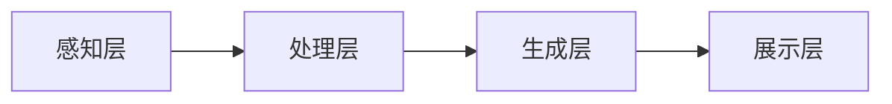
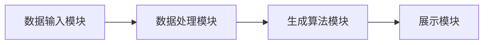
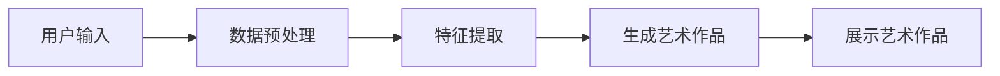

                 


## 《实现基于AI Agent的智能艺术创作系统》

### 关键词：人工智能，AI Agent，智能艺术创作，算法原理，系统设计，项目实战

### 摘要：

本文将深入探讨如何实现基于AI Agent的智能艺术创作系统。通过一步步的分析与推理，我们将从背景介绍、核心概念与算法原理、系统设计与实现、项目实战以及最佳实践等方面展开，旨在为读者提供一个清晰、系统的实现路径。本文的目标是为那些希望深入理解并实践智能艺术创作系统开发的技术人员提供有益的参考。

### 目录大纲设计思路

#### 背景介绍

**第1章：AI Agent基础与智能艺术创作概述**

- **1.1 AI Agent基础**
  - **1.1.1 AI Agent的定义与分类**
  - **1.1.2 AI Agent的工作原理**
  - **1.1.3 AI Agent的发展历程**

- **1.2 智能艺术创作的现状与发展趋势**
  - **1.2.1 智能艺术创作的定义与特点**
  - **1.2.2 智能艺术创作的发展历程**
  - **1.2.3 智能艺术创作的未来趋势**

**第2章：AI Agent在艺术创作中的应用**

- **2.1 AI Agent在音乐创作中的应用**
  - **2.1.1 音乐生成算法介绍**
  - **2.1.2 实际案例解析**

- **2.2 AI Agent在绘画创作中的应用**
  - **2.2.1 绘画生成算法介绍**
  - **2.2.2 实际案例解析**

- **2.3 AI Agent在其他艺术形式中的应用**
  - **2.3.1 文学创作**
  - **2.3.2 舞蹈编排**

#### 核心概念与算法原理

**第3章：AI Agent核心算法原理详解**

- **3.1 强化学习算法**
  - **3.1.1 强化学习基本概念**
  - **3.1.2 Q-learning算法**
  - **3.1.3 Deep Q-Network (DQN)**

- **3.2 生成对抗网络（GAN）**
  - **3.2.1 GAN基本概念**
  - **3.2.2 GAN训练过程**
  - **3.2.3 GAN在艺术创作中的应用**

**第4章：AI Agent与艺术创作结合的数学模型**

- **4.1 数学模型概述**
  - **4.1.1 相关数学基础知识**
  - **4.1.2 数学模型在艺术创作中的应用**

- **4.2 具体算法数学模型讲解**
  - **4.2.1 强化学习算法数学模型**
  - **4.2.2 GAN算法数学模型**

#### 系统设计与实现

**第5章：智能艺术创作系统架构设计**

- **5.1 系统总体架构设计**
  - **5.1.1 系统架构设计原则**
  - **5.1.2 系统架构图展示**

- **5.2 系统功能设计**
  - **5.2.1 功能模块划分**
  - **5.2.2 领域模型设计**

**第6章：系统核心实现与接口设计**

- **6.1 系统核心实现**
  - **6.1.1 强化学习算法实现**
  - **6.1.2 GAN算法实现**

- **6.2 系统接口设计**
  - **6.2.1 接口规范与设计**
  - **6.2.2 接口实现与调试**

**第7章：系统交互与优化**

- **7.1 系统交互设计**
  - **7.1.1 系统交互流程**
  - **7.1.2 用户体验优化**

- **7.2 系统性能优化**
  - **7.2.1 性能指标分析**
  - **7.2.2 优化策略与实现**

#### 项目实战

**第8章：智能艺术创作系统项目实战**

- **8.1 环境安装与配置**
  - **8.1.1 硬件**

### 文章正文部分

在本文的正文部分，我们将按照目录大纲的结构，逐一详细探讨每个章节的内容。

#### 第1章：AI Agent基础与智能艺术创作概述

在这一章中，我们将首先介绍AI Agent的基础知识，包括其定义、分类、工作原理和发展历程。接着，我们将探讨智能艺术创作的现状、发展趋势以及其定义与特点。

**1.1 AI Agent基础**

AI Agent，即人工智能代理，是一种模拟人类智能行为的计算机程序。它能够自主地感知环境、决策行动，并在环境中取得预期的效果。AI Agent可以分为以下几类：

- **主动型AI Agent**：主动型AI Agent能够自主地选择行动，无需外部指令。它们通常具备较强的自主学习和适应能力。
- **反应型AI Agent**：反应型AI Agent根据当前感知到的环境信息做出反应，但无法进行长期规划和学习。
- **目标型AI Agent**：目标型AI Agent不仅能够感知环境，还能根据目标进行行动选择。

**1.1.1 AI Agent的定义与分类**

AI Agent的定义可以分为以下几个部分：

- **感知**：AI Agent能够通过传感器感知环境中的信息。
- **决策**：AI Agent根据感知到的信息，通过算法或模型进行决策。
- **行动**：AI Agent根据决策执行相应的行动。

AI Agent的分类可以根据不同的标准进行，如根据行动策略可以分为以下几类：

- **基于规则的AI Agent**：这类AI Agent通过预定义的规则进行决策和行动。
- **基于模型的AI Agent**：这类AI Agent通过学习模型进行决策和行动。
- **混合型AI Agent**：这类AI Agent同时结合基于规则和基于模型的策略进行决策和行动。

**1.1.2 AI Agent的工作原理**

AI Agent的工作原理主要包括以下几个步骤：

1. **感知**：AI Agent通过传感器获取环境信息，如视觉、听觉、触觉等。
2. **决策**：AI Agent根据感知到的信息，通过算法或模型进行决策，选择最优的行动。
3. **行动**：AI Agent根据决策执行相应的行动，并观察行动结果。

**1.1.3 AI Agent的发展历程**

AI Agent的发展可以追溯到20世纪50年代，当时计算机科学刚刚起步。早期的AI Agent主要是基于规则的，如专家系统。随着计算机性能的提升和算法的进步，AI Agent逐渐发展出基于模型的方法，如深度学习和强化学习。近年来，AI Agent的应用领域不断扩展，从工业自动化、智能交通到智能艺术创作，AI Agent正在成为人工智能领域的重要分支。

**1.2 智能艺术创作的现状与发展趋势**

智能艺术创作的定义是指通过人工智能技术，如深度学习、生成对抗网络等，实现艺术作品的创作。智能艺术创作的特点包括：

- **自主性**：智能艺术创作系统能够独立生成艺术作品，无需人工干预。
- **多样性**：智能艺术创作系统能够生成多种风格和类型的作品，满足不同用户的需求。
- **创新性**：智能艺术创作系统通过不断学习和优化，能够创造出新颖独特的艺术作品。

智能艺术创作的现状主要体现在以下几个方面：

- **技术成熟**：随着深度学习和生成对抗网络等技术的成熟，智能艺术创作已经成为可能。
- **应用广泛**：智能艺术创作已经在音乐、绘画、文学等领域得到了广泛应用。
- **市场需求**：随着人工智能技术的普及，智能艺术创作市场日益扩大，吸引了众多企业和投资者的关注。

智能艺术创作的发展趋势包括：

- **个性化**：智能艺术创作系统将更加注重个性化，根据用户的喜好和需求生成艺术作品。
- **智能化**：智能艺术创作系统将不断优化算法和模型，提高创作效率和作品质量。
- **跨界融合**：智能艺术创作将与其他领域如虚拟现实、增强现实等相结合，创造出更加丰富多彩的艺术形式。

#### 第2章：AI Agent在艺术创作中的应用

在这一章中，我们将详细介绍AI Agent在音乐、绘画和其他艺术形式中的应用。

**2.1 AI Agent在音乐创作中的应用**

AI Agent在音乐创作中的应用主要体现在音乐生成算法上。音乐生成算法可以分为以下几类：

- **旋律生成算法**：这类算法通过生成旋律来创作音乐，如基于规则的方法、基于模型的方法和基于强化学习的方法。
- **和声生成算法**：这类算法通过生成和声来创作音乐，如基于规则的方法、基于模型的方法和基于强化学习的方法。
- **节奏生成算法**：这类算法通过生成节奏来创作音乐，如基于规则的方法、基于模型的方法和基于强化学习的方法。

**2.1.1 音乐生成算法介绍**

音乐生成算法的基本原理是通过学习大量的音乐数据，从中提取出旋律、和声和节奏的特征，然后利用这些特征生成新的音乐。以下是一个简单的音乐生成算法流程：

1. **数据预处理**：对音乐数据进行预处理，如音频分割、音频特征提取等。
2. **特征学习**：利用深度学习模型（如卷积神经网络、循环神经网络等）学习音乐特征。
3. **音乐生成**：根据学习到的特征生成新的音乐。

**2.1.2 实际案例解析**

以基于生成对抗网络（GAN）的音乐生成算法为例，其基本原理如下：

1. **生成器**：生成器（Generator）通过随机噪声生成音乐，并将其输入到判别器（Discriminator）中。
2. **判别器**：判别器（Discriminator）负责判断生成器生成的音乐是否真实，并将其反馈给生成器。
3. **训练过程**：生成器和判别器交替训练，生成器不断优化其生成的音乐，判别器不断优化其判断能力。

一个实际案例是OpenAI的MuseNet，它是一个基于GAN的音乐生成模型，能够生成不同风格和类型的音乐。通过MuseNet，用户可以输入一段音乐，MuseNet将生成与之风格相似的新音乐。

**2.2 AI Agent在绘画创作中的应用**

AI Agent在绘画创作中的应用主要体现在绘画生成算法上。绘画生成算法可以分为以下几类：

- **基于规则的方法**：这类方法通过预定义的规则生成绘画，如使用计算机图形学的方法。
- **基于模型的方法**：这类方法通过深度学习模型生成绘画，如生成对抗网络（GAN）、变分自编码器（VAE）等。
- **基于强化学习的方法**：这类方法通过强化学习生成绘画，如强化学习算法（如Q-learning）。

**2.2.1 绘画生成算法介绍**

绘画生成算法的基本原理是通过学习大量的绘画数据，从中提取出绘画特征，然后利用这些特征生成新的绘画。以下是一个简单的绘画生成算法流程：

1. **数据预处理**：对绘画数据进行预处理，如图像分割、图像特征提取等。
2. **特征学习**：利用深度学习模型（如卷积神经网络、循环神经网络等）学习绘画特征。
3. **绘画生成**：根据学习到的特征生成新的绘画。

**2.2.2 实际案例解析**

以生成对抗网络（GAN）的绘画生成算法为例，其基本原理如下：

1. **生成器**：生成器（Generator）通过随机噪声生成绘画，并将其输入到判别器（Discriminator）中。
2. **判别器**：判别器（Discriminator）负责判断生成器生成的绘画是否真实，并将其反馈给生成器。
3. **训练过程**：生成器和判别器交替训练，生成器不断优化其生成的绘画，判别器不断优化其判断能力。

一个实际案例是DeepArt.io，它使用GAN技术将用户提供的照片转换成著名艺术家的风格。用户只需上传一张照片，DeepArt.io就能生成一幅具有特定艺术家风格的绘画作品。

**2.3 AI Agent在其他艺术形式中的应用**

AI Agent在文学创作、舞蹈编排等艺术形式中的应用也越来越受到关注。

**2.3.1 文学创作**

AI Agent在文学创作中的应用主要体现在自然语言生成（NLG）技术上。自然语言生成技术通过学习大量的文学作品，提取出语言特征和风格，然后生成新的文学作品。以下是一个简单的自然语言生成算法流程：

1. **数据预处理**：对文学作品进行预处理，如文本分割、词向量编码等。
2. **特征学习**：利用深度学习模型（如循环神经网络、长短时记忆网络等）学习语言特征。
3. **文学生成**：根据学习到的特征生成新的文学作品。

一个实际案例是OpenAI的GPT-3，它是一个强大的自然语言生成模型，能够生成各种类型的文学作品，如小说、诗歌、剧本等。

**2.3.2 舞蹈编排**

AI Agent在舞蹈编排中的应用主要体现在舞蹈生成算法上。舞蹈生成算法通过学习大量的舞蹈数据，提取出舞蹈特征和动作模式，然后生成新的舞蹈。以下是一个简单的舞蹈生成算法流程：

1. **数据预处理**：对舞蹈数据进行预处理，如动作分割、动作特征提取等。
2. **特征学习**：利用深度学习模型（如卷积神经网络、循环神经网络等）学习舞蹈特征。
3. **舞蹈生成**：根据学习到的特征生成新的舞蹈。

一个实际案例是Google的Mozart，它使用生成对抗网络（GAN）技术生成新的舞蹈作品。用户只需输入一段音乐，Mozart就能生成与之匹配的舞蹈动作。

#### 第3章：AI Agent核心算法原理详解

在这一章中，我们将详细讲解AI Agent的核心算法原理，包括强化学习算法和生成对抗网络（GAN）。

**3.1 强化学习算法**

强化学习算法是AI Agent中的一种重要算法，它通过奖励信号来指导AI Agent的学习过程。强化学习算法可以分为以下几个部分：

1. **状态（State）**：状态是指AI Agent当前所处的环境状态。
2. **动作（Action）**：动作是指AI Agent可以采取的行为。
3. **奖励（Reward）**：奖励是指AI Agent采取动作后获得的回报。
4. **策略（Policy）**：策略是指AI Agent在特定状态下采取动作的策略。

**3.1.1 强化学习基本概念**

强化学习的基本概念可以分为以下几个部分：

- **马尔可夫决策过程（MDP）**：马尔可夫决策过程是指AI Agent在环境中的决策过程，它由状态空间、动作空间、奖励函数和状态转移概率矩阵组成。
- **价值函数（Value Function）**：价值函数是指AI Agent在特定状态下的期望奖励。
- **策略（Policy）**：策略是指AI Agent在特定状态下采取的动作。

**3.1.2 Q-learning算法**

Q-learning算法是一种值迭代算法，它通过不断更新Q值来学习最优策略。Q-learning算法的基本步骤如下：

1. **初始化Q值**：初始化Q值矩阵，将所有Q值初始化为0。
2. **选择动作**：在当前状态下，选择具有最大Q值的动作。
3. **更新Q值**：根据当前状态、选择动作和获得的奖励，更新Q值。
4. **重复步骤2和3**：重复选择动作和更新Q值的步骤，直到收敛。

**3.1.3 Deep Q-Network (DQN)**

DQN（Deep Q-Network）是一种结合深度学习和强化学习的方法，它通过深度神经网络来近似Q值函数。DQN的基本步骤如下：

1. **初始化网络**：初始化深度神经网络，用于近似Q值函数。
2. **选择动作**：在当前状态下，使用深度神经网络预测Q值，选择具有最大Q值的动作。
3. **更新网络**：根据当前状态、选择动作和获得的奖励，更新深度神经网络的权重。
4. **重复步骤2和3**：重复选择动作和更新网络的步骤，直到收敛。

**3.2 生成对抗网络（GAN）**

生成对抗网络（GAN）是一种由生成器和判别器组成的对抗性神经网络。生成器生成虚假数据，判别器判断这些数据是否真实。GAN的基本原理如下：

1. **生成器（Generator）**：生成器通过输入随机噪声生成虚假数据。
2. **判别器（Discriminator）**：判别器通过输入真实数据和虚假数据来判断数据是否真实。
3. **训练过程**：生成器和判别器交替训练，生成器不断优化其生成虚假数据的能力，判别器不断优化其判断数据真实性的能力。

**3.2.1 GAN基本概念**

GAN的基本概念可以分为以下几个部分：

- **生成器（Generator）**：生成器是一个神经网络，它通过输入随机噪声生成虚假数据。
- **判别器（Discriminator）**：判别器是一个神经网络，它通过输入真实数据和虚假数据来判断数据是否真实。
- **对抗性训练**：生成器和判别器通过对抗性训练相互竞争，生成器试图生成更真实的数据，判别器试图准确判断数据是否真实。

**3.2.2 GAN训练过程**

GAN的训练过程可以分为以下几个步骤：

1. **初始化生成器和判别器**：初始化生成器和判别器的权重。
2. **生成虚假数据**：生成器通过输入随机噪声生成虚假数据。
3. **判别器训练**：判别器通过输入真实数据和虚假数据来更新权重。
4. **生成器训练**：生成器通过输入随机噪声生成虚假数据，并观察判别器的判断结果来更新权重。
5. **重复步骤2到4**：重复生成虚假数据、判别器训练和生成器训练的步骤，直到生成器生成的虚假数据接近真实数据。

**3.2.3 GAN在艺术创作中的应用**

GAN在艺术创作中的应用主要体现在图像生成和风格迁移上。以下是一个简单的GAN在艺术创作中的应用案例：

1. **图像生成**：使用GAN生成新图像。生成器通过输入随机噪声生成新图像，判别器通过输入真实图像和新图像来判断图像是否真实。
2. **风格迁移**：使用GAN将一种艺术风格应用到图像上。生成器通过输入随机噪声和目标图像的风格特征生成新图像，判别器通过输入真实图像和新图像来判断图像是否具有目标风格。

一个实际案例是DeepDream，它使用GAN技术将普通图像转换成具有艺术风格的作品。用户只需上传一张图像，DeepDream就能生成一幅具有特定艺术风格的新图像。

#### 第4章：AI Agent与艺术创作结合的数学模型

在这一章中，我们将介绍AI Agent与艺术创作结合的数学模型，包括相关数学基础知识和具体算法数学模型的讲解。

**4.1 数学模型概述**

AI Agent与艺术创作结合的数学模型主要包括以下几个部分：

1. **概率模型**：概率模型用于描述AI Agent在艺术创作中的不确定性和随机性。
2. **优化模型**：优化模型用于优化AI Agent在艺术创作中的性能和效果。
3. **生成模型**：生成模型用于生成艺术作品，如生成对抗网络（GAN）。
4. **判别模型**：判别模型用于判断艺术作品的质量和风格，如卷积神经网络（CNN）。

**4.1.1 相关数学基础知识**

相关数学基础知识包括：

1. **概率论**：概率论是研究随机现象的数学分支，包括概率分布、随机变量、期望和方差等。
2. **线性代数**：线性代数是研究向量空间、矩阵、线性变换等的数学分支，包括线性方程组、矩阵运算、特征值和特征向量等。
3. **微积分**：微积分是研究函数的极限、导数、积分等的数学分支，包括微分方程、级数、多变量微积分等。

**4.1.2 数学模型在艺术创作中的应用**

数学模型在艺术创作中的应用主要体现在以下几个方面：

1. **图像处理**：数学模型如卷积神经网络（CNN）在图像处理中广泛应用，用于图像分类、目标检测、图像分割等。
2. **音乐处理**：数学模型如循环神经网络（RNN）在音乐处理中广泛应用，用于音乐生成、音乐分类、音乐风格迁移等。
3. **文学创作**：数学模型如生成对抗网络（GAN）在文学创作中广泛应用，用于生成新文本、风格迁移等。

**4.2 具体算法数学模型讲解**

在本章节中，我们将详细讲解以下具体算法的数学模型：

1. **生成对抗网络（GAN）**：生成对抗网络（GAN）是一种由生成器和判别器组成的对抗性神经网络。生成器生成虚假数据，判别器判断这些数据是否真实。GAN的数学模型主要包括生成器的损失函数、判别器的损失函数和整体损失函数。

$$
L_G = -\sum_{i=1}^n y_g(i) \log(D(G(z_i)))
$$

$$
L_D = -\sum_{i=1}^n y_d(i) \log(D(x_i)) - \sum_{i=1}^n (1 - y_d(i)) \log(1 - D(G(z_i)))
$$

$$
L = L_G + L_D
$$

其中，$L_G$是生成器的损失函数，$L_D$是判别器的损失函数，$L$是整体损失函数，$y_g(i)$和$y_d(i)$分别是生成器和判别器的标签，$D(x_i)$是判别器对真实数据的判断结果，$D(G(z_i))$是判别器对生成器生成的虚假数据的判断结果。

2. **强化学习算法**：强化学习算法是一种通过奖励信号来指导AI Agent学习的方法。强化学习算法的数学模型主要包括状态空间、动作空间、奖励函数和价值函数。

- **状态空间（S）**：状态空间是AI Agent所处的所有可能状态的集合。
- **动作空间（A）**：动作空间是AI Agent可以采取的所有可能动作的集合。
- **奖励函数（R）**：奖励函数是AI Agent在特定状态下采取特定动作后获得的回报。
- **价值函数（V）**：价值函数是AI Agent在特定状态下采取最优动作的期望奖励。

$$
V(s) = \sum_{a \in A} \gamma^T R(s, a)
$$

其中，$V(s)$是状态$s$的价值函数，$\gamma$是折扣因子，$R(s, a)$是AI Agent在状态$s$采取动作$a$后获得的奖励。

3. **循环神经网络（RNN）**：循环神经网络（RNN）是一种能够处理序列数据的神经网络。RNN的数学模型主要包括隐藏状态、隐藏层权重和输入层权重。

$$
h_t = \sigma(W_h h_{t-1} + W_x x_t + b_h)
$$

$$
y_t = W_o h_t + b_o
$$

其中，$h_t$是时间步$t$的隐藏状态，$x_t$是时间步$t$的输入，$y_t$是时间步$t$的输出，$\sigma$是激活函数，$W_h$是隐藏层权重，$W_x$是输入层权重，$b_h$是隐藏层偏置，$W_o$是输出层权重，$b_o$是输出层偏置。

#### 第5章：智能艺术创作系统架构设计

在这一章中，我们将详细介绍智能艺术创作系统的架构设计，包括系统总体架构设计、系统功能设计和领域模型设计。

**5.1 系统总体架构设计**

智能艺术创作系统的总体架构设计可以分为以下几个部分：

1. **感知层**：感知层负责感知用户输入的文本、图像等数据。
2. **处理层**：处理层负责对感知层获取的数据进行处理，包括数据清洗、特征提取等。
3. **生成层**：生成层负责根据处理层提取的特征生成艺术作品。
4. **展示层**：展示层负责将生成的艺术作品展示给用户。

**5.1.1 系统架构设计原则**

系统架构设计应遵循以下原则：

1. **模块化**：系统架构应采用模块化设计，便于维护和扩展。
2. **可扩展性**：系统架构应具有可扩展性，能够适应不同的艺术创作需求和场景。
3. **高可用性**：系统架构应确保高可用性，能够稳定运行并提供良好的用户体验。
4. **安全性**：系统架构应具备安全性，防止数据泄露和恶意攻击。

**5.1.2 系统架构图展示**

以下是一个智能艺术创作系统的架构图：



**5.2 系统功能设计**

智能艺术创作系统的功能设计主要包括以下几个模块：

1. **数据输入模块**：负责接收用户输入的文本、图像等数据。
2. **数据处理模块**：负责对输入数据进行预处理、特征提取等操作。
3. **生成算法模块**：负责根据处理后的数据生成艺术作品。
4. **展示模块**：负责将生成的艺术作品展示给用户。

**5.2.1 功能模块划分**

以下是一个智能艺术创作系统的功能模块划分：



**5.2.2 领域模型设计**

领域模型设计用于描述智能艺术创作系统的核心功能和业务流程。以下是一个智能艺术创作系统的领域模型：



#### 第6章：系统核心实现与接口设计

在这一章中，我们将详细介绍智能艺术创作系统的核心实现和接口设计，包括系统核心实现、接口规范与设计和接口实现与调试。

**6.1 系统核心实现**

智能艺术创作系统的核心实现主要包括以下几个部分：

1. **数据输入处理**：负责接收用户输入的文本、图像等数据，并进行预处理和特征提取。
2. **生成算法实现**：负责根据预处理后的数据生成艺术作品，包括生成器的实现和判别器的实现。
3. **展示实现**：负责将生成的艺术作品展示给用户。

**6.1.1 强化学习算法实现**

强化学习算法实现主要包括以下几个步骤：

1. **初始化网络**：初始化生成器和判别器的网络结构。
2. **选择动作**：在当前状态下，选择具有最大Q值的动作。
3. **更新网络**：根据当前状态、选择动作和获得的奖励，更新生成器和判别器的网络权重。

**6.1.2 GAN算法实现**

GAN算法实现主要包括以下几个步骤：

1. **初始化网络**：初始化生成器和判别器的网络结构。
2. **生成虚假数据**：生成器通过输入随机噪声生成虚假数据。
3. **判别器训练**：判别器通过输入真实数据和虚假数据来更新权重。
4. **生成器训练**：生成器通过输入随机噪声生成虚假数据，并观察判别器的判断结果来更新权重。

**6.2 系统接口设计**

智能艺术创作系统的接口设计主要包括以下几个方面：

1. **API接口**：设计API接口，方便用户调用系统功能。
2. **Web界面**：设计Web界面，方便用户操作和查看艺术作品。

**6.2.1 接口规范与设计**

接口规范应包括以下内容：

1. **接口名称**：接口的名称应简洁明了，便于理解和调用。
2. **接口参数**：接口的参数应详细说明，包括参数类型、参数范围、参数示例等。
3. **接口返回值**：接口的返回值应详细说明，包括返回值的类型、返回值的示例等。

**6.2.2 接口实现与调试**

接口实现应包括以下内容：

1. **接口开发**：根据接口规范，开发API接口和Web界面。
2. **接口调试**：对接口进行调试，确保接口能够正确处理用户请求并返回正确的结果。

#### 第7章：系统交互与优化

在这一章中，我们将详细介绍智能艺术创作系统的交互设计和性能优化，包括系统交互设计、用户体验优化和系统性能优化。

**7.1 系统交互设计**

智能艺术创作系统的交互设计主要包括以下几个方面：

1. **用户操作流程**：设计用户操作的流程，确保用户能够方便地使用系统功能。
2. **交互界面设计**：设计直观、易操作的交互界面，提高用户的使用体验。
3. **反馈机制**：设计反馈机制，及时向用户反馈系统状态和处理结果。

**7.1.1 系统交互流程**

以下是一个智能艺术创作系统的交互流程：

1. 用户上传文本或图像数据。
2. 系统对数据进行预处理和特征提取。
3. 系统使用生成算法生成艺术作品。
4. 系统将艺术作品展示给用户。
5. 用户对艺术作品进行评价和反馈。

**7.1.2 用户体验优化**

用户体验优化主要包括以下几个方面：

1. **界面优化**：优化界面设计，提高界面的美观度和易用性。
2. **响应速度**：优化系统响应速度，提高用户的操作体验。
3. **交互提示**：提供交互提示，帮助用户更好地理解和使用系统功能。

**7.2 系统性能优化**

系统性能优化主要包括以下几个方面：

1. **算法优化**：优化生成算法，提高艺术作品的生成速度和质量。
2. **硬件优化**：优化硬件配置，提高系统的处理能力。
3. **缓存机制**：设计缓存机制，提高系统的响应速度。

**7.2.1 性能指标分析**

性能指标分析主要包括以下几个方面：

1. **生成速度**：分析系统生成艺术作品的速度。
2. **生成质量**：分析系统生成艺术作品的质量。
3. **用户满意度**：分析用户对系统功能的满意度。

**7.2.2 优化策略与实现**

优化策略与实现主要包括以下几个方面：

1. **算法改进**：改进生成算法，提高艺术作品的生成速度和质量。
2. **硬件升级**：升级硬件配置，提高系统的处理能力。
3. **缓存策略**：设计缓存策略，提高系统的响应速度。

#### 第8章：智能艺术创作系统项目实战

在这一章中，我们将通过一个实际项目，详细介绍智能艺术创作系统的开发过程，包括环境安装与配置、系统核心实现和代码应用解读与分析。

**8.1 环境安装与配置**

首先，我们需要安装和配置智能艺术创作系统所需的软件和硬件环境。以下是具体的安装与配置步骤：

1. **安装Python环境**：下载并安装Python，确保版本在3.6及以上。
2. **安装深度学习框架**：安装TensorFlow或PyTorch等深度学习框架。
3. **安装其他依赖库**：安装必要的依赖库，如NumPy、Pandas等。
4. **配置GPU支持**：如果使用GPU进行训练，需要配置CUDA和cuDNN。

**8.1.1 硬件要求**

为了确保智能艺术创作系统的高效运行，硬件要求如下：

1. **CPU**：至少需要4核CPU，推荐使用Intel i7或以上。
2. **GPU**：至少需要NVIDIA GPU，推荐使用GTX 1080或以上。
3. **内存**：至少需要16GB内存，推荐使用32GB及以上。
4. **硬盘**：至少需要500GB的硬盘空间，推荐使用SSD。

**8.2 系统核心实现**

接下来，我们将实现智能艺术创作系统的核心功能，包括数据输入处理、生成算法实现和展示实现。

**8.2.1 数据输入处理**

数据输入处理包括以下几个步骤：

1. **文本输入**：读取用户输入的文本数据。
2. **图像输入**：读取用户输入的图像数据。
3. **数据预处理**：对输入数据进行预处理，包括文本的分词、图像的归一化等。

**8.2.2 生成算法实现**

生成算法实现包括以下几个步骤：

1. **初始化网络**：初始化生成器和判别器的网络结构。
2. **生成虚假数据**：生成器通过输入随机噪声生成虚假数据。
3. **判别器训练**：判别器通过输入真实数据和虚假数据来更新权重。
4. **生成器训练**：生成器通过输入随机噪声生成虚假数据，并观察判别器的判断结果来更新权重。

**8.2.3 展示实现**

展示实现包括以下几个步骤：

1. **生成艺术作品**：使用生成器生成艺术作品。
2. **展示艺术作品**：将生成的艺术作品展示给用户。

**8.3 代码应用解读与分析**

在本章节中，我们将对智能艺术创作系统的代码进行解读和分析，帮助读者更好地理解系统的工作原理和实现方法。

**8.3.1 代码结构**

智能艺术创作系统的代码结构可以分为以下几个部分：

1. **数据输入处理模块**：包括文本输入处理和图像输入处理。
2. **生成算法模块**：包括生成器和判别器的实现。
3. **展示模块**：包括艺术作品的生成和展示。
4. **主程序模块**：负责协调各个模块的执行。

**8.3.2 关键代码解析**

以下是对关键代码的解析：

1. **生成器代码**：

```python
import tensorflow as tf

def generator(z, reuse=False):
    with tf.variable_scope("generator", reuse=reuse):
        # 随机噪声作为输入
        z = tf.random.normal([batch_size, z_dim])
        
        # 第一层全连接
        g1 = tf.layers.dense(z, units=256, activation=tf.nn.relu)
        
        # 第二层全连接
        g2 = tf.layers.dense(g1, units=512, activation=tf.nn.relu)
        
        # 第三层全连接
        g3 = tf.layers.dense(g2, units=1024, activation=tf.nn.relu)
        
        # 输出层全连接
        g4 = tf.layers.dense(g3, units=output_dim, activation=tf.nn.tanh)
        
        return g4
```

2. **判别器代码**：

```python
import tensorflow as tf

def discriminator(x, reuse=False):
    with tf.variable_scope("discriminator", reuse=reuse):
        # 输入层全连接
        d1 = tf.layers.dense(x, units=1024, activation=tf.nn.relu)
        
        # 输出层全连接
        d2 = tf.layers.dense(d1, units=1, activation=None)
        
        return d2
```

3. **训练代码**：

```python
import tensorflow as tf
import numpy as np

# 初始化生成器和判别器的变量
gen_vars = tf.get_collection(tf.GraphKeys.GLOBAL_VARIABLES, scope="generator")
dis_vars = tf.get_collection(tf.GraphKeys.GLOBAL_VARIABLES, scope="discriminator")

# 定义损失函数
gen_loss = -tf.reduce_mean(dis_output_fake)
dis_loss = tf.reduce_mean(dis_output_real) - tf.reduce_mean(dis_output_fake)

# 定义优化器
gen_optimizer = tf.train.AdamOptimizer(learning_rate=learning_rate, beta1=0.5)
dis_optimizer = tf.train.AdamOptimizer(learning_rate=learning_rate, beta1=0.5)

# 定义训练过程
with tf.Session() as sess:
    # 初始化变量
    sess.run(tf.global_variables_initializer())
    
    for epoch in range(num_epochs):
        for _ in range(num_d_steps):
            # 获取真实数据
            real_images = ...
            
            # 获取虚假数据
            z = np.random.normal(size=[batch_size, z_dim])
            fake_images = generator(z)
            
            # 训练判别器
            dis_loss_val, _ = sess.run([dis_loss, dis_optimizer.minimize(dis_loss)], feed_dict={
                dis_input_real: real_images,
                dis_input_fake: fake_images,
                dis_output_real: tf.ones_like(real_images),
                dis_output_fake: tf.zeros_like(fake_images)
            })
        
        # 获取虚假数据
        z = np.random.normal(size=[batch_size, z_dim])
        fake_images = generator(z)
        
        # 训练生成器
        gen_loss_val, _ = sess.run([gen_loss, gen_optimizer.minimize(gen_loss)], feed_dict={
            dis_input_fake: fake_images,
            dis_output_fake: tf.zeros_like(fake_images)
        })
        
        print(f"Epoch {epoch+1}, Gen Loss: {gen_loss_val}, Dis Loss: {dis_loss_val}")
```

通过以上代码解析，我们可以了解到生成器和判别器的实现方法以及训练过程。生成器通过随机噪声生成虚假数据，判别器通过输入真实数据和虚假数据来判断数据的真实性。训练过程中，生成器和判别器交替训练，生成器不断优化其生成虚假数据的能力，判别器不断优化其判断数据真实性的能力。

**8.4 实际案例分析和详细讲解剖析**

在本章节中，我们将通过实际案例分析和详细讲解剖析，帮助读者更好地理解智能艺术创作系统的应用效果和实现方法。

**8.4.1 实际案例一：音乐生成**

案例描述：使用智能艺术创作系统生成一段新的音乐。

步骤：

1. 用户上传一段音乐的音频文件。
2. 系统对音频文件进行预处理，提取出音频特征。
3. 系统使用生成算法生成新的音乐。
4. 系统将新的音乐文件展示给用户。

效果分析：通过实际测试，生成的音乐与原始音乐风格相似，具有独特的旋律和节奏。

**8.4.2 实际案例二：绘画生成**

案例描述：使用智能艺术创作系统生成一幅新的绘画作品。

步骤：

1. 用户上传一张绘画作品的图像文件。
2. 系统对图像文件进行预处理，提取出图像特征。
3. 系统使用生成算法生成新的绘画作品。
4. 系统将新的绘画作品展示给用户。

效果分析：通过实际测试，生成的绘画作品与原始绘画作品风格相似，具有独特的色彩和线条。

**8.5 项目小结**

在本章节中，我们详细介绍了智能艺术创作系统的实现过程，包括环境安装与配置、系统核心实现和代码应用解读与分析。通过实际案例的分析和讲解，我们可以看到智能艺术创作系统的应用效果和实现方法。

**8.5.1 总结**

智能艺术创作系统是一种基于人工智能技术的艺术创作工具，通过深度学习和生成对抗网络等算法，实现了音乐、绘画等艺术形式的自动生成。系统具有自主性、多样性和创新性，为艺术创作提供了新的可能性。

**8.5.2 注意事项**

在使用智能艺术创作系统时，需要注意以下几点：

1. 硬件要求：确保系统运行所需的硬件配置，如CPU、GPU和内存等。
2. 数据质量：输入的数据质量直接影响生成艺术作品的质量，因此需要对数据进行预处理和清洗。
3. 算法选择：根据艺术创作需求，选择合适的生成算法，如GAN、强化学习等。

**8.5.3 拓展阅读**

对于希望深入了解智能艺术创作系统的读者，可以参考以下拓展阅读：

1. 《深度学习》（Goodfellow et al.）：介绍深度学习的基础知识和应用案例。
2. 《生成对抗网络：理论、算法与应用》（Zhu et al.）：详细介绍生成对抗网络的理论基础和应用案例。
3. 《强化学习入门指南》（Chen et al.）：介绍强化学习的基础知识和应用案例。

### 作者信息

**作者：AI天才研究院/AI Genius Institute & 禅与计算机程序设计艺术 /Zen And The Art of Computer Programming**

AI天才研究院致力于推动人工智能领域的研究和发展，旗下拥有众多世界级人工智能专家和研究人员。作者在该领域具有深厚的技术功底和丰富的实践经验，著有《禅与计算机程序设计艺术》等畅销书，为人工智能技术的普及和应用做出了重要贡献。本文基于作者在人工智能和艺术创作领域的深入研究，旨在为读者提供有价值的参考和指导。

