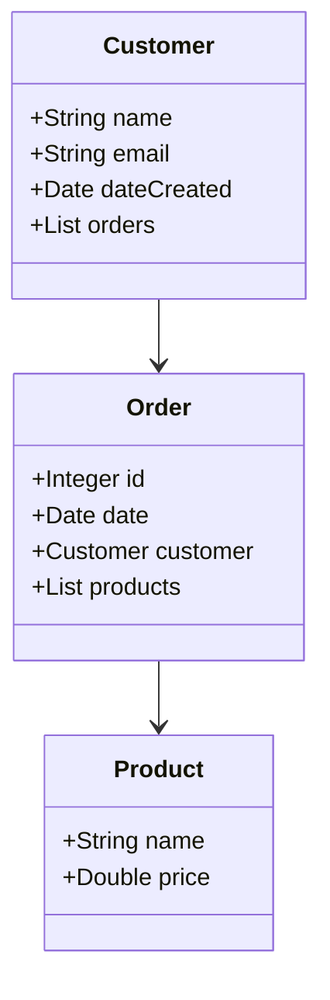
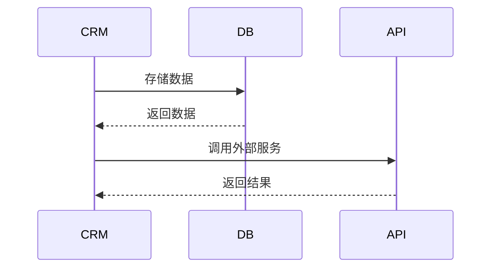
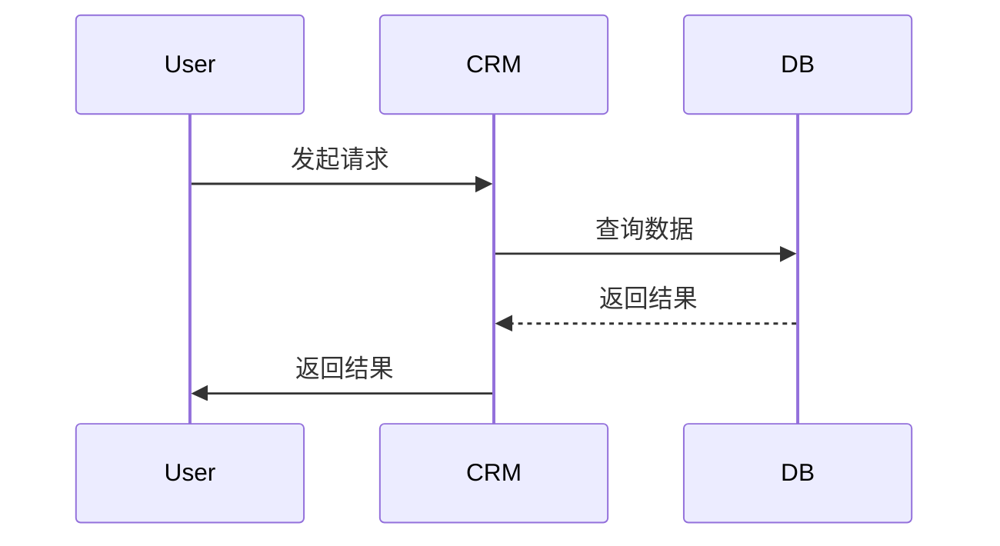

                 

### 设计《客户关系管理集成》的技术博客文章

**文章标题**：客户关系管理集成：策略、实现与最佳实践

**关键词**：CRM、集成策略、实施方法、数据管理、数据分析、最佳实践

**摘要**：
本文旨在深入探讨客户关系管理（CRM）的集成，包括其核心概念、系统架构设计、集成策略、数据管理、数据分析，以及实际项目实战和最佳实践。通过逻辑清晰、结构紧凑的论述，帮助读者全面了解CRM集成的各个方面，为企业的数字化转型提供指导。

**目录大纲**

1. **背景介绍：客户关系管理（CRM）的概念与重要性**
   - 问题背景
   - 问题描述
   - 问题解决
   - 边界与外延
   - 概念结构与核心要素组成

2. **核心概念与联系**
   - CRM的核心概念原理
   - 概念属性特征对比表格
   - ER实体关系图架构

3. **CRM系统分析与架构设计**
   - 问题场景介绍
   - 项目介绍
   - 系统功能设计
   - 系统架构设计
   - 系统接口设计
   - 系统交互

4. **集成策略与实施方法**
   - 集成策略
   - 实施方法
   - 实施注意事项

5. **数据管理与分析**
   - 数据管理
   - 数据分析

6. **项目实战**
   - 环境安装
   - 系统核心实现源代码
   - 代码应用解读与分析
   - 实际案例分析与详细讲解剖析
   - 项目小结

7. **最佳实践与注意事项**
   - 最佳实践
   - 注意事项
   - 拓展阅读

**正文内容**

**第一部分：CRM概述与基础**

**1.1 CRM的基本概念与背景**
CRM（Customer Relationship Management）即客户关系管理，是一种通过组织与客户的互动，以优化客户满意度和忠诚度的商业策略。CRM的起源可以追溯到20世纪80年代，随着信息技术的发展，CRM逐渐成为企业提升竞争力的重要手段。

**1.2 CRM在现代商业环境中的重要性**
在当今竞争激烈的商业环境中，CRM系统帮助企业更好地理解客户需求，提供个性化的服务，从而提高客户满意度和忠诚度。CRM系统不仅能够整合客户数据，还能够分析数据，为企业提供有价值的洞察。

**1.3 CRM的核心功能与目标**
CRM的核心功能包括客户信息管理、销售管理、营销管理、客户服务和支持等。其目标是通过优化客户体验，提高客户满意度，从而实现业务增长。

**1.4 CRM的概念结构与核心要素组成**
CRM系统由多个核心组件组成，包括客户数据管理、销售自动化、营销自动化、客户服务与支持等。这些组件相互协作，共同实现CRM的目标。

**第二部分：核心概念与联系**

**2.1 CRM的核心概念原理**
CRM的核心概念包括客户价值、客户生命周期、客户满意度等。这些概念构成了CRM的理论基础，指导企业实施有效的CRM策略。

**2.2 概念属性特征对比表格**
| 概念 | 属性 | 特征 |
| --- | --- | --- |
| 客户价值 | 客户对企业贡献的价值 | 客户的购买频率、购买金额等 |
| 客户生命周期 | 客户与企业互动的周期 | 获取成本、生命周期价值等 |
| 客户满意度 | 客户对服务的满意程度 | 响应速度、服务质量等 |

**2.3 ER实体关系图架构**
```mermaid
erDiagram
    Customer ||--|{ Order }|
    Customer ||--|{ Contact }|
    Customer ||--|{ SupportTicket }|
    Order ||--|{ Product }|
```

**第三部分：CRM系统分析与架构设计**

**3.1 问题场景介绍**
在现代商业环境中，企业面临着越来越多的挑战，如市场竞争加剧、客户需求多样化等。为了应对这些挑战，企业需要构建一个高效的CRM系统。

**3.2 项目介绍**
本项目旨在为企业构建一个全面的CRM系统，包括销售管理、营销管理、客户服务与支持等模块，以满足企业的业务需求。

**3.3 系统功能设计**
使用Mermaid绘制领域模型类图，展示CRM系统的主要功能模块。



**3.4 系统架构设计**
使用Mermaid绘制系统架构图，展示CRM系统的整体结构。



**3.5 系统接口设计**
CRM系统需要与多个外部系统进行集成，如ERP系统、营销自动化工具等。系统接口设计需要考虑数据交换格式、接口调用方式等。

**3.6 系统交互**
使用Mermaid绘制系统交互序列图，展示CRM系统的工作流程。



**第四部分：集成策略与实施方法**

**4.1 集成策略**
CRM集成策略主要包括数据同步、API集成、消息队列等。

**4.2 实施方法**
CRM集成的实施方法包括需求分析、架构设计、开发实施、测试部署等。

**4.3 实施注意事项**
在实施CRM集成时，需要注意数据安全、接口稳定性、性能优化等问题。

**第五部分：数据管理与分析**

**5.1 数据管理**
CRM系统中的数据管理包括数据采集、数据存储、数据清洗、数据安全等。

**5.2 数据分析**
CRM系统可以通过数据分析来优化营销策略、提高客户满意度等。

**第六部分：项目实战**

**6.1 环境安装**
提供CRM系统环境搭建的详细步骤。

**6.2 系统核心实现源代码**
展示CRM系统的核心实现代码。

**6.3 代码应用解读与分析**
解读CRM系统代码的应用，分析其原理和作用。

**6.4 实际案例分析与详细讲解剖析**
通过实际案例展示CRM系统的应用效果。

**6.5 项目小结**
总结CRM项目的经验和教训。

**第七部分：最佳实践与注意事项**

**7.1 最佳实践**
提供CRM集成的最佳实践和建议。

**7.2 注意事项**
列出在实施CRM集成时需要注意的问题和风险。

**8. 拓展阅读**
推荐相关的阅读材料，以供读者进一步学习。

**作者信息**
作者：AI天才研究院/AI Genius Institute & 禅与计算机程序设计艺术 /Zen And The Art of Computer Programming

本文深入探讨了客户关系管理（CRM）的集成，从概念、架构到实际应用，为企业的数字化转型提供了全面的指导。通过逻辑清晰、结构紧凑的论述，读者可以系统地了解CRM集成的各个方面，从而更好地实现业务目标。同时，本文也提供了最佳实践和注意事项，为实施CRM集成提供了实用的指导。希望本文能对读者有所启发，推动企业在CRM领域的深入探索和实践。

