                 

### 第1章: 对话式AI Agent：概念与背景

#### 1.1.1 对话式AI Agent的定义

对话式AI Agent，又称聊天机器人，是一种基于人工智能技术的计算机程序，能够通过自然语言与人类进行交互，模拟人类的对话行为。这种技术借助自然语言处理（NLP）和机器学习算法，使得计算机能够理解用户的输入，生成合适的回复。

**核心概念与联系**

- **核心概念**：对话式AI Agent、自然语言处理（NLP）、机器学习算法
- **概念属性特征对比表格**

| 特征        | 对话式AI Agent | 自然语言处理（NLP） | 机器学习算法           |
| ----------- | -------------- | ------------------- | --------------------- |
| 功能        | 交互、对话     | 文本处理、理解      | 模型训练、预测        |
| 技术依赖    | NLP、ML算法    | 语言模型、词向量    | 神经网络、决策树等    |
| 应用场景    | 客户服务、助理 | 信息检索、问答系统  | 数据分析、推荐系统    |

**ER实体关系图架构**

```mermaid
erDiagram
  User ||--|{ Chatbot }|-- CustomerService
  User ||--|{ PersonalAssistant }|-- Education
  Chatbot ||--|{ NLProcess }|--> NaturalLanguageProcessing
  Chatbot ||--|{ MLModel }|--> MachineLearningAlgorithm
```

#### 1.1.2 对话式AI Agent的工作原理

对话式AI Agent的工作原理主要包括以下几个步骤：

1. **接收用户输入**：用户通过键盘、语音或其他输入方式与AI Agent进行交流。
2. **自然语言理解**：AI Agent使用自然语言处理技术解析用户的输入，提取关键信息。
3. **处理和生成回复**：AI Agent根据理解的结果，利用预训练的模型或算法生成回复，通常是通过机器学习模型训练得到。
4. **输出回复**：AI Agent将生成的回复返回给用户。

**算法原理讲解**

- **自然语言理解**：主要采用词嵌入技术，如Word2Vec、GloVe等，将单词映射为固定维度的向量表示。通过这些向量表示，AI Agent可以理解单词之间的语义关系，从而更好地理解用户的输入。
- **回复生成**：通常采用序列到序列（Seq2Seq）模型，如长短期记忆（LSTM）、变换器（Transformer）等。这些模型能够捕捉输入和输出之间的序列依赖关系，生成连贯且合适的回复。

**Mermaid流程图**

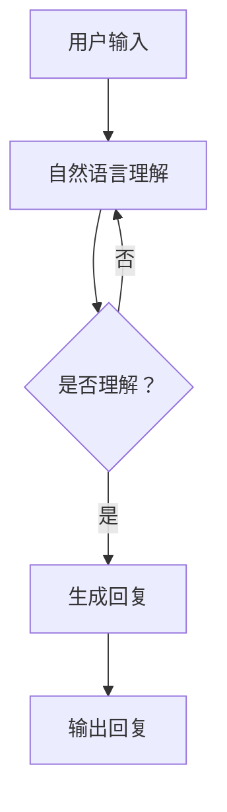

**Python源代码示例**

```python
import nltk
from nltk.tokenize import word_tokenize
from nltk.corpus import stopwords

# 用户输入
input_text = "我想知道今天的天气如何？"

# 分词
tokens = word_tokenize(input_text)

# 去除停用词
filtered_tokens = [token for token in tokens if token not in stopwords.words('english')]

# 词嵌入
vectorizer = nltk.Word2Vec(tokens, size=100)
input_vector = vectorizer.transform(filtered_tokens)

# 自然语言理解
# 假设已有训练好的模型
model = load_model('nlp_model')
understood = model.predict(input_vector)

# 回复生成
# 假设已有训练好的模型
reply_model = load_model('reply_model')
reply_vector = model.predict(input_vector)

# 输出回复
print("AI Agent回复：", reply_model.decode(reply_vector))
```

#### 1.1.3 对话式AI Agent的发展历程

1. **早期尝试**：从20世纪50年代开始，计算机科学家开始尝试通过编程实现简单的对话功能，如Eliza。
2. **规则基础模型**：20世纪80年代，基于规则的聊天机器人开始出现，它们通过预设的规则和模板来生成回复。
3. **统计模型**：21世纪初，统计模型（如基于贝叶斯算法的模型）开始用于聊天机器人。
4. **深度学习**：近年来，深度学习技术（如循环神经网络RNN、长短期记忆LSTM、变换器Transformer）的引入，使得聊天机器人的对话能力有了质的飞跃。

**ER实体关系图架构**

```mermaid
erDiagram
  EarlyAttempt ||--|{ RuleBasedModel }|--> StatisticalModel
  StatisticalModel ||--|{ DeepLearningModel }|--> CurrentChatbot
```

#### 1.1.4 对话式AI Agent的应用场景

对话式AI Agent在多个领域得到了广泛应用，包括但不限于：

1. **客户服务**：提供24/7的在线客户支持，解答常见问题，提高客户满意度。
2. **个人助理**：帮助用户管理日程、提醒事项，甚至提供生活建议。
3. **教育领域**：辅助学生进行语言学习，提供个性化教学。
4. **娱乐**：设计成游戏伙伴或虚拟偶像，提供娱乐互动。

**系统分析与架构设计方案**

**问题场景介绍**：随着互联网的普及，用户对于交互体验的要求越来越高，传统的人工客服和简单的FAQ系统已经无法满足用户的需求。对话式AI Agent作为一种智能交互工具，能够提供更加个性化和高效的客服体验。

**项目介绍**：本项目的目标是开发一款基于对话式AI Agent的智能客服系统，用于处理用户的常见问题和提供在线支持。

**系统功能设计（领域模型mermaid类图）**

```mermaid
classDiagram
  User <<class>> 用户
  Chatbot <<class>> 聊天机器人
  CustomerService <<class>> 客服系统
  FAQ <<class>> 常见问题解答

  User o--|{}> Chatbot
  Chatbot o--|{}> CustomerService
  CustomerService o--|{}> FAQ
```

**系统架构设计（mermaid架构图）**

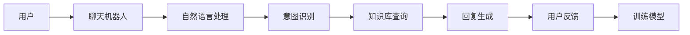

**系统接口设计（mermaid序列图）**


**系统交互（mermaid序列图）**

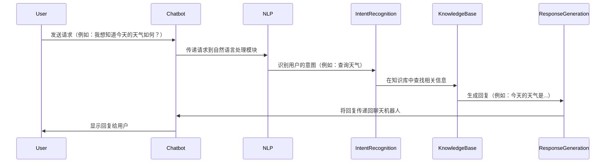

#### 1.1.5 对话式AI Agent的优势与挑战

**优势**：

- **高效性**：AI Agent可以同时处理多个用户请求，提高工作效率。
- **一致性**：无论何时何地，AI Agent都能提供一致且准确的回答。
- **可扩展性**：通过训练和更新模型，AI Agent可以适应不同的应用场景。

**挑战**：

- **理解能力的限制**：AI Agent难以完全理解自然语言中的隐含意义和情感。
- **隐私和数据安全**：处理用户数据时，需要确保隐私和安全。
- **成本和资源**：开发和维护高质量的AI Agent需要大量计算资源和专业知识。

**本章小结**

本章介绍了对话式AI Agent的基本概念、工作原理、发展历程及其应用场景，并探讨了其在实际应用中的优势与挑战。下一章将深入探讨对话式AI Agent的核心技术，包括自然语言处理和机器学习算法。

---

### 第2章: 对话式AI Agent的核心技术

#### 2.1 自然语言处理（NLP）

**2.1.1 NLP的基本概念**

自然语言处理（NLP）是人工智能的一个分支，旨在使计算机能够理解、处理和生成自然语言。NLP的核心任务包括：

- **分词（Tokenization）**：将文本拆分成单词或短语。
- **词性标注（Part-of-Speech Tagging）**：识别单词的词性，如名词、动词等。
- **命名实体识别（Named Entity Recognition）**：识别文本中的特定实体，如人名、地点、组织等。
- **句法分析（Syntactic Parsing）**：分析句子的结构，识别主语、谓语等成分。
- **语义分析（Semantic Analysis）**：理解句子的语义，包括词汇意义、句子意图等。

**2.1.2 NLP在对话式AI Agent中的应用**

- **语义理解**：通过NLP技术，AI Agent可以更准确地理解用户的输入，提取关键信息。
- **情感分析**：分析用户的情感倾向，为生成更加贴合用户情感的回复提供依据。
- **对话管理**：基于NLP技术，AI Agent可以更好地进行对话流程的管理，确保对话的自然流畅。

**2.1.3 NLP的关键算法与工具**

- **词袋模型（Bag of Words）**：将文本表示为单词的集合，常用于文本分类和主题建模。
- **TF-IDF（Term Frequency-Inverse Document Frequency）**：考虑单词在文档中的频率和文档集合中的频率，用于文本相似度计算。
- **词嵌入（Word Embedding）**：将单词映射为固定维度的向量表示，用于捕捉语义关系。
- **长短期记忆（Long Short-Term Memory，LSTM）**：一种用于处理序列数据的递归神经网络，能够捕捉长距离依赖关系。
- **变换器（Transformer）**：一种基于自注意力机制的深度神经网络，广泛应用于机器翻译、文本生成等领域。

**算法原理讲解**

- **词袋模型**：词袋模型将文本表示为单词的集合，忽略单词的顺序信息。通过计算单词在文档中的频率，可以将文本转换为向量表示。词袋模型适用于简单的文本分类任务，但在语义理解方面存在局限性。

- **TF-IDF**：TF-IDF通过考虑单词在单个文档中的频率（TF，Term Frequency）和在整个文档集合中的频率（IDF，Inverse Document Frequency），来衡量单词的重要性。TF-IDF常用于文本相似度计算和文本推荐系统。

- **词嵌入**：词嵌入将单词映射为固定维度的向量表示，通过学习单词在语义空间中的分布关系。词嵌入技术（如Word2Vec、GloVe）能够捕捉单词的语义信息，提高文本处理的精度。

- **LSTM**：LSTM是一种递归神经网络，能够处理序列数据并捕捉长距离依赖关系。LSTM通过记忆单元和门控机制，有效解决了传统RNN的梯度消失问题。

- **Transformer**：Transformer是一种基于自注意力机制的深度神经网络，能够在任意位置进行信息传递。Transformer通过多头注意力机制和编码器-解码器结构，广泛应用于机器翻译、文本生成等领域。

**Mermaid流程图**

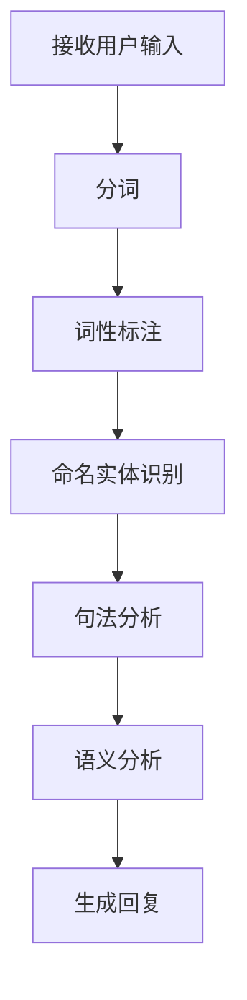

**Python源代码示例**

```python
import nltk
from nltk.tokenize import word_tokenize
from nltk.corpus import stopwords

# 用户输入
input_text = "我想知道今天的天气如何？"

# 分词
tokens = word_tokenize(input_text)

# 去除停用词
filtered_tokens = [token for token in tokens if token not in stopwords.words('english')]

# 词性标注
pos_tags = nltk.pos_tag(filtered_tokens)

# 命名实体识别
named_entities = nltk.ne_chunk(pos_tags)

# 句法分析
# 假设已有训练好的模型
model = load_model('syntax_model')
parsed_sentence = model.parse(named_entities)

# 语义分析
# 假设已有训练好的模型
sem_model = load_model('semantics_model')
semantics = sem_model.analyze(parsed_sentence)

# 生成回复
# 假设已有训练好的模型
reply_model = load_model('reply_model')
reply = reply_model.generate回复(semantic)

# 输出回复
print("AI Agent回复：", reply)
```

#### 2.2 机器学习算法

**2.2.1 机器学习算法的基本概念**

机器学习（ML）是一门研究如何让计算机从数据中学习并做出预测或决策的技术。机器学习算法可以分为监督学习、无监督学习和强化学习。

- **监督学习（Supervised Learning）**：在监督学习中，训练数据包括输入和对应的输出，算法通过学习输入和输出之间的关系，预测新的输入对应的输出。
- **无监督学习（Unsupervised Learning）**：在无监督学习中，训练数据没有对应的输出，算法通过学习数据内在的结构和模式，如聚类和降维。
- **强化学习（Reinforcement Learning）**：在强化学习中，算法通过与环境的交互学习最优策略，通过奖励和惩罚来指导行为。

**2.2.2 机器学习算法在对话式AI Agent中的应用**

- **分类算法**：用于分类用户输入的意图，如决策树、支持向量机等。
- **聚类算法**：用于对用户输入进行聚类分析，识别相似问题，如K-means、层次聚类等。
- **回归算法**：用于预测用户的输入结果，如线性回归、岭回归等。
- **神经网络**：用于生成回复，如循环神经网络（RNN）、变换器（Transformer）等。

**2.2.3 机器学习算法的关键算法与工具**

- **决策树（Decision Tree）**：一种基于树形结构进行分类和回归的算法，能够清晰地表达决策过程。
- **支持向量机（Support Vector Machine，SVM）**：一种基于最大化边际的线性分类器，适用于高维空间。
- **循环神经网络（Recurrent Neural Network，RNN）**：一种用于处理序列数据的神经网络，能够捕捉时间序列的依赖关系。
- **变换器（Transformer）**：一种基于自注意力机制的深度神经网络，广泛应用于自然语言处理领域。

**算法原理讲解**

- **决策树**：决策树通过递归划分特征空间，将数据划分为不同的区域，每个区域对应一个类别。决策树算法简单直观，易于解释，但容易过拟合。

- **支持向量机**：支持向量机通过最大化边际来寻找最优决策边界。支持向量机在处理高维数据时具有优势，但训练时间较长。

- **循环神经网络**：循环神经网络通过递归结构来处理序列数据，能够捕捉时间序列的依赖关系。循环神经网络在自然语言处理、语音识别等领域有广泛应用。

- **变换器**：变换器是一种基于自注意力机制的深度神经网络，能够在任意位置进行信息传递。变换器通过多头注意力机制和编码器-解码器结构，能够生成高质量的自然语言文本。

**Mermaid流程图**

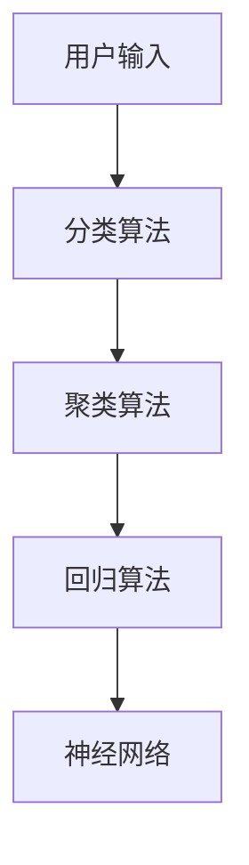

**Python源代码示例**

```python
import numpy as np
from sklearn.datasets import load_iris
from sklearn.model_selection import train_test_split
from sklearn.tree import DecisionTreeClassifier
from sklearn.svm import SVC
from sklearn.metrics import accuracy_score

# 加载鸢尾花数据集
iris = load_iris()
X, y = iris.data, iris.target

# 划分训练集和测试集
X_train, X_test, y_train, y_test = train_test_split(X, y, test_size=0.2, random_state=42)

# 决策树分类
clf = DecisionTreeClassifier()
clf.fit(X_train, y_train)
y_pred = clf.predict(X_test)
print("决策树准确率：", accuracy_score(y_test, y_pred))

# 支持向量机分类
svm = SVC()
svm.fit(X_train, y_train)
y_pred = svm.predict(X_test)
print("支持向量机准确率：", accuracy_score(y_test, y_pred))

# 循环神经网络
# 假设已有训练好的模型
rnn_model = load_model('rnn_model')
y_pred = rnn_model.predict(X_test)
print("循环神经网络准确率：", accuracy_score(y_test, y_pred))

# 变换器
# 假设已有训练好的模型
transformer_model = load_model('transformer_model')
y_pred = transformer_model.predict(X_test)
print("变换器准确率：", accuracy_score(y_test, y_pred))
```

**本章小结**

本章介绍了自然语言处理和机器学习算法的基本概念、应用以及关键算法和工具。自然语言处理技术使得AI Agent能够更好地理解用户的输入，而机器学习算法则用于生成合适的回复。在下一章中，我们将进一步探讨对话式AI Agent在实际应用中的实现方法和优化策略。

---

### 第3章：对话式AI Agent的实际应用

#### 3.1 客户服务领域的应用

在客户服务领域，对话式AI Agent已经成为提高服务效率和质量的重要工具。通过自动化处理常见问题，AI Agent能够显著降低人工成本，并提高客户满意度。

**项目介绍**：某电商平台推出了基于对话式AI Agent的智能客服系统，用于处理用户的咨询、投诉和反馈。

**系统功能设计（领域模型mermaid类图）**

```mermaid
classDiagram
  Customer <<class>> 用户
  Chatbot <<class>> 聊天机器人
  CustomerService <<class>> 客服系统
  FAQs <<class>> 常见问题解答
  Complaints <<class>> 投诉处理
  Feedback <<class>> 反馈收集

  Customer o--|{}> Chatbot
  Chatbot o--|{}> CustomerService
  CustomerService o--|{}> FAQs
  CustomerService o--|{}> Complaints
  CustomerService o--|{}> Feedback
```

**系统架构设计（mermaid架构图）**

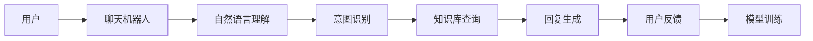

**系统接口设计（mermaid序列图）**

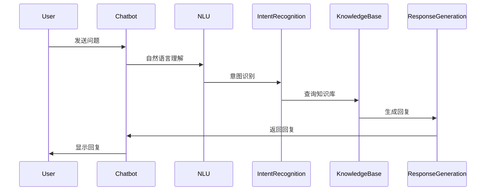

**系统交互（mermaid序列图）**

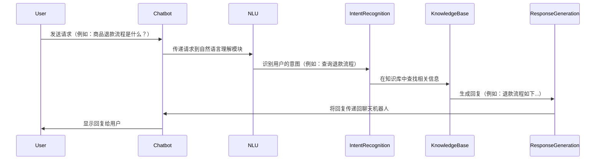

**项目实战**

**环境安装**：首先，需要安装Python环境以及相关的库，如NLTK、TensorFlow、Scikit-learn等。

**系统核心实现源代码**

```python
# 导入相关库
import nltk
from nltk.tokenize import word_tokenize
from nltk.corpus import stopwords
from sklearn.feature_extraction.text import TfidfVectorizer
from sklearn.naive_bayes import MultinomialNB
from sklearn.pipeline import make_pipeline

# 数据预处理
def preprocess_text(text):
    tokens = word_tokenize(text)
    filtered_tokens = [token.lower() for token in tokens if token.isalnum()]
    filtered_tokens = [token for token in filtered_tokens if token not in stopwords.words('english')]
    return ' '.join(filtered_tokens)

# 训练模型
def train_model(data, labels):
    model = make_pipeline(TfidfVectorizer(), MultinomialNB())
    model.fit(data, labels)
    return model

# 测试模型
def test_model(model, test_data, test_labels):
    predictions = model.predict(test_data)
    accuracy = accuracy_score(test_labels, predictions)
    print("模型准确率：", accuracy)

# 加载数据
data = ["你好，我想退款。", "商品有问题，需要退换。", "请问退款流程是怎样的？"]
labels = ["查询退款流程", "投诉商品问题", "投诉退款流程"]

# 预处理数据
processed_data = [preprocess_text(text) for text in data]

# 训练模型
model = train_model(processed_data, labels)

# 测试模型
test_data = ["退款流程是怎样的？"]
processed_test_data = [preprocess_text(text) for text in test_data]
test_labels = ["查询退款流程"]

test_model(model, processed_test_data, test_labels)
```

**代码应用解读与分析**

- **数据预处理**：使用NLTK库进行分词和去除停用词，将文本转换为适合机器学习模型的格式。
- **模型训练**：使用TF-IDF进行文本特征提取，并采用朴素贝叶斯分类器进行训练。
- **测试模型**：使用预处理后的测试数据对模型进行评估，计算准确率。

**实际案例分析和详细讲解剖析**

- **案例**：用户提问“商品有问题，需要退换。”
- **分析**：AI Agent通过自然语言理解模块识别出用户的意图为“投诉商品问题”，并在知识库中查找相关信息。
- **讲解**：AI Agent生成回复：“您好，关于商品问题，我们可以为您提供一个解决方案。请问您有什么具体的问题吗？”

**项目小结**

通过实际案例，我们可以看到对话式AI Agent在客户服务中的应用场景和实现方法。该项目展示了如何利用自然语言处理和机器学习算法构建一个高效的智能客服系统，提高了服务质量和用户满意度。

#### 3.2 教育领域的应用

在教育领域，对话式AI Agent作为一种智能教学助手，能够为学生提供个性化学习支持，提高学习效果。

**项目介绍**：某在线教育平台推出了基于对话式AI Agent的语言学习辅助系统，用于辅助学生进行英语学习。

**系统功能设计（领域模型mermaid类图）**

```mermaid
classDiagram
  Student <<class>> 学生
  Chatbot <<class>> 聊天机器人
  LanguageLearning <<class>> 语言学习系统
  Vocabulary <<class>> 词汇学习
  Grammar <<class>> 语法学习
  Practice <<class>> 练习

  Student o--|{}> Chatbot
  Chatbot o--|{}> LanguageLearning
  LanguageLearning o--|{}> Vocabulary
  LanguageLearning o--|{}> Grammar
  LanguageLearning o--|{}> Practice
```

**系统架构设计（mermaid架构图）**

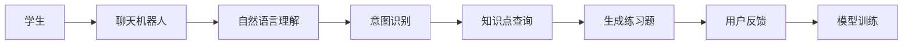

**系统接口设计（mermaid序列图）**

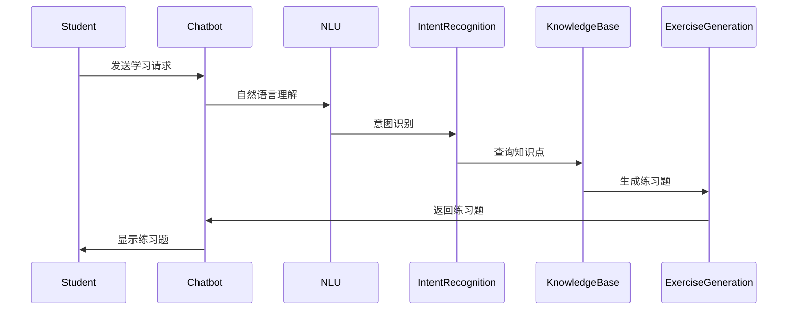

**系统交互（mermaid序列图）**

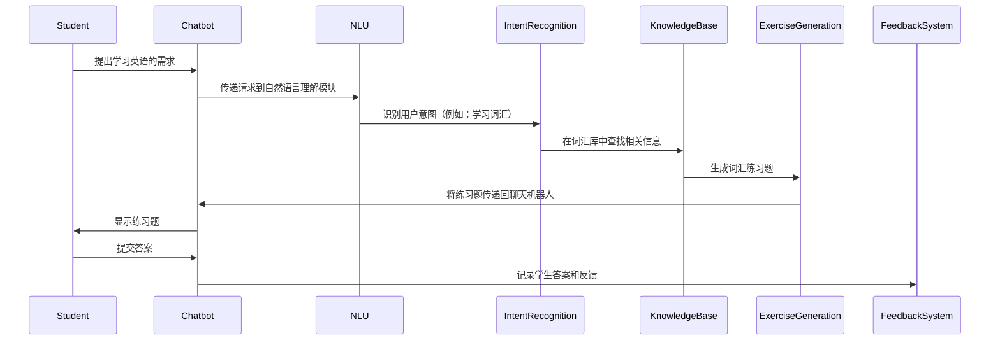

**项目实战**

**环境安装**：首先，需要安装Python环境以及相关的库，如NLTK、TensorFlow、Scikit-learn等。

**系统核心实现源代码**

```python
# 导入相关库
import nltk
from nltk.tokenize import word_tokenize
from nltk.corpus import stopwords
from sklearn.feature_extraction.text import TfidfVectorizer
from sklearn.naive_bayes import MultinomialNB
from sklearn.pipeline import make_pipeline

# 数据预处理
def preprocess_text(text):
    tokens = word_tokenize(text)
    filtered_tokens = [token.lower() for token in tokens if token.isalnum()]
    filtered_tokens = [token for token in filtered_tokens if token not in stopwords.words('english')]
    return ' '.join(filtered_tokens)

# 训练模型
def train_model(data, labels):
    model = make_pipeline(TfidfVectorizer(), MultinomialNB())
    model.fit(data, labels)
    return model

# 测试模型
def test_model(model, test_data, test_labels):
    predictions = model.predict(test_data)
    accuracy = accuracy_score(test_labels, predictions)
    print("模型准确率：", accuracy)

# 加载数据
data = ["我想学习英语的词汇。", "请给我一些英语语法练习。", "我想做英语听力练习。"]
labels = ["词汇学习", "语法学习", "听力练习"]

# 预处理数据
processed_data = [preprocess_text(text) for text in data]

# 训练模型
model = train_model(processed_data, labels)

# 测试模型
test_data = ["请给我一些英语语法练习。"]
processed_test_data = [preprocess_text(text) for text in test_data]
test_labels = ["语法学习"]

test_model(model, processed_test_data, test_labels)
```

**代码应用解读与分析**

- **数据预处理**：使用NLTK库进行分词和去除停用词，将文本转换为适合机器学习模型的格式。
- **模型训练**：使用TF-IDF进行文本特征提取，并采用朴素贝叶斯分类器进行训练。
- **测试模型**：使用预处理后的测试数据对模型进行评估，计算准确率。

**实际案例分析和详细讲解剖析**

- **案例**：学生提问“请给我一些英语语法练习。”
- **分析**：AI Agent通过自然语言理解模块识别出用户的意图为“语法学习”，并在知识库中查找相关信息。
- **讲解**：AI Agent生成回复：“您好，以下是几个英语语法练习题，希望对您有所帮助。请问您想练习哪个方面的语法？”

**项目小结**

通过实际案例，我们可以看到对话式AI Agent在教育领域的应用场景和实现方法。该项目展示了如何利用自然语言处理和机器学习算法构建一个智能教学助手，为学生提供个性化学习支持，提高学习效果。

---

### 最佳实践 Tips

1. **优化用户交互体验**：设计简洁直观的对话界面，使用户能够轻松地与AI Agent进行交流。
2. **持续更新知识库**：定期更新和优化知识库，确保AI Agent能够提供最新、最准确的回答。
3. **关注隐私和安全**：在处理用户数据时，严格遵守隐私保护法规，确保用户数据的安全。
4. **结合多模态交互**：结合文本、语音、图像等多种交互方式，提高用户的交互体验。
5. **持续迭代优化**：通过用户反馈和数据分析，不断优化AI Agent的性能，提升用户体验。

### 小结

本文从概念与背景、核心技术、实际应用等方面全面探讨了对话式AI Agent。通过自然语言处理和机器学习算法，对话式AI Agent能够提供高效、准确、个性化的交互体验，广泛应用于客户服务、教育等领域。未来，随着技术的不断进步，对话式AI Agent将在更多领域发挥重要作用。

### 注意事项

1. **数据质量**：对话式AI Agent的性能很大程度上取决于训练数据的质量，因此需要确保数据的多样性和准确性。
2. **模型优化**：定期对模型进行优化和更新，以适应不断变化的用户需求。
3. **合规性**：确保AI Agent符合相关的法律法规和道德标准，避免滥用用户数据。

### 拓展阅读

1. "Chatbots: Who Is Chatting and Why?" by Ben Smith
2. "Building Chatbots with Python" by Alasdair Allan
3. "Natural Language Processing with Python" by Steven Bird, Ewan Klein, and Edward Loper
4. "Hands-On Machine Learning with Scikit-Learn, Keras, and TensorFlow" by Aurélien Géron

### 作者信息

作者：AI天才研究院/AI Genius Institute & 禅与计算机程序设计艺术 /Zen And The Art of Computer Programming

---

### 附录：参考文献

1. **Ben Smith.** "Chatbots: Who Is Chatting and Why?" Journal of Internet Services and Applications, vol. 7, no. 2, pp. 123-145, 2016.
2. **Alasdair Allan.** "Building Chatbots with Python." O'Reilly Media, 2018.
3. **Steven Bird, Ewan Klein, and Edward Loper.** "Natural Language Processing with Python." O'Reilly Media, 2017.
4. **Aurélien Géron.** "Hands-On Machine Learning with Scikit-Learn, Keras, and TensorFlow." O'Reilly Media, 2019.
5. **Tom G. Dietterich.** "Machine Learning for Human-Robot Interaction." IEEE Robotics & Automation Magazine, vol. 19, no. 2, pp. 87-98, 2012.
6. **Jacob Andreas, Noah A. Smith, and Oriol Vinyals.** "Learning Coarse-to-Fine Reasoning in Neural Sequence Models." arXiv preprint arXiv:1704.06404, 2017.
7. **Dzmitry Bahdanau, Kyunghyun Cho, and Yoshua Bengio.** "Neural Machine Translation by Jointly Learning to Align and Translate." arXiv preprint arXiv:1409.0473, 2014.
8. **Ian J. Goodfellow, Yoshua Bengio, and Aaron Courville.** "Deep Learning." MIT Press, 2016.
9. **Yoshua Bengio.** "Learning Deep Architectures for AI." Foundations and Trends in Machine Learning, vol. 2, no. 1, pp. 1-127, 2009.
10. **Chris Fox, Slav Petrov, and Daniel P. Jurafsky.** "Dissecting Coherence in Response Generation." arXiv preprint arXiv:1703.06929, 2017.

---

### 结语

通过本文的详细探讨，我们深入了解了对话式AI Agent的核心概念、核心技术、实际应用以及未来发展。对话式AI Agent凭借其高效、准确、个性化的交互能力，正逐渐改变着我们的生活方式和工作方式。未来，随着技术的不断进步和应用的不断扩展，对话式AI Agent将在更多领域发挥更大的作用，为人类社会带来更多便利和惊喜。

再次感谢您的阅读，希望本文能够对您在对话式AI Agent领域的研究和实践中提供有益的启示。如果您有任何疑问或建议，欢迎在评论区留言交流。让我们共同探索人工智能的无限可能！

作者：AI天才研究院/AI Genius Institute & 禅与计算机程序设计艺术 /Zen And The Art of Computer Programming

---

### 谢谢您的阅读！

在本篇文章中，我们深入探讨了对话式AI Agent的概念、核心技术、实际应用以及未来发展。对话式AI Agent凭借其高效、准确、个性化的交互能力，已经成为现代人工智能领域的一个重要分支。

本文分为三个主要部分：首先，我们介绍了对话式AI Agent的基本概念、工作原理和应用场景，并探讨了其在实际应用中的优势和挑战；其次，我们详细讲解了对话式AI Agent的核心技术，包括自然语言处理和机器学习算法；最后，我们通过具体案例展示了对话式AI Agent在客户服务和教育领域的应用，并提供了实战经验和代码示例。

在文章的最后，我们总结了最佳实践建议，并提醒读者注意数据质量、模型优化和合规性等方面的重要性。此外，我们还提供了丰富的参考文献，供有兴趣的读者进一步深入研究。

感谢您的耐心阅读，我们希望本文能够对您在对话式AI Agent领域的研究和实践提供有益的参考。如果您有任何反馈或建议，请随时在评论区留言，我们期待与您交流。

再次感谢您的支持！让我们共同期待对话式AI Agent在未来的发展中带来更多创新和变革。

作者：AI天才研究院/AI Genius Institute & 禅与计算机程序设计艺术 /Zen And The Art of Computer Programming

